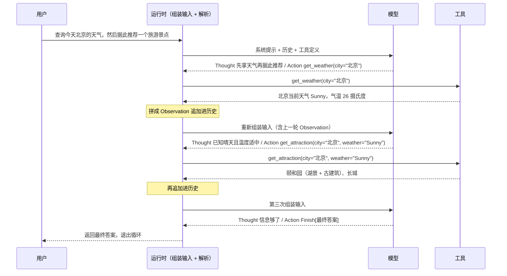

---
tags:
  - AI/agent
---

# Agent Loop

智能体通过一个持续的循环与环境交互，而不是一次性完成任务。这个机制叫 **Agent Loop（智能体循环）**。

## 循环结构

```
感知（Perception）
   ↓
思考（Thought）
   ├── 规划（Planning）
   └── 工具选择（Tool Selection）
   ↓
行动（Action）→ 环境状态变化 → 新的观察（Observation）
   ↑                                    │
   └────────────────────────────────────┘
```

**思考**阶段内部再分两步，这是 LLM 智能体与传统智能体在结构上的分界：`Planning` 基于当前观察和内部记忆更新对任务的理解、制定或调整计划、把复杂目标分解为子任务；`Tool Selection` 从工具库中选出执行下一步所需的工具并确定调用参数。

行动通过执行器施加到环境，环境产生**新的观察**回流，构成闭环。

## 每一轮都在重新组装输入

这一点决定了后面所有失败模式的成因：

```
每一轮都在重新组装输入

   ┌─────────────────────────────────────────┐
   │ 系统提示                                 │
   │ 相关历史（含之前每一轮的 Thought/Obs）     │
   │ 检索到的记忆                             │
   │ 工具定义                                 │
   └────────────────────┬────────────────────┘
                        │ 拼成一条新的 messages
                        ▼
                 发一次模型请求
                        │
        ┌───────────────┴───────────────┐
        ▼                               ▼
   「答案」                        「一个动作」
   （纯文本、无工具调用）            （工具名 + 参数）
        │                               │
        ▼                               ▼
   退出循环                     执行动作，把结果追加进上下文
                                        │
                                        └──────▶ 回到组装输入

模型内部没有任何东西跨轮持久化：每一轮都是一次全新的模型请求，
所有连续性都来自运行时选择往上下文里放回去的东西。
```

**模型内部没有任何东西跨轮持久化。** 每一轮都是一次全新的模型请求，所有连续性都来自**运行时选择往上下文里放回去的东西**。所以「智能体记得上一步做过什么」这件事，本质上是运行时把历史重新喂了一遍。

对照 [[01-智能体核心概念]] 的环境分类：正因为环境是**序贯**的，「上一轮的结果」必须显式带进下一轮，循环才有意义。

## 交互协议：Thought-Action-Observation

LLM 驱动这个循环的前提，是把它的输出结构化成固定字段。`Thought` 与 `Action` 成对出现：

```
Thought: 用户想知道北京的天气。我需要调用天气查询工具。
Action: get_weather("北京")
```

`Action` 是对外部的指令，由外部**解析器（Parser）**捕获后调用对应函数。函数返回的原始数据（JSON）含冗余信息、格式也不适合模型消费，所以感知系统要把原始输出封装成简洁的自然语言：

```
Observation: 北京当前天气为晴，气温25摄氏度，微风。
```

这段文本作为下一轮循环的主要输入。

## 实现要点

**协议靠 prompt 约束，不靠模型自觉。** `system_prompt` 里必须显式规定：工具清单与签名、输出必须是一对 Thought/Action、Action 必须单行不换行、信息够了必须用 `Finish[最终答案]` 收尾。

**必须截断多余输出。** 模型经常一次吐出多组 Thought-Action。原书用这条正则只保留第一组：

```python
r'(Thought:.*?Action:.*?)(?=\n\s*(?:Thought:|Action:|Observation:)|\Z)'
```

**Action 靠正则解析成工具调用。** 工具名从 `工具名(` 提取，参数用 `(\w+)="([^"]*)"` 抓成 kwargs，再从工具字典分发：

```python
tool_name = re.search(r"(\w+)\(", action_str).group(1)
args_str  = re.search(r"\((.*)\)", action_str).group(1)
kwargs    = dict(re.findall(r'(\w+)="([^"]*)"', args_str))

observation = available_tools[tool_name](**kwargs)
```

这套「prompt 约束格式 → 正则解析 → 字典分发」，就是 LangChain、LlamaIndex 这类框架早期的设计内核。更可靠的做法是 `Function Calling`——由模型原生输出结构化调用，不再依赖正则去猜（见 [[09-工具系统与 Function Calling]]）。

**解析失败要变成观察，而不是崩溃。** 拿不到 Action 时，把错误信息（「未能解析到 Action 字段，请确保回复严格遵循 Thought: ... Action: ... 格式」）作为一条 Observation 塞回历史，让模型在下一轮自行修正——**错误信息本身也是循环的输入**。

**循环必须有上限。** 原书示例设为 5 次。没有上限，智能体可能反复调用同一个工具，或者一直思考而不收敛。下面单独说这件事。

## 循环怎么停

原书只用了 `max_steps` 加 `Finish` 两个机制，生产环境需要三类停止条件同时具备。

### 正常收敛

模型返回一个**纯文本回复且不含工具调用**——运行时据此退出循环，把这个回复作为答案返回。这是最常见的正常出口。

### 硬上限（三道，各抓不同的失败模式）

| 上限 | 抓什么 | 建议取值 |
| --- | --- | --- |
| **最大迭代数** | 死循环 | 简单问答型 10；研究型 25；编码型 50–100 |
| **Token 预算** | 昂贵循环（轮数少但每次带巨量上下文）| 平均成功运行的 **10 倍**（典型任务 5k tokens → 预算 50k）|
| **墙钟超时** | 卡住的工具调用（网络挂起）| p95 任务完成时间的 **2–3 倍** |

**三道缺一不可，因为它们各自漏掉一类：**

- 只设迭代数：一个每轮都读 5 万 token 文件的 agent，3 轮就爆预算，但迭代数 25 拦不住它
- 只设 token 预算：一个做 100 次小快调用的 agent 永远碰不到预算，但迭代数能拦
- 只设超时：一个单次工具调用挂几分钟的场景，只有超时能拦

**取值原则**：宽松到正常任务永远碰不到，紧到失控能在**几秒内**而不是几分钟内被抓住。如果最难的任务需要 15 轮，把上限设到 25；一旦跑到 25 轮，说明已经出问题了，继续跑不会修复它。这个上限不是性能优化，是**安全机制**。

命中上限时**要优雅降级，而不是抛错**：把已完成的进度总结一下返回。研究 agent 找到 10 篇里的 7 篇，比返回「Error: iteration limit exceeded」有用得多。

```python
if iteration >= MAX_ITERATIONS:
    summary = summarize_progress(messages)
    return f"I reached my iteration limit. Here is what I found so far: {summary}"
```

还要**记录是哪一道上限被触发的**——这个数据能区分「该调上限」还是「有底层问题要修」。

三道硬上限各自拦住的形态不同。

```
迭代数上限（抓死循环）
   轮数   ▓▓▓▓▓▓▓▓▓▓▓▓▓▓▓▓▓▓▓▓▓▓▓▓▓▓│ 25 轮处被拦
                                    └─ 每轮开销很小的 agent 也会碰到它

Token 预算（抓昂贵循环：轮数少但每次带巨量上下文）
   Token  ▓▓▓│                             平均成功运行的 10 倍处被拦
        └─ 每轮读 5 万 token 的 agent，轮数远没到 25，预算已经爆了
        └─ 反过来：100 次小快调用永远碰不到预算，要靠迭代数拦

墙钟超时（抓卡住的工具调用）
   时间   ──────────────────────────────│ p95 × 2–3 处被拦
                                        └─ 一个工具调用挂几分钟，
                                           前两道都拦不住（轮数与 token 都没超）

取值原则：宽松到正常任务永远碰不到，紧到失控能在几秒内、而不是几分钟内被抓住。
         最难的任务需要 15 轮就把上限设到 25；跑到 25 轮说明已经出问题了，
         继续跑不会修复它。这不是性能优化，是安全机制。

命中之后要优雅降级：把已完成的进度总结一下返回 ——
找到 10 篇里的 7 篇，比返回 「Error: iteration limit exceeded」有用得多。
同时记录是哪一道上限被触发，这个数据能区分「该调上限」还是「有底层问题要修」。
```

### 外部信号

**人工审批检查点**：碰到破坏性操作（删文件、改配置、发邮件、动数据库、计费）时暂停等确认。

**错误阈值**：连续失败达到一定次数就直接放弃。这条针对的是「工具一直报错、模型不知道怎么解」的情形。

**重复动作检测**：连续若干轮出现**相同动作得到相同观察**时中止并换方向。有些实现用更激进的判据——同一工具、同一参数被反复调用就直接断。

## 五个失败模式

循环在概念上简单，在生产里意外地难。下面这些是大多数实现会踩的：

| 失败模式 | 表现 | 护栏 |
| --- | --- | --- |
| **无限循环** | 模型反复用同一组参数调同一个工具，因为工具一直返回它不知道怎么处理的错误 | 硬性迭代上限 + 检测连续相同的工具调用提前中断 |
| **上下文爆炸** | 每轮都追加 token，20 轮啰嗦的工具结果之后窗口填满，模型丢掉前面的步骤 | 摘要或截断旧工具结果；用滑动窗口或外部记忆 |
| **过早退出** | 模型在第 1 轮之后就给出语气自信的最终答案，跳过了验证步骤 | 系统提示里写明「回答前必须再用一次工具调用验证」 |
| **幻觉工具调用** | 编出不存在的工具名，或参数形状不对，导致运行时错误 | 执行前按 schema 校验参数；返回**结构化**错误让模型能自纠 |
| **成本静默爆炸** | 预计 3 轮的任务跑了 30 轮，烧掉 10 倍预算 | 记录每会话的轮数与 token 消耗；迭代上限之外再加成本预算 |

**「幻觉工具调用」这一条值得强调**：模型的错误在于把「记不清的接口」当成「记得的接口」写出来，而不是内容本身出错（参见 [[07-模型幻觉]]）。护栏的关键是**返回结构化错误**而不是抛异常——错误信息进上下文，模型下一轮才有机会改对。

## 上下文的增长与错误累积

### 增长的量级

每轮的 Thought + Action + Observation 是一个三元组。**每个三元组平均约 200 tokens**，十轮下来约 2000 tokens；再叠加系统提示与工具定义，总量就会逼近甚至超过窗口上限，导致 **mid-session forgetting（会话中途遗忘）**。

即使没到硬上限，性能也已经在退化：**长上下文会让每次调用更慢，而且模型会丢失埋在长对话中间的信息——这就是 `lost in the middle` 效应。** 一个 100K tokens 的上下文如果 90% 是早期轮次的工具结果，模型在为它已经不需要的信息支付注意力成本。

### 三种处理策略

| 策略 | 做法 | 风险 |
| --- | --- | --- |
| **截断** | 超过阈值就丢掉最老的消息 | 简单有效，但会忘掉仍然相关的早期工具结果 |
| **摘要**（摘要压缩）| 定期让模型总结到目前为止的对话，用摘要替换完整历史 | 能把 10k tokens 压到 500，但摘要可能丢关键细节 |
| **滑动窗口** | 保留系统提示 + 最前 N 条 + 最后 M 条，丢掉中间 | 保住原始任务与最近上下文，总长度可控 |

这三种都指向同一件事：**循环的第 N 轮不是免费的**。这也是 [[19-上下文工程的工程实践]] 里 Compaction 那套机制的动机来源——长时程任务的三种手段（压缩整合 / 结构化笔记 / 子代理架构）正是为这个增长问题准备的。

还有一条分阶段策略：**规划阶段给全量上下文，执行每个步骤时切到短上下文。**

三种处理策略作用在同一条消息序列上，各自丢掉的部分不同。

```
原始序列（系统提示 + 逐轮累积的三元组）
[SYS][T1][T2][T3][T4][T5][T6][T7][T8][T9][T10][T11][T12]
      └─ 每个三元组（Thought + Action + Observation）平均约 200 tokens
         十轮约 2000 tokens，再叠加系统提示与工具定义就逼近窗口上限

截断：超过阈值就丢掉最老的消息
[SYS][                    ][T9][T10][T11][T12]
      └─ 简单有效，但丢掉的早期工具结果可能仍然相关

摘要：定期让模型总结到目前为止的对话，用摘要替换完整历史
[SYS][ 摘要 ≈ 500 token                   ][T11][T12]
      └─ 能把 10k tokens 压到 500，代价是摘要可能丢掉关键细节

滑动窗口：保留系统提示 + 最前 N 条 + 最后 M 条
[SYS][T1][T2][                               ][T11][T12]
      └─ 保住原始任务与最近上下文，总长度可控，中间整段丢弃

三者指向同一件事：循环的第 N 轮不是免费的。
```

### 错误累积的算术

单次模型调用的错误率哪怕只有几个百分点，多轮之后也会被放大。有文章给出 LLM 幻觉率在 **5%–15%** 区间的说法——按这个量级估算，**十轮循环的累积错误概率就接近 100%**，所以每轮的验证机制不是锦上添花。

> [!warning] 「5%–15%」这个区间来自技术博客，未追到原始出处与测量条件（不同任务、不同模型的差异会很大）。标为待验证。它的用途是提示**量级**，不要当作精确指标引用。

**结论的方向是确定的**：光靠更强的一次性推理解决不了长任务，靠的是循环设计本身的韧性——把不可靠的单次调用放进一个有护栏、有验证、有状态管理的循环里。

## 一个完整的三轮执行

输入：「查询今天北京的天气，然后根据天气推荐一个旅游景点」

| 轮次 | Thought 要点 | Action | Observation |
| --- | --- | --- | --- |
| 1 | 先拿天气，再据此推荐景点 | `get_weather(city="北京")` | 北京当前天气：Sunny，气温 26 摄氏度 |
| 2 | 已知晴天且温度适中，据此筛选 | `get_attraction(city="北京", weather="Sunny")` | 颐和园（湖景 + 古建筑）、长城 |
| 3 | 信息够了，可以作答 | `Finish[最终答案]` | 任务完成 |

这条链路演示了四件事：任务分解、工具调用、上下文理解、结果合成。

三轮执行连起来看，循环里每一轮的输入都是重新拼出来的。



这条链路演示了四件事：任务分解、工具调用、上下文理解、结果合成。

## 相关

- [[01-智能体核心概念]] —— 任务环境的四个特性决定了循环必须长这样（部分可观察要求记忆，序贯性要求把上一步结果带进下一轮）
- [[19-上下文工程的工程实践]] —— 循环导致的上下文增长，及其三种解法
- [[09-工具系统与 Function Calling]] —— 工具调用从正则解析换成原生函数调用
- [[22-Rule 与 LLM 的边界|Rule 与 LLM 的边界]] —— 循环内部的判断哪些该交给规则

## 参考

- 《Hello-Agents》第一章 §1.2.2、§1.2.3、§1.3
- https://codemia.io/courses/introduction_to_agentic_ai/the_agent_loop_in_practice 、http://ai-tldr.dev/learn/ai-agents/agent-fundamentals/agent-loop-explained 、https://sistava.com/en/glossary/agent-loop 、https://www.mindstudio.ai/blog/what-is-an-agentic-loop-ai-coding-agents
- https://www.besthub.dev/articles/why-agent-loops-matter-more-than-raw-model-power-ce20f7a83de8
