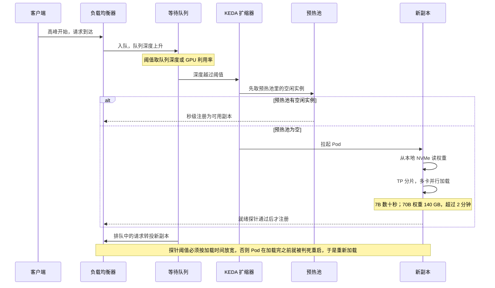

---
tags:
  - AI/infra/推理引擎
  - AI/infra/部署
---

# 服务部署架构：集群、路由与运维

单个推理实例怎么跑，在 [[06-vLLM 部署、参数与服务特性]]；引擎之间的取舍也在那一篇。这一篇收的是**一个实例之外的那一层** —— 请求怎么进来、怎么分到多个副本、多张卡怎么摆、集群怎么伸缩、出问题按什么顺序查。

性能指标的定义与瓶颈定位在 [[01-推理性能指标与瓶颈定位]]，调度与缓存的引擎机制在 [[03-推理调度：Continuous Batching 与 Chunked Prefill]] 与 [[04-前缀缓存：APC 与 RadixAttention]]。

## LLM 服务为什么不是「Web 服务加个模型」

传统模型服务（图像分类、推荐排序）是**一次性**的：一次前向、毫秒级返回、显存占用固定。LLM 服务在四个方面都不同：

| 差异 | 后果 |
| --- | --- |
| **自回归生成长请求** | 一次请求持续数秒到数十秒，GPU 在该请求存续期间一直被占 —— 资源占用的时间尺度完全不同 |
| **KV Cache 随请求动态增长** | 显存占用是运行时的动态量，不能按静态峰值配（[[02-PagedAttention：KV Cache 的分页管理]]） |
| **请求长度高度异质** | 输入 10 token / 输出 500 token 与输入 2000 / 输出 20 都常见，批处理与排队策略必须能容纳这种方差 |
| **流式输出** | 用户要逐字看到结果，需要 SSE 或 WebSocket；反过来这也意味着「总延迟」得拆成两段看：TTFT 加 TPOT（[[01-推理性能指标与瓶颈定位]]） |

**这四条决定了架构重心**：请求时长的方差极大，所以负载均衡不能按连接数平均分；显存是动态的，所以容量规划要靠压测而非公式；延迟是两段式的，所以排队策略要能区分 Prefill 与 Decode。

## 典型四层架构

```
客户端  Web / App / API
   │
   ▼
API Gateway      认证 · 限流 · 按模型名路由 · 请求响应日志
   │
   ▼
负载均衡器       最少连接 / 前缀感知 / 一致性哈希
   │
   ├────────────────┬────────────────┐
   ▼                ▼                ▼
推理节点 1        推理节点 2        推理节点 N
每节点一个引擎实例（vLLM 等），节点内可做 TP 分片
   │                │                │
   └────────────────┴────────────────┘
                    │
                    ▼
监控系统          Prometheus + Grafana
                  延迟 / 吞吐 / 队列 / 显存
```

**负载均衡是四层里最容易被做错的一层。** LLM 请求的处理时长差异巨大（Decode 阶段可能比 Prefill 长几十倍），**「轮询」会把新请求均匀甩给负载不同的副本** —— 应该用**最少连接**或**最少在飞 token 数**这类能反映实际负载的策略。

**还能更进一步：前缀感知路由。** 把命中同一 System Prompt 的请求导向同一副本，提高前缀缓存命中率。这一条是 [[04-前缀缓存：APC 与 RadixAttention]] 在集群层的延伸 —— **命中率不只取决于引擎，还取决于路由器把请求送到了哪。** 代价是路由表要跟着副本的缓存状态走，副本重启后缓存失效需要感知。

## 路由策略：多模型服务

同时提供 7B 与 70B 时（或不同能力的模型池），三种路由方式：

| 策略 | 做法 | 代价 |
| --- | --- | --- |
| 按模型名 | 客户端在请求里指定 | 最简单；把复杂度判断推给了客户端 |
| 按请求复杂度 | 轻量分类器先判复杂度，简单请求走小模型 | 需要分类器，误判会掉质量 |
| **级联（Cascade）** | 先让小模型答，置信度低再转大模型 | 平均成本最低；置信度估计本身是难题 |

**级联是「投机解码」在服务层的对应物** —— 用便宜的路走一遍，只在不确定时才付贵的代价（[[09-Speculative Decoding]]）。区别是投机解码有等价性保证，级联没有：小模型答错的题如果它自己很有信心，就直接漏过去了。

同一个入口下同时提供多种能力时，路由要回答两个独立的问题：用哪个模型，以及送到哪个副本。

```
一个请求进来，要回答两个独立的问题：用哪个模型，送到哪个副本

问题一：用哪个模型
├─ 客户端已经指定了模型名 ──▶ 按名路由
│      最简单，把「该用哪个模型」的判断推给了客户端
├─ 客户端只说要做这件事
│   ├─ 有轻量分类器判复杂度
│   │      ├─ 判为简单 ──▶ 小模型（误判就直接掉质量）
│   │      └─ 判为复杂 ──▶ 大模型
│   └─ 用级联（Cascade）
│          ├─ 小模型先答 ──▶ 置信度够高 ──▶ 返回（付便宜的代价）
│          └─ 置信度低 ────▶ 转大模型重答（付贵的代价）
│                 与投机解码的差别在等价性：级联没有保证，小模型答错
│                 而自己很有信心时就直接漏过去了
问题二：送到哪个副本
├─ 最少连接 / 最少在飞 token ──▶ 避免把新请求甩给负载已经很高的副本
└─ 前缀感知 ──▶ 命中同一 System Prompt 的请求导向同一副本
       代价：路由表要跟着副本的缓存状态走，副本重启后需要重新感知
```

## 弹性伸缩与冷启动

负载有明显潮汐（工作日白天高峰、夜间低谷），按峰值常驻 GPU 是最大的浪费来源。

Kubernetes 下可以用 **KEDA** 按请求队列长度或 GPU 利用率做事件驱动扩缩 —— 注意**扩缩容信号应该用队列深度而不是 QPS**：QPS 是结果，队列深度才是「压不住」的直接征兆。

**冷启动是这套方案的主要障碍**：

| 模型规模 | 权重体积（BF16） | 加载时间 |
| --- | --- | --- |
| 7B | 14 GB | 数十秒 |
| 70B | 140 GB | **> 2 分钟**（受存储带宽限制） |

三个缓解手段：

1. **预热池** —— 常驻少量空闲实例，用冗余换响应速度
2. **权重本地缓存** —— 放在本地 NVMe 而不是每次从对象存储拉
3. **分片并行加载** —— 用张量并行让多卡同时读各自的切片

> [!warning] K8s 探针要放宽，否则 Pod 活不到加载完
> 模型加载几分钟，默认的 readness/liveness 探针阈值会把 Pod 判死并重启 —— 重启后又要重新加载，进入死循环。**探针的 `initialDelaySeconds` / `failureThreshold` 必须按模型加载时间设置**，这也是 [[06-vLLM 部署、参数与服务特性]] 里那条运维经验的集群版本。

把冷启动接到弹性伸缩上，得到的是这样一条时序。**注意扩缩容信号取队列深度，不取 QPS** —— QPS 是结果，队列深度才是「压不住」的直接征兆。



## 多 GPU 与多节点

### 单机内张量并行

模型单卡放不下时用 TP 切到同节点的多张卡上（[[08-张量并行与序列并行]]）：

```bash
vllm serve meta-llama/Llama-2-70b-chat-hf \
    --tensor-parallel-size 4 \
    --max-model-len 4096 \
    --gpu-memory-utilization 0.9
```

**TP 度数取 2 的幂（2/4/8），且尽量落在同一节点内** —— 因为 TP 每层都要 AllReduce，节点内 NVLink 与跨节点 InfiniBand 的延迟差着量级（[[03-集合通信与 NCCL]]）。

### 多实例优于跨节点模型并行

有多台服务器时，**每台跑独立实例 + 负载均衡**比跨节点做模型并行更好：

| 部署模式 | GPU 配置 | 承载模型 | 并发能力 |
| --- | --- | --- | --- |
| 单卡 | 1× A100/H100 | 7B (BF16) 或 70B (INT4) | 低 |
| 节点内 TP | 2–8× GPU（NVLink） | 13B–70B (BF16) | 中 |
| 多实例 + 负载均衡 | N 台 × M 卡 | 任意 | 高，近线性扩展 |

**理由是通信延迟的绝对量级**：跨节点 MP 每一步都要走网络，而多实例方案里节点之间只在负载均衡层交互（无同步依赖）。**把并行限制在节点内，是推理侧与训练侧的一个明确分野** —— 训练可以用跨节点 PP/DP，推理的实时性约束不允许。

### 混合部署：一张卡上放多个模型

- **同一基座 + 多个 LoRA** —— vLLM 的 Multi-LoRA 支持在同一实例里热加载并逐请求切换适配器（[[16-参数高效微调：LoRA、QLoRA 与 Adapter]] 给出的正是这条服务侧价值）。比部署 N 个完整实例省得极多
- **完全不同的模型** —— 靠 **MIG**（硬件分区，隔离强）或 **Time-Slicing**（时间片轮转，隔离弱但切分方式更自由）在物理 GPU 上切虚拟实例

## Triton Inference Server 的位置

Triton 不是推理引擎，是**模型服务框架** —— 它管请求、版本、多模型与指标，不自己做 GPU kernel。

| 能力 | 说明 |
| --- | --- |
| 多后端 | TensorRT、ONNX Runtime、PyTorch、vLLM、Python 自定义 |
| 动态 Batching | 自动合并请求为一个 batch |
| Model Repository | 文件系统上的模型版本管理，支持热更新 |
| **Ensemble** | 把多个模型串成流水线（如 Tokenizer → LLM → Detokenizer） |
| 指标暴露 | 原生 Prometheus |

**LLM 场景下的典型组合是 Triton + TensorRT-LLM**：TensorRT-LLM 负责引擎内的计算，Triton 负责引擎外的请求管理、版本控制与多模型编排。选它的理由是**已经在用 TensorRT-LLM 且需要统一的模型管理面**；如果只用 vLLM，vLLM 自带的 OpenAI 兼容服务通常就够了。

## 监控与告警

### 指标与阈值

| 类别 | 指标 | 告警示例 |
| --- | --- | --- |
| 延迟 | P50/P95/P99 TTFT、TPOT | P99 TTFT > 2 s |
| 吞吐 | tokens/s（分输入/输出）、requests/s | 吞吐下降 > 30% |
| 队列 | 等待队列深度、排队时间 | 队列深度 > 100 |
| GPU | 利用率、显存占用、温度 | 利用率 < 30% 或 > 95% |
| 错误 | 超时率、OOM 率、5xx 率 | 错误率 > 1% |

**要分位数，不要平均值。** 平均值会把「1% 的请求卡了 10 秒」这件事完全抹掉，而用户体验由那 1% 决定。

### 三个典型故障的排查路径

**TTFT 突然增大** → 看输入长度分布（Prefill 计算量）→ 看队列深度（并发过高）→ 看前缀缓存命中率（[[04-前缀缓存：APC 与 RadixAttention]]）。

**GPU 利用率持续偏低** → 两可能：请求不够多（batch 撑不起来），或 Decode 阶段占比高（Decode 是访存密集，算力本就闲置 —— 见 [[01-推理性能指标与瓶颈定位]] 对 Prefill/Decode 两套瓶颈的区分）。后者不是故障，是负载形态。

**OOM** → 限制最大并发数 / 缩短 `max-model-len` / 启用 KV Cache 量化（[[08-量化]]）。单实例的参数级排错见 [[06-vLLM 部署、参数与服务特性]]。

三条排查线各有一套固定的观察顺序，走错顺序会花很多时间在错误的层上。

```
症状 1：TTFT 突然增大
├─ ① 看输入长度分布 ──── Prefill 的计算量涨了吗（提示词变长、RAG 召回变多）
├─ ② 看等待队列深度 ──── 并发超过单副本容量，涨上来的是排队时间
└─ ③ 看前缀缓存命中率 ── 命中率掉了，每个请求都在重算同一段 Prefill
       常见原因：请求被路由到没有这份缓存的副本，或 System Prompt 改过

症状 2：GPU 利用率持续偏低
├─ 请求不够多 ──── batch 撑不起来，瓶颈在并发数（该调并发，不是加卡）
└─ Decode 占比高 ── Decode 是访存密集，算力本来就闲置
       这不是故障，是负载形态；此时该看 TPOT，而不是继续盯利用率

症状 3：OOM
├─ 降最大并发数 ──── --max-num-seqs
├─ 缩短 max-model-len ─  KV 占用随上下文长度线性增长
└─ 开 KV Cache 量化 ── 显存占用直接砍半
```

## 成本优化

| 手段 | 收益 | 前提 |
| --- | --- | --- |
| 4-bit 量化 | 权重显存降约 75%，同卡可服务更多请求 | 质量能接受 |
| 选 GQA/MQA 模型 | KV Cache 降 4–8 倍 | 模型本身支持（[[10-KV Cache 与推理优化]]） |
| 前缀缓存 | 省掉重复 Prefill | System Prompt 固定（[[04-前缀缓存：APC 与 RadixAttention]]） |
| 模型路由 / 级联 | 简单请求不占大模型 | 复杂度可判 |
| 弹性伸缩 | 低谷释放 GPU | 冷启动可接受 |
| Spot / 竞价实例 | GPU 单价降 50–70% | 只有对中断容错的**批量任务**适用 |

**最后一行要额外注意**：在线服务用竞价实例会在回收时直接掉请求，除非有跨区域冗余与请求迁移能力，否则省下的钱会被可用性损失吃掉。

## 本地与私有化部署

三种不可外发数据的场景（企业敏感文档与代码、合规要求、离线环境）对应三档方案：

| 方案 | 形态 | 适用 |
| --- | --- | --- |
| **llama.cpp + Ollama** | 单机，一行命令起模型 | 个人与小团队快速体验 |
| **vLLM 容器化** | 企业内部 GPU 服务器 | 有卡、要 OpenAI 兼容 API |
| **K8s + GPU Operator** | 多副本、滚更、弹性 | 生产级私有部署 |

**Apple Silicon 是本地部署的一条特殊路径**：统一内存架构下 CPU 与 GPU 共享同一块内存，**64 GB 的 M3 Max 能跑 70B 的 GGUF Q4** —— 这在 NVIDIA 侧至少要一块 A100 80GB。代价是带宽与算力代差，7B Q4 大约 15–30 tokens/s（[[07-端侧推理]]）。

**决策表**：

| 场景 | 推荐 | 关键考量 |
| --- | --- | --- |
| 快速原型 | Ollama / vLLM 单机 | 部署速度 |
| 中小规模在线服务 | vLLM + 负载均衡 | 模型覆盖与生态成熟度 |
| 极致性能 | TensorRT-LLM + Triton | 编译代价与 NVIDIA 绑定 |
| Agent / 结构化生成 | SGLang | 前缀缓存与格式约束 |
| 本地隐私 | vLLM 容器 / llama.cpp | 数据不出域、硬件条件 |
| 个人 Mac | Ollama | 统一内存优势 |

## 相关

- [[06-vLLM 部署、参数与服务特性]] —— 单实例的参数、服务特性与排错
- [[01-推理性能指标与瓶颈定位]] —— TTFT / TPOT 的定义与 Prefill、Decode 两套瓶颈
- [[04-前缀缓存：APC 与 RadixAttention]] —— 前缀感知路由要复用什么
- [[03-推理调度：Continuous Batching 与 Chunked Prefill]] —— 节点内的请求怎么排队
- [[02-PagedAttention：KV Cache 的分页管理]] —— 显存为什么是动态量
- [[10-PD 解耦架构]] —— 另一种「把服务拆开」的思路
- [[09-Speculative Decoding]] —— 级联路由在算法层的对应物
- [[08-量化]]、[[10-KV Cache 与推理优化]] —— 成本优化里两条模型侧的杠杆
- [[07-端侧推理]] —— 本地与边端的另一种约束
- [[08-张量并行与序列并行]]、[[03-集合通信与 NCCL]] —— 节点内 TP 为什么要求 NVLink
- [[16-参数高效微调：LoRA、QLoRA 与 Adapter]] —— Multi-LoRA 混合部署的模型侧基础

## 参考

- https://arxiv.org/abs/2309.06180
- https://arxiv.org/abs/2312.07104
- https://www.usenix.org/conference/osdi22/presentation/yu
- https://arxiv.org/abs/2308.16369
- https://docs.nvidia.com/deeplearning/triton-inference-server/user-guide/docs/
- https://nvidia.github.io/TensorRT-LLM/
- https://github.com/ggerganov/llama.cpp ｜ **Ollama**：https://github.com/ollama/ollama
- ting.is-a.dev「LLM 原理」专栏第 07 篇（`scripts/ting-llm-raw/md/`，2026-09-21 抓取）。**该篇第 1 章的性能指标与本库 [[01-推理性能指标与瓶颈定位]] 重叠、第 7 章的端侧部署与 [[07-端侧推理]] 重叠、引擎对比已并入 [[06-vLLM 部署、参数与服务特性]]**，本文只保留集群架构、路由、伸缩、Triton、监控与成本六块
