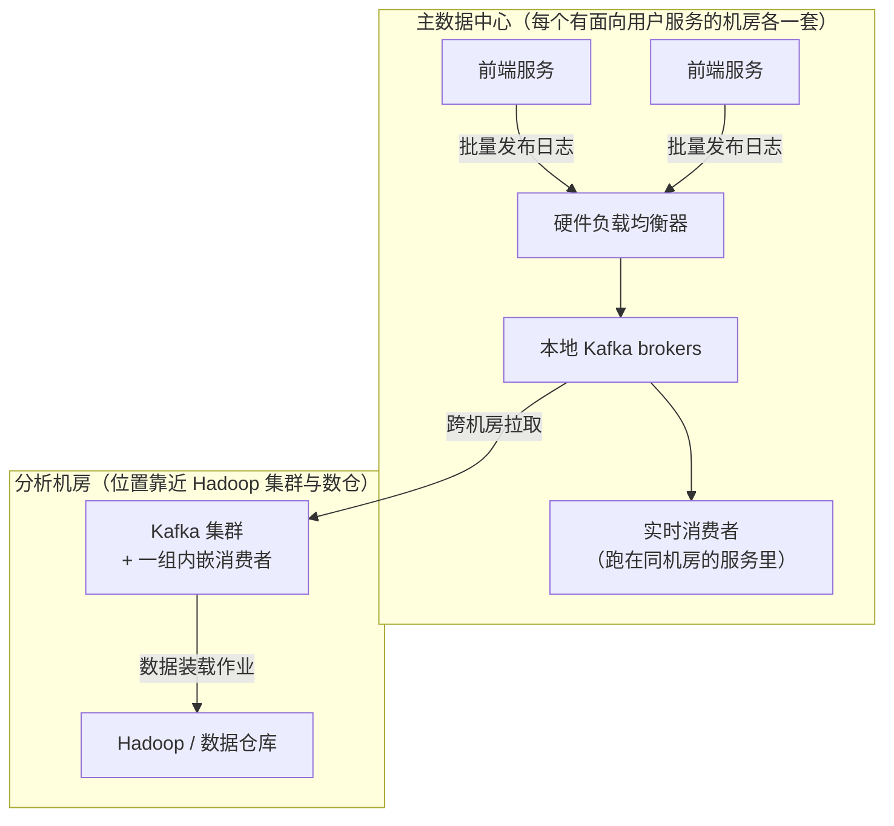
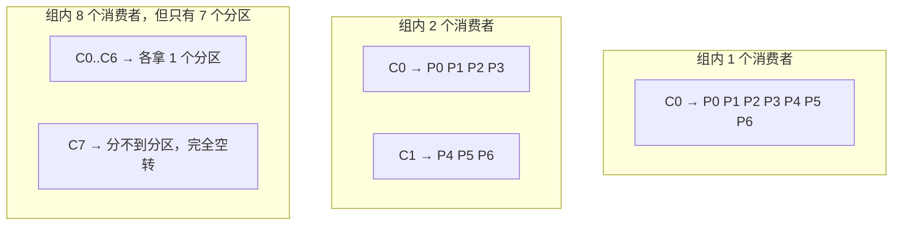
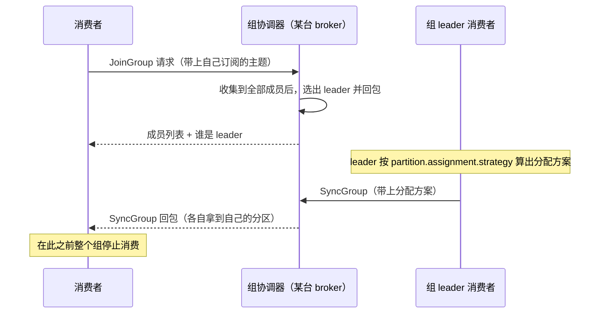
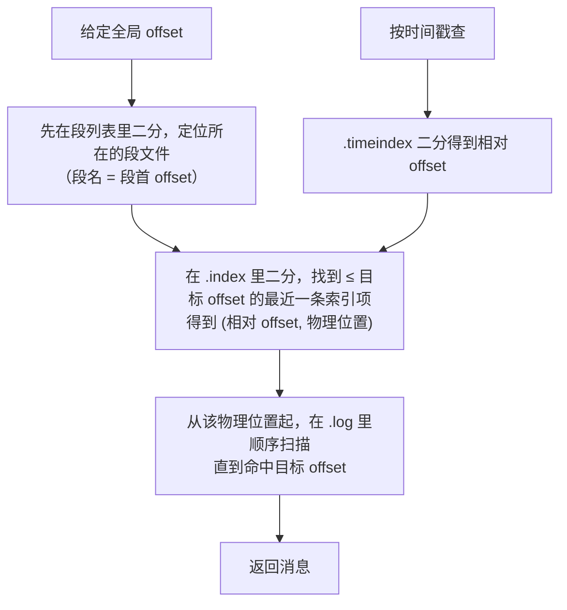
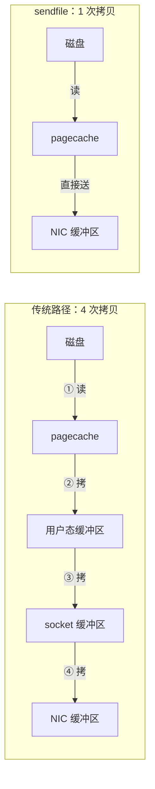
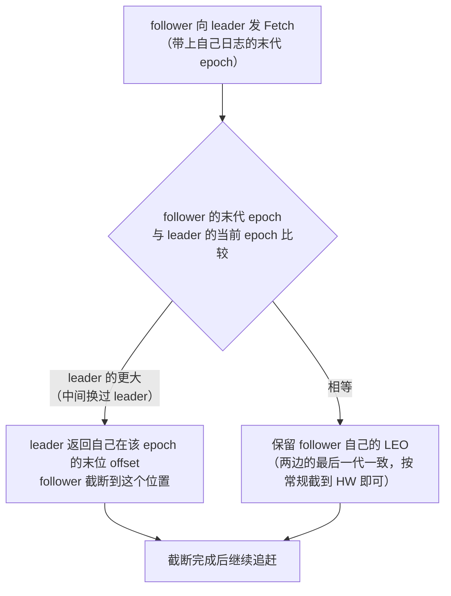

---
tags:
  - 中间件/MQ
---

# Kafka 知识汇总

## 简介

Kafka 被定义为一个分布式流式处理平台，它以高吞吐、可持久化、可水平扩展、支持流数据处理等多种特性而被广泛应用，在现代系统中主要承担三大角色：

- 消息系统：Kafka 和传统 MQ 一样，都具有系统解耦、冗余存储、流量削峰、异步通信、可扩展性、可恢复性等功能。与此同时，Kafka 还提供了消息顺序性保障及回溯消费等功能。
- 存储系统：Kafka把消息持久化到磁盘,相比于其他基于内存存储的系统而言,有效地降低了数据丢失的风险。也正是得益于Kafka的消息持久化功能和多副本机制,我们可以把Kafka作为长期的数据存储系统来使用,只需要把对应的数据保留策略设置为"永久"或启用主题的日志压缩功能即可。
- 流式处理平台:Kafka不仅为每个流行的流式处理框架提供了可靠的的数据来源,还提供了一个完整的流式处理类库,比如窗口、连接、变换和聚合等各类操作。

## 基本概念

Kafka 体系架构基本上由四部分组成，Producer、Broker、Consumer 以及一个 ZooKeeper 集群。

- Producer：作为消息的生产者，负责创建消息并将消息投递到 Kafka。
- Broker：作为 Kafka 的服务节点，负责接收并处理消息及请求。
- Consumer：作为 Kafka 的消费者，负责从 Broker 订阅并消费消息。
- Zookeeper：负责 Kafka 集群的元数据管理、控制器的选举等操作
自 Kafka 2.8 版本之后，Kafka 使用 raft 算法自己实现了对于元数据的管理，并逐渐淘汰对于 Zookeeper的依赖。


在 Kafka 中还有两个非常重要的概念—— 主题（topic）与分区（Partition）。在 Kafka 中，消息以主题为单位进行归类，生产者负责将消息发送到特定的 Topic ，然后消费者去订阅对应的 Topic 并进行消费。

Topic 是一个逻辑上的概念，它可以细分为多个 Partition，其中 Topic：Partition 的关系为 1：N ，很多时候我们也会把分区称作为 Topic-Partition 。同一主题下不同分区包含的消息是不同的，分区在存储层面上可以看作一个不断追加写的日志文件，消息在追加到日志文件的时候会被分配一个特定的偏移量（offset），作为本消息在当前分区的唯一标识，需要注意的是，offset 并不跨区，因此想要描述一个消息在 Kafka 中位置的话可以用 Topic-Partition-Offset 来进行标识。Kafka 通过使用 Offset 来保证消息在分区内的顺序性，**Kafka 保证的是分区有序而不是主题有序**。


每条消息在发送到 Broker 前，会根据设置的 Producer 分区规则选择存储到哪个具体的分区，在分区规则合理的情况下，所有消息可以均匀地分配到不同的分区中。

为什么要设置这么一个分区的概念呢，实际上分区带来的是 Kafka 的可扩展性，假如说我们没有 Partition 这个概念，每个 Topic 都对应一个消息文件，随着消息量的增大，这个文件所在机器的 I/O 性能将会成为这个 Topic 的性能瓶颈，假如说我们有了 Partition 的概念，将 Topic 的消息存储到多个机器上的 Paitition，我们的并发能力将会得到极大的提升。

在创建主题的时候，可以通过指定的参数来配置分区的个数，也可以在主题创建完成后再去修改分区的数量，实现水平扩展，实际环境中应通过评估在创建 Topic 的时候指定好 Partition 数目，避免因为修改 Partiton 数目而带来的 rebalance。

Kafka 为分区引入了多副本 （Replica）机制,通过增加副本数量可以是升容灾能力。同一分区的不同副本中保存的是相同的消息，副本之间是"一主多从"的关系，其中 leader 副本负责处理读写请求，follower 副本只负责与 leader 副本的消息同步。副本处于不同的 Broker 中，当 leader 副本出现故障时，从 follower 副本中重新选举新的 leader 副本对外提供服务。Kafka 通过多副本机制实现了故障的自动转移，当 Kafka 集群中某个 Broker 失效时仍然能保证服务可用。

如下图所示，Kafka集群中有 4 个 Broker，某个主题中有 3 个分区，且副本因子 （即副本个数）也为 3，如此每个分区便有 1 个 leader 副本和 2 个 follower 副本。生产者和消费者只与 leader 副本进行交互，而 follower 副本只负责消息的同步，很多时候 follower 副本中的消息相对 leader 副本而言会有一定的**滞后**。


**Topic、Partition、Offset 是三个层次的东西**，把它们叠在一起才能定位一条消息：

| 层级 | 作用 | 关键性质 |
| --- | --- | --- |
| **Topic** | 逻辑上的消息分类 | **只是一个名字**，本身不占存储 |
| **Partition** | 存储与并行的单位 | 一个分区对应一个目录，是**并行度的上限**，也是**顺序保证的最小粒度** |
| **Offset** | 分区内的位置 | **只在分区内唯一** —— 跨分区讨论 offset 没有意义 |

由此得出两条常被混淆的判断：**① "Kafka 保证消息顺序"只在分区内成立** —— 同一个键的消息只要进了同一个分区就能保序，跨分区没有全局顺序；**② "多消费几个分区就更快"不总成立** —— 加分区能提高并行度，但会削弱"全局保序"的可能性，而且分区数一旦定下就不可回退（下一段说原因）。

**分区数只能增、不能减。** 原因是物理形态决定的：分区在磁盘上就是一个目录（`<topic>-<partition>`），**减少分区意味着合并目录、重写所有 offset** —— 而 offset 已经被消费者提交、被下游当作位置引用，重写它会破坏所有既有语义。所以分区数是一个"一次定下来、之后只能往上加"的决定，**要在建 topic 时就按峰值吞吐与保留期算好**。

**副本因子不能超过 broker 数，而且要留余量。** 同一台机器上放两个副本等于没放，所以副本因子 3 至少需要 3 台 broker。更实际的一条经验：**副本因子与 `min.insync.replicas` 一起决定可用性下限** —— 3 副本配 `min.insync.replicas=2` 意味着**同时掉两台 broker 时该分区写不进去**，这是"一致性优先"的必然代价。

## ISR 机制

分区中的所有副本称为 AR（Assigned Replicas）。所有与 leader 副本保持一定程度同步的副本（包括 leader）在内组成 ISR （In-Sync Replicas），ISR 集合是 AR 集合中的一个子集。消息会先发送到 leader 副本，然后 follower 副本才能从 leader 副本中拉取消息进行同步，同步期间内 follower副本相对于 leader 副本而言会有一定程度上的滞后。前面所说的"一定程度的同"是指可以忍受的滞后范围，这个范围可以通过参数进行配置。与 leader 副本同步滞后过多的副本（不包含 leader副本）组成 OSR （Out-of Sync Replicas），由此课件，AR = ISR + OSR。正常情况下，所有的 follower 副本动应该与 leader 副本保持一定程度上的同步，即 AR = ISR。OSR 集合为空。

leader 副本负责维护和跟踪 ISR 集合中的所有 follower 副本的滞后状态，当 follower 副本落后太多或者失效时，leader 副本会把它从 ISR 集合中剔除。如果 OSR 副本中有 follower 副本同步进度追上了 leader 副本，那么 leader 副本会把它从 OSR 集合中转移到 ISR集合中。**默认情况下，当 leader 发生故障时，只有 ISR 集合中的副本才有资格被选举成为新的 leader**（这个可以通过修改参数来改变）。

ISR 与 HW（High Watermark ）和 LEO （Log End Offset）之间有着紧密的联系，

HW 标识了一个特定的 offset ，它表示了在多副本中消息被同步到了哪个位置，消费者只能拉取这个 offset 之前的消息。
LEO 标识当前日志文件中下一条待写入消息的 offset


如图所示，这是一个日志文件，这个文件中有 9 条消息，第一条消息的 offset （LogStartOffset）为0，最后一条消息的 offset 为 8，offset 为 9 的消息用虚线框表示，代表下一条待写入的消息。日志文件的 HW 为 6，表示消费者只能拉取到 offset 在 0 到 5 之间的消息，而 offset 为 6 的消息对消费者而言是不可见的。

**分区 ISR 集合中的每个副本都会维护自身的 LEO，而 ISR 集合中最小的 LEO 即为分区的 HW。**

如图所示：


假设某个 partition ISR 集合存在 3 个副本，即一个 leader 副本与两个 follower 副本，此时 LEO 与 HW 都为 3.

producer 将消息3、4投递至分区 leader 副本，在消息写入 leader 后，follower 副本会发送拉取请求来拉取消息 3 和消息4。

> Follower 副本不会实时监控 leader 状态，而是周期性的向leader 发送 Fetch 请求来同步 leader 中的数据


在同步过程中，follower的同步效率有所不同，在某一时刻，follower1 完全追上 ledaer，而 follower2 只同步到了消息 3，如此，leader LEO 为 5，follower1 LEO 为5，follower2 LEO 为4，那么当前 ISR 集合的 HW=4，此时消费者只能消费到 offset 0到3之间的消息。

Kafka的复制机制并非完全同步，也非完全异步。
同步：同一条消息需要被所有的 follower 复制，才能被视为已提交，这种复制方式保证了很高的一致性，但也极大的影响了性能。
异步：follower 副本异步的从 leader 中复制数据，数值只要写入 leader 中就被认为已经成功提交，在这种情况下，如果数据刚刚写入 leader 还没来得及同步，leader 突然宕机，会有数据丢失的风险。

## 生产者

由于生产者客户端使用的语言不一致，这里只讨论生产者客户端的内部实现。

消息在真正发往 Kafka 之前，需要经历拦截器（interceptor）、序列化器（Serializer）和分区器（Partitioner）等一些列的作用，最后才执行发送操作。


整个生产者客户端主要分为两个线程，主线程与发送线程。在主线程中由 KafkaProducer 创建消息，然后通过可能的拦截器、序列化器和分区器的作用之后缓存到消息累加（RecordAccumulator，也称为消息收集器）中。Sender 线程负责从 RecordAccumulator 中获取消息并将其发送到 Kafka 中。

主线程步骤：

1. **创建 `ProducerRecord`**
    
2. **经过拦截器（Interceptor）**（可选）
    
3. **经过序列化器（Serializer）**
    
4. **经过分区器（Partitioner）**  
    决定消息被发送到哪个分区，例如：`topic-A` 的 `partition-2`
    
5. **写入缓存**  
    消息被追加到 `RecordAccumulator` 中对应分区的缓存队列中，等待 Sender 线程发送
    
RecordAccumulator 的内部为每个分区都维护了一个双端队列，队列中的内容就是 ProducerBatch，即 `Deque＜ProducerBatch＞`。消息写入缓存时，追加到双端队列的尾部；

RecordAccumulator 中的结构可以理解为：
```java
Map<TopicPartition, Deque<ProducerBatch>>
//每个 TopicPartition 就是一个 (topic, partition id) 组合，表示 Kafka 中的一个具体物理存储单元。
```

Sender 线程步骤：


> - Kafka 作为一个消息队列，涉及到磁盘 I/O 主要有两个操作：
> - Provider 向 Kakfa 发送消息，Kakfa 负责将消息以日志的方式持久化落盘；
> 
> Consumer 向 Kakfa 进行拉取消息，Kafka 负责从磁盘中读取一批日志消息，然后再通过网卡发送。
> 
> Kakfa 服务端接收 Provider 的消息并持久化的场景下使用 mmap 机制，能够基于顺序磁盘 I/O 提供高吞吐的持久化能力，使用的 Java 类为 java.nio.MappedByteBuffer。
> 
> Kakfa 服务端向 Consumer 发送消息的场景下使用 sendfile 机制，这种机制主要两个好处：
> 
> - sendfile 避免了内核空间到用户空间的 CPU 全程负责的数据移动；
> - sendfile 基于 Page Cache 实现，因此如果有多个 Consumer 在同时消费一个主题的消息，那么由于消息一直在 page cache 中进行了缓存，因此只需一次磁盘 I/O，就可以服务于多个 Consumer。
> 
> 使用 mmap 来对接收到的数据进行持久化，使用 sendfile 从持久化介质中读取数据然后对外发送是一对常用的组合。但是注意，你无法利用 sendfile 来持久化数据，利用 mmap 来实现 CPU 全程不参与数据搬运的数据拷贝。

**消息大小这条链路上有三个参数，改动任何一个都要同时改另外两个**，否则会造出"写得进去但读不出来"或"直接被拒"的畸形配置：

| 环节 | 参数 | 约束方向 |
| --- | --- | --- |
| **生产者** | `max.request.size` | 单次请求的上限，**决定生产者能发出多大的消息** |
| **broker** | `message.max.bytes` | broker 愿意接收的单条消息上限，**超出直接拒收**（生产者收到 `RecordTooLargeException`） |
| **消费者** | `max.partition.fetch.bytes` | 单分区单次拉取上限，**小于单条消息时那条消息永远拉不出来** |

**三者的安全关系是"逐级放宽"或至少持平**：生产者允许发的，broker 必须愿意收；broker 愿意收的，消费者必须拉得动。**实践中最容易出错的是第三级** —— 前面两个改了、`max.partition.fetch.bytes` 忘了改，结果消息写进去正常，消费端那个分区却卡住不动。这也是"某个分区消费停滞、其他分区正常"这类现象的第一个怀疑点。

**批量与重试是另一对必须一起看的参数。** 生产者的 `RecordAccumulator` 会把发往同一个分区的消息攒成 `ProducerBatch` 再发（这是吞吐的主要来源），而 `retries` 决定失败后重发几次。两者单独调都没问题，**但在"有重试 + 有并发在途请求"的组合下，乱序与重复这两个风险就出现了** —— 重试的批次可能晚于后续批次到达，从而在分区内造成乱序。**要消除这类风险就要用幂等生产者**（它给每个批次带 producer id 与 sequence，broker 据此查重并拒收乱序批次），代价是额外的状态与协议开销。所以"要不要开幂等"这个问题的答案取决于**下游对重复与乱序的容忍度**，而不是取决于吞吐指标。

## 原始设计：为什么另造一个系统

这一节补的是 **2011 年最初的设计（NetDB'11，LinkedIn）** —— 它把"为什么不直接用现成的"讲得很具体 —— 这也是本笔记上面那些概念（ISR、HW/LEO、副本）**后来**才长出来的起点。

**先看日志数据的量级**。这类数据包括用户行为事件（登录、页面浏览、点击、点赞、分享、评论、搜索）与运维指标（调用栈、调用延迟、错误，以及 CPU / 内存 / 网络 / 磁盘利用率）。近年一个变化是：**活动数据从"分析用料"变成了直接供线上功能使用的生产数据** —— 搜索相关性、推荐（物品热度或共现）、广告定向与报表、反垃圾与反爬、以及聚合好友动态的 newsfeed。

这个变化带来一个新问题：**它的体量比"真正的"数据大几个数量级**。算细粒度 CTR 时要记录的不只是每一次点击，**还包括每页里那几十个没被点击的物品**。两个当时的公开数字：**中国移动每天收集 5–8 TB 通话记录**，**Facebook 每天收集近 6 TB 用户活动事件**。

**企业级消息系统为什么不合适**，四条理由：

| 不匹配 | 具体表现 |
| --- | --- |
| **特性错配** | 那类系统重点在做丰富的投递保证 —— IBM WebSphere MQ 支持事务性往多个队列原子插入消息，JMS 允许逐条消息在消费后（甚至可以乱序）确认。**这些保证对收集日志往往是过头的** —— 偶尔丢几个 pageview 事件无关大局。而用不上的特性**同时推高了 API 与实现的复杂度** |
| **吞吐不是首要约束** | 例如 **JMS 没有 API 让生产者显式把多条消息批进一个请求** ⇒ 每条消息都要一次完整的 TCP/IP 往返，达不到日志场景的吞吐要求 |
| **分布式支持弱** | 没有简单的办法把消息分区并存到多台机器上 |
| **假设消息被立刻消费** | 未消费队列始终很小；**一旦消息积压，性能显著退化** —— 而离线消费者（数仓那种周期性大批量装载）恰恰就是积压场景 |

**专用日志聚合器**（Facebook 的 **Scribe**、Yahoo 的 **Data Highway**、Cloudera 的 **Flume**）解决了"搬到仓库"这一段，但**多是为离线消费设计的**，而且**常把实现细节不必要地暴露给消费者**（例如 Yahoo 那套的"**minute files**"）。更关键的是**它们大多用 push 模型**（broker 主动把数据推给消费者）。

**LinkedIn 选的是 pull 模型**，理由有两条：**每个消费者可以按自己能承受的最大速率去取，不会被推得比处理能力更快而淹掉**；**pull 让"回退消费者"变得容易**（下面会看到这个能力为什么重要）。当时 Yahoo! Research 的 **HedWig** 也做过强持久性保证的分布式 pub/sub，但**主要面向"存数据存储的 commit log"**。

## 单分区上的三个取舍

Kafka 要同时服务在线与离线消费，而它关于"效率"的决策几乎都落在**单个分区**这一层。

**① 存储布局简单到极致。** 一个 topic 的每个分区对应**一份逻辑日志**；物理上，一份日志是**一组大小相近的 segment 文件**（例如 1 GB）。生产者每次发布，broker **只是把消息追加到最后一个 segment 文件上**。为了性能，**segment 文件只在"发布了可配置条数的消息"或"经过了一定时间"之后才刷盘；而一条消息只有在刷盘之后才会暴露给消费者**。

**② 没有显式的 message id，用逻辑 offset 寻址。** 每条消息由它在日志里的**逻辑 offset** 标识 —— 这**省掉了维护"把 id 映射到实际位置"那种需要频繁寻道的辅助索引结构的开销**。要注意一个细节：**offset 递增但不连续**，下一条消息的 id = 当前消息的 id + 当前消息的长度。消费是**顺序**的：**确认了某个 offset，就等于确认了该分区里它之前的全部消息**。

消费者在底层发出的是**异步拉取请求**，请求里带两个参数：**从哪个 offset 开始**、**可接受的字节数**。而 **broker 在内存里维护一份排好序的 offset 列表（含每个 segment 文件里第一条消息的 offset）**，靠查这份列表定位到目标 segment 文件再把数据发回。

**③ 不在 Kafka 层显式缓存消息，交给文件系统 page cache。** 这是设计里自认为"非传统"的一处选择，好处有三层：

- **避免双重缓冲** —— 消息只会在 page cache 里缓存一份；
- **broker 进程重启后，热缓存还在**；
- **进程内完全不缓存消息 ⇒ GC 自己那点内存的开销极小 ⇒ 用基于 VM 的语言来实现也划算**。

再加上**生产者与消费者的访问都是顺序的**（消费者通常只略微滞后于生产者），**操作系统的常规缓存启发式（具体是 write-through caching 与 read-ahead）就能发挥得很好**。实测结果是：**生产与消费的性能都随数据量线性，一直延伸到数 TB 级别**。

**这三个取舍之间有依赖关系**，改动其中一个会连带影响另外两个，这一点比三个取舍本身更重要：

| 改动 | 连带影响 |
| --- | --- |
| **把"结构化对象"改成"任意键值对"** | 失去按键有序这条性质，`range push/pull` 就不成立了 → **批量通信与区间压缩一起失效** |
| **不再按区间通信，改成逐条** | 每条消息都要独立的路由与一致性跟踪 → **向量时钟无法压缩成区间形式**，空间开销回到朴素量级 |
| **放弃"消息传递"改为远程读** | 局部性变差、需要复制远端值 → **应用侧的读写延迟无法靠批量摊薄** |

反过来说，**这三个取舍是被同一组前提串起来的**：参数是**结构化的数学对象** → 所以更新天然成"段"或"行" → 所以可以**按区间批量通信** → 所以**一致性跟踪也能按区间压缩**。**只要承认第一个前提，"按区间"这个选择几乎是自然结果**；而一旦换成"任意键值对"，后面的两级优化都会跟着消失。

这也是读这一节时值得带走的一条判断方法：**当一个系统的多个设计选择看起来彼此独立时，去问"它们是不是共享同一个前提"** —— 如果是，改前提就会同时推翻它们，而逐个改则会在中途得到一个自相矛盾的中间状态。

### 网络路径：`sendfile` 省掉的到底是哪两步

从本地文件往远端 socket 送字节，通常的路径是四步：


**这一步链合计 4 次数据拷贝 + 2 次系统调用。** Linux 与其他 Unix 提供的 **`sendfile` API** 可以把字节**直接从文件通道传到 socket 通道**，也就是**省掉第 ②、③ 步 —— 2 次拷贝 + 1 次系统调用**。Kafka 就用它把日志 segment 里的字节从 broker 送到消费者（上面那节讲的 mmap/sendfile 组合，落到这套设计里就是这一处优化）。

## 无状态 broker 与时间 SLA

**消费进度不走 broker。** 与多数消息系统不同，**"每个消费者消费到哪了"这个信息不由 broker 维护，而由消费者自己维护**。代价与收益都很具体：

- 收益：**大幅降低 broker 的复杂度与开销**（这也解释了为什么 broker 侧实测"没有任何磁盘写活动"）；
- 代价：**broker 不知道所有订阅者是否都消费完了，于是删除消息变得棘手**。

解法是**一条基于时间的 SLA**：消息在 broker 上保留超过一定时长（**典型是 7 天**）就自动删除。这条策略在实践中够用，因为**多数消费者（包括离线的）是以天、小时或实时为周期消费完的**；而**"性能不随数据量增长而退化"这一点让长保留变得可行**。

**还有一个重要的副作用，后来被当成固有特性保留下来：消费者可以刻意回退到旧 offset 重新消费。** 这里明确承认**这违反队列的通常契约**，但对很多消费者是必需的。两个真实用例：

- **应用逻辑出错时** —— 修好之后重放特定消息。这对 **ETL 把数据装进数据仓库或 Hadoop** 尤其重要；
- **只在周期性地把数据刷进持久存储的消费者**（例如全文索引器）—— 如果它崩溃，未刷出去的数据就丢了；此时它可以**把"未刷消息里最小的那个 offset"记下来（checkpoint），重启后从那里重新消费**。

**回退这件事在 pull 模型里比在 push 模型里容易支持得多** —— 这正好回接了前面"为什么选 pull"。

**保留策略不只有"时间"一个维度**，三组配置的优先级需要说清：

| 配置 | 作用 | 与其他配置的关系 |
| --- | --- | --- |
| `log.retention.ms` / `.minutes` / `.hours` | **按时间保留**，三者是同一个设置的三种单位 | **同时设置时以 `ms` 为准**（精度最高的生效） |
| `log.retention.bytes` | **按分区总大小保留**，默认关闭 | 与时间策略**取并集** —— 任一条件满足就删段 |
| `log.retention.check.interval.ms` | 多久检查一次哪些段可删 | 它决定"过期到真正被删"之间的延迟 |

**这三种单位并存的设计有个坑**：如果只改了 `.hours` 而某个地方残留着 `.ms` 的设置，**实际生效的是 `.ms`** —— 因为更精确的单位优先。排查"保留了 7 天但数据没删"时，第一件事就是把这三个配置一起看一遍。

**时间策略的语义边界也要记住：它按"段内最大的 timestamp"判定，与记录顺序无关**（前面「段的滚动」一节讲过）。由此推出一个实用结论：**如果一个分区里混有"时间戳很新"的消息（例如生产者自己带的时间戳，或者补写的历史数据），那个段就会被整体留下** —— 这会造成"数据过期了但磁盘不降"。**让日志的时间戳与写入时间一致**（或用 `LogAppendTime`）能让保留策略更符合直觉。

**要不要维护消费进度，是一个"有状态 vs 无状态"的取舍**。如果让 broker 记录"每个消费者读到哪了"，就能精确判断"什么时候所有订阅者都读过了，可以删了" —— 但代价是：**broker 要为每个消费组、每个分区维护状态**，而且**谁算"所有订阅者"本身是个无解的问题**（新加入的组要不要等？临时下线的组算不算？）。Kafka 的选择是**把这件事彻底推给时间**：不猜、不等，到点就删。**简化 broker 的代价是应用必须自己接受"数据可能还没来得及读就过期"**，而对日志类数据这个前提是成立的。

## 分布式协调：两个决策与 ZooKeeper 的四个注册表

生产者这一侧很简单：发到**随机选的一个分区**，或者按**分区键 + 分区函数**语义决定的分区。

消费者这一侧，Kafka 引入了 **consumer group**：**一个组由一到多个消费者组成，它们共同消费一组订阅的 topic —— 一条消息在组内只投给一个消费者**；不同组各自独立消费全量消息，**组间不需要任何协调**。组内的消费者可以在不同进程里、甚至不同机器上。

目标是**把 broker 里存的消息均匀分给消费者，又不引入太多协调开销**。为此有两个决策：

**决策一：一个 topic 里的一个 partition 是并行的最小单元。**

这意味着**任一时刻，一个分区的全部消息，在每个 consumer group 内只被一个消费者消费**。反面推理是：**如果允许一个分区的消息被多个消费者同时消费，他们就必须协调"谁消费哪些消息" —— 而这必然带来锁与状态维护的开销**。按现在的设计，**消费进程只在 rebalance（重新分配负载）时才需要协调，而这是一个不常发生的事件**。

还有一条推论：**要让负载真正均衡，一个 topic 的分区数必须远多于每个组里的消费者数** —— 这靠"**过度分区**"就能轻松做到。

**决策二：不要中心 master 节点，让消费者之间去中心地自行协调。**

理由只有一句，但很实在：**引入 master 会让系统更复杂，因为还得额外操心 master 的故障。**

协调交给 **ZooKeeper**（一个高可用的共识服务，API 简单得像文件系统：建路径、读写路径的值、删路径、列子路径）。

Kafka **用 ZooKeeper 做三件事**：

1. **探测 broker 与消费者的增减**；
2. 在上面那些事件发生时，**触发每个消费者的 rebalance 流程**；
3. **维护消费关系，并记录每个分区的已消费 offset**。

落到四张注册表上：

| 注册表 | 内容 |
| --- | --- |
| **broker registry** | 每个 broker 的主机名与端口，以及它上面存了哪些 topic 与 partition |
| **consumer registry** | 每个消费者所属的 group，以及它订阅的 topic 集合 |
| **ownership registry**（每组一个） | 每个被订阅的分区一条路径，**值是当前正在消费它的消费者 id** —— 术语上叫做"这个消费者**拥有**该分区" |
| **offset registry** | 每个被订阅分区的**最后一条已消费消息的 offset** |

**路径的生存期不同**，这是设计要点：**broker registry、consumer registry、ownership registry 都是 ephemeral**（创建它的客户端一旦消失，路径由 ZooKeeper 自动删除），**只有 offset registry 是 persistent**。于是故障语义自然成立：**broker 挂掉，它上面的全部分区自动从 broker registry 移除；消费者挂掉，它在 consumer registry 里的条目消失，它拥有的分区在 ownership registry 里也全部失去。**

**rebalance 的过程**（每个消费者在启动时、或被 watcher 通知到 broker/消费者集合变化时发起）：读两个注册表 → 算出订阅 topic $T$ 在**所有 broker 上**的可用分区集合 $P_T$、以及组内订阅 $T$ 的消费者集合 $C_T$ → **把 $P_T$ 与 $C_T$ 都排序** → 令 $j$ 为该消费者在 $C_T$ 里的下标、$N = |P_T| / |C_T|$ → **分给它 $P_T$ 里第 $j \cdot N$ 到 $(j+1)N - 1$ 这一段** → 对每个分到的分区，在 ownership registry 里把自己写成 owner，从 offset registry 读出起点 $O_p$，**起一个线程从 $O_p$ 开始拉数据**。拉取过程中，消费者**周期性地把最新的已消费 offset 写回 offset registry**。

**竞争是可能的，而且处理方式很干脆**：各消费者收到通知的时刻略有先后，于是**可能出现"一个消费者试图接管另一个仍持有的分区"**。此时**前一个消费者直接释放自己当前持有的全部分区、等一小会儿、然后重试 rebalance**。**实践中几次重试就稳定了**。

**新建一个 consumer group** 时 offset registry 里没有任何 offset，消费者就从每个被订阅分区的**最小或最大 offset** 开始（取决于配置）。

## 交付保证，以及这一篇当时还没有的东西

**Kafka 只保证 at-least-once。** 给出的理由是：**exactly-once 通常需要两阶段提交，而对这类应用没有必要**。多数情况下，一条消息对每个 consumer group 恰好投递一次。

**重复的来源写得很具体**：当消费者进程**没有干净关闭**就崩溃时，**接管它那些分区的新进程可能拿到一些重复消息 —— 也就是排在"最后一次成功提交到 ZooKeeper 的 offset"之后的那部分**。**在意重复的应用必须自己加去重逻辑**，可以用返回给消费者的 offset，也可以用消息里的某个唯一键 —— **这通常比上两阶段提交更划算**。

顺序保证是分层的：**同一个分区内的消息按顺序投递给消费者；不同分区之间的顺序不作保证。**

还有两条工程细节：

- **日志里每条消息都存一个 CRC。** broker 上出现任何 I/O 错误时，**Kafka 跑一个恢复流程把 CRC 不一致的消息删掉**；消息级 CRC 的另一个用途是**在消息被生产或消费之后检查网络错误**；
- **当时还没有内置的副本复制。** broker 挂掉，它上面尚未被消费的消息就不可用；如果那台 broker 的存储永久损坏，未消费的消息就永远丢了。**"把每条消息冗余存到多个 broker"被明确列为未来工作** —— 这也正是本笔记上面那节 ISR / HW / LEO 的由来：那些机制是**后来**才长出来的。

## LinkedIn 的部署、审计与实测

**部署形态**是"每个机房一套 + 一个分析机房"：



**端到端延迟平均约 10 秒**（"没有做太多调优"就达到了），满足他们的要求。当时 **Kafka 每天积累数百 GB 数据、接近十亿条消息**，并且预期会显著增长。

**审计做得很完整**：每条消息带上**生成时的时间戳与服务器名**；**每个生产者定期生成一个监控事件**（记录固定时间窗内它按 topic 发布的消息条数），发到**另一个 topic**；消费者随后**核对自己从某个 topic 收到的条数**，用监控事件来验证数据正确性 —— 这样能确认**整条管道没有丢数据**。

两处与"无状态 broker"直接呼应的设计：

- **入 Hadoop 靠一个专门的 Kafka input format，让 MapReduce 作业直接读 Kafka**。这里点明：**无状态 broker 加上客户端侧存 offset，让 MapReduce 的任务管理（允许任务失败重启）能自然地处理数据装载，任务重启时既不重复也不丢消息**；而且**数据与 offset 只在作业成功完成时才写进 HDFS**；
- **序列化用 Avro**：每条消息存它所用 **schema 的 id** 加序列化后的字节，配一个**轻量 schema registry** 把 id 映射到真正的 schema。因为 schema 不可变，**每个 schema 只需查一次**。

### 实测：与 ActiveMQ、RabbitMQ 对照

对照对象是 **ActiveMQ 5.4**（JMS 的主流开源实现，用它的默认持久化存储 KahaDB）与 **RabbitMQ 2.4**（以性能著称）。环境是**两台 Linux 机器**（各 **8 个 2 GHz 核、16 GB 内存、6 块盘组 RAID 10**，之间 **1 Gb 链路**），一台当 broker、另一台当生产者或消费者。

**生产者测试**：总量 **1000 万条、每条 200 字节**。Kafka 配两种批量大小（1 与 50）；ActiveMQ 与 RabbitMQ 没有方便的批量方式，按批量 1 计。

| 系统 | 平均吞吐 |
| --- | --- |
| **Kafka，批量 1** | **50,000 条/秒** |
| **Kafka，批量 50** | **400,000 条/秒** |
| ActiveMQ / RabbitMQ | 比 Kafka 低**数量级** / 至少低 **2 倍** |

三个原因：

1. **Kafka 生产者不等 broker 的确认**，按 broker 能处理的最快速率发 —— 批量 50 时**单个生产者几乎打满了那条 1 Gb 链路**。这里承认这是"不保证每条发出的消息都被 broker 收到"，但认为**对日志聚合是成立的优化**：日志必须异步发出去，否则会给在线流量引入延迟；**对很多类型的日志数据，用持久性换吞吐是可接受的**，只要丢弃的条数相对少；
2. **存储格式更省**：Kafka 每条消息**开销 9 字节**，ActiveMQ **144 字节** ⇒ **同样的 1000 万条，ActiveMQ 多占了 70% 的空间**。开销的两个来源写得很具体：**JMS 要求的重消息头**，以及**维护各种索引结构的代价** —— 实验里观察到 ActiveMQ 最忙的线程之一**大部分时间在访问一棵 B-Tree 来维护消息元数据与状态**；
3. **批量摊薄了 RPC 开销** —— Kafka 里把批量从 1 提到 50，**吞吐提升了将近一个数量级**。

**消费者测试**：同样 1000 万条；各系统都配成每次拉取预取大约等量的数据（**最多 1000 条或约 200 KB**）；ActiveMQ 与 RabbitMQ 用自动确认模式。由于所有消息都装得进内存，各系统都在从文件系统的 page cache 或内存缓冲里服务。

| 系统 | 平均吞吐 |
| --- | --- |
| **Kafka** | **22,000 条/秒** |
| ActiveMQ / RabbitMQ | 不到 Kafka 的 **1/4** |

三个原因：**存储格式更省 ⇒ 从 broker 传给消费者的字节更少**；**ActiveMQ 与 RabbitMQ 的 broker 都要维护每条消息的投递状态**（测试中一个 ActiveMQ 线程忙于把 KahaDB 的页写盘，**而 Kafka broker 上没有任何磁盘写活动**）；**`sendfile` 降低了传输开销**。

收尾处有一句专门声明：**这个实验的目的不是说明其他消息系统更差** —— ActiveMQ 与 RabbitMQ 的功能都比 Kafka 多；**重点是展示"专用系统"能带来多大的性能收益**。

## 消费者与消费组

消费者（Consumer）订阅主题并从主题上**拉取**消息。Kafka 在这上面多了一层：**每个消费者都隶属一个消费组（Consumer Group）**，一条消息投给订阅该主题的**每个消费组里的一个消费者**。

由此落出一条硬约束：**一个分区在同一时刻只能被同一个消费组里的一个消费者消费。** 换句话说，**分区才是分配的单位，消费者只是分区的持有者**。

以下面的分配演变为例（主题有 7 个分区 P0–P6）：



三条可以直接用来判断容量的推论：

- **消费能力可以横向伸缩**，但**上限是分区数** —— 消费者数超过分区数之后，多出来的消费者**一个分区都拿不到、也不会消费到任何消息**；
- **加分区是提高并行度的唯一途径**（消费者数不是）；
- 多个消费组之间**互不影响**：各组独立消费全量消息。

三条推论可以直接用来判断一个消费组的配置是否合理：

- **消费者数多于分区数 = 浪费**。多出来的消费者分不到分区，会一直空转，但**它们仍然会参与再均衡** —— 也就是说它们不但没有贡献吞吐，还增加了再均衡的成员数、拖长了每次再均衡的停顿；
- **消费者数少于分区数 = 有富余**。此时每个消费者持有多个分区，**一台消费者挂掉，它的分区会被其余消费者接管**，但接管方的负载会上升 —— 这就是"消费者数留一点余量"的理由；
- **分区数不是越大越好**。它与"顺序保证"和"再均衡代价"都成反比：分区越多，单次再均衡需要协商与搬迁的分区越多，而且**一个组要处理的元数据与请求数也随分区数线性增长**。分区数的合理起点通常是"**目标吞吐 ÷ 单分区能承载的吞吐**"，再留一点余量。

**"消费者的实例数"与"消费者的线程数"是两件事**，容易混。分区是按**实例**分配的（同一个组内，一个分区同一时刻只归一个消费者实例），所以**在一个实例里开多个线程并不能让这个实例拿到更多分区** —— 要多拿分区就得加实例。这也解释了"加消费者实例有效、加线程无效"这个常见困惑（多线程的合理用法是提高单个实例内的处理并行度，见前面「多线程模型」一节）。

### 两种投递模式都由这个模型表达

点对点（P2P）与发布/订阅（Pub/Sub）在别的中间件里通常是两套机制，在 Kafka 里是同一个模型的两种配置：

| 投递模式 | 怎么配 |
| --- | --- |
| **点对点** | 所有消费者**在同一个组**里 → 每条消息只被组内一个消费者处理 |
| **发布/订阅** | 所有消费者**各在不同的组**里 → 每条消息被每个组各处理一次 |

消费组的名字由 `group.id` 指定，默认没有值 —— **不设置会直接抛 `InvalidGroupIdException`**。消费组是逻辑概念（有固定名称），消费者是实际实例（可以是一个线程、也可以是一个进程），**同一个组内的消费者可以分散在不同机器上**。

一段正常的消费逻辑固定是四步：配置并创建消费者实例 → 订阅主题 → 拉取并消费 → **提交消费位移**。第四步是 Kafka 消费语义的核心，下面单独讲。

## 订阅的三种方式与它们的互斥状态

KafkaConsumer 提供两条订阅路径，**它们的差别不在于写法，而在于有没有组协调**：

| 方法 | 订阅状态 | 有没有自动再均衡 |
| --- | --- | --- |
| `subscribe(Collection)` | `AUTO_TOPICS` | **有** —— 组内消费者增减时自动重新分配分区 |
| `subscribe(Pattern)` | `AUTO_PATTERN` | **有**，且**之后新建的、名字匹配这个正则的主题会被自动消费** |
| `assign(Collection)` | `USER_ASSIGNED` | **没有** —— 分区与消费者的关系完全由应用自己维护 |
| （什么都不订阅） | `NONE` | —— |

几处容易踩的地方：

- **三种状态互斥** —— 一个消费者里只能选其中一种，混用会报异常；
- **正则订阅在"Kafka 与其他系统之间做数据复制"的场景里很常见** —— 因为对端新建主题时不用改配置；
- **`assign` 拿不到自动再均衡带来的故障转移**，组内其他消费者挂了也不会接管它的分区；
- `subscribe(Collection)` 或 `assign(Collection)` 传**空集合**，效果等同于 `unsubscribe()`；
- **没有订阅任何主题或分区就进入消费循环 → 抛异常。**

不知道主题有几个分区时，用 `partitionsFor()` 查元数据。它返回的每个分区都带这几项：`topic`、`partition`（分区编号）、`leader`（leader 副本在哪台 broker）、`replicas`（**AR**，全部分配副本）、`inSyncReplicas`（**ISR**，与 leader 保持同步的副本）、`offlineReplicas`（**OSR**，已失效的副本）。拿到分区列表后再 `assign()`，就等价于"订阅该主题的全部分区"。

把三种订阅方式的**工程后果**摆在一起，选型就清楚了：

| 维度 | `subscribe(Collection)` | `subscribe(Pattern)` | `assign(Collection)` |
| --- | --- | --- | --- |
| **新主题自动生效** | 否 | **是** | 否 |
| **分区增减自动适应** | **是** | **是** | 否 |
| **成员故障自动接管** | **是** | **是** | 否 |
| **组协调开销** | 有 | 有 | **无** |
| **启动即可消费** | 否（要等再均衡） | 否 | **是** |

**`assign` 的取舍最容易被低估。** 它跳过组协调、直接指定分区，好处是**没有再均衡、启动即消费**（连 `group.id` 都可以不设）；代价是**所有"容错"都得自己做**：

- 分区与消费者的映射由应用维护，**某个消费者挂了不会有人接管它的分区**；
- 位移提交不再有组的语义，**"提交到哪、谁提交、重启后从哪读"这三件事都要自己定规矩**；
- 正因为它没有组协调，它适合**全量并行消费**这类场景（例如每个消费者固定分一段分区做离线批处理）。

反过来，**只要需要"加机器就能分担负载"，就必须用 `subscribe`** —— 这是它的核心价值，`assign` 给不了。

**三种订阅状态互斥这一点，在实操里表现为三种具体的报错场景**，值得列出来：

| 写法 | 表现 |
| --- | --- |
| 先 `subscribe` 再 `assign` | 抛 `IllegalStateException`：订阅状态已确定为 `AUTO_TOPICS` / `AUTO_PATTERN`，不能再转成 `USER_ASSIGNED` |
| 先 `assign` 再 `subscribe` | 同样失败，方向相反 |
| `subscribe(A)` 后再 `subscribe(B)` | **合法** —— 后一次覆盖前一次（这是允许的例外，因为两次都在同一状态内） |
| 都没调用就 `poll` | 抛 `IllegalStateException`：没有订阅任何主题或分区 |

还有一处与它相邻的细节：**`subscribe` 与 `assign` 混用的意图通常是"手动接管一部分分区、剩下的交给组管理"，而 Kafka 不支持这种混合**。要做到这件事，得**分成两个消费者实例** —— 一个用 `assign` 管手动分区、一个用 `subscribe` 参与组协调，且**两者的 `group.id` 不能相同**（否则手动那个会被组协调器当成成员，反过来打乱自动分配）。

## 拉模式与 poll 循环

**Kafka 的消费基于拉模式**：消费者主动发起请求去拉，而不是服务端把消息推过来。这个选择在原始设计里就有明确理由 —— **每个消费者可以按自己能承受的最大速率去取，不会被推得比处理能力更快而淹掉**；而且**拉模式让"回退到旧位移重新消费"这件事容易实现**（这一点在前面的「原始设计」一节里已经出现过）。

消费就是一个**不断轮询**的过程：重复调用 `poll()`。

```java
while (running) {
    ConsumerRecords<String, String> records = consumer.poll(Duration.ofMillis(1000));
    for (ConsumerRecord<String, String> r : records) {
        // 处理
    }
}
```

`poll(timeout)` 的语义要说清：

- **有数据就立即返回**；**缓冲区里没有可用数据时会阻塞，直到超时**；
- **`timeout = 0` 表示立刻返回**，不管有没有拉到消息；
- 如果应用线程**唯一的工作就是拉取并消费**，可以把它设成 `Long.MAX_VALUE`；
- 超时值取决于"多长时间内要把控制权交回给应用线程"这一需求。

**`poll()` 不只是"拉一下消息"。** 它内部还要驱动：消费位移、消费者协调器、组协调器、消费者的选举、分区分配的分发、再均衡的逻辑、以及心跳。由此推出一条最容易出事的工程边界：**如果两次 `poll()` 之间的间隔超过了 `max.poll.interval.ms`，消费者会被判为失败、踢出消费组并触发再均衡** —— 所以**在 poll 循环里做长耗时的处理是典型隐患**。

拉到的一条消息类型是 `ConsumerRecord`，字段如下：

| 字段 | 含义 |
| --- | --- |
| `topic` / `partition` | 消息所属主题名 / 分区编号 |
| `offset` | 消息在该分区里的位移 |
| `timestamp` / `timestampType` | 时间戳与其类型：`CreateTime`（消息创建时间）或 `LogAppendTime`（追加到日志的时间） |
| `headers` | 消息头部 |
| `key` / `value` | 键与值（业务通常读 `value`） |
| `checksum` | CRC32 校验值 |

`poll()` 的返回值是 `ConsumerRecords`（一批 `ConsumerRecord`），它提供 `records(TopicPartition)` 用来取出指定分区的那部分。

**一段完整的 poll 循环骨架**值得写出来，因为里面有几个不管就一定会出错的点：

```java
// 1. 订阅。分区要等第一轮再均衡完成才分配下来
consumer.subscribe(Collections.singletonList("topic"));

try {
    while (running) {
        // 2. 拉取。timeout 决定"多久把控制权交回应用线程"
        ConsumerRecords<String, String> records = consumer.poll(Duration.ofMillis(1000));
        for (ConsumerRecord<String, String> r : records) {
            // 3. 处理。单批总耗时要明显小于 max.poll.interval.ms
            process(r);
        }
        // 4. 提交。循环里用异步提吞吐
        consumer.commitAsync();
    }
} catch (WakeupException e) {
    // 5. 用 wakeup() 从另一个线程中断 poll，是官方推荐的退出方式
} finally {
    // 6. 退出前同步提交一次，兜住异步提交丢掉的最后一次
    try { consumer.commitSync(); } finally { consumer.close(); }
}
```

五个必须指出的点：

- **`poll()` 是要持续调用的** —— 它不只拉数据，还驱动心跳、位移与再均衡。**在循环里做长耗时处理会把消费者踢出组**；处理确实重，就调大 `max.poll.interval.ms`，或者改用"拉取与处理解耦"的多线程模型；
- **`wakeup()` 是官方推荐的跨线程退出手段** —— 在另一个线程调用它，阻塞中的 `poll()` 会抛 `WakeupException`。**直接 `close()` 一个正在 `poll()` 的消费者，行为是未定义的**；
- **退出前那次 `commitSync()` 是有意义的** —— 循环里用 `commitAsync()` 换吞吐，最后一次同步提交兜底，避免"最后一批处理完了但没提交"；
- **`close()` 会触发一次再均衡**（成员离开组）。所以**正常关闭与进程崩溃对下游的表现不同** —— 前者会立刻重分分区，后者要等 `session.timeout.ms` 到期；
- **`subscribe` 之后不能假设立刻有分区** —— 分区要等第一轮再均衡完成才分配下来，这也是 `seek` 必须在 `poll` 之后调用的原因。

## 位移提交：消费语义的落点

**提交位移时提交的是"下一条要消费的位置"，而不是"已经消费完的位置"。** 这条细微的差别决定了两种异常表现的方向。

两条路径：

### 自动提交

`enable.auto.commit` 默认 **`true`**，配合 `auto.commit.interval.ms` 默认 **`5000`**（毫秒）。

关键机制是：**自动提交发生在 `poll()` 内部**。于是提交频率实际上被 poll 频率约束，并带来两个方向各一的风险：

| 崩在哪 | 后果 |
| --- | --- |
| 拉到了、也处理完了，但**还没到提交间隔**就崩 | **重复消费**（下次从旧的已提交位移重来） |
| 到了提交间隔、**消息被提交了但处理还没做完**就崩 | **消息丢失** |

所以自动提交只适合"重复和丢失都能接受"的场景。

### 手动提交

把 `enable.auto.commit` 设为 `false`，自己调用：

| 方法 | 行为 |
| --- | --- |
| `commitSync()` | **同步提交**，会阻塞；**提交失败会自动重试**，所以只要不抛异常就说明提交成功 |
| `commitAsync()` | **异步提交**，不阻塞、通过回调拿结果；**失败不会重试**（重试可能把更旧的位移覆盖上去） |

两者的取舍很实在：`commitAsync` 的吞吐更好，但**它不保证提交成功**；`commitSync` 保证但拖慢循环。常见组合是**消费循环里用 `commitAsync`、退出前用一次 `commitSync` 兜底**。

### `auto.offset.reset`：什么时候生效

默认 **`latest`**。它只在两种情况下起作用：**Kafka 里没有该组的初始位移**（第一次消费），或者**当前位移已经不存在**（比如那个位置的数据被保留策略删掉了）。

| 取值 | 行为 |
| --- | --- |
| `latest` | 从分区末尾开始（**只消费新写入的**） |
| `earliest` | 从分区开头开始（**把历史全消费一遍**） |
| `none` | 不重置，抛异常交给应用处理 |

一处常见误解：**它不是"从哪开始消费"的常规开关** —— 组里已经有提交过的位移时，这个参数完全不生效。

## 指定位移消费：seek 与按时间回溯

要主动把位移挪到某个位置，用 `seek` 系列：

- `seek(TopicPartition, offset)` —— 跳到指定位移；
- `seekToBeginning(...)` / `seekToEnd(...)` —— 跳到分区头 / 尾。

一条硬时序约束：**`seek` 必须在 `poll()` 之后调用**。原因是 `seek` 要按分区操作，而消费者**只有经过一次 `poll()` 才会真正拿到分配给它的分区**；在拿到分配之前调 `seek` 会抛异常。

`seek` 的典型用途有几类：**回溯重放**（应用逻辑出错后修好重跑）、**从外部存储恢复**（把业务侧记录的位移捞回来）、**跳过一段脏数据**。

按时间维度回溯则是两步组合：先用 `offsetsForTimes(Map<TopicPartition, Long>)` 查出**不早于给定时间的第一条消息的位移**，再拿这个位移去 `seek`。

**`seek` 的三个真实场景，写法和注意点各不相同：**

**① 消费逻辑出错后的回溯重放。** 目标是"从某个已知正确的位移重跑"：

```
① 先 poll 一次（必须），拿到分区分配
② consumer.seek(partition, 正确的起始 offset)
③ 进入正常的 poll 循环
```

注意 **`seek` 之后的那一次 `poll` 会从新位移开始拉**，但**位移的提交仍要走正常路径** —— 也就是说如果开了自动提交，回退后的位置会被自动提交覆盖掉原本的进度。**回溯重放前应当先关掉自动提交**，否则"重放"会在几秒后被提交吞掉。

**② 从外部存储恢复进度。** 业务侧（数据库、配置文件）记着"处理到哪了"，启动时同步过来：

```
① 先 poll 一次拿到分配
② 用外部记录的位移 seek
③ 再提交一次（把外部记录同步进 Kafka 的位移）
```

**第三步常被漏掉**：只 `seek` 不提交的话，一旦发生再均衡、消费者重新从提交位置开始，外部记录的努力就白费了。

**③ 按时间回溯。** 需要两次查询，顺序不能反：

```
① 先 poll 一次拿到分配
② offsetsForTimes(Map<TopicPartition, Long>) → 得到"不早于该时间"的位置
③ seek 到这些位置
```

`offsetsForTimes` **返回的是 `OffsetAndTimestamp`，可能为 null**（该时间之前没有任何消息、或该时间晚于分区末尾）—— 这个 null 必须处理，否则会 NPE。这也是"按时间回溯"比"按位移回溯"麻烦的地方。

顺带两个与它配套的 API，做"消费进度监控"时会用到：**`beginningOffsets()` 与 `endOffsets()`** 分别给出分区当前的起始位移（受保留策略影响，不一定为 0）与末尾位移（即 LEO 侧的位置）。**用 `endOffsets() - 当前消费位移` 得到的是滞后量（lag）** —— 这是消费延迟最常用的一个观测指标。**注意它与 `beginningOffsets()` 的差是"可消费总量"，而 `beginningOffsets()` 本身会随着保留策略删段而前移**，所以历史数据的 lag 需要结合保留期一起解读。

## 再均衡：触发条件与代价

**再均衡（rebalance）是让组内所有消费者就"谁消费哪些分区"达成一致的协议过程。** 它由三类事件触发：

1. **组内消费者数变化**（加入、离开、崩溃、被判超时）；
2. **订阅的主题数变化**（正则订阅时新建了匹配的主题）；
3. **订阅主题的分区数变化**（给主题加了分区）。

它是一次有代价的全局操作：



两条要记住的性质：

- **分区分配方案是"组 leader 消费者"算出来的，不是 broker 算的**；broker 端的组协调器只负责收集成员与转发结果；
- **再均衡期间整个消费组停止消费** —— 这个过程对上层表现为一段停顿，分区越多、成员越多，停顿越长。

因此工程上通常关注的是"如何少触发它"，而不是"如何加快它"。可用的手段都在下一节的三组超时里。

再均衡的代价可以量化成两条可观测的现象，排查时都很有用：

- **停顿时长与"分区数 × 成员数"正相关**。协议要求全体成员重新发送 JoinGroup、leader 重新算一遍完整分配、再把结果同步下去 —— **这些步骤的开销都随分区数与成员数增长**。所以一个 500 分区、20 个消费者的组，一次再均衡的停顿会明显长于 20 分区、3 个消费者的组；
- **客户端侧的报错是有特征串的**。再均衡发生时，正在提交位移的消费者会看到类似 `CommitFailedException` / `RebalanceInProgressException` 的异常，日志里也常有 `The group has already rebalanced` 之类的提示。**看到这些串就可以确定发生过再均衡**，接下来要查的是"谁触发了它"（成员变化 / 订阅变化 / 分区数变化）而不是"消费者是不是写错了"。

一处容易被忽略的连锁反应：**再均衡会让分区短暂易主，而位移提交是按消费者做的**。所以刚拿到新分区的消费者**必须从上一次提交的位置继续**，这依赖位移已经被可靠提交 —— 如果前一个所有者是"处理完才提交"的模式而恰好在再均衡时被撤销分区，那批已处理未提交的消息会被新所有者重放。**这是"至少一次"在再均衡场景下的具体形态。**

### 再均衡为什么是"全局"的

一个容易困惑的现象：**给一个 7 分区的组加第 8 个消费者，触发的却是"全体成员重新分配"，而不是"只把新消费者安置进去"。** 原因是再均衡协议本身就是一轮全员参与的协商：

1. 出现成员变化时，组协调器把组切到 **PreparingRebalance** 状态，**所有成员都必须重新发 JoinGroup 请求**；
2. 协调器收齐成员后，从成员里指定一个 **leader 消费者**，把成员列表与各自的订阅信息发给它；
3. **leader 按 `partition.assignment.strategy` 算出分配方案**，通过 SyncGroup 回给协调器；
4. 协调器把各自分到的分区发下去，组回到 **Stable** 状态。

也就是说，**分区的归属每一轮都由"当前成员集合"整体重算，Kafka 里没有"增量安置"这种机制**。由此有两个直接后果：

- **一次成员变化会让所有消费者都短暂停工**，不只是新加入的那个；
- **成员变化越频繁，"停止消费"占的时间比例越高**。批量重启时这一点尤其明显 —— 逐个重启会触发 N 轮再均衡，而同一时间窗内整体换掉只触发一轮。

### 减少再均衡触发次数的三个手段

既然代价来自触发次数，工程上的重点就落在"少触发"上：

| 手段 | 做法与原理 |
| --- | --- |
| **配置静态成员** | 设了 `group.instance.id` 之后，**消费者重启不会立即退出组** —— 协调器会在一段时间内保留它的成员身份与分区（这段时间由 `session.timeout.ms` 界定）。**滚动重启整个组时可以做到一次再均衡都不触发**，前提是每个实例有稳定且互不相同的 `group.instance.id` |
| **调大 `session.timeout.ms`** | 容忍更长的失联，从而不会因为一次短暂 GC 或网络抖动就判死成员。代价是**真正的故障要更久才被发现** |
| **整体重启替代逐个重启** | 把换实例的动作压在同一个时间窗内，只触发一轮再均衡 |

还有一处相邻机制值得知道：**协调器在组第一次建立时会先等一段时间再开始第一轮再均衡**（由 `group.initial.rebalance.delay.ms` 控制），目的是避免"成员还在陆续启动就匆忙分配、随后立刻又重来一轮"。这也是**一组新消费者刚启动时，消费要等几秒才开始**的原因。

## 心跳与三组超时：消费者怎么被判定退出

消费者与组协调器之间的存活判定由**两个参数**构成一个心跳机制，另有一个参数控制"处理速度"：

| 参数 | 默认值 | 作用 |
| --- | --- | --- |
| `session.timeout.ms` | **45000** | **Broker 端**判定客户端失效的超时：超时未收到心跳就把该成员移出组并启动再均衡 |
| `heartbeat.interval.ms` | **3000** | 消费者向组协调器发心跳的间隔 |
| `max.poll.interval.ms` | **300000** | **两次 `poll()` 调用之间**允许的最大间隔，超过则消费者被视为失败并触发再均衡 |

三者的关系是分层的，调优方向也不同：

- `session.timeout.ms` 与 `heartbeat.interval.ms` 管的是**进程是否活着**，通常把心跳间隔设成 session 超时的三分之一左右；
- `max.poll.interval.ms` 管的是**应用有没有在正常推进** —— 它跟心跳无关，心跳还在发、但处理线程卡住不调 `poll()`，一样会被踢出去。**这是"消费逻辑变慢"最常撞上的那面墙。**

## 消费者的多线程模型

`KafkaConsumer` **不是线程安全的**，所以多线程的形态基本只有三种：

| 模型 | 结构 | 取舍 |
| --- | --- | --- |
| **每个线程一个消费者** | N 个线程各持有自己的 `KafkaConsumer`，各自订阅 | **最常见**，位移提交与再均衡都由客户端自己处理，逻辑最简单；代价是每个消费者都要一份连接与缓冲 |
| **一个消费者 + 多个处理线程** | 拉取单线程，把消息交给线程池处理 | 拉取吞吐不受处理速度拖累，但**位移提交必须自己管** —— 得按分区记录"最小未完成位移"，只能等它前面的都处理完才提交。**提交早了会丢消息，提交晚了会重复** |
| 多个消费者共享一份拉取结果 | —— | 在 Kafka 客户端模型下不成立（分区所有权是组协调器给的） |

第二种模型的位移提交是这段里最值得记的地方：**因为处理是并行的、完成顺序与拉取顺序不一致，提交位移这件事从"客户端自动做"变成了"应用要维护一个按分区的最小值"**。判断标准是：某个分区里 offset 最小的那条还没处理完，就不能提交比它更大的位移。

### 选哪种模型：三个判断点

| 判断点 | 倾向 |
| --- | --- |
| **单条处理是否耗时** | 处理很轻（例如反序列化后写下游）→ **每线程一个消费者**就够，甚至一个进程开多个消费者即可；**单条处理很重**（例如要调外部服务）→ 才值得把拉取与处理解耦 |
| **能否接受重复消费** | 线程池模型下位移提交由应用自己维护，**崩溃时重复消费的范围比单线程模型大**。下游能幂等才好用 |
| **是否需要严格顺序** | **Kafka 只保证分区内有序。** 线程池模型如果让多个线程同时处理同一分区的消息，**顺序保证就断在这里** —— 要保序，就得保证"同一个分区的消息始终交给同一个线程" |

### "一个消费者 + 线程池"下位移提交该怎么做

这是这个模型里唯一有难度的地方，做法可以固定成一套：

1. **按分区维护一个"已拉取但未处理完"的位移集合**（例如每个分区记一个待完成 offset 的有序集合）；
2. 某个 offset 处理完成后，把它从集合里移除；
3. **只有当某分区"最小的未完成 offset"之前的消息全部处理完时，才为这个分区提交位移**，提交值就取"最小未完成 offset"本身；
4. 提交可以异步进行，但要保证**提交出去的位移永不越过"已连续处理完的位置"**。

判断标准只有一句：**提交早了会丢消息，提交晚了会重复消费。** 所谓"早了"，就是提交的位移越过了某些尚未处理完的消息。

一处常见但错误十足的做法是"哪个线程处理完就提交哪个 offset" —— 这会在同一个分区内造成**位移回退**（后提交的较小位移覆盖掉先前提交的较大位移），重启后表现为大量重复消费。

## 消费者参数逐条

以下默认值取自 Apache Kafka 官方文档的 Consumer Configs。

### 建立连接与身份

#### `bootstrap.servers`

**无默认值，必填。** 形式是 `host1:port1,host2:port2`。

最需要纠正的一处误解：**它只是"引导地址"，不是"集群全部 broker 的清单"。** 客户端从这份配置里连上任意一个 broker，随后就会取回完整的集群元数据（有哪些 broker、每个分区谁是 leader），此后按元数据里的地址直接与对应 broker 通信。因此：

- **不需要把所有 broker 都列进来**，列两到三个即可 —— 目的是**容忍其中某个恰好宕机或正在重启**；
- 反过来，**列得再多也不能保证"启动时一定连得上"**：如果列表里所有地址都不可达，客户端会持续重试并在 `request.timeout.ms` 量级上报出连接失败；
- **DNS 或 broker 地址变更之后，客户端靠元数据刷新感知**（周期由 `metadata.max.age.ms` 控制），不靠重新解析这个列表。

一处容易被忽略的联动：**这个参数与 `client.id` 一起，是排查"客户端到底连到了谁"的第一手线索** —— broker 侧的请求日志里记的是 `client.id`，而客户端侧的连接目标来自这里。

#### `group.id`

**无默认值；使用消费组管理（`subscribe`）或让 Kafka 管理位移时必填。** 为空会抛 `InvalidGroupIdException`。

它的作用范围比名字听起来大：**它同时决定了三件事** —— 位移提交到哪个组的条目下、再均衡以谁为单位组织、以及"哪些消费者互为竞争关系"。

由此有两个必须避开的坑：

- **同一个组名被两个不同的应用使用会互相抢分区。** 两边都 `subscribe` 同一个主题时，会被当作同一组的成员参与分区分配，结果互相抢走对方的分区，表现为"两边都时断时续地消费不到数据"。**组名应当带上业务语义并保持唯一**；
- **改这个参数等于换了一个消费组** —— 新组在 `auto.offset.reset` 的位置重新开始，**此前提交的位移全部作废**。所以它不是"随手改一下"的配置项。

#### `key.deserializer` / `value.deserializer`

**无默认值，必填。** 从 broker 取到的键与值都是字节数组，需要反序列化才能还原成对象。这两个参数与生产侧的 `key.serializer` / `value.serializer` 必须成对匹配。

三处实务要点：

- **类型写错时的异常从 `poll()` 里抛出来**，而不是在某个"解码"步骤上 —— 这一点容易误判成"拉取失败"或"网络问题"，排查时要注意异常类型是反序列化相关的；
- **可以传 null 的键**：`keyLength` 为 `-1` 表示键为 null，自定义反序列化器需要处理这种情况；
- **反序列化器的选择会绑死数据格式**：换成 Avro/Protobuf 这类带 schema 的序列化方式时，这两个参数通常指向一个能查 schema registry 的实现，而 schema 的兼容性由生产者侧约定。

#### `client.id`

默认 **空字符串**。它是**发给服务端请求里的一个逻辑标识**，不参与分区分配，也不影响组管理。

不设置时客户端会自动生成一个形如 `consumer-1`、`consumer-2` 的名字。既然如此，为什么还值得显式设置？因为：

- **broker 侧的请求日志按 `client.id` 记录来源** —— 一个组里有几十个消费者时，没有它就无法判断"这些请求是谁发的"；
- **客户端的 JMX 指标也用 `clientId` 作为标识的一部分**，显式命名能让监控面板上的曲线可对应到具体实例；
- 在**多实例共享同一份配置**的场景里，可以给每个实例注入不同的后缀，从而在服务端区分它们。

### 拉取：一次请求要多少数据

#### `fetch.min.bytes`

默认 **1**。一次 fetch 请求，broker **至少要凑够**这么多数据才响应；不够就等（等的上限由 `fetch.max.wait.ms` 决定）。

它直接决定"请求数"，而请求数又决定 broker 的处理开销：

- **调大** → 单次返回的数据变多、**请求数下降、broker 的线程与 CPU 负担下降、吞吐上升**；代价是**首条数据的到达延迟上升**（要等数据攒够或等满 wait）；
- **调小（默认的 1）** → 有数据就立刻返回，**延迟最低，但请求数最多**。

一个常见的实际取值思路：**消费端处理能力紧张时把 `fetch.min.bytes` 调大**（例如 64 KB–1 MB），用少量延迟换显著更低的 broker 负载；而对"事件到达就要立刻处理"的场景，保持较小的值。

#### `fetch.max.bytes`

默认 **52428800**（50 MiB）。一次 fetch **响应**里最多返回多少数据。

这里有一条**必须记住的例外**：**它不是一个绝对上限**。如果某个分区的**第一个消息批次**本身就比这个值大，broker 仍会把这个批次返回 —— 否则就会陷入"永远凑不够、永远不返回"的死锁。所以它能约束的是"通常情况下的响应体量"，而不是"响应体的硬顶"。

它与 `max.partition.fetch.bytes` 是一对"总量 vs 单分区"的约束：

- **`fetch.max.bytes` 管一次响应所有分区的合计**；
- **`max.partition.fetch.bytes` 管单个分区分到多少**。

调小的后果是单次拉取变少、拉取次数变多，通常表现为 CPU 花在请求解析上；调大的风险是**客户端内存占用上升**（这些数据会进客户端缓冲区）。

#### `max.partition.fetch.bytes`

默认 **1048576**（1 MiB）。单个分区在一次 fetch 响应里最多返回多少数据。

这个参数有一条最容易踩中的后果：**如果某个分区里单条消息比它还大，这条消息就永远拉不出来**。broker 会一直按这个上限截断返回，消费者永远拼不出完整的一条，表现为"某个分区的消费停在那里不动"。因此有一条硬约束：

> **`max.partition.fetch.bytes` 必须大于等于单条消息的最大尺寸**，也就是生产端的 `max.request.size` 与 broker 端 `message.max.bytes` 这条链路上允许的最大值。

换句话说，**要改消息大小上限，这三个参数必须一起改**，只改生产者侧会造出"写进去了但读不出来"的分区。

另外，**每个分区都至少有这么多字节的配额**：一个分区很多的主题（例如 100 个分区）在极端情况下会让单次响应的理论体量远超 `fetch.max.bytes` —— 这也是后者不能当硬顶的原因之一。

#### `fetch.max.wait.ms`

默认 **500**。数据不足以立刻满足 `fetch.min.bytes` 时，broker 在响应前**最多阻塞**多久。

它和 `fetch.min.bytes` 一起构成"延迟与吞吐"的那组旋钮：

| 组合 | 效果 |
| --- | --- |
| `fetch.min.bytes` 小 + `fetch.max.wait.ms` 小 | **延迟最低**，请求数最多（默认附近就是这一档） |
| `fetch.min.bytes` 大 + `fetch.max.wait.ms` 大 | **吞吐最高、请求数最少**，但首条数据可能要等到 wait 到期才回来 |

**判断方向的一条经验**：如果 broker 的内存与 CPU 不是瓶颈、而消费者对延迟敏感，就不要动这两个参数；如果 broker 侧出现大量"空 fetch"请求（客户端持有分区但暂时没有新数据），提高 `fetch.max.wait.ms` 能直接减少这类空转。

### 轮询：一次 poll 要多少条

#### `max.poll.records`

默认 **500**。一次 `poll()` 返回给应用的最大记录数。

关键点是它**管不到预抓取**：客户端会把拉回来的数据先放进缓冲区，`max.poll.records` 只决定"这次交给应用多少条"，**缓冲区里可能还压着远多于此的数据**。所以它不能用来限制客户端的内存占用（那是 `fetch.max.bytes` 与 `max.partition.fetch.bytes` 的事）。

它的真正用途是**控制单批的处理时长**：

- **调小** → 每批处理更快、更容易把两次 `poll()` 的间隔压在 `max.poll.interval.ms` 以内，代价是循环次数变多；
- **调大** → 单批处理更久、**更容易撞上 `max.poll.interval.ms` 从而被踢出组**。

**这是一对必须联调的参数**：`max.poll.records`（每批多少条）× 单条处理耗时，应当明显小于 `max.poll.interval.ms`。

#### `max.poll.interval.ms`

默认 **300000**（5 分钟）。**两次 `poll()` 调用之间**允许的最大间隔。

它管的是**应用有没有在正常推进**，与"进程是否活着"是两件事 —— 后者由 `session.timeout.ms` 管。因此有一种反直觉的故障形态：**心跳一直在正常发、进程也健康，但处理线程卡住没回到 `poll()`，消费者照样会被判为失败并触发再均衡**。

调优方向是一个明确的权衡：

- **调大** → 容忍更长的单批处理时间（适合每条消息处理很重的场景），代价是**故障检测变慢** —— 一个真正卡死的消费者要过更久才被移出组，这段时间它会一直占着分区不消费；
- **调小** → 更快的故障转移，但**要求每批处理足够快**。

排查"消费者莫名其妙被踢出组"时，**第一件要看的就是它**：日志里通常伴随 `Commit cannot be completed since the group has already rebalanced` 之类的提示。

### 位移与事务可见性

#### `enable.auto.commit`

默认 **`true`**。是否由客户端在后台周期性自动提交位移。

两种选择的后果在前面的「位移提交」一节已经展开过，这里只补参数层面的判断：

- **保持默认（自动）** → 适合"重复消费与少量丢失都能接受"的场景，例如日志采集、监控指标。它的危险在于**失败方向不可控** —— 崩溃时机决定是丢还是重；
- **设为 `false`** → 消费语义变成应用自己的责任，必须显式调用 `commitSync()` 或 `commitAsync()`。**只要业务对"至少处理一次"有要求，就应该关掉它**，然后在处理完成之后提交。

一个容易忽略的联动：**关掉自动提交之后，`auto.commit.interval.ms` 就不再生效**，两者不要放在一起调。

#### `auto.commit.interval.ms`

默认 **5000**（毫秒）。`enable.auto.commit` 为 `true` 时的自动提交频率。

它的实际语义比名字弱一些：**自动提交发生在 `poll()` 内部**，所以这个间隔是一个"上限"而不是"保证" —— 如果应用长时间不调 `poll()`，提交也不会发生。

由此决定了两端的取舍：

- **调小** → 崩溃时"未提交窗口"变短、重复消费的范围变小，代价是**提交请求变多**（每次提交都是一次对 `__consumer_offsets` 的写入，在大量消费者的集群里这是可观的开销）；
- **调大** → 提交开销下降，**但崩溃后要重复消费的范围变大**。

默认的 5 秒是"重复窗口"与"提交开销"之间的一个折中值，**没有特殊理由不要动它**。

#### `auto.offset.reset`

默认 **`latest`**。**只在两种情况下生效**：该消费组在这个分区上**没有任何已提交位移**（例如新建的组第一次消费），或者**当前位移已经越界**（例如那个位置的数据已被保留策略删掉）。

| 取值 | 行为 | 适用判断 |
| --- | --- | --- |
| **`latest`** | 从分区**末尾**开始，只消费之后新写入的 | 实时链路。**默认值，也是最容易误伤的值** —— 一个新建的组用它消费，历史数据完全看不到 |
| **`earliest`** | 从分区**开头**开始，把历史全消费一遍 | 离线分析、数据回溯。**在数据量大的主题上，用它会一次性触发海量消费**，需要评估下游承受能力 |
| **`none`** | 不做重置，直接抛 `NoOffsetForPartitionException` | 需要显式管理位移的场景，希望"位移缺失"这件事暴露出来而不是被自动兜住 |

**最常见的误解是把它当成"从哪开始消费"的常规开关。** 它不是 —— **只要这个组在这个分区上有过提交，它完全不参与决策**。所以"改了 `auto.offset.reset` 却没生效"通常并不在配置上，问题出在已经有位移了，得先用 `seek` 或重置工具把位移挪掉。

#### `isolation.level`

默认 **`read_uncommitted`**。控制消费者怎么读**事务型生产者**写入的消息：

| 取值 | 可见范围 |
| --- | --- |
| **`read_uncommitted`** | 返回**所有**消息 —— 包括事务仍在进行中、以及最终被 `abort` 掉的那些 |
| **`read_committed`** | 只返回**已提交事务**的消息；未提交与被中止的都不返回 |

要正确处理事务语义（例如"消费—处理—生产"的流式事务），**必须设为 `read_committed`**，否则会读到后来被回滚的数据。

它还有一处**很容易被误判为故障**的性能影响：**`read_committed` 下消费者只能读到"已提交"位置之前的消息**，而这个位置要等事务提交才推进。因此在一个事务提交间隔较长的生产者之后，消费端会观察到**一段可感知的延迟** —— 这不是消费慢 —— 是隔离级别在按语义等待。排查"消息怎么迟迟不来"时，这一条排在前几位。

### 元数据、订阅范围与网络

#### `exclude.internal.topics`

默认 **`true`**。是否把**内部主题**排除在**正则订阅**的结果之外。

内部主题指的是 Kafka 自己用的那些主题，最典型的是 **`__consumer_offsets`**（存放各消费组的位移）。**默认值 `true` 是一道安全阀**：如果用一个宽泛的正则（例如 `Pattern.compile(".*")`）订阅，而你又不希望消费者去解析位移主题的内容，留着默认值就够了。

两处边界：

- **它只影响正则订阅（`subscribe(Pattern)`）。** 如果你**显式**写了 `__consumer_offsets` 的名字去订阅，仍然能订阅上 —— 这个参数拦不住显式意图；
- **不要为了"看位移数据"而关掉它**。位移主题的 key/value 有专门的管理工具（`kafka-consumer-groups.sh`）来解析，直接用消费者读会得到一堆难以解读的二进制。

#### `partition.assignment.strategy`

默认 **`RangeAssignor, CooperativeStickyAssignor`**（按优先级排列）。

这是与**再均衡代价**关系最直接的一个参数。它决定"组 leader 消费者怎么把分区分给成员"，而不同的策略在**均衡度**与**搬迁量**上差别很大：

| 策略 | 特点 |
| --- | --- |
| **`RangeAssignor`** | 对每个主题把分区按范围切给消费者。**实现简单，但在"主题数少于消费者数"或分区数不能被消费者数整除时容易不均衡** —— 排在前面的消费者会分到更多 |
| **`RoundRobinAssignor`** | 把所有订阅主题的分区摊平后轮询分配，比 Range 更均衡 |
| **`StickyAssignor`** | 在尽量均衡的前提下，**尽量保留上一次的分配结果**，从而减少再均衡对分区所有权的搬迁 |
| **`CooperativeStickyAssignor`** | 粘性 + **协作式再均衡** —— 成员不必全部停下再重新分配，可以分两轮完成 |

**协作式（Cooperative）与非协作式的差别值得单独记**：非协作式再均衡会让**全体成员先放弃所有分区，再重新分配**，中间有一段完全停摆；协作式则是**先撤销要移动的那部分分区、再由需要它们的新成员接管**，停摆范围小得多。

一处硬约束：**组内所有消费者必须配置一致的策略列表**，否则会出现 `INCONSISTENT_GROUP_PROTOCOL` 之类的错误，组里无法协商出统一方案。**往已有组里加新消费者时，要保证它的策略列表与在跑的成员一致。**

#### `metadata.max.age.ms`

默认 **300000**（5 分钟）。即便客户端没有观测到任何分区 leader 变更，**过了这段时间也强制刷新一次元数据**。

它决定的是**客户端感知集群变化的速度**：

- **broker 扩容、分区被新建、leader 换了位置** —— 这些变化在客户端侧的可见时间大致由它兜底；
- **调小** → 更快发现新 broker / 新分区，代价是元数据请求变频繁（元数据请求会打到集群里的某个 broker 上）；
- **调大** → 请求更省，但"客户端还在往一台已经不再是 leader 的 broker 发请求"这种状态会持续更久（不过 leader 变迁时 broker 会主动回 `NOT_LEADER_OR_FOLLOWER`，客户端据此立刻刷新，不必等这么久）。

因此**大多数场景不需要动它**；只有"拓扑变化频繁、且希望客户端尽快跟上"时才值得调小。

#### `request.timeout.ms`

默认 **30000**（30 秒）。客户端等待一次请求响应的最长时间，超时就会重发（如果可重试）或宣告这次请求失败。

两处容易混淆的边界：

- **它管的是"等响应"，不管"处理慢"**。`max.poll.interval.ms` 才是管"应用处理慢"的那个 —— 网络正常而消费者处理卡住时，请求超时不会触发，被踢出组才是表现；
- **它比 `replica.lag.time.max.ms` 之类 broker 侧参数无关**，纯粹是客户端的行为。调小能更快暴露"某个 broker 不理我"，代价是**在抖动明显的网络里误判增多**；调大更耐抖动，但**故障表现为更长的挂起**。

#### `receive.buffer.bytes` / `send.buffer.bytes`

默认 **65536**（接收） / **131072**（发送）。两个 socket 的 TCP 缓冲区大小，分别对应 `SO_RCVBUF` 与 `SO_SNDBUF`。

**设成 `-1` 表示交给操作系统决定** —— 这在单机或低延迟内网里通常是好选择，因为内核的自动调优（auto-tuning）比手工设一个定值更贴合实际链路。

需要手工调大的典型场景是**跨机房、跨公网的链路上消费**：高带宽时延积的链路需要更大的接收缓冲来避免 TCP 窗口成为瓶颈。这种情况下 `receive.buffer.bytes` 是主要要调的那个；发送方向在消费者这一侧影响较小（消费是拉取模型，消费者收得多、发得少）。

#### `connections.max.idle.ms`

默认 **540000**（9 分钟）。**空闲连接在这么久之后被关闭。**

它管的是连接复用：Kafka 客户端与每台 broker 之间维持长连接，若一条连接长时间没有流量，到这个时限就会被关掉，下次需要时重新建立。

调优方向只在两个方向上有意义：

- **调小**（例如到几十秒）常见于"客户端与 broker 之间隔着负载均衡 / NAT"的部署 —— 这些中间设备有自己的空闲超时，**如果客户端的超时比中间设备更长，就会在一条已经被中间设备悄悄丢弃的连接上发请求**，表现为"偶发的请求超时后重连"。此时把客户端调到比中间设备更短，让客户端主动重连更可控；
- **调大**则纯粹是"省下重连开销"，收益有限（Kafka 的连接建立成本不高）。

**没有中间设备时，默认值不需要动。**

## 日志存储

消息最终落在 broker 的本地磁盘上，形态是**每个分区一组不断追加的段文件**。这一层是 Kafka 吞吐的地基：它的顺序写、页缓存、零拷贝三个选择互相咬合，任何一个换掉，前面章节里那些性能数字都不成立。

### 一个分区的物理形态：目录与段文件

一个主题的两个分区，在磁盘上就是**两个目录**：

```
<log.dirs>/
  my-topic-0/
    00000000000000000000.log        段文件：消息本体
    00000000000000000000.index      偏移量索引
    00000000000000000000.timeindex  时间戳索引
    00000000000000000000.snapshot   幂等生产者的状态快照
    00000000000000001234567890.log  下一个段，以它第一条消息的 offset 命名
    00000000000000001234567890.index
    00000000000000001234567890.timeindex
    leader-epoch-checkpoint         leader epoch 历史
    partition.metadata              分区元数据（topic id 等）
  my-topic-1/
    ...
```

三条命名规则要记住：

- **目录名是 `<topic>-<partition>`** —— 分区编号直接写进目录名，所以分区数不可回退（改分区数只能增加）；
- **段文件名是该段第一条消息的 offset**，用 20 位十进制左补零。第一个段固定是 `00000000000000000000.log`，后面的段名与上一个"大约相差 $S$ 字节"（$S$ 是配置的最大段大小）；
- **段文件本身是一条"log entry"序列**：每条 entry 是 `4 字节整数 N`（消息长度）+ `N` 字节消息体。**读取时如果缓冲区末尾剩半条消息，靠这个长度前缀就能识别出来。**

一处容易误解的地方：**offset 是"记录序号"，按消息条数递增，而不是字节位置。** 官方文档里沿用了历史上的一种表述（说它给出消息在消息流里的起始位置），但看段名的规律就能反推出实际语义 —— 如果 offset 是字节偏移，段名就不会是这么规整的递增整数。官方文档也交代了这个设计是怎么来的：

> 最初的想法是让生产者生成 GUID、由每个 broker 维护 GUID→offset 的映射。但消费者本来就要为每个 server 维护一个 id，GUID 的全局唯一性带不来价值；而且**维护"随机 id → offset"的映射需要一个重量级的索引结构，还得与磁盘同步，实质上要求一个完整的持久化随机访问数据结构**。于是改成**每个分区一个原子计数器**，与 partition id、node id 组合即可唯一定位消息 —— 查找结构更简单。既然定了计数器，**直接把这个计数器当作 offset** 就顺理成章：两者都是分区内单调递增的整数。而且 **offset 对消费者 API 是隐藏的，所以这最终只是个实现细节**。

目录里的附属文件各有明确用途，值得逐个说明 —— 它们一一对应前面讲过的机制：

| 文件 | 用途 | 可否重建 |
| --- | --- | --- |
| `*.log` | **消息本体**，按 offset 顺序追加 | **不可重建**（只能靠 CRC 校验与截断保护） |
| `*.index` | **偏移量索引**，稀疏记录 `(相对 offset, 物理位置)` | 可重建 |
| `*.timeindex` | **时间戳索引**，稀疏记录 `(时间戳, 相对 offset)` | 可重建 |
| `*.snapshot` | **幂等生产者的状态快照** —— 记录每个生产者最近一次的 sequence，重启后据此继续查重 | 可重建 |
| `*.txnindex` | **事务索引** —— 记录本段里的事务标记（提交 / 中止），供 `read_committed` 的消费者判断可见性 | 可重建 |
| `leader-epoch-checkpoint` | **leader epoch 映射表**，若干对 `(epoch, startOffset)`，供副本截断判断 | 不可重建（体积很小） |
| `partition.metadata` | **分区元数据**，例如 topic id（主题重命名后旧名字仍可识别） | 不可重建（体积很小） |

**七类文件里只有 `.log` 的完整性无法补救。** 索引、快照、事务索引都是从日志内容派生的，可以重建；leader epoch 与分区元数据是小体积元信息。把"派生物 vs 本体"这个区分记住，排查磁盘问题时就能判断"删掉这个文件安不安全" —— 删索引只是让下一次读取变慢，删日志段就是丢数据。

### 段的滚动、删除与保留

**写入永远是串行追加到最后一个段**；段达到可配置大小就滚到一个新文件（例如 1 GB）。滚动与删除各有一组条件：

| 维度 | 参数与默认值 | 行为 |
| --- | --- | --- |
| **滚动** | `log.segment.bytes` 默认 **1 GiB** | 段写满即滚动 |
| | `log.roll.ms` / `log.roll.hours` 默认 **168 小时** | 时间到即滚动，与大小无关地限制单段存活时长 |
| | `log.roll.jitter.ms` | 给滚动时刻加随机抖动，避免所有分区同时滚动 |
| **删除** | `log.retention.ms` / `.minutes` / `.hours` 默认 **168 小时** | 段里**最大** timestamp 决定整个段是否过期 |
| | `log.retention.bytes` | 分区总大小上限，**默认关闭** |
| | `log.cleanup.policy` | `delete`（默认）或 `compact` |

**删除的粒度是"一个日志段"，不是一条消息。** 这一点有两个直接后果：**删除是 O(1) 的目录操作**（删文件），但也意味着**保留策略不可能精确到"只删 7 天前的那部分"** —— 一个段里只要还有一条消息没到期，整个段就得留着。

时间策略的细节在官方实现文档里写得很明确：**用段文件里最大的 timestamp 作为整个段的保留时间，与记录顺序无关**。大小策略默认关闭；启用后日志管理器**反复删除最旧的段**，直到分区总大小回到限值内。**两个策略同时启用时取并集 —— 任一策略判定可删就删。**

还有一处实现上的讲究值得记：**删除会修改段列表，而读操作正在这个列表上做二分查找。** 为避免锁住读，段列表用**写时复制（copy-on-write）**风格实现 —— 删除进行时，读者在**一份不可变的静态快照**上继续二分。这就是"删除不影响读延迟"的来源。

**滚动的时机直接决定了"按时间保留"的精度下限。** 因为删除的粒度是一个段、而段的保留时间由**段内最大的 timestamp**决定，所以：

- **段越大（`log.segment.bytes` 越大），保留时间的粒度就越粗** —— 一个 1 GiB 的段可能横跨好几天的数据，只要里面还有一条新消息，整个段就都留着。表现出来就是"磁盘占用明显高于预期"，而按时间算早该删了；
- **想让保留策略更精确，就得让段更小**（或者用 `log.roll.ms` 按时间强制滚动）。代价是**段的个数变多**，每个段都要有自己的索引文件与内存中的区间条目，**管理开销与文件句柄数上升**。

这是一对明确的取舍：`log.segment.bytes` 与 `log.roll.ms` 一起决定"段的时间跨度"，而这个跨度就是**保留策略能精确到的最小单位**。在"数据量大、要求按时精确清理"的场景（例如合规保留 7 天）下，**按时间滚动比按大小滚动更贴合需求**。

还有一处与滚动相邻的性质：**滚动不会打断正在进行的读写。** 新段创建后，写入切到新段，读旧段的请求照常完成 —— 段列表用写时复制维护（前面说过），所以"滚动"与"删除"都不会让读请求失败。

### `cleanup.policy` 的第二种取值：日志压缩

前面的删除策略是"按时间或大小整段删掉"，它适合"数据有保质期"的场景。**日志压缩（`cleanup.policy=compact`）是另一套正交的机制**：它要保留的是**每个键最后一条已知的值**，从而把一个"事件流"退化成一个"最新状态的快照表"。

它做的事可以一句话概括：**扫描日志，对每个键只留下最后一条记录，中间那些被覆盖的旧版本清掉。** 一处关键点：**压缩不改变 offset** —— 被清理掉的记录在日志里留下空洞（后续读取会跳过），**offset 不重排**。因此"压缩之后 offset 不连续"是正常的。

几个配套概念：

| 概念 | 含义 |
| --- | --- |
| **tombstone（墓碑）** | 值为 `null` 的一条记录，表示"这个键被删除了"。压缩时它是**必须保留**的 —— 否则下游无法知道某个键已经消失 |
| **delete horizon** | 墓碑本身也不能永久保留，否则日志会无限增长。**经过一段保留期后墓碑才会被真正清掉**（这段时间由 `delete.retention.ms` 控制），在此之前下游有机会看到"这个键没了" |
| **cleaner** | 执行压缩的后台线程。它只处理日志里"脏"的那一段（新写入的部分），已经压缩过的部分不再重复处理 |

它和"按段删除"的关系**不是二选一之后另一种失效** —— `cleanup.policy` 可以同时包含 `delete` 与 `compact`，此时**一个段既可能因为超期被整段删除、也可能被压缩**。两种策略作用在同一个日志上时，判断顺序与交集关系需要按你的保留需求来定，这也是日志压缩场景下最需要实际验证的一处。

压缩带来的一个副作用值得记：**同一批次里保留首尾 sequence number 的规则在压缩后才显得必要**（前面「压缩与"空批次"」一节讲过）—— 如果压缩把批次中的记录清空却把批次本身删掉，生产者的 sequence 校验就会失效。这也是"为什么日志里会出现空批次"的唯一原因。

### 日志恢复：两种损坏与 CRC 的作用

**broker 启动时会跑一遍日志恢复，遍历最新段里的每条消息，验证它是否有效。** 有效的判据有两条，缺一不可：

1. **该条消息的 size 与 offset 之和小于文件长度**（说明它确实完整落在文件里）；
2. **消息载荷的 CRC32 与消息里存的 CRC 匹配。**

**一旦检测到损坏，日志就被截断到最后一个有效 offset。**

这段设计的价值在于它处理的是**两种不同的损坏，而且第一种是操作系统层面的常识盲点**：

| 损坏类型 | 成因 |
| --- | --- |
| **截断** | 崩溃导致某个**未写入的块**丢失 —— 已经写进去的数据丢了 |
| **损坏（凭空多出数据）** | 文件里被**加进**一块无意义数据 |

第二种听起来反直觉，成因是：**操作系统一般不保证"文件 inode"与"实际数据块"之间的写入顺序。** 于是除了丢数据，还可能出现 **inode 的大小先被更新、而数据块还没落盘就崩溃** 的情况 —— 文件因此**多出一段垃圾**。**CRC 就是为了检测这个 corner case**，防止它把日志整体读坏（那些没写进去的消息当然是丢了）。

**恢复流程里有一条容易被忽略的分工：它只检查"最新的那个日志段"。** 更早的段不再逐一校验，原因是：

- **更早的段已经经历过一次恢复**（在它们成为"最新段"的时候），当时校验通过的内容此后没有被写入过 —— 日志只追加、不修改，所以**已校验过的段不会再变坏**（硬件层面的位翻转属于另一类问题，靠文件系统或磁盘自身的校验处理）；
- **逐一重扫所有段会让启动时间与数据量成正比**，动辄几 TB 的 broker 会启动不了。只扫最新段是一个**有界的启动成本**。

这个设计推论出一条运维判断：**"最新段越短，启动越快"。** 如果某个 broker 的段很大（`log.segment.bytes` 调得太大）或者长时间没有滚动，**它重启时恢复阶段耗时会明显更长** —— 这也是"为什么滚动本身要配一个时间上限（`log.roll.ms`）"的另一个理由：让最新段不会无限增长。

**CRC 覆盖的是"消息载荷"，而"size 与 offset 之和小于文件长度"这个判据防的是另一种情况。** 把两条判据放到一起看，它们各自负责一种损坏：

| 判据 | 防什么 |
| --- | --- |
| size + offset < 文件长度 | **长度层面的越界** —— 一条消息声称的长度超出了文件实际范围，说明它没写完整 |
| 载荷 CRC32 与存储值一致 | **内容层面的不一致** —— 长度对得上，但字节内容不是当初写进去的 |

两者都过不了的时候，日志被截断到最后一个有效 offset。**注意"截断"这个动作是不可逆的** —— 被截掉的那部分消息就此消失，如果它们曾经被生产者认为"写成功了"（`acks=1`），那就是真正的数据丢失。这也接回了前面的判断：**要避免这种丢失，只能靠副本。**

### 记录格式的三代演变

记录格式是**版本化并作为标准接口维护**的，这样**记录批次可以在 producer、broker、consumer 之间传输而不需要重新拷贝或转换**。这条性质不是可有可无的便利 —— 它是前面 **`sendfile` 能生效的前提**：只有磁盘上的字节与网络上要发的字节完全一致，才能做到"直接从页缓存发到网卡"。

#### V0 与 V1：以"消息"为单位的 MessageSet

Kafka 0.11 之前，消息以 **message set** 的形式传输与存储 —— 基本单位是**单条消息**，多个消息串成一个集合。每条消息的字段是：

| 字段 | 类型 |
| --- | --- |
| `offset` | int64 |
| `messageSize` | int32 |
| `crc` | uint32 |
| `magic` | int8（V0 为 0，V1 为 1） |
| `attributes` | int8 |
| `keyLength` / `key` | int32 / bytes（`-1` 表示 null） |
| `valueLength` / `value` | int32 / bytes（`-1` 表示 null） |

**V1 相对 V0 的关键改动是把时间戳纳入格式**：多了一个 `timestamp`（int64）字段，同时 `magic` 从 0 变成 1，`attributes` 的 **bit 3** 用来表示这个时间戳的类型（消息创建时间还是追加到日志的时间）。此外 V1 调整了 CRC 的覆盖范围。

这一代的两个结构性弱点在 V2 里被针对性解决：**每条消息都要带自己的 offset 与长度前缀**（在大批次里是纯浪费），**所有可变字段都是定长 4/8 字节**（小消息多的场景下开销比例很高）。

**两代的实际字段顺序**如下（V0 与 V1 的差别集中在后两处）：

| 顺序 | 字段 | 类型 | V0 | V1 |
| --- | --- | --- | --- | --- |
| 1 | `offset` | int64 | 有 | 有 |
| 2 | `messageSize` | int32 | 有 | 有 |
| 3 | `crc` | uint32 | 有 | 有 |
| 4 | `magic` | int8 | **0** | **1** |
| 5 | `attributes` | int8 | 有 | 有（bit 3 表示时间戳类型） |
| 6 | `timestamp` | int64 | **无** | **有** |
| 7 | `keyLength` / `key` | int32 / bytes | 有 | 有 |
| 8 | `valueLength` / `value` | int32 / bytes | 有 | 有 |

**加一个字段带来的兼容性问题比想象中严重。** 时间戳被插在 `attributes` 与 `keyLength` 之间 —— 这意味着**一个只认 V0 的旧客户端解析 V1 的消息时，会把时间戳的前 4 个字节当成 key 的长度**，进而读出完全错乱的数据。所以格式版本必须靠 `magic` 字节来分流：**解析方必须先读 `magic` 才能决定后面怎么解释**。这条规则在 V2 里同样成立（前面讲过，V2 的 CRC 位置也在 `magic` 之后）。

这也是"记录格式作为标准接口维护"这句话的实际含义：**跨越三个代际的客户端与 broker 必须能共存** —— 生产者用新格式写、老消费者读时要能识别并拒绝（而不是读出错数据）。**格式的每一次演进都要能靠 `magic` 明确区分**，这是它敢于加字段的前提。

#### V2：以"记录批次"为单位

V2（`magic = 2`）把基本单位从"消息"换成了"**记录批次（RecordBatch）**"。**一条记录批次含一条或多条记录**，退化情况下可以只含一条。批次头如下 —— 这也是 Produce 请求与 Fetch 响应里 `records` 字段的实际字节内容：

| 字段 | 类型 | 说明 |
| --- | --- | --- |
| `baseOffset` | int64 | 批次里第一条记录的 offset |
| `batchLength` | int32 | **从本字段之后到批次末尾的字节数** |
| `partitionLeaderEpoch` | int32 | leader epoch，**不计入 CRC** |
| `magic` | int8 | 当前为 2 |
| `crc` | uint32 | CRC-32C（Castagnoli 多项式） |
| `attributes` | int16 | 见下表 |
| `lastOffsetDelta` | int32 | 末条记录相对首条的 offset 增量 |
| `baseTimestamp` | int64 | 首条记录的时间戳 |
| `maxTimestamp` | int64 | 批次内最大时间戳 |
| `producerId` | int64 | 幂等/事务生产者的 id |
| `producerEpoch` | int16 | 生产者 epoch |
| `baseSequence` | int32 | 批次起始序列号 |
| `recordsCount` | int32 | 记录条数 |
| `records` | `[Record]` | 见下 |

`attributes` 的位分配是这一层最需要记住的细节：

| 位 | 含义 |
| --- | --- |
| **bit 0–2** | 压缩编解码器：**0 = 不压缩**、1 = gzip、2 = snappy、3 = lz4、**4 = zstd** |
| **bit 3** | `timestampType`（创建时间 or 日志追加时间） |
| **bit 4** | `isTransactional`（是否事务批次） |
| **bit 5** | `isControlBatch`（是否是控制批次） |
| **bit 6** | `hasDeleteHorizonMs`（用于日志压缩的删除地平线） |
| bit 7–15 | 未使用 |

三条容易踩的字节级约定：

- **总大小 = `batchLength` + 12 字节** —— 这 12 字节就是 8 字节的 `baseOffset` 加 4 字节的 `batchLength` 自己；
- **CRC 覆盖"从 `attributes` 到批次末尾"的全部字节**，也就是 CRC 字段之后的所有内容。它**位于 `magic` 之后**，所以**客户端必须先解析 `magic` 才能决定怎么解释 `batchLength` 与 `magic` 之间的字节**；
- **`partitionLeaderEpoch` 不计入 CRC** —— 目的是**避免 broker 每收到一个批次都要重算 CRC**（这个字段是 broker 收到时才赋予的）。

**开启压缩时，压缩后的记录数据直接序列化在 `recordsCount` 之后**，所以上表里的 `[Record]` 那一段整体被一个压缩块替代。

单条 Record 的字段如下 —— 注意**除了 `attributes` 之外全是变长编码**：

| 字段 | 类型 |
| --- | --- |
| `length` | varint |
| `attributes` | int8（bit 0–7 当前未使用） |
| `timestampDelta` | varlong |
| `offsetDelta` | varint |
| `keyLength` / `key` | varint / byte[] |
| `valueLength` / `value` | varint / byte[] |
| `headersCount` | varint |
| `Headers` | `[Header]` |

Header 的结构是 `headerKeyLength: varint` + `headerKey: String` + `headerValueLength: varint` + `Value: byte[]`。两条约定：**header 的 key 保证非 null，value 可以为 null**；**header 的顺序在生产与消费时都被保留**。

这里能看出 V2 省下了什么：**offset 与时间戳不再逐条存绝对值，而是存相对批首的增量**（`offsetDelta`、`timestampDelta`），并且**所有长度字段与整数都用与 Protobuf 相同的 zigzag varint/varlong 编码** —— 小整数只占 1 个字节。相比之下 V0/V1 里每条消息都要背一个 int64 的 `offset` 和两个 int32 的长度前缀。

#### 压缩与"空批次"：为什么压缩后还要保留首尾序号

V2 的压缩作用于**整个记录批次**（V0/V1 则是一条"外层消息"把压缩后的 message set 包起来）。这里有一组容易被忽略的规则，都和**生产者的状态恢复**有关：

- **日志压缩（log compaction）时，会保留原批次的首尾 offset 与 sequence number。** 原因是：**若不保留最后一个 sequence number，分区 leader 故障后生产者可能收到 `OutOfSequence` 错误**；
- **`baseSequence` 必须保留，用于查重** —— broker 判断入站的生产请求是否重复，靠的就是比对该生产者**入站批次的首尾 sequence 与上一条**是否吻合；
- 由此推出一个反直觉的结果：**日志里可能出现"空批次"** —— 批次里的记录都被清理掉了，但批次本身仍被保留，只为保住生产者最后的 sequence number；
- 一处历史遗留的怪现象：**`baseTimestamp` 在压缩时不保留**，所以如果批内第一条记录被清理掉，这个值会变。压缩还可能**改写 `baseTimestamp`**（当批内有 null payload 或已中止的事务标记时），并把 **`hasDeleteHorizonMs` 位置 1**，把 baseTimestamp 设成这些记录该被删除的时刻。

**控制批次（Control Batch）** 是批次里的一种特殊形态：**它只含一条控制记录，控制记录不应传给应用**，而是由消费者用它**过滤掉已中止的事务消息**。控制记录的 key 有固定 schema：`version: int16`（当前为 0）+ `type: int16`（**0 = 中止标记，1 = 提交标记**）；**value 的部分依 type 而定，对客户端不透明**。

### 日志索引：稀疏索引怎么定位一条消息

要在"上亿条消息的段文件"里找到某个 offset，逐条扫是不行的。Kafka 用的是**两级稀疏索引**：

- **`.index`（偏移量索引）**：索引项是 **(相对 offset, 物理位置)** 两个 4 字节整数。它的**稀疏**体现在：**一个索引项覆盖一段数据：每写入 `log.index.interval.bytes`（默认 4096）字节才追加一条索引**；
- **`.timeindex`（时间戳索引）**：索引项是 **(时间戳, 相对 offset)**（8 字节 + 4 字节），同样按 4096 字节的间隔稀疏写入。

读取一条指定 offset 的消息，走的是一条明确的链路：



两个实现细节：

- **索引里存的是"相对 offset"（绝对 offset 减段首 offset）** —— 用 4 字节而不是 8 字节就能表达一个段内的偏移，段文件因此能一直用到 1 GiB 而索引项不膨胀。这是 V2 之后的做法；
- **索引文件用 mmap 读**（`java.nio.MappedByteBuffer`），所以查索引不产生磁盘 I/O，只在最后"从物理位置顺序扫描"时才真正读日志文件。而那次扫描是**顺序的、且通常很短** —— 最坏情况下要扫 4096 字节的窗口。

**`log.index.interval.bytes` 是这一层的核心取舍参数**：调小 → 索引更密、定位更快、但索引文件更大（它会随日志一起留在磁盘上）；调大 → 索引更省空间、但要扫更多日志数据。

**索引文件的一切性质都来自"它只是日志的摘要"这个定位**，其中最有价值的一条是：**索引可以丢、可以重建。**

因为索引项是"每 4096 字节取一个采样点"，这些信息完全可以从日志文件本身重新扫出来。所以：

- **索引文件损坏或被人为删掉时，Kafka 会重新遍历对应的日志段把索引建回来**（代价是一次顺序扫描），**数据一条都不会丢**；
- 这与日志段本身形成鲜明对比 —— **日志段的完整性必须靠 CRC 保证，损坏就只能截断**（前面「日志恢复」一节说过）。两者的保护强度不同，正说明**索引是派生物，日志是本体**。

**索引文件是预分配固定大小、写满就滚动的**（上限由 `log.index.size.max.bytes` 控制）。这样做的目的是让**读取时可以用 mmap 直接映射**：文件大小固定，映射一次之后地址空间稳定，不必因为文件增长而重新映射。写满之后的处理与日志段类似 —— 新起一个索引文件，继续稀疏地记录。

**按时间戳查找是两级链路**，这一点在做"按时间回溯"时最容易踩：

```
给定时间 T
  → 在 .timeindex 里二分，找到 timestamp ≤ T 的最后一条索引项，得到一个相对 offset
  → 拿这个 offset 去 .index 里二分（或直接作为扫描起点）
  → 在 .log 里从该物理位置顺序扫描，逐条比较时间戳，直到找到第一条 timestamp ≥ T 的消息
```

**注意最后一步是必须扫描的**：时间戳索引和偏移量索引一样稀疏，索引项之间的那段数据里就可能存在更接近 $T$ 的消息。所以 `offsetsForTimes` 给的是"不早于给定时间的第一条消息"这个语义位置，**它的实现必然包含一次顺序扫描**，不是纯查表。

由此可以推出一条使用上的注意点：**按时间回溯的代价与索引的稀疏度成正比**。把 `log.index.interval.bytes` 调大（索引更稀）虽然省了索引空间，但**时间戳查询要扫描的窗口也随之变大** —— 这两个索引共用同一个稀疏间隔，调它等于同时影响两种查找。

**索引项为什么是 4 + 4 字节**，这个设计背后有一条容量推算：**相对 offset 用 4 字节（上限约 42 亿）就够，因为一个段最多 1 GiB** —— 即便每条消息只有 1 字节，1 GiB 也才约 10 亿条，远在 4 字节能表达的范围内。所以"存相对 offset 而不是绝对 offset"这个选择，让索引项从 12 字节降到 8 字节，**索引文件整体小了三分之一**。物理位置用 4 字节同理：段内偏移不会超过 1 GiB。

**查找的最坏情况是可以算出来的**：因为索引每 4096 字节才记一个采样点，命中一条消息最多要从某个索引项开始**顺序扫 4096 字节**。这个上限**与消息大小无关，只与 `log.index.interval.bytes` 有关** —— 这也说明为什么这个参数是"查得快"与"索引占多大空间"之间唯一的旋钮。

还有一处与**容量规划**有关的性质：**索引文件是预分配固定大小的**。也就是说一个 1 GiB 的日志段会额外占一份固定大小的索引空间（两个索引文件各一份）。**把它算进容量**是必要的 —— 在"小消息、高条数"的主题上，索引与日志的体积比会比直觉中大不少。

### 磁盘层：为什么顺序写就够了

Kafka 性能叙事里最关键的一条事实是 **磁盘的顺序写与随机写不在一个量级**。官方设计文档给的具体数字是：在**6 块 7200rpm SATA 组 RAID-5 的 JBOD 配置**上，**线性写约 600 MB/s，而随机写只有约 100 kB/s —— 差 6000 倍以上**。

从这个事实出发，Kafka 的三个选择就都能解释了：

1. **把持久队列建在"对文件的读与追加"上。** 这个结构的性质是：**所有操作都是 O(1)，而且读不会阻塞写、读之间也不互相阻塞** —— 对一条只追加的日志来说，"追加到末尾"永远只有一个写入点；
2. **所有数据立即写入文件系统的持久日志，但不一定刷盘。** 这句话的实际含义是：**数据被交给了内核的 pagecache**，此后由操作系统决定何时落盘；
3. **不在 JVM 堆里维护数据缓存，而是依赖 pagecache。**

第 3 条值得展开，因为它是"要不要自己缓存"这个常见直觉的反面。官方设计文档给了两个理由：

- **现代操作系统会把几乎全部空闲内存拿去给磁盘做缓存**，而且回收时代价很小。所有磁盘读写都穿过这层统一缓存，**除非用 direct I/O，否则这个行为关不掉** —— 所以**即便进程自己维护一份内存缓存，这份数据也很可能在页缓存里再存一份，等于把一切都存了两遍**；
- **JVM 上还要额外付两笔代价**：**对象的内存开销很高，常常让存储的数据翻倍**；以及**堆内数据越多，垃圾回收越难调、越慢**。

反过来，用文件系统 + pagecache 的收益是可以算出来的：**自动获得全部空闲内存作为缓存**（至少让可用缓存翻倍），**再加上存的是紧凑的字节结构而不是一个个对象**（大概率再翻一倍）。文档给的结论是：**32 GB 的机器上可以拿到 28–30 GB 的缓存，且没有 GC 代价。**

顺带一条运维性质的事实：**Kafka 用不着担心"重启后缓存空了"** —— 因为缓存归内核管，broker 进程重启不会清掉这份热缓存（这一点在讲段文件的 `sendfile` 时还会再遇到）。

这一层最容易被误判成"内存不够"的地方是：**broker 进程的 JVM 堆通常可以很小（几 GB 量级），而机器的绝大部分内存会被页缓存吃掉。** 这是设计使然，不是内存泄漏 ——

| 观察到的现象 | 正确的读法 |
| --- | --- |
| 机器的空闲内存长期接近 0，`buff/cache` 很大 | **正常**。页缓存就是拿空闲内存做磁盘缓存，系统需要时会立刻回收 |
| JVM 堆很小但吞吐很高 | **正常**。数据不在堆里，也不经过堆，所以堆的大小与吞吐无关 |
| 重启 broker 之后消费延迟没有明显变化 | **正常**。页缓存在内核里，进程重启不会清掉它 |

由此可以推出两条运维判断：**① 给 Kafka 机器配内存时，**大头要留给页缓存，而不是 JVM 堆**** —— 堆只放索引、连接、请求缓冲这些结构，数据本身全在堆外；**② 排查"内存压力"时要看的是页缓存的命中与写回行为，而不是只看 JVM 的 GC 日志** —— 一个 GC 很健康的 broker 也可能因为页缓存被别的进程挤掉而吞吐骤降（同机上跑了一个吃内存的邻居进程，或者容器没有设置合理的内存上限）。

还有一条与写回有关的边界：**数据"写进去"与"落到盘上"是两个时刻。** 前者只保证进了页缓存，后者由内核的写回策略决定 —— 这也是前面「fsync 的取舍」那一节的物理基础：Kafka 把"什么时候真正落盘"交给了操作系统，用自己的副本机制来兜"没落盘就断电"的后果。

### 零拷贝：`sendfile` 省掉的是哪三次拷贝

消费者拉取数据时，数据要从磁盘走到网卡。**传统路径是四步**：

| 步骤 | 动作 |
| --- | --- |
| ① | 操作系统把数据从磁盘读进**内核态**的 pagecache |
| ② | 应用把数据从内核态读进**用户态**缓冲区 |
| ③ | 应用再把数据写回**内核态**的 socket 缓冲区 |
| ④ | 操作系统把数据从 socket 缓冲区拷到 **NIC 缓冲区**，发上网络 |

**合计 4 次数据拷贝 + 2 次系统调用。**

`sendfile` 的做法是**让操作系统直接把数据从 pagecache 送到网络**，于是这条路径上**只剩最后一次"拷到 NIC 缓冲区"**。省下来的正是第 ② ③ 步 —— 那两步的存在只是为了"让应用看一眼数据"，而应用根本不需要看。



**一条必须记住的限制：启用 SSL 时不走 `sendfile`。** 原因是 **TLS/SSL 库工作在用户态，而内核态的 `SSL_sendfile` 目前不被 Kafka 支持** —— 数据必须进用户态解密，零拷贝的路径就断了。这意味着一套全站开启 TLS 的 Kafka 集群，在"从页缓存直发网卡"这一项上是享受不到的。

把两种路径放在一张表里对比，省下来的东西更直观：

| 维度 | 传统路径 | `sendfile` |
| --- | --- | --- |
| **数据拷贝次数** | 4 次 | **1 次**（只剩拷到 NIC） |
| **系统调用次数** | 2 次（read + write） | **1 次**（`sendfile`） |
| **数据是否进用户态** | 是（第 ② ③ 步） | **否** |
| **CPU 参与搬运** | 两次拷贝都要 | 只有最后一次 |

**一处容易被忽略的收益是页缓存的复用。** "数据不进用户态"还带来一个副作用：**同一份日志段被多个消费者读取时，它在 page cache 里只有一份。** 第二个消费者来读同一段时命中缓存，**不会产生第二次磁盘 I/O**。这与前面「不在进程内缓存」那条选择是同一套逻辑的两面 —— **缓存归内核管，因而被所有消费者共享**。

**Kafka 两端用的机制并不相同**，这一点值得单独说清：

| 方向 | 数据路径 | 机制 |
| --- | --- | --- |
| **生产者写入** | 普通写 → 内核 pagecache | **顺序追加 + 页缓存**，不用 `sendfile`（数据是要"存下来"的，不是要"发出去"的） |
| **消费者读取** | pagecache → NIC | **`sendfile`**，数据不进 JVM 堆 |
| **索引查找** | mmap 映射进 JVM 地址空间 | 第三种路径：读索引既不产生磁盘 I/O，也不需要 `sendfile`（要找的是"位置"而不是"一批数据"） |

**所以生产端的高吞吐来自"顺序写 + 页缓存"，消费端的高吞吐来自"`sendfile` 省拷贝"** —— 两端解决的是两个不同的问题，把其中一个的收益算到另一个头上会得出错误的调优方向。

最后一条边界必须记住：**`sendfile` 只在"数据不需要被应用看到"时才成立。** 一旦链路上要有任何用户态处理 —— 最典型的就是 **TLS 解密**（TLS 库工作在用户态）—— 这条路就断了。任何"在传输链路上做内容检查、加解密、重新压缩"的中间层，都会把 Kafka 的零拷贝打回传统路径。
**"零拷贝"这个名字容易被理解成"没有任何拷贝"，实际是"从 4 次降到 1 次"。** 剩下的那一次（pagecache → NIC 缓冲区）无法消除，因为数据最终必须交给网卡 —— **能省掉的是"为了给应用看一眼而多走的两趟"。**

这个区分有实际意义：**它在评估"还能不能再省"时给出边界。** 既然只剩硬件搬运的那一次，任何进一步的优化都不该再从"减少拷贝"入手，而应该换方向 —— 例如从"减少要传的数据"入手（这正是前面「键缓存 + 只发非零值」那两处压缩做的事），或者从"让同一个字节被更多消费者复用"入手（页缓存共享已经做到了）。

顺带分清另一个容易混的概念：**mmap 与 `sendfile` 省的东西不同。** mmap 把文件映射进进程地址空间，省掉的是"read 系统调用与用户态缓冲区"这一层，但它**仍然需要 CPU 参与把数据从页缓存搬到目标位置**；`sendfile` 省的是**内核内部的两趟拷贝**。所以 Kafka 把它们用在不同地方：**索引（小、要随机访问）用 mmap；日志数据（大、要顺序发出）用 `sendfile`。** 混用不会有收益，因为两者各自针对的是"访问模式"而不是"数据量"。

### fsync 的取舍：为什么不每次写都刷盘

前面提过写入有两个参数：**$M$ = 强制刷盘前写入的消息条数**，**$S$ = 强制刷盘的秒数**。它们组合起来给出一个明确的持久性承诺：**系统崩溃时，最多丢 $M$ 条消息或 $S$ 秒的数据。**

为什么不做成"每条都 fsync"？官方设计文档的立场很硬：**一致性保证不依赖每次写都 fsync，因为那会把性能降低两到三个数量级。**

那么不刷盘的数据丢了怎么办？靠 **ISR 协议**兜：**副本要重新加入 ISR 之前，必须先完整地重新同步一遍 —— 即便它在崩溃时丢掉了未刷盘的数据。** 换句话说，**"崩溃节点不需要带着完整数据恢复"是被明确接受的设计前提**，数据完整性由副本之间的重新同步来保证，而不是由单机上的 fsync 保证。

这两段要连起来读：**单机层面放松 fsync（换吞吐），集群层面用 ISR 重新同步补回来（保一致）。** 放松的那一半之所以安全，前提正是集群里的副本数足够。
这一段对应两个配置项：**`log.flush.interval.messages`（按条数触发刷盘）** 与 **`log.flush.interval.ms`（按时间触发刷盘）**。它们共同定义了前面说的 $M$ 与 $S$。

**默认配置下这两个参数实际上等于"不强制刷盘"** —— 也就是说落盘时机完全交给操作系统，Kafka 自己不做周期性 fsync。三种档位的取舍可以摆在一起看：

| 档位 | 配置 | 崩溃时最多丢 | 性能 |
| --- | --- | --- | --- |
| **交给操作系统**（默认） | 两个参数都不限 | **页缓存里尚未写回的量** | 最好 |
| **按时间刷** | 设 `log.flush.interval.ms` | 这段时间内写入的数据 | 中等 |
| **按条数刷** | 设 `log.flush.interval.messages` 为较小的值 | 这些条数 | 明显下降 |

**关键问题是：单机 fsync 到底能不能替代副本？** 答案是不能，而且这一点决定了默认值的选择：**fsync 只能对抗"进程崩溃"，不能对抗"整台机器/磁盘损坏"** —— 后者要靠副本。既然副本无论如何都要有，那么在单机上再做每次 fsync 就是**用两到三个数量级的性能去换一个副本已经提供的保证**，属于重复投入。

因此"要不要开 fsync"这个问题，正确的问法是**"这台 broker 上有没有副本兜底"**：

- **有副本（常规部署）** → 保持默认，让副本承担持久性。这也是 Kafka 高吞吐的来源之一；
- **单副本（副本因子 1，通常只用于可重放的中间数据）** → 开了 fsync 才有意义。但要清楚：即便开了，**磁盘整块损坏时数据依然会丢**，fsync 只是把"进程崩溃丢数据"这个窗口关掉；
- **跨机房同步链路** → 焦点不在 fsync，而在**跨机房的复制延迟与带宽**，那是另一层问题。

### Linux IO 调度器：官方文档在这里是沉默的

Linux 侧的 **NOOP / CFQ / DEADLINE / ANTICIPATORY** 四种 IO 调度器经常被和 Kafka 调优放在一起讲，但有一件事需要说清：**Apache Kafka 的官方设计文档里没有任何关于 IO 调度器选型的建议，也没有指定文件系统类型。** 它只泛泛地强调操作系统自身的 read-ahead 与 write-behind 对线性读写的帮助。

所以这几种调度器属于**部署层面的背景知识，不是 Kafka 的设计选择**。它们的定位差异大致是：

| 调度器 | 定位 |
| --- | --- |
| **NOOP** | 最简单的 FIFO —— 基本只做合并与排序，不做额外排序优化。**在"底层已经有自己的调度、或寻道代价可忽略"的设备上更合适**（例如跑在虚拟化层之上、或 SSD） |
| **CFQ** | 完全公平排队 —— 按进程分队列轮转，**目标是让多个进程公平分享磁盘**。是很多发行版的默认值，但对"单一大顺序流"的场景会引入额外的排队 |
| **DEADLINE** | 在 CFQ 的基础上给请求加**截止时间**，尽量保证单个请求不会被饿死；**更偏重延迟可预期** |
| **ANTICIPATORY** | 在 DEADLINE 之上再"等一小会儿"，期待同一个进程的后续相邻读请求到达，从而减少寻道 —— **在机械盘上有效，在 SSD 上通常只是增加延迟** |

判断的落点在于：**Kafka 的写入是"单一顺序追加"、读多数是"顺序预读"，正好是 CFQ 这类按进程公平调度最不擅长的形态**。因此在机械盘为主的部署里，把调度器换成 NOOP 或 DEADLINE 常被提到；但**这是运维经验而非官方要求，是否要改取决于你的硬件与负载**。

## 可靠性实现

前面「ISR 机制」那一节讲的是 AR / ISR / HW / LEO 这几个量的定义与推导。这一节补的是**围绕它们的那套机制**：副本什么时候被判失效、ISR 怎么缩怎么扩、为什么只靠 HW 截断日志会出错（Leader Epoch 要解决的正是这件事）、以及"为什么不干脆从 follower 读"。

> [!warning] 以下三个默认值本次未能核到官方页面正文
> `replica.lag.time.max.ms` = 30000、`unclean.leader.election.enable` = false、`min.insync.replicas` = 1 —— 这三个取值是 Kafka 长期以来的标准默认，但本次抓取 Broker Configs 页面时只返回了「essential configurations」清单，**没有取到含 `Default:` 字段的那一页正文**，因此未经本次核对。其余字段的语义部分不依赖这三个数字。

### 失效副本：判据是"时间"而不是"差距"

ISR 里的 follower 一旦跟不上就会被剔除。判定它的条件需要说清，因为它决定了误判的概率：

**判据是"在 `replica.lag.time.max.ms`（标准值 30 秒）内有没有追上 leader 的 LEO"，而不是"落后了多少条消息"。** 这个区别很实用 —— 它意味着：

- **一个长期慢速但一直在推进的副本不会被剔除**（它每一轮都在靠近 LEO），只有**真的停住不动**（超过 30 秒没能把 LEO 推上去）才会被判失效；
- 反过来，**一次长时间的 Full GC 停顿就足以让副本掉出 ISR**。这也是"GC 停顿要控制"在 Kafka 集群里如此重要的原因：掉出 ISR 会连带影响生产端的 `acks=all` 可用性。

产生失效副本的两种典型成因：

| 成因 | 表现 |
| --- | --- |
| **副本进程卡住** | 比如频繁 Full GC 或线程池被占满，follower 不再发 fetch 请求，LEO 不再推进 |
| **副本所在 broker 失联** | 网络分区或 broker 宕机，leader 收不到它的 fetch |

被剔除的副本进入 **OSR**（Out-of-Sync Replicas），此时 **AR = ISR + OSR** 这条关系仍然成立，只是 ISR 变小了。

**"时间"判据还带来一个反直觉的结论：不能用"落后多少条消息"来判定副本是否需要剔除。** 原因是"条数"是一个不可比的量：

- 一个分区每秒写 1 万条、另一个分区每秒写 10 条，同样的"落后 1000 条"在两个分区上代表的时间差差了两个数量级；
- 更关键的是**消息速率本身会变**（突发流量），按条数判死会在流量高峰时误杀一批本来健康的副本。

**用时间判定的好处是它与分区速率解耦** —— "连续 30 秒没能把 LEO 推上去"在快慢分区上是同一个含义。这也解释了一个常见现象：**流量突增时 ISR 不会因为"落后的条数变多"而缩小，只有副本真的停止推进（比如被磁盘 I/O 卡住）才会。**

排查失效副本时，**要看的恰恰是"它的 LEO 在这段时间里有没有变化"，而不是"落后多少"** —— 这也是为什么 ISR 相关的运维动作通常盯着"ISR 缩减的频次"这个指标，而不是"某个副本的滞后量"。

### ISR 的缩减与扩充

**缩减**由上面那条时间判据驱动，方向是单向的、由 leader 单方决定：leader 自己维护每个 follower 的滞后状态，判定失效就把它移出 ISR。

**扩充**的方向相反，规则更微妙一点：**副本追上之后并不会立刻回到 ISR，而要等 leader 确认它已经追到了自己当前的 LEO，并且这个状态被持久化下来**。所以"追上了"与"回到 ISR"之间有一小段延迟 —— 副本在追上之后仍需继续发 fetch，由 leader 在某一轮里完成这次晋升。

两处工程含义：

- **ISR 的扩张是缓慢的，缩减是即时的**。一次故障之后，容量恢复的速度取决于副本追赶的速度，而不是"故障排除"的速度；
- **ISR 的大小直接决定容忍度**。`acks=all` 的语义是"写入被 ISR 中所有副本确认"，所以 **ISR 缩到一个副本时，`acks=all` 退化成 `acks=1`**，可靠性保证随之消失。这也是 `min.insync.replicas` 存在的原因 —— 它给 ISR 设一个下限，**ISR 小于它时生产者直接写入失败**，宁可不可写也不假装可靠。

### Leader Epoch：为什么只看 HW 截断日志会出错

这是这一块里最值得写透的机制，因为它解决的是一个**不引入新状态就修不掉的**问题。

先看问题本身。副本从故障中恢复、重新向 leader 拉取数据时，它必须判断**自己的日志有哪些部分是不可信的、需要截断**。最朴素的做法是**用 HW 当截断线：把 HW 之后的全部截掉**。这个做法会出错，而且有两种错法：

| 错法 | 场景 | 后果 |
| --- | --- | --- |
| **截多了** | follower 的 LEO 已经超过 HW，而这部分数据其实在 leader 上是存在的 | **本可保留的数据被丢掉** |
| **截少了** | follower 的 LEO 超过 HW 的部分与 leader 不一致，却按"不超过 HW"的规则留下了一部分 | **两个副本的同一 offset 上是不同的数据** |

根因是：**HW 是一个"所有副本都公认已经同步过"的**位置**，它能表达"这之前是安全的"，却表达不了"这之后是什么"。** 而"之后"那一段的正确内容取决于**是哪个 leader 写进去的** —— 换过 leader 之后，同一个 offset 上写过的内容可能完全不同。

**Leader Epoch 就是给"哪个 leader"这件事编号。** 它是一个**单调递增的版本号，每当分区的 leader 发生变更就加一**。每个副本维护一张 **(epoch, startOffset) 的映射表**：记录"第 $e$ 代 leader 写的日志从哪个 offset 开始"。这张表持久化在日志目录下的 `leader-epoch-checkpoint` 文件里。

有了它，截断判断就有了依据。follower 向 leader 拉取时会带上自己日志的**末代 epoch**，leader 据此回答"你应该回退到哪"，规则的分支是：



**关键收益是"截多少"变成了由 leader 依据 epoch 明确告知，而不是 follower 凭 HW 自己猜。** 上面两种错法都被消掉了：该保留的部分不会被截掉，该截掉的部分一定会被截掉。

顺带一个结构性的好处：**epoch 让"故障恢复"这件事不必依赖 HW 在磁盘上的准确持久化**。HW 是一个需要随副本状态一起维护、并在 leader 变更时要重新收敛的量；而 epoch 的映射表一旦记录就是不可变的追加 —— 这比"维护一个全局一致的 HW"要容易得多。

**Leader Epoch 与 HW 是两件不同的事，缺一不可。** 这一点容易被混在一起，但它们服务的目标不同：

| 量 | 回答的问题 | 用在哪 |
| --- | --- | --- |
| **HW** | 这条消息对**消费者**可见了吗 | 消费者只能读到 HW 之前的消息 |
| **Leader Epoch** | 这段日志是**哪个 leader** 写的 | 副本恢复时判断该截到哪 |

也就是说，**HW 管的是可见性，epoch 管的是副本之间的日志一致性**。只用 HW 会截错（前面那两种错法），只用 epoch 则回答不了"消费者能读到哪"。两者的性质差别还体现在持久化上：**HW 需要 leader 维护并向 follower 传播，而 epoch 的映射表一旦记录就不可变** —— 这也是引入 epoch 之后，"HW 不必被精确持久化"这件事才变得可以接受。

**epoch 的映射表是持久化的。** 每个副本在自己的日志目录下维护一个 `leader-epoch-checkpoint` 文件，内容是若干对 `(epoch, startOffset)`，表示"第 $e$ 代 leader 写的日志从位移 $s$ 开始"。它**只追加、不修改**，每次 leader 变更追加一行。这个文件很小（一个分区经历几十次 leader 变更也就几十行），读写代价可以忽略 —— 而正是它让截断判断**不必依赖任何可能被写丢的易变量**。

**把一次完整的故障恢复走一遍**，能看清 epoch 用在哪一步：

1. leader $L_1$（epoch $= e$）在写日志，HW 推进到位移 $h$；follower $F$ 的 LEO 到了 $h + 200$ —— 这 200 条还没被任何其他副本确认过；
2. $L_1$ 宕机。controller 在 ISR 里选出新 leader $L_2$，**epoch 变成 $e + 1$**；
3. $F$ 重新向 $L_2$ 拉取，带上自己的末代 epoch $e$。$L_2$ 的当前 epoch 是 $e + 1$，**比它大** —— 于是 $L_2$ 告诉 $F$："你多出来的那部分属于第 $e$ 代，而第 $e$ 代在我这里的有效日志只到某个位置"；
4. $F$ **据此截断**，再从截断点开始追赶；
5. 老的 $L_1$ 恢复回来，此时它是 follower，同样带回自己的末代 epoch $e$，得到同样的处置 —— **它那多出来的 200 条被截掉**。

**第 5 步是这个机制的关键。** 那 200 条从来没有进入 HW，因此**对消费者从未可见**，截掉它们不违反任何已经承诺出去的语义。换成只看 HW 的截断方式，这一步就会出错：要么该截的没截干净（同一 offset 上两份不同数据），要么不该截的也截掉了。

这里的取舍值得单独记：**Kafka 保证"已提交（HW 之前）的数据不丢、不乱序"，代价是 HW 之后那一段可能被丢弃。** 而"已提交"的门槛由 HW 决定、不由 LEO 决定 —— 这也把前面两个概念接了起来：**`acks` 与 ISR 的配置直接决定 HW 推进得多快，因而间接决定"HW 之后那一段"有多长**，也就是一次故障最多可能丢多少。

### 为什么不支持读写分离

"让 follower 也承担读请求"在 MySQL 一类系统里是常规做法，Kafka **明确不支持**它。理由有三层，从表到里：

**第一层是延迟带来的不一致。** 数据先写到 leader，follower 通过拉取异步跟随，因此 **follower 上的数据必然落后 leader 一段**。从 follower 读就可能读到旧值。这一层其实是**最容易误解的一层** —— 它不难解决，应用只要接受"最终一致"就行，所以这一层本身并不足以否决读写分离。

**第二层是"什么算已提交"需要跨节点协调。** Kafka 对消费者的可见性由 **HW** 决定（消费者只能读到 HW 之前的消息），而 **HW 是由 leader 维护并传播给 follower 的**。要在 follower 上回答"这条数据有没有提交"，就必须让它知道 leader 的 HW —— 这意味着**每次读都要多一次跨节点询问，或者让 follower 承担维护 HW 的额外协调**。读请求本来是廉价的，加上这层协调就不廉价了。

**第三层是它会改变副本的角色定位。** Kafka 的 follower 是**为同步而生**的：它的磁盘 IO、页缓存、网络带宽都服务于"尽快追上 leader"这一个目标。引入读流量之后，**读请求会与副本同步竞争同一份资源** —— 而同步一旦被拖慢，就会掉出 ISR，进而影响 `acks=all` 的可用性。**换句话说，读写分离在 Kafka 里会反过来伤害它最核心的可靠性机制。**

由此可以看出 Kafka 的取舍方向：**读吞吐靠"加分区"解决，而不是靠"加副本"。** 分区是并行的单位（前面消费者一节已经说过），副本是可靠性的单位；把这两个维度分开，每一维都能独立调，代价是**副本不承担读负载**。

### 日志同步机制：三种方案与 Kafka 的选择

"一条消息算什么时候写入成功"有两种极端答案，Kafka 选了中间的第三种。把三者摆在一起对照，取舍最清楚：

| 方案 | 提交条件 | 一致性 | 可用性 / 吞吐 | 致命问题 |
| --- | --- | --- | --- | --- |
| **全同步** | **所有**副本都确认 | 最强 | 最差 | **任何一个副本变慢，整个分区就卡住**；副本越多越脆弱 |
| **全异步** | leader 写入即算成功 | 最弱 | 最好 | **leader 一挂就丢数据**，而且副本越多、"最后一个副本有、leader 没有"的概率越低，但丢的是最新那部分 |
| **ISR**（Kafka） | **ISR 集合内**的副本都确认 | 介于两者之间，**且可调** | 介于两者之间 | 需要在"ISR 变小"时由应用侧配合 `min.insync.replicas` 兜住 |

ISR 方案的本质是**把"要等几个副本"从一个固定值变成一个动态集合**：

- **落后的副本被移出 ISR，于是不再阻塞提交** —— 这解决了全同步"一个慢拖死全组"的问题；
- **但 ISR 的成员是"跟得上的副本"，仍然要等它们全部确认** —— 这避免了全异步"leader 一挂就丢"的问题；
- **代价是容忍度随 ISR 的大小浮动**：ISR 有 3 个副本时能容忍 2 个挂掉，缩到 1 个时就一个都不能挂。

生产者侧的 `acks` 参数正是这个方案的调节旋钮：

| `acks` | 语义 |
| --- | --- |
| `0` | 发出去就算成功，**不等任何确认** —— 吞吐最高，丢数据不通知 |
| `1` | **leader 写入本地日志即算成功** —— 不等副本同步 |
| `all`（`-1`） | **ISR 内所有副本都确认才算成功** |

`acks` 与 `min.insync.replicas` 必须一起看：**`acks=all` 配 `min.insync.replicas=2` 时，ISR 只剩 1 个副本的生产请求会被拒绝**；只设 `acks=all` 而不设 `min.insync.replicas`，则在 ISR 缩到 1 时静默退化成 `acks=1`，可靠性保证不见了但没有任何报错 —— **这是这套机制里最容易踩空的一处。**
把 `acks` 与 `min.insync.replicas` 的组合摊开，能看清每种配置到底承诺了什么。"已提交"的门槛由 HW 决定，而 HW 推进的速度由这两个参数共同决定：

| `acks` | `min.insync.replicas` | 写入成功的条件 | ISR 缩小时的表现 |
| --- | --- | --- | --- |
| `0` | 任意 | 发出去即成功 | 无影响（本来就没有保证） |
| `1` | 任意 | **leader 落本地日志** | 无影响。**leader 挂掉会丢未同步的数据** |
| `all` | **不设（默认 1）** | ISR 内全部副本确认 | **静默退化成 `acks=1`** —— 最危险的一格 |
| `all` | **2**（副本数 3） | ISR 内全部副本确认，且 **ISR ≥ 2** | ISR 缩到 1 时**写入被拒**（抛 `NotEnoughReplicas`），**可用性下降但不丢数据** |
| `all` | **= 副本数** | ISR 内全部副本确认，且 ISR 满员 | **任何一个副本掉线就不可写**。一致性最强，可用性最差 |

三档判断可以这样记：

- **只关心吞吐、能接受丢数据** → `acks=1`（甚至 `0`）。日志采集、指标上报常这么配；
- **要"不丢已提交数据"，且要写入尽量可用** → `acks=all` + `min.insync.replicas=2` + 副本数 3。这是生产环境的常见组合：**容忍一个副本掉线仍然可写，同时不会静默退化成单副本**；
- **要最强一致** → `min.insync.replicas` 等于副本数。代价是**任何一个副本失联，该分区就写不进去** —— 这实际上把"可用性"完全让给了"一致性"。

最关键的一格是**第三行**：`acks=all` 却不设 `min.insync.replicas`。它看起来配了最强的 `acks`，实际上在 ISR 缩小到 1 时**悄悄退化成 `acks=1`**，而且**没有任何报错或指标变化**。前面「ISR 的缩减与扩充」一节里说过 ISR 可能因为一次 GC 停顿就缩到 1 —— 两条连起来看，这就是"配置看着很稳、故障时才暴露"的典型来源。

### leader 选举与"脏"选举

分区 leader 的更换由 **controller**（集群里的一个特殊 broker 角色）负责执行。选新 leader 时有一个**优先级顺序**：

1. **优先在 ISR 里选** —— 这是默认路径，选出的 leader 数据一定是最新的；
2. ISR 里没有可用的，就**在 AR 里选**；
3. 还不行，才考虑 OSR 里的副本 —— **这一步就是 unclean leader election**。

**`unclean.leader.election.enable`（标准默认 false）决定第 3 步是否允许。** 它是一道明确的二选一：

| 取值 | 取舍 |
| --- | --- |
| **`false`**（默认） | **只在 ISR（必要时 AR）里选 leader**。ISR 全挂时**该分区不可用，等副本恢复** —— **可用性让位于一致性** |
| `true` | **允许从 ISR 之外选 leader**，分区能更快恢复写入 —— 代价是**新 leader 缺的数据会被永久丢掉**，而且那些被丢掉的 offset 上后来可能写入不同的数据，**同一 offset 在不同副本上内容不同** |

这解释了一句常被引用的判断：**Kafka 的默认立场是"宁可分区短暂不可用，也不要出现不一致"。** 只有在你明确接受"可用性优先于数据完整性"的场景下（例如某些日志采集链路）才应该打开它。

还有一处与 ISR 联动的细节：**如果分区的 leader 在 ISR 缩到 1 个副本时挂掉，且 `unclean.leader.election.enable=false`，这个分区会一直不可用**，直到原来的副本回来、重新追进 ISR。所以"ISR 太小"这件事不只是影响写入，它直接影响**该分区能否在故障后恢复服务**。

## 分区管理

前面讲过副本与 ISR 是"数据怎么保持一致"，这一节讲的是**"分区与 leader 的分布怎么维持均衡"** —— 这是一个纯运维向的问题，但它直接影响集群的吞吐上限。

### 优先副本：AR 列表是有序的

**一个分区的 AR（全部分配副本）列表里，第一个副本就是优先副本（preferred replica）。** 这个"有序"不是随便排的：

- 创建 topic 时，Kafka 的分配算法会把每个分区的副本**尽量均匀地撒到不同 broker 上**，并把第一个位置留给"当前被选为 leader 的那台"；
- 于是**优先副本的分布本身就是均衡的** —— 如果每个分区都由它的优先副本当 leader，各 broker 承担的 leader 数量大致相等。

**问题出在"故障恢复之后"。** 一次 broker 宕机，它上面的 leader 分区会被分散到其余 broker 上；broker 恢复回来后，**它只是重新成为这些分区的 follower，leader 身份不会自动还回去**。几次故障之后，leader 就会明显集中在少数几台机器上 —— 而 **leader 承担全部读写流量**（follower 只同步），所以这几台机器会先成为瓶颈。

**"优先副本的选举"就是让 leader 身份回到优先副本上**，从而把负载重新摊平。

**优先副本就是 AR 列表里的第一个副本，并没有"额外的另一个副本"这回事。** 这句话有两层意思要分清：**它不占额外空间**（不是"第八个副本"），而且**它的身份从分区创建时就定下来，不随 leader 变更而变**。所以"优先副本选举"做的事是**让 leader 回到那个固定的第一个副本上**，而不是"挑一个更合适的副本当 leader"。

由此推出一条实用的诊断顺序：**要让 leader 分布均衡，本质上是要让"每个分区 AR 列表的第一个副本"分布均衡。** 而这件事在建 topic 时就被分配算法决定了 ——

- 如果**分配本身是均衡的**，那么每次做完优先副本选举，集群就回到均衡状态；
- 如果**分配本身不均衡**（分区数很少、或曾手工指定过副本位置），那**再怎么做选举也均衡不了**。

所以排查"leader 不均衡"时，正确的顺序是**先看"优先副本的分布"，再看"实际 leader 的分布"**：**两者的差就是"故障恢复造成的漂移"**，而这部分才是靠选举能修好的。把"分配不均衡"误判成"漂移"会让人反复执行选举却始终不见好转。

### 自动与手动两条触发路径

Kafka 提供了自动与手动两种方式，三个参数决定自动行为：

| 参数 | 作用 |
| --- | --- |
| `auto.leader.rebalance.enable` | 是否开启自动的优先副本选举 |
| `leader.imbalance.check.interval.seconds` | 多久检查一次不均衡 |
| `leader.imbalance.per.broker.percentage` | **单个 broker 的 leader 占比与平均值的偏离上限**，超过就触发 |

> [!warning] 这三个参数的默认值本次未核到官方页面正文
> 抓 Broker Configs 页面时只返回了「essential configurations」清单，**没取到含 `Default:` 字段的正文**。以下描述的是机制与方向，**具体默认值请以你所用版本的官方文档为准**：自动选举默认是开启的，检查间隔在分钟级，偏离阈值在个位数到十位数百分比量级。

**生产环境上通常建议把自动选举关掉，改为在低峰期手动执行。** 理由是：**触发优先副本选举的那一刻，会有一批分区发生 leader 变更**，而 leader 变更对客户端意味着**一次元数据刷新与短暂的重试**。把它交给一个定时器，意味着这件事可能发生在业务高峰；手动执行则可以挑时间。

手动执行的工具是 `kafka-preferred-replica-election.sh`（新版本里也叫 `kafka-leader-election.sh`），它接收一个分区清单（或整个集群）。

### 分区的重分配：`kafka-reassign-partitions.sh`

比"换 leader"更重的一类操作是**把分区的副本整体搬到别的 broker 上**（扩容后重新分摊、或把某个分区的副本从过载机器上挪走）。它的标准流程是三步：

1. **生成方案** —— 给出"要重分配的分区清单"与"目标 broker 列表"，工具算出一份 JSON 方案（每个分区的新副本集）；
2. **执行** —— 工具按方案让相关 broker 互相复制数据，**这个过程会占用网络与磁盘带宽**；
3. **验证** —— 检查是否所有分区的副本都到了目标位置（`--verify`）。

三处工程注意点：

- **执行期间会额外占用带宽**：重分配本质上是"让新副本从现有副本拉一遍数据"，所以在业务高峰期做这件事可能把 broker 的网络打满；
- **可以按分区逐步做**（而不是一次性全做），这样把影响摊开；
- **重分配不改变 offset** —— 它搬的是"已有的日志段"，因此**消费者不需要做任何事**，只是元数据里 leader 的位置变了。

### `controlled.shutdown.enable`：受控关闭的代价与收益

broker 关闭时有一个权衡，由一个参数控制：

| 取值 | 行为 |
| --- | --- |
| **开启**（默认方向） | **先把它手上的 leader 分区迁走**（触发一次优先副本选举），再关闭进程。**对该 broker 上的分区而言，停机时间接近零** |
| 关闭 | 直接停进程 —— 它上面的 leader 分区要等 `session.timeout.ms` 到期才被判死、重新选主。**这段时间这些分区不可读写** |

所以**受控关闭换的是"减少不可用窗口"，代价是"关闭过程变慢、且会产生一次集群范围的元数据变更"**。滚动重启集群时，这个参数决定了"每个节点停多久"与"每个分区停多久"之间的取舍。

### 重分配的三个执行细节

除了前面说的三步流程，还有三处工程细节值得写下来：

- **重分配期间旧副本不会立刻删除**。新副本追平之前，旧副本仍在提供服务（读请求照常），**只有在新副本完全同步之后才执行删除** —— 所以这个操作不会造成可用性中断，代价是**磁盘占用暂时翻倍**（新旧两套副本同时存在）；
- **限流由 `--throttle` 参数控制**。它的单位是字节/秒，作用于参与重分配的 broker；**不设限流时，重分配会尽可能占用带宽**，在业务高峰可能直接影响正常读写；
- **重分配的"完成"需要人工确认语义**。工具报出"成功"只代表副本已经就位，**leader 的归属不会自动切换** —— 如果重分配的目的之一是让负载更均衡，通常还要再做一次优先副本选举，把 leader 也挪过去。

## 服务端：时间轮

Kafka 里有一类"延迟到某个时刻或某个条件满足时才执行"的操作 —— 例如**等 ISR 里的副本都确认之后才回复生产者**、**等数据攒够 `fetch.min.bytes` 之后再回复消费者**。这类操作由**时间轮（timing wheel）**统一调度。

理解它的关键是先分清**它要解决的并不是"定时任务"**。

### 延迟操作有两条完成路径

一个普通的定时器只有一条路：时间到了就执行。而 Kafka 的延迟操作有**两条路**：

| 路径 | 触发条件 | 例子 |
| --- | --- | --- |
| **条件满足** | 某个外部事件到来 | 最后一个 ISR 副本的 ack 到了 → 生产请求可以回复了 |
| **超时** | 时间到了 | 等不到全部 ack → 按超时处理（返回错误或降级） |

于是这个数据结构必须同时满足两个要求：**能按时间排序地推进**，以及**能在条件满足时立刻把某个任务摘掉**。第二点在实现上比第一点更棘手 —— 因为任务是被安排在"某个时间格的链表"里，要摘掉它就得先找到它。

### 时间轮的三个概念

```
        ┌──────┬──────┬──────┬──────┬──────┐
        │  槽0 │  槽1 │  槽2 │ ...  │ 槽N-1│   ← 每个槽挂一条双向链表
        └──┬───┴──────┴──────┴──────┴──────┘
           │
        指针 currentTime ──▶ 每过一个 tickMs 前进一格

  · tickMs        一个"时间格"代表多长时间
  · wheelSize     一圈有多少格  ⇒ 一轮能覆盖 tickMs × wheelSize
  · currentTime   表盘指针，指向"当前时间所在的格"
```

插入一个延迟 $d$ 的任务时，**它被放进 $(currentTime + d)$ 所在的槽里**。指针每前进一格，就处理该格上的整条链表（把到期的任务取出来执行）。**插入是 O(1)**：算一下格号、挂到链尾即可。

### 层级时间轮：超过一圈怎么办

如果 $d$ 超过了一轮能覆盖的范围（`tickMs × wheelSize`），就不能直接放进当前盘 —— 否则指针转回来时会误触发。Kafka 的处理方式是**层级时间轮**：

- **当 $d$ 超出一轮范围时，往上一层时间轮（overflowWheel）放**。上层的一格等于下层一整圈的时间跨度；
- 上层指针前进一格时，**把那一格里的任务重新插回下层**（此时它们的剩余延迟已经小于一圈，可以精确落格）；
- 层数按需创建，不需要预先定好上限。

这正是"层级时间轮"这个名字的由来，也是它比"按时间排序的堆"更适合这类场景的地方：**堆的插入与删除都是 $O(\log n)$，而且删除任意元素需要额外维护索引；层级时间轮的插入是 $O(1)$，而删除靠下面这个技巧也做到 $O(1)$。**

### 提前摘除靠"反向引用"

条件满足时要立刻摘掉任务，做法是：**每个任务节点持有"它所在那条链表"的引用**。于是摘除动作变成"从这条链表里摘掉我自己"，**不需要搜索、不需要知道自己在哪个槽** —— 这就是 O(1) 的来源。

它是这套设计里最关键的一处实现选择：**如果没有这个反向引用，就必须遍历整个时间轮去找这个任务**（或者额外维护一张"任务 → 槽"的映射表）。前者代价不可接受，后者等于把 $O(\log n)$ 的查找又加了回来。

### 哪些操作走时间轮

走这套调度的延迟操作覆盖了 Kafka 的几个核心路径：

| 延迟操作 | 等什么 |
| --- | --- |
| **DelayedProduce** | 等 ISR 内所有副本的 ack（对应 `acks=all`） |
| **DelayedFetch** | 等数据攒够 `fetch.min.bytes`，或等满 `fetch.max.wait.ms` |
| **DelayedDeleteRecords** | 等删除位移请求的所有副本都完成 |
| **DelayedJoin / DelayedSync** | 等消费组成员到齐 / 等 leader 的分区分配方案 |
| **DelayedHeartbeat** | 等一次心跳的响应或到期 |

**可以看出它落在请求处理的关键路径上** —— 这也是为什么它的插入与摘除必须是 O(1)：每一次 `acks=all` 的生产请求都会创建一个延迟操作，量的级是"每秒几十万到上百万次"。数据结构上的任何常数级退化都会直接反映到集群吞吐上。

**把延迟操作与它们的超时参数对应起来看**，这张表能解释很多参数为什么存在：

| 延迟操作 | 对应的超时参数 |
| --- | --- |
| **DelayedProduce** | `request.timeout.ms`（broker 侧的等待上限）/ 生产者侧的 `delivery.timeout.ms` |
| **DelayedFetch** | `fetch.max.wait.ms` |
| **DelayedJoin** | `group.initial.rebalance.delay.ms`（第一次）与再均衡时的等待 |
| **DelayedHeartbeat** | `session.timeout.ms` |
| **DelayedDeleteRecords** | `request.timeout.ms` |

**这张表有一个共同模式：每一个"等条件满足"的地方，都配了一个"等不到就算了"的参数。** 这不是偶然 —— 因为条件可能永远不满足（最后一个 ISR 副本一直不回来、数据一直攒不够 `fetch.min.bytes`），**没有超时就会把请求永远挂在那里、把内存占死**。所以**延迟操作的本质是"有条件完成的超时任务"**，而时间轮要同时支持这两条完成路径 —— 这也是它比普通定时器复杂的原因。

**时间轮的粒度参数决定了它的精度与开销，两者是同一组旋钮**：`tickMs` 越小，超时判定越精确，但**一圈能覆盖的时间就越短、层级需要的层数越多**（更多操作要往上抛再往下落）；`tickMs` 越大，单圈覆盖更久、层数更少，但**超时判定的误差就越大**。所以问题落在"**精度要到什么程度才够**"上，而不在于"更精确更好"，。

**指针推进是"一格一格走"的**，这一点解释了为什么延迟操作的实际触发时刻不是精确的。假设 `tickMs` 是 1 毫秒而某任务应该在第 1.7 毫秒到期，它会等到指针走到第 2 格时才被处理 —— **误差上限是一个 `tickMs`**。对"等 ISR 确认"和"等 fetch 攒数据"这类场景，毫秒级的误差完全可接受；但如果拿它实现严格的定时语义就不行了。

还有一处与"精度"无关但与"正确性"有关的边界：**同一个槽里的任务是按链表顺序处理的**，而链表顺序是插入顺序（挂在链尾），**不是到期时间顺序**。这在同一个 `tickMs` 内的任务之间不构成问题（它们本来就被视为同时到期），但如果有人指望"先插入的先执行"，就会得到与预期不同的顺序。**时间轮保证的是"不早于某时刻"，而不是"按插入顺序"。**

## 客户端：幂等与事务

「交付保证」那一节讲了 broker 侧的 `acks` 与副本机制 —— 那解决的是"**写入的部分副本确认到什么程度**"。这一节接着讲**生产者侧的重复与乱序怎么消除**，以及"精确一次"到底能保证到哪一层。

### 交付保证的三个级别

| 级别 | 配置 | 失效时的表现 |
| --- | --- | --- |
| **至多一次** | 关掉重试（或 `acks=0`） | **可能丢**，不会重复 |
| **至少一次** | 默认路径（有重试） | **可能重复**，不会丢 |
| **精确一次** | **幂等 + 事务** | 在 Kafka 内部既不丢也不重 |

"至少一次"为什么会产生重复？原因是**一次发送失败与一次发送成功、但确认丢失，这两件事从生产者视角看是一样的** —— 它只能重试，而重试就可能让同一条消息被写入两次。所以**重复的根因是"确认不可靠"，而不是"消息本身有问题"**。

### 幂等生产者：解决"重试导致的重复"与"并发在途导致的乱序"

机制由三部分组成：

1. **broker 给每个生产者分配一个 producer id（PID）**；
2. **生产者对每个分区维护一个单调递增的 sequence number**，随批次一起发出；
3. **broker 按 `(PID, 分区, sequence)` 记住每个生产者在该分区上的最近序号**，据此**拒收重复批次、并拒收序号跳跃（乱序）的批次**。

它能同时解决两个问题，而这两个问题原本是"一对矛盾"：

- **重复** —— 重试的批次如果与已写入的批次序号相同，直接被 broker 拒收；
- **乱序** —— 很早就要靠 `max.in.flight.requests.per.connection=1` 来避免（限制在途请求数为 1，等于牺牲吞吐换有序）；**有了幂等之后可以放开在途请求数而不失序**，这是它常被忽略的收益。

**`enable.idempotence` 在 Kafka 3.0 起默认就是开启的。** 它的边界也很清楚：

> **幂等只保证"单个生产者会话内、单个分区内"的去重。** 生产者重启后会拿到新的 PID，跨越这个会话的重复就不在它的射程内 —— 那要靠事务。

### 事务：让"跨分区的写入"变成原子

事务解决的是幂等管不到的部分：**一次业务操作要往多个分区写消息，要么全成功、要么全不生效**。

它的核心是一个**对外稳定的 `transactional.id`**（区别于 broker 分配的 PID）：

| 概念 | 作用 |
| --- | --- |
| **`transactional.id`** | 跨会话稳定。broker 据此在生产者重启后**恢复它上一次的 PID 与 epoch**，从而把幂等的能力延伸到会话之间 |
| **事务协调者** | 某个 broker 担任，负责维护事务状态（状态存在内部的 `__transaction_state` 主题里） |
| **控制批次（control batch）** | 提交或中止时，**往涉及的各分区日志里写入一条控制记录**（前面「控制批次」一节讲过：`type` 为 0 是中止、为 1 是提交） |

API 上是四步：`initTransactions()` → `beginTransaction()` → 写消息 → `commitTransaction()` 或 `abortTransaction()`。

**消费者侧靠 `isolation.level` 参与这件事**：设为 `read_committed` 时，消费者只返回已提交事务的消息，**被中止的事务写进去的消息会被跳过** —— 数据其实已经在日志里，但消费者看不到。这也是 `isolation.level` 默认值（`read_uncommitted`）下"事务型数据会读到中间状态"的原因。

### 精确一次能保证到哪一层

**这是这一节最需要说清的一条边界**：

| 范围 | 能否做到精确一次 |
| --- | --- |
| **分区 → 分区（Kafka 内部）** | **能**。幂等 + 事务，消费—处理—生产的闭环可以在 Kafka 内部闭合 |
| **涉及外部系统**（数据库、文件、HTTP 接口） | **不能**。外部系统不参与 Kafka 的事务协议，写库与提交事务**无法组成一个原子操作** |

所以工程上的实际做法是：**Kafka 内部的链路用事务闭环；一旦出了 Kafka，就退化为"Kafka 侧至少一次 + 下游幂等"** —— 例如给每条消息带一个业务唯一键，由数据库的唯一索引或 upsert 来兜住重复。

**"Kafka 的事务不是分布式事务"** 这句话的含义就在这里：它的原子性范围是"Kafka 的若干分区"，靠的是**单一事务协调者 + 日志里的控制批次**这套机制，而不是两阶段提交跨越异构系统。把它当分布式事务用，会在第一个外部系统上失效。

## 参考

- J. Kreps, N. Narkhede, J. Rao. *Kafka: a Distributed Messaging System for Log Processing*. NetDB 2011.
- Apache Software Foundation. *Kafka Documentation — Consumer Configs*. https://kafka.apache.org/documentation/#consumerconfigs
- Apache Software Foundation. *Kafka Documentation — Design*. https://kafka.apache.org/documentation/#design
- Apache Software Foundation. *Kafka Documentation — Log（Implementation）*. https://kafka.apache.org/documentation/#log
- Apache Software Foundation. *Kafka Documentation — Message Format*. https://kafka.apache.org/documentation/#recordbatch
- xiaoming. *Kafka 知识汇总*. https://xiaoming.net.cn/2022/07/04/Kafka/
