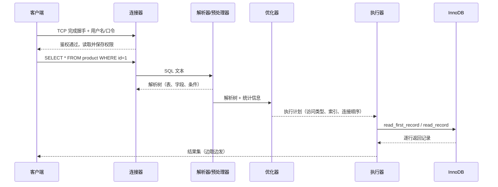
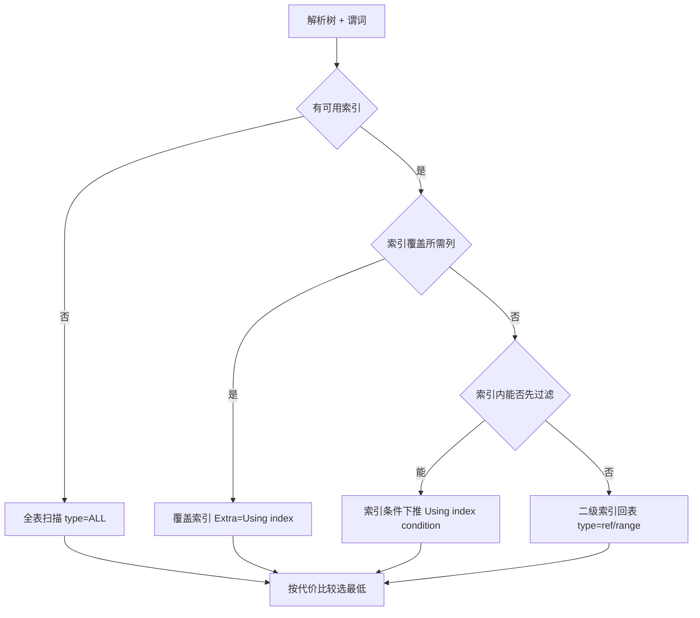
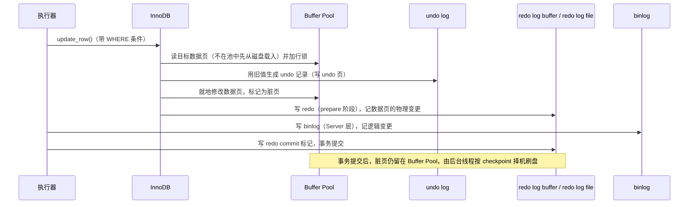

---
tags:
  - 中间件/MySQL
---

# MySQL 架构与执行流程

一条 SQL 从客户端发出到结果返回，会依次穿过连接管理、词法语法分析、语义检查、代价优化、执行调度，最后落到存储引擎的读写接口上。这条路径是固定的，每一站的职责和产出也固定；把它拆清楚，是把「查询为什么慢」「连接为什么打满」「同一条 SQL 在两台机器上计划不同」这类问题定位到具体环节的前提。

本篇按「一条 SELECT 走一遍 → 每一站展开 → 连接与线程 → 优化与执行计划 → 一条 UPDATE 多出什么 → 版本演进 → 故障排查」组织。存储引擎内部的数据页布局、B+ 树索引、Buffer Pool、redo / undo / binlog 的细节各自独立成篇，这里只在链路里给出定位：读到哪一步该去翻哪一篇。

## 1. 两层架构

### 1.1 Server 层与存储引擎层

MySQL 的进程内结构分成两层，边界由职责划开，而不是由源码目录划分。

**Server 层**负责「把一条 SQL 变成一个可执行的计划，并驱动下层取数」。连接器、解析器、预处理器、优化器、执行器都在这一层；另外，所有内置函数（日期、时间、数学、加密）、存储过程、触发器、视图，以及跨存储引擎的能力（权限判断、`binlog`、主从复制）也在这里实现。之所以跨引擎的能力放在 Server 层，是因为它们对「数据存在哪个引擎」不敏感，做在下面反而要在每个引擎里重复一遍。

**存储引擎层**负责「数据怎么存、怎么取」。InnoDB、MyISAM、Memory 都是这一层的具体实现，数据页、索引结构、事务、锁、缓冲都在这里。自 MySQL 5.5 起，InnoDB 成为默认存储引擎，此后新版本都以此为准（来源：MySQL 8.0 Reference Manual, 15.1 InnoDB Introduction）。

两层的划分带来一个直接后果：Server 层是唯一的，引擎是可替换的。同一个 `SELECT` 语句，在 InnoDB 表和 MyISAM 表上走的 Server 层代码完全一样，差别全部体现在引擎层的接口实现里。

### 1.2 引擎可替换与 handler 接口

两层之间靠一组约定好的函数接口通信，MySQL 内部称这一层为 `handler`。Server 层不直接碰数据页，它只调用 `handler` 暴露的方法，每个存储引擎各自实现这一套方法。

接口按操作粒度分成两类。面向表的是 `create()`、`drop()`、`open()`、`close()` 这类，对应 DDL；面向行的是 `write_row()`、`update_row()`、`delete_row()`、`rnd_next()`（顺序读下一行）、`index_read()`（按索引定位）这类，对应 DML。`INSERT` 最终落到 `write_row()`，`UPDATE` 落到 `update_row()`，`DELETE` 落到 `delete_row()`（来源：MySQL 8.0 Reference Manual, 15.1 InnoDB Introduction；接口名以 MySQL 5.x / 8.0 源码 `handler` 抽象类为准）。

**这个边界的实际意义**，是让「换引擎」不必改 SQL。InnoDB 与 MyISAM 在接口层面给出的保证不同：

| 能力 | InnoDB | MyISAM |
| --- | --- | --- |
| 事务 | 支持（`COMMIT` / `ROLLBACK`） | 不支持 |
| 锁粒度 | 行级锁 | 表级锁 |
| 崩溃恢复 | 依赖 redo log 重做 | 无 WAL，崩溃后需修表 |
| 索引 | 聚簇索引，数据即主键 B+ 树叶子 | 非聚簇，索引与数据分离 |

差别只点到接口层面：Server 层在执行器里调用的是同一批方法名，但同一个方法在 InnoDB 里会走事务、锁与日志，在 MyISAM 里不会。InnoDB 的实现细节见 [[02-InnoDB 存储结构：表空间、页与行格式]]，索引结构见 [[03-索引与 B+ 树]]。

### 1.3 一条 SQL 在两层的落点

把一条 `SELECT * FROM product WHERE id = 1` 放进两层结构里，落点是这样：

```text
   ┌──────────────────────────── Server 层 ─────────────────────────────┐
   │                                                                    │
   │   连接器 ──▶ 解析器 ──▶ 预处理器 ──▶ 优化器 ──▶ 执行器              │
   │     │                                      │                       │
   │   权限快照                            执行计划（选哪个索引）          │
   │                                                                    │
   │   内置函数 / 存储过程 / 触发器 / 视图 / binlog / 权限               │
   └───────────────────────────────┬────────────────────────────────────┘
                                   │  handler 接口（逐行调用）
                                   ▼
   ┌─────────────────────────── 存储引擎层 ─────────────────────────────┐
   │                                                                    │
   │   InnoDB（默认）  │  MyISAM  │  Memory  │  ...                      │
   │   ├─ 数据页 / B+ 树索引                                            │
   │   ├─ Buffer Pool / Change Buffer                                   │
   │   └─ undo log / redo log                                           │
   └────────────────────────────────────────────────────────────────────┘

   分工一句话
     Server 层决定「怎么取」：选中哪条路径、按什么顺序拼装结果
     引擎层决定「从哪取、怎么保证一致」：定位数据页、加锁、写日志
```

图中每个方块在下面都有独立小节。读的时候记住一条：Server 层不知道数据长什么样，它只认「引擎答应给我的记录」；引擎层不知道 SQL 想干什么，它只认「执行器叫我取哪一行」。

两层结构还有一条常被忽视的边界：Server 层的判断只基于「引擎返回的记录流」，看不到存储布局。同一个谓词「索引里能否先过滤」由引擎决定（§2.8），Server 层只负责拿到记录后再核对其余条件；优化器之所以要读引擎提供的统计信息（§4.2），也是因为它自己不持有数据。

这条边界直接决定排查方向。`SELECT` 长时间不返回，若 `State` 停在 `Sending data` 且 `EXPLAIN` 显示走了索引，方向是引擎扫描的行数（表大、选择性差）；若 `State` 停在 `Waiting for table metadata lock`，方向是 Server 层持有的元数据锁。两者都在「执行阶段」，一个要改计划，一个要查锁。

## 2. 一条 SELECT 的执行路径

### 2.1 五阶段的输入与输出

一条 `SELECT` 在 Server 层依次经过五个阶段：连接器、解析器、预处理器、优化器、执行器。查询缓存曾在其中排第二，MySQL 8.0 之后已不存在（见 §2.3）。每一步的输入、输出与典型报错：

| 阶段 | 输入 | 输出 | 失败时的报错 |
| --- | --- | --- | --- |
| 连接器 | TCP 流、用户名与口令 | 已鉴权连接、权限快照 | `ERROR 1045 Access denied for user` |
| 解析器 | SQL 文本 | 语法树（token 序列 → 抽象语法树） | `ERROR 1064 You have an error in your SQL syntax` |
| 预处理器 | 语法树 | 语义补全后的语法树（表、列已解析） | `ERROR 1146 Table 'db.t' doesn't exist` |
| 优化器 | 语法树 + 统计信息 | 执行计划（访问路径、连接顺序） | 不报错，但可能选到低效计划 |
| 执行器 | 执行计划 | 结果集（逐行交付） | `ERROR 2013 Lost connection to MySQL server during query` |

把这条路径按参与角色画成时序：



下面逐站展开。要注意这条链路上「谁负责检查什么」有明确分工：解析器只看语法，预处理器才看表和字段是否存在，优化器在多个可行计划里挑一个，执行器按计划驱动引擎。

语法树是带结构化字段的对象树，而非文本树：语句类型（`SELECT` / `UPDATE` / DDL）、涉及的表列表、投影列、`WHERE` 谓词、`ORDER BY` / `GROUP BY` / `LIMIT` 各自是独立节点。后续模块按节点取用，不必再解析字符串，这也是「同一份解析结果能被预处理、优化、执行反复使用」的前提。

五阶段的失败是**从前到后短路**的：连接器失败不会进入解析器，解析器失败不会进入预处理器，依此类推。同一条 SQL 报出的第一个错误就对应最靠前的那个环节，报错信息本身就是定位线索。反过来，报错靠后不代表前面没问题——优化器选错计划不报错，只在执行变慢时暴露（§4）。

阶段之间还有一层用途：解析结果可被预处理语句复用。客户端用二进制协议 `PREPARE` 一次、`EXECUTE` 多次时，词法与语法分析只做一次，重复执行省下的是解析开销，`EXECUTE` 仍会重新做优化与执行。

### 2.2 连接器：建连与鉴权

客户端连接 MySQL 的第一步是建立 TCP 连接。MySQL 服务没启动时，客户端报 `Can't connect to MySQL server`；这一步失败与本机端口、防火墙或服务进程有关，跟 SQL 无关。TCP 建立后，连接器开始校验用户名与口令，口令不对返回 `ERROR 1045 Access denied for user`，客户端进程随即结束。

口令通过之后，连接器读取该账号的权限并保存在连接对象里。**后续这条连接上的所有操作，都以连接建立时读到的这份权限为准**。因此管理员在中途修改了某个用户的权限，不会影响已经存在的连接，只有新建的连接才会用新权限（来源：MySQL 8.0 Reference Manual, 7.1.12）。排查「改了权限怎么还生效」这类现象时，先怀疑旧连接仍持有旧权限快照。

连接处理的线程模型见 §3.1。

建立一条连接要经过两个层次：先完成 TCP 握手（网络层），再走 MySQL 自己的握手协议（协议层，交换版本、能力标志、字符集），最后是鉴权。这三段任一失败，报错不同：TCP 层失败报 `Can't connect to MySQL server`，鉴权失败报 `ERROR 1045 Access denied`。`ERROR 1045` 与账号是否存在、口令是否正确、来源主机是否被允许都有关；MySQL 8.0 默认使用 `caching_sha2_password` 认证插件，客户端版本过旧会因此报认证错误，这是升级后连不上的常见原因。

连接建立后，服务器为它分配线程（§3.1）与会话级内存。权限快照、字符集、会话变量都绑定在这条连接上，`SET SESSION` 只影响当前连接，`SET GLOBAL` 才影响后续新建连接。区分「改哪个变量该重启、该断连还是即时生效」，看变量的 `Scope`（Global / Session）与 `Dynamic`（Yes / No）两列（来源：MySQL 8.0 Reference Manual, 7.1.8）。

### 2.3 查询缓存：5.7 的存在与 8.0 的移除

MySQL 5.7 及更早版本里，连接器之后是查询缓存（Query Cache）。它以 `key-value` 形式存在 Server 层内存中：`key` 是 SQL 文本，`value` 是这条语句的结果集。命中则直接把结果返回，跳过后面所有阶段；未命中则继续执行，执行完把结果写回缓存。

它的问题出在失效粒度上。**只要一张表发生过任何写操作，这张表的全部查询缓存都会被清空**。于是在写多读少、或者表更新频繁的场景下，缓存刚存进去就失效，命中率极低。一个刚缓存了大结果的查询，还没被复用，同表的一次写就把它清掉了。

设计上试过补救但没有闭环：`query_cache_type` 可设为 `DEMAND` 让缓存只对显式声明 `SQL_CACHE` 的语句生效，`query_cache_size` 用来限制缓存总大小。即便如此，维护缓存本身要额外的互斥与失效遍历，写入路径的收益始终抵不过管理开销。

**MySQL 8.0 直接移除了 Server 层查询缓存**，执行一条查询语句不再经过这一阶段（来源：MySQL 8.0 Reference Manual, 3.5 Changes in MySQL 8.0）。移除之后并不需要替代品，原因有二：

1. 真正的读加速来自 InnoDB 的 Buffer Pool（见 [[07-日志、Buffer Pool 与崩溃恢复]]），它缓存的是数据页，粒度更细、失效只按页走，写数据页不会把整表作废；
2. 结果级缓存在应用侧做更合适——应用更清楚「这份数据能容忍多久的陈旧」，而数据库对结果集的新鲜度没有语义信息。

需要分清两个容易混同的东西：被移除的是 Server 层的查询缓存，它缓存的是**SQL 文本到结果集**的映射；InnoDB 的 Buffer Pool 缓存的是**磁盘页到内存页**的映射，两者层级和对象都不同。

### 2.4 解析器：词法与语法分析

解析器接收 SQL 文本，产出语法树，分两步。

**词法分析**把字符串切成 token，并识别其中的关键字。`select username from userinfo` 被切成四个 token：关键字 `select`、标识符 `username`、关键字 `from`、标识符 `userinfo`。

**语法分析**按 MySQL 的语法规则判断 token 序列是否合法，合法则构建语法树。语法树让后续模块能按结构读取 SQL 类型、表名、字段名、`WHERE` 条件，而不必再去解析字符串。语法错误在这一步报出，例如把 `from` 拼成 `form`，返回 `ERROR 1064 You have an error in your SQL syntax`。

**一个常被讲错的点**：解析器只负责语法和建树，不检查表或字段是否存在。`SELECT * FROM nonexist_table` 能通过解析器，报 `Table doesn't exist` 发生在后面的预处理器。这一结论对 MySQL 5.7 与 8.0 都成立，只是两版把「检查表/字段存在性」放在流程中的位置不同（见 §2.5）。

词法分析与语法分析由 `sql_yacc.yy` 一类语法文件驱动的解析器完成，`SELECT`、`INSERT`、`UPDATE`、`DELETE`、DDL 各有对应的语法产生式，解析成功后得到的是 `LEX` 加解析树节点的结构。报错时客户端拿到 `ERROR 1064` 与出错位置附近的 token，据此定位到「哪一段没写完、哪个关键字拼错」。

解析阶段还做一件与后续相关的事：识别语句类型，决定走查询还是写入路径。MySQL 5.7 里这一步紧接着查询缓存的查找（先判语句类型，只有 `SELECT` 才进缓存）；8.0 移除缓存后语句类型判断仍保留，只是不再用于缓存查找。

### 2.5 预处理器：语义检查与展开

预处理器（prepare 阶段）在语法树基础上做语义层面的补全，主要两件事：

1. **检查表和字段是否存在**。不存在则报 `ERROR 1146 Table 'db.t' doesn't exist`。这是「解析器不查表」结论的直接证据——报错发生在这一步。
2. **把 `select *` 里的 `*` 展开为表上的所有列**。展开后优化器和执行器看到的是显式列清单。

MySQL 8.0 把表/字段存在性检查放在 prepare 阶段；MySQL 5.7 则把它放在词法语法分析之后、prepare 阶段之前。两版位置不同但结论一致：都不在解析器里做（来源：MySQL 8.0 Reference Manual, 15.2.13 SELECT Statement 中关于 prepare 的描述；两版内部流程差异见 MySQL 8.0 源码 `get_table_share()` 的调用位置）。

### 2.6 优化器：生成执行计划

预处理器之后，优化器为这条 SQL 制定执行计划。它要回答的问题包括：用哪个索引、多表连接按什么顺序、`WHERE` 条件在哪一层过滤。计划一旦定下，执行器只能照做。

一个具体例子说明「同一结果、不同成本」：表 `product` 有主键索引 `id` 与普通索引 `name`，执行

```sql
select id from product where id > 1 and name like 'i%';
```

既可用主键索引，也可用 `name` 索引。这条查询涉及的两个列 `id` 与 `name` 都在 `name` 索引里（二级索引叶子存的是主键值），于是走 `name` 索引即可拿到全部所需列，属于覆盖索引，无需回表；走主键索引反而要扫更大的 B+ 树。优化器基于成本比较，选择代价更小的 `name` 索引，`EXPLAIN` 里 `key = name`、`Extra = Using index`。

优化器基于代价而不是规则，代价从哪来、有哪些可选路径，见 §4。

优化器要枚举的不止一个维度。以一条多表连接为例，候选计划的组合空间是「每张表用哪个访问路径 × 表之间的连接顺序 × 每个子查询用什么策略」。子查询可被改写成半连接（semi-join）、物化（materialization）或派生表（derived table），每种对应不同的执行计划，`optimizer_switch` 里的 `semijoin`、`materialization`、`derived_merge` 就是这些策略的开关（§4.5）。穷举全部组合不现实，优化器按代价剪枝：先定连接顺序，再逐表选路径，遇到子查询再套一层策略选择。

`EXPLAIN` 能直接看优化器最终选了哪条路径；`EXPLAIN ANALYZE`（8.0.18+）能看它估得准不准（§4.4）；想追优化器的决策过程本身，用 `optimizer_trace`（开启后查 `information_schema.OPTIMIZER_TRACE`），代价模型的每一轮淘汰都在里面，但它体积大、格式随版本变，只在前几步都定不了位时才用。

### 2.7 执行器：按计划逐行取数

执行器拿到执行计划后，开始真正取数。它与存储引擎的交互**以记录为单位**：一次要一行，引擎返回一行，循环往复直到引擎报告读完。

执行器的核心是一个 `while` 循环（源码里是 `sub_select` 一类函数），循环体调用 `handler` 上两个函数指针：

- 第一次调用 `read_first_record`，定位符合条件的第一条记录；
- 之后每次调用 `read_record`，取「下一条」；当引擎返回 `HA_ERR_END_OF_FILE`（读到末尾）时，循环退出。

以 `select * from product where id = 1` 为例，走主键等值查询（访问类型 `const`）：执行器第一次调用把 `id = 1` 交给引擎，引擎用主键 B+ 树定位到记录并返回；执行器判断记录满足条件后发往客户端；第二次调用 `read_record` 时，因为 `const` 访问已知唯一，函数指针被指向一个恒返回「结束」的实现，循环立即退出。

全表扫描（访问类型 `ALL`）走的是同一套循环，区别在于 `read_first_record` 与 `read_record` 都指向引擎的全扫描接口，逐行返回，执行器逐行判断 `WHERE` 条件，满足则发往客户端，不满足则跳过，直到引擎报告读完。

**一个容易误解的细节**：执行器每从引擎取到一行就可能发往客户端，客户端显示时却像是「等查询完成才一次性显示」，原因是客户端做了结果缓冲。要观察「边取边发」的行为，得看客户端是否开启流式读取（如 `mysql` 客户端默认缓冲，驱动层的 `streaming result` 才逐行消费）。

### 2.8 引擎层取数的三种方式

执行器调用引擎接口时，实际发生什么取决于访问类型。三种典型方式：

```text
   ① 主键等值查询（const）
      Server ──id=1──▶ 引擎 ──B+树定位──▶ 命中/未命中 ──▶ 一行或报"找不到"
      代价：一次树下降，与表规模对数相关

   ② 全表扫描（ALL）
      Server ◀─逐行── 引擎 ──沿主键顺序遍历所有数据页──▶
      代价：扫描全表行数，命中再过滤，可用的过滤手段少

   ③ 索引条件下推（ICP）
      不开 ICP：Server ◀─回表后的整行── 引擎（每条二级索引记录先回表）
      开  ICP：引擎先用索引里的列过滤，通过者才回表
              └─ 索引里的列可判定的条件，在引擎内就地算完，减少回表次数
```

索引条件下推（Index Condition Pushdown, ICP）在 MySQL 5.6 引入，`optimizer_switch` 中 `index_condition_pushdown` 默认为 `on`（来源：MySQL 8.0 Reference Manual, 8.9.2）。

以联合索引 `(age, reward)` 和查询 `select * from t_user where age > 20 and reward = 100000` 为例。联合索引遇到范围条件（`>`、`<`）会停止继续匹配后面的列，因此 `reward` 用不上索引定位，只有 `age` 能定位。不开 ICP 时，引擎每定位到一条满足 `age > 20` 的二级索引记录就要回表拿整行，再交给执行器判断 `reward`；开了 ICP 后，`reward` 本来就在联合索引里，引擎可以先在索引层判断 `reward = 100000`，不满足的直接跳过、不回表，满足的才回表。`EXPLAIN` 的 `Extra` 显示 `Using index condition` 即表示用了 ICP。

### 2.9 常见故障与排查（衔接）

§2 讲的是正常路径，把这条路径上的每一步与一种典型故障对应起来，能直接用于定位：

| 卡在哪一步 | 现象 | 先看什么 |
| --- | --- | --- |
| 连接器 | `Too many connections`、建连慢 | `max_connections`、`SHOW FULL PROCESSLIST`（§7.1） |
| 解析器 | `ERROR 1064` | SQL 文本本身，与数据无关 |
| 预处理器 | `ERROR 1146 Table doesn't exist` | 库名、表名、当前 `USE` 的库 |
| 优化器 | 语句不报错但很慢 | `EXPLAIN` 看 `type` / `key` / `Extra`（§4.3） |
| 执行器 / 引擎 | 语句长时间不返回 | `SHOW FULL PROCESSLIST` 的 `State`、`SHOW ENGINE INNODB STATUS`（§7.2） |

后文 §7 把这套排查展开成可操作的顺序。

## 3. 连接与线程模型

### 3.1 one-thread-per-connection

MySQL 默认的连接处理模型是 `one-thread-per-connection`：每接受一个客户端连接，就分配一个专门的服务线程，该连接上的所有 SQL 都在这个线程里执行。系统变量 `thread_handling` 的默认值即为此（来源：MySQL 8.0 Reference Manual, 7.1.8）。

```text
   客户端 A ──▶ ┌──────────┐
   客户端 B ──▶ │ 监听线程  │  accept 新连接
   客户端 C ──▶ └────┬─────┘
                     │ 每来一个连接，分配或复用线程
          ┌──────────┼──────────┐
          ▼          ▼          ▼
      ┌────────┐ ┌────────┐ ┌────────┐
      │ 线程 A  │ │ 线程 B  │ │ 线程 C  │   各自独立，阻塞互不影响
      └───┬────┘ └───┬────┘ └───┬────┘
          │          │          │
          ▼          ▼          ▼
      ┌──────────────────────────────┐
      │  线程缓存 thread_cache_size    │  连接断开后线程不销毁，
      │  空闲线程复用，省去创建/销毁开销 │  放进缓存等待下一个连接
      └──────────────────────────────┘
```

模型的代价：连接数大时线程数跟着涨，每个线程有独立栈（`thread_stack`，8.0 默认 286720 字节，约 280 KB）与线程级缓冲，内存占用与上下文切换都随连接数上升。这也是连接不宜开满、需要连接池的原因之一。

MySQL 企业版提供线程池（`thread_pool`）插件，把「一连接一线程」改成「一批线程服务一批连接」，社区版没有该插件。社区版应对高并发短连接的常规做法是调大 `thread_cache_size` 并引入连接池（见 §3.4）。

### 3.2 连接相关参数

下面每个参数按「默认值 → 语义 → 何时改 → 改动后果 → 联动 → 失败模式」给出。默认值均取自 MySQL 8.0 官方文档 7.1.8 节。

**`max_connections`**

- 默认值：`151`（范围 1–100000）。
- 语义：服务器允许的最大并发连接数（含空闲连接）。
- 何时改：单机要承载的连接数超过默认值时。
- 改动后果：调大直接抬高内存上限，因为每个连接都占线程栈与线程级缓冲；调小则更容易触发拒绝。
- 联动：`thread_cache_size` 的自动值由它推导；`max_user_connections` 限制单账号连接数。
- 失败模式：到顶后新连接报 `ERROR 1040 Too many connections`。注意有一个为 `CONNECTION_ADMIN`（或旧版 `SUPER`）账号保留的额外连接槽，管理员仍能连进去处理。

**`thread_cache_size`**

- 默认值：`-1`，表示自动计算（范围 0–16384）。自动值公式为 `8 + (max_connections / 100)`，上限封顶 100（来源：MySQL 8.0 Reference Manual, 7.1.8）。
- 语义：连接断开后保留多少空闲线程供复用。
- 何时改：短连接很多、`Threads_created` 持续快速增长时调大。
- 改动后果：每个缓存线程约占一个 `thread_stack`，调大主要消耗内存；调得过小则建连时频繁创建线程，增加延迟。
- 联动：观察 `Threads_created` / `Connections` 的比值判断是否命中；若应用用了连接池（长连接），此参数几乎无用。
- 失败模式：缓存太小不是错误，只是建连变慢，表现为 `Connections` 高而 `Threads_cached` 低。

**`back_log`**

- 默认值：`-1`，表示自动计算；自动值在 8.0 等于 `max_connections`，在 5.7 为 `50 + (max_connections / 5)`（来源：MySQL 8.0 Reference Manual, 3.5）。
- 语义：TCP 连接已建立但尚未被 MySQL 主线程 `accept` 的请求队列长度。
- 何时改：瞬时并发建连压力大、且操作系统 `somaxconn` 足够时。
- 改动后果：它只在「建连风暴」的窗口起作用，平时空闲；实际有效值受内核 `somaxconn` 限制。
- 联动：受 `net.core.somaxconn` 约束；与 `max_connections` 一起看。
- 失败模式：队列满时新连接被内核丢弃，客户端侧看到连接超时或 `ERROR 2003`。

**`wait_timeout` 与 `interactive_timeout`**

- 默认值：均为 `28800` 秒（8 小时）。`wait_timeout` 最大值在非 Windows 平台是 31536000，Windows 上是 2147483。
- 语义：`wait_timeout` 管非交互连接的空闲超时，`interactive_timeout` 管交互式客户端（如 `mysql` 命令行）的空闲超时。
- 何时改：连接池与数据库之间常有长达数小时的空闲连接，把两者一起调小可回收僵尸连接。
- 改动后果：调小能让空闲连接更快释放，但若客户端保活周期大于该值，连接会被服务端单方面断开，客户端下一次请求才收到 `ERROR 2013 Lost connection to MySQL server during query`。
- 联动：连接池的 `maxLifetime` / `idleTimeout` 必须小于服务端超时，否则池里握着一堆已被服务端关掉的连接。
- 失败模式：服务端断开空闲连接后客户端不会立即感知，直到下一次发请求才报错；`SHOW PROCESSLIST` 里断开前是 `Sleep` 状态。

**`thread_stack`**

- 默认值：8.0 为 `286720` 字节（约 280 KB）。
- 语义：每个连接线程的栈大小。
- 何时改：出现栈溢出、或存储过程 / 深层递归报栈相关错误时检查是否被调小。
- 改动后果：调大增加每连接内存占用；调小在高负载下可能栈溢出。
- 联动：与 `thread_cache_size`、整体内存规划一起算。
- 失败模式：栈不足时线程崩溃或报错，表现为连接异常断开。

把参数联动与失败模式收在一张表里，便于排查时对号入座：

| 现象 | 最可能的参数 | 判据 |
| --- | --- | --- |
| `ERROR 1040 Too many connections` | `max_connections` 偏小 / 连接未回收 | `Threads_connected` 逼近上限 |
| 建连延迟高、`Threads_created` 持续增长 | `thread_cache_size` 偏小 | `Threads_created / Connections` 比值高 |
| 客户端报 `Lost connection` 但空闲时正常 | `wait_timeout` / `interactive_timeout` 小于池保活 | 连接在 `Sleep` 后下一次请求报 2013 |
| 建连风暴时部分连接超时 | `back_log` 或内核 `somaxconn` 偏小 | 瞬时并发建连、队列被丢弃 |
| 每连接内存占用异常高 | `thread_stack` 或线程级缓冲偏大 | `max_connections × 单连接内存` 估算 |

调整顺序的建议：先确认是「连接被占住」还是「容量不足」，再动参数。把 `max_connections` 直接调大而不处理泄漏或慢查询，只是把打满的时间点往后推。

### 3.3 长连接与短连接

按建连频率，连接分两类：

```text
   短连接                          长连接
   TCP 三次握手                     TCP 三次握手
   鉴权                            鉴权
   执行 SQL                         执行 SQL ──▶ 执行 SQL ──▶ ...（复用）
   TCP 四次挥手                     TCP 四次挥手
```

- **短连接**每次操作都重新建连、断连，开销集中在 TCP 握手、鉴权、线程创建上；连接建立时的权限读取与线程分配每次都要重来。
- **长连接**复用一条已鉴权的连接，省掉重复的建连成本，是常规推荐。代价是连接期间用到的会话级内存（临时表、`sort_buffer` 等）在连接生命周期内不归还，长连接积累多时进程内存持续走高；如果被系统 OOM killer 盯上，会出现 MySQL 异常重启。

两条缓解路径：

1. **定期断开长连接**。断开即释放会话内存，代价是下一段要重新建连鉴权。
2. **客户端主动重置连接**。MySQL 5.7 起提供 `mysql_reset_connection()` 接口（注意是接口函数，不是 SQL 命令），客户端在完成一次大操作后调用它，可释放会话内存并恢复连接状态，且不需要重连和重新鉴权。

工程上的取舍是：连接池开启保活、配合一个小于服务端 `wait_timeout` 的池内空闲超时；确有大查询引发内存膨胀时，用 `mysql_reset_connection()` 而非直接断开。

### 3.4 连接池的边界

连接池位于应用与 MySQL 之间，维护一批已建立的连接供业务复用。它解决三件事：

- **削减建连开销**：业务拿连接是本地操作，不必每次 TCP 握手 + 鉴权；
- **限制并发**：池的容量即应用侧对数据库的并发上限，避免业务突发放大数据库压力；
- **统一回收**：连接泄漏、空闲超时、失效重连都在池内处理。

它**不解决**三件事，这几条是排查时最容易归错因的地方：

1. **不缩短单条慢查询的耗时**。慢查询占着连接不放，池子再大也只是把等待从数据库搬到池的获取超时上。
2. **不能替代 `max_connections` 的规划**。数据库上的总连接数是所有应用实例池大小之和，再加上管理连接与后台连接。多实例部署时，若每个实例配 50 而 `max_connections` 只有 151，扩容到第 4 个实例就会打满。
3. **不感知服务端超时**。池的空闲超时必须小于服务端 `wait_timeout` / `interactive_timeout`（§3.2），否则池里留着已被服务端关闭的连接，取出来用直接报 `Lost connection`。

一个常用的经验关系：`max_connections` 应留出余量，大约等于「各实例池大小之和 × 1.1 + 管理连接」，而不是刚好等于池之和。

连接池与数据库之间还有一层超时对齐问题，配错时的表现很有辨识度：

| 池配置 | 服务端配置 | 结果 |
| --- | --- | --- |
| `maxLifetime` < `wait_timeout` | 默认 28800 | 正常，池主动换连接 |
| `maxLifetime` > `wait_timeout` | 默认 28800 | 池里留有已被服务端关掉的连接，取出即报 `Lost connection` |
| `idleTimeout` > `wait_timeout` | 调小后 | 空闲连接被服务端先关，池无感知 |

连接池通常还会做「连接有效性检测」（`validationQuery` 或 JDBC 的 `isValid()`），这一步在取连接时多一次往返，配成「每次取出都检测」会吃掉一部分复用收益，较优做法是只检测空闲过久的连接。这些都属于池的职责，数据库侧看不到。

### 3.5 `SHOW PROCESSLIST` 看到什么

`SHOW PROCESSLIST` 列出当前连接与线程状态，是连接层排查的第一条命令；`SHOW FULL PROCESSLIST` 会额外显示完整的 `Info` 列（正在执行的完整 SQL），普通用户只能看到自己的连接，持 `PROCESS` 权限者可看全部（来源：MySQL 8.0 Reference Manual, 15.7.7.29 SHOW PROCESSLIST Statement）。

关键列：

| 列 | 含义 | 排查读法 |
| --- | --- | --- |
| `Id` | 连接标识 | `KILL <Id>` 用它定位目标连接 |
| `User` | 连接账号 | 判断是谁的连接、是否异常账号 |
| `Host` | 客户端地址与端口 | 定位是哪台应用实例 |
| `db` | 当前默认库 | 是否与预期一致 |
| `Command` | 线程当前在做什么 | `Sleep` 空闲；`Query` 正在执行；`Connect` 建连中 |
| `Time` | 当前状态已持续秒数 | `Sleep` 时是空闲时长；`Query` 时是已执行时长，判断是否卡住 |
| `State` | 线程状态细分 | 见 §7.2，是判断「卡在锁 / 卡在排序 / 正在发送结果」的关键 |
| `Info` | 正在执行的 SQL | 定位到具体语句 |

一个典型用法：大量连接处于 `Sleep` 且 `Time` 很大，说明是空闲长连接堆积，方向是连接池与超时参数；大量连接处于 `Query` 且 `Time` 很大，说明有慢查询或锁等待，方向是执行计划与锁。这两种现象处理方式完全不同，靠 `Command` 与 `State` 区分。

## 4. 优化器与执行计划

### 4.1 基于代价的优化

优化器不做「有索引就用索引」这种规则判断，而是枚举多个可行执行计划，估算每个计划的代价（cost），选最低的那个。代价模型把两类开销相加：**I/O 代价**（需要读多少数据页，尤其是随机 I/O）与 **CPU 代价**（需要比较、排序多少行）。这是 CBO（Cost-Based Optimization）的基本形态（来源：MySQL 8.0 Reference Manual, 8.9.5 The Optimizer Cost Model）。

代价估算依赖统计信息。表级统计至少有行数、平均行长、数据页数；索引级统计是索引列不同值的个数（cardinality）。估错就选错计划——这一类问题的直观表现是「同样的 SQL，换台机器或过了几天就变慢」，因为统计信息变了。

代价模型的量级可以这样理解：优化器读系统统计（表行数、数据页数）与索引统计（cardinality），按「读一个数据页的成本」与「处理一行的 CPU 成本」的常数相乘再相加。这些常数在 8.0 里可通过代价模型相关的系统变量调整（来源：MySQL 8.0 Reference Manual, 8.9.5 The Optimizer Cost Model），但绝大多数场景不该动——计划选错的根因通常是统计信息失真，而不是常数不准。

判断「优化器这次的估算对不对」有个直接手段：执行 `EXPLAIN` 之后用 `SHOW SESSION STATUS LIKE 'Last_query_cost'` 拿到上一条语句的估算总代价（单位为「随机读一个数据页」的等价次数），把它与实际执行时间对照。若估算代价远小于实际（例如估算几页、实际扫了几百万行），就说明行数估算错了；再往下就该看 `optimizer_trace`（§2.6）或先 `ANALYZE TABLE`（§4.2）。

### 4.2 可选路径、统计信息与 `ANALYZE TABLE`

执行器能用的访问路径不止「全表扫描 / 走索引」两条，优化器实际会组合出多种。以单表为例，常见的分支：



多表连接时，分支还要乘以连接顺序：`N` 张表的连接顺序有 `N!` 种排列，优化器不会穷举，而是按代价做剪枝与贪心（来源：MySQL 8.0 Reference Manual, 8.9.3 Optimizer Hints）。这就是「小表驱动大表」这类经验说法的来源——连接顺序改变了内层表被扫描的次数。

**统计信息从哪来**：InnoDB 维护索引的 cardinality 统计。开启 `innodb_stats_persistent` 时统计持久化到磁盘，随表数据变化而不是每次查询重算；表数据发生大量增删改后统计会失真，需要手工 `ANALYZE TABLE` 重新采样。诊断「明明有索引却不用」时，`ANALYZE TABLE` 是常用第一步（来源：MySQL 8.0 Reference Manual, 15.8.2 EXPLAIN Statement 的提示、15.7.3.1 ANALYZE TABLE Statement）。

### 4.3 `EXPLAIN` 怎么读

`EXPLAIN` 不执行语句，只输出优化器选定的执行计划。`SELECT`、`UPDATE`、`DELETE`、`INSERT` 等都可以加（来源：MySQL 8.0 Reference Manual, 15.8.2 EXPLAIN Statement）。关键列与读法：

| 列 | 含义 | 判读 |
| --- | --- | --- |
| `id` | 查询块编号 | 越大越先执行；相同则从上到下 |
| `select_type` | 查询块类型 | `SIMPLE` / `PRIMARY` / `SUBQUERY` / `DERIVED` |
| `table` | 访问的表 | 多表时读连接顺序 |
| `type` | 访问类型 | 优劣排序见下 |
| `possible_keys` | 可用索引 | 优化器考虑过的候选 |
| `key` | 实际选的索引 | `NULL` 表示没走索引 |
| `key_len` | 用到的索引字节数 | 判断联合索引用到几列 |
| `rows` | 预估扫描行数 | 与 `filtered` 结合估算 |
| `filtered` | 条件过滤后剩余行百分比 | 越小说明条件选择性越好 |
| `Extra` | 额外信息 | 见下 |

`type` 从优到劣的常见档位：

```text
   system > const > eq_ref > ref > range > index > ALL
     │        │        │       │       │       │       │
   单行常量  主键/唯一 唯一索引 普通索引 范围扫描 全索引扫描 全表扫描
     └──────── 越靠左越好；生产查询应尽量避免 ALL ────────┘
```

`Extra` 里几个高频取值：

- `Using index`：覆盖索引，无需回表；
- `Using index condition`：索引条件下推（§2.8）；
- `Using where`：在 Server 层对引擎返回的行再过滤；
- `Using filesort`：需要额外排序，无法靠索引序输出；
- `Using temporary`：用到临时表，常见于 `GROUP BY` / `DISTINCT` 且无法用索引。

看到 `type = ALL` 或 `key = NULL`，基本可判定这条查询没走索引；看到 `Using filesort` / `Using temporary`，方向是排序与分组能否借索引。`EXPLAIN` 只给估算值，`rows` 是统计推断，与真实行数可能差很多。

**多表 `EXPLAIN` 的读法**与单表不同：`id` 相同的行从上到下就是连接顺序，`table` 列出各表，`rows` 是该步预估扫描行数。判读重点是「谁在驱动谁」——`type` 更好的一行通常是驱动表，其后是被驱动表；被驱动表的 `rows` 会被驱动表的行数放大，所以「小表驱动大表」能减少总扫描量。`filtered` 与 `rows` 相乘是估算的中间结果集大小，它过大往往是连接条件选择性差的信号。

**`key_len` 判断联合索引用到几列**：联合索引 `(a, b, c)` 上，`key_len` 反映实际用于定位的前缀字节数。以 `int`（4 字节，允许 `NULL` 时 5 字节）与 `varchar`（`utf8mb4` 下 `n` 字符最多 `4n` 字节，另加 2 字节长度）为例，`key_len` 每增加一列就加上该列的开销。把 `key_len` 与列宽对照，能看出「以为用到了三列、实际只用到一列」这类问题。

**`EXPLAIN` 的输出格式**：默认是传统表格；`EXPLAIN FORMAT=JSON` 给出结构化信息（含成本估算、`used_columns`、`attached_condition` 等表格里没有的字段）；`EXPLAIN FORMAT=TREE` 用树形展示访问路径，也是 `EXPLAIN ANALYZE` 唯一支持的格式（§4.4）。`EXPLAIN`（非 ANALYZE）之后执行 `SHOW WARNINGS`，能看到优化器重写后的语句，用于确认子查询被改写成了什么。

**`UPDATE` / `DELETE` 也能 `EXPLAIN`**：它们的计划里多一条「要改的行是如何被找到的」，读法同 `SELECT`，重点仍是 `type` 与 `key`。排查「写了很久还没提交」时，先 `EXPLAIN` 确认它找行的方式，再去看锁（§7.2）——两条路径的耗时来源不同。

`EXPLAIN` 有一个前提要记住：它给的是**估算**，`rows` 来自统计信息而非真实计数，`type` 也只是优化器对访问方式的分类。因此 `EXPLAIN` 与 `EXPLAIN ANALYZE` 要配合看：前者告诉你选了哪条路，后者告诉你这条路实际走了多久、估算偏了多少。

### 4.4 `EXPLAIN ANALYZE` 看实际

`EXPLAIN` 的问题是只有估算，而估算可能不准。`EXPLAIN ANALYZE` 在 MySQL 8.0.18 引入，它**真的执行语句**，然后输出每个迭代器（iterator）的估算与实际对比，用 TREE 格式呈现（8.0.21 起可显式写 `FORMAT=TREE`，这也是唯一支持的格式）（来源：MySQL 8.0 Reference Manual, 15.8.2 EXPLAIN Statement；MySQL 8.0.18 Release Announcement）。

每个节点给出：估算执行代价、估算返回行数、返回第一行的时间、执行该迭代器的总时间、实际返回行数、循环次数。示例输出形态：

```text
-> Filter: (t3.i > 8)  (cost=1.75 rows=5) (actual time=0.019..0.021 rows=6 loops=1)
    -> Table scan on t3  (cost=1.75 rows=15) (actual time=0.017..0.019 rows=15 loops=1)
```

读法上的要点：**对比 `rows`（估算）与 `rows`（actual）**。若某节点估算 5 行、实际 5000 行，说明统计信息严重失真，优化器据此选的下游计划（连接顺序、索引）大概率是错的，先 `ANALYZE TABLE` 再看。`loops` 表示该节点被调用几次，连接内层节点的 `actual time` 是单次平均，总耗时要用「时间 × loops」估。

`EXPLAIN ANALYZE` 会真正执行，不要在会写数据的语句上随意使用；它支持 `SELECT`，以及多表 `UPDATE` / `DELETE`，但**不能**与 `FOR CONNECTION` 同用。

### 4.5 `optimizer_switch` 影响哪些开关

`optimizer_switch` 是一组 `on` / `off` 标志，控制优化器启用哪些策略，可全局或会话级修改（来源：MySQL 8.0 Reference Manual, 8.9.2 Switchable Optimizations）。默认几乎全为 `on`，只有四个默认 `off`：`batched_key_access`、`use_invisible_indexes`、`subquery_to_derived`、`hypergraph_optimizer`。

与本节直接相关的几个：

| 标志 | 默认 | 作用 |
| --- | --- | --- |
| `index_condition_pushdown` | `on` | 索引条件下推（§2.8） |
| `index_merge` | `on` | 索引合并（`index_merge_union` / `intersection` / `sort_union`） |
| `derived_merge` | `on` | 把派生表 / 视图 / CTE 合并进外层查询块 |
| `semijoin` | `on` | 半连接优化（`IN` / `EXISTS` 子查询） |
| `block_nested_loop` | `on` | 8.0.20 起管哈希连接（8.0.18 时另有 `hash_join` 标志） |
| `mrr` | `on` | 多范围读（Multi-Range Read） |
| `prefer_ordering_index` | `on` | 有 `ORDER BY` 且带 `LIMIT` 时倾向用有序索引 |

修改语法：`SET [GLOBAL|SESSION] optimizer_switch='opt_name=on,opt_name2=off';`。命令里若含 `default` 会先把全部重置为默认；未提及的标志保持当前值，因此可以只关一个开关；任一取值非法则整条赋值失败、`optimizer_switch` 保持原值。几个标志有依赖：`batched_key_access=on` 生效还需要 `mrr=on` 且 `mrr_cost_based=off`。

一个判断用不用得上的原则：**先看 `EXPLAIN` 确认优化器选错了，再考虑关对应开关**。直接关 `index_condition_pushdown` 或 `derived_merge` 往往是绕过症状，根因通常在统计信息（§4.2）。把 `optimizer_switch` 当调优手段之前，先确认没有失效的统计。

`optimizer_switch` 之外，还有两类更局部的控制手段，作用范围与用途不同：

- **索引提示**：`USE INDEX` / `FORCE INDEX` / `IGNORE INDEX` 写在 `FROM` 子句的表名之后，针对单条语句指定可用、强制或忽略的索引，直接覆盖优化器的索引选择。主键用名字 `PRIMARY` 引用；`FOR JOIN` / `FOR ORDER BY` / `FOR GROUP BY` 可限定提示只作用于连接、排序或分组阶段（来源：MySQL 8.0 Reference Manual, 8.9.4 Index Hints）。
- **优化器提示**：`/*+ ... */` 形式的注释提示，能影响连接顺序（`JOIN_ORDER`）、连接算法（`NO_BNL`）、半连接策略（`SEMIJOIN`）、派生表合并（`NO_MERGE`）、索引选择（`INDEX` / `NO_INDEX`）等，作用范围是单条语句，粒度比 `optimizer_switch` 细（来源：MySQL 8.0 Reference Manual, 8.9.3 Optimizer Hints）。

两者的关系可以概括成一句话：`optimizer_switch` 是会话 / 全局级的策略开关，提示是语句级的强制干预。语句中的提示优先于 `optimizer_switch` 标志。

**排查顺序上的建议**：先把 `optimizer_switch` 保持默认，用 `EXPLAIN` 确认优化器确实选错；确认后再用语句级提示做临时规避；需要改开关时优先用会话级 `SET SESSION`，或用 `SET_VAR` 写进语句注释（`/*+ SET_VAR(optimizer_switch='...') */`），避免污染其他会话。把某一项在全局关掉，影响面是整台实例的所有查询，代价远大于单条提示。

**一个关闭开关的实例**：若某条查询因 `derived_merge` 把派生表合并后反而变慢（合并后谓词下推位置改变），单条语句上加 `/*+ NO_MERGE(派生表别名) */` 即可，不必全局关 `derived_merge`。这类问题的根因往往仍在统计信息——优化器对合并后行数估算失真，先 `ANALYZE TABLE` 再决定是否用提示。

## 5. 一条 UPDATE 的完整链路

### 5.1 与 `SELECT` 的差异

一条 `UPDATE` 在 Server 层的前半段与 `SELECT` 相同：连接、解析、预处理、优化、执行器驱动引擎。差异从执行器调用引擎开始。`UPDATE` 提交的不只是「读」，还有「写」，于是多出一串必须落地的状态：找到目标行、记录旧值以便回滚、改内存页、写日志、保证崩溃后能恢复。把这些环节串成链路：



`SELECT` 走到 `IB->>BP` 的读路径就结束了；`UPDATE` 从这一步继续往下，多了 undo、redo、binlog 和两阶段提交。

### 5.2 写入顺序与两阶段提交

链路里最容易记错的是**写入顺序**：先写 undo，再改内存页，然后 redo（prepare）→ binlog → redo（commit）。为什么 binlog 夹在 redo 的两段之间，是这套设计的关键。

redo log 与 binlog 分属两层：redo 是 InnoDB 引擎层的物理日志，记录「某个数据页做了什么修改」，用于崩溃恢复；binlog 是 Server 层的逻辑日志，记录「这条语句改了什么」，用于主从复制与基于时间点的恢复。两者必须一致，否则会出现主库与从库数据不同、或崩溃恢复后与 binlog 不符。为了让两者对同一次事务的提交结果一致，事务提交时把 redo 与 binlog 的写入拆成两阶段提交（two-phase commit）（来源：MySQL 8.0 Reference Manual, 5.4.4 The Binary Log）：

1. **prepare**：redo log 写盘并标记为 `prepare` 状态，此时事务尚未真正提交；
2. **写 binlog**：把该事务的 binlog 写入并刷盘；
3. **commit**：redo log 写 `commit` 标记，事务提交完成。

崩溃恢复时的判据由此确定：

| 崩溃时 redo 状态 | binlog 是否完整 | 恢复动作 |
| --- | --- | --- |
| `commit` | 是 | 重做该事务 |
| `prepare` | binlog 完整 | 提交该事务（保证与 binlog 一致） |
| `prepare` | binlog 不完整 | 回滚该事务 |

这条规则保证「已写入 binlog 的事务最终一定提交」，从库回放 binlog 的结果与主库崩溃恢复的结果一致。

崩溃恢复的重做、undo 的回滚、脏页的刷盘机制展开在 [[07-日志、Buffer Pool 与崩溃恢复]]。

**为什么两个日志都要有**，取决于它们各自承担的场景：

| 日志 | 层级 | 内容 | 用途 | 能否覆盖对方 |
| --- | --- | --- | --- | --- |
| redo log | InnoDB 引擎层 | 物理变更（页号 + 偏移 + 值） | 崩溃恢复 | 不跨引擎，且环状写入、不记完整历史 |
| binlog | Server 层 | 逻辑变更（语句或行事件） | 主从复制、按时间点恢复 | 不含页级信息，恢复时要逐条重放 |

两者缺一不可：redo 保证单机崩溃后能重做，但它是环状写入、内容会被覆盖，无法用于按时间点恢复或给从库回放；binlog 记全量历史、可跨引擎，但恢复时要一条条重新执行语句或行事件，比 redo 的页级重做慢。两阶段提交的作用就是把两者的「提交 / 未提交」对齐，保证任何时刻崩溃后，redo 重做的结果与 binlog 回放的结果一致。

**组提交（group commit）** 是对提交开销的进一步优化：多个并发事务的 redo 刷盘与 binlog 刷盘合并成一次 `fsync`，摊薄每次提交的磁盘同步成本。它不改变两阶段提交的顺序，只是把多个事务的第 2、3 步批量执行（来源：MySQL 8.0 Reference Manual, 5.4.4 The Binary Log）。

### 5.3 WAL 为什么先写日志

一个自然的问题：既然最终要把数据页写进磁盘，为什么不直接写数据页，而要绕一圈先写 redo log？

差别在**磁盘写入模式**。redo log 是追加写（顺序写），数据页散落在 `.ibd` 文件的各个位置（随机写）。顺序写在机械盘上远快于随机写，在 SSD 上也有可观的差距（来源：MySQL 8.0 Reference Manual, 8.5.4 Optimizing InnoDB Configuration Variables 关于日志与刷盘的说明）。先顺序写日志、再由后台慢慢把脏页刷到各自位置，把一次事务提交从「等随机 I/O」变成「等顺序 I/O」，这就是预写日志（Write-Ahead Logging, WAL）。

代价是 redo log 本身也是内存 + 磁盘两级。事务提交时若 redo 只写到了 redo log buffer 内存、还没刷盘，此刻进程崩溃，这部分变更仍会丢。所以 `redo log` 保证的是「已提交事务的变更不丢」，而非「所有数据都不丢」；`innodb_flush_log_at_trx_commit` 控制提交时 redo 的刷盘策略，取值 1（每次提交都刷）最安全、性能最低，取值 0 / 2 会在特定崩溃场景下丢最近的事务。这是写入性能与数据完整性之间的取舍点。

`innodb_flush_log_at_trx_commit` 与 `sync_binlog` 这两个参数是同一组取舍的两个旋钮，一起看：

| `innodb_flush_log_at_trx_commit` | 行为 | 崩溃时可能丢 |
| --- | --- | --- |
| `1`（默认） | 每次提交都 `fsync` redo | 不丢已提交事务 |
| `2` | 提交时写 OS 缓存，每秒 `fsync` | 最多丢 1 秒，且仅 OS 崩溃才丢 |
| `0` | 提交只写内存，每秒写盘 | 最多丢 1 秒，进程崩溃也丢 |

`sync_binlog` 同理：取 `1` 时每次提交都刷 binlog，最安全；取 `0` 交给系统，吞吐最高但崩溃可能丢。把两个都设为最安全值，单次提交要付两次同步 I/O；设得激进则吞吐上去了但可能丢最近的事务。多数线上配置取 `innodb_flush_log_at_trx_commit=1` 且 `sync_binlog=1`，因为「丢已提交事务」通常不被业务接受。

这组参数的取舍与 §3 的连接参数是同一类问题：都在「吞吐」与「一致性 / 稳定性」之间换。判断该改哪一头，看业务能容忍多久的数据丢失——容忍 0 就两边都取 1，能容忍秒级再考虑放宽。

## 6. 版本演进：5.7 到 8.0

在这条执行链路上，5.7 到 8.0 有几处影响直接可见的变化（来源：MySQL 8.0 Reference Manual, 3.5 Changes in MySQL 8.0）。

### 6.1 查询缓存移除

MySQL 5.7 的执行链路上有「查询缓存」这一站，`query_cache_type`、`query_cache_size` 用来配置它。8.0 移除了 Server 层查询缓存，这两个系统变量在 8.0 的 7.1.8 节中已不存在。

后果有三个：升级到 8.0 后依赖查询缓存的调优经验失效；`query_cache_type = DEMAND` 这类配置不再被识别，配置文件里残留会导致启动告警或报错；真正承担读加速的角色完全交给 InnoDB 的 Buffer Pool。从执行流程看，8.0 里 `SELECT` 在连接器之后直接进入解析器，不再经过缓存查找。

### 6.2 默认字符集与 `back_log` 自动值

`character_set_server` 的默认值由 `latin1` 改为 `utf8mb4`，`collation_server` 由 `latin1_swedish_ci` 改为 `utf8mb4_0900_ai_ci`。升级不会改动既有对象的字符集，只影响新建的库 / 表 / 列。`utf8mb4_0900_ai_ci` 基于 Unicode 9.0，仅 8.0 支持；5.7 服务端不认识这个排序规则，5.7 客户端向 8.0 请求 `utf8mb4` 时，实际协商到的是服务端默认排序规则。

`back_log` 的自动值算法也变了：自动值（`-1`）从 `50 + (max_connections / 5)` 改为 `max_connections`，队列更长。对建连风暴场景是改进。

### 6.3 事务型数据字典

8.0 之前，表结构等元数据存放在 `.frm` 文件和若干非事务性系统表里，配合文件系统的目录树维护。8.0 引入事务型数据字典（Transactional Data Dictionary），元数据统一存进 InnoDB 系统表，`\.frm` 文件被移除（来源：MySQL 8.0 Reference Manual, 14.1 MySQL Data Dictionary）。

对执行链路的影响在预处理器与 `handler` 打开表这两步：表定义不再从 `.frm` 读取，而是通过数据字典查询。好处是元数据修改也能进事务、崩溃可恢复，DDL 的原子性比 5.7 好；代价是 8.0 的数据字典表不能被直接修改（需通过 DDL 语句），也不能手工编辑。这一变化也让 8.0 在升级前必须做兼容性检查。

### 6.4 `EXPLAIN ANALYZE` 与哈希连接

两项 8.0.18 引入的能力直接影响 §4 的诊断手段：

- **`EXPLAIN ANALYZE`**：第一次能拿到估算与实际的逐节点对比（§4.4）。
- **哈希连接（hash join）**：对无索引的内连接，不再只能走块嵌套循环，可改用哈希连接，多数场景更快（来源：MySQL 8.0.18 Release Announcement）。它在 `EXPLAIN` / `EXPLAIN ANALYZE` 输出中显示为 `hash join` 节点。8.0.18 时由 `hash_join` 标志控制，8.0.20 起块嵌套循环的旧实现移除，改由 `block_nested_loop` 标志统一控制。

把这一节的差异收成一张对照表，升级前逐项核对：

| 项目 | MySQL 5.7 | MySQL 8.0 |
| --- | --- | --- |
| Server 层查询缓存 | 有（`query_cache_*`） | 已移除 |
| 默认字符集 / 排序规则 | `latin1` / `latin1_swedish_ci` | `utf8mb4` / `utf8mb4_0900_ai_ci` |
| 表结构元数据 | `.frm` 文件 + 非事务系统表 | 事务型数据字典 |
| `back_log` 自动值 | `50 + max_connections / 5` | `max_connections` |
| `EXPLAIN` 实际执行对比 | 无 | `EXPLAIN ANALYZE`（8.0.18+） |
| 哈希连接 | 无 | 8.0.18+ |
| `innodb_autoinc_lock_mode` 默认 | `1`（consecutive） | `2`（interleaved） |
| `log_bin` 默认 | `OFF` | `ON` |

其中 `log_bin` 从默认关闭改为默认开启，是升级时最容易被忽略的一项：8.0 默认开启 binary log，磁盘占用与写入开销都随之变化，主从与备份配置要在升级前确认。另外，8.0 默认使用 `caching_sha2_password` 认证插件，旧客户端可能因此连不上，升级前要确认客户端版本或改用兼容插件。

## 7. 常见故障与排查

### 7.1 连接数打满

现象：应用新建连接报 `ERROR 1040 Too many connections`；`SHOW FULL PROCESSLIST` 能看到大量连接。

定位顺序：

```text
   ①  SHOW STATUS LIKE 'Threads_connected';
        └─ 当前连接数与 max_connections 比，是否贴近上限
              │
              ▼
   ②  SHOW VARIABLES LIKE 'max_connections';
        └─ 上限是多少；是否被人为调小
              │
              ▼
   ③  SHOW FULL PROCESSLIST;
        └─ 连接都停在什么 Command / State
              │
              ├─ 大量 Sleep（Time 很大） ──▶ 空闲长连接堆积
              │     方向：连接池 idleTimeout、wait_timeout / interactive_timeout
              │
              └─ 大量 Query（Time 很大） ──▶ 慢查询或锁等待占住连接
                    方向：EXPLAIN（§4.3）、SHOW ENGINE INNODB STATUS 看锁
```

两条判读原则：

1. **区分「连接被占住」与「空闲堆积」**。两者都表现为「连不上」，但一是慢查询/锁，一是超时与池配置，处理方向相反。看 `Command` 与 `Time` 就能分开。
2. **先查总量，再查来源**。`Threads_connected` 接近 `max_connections`，且连接分散在多个应用实例时，是容量规划问题（§3.4）；集中在少数实例或少数 `User` 时，先排该实例的连接泄漏。

应急手段：`KILL <Id>` 断开具体连接，或 `KILL QUERY <Id>` 只终止正在执行的语句而保留连接；调整 `max_connections`（`SET GLOBAL`，8.0 可用 `SET PERSIST` 持久化）。管理员账号在打满时仍可连入，因为有保留连接槽。

定位连接打满时，除了 `SHOW PROCESSLIST`，`performance_schema` 能给出按账号 / 主机聚合的视角，适合多实例场景：

```sql
-- 每个账号当前连接数
SELECT user, current_connections FROM performance_schema.accounts;
-- 每个客户端主机的连接数
SELECT host, current_connections FROM performance_schema.hosts;
-- 前台线程的状态分布
SELECT command, state, COUNT(*) FROM performance_schema.threads
WHERE type = 'FOREGROUND' GROUP BY command, state;
```

`performance_schema.threads` 与 `SHOW PROCESSLIST` 同源，但可聚合、可按状态分组，定位「哪一类状态占得最多」比逐行看快。

**两个容易被误读的指标**：

- `Threads_connected` 是当前连接总数，`Threads_running` 是**正在执行语句**的线程数。几百个 `Threads_connected` 但 `Threads_running` 长期个位数，说明连接大多空闲，压力不大，方向是空闲超时；反过来若 `Threads_running` 长期接近 `Threads_connected`，才说明每个连接都在干活。
- `Max_used_connections` 是历史峰值（`SHOW STATUS`），用它判断「是否曾打满」比看瞬时值可靠。

**容量估算**：单连接约占一份固定的会话内存（线程栈、连接缓冲、会话级排序缓冲按需分配），把 `max_connections × 单连接内存` 与实例总内存对照，就能判断调大 `max_connections` 的空间。经验做法是让 `max_connections` 略大于「各应用池之和 × 1.1 + 管理连接」，并在实例内存里给它留出余量。

**调参之外的手段**：8.0 可用 `SET PERSIST max_connections = 1000` 把改动持久化到 `mysqld-auto.cnf`，重启不丢；单账号限流用 `max_user_connections`；`connection_control` 插件能对反复失败的连接做延迟惩罚，缓解暴力尝试。连接数问题很少单靠调大 `max_connections` 解决，处理泄漏源与慢查询才是根本。

### 7.2 `State` 列与 InnoDB 状态

`SHOW FULL PROCESSLIST` 的 `State` 列把「线程正在做什么」细分，是从「语句在跑」到「卡在哪一步」的桥梁。常用取值：

| `State` | 含义 | 方向 |
| --- | --- | --- |
| `Sending data` | 正在读取并发送结果行 | 可能是扫描行数过多，看 `EXPLAIN` |
| `Sorting result` | 正在排序 | `Using filesort`，考虑索引序 |
| `Copying to tmp table` | 写临时表 | `Using temporary`，分组 / 去重代价高 |
| `Waiting for table metadata lock` | 等元数据锁 | 有长事务 / 未提交 DDL 挡住 |
| `Waiting for table level lock` | 等表锁 | MyISAM 表或 `LOCK TABLES` 场景 |
| `locked` | 等行锁 | 行锁冲突，进 InnoDB 状态看锁 |
| `Sleep` | 空闲 | 空闲连接 |

`SHOW ENGINE INNODB STATUS` 输出 InnoDB 的运行状态与最近一段的诊断信息，排查锁与事务时主要看两块（来源：MySQL 8.0 Reference Manual, 15.7.7.15 SHOW ENGINE Statement）：

- **`TRANSACTIONS`**：当前活跃事务、各自持有什么锁、在等什么锁。`Waiting for ... lock` 与 `HOLDS THE LOCK(S)` 对冲就能看出是谁挡住了谁。
- **`LATEST DETECTED DEADLOCK`**：最近一次死锁的完整现场，含两个事务的语句、持有的锁、等待的锁与回滚结果。

配合 `performance_schema.data_locks`、`data_lock_waits`（8.0 中取代了旧版 `innodb_lock_waits`）可定位到具体连接与 SQL。

### 7.3 慢查询日志

慢查询日志记录执行时间超过阈值的 SQL，是「哪些语句在拖慢系统」的直接证据（来源：MySQL 8.0 Reference Manual, 7.1.8 中相关变量）。关键参数：

| 参数 | 默认 | 语义 | 何时改 |
| --- | --- | --- | --- |
| `slow_query_log` | `OFF` | 总开关 | 排查时开启 |
| `long_query_time` | `10`（秒，可为小数） | 超过该时长才记录 | 生产常下调到 1 甚至 0.5 |
| `log_queries_not_using_indexes` | `OFF` | 未用索引的查询也记录 | 优化索引阶段开启，需配合节流 |
| `log_throttle_queries_not_using_indexes` | `0`（不限流） | 限制每分钟记录此类查询的条数 | 开启上一项时配合，防日志风暴 |
| `min_examined_row_limit` | `0` | 扫描行数低于此值不记录 | 过滤小表扫描噪声 |
| `slow_query_log_file` | `host_name-slow.log` | 日志路径 | 指定绝对路径，确保目录可写 |
| `log_output` | `FILE` | 输出到文件或表 | 需要 SQL 查询时改 `TABLE` |

开启方式：运行时 `SET GLOBAL slow_query_log = 'ON';`，持久化则改 `my.cnf` 或 8.0 的 `SET PERSIST`。判读时按耗时排序，前几条通常已占绝大部分慢时间。

一个容易踩的坑：`log_queries_not_using_indexes = ON` 会记录所有没走索引的查询，在没走索引的小查询很多时会把日志打爆，务必配 `log_throttle_queries_not_using_indexes` 或 `min_examined_row_limit`。

### 7.4 `EXPLAIN` 读不动时的排查顺序

`EXPLAIN` 输出本身也可能看不懂，或者看完仍无方向。按下面的顺序逐层收窄，每一步都有明确的判据：

```text
   1  这条语句卡在连接层还是执行层
        └─ SHOW FULL PROCESSLIST 的 Command / State
              │  大量 Sleep ⟹ 连接层；Query 且 Time 大 ⟹ 执行层
              ▼
   2  执行层：语句是否有执行计划问题
        └─ EXPLAIN 看 type / key / Extra
              │  type=ALL 或 key=NULL ⟹ 未走索引，看谓词为何用不上
              │  Using filesort / Using temporary ⟹ 排序与分组代价
              ▼
   3  计划与实际是否一致
        └─ EXPLAIN ANALYZE（8.0.18+）
              │  估算 rows 与实际 rows 差很大 ⟹ 统计信息失真
              ▼
   4  统计信息
        └─ ANALYZE TABLE 重新采样，再 EXPLAIN 对比
              ▼
   5  引擎层：是不是锁或 I/O 把语句拖住
        └─ SHOW ENGINE INNODB STATUS 的 TRANSACTIONS / LATEST DETECTED DEADLOCK
```

判读原则：**先把「卡在连接」与「卡在执行」分开**（第 1 步），再在「执行计划不对」与「引擎受阻」之间二分（第 2、5 步）。计划不对的典型信号是 `type = ALL`、`Using filesort`、`Using temporary`；引擎受阻的典型信号是 `State = locked` / `Waiting for ... lock` 与 InnoDB 状态里的锁等待。两者可能同时出现——慢查询长时间持锁会引发链式等待，定位时要看 `Time` 最大、且 `HOLDS THE LOCK(S)` 的那一个。

## 相关

- [[00-MySQL 专栏导览]] —— 本专栏的入口、边界与阅读顺序
- [[02-InnoDB 存储结构：表空间、页与行格式]] —— 这条链路的下一层：数据落在磁盘上的哪一格
- [[07-日志、Buffer Pool 与崩溃恢复]] —— 一条 `UPDATE` 后半段（改内存、写日志、落盘）的展开

## 参考

- *MySQL 8.0 Reference Manual, 7.1.8 Server System Variables*. https://dev.mysql.com/doc/refman/8.0/en/server-system-variables.html
- *MySQL 8.0 Reference Manual, 3.5 Changes in MySQL 8.0*. https://dev.mysql.com/doc/refman/8.0/en/upgrading-from-previous-series.html
- *MySQL 8.0 Reference Manual, 8.9.2 Switchable Optimizations*. https://dev.mysql.com/doc/refman/8.0/en/switchable-optimizations.html
- *MySQL 8.0 Reference Manual, 8.9.3 Optimizer Hints*. https://dev.mysql.com/doc/refman/8.0/en/optimizer-hints.html
- *MySQL 8.0 Reference Manual, 8.9.5 The Optimizer Cost Model*. https://dev.mysql.com/doc/refman/8.0/en/cost-model.html
- *MySQL 8.0 Reference Manual, 15.8.2 EXPLAIN Statement*. https://dev.mysql.com/doc/refman/8.0/en/explain.html
- *MySQL 8.0 Reference Manual, 15.7.3.1 ANALYZE TABLE Statement*. https://dev.mysql.com/doc/refman/8.0/en/analyze-table.html
- *MySQL 8.0 Reference Manual, 14.1 MySQL Data Dictionary*. https://dev.mysql.com/doc/refman/8.0/en/data-dictionary.html
- *MySQL 8.0 Reference Manual, 5.4.4 The Binary Log*. https://dev.mysql.com/doc/refman/8.0/en/binary-log.html
- *MySQL 8.0 Reference Manual, 15.7.7.29 SHOW PROCESSLIST Statement*. https://dev.mysql.com/doc/refman/8.0/en/show-processlist.html
- *MySQL 8.0 Reference Manual, 15.7.7.15 SHOW ENGINE Statement*. https://dev.mysql.com/doc/refman/8.0/en/show-engine.html
- *MySQL 8.0 Reference Manual, 7.1.12 Connection Management*. https://dev.mysql.com/doc/refman/8.0/en/connection-management.html
- *MySQL 8.0 Reference Manual, 15.1 InnoDB Introduction*. https://dev.mysql.com/doc/refman/8.0/en/innodb-introduction.html
- *The MySQL 8.0.18 Maintenance Release is Generally Available*. MySQL Server Blog, 2019. https://dev.mysql.com/blog-archive/the-mysql-8-0-18-maintenance-release-is-generally-available/
