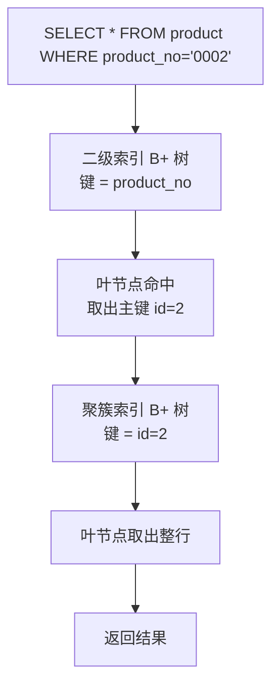
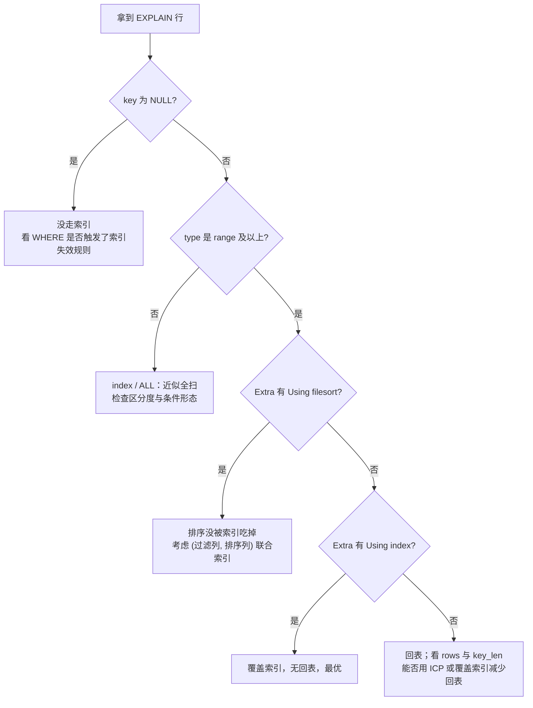

---
tags:
  - 中间件/MySQL
---

# 索引与 B+ 树

InnoDB 把数据按页存放在磁盘上，读一页就是一次磁盘 I/O。索引要解决的问题是：在一个只能按页访问、页又远大于 CPU 缓存行的存储上，用尽量少的页读取定位到目标行。InnoDB 的答案是 B+ 树——一棵每个节点正好是一个页的多叉平衡树，非叶节点只放「键 + 子页指针」，叶节点放数据。本篇围绕这棵树讲清三件事：它为什么长成这样（§4）、它怎么决定一次查询的 I/O 次数（§4、§5）、以及由此导出的使用规则（聚簇与二级索引 §3、联合索引的最左匹配 §5、前缀索引 §6、参数 §8 与排查 §9）。

数据页的内部结构（7 个部分、行格式、页目录、槽）属于 [[02-InnoDB 存储结构：表空间、页与行格式]] 的范围，本篇只把页当作「节点」来用；行锁与 MVCC 归 [[06-锁、加锁分析与死锁]]，这里不展开。

## 1. 索引是什么

要判断一个索引好不好，先要知道它由什么构成、服务哪些查询。这一节先给索引一个可操作的落点——「排好序的键 + 指向页的定位指针」，再把它的代价摊开。只有同时看清收益与代价，后面「该不该建索引」「该选什么结构」才有判据可依。

### 1.1 从「书的目录」到「排好序的定位结构」

教科书的比喻是「索引像书的目录」：目录把章节名映射到页码，省去逐页翻找。这个比喻只说到「加速查找」，没有说清索引到底是什么。数据库里的索引是两样东西的组合：

1. **一份排好序的键**（索引列的值，按升序或降序排列）；
2. **指向数据所在页的指针**（非叶节点里是子页的页号，叶节点里是行或主键）。

排序提供「快速缩小范围」的能力，指针把缩小后的位置接到磁盘上的真实位置，两者缺一不可。排序之所以值钱，是因为它一次同时给出三种能力：

| 能力 | 依赖的排序性质 | 例子 |
| --- | --- | --- |
| 等值查找 | 键有序，可二分 | `WHERE id = 5` |
| 范围查找 | 键有序，目标是一段连续区间 | `WHERE id BETWEEN 5 AND 20` |
| 顺序返回 | 结果天然按索引列排好 | `ORDER BY id` 不需要额外排序 |

哈希索引只买到第一项（等值），数组只买到前两项但要付出插入代价，只有树形有序结构同时买到三项——这是后面选型的核心判据。

InnoDB 的索引按物理结构分成两类（来源：MySQL 8.0 Reference Manual, 17.6.2.1）：

- **聚簇索引**（clustered index）：叶节点存放整行数据，所以「按主键找行」一次树下降就能拿到行；
- **二级索引**（secondary index）：叶节点存放索引列的值 + 主键值，要拿到非索引列，还得拿主键再去聚簇索引查一次。

一张 InnoDB 表**必然有且只有一个聚簇索引**，因为整行数据在物理上只存一份，就存在这棵树的叶子里；二级索引可以建多个（来源：同节）。InnoDB 索引是一棵 B-tree（空间索引用 R-tree），索引页默认大小 16 KB（来源：MySQL 8.0 Reference Manual, 17.6.2.2）。

一句容易忽略的边界：**索引是存储引擎层的能力**。「MySQL 支持哪些索引」这句话并不成立，成立的版本是「某个存储引擎支持哪些索引」——InnoDB、MyISAM、MEMORY 支持的索引类型并不相同。本篇所有机制默认限定在 InnoDB，它是 MySQL 5.5 起的默认存储引擎。

### 1.2 索引的代价

索引换来的查询加速不是免费的，代价集中在四处，理解它们才能判断「该不该建这个索引」。

**写放大。** 每一次 INSERT / UPDATE / DELETE 都要在**所有**受影响的索引树上维护有序性。表上有一个聚簇索引加 N 个二级索引，一次写入就要碰 N+1 棵树；UPDATE 改了某个被索引的列，还要先删旧键、再插新键，等于一次更新触发两次索引维护。索引越多，写越慢，这就是「经常更新的字段不要建索引」的机制来源。

```
   一次 INSERT 要维护的索引树（表上 1 个聚簇 + 2 个二级）
   ┌────────────────────────────────────────────────┐
   │ 聚簇索引 (id)              ← 插入整行              │
   ├────────────────────────────────────────────────┤
   │ 二级索引 uk (product_no)   ← 插入 (product_no, id)  │
   ├────────────────────────────────────────────────┤
   │ 二级索引 idx (name)        ← 插入 (name, id)       │
   └───────────────────────┬────────────────────────┘
                           ▼
   一次写入触及 N+1 棵树 ⟹ 写放大随索引数线性增长
   UPDATE 改被索引列时，还要在这个基数上再翻一倍（删旧键 + 插新键）
```

**空间占用。** 每个二级索引都要额外存一份「索引列 + 主键值」。主键越长，所有二级索引越大（见 §3.4）——这一点在规划表结构时常常被忽略，直到磁盘被索引吃满。

**页分裂。** 键随机插入时，新键可能落在已经写满的页中间，页必须先分裂出一页、搬走一半记录。分裂带来额外的写 I/O 与空间碎片（见 §3.5）。

**优化器可能选错。** 索引是否存在，和优化器是否用它，是两回事。统计信息不准、条件区分度低、代价估算偏差，都会让优化器放弃一个本可用的索引（见 §9.3）。这是「用了反而更慢」这类代价估算的产物，不代表索引本身没有价值。

下面这张表把代价和收益摊在一起，用来判断建不建：

| 维度 | 建索引的收益 | 建索引的代价 |
| --- | --- | --- |
| 读（WHERE / JOIN） | 等值、范围、排序都加速 | 区分度低时优化器可能仍走全表 |
| 写（INSERT / UPDATE / DELETE） | 无 | 每加一个索引多一次树维护 |
| 空间 | 无 | 索引列 + 主键值 × 行数 |
| 主键选择 | 短主键让所有二级索引变小 | 长主键（如 UUID）全面放大空间与回表成本 |

## 2. 索引的分类与判据

给索引分类容易变成名词罗列。有意义的分类方式是按「判据」分：先问用什么维度切分，每一类给出可判定的标准。四个维度分别回答不同的问题——数据结构回答「底层怎么组织」，物理存储回答「叶子里放什么」，字段特性回答「带不带约束」，字段个数回答「建在几列上」。

### 2.1 按数据结构

| 结构 | 判据 | 适用 |
| --- | --- | --- |
| B+ 树 | 有序、支持范围与等值 | InnoDB / MyISAM 的默认与主力 |
| 哈希 | 只按 `=` 定位，无法范围 | MEMORY 引擎可建；InnoDB 内部有自适应哈希索引（§7） |
| 全文 | 按词切分做倒排 | `FULLTEXT` 列，用于文本检索 |

B+ 树与哈希的取舍可以用一张表固定下来（来源：MySQL 8.0 Reference Manual, 10.3.9）：

| 维度 | B+ 树索引 | 哈希索引 |
| --- | --- | --- |
| 等值查找 | O(log_d N)，走树高次页读 | O(1)，一次定位 |
| 范围查找 | 沿叶链表顺序扫 | 不支持 |
| 排序 | 索引天然有序，可省 filesort | 不支持 |
| 最左前缀 | 支持（§5） | 不支持，必须整键匹配 |
| 页读取模式 | 等值定位 + 范围连续读 | 随机读哈希桶 |

InnoDB 里用户能显式建的只有 B+ 树索引和全文索引；哈希索引在 MEMORY 引擎上可建，在 InnoDB 上以自适应哈希索引的形式由存储引擎自动维护。哈希索引唯一的优势是等值查找，代价是完全不能做范围查找，所以它不能替代 B+ 树，只能作为热点等值访问的补充。

全文索引是另一条线：它把文本按词切分、建立「词 → 文档」的倒排表，服务的是 `MATCH ... AGAINST` 这类检索，与 B+ 树的排序模型没有关系。三条线各有各的适用场景，索引选型在 InnoDB 上基本就是在 B+ 树与自适应哈希之间做取舍，全文索引只在需要文本检索时单独引入。

### 2.2 按物理存储：聚簇索引与二级索引

判据只有一条：**叶节点存的是整行，还是主键值**。

- 叶节点存整行 → 聚簇索引，全表唯一一个；
- 叶节点存主键值 → 二级索引，可以建多个。

这条判据直接决定了「回表」是否存在：任何只靠二级索引拿不到完整行的查询，都要回到聚簇索引再走一次。之所以聚簇索引只能有一个，是因为它承载的是「表数据本身」；如果允许两个，同一份数据就要物理存两份，两份还要保持一致，这是冗余而非收益。

聚簇索引全表唯一这条约束有一个反直觉的推论：**表的主键不只是「唯一标识」，它还是物理存储的排序键**。改动主键的定义（换列、改类型、改长度）会触发聚簇索引重建，并连带影响所有二级索引里存着的主键值。这也是为什么主键类型应在建表时定好，而不是上线后再调整。

还有一个容易混的说法要澄清：`USING BTREE` 只是建索引时对访问方法的声明，并不改变索引类型。主键、唯一、普通、前缀的区分来自「约束」与「索引列的范围」，与底层是 B+ 树还是别的结构无关。

### 2.3 按字段特性

| 类型 | 判据 | 约束 |
| --- | --- | --- |
| 主键索引 | 表的主键列 | 唯一、非空、每表一个 |
| 唯一索引 | `UNIQUE` 约束 | 值唯一，允许 NULL |
| 普通索引 | 无唯一性要求 | 仅加速查找 |
| 前缀索引 | 只索引字符串的前 n 个字符 | 只能建在 `char` / `varchar` / `binary` / `varbinary` 上 |

主键索引与唯一索引的区别常被概括成一句：**主键要求非空且唯一，唯一索引要求唯一但允许 NULL**；一张表只能有一个主键，可以有多个唯一索引。唯一索引的「允许 NULL」有一个反直觉后果：多个 NULL 之间不算重复，因为 SQL 里 `NULL != NULL`，所以一列上可以插入任意多个 NULL。

唯一索引还有一个实操细节：唯一性约束本身就能让优化器把 `type` 提到 `eq_ref` 或 `const`，因为它知道每个键最多一行，查到即停。普通索引做不到这一点，即便键几乎唯一，优化器也只能按 `ref` 处理、继续在重复键附近扫描。这是「唯一约束」除了数据正确性之外的性能红利。

### 2.4 按字段个数：单列索引、联合索引、覆盖索引

单列索引建在一列上，联合索引建在多列上（§5）。这里要澄清一个容易混进来的概念：**覆盖索引不是一种索引类型**，它描述的是一种查询状态——一次查询所需的列都能在某个索引里找到，于是不必回表。同一个联合索引，对不同查询可能是覆盖的，也可能不是。把「覆盖索引」当成「要单独建的一种索引」是常见误解，它的正确读法是「这次查询被某个索引覆盖了」。

四个维度会交叉：一个索引可以同时是「B+ 树 + 唯一 + 单列」，也可以是「B+ 树 + 普通 + 联合」。分类的价值在于每次问自己「这个索引满足了哪几条判据」，而不是给它贴一个标签。

单列与联合的差别落在 §5：单列索引的最左前缀就是它自己，联合索引才有「用了几列」的问题。覆盖则是一个跨越字段个数的状态，无论单列还是联合，只要查询列被索引包含，就是覆盖。

覆盖还有一个反直觉的性质：**主键列总是被隐含地包含在每一个二级索引里**。这意味着任何只查主键的查询，用任意一个二级索引都可能是覆盖的——这是覆盖能力最容易被免费拿到的一种情形。

由此还推出一条设计习惯：如果一张表几乎不查非主键列、只按主键取行，那么二级索引对它意义不大，因为聚簇索引本身就能直接命中整行；反过来，若读写都集中在几个非主键列上，则应为这些列建二级索引，并尽量让高频查询落在覆盖区间。

## 3. 聚簇索引与二级索引

聚簇索引与二级索引是 InnoDB 索引体系的骨架：一个承载数据本身，一个承载「指向数据的键」。理解这两棵树的叶节点各放什么，回表、覆盖索引、主键长度、页分裂这些现象都能从同一个点推出来，不必分别记。

### 3.1 叶节点的差别

两种索引的非叶节点结构相同，都是「键 + 子页指针」；差别只在叶节点放什么。聚簇索引的键就是主键，所以「主键 → 行」是一次下降；二级索引的键是索引列，叶子里附带的却是主键值，于是「索引列 → 主键 → 行」是两次下降，中间那次额外的下降就是回表。

```
   聚簇索引（主键 id）                   二级索引（product_no）
   ┌──────────────────────────────┐     ┌──────────────────────────────┐
   │ 叶页: id=1 │ 整行(no,name,price) │     │ 叶页: pno=0001 │ 主键 id=5  │
   ├──────────────────────────────┤     ├──────────────────────────────┤
   │ 叶页: id=2 │ 整行(no,name,price) │     │ 叶页: pno=0002 │ 主键 id=2  │
   ├──────────────────────────────┤     ├──────────────────────────────┤
   │ 叶页: id=3 │ 整行(no,name,price) │     │ 叶页: pno=0003 │ 主键 id=9  │
   └───────────────┬──────────────┘     └───────────────┬──────────────┘
                   │ 叶子双向链表 ◀──▶                    │ 叶子双向链表 ◀──▶
                   ▼                                     ▼
         叶子里是完整记录                        叶子里是索引列 + 主键值
```

InnoDB 选聚簇索引键的顺序是（来源：MySQL 8.0 Reference Manual, 17.6.2.1）：

1. 有 `PRIMARY KEY`，用它；
2. 没有主键，用第一个「所有列都为 `NOT NULL` 的唯一索引」；
3. 都没有，生成一个隐藏的聚簇索引 `GEN_CLUST_INDEX`，用 6 字节、单调递增的 row ID 作为键，行按插入顺序物理排列。

第 3 条值得展开：当表既无主键也无合适的唯一索引时，row ID 由 InnoDB 自己分配，**新行的 row ID 单调递增，因此行的物理顺序等于插入顺序**。这意味着没有显式主键的表在插入上反而是「顺序追加」的，不会因为主键随机而发生页分裂；代价是用户无法用主键定位行，只能靠二级索引，且无法在应用层复用一个稳定、可预期的行标识。

官方文档在讲二级索引与聚簇索引的关系时直接点出主键长度的影响：`each record in a secondary index contains the primary key columns for the row, as well as the columns specified for the secondary index`，并给出结论 `If the primary key is long, the secondary indexes use more space, so it is advantageous to have a short primary key.`（来源：同节）。原因是二级索引的叶节点里每条都带着主键值，主键一长，所有二级索引一起变大——这是表级问题，不由某一个索引单独承担。

还有一处实操差异：聚簇索引的叶节点存整行，所以**聚簇索引上的范围扫描拿到的就是完整行**；二级索引上的范围扫描要先沿叶链表找出所有主键，再逐个回表。同样是「扫一段」，两者的 I/O 成本结构不同，这正是覆盖索引值钱的地方（§3.3）。

再补两处聚簇与二级索引的实操差异。

**二级索引列被 UPDATE 时，代价是「删旧键 + 插新键」两倍的树维护。** 改一个被索引的列，InnoDB 要先在二级索引里删掉旧键，再插入新键；若新键在页内的落点不同，还可能触发页分裂。这就把 §1.2 里「经常更新的字段不建索引」从一句经验变成可推断的结论：余额、计数这类高频变动的列一旦建索引，每次更新都要额外维护树的有序性。

**二级索引单独用不了 `SELECT *`。** 叶子里只有索引列与主键，任何不在索引里的列都必须回表取。所以「建了索引」并不等于「这条查询被索引覆盖」——覆盖与否取决于查询列与索引列的集合关系，和索引是否存在是两件事。

**聚簇索引的范围扫描返回整行，二级索引的范围扫描返回主键流。** 前者扫完直接拿到结果；后者要先收集一批主键，再逐个回表。两条范围查询的 `rows` 可能一样，实际 I/O 却可能差一个量级。

这里有一个与「行格式」联动的点：聚簇索引叶节点里的每一行都带记录头信息，行内还可能包含指向溢出页的指针与事务版本信息。所以「叶子存整行」在物理上意味着叶子既存数据又存版本链指针，而二级索引的叶子只是一条短记录（索引列 + 主键）。两条树在叶层的页密度差异，是覆盖查询省 I/O 之外的另一层收益。

### 3.2 回表：代价与次数

用二级索引查非索引列时，流程是两段：先在二级索引里定位到主键值，再拿主键去聚簇索引里定位到整行。第二段就是**回表**。



回表的代价要点：

- **一次回表就是一次额外的聚簇索引下降**。若聚簇索引的相关页已在 buffer pool 中，这次是内存访问；否则每次可能再花 2~3 次磁盘 I/O。
- **回表次数与命中行数成正比**。二级索引的范围扫描命中 N 行，就要回表 N 次，每次的聚簇索引定位都可能落在不同的页上，形成 N 次随机读。等值查一条与范围命中的量级完全不同。
- **回表是「随机点查」**。二级索引扫描通常是顺序的（沿叶链表），但回表打的是聚簇索引，主键顺序与二级索引扫描顺序未必一致，于是从顺序读退化成随机读——这是范围查询在二级索引上变慢的主因。
- **主键有序时有优化空间**。如果二级索引扫描产生的主键本来就有序（联合索引末列是主键、或查询对主键有序），回表可以按主键顺序进行；InnoDB 的 MRR（Multi-Range Read）等机制会尽量把回表批量化、按主键排序后再读，减少随机 I/O（具体触发条件与版本行为未逐项核对官方文档，待验证）。

判断一条查询是否发生回表，直接看执行计划：

```sql
EXPLAIN SELECT * FROM product WHERE product_no = '0002';
-- key = 二级索引，Extra 无 Using index ⟹ 要回表
EXPLAIN SELECT id FROM product WHERE product_no = '0002';
-- key = 二级索引，Extra = Using index ⟹ 覆盖，不回表
```

回表还有一个容易被忽略的放大效应：**它把顺序读变成了随机读**。二级索引的范围扫描是顺序的（沿叶链表），但回表打的是聚簇索引，而聚簇索引的叶页按主键排列，与二级索引的扫描顺序往往不一致。命中 N 行，就是 N 次可能落在不同页上的随机读。把回表批量化、按主键排序后再读（InnoDB 的一类预读优化）之所以能减少 I/O，正是因为它把随机读尽量变回有序读（具体触发条件未逐项核对官方文档，待验证）。

对「要不要为覆盖而加列」这个问题，判据是：**读放大的节省能否覆盖写放大的增加**。给一个高频查询加一列做成覆盖索引，能把它从「N 次随机回表」压成「一次顺序扫描」；但如果那一列经常被更新，或被索引后又让索引页涨了太多，收益就可能被写代价吃掉。

把开销摊成一个粗略模型：若一次二级索引范围扫描命中 1000 行，非覆盖时是「1 次索引范围扫描 + 1000 次聚簇索引定位」，覆盖时是「1 次索引范围扫描」。即使每次回表都命中 buffer pool（纯内存访问），1000 次随机访问的内存开销也不可忽略；更糟的是回表会触及聚簇索引的大量页，把 buffer pool 里本来有用的页挤出去，产生连锁的缓存未命中。覆盖索引真正的价值常常体现在「不给缓存添乱」，而不只是「少读几张盘」。

### 3.3 覆盖索引为什么能免掉回表

如果查询要的列全部能在二级索引的叶节点里取到，就不需要第二段。这个状态叫**覆盖索引**，`EXPLAIN` 的 `Extra` 显示 `Using index`（来源：MySQL 8.0 Reference Manual, 8.8.2）。

```sql
-- 二级索引 (product_no)，叶子里有 product_no 和主键 id
SELECT id FROM product WHERE product_no = '0002';   -- Using index，不回表
SELECT * FROM product WHERE product_no = '0002';    -- 需回表
```

覆盖的价值在于把「N 次随机回表」压成「1 次索引范围扫描」。工程上常见的做法是把高频查询要用的几个列一起做成联合索引，让查询落在覆盖区间内；代价是这个联合索引变宽，写放大和空间都用得更多。这也是覆盖索引与联合索引常常一起出现的原因——**覆盖本身不花钱，用来实现覆盖的额外索引列才花钱**。

需要区分两个 `Extra`：`Using index` 表示覆盖、不回表；`Using index condition` 表示索引下推（§5.4），仍然可能回表，只是过滤提前了。两者可以同时出现。

还有一个连锁效应容易被漏掉：**主键变宽不只放大二级索引，也放大聚簇索引自己的非叶节点**。聚簇索引的非叶节点存的是「主键 + 子页指针」，主键越宽，每个非叶项越大，一页能放的项越少，树越可能多长一层。所以「主键要短」同时作用于两处：所有的二级索引叶节点，以及聚簇索引自己的非叶层。

### 3.4 主键长度为什么影响所有二级索引

因为二级索引的叶节点每条都存主键值，主键宽度会被复制到每一个二级索引的每一条记录上。假设一张表有 5 个二级索引、共 2000 万行：

| 主键类型 | 宽度 | 每个二级索引多出的主键开销 | 5 个二级索引合计 |
| --- | --- | --- | --- |
| `INT` | 4 B | 2000 万 × 4 B ≈ 76 MB | ≈ 380 MB |
| `BIGINT` | 8 B | 2000 万 × 8 B ≈ 152 MB | ≈ 760 MB |
| `CHAR(36)` UUID | 36 B | 2000 万 × 36 B ≈ 686 MB | ≈ 3.4 GB |

（上表按主键值本身的字节数估算，未计页内对齐、记录头等开销，属量级估算。）

这张表解释了两条常见建议：为什么优先用自增 `INT` / `BIGINT` 而不是 UUID 做主键，以及为什么「主键要短」不只是聚簇索引的事。UUID 的问题有三层叠加——宽（36 B 字符，或 16 B 二进制）、随机（页分裂）、且宽度乘进每个二级索引。若业务必须用 UUID，可考虑存成 `BINARY(16)` 而不是 `CHAR(36)`，把宽度压回 16 字节。

自增主键还有一个额外好处：**新行总落在最右页，这让「按主键倒序取最近 N 行」几乎零成本**（直接读最右页）。而随机主键下，「最近插入」分散在各页，取最近 N 行反而要扫描或排序。分页场景里 `ORDER BY id DESC LIMIT 10` 的快慢，本质上是主键插入模式决定的。

### 3.5 自增主键与页分裂

B+ 树要求叶页内按主键有序。插入的键值决定这次插入落在哪里：

- **自增主键**：新键总是最大的，插入永远发生在最右边的叶页，页满了就开新页，不搬旧数据。
- **随机主键**（如 UUID）：新键可能落在任意已满页的中间，页必须分裂——把一半记录搬到新页，再插入。

官方文档给出了填充率的量化（来源：MySQL 8.0 Reference Manual, 17.6.2.2）：InnoDB 每页预留 1/16 空间给后续插入。**顺序插入时页约 15/16 满；随机插入时页只在 1/2 到 15/16 之间满**。利用率从 15/16 掉到 1/2，意味着同样的行数要多占近一倍页，扫描时也要多读页。

```
   页分裂：叶页已满（1,3,5,9），插入 7
   分裂前                分裂后
   ┌───────────────┐     ┌───────────┐   ┌───────────┐
   │ 1 │ 3 │ 5 │ 9 │  →  │ 1 │ 3 │ 5 │   │ 7 │ 9 │   │
   └───────────────┘     └───────────┘   └───────────┘
       插入 11（顺序）则不同：追加到最右页，页满就开新页
   ┌───────────┐         ┌───────────┐   ┌───────────┐
   │ ... │ 9   │    →    │ ... │ 9   │   │ 11 │      │
   └───────────┘         └───────────┘   └───────────┘
       随机插入搬半页 + 页利用率下降；顺序插入只追加
```

页分裂的代价不止「搬一次数据」：分裂后的两页各只有一半满，空间利用率下降；分裂会向上传递，父页也可能被撑满再分裂；长期随机插入的结果是索引变「碎」。InnoDB 用一个合并阈值来回收过空的页——当某页的填充率低于 `MERGE_THRESHOLD`（默认 50%）时，InnoDB 会尝试收缩索引树并释放该页（来源：MySQL 8.0 Reference Manual, 17.6.2.2）。这也解释了为什么删除某行不会立刻释放空间，而是等页变空、触发合并。

把顺序插入与随机插入的差别做成一张表：

| 插入模式 | 新键落点 | 是否搬移 | 页利用率 |
| --- | --- | --- | --- |
| 自增主键（顺序） | 最右页末尾 | 否，只追加 | 约 15/16 |
| UUID（随机） | 任意页中间 | 是，分裂搬半页 | 1/2 ~ 15/16 |

利用率从 15/16 降到 1/2，同样的行数要多占约一倍页。所以「用自增主键」这条建议的收益，一半来自「插入不分裂」，另一半来自「扫同样的行数读更少的页」。若业务必须用随机键，一个折中是把随机键与自增键分开：自增列做聚簇索引主键，随机业务键建唯一二级索引——页分裂转移到二级索引，聚簇索引仍是顺序追加。

随机主键也不是绝对不可用。若写入量不大、或已经接受把随机键放到二级索引、聚簇索引用自增列，页分裂的代价可以通过「让聚簇索引始终顺序增长」来规避。判据是：**承担聚簇索引的那一列，插入顺序是否近似有序**。是，则页分裂可控；否，则应重新考虑哪一列当主键。

## 4. 从二分查到 B+ 树：数据结构的选型

「为什么是 B+ 树」是一道推导题，不是一句结论。这一节沿「二分查找 → 二叉查找树 → 自平衡二叉树 → B 树 → B+ 树」逐代推进，每一步只问一个问题：前一代差在哪，磁盘 I/O 层面付出了什么代价。最后用同一套算式把三层 B+ 树的容量估出来。

### 4.1 两个约束：磁盘 I/O 次数与范围查找

索引要满足两个约束（来源：MySQL 8.0 Reference Manual, 17.6.2.2）：

1. **尽可能少的磁盘 I/O 完成查询**。数据在磁盘上，一次页读就是一次 I/O，页读的次数是主要成本；
2. **既能等值查，也能范围查**。数据库最常见的查询之一是 `WHERE t BETWEEN a AND b` 与 `ORDER BY`。

把树高记为 h。如果每个节点正好是一页，那么一次查找要读的页数就是 h，**树高直接等于磁盘 I/O 次数**。于是所有这些数据结构的比较，最后都落到同一个问题：在同样的数据量下，谁的高度更低。这个问题之所以关键，是因为磁盘页读的开销比内存比较高好几个数量级——把「多比较几次」换成「少读一次盘」，永远是赚的。

把「比较次数」和「页读次数」分开看，是这一节的关键。二分的好处是减少比较次数，但每次比较都可能跳到页里的另一个位置——在内存里这没什么，在磁盘上每次跨页就是一次 I/O。B+ 树的思路相反：它让页内比较尽量多、页间跳转尽量少，把「多比较」留在内存里，把「少读页」留给磁盘。后面每一代结构都在重复做这一件事。

### 4.2 有序数组：二分很快，插入很慢

数据有序就能二分，复杂度 O(log n)。用有序数组存索引的问题在插入：在中间插一个元素，它后面的所有元素都要后移一位。在内存里这只是 memmove，在磁盘上意味着整块重写，代价按页放大。删除同理，会留下空洞或要求搬移。因此线性结构只适合「只读、构建一次」的场景（如某些静态查找表），不能作为需要频繁增删的数据库索引。

数组的插入代价可以用一个数字感受：100 万行的有序数组在中间插一条，平均要挪动约 50 万条记录。放在磁盘上，这已经超出一次内存搬移的量级，变成几十万个字节在页间的重排。删除同理，会留下空洞。因此「有序 + 连续」这个组合，只适合数据构建后不再改动的场景。

数组还有一个隐藏成本：它的容量是预先分配的，扩容要整块搬移。磁盘上的线性结构因此在「动态增长」这件事上也不占优。树形结构的优势之一是天然支持增量插入，不必预留整块空间。

需要强调区分的是「平衡」与「矮」是两件事：平衡保证不退化，分叉数决定高度底数。AVL、红黑树在「平衡」上做到了最好，却把分叉数锁死在 2；B 树、B+ 树放松了对「严格平衡」的追求，换来了更大的分叉数。数据库索引选的是后者，因为它真正要压的是高度，而高度由分叉数主导。

三种「有序结构」可以放在一起比：有序数组查询快、更新慢；二叉查找树更新时结构可改、但可能退化；平衡二叉树牺牲一点插入开销换来稳定高度。它们共同的问题是分叉数最多为 2，而这个限制必须由多叉树来打破——这正是 B 树与 B+ 树登场的位置。

反过来看，正因为页是最小 I/O 单位，树形结构每下降一层的成本才被固定成「一页」。如果换成一个把节点做得比页更小的结构，页内就会浪费大量空间；如果节点远大于一页，一次查找又要读多个不连续的页。**「节点大小等于页大小」是 B+ 树为磁盘量身定制的关键前提**，也是它区别于内存数据结构（如红黑树，节点大小与缓存行无关）的根本一点。

### 4.3 二叉查找树：天然二分，但会退化

把二分查找用到的中间节点用指针连起来，就是二叉查找树：左子树全部小于根、右子树全部大于根，查找时只比较键、不再计算下标。它把「计算中间位置」换成了「与节点比较」，同时因为是指针连接，插入时不必搬移元素。

它的致命缺陷是形状取决于插入顺序。**如果插入的键一直递增，树会退化成一条链表**，查找复杂度从 O(log n) 掉到 O(n)，高度等于节点数，磁盘 I/O 次数随之爆炸。二叉查找树还有第二个问题：它没有为范围查找设计结构，范围查要走中序遍历，来回在树上跳页，每次跳都可能是不同页的一次读。

退化并非理论上的极端情形，它在常见输入模式下就会发生：主键按时间递增、日志按 ID 递增、订单号按序号递增，都会让二叉查找树向一侧倾倒。AVL 树用旋转把这条链「拉直」，代价是每次插入都可能旋转；红黑树放松平衡条件以减少旋转次数。两者都保住了 O(log n)，但都没有改变「每层最多两个孩子」这一根本限制。以 N = 10⁷ 计，平衡二叉树的高度是 log₂(10⁷) ≈ 24 层，也就是 24 次可能互不相邻的页读——这个量级已经无法接受。

### 4.4 自平衡二叉树：AVL 与红黑树，还是太高

平衡二叉树（AVL 树）给节点加上「左右子树高度差不超过 1」的约束，插入时靠旋转维持平衡，查找复杂度稳定在 O(log n)。红黑树用更松的约束（近似平衡）换取更少的旋转与更低的维护成本，复杂度同为 O(log n)。两者都解决了「退化」。

它们没有解决「太高」。它们的分叉数固定为 2：n 个键的树高约 log₂n。**每高一层就多一次页读**，因为每个节点是一页。到这里，瓶颈从「平不平衡」转移到「每个节点只能带 2 个孩子」——20 层就是 20 次磁盘 I/O，而 20 次随机读的延迟，与 B+ 树的三次相比是量级差异。

```
   同样 15 个键，四种结构的形状与高度（每层一次磁盘 I/O）
   ① 二叉查找树(退化)      ② 平衡二叉树           ③ 3 阶 B 树        ④ 3 阶 B+ 树
        1                       8                  [8│16]            [8│16]
        │                    ┌──┴──┐              ┌──┼──┐           ┌──┼──┐
        2                    4      12         [1│4] [9│12] [17]  [1│4][9│12][17]
        │                  ┌─┴┐   ┌──┴─┐          │     │     │       │     │     │
        3                  2  6   10  14        (叶)  (叶)  (叶)   (叶)  (叶)  (叶)
        ▼                ┌─┴┐ ...                  ▲                 ▲
       ...               1  3                    高=2                高=2
     高 = 15              高 = 4            键散布所有节点       键只在叶子、叶间链表
   分叉 2、可能退化     分叉 2、不退化        非叶也存记录         非叶只存索引
```

把「记录挤占非叶节点」换算成数字：一页 15 KB 可用，若每个非叶项是「键 + 记录 + 指针」，按 1 KB 的整行记录算，一页只能放十几项，分叉从上千掉到十几。分叉降两个数量级，树高就要多长相应层数——这正是 B 树「多叉降高」被自身设计抵消的过程。B+ 树把记录挪到叶层之后，非叶节点重新变成「纯索引」，分叉回到上千，降高才真正兑现。

### 4.5 B 树：多叉降高，但记录散布在所有节点

B 树把每个节点的孩子数从 2 提到 M（M 称为阶），一个节点可以存 M−1 个键、M 个孩子。高度从 log₂n 变成 log_M n。以 M = 3、节点数 15 为例，B 树高 2 层，而平衡二叉树高 4 层；M 取到几百上千时，千万级数据的树高会从几十降到个位数。这是「降低树高」的正解。

B 树的问题出在**它把记录（行数据）也放在非叶节点里**，这带来三笔代价：

1. **非叶节点被记录撑大，能放的键变少**。一个节点容量固定（一页），塞进去几条完整记录后，能放的「键 + 指针」数量直线下降。非叶节点的分叉数一降，树就要多长几层，正好抵消了「多叉降高」的收益。
2. **读取非叶节点会捎回一堆没用的记录**。查一个叶子上的行，沿途每个非叶节点里的记录都会随页读进内存，这些记录和这次查询无关，白占 buffer pool，还可能把真正需要的索引页挤出去。
3. **范围查找要走中序遍历**。记录散布在各层，范围扫描要在多个节点间跳，无法顺着页读；B 树也没有「把所有叶子串起来」的结构。

一句话概括：B 树把「索引」和「数据」混在同一个节点里，而磁盘索引最需要的恰恰是「让非叶节点只装索引、装得越多越好」。

还有一处常被忽略的工程收益：**B+ 树的插入删除只影响一条从根到叶的路径**。由于非叶节点里的键只是冗余副本，插入一个新键通常只在叶层落位、必要时分裂，非叶层的调整范围小；删除时即便删掉某个键在叶层的唯一副本，非叶层里的冗余键也未必需要同步删除。这类「结构变动局部化」正是冗余键带来的，代价是索引体积略大。

### 4.6 B+ 树：记录只落叶子，非叶更矮更胖

B+ 树对 B 树做了三处改动，逐条对应上面三个问题：

1. **只有叶节点存记录，非叶节点只存索引**（键 + 子页指针）。非叶节点不含记录，同样一页能放的是「上千个指针」而不是「十几条记录」，分叉数回到 10³ 量级，树高降到 2~3 层。
2. **所有键都会出现在叶子节点，非叶节点的键是子节点「最小键」或「最大键」的副本**。因此非叶节点天然是覆盖全表的稀疏索引：读它只带回索引，不带回无关记录；每个键在下层重复出现，形成冗余，冗余带来的是插入删除时更简单的结构变动。
3. **叶节点之间用双向链表串起来**。命中范围的第一条记录后，顺着链表向右扫即可，不必回到根重走；双向则让 `ORDER BY ... DESC` 也能沿链表反向扫。

把「非叶更矮更胖」换算成数字更直观：同样 15 KB 可用空间，非叶节点每项约 12~14 字节，能放约 1170 个指针；如果按 B 树那样把 1 KB 的行记录也塞进非叶节点，每页只能放十几项，分叉从 1170 掉到十几，树高相应地从 2~3 层涨到十几层——正好是「降高」被彻底抵消的量级。

```
   B+ 树三层结构与查 id=6 的下降路径
                     ┌────────────────┐
       第 1 层(根)    │  1  │ 10 │ 20  │
                     └──┬───┴─┬──┴──┬─┘
          ┌─────────────┘     │     └─────────────┐
          ▼                   ▼                   ▼
   第 2 层(非叶) ┌──────────┐  ┌──────────┐  ┌──────────┐
                │ 1 │ 4 │ 7│  │10│14│17  │  │20│24│27  │
                └──┬──┬──┬─┘  └─┬──┬──┬─┘  └─┬──┬──┬──┘
          ┌────────┘  │  └───┐  │  │  │      │  │  │
          ▼           ▼      ▼  ▼  ▼  ▼      ▼  ▼  ▼
   第 3 层(叶) ┌────┐ ┌────┐ ┌────┐ ┌────┐ ┌────┐ ...
              │1,2,3│ │4,5,6│ │7,8 │ │10..│ │     │
              └──┬─┘ └──┬─┘ └──┬─┘ └──┬─┘ └────┘
                 └──────┴──────┴──────┴─────────▶ 叶子双向链表（范围扫描沿此走）

   查 id=6：根 (1,10,20) → 6 在 1 与 10 之间 → 走到 (1,4,7)
            → 6 在 4 与 7 之间 → 走到叶页 (4,5,6)
            → 页内二分定位到 6。共读 3 个页 = 3 次磁盘 I/O
```

B 树与 B+ 树的对比可以固定成一张表：

| 维度 | B 树 | B+ 树 |
| --- | --- | --- |
| 记录存放位置 | 所有节点都可能存 | 只在叶节点 |
| 非叶节点内容 | 键 + 记录 + 指针 | 键 + 子页指针 |
| 非叶节点分叉 | 小（被记录挤占） | 大（10³ 量级） |
| 单点查询 I/O 波动 | 命中非叶即返回，波动大 | 恒定走到叶子，稳定 |
| 范围查询 | 中序遍历，跨层跳页 | 叶子链表顺序扫 |
| 插入删除结构变动 | 可能涉及上层的复杂变形 | 冗余键让变动大多只影响一条路径 |

一个需要讲清的点：**B 树的单点查询最好情况是 1 次 I/O**（键恰好命中根节点），而 B+ 树必须走到叶子。但「最好情况」不是工程上比较的对象，要比较的是**平均与最坏**。B 树由于非叶分叉小、树更高，平均/最坏都更差；而数据库现实中大量存在范围与顺序扫描，B+ 树的叶子链表在这个维度上是压倒性的。选型比的是分布，不是极值。

把「矮胖」换算成一棵真实树的高度，结论会更直观。设每页分叉 d ≈ 1170、数据量 N = 10⁷，则树高 h 满足 d^h ≥ N，即 h ≈ log₁₁₇₀(10⁷) ≈ 2.3，向上取整为 3 层。也就是说，**一千万级的数据量只需三次页读就能定位任意一行**。同样的数据量放在平衡二叉树上，高度是 log₂(10⁷) ≈ 24，即 24 次页读，两者相差约 8 倍。这就是为什么数据库索引宁可要一个「节点能放上千指针」的宽树，也不要一个「每层只分两支」的高树。

范围查询的差距还要更大：B+ 树命中起点后沿叶链表连续扫，二叉树则要在层与层之间反复跳页。分叉数从 2 提到 10³，高度从 24 降到 3，减少的不只是次数，还有每次跳转的不可预测性。

再看四层：容量是 1170³ × 16 ≈ 2.6 × 10¹⁰（约 260 亿）。这个数字远大于现实中的单表规模，所以四层带来的后果是「多一次页读」，并非「放不下」。既然三层已经覆盖到千万级，再往上一层只增加查询成本、不解决真实问题，因此工程上把三层当作目标形态。

### 4.7 三层能放多少行：2000 万的算式

「单表不超过 2000 万行」这个流传很广的数字，来自对 B+ 树三层容量的估算。把算式拆开就能看出它的前提。

先算**非叶页能放多少个指针 x**。一页 16 KB，扣掉页头、页目录等固定开销（约占 1 KB，具体开销归 [[02-InnoDB 存储结构：表空间、页与行格式]]），可用约 15 KB。每个指针项包含一个键和一个子页指针：

- 键取 `BIGINT` 主键，8 字节；
- 子页指针：素材与常见估算取 6 字节；InnoDB 实现中页号字段是 4 字节。按 12~14 字节/项估算，则

```
x ≈ 15 × 1024 / 13 ≈ 1170（每页指针数）
```

再算**叶页能放多少行 y**。若平均每行 1 KB：

```
y ≈ 15 × 1024 / 1024 ≈ 15 ~ 16（每页行数）
```

三层 B+ 树（z = 3）的容量：

```
Total = x^(z-1) × y = 1170 × 1170 × 16 ≈ 2.19 × 10^7 ≈ 2000 万
```

```
   B+ 树容量的估算链条
   非叶页: 16 KB − 约 1 KB 开销 ≈ 15 KB 可用
     每项 ≈ 主键 8 B + 子页指针 4~6 B ≈ 12~14 B
     ⟹ 指针数 x ≈ 15360 / 13 ≈ 1170
   叶页: 16 KB
     每行 1 KB ⟹ 行数 y ≈ 16
   ⟹ 三层容量 = x² × y = 1170 × 1170 × 16 ≈ 2000 万
      ├─ 每行涨到 5 KB: y ≈ 3 ⟹ 1170² × 3 ≈ 410 万
      └─ 主键换成 INT: 每项 ≈ 10 B ⟹ x 更大，容量更高
```

这里有两个容易被当成「官方常数」的量，需要说清它们是估算：

- **子页指针的宽度**。素材取 6 字节、得出 x ≈ 1280；本算式取 4~6 字节、得出 x ≈ 1170。两者都只影响具体数字，不影响「三层 ≈ 千万级」这个结论。InnoDB 页号字段的实际宽度需查源码确认，此处按 4~6 字节的区间处理（待验证）。
- **每行 1 KB 只是举例**。真实行宽由列类型、字符集、是否可空、压缩等共同决定，一页能放的行数因此浮动很大。

再补一个估算口径的提醒：树高并不总是「刚好」等于层数。当叶层只填充了一部分、或非叶页的填充率受 `innodb_fill_factor` 影响时，同样的层数能容纳的行数会在一个区间内浮动。`innodb_fill_factor` 控制排序建索引时每页的填充比例，默认会预留空间给后续增长（来源：MySQL 8.0 Reference Manual, 17.6.2.2）。因此 2000 万只能作为「同一数量级」的参考，把它当成「三层的量级」比当成「超过就不行」更接近事实。

换个说法：2000 万是「三层 + 默认行宽 + 默认内存」这条曲线上的一个点，把它当作硬阈值会误导两个方向。表接近 2000 万但索引全在内存、查询只走覆盖索引时，性能未必下降；表只有几百万但每行很大、索引超出内存时，性能可能已经退化。**判断该不该分表，看的是「索引是否还装得进内存」与「热点查询是否还走覆盖/范围」，而不是行数本身。**

估算里「非叶两层 + 叶一层」这个结构值得点明：三层里真正存放数据的只有最底一层，上面两层都是索引。所以层数每加一，都意味着多一层「只为导航存在」的页读。三层之所以常见，是因为两层的非叶索引已经足够把叶层索引到千万级，再加一层只在数据量继续上一个数量级时才有必要。

### 4.8 2000 万不是硬限制

这个数字是**估算值**，它的成立依赖三个假设：**每行 1 KB、主键是 8 字节、页 16 KB**。逐个放开：

| 变量 | 取值 | 三层容量 |
| --- | --- | --- |
| 每行 1 KB | 素材与常见默认 | ≈ 2000 万 |
| 每行 5 KB | 含长文本 / 多列宽字段 | ≈ 410 万 |
| 主键 `INT`（4 B） | 指针项更短 | 略高于 2000 万 |
| 页 32 KB / 64 KB | `innodb_page_size` 可调 | 显著更高 |

所以素材给出的「2000 万–5000 万」区间，本质是**行宽与主键类型造成的浮动**，不是物理上限。真正的物理上限是主键宽度：

- `INT` 主键（有符号）最多 2³¹−1 ≈ 21 亿行；无符号 INT 最多 2³²−1 ≈ 43 亿行；
- `BIGINT` 主键（有符号）最多 2⁶³−1 ≈ 9.22 × 10¹⁸ 行，实践中远达不到。

真正决定性能的是**索引是否还装得进 buffer pool**，2000 万这个阈值本身并不直接决定性能。当索引页能全驻内存时，树高只影响内存里的比较次数，性能不随数据量线性恶化；一旦索引页超出内存、必须回磁盘读，性能才会随树高（= 磁盘 I/O 次数）下降（来源：MySQL 8.0 Reference Manual, 17.6.2.2）。因此同一张表在不同内存配置下的「变慢点」不同——2000 万是「默认内存 + 默认行宽」下的经验阈值，不是物理定律。

这一节的结论在排查里最常用：看到一条查询「明明有联合索引却没走」，第一件事就是检查它的条件是否覆盖了从最左列起的连续前缀（§9.1）。

## 5. 联合索引与最左匹配

联合索引的所有使用规则——最左匹配、范围中断、索引下推、按索引排序——都来自同一个事实：复合键是按字典序排列的一维序列。把这个事实讲透，其余规则都能自己推出来，不必死记。

### 5.1 字典序，不是二维索引

联合索引 `(a, b, c)` 把三列拼成一个复合键，叶子节点按**字典序**排列：先按 a 排，a 相同再按 b 排，b 相同再按 c 排。它是一维的排序，不是「三列各自有序的二维结构」。最左匹配的全部现象都来自这个「一维字典序」。

```
   联合索引 (a, b) 的叶子按 (a,b) 字典序排列
   ┌────────┬────────┬────────┬────────┬────────┬─────┐
   │ a=1,b=2│ a=2,b=7│ a=2,b=8│ a=3,b=2│ a=4,b=9│ ... │
   └────────┴────────┴────────┴────────┴────────┴─────┘
     a 全局有序 ───────────────────────────────▶
     b 全局: 2, 7, 8, 2, 9 ...   ← 断开，全局无序
                  └── a=2 这一段内 b 才有 (7,8) 有序
   WHERE b=2         : b 全局无序，无法在 b 上定位 ⟹ 用不上
   WHERE a=2 AND b=7 : 先二分定位 a=2 段，再在段内二分 b=7 ⟹ 用得上
   WHERE a=2 AND c=7 : a 定位后 b 有多个分组，c 在组间无序 ⟹ 只用到 a
```

于是最左匹配有了 B+ 树层面的解释：

- `WHERE a = ?`：a 有序，能定位到一个连续段；
- `WHERE a = ? AND b = ?`：先定位 a 段，段内 b 有序，能继续二分段内；
- `WHERE b = ?`：b 只在「同一个 a 内」有序，跨 a 的全局序列是乱的，无法二分，只能全扫；
- `WHERE a = ? AND c = ?`：跳过 b 之后，c 只在「同一个 (a,b) 内」有序；给定 a 后 b 有多个取值，c 在这些 b 分组之间无序，所以 c 无法用来缩小扫描范围，**这一步只用到 a**。

关键在「局部有序不等于全局有序」：b 的有序只在一个 a 分组内成立，跨过分组边界就断了。索引扫描是把整个叶层当成一个一维序列来走的，它不会为了某个 a 分组单独重排 b——所以全局无序的列无法用二分。

`WHERE` 里 a 的位置不影响结果，优化器会自动重排条件去找最左前缀；真正决定能不能用索引的是**条件覆盖了从最左列开始的连续前缀**。`WHERE b = 2 AND a = 1` 与 `WHERE a = 1 AND b = 2` 等价，都能用上 `(a, b)`。这也解释了一个常见误判：只要查询里出现了联合索引的列，就以为用上了——实际要看的是「从最左列起，连续命中了几个」。

用一个具体数据把「局部有序」讲成可复现的步骤。设联合索引 `(a, b)` 的叶层顺序是：

| 序号 | a | b |
| --- | --- | --- |
| 1 | 1 | 2 |
| 2 | 2 | 7 |
| 3 | 2 | 8 |
| 4 | 3 | 2 |
| 5 | 4 | 9 |

- 查 `a = 2`：二分能落到第 2~3 行这个连续段。
- 查 `a = 2 AND b = 8`：先定位 a=2 段（第 2~3 行），段内 b 是 (7, 8)，可继续二分到第 3 行。
- 查 `b = 2`：b 的序列是 2, 7, 8, 2, 9，跨 a 分组后不单调，二分前提不成立，只能全扫。
- 查 `a IN (2, 3) AND b = 2`：a 是两个等值点，各自段内 b 有序，所以 a、b 都能用上——这解释了为什么 `IN` 不中断最左匹配。

优化器不会把 `(a, b)` 重排成 `(b, a)` 来迁就 `WHERE b = 2`：索引的列序是建索引时定死的物理顺序，重排等价于重建索引。所以列序选择是一次性决策，需要在建索引前想清楚（§5.5）。

前缀匹配 `LIKE 'j%'` 之所以不中断最左匹配，是因为它等价于一个确定的范围：所有以 `j` 开头的字符串落在 `['j', 'k')` 之间，这个范围是连续且可二分定位的。而 `LIKE '%j'` 与 `LIKE '%j%'` 没有确定的前缀边界，等价于全表扫描，索引无从定位——这解释了「前缀匹配可用、中缀后缀匹配不可用」的差异。

把「条件的形态」与「能用的最长前缀」对照起来，这张表把 §5.1、§5.2 的结论收在一起（以联合索引 `(a, b, c)` 为例）：

| 查询条件 | 能用的前缀 | 原因 |
| --- | --- | --- |
| `a = 1` | `(a)` | 最左等值 |
| `a = 1 AND b = 2` | `(a, b)` | 前缀连续等值 |
| `a = 1 AND c = 3` | `(a)` | 跳过 b，c 只在组内有序 |
| `a > 1 AND b = 2` | `(a)` | `>` 中断，b 乱序 |
| `a >= 1 AND b = 2` | `(a, b)` | 边界点可用 b |
| `a = 1 AND b > 2 AND c = 3` | `(a, b)` | b 的范围中断，c 用不上 |
| `b = 2` | 无 | 缺最左列 |

读法是把「中断点」定在第一个范围条件处：中断点之前（含等值部分）的列都能用，之后不能。

### 5.2 范围查询何时停止匹配

最左匹配走到范围条件时会分两种情形，这一点素材专门举了四个例子：

| 条件形态 | 是否停止向右匹配 | 原因 |
| --- | --- | --- |
| `a > 1`、`a < 5` | 停止 | 范围段内后续列无序 |
| `a >= 1` | 不停止 | 边界上 `a = 1` 那一点是精确值，可在其上继续用 b |
| `a IN (…)` / `a = val1 OR a = val2` | 不停止（等值集合） | 每个值都是一个可二分定位的点 |
| `a BETWEEN 2 AND 8` | 不停止 | MySQL 的 `BETWEEN` 含两端，等价于 `>= AND <=` |
| `name LIKE 'j%'` | 不停止 | 前缀确定，等价于一个范围 `['j','k')` |

判据可以统一成一句：**这个条件能否把「下一个列的取值」约束成有序**。`>` 之后，后面列的取值在整段里乱序，无法继续二分；`>=` 除了「恰好等于边界」那一点外，其余部分同样乱序，但边界那一点可以用上后续列，所以优化器仍会把后续列拼进索引的边界条件。

这里有一个容易被混淆的现象：`WHERE a > 1 AND b = 2` 里 b 用不上联合索引，但 `WHERE a >= 1 AND b = 2` 里 b 用得上。差别就在于 `>=` 含边界点，可以从 `(a=1, b=2)` 这条精确记录开始扫描；而 `>` 只能从 `a=1` 之后的第一条记录开始扫描，那之后 b 就乱了（来源：MySQL 8.0 Reference Manual, 10.2.1.6 一节相关示例）。需要提醒的是，`>=` 情形下 b 只对「a 恰好等于边界」那一小段有用，其余 a 更大的部分仍然是乱序扫——优化器把 b 拼进边界只是把起点精确到 `(a=1, b=2)`，并没有让整个范围变成二维有序。

用 `key_len` 反推列数时要注意一个陷阱：`key_len` 只反映「用于形成扫描边界」的列。若某列出现在索引里但不参与范围裁剪（例如它只被用来在叶节点里读取、而非构成边界），它的宽度不会计入 `key_len`。因此 `key_len` 回答的是「优化器用哪几列当边界」，与「查询里出现了哪几列」是两回事，ICP 下推的列就可能出现这种「在索引里但不算边界」的情况。

### 5.3 用 key_len 读出用了几列

`EXPLAIN` 的 `key_len` 表示索引中「用于形成扫描边界的键长度」（来源：MySQL 8.0 Reference Manual, 8.8.2）。把它和联合索引的单列宽度对上，就能反推优化器用到了前几列。单列宽度的口径：

| 类型 | key_len 贡献 |
| --- | --- |
| `INT` 非空 | 4 |
| `INT` 可空 | 4 + 1 = 5 |
| `BIGINT` 非空 | 8 |
| `varchar(n)` + utf8mb4、非空 | 4n + 2 |
| `char(n)` + utf8mb4 | 4n |

以 `(a INT NOT NULL, b INT NOT NULL)` 的联合索引为例：`key_len = 4` 说明只用到 a，`key_len = 8` 说明 a、b 都用上。可空列要额外加 1 字节存 NULL 标志（这就是为什么 `NOT NULL` 能让索引项更短）。`varchar` 的 `+2` 是执行层统一按「变长字段长度占 2 字节」估算的结果，与行格式里 1 字节 / 2 字节的实际存储无关——`key_len` 只用来回答「用了哪几列」，不用来算物理存储。

`key_len` 是排查最左匹配最直接的证据：`WHERE a > 1 AND b = 2` 的 `key_len` 只等于 a 的宽度，而 `WHERE a >= 1 AND b = 2` 的 `key_len` 等于 a + b 的宽度，两者的差异直接对应 §5.2 那个反直觉结论。

ICP 不是万能的，它减少的只是回表次数，有两个边界要清楚。第一，**ICP 只对二级索引生效**：聚簇索引的叶节点本来就是整行，没有「回表前多过滤一层」的余地。第二，**下推的过滤条件必须只依赖索引里的列**；一旦条件里混入了不在索引里的列，那一部分仍要回表后才能判断。因此 ICP 的收益上限是「把非索引列的过滤挡在回表之外」，挡不住的条件只能靠覆盖索引解决。

观测 ICP 是否生效，除了看 `Extra`，还可以用一个对照实验：把 `optimizer_switch` 的 `index_condition_pushdown` 临时置 `off`，比较同一 SQL 的 `rows` 与实际耗时。若关闭后明显变慢，说明这条查询原本受益于 ICP。

把 ICP 与最左匹配放一起对照，会看清两者的分工：最左匹配决定「能不能用索引定位」，ICP 决定「定位之后、回表之前的过滤在哪做」。一条 `WHERE a > 1 AND b = 2` 的查询，最左匹配给出「只用到 a」的结论，ICP 再把「b = 2 在索引层过滤」这件事补上。两者负责同一条执行路径上的两段，并不互相替代。

把这三个概念串成一条判断链：先看条件覆盖的最左前缀（决定能否定位），再看被过滤的列是否都在索引里（决定能否下推），最后看返回列是否都在索引里（决定是否需要回表）。沿着这条链走一遍，一条查询的索引使用方式就定下来了。

### 5.4 索引下推（ICP）

`WHERE a > 1 AND b = 2` 在 `(a, b)` 联合索引上只用到 a，但 b 的值就在二级索引的叶节点里。问题是：b 的过滤在哪一层做？

- **MySQL 5.6 之前**：二级索引只用 a 定位，把所有满足 `a > 1` 的主键逐条回表，取回整行后再比较 b。大量不满足 `b = 2` 的行被白白回表。
- **MySQL 5.6 起**：索引下推（Index Condition Pushdown）把「能在索引里判断的条件」下推到存储引擎，在遍历二级索引时先过滤 b，只对通过过滤的主键回表。

```
   无 ICP：a>1 命中主键 2,3,6,7 → 逐条回表 4 次 → 再判 b=2 → 丢弃
   二级索引 (a,b)  ──命中 2,3,6,7──▶  聚簇索引 4 次页读  ──▶ b 过滤

   有 ICP：b=2 在二级索引层先过滤 → 只对通过者回表
   二级索引 (a,b)  ──命中 3,7（b=2 已过滤）──▶  聚簇索引 2 次页读
```

执行计划里出现 `Extra: Using index condition` 就说明 ICP 生效（来源：MySQL 8.0 Reference Manual, 8.8.2）。注意 ICP 减少的是**回表次数**，不是索引扫描的行数——扫描行数仍由 a 的范围决定，省下的是「回表读整行」这一层。它由 `optimizer_switch` 的 `index_condition_pushdown` 开关控制，默认 `on`（来源：MySQL 8.0 Reference Manual, 10.9.2）。

ICP 与覆盖索引的分工要分清：覆盖索引是「根本不需要回表」，ICP 是「回表前多过滤一层」。前者要求查询列都在索引里，后者只要求「被过滤的列在索引里」。`Extra` 里 `Using index` 与 `Using index condition` 可以同时出现——那表示既覆盖又下推。

ICP 能生效有一个前提：**被下推的过滤条件所用到的列，必须已经出现在该二级索引里**。`WHERE a > 1 AND b = 2` 在 `(a, b)` 上能下推 b，是因为 b 就在索引里；若条件改成 `WHERE a > 1 AND d = 2` 而 d 不在索引里，d 就只能等回表后判断。因此「把常用过滤列放进联合索引，即便它们不在最左前缀上」，除了能触发 ICP，也为将来可能的覆盖复用打底。ICP 由 `optimizer_switch` 的 `index_condition_pushdown` 控制（§8.5），默认开启。

还有一个与列序相关的判据是最左前缀的「长度」：把一个高频查询的过滤列尽量都放进前缀，能让它用到更长的前缀。例如查询主要按 `(a, b)` 过滤、偶尔按 `a` 过滤，那 `(a, b)` 比 `(b, a)` 更好——前者两种查询都用得上，后者只有 `b` 单独过滤（以及 `b` 起头的组合）能用。列序不是「哪个区分度高就放前面」这么简单，还要看高频查询的过滤形态。

再补一个 ICP 的判读例子。假设 `(a, b)` 上执行 `WHERE a > 1 AND b = 2`：`key_len` 只等于 a 的宽度（b 不构成边界），但 `Extra` 出现 `Using index condition`，两者一起说明「b 没有用于定位范围，但被下推用于过滤」。若把 `b` 换成不在索引里的 `d`，`Extra` 里的 `Using index condition` 会消失——这可以作为「某列到底在不在索引里、有没有被下推」的一条间接判据。

ICP 是 MySQL 5.6 引入的优化（来源：MySQL 8.0 Reference Manual, 10.2.1.6）。在这之前的版本上，上面这条查询会把所有满足 `a > 1` 的主键全部回表，再逐行判 b，这正是升级到 5.6+ 后同一 SQL 变快的原因之一。

把 ICP 的收益量化一下会更清楚：在 `(a, b)` 上执行 `WHERE a > 1 AND b = 2`，若满足 `a > 1` 的有 10000 行、其中 `b = 2` 的只有 50 行。没有 ICP 时，10000 行全部回表，其中 9950 行取回整行后被丢弃；有 ICP 时，b 在二级索引层先过滤，只有 50 行回表。回表次数从 10000 降到 50，两个数量级的差异。这条查询的瓶颈在「回表」而非「索引扫描」——ICP 正好作用在瓶颈上。

再补一条与覆盖索引的边界：ICP 只把过滤条件下推到索引，并不改变「返回列从哪来」。若查询要返回的列不在索引里，即使 ICP 把回表压到最少，仍要为每个通过过滤的行回一次表。所以「ICP 减少回表次数、覆盖索引消除回表」是两条不同的优化路径，可以叠加但不是同一件事。

### 5.5 联合索引的列序与区分度

联合索引的列序不只影响最左匹配，还影响过滤效率。判据是**区分度**：

```
区分度 = COUNT(DISTINCT col) / COUNT(*)
```

区分度高的列（如 UUID、订单号）放在前面，等值条件下能一次把候选集压到很小；区分度低的列（如性别、状态）放在前面，任何取值都命中大约 1/2 或 1/k 的行，过滤效果差。当某个值命中的行数超过表的一个比例时，优化器往往直接放弃该索引改走全表扫描——全表顺序读比「索引随机回表读一大半」更便宜。

这个「比例」的经验阈值常被引作 30%，但它是优化器的代价估算结果，会随版本、数据分布、硬件变化，不是一个可从文档查到的固定常量（待验证）。判断某条查询为什么没走索引时，不要拿 30% 硬套，要看 `EXPLAIN` 里优化器估算的 `rows` 与该表总行数的比值。列序还有一个隐含约束：把区分度高的列放前面，能让更多查询用上「更长的最左前缀」。

再补一条边界：如果 `WHERE` 里存在范围条件，范围列之后的所有列都不再提供有序性，用于排序的列若落在范围列之后，排序就重新需要 filesort。所以「消除 filesort」的联合索引一般是「等值过滤列在前、排序列在后」的形态；范围过滤列一旦出现在排序列之前，排序的免费性就没了。

### 5.6 联合索引用于排序

索引的叶节点本来就是有序的，所以一个能同时覆盖 `WHERE` 过滤列与 `ORDER BY` 排序列的联合索引，可以让排序「免费」：过滤后的记录天然就按第二列有序，省掉一次 filesort（`Extra: Using filesort`）。

```sql
-- 表上有 status、create_time
SELECT * FROM orders WHERE status = 1 ORDER BY create_time ASC;

-- 只建 (status)：过滤后还要对 create_time 排序 → Using filesort
-- 建 (status, create_time)：过滤后天然有序 → 无 filesort
```

索引排序有一个硬约束：**`ORDER BY` 的列顺序和方向必须与索引列一致**。`(a ASC, b ASC)` 上的索引无法直接满足 `ORDER BY a ASC, b DESC`；MySQL 8.0 的降序索引（§10.1）正是为此引入。另外，`WHERE status = 1` 是等值条件，等值列在排序意义上「被固定住了」，所以 `(status, create_time)` 里 create_time 仍能提供有序性；若 `status` 是范围条件，排序就不再免费，因为范围段内的 create_time 无序。

前缀索引的取舍可以概括成一句话：它用「完整性」换「体积」——放弃对完整字符串的区分与排序，换取更小的索引。是否值得，取决于前 n 个字符是否已经能承担起区分行的职责。

再看它与覆盖的关系：前缀索引的叶子里只有前缀，所以「查询只返回前缀」在多数情况下仍需回表取完整值；只有当查询本身只要前缀、且优化器确认可以从索引直接取时，才可能覆盖。这限制了前缀索引在覆盖场景的可用性。

## 6. 前缀索引与索引选择性

前缀索引是「用选择性换空间」的典型手段：索引列很长时，只取前几个字符建索引，能显著缩小索引页。代价是丢掉了完整列的区分度与排序能力，取舍点在于前 n 个字符能否仍把行分得足够开。

### 6.1 前缀索引的取舍

对长字符串列建完整索引会撑大索引页。前缀索引只取前 n 个字符：

```sql
ALTER TABLE t ADD INDEX idx_name (name(10));   -- 只索引 name 的前 10 个字符
```

好处是索引项变小，一页能放更多项，分叉更大、树更矮。代价有三处：

1. **选择性下降**。前缀相同、后续不同的值会挤在同一个索引项上，索引的区分度按前缀计算，可能降得很低；
2. **不能用作覆盖索引**。索引里只有前缀，查询要返回完整列值时必须回表；即使查询只需前缀，也要确认优化器允许从索引直接取值；
3. **不能用 `ORDER BY` / 范围精确排序**。前缀截断后失去了完整列的序。

判据是：**前缀是否保住了可接受的选择性**。如果一个前缀长度下，重复值仍然集中在少数几条记录里，回表次数可控，前缀索引就是划算的。前缀索引特别适合「长 URL、长邮箱、长订单号」这类列——完整值很长，但前若干字符已经能区分绝大多数行。

选长度时还有一个反例要防：如果某列的数据高度集中在少数前缀上（例如大量 URL 都以 `https://www.` 开头），那么再长的前缀也可能区分度很低，此时前缀索引的收益有限，可能不如换一种表达（如存哈希值或拆出域名列再索引）。判据是看 `COUNT(DISTINCT LEFT(...))` 随 n 增长是否很快趋于平台。

### 6.2 怎么选前缀长度

用「前缀区分度」逼近「完整列区分度」来选 n：

```sql
SELECT
  COUNT(DISTINCT name) / COUNT(*) AS full_selectivity,
  COUNT(DISTINCT LEFT(name, 4)) / COUNT(*) AS sel_4,
  COUNT(DISTINCT LEFT(name, 7)) / COUNT(*) AS sel_7,
  COUNT(DISTINCT LEFT(name, 10)) / COUNT(*) AS sel_10
FROM t;
```

选最小的 n，使它的选择性接近完整列的选择性。下面的示意表说明如何读结果：

| n | `COUNT(DISTINCT LEFT(name, n))` | 选择性 | 判断 |
| --- | --- | --- | --- |
| 4 | 200 | 0.02 | 前缀太短，重复严重 |
| 7 | 9200 | 0.92 | 接近完整列，可选 |
| 10 | 9950 | 0.995 | 与完整列几乎一致，但索引更大 |
| 全部 | 10000 | 1.00 | 完整列 |

工程判据：n 每加 1，选择性上升的边际收益在变小，而索引页在变大，取「选择性曲线拐点」即可。注意前缀索引下 `COUNT(DISTINCT)` 的值不是真实基数，`SHOW INDEX` 的 `Cardinality` 也会按前缀计算，两者都不能直接当作完整列的基数用。

把它放在这里讲，是因为它和 B+ 树是同一套存储结构上的两种访问路径：B+ 树保证一切查询的正确性与有序性，AHI 只在等值热点上做加速。理解 AHI 的价值与代价，反过来也说明「B+ 树是主力、哈希是补充」这一定位。

前缀索引与前缀匹配 `LIKE 'abc%'` 经常被混在一起，它们是两件事：前者是「建索引时只取列的前 n 个字符」，后者是「查询时对字符串做前缀匹配」。前者会永久降低索引的区分度，后者只是把条件表达成一个确定范围。理解这个区分，就不会把「前缀索引能加速前缀匹配」当成一条规则——加速与否取决于前缀长度是否足够。

## 7. 自适应哈希索引

自适应哈希索引是 InnoDB 在 B+ 树之上自动叠加的一层等值加速：它不改变索引的物理结构，只是让热点等值查询少走几层。它默认开启，但在写并发高时可能反过来成为瓶颈，因此需要理解它的收益与代价各在什么场景。

### 7.1 机制

InnoDB 会观察索引的访问模式，如果发现某些页被反复以等值方式访问，就在这些页上按索引键的前缀自动建一个哈希索引，把「走 B+ 树逐层下降」变成「一次哈希命中」（来源：MySQL 8.0 Reference Manual, 17.5.3）。要点：

- 哈希表**只覆盖频繁访问的页**，不是整棵索引，也不是全表；
- 哈希以**索引键的前缀**构建，前缀长度不限，因此同一个 B+ 树可能只有部分值出现在哈希里；
- 当表几乎能全放进内存时收益最大，此时索引值接近一个「直接指针」。

它的定位是「锦上添花」：AHI 命中时省掉的是树下降的几层比较，而这些比较本来就在内存里做（页已在 buffer pool），所以收益主要体现在等值高频访问上；一旦访问模式变冷，AHI 中的对应条目也会自然消失，不需要人工清理。这也决定了 AHI 不该被当成一个「保证命中的缓存」来规划——它命中与否由存储引擎自己判断。

一个常见误解是「AHI 命中率越高越好」。AHI 只对「页已在内存里的等值重复访问」有意义；若工作集本就不大，B+ 树下降的几层比较开销有限，而维持哈希结构、按分区加锁的成本却一直存在。所以判断 AHI 是否值得开，看的是「它省下的树下降开销」与「它带来的 latch 争用」谁更大，这与 §7.2 的观测口径一致。

观测 AHI 时有两类指标要区分：一类是「收益信号」（等值查询是否大量命中哈希），另一类是「代价信号」（latch 等待是否增多）。官方给出的可观测入口是 `SEMAPHORES` 段，其中的 `btr0sea.c` 相关 rw-latch 等待即 AHI 争用的直接证据。调优顺序是先扩分区、再考虑关闭；扩分区能缓解争用，关闭则彻底消除开销但也放弃了收益。

### 7.2 争用与观测

AHI 的代价出现在高并发写负载下。官方文档明确写着：`Access to the adaptive hash index can sometimes become a source of contention under heavy workloads, such as multiple concurrent joins`（来源：同节）；带 `%` 前缀的 `LIKE` 查询通常也享受不到 AHI。哈希表是分区加锁的，分区数由 `innodb_adaptive_hash_index_parts` 控制，默认 8，最大 512（来源：同节）。

观测位置是 `SHOW ENGINE INNODB STATUS` 的 `SEMAPHORES` 段：如果看到大量线程在等 `btr0sea.c` 里创建的 rw-latch，就说明 AHI 争用严重，可以考虑提高分区数或直接关掉（来源：同节）。因为 AHI 是否有效高度依赖负载，官方建议在开启与关闭两种状态下分别做基准测试，不要凭直觉关。一个可操作的判读顺序是：先看 `SEMAPHORES` 段是否有大量 `btr0sea` 等待，再看调大分区数是否缓解，最后才考虑整体关闭。

这些参数的共同点是都在影响「优化器选哪条索引、怎么执行」，而不是直接改变索引的物理结构。改一个索引结构要 `ALTER TABLE` 重建，改这些参数则只影响后续查询的规划——因此它们更适合用来做「不动数据的前提下改善执行计划」的杠杆。

这些参数的默认值大多是在「通用负载」下的折中：既不过分偏向估算精度，也不过分偏向优化速度。生产库要调之前，先确认问题是「优化器选错索引」还是「索引本身设计不当」——前者才是这些参数的用武之地，后者要回到 §5、§6 去改索引。

调用这些参数前先跑一次 `SELECT @@optimizer_switch` 与相关状态，记录当前值，改完之后再对比执行计划。参数调优的目标是「让优化器在已知的负载下选得更准」，不是「把某个开关一律打开或关闭」。

## 8. 关键参数

每个参数按「默认值 → 语义 → 什么时候改 → 改大改小的后果 → 联动 → 失败模式」六项写。所有默认值均已核对 MySQL 8.0 官方文档。

默认值选 `ON` 的取舍：持久化统计让执行计划更稳定（重启不丢、采样结果落盘），代价是统计信息可能「落后于」最新数据，需要靠 `ANALYZE TABLE` 主动刷新。关掉它换来「每次都重新采样」，执行计划随采样波动。对生产库而言，稳定通常比「每次都最新」更重要，这就是默认开启的理由。

### 8.1 innodb_stats_persistent

- **默认值**：`ON`（布尔，Global，动态可改）（来源：MySQL 8.0 Reference Manual, 17.8.10.1）。
- **语义**：是否把 InnoDB 索引统计信息持久化到磁盘。默认持久化，统计值存在数据字典里，重启不会丢，执行计划更稳定（来源：同节）。
- **什么时候改**：一般不关。极少数用例（临时表、一次性导入）关闭可减少统计维护开销。
- **改大 / 改小的后果**：置 `OFF` 后统计改为「每次需要时重新采样」，统计值会随采样时刻波动，同一 SQL 的 `EXPLAIN` 可能前后不一致，执行计划不稳定（来源：同节）。
- **联动**：关闭后由 `innodb_stats_transient_sample_pages`（默认 8）接管采样页数；开启时由 `innodb_stats_persistent_sample_pages`（默认 20）控制。
- **失败模式**：统计信息与真实数据分布偏离（大量增删后未重新统计），优化器估算的行数严重失真，表现为「有索引却不走」。处置手段是 `ANALYZE TABLE`。

补充一点联动：`innodb_stats_persistent_sample_pages` 调大能改善 `Cardinality`，但改善的是「优化器看到的分布」，不是「数据本身的分布」。若某列的区分度本就低（如状态列），再大的采样也无法让它变成好索引——这类问题的解法在 §5.5 与 §10.4。

### 8.2 innodb_stats_persistent_sample_pages

- **默认值**：`20`（整数，Global，动态可改）（来源：MySQL 8.0 Reference Manual, 17.8.10.1）。
- **语义**：持久化统计时，每个索引随机采样的页数。采样越多，`Cardinality` 越接近真实（来源：同节）。
- **什么时候改**：`Cardinality` 明显不准、优化器反复选错索引，且无法通过 `ANALYZE TABLE` 缓解时，可上调。
- **改大 / 改小的后果**：改大提高统计精度，代价是 `ANALYZE TABLE` 更慢、更耗 I/O（采样页数与执行时间正相关，来源：MySQL 8.0 Reference Manual, 17.8.10.3）；改小降低 `ANALYZE` 成本，代价是统计波动更大。
- **联动**：仅在 `innodb_stats_persistent` 开启时生效；非持久化模式下对应参数是 `innodb_stats_transient_sample_pages`（默认 8）。
- **失败模式**：采样页数过大、表又很大时，`ANALYZE TABLE` 可能长时间占资源；过小则 `Cardinality` 与 §9.2 的问题一样不可靠。

一个默认值背后的取舍：200 这个上限既让常见规模（几十个值的 `IN` 列表）能走精确的 index dive，又把超长 `IN` 列表挡在「逐值探测」之外，避免优化阶段被一个上千项的 `IN` 拖垮。换掉它，等于在「估算精度」与「优化耗时」之间移动分界线。

### 8.3 eq_range_index_dive_limit

- **默认值**：`200`（整数，Global 与 Session，动态可改；最小 0，最大 4294967295）（来源：MySQL 8.0 Reference Manual, 7.1.8）。
- **语义**：控制等值条件数量达到多少时，优化器从「索引下潜」（index dive）切换到「用索引统计信息」估算行数。适用于 `col IN (v1, …, vN)` 与 `col = v1 OR … OR col = vN` 这类含 N 个等值区间的条件（来源：同节）。
- **什么时候改**：`IN` 列表很长、优化器估算偏差大，或相反——`IN` 列表不算长但 index dive 开销明显。
- **改大 / 改小的后果**：改大让更多等值条件走精确的 index dive，估算更准，但每个值都要真实探测一次索引，优化阶段更慢；改小让优化器更早改用统计信息，优化更快但估算更粗（来源：同节）。
- **联动**：依赖索引统计的准确性；统计不准时，把估算切换到统计信息只会更差。
- **失败模式**：调得过小会让大 `IN` 列表的行数估算偏离，可能选错索引；调得过大则优化阶段的开销增加。

把它与 §7 合读：这是一个「默认开启但不总该开启」的参数。官方文档甚至明说难以预先判断、建议两种状态各跑基准，这说明它没有普适最优值，判据只能来自负载实测。

### 8.4 innodb_adaptive_hash_index

- **默认值**：`ON`（布尔，Global，动态可改）（来源：MySQL 8.0 Reference Manual, 17.5.3）。
- **语义**：是否开启自适应哈希索引（§7）。
- **什么时候改**：高并发写 / 多表并发 join 负载下观测到 AHI 争用（`SEMAPHORES` 段大量 `btr0sea.c` latch 等待）时，先尝试调大分区数，仍不行再关闭。
- **改大 / 改小的后果**：关闭会立即清空哈希表，正在用哈希的查询退回直接走 B+ 树，正常服务不中断；重新开启后哈希表在正常操作中重新填充（来源：同节）。
- **联动**：分区数由 `innodb_adaptive_hash_index_parts`（默认 8，最大 512）控制；两者一起调。
- **失败模式**：盲目关闭会让「能受益于 AHI」的读负载失去加速；盲目保留会在写密集时把 CPU 耗在 latch 上。官方建议两种状态各跑一次基准（来源：同节）。

这些开关的默认值整体偏向「让优化器多做尝试」：ICP、索引合并、索引扩展、跳跃扫描默认都开。关闭它们通常是为了排查，而不是为了长期收益——只有在确认某个优化在特定负载下反而更慢时，才考虑会话级关闭。

### 8.5 optimizer_switch（索引相关开关）

- **默认值**：一个逗号分隔的开关集合，Global 与 Session，动态可改（来源：MySQL 8.0 Reference Manual, 10.9.2）。与索引相关的默认状态：

| 开关 | 默认 | 作用 |
| --- | --- | --- |
| `index_condition_pushdown` | `on` | 索引下推（§5.4） |
| `index_merge` | `on` | 索引合并（含 `index_merge_union` / `_intersection` / `_sort_union`） |
| `use_index_extensions` | `on` | 二级索引复用聚簇索引的主键列做扩展 |
| `use_invisible_indexes` | `off` | 是否让优化器考虑不可见索引（§10.2） |
| `prefer_ordering_index` | `on` | 有 `ORDER BY` + `LIMIT` 时优先用有序索引 |
| `skip_scan` | `on` | 跳跃扫描（§10.3） |

- **语义**：逐项开启或关闭优化器的具体策略。
- **什么时候改**：临时排查「某个优化策略是否在拖后腿」；一般用 Session 级 `SET` 做实验，不长期改全局。
- **改大 / 改小的后果**：关掉某项优化会立刻改变一批查询的执行计划；例如关 `index_condition_pushdown` 会让 ICP 失效，回表次数上升。
- **联动**：`index_merge` 与 `index_merge_*` 子开关是父子关系；`use_invisible_indexes` 与不可见索引配合使用。
- **失败模式**：全局关闭某项优化后忘记恢复，会长期影响所有会话的执行计划；用 `SET GLOBAL` 前应先记录当前值。

## 9. 常见故障与排查

索引相关的故障大都表现为两种：该走的索引没走，或走了索引却更慢。排查入口是执行计划，手段是统计信息与索引设计。这一节把判读顺序和三个高频陷阱固定下来。

### 9.1 EXPLAIN 怎么读

`EXPLAIN` 输出里与索引直接相关的是 `key`、`key_len`、`type`、`rows`、`Extra`（来源：MySQL 8.0 Reference Manual, 8.8.2）。

- `possible_keys`：候选索引；`key`：实际选中的索引。**`key` 为 `NULL` 说明没走索引**。
- `key_len`：索引中用于形成扫描边界的键长度，按 §5.3 反推用了几列。
- `rows`：估算需要检查的行数，是估算值不是精确值。
- `type`：访问类型，官方按「从最好到最坏」列出：`system > const > eq_ref > ref > range > index > ALL`（来源：同节）。`ALL` 是全表扫描；`index` 是整棵索引全扫（近似全表，但按索引顺序）；`range` 起才真正利用索引做范围裁剪。这里有个细节：`index` 的扫描行数可能和 `ALL` 差不多，但因为它走的是索引、结果按索引列有序，省掉了排序——所以读到 `type = index` 时先看 `rows` 是否真的大。
- `Extra` 里四个高频值：
  - `Using index`：覆盖索引，不回表；
  - `Using index condition`：索引下推；
  - `Using filesort`：需要额外排序；
  - `Using temporary`：用了临时表（常见于无法用索引完成的分组）。



判读顺序固定为「先看有没有用索引（key）→ 再看用的方式好不好（type）→ 再看要不要额外代价（Extra）」。`rows` 用来横向比较：同一条 SQL 改索引前后 `rows` 是否下降，是判断索引是否真的生效的最直接指标。

`rows` 与 `filtered` 要一起读。`rows` 是「预计要检查的行数」，`filtered` 是「经过 WHERE 条件后剩余行的百分比」，两者相乘才是「预计返回的行数」。一个查询若 `type = range`、`rows = 1000`、`filtered = 100`，说明索引把范围裁得很窄且条件都能在索引里判掉；若 `filtered = 10`，说明大部分行是回表后才被过滤的，应优先考虑 ICP 或覆盖索引。

一个常见的误读是把 `rows` 当成真实扫描行数。它来自统计信息的估算，会随 `ANALYZE TABLE` 变化。判断「索引是否真的生效」，看的是 `key`、`type` 与 `rows` 的相对变化，而不是某一个绝对值。慢查询日志里的 `Rows_examined` 才是实测的扫描行数；两者对不上，说明估算与实际分布存在偏差，而这正是 §8.2、§10.4 要处理的问题。

把一条查询的判读过程落成表，会更清楚每个字段的分工：

| 字段 | 回答的问题 | 误读风险 |
| --- | --- | --- |
| `key` | 用没用索引、用哪个 | 为 `NULL` 时才确定没走 |
| `key_len` | 用了前几列当边界 | 与「查询里出现几列」不等 |
| `type` | 访问方式好不好 | `index` 未必比 `ALL` 好多少 |
| `rows` | 预计检查多少行 | 是估算，不是实测 |
| `filtered` | 条件过滤掉多少 | 要与 `rows` 相乘读 |
| `Extra` | 有没有额外代价 | `Using filesort` 只是排序，未必是瓶颈 |

判读的原则是「先定性、后定量」：先用 `key` 与 `type` 判断有没有用好索引，再用 `rows`、`filtered` 评估代价，最后看 `Extra` 是否有可消除的额外操作。

### 9.2 SHOW INDEX 的 Cardinality 不可靠

`SHOW INDEX FROM t` 的 `Cardinality` 官方定义是「索引中唯一值的估算数目」，并明确说明：它基于整型统计存储，**即使对小的表也不一定精确**；要更新它需要执行 `ANALYZE TABLE`（来源：MySQL 8.0 Reference Manual, 15.7.7.22）。

因此「`Cardinality` 与实际 `COUNT(DISTINCT)` 不符」是正常现象，不是 bug。这带来两个实用判据：

- **不要把 `Cardinality` 当精确值**，它只是优化器的输入之一；判断索引真实基数的唯一办法是 `SELECT COUNT(DISTINCT col)`。
- **判断优化器是否因估算失真选错**，用 `ANALYZE TABLE` 前后的 `EXPLAIN` 对比：`key` 或 `rows` 变了，说明之前是统计过时；没变，说明问题在代价模型或查询形态，不在统计。

前缀索引会让这个问题更明显：`Cardinality` 是按前缀统计的，天然低于完整列基数（§6.2）。

一个常见的排错顺序是：先 `EXPLAIN` 确认优化器选了哪个索引，再 `ANALYZE TABLE` 与之前对比，看是不是统计问题；若不是，检查条件形态是否触发了索引失效（如对列做函数运算、隐式类型转换）；仍不是，再考虑重写 SQL 或 `FORCE INDEX`。把三条路的适用条件固定下来，可以避免一上来就写死 `FORCE INDEX`。

还需要区分「选错」与「选得不一样」：优化器基于代价模型选索引，代价模型与实际执行环境（缓存命中率、磁盘类型、并发度）未必一致，所以它选的索引在它看来是最优的。判定「选错」的标准是实测——同一条 SQL 换成开发者认为更好的索引后，实际耗时是否下降。没有实测的「选错」只是直觉。

### 9.3 优化器选错索引：三条路与各自代价

确定优化器选错索引后，可选手段有三条，代价不同：

| 手段 | 做法 | 代价 |
| --- | --- | --- |
| `FORCE INDEX` | 在 SQL 里强制指定索引 | 写死在 SQL 里，数据分布变化后可能更差；要长期维护 |
| 重写 SQL | 改写条件让优化器自己选对（如拆 `OR`、避免函数包裹列） | 改动业务代码，需回归测试 |
| `ANALYZE TABLE` | 重新采样统计信息 | 治本，但大表上耗时且采样本身有随机性；只治「统计过时」这一种成因 |

判据：如果是**统计过时**（数据量大增删后）导致的选错，`ANALYZE TABLE` 是对症的；如果是**区分度本身就低**（如状态列只有几个值）导致的选错，那优化器可能选得没错——它算出「走索引再回表」比全表扫更贵，此时应改的是索引设计（见 §5.5、§6），而非强推索引。`FORCE INDEX` 应作为最后手段，且要写清注释、定期复查。

这四类变化有一个共同倾向：把「索引能不能用」的决定权更多交给优化器与统计信息，而不是让使用者靠经验硬调。降序与不可见索引让索引的表达与运维更精细，跳跃扫描与直方图让优化器的判断更准。

这四个特性都能在官方文档的优化章节里找到成节说明，判断某个行为在目标版本上是否可用时，先核对该版本的手册，不要用「某个版本有」去外推到所有版本。

## 10. 版本演进：8.0 相对 5.7 的索引相关变化

以下四个特性是 MySQL 8.0 相对 5.7 在索引方向上有实际影响的变化。它们各自解决一类具体的执行计划问题，读懂它们能避免「在 5.7 上强推一个 8.0 才有的行为」这种弯路。

### 10.1 降序索引

MySQL 8.0 之前，`INDEX (a DESC)` 里的 `DESC` 被忽略，索引一律升序存储，反向扫描有性能损失。**8.0 起 `DESC` 真正生效**：键值按降序存储，可以正向扫描，因此更省；也让「多列索引中部分列升序、部分列降序」的 `ORDER BY` 能直接用索引，不必 filesort（来源：MySQL 8.0 Reference Manual, 10.3.13）。

```sql
CREATE TABLE t (c1 INT, c2 INT,
  INDEX idx1 (c1 ASC, c2 ASC),
  INDEX idx2 (c1 ASC, c2 DESC));
-- idx2 可以满足 ORDER BY c1 ASC, c2 DESC，无需 filesort
```

这个特性解决的是 §5.6 那条硬约束：当排序方向与索引方向混排时，以前只能靠 filesort 或反向扫描，8.0 允许为每种方向组合建对应的索引。

不可见索引与「删除索引」的差别在于是否可逆：删除要重建、重建又要扫描整表并排序，代价高；设为不可见只改元数据，随时可回。做索引治理时，可以把「长期无人使用」的索引先置为不可见观察一段时间，再决定是否删除。

一个易错点：不可见索引仍占用空间、仍会被写维护，所以它并不等于「省下索引的开销」，只是让优化器不再选它。它的用途是「验证能否删」，验证通过后仍应 `DROP`，而不是长期保留一个不可见索引。

与降序索引配合看：这两个特性都把「索引定义」从「只在建表时能表达」扩展成了「可以后续调整」。降序索引补上了方向表达，不可见索引补上了可见性表达，减少了「为了调整索引而重建整张表」的需求。

### 10.2 不可见索引

8.0 引入不可见索引：索引改为 `INVISIBLE` 后，优化器默认忽略它，但它仍正常维护（来源：MySQL 8.0 Reference Manual, 10.3.12）。用途是**安全地验证「删掉某个索引是否影响执行计划」**——设为不可见等价于「软删除」，出问题一条 `ALTER TABLE` 即可恢复，不必重建索引。

```sql
ALTER TABLE t ALTER INDEX idx_name INVISIBLE;
-- 观察一段时间；确认无影响再 DROP，有问题设回 VISIBLE
```

`optimizer_switch` 里的 `use_invisible_indexes` 默认 `off`，即优化器默认不看不可见索引（来源：MySQL 8.0 Reference Manual, 10.9.2）。这是做「索引下线演练」的标准工具：先置为不可见、观察监控与慢查询，确认无回退后再真正删除。

跳跃扫描的收益依赖首列的基数：首列取值越少，需要发起的子范围扫描次数越少，代价越可接受。它与联合索引列序设计是互补而非替代关系——列序对、最左匹配成立时，跳跃扫描根本不需要上场。

### 10.3 跳跃扫描

8.0.13 引入跳跃扫描（Skip Scan）：当联合索引的**首列没有出现在查询条件里**，但其余列是等值条件、且首列的不同取值数量很少时，优化器可以对首列的每个取值分别做一次子范围查找，等价于把首列「跳过」。（来源：MySQL 8.0 Reference Manual, 10.9.2 与 `skip_scan` 优化器开关。）

它是对最左匹配的一种有限绕过：只在首列基数低时成立，不能替代合理的列序设计。把它和 §5.1 的结论合起来读：最左匹配的规则没变，变的是优化器在「首列基数低」这一特定形状下愿意多做几次子扫描来换取索引的使用。

把跳跃扫描与 §5.1 的结论合读：最左匹配并没有被取消，它只是在「首列基数很低」时被优化器有限地绕过。首列基数高（如订单号）时，跳跃扫描不成立，仍需显式把该列放在最左位置。

直方图的维护是手动的：`ANALYZE TABLE ... UPDATE HISTOGRAM` 之后，数据分布变化了不会自动更新，需要重新执行。这与 `innodb_stats_persistent` 下索引统计的自动维护不同，使用时要把它纳入定期作业，否则过期直方图会比没有直方图更误导优化器。

直方图与 `Cardinality` 的关系可以这样理解：`Cardinality` 是「一阶统计」，只答「有多少个不同值」；直方图是「二阶信息」，答「这些值怎么分布」。优化器估算 `WHERE col = v` 的行数时，前者只能算出「总行数 / 不同值数」这样的平均值，后者能给出 `v` 所在桶的真实密度。对分布严重倾斜的列，这个差别就是「估算准不准」的关键。

直方图解决的是 §9.2 那类「`Cardinality` 说不清分布」的场景：当某列只有几个不同值、但某个值占了绝大多数行时，单看不同值个数无法让优化器判断「按这个值过滤到底能筛掉多少」。直方图补上这个分布信息后，优化器对这种倾斜谓词的行数估算会更接近实际。

### 10.4 直方图统计

8.0 支持对列建立**直方图**（histogram）统计，用于描述非索引列的值分布，让优化器对「列值严重倾斜」的谓词做出更准的行数估算（来源：MySQL 8.0 Reference Manual, 15.7.3.1）：

```sql
ANALYZE TABLE t UPDATE HISTOGRAM ON status WITH 16 BUCKETS;
```

直方图与 `Cardinality` 的分工：`Cardinality` 只给「有多少个不同值」，直方图还给「每个值大概占多少行」。区分度低但分布不均的列，直方图能补上 `Cardinality` 表达不了的信息——这正是 §9.2 那个「有索引却被放弃」问题的另一条解法。

四个特性可以按用途归成两类：降序索引与不可见索引直接改善索引本身的表达与运维；跳跃扫描与直方图统计改善优化器对索引的使用与行数估算。前者让「索引用得更好」，后者让「优化器选得更准」。

把这四类变化与 §8 的参数合起来看，会发现 8.0 的索引能力分成了两层：一层是索引本身能表达什么（降序、不可见），一层是优化器能多准地使用既有索引（跳跃扫描、直方图）。排错时先判断问题属于哪一层，再去对应用层找工具，比在一堆开关里乱试更快。

## 相关

- [[00-MySQL 专栏导览]] —— 本专栏的入口、边界与阅读顺序
- [[04-索引失效与查询优化]] —— 本篇的结论被用起来的样子：哪一类写法会让索引失效
- [[01-第一性原理]] —— 那篇第 9 节用本篇的页大小与键长做了一次显式列假设的容量估算，两篇的可用空间假设不同

## 参考

- Oracle. *MySQL 8.0 Reference Manual*, 17.6.2.1 Clustered and Secondary Indexes. https://dev.mysql.com/doc/refman/8.0/en/innodb-index-types.html
- Oracle. *MySQL 8.0 Reference Manual*, 17.6.2.2 The Physical Structure of an InnoDB Index. https://dev.mysql.com/doc/refman/8.0/en/innodb-physical-structure.html
- Oracle. *MySQL 8.0 Reference Manual*, 17.5.3 Adaptive Hash Index. https://dev.mysql.com/doc/refman/8.0/en/innodb-adaptive-hash.html
- Oracle. *MySQL 8.0 Reference Manual*, 17.8.10.1 Configuring Persistent Optimizer Statistics Parameters. https://dev.mysql.com/doc/refman/8.0/en/innodb-persistent-stats.html
- Oracle. *MySQL 8.0 Reference Manual*, 7.1.8 Server System Variables. https://dev.mysql.com/doc/refman/8.0/en/server-system-variables.html
- Oracle. *MySQL 8.0 Reference Manual*, 17.8.1 InnoDB Startup Configuration（`innodb_page_size` 等）. https://dev.mysql.com/doc/refman/8.0/en/innodb-parameters.html
- Oracle. *MySQL 8.0 Reference Manual*, 10.9.2 Switchable Optimizations. https://dev.mysql.com/doc/refman/8.0/en/switchable-optimizations.html
- Oracle. *MySQL 8.0 Reference Manual*, 10.3.13 Descending Indexes. https://dev.mysql.com/doc/refman/8.0/en/descending-indexes.html
- Oracle. *MySQL 8.0 Reference Manual*, 10.3.12 Invisible Indexes. https://dev.mysql.com/doc/refman/8.0/en/invisible-indexes.html
- Oracle. *MySQL 8.0 Reference Manual*, 8.8.2 EXPLAIN Output Format. https://dev.mysql.com/doc/refman/8.0/en/explain-output.html
- Oracle. *MySQL 8.0 Reference Manual*, 15.7.7.22 SHOW INDEX Statement. https://dev.mysql.com/doc/refman/8.0/en/show-index.html
- Oracle. *MySQL 8.0 Reference Manual*, 15.7.3.1 ANALYZE TABLE Statement. https://dev.mysql.com/doc/refman/8.0/en/analyze-table.html
- 小林coding. *图解 MySQL v2.0*（epub）.
