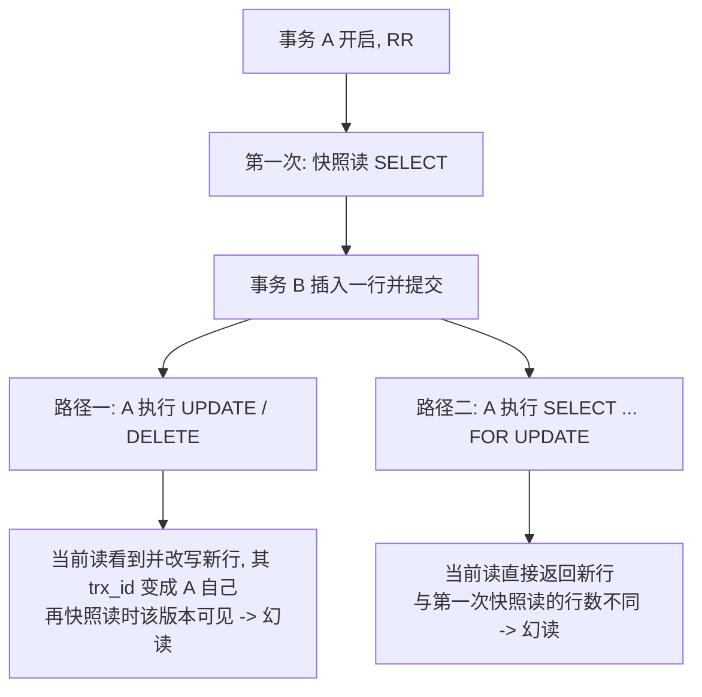

---
tags:
  - 中间件/MySQL
---

# 事务隔离与 MVCC

`事务`（transaction）把一组读写捆绑成一个不可分割的执行单元。InnoDB 用 `redo log`、`undo log`、`MVCC` 与锁四套机制支撑 ACID，其中隔离性是唯一需要「并发」才显现的一项：单线程下它没有可观察的行为，只有在多个事务交叉执行时，它才决定「一次读到底看见哪个版本的数据」。

本篇讲这条链怎么闭合：ACID 各自落到哪个机制、三类并发异常的准确含义、四级隔离级别的标准定义与 InnoDB 的实际行为差在哪、聚簇索引记录里的隐藏列与 `undo` 版本链怎么串、`Read View` 的四个字段与完整可见性判定、RC 与 RR 的差别为什么只在 Read View 的生成时机，以及幻读的两个成因怎么分属 MVCC 与间隙锁。加锁范围、加锁分析与死锁的完整推导放在 `06-锁、加锁分析与死锁`，本篇只交代到「为什么需要间隙锁」为止。

## 1. ACID 与各自的实现机制

四个特性里，一致性是目的，另外三个是手段。把「隔离性靠 MVCC」这类说法落到具体机制，需要逐个说清各自由什么保证，以及各机制之间怎么互相牵制。

### 1.1 原子性：`undo log` 与回滚

原子性要求事务里的多条修改要么全部生效、要么全部不生效。InnoDB 的做法是**为每条修改记一条反向操作**：插入对应删除，更新对应「把该行改回旧值」。这些反向记录写进 `undo log`。事务中途失败或显式 `ROLLBACK` 时，按相反顺序重放这些反向操作，数据回到事务开始前的状态。

回滚是**补偿式**的：InnoDB 不保留数据页的原始副本，而是写入「怎么改回去」的记录，再由这些记录把行带回旧形态。一条 update undo 记录里除了被修改列的旧值，还包含定位该行所需的信息（主键），回滚时按 undo 链从最近一条往回走，把每一列依次还原。

回滚粒度也有层次：整个事务回滚是默认行为，InnoDB 还支持 `SAVEPOINT` 做部分回滚——在事务内设置保存点后，`ROLLBACK TO SAVEPOINT` 只回滚保存点之后的部分。保存点的实现同样落在 undo 上：撤销到保存点时，把这一段 undo 记录重放一遍，之后的修改丢弃，事务本身继续。

`undo` 分两类（来源：MySQL 8.0 Reference Manual, 17.3）：

- **insert undo**：只为回滚服务，事务一提交就可以丢弃。
- **update undo**：除回滚外还要供一致性读（§4.2）使用，必须等到「没有任何事务的快照还可能用到它」才能丢弃。

这个区别直接决定了后面 §8 的长事务问题：只要有一个长事务的快照还停在很久以前，它可能需要的 update undo 就不能删。

回滚还有一个不那么直观的性质：它按 undo 链**逆序**执行，而非把所有修改一次性还原。逆序的原因是多条修改之间可能有依赖——先插入父行再插入子行，回滚必须先从子行撤起；先减余额再增对方余额，回滚也要从后一笔撤起，顺序错了会撞上违反约束的中间态。InnoDB 因此把同一事务的 undo 记录按写入顺序串好，回滚时从最后一条往前重放。

这也解释了 update undo 为什么必须保留到一致性读结束：它既是「往回撤」的依据，也是「往回看」的依据。同一条 undo 记录，回滚时用来还原数据，快照读时用来重建旧版本（§4.4）。两件事共用一份记录，是长事务能同时拖住回滚空间与快照读的根源。

### 1.2 持久性：`redo log` 与先写日志

持久性要求「提交成功」的事务，即使随后断电也不丢。InnoDB 不保证提交时数据页已落盘——数据页的修改先落在 Buffer Pool 里，由后台异步刷脏。保证持久性的是 `redo log`：**先把「这个页做了什么修改」写进 redo 并落盘，再返回提交成功**（Write-Ahead Logging）。崩溃重启后用 redo 把已提交但未刷盘的数据页重放出来。

所以「事务提交」与「数据页落盘」是两件事，它们之间的窗口正是 redo 要覆盖的部分。redo 是物理逻辑日志，记录的是「在某个表空间的某个页、某个偏移上做了什么修改」，重放时按这些记录把页改回去，不必依赖 SQL 语义。

刷盘行为由 `innodb_flush_log_at_trx_commit` 控制，默认值 `1`（来源：MySQL 8.0 源码 `storage/innobase/handler/ha_innodb.cc` 中的参数定义）：

| 取值 | 提交时行为 | 崩溃可能丢多少 |
| --- | --- | --- |
| `1` | 每次提交都 write + flush 到磁盘 | 已提交事务不丢（默认） |
| `2` | 每次提交 write 到 OS 缓存，每秒 flush | 操作系统崩溃会丢最近约 1 秒 |
| `0` | 不随提交刷，每秒 write + flush | 进程或 OS 崩溃都丢最近约 1 秒 |

redo 文件是一组固定大小的文件，**循环覆写**的。既然要覆盖，就必须保证「被覆盖的那部分记录对应的脏页已经刷盘」——推进这个位置的动作是 checkpoint：随着 Buffer Pool 里脏页被刷盘，checkpoint 前移，redo 中更旧的部分才可以被复用。所以 redo 是一段「滑动窗口」而非无限增长的流水账，窗口大小（redo 文件总容量）决定了瞬时能容忍多少未刷脏页。Buffer Pool 越大、写入越猛，越容易撞上 redo 容量上限而触发强制刷脏，这就是「redo 太小会拖慢写」的来源。redo 的格式、两阶段提交与刷盘参数放在 `07-日志、Buffer Pool 与崩溃恢复`。

刷盘策略与吞吐是一对矛盾，折中手段是 group commit：多个并发事务在同一时刻提交时，它们可以把 redo 刷盘操作合并成一次 `fsync`，从而把「每人一次刷盘」摊薄成「一次刷盘服务一批提交」。这解释了为什么在高并发下把 `innodb_flush_log_at_trx_commit` 调成 `2` 未必能线性提升吞吐——瓶颈可能落在 `fsync` 的合并效率上。

redo 窗口大小的取舍也很直白：窗口越大，能容纳的未刷脏页越多，突发写高峰越不容易撞上容量上限而触发强制刷脏，提交延迟越平稳；代价是崩溃恢复时要重放的 redo 越多，恢复时间越长。这是一组典型的「稳态吞吐」与「恢复时间」的取舍。

如果把持久性画成一条时间线：事务提交前，redo 里可能只有部分记录；提交时通过刷盘把 redo 推到稳定存储；提交之后，数据页是否落盘由后台决定。崩溃恢复时，从 redo 的 checkpoint 开始往前重放，把「已提交但未落盘」的部分补上，再回滚「未提交」的部分。两段动作分别对应重做（roll-forward）与回滚（roll-back），共同把数据库拉回崩溃前的一致状态。

### 1.3 隔离性：`MVCC` 与锁的分工

隔离性同时由两套机制保证，分工按语句类型划：

| 语句类型 | 机制 | 读到的版本 |
| --- | --- | --- |
| 快照读（普通 `SELECT`） | `MVCC` | 事务快照时刻的旧版本，不加锁 |
| 当前读（`SELECT ... FOR UPDATE` / `FOR SHARE`、`UPDATE`、`DELETE`、`INSERT`） | 锁 | 最新已提交版本，并加锁 |

两套机制在同一条链路里按语句分工，并不互斥：读历史版本不加锁，是为了「读不阻塞写」，让查询可以建立在某个时间点上而不干扰写入；对最新版本加锁，是为了「写不覆盖写、写不被遗漏」，让并发的写互相可见、互相排队。§7 讲幻读时会看到，正是这个分工让幻读有了两个成因——快照读那条路由 MVCC 挡，当前读那条路只能靠锁挡。

这套分工还有一个直接后果：同一个事务里，加锁写过的行再被普通 `SELECT` 读时，读到的是自己写的版本。原因是本事务写出的版本 `trx_id` 等于 Read View 的 `creator_trx_id`，命中 §5.2 的第一条分支直接可见，无论这条写的版本是否已经落进别人的视野。这条性质让「事务内先写后读」总能看到自己的修改，也是 §7.3 幻读的入口。

### 1.4 一致性：其余三者之上的约束层

一致性要求事务把数据库从一个满足完整性约束的状态带到另一个满足完整性约束的状态。它没有专属的底层机制，而是「原子性 + 隔离性 + 持久性」先把并发与故障的干扰排除掉，再由**约束层**收口：主键、唯一索引、外键、`CHECK` 约束，以及事务逻辑本身是否把不变量写对。数据库能保证的是「约束在本事务内不被破坏」；跨多张表的业务不变量（例如转账两账户之和守恒）需要事务逻辑把两笔修改放进同一个事务并配对。素材把它记为「一致性由持久性 + 原子性 + 隔离性保证」，这里补上前提：这三者把环境擦干净，剩下的由约束与业务逻辑负责。

```text
   ACID 与各自的落点

   ┌──────────── 目的 ────────────┐
   │        一致性 Consistency      │
   │   = 原子性 + 隔离性 + 持久性     │
   │     + 主键/唯一/外键/CHECK 约束   │
   │     + 事务逻辑（业务不变量）       │
   └───────────────┬───────────────┘
                   │ 依赖
   ┌───────┬───────┴───────┬───────┐
   ▼       ▼               ▼       ▼
 原子性   隔离性          持久性
 Atomicity Isolation     Durability
   │       │               │
   ▼       ▼               ▼
 undo   MVCC + 锁         redo log
 log    分工见 §1.3        （WAL）
   │       │
   └── update undo 既供回滚又供快照读 ⟹ 长事务拖住 purge（§8）
```

把三者与约束的关系再明确一遍：原子性保证「要么全做要么全不做」，隔离性保证「并发的事务互不看到对方的中间态」，持久性保证「做了的不会丢」。三者合起来，事务的每一次提交都把数据库从一个合法状态推进到另一个合法状态；至于「合法状态」的定义，由约束与业务逻辑给出。这也是为什么一致性没有专属机制——它由多个机制共同支撑，没有哪一段代码能单独负责这个属性。

## 2. 并发事务的三类异常

脏读、不可重复读、幻读三者的区别，如果只用「先读、被改、再读」的时间线举例，很容易记混。把判据说成**「读到的是哪个版本的数据」**，三者的边界就清楚了：异常的本质是「读到了一个按当前隔离级别不该看见的版本」。三类异常的对象不同——值、同一行的值、满足谓词的行集合——这个差别决定了后面用哪套机制去挡。

### 2.1 脏读：读到未提交版本

一个事务读到了另一个事务**尚未提交**的修改。用版本说话：读到的那个行版本的 `trx_id` 属于一个还没提交、随时可能回滚的事务。一旦那个事务回滚，这个版本就从未在数据库中「合法存在」过——读到的是一个会被撤销的中间态。

脏读的严重性在于它破坏的不只是「一致性」还是「可复现性」：读到的值取决于另一个事务恰好执行到哪一步，换一个调度顺序结果就变。InnoDB 在 `READ UNCOMMITTED` 下，普通 `SELECT` 仍然不加锁，但可能取到行的较早版本，因此这种读是不一致的，也就是脏读（来源：MySQL 8.0 Reference Manual, 17.7.2.1）。

脏读在 InnoDB 的实现里只出现在 `READ UNCOMMITTED` 这一级：`READ COMMITTED` 及以上，快照读都不会取到未提交版本，因为未提交事务写出的版本，其 `trx_id` 一定落在 `m_ids`（水位之间）或 `>= max_trx_id`，两条分支都判为不可见（§5.2）。换句话说，脏读的开关就是「要不要查名单」这一条判定。

### 2.2 不可重复读：同一行的版本变了

同一个事务内两次读同一行，读到不同版本。判定落在**同一行**：第一次读命中旧版本，第二次读命中了另一个事务在此期间**已提交**的新版本。异常点是「同一事务内对同一记录的两个读返回不同值」，而不是记录被删或新增。

「不可重复读」这个名字说的是读的**结果不可重复**，它成立的前提是两次读针对的是同一行、同一个位置。如果第二次读连这一行都找不到了（被删），或出现了原来没有的行，那属于幻读的范畴（§2.3）。两者的分界在对象粒度：不可重复读盯的是行的**值**，幻读盯的是**谓词命中的行集合**。

不可重复读与 Read View 的生成时机绑在一起：只有当同一事务的两次读用了不同的 Read View，才可能出现两次结果不同。RR 复用同一个 View，所以两次读命中同一版本；RC 每次重建，第二次读可能命中新提交版本。把这条和 §6 合起来看，「避免不可重复读」在实现上就等于「冻结 Read View」。

### 2.3 幻读：满足条件的行集合变了

幻读的对象是**结果集**，而非某一行的值：同一个查询在不同时刻返回了不同的行集合。官方给出的定义是——同一个查询在不同时间产生不同的结果集时，事务中就会出现幻象问题；例如 `SELECT` 执行两次，第二次返回了第一次没有的行，这一行就是「幻象行」（来源：MySQL 8.0 Reference Manual, 17.7.4）。

幻读的触发条件比不可重复读更宽：只要谓词命中的集合变了就算，包括「多出一行」和「少了一行」两种方向。官方举例：第一次查询得到 5 行，第二次得到 6 行是幻读；第二次得到 4 行同样是幻读——集合不同就构成幻象，与行的增减方向无关。

三类异常的共同点是「读到了不该看见的版本」，区别在于那个版本相对当前事务的位置：

| 异常 | 读到的版本 | 版本来源事务的状态 | 变化的是 |
| --- | --- | --- | --- |
| 脏读 | 未提交版本 | 未提交，可能回滚 | 某一行的值 |
| 不可重复读 | 已提交的新版本 | 两次读之间提交 | 同一行的值 |
| 幻读 | 新增/消失版本 | 两次读之间提交 | 满足条件的行集合 |

判断一次读是不是幻读，要回到「这条查询的语义对象是什么」。按主键等值查一行，对象是那一行，两次结果不同属于不可重复读；按范围或非唯一条件查一批，对象是行集合，集合变化属于幻读。同一条 SQL 在不同索引、不同谓词下可能落进不同的对象类别，所以讨论幻读时要连同谓词一起说，只报一个 SQL 文本不够。

## 3. 隔离级别：标准定义与 InnoDB 的实际行为

### 3.1 SQL 标准的四级定义

SQL:1992 给出四种隔离级别，级别越高允许的异常越少。InnoDB 提供全部四种（来源：MySQL 8.0 Reference Manual, 17.7.2.1）：

| 隔离级别 | 脏读 | 不可重复读 | 幻读 |
| --- | --- | --- | --- |
| `READ UNCOMMITTED` | 可能 | 可能 | 可能 |
| `READ COMMITTED` | 不可能 | 可能 | 可能 |
| `REPEATABLE READ` | 不可能 | 不可能 | **标准允许** |
| `SERIALIZABLE` | 不可能 | 不可能 | 不可能 |

标准里级别之间是「包含」关系：高一级禁止的异常，低一级未必禁止；从下往上每上一级各堵掉一类异常。`REPEATABLE READ` 与 `SERIALIZABLE` 的区别，按标准只差「幻读」一格。InnoDB 的默认级别是 `REPEATABLE READ`（来源：同上）。

需要区分的是，「标准定义」规定的是各级别**允许**哪些异常，而不是**必须**出现哪些异常。一个实现完全可以在标准允许幻读的级别里做到不出现幻读——InnoDB 的 RR 就是这种情况（§3.3）。这也意味着，判断某个具体实现的行为，要读它的实现文档，不能只看标准那张表。

### 3.2 InnoDB 的四级：锁与 MVCC 分别做什么

标准只规定「允许哪些异常」，没有规定实现。InnoDB 各级的实际行为落在两处：快照读（一致性非锁定读）怎么取版本，当前读加什么锁（来源：MySQL 8.0 Reference Manual, 17.7.2.1、17.7.2.3）：

| 级别 | 快照读的 Read View | 当前读的锁 | 幻读 |
| --- | --- | --- | --- |
| `READ UNCOMMITTED` | 不建快照，直接读最新版本（可能未提交） | 同 `READ COMMITTED` | 可能 |
| `READ COMMITTED` | **每次一致性读都新建** | 只锁记录，不锁记录前的间隙（外键与唯一键检查除外） | 可能 |
| `REPEATABLE READ` | **只在第一次快照读时建，整个事务复用** | 唯一索引 + 唯一条件只锁记录；其他条件用间隙锁 / next-key 锁锁住扫描范围 | 多数被挡（见 §3.3） |
| `SERIALIZABLE` | 同 RR | 关闭 `autocommit` 时，普通 `SELECT` 被隐式转成 `SELECT ... FOR SHARE` | 不可能 |

逐个看各级的实现要点（来源：同上）：

- **`READ UNCOMMITTED`。** 为了避免脏读以外的行为与其他级别一致，InnoDB 把它实现成「`READ COMMITTED` 加上允许读未提交版本」。快照读不加锁，直接取最新版本，因此可能读到别人尚未提交的中间态。
- **`READ COMMITTED`。** 每个一致性读都设置并读取一份全新快照；加锁读只锁索引记录本身、不锁记录前的间隙，于是别的会话可以自由地在被锁记录旁边插入新行。此时间隙锁只用于外键约束检查与唯一键检查——也就是说，它的存在是为了保证约束，而不是为了挡幻读。
- **`REPEATABLE READ`。** 一致性读共用第一次读建立的快照；当前读的加锁分两种：唯一索引上带唯一搜索条件时，只锁命中的那条索引记录、不锁它前面的间隙；其他搜索条件则锁住扫描到的索引范围，用间隙锁或 next-key 锁挡住其他会话往范围内插入。
- **`SERIALIZABLE`。** 行为依赖 `autocommit`：关闭时，InnoDB 把所有普通 `SELECT` 隐式转成 `SELECT ... FOR SHARE`（共享锁），从而把读也纳入锁体系；开启时，该 `SELECT` 自成一个事务，可被识别为只读，按一致性非锁定读执行而不阻塞别人。

四级之间还有一处容易搞反的地方：`READ COMMITTED` 下的间隙锁并没有完全消失，它仍用于外键约束与唯一键检查。也就是说，RC 的「不加间隙锁」指的是「不为了防止幻读而加」，并非这把锁在 RC 下不存在。一个 RC 事务若被间隙锁挡住，先看它的写是否触发了唯一键或外键检查（来源：MySQL 8.0 Reference Manual, 17.7.2.1）。

需要把「一致性读」这个词的适用范围说清楚：它是 `READ COMMITTED` 与 `REPEATABLE READ` 下 `SELECT` 的默认模式，不加任何锁，因此别的会话可以在读的同时自由修改表（来源：MySQL 8.0 Reference Manual, 17.7.2.3）。`READ UNCOMMITTED` 和 `SERIALIZABLE` 不走这条默认路径——前者直接读最新版本，后者按 `autocommit` 决定是否给 `SELECT` 加共享锁。

把四级按「快照读取哪一版」和「当前读锁什么」两列并排看，会发现它们其实是两个独立开关的组合：快照读那一列决定「读的可见性」，当前读那一列决定「写的冲突范围」。RU 与 RC 的差别只在快照读（RU 允许未提交版本，RC 不允许）；RR 与 RC 的差别同时体现在两列（RR 复用快照、锁间隙；RC 每次刷新、不锁间隙）；SERIALIZABLE 则在当前读那一列上把读也加锁。理解这个组合，比背四张行为表更耐用。

### 3.3 「RR 避免幻读」与标准的差异

标准里 `REPEATABLE READ` 允许幻读，InnoDB 的 `REPEATABLE READ` 在多数场景却把幻读挡住了。差别来自 next-key 锁：扫描索引时，InnoDB 给遇到的索引记录加锁，并顺带锁住记录之前的间隙；一个会话持有某条记录前的间隙锁时，另一个会话无法在该间隙里插入新索引记录（来源：MySQL 8.0 Reference Manual, 17.7.4）。

这条规则管用的是「插入要先找到位置」这个事实：B+ 树里的插入必然落在某个间隙中，而间隙被锁住时，插入语句拿不到插入意向锁，只能等待。所以只要当前读扫过了某个范围并把范围内的间隙锁住，后续的插入就被挡在门外，幻读不会发生。

```
   三级语义要分清

   ① 标准 RR       ：允许幻读
   ② InnoDB RR 当前读：用 next-key 锁挡住「范围内的插入」⟹ 大多数幻读被避免
        └─ 但「挡住未来插入」和「忽略已提交插入」是两件事，
           后者才是例外所在（§7）
   ③ InnoDB RR 快照读：用旧 Read View 忽略「生成快照之后插入的行」⟹ 也避免了幻读
```

所以正确的措辞是「InnoDB 的 RR 在很大程度上避免幻读」，而不是「完全解决」。§7 会给出两个仍然发生幻读的场景。

### 3.4 为什么默认是 RR，而不是 RC（取舍边界）

InnoDB 默认 `REPEATABLE READ`，但不少云厂商把默认改成 `READ COMMITTED`。这是一个真实的取舍：

| 维度 | `REPEATABLE READ` | `READ COMMITTED` |
| --- | --- | --- |
| 幻读 | 当前读用 next-key 锁挡住 | 间隙锁停用，可能发生 |
| 锁范围 | 更宽（含间隙），死锁概率更高 | 更窄，只有记录锁 |
| 锁持有 | `UPDATE` 读过的行**全部保留**到事务结束 | 不匹配 `WHERE` 的行**立即解锁** |
| 一致性读 | 整个事务盯同一快照 | 每条语句刷新快照（读已提交） |
| 半一致性读 | 不涉及 | `UPDATE` 用半一致性读，减少无谓等待 |

官方对 RR 的一条警告：不建议在同一个 `REPEATABLE READ` 事务里混用加锁语句（`UPDATE` / `INSERT` / `DELETE` / `SELECT ... FOR ...`）与非锁定 `SELECT`，因为两者看的是两份互相不一致的表状态——非锁定 `SELECT` 看的是 Read View 建立的快照（且不含当前事务自己的写入），加锁语句用的是最新状态（来源：MySQL 8.0 Reference Manual, 17.7.2.1）。这条警告其实就是 §7.3 幻读场景的另一种表述：混用两种读，快照与最新状态之间的差异会以「读到了不该看的行」的形式暴露出来。

`REPEATABLE READ` 下 `UPDATE` 的锁持有行为可以用官方给的执行序列说明：一个会话执行 `UPDATE t SET b = 4 WHERE b = 2` 扫到若干行时，`REPEATABLE READ` 会对每行都取 x-lock 并**全部保留**到事务结束，第二个执行同条件 `UPDATE` 的会话一上手就阻塞，直到第一个提交或回滚；换成 `READ COMMITTED`，第一个 `UPDATE` 对不匹配的行立即解锁，第二个 `UPDATE` 才能继续（来源：同上）。选 RC 的人换来的是更小的锁范围与更高的并发，付出的是应用层要自己处理不可重复读与幻读。

换成 RC 之后，应用要自己补齐 RR 提供的那部分保证：读同一批数据要在一个语句里完成，或改用当前读，或用应用层缓存把「同一事务内的多次读」固定下来。换回 RR 则要承受更宽的锁范围与更高的死锁概率。两边的代价都真实存在，选择取决于业务更怕「读到不一致」还是更怕「锁等待与死锁」——这也是同一个 MySQL 在不同公司会有不同默认级别的原因。

实际选型时还有第三个维度：云厂商或中间件往往把默认级别改成 RC 以降低锁竞争，同时靠「业务不依赖可重复读」这一前提来兜底。这意味着一份在 RR 下正确的代码，迁到 RC 后可能暴露不可重复读或幻读；反向迁移也会因为更宽的间隙锁而出现新的死锁。跨环境迁移时，隔离级别与依赖它的读写模式要一起评估。

## 4. 聚簇索引里的版本信息与 undo 版本链

MVCC 的物理基础有两块：聚簇索引记录里指向旧版本的两个隐藏列，以及串起旧版本的 undo 链。理解这两块，是理解「一次读怎么落到某个历史版本」的前提。

### 4.1 两个隐藏列：`DB_TRX_ID` 与 `DB_ROLL_PTR`

InnoDB 在每一行记录里加了三个隐藏字段（来源：MySQL 8.0 Reference Manual, 17.3）：

| 隐藏列 | 长度 | 含义 |
| --- | --- | --- |
| `DB_TRX_ID` | 6 字节 | 最后插入或更新该行的事务 id；删除在内部被当作一次「置删除位」的更新 |
| `DB_ROLL_PTR` | 7 字节 | 回滚指针，指向回滚段里的 undo log 记录；若该行被更新过，这条 undo 记录含重建旧版本所需的全部信息 |
| `DB_ROW_ID` | 6 字节 | 单调递增的行号，仅当 InnoDB 自动生成聚簇索引（无显式主键/唯一索引）时才出现在索引里 |

`DB_TRX_ID` 是「读哪一行」的判据：它就是 §5 可见性判定里被比较的那个 `trx_id`。`DB_ROLL_PTR` 是「怎么找回旧版本」的入口。`DB_ROW_ID` 只在没有用户定义主键时才有意义——此时 InnoDB 用它充当聚簇索引的键，保证每行都有唯一的索引项；一旦表有显式主键或唯一非空索引，这个列就不参与索引。

这三个列对用户不可见，但可以从二级索引回表后的行为间接观察到：§4.3 会看到，二级索引不带隐藏列，所以按二级索引做一致性读时，总要回聚簇索引核对 `DB_TRX_ID`。

### 4.2 undo 的两类与 purge

`undo` 存在回滚段（rollback segment）里，落在 undo 表空间中，分 insert / update 两类（§1.1）。一致性读只用到 update undo。**一个 update undo 能不能丢弃，取决于是否还有事务的快照可能要用它**；只有在丢弃对应的 update undo 时，InnoDB 才会把行记录与它的索引记录真正物理删除（来源：MySQL 8.0 Reference Manual, 17.3、17.8.9）。

这条「物理删除延后到 undo 被 purge」的规则解释了两个现象：

- 删了数据但磁盘不降——行记录只是被标了删除位，要等 purge。
- 只要有长事务把快照钉在过去，它可能需要的 update undo 就删不掉，undo 表空间持续增长（§8）。

purge 由后台 purge 线程周期性执行，从 history list 里取 undo 页解析处理，处理完释放（来源：MySQL 8.0 Reference Manual, 17.8.9）。history list 里登记的是「已提交事务的 update undo 页」，它的长度直接反映「还有多少旧版本没被回收」，是观测长事务的关键指标（§8.2）。一个 insert undo 提交后立即回收，所以表里频繁插入删除时，堆积的主要是 update undo。

### 4.3 版本链怎么串起来

每一次更新都产生一个「旧版本快照」：旧值被写进一条 undo 记录，新版本的 `DB_ROLL_PTR` 指向这条 undo 记录，而这条 undo 记录自身又指向更早的一条。于是同一条记录的所有历史版本被串成一条**单向链表**，链头是聚簇索引里的当前行，链尾是最早的版本。

```text
   聚簇索引记录（链头 = 当前版本）与 undo 版本链

   ┌───────────────────────────────┐
   │ 行记录  余额=200               │
   │ DB_TRX_ID   = 51   （最新）    │
   │ DB_ROLL_PTR ─────────────┐    │
   └───────────────────────────┼───┘
                               ▼
   ┌───────────────────────────────┐
   │ undo 记录 余额=100             │
   │ DB_TRX_ID   = 50               │
   │ 上一条指针 ───────────────┐    │
   └───────────────────────────┼───┘
                               ▼
   ┌───────────────────────────────┐
   │ undo 记录 余额=80              │
   │ DB_TRX_ID   = 45               │
   │ 上一条指针 ───────────────▶ NULL（链尾）
   └───────────────────────────────┘

   链头永远是「当前行」，越往链尾越旧；
   读旧版本 = 从链头沿 DB_ROLL_PTR 往回走（§4.4）
```

链的方向要记牢：指针从**新指向旧**。当前行在链头，`DB_ROLL_PTR` 指向它最近的旧版本，那条旧版本的 undo 记录里再指向上一条更旧的。因此「往链尾走」等于「回到更早的时间点」。

二级索引与聚簇索引不同：二级索引记录**不含**隐藏列，也不原地更新。二级索引列被更新时，旧记录被标记删除、新记录被插入；一致性读在二级索引命中后，要回到聚簇索引核对 `DB_TRX_ID`，需要时再从 undo 取正确版本（来源：MySQL 8.0 Reference Manual, 17.3）。这就是「二级索引做一致性读可能比聚簇索引更贵」的一个来源：命中二级索引后不一定能直接返回，遇到被更新过的记录还要回表核对并回退。

链的长度由「这条记录被更新的次数」决定，不由表的总行数决定。一条从不被更新的记录，版本链只有链头一个版本；一条每秒被更新一次的热点行，链上会积累大量版本，直到 purge 把它们回收。由于 purge 又受长事务牵制，热点行与长事务叠加时，读这条链的成本会显著上升。这是「同一张表里，不同行的读代价可能相差很大」的一个来源。

版本的产生与回收是一对相反的过程：产生由写（每次更新追加一条 undo、把链拉长），回收由 purge（确认没有事务需要这条旧版本后删掉它、把链缩短）。一条记录当前的链长，就是「还没被回收的历史版本数」。因此链长既反映写频率，也反映 purge 的进度——purge 落后时，即使写频率不变，链也会持续变长。

### 4.4 查一个历史版本 = 沿链回退

一次快照读拿到某行时，先看链头（当前版本）的 `DB_TRX_ID`，用 §5 的可见性判定判断这个版本对当前 Read View 是否可见：

1. 可见 → 直接返回它，回退结束。
2. 不可见 → 沿 `DB_ROLL_PTR` 走到上一条 undo 记录，得到更早的版本，回到第 1 步。
3. 一直走到链尾仍不可见 → 说明这行在 Read View 生成之后才被插入，在当前快照里「不存在」，结果集里跳过它。

所以「回退到哪个版本」没有固定答案，它**由可见性判定逐版本试出来**：同一个 Read View 面对不同的记录，可能停在链的不同深度。举一条三版本链的例子：链头 `trx_id=51`、次版本 `trx_id=50`、链尾 `trx_id=45`。对某个 Read View 而言，若 51 不可见、50 可见，则该读停在 50；若 50 也不可见（例如 50 恰好也落在该 View 的 `m_ids` 里），就继续退到 45。回退的次数取决于「链上有几个版本对本 View 不可见」，而链长本身被修改频率决定——一条被频繁更新的热点行，链会很长。

回退的代价与「走到了第几层」成正比。对一条从未被回退过的记录，读只碰链头；对一条被长事务钉住的热点行，每次读都要沿链走若干层，这又叠上 §4.3 里二级索引回表再回退的复杂度。所以长事务的危害不止「占空间」，还包括「让所有读这条链的人都变慢」（§8.1）。

回退还有一层边界：它只发生在「快照读」路径上。当前读直接读最新已提交版本，不沿链回退；它要处理的是「最新版本可能正被别人持锁」，所以走加锁等待而不是版本回退。把两条路径分开记：MVCC 用回退解决「读旧版本」，锁用等待解决「读不一致或被读到一半」，两者服务于同一个目标的不同侧面。

回退与索引也有关：如果查询走的是二级索引，而二级索引记录不含隐藏列，那么回退前往往要先回聚簇索引核对 `DB_TRX_ID`（§4.3）。也就是说，同一条旧版本记录，经二级索引读到可能比经聚簇索引读到多一次回表与核对。观测慢查询时若发现某些 `SELECT` 在旧数据多的表上明显变慢，可以从「回退层数 + 回表」这两个方向去看。

## 5. Read View 与可见性判定

`Read View` 是一次一致性读的「快照」在代码里的形态：它记录「在这一时刻，哪些事务还活跃、事务 id 的水位在哪」。判定一个版本可见与否，就是拿该版本的 `trx_id` 去比这四个字段。

### 5.1 四个字段

| 字段 | 含义 |
| --- | --- |
| `m_ids` | 创建 Read View 时，当前数据库**已启动、尚未提交**的事务 id 列表（活跃事务） |
| `min_trx_id` | `m_ids` 中的最小值；没有活跃事务时取「下一个待分配 id」 |
| `max_trx_id` | 创建 Read View 时，**应该分配给下一个事务的 id**，也就是全局最大事务 id + 1。它不是 `m_ids` 的最大值 |
| `creator_trx_id` | 创建这个 Read View 的事务自己的 id |

逐个说明它们的用途：

- `m_ids` 是一张「嫌疑名单」：里面的事务在快照建立时都还没提交，它们写出的版本可能尚未落定，因此默认不可见。判定到「水位之间」这一段时，就要查这张名单。
- `min_trx_id` 是下界水位：比它还小的事务 id 一定在快照建立前就已提交（否则它会出现在 `m_ids` 里、把 `min_trx_id` 拉低），所以这一段的版本一律可见，不必查名单。
- `max_trx_id` 是上界水位：比它大于等于的事务 id 一定在快照建立后才启动（因为在快照建立时，下一个要分配的 id 就是 `max_trx_id`），它们写出的版本在快照里根本不存在，一律不可见。
- `creator_trx_id` 处理「自己写的数据自己看得见」：本事务修改产生的版本，`trx_id` 等于创建该 Read View 的事务 id，无论它在 `m_ids` 里还是在别处，都直接可见。

`max_trx_id` 容易被记错。它的作用是画一条上界：任何 **≥ `max_trx_id`** 的版本都诞生于本 Read View 生成之后，对当前读一定不可见。这一点在 §5.2 判定新插入的行时是决定性的。

还有一个常被忽略的事实：不写数据的事务不一定分配事务 id（§8.2）。这类事务创建的 Read View，其 creator 分支通常不会被别的版本命中——没有任何版本的 `trx_id` 会等于一个未被分配 id 的事务。判定因此主要落在水位与名单上，与 §5.2 的算法完全一致。

### 5.2 完整的可见性判定算法

对一个版本的行版本，设其 `DB_TRX_ID` 为 `trx_id`，判定顺序如下：

```text
visible(trx_id):
    if trx_id == creator_trx_id:  return 可见      # 自己改的，自己看得见
    if trx_id <  min_trx_id:      return 可见      # View 生成前已提交
    if trx_id >= max_trx_id:      return 不可见     # View 生成后才开始
    return  trx_id ∉ m_ids                          # 落在水位之间：
                                                    # 在 m_ids 里=还活跃⟹不可见
                                                    # 不在=已提交⟹可见
```

四条分支的物理含义分别是：**等于 creator**（本事务的修改对自己可见）、**小于 `min_trx_id`**（该版本由 View 生成前就已提交的事务写出）、**大于等于 `max_trx_id`**（该版本由 View 生成后才启动的事务写出）、**落在 `[min_trx_id, max_trx_id)` 内**（要查 `m_ids` 判断那个事务是否还活跃）。判定为不可见时，就执行 §4.4 的回退，沿 `DB_ROLL_PTR` 找上一版本重判，直到找到可见版本或走到链尾。

把这套判定和版本链画在一起，就能看出「为什么读到的是这个版本」：

```text
   版本链 × 可见性判定：一次快照读停在哪个版本

   当前事务 T 的 Read View：m_ids={51,52}  min_trx_id=51  max_trx_id=53  creator=52

   链头  行记录  trx_id=51  余额=200 ──┐  判定：
        │  DB_ROLL_PTR               │  51∈[51,53) 且 51∈m_ids
        ▼                            │  ⟹ 不可见，回退
   undo      trx_id=50  余额=100 ──┐ │  判定：
        │  上一条指针              │ │  50 < min_trx_id(51)
        ▼                          │ │  ⟹ 可见 ⟹ 返回「余额=100」
   undo      trx_id=45  余额=80 ◀──┘ │  （无需再往下走）
        │  上一条指针                │
        ▼                            │
       …（更早版本，本次不访问）      │
                                     └── m_ids 命中 51：说明写 200 的那次
                                         修改来自尚未提交的事务，看不见
```

三条容易踩空的边界：

- **`m_ids` 为空**时（快照建立时没有其他活跃事务），落在水位之间既不可能命中名单，判定直接返回可见。源码里对这个分支单独做了一次短路（§5.3）。
- **新插入的行**在旧 Read View 下一定有 `trx_id >= max_trx_id`（插入发生在快照之后），命中第三条分支判为不可见；沿它的版本链走到底也只有这一个版本，于是整行不可见、在结果集里消失。这正是快照读挡幻读的原理（§7.1）。
- **等于 creator** 这条分支优先于水位判断：本事务自己写出的版本即使 `trx_id` 落在 `m_ids` 里（本事务通常也在活跃列表里），也直接可见。它对应「事务能看到自己未提交的修改」这一直觉（§7.3 会用到它）。

上面的判定顺序不能调换，原因在于每一条分支都蕴含「可以短路」的结论：把「等于 creator」放在最前，是因为这一条与水位无关、任何位置命中都应直接可见；把「小于 `min_trx_id`」并入同一短路分支，是因为它同样不需要查名单；`>= max_trx_id` 的版本在快照里根本不存在，也无需查名单。若先判 `max_trx_id` 再判 creator，就会把「本事务刚写的版本」误判为不可见——§7.3 的幻读正是踩在这一条上。只剩「落在水位之间」这一支需要查 `m_ids`，它是唯一一处要做二分查找的分支。

再看一个「新插入行」的判定：某会话在本 Read View 生成之后插入一行，其 `trx_id` 取到的必然是 `>= max_trx_id`（因为快照生成时「下一个待分配 id」就等于 `max_trx_id`）。命中第三条分支判为不可见；这条新行的版本链只有它自己，回退到链尾仍不可见，于是整行被跳过。这就是快照读挡幻读的完整链路：新行不可见，原因是它落在 `max_trx_id` 之外。

### 5.3 源码里的字段名与判定实现

上面四个字段名是通行的表述，InnoDB 源码里对应关系如下（来源：MySQL 8.0 源码 `storage/innobase/include/read0types.h`）：

| 通行表述 | 源码字段 | 注释里的说法 |
| --- | --- | --- |
| `min_trx_id` | `m_up_limit_id` | low water mark：所有 `<` 它的 trx id 都应可见 |
| `max_trx_id` | `m_low_limit_id` | high water mark：所有 `>=` 它的 trx id 都不可见 |
| `creator_trx_id` | `m_creator_trx_id` | 创建该视图的事务 id |
| `m_ids` | `m_ids` | 快照建立时活跃的读写事务集合 |

`ReadView::changes_visible()` 的实现顺序是：`id < m_up_limit_id || id == m_creator_trx_id` 先返回可见；`id >= m_low_limit_id` 返回不可见；`m_ids` 为空返回可见；否则返回 `!binary_search(m_ids, id)`（来源：同上）。它与 §5.2 列的顺序等价，只是把「等于 creator」和「小于 min」并进了第一个分支。名单的查询用的是二分查找，前提是 `m_ids` 有序——这保证了判定本身是 O(log n)，回退的主要代价不在判定、而在沿链走的层数。

### 5.4 RR 的快照建在什么时候

一个容易踩的细节：`BEGIN` / `START TRANSACTION` 本身**不建立 Read View**。RR 下，Read View 在事务里**第一条普通 `SELECT`** 执行时才建（来源：MySQL 8.0 Reference Manual, 17.7.2.3）。官方对 RR 的表述是「同一事务内的一致性读，读的是**由第一次这样的读建立的快照**」；对 RC 的表述是「每个一致性读都设置并读取自己的一份全新快照」（来源：同上）。

这意味着 `BEGIN` 之后、第一条 `SELECT` 之前，别的会话提交的数据**可能已经进入快照**——因为快照此刻才拍。要让快照在事务启动的那一刻就建立，用 `START TRANSACTION WITH CONSISTENT SNAPSHOT`（§10.4）。

这条时间窗在实际排查里很关键：一个 RR 事务在 `BEGIN` 之后停顿了很久（比如等待应用层的一次网络调用），期间数据库发生了大量提交，等它执行第一条 `SELECT` 时，快照才拍下——那些提交已经进了快照。如果期望的是「事务开始时刻的一致性视图」，就必须用 `START TRANSACTION WITH CONSISTENT SNAPSHOT`，把快照钉在启动瞬间。

## 6. RC 与 RR：差别只在 Read View 的生成时机

RC 与 RR 的可见性判定算法完全一样，唯一的差别在**多久建一次 Read View**：RC 每个一致性读建一次，RR 只在第一次快照读时建一次、整个事务复用。把这个差别推到底，「不可重复读」与「可重复读」的差异就自然出来了。

### 6.1 两条生成规则

| 级别 | Read View 生成时机 | 官方表述 |
| --- | --- | --- |
| `READ COMMITTED` | 每个一致性读都新建 | each consistent read within a transaction sets and reads its own fresh snapshot |
| `REPEATABLE READ` | 事务内第一次快照读时建，之后复用 | read the snapshot established by the first such read |

（来源：MySQL 8.0 Reference Manual, 17.7.2.3）

两条规则对应两种「什么时候看数据库」的语义：RC 的语义是「每次都看最新的已提交状态」，所以每次都重新拍一张快照；RR 的语义是「整个事务看同一张快照」，所以只拍一次、之后复用。判定算法不变，变的只是输入给判定的那个 Read View 是哪一张。

```text
   同一事务内的三次普通 SELECT（读同一行）

   READ COMMITTED：每次 SELECT 都新建一个 Read View
   SELECT① ──▶ 建 V(1) ──▶ 读 ──┐
   SELECT② ──▶ 建 V(2) ──▶ 读 ──┼──▶ 三次可能命中不同版本 ⟹ 可能不可重复读
   SELECT③ ──▶ 建 V(3) ──▶ 读 ──┘

   REPEATABLE READ：整个事务共用一个 Read View
   SELECT① ──▶ 建 V ───────────┐
   SELECT② ─────────（用 V）───┼──▶ 三个读锚在同一个 V，看到同一快照
   SELECT③ ─────────（用 V）───┘
        └─ 差别只在「建 View 的时机」；读时的判定算法完全相同（§5.2）
```

两条规则的差别也可以从「快照代表什么」来理解。RC 的快照代表「最近一次已提交状态」，它天然随时刷新；RR 的快照代表「事务开始时的一致性视图」，一旦刷新就破坏了可重复读。所以 RR 必须复用同一张快照，RC 必须每次刷新——生成时机是这两种语义的直接结果，并非一个可以随意调配的实现细节。

从实现角度看，RC 频繁建 Read View 也有代价：每次读都要重新收集活跃事务列表、算一遍水位，而 RR 只在第一次做这件事。这是 RC 与 RR 之间一个常被忽略的开销差——RC 换来的是「更少的锁、更高的并发」，付出的是「更频繁的快照构建」与「读到的数据不保证一致」。取舍的落点在业务需要哪一种语义。

### 6.2 实验一：RR 下写者提交，读者仍读旧版本

设一行记录初值为 100 万，其版本链链头 `trx_id=50`。事务 W（写者，`trx_id=51`）先启动但未提交；事务 R（读者）随后启动，在 RR 下第一次快照读时建立：

```text
   R 的 Read View：m_ids={51,52}  min_trx_id=51  max_trx_id=53  creator_trx_id=52
```

四个字段怎么来的：创建快照时活跃的事务有 W（51）和 R 自己（52），所以 `m_ids={51,52}`；最小值是 51；下一个待分配的 id 是 53（因为已分配到 52）；创建者是 R 的 52。

逐步执行：

| 步骤 | 动作 | 链头版本 | 判定 | R 读到 |
| --- | --- | --- | --- | --- |
| 1 | R 第一次读 | `trx_id=50` | 50 < min_trx_id(51) ⟹ 可见 | 100 万 |
| 2 | W 更新为 200 万（未提交） | `trx_id=51` | — | — |
| 3 | R 第二次读 | `trx_id=51` | 51∈[51,53) 且 51∈m_ids ⟹ 不可见，回退到 50 ⟹ 可见 | 100 万 |
| 4 | W `COMMIT` | `trx_id=51` | — | — |
| 5 | R 第三次读 | `trx_id=51` | View 未变，51 仍∈m_ids ⟹ 不可见，回退 | 100 万 |

第 3、5 步的回退对象都是 `trx_id=50` 那条 undo 记录，它满足「小于 `min_trx_id`」直接可见，不必再往链尾走。第 5 步是关键：W 已经提交，但在 R 复用的这个 Read View 里，51 仍然被记在 `m_ids` 中，因此该版本依旧不可见。这就是「可重复读」——同一事务内读到的一直是事务启动时的快照。

注意第 5 步与第 4 步的顺序：R 复用旧 View，意味着「W 提交」这个事实根本没被这张 View 记录。要让 R 看到 200 万，只有让 R 换一张快照（提交当前事务再读，或改用 RC）。

把每一步为什么这么判再拆开。第 1 步读到的 `trx_id=50` 小于 `min_trx_id=51`，说明写出这个版本的事务在 R 建立快照之前就已提交，R 应当看到它。第 3 步读到 `trx_id=51`，落在 [51,53) 之间，需要查名单；51 恰好在 `m_ids` 里，说明写出这个版本的 W 在快照建立时还活跃，R 看不到它，于是沿 `DB_ROLL_PTR` 回退到 50。注意此时 W 已经改了数据、只是还没提交，R 依然读旧值——这正是隔离性要的效果：别人的未提交修改不进我的视野。

第 4 步 W 提交，第 5 步 R 再读，判定没有任何变化。原因就在 Read View 被 R 复用了：`m_ids` 记录的是「快照建立那一刻」的活跃名单，W 在那一刻活跃、之后才提交，名单不会随之更新。所以 51 一直被判为不可见，R 一直回退到 50。可重复读的稳定性，本质上来自「名单冻结」。

对照 RC 的 §6.3 可以看出，两边判定的差异全部集中在「第 5 步的名单是新冻的还是旧冻的」。RR 的名单冻在第一次读，RC 的名单每次读都重新冻一次；W 的提交只改变新名单，改不了旧名单。这也回答了「为什么 RR 下别的事务提交了写、本事务仍读旧值」——旧名单没把那次提交记进去。

把 R 的 Read View 四个字段是怎样算出来的补全：R 建立快照时，全局已分配的最大事务 id 是 52（R 自己），下一个要分配的是 53，所以 `max_trx_id=53`；此时活跃的事务是 W（51）与 R（52），所以 `m_ids={51,52}`、`min_trx_id=51`。若 W 在 R 建立快照之前就已经提交，情况会完全不同：`m_ids` 里只剩 R 自己（或为空），`min_trx_id` 抬高到 51 以上，链头 `trx_id=51` 一上来就命中「小于 min」判为可见——那就等于读到了新值，与 RC 无异。所以 RR 的可重复读，取决于「快照建立时 W 是否还活跃」这个时间关系，而不取决于 R 之后读几次。

还有一点值得对照：`max_trx_id=53` 这个值在整个事务里也是冻结的。若 R 在事务中途遇到某个 `trx_id=53` 的版本（来自快照之后启动的事务），它命中「`>= max_trx_id`」直接不可见。这意味着 R 不仅看不到快照之前未提交的 W 的写，也看不到快照之后任何新事务的写——两个方向都被同一张视图挡住。

### 6.3 实验二：RC 下同一过程读到新值

把隔离级别换成 RC，其余步骤不变。RC 每次读都重建 Read View：

| 步骤 | 动作 | 新建的 Read View | 链头判定 | R 读到 |
| --- | --- | --- | --- | --- |
| 1 | R 第一次读 | `m_ids={51}` | 50 < min ⟹ 可见 | 100 万 |
| 2 | W 更新（未提交） | — | — | — |
| 3 | R 第二次读 | `m_ids={51}` | 51∈m_ids ⟹ 不可见，回退到 50 | 100 万 |
| 4 | W `COMMIT` | — | — | — |
| 5 | R 第三次读 | `m_ids={}`（无活跃事务） | 51 不在 m_ids 且 < max ⟹ 可见 | 200 万 |

第 1、3 步读到的都是旧值，第 5 步读到新值：R 重建了 Read View，此时 51 已提交、不在活跃列表里，于是 `trx_id=51` 的版本可见。第 5 步与第 1 步读到的值不同，这正是「不可重复读」；而它与 RR 的唯一区别，就是这一读之前有没有重建 Read View。两次实验放到一起看，RC 与 RR 的全部差异就落在「第 5 步用不用新快照」这一件事上。

第 5 步的 Read View 值得单独看一眼：W 提交后，活跃事务名单里不再有 51，`min_trx_id` 因此抬到了 51 以上（或名单为空），链头 51 落进「小于 min」的分支直接可见，读回 200 万。第 1 步与第 5 步的差别，完全来自「名单里有没有 51」这一个事实。RC 的语义就是「每次读都重新算一遍这个名单」，所以提交一旦发生，下一次读立刻能看见。

### 6.4 由此推出的边界：RR 读到的是「首次快照」

RR 下事务期间所有快照读都锚在第一个 Read View 上。要让同一事务看到更新的数据，只有三条路：提交当前事务后重新发起查询（快照随之推进）、改用 RC、或者用当前读（跳过 MVCC、读最新版本）。官方对此的表述是：想要数据库的「最新」状态，用 RC 或加锁读（来源：MySQL 8.0 Reference Manual, 17.7.2.3）。这也解释了一个常见困惑——「事务里明明提交了别的写，为什么我还是读到旧值」：是 RR 的快照没推进，而不是数据没写进去。

这也给出一类调优思路：如果业务需要「长事务内看到较新的数据」又不想放弃 RR，可以把长事务拆成多个短事务，每个短事务读到当时的快照；或者只在需要一致的片段用 RR，其余用 RC。反过来，如果业务需要「整个批次看到同一时点」，RR 的冻结恰好是想要的语义，此时应避免在事务里混入当前读。

换个角度看，RR 的「快照冻结」相当于把「事务开始时的可见事务集合」缓存下来复用，省去每次重算，代价是缓存不失效。RC 不做这个缓存，每次重算，代价是算得更勤。选择哪种，等价于选择「读到一致的旧数据」还是「读到最新的已提交数据」，两者无法兼得，只能按业务取舍。

## 7. 幻读的两个成因：快照读与当前读

幻读之所以绕，是因为同一个「幻读」现象在 InnoDB 里有两条完全不同的成因路径，分别对应快照读与当前读，也分别由 MVCC 与间隙锁去挡。把两条路径分开看，「RR 是否完全解决幻读」这个问题才有确定答案。

### 7.1 快照读路径：由 MVCC 挡掉

普通 `SELECT` 是快照读。别的事务在快照建立之后插入的新行，其 `trx_id` 要么 `>= max_trx_id`、要么落在 `m_ids` 里，沿这条新行的版本链走到底都不会有可见版本，于是它被跳过（§5.2）。因此只要事务内始终用快照读，插入的新行不会进入结果集，幻读不会出现。

这条挡法有一个隐含前提：**快照读不改变数据**。它只读、不写，所以它建立的版本集合在整个事务里保持一致，任何晚于快照的插入都进不来。一旦事务在快照读之后执行了当前读并写了数据，这个前提就被打破——§7.3 正是这种情况。

快照读挡幻读还依赖一个前提：结果集是对「每一条候选行做可见性判定」得到的，并非先按索引定位就固定下来。InnoDB 扫描时对每条记录做 §5.2 的判定，不可见的行直接跳过，因此晚于快照插入的行即使物理上已在索引里，也会被判定为不可见。这解释了为什么「表里明明新增了行，RR 的快照读却查不到」——它被跳过，并非没被扫到。

### 7.2 当前读路径：读到最新版本，只能靠间隙锁

`SELECT ... FOR UPDATE` / `FOR SHARE`、`UPDATE`、`DELETE` 都是当前读，**跳过 MVCC**、直接读最新已提交版本。既然旧 Read View 不参与过滤，要阻止「范围内的插入」就只能用锁。InnoDB 用 next-key 锁：扫描索引时对遇到的索引记录加锁，并锁住记录之前的间隙；一个会话持有某记录前的间隙锁时，另一个会话无法在该间隙插入新索引记录（来源：MySQL 8.0 Reference Manual, 17.7.4）。

`FOR UPDATE` 的范围读还会锁住扫描到的最后一个索引记录**之后的间隙**——官方例子中 `SELECT * FROM child WHERE id > 100 FOR UPDATE` 会锁到 `id=102` 之后的间隙，正是为了阻止 `id>100` 的新插入（来源：同上）。加锁范围的完整推导（记录锁 / 间隙锁 / next-key 锁在几种谓词下各锁什么）放在 `06-锁、加锁分析与死锁`。

这里要抓住的关键差别：快照读靠「忽略新版本」挡幻读，是被动的、只对自己生效；当前读靠「阻止新插入」挡幻读，是主动的、对未来生效。两者的作用范围不同，所以才会出现「一个挡得住、一个挡不住」的组合场景。

### 7.3 场景一：先快照读，他事务插入提交，本事务再 `UPDATE`

这是「快照读后接当前读」的一类。复刻官方文档给出的同类现象（来源：MySQL 8.0 Reference Manual, 17.7.2.3，其示例用 `COUNT` 与 `DELETE` 演示）：

```text
   表 t_stu 中 id=5 不存在，隔离级别 RR

   事务 A：BEGIN
           SELECT * FROM t_stu WHERE id = 5;      -- 快照读，读时建立 Read View
           -- Empty set（id=5 在快照里不存在）

   事务 B：BEGIN
           INSERT INTO t_stu VALUES(5, '小美', 18);
           COMMIT;                                 -- 新行已提交

   事务 A：UPDATE t_stu SET name='小林coding' WHERE id = 5;
           -- 当前读！看得到 B 插入的 id=5，修改它，
           -- 于是这一行新版本的 DB_TRX_ID 变成 A 自己的 id
           SELECT * FROM t_stu WHERE id = 5;      -- 快照读，但此时
           -- 该版本 trx_id == creator_trx_id ⟹ 可见 ⟹ 读到了 id=5
```

幻读发生在最后那次 `SELECT`：它本应受第一条 `SELECT` 的 Read View 约束，但通过一次当前读 `UPDATE`，A 把 `id=5` 这一行的 `trx_id` 改成了自己的 id，而这个版本按 §5.2 的第一条分支（等于 creator）对 A 可见。快照读于是「凭空」看到了它——这就是官方所说的、一致性读的那个异常：更新某些行之后，`SELECT` 会看到被更新行的最新版本（来源：MySQL 8.0 Reference Manual, 17.7.2.3）。

为什么这条路径 MVCC 挡不住，值得再推一步：MVCC 的挡法建立在「快照读只读」之上。当 A 执行 `UPDATE` 时，它走的是当前读，拿到的是**最新版本**（含 B 插入的那行）；`UPDATE` 又给这行写出了一个**新的、属于 A 的版本**。此后 A 的快照读再遇到这行时，看到的已是 A 自己写入的版本，B 写入的那一版被它取代——`trx_id == creator_trx_id`，直接可见。换句话说，**是当前读把一行「不该在快照里」的数据搬进了当前事务自己的版本空间**。这与 §3.4 里官方那条「不要混用加锁语句与非锁定 SELECT」的警告是同一件事。

把官方给出的另一处同源现象并列出来，可以看到这条路径的普遍性（来源：MySQL 8.0 Reference Manual, 17.7.2.3）：某事务先 `SELECT COUNT(c1) FROM t1 WHERE c1 = 'xyz'` 得到 0，随后执行 `DELETE FROM t1 WHERE c1 = 'xyz'`，却删除了若干行——这些行是另一个事务在两次操作之间提交的。删除是当前读，看得到新提交的行，于是「按快照明明不存在」的行被它删掉了；该事务之后再用同一条件 `SELECT COUNT`，数目就对不上了。这里的「读到的行数变了」与 §7.3 示例里「读到了 id=5」是同一个机制：当前读把快照之外的行纳入了本事务的视野。

工程上的结论由此明确：只要事务里既有快照读又有当前读（尤其是当前读落在快照读建立的谓词范围内），RR 就可能出现幻读。规避的办法要么统一读法，要么用 `SELECT ... FOR UPDATE` 把「读—判—写」串成一段临界区（§7.5）。

这条路径还揭示了一类更常见的应用层问题：`UPDATE` 或 `INSERT ... ON DUPLICATE KEY` 落在「先读后写」的逻辑里时，写这一步是当前读，会看到读那一步没看到的新行。设想一段「先查用户是否已存在、不存在则插入」的逻辑，若查用的是普通 `SELECT`（快照读）、插用的是当前读，那么两次操作之间别的会话插入的同键行会在写的时候被撞上（唯一键冲突），或反过来被写覆盖（`ON DUPLICATE KEY UPDATE`）。要消除这段竞态，把读也做成当前读（`SELECT ... FOR UPDATE`）或改用唯一键加冲突处理，让判断与写落在同一段临界区里。

把这条路径放进「读—判断—写」的通用模板里：只要写的对象取决于读到的集合，而读用的是快照读，就会有一个窗口期让集合在「读」和「写」之间变化。RR 只保证「读」这一步可重复，保证不了「读」与「写」之间的原子性；要闭合这个窗口，靠的是锁，不是快照。

### 7.4 场景二：先快照读，他事务插入提交，本事务再当前读

第二类是「快照读后接范围当前读」。这个场景不需要本事务做任何写：

- T1：事务 A 快照读 `SELECT * FROM t_test WHERE id > 100`，得 3 条。
- T2：事务 B 插入 `id=200` 并提交。
- T3：事务 A 当前读 `SELECT * FROM t_test WHERE id > 100 FOR UPDATE`，得 4 条。

两次结果集行数不同，发生幻读。原因是 T3 是当前读，不受 T1 建立的 Read View 过滤；而 next-key 锁到 T3 才加上，对 T2 已经提交的插入无能为力。官方文档里对「重复用同一条 `SELECT ... FOR UPDATE`」的说明正好覆盖这类：如果扫描范围内的间隙没被锁住，另一个会话就能往间隙里插入新行，同一事务再执行同一查询就会看到它（来源：MySQL 8.0 Reference Manual, 17.7.4）。

这一类与 §7.3 的区别在于「谁把新数据带进了视野」：§7.3 是本事务用当前读**修改**了新行，把它的版本纳入了自己的空间；本场景是本事务用当前读**读取**了新行，直接把它算进结果集。两条路径都不经过快照、都发生在当前读这一步，区别只在当前读是读还是写。



### 7.5 两条路径的对照与规避

| 维度 | 快照读路径 | 当前读路径 |
| --- | --- | --- |
| 谁在读 | 普通 `SELECT` | `FOR UPDATE` / `FOR SHARE` / `UPDATE` / `DELETE` |
| 读哪个版本 | Read View 快照 | 最新已提交版本 |
| 谁在挡幻读 | MVCC（旧 Read View 忽略新行） | next-key 锁（挡住范围内插入） |
| 失效场景 | 快照读后本事务又 `UPDATE` 了别人插入的行（§7.3） | 快照读后别的会话插入并提交，本事务才当前读（§7.4） |
| 规避 | 不混用快照读与加锁写 | 开启事务后尽早执行当前读，让 next-key 锁先关上间隙 |

官方对当前读的挡幻读是有条件的：间隙锁可以被关闭，一旦关闭，别的会话就能往间隙插入，幻读随之出现（来源：MySQL 8.0 Reference Manual, 17.7.4）。所以「RR 大部分避免幻读」这个结论依赖两件事：快照读始终走同一个 Read View，当前读确实拿到了 next-key 锁。破坏任意一条，幻读就会回来。工程上的稳妥做法是把「读了还要根据读到的集合去写」的语句直接写成当前读（`SELECT ... FOR UPDATE`）放在事务开头，让锁与判断在同一段临界区内完成。

## 8. 长事务的危害与观测

长事务的核心危害是它把「快照」钉在过去，于是所有为一致性读保留的旧版本都不能回收，purge 被拖住。

### 8.1 三条危害链

```text
   长事务（含只读长事务）的三条危害链

   长事务持有旧 Read View
        │
        ├─▶ 它可能需要的 update undo 不能丢弃
        │       └─▶ history list 增长 → undo 表空间膨胀 → 磁盘占用上升
        │
        ├─▶ purge 跟不上（死行堆积）
        │       └─▶ 表里「死行」变多 → 扫描变慢、越来越 disk-bound
        │
        └─▶ 锁持有时间变长（RR 下 UPDATE 读过的行全部保留 x-lock）
                └─▶ 阻塞其他写 → 等待变长 → 死锁概率上升

   关键：只读长事务同样有害
     RR 的一致性读要求「返回与 Read View 建立时相同的结果」，
     所以即使一个事务只读不写，只要它不结束，它钉住的那些版本就删不掉
```

三条链里，第一条和第二条是一体的：history list 登记的是待 purge 的 update undo，它越短说明回收越及时；长事务让它变长，于是第二天的写负载要处理更多历史版本。官方指出，在一致性读的隔离级别（如 `REPEATABLE READ`）下，事务必须返回与其 Read View 建立时相同的结果，因此 MVCC 必须把这些数据在 undo 里保留到所有依赖它的事务结束；`History list length` 通常很小（几百到几千），但写密集负载或长事务能把它推高，**哪怕是只读事务**（来源：MySQL 8.0 Reference Manual, 17.8.9）。

第三条链是锁层面的：RR 下 `UPDATE` 读过的行全部保留 x-lock 到事务结束（§3.4），事务越长，锁持有越久，被阻塞的写越多，成环的概率也越大。它和 undo 那条链的根因是同一个——事务没有及时结束——但表现不同：undo 链表现为空间与读变慢，锁链表现为等待与死锁。

官方给的两个典型长事务例子是：带 `--single-transaction` 的 `mysqldump` 在并发 DML 下运行，以及「关闭 `autocommit` 跑了一条 `SELECT` 后忘记 `COMMIT` / `ROLLBACK`」（来源：同上）。后者在生产环境很常见——连接池借出连接、跑完查询却不显式提交并归还，连接一旦长期存活，就变成一个挂着旧快照的长事务。

三条链里，undo 与锁这两条可以同时被同一个长事务触发，但触发点不同：undo 链的触发点是「快照一直不释放」，锁链的触发点是「事务一直不结束」。一个只读长事务只触发 undo 链，不触发锁链；一个写长事务两条都触发。排查时可以根据「history list 在涨但锁等待不多」判断是只读长事务，根据「锁等待多且伴随长事务」判断是写长事务，处置手段都是让它尽快结束。

还有一个放大因素：长事务把快照钉住时，purge 不仅要停在那条 undo 上，它后面的所有 undo 都不能越过它回收。也就是说，最早的那个旧快照决定了 purge 的下界，事务的「年龄」比「修改行数」更能决定危害大小。排查时优先看 `trx_started` 最老的那个，而不是 `trx_rows_modified` 最大的那个。

把三条链合起来看，长事务的危害有清晰的层次：先是 undo 不能回收（空间与读变慢），再是 purge 落后（死行堆积），最后是锁累积（阻塞与死锁）。三者都源于「事务不结束」，但表现的时间尺度不同——undo 与 purge 是分钟到小时级，锁是秒级。处置长事务时，如果看到的是锁等待与死锁，说明它已经在阻塞别人，属于紧急；如果只看到 history list 增长，说明它还在慢性消耗空间，可以按计划处置。

### 8.2 观测手段

| 观测点 | 看什么 | 判据 |
| --- | --- | --- |
| `information_schema.innodb_trx` | `trx_started`、`trx_rows_modified`、`trx_state`、`trx_mysql_thread_id`、`trx_isolation_level` | 按 `trx_started` 排序找最老的事务 |
| `SHOW ENGINE INNODB STATUS` 的 `TRANSACTIONS` 段 | `History list length` | 持续增长说明 purge 被拖住 |
| `information_schema.innodb_metrics` | `trx_rseg_history_len` | 数值等于 history list length |
| `performance_schema.data_locks` / `data_lock_waits` | 锁与锁等待图 | 定位谁在等谁 |

`innodb_trx` 的关键列含义（来源：MySQL 8.0 Reference Manual, 28.4.28）：`trx_started` 是事务开始时间；`trx_rows_modified` 是本事务修改与插入的行数；`trx_state` 取值 `RUNNING` / `LOCK WAIT` / `ROLLING BACK` / `COMMITTING`；`trx_isolation_level` 是该事务的隔离级别。注意只读且不加锁的事务**不会分配事务 id**，因此它们可能不出现在 `innodb_trx` 里——但它们的 Read View 仍会拖住 purge，观测时要结合 history list length 判断。

关于 `Innodb_history_list_length`：这是 Percona Server / MariaDB 提供的 `SHOW STATUS` 变量，**Oracle MySQL 8.0 的 InnoDB 状态变量表里没有它**（来源：MySQL 8.0 源码 `storage/innobase/handler/ha_innodb.cc` 的 `innodb_status_variables[]`）。在 Oracle MySQL 上取 history list length，用 `SHOW ENGINE INNODB STATUS` 或 `innodb_metrics.trx_rseg_history_len`。

### 8.3 找到并杀掉长事务

```sql
-- 找出运行超过 30 秒的事务，连同它所在的连接
SELECT t.trx_id, t.trx_state,
       TIMESTAMPDIFF(SECOND, t.trx_started, NOW()) AS age_sec,
       t.trx_mysql_thread_id AS thread_id,
       t.trx_rows_locked, t.trx_rows_modified, t.trx_isolation_level,
       LEFT(t.trx_query, 200) AS current_query
FROM information_schema.innodb_trx AS t
WHERE TIMESTAMPDIFF(SECOND, t.trx_started, NOW()) > 30
ORDER BY age_sec DESC;

-- 拿到 thread_id 后：
KILL CONNECTION <thread_id>;   -- 会触发该事务回滚
```

`KILL CONNECTION` 会回滚该事务，大事务的回滚本身可能耗时很久（要按 undo 链反向执行），期间该连接不释放锁。所以处置长事务要早，不要等到它锁住关键行才动手。也可以从源头限制：用 `MAX_EXECUTION_TIME` 限制只读查询时长，用 `wait_timeout` / `interactive_timeout` 断开空闲连接。治理顺序通常是：先确认它是不是真长（`trx_started`）、是不是在等锁（`trx_state`）、改了多少行（`trx_rows_modified`），再决定是杀连接还是等它自然结束。

处置前先判断「值不值得等」：如果长事务正在回滚（`trx_state=ROLLING BACK`），杀连接没有额外收益，等它自己走完即可；如果它停在 `RUNNING` 且 `trx_rows_modified` 很大，杀掉会触发一次大回滚，期间的锁与 undo 压力要提前评估；若它只是空闲事务（连接处于 sleep、事务却未提交），杀掉是最干净的做法。

## 9. 参数

下面五个参数按「默认值 → 语义 → 什么时候该改 → 改大或改小的后果 → 与哪些参数联动 → 失败模式」逐个说明。默认值均以 MySQL 8.0 源码为准。

**`transaction_isolation`。** **默认值。** `REPEATABLE-READ`（源码 `DEFAULT(ISO_REPEATABLE_READ)`）。**语义。** 设置服务端默认的事务隔离级别，可在全局或会话级修改；也可用 `SET TRANSACTION ISOLATION LEVEL` 设置下一个事务的级别。**什么时候该改。** 需要更高的并发、能接受不可重复读与幻读时改 `READ COMMITTED`；需要严格串行时改 `SERIALIZABLE`（谨慎，性能代价大）。**改大或改小的后果。** 往 `SERIALIZABLE` 改会显著增加锁与阻塞；往 `READ COMMITTED` 改会停用间隙锁、提高并发但放开幻读。**联动。** 与 `autocommit`（影响 `SERIALIZABLE` 下 `SELECT` 是否隐式加共享锁）、`binlog_format`（RC 只支持基于行的二进制日志）。**失败模式。** 会话级改了但没意识到事务已开始，快照仍按旧级别建立。历史上该变量叫 `tx_isolation`：`transaction_isolation` 自 5.7.20 起作为其同义词引入，`tx_isolation` 在 8.0 移除（来源：MySQL 5.7.20 Release Notes；MySQL 8.0.3 RC 说明）。

**`autocommit`。** **默认值。** `ON`。**语义。** 开启时每条语句自成一个事务并自动提交；关闭时语句进入一个显式事务，直到 `COMMIT` / `ROLLBACK`（或执行 DDL 触发隐式提交）。**什么时候该改。** 需要把多条语句放进一个事务时关闭；批处理中批量提交时通常保持开启并在应用层控制事务边界。**改大或改小的后果。** 关闭 `autocommit` 后，一个没有显式提交的 `SELECT` 会一直挂着 Read View；这正是长事务的常见来源。**联动。** 与 `transaction_isolation` 交互：`SERIALIZABLE` 下关闭 `autocommit` 会把普通 `SELECT` 隐式转成 `SELECT ... FOR SHARE`。**失败模式。** 忘记 `COMMIT`：连接池连接不归还或长久存活，undo 无法回收、history list 增长（来源：MySQL 8.0 Reference Manual, 17.8.9）。

**`transaction_read_only`。** **默认值。** `OFF`（源码 `DEFAULT(0)`）。**语义。** 把默认事务访问模式设为只读；只读事务不允许写，InnoDB 可据此省掉为事务分配 id 等开销。**什么时候该改。** 明确的只读场景（报表、从库查询）可开启，减少开销并防止误写。**改大或改小的后果。** 开启后写操作报错；关闭才能进行写事务。**联动。** 只读事务即使不写，其一致性读的 Read View 仍然存在，长时间不结束照样拖住 purge。**失败模式。** 以为「开了只读就没有长事务问题」——只读长事务的 undo 保留问题与读写事务相同。判断某个事务是否只读，可以看 `innodb_trx` 的 `trx_is_read_only`（值为 1 表示只读）。

**`innodb_lock_wait_timeout`。** **默认值。** `50` 秒（源码：`50, 1, 1024*1024*1024`）。**语义。** 一个 InnoDB 事务等待行锁的最长秒数，超时则该语句回滚并报错；源码注释说明大于 `100000000` 的值会关闭超时。**什么时候该改。** 高并发短事务可调小以快速失败、避免连接堆积；批处理或长事务场景可适当调大。**改大或改小的后果。** 调小会让锁等待更快失败（应用需有重试），调大则连接在锁上等更久、放大故障。**联动。** 与死锁检测：真正的死锁由 InnoDB 立即检测并回滚一个事务（报 1213），不走这个超时；本参数只作用于「没有死锁但一直等不到锁」。**失败模式。** `ERROR 1205 (HY000): Lock wait timeout exceeded; try restarting transaction`（来源：MySQL 8.0 源码 `ha_innodb.cc` 中的参数定义）。

**`innodb_purge_threads`。** **默认值。** `4`（源码：`4, 1..32`）。**语义。** purge 线程数的上限，purge 系统会按负载自动调整实际使用的线程数。**什么时候该改。** DML 集中在少数表时调低，避免多个线程争用同一张表；DML 分散在多张表时可调高。**改大或改小的后果。** 调高可能让 purge 与用户线程争用，调低可能让 purge 跟不上、history list 增长。**联动。** `innodb_purge_batch_size`（默认 `300`）：多线程 purge 时，协调线程把它除以线程数分给各线程；`innodb_max_purge_lag`（默认 `0`，即不设上限）超限时会在 8.0.26 起把 purge 工作重新分配到可用线程。**失败模式。** purge 长期落后，undo 表空间与死行持续堆积（来源：MySQL 8.0 Reference Manual, 17.8.9；MySQL 8.0 源码 `ha_innodb.cc`）。该参数为只读，改动需重启（源码标注 `PLUGIN_VAR_READONLY`）。

## 10. 常见故障与排查

### 10.1 设了 RR 却读到新数据

先分清读的类别，再看快照边界：

```text
   排查顺序

   第一步：这条 SELECT 是快照读还是当前读？
        ├─ 带 FOR UPDATE / FOR SHARE，或语句是 UPDATE / DELETE
        │       └─ 当前读，读最新已提交版本，看到新数据是【正常】
        └─ 普通 SELECT → 进第二步

   第二步：Read View 是什么时候建的？
        ├─ 用 BEGIN 开启，且第一条 SELECT 之前有别的会话提交
        │       └─ 那笔提交可能已进入快照（View 在第一条 SELECT 才建）
        └─ 用 START TRANSACTION WITH CONSISTENT SNAPSHOT → View 在启动时即建

   第三步：是不是跨事务了？
        └─ 每语句单独提交时，同一「逻辑查询」其实是多个事务，快照各自推进
```

判读原则有三条：**当前读看到新值不是隔离级别失效**；`BEGIN` 与第一条 `SELECT` 之间的提交会进入快照，只有 `START TRANSACTION WITH CONSISTENT SNAPSHOT` 能去掉这个窗口；同一条 SQL 在不同事务里跑，快照天然不同。若确认是 RR 的快照读却读到了快照之后提交的数据，再怀疑是否混用了当前读把版本改成了自己的（§7.3）——这种情形下「读到新数据」恰恰是 RR 语义允许的例外。

还有一类「看起来像隔离级别失效」的情形：读的其实是不同的事务。连接池每借出一次连接、执行一条自动提交语句，就是一个独立事务，快照各自推进；把两次读拼成一次「逻辑查询」并不能让它们共享快照。确认快照边界时，先确认这两条 SQL 是否落在同一个显式事务里。

### 10.2 Lock wait timeout exceeded 的定位

现象是 `ERROR 1205`，等待超过 `innodb_lock_wait_timeout` 秒（默认 50）后抛出。它与死锁不同：死锁报 `1213 Deadlock found`，会被立即检测处理；1205 是「没有死锁但一直等不到锁」。

定位流程：

```text
   1  SELECT * FROM information_schema.innodb_trx
        └─ 找 trx_state='LOCK WAIT' 的事务，拿 trx_mysql_thread_id

   2  SELECT * FROM information_schema.processlist
        └─ 看这个连接在跑什么 SQL、来自哪个应用

   3  performance_schema.data_lock_waits
        └─ 看「谁在等谁的哪把锁」，追到持锁者

   4  查持锁事务是否也是长事务（§8.2）
        └─ 是则处置长事务；不是则看它为何长时间不提交（应用未提交 / 大事务未结束）

   5  必要时 KILL CONNECTION <thread_id>
        └─ 注意大事务回滚本身耗时，且回滚期间仍持锁
```

判读原则：先确认是真等锁还是死锁（看错误码）；再确认阻塞链的根在哪个事务；处置优先解决根事务，而不是先把等待者杀掉（杀掉等待者只是让等待转移）。加锁范围的推导与两个死锁案例的成环复盘见 `06-锁、加锁分析与死锁`。

### 10.3 undo 膨胀怎么确认

判据按「是否有长事务 → history list 是否增长」两步走：

- 先用 §8.3 的查询找 `trx_started` 很早且未结束的事务，尤其注意只读事务（可能不在 `innodb_trx` 里，要结合连接与 history list 判断）。
- 再看 history list length：`SHOW ENGINE INNODB STATUS` 的 `TRANSACTIONS` 段的 `History list length`，或 `innodb_metrics.trx_rseg_history_len`。正常值通常在几百到几千；持续增长且伴随活跃长事务，基本可以确认是长事务拖住 purge（来源：MySQL 8.0 Reference Manual, 17.8.9）。
- 确认后处置：`KILL` 长事务；从源头治理则缩短事务、避免在事务里做用户交互或慢查询、检查连接池是否归还连接时提交。

### 10.4 START TRANSACTION WITH CONSISTENT SNAPSHOT 与 RR

这个语句的作用是**在事务启动的那一刻就建立一致性快照**，等价于 `START TRANSACTION` 后紧跟一次 `InnoDB` 表的 `SELECT`（来源：MySQL 8.0 Reference Manual, 15.3.1）。两条边界要记清：

- 它不改变当前隔离级别，只有当前级别允许一致性读时才提供快照；**只有 `REPEATABLE READ` 允许一致性读**，其他级别下该子句被忽略并产生一个警告（来源：同上）。
- `BEGIN` / `BEGIN WORK` 只是 `START TRANSACTION` 的别名，不接受 `WITH CONSISTENT SNAPSHOT` 这类修饰符。

它与 RR 的关系可以概括成一句：RR 本来就有快照，但这个快照默认晚到「第一条 SELECT」才建；`WITH CONSISTENT SNAPSHOT` 把这个建立时机提前到事务启动，从而消除「`BEGIN` 之后、第一条 SELECT 之前其他事务提交」这段窗口。`mysqldump --single-transaction` 做一致性备份依赖的正是这个语义。

一个实操上的对比：用 `BEGIN` 开启、中间隔若干毫秒再执行第一条 `SELECT`，这中间别的会话提交的数据会进入快照；用 `START TRANSACTION WITH CONSISTENT SNAPSHOT`，快照在启动瞬间拍下，中间那段窗口不存在。做一致性快照备份、或需要在事务内做多次读并期望它们看到同一时点数据时，这一点差别会直接影响结果。它的限制也要记住：只在 RR 下有效，其他级别被静默忽略（附一条警告）。

## 11. 版本演进：5.7 到 8.0 的变化

素材按 MySQL 5.7 语义叙述，落在 8.0 上要改的地方集中在这几处。

**隔离级别变量改名。** `transaction_isolation` 自 5.7.20 起作为 `tx_isolation` 的同义词引入，`tx_isolation` 当时被标记为废弃；到 8.0（8.0.3 起）`tx_isolation` 被移除，只剩下 `transaction_isolation`（来源：MySQL 5.7.20 Release Notes；MySQL 8.0.3 RC 说明）。8.0 源码里注册的系统变量只有 `transaction_isolation`，不再有 `tx_isolation`（来源：MySQL 8.0 源码 `sql/sys_vars.cc`）。从 5.7 升级到 8.0 的应用如果直接读 `@@tx_isolation`，会在 8.0 上报未知变量。

**purge 的延迟公式。** `innodb_max_purge_lag` 超限时施加的 DML 延迟，8.0.14 起改过一次公式：旧公式 `(purge lag/innodb_max_purge_lag - 0.5) * 10000` 的最小延迟是 5000 微秒；8.0.14 起改为 `(purge_lag/innodb_max_purge_lag - 0.9995) * 10000`，最小延迟降到 5 微秒。8.0.26 起，当 `innodb_max_purge_lag` 被超过时，purge 工作会在可用线程间自动重新分配（来源：MySQL 8.0 Reference Manual, 17.8.9）。

**只读事务的优化。** 8.0 对只读事务做了优化：只读且不加锁的事务不分配事务 id，从而减少开销（来源：MySQL 8.0 Reference Manual, 17.7.2.1 的 `INNODB_TRX` 说明、10.5.3）。这不改变 §8 的结论——只读事务的 Read View 仍在，长读依然拖住 purge，优化省的是事务 id 与部分开销，不是快照本身。

## 相关

- [[00-MySQL 专栏导览]] —— 本专栏的入口、边界与阅读顺序
- [[06-锁、加锁分析与死锁]] —— 幻读的另一半成因：当前读与间隙锁
- [[07-日志、Buffer Pool 与崩溃恢复]] —— 原子性与持久性那一侧：undo 与 redo 的分工

## 参考

- Oracle. *MySQL 8.0 Reference Manual, 17.7.2.1 Transaction Isolation Levels*. https://dev.mysql.com/doc/refman/8.0/en/innodb-transaction-isolation-levels.html
- Oracle. *MySQL 8.0 Reference Manual, 17.7.2.3 Consistent Nonlocking Reads*. https://dev.mysql.com/doc/refman/8.0/en/innodb-consistent-read.html
- Oracle. *MySQL 8.0 Reference Manual, 17.7.4 Phantom Rows*. https://dev.mysql.com/doc/refman/8.0/en/innodb-next-key-locking.html
- Oracle. *MySQL 8.0 Reference Manual, 17.3 InnoDB Multi-Versioning*. https://dev.mysql.com/doc/refman/8.0/en/innodb-multi-versioning.html
- Oracle. *MySQL 8.0 Reference Manual, 17.8.9 Purge Configuration*. https://dev.mysql.com/doc/refman/8.0/en/innodb-purge-configuration.html
- Oracle. *MySQL 8.0 Reference Manual, 28.4.28 The INFORMATION_SCHEMA INNODB_TRX Table*. https://dev.mysql.com/doc/refman/8.0/en/information-schema-innodb-trx-table.html
- Oracle. *MySQL 8.0 Reference Manual, 15.3.1 START TRANSACTION, COMMIT, and ROLLBACK Statements*. https://dev.mysql.com/doc/refman/8.0/en/commit.html
- Oracle. *MySQL 8.0 Reference Manual, 7.1.8 Server System Variables*. https://dev.mysql.com/doc/refman/8.0/en/server-system-variables.html
- Oracle. *MySQL 8.0 Reference Manual, 17.14 InnoDB Startup Options and System Variables*. https://dev.mysql.com/doc/refman/8.0/en/innodb-parameters.html
- Oracle. *MySQL Server 8.0 source, storage/innobase/include/read0types.h*. https://github.com/mysql/mysql-server/blob/8.0/storage/innobase/include/read0types.h
- Oracle. *MySQL Server 8.0 source, storage/innobase/handler/ha_innodb.cc*. https://github.com/mysql/mysql-server/blob/8.0/storage/innobase/handler/ha_innodb.cc
- Oracle. *MySQL Server 8.0 source, sql/sys_vars.cc*. https://github.com/mysql/mysql-server/blob/8.0/sql/sys_vars.cc
- Oracle. *Changes in MySQL 5.7.20*. https://dev.mysql.com/doc/relnotes/mysql/5.7/en/news-5-7-20.html
- Oracle. *The MySQL 8.0.3 Release Candidate is available*. https://dev.mysql.com/blog-archive/the-mysql-8-0-3-release-candidate-is-available/
- 小林coding. *图解 MySQL v2.0*. https://xiaolincoding.com/mysql/

素材《图解 MySQL v2.0》事务篇按 MySQL 5.7 语义叙述；本篇的隔离级别行为、参数默认值与变量改名以 MySQL 8.0 Reference Manual 与 8.0 源码为准，涉及版本差异处在正文标出。
