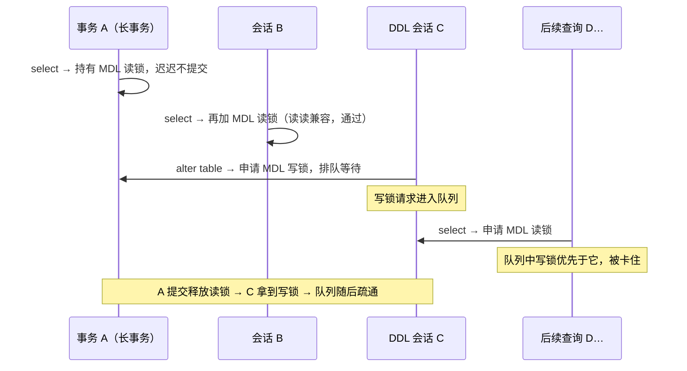
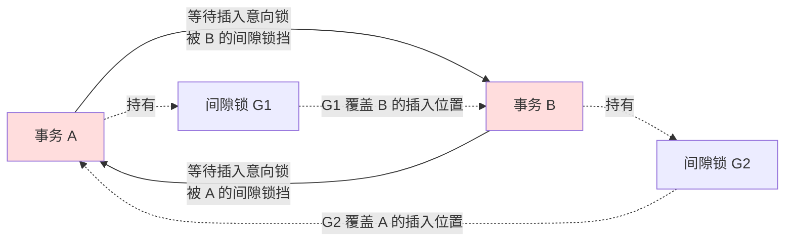
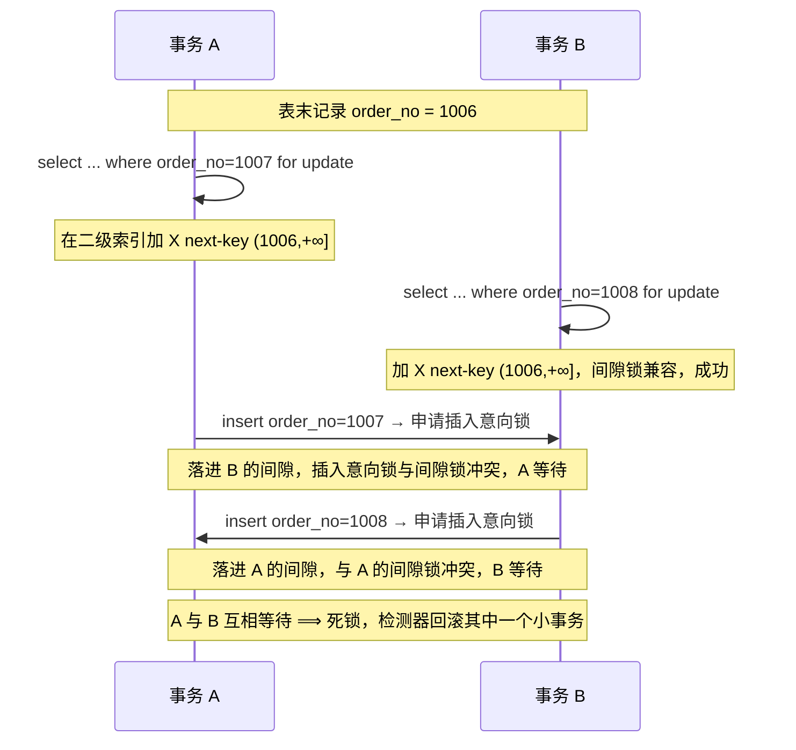
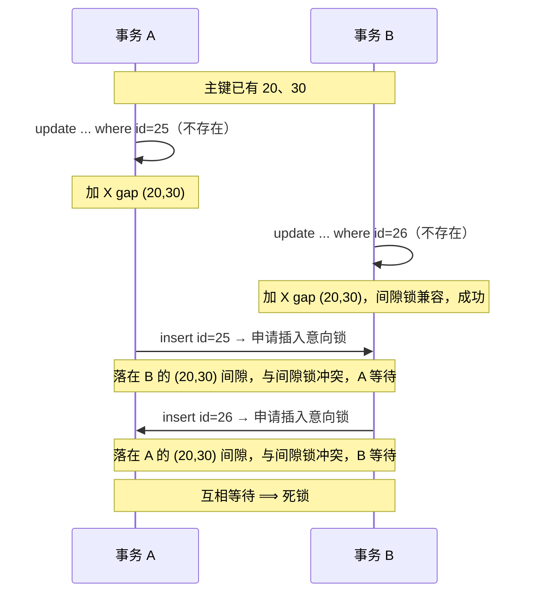

---
tags:
  - 中间件/MySQL
---

# 锁、加锁分析与死锁

`InnoDB` 的并发控制由两套机制分担。普通 `SELECT` 走快照读，靠 MVCC 读到事务启动时的版本，不加行锁；写操作（`UPDATE` / `DELETE`）与锁定读（`SELECT ... FOR UPDATE` / `SELECT ... FOR SHARE`）才真正去争锁。锁的粒度决定了并发度，锁的范围决定了死锁的形状。

本篇按「锁有哪些 → 什么语句加多少锁 → 加锁范围失控 → 间隙锁与幻读 → 插入的锁 → 死锁 → 参数与排查」展开。加锁规则一节是核心，按「等值 / 范围」×「唯一索引 / 非唯一索引 / 无索引」逐个推导，不给一张结论表就结束。

## 1. 锁的三个层次

`InnoDB` 的锁按影响范围分三层，越往上粒度越粗、并发度越低（来源：MySQL 8.0 Reference Manual, 17.7.1）。三层是同时存在的：对一行加 X 锁，实际是「表上加了 IX 意向锁 + 某个索引记录上加了 X 锁」。

```text
   ┌─ 全局锁 ───────────────────────────────────────────────┐
   │  FLUSH TABLES WITH READ LOCK：整库只读，用于全库逻辑备份   │
   └───────────────────────────┬────────────────────────────┘
                               ▼
   ┌─ 表级锁 ───────────────────────────────────────────────┐
   │  表锁    LOCK TABLES ... read / write                    │
   │  元数据锁 MDL（读锁 / 写锁，访问表时自动加）               │
   │  意向锁   IS / IX（表级，标记「我要对行加锁」）            │
   │  AUTO-INC 锁（给自增列分配值时的锁）                      │
   └───────────────────────────┬────────────────────────────┘
                               ▼
   ┌─ 行级锁 ───────────────────────────────────────────────┐
   │  记录锁 Record Lock        只锁一条索引记录               │
   │  间隙锁 Gap Lock           锁记录之间的区间，不含记录       │
   │  临键锁 Next-Key Lock      记录锁 + 该记录之前的间隙锁      │
   │  插入意向锁 Insert Intention 插入前在间隙上的等待标记       │
   └────────────────────────────────────────────────────────┘

   一次 UPDATE 的锁不是「一把」：
     表级 IX（声明意图）
     └─ 索引记录上的 X 型记录锁（真正互斥的对象）
```

### 1.1 全局锁

全局锁用一条命令加上，加锁期间整个实例只读：

```sql
FLUSH TABLES WITH READ LOCK;   -- 加锁
UNLOCK TABLES;                 -- 释放（会话断开也会自动释放）
```

加锁后，其他线程的 `INSERT` / `UPDATE` / `DELETE` 与 `ALTER TABLE` / `DROP TABLE` 都会阻塞。它的用途是全库逻辑备份：备份要跨多张表读出一致的数据，而一次业务写常常同时改多张表。若不锁，可能出现「先备份了用户表（余额未扣）、此时用户下单扣款改了两张表、再备份商品表（库存已减）」的顺序，恢复后余额没少、库存少了。全局锁把这段窗口关掉。

代价是整个库在备份期间停写。绕过它的办法是让备份读一个一致性快照：`mysqldump` 的 `--single-transaction` 会在备份前开启一个可重复读事务，导出期间都读这个事务的快照，业务仍可并发写。前提是表用支持事务的引擎（`InnoDB`）；`MyISAM` 不支持事务，只能退回全局锁（来源：MySQL 8.0 Reference Manual, 15.7.3 与 mysqldump 文档口径）。

### 1.2 表级锁：表锁与元数据锁

表锁用 `LOCK TABLES` 显式加，读锁与写锁两种：

```sql
LOCK TABLES t_student READ;    -- 表级共享锁：本会话只读，其他会话只能读
LOCK TABLES t_student WRITE;   -- 表级独占锁：本会话可读写，其他会话读写全堵
UNLOCK TABLES;                 -- 释放本会话所有表锁
```

`LOCK TABLES` 有个容易踩的约束：它不只限制别的线程，也限制本线程。执行 `LOCK TABLES t1 READ, t2 WRITE` 后，本会话只能读 `t1`、读写 `t2`，连写 `t1` 都不允许，访问未加锁的表也会报错。粒度太大，`InnoDB` 场景下应当用行锁替代。

元数据锁（`MDL`，Metadata Lock）不需要显式申请：访问一张表时自动加。

- 对表做 `SELECT` / `INSERT` / `UPDATE` / `DELETE`（增删改查）时，加 `MDL` 读锁；
- 对表做 `ALTER TABLE` 等结构变更时，加 `MDL` 写锁。

读锁与读锁兼容，读锁与写锁、写锁与写锁互斥。它的作用是保证「有人正在读写数据时，表结构不被改掉」。真正危险的是它的持有期与排队规则：

- `MDL` 在事务提交后才释放，事务执行期间一直持有；
- 申请 `MDL` 会形成一个队列，**写锁的优先级高于读锁**，一旦有写锁在等，后续读锁请求也一起排在它后面。

这两条合起来就是那个经典事故：线程 A 开了一个不提交的长事务并执行过一次 `SELECT`，它持有的 `MDL` 读锁一直不放；线程 C 要 `ALTER TABLE`，申请 `MDL` 写锁被阻塞、进入队列；此后所有对该表的 `SELECT` 都排在写锁之后被卡住，连接数迅速被耗尽（来源：MySQL 8.0 Reference Manual, 17.7.1 与 metadata locking 文档口径）。



图里能看出，事故的引爆点在队列的排队规则——「写锁优先」把后续读请求一起堵住，`ALTER TABLE` 只是触发它的那一下。要安全地做结构变更，先在 `information_schema.innodb_trx` 里找长事务，必要时 `KILL` 掉再改。

`MDL` 的等待可以在 `performance_schema.metadata_locks` 里看到：`LOCK_TYPE` 为 `METADATA`、`LOCK_STATUS` 为 `PENDING` 的那条通常就是排队中的 `ALTER TABLE`，而 `LOCK_STATUS` 为 `GRANTED` 的 `SHARED_READ` 往往是那个不放锁的长事务。线上若出现大量查询无响应、`data_locks` 里又看不到 `InnoDB` 行锁，优先怀疑这一类。处理方式只有一个：找到持有 `SHARED_READ` 的长事务并 `KILL`，让队列疏通后再重试 DDL。`MDL` 读锁的持有期是事务级的，所以一个只读的长事务也能卡住整张表的结构变更与后续查询，这一点在 9.4 的排查里还会再遇到。

### 1.3 意向锁

`InnoDB` 支持多粒度锁，行锁与表锁要能共存，意向锁就是衔接两者的表级标记（来源：MySQL 8.0 Reference Manual, 17.7.1）：

- 要对某行加共享锁前，先在表上加意向共享锁 `IS`；
- 要对某行加独占锁前，先在表上加意向独占锁 `IX`。

`SELECT ... FOR SHARE` 加 `IS`，`SELECT ... FOR UPDATE` 与 `INSERT` / `UPDATE` / `DELETE` 加 `IX`。意向锁的作用是让「加表级独占锁」不必遍历全表：只要看到表上有 `IX`，就知道已经有人在某行上持锁，直接等待即可。

锁的兼容矩阵如下（`X` `IX` `S` `IS` 四行的行为，来源：MySQL 8.0 Reference Manual, 17.7.1）：

| 已有 \ 请求 | `X` | `IX` | `S` | `IS` |
| --- | --- | --- | --- | --- |
| `X` | 冲突 | 冲突 | 冲突 | 冲突 |
| `IX` | 冲突 | 兼容 | 冲突 | 兼容 |
| `S` | 冲突 | 冲突 | 兼容 | 兼容 |
| `IS` | 冲突 | 兼容 | 兼容 | 兼容 |

读这张表抓三条：意向锁之间全部兼容；意向锁只与表级的 `X` / `S` 冲突；行锁的真实互斥发生在记录层面（`S` 与 `X` 冲突），意向锁只是把它向上投影到表级。

### 1.4 AUTO-INC 锁与 innodb_autoinc_lock_mode

主键声明 `AUTO_INCREMENT` 后，插入时不指定主键也能拿到递增的值，这个值由 `AUTO-INC` 锁保证分配不重。`AUTO-INC` 锁是一把特殊的表级锁，它在语句执行完（而非事务提交后）就释放，原因很直接：只需保证同一时刻只有一个插入在分配自增值，不需要等到事务结束。

它的行为由 `innodb_autoinc_lock_mode` 控制，三档（来源：MySQL 8.0 Reference Manual, 17.6.1.6）：

| 值 | 名称 | 释放时机 | 自增值是否连续 |
| --- | --- | --- | --- |
| `0` | traditional | 语句结束后释放 | 连续 |
| `1` | consecutive | 普通插入申请后立即释放；`INSERT ... SELECT` 一类批量插入仍等语句结束 | 单条连续，批量可能不连续 |
| `2` | interleaved | 申请后立即释放 | 可能交错、不连续 |

`0` 的自增值严格连续，代价是并发插入互相阻塞；`2` 并发最高，代价是同一语句分配到的自增值可能被其他事务穿插。`1` 是折中。**MySQL 8.0 起默认值是 `2`**，5.7 及以前是 `1`（来源：MySQL 8.0 Reference Manual, 17.6.1.6）。

默认值从 `1` 改成 `2` 的背景是复制方式的转变：基于语句的复制（`statement`）要求从库重放时自增值与主库一致，需要连续分配；基于行的复制（`row`）记录的是具体的自增值，对语句执行顺序不敏感。所以在 `binlog_format = row` 下用 `2` 既快又安全。若仍用 `statement` 格式配 `2`，主库上两个事务交错分配出的自增值顺序，到了从库单线程重放时会变成连续，主从数据就不一致了。

`AUTO-INC` 锁与事务的 `IX` 锁是两把不同的锁：前者保证自增值分配不重复，在语句结束即释放，与行锁无关；后者是 `INSERT` 对表加的意向锁，随事务结束释放。所以一个事务的 `INSERT` 尚未提交时，其他插入不会被 `AUTO-INC` 锁挡住（`mode = 2` 下它早已释放），却可能因为唯一键冲突或落在别人的间隙锁里而阻塞——两类阻塞的根因完全不同，排查时要分开看。

### 1.5 行级锁的四种形态

行级锁的加锁对象是**索引记录**，不是「行」。`InnoDB` 即使表上没有任何索引，也会创建一个隐藏聚簇索引（`GEN_CLUST_INDEX`）来承载记录锁（来源：MySQL 8.0 Reference Manual, 17.7.1）。四种形态：

```text
   假设索引上依次有记录 10、11、13、20，末端是 supremum（∞ 哨兵）
   ────●──────────●────●─────────────●──────────────▶ 索引值增大
      id=10     11   13            20       supremum

   记录锁 Record Lock：只锁记录本身
      X 加在 id=11 上        ⟹ 别的写事务改/删 11 被阻塞

   间隙锁 Gap Lock：只锁记录之间的区间，不含记录（前开后开）
      X 加在区间 (10, 13)     ⟹ 插入 11、12 被阻塞，改 10/13 不受它影响

   临键锁 Next-Key Lock：记录锁 + 该记录之前的间隙（前开后闭）
      X 加在 id=13 的临键锁   ⟹ 区间 (11, 13]，插入 12 与改删 13 都被阻塞

   插入意向锁 Insert Intention：插入前在间隙上的等待标记
      向 (11, 13) 插 12       ⟹ 若该间隙已被间隙锁占用，生成它并等待

   区间记号：() 表示开区间不含端点，[] 表示闭区间含端点
     间隙锁 (10, 13) 是开开；临键锁 (11, 13] 是前开后闭
```

四个要点：

- **记录锁有 S / X 之分**：`S` 与 `S` 兼容，`S` 与 `X` 冲突，`X` 与 `X` 冲突。
- **间隙锁只有 X 型，且彼此兼容**。官方原话是 `Gap locks in InnoDB are "purely inhibitive"`、`There is no difference between shared and exclusive gap locks`（来源：MySQL 8.0 Reference Manual, 17.7.1）。两个事务可以在同一段间隙上同时持有间隙锁，因为它的唯一目的是阻止插入。
- **临键锁包含记录锁**，所以要考虑 `S` / `X` 关系：两个事务不能同时持有同一范围的 X 型临键锁。
- **末端区间** `(20, +∞)` 锁的是最大索引值之上的间隙，加上一个值比任何真实记录都大的 supremum 伪记录（来源：MySQL 8.0 Reference Manual, 17.7.1）。由于 supremum 不是真实记录，这一段上没有记录锁的互斥，两个事务可以同时持有形如 `(20, +∞]` 的临键锁。

一行数据可以被两把锁同时覆盖：如果查询走二级索引，命中的二级索引记录上会加锁，回表定位到的那条聚簇索引记录上也会加锁。这是「锁加在索引上」的直接推论——同一行在不同索引树里有各自的索引项，锁加在哪棵树、加在哪一项上，由查询的访问路径决定（见 2.4）。

把三种行锁的区间记号并列，便于对照：记录锁锁一条记录，可看作单点 `{id}`；间隙锁写作 `(a, b)`；临键锁写作 `(a, b]`。同一段扫描里，从记录 A 到记录 B 的临键锁，等价于「B 的记录锁 + B 前面的间隙锁」；反过来，若只给 B 加记录锁，A 到 B 之间的空隙就没有任何保护，其他人仍能往中间插。这就是为什么临键锁是默认形态——它把「锁住记录」与「锁住它前面的空隙」捆在一起。

### 1.6 间隙锁在哪些隔离级别生效

间隙锁不是所有隔离级别都用。官方对它的表述是「used in some transaction isolation levels and not others」，并明确：把隔离级别改成 `READ COMMITTED` 会关闭查询和索引扫描的间隙锁，只在检查外键约束与唯一键冲突时还用到它（来源：MySQL 8.0 Reference Manual, 17.7.1）。

| 隔离级别 | 行级锁形态 | 间隙锁 |
| --- | --- | --- |
| `READ UNCOMMITTED` | 基本不用 | 不用 |
| `READ COMMITTED`（RC） | 记录锁为主 | 查询/扫描不加；仅外键与唯一键冲突检查用 |
| `REPEATABLE READ`（RR） | 记录锁 + 间隙锁 + 临键锁 | 用，默认级别 |
| `SERIALIZABLE` | 普通 `SELECT` 被隐式转成 `SELECT ... FOR SHARE` | 用 |

所以「间隙锁只在 RR 下生效」这句话要修正成：**它在 RR 与 SERIALIZABLE 下生效，在 RC 下关闭**。RC 关闭间隙锁后，幻读要靠别的机制兜底，最直接的表现是同一事务内两次锁定读之间可能出现新插入的行。这也解释了为什么把隔离级别降到 RC 能显著降低锁冲突与死锁概率。

## 2. 加锁规则：五种情形的完整推导

这一节按「等值 / 范围」×「唯一索引 / 非唯一索引 / 无索引」逐个推导锁范围。结论本身不长，难的是推出来的过程：`InnoDB` 每一步为什么加这把锁、为什么在这一步退化，都要能从一条统一的原则解释。原则只有一条——**只用更小的锁就能阻止结果集变化时，就退化成那个更小的锁**。后面的例子都从它出发。

### 2.1 加锁的对象与基本单位

先立三条前提，后面每个例子都从它们推。

**锁加在索引上。** `InnoDB` 的行锁是索引记录锁。查询走哪棵索引树，锁就加在哪棵树上：走主键索引只在主键索引上加锁；走二级索引则二级索引上加锁、命中的记录再回表到主键索引上加锁（来源：MySQL 8.0 Reference Manual, 17.7.1）。

**基本单位是临键锁，两种区间记号要分清。** 扫描到的每条索引记录，默认加的是临键锁，即「该记录 + 它前面的间隙」，区间写成前开后闭；间隙锁则只覆盖间隙，前开后开。官方给出的样例里，索引值 `10、11、13、20` 对应五段：`(-∞, 10]`、`(10, 11]`、`(11, 13]`、`(13, 20]`、`(20, +∞)`（来源：MySQL 8.0 Reference Manual, 17.7.1）。

**临键锁会在满足条件时退化。** 判据是「只用记录锁或只用间隙锁就够防幻读」：能防住就退成更小的锁。三种退化：

- 命中唯一索引等值查询的记录 → 退化成**记录锁**（不需要锁前面的间隙，唯一性已经挡住了插入）；
- 扫描到「第一条不满足条件」的记录 → 退化成**间隙锁**（不需要锁这条记录本身，只需挡住它前面的插入）；
- 范围查询里命中的唯一索引等值边界 → 退化成**记录锁**。

下面用一个固定的表来推。表结构：

```sql
CREATE TABLE `user` (
  `id` bigint NOT NULL AUTO_INCREMENT,
  `name` varchar(30) NOT NULL,
  `age` int NOT NULL,
  PRIMARY KEY (`id`),
  KEY `index_age` (`age`)          -- age 是普通（非唯一）二级索引
) ENGINE=InnoDB;
```

五行数据（实验环境 MySQL 8.0.26，隔离级别 `REPEATABLE READ`）：

| id（主键，唯一） | name | age（普通二级索引） |
| --- | --- | --- |
| 1 | 路飞 | 19 |
| 5 | 索隆 | 21 |
| 10 | 山治 | 22 |
| 15 | 乌索普 | 20 |
| 20 | 香克斯 | 39 |

同一批数据在两棵索引树上的顺序不同，这是后面所有例子的关键：主键索引按 `id` 排为 `1,5,10,15,20`；二级索引 `index_age` 按 `age` 排为 `id=1(19)、id=15(20)、id=5(21)、id=10(22)、id=20(39)`，`age` 相同再按 `id` 排。

### 2.2 唯一索引等值查询

唯一索引上的等值查询，先看命中的记录存不存在，两种情况锁的范围完全不同。判断依据还是上面那条原则：记录存在时，唯一性已经挡住插入，只需挡住删除与修改；记录不存在时，只需挡住它所在的那段间隙。

#### 2.2.1 命中记录：退化成记录锁

```sql
begin;
select * from user where id = 1 for update;   -- 命中 id=1
```

```text
   主键索引，按 id 升序
   ────┬────────┬────────┬─────────┬─────────┬─────────▶
      id=1     id=5    id=10    id=15     id=20    supremum
   ┌────▼───────────────────────────────────────────────┐
   │  [X]  只锁 id=1 这一条（记录锁，不含前面的间隙）       │
   └────────────────────────────────────────────────────┘
   为何能退化成记录锁：id 唯一 ⟹ 插入 id=1 必然唯一键冲突、进不来；
   记录锁又挡住删除与修改 ⟹ 结果集不可能变化，不需要间隙锁
```

`performance_schema.data_locks` 里能看到两条：一条表级 `IX` 意向锁，一条行级记录锁（`LOCK_TYPE: RECORD`，`LOCK_MODE: X, REC_NOT_GAP`）。官方对 `data_locks` 的 `LOCK_MODE` 取值定义是 `S[,GAP]`、`X[,GAP]` 一类（来源：MySQL 8.0 Reference Manual, 29.12.13.1），观测中记录的锁会多带 `REC_NOT_GAP` 表示「记录锁、不含间隙」，用 `GAP` 表示「间隙锁」，不带后缀表示临键锁。之后其他事务对 `id = 1` 做 `UPDATE` / `DELETE` 都会被阻塞，因为那些操作同样申请 X 记录锁，X 与 X 互斥。

**为什么能退化，要拆成两条来推**：`id` 是唯一索引，插入重复的 `id = 1` 会因唯一约束失败，所以「有人在结果集里凭空多出一行」这条路被唯一性堵住；剩下的「结果集里少了一行」由记录锁挡住删除与修改。两条都堵住，幻读就不可能发生，因此不必锁记录前面的间隙。

#### 2.2.2 未命中记录：退化成间隙锁

```sql
begin;
select * from user where id = 2 for update;   -- 表中没有 id=2
```

```text
   主键索引
   ────┬────────┬────────┬─────────┬─────────┬─────────▶
      id=1     id=5    id=10    id=15     id=20    supremum
      └──[X gap 加在 id=5 上，范围 (1, 5) ]──┘
        ▲                                              ▲
       左边界 = id=5 的上一条记录 = 1      右边界 = LOCK_DATA = 5

   锁住的是 (1, 5) 这段开区间：
     插入 id=2、3、4 一律被阻塞
     插入 id=1 或 id=5 报的是主键冲突，不是被这个间隙锁挡
```

扫描在索引树里找 `id = 2`，找不到，于是定位到「第一条大于 2 的记录」`id = 5`。这条记录上默认加临键锁 `(1, 5]`，但它退化成间隙锁 `(1, 5)`。`LOCK_DATA` 给出右边界 5，左边界取它的上一条记录 `id = 1`。

**为什么退化、为什么不能加记录锁，两条都要算**：查询 `id = 2` 只要保证前后两次结果集相同，而 `id = 2` 不存在，唯一需要防的是「有人插进一条 `id = 2`」，也就是锁住 `(1, 5)` 这段间隙即可。删除 `id = 5` 不会改变「`id = 2` 查不到」这个结果，所以 `id = 5` 这条记录本身不必锁，临键锁退化成间隙锁。至于「为什么不给不存在的记录加记录锁」——锁只能加在索引记录上，不存在的记录没有可挂靠的索引项。

### 2.3 唯一索引范围查询

范围查询的起点多了一次「等值判断」，因此退化规则比等值查询多一层：**起点命中唯一索引等值条件时退化成记录锁**，**扫描到第一个不满足条件的记录时退化成间隙锁**。下面四种组合逐个推。

#### 2.3.1 大于与大于等于

```sql
select * from user where id > 15 for update;    -- 只返回 id=20
```

```text
   主键索引
   ────┬────────┬────────┬─────────┬─────────┬─────────▶
      id=1     id=5    id=10    id=15     id=20   supremum
                                     └──[X next-key (15,20]]──┐
                                                             └─[X next-key (20,+∞]]
   第一行 id=20 不是等值命中（条件 >15 不把 15 当等值）⟹ 直接加临键锁 (15,20]
   扫到 supremum 哨兵 ⟹ 加临键锁 (20,+∞]，挡住 id>20 的插入
```

加了两把 X 型临键锁：`id = 20` 上 `(15, 20]`，supremum 上 `(20, +∞]`。效果是 `id = 20` 不能被改删，`16~19` 与 `>20` 都不能插入。

```sql
select * from user where id >= 15 for update;   -- 返回 id=15、20
```

```text
   主键索引
   ────┬────────┬────────┬─────────┬─────────┬─────────▶
      id=1     id=5    id=10    id=15     id=20   supremum
                                 ▲         └─[X next-key (15,20]]─┐
                                 │                                 └─[X next-key (20,+∞]]
                                 └─[X 记录锁]（15 是唯一索引等值命中）
   第一行 id=15 命中等值条件 ⟹ 临键锁退化成记录锁，只锁 id=15 这一条
```

加了三把：`id = 15` 上是记录锁（因为 `>=15` 里的「等于 15」在唯一索引上命中了，只需锁这一条），`id = 20` 上是 `(15, 20]`，supremum 上是 `(20, +∞]`。

两种写法的差别只在起点：`>` 的起点记录不是等值命中，锁是完整的临键锁；`>=` 的起点命中等值，锁退化成记录锁。

#### 2.3.2 小于与小于等于

```sql
select * from user where id < 6 for update;     -- 6 不存在，返回 id=1、5
```

```text
   主键索引
   ────┬────────┬────────┬─────────┬─────────┬─────────▶
      id=1     id=5    id=10    id=15     id=20   supremum
   [X (-∞,1]] [X (1,5]]  [X gap (5,10)]
     ▲          ▲           ▲
   扫到 1     扫到 5     扫到 10：第一条不满足 id<6 ⟹ 退化成间隙锁 (5,10)
                                      （只挡 6、7、8、9 的插入，不锁 10 本身）
```

加了三把 X 型锁：`id = 1` 上 `(-∞, 1]`，`id = 5` 上 `(1, 5]`，`id = 10` 上退化成间隙锁 `(5, 10)`。

这里要给一个容易误读的点：`select ... where id < 6` 锁住 `(5, 10)` 是**保守加锁**。插入 `id = 6、7、8、9` 本身并不满足 `id < 6`，把它们挡住对「防幻读」没有直接作用；`InnoDB` 之所以锁它，是因为扫描到第一条不满足条件的记录 `id = 10` 就停下，而这条记录的临键锁按规则退化成间隙锁 `(5, 10)`。它多锁了一段其实不必锁的区间，这是加锁规则的机械结果，不是为 `id < 6` 量身设计的（待验证；规则本身来自对 8.0 的观测口径）。

```sql
select * from user where id <= 5 for update;    -- 5 存在，返回 id=1、5
```

```text
   主键索引
   ────┬────────┬────────┬─────────┬─────────┬─────────▶
      id=1     id=5    id=10    id=15     id=20   supremum
   [X (-∞,1]] [X (1,5]]
   扫到 5 满足条件；id 唯一，不可能还有第二条 id=5 ⟹ 直接停止，不再扫到 10
   ⟹ 没有「第一条不满足条件的记录」，因此不出现间隙锁
```

```sql
select * from user where id < 5 for update;     -- 5 存在，但条件不含 5
```

```text
   主键索引
   ────┬────────┬────────┬─────────┬─────────┬─────────▶
      id=1     id=5    id=10    id=15     id=20   supremum
   [X (-∞,1]] [X gap (1,5)]
   扫到 5 是第一条不满足 id<5 的记录 ⟹ 它的临键锁退化成间隙锁 (1,5)
```

三种「小于」写法横向对照，规律很清楚：**终点是否退化成间隙锁，取决于扫描有没有走到一条「不满足条件」的记录，以及它的临键锁是否被等值命中保住**。

| 语句 | 条件值在表中 | 起点锁 | 终点锁 |
| --- | --- | --- | --- |
| `id < 6` | 否 | `(-∞,1]`、`(1,5]` | `(5,10)` 间隙 |
| `id <= 6` | 否 | 同 `id < 6` | 同 `id < 6`（条件值不存在，`<` 与 `<=` 等价） |
| `id <= 5` | 是 | `(-∞,1]` | `(1,5]` 临键，不退化成间隙 |
| `id < 5` | 是 | `(-∞,1]` | `(1,5)` 间隙 |

唯一索引四种范围写法的退化只有两个触发点，可以合起来记：

- **起点是等值命中**（`>=` 且条件值在表中）→ 起点那条记录退化成记录锁；
- **扫描到第一条不满足条件的记录** → 该记录退化成间隙锁。

其余扫到的记录都是完整临键锁。`>` 与 `>=`、`<` 与 `<=` 的差别都能由这两条推出：`>` 的起点不是等值命中，所以起点也是临键锁；`<=` 且条件值存在时，唯一索引保证不会有第二条相等的记录，扫描在命中记录处停止，走不到「第一条不满足条件的记录」，所以没有间隙锁——这也解释了为什么「条件值不存在时 `<` 与 `<=` 的锁完全一样」。向上没有边界时，末端一定扫到 supremum，端点锁是 `(max, +∞]`；由于 supremum 不是真实记录，两个事务可以同时持有形状相同的这段临键锁（见 1.5）。

### 2.4 非唯一索引等值查询

非唯一索引上的一次查询涉及两棵索引树：`age` 的二级索引与 `id` 的主键索引。加锁时两边都可能加，但主键索引只会对「满足查询条件的记录」加记录锁。

#### 2.4.1 命中记录

```sql
begin;
select * from user where age = 22 for update;   -- 命中 id=10
```

```text
   二级索引 index_age（按 age 升序，age 相同按 id 升序）
   ────┬────────────┬────────────┬────────────┬────────────┬──────▶
    id=1(19)   id=15(20)   id=5(21)   id=10(22)   id=20(39)  supremum
                                     └[X next-key (21,22]]  [X gap (22,39)]
                                      命中的记录加临键锁      第一条不满足
                                                              条件的记录退化
                                                              成间隙锁

   主键索引（只对满足条件的记录加锁）
   ────┬────────┬────────┬─────────┬─────────┬─────────▶
      id=1     id=5    id=10    id=15     id=20   supremum
                        ▲
                       [X 记录锁]  回表定位到 id=10，加记录锁
```

二级索引上加两把：`age = 22` 上 `(21, 22]` 临键锁，`age = 39` 上 `(22, 39)` 间隙锁。主键索引上对 `id = 10` 加一把记录锁。

**为什么要多一把 `(22, 39)` 的间隙锁**：`age` 上可能有多条相同的 22。设想只有 `(21, 22]` 这一把锁——它锁住的是 `age = 22, id = 10` 这条记录及它前面的间隙。但 `InnoDB` 的二级索引在 `age` 相同的时候按 `id` 排，所以一条 `age = 22, id = 12` 的新记录会排在 `id = 10` 之后，也就是落进 `(22, 39)` 这段间隙里。若不加 `(22, 39)`，这条 `id = 12` 的记录能插进来，事务 A 再查 `age = 22` 就会多出一行——幻读。所以必须再锁 `(22, 39)` 这段，把「`age = 22` 且 `id > 10`」的插入也挡住。这也解释了为什么非唯一索引不能像唯一索引那样退化成记录锁：**唯一性在这里帮不上忙，`age = 22` 本来就可以有多个**。

#### 2.4.2 未命中记录

```sql
select * from user where age = 25 for update;   -- 表中没有 age=25
```

```text
   二级索引 index_age
   ────┬────────────┬────────────┬────────────┬────────────┬──────▶
    id=1(19)   id=15(20)   id=5(21)   id=10(22)   id=20(39)  supremum
                                                    ▲
                                    [X gap (22, 39)] 加在 age=39 上
   扫描定位到第一条不符合条件的记录 age=39 ⟹ 临键锁退化成间隙锁 (22,39)
   没有命中任何记录 ⟹ 主键索引上不加锁
```

只在二级索引的 `age = 39` 上加一把 `(22, 39)` 间隙锁，主键索引不加锁。效果是 `age` 落在 `23~38` 的插入被阻塞。

`LOCK_DATA` 在这里会显示两个值，例如 `39, 20`：前一个 `39` 是锁区间的右边界（也是 `age` 值），后一个 `20` 是落在这个边界上的记录的 `id`。官方说明二级索引上的锁，`LOCK_DATA` 会「Secondary index values ... with primary key values appended」（来源：MySQL 8.0 Reference Manual, 29.12.13.1）。两个值合起来回答一个更细的问题：插入 `age = 39` 的新记录时，哪些 `id` 会被挡——`id < 20` 的记录会排进这段间隙、被挡；`id > 20` 的会排到现有 `age = 39` 之后，能不能插取决于它后面那段有没有锁。这一点在排查时要自己画出二级索引的排布才能判，单看 `data_locks` 的输出不够。

### 2.5 非唯一索引范围查询

```sql
begin;
select * from user where age >= 22 for update;   -- 命中 id=10(22)、id=20(39)
```

```text
   二级索引 index_age
   ────┬────────────┬────────────┬────────────┬────────────┬──────▶
    id=1(19)   id=15(20)   id=5(21)   id=10(22)   id=20(39)  supremum
                                     └[X next-key (21,22]]  └[X next-key (22,39]]  └[X nk (39,+∞]]
   主键索引
   ────┬────────┬────────┬─────────┬─────────┬─────────▶
      id=1     id=5    id=10    id=15     id=20   supremum
                        ▲                    ▲
                       [X 记录锁]           [X 记录锁]   回表对命中记录加记录锁
```

二级索引上加三把临键锁：`age = 22` 上 `(21, 22]`、`age = 39` 上 `(22, 39]`、supremum 上 `(39, +∞]`；主键索引上对 `id = 10`、`id = 20` 各加一把记录锁。

**这里与唯一索引范围查询的差别是本节的落点**：`age >= 22` 的起点 `age = 22` 明明是一次等值命中，但二级索引的临键锁**没有**退化成记录锁，`age = 39` 的也没退化。原因是 `age` 非唯一——记录锁只挡删除与修改、不挡插入，一旦退化成记录锁，别的事务就能插进一条 `age = 22`，结果集变大，幻读发生。所以非唯一索引的范围查询，扫描到的每个记录都保留完整的临键锁，不退化（来源：对 MySQL 8.0.26 的观测口径，规则与 17.7.1「非唯一索引会锁前面的间隙」一致）。

顺带记一个已知的保守之处：`age >= 22` 时 `age = 39` 上加的是 `(22, 39]` 临键锁，把 `age = 39` 这条记录也锁了。理论上为了防幻读，锁 `(22, 39)` 间隙就够，`age = 39` 本身不必锁。`InnoDB` 没有做这个优化，实际锁范围比理论需要的更大（待验证）。

`age >= 22` 与 `age <= 22` 的对比也值得记：两者起点都可能命中 `age = 22`，但 `<=` 时扫描继续到第一条不满足条件的记录（`age = 39`），`age = 39` 上加的是完整临键锁 `(22, 39]`；`>=` 时 `age = 39` 本身在范围内，同样是 `(22, 39]`。容易误以为 `age = 39` 加一把间隙锁 `(22, 39)` 就够防幻读、锁上 `39` 本身是多余的——`InnoDB` 没有做这个优化，实际锁范围比理论需要的大。这与 2.3.2 里唯一索引的保守锁属同一类现象：锁范围由「扫描到哪条记录」决定，不由「理论最少需要锁什么」决定。

### 2.6 无索引：全表扫描

```sql
-- name 上没有索引
select * from user where name = '路飞' for update;
```

```text
   没有可用索引 ⟹ 优化器选择全表扫描（扫主键索引的每一行）
   ────┬────────┬────────┬─────────┬─────────┬─────────▶
      id=1     id=5    id=10    id=15     id=20    supremum
      [X]     [X]     [X]      [X]       [X]       [X]
   每条记录都加临键锁，末端再加 supremum 上的 (20,+∞]
   ⟹ 等价于锁住整张表
```

关键在**加锁发生在扫描过程中，不是发生在输出结果上**。哪怕只有一行满足 `name = '路飞'`，只要扫描方式是全表扫描，扫过的每条记录都被加了临键锁。这条规则不只适用于锁定读，`UPDATE` / `DELETE` 的 `WHERE` 不走索引时同样全表扫描，同样对每条记录加临键锁。

### 2.7 五种情形的对照

把上面的结论收成一张表，便于按查询条件反查锁范围：

| 情形 | 例子 | 起点 / 命中记录 | 终点 / 边界 | 会不会退化 |
| --- | --- | --- | --- | --- |
| 唯一索引等值，命中 | `id = 1` | `id=1` 记录锁 | — | 退化成记录锁 |
| 唯一索引等值，未命中 | `id = 2` | `id=5` 上 `(1,5)` 间隙 | — | 退化成间隙锁 |
| 唯一索引范围，`>` / `<` | `id > 15`、`id < 5` | 端点加完整临键锁/间隙 | supremum 或首条不满足记录 | 终点视条件值是否命中而定 |
| 唯一索引范围，`>=` 命中 | `id >= 15` | `id=15` 记录锁 | `id=20` 上 `(15,20]` + supremum | 起点退化成记录锁 |
| 非唯一索引等值，命中 | `age = 22` | 二级 `(21,22]` + 主键记录锁 | 首条不满足记录上间隙锁 | 二级索引不退化成记录锁 |
| 非唯一索引范围 | `age >= 22` | 全部临键锁 | 全部临键锁 | **不退化** |
| 无索引 | `name = 'x'` | 每条记录临键锁 | 全表 + supremum | 相当于锁全表 |

> [!warning] 加锁规则是观测口径，不是规范
> 上面这套规则来自对 MySQL 8.0.26、`REPEATABLE READ` 下的实验归纳，官方文档只给了原则（记录锁、间隙锁、临键锁的定义与退化条件），没有给出逐组合的逐字结论。换个版本、换个优化器行为，边缘情形可能有出入，因此把具体某条语句的锁范围当作调优依据前，应在目标版本上用 `performance_schema.data_locks` 实测一次。

用这张表的方式是先确定三件事：查询走的是唯一索引、非唯一索引还是无索引；是等值还是范围；等值的条件值是否命中。三件事定下来，起点锁、终点锁、会不会退化就都能对上。最容易记错的是两处——「非唯一索引范围查询不退化」（很多人按唯一索引的直觉以为会退化），以及「唯一索引范围查询的退化只看起点与第一条不满足条件的记录」。记住这两处，其余都是推论。

## 3. update 没加索引导致锁范围失控

这一节把 2.6 的「无索引」单独拿出来，因为它是线上最常见、破坏力最大的一种加锁失控：一条没有走索引的 `UPDATE` 或 `DELETE` 会把整张表的索引记录按临键锁锁住，事务不结束就不释放。

### 3.1 事故如何发生

`UPDATE` 的 `WHERE` 不走索引时，优化器只能全表扫描。加锁发生在扫描过程中，每条扫过的记录都加临键锁，于是整张表被锁住。用一张四行的表看最小复现：

```sql
CREATE TABLE `t` (
  `id` int NOT NULL,
  `name` varchar(30) DEFAULT NULL,
  PRIMARY KEY (`id`)
) ENGINE=InnoDB;
-- 四行：id = 1、2、3、4
```

```text
   事务 A： update t set name='x' where name='y';   -- name 无索引 → 全表扫描
   ────┬────────┬────────┬────────┬────────┬─────────▶
      id=1     id=2    id=3    id=4    supremum
      [X]     [X]     [X]      [X]      [X]
      │        │        │        │         │
   记录锁     记录锁   记录锁   记录锁     —
   间隙锁   间隙锁   间隙锁   间隙锁   间隙锁
   (-∞,1)  (1,2)   (2,3)   (3,4)   (4,+∞)
   └────────────── 4 个记录锁 + 5 个间隙锁 ──────────────┘
   ⟹ 每一行的改删都被阻塞，等价于锁住全表，直到事务 A 提交
```

四行数据产生 4 个记录锁加 5 个间隙锁，锁范围合起来覆盖 `(-∞, +∞)`。此时事务 B 执行任意一行 `UPDATE` 都会被阻塞，直到事务 A 提交。表越大、事务越长，窗口越久。

要点是「不进则退」：**只要 `WHERE` 带索引不等于安全**。优化器可能因为索引区分度低、统计信息过期、条件写法等原因放弃索引，最终还是全表扫描。判断标准是实际执行计划，不是语句里有没有 `WHERE`。

### 3.2 观测：这条语句到底锁了多少行

三个观测点，按从粗到细排：

```sql
-- 1) 事务级：这个事务锁了多少行、改了多少行
SELECT trx_id, trx_state, trx_rows_locked, trx_rows_modified, trx_started
FROM information_schema.innodb_trx;

-- 2) 锁级：逐把锁看类型、模式、范围
SELECT ENGINE_TRANSACTION_ID, OBJECT_NAME, INDEX_NAME,
       LOCK_TYPE, LOCK_MODE, LOCK_STATUS, LOCK_DATA
FROM performance_schema.data_locks
WHERE OBJECT_NAME = 't';

-- 3) 阻塞关系：谁在等谁
SELECT * FROM performance_schema.data_lock_waits;
```

`trx_rows_locked` 是判断「是否锁了全表」最快的信号：它显著大于预期影响行数（比如预期改 1 行、实际 `trx_rows_locked` 等于表行数）时，基本可以断定走了全表扫描、加了整表范围的临键锁。`data_locks` 里 `LOCK_TYPE = RECORD` 的行数约等于 `2 × 行数 + 1`（每行记录锁 + 间隙锁，再加 supremum 一段），也是同一结论的旁证。

> [!warning] 8.0 换了观测表
> 5.7 及以前用 `information_schema.innodb_locks` 和 `innodb_lock_waits` 看锁与等待关系；这两个表在 **MySQL 8.0.1 起被移除**，替代者是 `performance_schema.data_locks` 与 `data_lock_waits`（来源：MySQL 8.0 Reference Manual, 29.12.13.1）。在 8.0 上照旧写 `innodb_locks` 会直接报表不存在。8.0 的 `data_locks` 还多一个差异：无论有没有事务在等它，它都会显示持有的锁；`innodb_locks` 只在有人等待时才显示。

### 3.3 规避手段

**上线前用 `EXPLAIN` 看访问类型。** `type` 列出现 `ALL` 就是全表扫描；`UPDATE` / `DELETE` / `SELECT ... FOR UPDATE` 只要 `type = ALL`，就按「会锁全表」处理。`EXPLAIN` 给出的是优化器的估计，必要时用 `EXPLAIN ANALYZE`（8.0.18 起）看真实执行。

**用 `FORCE INDEX` 纠正计划。** 当 `WHERE` 已带索引列、优化器仍然选全表扫描时，可以指定索引：

```sql
UPDATE t FORCE INDEX (index_age) SET name = 'x' WHERE age = 25;
```

`FORCE INDEX` 强制使用指定索引，代价是放弃优化器的判断权；若该索引的区分度并不比全表扫描好，可能换来回表开销上升。

**从语句层面挡住无条件的批量改删。** 打开 `sql_safe_updates` 后，`UPDATE` / `DELETE` 不带可用索引或 `LIMIT` 时会直接报错。

### 3.4 sql_safe_updates

`safe_updates` 参数默认值是 `0`，开启后对危险语句做静态拦截（来源：MySQL 8.0 Reference Manual, 7.1.8）：

| 语句 | 开启 `sql_safe_updates = 1` 后的要求 |
| --- | --- |
| `UPDATE` | `WHERE` 用到键，**或**带 `LIMIT`；两者有一段满足即可 |
| `DELETE` | 必须同时有 `WHERE` 与 `LIMIT` |

它拦的是「语句形态」，不是真实执行计划——`WHERE` 写了索引列、优化器仍走全表扫描的情况，它挡不住，仍要配合 `EXPLAIN` 与 `FORCE INDEX`。

```sql
SET sql_safe_updates = 1;                 -- 会话级开启（也可全局）
UPDATE t SET name = 'x';                  -- 无 WHERE、无 LIMIT → 直接报错
DELETE FROM t WHERE id = 1 LIMIT 1;       -- 有 WHERE + LIMIT → 放行
```

代价很直接：正常业务里的批量维护语句会被一起拦下，因此更适合在测试环境或人工运维通道常开，生产环境按需临时开启。

`sql_safe_updates` 既可在会话级 `SET sql_safe_updates = 1`，也可在全局设置。它是语句级的静态检查，不影响执行计划，拦住的只是「明显没有约束」的语句；真正的防线仍是上线前的 `EXPLAIN` 与在测试库上实测锁范围，`sql_safe_updates` 只作兜底。

## 4. 间隙锁与幻读

间隙锁的存在理由与幻读绑在一起：上一节非唯一索引范围查询里那把「多出来的」间隙锁，正是为了挡住插入。这一节先讲清间隙锁锁的是什么，再讲它与 MVCC 的分工，最后用一个实验检验它在删除方向上到底管不管用。

### 4.1 间隙锁锁的是区间

间隙锁锁的是索引记录之间的缝隙，不含记录本身。官方定义是 `a lock on a gap between index records, or a lock on the gap before the first or after the last index record`（来源：MySQL 8.0 Reference Manual, 17.7.1）。

```text
   索引上已有 3 与 5，中间没有 4
   ────────●───────────────●────────▶ 索引值增大
          id=3            id=5

   间隙锁 X gap 加在 (3, 5)：
   ────────●══[ 被锁的区间 ]══●────────▶
          id=3  ▶ 插入 4 被阻塞  id=5
                └─ 插入 id=4 被阻塞

   它不锁记录：
     改/删 id=3、id=5 不受这把间隙锁影响（要改删需记录锁）
   它只管插入：
     └─ 区间内任何位置的插入都被挡住，无论中间原本有没有值
```

由于它的唯一目的是阻止插入，间隙锁之间互不冲突：两个事务可以同时持有同一段间隙上的间隙锁，`S` 型与 `X` 型也没有区别（来源：MySQL 8.0 Reference Manual, 17.7.1）。这条「兼容」性质是后面两个死锁案例的成因之一。

### 4.2 与 MVCC 的分工：快照读与当前读

`InnoDB` 在可重复读下用两套互补的机制解决幻读，按读语句的类型分工：

| 读类型 | 语句 | 机制 | 锁 |
| --- | --- | --- | --- |
| 快照读 | 普通 `SELECT` | MVCC：读事务启动时的 Read View | 不加锁 |
| 当前读 | `SELECT ... FOR UPDATE` / `FOR SHARE`、`UPDATE`、`DELETE` | 记录锁 + 间隙锁（临键锁） | 加锁 |

快照读靠「事务执行过程中一直用同一个 Read View」挡住中途插入的行：即使别的事务已经提交了新行，本事务的查询也看不到它。当前读要读最新版本，Read View 不再适用，只能靠间隙锁把「可能的插入位置」锁住。所以间隙锁解决的是**当前读的幻读**，快照读的幻读由 MVCC 解决（机制细节见 `05-事务隔离与 MVCC`）。

这也解释了一个常见困惑：为什么同一个事务里，一次当前读和一次快照读可能看到不同的结果集——它们用的机制不同，前者的幻读由锁挡，后者的由 Read View 挡。

举个具体例子说明两套机制的分工。事务 A 先执行 `select * from t where age > 20`（快照读），得到 6 行；事务 B 插入一条 `age = 30` 的记录并提交；事务 A 再执行同一条快照读，仍是 6 行——MVCC 用同一个 Read View 挡住了新行。若把 A 的语句换成 `select ... for update`（当前读），第一次就会在扫描范围内加临键锁，B 的插入被阻塞，A 两次读到的都是 6 行。前者靠「看不到」，后者靠「进不来」，效果相同、代价不同：快照读不阻塞别人写，当前读则会把写挡在外面。

### 4.3 实验：记录锁与间隙锁能否防止删除导致的幻读

幻读的常见定义是「同一查询前后两次返回不同的行集」，它包含两种变化：多了新行（插入）与少了旧行（删除）。日常讨论多集中在插入，本节的实验检验删除这一侧。

环境：MySQL 8.0，`REPEATABLE READ`。一张 `t_user` 表，只建主键索引，若干行数据。事务 A 执行：

```sql
begin;
select * from t_user where age > 20 for update;   -- 全表扫描，返回 6 行
```

随后事务 B 执行 `delete from t_user where id = 2;`，会被阻塞。原因是 `age` 没有索引，事务 A 的查询走了全表扫描，对扫过的每条记录都加了临键锁：

```text
   事务 A 在 t_user 主键索引上加的锁（全表扫描）
   ────┬────┬────┬────┬────┬────┬────┬────┬────┬────┬──────▶
      id=1  2    3    4    5    6    7    8    9   supremum
      [X]  [X]  [X]  [X]  [X]  [X]  [X]  [X]  [X]   [X]
      └(-∞,1]┘(1,2]┘(2,3]┘(3,4]┘(4,5]┘(5,6]┘(6,7]┘(7,8]┘(8,9]┘(9,+∞]
   ── 10 个 X 型临键锁，覆盖整张表 ──────────────────────────────
   id=2 在这 10 段中的 (1,2] 里，被记录锁锁定
   ⟹ 事务 B 的 delete id=2 申请 X 记录锁，与 A 的 X 冲突 → 阻塞
```

事务 A 前后两次执行同一条查询，结果集都包含 `id = 2`（因为 B 的删除被挡），行集不变，删除导致的幻读没有发生。这就验证了「记录锁 + 间隙锁可以防止删除操作导致的幻读」。

**给 `age` 建索引后再看锁范围**，可以看清扫描方式对锁的影响。此时会分别对主键索引与 `age` 索引加锁：

```text
   主键索引：只对满足 age>20 的记录加记录锁
   ────┬────┬────┬────┬────┬────┬────┬────┬────┬──────▶
      id=1  2    3    4    5    6    7    8   supremum
              [X]  [X]       [X]  [X]  [X]  [X]
              └─ id=2、3、5、6、7、8 命中 age>20，各加一把记录锁

   age 索引：对命中记录加临键锁，合并后是 (19, +∞]
   ────┬────────┬────────┬────────┬────────┬────────┬──────▶
     age=19   20       21       23       39       43   supremum
           └── 各段 next-key 相连，合并为 (19,+∞] ──┘
   ⟹ 锁范围由「整张表」收缩到 age>19 这一段，不再锁全表
```

对比两种扫描方式可以看到，**锁范围由「扫过的索引记录」决定，不由「输出的结果集」决定**。全表扫描时结果集只有 6 行，但扫过 9 条记录，锁就是 10 段；走 `age` 索引时扫描范围收窄，锁范围随之收窄。

**加上 `age` 索引后，哪些删除会被挡？** 事务 A 的锁从「整表临键锁」收缩到 `age` 索引上的 `(19, +∞]` 与命中的 6 条主键记录锁。事务 B 执行 `delete from t_user where id = 2` 时走主键索引，`id = 2` 恰好是命中的记录之一，它的记录锁已被 A 持有，B 申请 X 记录锁仍被阻塞。若 B 删的是一条没被 A 命中的记录（比如某条 `age ≤ 20` 的行），它的记录锁不在 A 的锁集合里，删除能成功，但这条记录本来就不在 A 的结果集里，删除不改变结果集，不构成幻读。真正会引发幻读的删除，只会落在 A 扫描命中的记录上，而那些记录锁已被 A 持有。

因此流传的说法「间隙锁只挡插入、不挡删除，所以防不住删除导致的幻读」混淆了两种锁的分工：挡住删除的是记录锁，间隙锁负责插入。只要被删记录在锁定读的扫描范围内，它的记录锁就已经被扫描过程加上了，删除必然被挡；挡不住的是扫描范围之外的删除，而那种删除不会改变结果集。

把两种扫描方式的锁数量并排看：不建索引时 9 条被扫记录产生 10 个临键锁（9 个记录锁加 10 段间隙），建了索引后主键索引上只剩 6 个记录锁、`age` 索引上的若干段合并成 `(19, +∞]`。锁数量与扫描到的记录数成正比，这是判断一条锁定读「危不危险」的量化依据——先看扫描了多少条记录，再谈锁范围。

### 4.4 结论与边界

三条结论：

- 可重复读下，当前读给索引记录加记录锁与间隙锁，插入与删除两个方向导致的幻读都被挡住；
- 删除侧的防线是记录锁（挡住删改）；插入侧的防线是间隙锁（挡住插入）。两者合起来才是完整的临键锁；
- 「有没有防住幻读」取决于锁范围是否覆盖了所有可能改变结果集的操作，而锁范围取决于扫描路径。走错索引或没有索引，锁范围会从「几行」放大到「整表」。

边界也在这里：**这些防线都建立在当前读上**。如果事务用的是普通 `SELECT`（快照读），防幻读靠的是 MVCC 的 Read View，与锁无关；此时别的事务的删除与插入都能提交，只是本事务看不到，这是 MVCC 语义而非「没防住」。两种机制各自覆盖的读类型见 `05-事务隔离与 MVCC`。

## 5. INSERT 的加锁

插入的加锁与前几节的查询不同：正常情况下 `INSERT` 不生成锁结构。

### 5.1 隐式锁

新插入的记录不立即加锁，而是靠聚簇索引记录自带的 `trx_id` 隐藏列充当「隐式锁」——只有当事务还没来得及提交、又有别的事务要去读或写这条记录时，才把隐式锁「升级」成显式锁结构（来源：MySQL 8.0 Reference Manual, 17.7.1 与 InnoDB 隐式锁机制口径）。这是一条延迟加锁的优化：绝大多数插入不会和其他事务冲突，提前加锁只会增加锁管理开销。

隐式锁在两种情况下会转成显式锁：

1. 记录之间已存在间隙锁（插入位置被别人的间隙锁覆盖）；
2. 新插入的记录与已有记录发生唯一键冲突。

隐式锁的判定依赖记录上的 `trx_id`：一个事务要读或写某条记录时，若发现它的 `trx_id` 属于一个尚未提交的活跃事务，就认为有冲突，此时去「复活」隐式锁——给持有方的事务补上一条显式锁记录，再让请求方正常排队。这条机制有两个工程后果：其一，只有真正发生冲突的记录才会产生锁结构，无冲突的批量插入几乎零锁开销；其二，`performance_schema.data_locks` 里看不到隐式锁，直到冲突把它触发成显式锁——所以「表里明明有未提交的插入，却查不到对应的行锁」是正常的，别据此判断没有锁。

### 5.2 插入意向锁与间隙冲突

插入一条记录前，`InnoDB` 先检查「待插入位置的下一条记录」上有没有间隙锁。若该间隙已被别的事务锁住，本次插入会生成一个**插入意向锁**（`LOCK_MODE: X, INSERT_INTENTION`），状态为 `WAITING`，插入阻塞到对方释放为止。

插入意向锁名字里带「意向」，但它属于行级的特殊间隙锁，与 1.3 节的表级意向锁是两回事。官方定义：`An insert intention lock is a type of gap lock set by INSERT operations prior to row insertion`，多个事务若在**同一间隙的不同位置**插入则互不阻塞（来源：MySQL 8.0 Reference Manual, 17.7.1）。

```text
   间隙 (4, 7) 上的三种情形（索引记录 4 与 7 之间）

   ① 两个插入落在不同位置：互不阻塞
   ──●═══════════════════════════════●──
     id=4    插入 5 ↑      插入 6 ↑   id=7
            各自持插入意向锁，位置不同 ⟹ 兼容

   ② 间隙已被间隙锁占用：插入被挡
   ──●══[ 事务 A 的间隙锁 ]════════════●──
     id=4        插入 5 ↑            id=7
            事务 B 生成插入意向锁并 WAITING
            ——插入意向锁与间隙锁冲突——
```

它与普通间隙锁的关键差别：两把间隙锁之间兼容，但一把间隙锁与落在它区间内的插入意向锁**互斥**。这正是间隙锁能挡住插入的实现方式。

### 5.3 唯一键冲突时的加锁

唯一键冲突会让插入方对「已存在的那条记录」加一把 S 型锁，锁的形态取决于冲突发生在哪个索引上（来源：MySQL 8.0 Reference Manual, 17.7.1 与 17.6.2 的口径）：

| 冲突类型 | 加在什么上 | 锁形态 |
| --- | --- | --- |
| 主键冲突 | 已存在的聚簇索引记录 | S 型记录锁（`LOCK_MODE: S, REC_NOT_GAP`） |
| 唯一二级索引冲突 | 已存在的二级索引记录 | S 型临键锁（`LOCK_MODE: S`） |

下面的时序会引发阻塞乃至死锁，值得记住：

```text
   事务 A、B 依次执行 insert order_no = 1006（order_no 是唯一二级索引）

   事务 A: insert order_no=1006  -> 成功，记录仅受「隐式锁」保护，无锁结构
   事务 B: insert order_no=1006  -> 遇到唯一键冲突，想加 S 型 next-key 锁
   └─ 冲突触发 A 的隐式锁升级为 X 型记录锁
      └─ B 的 S 型 next-key 与 A 的 X 记录锁互斥 ⟹ B 阻塞
         └─ 直到 A 提交释放锁，B 才能继续（多半以唯一键冲突报错收场）
```

两个并发事务插入同一个唯一值时，后到的那个会被前一个的隐式锁升级后挡住。若它同时还在别处持锁，就可能与其他事务互等，构成死锁。

### 5.4 ON DUPLICATE KEY UPDATE 与 REPLACE INTO

两条语句都用于「插入或覆盖」，但语义不同（来源：MySQL 8.0 Reference Manual, 15.2.7.2 与 15.2.12）：

| 语句 | 语义 | 对冲突行的动作 | `AUTO_INCREMENT` |
| --- | --- | --- | --- |
| `INSERT ... ON DUPLICATE KEY UPDATE` | 命中唯一键则更新 | 对已有行做 `UPDATE` | 即使只是更新也消耗一个自增值 |
| `REPLACE INTO` | 命中唯一键则删除后插入 | 先 `DELETE` 再 `INSERT` | 新插入的行会分配自增值 |

`REPLACE` 的官方算法是「尝试插入，遇到唯一键冲突就删掉冲突行、再重试插入」（来源：MySQL 8.0 Reference Manual, 15.2.12），因此它对表有 `PRIMARY KEY`、`UNIQUE` 索引以外没有任何意义——没有唯一索引就退化成普通 `INSERT`。

两者加锁的差别可从语义推出：`ON DUPLICATE KEY UPDATE` 对冲突行走的是更新路径，会对已有行加 X 记录锁；`REPLACE` 会先删除冲突行，因此携带有 `DELETE` 的加锁开销，并可能在唯一索引上留下间隙锁。两者在多唯一索引的表上都有额外风险：`ON DUPLICATE KEY UPDATE` 可能更新到多行中的任意一行（等价于对多行条件加 `LIMIT 1`），`REPLACE` 可能删掉多行（多个唯一索引各自命中不同旧行时），因此在幂等写入的实现里应优先用单唯一键。以上锁形态的推断来自语句语义，官方文档未逐条给出加锁模式说明（待验证）。

选型上有一条经验：幂等写入优先用「唯一索引 + `INSERT ... ON DUPLICATE KEY UPDATE`」，不用「先查后插」。前者把冲突交给唯一约束处理，不需要那次锁定读，从源头去掉了第 6.3 节死锁所需的间隙锁；`REPLACE INTO` 虽然也能覆盖，但它先删后插——删除会带上 `DELETE` 的加锁、插入会分配新的自增值，对有外键、触发器或依赖自增 id 的表要谨慎。两条语句在多唯一索引的表上都不安全，必要时先精简为单唯一键。

## 6. 死锁

死锁是两个以上事务各持一部分锁、又都在等对方释放锁，谁也无法推进的状态。官方定义：`multiple transactions are unable to proceed because each transaction holds a lock that is needed by another one`（来源：MySQL 8.0 Reference Manual, 17.7.5）。

### 6.1 四个必要条件在 InnoDB 中的表现

死锁的四个必要条件（互斥、占有且等待、不可剥夺、循环等待）在 `InnoDB` 里有具体对应：

| 条件 | 在 InnoDB 中的表现 |
| --- | --- |
| 互斥 | `X` 与 `X`、`X` 与 `S` 的记录锁互斥；插入意向锁与间隙锁互斥 |
| 占有且等待 | 一个事务已持有间隙锁，同时又在等待插入意向锁 |
| 不可剥夺 | 锁不会被强行抢走，只能由持有方提交或回滚后释放 |
| 循环等待 | 等待关系构成环：A 等 B、B 等 A |

`InnoDB` 的死锁有一个反直觉的特点：**它和隔离级别无关**。官方明确说 `The possibility of deadlocks is not affected by the isolation level`，因为隔离级别改变的是读操作的行为，而死锁来自写操作（来源：MySQL 8.0 Reference Manual, 17.7.5）。哪怕事务只插入或删除一行也可能死锁——这些操作本身不「原子」，它会在一行涉及的多个索引记录上依次加锁。

把四个条件放回第 6.3、6.4 两个案例，可以看清它们在 `InnoDB` 里的具体载体：互斥由 X 记录锁、以及「插入意向锁与间隙锁」这一对承担；占有且等待由「已持有的间隙锁 + 正在等待的插入意向锁」构成；不可剥夺表现为锁只能等持有方提交或回滚才释放；循环等待由等待图里方向相反的两条边刻画。四个条件必须同时成立，破坏任意一个死锁就不成立——这正是「统一加锁顺序」（破坏循环等待）与「缩短事务」（缩小占有且等待的窗口）两类手段的依据。

### 6.2 死锁检测与回滚选择

`InnoDB` 用等待图（wait-for graph）检测环：每个事务是一个节点，等锁关系是一条有向边，出现环即判定死锁。检测默认开启（`innodb_deadlock_detect = ON`）。

检测到之后要选一个事务回滚来打破环，选择规则是**优先回滚「小事务」**，事务大小按已插入、更新、删除的行数衡量（来源：MySQL 8.0 Reference Manual, 17.7.5.2）。被回滚的事务收到：

```text
ERROR 1213 (40001): Deadlock found when trying to get lock; try restarting transaction
```



图里有两条边方向相反，构成环。检测算法沿这些边找环，找到后按事务大小挑一个回滚。回滚方释放自己持有的锁，另一方的等待随即解除。

这里有个容量边界：等待图不是无限大。当等待链上的事务数超过 **200**，或加锁线程需要查看等待事务持有的超过 **1,000,000** 把锁时，`InnoDB` 把它当作死锁处理，回滚发起检查的那个事务，并在 `LATEST DETECTED DEADLOCK` 段打印 `TOO DEEP OR LONG SEARCH IN THE LOCK TABLE WAITS-FOR GRAPH`（来源：MySQL 8.0 Reference Manual, 17.7.5.2）。高并发下这个错误意味着等待链已经过长，往往指向热点行竞争。

### 6.3 案例一：幂等校验下的唯一键冲突死锁

业务背景很典型：订单不能重复，新增订单前先用锁定读查一遍订单号是否存在，不存在再插入。

```sql
CREATE TABLE `t_order` (
  `id` int NOT NULL AUTO_INCREMENT,
  `order_no` int DEFAULT NULL,
  `create_date` datetime DEFAULT NULL,
  PRIMARY KEY (`id`),
  KEY `index_order` (`order_no`)       -- order_no 是普通索引
) ENGINE=InnoDB;
-- 表中已有 6 条记录，最后一条 order_no = 1006
```

两个事务分别要插入 `order_no = 1007` 与 `1008`，各自先做幂等校验：

```text
   ┌─ 事务 A ──────────────────────────┐  ┌─ 事务 B ──────────────────────────┐
   │ begin                             │  │ begin                             │
   │ select id from t_order            │  │ select id from t_order            │
   │   where order_no=1007 for update; │  │   where order_no=1008 for update; │
   │                                   │  │                                   │
   │ order_no=1007 不存在，扫描定位到  │  │ order_no=1008 不存在，同样定位到  │
   │ 第一条更大记录是 supremum，       │  │ supremum，在二级索引上加          │
   │ 加 X 型 next-key (1006, +∞]       │  │ X 型 next-key (1006, +∞]          │
   └───────────────────────────────────┘  └───────────────────────────────────┘
       两把临键锁区间相同，但间隙锁部分兼容，各自拿到（互不冲突）

   事务 A: insert ... values (1007, now());   事务 B: insert ... values (1008, now());
     需要插入意向锁                          需要插入意向锁
     └─ 落进 B 持有的 (1006,+∞] 间隙          └─ 落进 A 持有的 (1006,+∞] 间隙
        └─ 与 B 的间隙锁冲突，WAITING            └─ 与 A 的间隙锁冲突，WAITING
   ⟹ A 等 B 释放间隙锁、B 等 A 释放间隙锁 → 循环等待 → 死锁
```



成环点在两次 `INSERT`：两把 `(1006, +∞]` 的临键锁因为间隙部分兼容而同时成立，随后两个 `INSERT` 各要进入对方锁住的间隙，各自生成的插入意向锁与对方间隙锁冲突，两条等待边方向相反，环闭合。回滚哪个事务取决于事务大小——本案例两个事务都只做了少量操作，检测器会挑较小的那个回滚，被回滚方报 `ERROR 1213`。

值得对照的是：如果查询出的记录存在（比如 `order_no = 1006` 已在表中），等值命中会退化成记录锁，两把记录锁在二级索引上互斥，第二个事务在校验阶段就会被阻塞，而不会走到插入阶段成环。

### 6.4 案例二：两个事务的分段加锁顺序导致死锁

第二个案例的表只有主键索引，问题出在 `UPDATE` 一个不存在的 `id` 时留下的间隙锁。

```sql
CREATE TABLE `t_student` (
  `id` int NOT NULL,
  `no` varchar(255) DEFAULT NULL,
  `name` varchar(255) DEFAULT NULL,
  `age` int DEFAULT NULL,
  `score` int DEFAULT NULL,
  PRIMARY KEY (`id`)
) ENGINE=InnoDB;
-- 表中已有 id = 10、20、30 等记录
```

两个事务按下面四步交错执行：

```text
   Time 1  事务 A: update t_student set score=100 where id=25;
           id=25 不存在，扫描定位到第一条更大记录 id=30
           ⟹ 主键索引上加 X 型间隙锁 (20, 30)
   Time 2  事务 B: update t_student set score=100 where id=26;
           id=26 不存在，同样定位到 id=30
           ⟹ 加 X 型间隙锁 (20, 30)。间隙锁之间兼容，B 不被阻塞
   Time 3  事务 A: insert into t_student(id,...) value(25, ...);
           要插进 B 持有的 (20,30) 间隙 ⟹ 生成插入意向锁，WAITING
   Time 4  事务 B: insert into t_student(id,...) value(26, ...);
           要插进 A 持有的 (20,30) 间隙 ⟹ 生成插入意向锁，WAITING
   ⟹ A、B 互相等待对方的间隙锁 → 循环等待 → 死锁
```



与案例一的结构完全同构：两个「不存在的行」的 `UPDATE` 各自留下同一段间隙锁（兼容），两个 `INSERT` 又都要落进对方那段间隙。回滚规则同样按事务大小。这个案例的教训是 4.1 节那条「间隙锁之间兼容」的性质——它让两个事务都能拿到同一段区间，为后面的 `INSERT` 冲突埋下伏笔。

两个案例可以抽象成同一张图：事务各自先执行一次「锁定一个不存在的行」，拿到同一段间隙锁（间隙锁之间兼容，两把都能成立），随后各自执行一次「插进对方那段间隙」的插入。成环因此依赖两个条件——两次锁定读的对象落在同一段间隙里（案例一都是 `(1006, +∞]`，案例二都是 `(20, 30)`），两次插入的位置又各落在对方的间隙里。破坏任意一个，环就不成立：案例一把 `order_no` 建成唯一索引、用唯一键做幂等，等于去掉了那次锁定读，第一个条件不再成立；案例二若两个事务更新的 `id` 落在不同间隙（比如 15 与 25，对应 `(10, 20)` 与 `(20, 30)`），两段间隙锁不重叠，也不会成环。

回滚选择在这两个案例里都由「事务大小」决定，与案例的具体形状无关：检测器按已插入、更新、删除的行数衡量事务大小，回滚较小的那个。两个事务操作量相当时，取舍可能不稳定，应用层因此不能假设「总是回滚后到的那个」，必须对任意一方被回滚都能重试。此外，两个案例的实验都注明「前提是没有打开死锁检测」——检测关闭时，两条等待不会立刻被识别成环，而是各自等到 `innodb_lock_wait_timeout` 超时，表现为两个长时间的 `ERROR 1205`，排查时容易与普通锁等待混在一起。这也是生产环境默认保留死锁检测的原因之一。

### 6.5 如何避免与处理

死锁无法被消灭，只能降低频率并保证业务可重试。官方给出的做法与工程手段合在一起：

**加锁顺序一致。** 多个事务要改多张表或同一张表的多组行时，按固定顺序操作，让它们排成一条队列而不是围成环（来源：MySQL 8.0 Reference Manual, 17.7.5）。

**缩短事务、及时提交。** 事务越小、持锁时间越短，与别人重叠的窗口越小。避免在交互式会话里挂着未提交事务。

**缩小锁定读的粒度。** `SELECT ... FOR UPDATE` 会锁住扫描到的索引记录，能不加就不加；确有并发要求的写场景，尽量让 `WHERE` 走唯一索引，把锁从间隙锁收缩到记录锁。官方建议锁定读可以配合更低的隔离级别（RC）减少间隙锁（来源：MySQL 8.0 Reference Manual, 17.7.5.3）。

**用唯一约束替代锁定读做幂等。** 案例一的根因是「先查后插」的间隙锁；把 `order_no` 建成唯一索引，靠唯一键冲突来保证不重复，可以去掉那次锁定读，也就去掉了成环所需的间隙锁。代价是重复插入会抛唯一键异常，由业务捕获处理。

**8.0 的 `NOWAIT` 与 `SKIP LOCKED`。** 两者都是 `SELECT ... FOR SHARE` / `FOR UPDATE` 的选项，`NOWAIT` 在目标行被锁时立即报错（`ERROR 3572`），`SKIP LOCKED` 直接把被锁的行从结果集里剔除。它们只作用于行级锁；`SKIP LOCKED` 返回的是不一致视图，适合「多个 worker 抢一个队列表」这类场景，不适合一般事务（来源：MySQL 8.0 Reference Manual, 17.7.2.4）。

```sql
-- worker 抢任务：跳过被别的事务锁住的行，拿到即可处理的下一批
SELECT * FROM task_queue
WHERE status = 'ready'
ORDER BY id LIMIT 10
FOR UPDATE SKIP LOCKED;
```

**应用层必须能重试。** 官方反复强调死锁不危险，被回滚的事务重试即可：`Always be prepared to re-issue a transaction if it fails due to deadlock`（来源：MySQL 8.0 Reference Manual, 17.7.5.3）。重试要有上限、退避与幂等保证，否则可能放大成雪崩。

重试本身也要讲规矩：用**新事务**重放，不要在原来被回滚的事务上继续；设重试上限与退避，避免高竞争时把重试风暴叠加到原压力上；被回滚的事务可能已经执行过写入（只是随事务回滚被撤销），因此重试逻辑要幂等，不能依赖「上次一定什么都没发生」。官方把「被回滚就重试」列为标准动作，但它默认业务侧有幂等与限流兜底（来源：MySQL 8.0 Reference Manual, 17.7.5.3）。

### 6.6 超时与死锁检测的区别

两条打破环的路径，机制不同：

| 维度 | `innodb_lock_wait_timeout` 超时 | `innodb_deadlock_detect` 死锁检测 |
| --- | --- | --- |
| 触发方式 | 被动等待到点 | 主动发现等待图成环 |
| 默认值 | `50` 秒 | `ON` |
| 报错 | `ERROR 1205 Lock wait timeout exceeded` | `ERROR 1213 Deadlock found` |
| 回滚范围 | 只回滚当前语句（默认） | 回滚整个事务 |
| 何时生效 | 长时间等锁（不一定是死锁） | 死锁 |

超时与检测可以并存：检测开启时，死锁会立即被检测器发现并回滚，不必等到 50 秒超时；只有把检测关掉，死锁才退化成等超时。超时同时兜住「不是死锁、只是等太久」的锁等待——那些情况检测器不会报错。两个参数的细节见第 7 节。

## 7. 参数

这四个参数决定锁相关的默认行为，每个按「默认值 → 语义 → 什么时候该改 → 改大或改小的后果 → 与哪些参数联动 → 失败模式」六项写齐。数值已按 MySQL 8.0 官方手册核对；官方未给行为细节、由语义推断的部分在正文里标为待验证。

### 7.1 innodb_lock_wait_timeout

- **默认值**：`50`（秒）；最小值 `1`，最大值 `1073741824`。
- **语义**：`InnoDB` 事务等待行锁的最长时间，超过就报 `ERROR 1205 (HY000): Lock wait timeout exceeded; try restarting transaction`。作用域为全局与会话，动态可改（来源：MySQL 8.0 Reference Manual, 7.1.8）。
- **什么时候该改**：面向用户的 OLTP、交互式系统可以调小，让失败快速暴露；后台跑数据仓库转换那类长等待任务可以调大。
- **改大或改小的后果**：调小，锁等待更早失败，业务需要更频繁地重试；调大，请求会长时间挂在等待中，连接池与线程容易被占满，故障暴露延迟。
- **与哪些参数联动**：与 `innodb_deadlock_detect` 互补——检测开启时死锁不等超时；与 `innodb_rollback_on_timeout` 联动——默认 `OFF`，超时只回滚当前语句，设为 `ON` 则回滚整个事务（需重启）。
- **失败模式**：超时回滚的是语句、不是事务。若业务把「语句回滚」误当成「事务失败」而继续提交，可能写入半完成状态，因此超时后应把整个事务重来。
- **注意**：它只管 `InnoDB` 行锁，对表锁无效（来源：MySQL 8.0 Reference Manual, 7.1.8）。

### 7.2 innodb_deadlock_detect

- **默认值**：`ON`；作用域为全局，动态可改（来源：MySQL 8.0 Reference Manual, 17.7.5.2 与参数表）。
- **语义**：是否开启死锁自动检测。开启时 `InnoDB` 维护等待图，发现环就回滚一个小事务。
- **什么时候该改**：高并发系统上大量线程争抢同一把锁时，死锁检测本身会带来开销，可考虑关闭，改为依赖 `innodb_lock_wait_timeout` 回滚。
- **改大或改小的后果**：关闭检测后，死锁不再被立即发现，只能等超时，响应变慢但省掉了检测成本；开启则检测及时，代价是热点锁竞争下的检测开销。
- **与哪些参数联动**：关闭后回滚时机由 `innodb_lock_wait_timeout` 决定；调参时可对照 `innodb_print_all_deadlocks` 观察。
- **失败模式**：关闭后，等待链过长时不会报 `ERROR 1213`，而是各自等到超时报 `ERROR 1205`，排查时容易误判成普通锁等待。

### 7.3 innodb_autoinc_lock_mode

- **默认值**：`2`（MySQL 8.0 起；5.7 及以前为 `1`）；取值 `0` / `1` / `2`；作用域为全局，**非动态**（改后需重启）（来源：MySQL 8.0 Reference Manual, 17.6.1.6）。
- **语义**：自增列分配值所采用的锁算法。`0` traditional（语句结束释放，值连续）、`1` consecutive（普通插入申请后立即释放，批量插入仍等语句结束）、`2` interleaved（申请后立即释放，值可能交错）。
- **什么时候该改**：主从复制仍使用 `binlog_format = statement` 时不能停在 `2`；需要每张表自增值严格连续时用 `0` 或 `1`。
- **改大或改小的后果**：往 `0` 调，插入并发下降、自增值连续；往 `2` 调，并发最高、自增值不保证连续。
- **与哪些参数联动**：与 `binlog_format` 强联动——`2` 需要 `row` 格式才能保证主从一致；与批量插入语句（`INSERT ... SELECT`）联动——`1` 下这类语句仍会持有 `AUTO-INC` 锁到语句结束。
- **失败模式**：`2` 配 `statement` 格式时，主库两个事务交错分配的自增值，在从库单线程重放后变成连续，主从数据不一致。

### 7.4 transaction_isolation

- **默认值**：`REPEATABLE-READ`（`InnoDB`）；作用域为会话与全局，动态可改（来源：MySQL 8.0 Reference Manual, 7.1.8）。
- **语义**：事务隔离级别。对加锁范围的直接影响：`READ COMMITTED` 关闭查询与索引扫描的间隙锁，行级锁以记录锁为主；`REPEATABLE READ` 使用记录锁、间隙锁与临键锁；`SERIALIZABLE` 把普通 `SELECT` 隐式转为 `SELECT ... FOR SHARE`（来源：MySQL 8.0 Reference Manual, 17.7.1）。
- **什么时候该改**：查询并发高、锁冲突多、又不依赖可重复读的强一致快照时，可降到 `READ COMMITTED`。
- **改大或改小的后果**：降到 RC 后间隙锁消失，锁范围与死锁概率都下降，但同一事务中多次读可能出现新提交的行；升到 SERIALIZABLE 后读也加锁，并发显著下降。
- **与哪些参数联动**：与 `binlog_format` 有关——RC 下只有 `row` 格式的日志能保证主从数据一致。
- **失败模式**：只注意到「RC 减少死锁」而忽略了它带来的不可重复读与半一致性读语义变化，业务若依赖快照读的一致性会出错。

## 8. 版本演进：8.0 相对 5.7 的变化

锁相关的行为与观测在 8.0 有几处实打实的变化，跨版本读资料时容易踩：

| 变化 | 5.7 | 8.0 | 影响 |
| --- | --- | --- | --- |
| 锁的观测表 | `information_schema.innodb_locks`、`innodb_lock_waits` | 8.0.1 起移除，改用 `performance_schema.data_locks`、`data_lock_waits` | 老排查命令直接报表不存在 |
| `data_locks` 的显示范围 | `innodb_locks` 只在有事务等待时才显示持有的锁 | `data_locks` 无论是否有人等待都显示 | 8.0 里能看到「没人等但已持有」的锁 |
| `innodb_autoinc_lock_mode` 默认值 | `1`（consecutive） | `2`（interleaved） | 自增值连续性的默认保证变弱 |
| `NOWAIT` / `SKIP LOCKED` | 无 | 8.0 引入 | 可用于队列表抢任务、避免等待 |
| `SELECT ... LOCK IN SHARE MODE` | 主用写法 | `SELECT ... FOR SHARE` 取代它，旧写法保留但为兼容 | 新代码应用 `FOR SHARE` |
| `innodb_rollback_on_timeout` 默认 | `OFF` | `OFF` | 超时只回滚语句的行为未变 |

其中影响最大的是第一行：**在 8.0 上查锁都要用 `performance_schema.data_locks` / `data_lock_waits`**。旧表在 8.0 上已经不存在，这里没有可选余地。`LOCK_MODE` 的取值也以 `data_locks` 的定义为准：`S[,GAP]`、`X[,GAP]`、`IS[,GAP]`、`IX[,GAP]`、`AUTO_INC`、`UNKNOWN`，观测中会见到表示「不含间隙」的 `REC_NOT_GAP` 后缀（来源：MySQL 8.0 Reference Manual, 29.12.13.1）。

## 9. 常见故障与排查

锁问题排查的入口是「谁持有锁、谁在等锁」，数据分三层：`information_schema.innodb_trx` 给事务级概览（谁开了长事务、锁了多少行），`performance_schema.data_locks` 与 `data_lock_waits` 给锁级与等待级细节，`SHOW ENGINE INNODB STATUS` 的死锁段给历史上最近一次成环的完整过程。这一节按「看观测表 → 读死锁日志 → 超时定位」的顺序展开，最后列出两处最容易走错的地方。

### 9.1 观测表：从字段入手

`performance_schema.data_locks` 的关键字段（来源：MySQL 8.0 Reference Manual, 29.12.13.1）：

| 字段 | 含义 |
| --- | --- |
| `ENGINE_TRANSACTION_ID` | 锁的所有者事务，可关联 `information_schema.innodb_trx.TRX_ID` |
| `OBJECT_NAME` | 表名 |
| `INDEX_NAME` | 锁加在哪棵索引上（主键为 `PRIMARY`） |
| `LOCK_TYPE` | `TABLE`（表级）或 `RECORD`（行级；注意它表示行级锁，不是记录锁） |
| `LOCK_MODE` | `X` = 临键锁；`X, REC_NOT_GAP` = 记录锁；`X, GAP` = 间隙锁；`X, INSERT_INTENTION` = 插入意向锁 |
| `LOCK_STATUS` | `GRANTED`（已持有）或 `WAITING`（在等待） |
| `LOCK_DATA` | 锁范围右边界；主键索引显示主键值，二级索引会附上主键值；末端为 `supremum pseudo-record` |

单向看 `data_locks` 只能得到「有哪些锁」，要看清「谁在等谁」需要 `data_lock_waits`：它把「等待方的锁」与「阻塞方的锁」配对，用 `REQUESTING_ENGINE_LOCK_ID` 与 `BLOCKING_ENGINE_LOCK_ID` 关联到 `data_locks`。

### 9.2 读 LATEST DETECTED DEADLOCK

`SHOW ENGINE INNODB STATUS` 输出的 `LATEST DETECTED DEADLOCK` 段记录最近一次死锁。读法按三段：

```text
   LATEST DETECTED DEADLOCK
   ------------------------
   *** (1) TRANSACTION:                        ← 第一个事务
   TRANSACTION 12345, ACTIVE 5 sec starting index read
   ...
   *** (1) HOLDS THE LOCK(S):                  ← 它持有什么锁（持有方）
   RECORD LOCKS ... index `PRIMARY` ... lock_mode X
   RECORD LOCKS ... heap no ... 20
   *** (1) WAITING FOR THIS LOCK TO BE GRANTED:← 它在等什么锁（等待方）
   RECORD LOCKS ... index `PRIMARY` ... lock_mode X locks gap before rec insert intention waiting

   *** (2) TRANSACTION:                        ← 第二个事务，同样两段
   ...
   *** (2) HOLDS THE LOCK(S):
   *** (2) WAITING FOR THIS LOCK TO BE GRANTED:

   *** WE ROLL BACK TRANSACTION (2)            ← 被判定为牺牲品、被回滚的事务
```

判读顺序：先找 `WE ROLL BACK TRANSACTION (n)` 确定回滚了谁；再看每个事务的 `HOLDS` 与 `WAITING FOR` 两段，把「(1) 等的锁」与「(2) 持有的锁」对上，环就显形了；`lock_mode` 与 `waiting` 关键字能区分是等记录锁还是等插入意向锁。第 6 节两个案例在真实输出里都能对上——看到 `insert intention waiting` 就说明成环点落在插入上。

### 9.3 Lock wait timeout 的定位顺序

遇到 `ERROR 1205 Lock wait timeout exceeded`，按下面的顺序收窄，每一步给出判据：

```text
   1  看 information_schema.innodb_trx
       └─ 找 trx_state=RUNNING 且 trx_started 很早的长事务
          判据：长事务往往是持锁不放的源头
              ▼
   2  看 performance_schema.data_locks
       └─ 过滤 OBJECT_NAME=<目标表>，找 LOCK_STATUS='GRANTED' 的那把 X 锁
          判据：谁持有 X 锁，谁就是阻塞源；看 LOCK_MODE 判断是记录锁还是间隙锁
              ▼
   3  看 performance_schema.data_lock_waits
       └─ 用 BLOCKING_ENGINE_LOCK_ID 把等待方与阻塞方配对
          判据：一条等待记录给出「谁在等谁的哪把锁」
              ▼
   4  看 SHOW ENGINE INNODB STATUS 的 LATEST DETECTED DEADLOCK
       └─ 若最近发生过死锁，这里能看到完整成环过程与牺牲品
          判据：timeout 与 deadlock 是两个不同错误码，先分清是哪一个
              ▼
   5  对阻塞源事务 KILL（确认业务影响后）
       └─ KILL <trx_mysql_thread_id>，锁释放，等待方恢复
```

每一步的判据汇总：

| 现象 | 结论 |
| --- | --- |
| 报 `ERROR 1205` | 等锁超时，不一定有环；先按超时定位 |
| 报 `ERROR 1213` | 检测器发现死锁并已回滚一个事务；查 `LATEST DETECTED DEADLOCK` |
| `data_locks` 里某事务持有大量 `GRANTED` 的 X 锁 | 长事务或全表扫描，锁范围失控（见第 3 节） |
| `data_locks` 里出现 `INSERT_INTENTION` 且 `WAITING` | 插入被间隙锁挡住，留意是否两个事务插入同一段间隙 |
| `trx_rows_locked` 远大于预期影响行数 | 走了全表扫描，锁了全表 |
| 阻塞源是只读事务 | 该事务可能持有 `MDL` 读锁或 `IS` 锁，检查它是否开了长事务 |

一步到位的查询，把等待关系一次拉出来：

```sql
SELECT r.ENGINE_TRANSACTION_ID AS waiter_trx,
       r.OBJECT_NAME, r.INDEX_NAME, r.LOCK_MODE, r.LOCK_DATA,
       b.ENGINE_TRANSACTION_ID AS blocker_trx
FROM performance_schema.data_lock_waits w
JOIN performance_schema.data_locks r
  ON r.ENGINE_LOCK_ID = w.REQUESTING_ENGINE_LOCK_ID
JOIN performance_schema.data_locks b
  ON b.ENGINE_LOCK_ID = w.BLOCKING_ENGINE_LOCK_ID;
```

结果里每一行就是一条「等待方 → 阻塞方」的关系：`waiter_trx` 在等 `blocker_trx` 持有的某把锁，`LOCK_MODE` 与 `LOCK_DATA` 给出等的是记录锁还是间隙锁、在哪个索引的哪一段上。把它与第 6 节两个案例的成环过程对上，两条方向相反的关系就会一起出现。

### 9.4 排查时最容易走错的两处

**把 timeout 当 deadlock。** 两者错误码不同（1205 与 1213），根因也不同：timeout 是「等太久」，可能是普通锁等待，也可能有环但检测被关；deadlock 是「已确认成环」。先看错误码，再去对应的信息源，不要一律去翻死锁日志。

**在 5.7 的表名上找锁。** 8.0 上 `innodb_locks` 已经不存在，查锁要用 `performance_schema.data_locks`。这个表名的切换是 8.0 排查锁问题最常踩的一处版本差异（见第 8 节）。

**还有第三处容易被忽略：把 MDL 等待当行锁等待。** `data_locks` 只覆盖 `InnoDB` 引擎级的数据锁；表结构变更引发的元数据锁等待在另一张表里——`performance_schema.metadata_locks`。当现场表现为「大量查询被卡住、`data_locks` 里却看不出谁持有 X 锁」时，先怀疑是不是有个未提交事务持有 `MDL` 读锁、一个 `ALTER TABLE` 在后面排队（见 1.2）。这两类等待的排查入口不同，混在一起会绕远路。

## 10. 锁的内部结构：从 SQL 语句到 bitmap 的每一位

前面九节都在回答「什么语句加什么锁、范围多大」。这一节往下钻一层：这些锁在内存里长什么样，为什么「一条记录被锁住」这件事能用一个 bit 表示。

**所有锁共用同一个结构 `lock_t`**（来源：MySQL 8.0 源码 `storage/innobase/include/lock0priv.h`）：

```c
struct alignas(8) lock_t {            /* 对齐 8 字节，为了位图扫描的效率 */
  trx_t *trx;                         /* 持有这把锁的事务 */
  UT_LIST_NODE_T(lock_t) trx_locks;   /* 挂在事务自己的锁链表上 */
  dict_index_t *index;                /* 记录锁：走的是哪个索引 */
  lock_t *hash;                       /* 挂在 lock_sys 哈希桶链表上的节点 */
  union {
    lock_table_t tab_lock;            /* 表锁：dict_table_t* + 同表锁链表 */
    lock_rec_t   rec_lock;            /* 记录锁 */
  };
  uint32_t type_mode;                 /* 锁类型 + 模式 + 等待标志 */
};
```

`trx_locks` 与 `hash` 是两条不同的链：前者让「回滚事务时释放它持有的全部锁」变成一次链表遍历，后者让「查这个页上有没有冲突的锁」能从哈希桶直接进入。

`type_mode` 一个字段里塞了三样东西：**类型**（`LOCK_TABLE` / `LOCK_REC`）、**模式**（`LOCK_S` / `LOCK_X` / `IS` / `IX`）、**状态标志**（`LOCK_GAP` / `LOCK_REC_NOT_GAP` / `LOCK_INSERT_INTENTION` / `LOCK_WAIT`）。所以「这把锁是间隙锁还是记录锁」不靠结构体区分，靠 `type_mode` 里的位 —— 源码里判「是不是 next-key 锁」的函数 `lock_mode_is_next_key_lock(mode)` 就是把 `LOCK_WAIT` / `LOCK_REC` 位清掉之后看剩下的位是不是零。

**记录锁的结构里没有位图指针**，这是最容易写错的一处：

```c
struct lock_rec_t {
  page_id_t page_id;   /* 页号（含表空间 id） */
  uint32_t  n_bits;    /* 位图位数，必须是 8 的倍数 */
};
/* 源码注释：the lock bitmap is placed immediately after the lock struct */
```

`lock_rec_t` 里没有位图成员：位图是**紧跟在整个 `lock_t` 之后分配的一块内存**。分配时算的正是这个大小（来源：`storage/innobase/lock/lock0lock.cc`）：

```c
size = sizeof(lock_t) + lock_rec_get_n_bits(lock) / 8;
```

这个设计带来两个后果：**一个页只需要一个锁对象加一张位图**，页上有多少条记录就多少位，而不是每条被锁的记录建一个对象；`lock_t` 必须 8 字节对齐（源码里的 `alignas(8)`，注释写着 `For efficient Bitmap::find_set`），因为位图是按机器字扫描的。

```text
   一个页上的锁：一个 lock_t + 一张位图，每个 bit 对应一个 heap_no

   数据页（16KB）
   ┌────────────────────────────────────────────────────────┐
   │ infimum(hno=0)  supremum(hno=1)   用户记录 hno=2,3,4 …   │
   └────────────────────────────────────────────────────────┘
          │                │                  │
          ▼                ▼                  ▼
   位图： bit0   bit1   bit2   bit3   bit4  …
   ┌────┬────┬────┬────┬────┬────┬────┬────┐
   │ 0  │ 0  │ 1  │ 0  │ 1  │  …             │
   └────┴────┴────┴────┴────┴────┴────┴────┘
                 ▲         ▲
                 │         └── heap_no=4 的记录被这把锁覆盖
                 └── heap_no=2 的记录被覆盖

   n_bits = 8 * size（size 为该页上的 heap 记录数），必须是 8 的倍数
```

`heap_no` 是记录在页内的**物理序号**（页级，与索引顺序无关），所以位图的下标就是它；源码里的赋值是 `rec_lock.n_bits = is_predicate_lock(mode) ? 8 : 8 * size`（来源：`lock0lock.cc`），谓词锁只要 8 位，因为它永远加在 infimum 上。

**判冲突就是扫这张位图**，判定顺序可以简化成三段：

```text
   ① lock_sys 的哈希表 → 按 page_id 找到这个页的桶
        ↓
   ② 遍历该桶里的 lock 链表，逐个比对
        ↓
   ③ lock->trx != 当前事务
        └─ 是 ──▶ 看 lock_rec_get_nth_bit(lock, heap_no) 是否为 1
                    └─ 是 ──▶ 再比模式是否兼容（S 与 S、S 与 IS 兼容，其余看表）
```

`lock_sys_t` 里挂着**三张哈希表**：`rec_hash`（记录锁）、`prdt_hash`（谓词锁）、`prdt_page_hash`（谓词页锁），都是 `Locks_hashtable`（来源：`storage/innobase/include/lock0lock.h`）。它对外提供的是 `find_on_page` / `find_on_record` / `find_on_block` 这几个入口 —— **分桶的键是页号，不是索引**。

这一点推出一个实践判据：**换一个索引访问同一批数据，别人的锁不会因此「看不见」**。位图按页和 `heap_no` 定位，与索引无关；`index` 只是 `lock_t` 上的一个字段，记着这把锁是怎么进来的。真正取决于索引的是**加锁范围**（见 §2），不是「能不能被发现」。

反过来，「同一个事务」这个条件是**真会放行**的：`lock->trx != 当前事务` 是冲突判定的第一道门，同一个事务重复访问同一批记录不会自我阻塞。

**还有一条容易漏的**：二级索引回表时，InnoDB 会在二级索引记录和聚簇索引记录上各留一把锁 —— 对应的其实是**两个不同的页、两张位图**（二级索引页与聚簇索引页），所以是两个 `lock_t`。同一条「行」上的锁数因此随索引数增长，这也是「我用两个索引查同一行，会不会自己和自己冲突」这个问题的答案：不会（同一个事务），但锁对象的数量确实会多出来。

## 相关

- [[00-MySQL 专栏导览]] —— 本专栏的入口、边界与阅读顺序
- [[05-事务隔离与 MVCC]] —— 快照读那一侧：MVCC 挡掉了另一半幻读
- [[07-日志、Buffer Pool 与崩溃恢复]] —— 锁等待与长事务对写入路径的影响

## 参考

- Oracle. *MySQL 8.0 Reference Manual*, 17.7.1 InnoDB Locking. https://dev.mysql.com/doc/refman/8.0/en/innodb-locking.html
- Oracle. *MySQL 8.0 Reference Manual*, 17.7.2.4 Locking Reads. https://dev.mysql.com/doc/refman/8.0/en/innodb-locking-reads.html
- Oracle. *MySQL 8.0 Reference Manual*, 17.7.5 Deadlocks in InnoDB. https://dev.mysql.com/doc/refman/8.0/en/innodb-deadlocks.html
- Oracle. *MySQL 8.0 Reference Manual*, 17.7.5.2 Deadlock Detection. https://dev.mysql.com/doc/refman/8.0/en/innodb-deadlock-detection.html
- Oracle. *MySQL 8.0 Reference Manual*, 17.7.5.3 How to Minimize and Handle Deadlocks. https://dev.mysql.com/doc/refman/8.0/en/innodb-deadlocks-handling.html
- Oracle. *MySQL 8.0 Reference Manual*, 17.6.1.6 AUTO_INCREMENT Handling in InnoDB. https://dev.mysql.com/doc/refman/8.0/en/innodb-auto-increment-handling.html
- Oracle. *MySQL 8.0 Reference Manual*, 29.12.13.1 The data_locks Table. https://dev.mysql.com/doc/refman/8.0/en/performance-schema-data-locks-table.html
- Oracle. *MySQL 8.0 Reference Manual*, 29.12.13.2 The data_lock_waits Table. https://dev.mysql.com/doc/refman/8.0/en/performance-schema-data-lock-waits-table.html
- Oracle. *MySQL 8.0 Reference Manual*, 15.2.7 INSERT Statement（15.2.7.2 INSERT ... ON DUPLICATE KEY UPDATE）. https://dev.mysql.com/doc/refman/8.0/en/insert-on-duplicate.html
- Oracle. *MySQL 8.0 Reference Manual*, 15.2.12 REPLACE Statement. https://dev.mysql.com/doc/refman/8.0/en/replace.html
- Oracle. *MySQL 8.0 Reference Manual*, 7.1.8 Server System Variables. https://dev.mysql.com/doc/refman/8.0/en/server-system-variables.html
- 小林coding. *图解 MySQL v2.0*（锁篇）. https://xiaolincoding.com/mysql/

`innodb_lock_wait_timeout`、`innodb_autoinc_lock_mode` 的默认值与版本行为已按官方手册核对；第 2 节逐组合的加锁范围来自对 MySQL 8.0.26 的观测口径，官方文档只给原则、未给逐字结论。
