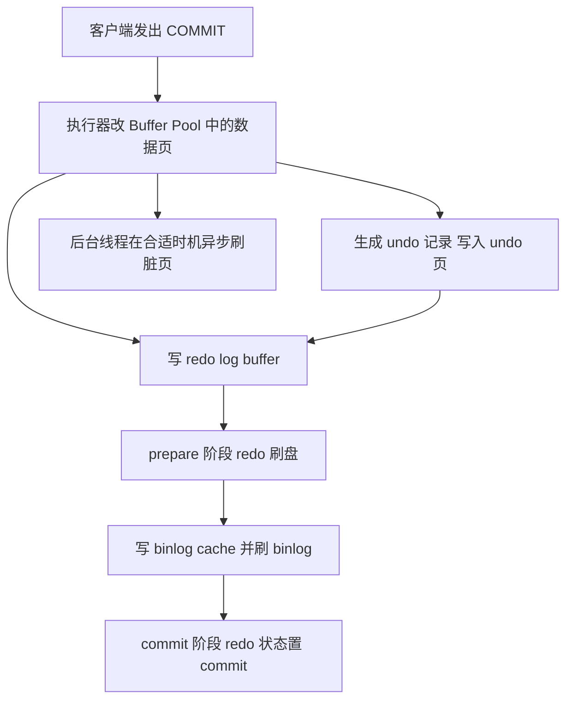
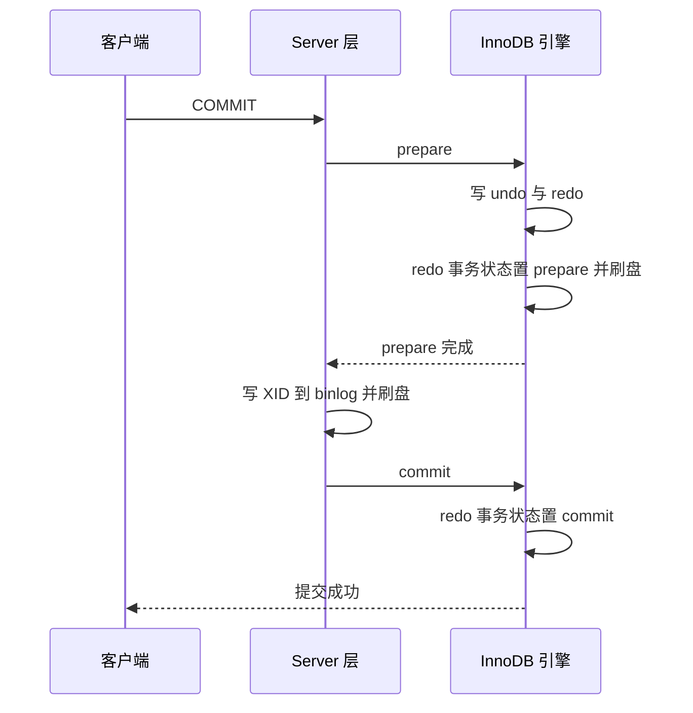

---
tags:
  - 中间件/MySQL
  - 中间件/InnoDB
---

# 日志、Buffer Pool 与崩溃恢复

前面几篇讲的是「读」的路径：一条 SQL 怎么被解析、索引怎么定位到页、事务之间怎么靠 MVCC 与锁互不干扰。这些机制最后都要落到同一个问题上——**数据怎么写到磁盘，以及写到一半断电之后，怎么保证磁盘上的状态是对的**。

写路径上有四样东西配合：内存里的 `Buffer Pool`（缓冲池）、`undo log`（回滚日志）、`redo log`（重做日志）、`binlog`（二进制日志）。本篇按「先改内存 → 写日志 → 落盘」这条链讲清它们各自解决什么问题、按什么顺序写、崩溃恢复时谁前滚谁回滚，以及每一步的默认参数与失败表现。

素材按 MySQL 5.7 叙述，本篇的默认值与行为以 MySQL 8.0 为准，5.7 与 8.0 的差异在 §12 集中列出，正文出现处也会点出。

## 1. 写入路径总览

写路径比读路径多出「保证持久性」这一层。读路径的目标是把数据取出来，写路径除了改数据，还要回答「万一改到一半断电，重启后数据算不算数」。为此 InnoDB 把「改数据」拆成「改内存页」和「写日志」两步：内存页是易失的，日志是先写并落盘的，日志成为唯一能确认「这次修改发生了」的凭据。本节先把整条链和四份状态的归属铺开，后面的章节再逐个下钻。

### 1.1 一条 UPDATE 的完整链路

以一条最简单的更新为例：

```sql
UPDATE t_user SET name = 'xiaolin' WHERE id = 1;
```

它先走一遍查询语句的流程——连接器建连、解析器做词法与语法分析、预处理判断表与字段存在、优化器选执行计划。`id` 是主键，优化器选主键索引。真正落在存储引擎上的步骤从执行器调用 InnoDB 接口开始（来源：MySQL 8.0 Reference Manual, 17.5.1）：

1. **读页进内存。** 执行器通过主键索引树找到 `id = 1` 这一行。若该行所在的数据页已在 `Buffer Pool` 中，直接返回；否则把整页从磁盘读入 `Buffer Pool` 再返回。InnoDB 与磁盘交互的最小单位是页，默认 16KB，一次读进一整页。
2. **比对新旧值。** 执行器拿到聚簇索引记录后，比较更新前后是否相同。相同则不进入后续写流程（省掉一次无谓的日志写入）；不同才把前后两版记录都交给 InnoDB 层。这一处「先比对再写」是一个容易被忽略的优化：更新成同样的值时，InnoDB 不会产生 undo、redo、binlog。
3. **写 undo log。** 开启事务后，InnoDB 在改记录前先生成 undo 记录。更新操作要把被更新列的**旧值**记下来。undo 记录写进 `Buffer Pool` 里的 undo 页，**对 undo 页的修改本身也要写 redo**（undo 页也要能被恢复）。
4. **改内存页 + 写 redo log buffer。** InnoDB 直接修改 `Buffer Pool` 中的数据页，把该页标记为**脏页**（dirty page，内存内容与磁盘已不一致），同时把这次修改以 redo 记录写进 `redo log buffer`。到这一步，事务在内存里的工作算完成，脏页暂不落盘。这就是 `WAL`（Write-Ahead Logging，预写日志）。
5. **提交时两阶段。** 事务提交时，redo 先写盘并置为 `prepare`，再写 binlog 并刷盘，最后把 redo 置为 `commit`。详见 §9。
6. **后台异步刷脏。** 脏页由后台线程在合适时机刷回磁盘。刷脏与事务提交解耦，是整套设计能同时兼顾性能与持久性的关键。

一条更新语句把内存、日志、磁盘三层串起来，链路是这样：



图里有两条并行的时间线：上半支是**同步**的提交路径，客户端要等它；下半支是**异步**的刷脏路径，客户端不等它。redo 之所以能顶替「提交时就把脏页写盘」，是因为它保证「只要 redo 落了盘，即使脏页没落盘，重启也能把这次修改重放出来」。

这也解释了一个后面会反复用到的结论：**事务提交的持久性由 redo 的刷盘决定，不由脏页的刷盘决定**。脏页晚一点写、写乱了顺序，都不影响提交语义。反过来，如果只改了内存页而 redo 没写，那份修改就完全不可恢复——这也正是崩溃恢复里「前滚在前、回滚在后」的原因（§10）。

把这条链和「读」的路径对照，能看出写路径多出的开销在哪：一次读通常只有「读页 + 返回」两步；一次写多出「生成 undo、（prepare 前）生成 redo、提交时两次 fsync、后台刷脏」这些环节。磁盘 I/O 的诊断因此总是从「哪一段在刷盘」入手（§14.1）。

上面六步里有两处工程上值得单独记住的细节。**第一处是「先比对再写」**：把值改成与原来相同时，InnoDB 直接返回，不产生 undo、redo、binlog——这既省日志又避免无意义的版本膨胀，但它也意味着「更新语句影响行数为 0」不一定表示没找到记录，可能是值本来就没变。**第二处是「一条语句可能碰多个页」**：更新一个二级索引列时，InnoDB 要同时改聚簇索引页和对应的二级索引页，还要产生 change buffer 或实际读入二级索引页；更新很多行时，一次事务会触碰大量页，redo 与 undo 的量随「涉及页数 × 行数」增长——这也是大事务会撑爆 redo log buffer、拉长回滚时间的原因。

### 1.2 三份日志的分工与层次

三份日志不是同一层的东西，先把这个层次关系固定下来（来源：MySQL 8.0 Reference Manual, 17.6.5、17.6.6、7.4.4）：

| 日志 | 属于哪一层 | 记什么 | 谁在用它 | 写入方式 |
| --- | --- | --- | --- | --- |
| `undo log` | InnoDB 存储引擎 | 修改**前**的旧值，记「怎么回滚」 | 事务回滚、MVCC 快照读 | 随机，按 undo 页写入 |
| `redo log` | InnoDB 存储引擎 | 对某个数据页做了什么**修改** | 崩溃恢复（前滚） | 环形顺序追加 |
| `binlog` | MySQL Server 层 | 所有改动数据/表结构的事件 | 主从复制、时间点恢复 | 追加，写满换新文件 |

两条最常被混淆的边界：

- **redo 与 binlog 的层次不同。** redo 由 InnoDB 生成，只有 InnoDB 用；binlog 由 Server 层生成，任何一批存储引擎都能写。这一点直接决定了两份日志必须靠两阶段提交对齐（§9）。
- **redo 与 undo 的方向相反。** redo 记「改成了什么」，用于崩溃后把已提交的修改**重放**；undo 记「改之前是什么」，用于把未提交的修改**撤销**。同一个事务，redo 支撑持久性（Durability），undo 支撑原子性（Atomicity）。

```text
   层次与顺序（一次提交）

   Server 层   ┌───────────────────────────────┐
               │  binlog（归档，用于复制与恢复）  │
               └───────────────┬───────────────┘
                               │ 两阶段提交对齐
   InnoDB 引擎 ┌───────────────▼───────────────┐
               │  redo log（前滚，保证持久性）    │
               │  undo log（回滚，保证原子性）    │
               └───────────────┬───────────────┘
                               │
               ┌───────────────▼───────────────┐
               │  Buffer Pool（16KB 页为单位）   │
               └───────────────┬───────────────┘
                               │ 异步刷脏
                               ▼
                          磁盘上的 .ibd 数据文件
```

写路径的读法是从下往上：改内存 → 写 redo/undo → 提交时对齐 binlog → 后台刷脏。诊断磁盘 I/O 时也照这条链拆（§14）。

## 2. Buffer Pool 为什么存在

InnoDB 是磁盘数据库，但几乎所有读写都先在内存里完成。`Buffer Pool` 承担的就是「让磁盘看起来快」这件事：它把最近用到的页留在内存里，把随机写攒成批量顺序写。理解它的三个点——为什么按页、内存怎么布局、池子怎么切分——是理解后面 LRU 与刷脏的前提。

### 2.1 内存与磁盘的速度差、页是最小交互单位

数据存在磁盘上，但每次读写都走磁盘，性能极差。内存与磁盘的访问延迟差好几个数量级，数据库的通用做法是在内存里开一块缓存，把最近用过的页留住。InnoDB 的这块缓存就是 `Buffer Pool`（来源：MySQL 8.0 Reference Manual, 17.5.1）。

它之所以**以页为单位**，是因为 InnoDB 在磁盘与内存之间搬运的最小单位就是页，默认 `innodb_page_size = 16384` 字节（16KB）（来源：MySQL 8.0 Reference Manual, 17.14）。索引只能定位到「数据在哪个页」，定位不到「页里的第几条记录」——页内部还要再走页目录才找到具体行。所以查询一条记录，读进来的是**整页**，不是一行。这个「页是原子搬运单位」的约定贯穿全篇：redo 按页记录、刷脏按页刷、LRU 按页淘汰、doublewrite 也按页保护。

```text
   Buffer Pool 的读写语义（innodb_page_size = 16KB）

   读：
     命中 → 直接返回页里的记录，不碰磁盘
     未命中 → 从磁盘读入整页（16KB），再在页内定位记录

   写：
     命中 → 直接改内存里的页，标记为脏页，暂不写盘
     未命中 → 先把页读进内存，再改

   └─ 一次很小逻辑读，物理上可能搬 16KB；这就是预读与命中率重要的原因
```

「页是原子单位」还带出一个直接的工程结论：**小记录点查的放大比很高**。一次按主键查一行，物理上可能搬 16KB；若缓存未命中，成本就是一次 16KB 的随机读，而不是「一行数据」的读。这解释了两件事：为什么命中率对点查性能如此关键，以及为什么顺序扫描在小表上可能比大量点查更快——扫描虽然读得多，但读的是连续的页，预读能发挥作用；点查读得少，但每一次都可能是一次随机读。

### 2.2 内存布局：控制块、缓存页与碎片

InnoDB 启动时向操作系统申请一片**连续**的虚拟内存，按 16KB 切成一个个缓存页。每个缓存页配一个**控制块**（control block），记录这个缓存页对应的表空间、页号、缓存页地址、以及它在各条链表里的节点信息。控制块集中放在 `Buffer Pool` 的最前面，后面才是缓存页本身（来源：MySQL 8.0 Reference Manual, 17.5.1）。

```text
   Buffer Pool 的内存布局（自前向后）

   ┌──────────────────────────────────────────────────────┐
   │  控制块 0 │ 控制块 1 │ … │ 控制块 N │  ← 每块 16KB 页的元数据 │
   ├──────────────────────────────────────────────────────┤
   │  缓存页 0 │ 缓存页 1 │ … │ 缓存页 N │  ← 每页 16KB 数据     │
   ├──────────────────────────────────────────────────────┤
   │  碎片空间（放不下「一对控制块 + 缓存页」的余量）          │
   └──────────────────────────────────────────────────────┘
```

控制块与缓存页一一对应，但两者分别排布，先排完全部控制块再排缓存页。若 `Buffer Pool` 的总大小不是「控制块 + 页」组合的整数倍，末尾会剩下一段放不下任何一对的空间，这段就是**碎片空间**；把 `innodb_buffer_pool_size` 调成刚好整除，碎片可以为零。

刚启动时，`Buffer Pool` 只是一段虚拟地址空间：页都还没有对应的物理内存。操作系统按需分配物理页——只有这些虚拟地址被访问，才触发缺页中断、申请物理内存、建立映射。这解释了一个常见现象：**MySQL 刚启动时，进程占用的虚拟内存很大，而实际物理内存（RSS）很小**。监控时要看 RSS，不要看虚拟内存（VSZ），否则会误判实例已经吃掉大量内存。

`Buffer Pool` 里缓存的并不只有「索引页」与「数据页」，还包括 undo 页、插入缓存（change buffer）、自适应哈希索引（adaptive hash index）、锁信息等（来源：MySQL 8.0 Reference Manual, 17.5.1）。它们各自有独立的页区，但共用同一片池子。这意味着「调大池子」并不等于「可缓存的数据页等量增加」——一部分容量被这些辅助结构分走。

控制块的设计还决定了监控口径。`Innodb_buffer_pool_pages_total` 统计的是可用的缓存页数，`Innodb_buffer_pool_pages_free` 是其中的空闲页；两者相减就是已加载的页，再按 `innodb_page_size` 换算成字节，才是 `Buffer Pool` 真正用到的数据内存。用「池子大小 ÷ 16KB」估算页数会偏大，因为控制块本身也占内存。粗略上，一个 16KB 页对应一个几十字节的控制块，控制块总开销是页数的线性函数；池子很大时这部分开销可忽略，但精确核算内存时不能只用「页数 × 16KB」。
另外，控制块与缓存页分开排布，使得「从页号找到控制块」需要一个额外的映射（页号到控制块的哈希表）。这个映射是 `Buffer Pool` 内部的重要结构，读一个页时先用它判断命中，命中就直接找到控制块。

### 2.3 组成与多实例：size / instances / chunk_size

`Buffer Pool` 的大小与切分由三个参数决定，三者的关系不直观（来源：MySQL 8.0 Reference Manual, 17.14）：

- `innodb_buffer_pool_size`：整个池子的字节数，默认 134217728（128MB），最小 5242880（5MB）。
- `innodb_buffer_pool_instances`：池子被切成几个独立实例，默认 8（当 `innodb_buffer_pool_size < 1GB` 时为 1），范围 1–64。
- `innodb_buffer_pool_chunk_size`：扩容时的最小粒度，默认 134217728（128MB），最小 1048576（1MB）。

三者的约束是：**实际大小必须是 `chunk_size × instances` 的整数倍**，且 `chunk_size` 不能超过 `buffer_pool_size / instances`。InnoDB 在启动时按这个公式把请求的大小向上取整到实例与 chunk 的边界。举例：

| 请求的 size | instances | chunk_size | 每实例大小 | 实际生效大小 |
| --- | --- | --- | --- | --- |
| 1GB | 8 | 128MB | 128MB | 1GB（8 × 128MB） |
| 1.5GB | 8 | 128MB | 256MB | 2GB（向上取整到 8 × 256MB） |
| 128MB（默认） | 1 | 128MB | 128MB | 128MB |

第二行是常被忽略的坑：设 1.5GB，实际占用 2GB——**设 `innodb_buffer_pool_size` 后实际占用的内存可能比设定值大**。要精确控制，应把目标值凑成 `instances × chunk_size` 的整数倍。

每个实例都是**完全独立**的一套结构：自己的 free 链表、flush 链表、LRU 链表，以及所有相关的数据结构。一个页被读入或换出时，用哈希函数随机分配到某个实例（来源：MySQL 8.0 Reference Manual, 17.14）。

多实例要解决的问题是**链表的锁争用**。虽然 8.0 的 LRU 链表已有细粒度保护，但大批线程同时修改 same 链表仍会互相等待。切成 N 个实例后，理论上并发度提升到接近 N 倍，代价是：每个实例的链表更短，页分配是哈希随机的，可能出现「实例 A 的 young 区里有冷页、实例 B 的 young 区不够放热点」这种不均衡。因此实例数并非越大越好，手册的建议是在池子达到数 GB 量级、且并发读写确实出现争用时才提高实例数（来源：MySQL 8.0 Reference Manual, 17.14）。默认值 8 在 `size < 1GB` 时降为 1，正是「池子小时没必要切」的判断。

## 3. 页的三种状态与三条链表

`Buffer Pool` 里的页不是静态的：它们会从空闲变成在用，会在读与写之间切换状态，会在池子满时被淘汰。InnoDB 用「状态 + 链表」把这件事组织起来。三类状态决定「这个页能做什么」，三条链表决定「怎么快速找到该做的页」。

### 3.1 free / clean / dirty

`Buffer Pool` 里的缓存页有三种状态，对应三种管理方式（来源：MySQL 8.0 Reference Manual, 17.5.1）：

| 状态 | 含义 | 是否在磁盘上有一致副本 | 隶属链表 |
| --- | --- | --- | --- |
| `free page`（空闲页） | 还没被使用 | — | Free 链表 |
| `clean page`（干净页） | 已加载，未修改 | 是 | LRU 链表 |
| `dirty page`（脏页） | 已加载且被修改 | 否，内存新于磁盘 | LRU 链表 **和** Flush 链表 |

关键的一处细节：**脏页同时挂在 LRU 链表和 Flush 链表上**。LRU 链表关心「它最近被访问过、是否该被淘汰」，Flush 链表关心「它是脏的、需要被刷到磁盘」。两个链表各管一件事，一个页可以同时是两边的成员。理解这一点，才能理解为什么「淘汰一个脏页」比「淘汰一个干净页」贵：淘汰干净页只需摘链，淘汰脏页要先把它刷到磁盘。

### 3.2 Free / Flush / LRU 三条链表

三条链表都用「控制块」作为节点组织（来源：MySQL 8.0 Reference Manual, 17.5.1）：

- **Free 链表**：所有空闲缓存页。从磁盘加载新页时，从 Free 链表取一个节点，填上表空间与页号，然后把它从 Free 链表摘掉。链表有头节点，记录头尾地址与节点数，取用是 O(1)，不必遍历整片内存。
- **Flush 链表**：所有脏页。后台线程遍历它，把脏页刷回磁盘；刷干净后该页从 Flush 链表移除（同时变成干净页，仍留在 LRU 链表里）。
- **LRU 链表**：所有已加载的页（干净的 + 脏的）。它决定池子满了时淘汰谁。

```text
   三条链表与页状态的流转

   ┌─ Free 链表 ─┐   取一个空闲页加载
   │  free page  │ ────────────────┐
   └─────────────┘                  ▼
                          ┌─ LRU 链表 ──────────────────┐
                          │  clean page  ── 被修改 ──▶  dirt│
                          │     ▲                        │
                          └─────┼────────────────────────┘
                   刷干净（从 Flush 移除）│  加入
                                        │
                          ┌─ Flush 链表 ─┘
                          │  dirty page ── 刷盘 ──▶ clean page │
                          └────────────────────────────────────┘

   淘汰顺序：LRU 链表尾部先淘汰
     └─ 若淘汰的是脏页，必须先把该页刷盘，才能复用该缓存页
```

淘汰时遇到脏页会触发一次**同步刷盘**（把该页刷到磁盘后才能把它改作他用）。所以「全表扫描把 LRU 撑满」既会丢掉热点，还可能连带触发大量刷盘，交给 §4 与 §11 展开。若 Free 链表已空、刷脏又跟不上，前台线程会等待可用的空闲页，`Innodb_buffer_pool_wait_free` 开始增长——这是「池子太小 / 刷脏太慢」最直接的观测信号之一。

三条链表的节点都是控制块，但同一个控制块可以同时挂在多条链表上：一个脏页的控制块既在 LRU 链表里（作为被缓存页），又在 Flush 链表里（作为待刷页）。从 Free 链表取页、从 LRU 尾部淘汰页、从 Flush 链表刷页，这三个操作各自独立，靠控制块里的指针协调。理解这三条链表的分工，就能理解下面几个现象：`Innodb_buffer_pool_pages_free` 接近 0 说明 Free 链表几乎耗尽，新页加载要先淘汰，容易触发刷脏等待；`Innodb_buffer_pool_pages_dirty` 高说明 Flush 链表长、刷脏压力大；淘汰时若尾部是脏页，必须先同步刷它——这就是为什么全表扫描除了污染缓存，还会带来刷盘抖动。

## 4. 改进型 LRU

`Buffer Pool` 的大小有限，必须决定淘汰谁。教科书式的 LRU 只看「最近是否被访问」，在数据库负载下会被两类场景击穿。InnoDB 的改法是在朴素 LRU 上叠两层：分区（新页先待在冷区）与时间门槛（快速扫过的页不升级）。

### 4.1 朴素 LRU 为什么会被一次全表扫描冲垮

朴素 LRU 的规则很直白：命中就把页移到链表头，未命中就把新页放链表头并淘汰链表尾。它假设「最近访问的将来还会访问」，这个假设在两类场景下会失效（来源：MySQL 8.0 Reference Manual, 17.5.1、17.8.3.3）：

- **预读失效。** InnoDB 有预读机制——加载一个页时顺手把它相邻的页也读进来（局部性原理：靠近当前访问位置的数据将来大概率被访问）。预读进来的页如果一直没被访问，按朴素 LRU 会被放在链表头部，反而把真正的热数据往尾部挤。
- **`Buffer Pool` 污染。** 一次全表扫描或一个走全表的大查询，会顺序读到大量页，每个页都被访问一次、都插到链表头，把原有热点全部挤到尾部淘汰。结果热数据被换出，之后再访问它们又要从磁盘读，性能骤降。

用朴素 LRU 时，「只被访问一次的批处理数据」和「被频繁访问的热数据」享受同样的待遇，这是问题的根。举一个量化的例子：池子能装 10,000 页，其中 9,000 页是热数据；一次全表扫描顺序读 20,000 页。朴素 LRU 下，扫描的前 10,000 页就把整个链表替换了一遍，9,000 页热点全部被挤出；扫描结束再访问热点，全部未命中，相当于缓存被清空一次。**一次扫描真正的代价在于「扫完之后热点全部重建」**，扫过 20,000 页只是表象，重建过程又是一轮随机读。

InnoDB 的改法是两件事：**分区**（让新页先待在冷区）与**时间门槛**（让只被快速访问一次的页不升级）。

### 4.2 young / old 分区与 midpoint insertion

InnoDB 把 LRU 链表切成两段（来源：MySQL 8.0 Reference Manual, 17.5.1）：

- 头部是 `young`（也叫 new）子链表，放最近被访问的页；
- 尾部是 `old`（也叫 old）子链表，放较少被访问的页，是淘汰的候选。

页新读入时不放到链表头，而是放到 **young 与 old 的交界处（midpoint，中点插入）**，也就是 old 子链表的头部。默认 `old` 占整个链表的 **3/8**，由 `innodb_old_blocks_pct` 控制，默认 37（来源：MySQL 8.0 Reference Manual, 17.14）。访问 old 区里的页，才会把它升级（make young）到 young 区头部。

```text
   改进型 LRU：young / old 分区与页的移动（old 占 3/8）

   链表头                                              链表尾
   ┌────────────────────────────┬─────────────────────────┐
   │        young 区             │        old 区            │
   │  （热点，最近访问）           │ （冷页，淘汰候选）         │
   └──────────────▲─────────────┴───────────▲─────────────┘
                  │                          │
       升级（make young）│          新页读入先插这里（midpoint）
                  │                          │
       ① 命中 old 区的页 ────────────────────┘
                  │
                  ▼
       ② 淘汰永远发生在链表尾：先淘汰 old 区尾部的页
          └─ 未被再次访问的预读页/扫描页，从 old 区尾部被换出，
             不占用 young 区位置

   对照朴素 LRU：新页直接进链表头 ⟹ 一次扫描就把 young 区冲垮
```

举一个具体例子说明为什么有效。假设链表长 10，young 占 7、old 占 3。一个编号 20 的页被预读进来：按中点插入，它进 old 区头部，同时 old 区尾部（假设是 10 号页）被淘汰。如果 20 号页此后一直没被访问，它既没占用 young 区位置，还会比 young 区数据更早被换出。反过来，如果 20 号页预读后马上被访问，它会升到 young 区头部，young 区尾部（7 号）被挤到 old 区头部——**这一步只发生位置移动，不淘汰任何页**。这正是「让真正被访问的页才享受热区待遇」的设计意图。

回到 §4.1 那个量化的例子：改进型 LRU 下，扫描读进来的 20,000 页全部落在 old 区，old 区只有 3/8 × 10,000 ≈ 3,750 页的容量，扫描页在 old 区里彼此淘汰，**9,000 页 young 区热点完全不受影响**。扫描结束再访问热点，仍然全部命中。这就是分区带来的差别：扫描的代价被限制在 old 区，不再波及整个缓存。

`innodb_old_blocks_pct` 的取值方向要分清：数值是 **old 区占比**，调大它意味着 old 区更大、young 区更小。扫描型负载多时，调大 old 区能进一步隔离扫描数据，代价是 young 区容量下降、热点命中率降低；反之调小它会让 young 区变大、更适合纯热点负载，但抗扫描能力减弱。默认 37（3/8）是两者之间的折中（来源：MySQL 8.0 Reference Manual, 17.14）。

多实例之后，每个实例各自维护一份 young/old，分区是每个实例内部独立做的，`innodb_old_blocks_pct` 这个比例则全实例统一。因此监控 young/old 时要在**所有实例上汇总**，不能只看一个实例。`SHOW ENGINE INNODB STATUS` 里 `Pages made young` 与 `not young` 的比值可以粗略反映升级是否频繁：`not young` 明显偏大，说明大量命中因为没满足 `innodb_old_blocks_time` 而没能升级，通常出现在扫描型或短时批处理负载下。
另外，`old` 区本身也会满：新页插入 midpoint 时若 old 区已无空间，会从 old 区尾部直接淘汰。这意味着 old 区是一个「先进先出 + 时间门槛」的缓冲，扫描页彼此替换的速度由 old 区容量决定——容量越大，扫描页能停留越久、抗污染越强，但容纳真实热点的 young 区就越小。

### 4.3 innodb_old_blocks_time 的门槛与 young 区内部的 1/4

分区解决了预读失效，但**污染**还没解决。全表扫描时，每个被读到的页在很短的时间内都会被「访问」一次（读取页里的记录），于是每个页都满足「被访问」这一条，照样能升进 young 区头部，照样把热数据挤出。问题的根在于：**「被访问一次」不足以证明它是热数据**。

InnoDB 的补法是给升级加一个时间门槛（来源：MySQL 8.0 Reference Manual, 17.8.3.3）：一个页第一次在 old 区被访问时，记录下这次访问时间；只有**后续访问时间与第一次访问时间之差超过 `innodb_old_blocks_time`**（默认 1000 毫秒）（来源：MySQL 8.0 Reference Manual, 17.14），这个页才被移到 young 区头部。停留时间不够的页，即使被反复访问，也留在 old 区。

一次全表扫描的页，通常在毫秒级内就被扫过、之后再不被访问，因此全部卡在门槛外，留在 old 区里顺序淘汰，碰不到 young 区。**这就是「为什么朴素 LRU 扛不住一次全表扫描，而改进型 LRU 扛得住」的完整机制**：扫描页连 young 区的门都进不去。

两个参数的配合可以这样理解：`innodb_old_blocks_pct` 决定「扫描页只能待在多大的冷区里」，`innodb_old_blocks_time` 决定「扫描页要等多久才有资格进热区」。前者是空间隔离，后者是时间隔离，缺一不可——只分区不设时间门槛，扫描页照样会被「访问一次」推进 young 区。

young 区内部还有一层优化：young 区靠前的 1/4 被访问时**不移动**到链表头，只有后 3/4 被访问才移动（来源：MySQL 8.0 Reference Manual, 17.5.1）。目的是减少链表节点的频繁搬动——热区里的页本来就常驻，不必每次都把它提到头部，省下更新链表的开销。这个优化容易被忽略，但它解释了为什么在监控里看到的 `young-making rate` 往往小于实际的命中率。

这两个优化指向同一个目标：**让「热」这个判断更贵、更难满足**。朴素 LRU 把「最近一次访问」直接当热度，所以被扫描页轻易骗过；改进型 LRU 要求「在冷区待够时间 + 再次访问」两个条件，扫描页两者都不满足。young 区内部 1/4 不移动的优化则是相反方向——对已经确认的热页减少搬动，避免热区自己产生额外的链表修改开销。一侧在收紧入口、一侧在稳定内部，两者共同让 LRU 在高并发与扫描负载下都能维持较高的有效命中率。

### 4.4 预读：线性与随机

预读（read-ahead）是 InnoDB 在页被实际请求前，把相邻页提前读入 `Buffer Pool` 的机制，用来把随机的单页读合并成顺序的批量读。InnoDB 有两种（来源：MySQL 8.0 Reference Manual, 17.8.3.4）：

- **线性预读（linear read-ahead）**：当一个区（extent，默认 64 页）内被顺序访问的页数达到阈值，就把**下一个区**整体预读进来。阈值由 `innodb_read_ahead_threshold` 控制，默认 56，范围 0–64；设为 0 关闭预读；设为 64 表示必须把整个区顺序读完才预读下一个区（来源：MySQL 8.0 Reference Manual, 17.14）。
- **随机预读（random read-ahead）**：当同一个区里已经有 13 个页被读进 `Buffer Pool`（无论顺序与否），就把该区剩下的页全部读入。它由 `innodb_random_read_ahead` 控制，默认关闭。

两者的默认值取向能说明 InnoDB 的判断：线性预读默认开、阈值 56，说明 InnoDB 认为「几乎整区顺序访问」才值得预读下一区，避免被零星访问误触发；随机预读默认关，因为它在某些负载下收益不稳定。

预读与 §4.2 的 old 区配合：预读进来的页先落 old 区，若真被访问且满足时间门槛才升级；一直没被访问就从 old 区尾部淘汰。**预读带来的风险是「白读」占 I/O，改进型 LRU 把这个风险限制在 old 区**，不影响 young 区的热点。反过来，若把 `innodb_random_read_ahead` 打开而负载是点查，预读会读进大量用不到的页，既浪费 I/O 又占用 old 区，值得谨慎。

预读与 LRU 的配合还解释了一个调优经验：**点查为主的负载不必开启随机预读，顺序扫描为主的负载才值得调低线性预读阈值**。线性预读阈值设得低（比如 32），意味着更早触发下一区预读，顺序扫描更快，但点查场景下可能误判；设得高（接近 64）更保守，避免误预读。默认 56 是一个「只有在几乎整区顺序访问时才预读」的保守值。开启随机预读则要谨慎，它按「同一区已有 13 页」触发，容易被非顺序但集中的访问误触发。

## 5. 缓存命中率与它的陷阱

`Buffer Pool` 调得好不好，最终要看命中率。但命中率是一个很容易被误读的指标，它的分子分母都有陷阱。本节先把算法写清楚，再说两个不能只看它的理由。

### 5.1 怎么算

`Buffer Pool` 命中率用两个全局状态变量算（来源：MySQL 8.0 Reference Manual, 7.1.10）：

- `Innodb_buffer_pool_read_requests`：逻辑读请求次数（需要读页的总次数）。
- `Innodb_buffer_pool_reads`：无法从 `Buffer Pool` 满足、必须直接读磁盘的次数（物理读）。

命中率有两种常见写法，注意分母不同：

```text
   命中率 = 1 − Innodb_buffer_pool_reads / Innodb_buffer_pool_read_requests
         = (read_requests − reads) / read_requests

   read_requests 是逻辑读，reads 是其中未命中的那部分
     └─ 两者都是「自启动以来的累计值」，要用差值算区间命中率
```

两个变量的关系可以这样记：`read_requests` 是「总共要看多少次页」，`reads` 是「其中有多少次真的走了磁盘」。命中率就是 1 减去后者占前者的比例。它们在 `SHOW GLOBAL STATUS` 里都能查到，也是很多监控面板的默认数据源。

实际监控中，命中率的绝对值会因负载差异很大——纯内存点查的实例可以长期 99.99%，而带大量分析的实例可能只有 95%。因此更有意义的是「同一实例、同一负载下的趋势」，以及「物理读的绝对量」。把 `Innodb_buffer_pool_read_requests` 与 `Innodb_buffer_pool_reads` 同时采集，用间隔差值算区间命中率，是监控面板里应固化的口径。

### 5.2 两个陷阱

命中率作为指标有两个容易踩的坑：

- **拿累计值直接算，掩盖近期变化。** 两个变量都是自实例启动以来的累计值。一个跑了半年的实例，即使最近命中率暴跌，累计命中率仍可能长期停在 99.99%。正确做法是间隔一段时间各取一次，用两次的**差值**算区间命中率，并观察 `Innodb_buffer_pool_reads` 的**增速**。监控系统里如果只画 `Innodb_buffer_pool_reads` 的曲线而不画它的斜率，等于没监控。
- **命中率高不等于性能好。** 命中率的分母是逻辑读，它会被「同一页被反复逻辑读」放大。如果热点数据很小、命中率 100%，但每个查询都要扫大量索引页，逻辑读量本身很大，命中率高也救不了。反过来，一次全表扫描会让命中率看起来下降，但那本来就是冷数据，未必是故障。判断要结合 `Innodb_buffer_pool_pages_dirty`、`Innodb_buffer_pool_wait_free`（等待空闲页的次数，大于 0 说明淘汰时被迫刷脏、出现等待）一起看。

`SHOW ENGINE INNODB STATUS` 的 `BUFFER POOL AND MEMORY` 段里也直接给了 `Buffer pool hit rate`（如 `1000 / 1000`），它是区间值，比累计命中率更适合看当前状态（来源：MySQL 8.0 Reference Manual, 17.17.3）。同一段里的 `Pages made young`、`not young`、`Modified db pages`、`Pending writes` 则进一步告诉你「升级/淘汰/脏页」三件事各自的活跃度。

除了这两个陷阱，命中率还有一个结构性局限：它无法区分「命中但仍需回表」与「命中即返回」。一个二级索引查询命中索引页后还要回表读聚簇索引页，两次逻辑读都算命中，命中率很好看，但实际 I/O 与 CPU 开销并不低。因此命中率适合看趋势与突变，不适合单独作为「缓存是否足够」的判据；判断容量是否足够，更直接的是看 `Innodb_buffer_pool_reads`（真实物理读）的绝对量与增速。

## 6. undo log

事务的原子性靠 `undo log` 实现，快照读的可见性也靠它。它记的是数据被改之前的样子，因此既能用于回滚，也能用于让别的事务看见历史版本。理解 undo 的关键在于：它记的是「逻辑上的怎么撤销」，因此它能和版本链共用，也正因它能和版本链共用，长事务会把它拖住。

### 6.1 逻辑日志：记「怎么回滚」

`undo log`（回滚日志）是 InnoDB 存储引擎层的日志，一个事务的 undo 记录集合与该事务关联（来源：MySQL 8.0 Reference Manual, 17.6.6）。它记录的是**如何撤销这个事务对某条聚簇索引记录的最新修改**，也就是「怎么回滚」，而非「页的物理前像」，所以它是**逻辑日志**。

不同类型的操作，undo 记录的内容不同：

| 操作 | undo 里记什么 | 回滚时怎么做 |
| --- | --- | --- |
| `INSERT` | 这条记录的主键值 | 按主键把记录删掉 |
| `DELETE` | 被删记录的完整内容 | 把记录重新插回 |
| `UPDATE` | 被更新列的旧值 | 把列改回旧值 |

`DELETE` 与 `UPDATE` 有两点特殊处理：`DELETE` 不立即物理删除，只给记录打上删除标记（delete flag），真正删除由 purge 线程完成；`UPDATE` 若改的是主键列，InnoDB 拆成「先删旧行、再插新行」两步，undo 记录也按这个来记。这些差异是后面「长事务拖住 purge」的伏笔。

`undo log` 承担两大作用：实现事务回滚（保证原子性），以及与 `Read View` 配合实现 `MVCC`（多版本并发控制）。“逻辑日志”这个定性还有一个含义：undo 记录只说明「在某个位置改回某个值」，不要求页是完整的物理副本，因此它可以分散在 undo 页里、按事务单独组织。

undo 的「逻辑」定性还带来一个实现上的要求：既然它记录「怎么撤销」，撤销时必须能重新定位到那条记录。`INSERT` 的 undo 只需主键就能定位要删的行；`UPDATE` 的 undo 要能重新找到被改的记录并把列改回旧值。这依赖聚簇索引的主键——这也是为什么 InnoDB 表必须有主键（没有显式主键时会生成一个隐藏的 6 字节行 id 当主键），因为 undo 与 MVCC 都要靠它定位记录。

### 6.2 版本链与 MVCC 的共用

每条记录被更新时，产生的 undo 记录里都有一个 `trx_id`（改这条记录的事务 id）和一个 `roll_pointer`（指向更早一条 undo 记录的指针）。`roll_pointer` 把同一行记录的所有历史版本串成一条**版本链**（来源：MySQL 8.0 Reference Manual, 17.6.6）。

快照读（普通的 `SELECT`）执行时，InnoDB 拿记录上的隐藏列 `trx_id`、`roll_pointer` 与 `Read View` 里的字段比对：若当前版本对事务不可见，就顺着 `roll_pointer` 往版本链上找更早的版本，直到找到可见的那一个。`READ COMMITTED` 与 `REPEATABLE READ` 的差别只在 `Read View` 的生成时机——前者每条 `SELECT` 生成一次，后者在事务内复用同一个（详细判定见 [[05-事务隔离与 MVCC]]）。

同一份 undo 记录被两个机制共用：回滚时按它撤销，快照读时按它找历史版本。**这也是为什么 undo 不能立刻删**——只要还有事务可能用到某个旧版本，对应的 undo 记录就必须留着。版本链的长度直接决定快照读要回溯多少步；一个更新频繁的热行，历史版本可能很长，这也是「热行更新会拖慢快照读」的一个原因。

版本链与 `roll_pointer` 的存在，让「读」这件事在 InnoDB 里变得依赖写入历史。一条记录若被频繁更新，版本链会很长，快照读要顺着链回溯更多步才能找到可见版本；这也是为什么热行在长事务并发下读性能会下降。反过来说，purge 把不再需要的旧版本清掉后，版本链变短，快照读也变快——这两件事由同一个 purge 进度决定，所以 `History list length` 既能反映 undo 积压，也能间接反映快照读的负担。

### 6.3 undo 表空间、回滚段与 purge

undo 记录在磁盘上有自己的组织（来源：MySQL 8.0 Reference Manual, 17.6.6）：

```text
   undo 的存储层次

   undo 页（随时可被 Buffer Pool 缓存，其修改也写 redo）
     └─ undo log record（一条 undo 记录）
          └─ undo log segment（undo 日志段）
               └─ rollback segment（回滚段）
                    └─ undo tablespace（undo 表空间，独立的 .ibu 文件）
```

一个 undo 表空间最多支持 128 个回滚段；`innodb_rollback_segments` 定义每个 undo 表空间分配多少回滚段，默认 128（来源：MySQL 8.0 Reference Manual, 17.14）。一个回滚段能容纳的事务数取决于「回滚段里的 undo 槽位数 ÷ 每事务所需 undo log 数」，而槽位数 = `innodb_page_size / 16`：16KB 页对应 1024 个槽位，4KB 页对应 256 个（来源：MySQL 8.0 Reference Manual, 17.6.6）。一个事务最多被分配 4 个 undo log，分别对应「用户表 INSERT」「用户表 UPDATE/DELETE」「临时表 INSERT」「临时表 UPDATE/DELETE」四类操作。

`innodb_undo_tablespaces` 定义 undo 表空间数量，默认 2，但**自 MySQL 8.0.14 起已不可配置**（被弃用）（来源：MySQL 8.0 Reference Manual, 17.14）。8.0 里 undo 表空间是独立文件，由系统自动管理数量。临时表的 undo 不进 redo，因为它不参与崩溃恢复，只在运行期用于回滚——这与「undo 页的修改也要写 redo」形成一处对照：用户表的 undo 需要 redo 保护，临时表的 undo 不需要。

**purge 线程**负责回收不再被任何事务需要的 undo。它判断的依据是：某个版本已经不被任何活跃 `Read View` 需要（即没有更早开始的事务还在读），对应的 undo 记录就可以清理，连同 `DELETE` 遗留的、已无版本引用的记录一起物理删除。purge 还负责 undo 表空间的截断：当 undo 表空间超过 `innodb_max_undo_log_size`（默认 1073741824，即 1GB）时，若 `innodb_undo_log_truncate`（默认 ON）开启且有至少两个 undo 表空间，该表空间会被标记并收缩（来源：MySQL 8.0 Reference Manual, 17.14）。截断要求「至少两个表空间」的原因是截断期间需要另一个表空间顶着承接新事务。

**把 purge 的执行链条补全**（来源：MySQL 8.0 Reference Manual, 17.8.9）。事务提交之后，undo 页**不会立刻被删** —— 它先进入一个中间结构：

```text
   事务提交之后，undo 页进 history list，等 purge 来收

   事务提交
     │
     ▼
   undo 页 ──▶ 挂进 history list（已提交事务的 undo 页链表）
     │
     ▼
   purge 周期性扫描（默认 4 个 purge 线程，每批 300 个 undo 页）
     │
     ▼
   逐个判断：这个版本还被某个活跃 Read View 需要吗？
     ├─ 需要 ───▶ 保留，history list 继续压着
     └─ 不需要 ─▶ 释放 undo 页；
                  DELETE / UPDATE 标记过的记录与索引项
                  在这一刻才真正从物理上删除
```

判断「还不还」的基准是**最老的活跃事务**。手册的表述是：InnoDB 的 MVCC 必须把数据副本保留在 undo log 里，直到**所有依赖它的事务都结束**。所以在 `REPEATABLE READ` 下一个长期不提交的事务会一直咬住它创建 Read View 的那一刻，之后产生的所有旧版本都清不掉。

**`history list` 的长度就是 purge lag**，也是这里唯一该盯的指标 —— `SHOW ENGINE INNODB STATUS` 的 `TRANSACTIONS` 段里那行 `History list length`。手册说它「通常是个很小的值，一般在几千以下」，但写密集负载或长事务会把它推上去，而且**只读事务同样会让它涨**（两个典型例子：`mysqldump --single-transaction` 期间并发 DML 很多；或者关掉 `autocommit` 后又忘了 `COMMIT`）。

**一个容易看错的事实**：`DELETE` 删掉的行不会立刻消失，它只是被标记。**真正的物理删除发生在 purge 丢弃对应 undo 记录的那一刻**。所以「删了数据但表文件没变小」是正常现象，空间要等 purge 追上，或者靠重建表回收。

purge 相关的参数（来源：MySQL 8.0 Reference Manual, 17.8.9 与 17.14）：

| 参数 | 默认值 | 语义与取舍 |
| --- | --- | --- |
| `innodb_purge_threads` | `4` | purge 线程数上限（最大 32），实际使用数由系统自动调整。DML 集中在少数表时调低（避免线程互相争用同一张表），分散在多表时可调高 |
| `innodb_purge_batch_size` | `300` | 每批解析处理的 undo 页数，多线程时按线程数均分；**每 128 轮才释放一次 undo 页** |
| `innodb_max_purge_lag` | `0` | `0` 表示不限。设成非零后，一旦 purge lag 超过阈值，就**给 `INSERT` / `UPDATE` / `DELETE` 主动加延迟**，腾出时间让 purge 追上 |
| `innodb_max_purge_lag_delay` | `0` | 上一条算出的延迟的上限（微秒），防止极端 lag 下延迟失控 |

延迟公式在 8.0.14 改过一次：`(purge lag / innodb_max_purge_lag − 0.5) × 10000` 改成 `(purge_lag / innodb_max_purge_lag − 0.9995) × 10000`，最小延迟从 5000 微秒降到 5 微秒。同一个参数在 8.0.14 前后手感完全不同 —— 之前一越过阈值就至少罚 5 毫秒，之后只罚 5 微秒。

**对照 redo：它不删记录，只覆盖。** redo 文件的容量固定（`innodb_redo_log_capacity`），写到末尾就回到开头覆盖最旧的（§7.4），所以 redo 不会因写入量大而膨胀，它只会因为 **checkpoint 推不动**而写满。两者形态正好相反 —— **undo 是「按需增长 + 靠 purge 回收」，redo 是「容量固定 + 环形复用」。**

### 6.4 长事务为什么让 undo 膨胀

把 §6.2 与 §6.3 连起来看，长事务对 undo 的影响可以推导出来：

- purge 能不能清理某个 undo 版本，取决于**是否还有更早的活跃 `Read View` 需要它**。
- 一个长事务（尤其 `REPEATABLE READ` 下不提交的事务）长期持有它的 `Read View`，意味着**这个 `Read View` 开始之后产生的所有旧版本都不能被 purge**。
- 于是 undo 表空间只增不减，磁盘被 undo 撑大，同时还拖慢所有需要沿版本链回溯的快照读。

另一个常被忽略的连带效应是：undo 空间不足会反过来限制写入。当回滚段里的 undo 槽位被耗尽，新事务拿不到 undo slot，InnoDB 只能等待 purge 释放，表现为写请求堆积。手册还指出，回滚一个长事务的耗时可能是它执行时间的 3–4 倍，而且回滚过程不可取消（来源：MySQL 8.0 Reference Manual, 17.18.2）——这意味着一个跑了两小时的长事务，回滚可能要六到八小时，期间 undo 与 I/O 压力持续。

这是一条「一个不提交的事务拖垮整个实例」的具体路径。工程上的对策是监控 `information_schema.innodb_trx` 里的长事务、给事务设超时、把大批量操作拆小。观测上还要加上 §6.3 那个读数：**`History list length` 持续增长**才是「purge 被卡住」的直接证据 —— 长事务对 undo 的压力，最终都会体现成这个数字的单调增长，而不是某个瞬时的高值。§14.3 会把这条链和磁盘满、swap 串在一起讲。

## 7. redo log

`redo log` 解决的是 `Buffer Pool` 的易失性：内存里的脏页断电就丢，redo 把「这次修改发生过」这件事先在磁盘上留痕。它支撑起整个 MySQL 的持久性，也因此它的容量、刷盘策略和环结构直接决定了写入性能。本节从 WAL 的原理讲到环的容量与三档刷盘策略。

### 7.1 WAL 的本质与写入顺序

`Buffer Pool` 在内存里，断电就丢。保证已提交数据不丢的办法是 `WAL`（Write-Ahead Logging，预写日志）：**先写日志，再写数据页**（来源：MySQL 8.0 Reference Manual, 17.6.5）。

「先写日志」是这里的关键。InnoDB 改完内存页后，先把这次修改写成 redo 记录、并保证 redo 在事务提交前落盘；数据页本身可以晚一点再写。这样即使数据页还没落盘就断电，重启时也能用 redo 把这次修改重放出来。只要 redo 落了盘，这次提交就算持久化了。

用 WAL 还有一个性能理由：**redo 是顺序追加写，数据页刷盘是随机写**。顺序写与随机写在机械盘上差一个量级，在 SSD 上差距缩小但随机写仍有额外开销。把「提交时随机写数据页」换成「提交时顺序写日志」，写入开销显著下降。数据页的随机写被挪到后台、可以批量合并，进一步摊薄成本。手册把这一层收益和「崩溃安全」并列，作为 redo 存在的两个理由（来源：MySQL 8.0 Reference Manual, 17.6.5）。

WAL 的另一面是它带来了恢复的复杂度：数据页落后于 redo，是**正常状态**；恢复时必须先重放 redo 补齐。这条链在 §10 展开。也正因为「正常状态就是数据页落后」，监控里看到 `Log sequence number` 明显大于 `Pages flushed up to` 并不一定是故障，只有它会持续逼近环容量时才告警（§7.5）。

WAL 的顺序还决定了恢复的边界。因为「数据页可以落后于 redo」，恢复时只需从最后一个 checkpoint 开始重放 redo，就能把数据文件补齐到持久点——checkpoint 之前的修改保证已刷盘，不必重放。这也是 checkpoint 存在的意义：它把「从哪里开始重放」变成一个可推进的边界，否则每次恢复都要从 redo 的最开始重放，代价不可接受。§7.5 会把 LSN 与 checkpoint 的关系写得更细。

### 7.2 redo 记录的结构与「物理逻辑」定性

redo 记录描述的是**对某个数据页做了什么修改**。它的逻辑单位是「页」，物理单位是「页内偏移 + 长度 + 内容」。常见文献把这种「定位到页是物理的、页内操作是逻辑的」性质称为「物理逻辑日志」（physiological log）。这个术语来自对 InnoDB 实现的归纳，MySQL 8.0 手册没有使用该词，手册的表述是：redo 数据「以记录受影响的修改的方式编码」（`encoded in terms of records affected`），且 redo 在磁盘上「物理地由 redo 日志文件表示」（来源：MySQL 8.0 Reference Manual, 17.6.5）。

一条 redo 记录的字段布局常被描述为 `space id + page no + offset + 长度 + 内容`。这一具体布局属于 InnoDB 内部实现，**不在 MySQL 手册中**，本篇按该描述给出但标为待核（待验证）；能核实的定性是：它记录到页与页内位置，因此可以精确重放，而不像逻辑日志那样需要重新执行 SQL。

这个定性有两个直接推论：

- **redo 的记录量比 binlog 小。** 一行 `UPDATE` 影响 3 个页，redo 只记这 3 个页的字节改动；binlog 记的是逻辑事件（`ROW` 格式记整行前后像，`STATEMENT` 记 SQL 文本）。
- **redo 无法反推历史。** 它只描述「从某状态改到某状态」的增量，且旧记录会被循环覆盖，因此**不能拿 redo 做「误删库」的恢复**——那要靠全量保存的 binlog（§8.4）。

「物理逻辑」这个定性还有一个实践含义：既然一条记录必须能定位到确切页与偏移，那么页的物理位置一旦变化（比如表空间被 truncate、页被重组），对应的 redo 就不能再直接应用。InnoDB 因此有一些专门处理（如表空间截断的检查点），这属于实现细节，超出本篇范围。

用「物理逻辑」这个词时要注意它描述的是记录粒度，不是恢复方式。恢复时 InnoDB 逐条重放 redo 记录，把「页内偏移处写入指定内容」的动作重做一遍；重放是幂等的——同一条记录重放多次结果一致，这是崩溃恢复可以「从任意检查点重放」的前提。若记录的是「执行某条 SQL」这种逻辑日志，重放就不一定幂等（比如 `UPDATE ... SET x = x + 1`），恢复会出错。物理页定位加幂等重放，是 redo 能做前滚的根本原因。

### 7.3 redo log buffer 与刷盘时机

redo 不直接逐条写磁盘，中间有一层 `redo log buffer`，默认 16MB（`innodb_log_buffer_size`）（来源：MySQL 8.0 Reference Manual, 17.14）。大事务在内存里攒够再顺序落盘，省下大量小 I/O。手册特别指出：大 log buffer 让「更新/插入/删除很多行的事务」不必在提交前就把日志写盘，从而省下磁盘 I/O（来源：MySQL 8.0 Reference Manual, 17.14）。

redo log buffer 里的记录在下列时机落盘（来源：MySQL 8.0 Reference Manual, 17.6.5、17.14）：

- 事务提交时（由 `innodb_flush_log_at_trx_commit` 决定，见 §7.6）；
- `redo log buffer` 里的写入量超过约一半时；
- InnoDB 后台线程每秒一次；
- MySQL 正常关闭时。

注意第二、三条意味着**未提交事务的 redo 也可能已落盘**。这不构成问题：只要 binlog 里没有对应记录，崩溃恢复时该事务仍会被回滚（§9.3）。**redo 先落盘、binlog 后落盘**这个顺序是两阶段提交的基础。

这里有一处容易混淆：`redo log buffer` 是 MySQL 进程自己的内存，而 write 之后数据进入的是操作系统 page cache。`innodb_flush_log_at_trx_commit` 的三档正是围绕这两个缓冲区划的（§7.6）。

### 7.4 环形文件结构与容量

redo 是**环形写**：日志空间大小固定，写到末尾回到开头覆盖最旧的记录。MySQL 8.0.30 之前，它由一组固定数量的文件组成——默认 2 个文件 `ib_logfile0`、`ib_logfile1`，写到文件末尾就切到下一个，全部写满再回到第一个（来源：MySQL 8.0 Reference Manual, 17.6.5）。

容量由两个参数决定：`innodb_log_file_size`（每个文件大小，默认 50331648，即 48MB）× `innodb_log_files_in_group`（文件个数，默认 2）。**这两个参数在 MySQL 8.0.30 被弃用**，改由 `innodb_redo_log_capacity`（默认 104857600，即 100MB，最小 8MB，最大 512GB）统一控制（来源：MySQL 8.0 Reference Manual, 17.14）。若定义了 `innodb_redo_log_capacity`，前两个参数被忽略。8.0.30 起 redo 文件放在数据目录下的 `#innodb_redo` 目录，分「正在使用的普通文件」与「备用的 spare 文件」两类；文件数与大小由容量自动推算（来源：MySQL 8.0 Reference Manual, 17.6.5）。

两个位置的语义（来源：MySQL 8.0 Reference Manual, 17.6.5）：

```text
   redo 环：write pos 与 checkpoint 两个指针

            write pos（当前写入位置）
                 │
                 ▼
        ┌────────┬──────────────────────────┬────────┐
        │ 可覆盖  │   待写入区（尚未写）        │ 未刷脏区│
        │ 旧记录  │                          │        │
        └────────┴──────────────────────────┴────────┘
                 ▲
                 │
            checkpoint（可擦除位置；之后都已刷脏）

   write pos 与 checkpoint 都顺时针移动
     write pos → checkpoint 之间的空闲长度 = 还能写多少
     若 write pos 追上 checkpoint ⟹ 环满 ⟹ 先停下刷脏、推进 checkpoint，再恢复写入
```

`checkpoint` 之前的一段是「对应的脏页都已刷盘、redo 记录可以覆盖」的部分。写了多少、可擦除到哪，由这两个指针界定。**当 `write pos` 追上 `checkpoint`，说明 redo 空间耗尽，MySQL 必须暂停新写入、先把脏页刷盘推进 checkpoint**——这就是「redo 太小导致的性能锯齿」的根（§14.3）。

容量规划的推导很直接：环容量必须至少容纳「两次 checkpoint 之间新增的 redo 量」。设写入速率为 R（字节/秒），checkpoint 间隔为 T 秒，则容量需大于 R × T。一个每秒生成 5MB redo 的实例，若 checkpoint 每 10 秒推进一次，就需要至少 50MB 的余量；默认 100MB 的容量在重写负载下很容易见底。这也是为什么生产上常把 `innodb_redo_log_capacity` 调到数 GB。容量调大的代价是崩溃恢复要重放的 redo 更多、恢复时间变长，需要在「抗锯齿」与「恢复速度」之间取平衡。8.0.30 还提供了 `innodb_redo_log_capacity` 的运行时修改能力与自动调整机制（来源：MySQL 8.0 Reference Manual, 17.6.5）。

容量规划可以用一个粗略算例校准。假设实例每秒生成 8MB redo，默认 `innodb_redo_log_capacity = 100MB`；若某次批量写入让刷脏暂停了 12 秒，这 12 秒就会生成约 96MB redo，几乎把默认环写满，`write pos` 立刻逼近 `checkpoint`。把容量调到 2GB 后，同样的暂停只占用 5% 的环，前台不会被阻塞。代价是崩溃恢复要扫描更多 redo：恢复时长大致正比于「待重放的 redo 量」。因此在写入密集、怕锯齿的实例上调大环容量，在重启时间敏感的实例上要控制容量——这是同一个参数在两个目标上的取舍。
8.0.30 起 `innodb_redo_log_capacity` 支持运行时调整，扩容/缩容由 InnoDB 按 chunk 逐步完成，不必重启；旧版本改 `innodb_log_file_size` 必须停库并删除旧文件后重启，操作成本高得多。

### 7.5 LSN 与 checkpoint

数据在 redo 文件中流过的位置用一个**单调递增的 `LSN`（Log Sequence Number）**表示（来源：MySQL 8.0 Reference Manual, 17.6.5）。每个 redo 记录、每次刷盘、每个脏页都被赋予 LSN，LSN 把「内存里的改动」与「磁盘上的进度」放到同一把尺子上量。

`SHOW ENGINE INNODB STATUS` 的 `LOG` 段用几个 LSN 描述当前进度（来源：MySQL 8.0 Reference Manual, 17.17.3）。8.0 会给出多行：

| 值 | 含义 |
| --- | --- |
| `Log sequence number` | 当前已生成的 redo 的 LSN（最新） |
| `Log buffer assigned up to` | redo log buffer 中已分配位置 |
| `Log buffer completed up to` | redo log buffer 中已写完的 |
| `Log written up to` | 已调用 write 到操作系统的 |
| `Log flushed up to` | 已 fsync 落盘的 redo |
| `Pages flushed up to` | 脏页刷盘进度对应的 LSN |
| `Last checkpoint at` | checkpoint 位置，早于它的 redo 可被覆盖 |

最关键的一对是 `Log sequence number` 与 `Pages flushed up to` 的**间距**：这个间距代表「已写进 redo、但对应脏页还没刷盘」的量。间距持续增大，说明刷脏跟不上写 redo，环会逐渐逼近写满。`Last checkpoint at` 与 `Log sequence number` 的间距则代表整个环里当前有效数据的量，接近环容量时最危险。§14.2 给出完整的判读法。

`checkpoint` 的推进不是独立动作，它由刷脏驱动：只有脏页刷到磁盘、对应的 LSN 变成「已持久」，`Last checkpoint at` 才能越过那一批 redo。所以「checkpoint 追不上」本质上是「刷脏追不上写」。这也把 §7 与 §11 连成一条线——redo 环的健康度最终由刷脏能力决定。

LSN 之所以重要，是因为它把三类进度统一到同一坐标上：redo 的生成进度（`Log sequence number`）、redo 的落盘进度（`Log flushed up to`）、数据页的落盘进度（`Pages flushed up to`）。三者之间的大小关系定义了恢复边界：重启时只要重放 `Log flushed up to` 之后、`Pages flushed up to` 之前的 redo 片段，就能把数据文件补齐到 redo 已保证的持久点。这解释了为什么「`Pages flushed up to` 落后于 `Log sequence number` 是正常状态」——它是 WAL 的必然结果，数据页本来就允许落后于日志。只有当两个 LSN 的间距逼近环容量时，这种落后才变成风险。
`Last checkpoint at` 则标记「可以覆盖的起点」：它之前的 redo 对应的脏页都已落盘，因此可以被新记录覆盖。checkpoint 由刷脏驱动，`Last checkpoint at` 推进得越快，redo 环的可用空间越多。

### 7.6 innodb_flush_log_at_trx_commit 的三档

事务提交时 redo 怎么落盘，由 `innodb_flush_log_at_trx_commit` 控制，默认 1，取值 0/1/2（来源：MySQL 8.0 Reference Manual, 17.14）：

| 取值 | 提交时对 redo log buffer 做什么 | 崩溃时丢什么 |
| --- | --- | --- |
| `1` | write + fsync 到磁盘（每次提交都落盘） | 不丢（有完整 ACID 持久性） |
| `2` | write 到操作系统 page cache，不 fsync | 只丢 MySQL **进程**崩溃时未 flush 的；操作系统崩溃或掉电才可能丢约 1 秒 |
| `0` | 什么都不做，仅每秒由后台线程 write + fsync | MySQL 进程崩溃即可能丢约 1 秒（因为连 page cache 都没进） |

三个取值的取舍：

- **`1` 最安全，代价最大。** 每个事务提交都多一次 fsync。默认值取 1，是因为持久性默认要保。
- **`2` 是「进程崩溃安全、机器崩溃才丢」**。因为 write 已经把数据交给操作系统，进程死掉数据还在 page cache 里；只有操作系统崩溃或掉电才会让 page cache 里的内容丢失。它适合「能容忍机器级故障丢约 1 秒」的场景。
- **`0` 最不安全、性能最好。** 提交后数据只在 redo log buffer（MySQL 进程自己的内存）里，进程一崩就没了。

手册特别指出：设置 0/2 时「每秒一次」并非严格保证——DDL 等内部活动可能让 flush 更频繁或更稀疏，因此「丢多少」是个范围而非精确的 1 秒（来源：MySQL 8.0 Reference Manual, 17.14）。另外，这个参数控制的是 **redo** 的刷盘，binlog 由 `sync_binlog` 单独控制；「双 1」指的就是这两个参数都为 1（§8.3）。三档刷盘策略的对照可以这样记：**1 是「每次提交都落盘」，2 是「交给操作系统定时落盘」，0 是「连操作系统都不一定拿到」**，安全性正是按这个顺序递减的。

选定档位时可以用一个判断链：先问「掉电能不能丢已提交的事务」——不能丢就只能 `1`；能丢但要求「进程崩溃不丢、只接受机器故障丢」就选 `2`；能接受进程崩溃即丢就选 `0`。实践中大部分在线业务用 `1`，少数对写入吞吐极度敏感、且能从 binlog 或其他副本兜底的场景用 `2`。无论选哪档，都要和 `sync_binlog` 一起评估——「双 1」是默认的强一致组合，任一放宽都会改变崩溃时的主从一致性画像。

## 8. binlog

`binlog` 是 Server 层的日志，和 redo 的目标不同：它不负责崩溃恢复，负责「让另一个实例（从库）或未来的某个时间点能重放这段历史」。因此它保存全量、按逻辑事件记录、写满换新文件。它与 redo 的对齐是两阶段提交要解决的问题（§9）。

### 8.1 Server 层与引擎层的层次差异

`binlog`（二进制日志）由 **MySQL Server 层**记录，任何存储引擎的改动都写它；`redo log` 由 InnoDB 生成，只有 InnoDB 用（来源：MySQL 8.0 Reference Manual, 7.4.4）。这个层次差异是一系列设计的源头：

- binlog 记录的是**逻辑事件**（表结构变更、数据修改），不记页的物理改动；
- 它保存**全量**历史，写满一个文件就新建下一个，不覆盖；
- 因此它可以用于主从复制与时间点恢复，而 redo 只保留「未刷脏」部分，做不了这两件事。

MySQL 8.0 默认开启 binlog（`log_bin = ON`），从 8.0 起即使不显式指定 `--log-bin` 也默认开启（来源：MySQL 8.0 Reference Manual, 19.1.6.4）。binlog 不记录 `SELECT`、`SHOW` 这类不修改数据的语句；要记录所有语句（例如定位问题查询）得开通用查询日志（general query log）。

### 8.2 三种格式与复制风险

`binlog_format` 决定记录格式，有三种（来源：MySQL 8.0 Reference Manual, 19.1.6.4）：

| 格式 | 记什么 | 风险 / 代价 |
| --- | --- | --- |
| `STATEMENT` | 记 SQL 语句的原始文本，从库重放 SQL | 有「动态函数」问题：`uuid()`、`now()` 等在主库与从库执行结果不同，会导致主从不一致 |
| `ROW` | 记每行数据的最终前后像 | 不会出现动态函数问题；但批量更新时按行记录，binlog 体积大 |
| `MIXED` | 由 MySQL 在两种之间自动选择 | 行为由服务器决定，排查时要知道当前实际用了哪种 |

MySQL 8.0 的默认值是 `ROW`（来源：MySQL 8.0 Reference Manual, 19.1.6.4）。这与按 5.7 叙述的旧说法（默认 `STATEMENT`）不同——**5.7 默认 `STATEMENT`，8.0 默认 `ROW`**。`binlog_format` 在 8.0.34 被弃用，官方方向是只保留 row-based 格式。

`ROW` 体积大的代价可以用复制带宽、磁盘占用与从库回放耗时来观察；`STATEMENT` 的不一致风险则要靠 binlog 审计发现。生产上默认的 `ROW` 是在「一致性优先」与「体积」之间选了前者。选用 `STATEMENT` 时至少要留意三类语句：带不确定函数（`now()`、`rand()`、`uuid()`）的、带自增/触发器副作用的、依赖当前会话上下文的——它们都可能在从库得到不同结果。

`ROW` 格式还有一个常被忽略的优势：它让从库的回放与主库的 SQL 执行解耦，减少因执行计划不同导致的不一致。但 `ROW` 也有代价——它记录的是行的前后像，一些不产生行变化的语句（如只更新索引、或 `UPDATE ... WHERE` 命中但值未变）可能不产生事件，或者产生的事件与 `STATEMENT` 语义不同。核对从库行数时，应以主库为准逐表比对，而不是依赖 binlog 事件数。选格式时优先考虑一致性需求，其次才是体积与带宽。

### 8.3 binlog 的刷盘：cache / write / fsync 与 sync_binlog

binlog 的写入分两级（来源：MySQL 8.0 Reference Manual, 19.1.6.4、7.4.4）：

- 事务执行时，binlog 先写进 Server 层的 `binlog cache`（每个会话一份，`binlog_cache_size` 默认 32768，即 32KB，超出部分落临时文件）；
- 事务提交时，把整个事务的 binlog cache **一次性**写入 binlog 文件。一个事务的 binlog 不能被拆开——否则从库会把它当多个事务分段执行，破坏原子性。

写入又分两个系统调用：`write()` 把数据写进操作系统 page cache（不落盘，很快），`fsync()` 才真正落盘。`sync_binlog` 控制何时 fsync（来源：MySQL 8.0 Reference Manual, 19.1.6.4）：

| 取值 | 行为 | 风险 |
| --- | --- | --- |
| `1` | 每次提交 write 后立即 fsync | 最安全，每个事务多一次 fsync |
| `0` | 只 write，不 fsync，交给操作系统 | 性能最好；掉电/系统崩溃会丢未落盘的 binlog |
| `N`（>1） | 提交都 write，累计 N 个事务才 fsync | 掉电最多丢 N 个事务的 binlog |

`sync_binlog` 默认值是 **1**（来源：MySQL 8.0 Reference Manual, 19.1.6.4）。按 5.7 叙述的旧资料常写「默认 0」，那是 5.7 的行为——**8.0 已把默认值改为 1**。生产上常见的折中是设成 100–1000，用「掉电丢若干事务」换写入吞吐；但要记住这与两阶段提交的安全性绑定：`sync_binlog = 1` 是「binlog 一定在提交前落盘」的前提，把它调大就要接受「已提交但 binlog 未落盘」时主从可能不一致的风险。

`binlog` 文件写满 `max_binlog_size`（默认 1GB）时会轮转；旧文件按 `binlog_expire_logs_seconds`（默认 2592000，即 30 天）自动清理（来源：MySQL 8.0 Reference Manual, 19.1.6.4）。注意一个事务不会被拆到两个 binlog 文件——大事务可能让单个 binlog 文件临时超过 `max_binlog_size`。

`sync_binlog` 与两阶段提交的关系需要单独强调：commit 阶段「把 XID 写入 binlog 并持久化」这一步，靠的就是 `sync_binlog = 1` 保证 binlog 真正落盘。若把它调成 0 或 N，binlog 可能在提交返回时还没落盘；此时若机器掉电，已提交的事务在 binlog 里缺失，从库就少了一段历史，主从出现不一致。也就是说，**降低 `sync_binlog` 买到的性能，是用「主从可能不一致」换来的**，代价不止「多丢几个事务」。
如果既想降低 fsync 次数、又不引入这个风险，正确的做法是组提交的 delay 参数（§9.4）：它把多个事务的 binlog 合并成一次 fsync，数据在 fsync 前已经 write 到 page cache，进程崩溃不丢、只有系统崩溃才可能丢——这与直接调大 `sync_binlog` 的风险级别不同。

### 8.4 用途：复制与时间点恢复

binlog 有两个用途（来源：MySQL 8.0 Reference Manual, 7.4.4）：

- **主从复制。** 主库把 binlog 传给从库，从库的 I/O 线程写入 relay log，SQL 线程再回放。复制默认异步，主库提交不等从库。派生出的同步/半同步模型见 [[01-MySQL 架构与执行流程]]。
- **时间点恢复（point-in-time recovery）。** 先恢复全量备份，再用备份之后产生的 binlog 重放到目标时间点。

正因为 binlog 保存全量历史，它才能做这两件事。反过来，**redo 不能用来恢复被误删的整库数据**：redo 只记录尚未刷脏的增量，旧记录会被循环覆盖，且它描述的是页的物理改动而非可重放的逻辑事件。发生「整个库被删」，要用 binlog 恢复。这也决定了运维上的一条纪律：**binlog 必须存够保留期，并且要有异地备份**——只靠 redo 的实例在误删面前没有退路。

## 9. 两阶段提交

redo 与 binlog 分属两层、各自独立，但一次提交要让它们同时生效。两阶段提交解决的就是这个「两份日志的原子性」。它的崩溃恢复规则是 MySQL 里被问得最多的一段，也是主从一致性的基础。

### 9.1 半成功状态：为什么两份日志必须原子

事务提交时，redo 与 binlog 都要落盘。它们是两个独立的写操作，中间可能崩溃，于是产生两种**半成功**状态（来源：MySQL 8.0 Reference Manual, 7.4.4）：

- redo 已落盘、binlog 未落盘就崩溃：重启后 redo 把主库恢复到新值，但 binlog 里没有这条事务，从库复制不到，主从数据不一致。
- binlog 已落盘、redo 未落盘就崩溃：binlog 会被从库回放成新值，但主库因 redo 未落盘在恢复时回滚成旧值，同样不一致。

根因是 **redo 影响主库、binlog 影响从库（以及基于 binlog 的恢复库）**。两份日志必须作为一个整体成功或整体失败。InnoDB 的解决办法是**两阶段提交**——用内部 XA 事务把两个写操作绑成一个原子提交（来源：MySQL 8.0 Reference Manual, 7.4.4）。

用一个具体例子看两种半成功：假设 `id = 1` 的 `name` 原本是 `jay`，准备改成 `xiaolin`。

| 崩溃点 | 主库（redo）恢复成 | 从库（binlog）回放成 | 结果 |
| --- | --- | --- | --- |
| redo 落、binlog 未落 | `xiaolin` | `jay` | 主从不一致 |
| binlog 落、redo 未落 | `jay` | `xiaolin` | 主从不一致 |

不论哪一种，只要两份日志没有同时生效，主从就会分叉。两阶段提交的目的就是让「同时生效」成为可能：它把「两份日志都写成功」这一点固化成一个可判定的状态。

### 9.2 内部 XA 的两个阶段

在开启 binlog 的情况下，MySQL 用内部 XA 事务协调 redo 与 binlog，**binlog 充当协调者，存储引擎是参与者**。提交被拆成两个阶段，中间穿插写 binlog（来源：MySQL 8.0 Reference Manual, 7.4.4、15.3.8）：

1. **prepare 阶段**：把内部 XA 事务的 `XID` 写入 redo，把 redo 的事务状态置为 `prepare`，并把 redo 持久化（这正是 `innodb_flush_log_at_trx_commit = 1` 起作用的点）。
2. **commit 阶段**：把 `XID` 写入 binlog 并持久化（这是 `sync_binlog = 1` 起作用的点），然后调用引擎提交接口，把 redo 状态置为 `commit`。注意最后这一步 redo 的状态**不需要落盘**，write 到 page cache 即可——因为只要 binlog 写成功，事务就被视为成功。



从时序图能看出「以 binlog 写成功为事务成功的标志」：`prepare` 完成只说明主库能恢复，`commit` 阶段先把 binlog 落了盘，事务才真正算提交。`XID` 是贯穿两个阶段的纽带——prepare 时写进 redo，commit 时写进 binlog，恢复时靠它在两处建立对应关系（§9.3）。

内部 XA 与用户可见的外部 XA 是两个不同层次的机制。外部 XA（`XA START` / `XA END` / `XA PREPARE` / `XA COMMIT`）是给应用做跨库分布式事务用的，事务状态要显式持久化，崩溃后能通过 `XA RECOVER` 列出未决事务（来源：MySQL 8.0 Reference Manual, 15.3.8）。内部 XA 只用于对齐 redo 与 binlog，完全在服务器内部完成，用户看不到 `XID`，也不需要 `XA RECOVER`。两者都遵循两阶段提交的「先 prepare、后 commit」框架，但参与者与生命周期不同——把两者混为一谈，会在排查「未决事务」时找错方向。

### 9.3 崩溃点分析

两阶段提交的两个阶段之间有若干可能崩溃的时刻，恢复行为由「prepare 状态的 redo 能否在 binlog 中找到同 `XID`」决定（来源：MySQL 8.0 Reference Manual, 7.4.4）。设：

- **时刻 A**：redo 已刷盘（处于 prepare），binlog 还没写。
- **时刻 B**：redo 已 prepare，binlog 也已刷盘，但 redo 的 `commit` 状态还没写。

```text
   两阶段提交的时间轴与两个崩溃点

   ──prepare──►──binlog 刷盘──►──redo 置 commit──►  提交完成
       │             │                   │
       时刻 A        时刻 B
   （redo 有 binlog 无）（redo prepare + binlog 都有）

   重启扫描 redo，遇到 prepare 状态的事务：
     ├─ 拿它的 XID 去 binlog 查
     │    ├─ binlog 中查不到该 XID  ⟹ 回滚   （对应时刻 A）
     │    └─ binlog 中查到该 XID    ⟹ 提交   （对应时刻 B）
   └─ 判定依据只有一条：binlog 里有没有这个 XID
```

关键点：**时刻 A 与时刻 B 崩溃时，redo 都处于 `prepare` 状态**，单看 redo 无法区分二者，必须去 binlog 里查 `XID`。这就是「以 binlog 为准」的实现方式。查不到就回滚，查到就提交。

再把四种崩溃点都列全，就能看出恢复规则是完备的：

| 崩溃发生在 | redo 状态 | binlog 有 XID | 恢复动作 |
| --- | --- | --- | --- |
| prepare 前 | 无本次修改 | 否 | 无需处理（事务未开始持久化） |
| prepare 后、binlog 刷盘前（时刻 A） | prepare | 否 | 回滚 |
| binlog 刷盘后、redo 置 commit 前（时刻 B） | prepare | 是 | 提交 |
| redo 置 commit 后 | commit | 是 | 已提交，正常 |

规则可以概括成一句话：**redo 里是 `commit` 就直接算提交；redo 里是 `prepare` 就去 binlog 查 `XID`，查到提交、查不到回滚**。时刻 B 之所以选择提交而非回滚，是因为 binlog 已经写入，从库（或基于 binlog 的恢复库）会回放它；主库若回滚，两边就不一致了。主库必须跟着 binlog 一起提交，才能保持主备一致。

手册给出的官方描述更完整（来源：MySQL 8.0 Reference Manual, 7.4.4）：崩溃重启后，MySQL 服务器**扫描最新的 binlog 文件**收集其中出现的事务 `XID`，并计算 binlog 的最后一个有效位置；然后让 InnoDB 提交那些「已成功写入 binlog」的 prepare 事务，并把 binlog 截断到最后一个有效位置。若服务器发现 binlog 比应有的短，会打印 `The binary log file_name is shorter than its expected size` 并拒绝用这个 binlog 恢复——这说明有一次已提交的 InnoDB 事务没进 binlog，通常意味着 `sync_binlog` 没设 1，或文件系统/磁盘没有真正执行 fsync。

还有一处常被忽略的细节：事务进行中产生的 redo 也可能已经落盘（§7.3 的后台每秒刷盘），但那不影响正确性——只要 binlog 里没有这个 `XID`，恢复时就会回滚它。**判断一个事务是否提交，看的是 binlog，不是 redo 有没有落盘**。

这里还要澄清一个常见误解：**redo 已经落盘，不代表事务已经提交**。恢复判定完全取决于 binlog 里有没有 `XID`，与 redo 是否刷盘无关。事务执行过程中后台每秒刷 redo（§7.3），所以一个稍长的事务在提交前，它的部分 redo 可能已经在磁盘上；但只要它最终没有提交、binlog 里没有对应事件，恢复时就会按 prepare 或未提交处理并回滚。反过来，一个事务即使 commit 阶段 redo 状态还没落盘（§9.2 里那一步只 write 到 page cache），只要 binlog 已落盘，恢复时仍会把它补齐提交。
另一个方向的风险是「binlog 短于预期」：手册描述若恢复时发现 binlog 比应有的短，会打印 `The binary log file_name is shorter than its expected size` 并拒绝使用该 binlog（来源：MySQL 8.0 Reference Manual, 7.4.4）。这通常意味着 `sync_binlog` 没设 1，或文件系统在收到 fsync 后没有真正落盘（少数文件系统或磁盘存在这种行为）。遇到这条报错，先核对 `sync_binlog` 与存储的持久性保证，再决定用哪个 binlog 恢复。

### 9.4 组提交如何合并 fsync

两阶段提交保证了单事务的日志一致，但代价是「双 1」配置下每个事务至少两次 fsync（redo 一次、binlog 一次），且早期版本用 `prepare_commit_mutex` 锁住整个提交过程，并发下锁争用严重。8.0 的优化是 **`binlog` 组提交（group commit）**：把多个事务的刷盘合并成一次（来源：MySQL 8.0 Reference Manual, 19.1.6.4 中的两个 delay 参数）。

组提交把 commit 阶段拆成三个子阶段：

```text
   组提交的三个队列（每个队列有锁保护，第一个进入的事务成为 leader）

   flush 队列 ──► sync 队列 ──► commit 队列
       │              │              │
   把多个事务的     对 binlog 做    逐个调用引擎提交
   binlog 从 cache  一次 fsync      接口置 redo=commit
   写入文件         合并刷盘
   （同时合并        （等待更多事务）
     redo 刷盘）

   ├─ 队列锁替代了一把大锁 ⟹ 锁粒度变小，三个阶段可并行
   └─ 10 个事务各自排队刷盘的时间成本近似 10，
      合并成一次刷盘后近似 1
```

- **flush 阶段**：多个事务按进入顺序把 binlog 从 cache 写入文件（只 write，不 fsync）。MySQL 5.7 起把 redo 的刷盘也延迟到这个阶段做一次组写。
- **sync 阶段**：对 binlog 文件做一次 fsync，合并整组事务。等待更多事务的时长由 `binlog_group_commit_sync_delay`（微秒，默认 0）控制；若队列事务数先达到 `binlog_group_commit_sync_no_delay_count`（默认 0），就不再等（来源：MySQL 8.0 Reference Manual, 19.1.6.4）。
- **commit 阶段**：各事务按顺序做引擎层提交（置 redo 状态为 `commit`）。

三个队列各有锁保护，Leader 负责整队操作。这把原先「一整个提交过程一把大锁」换成了「每个阶段一把小锁」，阶段之间能并行。两个 delay 参数就是「故意多等一会儿，等更多事务一起刷」的开关——这是 §14.1 里降低磁盘 I/O 的合法手段，代价是加一点提交延迟。退出的条件是「等到足够多事务」或「等满 delay 时间」二者先到者，这就是 `_sync_delay` 与 `_sync_no_delay_count` 的分工。

组提交的效果与并发度强相关：并发事务越多，一个 flush/sync 批次能合并的事务越多，平均每事务的 fsync 次数越接近 0；并发很低时每批只有一两个事务，组提交的收益有限。因此在高并发写入的实例上，适度增大 `binlog_group_commit_sync_delay` 往往能显著提升吞吐；而低并发实例上这个参数几乎不起作用。这也解释了为什么同一套参数在两个负载下表现不同——组提交的收益本来就是「用并发换 fsync 次数」。

## 10. 崩溃恢复流程

崩溃恢复把前面所有机制收拢成一条顺序：先前滚补齐已提交的修改，再回滚撤掉未提交的，最后用 binlog 裁定 prepare 事务的去留。理解这条顺序，就能理解为什么三个日志缺一不可。

### 10.1 前滚、回滚与 binlog 的位置

崩溃恢复发生在 InnoDB 初始化阶段、接受连接之前，分几步（来源：MySQL 8.0 Reference Manual, 17.18.2）：

1. **表空间发现（tablespace discovery）**：InnoDB 扫描目录，找出需要应用 redo 的表空间文件（`.ibd`、`ibdata*`）。扫描目录由 `innodb_directories` 等参数决定。
2. **redo 前滚（roll-forward）**：把 redo 中记录、但尚未刷到数据文件的修改**重放**到数据文件。若崩溃时所有改动都已刷盘，这一步直接跳过；若 redo 文件缺失也会跳过（并可能因此报错）。
3. **回滚未提交事务（rollback）**：前滚之后，InnoDB 把「崩溃时未提交、或处于 `XA PREPARE` 状态」的事务回滚。这一步用 undo 完成，由后台线程执行——手册指出，回滚一个长事务的耗时可能是它执行时间的 3–4 倍，回滚过程不可取消。
4. **与 binlog 对齐**：在回滚之后，MySQL 扫描 binlog 收集 `XID`、计算最后有效位置，据此决定哪些 prepare 事务要补齐提交、binlog 截断到哪里（§9.3）。

```text
   崩溃恢复的顺序（redo 先前滚，undo 后回滚，binlog 定去留）

   启动
     │
     ▼
   ① 表空间发现 ── 找出要应用 redo 的表空间
     │
     ▼
   ② redo 前滚 ── 重放 redo 到数据文件（补齐「已提交但未刷脏」的修改）
     │
     ▼
   ③ undo 回滚 ── 撤销「未提交 / 只 prepare 的」事务
     │
     ▼
   ④ binlog 对齐 ── 扫描 XID，补齐应提交的 prepare，截断无效位置
     │
     ▼
   接受连接
```

这里出现一条容易被忽略的顺序：**前滚在回滚之前**。原因是 undo 页本身也是靠 redo 保护的数据页（§7.1），前滚把 undo 页也恢复了，回滚才有完整的 undo 信息可用。若顺序反过来，undo 页可能还没补齐，回滚会基于不完整的信息出错。

三个日志在恢复中的分工可以一句话收拢：**redo 负责前滚（把已提交的补上），undo 负责回滚（把未提交的撤掉），binlog 负责裁定「prepare 的事务到底算不算提交」**。这也解释了为什么恢复阶段的耗时主要由「前滚要重放多少 redo」与「回滚要撤销多少 uncommitted」决定：redo 环越大，前滚越久；崩溃时长事务越多，回滚越久。

恢复阶段的实际耗时由两件事主导：**前滚要重放多少 redo**、**回滚要撤销多少个未提交事务**。前者与 redo 环容量、崩溃时刷脏进度有关——环越大、崩溃时脏页积压越多，前滚越久；后者与崩溃时的并发事务数、事务大小有关。手册指出回滚一个长事务的耗时可能是它执行时间的 3–4 倍且不可取消（来源：MySQL 8.0 Reference Manual, 17.18.2），因此崩溃前跑着大事务会让恢复时间被显著拉长。这也给运维一条经验：**计划内重启前先确认没有大事务在跑**，否则重启会卡在回滚阶段。
恢复期间 InnoDB 可能在接受连接之前就完成前滚，然后在后台继续回滚未提交事务——手册提到恢复流程尽量早地开始接受连接以缩短停机，而回滚等步骤与正常处理并行（来源：MySQL 8.0 Reference Manual, 17.18.2）。所以「实例已经能连上」不等于「恢复已经全部完成」。

## 11. 刷脏与 IO 节流

后台刷脏是连接「内存里的脏页」与「磁盘上的数据文件」的环节，也是写路径里唯一一处可以主动调节速率的环节。刷太快会挤占前台查询的 I/O，刷太慢会让脏页堆积、checkpoint 追不上。本节讲这组参数怎么控制节奏，以及刷脏出错时会引出哪一类保护机制。

### 11.1 innodb_io_capacity / io_capacity_max

后台刷脏不是越快越好——刷太猛会挤占前台查询的 I/O，刷太慢又会让脏页堆积、checkpoint 追不上。InnoDB 用一组参数控制刷脏速率（来源：MySQL 8.0 Reference Manual, 17.14、17.8.7）：

- `innodb_io_capacity`：InnoDB 后台任务可用的 IOPS 估计值，默认 200，最小 100。它只是给后台刷脏、change buffer 合并等任务一个速率基准，并不构成硬上限。
- `innodb_io_capacity_max`：刷脏落后时允许的上限 IOPS，默认 `2 × innodb_io_capacity`（不低于 2000）。

这两个值应当按存储实际能力设置：机械盘通常在几百 IOPS，SATA SSD 数千到上万，NVMe 更高。设得过低，刷脏跟不上写入，环逼近写满、出现卡顿；设得过高，后台刷脏与前台争 I/O，查询延迟抖动。

一个实用的标定方法是先用 fio 一类工具测出存储的随机写 IOPS，再把 `innodb_io_capacity` 设在实测值的七八成、`innodb_io_capacity_max` 设成接近实测峰值。手册也提示这两个参数应反映「后台任务可获得的部分」，而不是存储的全部能力，因为前台查询同样要占 I/O（来源：MySQL 8.0 Reference Manual, 17.8.7）。

### 11.2 脏页比例、lwm 与自适应刷脏

第二个维度是「允许积压多少脏页」（来源：MySQL 8.0 Reference Manual, 17.14）：

- `innodb_max_dirty_pages_pct`：脏页比例的**目标上限**，默认 90。InnoDB 会尽量把脏页比例压在它之下，但它只定目标，不直接决定刷脏速率。
- `innodb_max_dirty_pages_pct_lwm`：**低水位线**，默认 10。脏页比例超过它时启动**预刷（preflushing）**，把脏页比例往目标值拉；设为 0 关闭预刷。
- `innodb_adaptive_flushing`（默认 ON）与 `innodb_adaptive_flushing_lwm`（默认 10，单位是 redo 容量的百分比）：根据 redo 的生成速率**动态调整**刷脏速率。它的目标是避免刷脏落成一阵一阵的 I/O 突发。

把三者串起来：`_lwm` 决定「什么时候开始刷」，`_max_dirty_pages_pct` 决定「刷到多少为止」，`adaptive_flushing` 决定「以多快的节奏刷」。它们共同服务一个目标——**让脏页比例与 redo 环的余量都停留在安全区，既不瞬间刷爆 I/O，也不让 checkpoint 追不上**。

`innodb_adaptive_flushing_lwm` 的单位容易被误读：它是「redo 容量已用百分比」的低水位（默认 10%），不是脏页比例。当 redo 用量超过它的 10% 时自适应刷脏开始介入，按 redo 生成速率调整刷脏速度。这处与 `innodb_max_dirty_pages_pct_lwm`（脏页比例的低水位 10%）数值相同但对象不同，核对监控时要分清。

此外还有 `innodb_flush_neighbors`（默认 0，8.0 起默认不刷相邻页；5.7 默认 1），它对机械盘有减少寻道的意义，对 SSD 反而多刷无用的页。`innodb_lru_scan_depth`（默认 1024）影响每个实例每次扫描 LRU 尾部多少页来刷脏；`innodb_page_cleaners`（默认 4）决定刷脏线程数，线程数超过实例数时自动对齐实例数（来源：MySQL 8.0 Reference Manual, 17.14）。

这几个参数的默认值体现了 InnoDB 的保守取向。`innodb_max_dirty_pages_pct` 默认 90 是一个偏高的目标——允许积压大量脏页，意味着正常负载下刷脏不会太激进，减少对前台 I/O 的挤占；但这要求有足够大的 redo 环兜底，否则脏页积压会先撞上环容量。`innodb_max_dirty_pages_pct_lwm` 默认 10 则让预刷在脏页很少时就开始轻微工作，避免等到接近 90% 才猛刷。两者配合，形成「平时佛系、接近上限才加力」的节奏。
`innodb_adaptive_flushing` 默认 ON 是关键：它让刷脏速率跟着 redo 生成速率走，而不是固定 IOPS。写入突发时刷脏自动加快，写入低谷时自动放慢，从而减少 I/O 的周期性尖峰。关掉它会让刷脏按 `innodb_io_capacity` 的固定速率进行，在负载波动大的场景更容易堆积脏页。

### 11.3 刷脏太慢的后果：checkpoint 追不上与性能锯齿

把 §7.4 的环与 §11.2 的刷脏参数合起来看，能推出一个典型的故障模式：

- 写入速率高 → redo 生成快 → `Log sequence number` 与 `Pages flushed up to` 的间距持续拉大；
- 刷脏速率跟不上 → `Last checkpoint at` 推进缓慢 → redo 环里可覆盖的空间越来越少；
- `write pos` 逼近 `checkpoint` → MySQL 暂停新写入，等刷脏推进 checkpoint；
- 恢复写入后不久又重新写满 → 表现为**性能周期性抖动（锯齿）**。

锯齿的两种常见成因与对策不同：**redo 环太小**（§7.4 的容量不够）应调大 `innodb_redo_log_capacity`；**刷脏能力不足**应调大 `innodb_io_capacity` 或让 `innodb_buffer_pool_size` 更合理（池子太小会频繁淘汰，也可能加剧刷脏）。

另一条相关的连锁是长事务：长事务拖住 undo 与 purge（§6.4），还可能让 `innodb_max_purge_lag` 触发限流，进一步影响写入。诊断时要把「长事务」与「刷脏慢」分开看，它们表现相似但根因不同。判据是看 `SHOW ENGINE INNODB STATUS` 里的 `History list length`（未 purge 的 undo 记录量）：它持续增长说明有长事务挡住 purge；若这个值正常而 redo 环仍逼近写满，问题就在刷脏能力或环容量上。

### 11.4 doublewrite：写脏页时的页断裂保护

刷脏写数据页时有一个底层风险：操作系统或存储子系统在一次 16KB 页写的过程中崩溃，可能只写了一半，造成**页断裂（torn page）**。redo 是按「页内偏移 + 内容」重放的，若磁盘上那一页本身就是半新半旧，redo 重放也无法修复。

InnoDB 用 `doublewrite buffer`（双写缓冲）应对（来源：MySQL 8.0 Reference Manual, 17.6.4）：脏页刷到数据文件之前，先顺序写到 doublewrite 区，再写到各自位置。若页写中途崩溃，恢复时可以从 doublewrite 区找到一份完整的页拷贝来修复。它的 I/O 开销并不翻倍——数据以大块顺序写入 doublewrite 区，只多一次 fsync（`innodb_flush_method = O_DIRECT_NO_FSYNC` 时例外）。`innodb_doublewrite` 默认 ON；MySQL 8.0.20 起 doublewrite 区从系统表空间移到独立的 doublewrite 文件；8.0.30 起增加了 `DETECT_AND_RECOVER` 与 `DETECT_ONLY` 两个取值（来源：MySQL 8.0 Reference Manual, 17.14）。

doublewrite 与 redo 的关系值得点明：**redo 保证「已提交的修改不丢」，doublewrite 保证「页本身是完整的」**。两者解决的是不同层的故障——redo 对付「修改没来得及刷盘」，doublewrite 对付「刷盘刷了一半」。缺了 doublewrite，一次页断裂就可能让 redo 重放也失效。

doublewrite 的性能代价值得量化：它把「一次随机页写」变成「一次顺序大块写 + 一次随机页写」，顺序写的开销被摊薄，因此总 I/O 次数约是原来的两倍，但数据量并未翻倍。这就是手册说「虽然数据写了两遍，但不需要两倍的 I/O 开销或两倍的 I/O 操作」的含义（来源：MySQL 8.0 Reference Manual, 17.6.4）。在 SSD 上，doublewrite 的额外顺序写开销相对更小，因此一般不建议为性能关闭它；只有在确有硬件保证「页写原子」的场景才考虑关。

## 12. 版本演进：从 5.6 到 8.0.30

写日志这条链上有若干跨版本行为差异，按版本列出（均以官方手册为准）：

| 主题 | MySQL 5.6 | MySQL 5.7 | MySQL 8.0 |
| --- | --- | --- | --- |
| redo 组提交 | 无（各事务各自 prepare 刷 redo） | 有（prepare 融合进 flush 阶段，redo 延迟到 flush 一起写） | 有 |
| redo 容量配置 | `innodb_log_file_size × innodb_log_files_in_group` | 同左 | 8.0.30 起改用 `innodb_redo_log_capacity`，前两者弃用；文件位于 `#innodb_redo` |
| redo 文件命名 | `ib_logfile0/1` | 同左 | 8.0.30 起为普通文件 + spare 文件，自动管理数量 |
| `sync_binlog` 默认 | 0 | 0 | **1** |
| `binlog_format` 默认 | `STATEMENT` | `STATEMENT` | **`ROW`**（8.0.34 弃用该参数） |
| binlog 过期参数 | `expire_logs_days` | 同左 | `binlog_expire_logs_seconds`（默认 30 天） |
| `innodb_flush_neighbors` 默认 | 1 | 1 | **0** |
| doublewrite 存储位置 | 系统表空间 | 系统表空间 | 8.0.20 起独立 doublewrite 文件；8.0.30 增加 DETECT 取值 |
| `innodb_undo_tablespaces` | 可配置 | 可配置 | 8.0.14 起不可配置（弃用） |

这张表里最容易被旧资料带偏的是三处：**`sync_binlog` 默认从 0 变 1**、**`binlog_format` 默认从 `STATEMENT` 变 `ROW`**、**redo 容量配置从一对文件参数变成单一 `innodb_redo_log_capacity`**。核对参数时应以对应版本文档为准。

还有一条演进线索是组提交：5.6 的 prepare 阶段各事务各自刷 redo，无法合并 redo 的刷盘；5.7 把 redo 刷盘推迟到组提交的 flush 阶段，于是 redo 和 binlog 都能组写；8.0 沿用并强化了这套机制（来源：MySQL 8.0 Reference Manual, 19.1.6.4 中对组提交的描述）。这条演进说明「两阶段提交 + 组提交」不是一次成型的，5.6 到 5.7 的差别就在 redo 何时刷。

版本演进里还藏着一条对运维有直接影响的线索：**默认值的变化改变了「开箱即用」的安全性画像**。5.7 的默认组合是 `sync_binlog = 0`、`innodb_flush_log_at_trx_commit = 1`，即 redo 严格刷盘、binlog 交给操作系统；8.0 把 `sync_binlog` 也改成 1，默认组合变成「双 1」。这意味着 8.0 默认更安全，但默认写入性能比 5.7 低一截——很多「升级到 8.0 后写入变慢」的案例，根因就是这个默认值变化。
另一处变化是 redo 的文件组织：8.0.30 之前 `ib_logfile0/1` 是固定文件，改容量要停库；8.0.30 之后由 `innodb_redo_log_capacity` 统一管理，文件在 `#innodb_redo` 目录下按容量自动生成普通文件与备用文件。核对旧的运维手册时，凡涉及 `ib_logfile*` 的操作都要按版本区分。

## 13. 参数逐条

下面每个参数按「默认值 → 语义 → 什么时候改 → 改大改小的后果 → 联动 → 失败模式」写齐。默认值均取自 MySQL 8.0 手册 17.14。

#### innodb_buffer_pool_size

- **默认**：134217728（128MB），最小 5242880（5MB）。
- **语义**：`Buffer Pool` 的总大小，InnoDB 缓存表与索引数据的内存区。
- **何时改**：几乎总是要改。生产实例通常设为可用物理内存的 60%–80%。
- **改大/改小**：改大提高命中率、减少物理读；改小则命中率下降、物理读增加、淘汰更频繁。改大不是无上限——超过物理内存会引发 swap（§14.3）。
- **联动**：必须满足 `chunk_size × instances` 的整数倍约束；与 `innodb_buffer_pool_instances`、`innodb_buffer_pool_chunk_size` 一起生效。
- **失败模式**：设得超过物理内存可用量 → 操作系统换页 → 性能断崖；实际占用可能因向上取整大于设定值。

#### innodb_buffer_pool_instances

- **默认**：8（当 `innodb_buffer_pool_size < 1GB` 时为 1），范围 1–64。
- **语义**：`Buffer Pool` 被切成几个独立实例，每个实例有自己的 free/flush/LRU 链表与锁。
- **何时改**：池子达到数 GB、并发读写争用明显时提高实例数。
- **改大/改小**：改大减少不同线程操作同一链表的争用；改小则争用加剧。实例数过多会让每个实例的链表变短，分配不均时利用率下降。
- **联动**：`buffer_pool_size / instances` 不能小于 `chunk_size`；`innodb_page_cleaners` 超过实例数时会被对齐到实例数。
- **失败模式**：单个实例过小导致频繁淘汰，即使总池子很大也可能热点装不下。

#### innodb_buffer_pool_chunk_size

- **默认**：134217728（128MB），最小 1048576（1MB）。
- **语义**：`Buffer Pool` 在线扩缩容的最小操作粒度，扩容按 chunk 进行，避免整体拷贝。
- **何时改**：需要更细粒度地控制池子大小时调整，通常不改。
- **改大/改小**：改大让扩容步进更粗，实际池子更可能被向上取整得比设定值大；改小步进更细，但 chunk 数变多。
- **联动**：`chunk_size × instances` 必须不超过 `buffer_pool_size`，即 `chunk_size` 上限为 `buffer_pool_size / instances`。
- **失败模式**：与 `instances`/`size` 冲突时启动报错或实际尺寸与预期不符。

#### innodb_old_blocks_pct

- **默认**：37（约 3/8），范围 5–95。
- **语义**：LRU 链表中 old 子链表所占比例。
- **何时改**：扫描型负载较多时可适当调大 old 区，让扫描数据占用更多可淘汰空间。
- **改大/改小**：调大 old 区 → 抗扫描更强，但 young 区变小、热点容量下降；调小 → 热点区变大，但抗扫描变弱。
- **联动**：与 `innodb_old_blocks_time` 配合，一个管「新页进哪」，一个管「多久才能升级」。
- **失败模式**：old 区过小，一次扫描仍可能挤占 young 区；old 区过大，热数据命中率下降。

#### innodb_old_blocks_time

- **默认**：1000 毫秒，单位毫秒。
- **语义**：页在 old 区第一次访问后，必须停留这么久，后续访问才能把它升级到 young 区。
- **何时改**：全表扫描/大查询频繁、热点被冲掉时可调大；希望新页更快升级时可调小。
- **改大/改小**：调大 → 抗污染更强，但真正的新热点升级变慢；设 0 → 立即升级，等于放弃这道防线；设得极大 → 等于关闭 young 升级。
- **联动**：与 `innodb_old_blocks_pct` 一起构成「抗扫描」策略。
- **失败模式**：设为 0 时全表扫描会重新污染 young 区；设得过大则新出现的真实热点长期留在 old 区。

#### innodb_log_file_size

- **默认**：50331648（48MB），最小 4194304（4MB）。**8.0.30 起弃用**。
- **语义**：8.0.30 之前每个 redo 文件的大小；环总容量 = 它 × `innodb_log_files_in_group`。
- **何时改**：8.0.30 之前，写入量大、redo 环频繁写满时调大。
- **改大/改小**：调大 → 环更大、更不容易写满，崩溃恢复需要重放的 redo 更多、恢复时间可能变长；调小 → 更容易出现「写满即停」的锯齿。
- **联动**：与 `innodb_log_files_in_group` 共同决定容量；8.0.30 起被 `innodb_redo_log_capacity` 取代。
- **失败模式**：过小 → §11.3 的性能锯齿。

#### innodb_flush_log_at_trx_commit

- **默认**：1，取值 0/1/2。
- **语义**：事务提交时 redo 的刷盘策略（§7.6）。
- **何时改**：能容忍机器级故障丢约 1 秒时用 2；测试或可丢数据场景用 0；要求完整持久性保持 1。
- **改大/改小**：数值不是单调量，按「安全性 1 > 2 > 0、性能 0 > 2 > 1」理解。
- **联动**：与 `sync_binlog` 合成「双 1」；与 `innodb_flush_log_at_timeout`（默认 1 秒）共同决定 0/2 模式下后台刷盘间隔。
- **失败模式**：设 0/2 后掉电丢数据。注意手册指出 0/2 的「每秒一次」不是硬保证。

#### sync_binlog

- **默认**：1（8.0），取值 0 / 1 / N。
- **语义**：binlog 的 fsync 频率（§8.3）。
- **何时改**：写入吞吐受限且能容忍少量 binlog 丢失时，设为 100–1000。
- **改大/改小**：设为 1 最安全最慢；设为 0 最快最不安全；设为 N 是中间折中，掉电最多丢 N 个事务。
- **联动**：与 `innodb_flush_log_at_trx_commit` 组成「双 1」；与组提交的两个 delay 参数一起决定实际 fsync 次数。
- **失败模式**：设为 0 且掉电，binlog 落后于主库数据，主从/恢复不一致。

#### innodb_io_capacity

- **默认**：200，最小 100。
- **语义**：InnoDB 后台任务可用的 IOPS 估计值。
- **何时改**：按存储实际能力设置，SSD/NVMe 通常要显著调高。
- **改大/改小**：调大 → 刷脏更快、checkpoint 推进更快，但可能与前台争 I/O；调小 → 后台慢，脏页/环容易积压。
- **联动**：`innodb_io_capacity_max` 默认是它的 2 倍；与 `innodb_adaptive_flushing` 共同决定刷脏节奏。
- **失败模式**：按机械盘设的值跑在 SSD 上会浪费刷脏能力；设得过高在机械盘上会让前台查询变慢。

## 14. 常见故障与排查

日志与 Buffer Pool 相关的故障大多表现为「慢」或「卡」，根因集中在刷脏、redo 环、binlog fsync 三处。本节先给定位顺序，再给 `LOG` 段的判读法，最后列三种典型故障的判据与处置。

### 14.1 磁盘 I/O 高的定位顺序

磁盘 I/O 高要先分清是**刷脏**、**写 redo**、还是 **binlog fsync**，三者的成因与对策不同。定位顺序是先看全局，再看日志，最后看环与脏页：

```text
   磁盘 I/O 高的定位顺序

   ① 先分清读多还是写多
        └─ 读多：多半是命中率低，去查 Buffer Pool（§5）
        写多 ↓
   ② 看写的是数据文件还是日志文件
        ├─ 数据文件写多  ⟹ 刷脏（§11）
        ├─ redo 文件写多 ⟹ redo 刷盘 / 环逼近写满（§7.4）
        └─ binlog 写多   ⟹ 每次提交的 fsync（§8.3）
   ③ 若是提交路径的 fsync（双 1）
        用组提交的 delay 参数合并刷盘（§9.4），或降低 sync_binlog（接受丢数据风险）
   ④ 若是刷脏
        调大 innodb_io_capacity，或检查 buffer pool 是否过小
   ⑤ 若是 redo 环写满
        调大 innodb_redo_log_capacity，或加快刷脏推进 checkpoint
```

对应到可观测项：`Innodb_os_log_fsyncs`、`Innodb_os_log_pending_fsyncs` 反映 redo 的 fsync 压力（来源：MySQL 8.0 Reference Manual, 7.1.10）；`Innodb_buffer_pool_pages_dirty` 反映脏页积压；`Innodb_buffer_pool_wait_free` 大于 0 说明淘汰时被迫等刷脏。三个位置各有一个计数器，把它们和上面的顺序对上，能快速把「I/O 高」收敛到具体的写路径。

组提交的两个 delay 参数是这里最值得强调的一个手段：它「故意等待」以合并更多事务的 fsync，不改变数据安全性（数据早已 write 到 page cache，只要系统不宕机就不丢），代价是每个事务多等一会儿。`binlog_group_commit_sync_delay` 设成几百微秒通常能显著降低 fsync 次数。这与「把 `sync_binlog` 调大」不同——后者确实引入了丢数据的风险，前者只是延迟。

磁盘 I/O 排查还有一处容易漏：**读写混合时的内核层指标**。MySQL 的计数器（`Innodb_os_log_fsyncs` 等）只反映 InnoDB 视角的 I/O；要确认 I/O 到底压在哪个设备、是顺序还是随机，需要看操作系统的 `iostat`（`%util`、`await`、`r/s`、`w/s`）或 `iotop`。一个常见误区是把「MySQL 的 QPS 没涨但设备 %util 满」当成数据库问题，实际上可能是 binlog 目录与数据目录落在同一块盘上、或 doublewrite 文件与数据文件争同一设备。
第三个手段是让慢查询与 `innodb_flush_log_at_trx_commit` 的档位对上看：若慢日志里大量是写语句且提交延迟高，先确认是不是「双 1」下的两次 fsync；若允许短暂丢数据，把 `innodb_flush_log_at_trx_commit` 设为 2 能显著降低提交延迟，但要同步评估主从一致性。这些手段与前面的三个计数器互补，一个看数据库内部、一个看操作系统、一个看业务语句。

### 14.2 SHOW ENGINE INNODB STATUS 的 LOG 段怎么读

`LOG` 段是判断 redo 健康度最直接的入口（来源：MySQL 8.0 Reference Manual, 17.17.3）。8.0 的样例如下：

```text
--- LOG ---
Log sequence number          19643450
Log buffer assigned up to    19643450
Log buffer completed up to   19643450
Log written up to            19643450
Log flushed up to            19643450
Added dirty pages up to      19643450
Pages flushed up to          19643450
Last checkpoint at           19643450
129 log i/o's done, 0.00 log i/o's/second
```

判读集中在几个**间距**，而不是单看某个绝对值：

| 间距 | 含义 | 异常说明 |
| --- | --- | --- |
| `Log sequence number − Log flushed up to` | 已生成但还没落盘的 redo 量 | 持续很大说明 fsync 跟不上（可用组提交缓解） |
| `Log sequence number − Pages flushed up to` | 已写进 redo、但脏页还没刷盘的量 | 持续增大说明刷脏跟不上写 redo，环会逼近写满 |
| `Log sequence number − Last checkpoint at` | 环里当前有效数据的量 | 接近环容量最危险，`write pos` 要追上 `checkpoint` |
| `Log flushed up to − Last checkpoint at` | 已落盘但还不能覆盖的 redo | 通常应大于等于 0（checkpoint 不越过已刷盘位置） |

把上面某一行与 §7.5 的定义对照即可：间距是「积压了多少」，绝对值是「进度到哪」。积压持续扩大、`Last checkpoint at` 明显落后于 `Pages flushed up to`，就是刷脏/环容量的告警信号，而不是等它写满再处理。`BUFFER POOL AND MEMORY` 段里的 `Buffer pool hit rate`、`Pages made young`、`Modified db pages`、`Pending writes` 则用来交叉验证是读侧还是刷脏侧的问题（来源：MySQL 8.0 Reference Manual, 17.17.3）。

判读时的三个原则：

1. **看变化率，不看瞬时值。** 一个静止的实例里所有 LSN 相等是正常的；关键是隔一段时间再读一次，看哪些间距在拉大。
2. **把 `Log sequence number` 与环容量比。** 若 `Log sequence number − Last checkpoint at` 已经接近 `innodb_redo_log_capacity`，说明环快写满，随时可能出现「写满即停」。
3. **交叉 `Pages flushed up to` 与 `Modified db pages`。** 前者滞后、后者（脏页数）又大，说明刷脏能力不足；若脏页数不大而 redo 积压大，问题更可能在环容量。

日志段末尾的 `log i/o's done` 与 `log i/o's/second` 给出累计与当前的日志 I/O 频率，配合 `Innodb_os_log_fsyncs` 的增速，能判断 fsync 是否成为瓶颈。

用一组具体数字演示判读。假设环容量 1GB（约 1073741824 字节），某次采样读到：

```text
Log sequence number      1073741824
Log flushed up to        1073741824
Pages flushed up to       536870912
Last checkpoint at        268435456
```

`Log sequence number − Log flushed up to = 0`，说明 redo 全部已落盘，fsync 不是瓶颈。`Log sequence number − Pages flushed up to = 536870912`（512MB），说明已经写进 redo 的修改里有一半还没刷到数据文件，脏页积压严重。`Log sequence number − Last checkpoint at = 805306368`（768MB），已经用掉环容量的 75%，`write pos` 逼近 `checkpoint`。三个间距同时指向「刷脏跟不上」，对策是调大 `innodb_io_capacity`，必要时查 `innodb_buffer_pool_size` 与实例数是否让刷脏线程偏少。隔几秒再采一次，若 `Last checkpoint at` 在推进，说明刷脏在追赶；若停滞而 `Log sequence number` 仍在涨，环随时会满。

### 14.3 三种典型故障：磁盘满、redo 太小、buffer pool 与 swap

**磁盘满导致 MySQL 挂起。** 数据文件、binlog、undo 表空间、redo 文件都在抢磁盘。binlog 由 `binlog_expire_logs_seconds` 控制过期，undo 由 `innodb_max_undo_log_size` + `innodb_undo_log_truncate` 控制截断；任一处的容量规划失控都可能把磁盘写满，写满后 MySQL 无法再写日志与数据文件，表现为写入报错或进一步挂起。排查顺序是先看是哪一类文件增长最快：binlog 增长快多半是大量写 + 过期太慢；undo 增长快多半是长事务（§6.4）；redo 增长是正常的，但容量设太小会更快写满。

**redo log 太小导致的性能锯齿。** 表现是写入吞吐周期性骤降（§11.3）。判据是 `LOG` 段里 `Log sequence number − Last checkpoint at` 反复逼近环容量，伴随后台刷脏与前台等待交替。对策是调大 `innodb_redo_log_capacity`（8.0.30 起）或在旧版本调大 `innodb_log_file_size`，必要时同时调大 `innodb_io_capacity` 加快 checkpoint 推进。它与「刷脏慢」的区别在于：锯齿的周期由环容量决定，调大环容量能直接消除周期。

**buffer pool 设置与操作系统 swap 的取舍。** `Buffer Pool` 是「用内存换 I/O」的组件，但它的大小要受物理内存约束。设得太大，在内存紧张的机器上会触发操作系统 swap——`Buffer Pool` 里的页被换出到磁盘，命中反而变成一次磁盘 I/O，性能比设小还差。判断信号是操作系统的换页活动与 MySQL 查询延迟同时上升。经验值（可用物理内存的 60%–80%）只是起点，最终要留一部分内存给操作系统页缓存、连接线程、临时表等；在容器里还要看 cgroup 内存上限，别只看宿主机总内存。这两处都要求把 `Buffer Pool` 的实测占用（不是设定值）纳进容量核算。

## 相关

- [[00-MySQL 专栏导览]] —— 本专栏的入口、边界与阅读顺序
- [[06-锁、加锁分析与死锁]] —— 长事务为什么会把 undo 链拖长

## 参考

- Oracle. *MySQL 8.0 Reference Manual — 17.5.1 Buffer Pool*. https://dev.mysql.com/doc/refman/8.0/en/innodb-buffer-pool.html
- Oracle. *MySQL 8.0 Reference Manual — 17.6.5 Redo Log*. https://dev.mysql.com/doc/refman/8.0/en/innodb-redo-log.html
- Oracle. *MySQL 8.0 Reference Manual — 17.6.6 Undo Logs*. https://dev.mysql.com/doc/refman/8.0/en/innodb-undo-logs.html
- Oracle. *MySQL 8.0 Reference Manual — 17.6.4 Doublewrite Buffer*. https://dev.mysql.com/doc/refman/8.0/en/innodb-doublewrite-buffer.html
- Oracle. *MySQL 8.0 Reference Manual — 17.8.3.3 Making the Buffer Pool Scan Resistant*. https://dev.mysql.com/doc/refman/8.0/en/innodb-performance-midpoint_insertion.html
- Oracle. *MySQL 8.0 Reference Manual — 17.8.3.4 Configuring InnoDB Buffer Pool Prefetching (Read-Ahead)*. https://dev.mysql.com/doc/refman/8.0/en/innodb-performance-read_ahead.html
- Oracle. *MySQL 8.0 Reference Manual — 17.8.3.5 Configuring Buffer Pool Flushing*. https://dev.mysql.com/doc/refman/8.0/en/innodb-buffer-pool-flushing.html
- Oracle. *MySQL 8.0 Reference Manual — 17.8.7 Configuring InnoDB I/O Capacity*. https://dev.mysql.com/doc/refman/8.0/en/innodb-configuring-io-capacity.html
- Oracle. *MySQL 8.0 Reference Manual — 17.14 InnoDB Startup Options and System Variables*. https://dev.mysql.com/doc/refman/8.0/en/innodb-parameters.html
- Oracle. *MySQL 8.0 Reference Manual — 17.17.3 InnoDB Standard Monitor and Lock Monitor Output*. https://dev.mysql.com/doc/refman/8.0/en/innodb-standard-monitor.html
- Oracle. *MySQL 8.0 Reference Manual — 17.18.2 InnoDB Recovery*. https://dev.mysql.com/doc/refman/8.0/en/innodb-recovery.html
- Oracle. *MySQL 8.0 Reference Manual — 7.4.4 The Binary Log*. https://dev.mysql.com/doc/refman/8.0/en/binary-log.html
- Oracle. *MySQL 8.0 Reference Manual — 7.1.10 Server Status Variables*. https://dev.mysql.com/doc/refman/8.0/en/server-status-variables.html
- Oracle. *MySQL 8.0 Reference Manual — 15.3.8 XA Transactions*. https://dev.mysql.com/doc/refman/8.0/en/xa.html
- Oracle. *MySQL 8.0 Reference Manual — 19.1.6.4 Binary Logging Options and Variables*. https://dev.mysql.com/doc/refman/8.0/en/replication-options-binary-log.html
- 小林coding. *图解 MySQL v2.0*. https://xiaolincoding.com/mysql/
