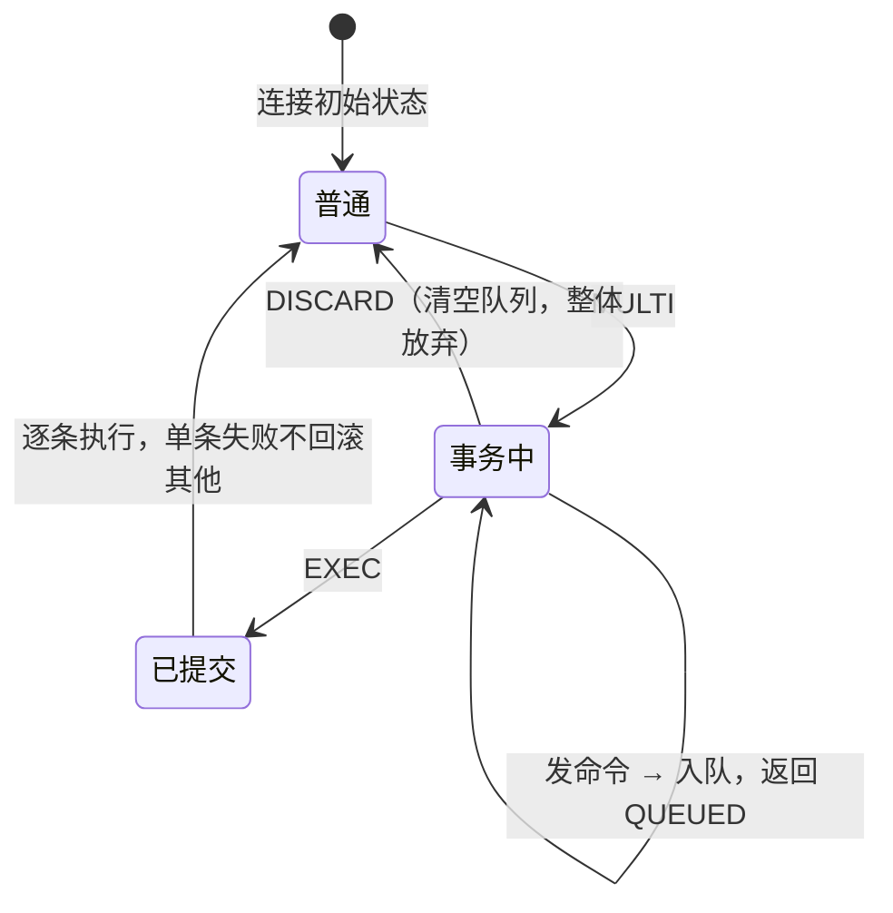

---
tags:
  - 中间件/Redis
---

# Redis 基础与线程模型

这是 Redis 专栏的入口篇，先解决三个前置问题：Redis 在什么条件下该被选来当缓存、持久化缓存、消息队列或分布式锁；一条命令从客户端发出到拿到回复，中间经过哪些环节；以及「单线程」这个被反复引用的说法，到底指哪一段是单线程、哪一段已经不是单线程。后面几篇——数据类型与底层结构、持久化、过期与淘汰、分布式锁、高可用、缓存一致性——都落在这套执行模型上。

本篇的默认值与行为一律以 Redis 7.x 为准；6.0 与 7.0 带来的变化集中在 §9，正文出现处也会点出。

## 1. 定位与选型

Redis 常被一句话概括为「内存数据库」，这个概括漏掉了决定它适用边界的两个属性：它按数据结构组织数据，而不是按表与行；它的单条命令在单线程里串行执行，因而天然原子。先把这个定位钉住，再看它在几种典型负载里该不该被选。

### 1.1 Redis 是什么，边界在哪

Redis 的全称是 `REmote DIctionary Service`（远程字典服务），官方把它描述为一个开源的、基于内存的键值数据库；更贴近实现的说法是「数据结构服务器」——写入的数据一开始就按 `String`、`Hash`、`List`、`Set`、`ZSet` 等结构组织，读的时候不需要先做一次「迭代或排序」的转换（来源：Redis 官方文档, redis.io）。

这个定位带来三条硬边界，决定了它不适合代替关系型数据库：

| 边界 | 具体表现 | 后果 |
| --- | --- | --- |
| 无 `JOIN` 与关系约束 | 只有键到值、值到结构成员的指针关系 | 多表关联查询要落到应用层自己拼 |
| 无 SQL、无二级索引声明 | 查询只能用键直取，或对结构内成员做范围/集合运算 | 按非键字段检索要先在应用侧建索引（如用 ZSet 模拟） |
| 事务不回滚 | `MULTI` 内的运行时错误只影响出错那条命令（§7.3） | 不能把「要么全成功要么全失败」托付给 Redis 事务 |

在内存与磁盘之间，Redis 提供了一个中间档：数据常驻内存，同时可把内存状态以 `RDB` 快照或 `AOF` 追加日志落到磁盘，重启时从磁盘重建。这个能力让它模糊了「缓存」与「存储」的界线，也带来一个容易误判的取舍：默认配置下，`AOF` 每秒刷盘一次，意味着故障时最多丢失约一秒的写入（来源：Redis 官方文档, redis.conf 的 `appendfsync everysec` 说明）。把 Redis 当主存储用，必须先接受这个丢失窗口。

还需要给「原子」这个词加一个限定。Redis 命令的原子性来自单线程串行执行——一条命令在执行过程中不会被另一条命令插入（§4.1）。这个原子性只覆盖**单条命令**，不覆盖「多条命令组成的一个业务操作」。把库存扣减写成 `GET`、判断、`SET` 三步时，三步之间完全可能被其他客户端插入，需要 Lua 脚本或事务把整体包起来（§7）。把单命令原子当成多命令事务，是选型阶段最常见的越界。

### 1.2 与 Memcached 的分工

两者的共同点先摆清楚，避免把差异当成本质不同：都是把数据放内存、都有过期策略、都宣称亚毫秒级延迟、都能通过客户端做数据分片、都有多语言客户端。真正的分歧在四条线上（来源：Redis 官方文档, redis.io）：

| 维度 | Memcached | Redis | 选型含义 |
| --- | --- | --- | --- |
| 数据结构 | 只有 key-value，值是裸字节串 | 九类结构（String/Hash/List/Set/ZSet/BitMap/HyperLogLog/GEO/Stream） | 需要计数器、排行榜、去重、限流等结构时选 Redis |
| 持久化 | 无 | `RDB` 与 `AOF` | 重启不能丢数据时选 Redis |
| 集群 | 无原生集群，靠客户端分片 | 原生的 `Redis Cluster`（16384 个哈希槽） | 需要服务端分片与故障转移时选 Redis |
| 线程模型 | 多线程，可吃满多核 | 命令执行单线程（6.0 起网络 I/O 多线程） | 纯大 key-value 且要压满多核时，Memcached 仍有一席 |

对第四行要读准：Redis 的单线程换来的是免锁与命令原子性，代价是单个实例的命令执行只能用到一个核。Memcached 用多线程吃满多核，代价是需要在内部对共享结构加锁。这个取舍在 §4 会展开——它也是「Redis 为什么快」这个问题的一半答案。

第一行还要补一个常见误判：Memcached 的「多线程」与 Redis 的「单线程」比较的是命令执行层，两者的网络层实现并不对称。Memcached 用多线程处理连接与命令，单机能吃满多核，代价是内部要加锁；Redis 用单线程执行命令加 I/O 多路复用（§3），单实例受限于一个核。判据可以落成一句：**「单实例要压满多核」是 Memcached 的强项，「单实例要提供复杂结构与持久化」是 Redis 的强项**。这条判据在中大型系统里通常被绕过——需要多核时，起多个 Redis 实例做分片即可，不必换掉 Redis。

### 1.3 四类落点的判据

把 Redis 往哪个位置放，用「能容忍什么失败」来判断，而不是按「大家都在用」来选。四类落点的判据与红线如下：

**当缓存的判据**：读多写少、能接受回源、数据可按 key 失效。落点是 `SET key value EX <秒>` + 惰性/定期过期。红线是「缓存不做一致性保证」——数据库改了而缓存没改的窗口必须由应用侧的双写策略兜住（属于 07 篇的范围）。

**当持久化缓存的判据**：既要有缓存的低延迟，又要求重启后数据还在。落点是 `appendonly yes` + `save` 组合。判据是先确认能接受「`everysec` 下最多丢一秒」的窗口；不能接受时，要么用 `appendfsync always`（每条写都 fsync，延迟显著上升），要么把 Redis 降级回纯缓存并在数据库侧保证。

**当消息队列的判据**：`List` 的 `LPUSH`/`BRPOP` 可做点对点队列，`Stream` 支持消费组（`XADD`/`XREADGROUP`/`XACK`）。红线是投递语义——`List` 没有确认机制，出队即丢失；`Stream` 有 `PENDING` 与 `XACK`，但跨节点不保证顺序，也没有 Kafka 那种分区与副本。需要强投递语义、顺序保证与消费位点回放时，落点应转到消息队列系统，Redis 只当轻量补充。

**当分布式锁的判据**：`SET key value NX PX <毫秒>` 加锁、唯一值标识持有者、Lua 脚本比对后删除（`SET NX PX` 的语义与 `GETDEL` 不是一回事）。红线是主从异步复制下的丢锁——主库写入锁后尚未同步即宕机，从库被提升后不知道这把锁存在，第二个客户端能加锁成功。对正确性敏感的临界区要用 Redlock 或换用共识系统，并在应用侧加 `fencing token`（属于 05 篇的范围）。

四类落点有一处共同的判据：**判据是「失败时会发生什么」，不是「功能列表里有没有这一项」**。缓存丢了回源即可，锁丢了会导致两个客户端同时进临界区——同样是把 Redis 用错了位置，后果的量级完全不同。

四类落点之外，还有一条横向判据值得单列：**数据能否重建**。缓存类数据都能从后端重建，丢缓存的后果是性能问题；当持久化缓存用时，数据只存在于 Redis，丢的是数据本身。这条判据决定了三件事：要不要开持久化、能不能接受 `everysec` 的一秒窗口（§1.1）、故障恢复时先拉起 Redis 还是先回源数据库。同一套 Redis 部署同时承载「可重建的缓存」和「不可重建的会话」，会让故障预案无法收敛——按数据能否重建做实例隔离，比按业务模块隔离更实用。

## 2. 整体架构与一条命令的链路

Redis 的部署形态可以很少（单实例）也可以很多（Cluster），但执行模型是同一套：一个事件循环负责监听所有连接，命令在主线程里串行执行，耗时的收尾工作交给后台线程。本节先把进程内的角色分层铺开，再走一遍一条命令的完整路径。

### 2.1 客户端、服务端与事件驱动

Redis 是标准的 C/S 结构：客户端用 `RESP`（REdis Serialization Protocol，Redis 序列化协议）向服务端发命令，服务端返回同类协议编码的回复。`RESP` 在 6.0 之前是 `RESP2`，6.0 引入 `RESP3` 增加了更多回复类型（map、set、double 等），客户端握手时用 `HELLO 3` 切换（来源：Redis 官方文档, 6.0 release notes）。

服务端不是「每连接一个线程」的模型。它把每个客户端连接当作内核里的一个文件描述符（`fd`），用 I/O 多路复用把「哪些 fd 有数据可读/可写」一次性问出来，再在同一个线程里逐个处理。这样连接数可以远超线程数，十万级连接在单实例上是常规量级——这是 §3 要展开的核心。

`RESP` 的设计目标与它的使用方式有关。它是一种可人工阅读的文本协议，分帧靠「类型首字节 + 长度或行终止符」，服务端因此能流式解析，客户端在不完整读到一条命令时也知道还缺多少字节。以最简单的内联命令为例，客户端直接发 `GET key\r\n`，服务端按空格切分即可；数组形式的命令则是 `*<参数个数>\r\n` 后跟各参数的 `$<字节数>\r\n<内容>\r\n`。分帧规则是后面「一次事件循环只读到半条命令」这类现象的基础：**输入缓冲区里可能只有半条命令，解析器要能识别「还没读全」并保留现场，等下一轮 `epoll_wait` 返回时接着读**（§3.5）。

### 2.2 进程内的角色分层

一个运行中的 Redis 进程里有三类角色，只有第一类执行命令：

- **主线程**：持有事件循环，负责 `read` 客户端数据、解析 `RESP`、查命令表、执行命令、生成回复。
- **后台线程**（`BIO`，background I/O）：Redis 2.6 起有 2 个，分别处理关闭文件与 `AOF` 刷盘；4.0 起增加 `lazyfree` 线程，异步释放大对象。每个任务一个队列，后台线程轮询队列取任务执行：`BIO_CLOSE_FILE` 调 `close(fd)`、`BIO_AOF_FSYNC` 调 `fsync(fd)`、`BIO_LAZY_FREE` 调 `free()` 释放对象。
- **I/O 线程**（6.0 起，可选）：只分担网络读写与协议解析，不执行命令。默认 `io-threads 1`，即不启用，此时事件循环里只有主线程在读写（来源：Redis 官方文档, config.c 7.4）。

后台线程存在的原因很直接：`close`、`fsync`、释放大对象都是可能阻塞上百微秒到毫秒级的系统调用，放在主线程会让后续请求排队。把它们挪到后台线程后，主线程从「执行命令 + 做收尾」变成「只执行命令」。

```text
   Redis 进程内的角色分工（7.x）

   ┌─ 主线程 ─────────────────────────────────────┐
   │  事件循环：epoll_wait ─▶ 读/解析/执行命令 ─▶ 写回复 │
   └───────────────┬───────────────────────────────┘
                   │ 耗时收尾任务丢队列
       ┌───────────┼───────────────────────────┐
       ▼           ▼                           ▼
   BIO_CLOSE_FILE BIO_AOF_FSYNC          BIO_LAZY_FREE
   （关文件）      （AOF 刷盘）            （异步释放大对象）
       │           │                           │
       └───────────┴───────────┬───────────────┘
                               ▼
                     后台线程轮询各自队列
```

这也解释了一个常见操作建议：删除大 key 用 `UNLINK` 而不是 `DEL`。`DEL` 在主线程里同步释放，key 越大阻塞越久；`UNLINK` 只把 key 从键空间摘掉，对象的真正释放丢给 `BIO_LAZY_FREE` 队列（来源：Redis 官方文档, redis.io 命令文档）。

后台线程的引入有时间线，理解它可以解释为什么有些能力只在特定版本后才有：Redis 2.6 起有 `BIO_CLOSE_FILE` 与 `BIO_AOF_FSYNC` 两个后台线程，分别对应关闭文件与 `AOF` 每秒刷盘；4.0 增加 `BIO_LAZY_FREE`，把大对象的释放从主线程挪走（来源：Redis 官方文档, redis.io 线程模型说明）。三条队列对应三类会阻塞主线程的系统调用，任务粒度也不同：关文件是 O(1) 的 `close`，`AOF` 刷盘是 `fsync`，释放内存则可能是 O(对象大小) 的 `free`。

后台线程与命令执行的关系带来一个可观测结论：**与 `lazyfree`、`AOF` 相关的计数滞后于命令本身**。`UNLINK` 返回后 key 已经不在键空间里，但对象的内存可能还要过一小段时间才真正归还，`used_memory` 的下降与命令返回不在同一时刻。排查内存回收不及时时，要先确认对象是否还在 `BIO_LAZY_FREE` 队列里，而不是直接断定内存泄漏。

`io-threads` 参数虽然叫「I/O 线程」，与三个 `BIO` 线程是两套独立机制：`BIO` 线程处理的是内部收尾任务，`io-threads` 处理的是客户端 socket 上的读写（§5）。把两者混为一谈，会在排查网络瓶颈时去看 `lazyfree` 的计数。

任务队列分成三条而不是一条，原因是三类任务的执行者与阻塞特性不同。`BIO_AOF_FSYNC` 的任务顺序敏感（刷盘顺序影响 `AOF` 恢复后的数据），`BIO_LAZY_FREE` 的任务彼此独立、可以乱序释放，`BIO_CLOSE_FILE` 只是关一个 fd。放在同一条队列里，一次慢的 `fsync` 会挡住后面的内存释放，反过来也一样。分队列让三类任务互不阻塞，代价是线程数与队列数成为固定的小常数——它们处理的是「数量少但单次耗时」的收尾任务，不需要随负载伸缩。

### 2.3 一条命令从客户端到返回

把 §2.2 的角色串起来，一条 `GET key` 的完整链路是下面这样。关键节点上的动作都可以在源码里对上：读取在 `readQueryFromClient`，查表与鉴权在 `processCommand`，执行在 `call()`，回写在 `beforeSleep` 里的 `handleClientsWithPendingWrites`（来源：Redis 官方文档, 源码 networking.c / server.c 7.4）。

```text
   一条命令从客户端到返回（Redis 7.x）

   客户端                     Redis 主线程                        内核
     │                            │                              │
     │ ① 命令写入 socket ─────────▶│                              │
     │                            │ ② epoll_wait 返回可读 ◀───────│ socket 可读
     │                            │ ③ readQueryFromClient 读入输入缓冲区
     │                            │ ④ 按 RESP 分帧，解析出命令与参数
     │                            │ ⑤ processCommand：查命令表、鉴权、集群重定向
     │                            │ ⑥ call() 执行，读写内存中的数据结构
     │                            │ ⑦ 回复追加到 client 输出缓冲区
     │                            │ ⑧ 挂入 pending-write 待发队列
     │                            │ ⑨ beforeSleep：write() 回写 ──▶│
     │ ⑩ 客户端读到回复 ◀──────────┘                              │
```

链路里有三个容易被忽略的点。**第一，读取与解析可以是从线程做的**：启用 6.0 多线程 I/O（且开启 `io-threads-do-reads`）时，③④两步分派给 I/O 线程，主线程只收结果（§5）。**第二，回写是延迟的**：⑦⑧只把回复放进缓冲区，真正的 `write` 发生在下一轮事件循环的 `beforeSleep` 里，这样同一次循环中产生的多条回复能合并写出。**第三，客户端缓冲区是内存**：如果客户端读得慢，输出缓冲区会一直涨，超过 `client-output-buffer-limit` 就会被服务端强制断开——这是 `CLIENT LIST` 里 `omem` 偏大的排查线索（§11）。

命令链路上还有几处参数与观测点值得单独记住。**输入缓冲区与 `client-query-buffer-limit`**：读入的数据先放在输入缓冲区，客户端一次发来的数据超过这个上限时连接会被断开，管道发得过大（§6.3）会先撞上它。**`processCommand` 里的鉴权与路由**：查命令表之后会做 `ACL` 校验（6.0 起）与集群重定向判断（`MOVED`/`ASK`），重定向在客户端看来是命令失败，服务端其实执行了路由逻辑。**输出缓冲区的两类上限**：待发数据受 `client-output-buffer-limit` 分三类（`normal`/`slave`/`pubsub`）约束，普通客户端、副本、发布订阅客户端各有阈值，超出即断开，`CLIENT LIST` 里的 `omem` 就是这个缓冲区当前占用的字节数。

把这条链路与 §3.5 的循环对起来，能看出「一条命令的延迟」由哪几段构成：等待 `epoll_wait` 返回（受上一轮处理耗时影响）+ 解析 + 执行 + 等待下一次 `beforeSleep` 写出。其中两段「等待」与并发度相关，「解析 + 执行」与命令本身相关。`SLOWLOG` 记录的是执行段（§11），不包含等待段——这解释了为什么慢日志为空时延迟仍可能偏高。

反过来读这条链路，也能给「客户端缓冲区」类问题定位：如果 `CLIENT LIST` 里某连接的 `omem`（输出缓冲区占用）持续偏大，说明回写跟不上产出，可能客户端读取慢或网络带宽不足；如果 `qbuf`（输入缓冲区占用）偏大，说明服务端处理速度跟不上客户端发送速度，对应主线程仍卡在上一批命令上。两个字段分别对应链路的出口与入口，是排查读写不畅时最先看的一对。

## 3. I/O 多路复用

「单线程为什么能扛十万连接」这个问题，答案不在 Redis 本身，而在内核提供的 I/O 多路复用接口。这一节从「一个线程怎么管住多个 fd」讲起，再对比内核提供的几种实现，最后落到 Redis 的 `ae` 事件库上——它是把文件事件与定时任务统一到一次循环的那层胶水。

### 3.1 为什么单线程能处理多连接

一个线程处理一个连接的做法，连接数一多就退化成「线程数爆炸 + 上下文切换开销」。I/O 多路复用换了一条路：把「哪些 fd 准备好了」这件事交给内核批量查询，线程只在有事件时才被唤醒。

```text
   单线程 + I/O 多路复用：一个线程监听 n 个连接

   客户端 A ─┐
   客户端 B ─┤   ┌────────────────┐   ┌──────────────────┐
   客户端 C ─┼──▶│  内核多路复用    │──▶│ Redis 主线程      │
     …      ┤   │ (epoll / kqueue) │   │ 一次取走所有就绪 fd │
   客户端 N ─┘   └────────────────┘   └──────────────────┘
                  监听全部已连接 socket    处理完再回到 epoll_wait
```

这里有一个常被混淆的点：Redis 用到的 socket 不止「已连接的客户端」一种。监听 socket（`listen fd`）也在多路复用里，它上面对应的是「连接事件」；已连接的 socket 上对应的是「读事件」与「写事件」。三种事件走各自的处理函数，共用同一个事件循环（来源：Redis 官方文档, redis.io 单线程模式说明）。

多路复用还有一层容易忽略的收益：它把「等待」从线程里挪走了。一连接一线程的模型里，每个线程在 `read` 没数据时要么阻塞、要么被唤醒调度；多路复用模型里，主线程只在 `epoll_wait` 上有一次等待，其余时间都在执行命令或处理 I/O。**等待的成本从「线程数 × 上下文切换」降到「一次系统调用」**，这是连接数越多、优势越明显的根本原因。

需要区分「连接数」与「并发请求数」这两个量。多路复用让单线程能持有大量连接，但这些连接同一时刻只有少数在真正发命令；`INFO clients` 里的 `connected_clients` 是前者，`instantaneous_ops_per_sec` 反映的是后者（§11）。一台机器上挂着十万连接但每秒只发几千条命令，是很常见的形态；反过来，连接数不高但每个连接都在高频发命令时，瓶颈会落在命令执行而不是连接管理。

### 3.2 select / poll / epoll / kqueue 的能力边界

四种接口解决同一件事，差别在「怎么把 fd 集合告诉内核」和「内核怎么把就绪结果还回来」（来源：Linux 手册页 `select(2)`、`poll(2)`、`epoll(7)`；FreeBSD 手册页 `kqueue(2)`）：

| 接口 | fd 集合怎么传 | 内核侧结构 | 单次调用复杂度 | 数量上限 | 典型平台 |
| --- | --- | --- | --- | --- | --- |
| `select` | 位图，每次调用都整份拷贝进内核 | 无持久结构，每次重新扫描 | O(n)，n 为最大 fd 值 | `FD_SETSIZE`，通常 1024 | 全平台兜底 |
| `poll` | 结构体数组，每次调用整份拷贝 | 无持久结构，每次重新扫描 | O(n)，n 为 fd 个数 | 无 1024 限制 | POSIX 通用 |
| `epoll` | 一次 `epoll_ctl` 注册，之后不再重复拷贝 | 红黑树（关注列表）+ 就绪链表 | 注册 O(log n)，取就绪 O(就绪数) | 受 `ulimit -n` 限制 | Linux |
| `kqueue` | 一次 `kevent` 注册 | 内核事件队列 | 注册与取就绪都接近 O(1) | 受系统限制 | FreeBSD / macOS |

读这张表的判据是：**`select` 与 `poll` 每次调用都要把整个 fd 集合从用户态拷进内核、再线性扫描一遍**，所以连接数上去以后，CPU 花在「扫描没有事件的连接」上的时间越来越多。`epoll` 把关注列表常驻内核，只在 fd 状态变化时通过回调把 fd 挂到就绪链表，`epoll_wait` 直接返回这个链表——**开销与「就绪的 fd 数」相关，与「注册的总 fd 数」无关**。这就是十万连接量级的来源。

Redis 在编译期按平台择优选择后端，优先级是 `evport`（Solaris）→ `epoll`（Linux）→ `kqueue`（BSD/macOS）→ `select`（兜底）（来源：Redis 官方文档, ae.c 7.4）。所以同一份 Redis 代码在 Linux 上走 `epoll`、在 macOS 上走 `kqueue`，行为一致，只是底层接口不同。

把四种接口的差别落到具体现象上，可以得到三条排查判据。**第一，`select` 的 1024 上限是编译期常量（`FD_SETSIZE`）**：旧代码或旧库用 `select` 时，连接数一旦接近 1024 就会出现异常，而 Redis 在 Linux 上默认走 `epoll`，不会撞到这个限制——「Redis 只能支持 1024 连接」这个说法就是把 `select` 的限制错误地安到了 Redis 上。**第二，`poll` 没有 1024 限制但仍要线性扫描**：连接数上万时，即使有事件，每次 `poll` 也要遍历整个数组，CPU 花在检查没有数据的 fd 上。**第三，`epoll` 的优势随「总连接数 / 活跃连接数」的比值放大**：比值越高，线性扫描浪费越多，`epoll` 越占优（来源：Linux 手册页 epoll(7)）。

`epoll` 自身有几个边界细节。关注列表用红黑树组织，`epoll_ctl(ADD/MOD/DEL)` 的复杂度是 O(log n)；就绪链表的插入与摘除是 O(1)。`epoll_wait` 返回的数组大小由调用方传入，Redis 用的是「`maxclients` + 128」量级——源码里是 `server.maxclients + CONFIG_FDSET_INCR`，而 `CONFIG_FDSET_INCR` 等于 `CONFIG_MIN_RESERVED_FDS + 96`，即 32 + 96 = 128（来源：Redis 官方文档, server.c / server.h 7.4）。这样一次 `epoll_wait` 能取走的就绪 fd 数量足以覆盖所有可能同时在线的连接。

`kqueue` 与 `epoll` 在能力上接近，差别在接口形态：`kqueue` 用一次 `kevent` 调用同时完成注册与取事件（`changelist` 与 `eventlist` 分开传入），且能监听的不只是 socket，还包括文件、信号、进程等。Redis 把两者都抽象成「注册读/写关心 + 取就绪列表」两层，上层的 `ae` 代码因此不区分平台（§3.4）。

把「连接数上限」这件事说透，还需要把三层的限制分开：**应用层**是 `maxclients`（默认 10000）与 `client-query-buffer-limit` 等，**进程层**是 `ulimit -n` 文件描述符上限，**内核多路复用层**才是 `epoll` 的关注列表容量（受 `ulimit -n` 约束，自身不设 1024 上限）。三层里任何一层先到顶，新建连接就会失败；`epoll` 这一层从来不是瓶颈，「十万连接」的真正天花板通常落在进程的 fd 上限与内存上（§3.3）。

### 3.3 epoll 的就绪队列与内核回调

`epoll` 之所以能做到「只返回就绪的」，靠的是三件东西配合：一个关注列表、一个就绪链表、以及挂在每个 fd 等待队列上的回调。

```text
   epoll 的三段结构

   epoll_create() ─▶ 内核 epoll 实例
                     ├── interest list（红黑树，epoll_ctl 维护）
                     └── ready list（rdllist，就绪 fd 组成的链表）

   fd 注册： epoll_ctl(ADD, fd) ─▶ 把 fd 挂进 interest list
                                  └─▶ 在该 fd 的等待队列上注册回调 ep_poll_callback

   数据到达： 网卡中断 ─▶ 协议栈把该 fd 放入 rdllist
                        └─▶ 回调唤醒阻塞在 epoll_wait 的线程

   epoll_wait() ─▶ 只返回 rdllist 上的 fd（就绪的），与注册总数无关
```

三个细节值得记住。**第一，回调是「一次性挂载、事件驱动触发」**：注册时把 `ep_poll_callback` 挂到 fd 的等待队列，之后每次该 fd 有数据到达，内核走的是协议栈的常规唤醒路径，顺带把 fd 加入 `rdllist`——不需要 Redis 做任何轮询。**第二，`rdllist` 是双向链表**，加入与摘除都是 O(1)。**第三，触发模式分水平触发（level-triggered，LT）与边缘触发（edge-triggered，ET）**：LT 下只要 fd 还有数据没读完，下次 `epoll_wait` 还会返回它；ET 下只在状态「从无到有」变化时通知一次，必须一次读完，否则会漏事件。Redis 用的是 LT（来源：Redis 官方文档, ae_epoll.c 7.4 未设置 `EPOLLET`），实现上更简单：没读完的 fd 下一轮还会被返回，不用担心漏读。

`epoll` 的这套结构决定了它的两个行为特征，也是排查时常用的线索。**一是惊群与唤醒开销**：多个线程阻塞在同一个 `epoll` 实例上时，fd 就绪可能唤醒其中多个甚至全部，被唤醒却拿不到事件的线程白白做一次调度。Redis 的主线程只有一个，天然不存在这个问题，这是「单线程 + `epoll`」组合的一个额外红利。**二是 LT 与 ET 对代码的要求不同**：LT 下没读完的 fd 下一轮还会返回，读循环即便一次没读干净也不会丢事件；ET 下必须循环 `read` 到 `EAGAIN` 为止，漏一次就读不到后续数据。Redis 选 LT，正是为了让「输入缓冲区里只有半条命令」的中间状态可以被安全保留到下一轮（§2.1）。

还有一处与内存相关的边界：`epoll` 的关注列表与就绪链表都常驻内核，每个注册的 fd 在内核里有对应节点。连接数越多，这部分内核内存占用越大；再加上每个连接在用户态的客户端结构体，就能解释为什么「十万连接」真正吃紧的往往是内存与 fd 上限，而不是 CPU。

### 3.4 ae 事件库：把文件事件与时间事件统一到一次循环

Redis 没有直接用 `epoll`，中间隔了一层自己的事件抽象库 `ae`（async event library）。它的价值在于：**把「网络 fd 上的 I/O 事件」和「需要在某个时间点执行的任务」放进同一个循环里统一调度**。

`ae` 对外的接口很少：`aeCreateEventLoop` 建循环、`aeCreateFileEvent` 注册文件事件（读/写 + 处理函数）、`aeCreateTimeEvent` 注册时间事件（到期毫秒数 + 回调）、`aeProcessEvents` 跑一轮。文件事件由底层的 `epoll`/`kqueue` 驱动；时间事件是 `ae` 自己在循环里维护的链表，每轮结束后检查有没有到期（来源：Redis 官方文档, ae.c / ae.h 7.4）。

时间事件在 Redis 里主要用来跑 `serverCron`——它是 Redis 的「心跳」：更新统计、检查客户端超时、触发过期键的定期扫描、在合适时机触发 `RDB`/`AOF` 收尾等。`serverCron` 的执行频率由 `hz` 参数决定，默认 10，即每秒 10 次、约每 100 毫秒一次（来源：Redis 官方文档, config.c 7.4，`CONFIG_DEFAULT_HZ = 10`）。`hz` 调高会让过期扫描与超时检测更及时，代价是空转时的 CPU 占用上升。

时间事件的触发时间不是严格的。`ae` 在每轮 `processTimeEvents` 里检查到期的时间事件并执行回调，因此**时间事件的精度受「一轮循环的耗时」限制**：上一轮若因为有大量命令要处理而耗时较长，`serverCron` 的实际执行时刻会被推后。这也是 `hz` 越高越及时的原因——更高频的检查让推后幅度变小，代价是空转开销上升（`hz` 默认值为 10，来源：Redis 官方文档, config.c 7.4）。

`ae` 不直接用「定时器线程」，理由与整个设计一致：多一个线程就多一套同步与状态，而 Redis 的定时任务（`serverCron`）本身很短，放在事件循环里跑完即可。真正耗时的定时相关工作（如 `AOF` 重写、`RDB` 生成）会 `fork` 出子进程，而不是把主线程占住。

### 3.5 一次事件循环做了哪几件事

把 §3.3 的多路复用与 §3.4 的时间事件合起来，一次 `aeProcessEvents` 的完整迭代是下面这四步（来源：Redis 官方文档, ae.c 7.4）：

```text
   一次事件循环迭代（aeProcessEvents）

   ┌─ beforesleep ──────────────────────────────┐
   │ 把 pending-write 队列里的回复用 write() 发出  │
   └───────────────────────┬────────────────────┘
                           ▼
   ┌─ aeApiPoll(timeout) ───────────────────────┐
   │ timeout = 距最近一个时间事件还有多少毫秒       │
   │ 若无文件事件也无时间事件，就睡眠在 epoll_wait   │
   └───────────────────────┬────────────────────┘
                           ▼
   ┌─ 处理本轮所有就绪的文件事件 ─────────────────┐
   │ 读事件 rfileProc：read → 解析 → 执行 → 回复入队 │
   │ 写事件 wfileProc：把输出缓冲区写回 socket      │
   │ 同一 fd 先读后写（设了 AE_BARRIER 时相反）     │
   └───────────────────────┬────────────────────┘
                           ▼
   ┌─ processTimeEvents ────────────────────────┐
   │ serverCron：统计刷新、超时检查、过期扫描，hz=10 │
   └────────────────────────────────────────────┘
```

这四步里有两个设计值得单独点出。**`aeApiPoll` 的 `timeout` 不是拍脑袋定的**，它等于「离最近一个时间事件还有多久」——这样既不会因为等待 I/O 而错过 `serverCron`，也不会在没事可做时忙等。**同一 fd 先读后写**的默认顺序，是为了让「刚读完的命令能尽快把回复写出去」，减少一次不必要的循环往返；只有少数场景（例如需要在回复前先 `fsync`）才用 `AE_BARRIER` 反过来。

这也回答了 §3.1 的问题：单个线程之所以能管住十万连接，是「内核批量筛选就绪 fd」+「一个循环里既处理 I/O 又跑定时任务」两件事共同做到的。连接数增长时，主线程每轮要处理的「有事件的 fd」数量只与活跃连接相关，与总连接数无关。

这四步的顺序带来几个可观测现象。**第一，`beforeSleep` 先于 `epoll_wait`**：上一轮攒下的回复会在进入等待前尽量发出，客户端感知到的延迟因此更小；回复没写完（socket 缓冲区满）时才注册写事件，交给下一轮的写事件处理。**第二，时间事件在文件事件之后**：某一轮文件事件特别多时，`serverCron` 会被推后，表现为统计刷新变慢、超时检查变慢。**第三，`aeApiPoll` 在没有任何文件事件时仍会被调用**，目的是睡到下一个时间事件到期，而不是忙等。

`timeout` 的计算也有边界：有文件事件注册时，`aeApiPoll` 的等待时间取「距最近时间事件的间隔」；完全没有注册任何 fd 时才会无限等待。实际运行中总会有监听 socket 与客户端 socket 注册着，循环的节奏由「事件到达」与「最近的定时任务」共同决定。

把这一轮和 §2.3 的命令链路接起来，一条命令在服务端的一轮生命周期，就是从 `aeApiPoll` 把它所在的 fd 返回开始，到下一个 `beforeSleep` 把回复写出为止。

还有一个与 `beforeSleep` 相关的顺序细节：除写回复外，Redis 在 `beforeSleep` 里还会做一批「延迟到本轮末」的工作，例如把 `AOF` 缓冲区刷盘、以及更新缓存的时间戳供本轮其余逻辑读取。这些动作放在「进入 `epoll_wait` 之前」是有意的——它们要么必须在对外可见的回复之前完成（`AOF` 刷盘决定了这次写是否已持久化），要么是下一轮要反复读取的公共状态。理解这一点，才能解释为什么「回复的可见时刻」与「持久化的可见时刻」在某些配置下会与直觉不同。

## 4. 单线程模型

「Redis 是单线程的」这句话只对一半。准确的说法是「命令的执行是单线程」。这一节先把这句话拆开，再解释这样设计为什么快，以及它在哪里会被卡住。

### 4.1 「单线程」指什么

Redis 的官方说法是：接收客户端请求、解析请求、读写数据、发送回复这一整条链路由一个线程（主线程）完成，这也是「Redis 单线程」这个说法的由来（来源：Redis 官方文档, redis.io 线程模型说明）。

从 §2.2 的分层可以看出，进程里还有后台线程和可选的 I/O 线程。所以「单线程」的准确边界是：

- **命令执行**：单线程。任意时刻只有一个命令在真正读写数据结构，这是命令原子性的来源。
- **网络读写与协议解析**：默认单线程；6.0 起可分配 I/O 线程（§5）。
- **耗时收尾**（关文件、`AOF` 刷盘、释放大对象）：后台线程，不占命令执行。

区分这三层的意义在于：当有人说「多线程的 Redis 会破坏原子性」时，需要先确认他说的是哪一层。命令执行始终没被多线程动过，所以原子性没变。

这里还有一层常被忽略的区分：**「单线程」不等于「单进程」**。执行命令的是一个线程，但 Redis 进程里还有后台线程（§2.2）、可选的 I/O 线程（§5），以及在持久化时会 `fork` 出的子进程。因此「Redis 单线程」严格来说指的是「命令执行模型单线程」，进程与线程数量都会随配置和运行阶段变化。判断某个行为是否受单线程影响时，先问它发生在哪一层：发生在命令执行层的（原子性、慢命令阻塞）才与单线程直接相关。

### 4.2 为什么快：五条理由

官方基准测试的常见口径下，单实例的简单命令吞吐量可以比同一台机器上的单实例 MySQL 高出一到两个量级；这个数字随硬件、命令类型与是否开启 `pipelining` 变化很大，本篇没有在固定环境下复现，只作量级参考。快的原因可以拆成五条（来源：Redis 官方文档, redis.io FAQ）：

1. **纯内存操作**。绝大多数命令只在内存里读写，不碰磁盘。瓶颈因此通常落在内存带宽或网络，而不是 CPU——CPU 不饱和，单线程就够用。
2. **免锁**。命令串行执行，所有数据结构天然没有并发读写竞争，不需要为它们加锁保护。省掉的不只是锁本身的开销，还有为了拿锁而设计的一整套并发协议。
3. **免上下文切换**。没有多线程竞争，就不会有线程切换带来的寄存器保存/恢复与缓存失效。高并发下，上下文切换本身可能吃掉可观比例的 CPU。
4. **I/O 多路复用**。一个线程监听所有连接的就绪事件（§3），连接数增长不带来线程数增长。
5. **按操作选型的底层结构**。同一件逻辑操作，底层实现的选择直接决定复杂度（例如跳表把 ZSet 的范围查询从 O(n) 降到 O(log n)），这部分属于 02 篇。

第一、二两条是主因：**CPU 不是瓶颈，才让单线程成为一个合理选择，而不是一个无奈的妥协**。如果 Redis 是 CPU 密集型，单线程早就撑不住了。

把这五条理由与实际性能瓶颈对照，可以得出一张判断表：瓶颈在内存带宽时，加 CPU 无用；瓶颈在网络时，加 CPU 无用，应减少往返（§6 管道）或换更近的部署位置；瓶颈在单核 CPU 时，才需要分片或换执行模型。**「Redis 慢」这个结论必须先落到具体的那一项瓶颈上才有意义**。

五条理由里，免锁还有一面代价：免锁来自串行执行，而串行执行意味着**没有抢占**。多线程模型可以在一个慢操作跑到一半时把 CPU 让给其他任务，单线程模型做不到——慢命令只能等它结束，期间所有客户端排队（§4.4）。因此免锁换来的不只是省开销，还有「必须保证每个命令都足够快」这条工程约束。

底层结构与「为什么快」的关系容易被低估。Redis 在实现层面会做「同样的逻辑操作选更省的底层结构」：`Hash` 元素少时用紧凑的 listpack，元素多时升级为哈希表；`ZSet` 按元素数与元素长度在 listpack 与跳表之间切换；`List` 用 quicklist。这些阈值参数（如 `hash-max-listpack-entries`）属于 02 篇，效果直接体现在命令的 `usec_per_call` 上（§11）：**同样一条 `HGETALL`，在 listpack 编码的小 hash 与哈希表编码的大 hash 上，成本可能差一个量级**。

### 4.3 代价与瓶颈

单线程的代价同样明确——单个实例只能用到一个核：

```text
   单线程下的核利用与瓶颈位置

   一个 Redis 实例                            多核服务器
   ┌─────────────────────┐                ┌────┬────┬────┬────┐
   │ 主线程：命令执行       │                │核心0│核心1│核心2│核心3│
   │ 网络读写（未开多线程）  │  ──────────▶   │ ██ │ 空闲│ 空闲│ 空闲│
   └─────────────────────┘                └────┴────┴────┴────┘
            瓶颈通常先出现在其中之一：
              单核跑满 / 大 key 阻塞 / 网络往返 / 内存带宽
```

由此得到四条可操作的判断：

- **单核跑满而其他核空闲**：说明命令执行成了瓶颈。先看 `INFO commandstats` 里各命令的 `usec_per_call` 与调用次数（§11），找出耗时占比高的命令，而不是先加机器核数——加核对单线程无用。
- **大 key 阻塞**：一次操作一个超大对象（几 MB 的 Hash、几十万元素的 ZSet）时，释放、序列化、遍历都要在主线程里完成，期间所有其他请求排队。
- **阻塞命令**：O(n) 命令与长 Lua 脚本会把事件循环卡住，这是下一节的主题。
- **网络往返**：如果瓶颈在网络（每命令一次 RTT），加核心同样无用，改用管道（§6）或减少命令次数才是对症的。

单核约束还带来一个部署层面的推论：**在单机上垂直扩展（加 CPU 核数）对单个 Redis 实例没有意义**。要利用多核只有两条路——在同一个进程里让 I/O 并行（6.0 的 I/O 线程，只覆盖网络部分，§5），或在同一台机器上起多个 Redis 实例并做分片（属于 06 篇）。判断该走哪条路的依据就是 §4.2 那张瓶颈表：瓶颈在网络 I/O 时前者可能有用，瓶颈在命令执行时只有后者有效。

「单核跑满」的观测方式是看主线程的 CPU 使用率，而不是整机 CPU 使用率。4 核机器上单核满载时整机 CPU 可能只有 25%，从整机指标看会误判为资源空闲。`INFO` 不直接给线程级 CPU，需要用 `top -H` 看线程，或结合 `INFO stats` 的 `instantaneous_ops_per_sec` 与命令耗时推断。

除了逐个命令，还有一类阻塞来自同一时刻的大量小命令。单条命令再快，十万条累积起来也会让事件循环在一轮里处理很久，这一轮里其他客户端的请求全部排队。**这是延迟毛刺与吞吐下降的常见成因，且慢日志里看不到任何一条慢命令**——每条都远快于 `slowlog-log-slower-than`。判据是 `INFO commandstats` 里某个命令的调用次数在短时间内异常放大。

`KEYS` 与 `SCAN` 的差别值得单独说明，因为它是「阻塞命令替代品」里最常被用到的一组（来源：Redis 官方文档, redis.io 命令文档）。`KEYS pattern` 一次遍历整个键空间并返回全部匹配项，复杂度 O(n)，n 为键总数；`SCAN cursor MATCH pattern COUNT n` 每次只返回一批和一个新游标，把遍历分摊到多次调用上。`SCAN` 的代价是同一轮遍历里返回的元素不保证完全一致，遍历期间新增或删除的 key 可能被漏掉或重复，因此它适合「找出需要处理的 key」，不适合「精确统计 key 的数量」。用分批换取主线程不被长任务占住，代价是结果的强一致性。

### 4.4 阻塞主线程的几类命令

「单线程」的直接后果是：**任何在主线程里跑得久的操作，都会阻塞所有客户端**。需要留意的几类（来源：Redis 官方文档, redis.io 命令文档）：

| 命令 | 阻塞点 | 替代或缓解 |
| --- | --- | --- |
| `KEYS pattern` | 遍历整个键空间，O(n) | 改用 `SCAN` 游标分批遍历 |
| `FLUSHALL` / `FLUSHDB` | 同步释放整个库的对象 | 加 `ASYNC` 参数，交给后台线程 |
| `DEL` 大 key | 在主线程里同步释放对象 | 改用 `UNLINK`（§2.2） |
| `HGETALL` / `SMEMBERS` / `LRANGE` 大范围 | 一次性把大结构全部取出并编码 | 用 `HSCAN`/`SSCAN` 分批，或限制范围 |
| `SORT` | 对列表/集合排序，O(n log n) 或更高 | 用 `SORT_RO` 只读版本，或把排序移到应用层 |
| 长 Lua 脚本 | 脚本整体在主线程原子执行，执行期间不处理其他命令 | 拆分脚本、控制循环规模，配 `lua-time-limit` |

关于 Lua 脚本，有一个常见误解要澄清：脚本执行期间 Redis 仍然会响应 `SCRIPT KILL` 或 `SHUTDOWN NOSAVE` 这类管理命令，但**一旦脚本已经执行过一次写操作，就不能再被 `SCRIPT KILL` 中断**（只能等它自己结束或关停实例）。`lua-time-limit` 的默认值是 5000（毫秒，配置项别名为 `busy-reply-threshold`）。它是「忙碌提示阈值」：脚本运行超过这个时间后，Redis 开始对其他客户端回复 `BUSY` 错误，提示它们脚本还在跑（来源：Redis 官方文档, config.c 7.4）。它并不强制中断脚本，也不限制脚本的运行时长短，只改变超时期间的对外应答行为。

这也解释了 §4.2 里「免锁」的另一面：**串行执行的原子性，代价是没有抢占**。一个慢命令不会被执行器切换出去，只能等它自己跑完。

有一处实现细节决定了收益的上限：I/O 线程在「读」阶段做的是 `read` 与 `RESP` 解析，解析结果仍要交回主线程，由主线程查表执行；在「写」阶段做的是把主线程生成的回复缓冲区 `write` 到 socket。I/O 线程的加减速，取决于「读解析」与「写回」在主线程总耗时里的占比。**命令本身很重、执行时间占了大头时，把读写分出去也救不了主线程**——这再次说明 §4.2 那张瓶颈表是判断该不该开 I/O 线程的前提。

`io-threads-do-reads` 默认关闭有一个不太直观的理由：读与解析之间需要把状态（部分解析的命令、输入缓冲区）从一个线程交接给主线程，交接本身要同步；源码注释给出的经验是 threading reads 通常帮助不大（来源：Redis 官方文档, redis.conf 7.4）。写回没有这个问题——主线程生成的是完整的回复缓冲区，交给 I/O 线程直接 `write` 即可，交接更干净。这也解释了为什么默认只并行写。

## 5. 6.0 的多线程 I/O

单线程模型在一个前提被打破后需要补丁：随着网络硬件变快，网络 I/O 本身（`read`/`write` 系统调用与协议解析）开始占用可观的 CPU 时间。6.0 的做法是把这部分工作分给若干 I/O 线程，而把命令执行继续留在主线程。

### 5.1 多线程 I/O 用在哪

I/O 线程只做两件事：把客户端 socket 上的数据读进来并按 `RESP` 解析、把回复数据写到 socket 上。它们的默认行为是先只分担**写**（`io-threads-do-reads` 默认 `no`），也就是说读与解析默认仍在主线程（来源：Redis 官方文档, redis.conf 7.4）。

```text
   6.0 多线程 I/O 的分工（io-threads=4，io-threads-do-reads=yes 时）

   主线程                         I/O 线程 1..3            内核
     │                                │                    │
     │ epoll_wait 拿到可读 fd ─────────▶│                    │
     │  分派读任务                      │ read + RESP 解析    │
     │ ◀── 收回解析结果 ────────────────│                    │
     │ 串行执行所有命令（这一层不并行）   │                    │
     │ 生成回复                         │                    │
     │  分派写任务 ────────────────────▶│ write 到 socket     │
     │                                 │ ───────────────────▶│
   命令执行始终在主线程；I/O 线程只碰 socket 与协议解析
```

把「原子性没被破坏」这个结论说完整，还需要区分两个层次。**命令级的原子性**由「同一时刻只有一个线程在执行命令」保证，与 I/O 线程无关。**顺序性**则依赖事件循环：同一连接上的命令按到达顺序处理，跨连接的命令顺序由事件循环的调度决定，不保证全局先进先出。I/O 线程改变的是读取与写出的快慢，不改变「谁先被主线程执行」——执行的入口始终是主线程里那个串行的 `processCommand` 序列。

由此得到一条实践判据：**一段逻辑依赖「多条命令之间不被插入」时，用事务或 Lua（§7），不要指望 I/O 线程或某种配置能提供这个保证**。原子性的落点在命令执行层，不在 I/O 层。

### 5.2 为什么没有破坏原子性

关键在于分界：I/O 线程处理的是「字节」——把 socket 上的字节读成命令、把回复字节写回 socket；主线程处理的是「命令」——从命令表查到执行函数、读写内存里的数据结构。命令的执行阶段仍然只有一个线程进入，因此**任意两条命令不会同时在改数据结构**，原子性由「命令执行串行」这一点保证，与 I/O 是否多线程无关（来源：Redis 官方文档, redis.conf 7.4 的 `io-threads` 说明）。

换个角度：多线程 I/O 只是把「准备命令」与「发送结果」这两段从主线程剥离，让主线程更专注于「执行命令」。它改变的是等待 I/O 的时间占比，不改变命令之间的次序关系。

把启用决策写成可执行的三步：**第一步，确认瓶颈在网络 I/O**——用 `INFO stats` 的 `instantaneous_ops_per_sec` 与整机 CPU 对照，若 QPS 上不去而主线程 CPU 已高，再看是不是花在读写与解析上；**第二步，评估核数**——按源码注释的经验值设定线程数并保证小于核数；**第三步，验证收益**——上线前后对比同一负载下的 QPS 与主线程 CPU，没有明显改善就回退。

有一个容易忽略的副作用：启用 I/O 线程后，同一连接上的「读」与「执行」之间多了一次跨线程交接，**单条命令的尾延迟可能略微上升，而吞吐上升**。这是吞吐优先的取舍，对延迟极敏感且 QPS 不高的场景未必值得开。另外，`io-threads` 与 `io-threads-do-reads` 都不可运行时修改（§10），调整需要重启实例，评估时要把重启成本算进去。

### 5.3 配置与收益边界

两个参数决定是否启用与怎么启用（默认值来自 7.4 源码，来源：Redis 官方文档, config.c 7.4）：

- `io-threads`：I/O 线程总数（含主线程），默认 `1`（即不启用），范围 1–128，**属于 `IMMUTABLE_CONFIG`，需改配置文件并重启，不能 `CONFIG SET`**。
- `io-threads-do-reads`：是否让 I/O 线程也分担读与解析，默认 `no`，同样是不可运行时修改的。

**这里需要纠正一处常见误传**：不少资料写「`io-threads` 默认是 4」，与 7.x 源码不符——7.4 的 `config.c` 里该参数默认值是 `1`，`redis.conf` 里出现的 `# io-threads 4` 是一行被注释掉的示例，不是默认值（来源：Redis 官方文档, config.c 与 redis.conf 7.4）。默认不启用 I/O 线程，意味着「6.0 之后 Redis 默认就是多线程」的说法不成立。

收益的边界很清楚：**只有网络 I/O 确实成为瓶颈时才值得开**。源码注释给出的经验是，4 核机器试 2–3 个 I/O 线程、8 核试 6 个，线程数要小于核数（来源：Redis 官方文档, redis.conf 7.4）。如果主线程 CPU 本来就不高，开 I/O 线程只会多出调度与同步开销，收益接近零甚至为负。另有两个限制：`io-threads-do-reads` 通常收益不大（源码注释原话是 threading reads 帮不上太多忙），且在 SSL 启用的情况下该特性不生效（来源：Redis 官方文档, redis.conf 7.4）。

### 5.4 多线程 ≠ 命令并行执行

这是本节最需要反复强调的一条判据。6.0 之后 Redis 的线程数变多了，但**同一时刻仍然只有一个线程在执行命令**：

| 说法 | 是否成立 | 原因 |
| --- | --- | --- |
| 6.0 之后 Redis 会并行执行多条命令 | 不成立 | 命令执行仍在主线程串行（§5.2） |
| 6.0 之后网络读写可以由多个线程完成 | 成立 | `io-threads > 1` 时启用 |
| 启用 I/O 线程后命令执行变快了 | 取决于瓶颈 | 瓶颈在网络时才有效（§5.3） |
| 因此可以用多核跑更多命令 | 不成立 | 单实例的命令执行仍受限于一个核 |

判据可以记成一句话：**多线程 I/O 提升的是「每秒能进出多少字节」，命令执行提升的是「每秒能算多少条命令」，两者不是一回事**。想让多个核同时执行命令，只能在一台机器上起多个 Redis 实例（配合 Cluster 分片），而不是打开某个参数。

## 6. 管道

管道（`pipeline`）解决的是「往返次数」这个瓶颈。它不属于 Redis 服务端能力，而是客户端把多条命令一次性发出、再一次性读回的技术（来源：Redis 官方文档, redis.io 客户端管道说明）。

### 6.1 管道为什么提速

Redis 在解析完一条命令后，不必等回复写回就能继续处理下一条命令，回复会先进入客户端输出缓冲区。管道的利用点正在这里：客户端不需要「发一条、等一条」，可以连续发多条，让服务端连续处理。

```text
   普通命令 vs 管道（3 条命令）

   普通：  C ─GET─▶ S        C ─SET─▶ S        C ─INCR─▶ S
           C ◀─R1─  S        C ◀─R2─  S        C ◀─R3─  S
           └ 一次 RTT ┘      └ 一次 RTT ┘       └ 一次 RTT ┘

   管道：  C ──GET,SET,INCR 一次写出──▶ S
           C ◀──R1,R2,R3 一次读回────── S
           └───────── 共 1 次 RTT ─────┘
```

省下的开销有两类。**一是网络往返（RTT）**：3 条命令从 3 次往返压成 1 次，跨机房或跨可用区场景下 RTT 通常是主要成本。**二是系统调用**：`read`/`write` 的次数减少，内核态与用户态之间的切换次数随之下降。当命令本身很轻（如 `PING`、小 `SET`）时，这两项就是全部瓶颈，管道能带来数倍提升；当命令本身很重（如大 `ZADD`）时，瓶颈在命令执行，管道收益有限。

管道提升的是客户端视角的吞吐，对单条命令的延迟没有帮助，甚至可能变差：一条命令被塞进一个大批次后，它的回复要等整个批次的回复一起读回，感知延迟被批次放大。因此**管道适合「一批命令都不着急拿结果」的批量读写场景，不适合「发一条马上要结果」的交互路径**。

还有一个前提条件容易被漏掉：管道依赖服务端「不等回复写出就继续处理下一条命令」这一点，而这一点在 Redis 里天然成立——命令处理与结果写出本来就是解耦的（§2.3 的回写三步）。管道因此不需要服务端做任何配合，`redis-cli`、各类客户端库都能用；真正需要客户端做的是「把多条命令编码进一次 `write`，再按顺序解析多次回复」。

### 6.2 与事务、Lua 的边界

管道常被误当成「批量原子操作」，需要把三者的边界划清：

| 手段 | 是否原子 | 服务器端是否支持 | 适用 |
| --- | --- | --- | --- |
| 管道 | 否 | 客户端技术，服务端只见到一串普通命令 | 单纯减少往返 |
| 事务（`MULTI`/`EXEC`） | `EXEC` 执行期间不被打断，但不保证全成功 | 是 | 一组命令连续执行、不被穿插 |
| Lua 脚本 | 整个脚本原子执行 | 是 | 需要在服务端做条件判断的复合操作 |

管道不原子的原因是：服务端把管道里的命令当作独立命令逐条处理，中间完全可能插入其他客户端的命令。**需要「中间不被打断」时，要把命令包进 `MULTI`/`EXEC`；需要「读后判断再写」时，用 Lua 脚本**（§7.4）。

### 6.3 一次放多少条

管道没有硬性条数上限，但有两个溢出点需要防：

- **客户端输出缓冲区**：一次发出太多命令，服务端要在回复发出前把结果都堆在输出缓冲区里，超过 `client-output-buffer-limit normal`（默认 0 表示不限，但通常按需要配置）会被断开。批量写入场景要显式设这个上限并分批。
- **客户端与服务端的 socket 缓冲区**：管道过大时，`write` 会因对端未及时读取而阻塞，反而拖慢整体。

工程上的做法是按批处理：每批几千到一万条命令，写满一批读一批，或分段 `read`，避免一次把所有回复堆在内存里。命令行里可以用 `redis-cli --pipe` 把一批命令从标准输入灌进去，它内部就是按管道协议批量发送并统计结果（来源：Redis 官方文档, redis-cli 文档）。

## 7. 事务

Redis 的事务是一组命令的「串行执行包」，它保证执行期间不被其他客户端命令穿插，但不提供关系型数据库意义上的回滚。理解这一点，比记住 `MULTI`/`EXEC` 四个命令更重要。

### 7.1 MULTI / EXEC / DISCARD 的语义

四个命令构成一个简单的状态机（来源：Redis 官方文档, redis.io 事务文档）：



`MULTI` 之后、`EXEC` 之前发出的命令不会立刻执行，而是入队并返回 `QUEUED`；`EXEC` 触发后，队列里的命令被连续执行，执行期间服务端不处理其他客户端的命令；`DISCARD` 用于主动清空队列并退出事务状态。**`DISCARD` 只能「整体放弃还没执行的队列」，没有任何「撤销已执行命令」的能力**，把它当回滚用是常见的误读。

`EXEC` 的执行有几个边界需要写清。**入队期的语法错误会让整个事务失败**：命令名拼错、参数个数不对，在入队时就会被标记，`EXEC` 时整体拒绝并返回 `EXECABORT`，队列里所有命令都不执行（§7.3）。**运行期错误不阻止其他命令执行**：队列里某条命令执行时报错，其余命令照常执行，`EXEC` 的返回值是一个数组，出错位置对应一个错误对象，需要客户端逐项检查而不是只看有没有返回错误。**事务不支持嵌套**：在 `MULTI` 里再次 `MULTI` 会返回错误而不改变状态。

`EXEC` 期间「不被打断」也有边界：它保证的是其他客户端的命令不会插进来，不保证执行过程中服务器不处理别的事——`serverCron` 之类的定时任务、以及别的连接上尚未执行的 I/O 读写仍可能发生。把「原子」理解为「这一组命令连续执行、中间不穿插其他命令」即可，不必拔高到整台服务器停摆。

### 7.2 WATCH：乐观锁

`WATCH key` 给事务加一层「条件检查」：在 `MULTI` 之前 `WATCH` 若干 key，`EXEC` 执行时会先检查这些 key 自 `WATCH` 以来是否被其他客户端改过；被改过则 `EXEC` 返回空（不执行队列）。这是典型的乐观锁——不加锁直接操作，提交时再检查冲突（来源：Redis 官方文档, redis.io 事务文档）。

几个容易踩的点：`WATCH` 是**连接级**的，同一连接上必须在 `MULTI` 之前调用；`EXEC`、`DISCARD`、`UNWATCH` 都会清除当前连接的所有监视。`WATCH` 只负责「检测冲突」，不负责「重试」——冲突后需要应用侧重新读取、重新 `WATCH`、重新提交，这个重试循环要自己写。因此 `WATCH` 适合低冲突场景，高冲突下重试次数会迅速上升。

### 7.3 为什么不支持回滚

事务里的错误分两类，处理方式不同（来源：Redis 官方文档, redis.io 事务文档）：

- **入队期错误**：命令名不存在、参数个数不对。这类错误在入队时就能发现，Redis 会把事务标记为「脏」，`EXEC` 时整体拒绝执行并返回错误（`EXECABORT`），队列里所有命令都不执行。
- **运行期错误**：命令语法合法、入队成功，但执行时出错（例如对字符串做 `INCR`、对不存在的 key 做带条件的操作）。这类错误**只影响出错那一条**，队列里其他命令照常执行，已经执行的也不会被撤销。

Redis 不实现回滚，是一个明确的设计取舍：回滚需要在执行前记录每条命令的逆操作（类似数据库的 `undo log`），这与「简单、快、内存优先」的目标冲突。Redis 的判断是：运行期错误通常来自编程缺陷，与其为它维护一套回滚设施，不如让错误显式暴露出来。

由此得到一条实践判据：**不要用 Redis 事务来维护「多个 key 必须同时成立」的不变量**。这类不变量要么用 Lua 脚本把逻辑整体原子化，要么交给数据库事务。

### 7.4 与 Lua 的原子性差别

Lua 脚本与事务都提供「执行期间不被打断」的原子性，但能力不同。事务的 `EXEC` 是把命令**依次**执行，命令之间不能根据前一条的结果做分支；Lua 脚本可以在服务端逐行读取中间结果，据此决定后续动作（例如「先 `GET`，判断后再 `SET`」），整体仍然原子（来源：Redis 官方文档, redis.io 脚本文档）。

因此选择判据是：**只是「一组命令别被打断」用事务；需要「读了再判断再写」用 Lua**。两种方式都不解决「部分失败后回滚」的问题——脚本执行到一半出错，前面已经生效的写操作同样留在数据里。要真正的事务语义，落点不在 Redis。

## 8. 延迟队列

延迟队列是把「当前该做的事」推到未来某个时刻再执行。它在 Redis 里用 `ZSet`（有序集合）实现，思路是把「到期时间」编码进 `score`，让取任务变成一个范围查询。

### 8.1 用 ZSet 的 score 存到期时间戳

`ZSet` 的 `score` 是浮点数，天然可以放一个时间戳。生产时用 `ZADD key <到期时间戳> <任务标识>` 写入，`score` 越小越先到期；消费时按 `score` 范围查询即可取出所有已到期的任务（来源：Redis 官方文档, redis.io 命令文档）。

`member` 一般放任务标识或序列化后的任务体。取任务用 `ZRANGEBYSCORE key -inf <当前时间戳> LIMIT 0 <n>`：`-inf` 到当前时间戳就是「所有已到期但还没被消费的」任务，`LIMIT` 控制单次取出的数量，避免一次取回大量任务把主线程卡住（§4.4 的大范围命令问题在这里同样适用）。

`score` 用时间戳时有一个量纲细节：`ZSet` 的 `score` 是双精度浮点数，用秒级时间戳（约 1.7×10^9）时能精确表示到整数秒，毫秒级时间戳（约 1.7×10^12）也在双精度能精确表示整数的范围内（小于 2^53），可放心使用。要注意的是**不要用 `score` 的小数部分去编码别的信息**——把「优先级」之类的语义混进小数位，会影响按 `score` 排序的语义，也降低可读性。多级排序的正确做法是在应用侧对「时间 + 优先级」拼一个单调递增的复合 `score`，而不是在浮点小数位上做位运算。

### 8.2 取到期任务与空轮询

消费侧有两种实现方式，取舍在「精度」与「空转 CPU」之间：

- **固定间隔轮询**：消费者每隔固定时间（如 100 毫秒）执行一次 `ZRANGEBYSCORE` + 删除。实现简单，但间隔决定精度，且大部分轮询是空的（没有到期任务），空转浪费 CPU 与一次网络往返。
- **按最近到期时间动态等待**：先取当前最小的 `score`（`ZRANGE key 0 0 WITHSCORES`），据此算出还要等多久，再安排下一次查询。避免空轮询，代价是逻辑更复杂，且在补充新任务后需要重新计算等待时间。

无论哪种方式，**「取到期任务」与「删除任务」必须是原子的一对操作**，否则会有并发消费者取到同一条任务（重复执行）。做法是把两步写进一个 Lua 脚本，或在服务端用 `ZPOPMIN`/`BZPOPMIN` 这类原子弹出命令（后者按 `score` 最小弹出，可直接得到最早到期的任务）。

### 8.3 精度与 Lua 保原子

延迟队列的精度受两件事限制：轮询间隔（决定了最早能多快发现到期任务）与 Redis 的单线程特性（任务处理本身会排队）。**要求毫秒级精度的延迟任务不适合用轮询实现**，需要把等待交给专门的调度组件，或者用 `BZPOPMIN` 配合阻塞等待降低空转。

用 Lua 把「按 `score` 取出到期任务并删除」包成一段脚本时，要注意脚本仍然阻塞主线程（§4.4）：脚本本身只做 `ZRANGEBYSCORE` + `ZREM` 时很快，但如果脚本里还做复杂的任务解析或大量删除，就会放大阻塞。稳妥的做法是让脚本只负责「原子地取出并标记」，任务的实际执行放到消费者进程里。

## 9. 版本演进

本篇涉及的机制在两个版本上有集中变化。以下条目均以官方发布说明为准（来源：Redis 官方文档, 6.0 与 7.0 release notes）。

**6.0（2020-04-30 GA）** 引入了四组与本篇直接相关的特性：

| 特性 | 内容 | 与本篇的关系 |
| --- | --- | --- |
| 多线程 I/O | 网络读写与协议解析可分给 I/O 线程 | §5 的全部内容 |
| `ACL` | 细粒度用户与权限控制 | 连接建立与命令鉴权的一环（§2.3 的 `processCommand`） |
| `RESP3` | 更丰富的回复类型 | 客户端用 `HELLO 3` 切换（§2.1） |
| 客户端缓存 | 服务端跟踪 key，失效时主动通知客户端 | 缓存一致性的一种新机制（属于 07 篇） |

**7.0（2022-04-27 GA）** 引入了四组变化：

| 特性 | 内容 | 与本篇的关系 |
| --- | --- | --- |
| Multi-Part AOF | `AOF` 由单个文件改为目录内多个文件，改写时不再覆盖原文件 | 持久化路径的落点是 03 篇，这里只标注版本 |
| Redis Functions | 用 `FUNCTION LOAD` 注册、`FCALL` 调用的服务端脚本 | 与 `EVAL` 同属「服务端原子执行」，替代 `EVAL` 的部分场景（§7.4） |
| Sharded Pub/Sub | `SPUBLISH`/`SSUBSCRIBE` 按分片投递 | Cluster 下避免消息广播到所有节点 |
| AOF 时间戳与 PITR | 7.0 起支持时间点恢复 | 持久化路径的落点是 03 篇，这里只标注版本 |

**命名演进**也要记一笔，避免在旧资料里被混淆：`SLAVEOF` 在 5.0 被 `REPLICAOF` 取代（`slaveof` 仍保留为别名）；配置里 `*-max-ziplist-*` 系列在 7.0 改名为 `*-max-listpack-*`，对应底层编码从 ziplist 换成 listpack（来源：Redis 官方文档, 7.0 release notes）。读到按旧名写的配置片段时，要确认它对应的 Redis 版本。

## 10. 关键参数

本节按六要素（默认值 → 语义 → 什么时候该改 → 改大或改小的后果 → 联动 → 失败模式）逐个写与本篇链路相关的参数。默认值均取自 7.4 源码，并与 `redis.conf` 中的注释核对（来源：Redis 官方文档, config.c 与 redis.conf 7.4）。

**`maxclients`**
默认 `10000`（来源：Redis 官方文档, config.c 7.4）。语义是单个实例同时允许的客户端连接数上限，**可变，支持 `CONFIG SET`**。什么时候该改：客户端连接数会超过一万（大量短连接或客户端池配置过大）时上调。改大的后果：主要由进程可用的文件描述符上限决定——Redis 启动时会把 `maxclients` 收敛到 `ulimit -n` 能支撑的范围内，并在日志里打印收敛后的值，如果设置的值超出能力，实际生效值会被自动降低（来源：Redis 官方文档, server.c 7.4）。联动：与操作系统的 `ulimit -n` 强相关，还受 Cluster 总线连接占用影响（集群里每个节点两连接）。失败模式：达到上限后新连接被拒绝，客户端收到 `-ERR max number of clients reached`（来源：Redis 官方文档, networking.c 7.4）。

**`timeout`**
默认 `0`（来源：Redis 官方文档, config.c 7.4）。语义是客户端空闲多少秒后被服务端断开，`0` 表示不主动断开。什么时候该改：需要回收因客户端进程异常退出而残留的空闲连接时，设一个正数（如 300）。改小的后果：会误断那些「连接池里长期空闲但后续还要用」的连接，客户端必须能正确重连，否则会集中报错。改大的后果：闲置连接长期占着 fd 与内存，接近 `maxclients` 时更难腾出名额。联动：与 `tcp-keepalive` 都会影响「死连接」的回收，但两者语义不同——`timeout` 是对空闲客户端主动断开，`tcp-keepalive` 是探测对端是否还活着。失败模式：设置过小且客户端未处理断线重连时，表现为周期性连接错误。

**`io-threads`**
默认 `1`（来源：Redis 官方文档, config.c 7.4）。语义是 I/O 线程总数（含主线程），`1` 表示不启用、全部由主线程处理。什么时候该改：确认网络 I/O 已成为瓶颈、主线程 CPU 因读写与解析而居高不下时启用（§5.3）。改大的后果：线程数必须小于机器核数，源码注释给的经验是 4 核用 2–3、8 核用 6；开得过多会引入额外的调度与同步开销，收益转负。联动：只在与 `io-threads-do-reads` 配合时才决定读是否也并行。失败模式：**该参数属于不可运行时修改的配置**，`CONFIG SET` 会失败，必须改配置文件并重启；在 SSL 启用时该特性不生效（来源：Redis 官方文档, redis.conf 7.4）。

**`io-threads-do-reads`**
默认 `no`（来源：Redis 官方文档, config.c 7.4）。语义是是否让 I/O 线程也分担读请求与协议解析，默认只分担写。什么时候该改：读请求的解析确实占了可观 CPU 时可以试开。改小的后果：读与解析留在主线程，主线程更容易因为大流量读而饱和。改大的后果：源码注释明确说「threading reads 通常帮助不大」，且该配置同样不可运行时修改、SSL 下不生效（来源：Redis 官方文档, redis.conf 7.4）。联动：必须先启用 `io-threads > 1` 才有意义。失败模式：单独打开它而 `io-threads` 仍为 1，不会有任何效果。

**`tcp-backlog`**
默认 `511`（来源：Redis 官方文档, config.c 7.4）。语义是传给 `listen(2)` 的 backlog 值，即内核为「已完成三次握手但还没被 `accept` 的连接」排队的长度。什么时候该改：高并发建连（大量客户端同时连入或重连风暴）时，内核默认队列可能不够，需要上调。改大的后果：还需要同步上调内核参数 `/proc/sys/net/core/somaxconn`，否则内核会截断到该值；源码注释把这两者写在一起提示（来源：Redis 官方文档, redis.conf 7.4）。联动：与 `somaxconn` 强相关，与 `maxclients` 共同决定「瞬时建连」的能力。失败模式：队列溢出时，内核会丢弃 `SYN` 或 `ACK`，客户端表现为连接超时或等待重试；`CONFIG` 里该参数**不可运行时修改**（源码标注为 `IMMUTABLE_CONFIG`）。

**`tcp-keepalive`**
默认 `300`（来源：Redis 官方文档, config.c 7.4）。语义是 TCP keepalive 的探测间隔（秒），用于发现对端已经消失但连接还挂在服务端的「半开连接」。什么时候该改：客户端网络环境不稳定、需要更快发现断连时下调。改小的后果：探测包更频繁，能更快回收死连接，代价是增加了无谓的网络流量。改大的后果：死连接留存更久，占用 fd 更长时间。联动：与 `timeout` 一起决定连接的清理速度，但 `tcp-keepalive` 检测的是「对端是否还活着」，`timeout` 检测的是「客户端多久没发命令」。失败模式：设为 `0` 表示关闭 keepalive，半开连接只能靠 `timeout` 或显式关闭来回收。

## 11. 常见故障与排查

这一节按「现象 → 判据 → 先看什么」组织，把本篇讲过的机制落到排查动作上。以下命令与字段名均来自 Redis 官方命令文档（来源：Redis 官方文档, redis.io 命令文档）。

```text
   连接与延迟问题的排查顺序

   现象：客户端连接被拒 / 延迟毛刺 / 吞吐下降
        │
        ├─ ① 连接被拒 ──▶ INFO clients 的 connected_clients
        │                  CLIENT LIST、ulimit -n、maxclients
        │
        ├─ ② 延迟毛刺 ──▶ SLOWLOG GET、LATENCY DOCTOR、MEMORY USAGE 找大 key
        │
        ├─ ③ 吞吐下降 ──▶ INFO stats 的 rejected_connections / expired_keys
        │                  INFO commandstats 的 usec_per_call
        │
        └─ ④ 内存告警 ──▶ INFO memory 的 used_memory / maxmemory
                           maxmemory-policy 与 evicted_keys
```

**连接被拒（`-ERR max number of clients reached`）**。判据是错误串本身（§10 的 `maxclients`）。先看 `INFO clients` 里的 `connected_clients` 是否顶到 `maxclients`；再看 `maxclients` 实际生效值——Redis 会在启动时把它收敛到文件描述符能力之内，如果 `ulimit -n` 太小，配得再大也会被降下来（§10）。然后看 `CLIENT LIST` 判断连接是「正常在线」还是「大量空闲/异常」：空闲连接多可能是客户端连接池配置过大或未及时关闭，配合 `timeout` 与 `tcp-keepalive` 处理。一个判读原则：**`connected_clients` 逼近上限时，先分辨是「业务真的需要这么多连接」还是「连接泄漏」，两者的处置完全不同**。

**延迟毛刺**。判据是「偶发的、尖峰状的延迟上升」。先跑 `SLOWLOG GET` 看最近有没有超过 `slowlog-log-slower-than` 的命令，默认阈值 `10000` 微秒（10 毫秒），最多保留 `slowlog-max-len` 条，默认 `128`（来源：Redis 官方文档, config.c 7.4）。慢日志里出现 `KEYS`、`SORT`、大范围 `LRANGE`、`FLUSHALL` 时，对应 §4.4 的阻塞命令清单。再看有没有大 key：用 `MEMORY USAGE key` 查单个 key、`redis-cli --bigkeys` 扫描全库。判读原则：**延迟毛刺若与某个周期性的后台任务（`RDB` 快照、`AOF` 重写）对齐，先怀疑 fork 与写时复制带来的停顿，而不是命令本身**（fork 的细节属于 03 篇）。

**吞吐下降**。判据是 `INFO stats` 里的 `rejected_connections`（因 `maxclients` 被拒的连接数）与 `expired_keys`（已过期被清理的键数）是否异常上升。`INFO commandstats` 给出每个命令的调用次数、总耗时与 `usec_per_call`（平均每次调用耗时），用它定位「哪条命令吃掉了 CPU」，比看总体 QPS 更有指向性。判读原则：**吞吐下降但 `usec_per_call` 没变，通常是对外问题（网络、客户端）；`usec_per_call` 上升，才是服务端命令变慢**。

**内存告警**。判据是 `INFO memory` 里的 `used_memory` 逼近 `maxmemory`，同时 `evicted_keys` 上升。此时键被淘汰的原因要从 `maxmemory-policy` 看（属于 04 篇），但需要注意一个与单线程相关的现象：淘汰与释放对象如果在主线程里同步做，会引入延迟毛刺，`lazyfree` 系列参数与 `UNLINK` 就是为缓解这一点设计的（§2.2）。

`INFO` 的关键段落可以按用途记：`INFO clients` 看连接、`INFO stats` 看吞吐与拒绝、`INFO memory` 看内存与淘汰、`INFO commandstats` 看命令耗时、`INFO replication` 看主从位点（属于 06 篇）。排查时按「现象落在哪个段落」直接取该段，比一次性拉全量 `INFO` 更快定位。

## 相关

- [[00-Redis 专栏导览]] —— 本专栏的入口、边界与阅读顺序
- [[02-数据类型与底层数据结构]] —— 本篇讲的「为什么快」，一半答案在下一层的数据结构里

## 参考

- 小林coding. *图解 Redis v2.0*. https://xiaolincoding.com/redis/
- Redis. *Redis Documentation*. https://redis.io/docs/latest/
- Redis. *redis.conf*. Redis 7.4, https://raw.githubusercontent.com/redis/redis/7.4/redis.conf
- Redis. *config.c*. Redis 7.4, https://github.com/redis/redis/blob/7.4/src/config.c
- Redis. *ae.c / ae_epoll.c*. Redis 7.4, https://github.com/redis/redis/tree/7.4/src
- Redis. *server.c / networking.c*. Redis 7.4, https://github.com/redis/redis/tree/7.4/src
- Redis. *Redis 6.0 release notes*. https://raw.githubusercontent.com/redis/redis/6.0/00-RELEASENOTES
- Redis. *Redis 7.0 release notes*. https://raw.githubusercontent.com/redis/redis/7.0/00-RELEASENOTES
