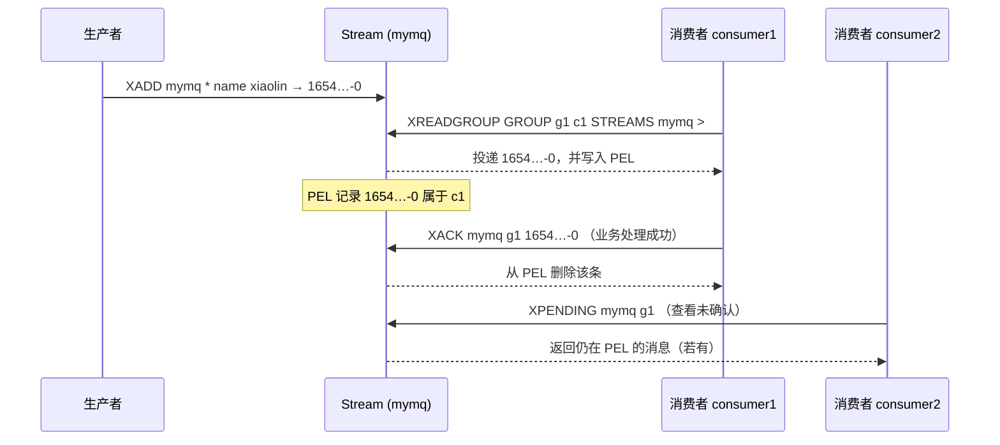

---
tags:
  - 中间件/Redis
---

# 数据类型与底层数据结构

Redis 对外只暴露「键 + 值」这一层接口，但值有九种数据类型：String、List、Hash、Set、Zset，以及后来加入的 BitMap、HyperLogLog、GEO、Stream。这九种是**用户视角的类型**，对应键空间里 `redisObject` 的 `type` 字段；每种类型在引擎里又由一到多种**底层数据结构**承载，那是 `redisObject` 的 `encoding` 字段。

把这两层分开看，本篇的问题就清楚了：同一条 `ZADD` 命令，在小集合上改的是一块连续内存里的 listpack，在超过阈值之后改成跳表 + 哈希表；同一份数据在 `OBJECT ENCODING` 里的返回值，会随大小变化而变。理解转换阈值、转换代价和转换不可逆，是排查 Redis 内存问题的起点。

本篇分三部分：§1–§11 按用户视角讲九种类型的结构特征、典型场景、命令与边界；§12–§18 按实现视角讲承载它们的底层结构；§19–§23 收拢配置参数、版本演进、底层依赖、取舍边界与排查手段。命令复杂度、参数默认值与结构常量以 Redis 7.x 现行实现为准，版本差异处单独标注。

## 1. 两种视角：数据类型与底层数据结构

「Redis 数据类型」在两种语境里含义不同，混用会带来一串误判。一种语境指客户端看到的 `type`，另一种指引擎里真正保存数据的结构。本条先把两种语境的边界、键空间的三层结构、以及「小结构与大结构」这条统一设计动作铺开，后面每一类类型都会回到这里。

### 1.1 九种类型与它们的编码载体

`TYPE key` 返回的 `string`、`list`、`hash`、`set`、`zset`、`stream` 是逻辑类型，它决定命令合不合法（对 Hash 键执行 `LPUSH` 会报 `WRONGTYPE`）；`OBJECT ENCODING key` 返回的 `int`、`listpack`、`skiplist` 等是物理编码，它决定引擎用哪段代码去改数据。两者是多对多的：一个 String 可能落在 int、embstr 或 raw 三种编码上，一个 Hash 可能落在 listpack 或哈希表上。

九种类型按加入顺序排开：

| 类型 | 加入版本 | 值的形态 | 主要编码（Redis 7.x） |
| --- | --- | --- | --- |
| String | 1.0（Redis 前身） | 单个值 | `int` / `embstr` / `raw` |
| List | 1.0 | 有序可重复的元素序列 | `listpack`（节点）/ `quicklist` |
| Hash | 2.0 | field → value 映射 | `listpack` / `hashtable` |
| Set | 1.0 | 无序不重复集合 | `intset` / `listpack` / `hashtable` |
| Zset | 1.2 | member + score 有序集合 | `listpack` / `skiplist` |
| BitMap | 2.2 | 按 bit 寻址的位串 | 复用 `string` |
| HyperLogLog | 2.8.9 | 基数估计 | 复用 `string`（稀疏/稠密） |
| GEO | 3.2 | 经纬度点集 | 复用 `zset`（`skiplist`） |
| Stream | 5.0 | 追加式消息日志 | `stream`（rax + listpack） |

这张表里有两个容易被忽视的事实。BitMap、HyperLogLog、GEO 三个**没有独立的数据类型**：BitMap 是 String 的位操作视图，HyperLogLog 是一个特殊的 String（用 `PFADD` 写、`PFCOUNT` 读），GEO 是一个 ZSet（score 存 GeoHash 编码）。它们的「新类型」身份来自命令集，不来自存储结构——GEO 在 `OBJECT ENCODING` 里显示为 `listpack` 或 `skiplist`，不是 `geo`。另一个事实是转换方向：编码只会在数据变大、变复杂时从紧凑型升到指针型，不会自动降回，这一点在 §2.3 单独展开。

### 1.2 键空间：redisDb、dict 与 redisObject 的三层结构

一个 `SET name "xiaolincoding"` 在内存里落成的结构，从外向里有三层（来源：Redis 7.2 源码 `server.h`、`dict.h`）：

```text
  redisDb → dict → dictht → dictEntry → redisObject → 底层结构
                                          ┌────────────────┐
  redisDb                                 │ type=0 (STRING)│
   ┌──────────┐   ┌──────────┐            │ encoding=8     │
   │ dict     ├──▶│ dictht   │            │   (embstr)     │
   │  id=0    │   │  table ──┼──▶┌──────┐ │ ptr ───────────┼──▶ SDS("xiaolincoding")
   └──────────┘   │  size    │   │slot0 │ └────────────────┘
                  │  sizemask│   ├──────┤   ┌────────────────┐
                  │  used    │   │slot1 ├──▶│ dictEntry      │
                  └──────────┘   ├──────┤   │  key ──┐       │
                                 │  …   │   │  v ────┼──●────┼──▶ redisObject(value)
                                 └──────┘   │  next  │  └───┐
                                            └────────┘      ▼
                                                   redisObject(value)
```

三层各自的职责：

- **`redisDb`** 表示一个逻辑数据库（`SELECT` 切换的那个）。它的 `dict` 字段指向主键空间哈希表，`expires` 字段指向过期字典（§1.3），另外还有阻塞键、被 watch 的键等辅助字段。
- **`dict`** 是哈希表的封装，内部是 `dictht ht[2]` 两个表——正常只用 `ht[0]`，rehash 时两个一起用（§15）。
- **`dictht`** 是桶数组 `dictEntry **table`，每个桶存一个指向 `dictEntry` 的指针。`dictEntry` 里有 `key`、`v`、`next` 三个字段：`key` 指向键对象，`v` 是一个联合体（可以是指针，也可以内嵌 `uint64_t`/`int64_t`/`double`），`next` 串起同桶的冲突链。键对象必然是 String（`SDS`），值对象可以是任意类型。

`dictEntry` 用 `void *value` 还是内嵌整数，取决于这个键的类型。顶层键空间里的值对象是 `redisObject *`；而一个小 Hash 用 listpack、大 Hash 用哈希表，那又是 Hash 类型自己的 `dict`，与顶层键空间是两回事。这就是「一个 Hash 键内部还有一个哈希表」的来源：外层哈希表定位到 Hash 键，Hash 键的 `ptr` 再指向内层结构。

### 1.3 过期字典、小结构与大结构

带 `EXPIRE` 的键，过期时间不写在值里，而是记在 `redisDb.expires` 这张独立的哈希表上：键是指向同一个键对象的指针（不复制一份 SDS），值是该键的过期时刻，毫秒精度的 Unix 时间戳（`long long`）。键空间与过期字典分离带来两个直接后果：`EXPIRE` 的成本与值的大小无关（只在过期字典里加一条记录，O(1)）；过期字典里的键只是引用键对象，不额外占一份键的内存，`refcount` 会把这件事记下来（§2.1）。

同一份数据在不同规模下选用不同结构，是 Redis 数据结构的统一设计动作。判断依据是两个开销的对比：指针结构的开销随元素数线性增长（双向链表每个节点要存 `prev`、`next` 两个指针加一个值指针，一个几字节的整数也要配一个几十字节的节点头）；紧凑结构的开销是「连续内存 + 变长编码」（listpack 把一段内存切成一串 entry，整数按实际位宽存，小整数可能只占一两个字节），代价是插入/删除要搬动后续字节、查找只能从头扫。

规模小的集合用紧凑结构省内存且命中缓存；规模一大，搬动字节的 O(N) 插入和 O(N) 线性查找就成为瓶颈，于是切换到指针结构换取 O(1)/O(log N)。§19 的六个参数就是这条切换线的位置。这条线要权衡的是**省下的内存**与**多花的 CPU**——不是方向问题，是配额问题。下一节把编码与阈值固定下来，后面每类类型都会回到它。

## 2. 对象编码总览

### 2.1 redisObject 的五个字段

所有值对象都由同一个 `redisObject` 结构承装（来源：Redis 7.2 源码 `server.h`）：

```c
typedef struct redisObject {
    unsigned type:4;        // 逻辑类型：OBJ_STRING / OBJ_LIST / ...
    unsigned encoding:4;    // 物理编码：OBJ_ENCODING_INT / ... / LISTPACK
    unsigned lru:LRU_BITS;  // 24 位：LRU 时间戳或 LFU 计数
    int refcount;           // 引用计数
    void *ptr;              // 指向底层结构
} robj;
```

五个字段分两组。`type` 与 `encoding` 是 4 位的位域，两种枚举值都在 `server.h` 里定死：`type` 为 `OBJ_STRING=0`、`OBJ_LIST=1`、`OBJ_SET=2`、`OBJ_ZSET=3`、`OBJ_HASH=4`、`OBJ_STREAM=6`（5 号是模块类型保留位）；`encoding` 为 `OBJ_ENCODING_RAW=0`、`INT=1`、`HT=2`、`ZIPLIST=5`（已废弃）、`INTSET=6`、`SKIPLIST=7`、`EMBSTR=8`、`QUICKLIST=9`、`STREAM=10`、`LISTPACK=11`、`LISTPACK_EX=12`。

`lru` 这个 24 位字段是 LRU 与 LFU 共用的一块内存：当 `maxmemory-policy` 是 LRU 类策略时，它存「最后一次被访问的秒级时间戳」；当策略是 LFU 类时，高 16 位存访问时间（分钟）、低 8 位存访问频率的对数计数。这就是为什么 `OBJECT FREQ` 只在 LFU 策略下可用——一块内存同一时刻只能有一种解释。`refcount` 是引用计数，作用有两个：一是共享常用对象（0 到 9999 的整数在启动时预先创建成共享对象，`SET` 一个这样的整数时 `refcount` 加一，不新建 SDS）；二是内存回收，计数归零即可释放，`OBJECT REFCOUNT key` 读它。

`ptr` 指向底层结构。同一份 `redisObject` 外壳，`ptr` 指向的东西可以完全不同：一个 String 的 `ptr` 可能是一个 `SDS*`，也可能根本不是指针——当 `encoding=INT` 时，`ptr` 字段本身就被当作一个 `long` 用（把 `void*` 强转成 `long` 存放整数），不额外分配内存。这是 `int` 编码省内存的关键。

### 2.2 各类型的合法编码与转换阈值

每种类型允许哪些编码、什么时候切换，是查内存问题的核心表。下面是 Redis 7.x 的现状（阈值默认值来源：`redis.conf`，逐条核对见 §19）：

| 类型 | 编码（小 → 大） | 切换条件（默认） | 判定依据 |
| --- | --- | --- | --- |
| String | `int` → `embstr` → `raw` | 可存进 `long` 则 `int`；字符串 ≤ 44 字节用 `embstr`；否则 `raw` | `OBJ_ENCODING_EMBSTR_SIZE_LIMIT=44` |
| List | 恒定 `quicklist`，节点内 `listpack` | 元素个数/节点大小由 `list-max-listpack-size` 控制 | 见 §19.5 |
| Hash | `listpack` → `hashtable` | field 数 > 512 或任一 value > 64 字节 | `hash-max-listpack-entries=512`、`-value=64` |
| Set | `intset` → `listpack` → `hashtable` | 全整数且 ≤ 512 个则 `intset`；非整数且 ≤ 128 个且值 ≤ 64 字节则 `listpack`；否则 `hashtable` | `set-max-intset-entries=512`、`set-max-listpack-entries=128`、`-value=64` |
| Zset | `listpack` → `skiplist` | member 数 > 128 或任一 member > 64 字节 | `zset-max-listpack-entries=128`、`-value=64` |
| BitMap | 复用 `string` | 同 String | — |
| HyperLogLog | 稀疏 / 稠密 | 稀疏超过 `hll-sparse-max-bytes` 转稠密 | 默认 3000 字节 |
| GEO | 复用 `zset` | 同 Zset | — |
| Stream | `stream`（rax + listpack） | 固定 | — |

```text
  九类类型 / 编码的对照（实线=默认路径，括号=阈值默认值）

  String ──▶ int ──▶ embstr(≤44) ──▶ raw
  List   ──▶ quicklist ──[每个节点]──▶ listpack
  Hash   ──▶ listpack ──(512 字段/64 字节)──▶ hashtable
  Set    ──▶ intset ──(非整数)──▶ listpack ──(128/64)──▶ hashtable
                └──────(整数 >512)──────────────────────▶ hashtable
  Zset   ──▶ listpack ──(128/64)──▶ skiplist(+hashtable)
  BitMap ──▶ （复用 string）
  HLL    ──▶ 稀疏 ──(>3000 字节)──▶ 稠密(12KB)
  GEO    ──▶ （复用 zset）
  Stream ──▶ rax ──[每个节点]──▶ listpack
```

这张表里有两处与「直觉」不符，值得单独记：

- **Hash 的 entries 阈值是 512，Zset 才是 128。** Redis 7.0 把参数从 `hash-max-ziplist-entries` 改名为 `hash-max-listpack-entries` 时默认值不变，一直是 512；Zset 的 `zset-max-ziplist-entries` 改名后也一直是 128（见 §19.1、§19.2）。
- **Set 有两条升级路径。** 全整数的 Set 从 `intset` 出发：一旦插入非整数元素，先转 `listpack`；`listpack` 再超过 128 个或值超 64 字节，才转 `hashtable`。整数 Set 直接变成 `hashtable` 也会发生——当整数个数超过 `set-max-intset-entries`（512）时，`intset` 越过 `listpack` 直接升 `hashtable`。`set-max-listpack-*` 是 Redis 7.2 新增的（7.0 的 `redis.conf` 里还没有），7.0 及更早的 Set 只有 `intset` 与 `hashtable` 两种编码。

### 2.3 编码转换不可逆，以及它对内存的实际影响

转换是单向的：`listpack` 一旦升级成 `hashtable`，即使之后把字段删回到 1 个，编码也不会退回 `listpack`。源码里的表现是，类型检查函数只在「要写入」时判断是否需要升级，没有「因为变小而降级」的分支。

```text
  编码的不可逆（以 Hash 为例）

  HSET h f1 v1            listpack              条目少、值小
     │                        │
     │  第 513 个 field，或某个 value 变长到 65 字节
     ▼                        ▼
  listpack  ──升级──▶  hashtable
     ▲                        │
     │  把 field 删回去        │  删到只剩 1 个 field
     └──── 不会退回 ──────────┘  （OBJECT ENCODING 仍是 hashtable）
```

这条规则对容量规划的影响很直接：一个 Hash 在运行期曾经膨胀过一次，就会长期占用哈希表的内存，哪怕之后负载回落。规模差距可以量化。以 Zset 为例，`listpack` 编码下每条 (member, score) 只是 listpack 里的一小段 entry，几字节到几十字节；切成 `skiplist` 之后，同一个成员要同时进跳表节点（`zskiplistNode`：一个 `sds ele` 指针 + 一个 `double score` + 一个 `backward` 指针 + 一个 `level[]` 数组，数组平均 1.33 个元素，每个元素是 `forward` 指针 + `span`）和哈希表节点（`dictEntry`：三个指针或内嵌值 + 桶指针）。同一份数据从紧凑编码切到指针结构，单成员内存占用通常涨到 2～5 倍，量级随成员名长度和层数走高。

Set 的 `intset → listpack/hashtable` 与 Zset 的 `listpack → skiplist` 同样不可逆。唯一的例外方向是 String：`APPEND`、`SETRANGE` 之类的写操作会把 `int`/`embstr` 转成 `raw`（§3.1），也是单向的——`raw` 不会再变回 `embstr`。想拿回被编码转换吃掉的内存，只有两条路：把键删掉由 `SET`/`HSET` 重建，或删除整个键。

> [!warning] 与常见说法冲突：`embstr` 与 `raw` 的边界
> 一些资料写「大于 32 字节用 `raw`」，那是 Redis 2.x 的口径。Redis 5.0 起 `OBJ_ENCODING_EMBSTR_SIZE_LIMIT` 为 44，边界在「≤ 44 字节用 `embstr`」。历史值：Redis 2.x 为 32，3.0–4.0 为 39，5.0 起为 44（来源：Redis 7.2 源码 `object.c` 第 122 行；历史值见各版本源码核对）。

## 3. String：字符串与三种编码

String 是与键一一对应的单值类型：一个 key 存一段字节序列，值上限 512MB（来源：Redis 命令文档 `SET`）。它是唯一一个「值可以是整数」的类型，底层是 SDS，并随长度在三种编码间切换。

### 3.1 结构特征与三种编码

SDS（§12）相对 C 字符串有三个区别：**二进制安全**（结束位置由 `len` 字段决定，不靠 `\0` 标记，所以值里可以出现 `\0`，能存图片、序列化对象、protobuf 字节流）；**取长 O(1)**（`STRLEN` 直接读 `len`，C 字符串要 `strlen` 遍历一遍）；**改值不溢出**（追加前 SDS 检查剩余空间并按需扩容，调用方不用自己算缓冲区大小）。

同一段字符串按长度落到三种编码（来源：Redis 7.2 源码 `object.c`）：

```text
  String 的三种编码与判定顺序（写入/创建对象时）

  写入一个值
     │
     ├─ 能表示为 long 整数 ──▶ int       （ptr 当 long 用，不分配 SDS）
     │
     ├─ 是字符串，长度 ≤ 44 ──▶ embstr    （redisObject + SDS 一次分配，连续内存）
     │
     └─ 长度 > 44 ──────────▶ raw        （两次分配：redisObject 与 SDS 分开）
```

`embstr` 与 `raw` 的差别在两块内存怎么放。`raw` 调两次内存分配，`redisObject` 一块、SDS 一块，`ptr` 指向后者；`embstr` 只调一次分配，把 `redisObject` 和 SDS 拼在一块连续内存里，`ptr` 指向紧挨着 `redisObject` 的那段。带来的好处是创建/释放各少一次调用，且 `redisObject` 与数据在同一缓存行附近，访问更集中。

代价是 `embstr` 只读：要改一个 `embstr` 对象，没有就地修改的接口，Redis 会先把编码转成 `raw` 再改。触发转换的命令包括 `APPEND`、`SETRANGE`、`GETSET`（旧名）等。所以一个键一旦被追加过，`OBJECT ENCODING` 就从 `embstr` 变成 `raw`，即使最终长度仍小于 44 字节。`int` 与 `embstr` 之间也有转换：`APPEND` 一个纯数字字符串时，`int` 先转 `raw`（因为要拼成非纯数字），不经过 `embstr`。判断顺序固定为「先试 int，再按长度分 embstr/raw」。

### 3.2 典型场景

**缓存对象。** 两个写法：整体缓存 `SET user:1 '{"name":"xiaolin","age":18}'`，读的时候一次 `GET` 拿全，改的时候整段重写；字段拆分 `MSET user:1:name xiaolin user:1:age 18`，读用 `MGET`，改一个字段只写一个键。选择依据是**更新粒度**和**原子性**：整体 JSON 天然原子（一次 `GET`/`SET`），适合读多写少、每次都要整对象的场景；字段拆分的粒度细，但一次要改多个字段时 `MSET` 在单实例上原子、在 Cluster 里跨槽会失败，且读回来要自己拼装。字段拆分的另一个代价是键数量膨胀：一个 20 字段的对象拆成 20 个键，`MGET` 只省了 RTT，没省内存（每个键都有一份 `redisObject` + SDS 头）。

**计数与限流。** `INCR`/`DECR`/`INCRBY` 是原子操作，因为 Redis 执行命令是单线程的，一次命令内部不会被别的命令打断。它适合阅读量、点赞数、库存这类计数。库存场景要注意：`DECR` 到 0 之后不加判断会变成负数，除非用 Lua 把「判断 + 扣减」合成一个原子脚本。带过期时间的计数可以顺手做限流，例如「每个 IP 每分钟最多 100 次」：`INCR ip:1.2.3.4`，返回 1 时 `EXPIRE` 60 秒，返回超过 100 就拒绝。

**分布式锁。** `SET` 命令带 `NX`（key 不存在才写）和 `PX`（毫秒级过期）两个选项，可以一步完成加锁：`SET lock_key unique_value NX PX 10000`。`unique_value` 是客户端生成的唯一标识（例如 UUID + 线程 ID），`NX` 表示只在键不存在时才设置、等价于「抢到锁」，`PX 10000` 表示 10 秒后自动过期、避免持有者崩溃后锁永远不释放。释放锁要「先比后删」——只删自己加的锁，否则会误删别人的。比较和删除两条命令之间有窗口，所以用 Lua 脚本合成一个原子操作：

```lua
if redis.call("get", KEYS[1]) == ARGV[1] then
    return redis.call("del", KEYS[1])
else
    return 0
end
```

这套方案解决了单节点加锁/解锁的原子性，但没覆盖锁续期、主从切换丢锁、Store 不可用等边界，那些属于 `05` 篇的范围，这里只确立「String 如何承载一把锁」。

**共享 Session。** 多台应用服务器各自把 Session 存本地内存时，用户请求被负载均衡打到另一台机器就丢了登录态。把 Session 集中到 Redis，键用 `session:<token>`，各服务器读同一个 Redis，登录态就与机器解耦。这时 String 存的是序列化后的 Session 对象，读写都是 `GET`/`SETEX`（带过期）。把 Session 放进 Redis 同时带来了 Redis 不可用时全体用户掉线的问题，实际部署要给它单独规划持久化与高可用，这部分在 `03`、`06` 篇。

### 3.3 命令表与边界

复杂度来源：Redis 命令文档（`https://redis.io/docs/latest/commands/`）。N 为参与命令的键数或元素数。

| 命令 | 作用 | 复杂度 | 备注 |
| --- | --- | --- | --- |
| `SET k v [EX s\|PX ms\|EXAT\|PXAT][NX\|XX][KEEPTTL][GET]` | 设置值，可带过期与条件 | O(1) | Redis 2.6.12 起 `SET` 承载了 `SETEX`/`SETNX`/`PSETEX` 的功能 |
| `GET k` | 取值 | O(1) | 值非 String 类型报 `WRONGTYPE` |
| `GETSET k v` / `SET k v GET` | 取旧值并写新值 | O(1) | `GETSET` 已弃用，改用 `SET ... GET` |
| `MSET k1 v1 …` / `MGET k1 …` | 批量写 / 批量读 | O(N) | Cluster 下跨槽会失败 |
| `SETNX k v` / `SETEX k s v` | 不存在才写 / 写并设过期 | O(1) | 被 `SET NX` / `SET EX` 取代 |
| `APPEND k v` | 追加 | 均摊 O(1) | 触发 `embstr`/`int` → `raw`；扩容可能 O(N) |
| `STRLEN k` | 长度 | O(1) | 读 `len` 字段 |
| `INCR` / `DECR` / `INCRBY n` / `DECRBY n` | 整数增减 | O(1) | 值非整数报错，不会静默转成 0 |
| `INCRBYFLOAT k f` | 浮点增减 | O(1) | 用 long double，结果可能丢精度 |
| `SETRANGE k off v` | 从偏移写 | 不扩容 O(1)，扩容 O(N) | `off` 很大时中间补 `\0`，会撑大内存 |
| `GETRANGE k s e` | 取子串 | O(N) | N 为返回长度 |
| `EXPIRE k s` / `PEXPIRE` / `TTL` / `PERSIST` | 过期与查询 | O(1) | 写的是 `redisDb.expires`，不改值 |

边界与坑：

- **`SETRANGE` 的偏移会无声放大内存。** `SETRANGE k 1000000 x` 会把 key 撑到约 1MB，中间全是 `\0`。这是把 String 当「稀疏数组」用的典型误用，需要稀疏数组性质时应该用 Hash 或 BitMap。
- **`INCR` 的失败不会把值清零。** 对一个非整数值（例如 `"abc"`、`"12 "`）执行 `INCR`，Redis 报 `ERR value is not an integer or out of range`，原值保持不动。`"1 2"` 这类带空格的也会判失败——整数解析不走宽松模式。
- **`embstr → raw` 是不可逆的编码放大。** 一个 44 字节以内的短字符串被 `APPEND` 一次后变成 `raw`，`redisObject` 与 SDS 从此分开分配，每个键多一次分配。大量短键被 `APPEND` 过，会在 `MEMORY USAGE` 上看到单键开销从几十字节涨到上百字节。
- **`GET` 一个 512MB 的值会阻塞整个实例。** 单线程模型下，一次读取大值、一次遍历式的 `KEYS *`，都会把事件循环占住。大值的判据与处理见 §23.5 与 `03` 篇的大 key 章节。

还有几条命令语义上的细节容易写错。**`SET` 的 `KEEPTTL`**：`SET k v` 默认会清掉键原有的过期时间，要让新值沿用旧 TTL 必须显式写 `SET k v KEEPTTL`，否则一次「改值」会顺手把过期去掉，形成不过期的键。**`GETDEL`/`GETEX`**：`GETDEL` 取完即删、`GETEX` 取的同时设置或清除过期，做「一次性令牌」「读一次就作废」的场景比 `GET` + `DEL` 少一次往返且原子。**`OBJECT ENCODING` 会随写命令变化**：`SET k 12345` 是 `int`，`APPEND k "6"` 之后变 `raw`（`int` 不能就地追加），即使值是 `123456`。

## 4. List：有序列表

List 是按插入位置排序的可重复元素序列，两端都能进出，最大长度 `2^32 - 1`（约 40 亿）。它的底层结构在 3.2 版本换过一次，这条线决定了它的内存与性能表现。

### 4.1 结构特征：从双向链表到 quicklist

List 是「双端队列」而不是「数组」：`LPUSH`/`RPUSH` 在两端插入，`LPOP`/`RPOP` 从两端弹出，都是 O(1)。底层结构的版本演进要记住，因为「List 的底层是 quicklist」这句话在 Redis 3.2 之前的书里是错的（§20.1）：

```text
  List 底层结构的版本演进

  Redis 3.0 及以前           Redis 3.2 起（7.x 现状）
  ┌───────────────────┐      ┌────────────────────────────────┐
  │ 元素少 → ziplist   │      │ quicklist                       │
  │ 元素多 → 双向链表   │ ───▶ │  = 双向链表，每个节点是 listpack  │
  └───────────────────┘      └────────────────────────────────┘
```

`quicklist` 的两层结构（§18）决定了 List 的绝大多数行为：宏观上它是一个双向链表，能在 O(1) 内从任一端进出；微观上每个节点是一块 listpack，多个小元素打包在一块连续内存里。所以 List 既不像纯链表那样「每个元素一个节点、内存开销大」，也不像纯数组那样「插入要整体搬移」。按下标访问（`LINDEX`）仍然是 O(N)——要在链表上走到第 i 个节点，再在节点内的 listpack 里定位，链表这一层不支持随机访问。

### 4.2 消息队列三要素：保序、阻塞、可靠

判断一个结构能不能当消息队列，看它是否满足三条：消息保序、能阻塞等新消息、消费者崩溃后消息不丢。List 用一组命令拼出这三条：

1. **保序。** List 本身按插入顺序存取。生产者 `LPUSH` 从头插，消费者 `RPOP` 从尾取，就是先进先出（反过来 `RPUSH` + `LPOP` 也一样）。
2. **阻塞读。** 消费者空轮询 `RPOP` 会空转烧 CPU。`BRPOP`（`BLPOP` 同理）在没有数据时把连接挂起，直到有新元素写入或超时（`timeout` 为 0 表示一直阻塞）才返回。
3. **可靠性**（有限）。`RPOP` 一旦取出，消息就从 List 消失了，消费者这时崩溃就丢了这条。`BRPOPLPUSH`（Redis 6.2 起建议用 `BLMOVE`）在取出的同时把消息推进另一个「备份 List」，处理成功后由消费者自己把备份里的删掉；崩溃重启后可从备份 List 补读。

```text
  List 做队列：LPUSH + BRPOPLPUSH 的可靠性保障

   生产者                List: mq                备份 List: mq.bak        消费者
     │  LPUSH mq msg        │                          │                    │
     ├────────────────────▶ │                          │                    │
     │                      │  BRPOPLPUSH mq mq.bak    │                    │
     │                      ├──────────────────────────────────────────────▶│
     │                      │    （同时搬进 mq.bak）    │                    │
     │                      │                          │◀────── LREM 成功处理后才删
     │                      │                          │                    │
     │   崩溃重启后：LRANGE mq.bak 补读未确认消息 ◀──────────────────────────┘
```

### 4.3 命令表与边界

复杂度来源：Redis 命令文档。N 为列表长度或参与的元素数。

| 命令 | 作用 | 复杂度 | 备注 |
| --- | --- | --- | --- |
| `LPUSH` / `RPUSH` | 头 / 尾插入一个或多个 | O(N)，N 为插入个数（单个相当于 O(1)） | 键不存在则新建 |
| `LPOP` / `RPOP [count]` | 头 / 尾弹出 | O(N)，N 为弹出个数 | |
| `LLEN` | 长度 | O(1) | quicklist 头结构里记了 total 元素数 |
| `LRANGE k s e` | 取区间 | O(S+N)，S 为起始偏移 | 按下标取，适合分页 |
| `LINDEX k i` | 取第 i 个 | O(N) | 不是数组，不能 O(1) 随机访问 |
| `LSET k i v` | 改第 i 个 | O(N) | 越界报错 |
| `LINSERT k BEFORE\|AFTER pivot v` | 在某个值前/后插入 | O(N) | 从两端向 pivot 找 |
| `LREM k count v` | 删值等于 v 的元素 | O(N) | `count` 决定删几个、从哪端删 |
| `LTRIM k s e` | 只保留区间 | O(N) | 常与 `LPUSH` 搭配做「定长列表」 |
| `BLPOP` / `BRPOP k… timeout` | 阻塞弹出 | O(N)，N 为键数 | `timeout` 秒；先到的键先服务 |
| `RPOPLPUSH src dst` / `LMOVE src dst L\|R L\|R` | 弹出并推入另一列表 | O(1) | `LMOVE` 是 6.2 起的通用形式 |
| `BRPOPLPUSH src dst timeout` / `BLMOVE` | 阻塞版 | O(1) | `BRPOPLPUSH` 已弃用，改用 `BLMOVE` |
| `LPOS k v [RANK r] [COUNT c]` | 找元素下标 | O(N) | 6.0.6 起支持 |

List 满足队列的三个基本需求，但缺了专业 MQ 的两个能力。**一条消息只能被一个消费者拿走**：`RPOP` 取出即删除，同一条消息无法被多个消费者各自消费一遍；要让「多个消费者都处理同一条消息」需要消费组语义，List 不支持，Redis 5.0 的 Stream 才有（§11）。**消息 ID 要生产者自己造**：List 不生成 ID，做「重复消息判断」得生产者自己拼一个全局唯一 ID 塞进消息体，例如 `LPUSH mq "111000102:stock:99"`。**没有 ack 机制**，可靠性靠 `BRPOPLPUSH` 手工搭，要求消费者正确实现「读完备份、处理、删备份」的三步，任一步写错都会漏消息或重复消息。

所以 List 适合「消息量不大、允许丢、不需要多消费者各自消费」的简单队列。消息海量、不允许丢、需要消费组的场景，应该用 Kafka / RabbitMQ 这类把数据落在磁盘、有副本的 MQ，或至少用 Redis Stream。这个「该不该用 Redis 当队列」的取舍在 §11.3 展开。

补几条 List 的实操细节。**`LTRIM` 做定长列表**：`LPUSH log msg` 配 `LTRIM log 0 999` 可以维护「只留最近 1000 条」的日志，`LTRIM` 是 O(N)（N 为被删元素数），但只删超出部分，通常是常数级。**`LMPOP`/`BLMPOP`**（7.0 起）是「弹出第一个非空列表的元素」的原子形式，语法为 `LMPOP numkeys key… LEFT|RIGHT [COUNT n]`，替代了过去「用多个 `BLPOP` 依次试」的写法；`BLMPOP` 是它的阻塞版。**`LINSERT` 为什么 O(N)**：它要从两端向 `pivot` 处走，找到后还要在节点内插入、可能触发 listpack 搬动，所以是线性。**`LREM` 的 `count` 语义**：`count > 0` 从头往尾删这么多、`count < 0` 从尾往头、`count = 0` 全删；不理解这点会删错方向。

`LINDEX` 的 O(N) 值得单独盯一下。它要沿着 quicklist 的链表走到第 i 个节点，再在节点内的 listpack 里定位——链表层不支持随机访问，所以要 O(N)。这和「数组按下标 O(1)」的直觉相反，是把 List 当数组用的常见性能陷阱。需要按下标频繁随机访问的场景应该用 Zset（`ZRANGE k i i`，O(log N + 1)）或有序数组结构，而不是 List。同理 `LRANGE k 10000 10009` 虽然返回 10 个元素，但起点在 10000 位置，复杂度里的 S 因子（起始偏移）不能忽略——`LRANGE` 是 O(S+N)，从中间开始取比从头取贵。

## 5. Hash：字段映射

Hash 是 `field → value` 的二级映射，一个键下挂多个字段。它相比「键 + 整体 JSON」的核心差异在更新粒度：`HSET user:1 age 18` 只改 `age` 这一个字段，不动 `name`。

### 5.1 结构特征与命令表

内部编码按规模切换（§2.2）：字段数 ≤ 512 且每个 value ≤ 64 字节时用 `listpack`，超过任一条切成 `hashtable`。`listpack` 是连续内存，字段少时省内存且缓存友好；字段一多，O(N) 的查找与插入搬移就成为瓶颈，于是切成哈希表换取 O(1)。转换不可逆（§2.3），所以一个曾经膨胀过的 Hash 会长期按哈希表占内存。小 Hash 的 `listpack` 里，field 与 value 是交替排列的 entry；大 Hash 的 `hashtable` 则是字段名作键、字段值作值的 `dictEntry` 表，字段名本身是 SDS。

命令与复杂度（来源：Redis 命令文档）：

| 命令 | 作用 | 复杂度 | 备注 |
| --- | --- | --- | --- |
| `HSET k f v [f v …]` | 写一个或多个字段 | O(N)，N 为字段数 | 单个 O(1)；`HMSET` 已弃用 |
| `HSETNX k f v` | 字段不存在才写 | O(1) | |
| `HGET k f` / `HMGET k f…` | 读一个 / 多个字段 | O(1) / O(N) | |
| `HDEL k f…` | 删字段 | O(N) | 删空后键自动删除 |
| `HEXISTS k f` | 字段是否存在 | O(1) | |
| `HLEN k` | 字段数 | O(1) | |
| `HGETALL k` | 取全部字段 | O(N) | 大 Hash 上是重操作 |
| `HKEYS` / `HVALS k` | 取所有字段名 / 所有值 | O(N) | |
| `HINCRBY k f n` / `HINCRBYFLOAT` | 字段值增减 | O(1) | 字段不存在时按 0 起算 |
| `HSTRLEN k f` | 字段值长度 | O(1) | |
| `HSCAN k cursor [MATCH][COUNT]` | 增量遍历 | 每次 O(1)，完整一轮 O(N) | 大 Hash 用它替代 `HGETALL` |
| `HRANDFIELD k [count [WITHVALUES]]` | 随机取字段 | O(N) | 6.2 起提供 |

### 5.2 Hash 与 String 存 JSON 的取舍

存一个对象，两种写法对照：

| 维度 | String + JSON | Hash |
| --- | --- | --- |
| 读整个对象 | 一次 `GET`，O(1) | `HGETALL`，O(N) |
| 读单个属性 | 取出整段后在客户端解析 | `HGET`，O(1) |
| 改单个属性 | 读整段 → 改 → 写回整段 | `HSET`，O(1) |
| 原子性 | 整段读写天然原子 | 单字段原子；多字段要 `HMSET`/Lua |
| 内存（字段少） | 一个键一份 `redisObject` + SDS 头 | 一个键 + 多个 entry，`listpack` 下很省 |
| 内存（字段多） | 与字段数无关（就是一个大字符串） | 超过阈值转 `hashtable`，每字段一份 `dictEntry` |
| 部分字段过期 | 不支持 | 7.4 起支持 `HEXPIRE` |
| 数值自增 | 不支持（要读出来改） | `HINCRBY` 原子自增 |

一般的落点：**对象整体读写为主、每次都要全字段，用 String + JSON；对象里有少数频繁变化的字段，把那部分抽出来用 Hash。** 判据是更新模式而不是对象大小——如果几乎每次都是全量读写，Hash 的字段级优势用不上，反而多了转 `hashtable` 的风险；如果经常只动其中一两个字段，Hash 省掉「读出整段再写回」的带宽与 CPU。

需要警惕的另一种写法是「一个 Hash 装所有用户」，例如 `HSET users <uid> <json>`。它把数量庞大的用户塞进一个键，一旦超过 512 个字段就转 `hashtable`，且这个键会成为无法横向拆分的大 key；Cluster 下它只能落在一个分片上，热点集中。正确做法是按 uid 分片成多个键（例如 `user:{uid}` 或按哈希分桶）。

## 6. Set：无序集合

Set 是无序、不重复的元素集合，最大元素数 `2^32 - 1`。与 List 的两点区别固定下来：List 能存重复元素、按下标有序；Set 去重、无序。

### 6.1 结构特征与命令表

因为无序，Set 没有「第 i 个元素」的概念，随机取元素靠 `SRANDMEMBER`/`SPOP` 而不是下标。Set 支持交（`SINTER`）、并（`SUNION`）、差（`SDIFF`）三种集合运算，这是它区别于其他类型的核心能力。内部编码按元素形态切换（§2.2）：全是整数且 ≤ 512 个用 `intset`（有序整数数组，§16），有非整数或超过阈值往 `listpack`/`hashtable` 走。`intset` 的元素按大小排好，所以查找是二分，O(log N)。

用 Set 做「用户 ID 集合」很自然，但要记住它的元素是无序的：`SMEMBERS` 返回的顺序不保证稳定，依赖顺序的逻辑（例如「最新关注的 10 个人」）应该用 List 或 Zset。命令与复杂度（来源：Redis 命令文档；N 为单集合元素数，M 为参与运算的集合个数）：

| 命令 | 作用 | 复杂度 | 备注 |
| --- | --- | --- | --- |
| `SADD k m…` / `SREM k m…` | 增 / 删元素 | O(N)，N 为元素数 | `SADD` 会跳过已存在的成员 |
| `SCARD k` | 元素个数 | O(1) | |
| `SISMEMBER k m` | 成员是否存在 | O(1) | |
| `SMISMEMBER k m…` | 批量判断 | O(N) | |
| `SMEMBERS k` | 全部元素 | O(N) | 大集合上是重操作，改用 `SSCAN` |
| `SRANDMEMBER k [count]` | 随机取，不删除 | O(N)（`count` 非负时） | `count` 正数不重复，负数可重复 |
| `SPOP k [count]` | 随机取并删除 | O(1)（单个）/ O(N) | 取出的就是「抽奖中奖」语义 |
| `SINTER k…` / `SINTERSTORE d k…` | 交集 | O(N*M) | 结果大时开销高 |
| `SINTERCARD n k… [LIMIT l]` | 只算交集基数 | O(N*M)，带 `LIMIT` 可提前停 | 7.0 起，省掉构造结果集 |
| `SUNION` / `SUNIONSTORE` | 并集 | O(N) | |
| `SDIFF` / `SDIFFSTORE` | 差集 | O(N) | 第一个集合减其余集合 |
| `SMOVE src dst m` | 在两集合间搬 | O(1) | |
| `SSCAN k cursor` | 增量遍历 | 每次 O(1) | |

### 6.2 抽奖：SRANDMEMBER 与 SPOP 的区别

抽奖场景把「是否允许重复中奖」变成一个命令选择问题。**允许同一用户中多次**（每次抽奖独立、抽完放回）用 `SRANDMEMBER`：它只读不删，同一个成员可能被抽到多次；`count` 为正数时在一次调用内不重复返回，但不同调用之间会重复，`count` 为负数时连一次调用内都允许重复。**不允许重复中奖**（抽完即出局）用 `SPOP`：它取出并把成员从集合删除，同一个用户不会再被抽到。两者还有一个易混点：`count` 超过集合大小时只返回全部现有元素（正数 `count` 下不补），`SPOP` 取到空集合后返回空。做「一次抽 N 个不重复的中奖者」用 `SPOP lucky N`，做「一次抽 N 个但用户可能重复中奖」用 `SRANDMEMBER lucky N`。

抽奖还有一个底层依赖要记住：如果中奖名单是「先 `SMEMBERS` 拉到本地再随机」，那在集群代理（如 Codis、Cluster）下结果集可能不准，且拉全量本身是 O(N)。要「随机且服务端去重」，直接在服务端用 `SRANDMEMBER`/`SPOP`。

### 6.3 边界与坑：聚合运算会阻塞实例

`SINTER`/`SUNION`/`SDIFF` 的复杂度带 M 因子（参与集合数）和 N 因子（集合大小），在大集合上是 CPU 密集操作。Redis 单线程执行命令，一次 `SINTER` 两个百万级集合可能占用几百毫秒到数秒，期间其他所有请求排队。降低阻塞的手段按成本排：

1. **用 `SINTERCARD` 替代 `SINTER`。** 当只需要「共同关注数」而不是「共同关注列表」时，`SINTERCARD` 只算基数、不构造结果集，加 `LIMIT` 还能在达到阈值后提前结束。
2. **把聚合计算挪到从库。** 在主从集群里，让一个从库承担聚合统计，主库只做写入。代价是数据有复制延迟，结果可能不是最新的。
3. **把数据取回客户端做聚合。** `SMEMBERS` 拉回本地内存后用应用代码求交并差。适合集合不大、或网络带宽比 Redis CPU 更充裕的场景，但要注意拉回大集合本身就是一次重操作。

另一个坑是元素形态的编码升级：全整数的 Set 走 `intset`，一旦混入一个字符串（例如把 `1001` 和 `"1001abc"` 放一起），整个集合会升级编码且不可逆，内存会明显上涨（§23.4）。此外 `SINTER`/`SUNION` 的结果如果落盘（`SINTERSTORE`），会新建一个键，要记得给它设过期，否则中间结果会长期占用内存。

## 7. Zset：有序集合

Zset 在 Set 的「成员不重复」基础上加了一个排序字段 `score`（分值，`double`）。成员不能重复，分值可以重复；排序按分值升序，分值相同时按成员字典序排。

### 7.1 结构特征与命令表

它用两个内部结构并存来换两种查询都快：

```text
  Zset 的双索引（大集合：skiplist 编码）

  struct zset
   ┌──────────────┐        ┌──────────────────────────────────────┐
   │  dict *dict  ├───────▶│ member → score                        │  ZSCORE / 成员存在性 O(1)
   ├──────────────┤        └──────────────────────────────────────┘
   │ zskiplist*zsl├───────▶│ score 有序链表（多层索引）              │  ZRANGE / 排名 / 范围 O(log N)
   └──────────────┘        └──────────────────────────────────────┘
```

- **哈希表索引**：member 映射到 score，让 `ZSCORE`、`ZADD` 判断成员是否存在都是 O(1)。
- **跳表索引**：按 (score, member) 排序的多层链表，让范围查询、按排名取元素是 O(log N + M)。

两个结构在每次写入时同步更新，保证内容一致。之所以说「Zset 的底层是跳表」而很少提哈希表，是因为跳表承担了大部分操作，哈希表只负责常数时间的按成员查分值。Zset 用 `listpack` 编码时（小集合）只有一个 listpack，成员与分值交替排列，没有这两层索引。命令与复杂度（来源：Redis 命令文档；N 为集合元素数，M 为返回或操作的元素数）：

| 命令 | 作用 | 复杂度 | 备注 |
| --- | --- | --- | --- |
| `ZADD k [NX\|XX\|GT\|LT\|CH\|INCR] s m…` | 加成员/改分值 | O(log N) 每元素 | `INCR` 模式下语义变自增 |
| `ZINCRBY k n m` | 分值增量 | O(log N) | 榜单加赞常用 |
| `ZSCORE k m` / `ZMSCORE` | 取分值 | O(1) / O(N) | 走哈希表索引 |
| `ZCARD k` | 成员数 | O(1) | |
| `ZRANK` / `ZREVRANK k m` | 升/降序排名 | O(log N) | 排名从 0 起 |
| `ZRANGE k s e [WITHSCORES]` | 按下标取 | O(log N + M) | 7.2 起统一了 `BYSCORE`/`BYLEX`/`REV` |
| `ZRANGEBYSCORE k min max [WITHSCORES][LIMIT o c]` | 按分值区间取 | O(log N + M) | `-inf`/`+inf` 表示无穷；`(` 前缀表示开区间 |
| `ZRANGEBYLEX k min max [LIMIT]` | 按成员字典序取 | O(log N + M) | **要求所有成员 score 相同** |
| `ZCOUNT k min max` | 分值区间计数 | O(log N) | |
| `ZREM k m…` | 删成员 | O(M log N) | |
| `ZREMRANGEBYRANK` / `BYSCORE` / `BYLEX` | 按排名/分值/字典序删 | O(log N + M) | |
| `ZPOPMIN` / `ZPOPMAX [count]` / `ZMPOP` | 弹出最小/最大 | O(log N · M) | |
| `BZPOPMIN` / `BZMPOP` | 阻塞弹出 | O(log N) | 没有元素时阻塞 |
| `ZUNIONSTORE` / `ZINTERSTORE` / `ZDIFFSTORE` | 并/交/差并按分值合并 | O(N) + O(M log M) | 分值可 `WEIGHTS` 加权、`AGGREGATE` 聚合 |
| `ZUNION` / `ZINTER` / `ZDIFF` | 不落盘返回结果 | 同上 | 6.2 起提供 |
| `ZRANDMEMBER k [count]` | 随机取成员 | O(M) | 6.2 起 |
| `ZSCAN k cursor` | 增量遍历 | 每次 O(1) | |

关于差集要纠正一个常见说法：早期 Zset 确实只有 `ZUNIONSTORE`/`ZINTERSTORE` 没有差集，但 **Redis 6.2 起有了 `ZDIFF`/`ZDIFFSTORE`**，所以「Zset 不支持差集」在 7.x 上不成立。

### 7.2 排行榜、范围查询与延迟队列

**排行榜。** member 存对象标识（文章 ID、用户 ID），score 存排序依据（点赞数、积分、销量）。核心操作：

```text
ZADD user:xiaolin:ranking 200 article:1            # 文章 1 得 200 赞
ZINCRBY user:xiaolin:ranking 1 article:4           # 文章 4 加一个赞
ZREVRANGE user:xiaolin:ranking 0 2 WITHSCORES      # 取前 3 名（降序）
ZRANGEBYSCORE user:xiaolin:ranking 100 200 WITHSCORES   # 取 100~200 赞的文章
```

`ZINCRBY` 是「加赞」的原子操作，不用先 `ZSCORE` 再 `ZADD`，省掉一次往返也避免竞态。降序取前 N 名用 `ZREVRANGE`（新命令为 `ZRANGE k 0 N-1 REV`）。分页取第 10001~10010 名用 `ZRANGE ... 10000 10009`，复杂度 O(log N + M)，与排名位置无关——这是跳表相对有序数组的优势：按排名定位不需要从头遍历。分页有个坑：**榜单高速变动时会出现元素漂移**。翻第 1 页和第 2 页之间若有新元素挤进前列，第 2 页的首个元素可能和第 1 页的末个重复或漏掉。要精确分页，只能用游标式的 `ZRANGEBYSCORE ... LIMIT`，把「上一页最后一个 score」作为下一页起点，代价是 score 相同的元素需要额外用 member 排序去重。

**范围查询。** Zset 有两种范围查询，选择取决于排序键是分值还是成员名。`ZRANGEBYSCORE k min max` 按 score 区间取，`min`/`max` 可以是 `-inf`/`+inf`，也可以用 `(` 表示开区间。`ZRANGEBYLEX k min max` 按成员字典序取，它**只在所有成员 score 相同时结果才正确**——因为跳表是按 (score, member) 排序的，score 不一致时字典序区间不再对应跳表上的连续区间，返回结果会不准（来源：Redis 命令文档 `ZRANGEBYLEX` 的明确说明）。用 `ZRANGEBYLEX` 做「电话号码 / 姓名排序」时的关键动作，是先把所有成员的 score 设成同一个值（通常 0）：

```text
ZADD phone 0 13100111100 0 13110114300 0 13132110901
ZRANGEBYLEX phone - +            # 全部号码
ZRANGEBYLEX phone [132 (133      # 132 号段：[132, 133)
ZRANGEBYLEX phone [132 [133      # 132、133 号段：[132, 133]
```

`-` 表示负无穷、`+` 表示正无穷，`[` 是闭区间、`(` 是开区间。Redis 6.2 起这两种查询并入统一的 `ZRANGE`：`ZRANGE k min max BYSCORE` 等价于 `ZRANGEBYSCORE`，`ZRANGE k min max BYLEX` 等价于 `ZRANGEBYLEX`，加 `REV` 反向。

**延迟队列。** member 存任务内容（或任务 ID），score 存「该执行的绝对时间戳」。消费者用 `ZRANGEBYSCORE queue 0 <now> LIMIT 0 1` 取出到期任务，用 `ZREM` 原子删除（删成功才说明抢到了这个任务，多消费者下靠 `ZREM` 的返回值去重）。它的优点是按到期时间有序，扫描是范围查询而非全遍历。局限有三个：**没有阻塞接口**（`BZPOPMIN` 只按 score 最小弹出，不能表达「等到某个未来时间」，消费者要么轮询、要么自己睡眠到下一个任务的到期时间）；**任务只能被一个消费者处理**，没有 ack，取删之间崩溃会丢任务，需要额外的「处理中」集合兜底；**scan+remove 不原子**，要用 Lua 脚本或 `ZPOPMIN` 保证。对可靠性要求高、任务量大的延迟队列，更合适的是 Stream（§11）或专业 MQ 的延迟投递能力。

延迟队列的实现细节容易写错。`ZRANGEBYSCORE ... LIMIT 0 1` 加 `ZREM` 的两条命令之间有窗口，两个消费者可能读到同一条任务、再各自 `ZREM`——这时只有一个返回 1（删成功），另一个返回 0（已被删），所以「以 `ZREM` 的返回值为准确认抢到」是这方案的正确性前提。想再稳一些可以用 Lua 把「按分数取一条 + 删掉」合成原子脚本。另一个坑是**score 用毫秒时间戳时的精度**：`double` 在 2^53 以内能精确表示整数，当前毫秒时间戳约 1.7×10^12，远低于 2^53≈9×10^15，所以用毫秒时间戳当 score 不会丢精度；但如果用「纳秒」或「微秒 × 大倍数」就可能越过 2^53，出现多条任务 score 相等甚至错序，延迟队列的时间精度会失效。这也是 Zset 的 score 是 `double` 而不是整数带来的一个隐性边界——它能表示的整数上限比看起来小。

### 7.3 边界与坑

- **`ZRANGEBYLEX` 在 score 不一致时结果错误。** 这是最容易踩的一个，命令不会报错，只是返回不准。用它之前必须确认目标 Zset 的所有 score 相同。
- **`ZADD` 的 `NX`/`XX` 与 `GT`/`LT` 互斥。** `GT`/`LT` 只能和 `CH`/`INCR` 搭配，和 `NX`/`XX` 一起用会报语法错。`GT`=只在新分值更大时更新、`LT`=只在新分值更小时更新，做「只记最高分」用 `GT`。
- **`ZUNIONSTORE`/`ZINTERSTORE` 的聚合语义。** 默认 `AGGREGATE SUM`，相同成员的分值相加；`MIN`/`MAX` 取小/取大。用 `WEIGHTS` 时注意权重作用在分值上而不是排名上。
- **大 Zset 的 `ZRANGE k 0 -1` 会阻塞实例。** 一次拉回百万成员是重操作，应该用 `ZSCAN` 或按 score 分页。判据与处理见 §23.5 与 `03` 篇。
- **`listpack → skiplist` 的转换不可逆。** 一个曾经超过 128 个成员的 Zset 会长期按跳表 + 哈希表占内存，即使之后删到只剩几个（估算见 §2.3）。

## 8. BitMap：位图

BitMap 没有独立的数据类型。它把 String 的字节数组当成一个 bit 数组，用 `offset` 直接寻址到某一位：`SETBIT k offset 1` 把第 offset 位设成 1，`GETBIT k offset` 读它。`TYPE` 返回的是 `string`，`OBJECT ENCODING` 也是 String 的三种编码之一，只是这些值通常由 `SETBIT` 写入、被当作位串解释。

### 8.1 结构特征与命令表

按 bit 寻址带来极大的空间压缩：一个 bit 表示一个二值状态，1 亿个用户只需要 `10^8 / 8` 字节 ≈ 12MB。这是它相对「用 Set 存 ID」的核心优势——Set 存 1 亿个整数，光 `intset` 的数组就 800MB 起。offset 从 0 开始，最大为 `2^32 - 1`，对应位图最大长度 512MB（来源：Redis 命令文档 `SETBIT`，与 String 的 512MB 上限一致）。写下标的含义由使用者定义，例如「用户 ID 当 offset」或「日期在月内的第几天当 offset」。

```text
  BitMap 在 String 字节数组上的位寻址

  一个 byte（8 bit）                            整个 key 是一串 byte
   ┌───┬───┬───┬───┬───┬───┬───┬───┐            ┌────────┬────────┬─────┬────────┐
   │ b7│ b6│ b5│ b4│ b3│ b2│ b1│ b0│            │ byte0  │ byte1  │ ... │ byteN  │
   └───┴───┴───┴───┴───┴───┴───┴───┘            └────────┴────────┴─────┴────────┘
    offset 7  6   5   4   3   2   1   0            每个 offset 定位到一位
                                                   字节数 = ceil((maxoffset+1)/8)
```

命令与复杂度（来源：Redis 命令文档；N 为位图字节数，M 为参与运算的位图数）：

| 命令 | 作用 | 复杂度 | 备注 |
| --- | --- | --- | --- |
| `SETBIT k offset v` | 写某一位（v 为 0/1） | O(1) | offset 上限 `2^32-1`；写入超出现有长度会扩容 |
| `GETBIT k offset` | 读某一位 | O(1) | 越界返回 0 |
| `BITCOUNT k [start end [BYTE\|BIT]]` | 统计 1 的个数 | O(N) | `start`/`end` 默认按字节，7.0 起可 `BIT` 按位 |
| `BITPOS k bit [start end [BYTE\|BIT]]` | 第一个 0/1 的位置 | O(N) | 全 0 时找 0 返回 0，找不到 1 返回 -1 |
| `BITOP AND\|OR\|XOR\|NOT dest k…` | 位运算并落盘 | O(N) | 短位图缺的位按 0 补齐 |
| `BITFIELD k [GET\|SET\|INCRBY type offset]…` | 按任意位宽读写整数 | O(1) 每子命令 | 可一次操作多个字段 |
| `STRLEN k` | 底层字节数 | O(1) | 与位图长度换算：字节数 × 8 |

### 8.2 场景、边界与坑

**签到统计。** 一个用户一个月的签到用一个 key（`uid:sign:<uid>:<yyyymm>`），第几号签到就把第几位设 1：

```text
SETBIT uid:sign:100:202206 2 1     # 6 月 3 号（offset 从 0 起，3 号是 offset 2）签到
GETBIT  uid:sign:100:202206 2      # 查该日是否签到
BITCOUNT uid:sign:100:202206       # 本月签到次数
BITPOS  uid:sign:100:202206 1      # 第一个 1 的 offset，即首次签到日（记得 +1 换日期）
```

**登录态。** 一个全局 key，用户 ID 当 offset，在线设 1、下线设 0。5000 万用户只占 `5000万/8` ≈ 6MB：`SETBIT login_status 10086 1`、`GETBIT login_status 10086`、`SETBIT login_status 10086 0`。

**连续 N 天签到人数。** 把每天一个独立位图（key 用日期、offset 用用户 ID），对连续几天的位图做 `AND`，结果的 1 就表示「这几天都签到过」：

```text
BITOP AND destmap bitmap:01 bitmap:02 bitmap:03   # 3 天都签到的人
BITCOUNT destmap
```

`BITOP` 处理长度不等的位图时，短的那张缺的位按 0 补，空 key 也按全 0 处理，返回长度等于最长输入的字节数。

边界与坑：

- **offset 大就是内存大。** `SETBIT k 4000000000 1` 几乎立刻申请 500MB，因为位图要在内存里补出 0 到该位的所有字节。用「hash(用户 ID)」直接当 offset 时，值域不要开得过大；稀疏的用户 ID 应该先做一层稠密映射（例如维护一张 uid→序号 的映射），否则内存按最大 offset 分配而不是按实际 1 的个数。
- **`BITCOUNT` 的 `start`/`end` 默认按字节。** 想统计「第 3 个 bit 到第 10 个 bit」需要显式写 `BIT`：`BITCOUNT k 3 10 BIT`（7.0 起）。按字节写时区间会放大 8 倍，容易算错。
- **`BITPOS` 两个方向的行为不对称。** 位图里全 1 时 `BITPOS k 0` 返回位图长度（第一个 0 在末尾之后），全 0 时 `BITPOS k 1` 返回 -1。做「首次签到日」时如果返回 -1 要当成「本月全未签到」处理。
- **位图补出来的 0 位占了实际的字节，且不会因为后续位没置 1 而回收。** 用完的日位图应设过期时间（`EXPIRE`），否则会一直累积。
- **`BITOP` 的结果是新建的 String。** 两个 512MB 位图做 `AND` 会再分配最多 512MB，内存翻倍，属于高风险操作，要评估实例剩余内存。

## 9. HyperLogLog：基数估计

HyperLogLog（HLL）解决的是**基数统计**：一个集合里有多少个不重复元素（UV 就是典型）。它不保存元素本身，只维护一组寄存器去估计基数，所以内存固定且很小，代价是结果有误差、且无法枚举出原来的元素。

### 9.1 结构特征与 12 KB 的来源

Redis 从 2.8.9 起提供 HLL。它复用了 String 类型：`PFADD` 写入、`PFCOUNT` 读取，`TYPE` 返回 `string`。HLL 在内存里有两种表示（来源：Redis 7.2 源码 `hyperloglog.c`）：**稀疏表示（sparse）** 用一串操作码紧凑编码（`ZERO`/`XZERO`/`VAL`），大部分寄存器仍是 0 时占用远小于 12KB；**稠密表示（dense）** 16384 个 6 位寄存器铺满，固定 12KB。转换阈值由 `hll-sparse-max-bytes` 控制（默认 3000 字节），一旦稀疏表示超过它，就转成稠密；这个转换同样单向，转成稠密后不会再退回稀疏。

HLL 的两个数字都由同一个参数决定：寄存器个数 `m`。Redis 取 `HLL_P = 14`，于是 `m = 2^14 = 16384` 个寄存器，每个寄存器 6 位（够记到 63）：

```text
  12 KB 的来源
  16384 个寄存器 × 6 bit = 98304 bit = 12288 字节 = 12 KB
  加上十几字节的 HLL 头（HLL_HDR_SIZE），约 12KB

  误差也来自 m：
  标准误 = 1.04 / sqrt(m) = 1.04 / sqrt(16384) = 1.04 / 128 ≈ 0.008125 ≈ 0.81%
```

所以「12KB」和「0.81%」是一体两面：寄存器越多，误差越小、内存越大；Redis 选了 14 位这个平衡点，把固定开销压在 12KB。用 HLL 估的 UV 若是 100 万，真实值大概率落在约 ±8100 的范围内。要精确值只能用 Set/Hash，但那会随元素数线性增长内存。命令只有三个（复杂度来源：Redis 命令文档；M 为寄存器数，固定 16384）：

| 命令 | 作用 | 复杂度 | 备注 |
| --- | --- | --- | --- |
| `PFADD k [e…]` | 加入元素 | O(1) 每元素 | 内部基数估计变化时返回 1 |
| `PFCOUNT k [k…]` | 估基数 | 单 key O(1)，多 key O(M)（需合并） | 多 key 时先做 HLL 并集再估计 |
| `PFMERGE dest k…` | 合并多个 HLL | O(M)，M 为寄存器数 | 求总 UV 用它与 `PFCOUNT` 配合 |

### 9.2 边界与坑

- **无法取回或枚举元素。** HLL 只存寄存器，不存元素，`PFCOUNT` 给你一个数，没有命令能列出「这些元素分别是谁」。需要「去重后还能查明细」的场景不能用 HLL。
- **不能判断「某元素是否在集合里」。** 没有 `PFEXISTS`。成员判断要用 Set 或 Bloom Filter。
- **`PFCOUNT` 多 key 时会临时合并并可能写回缓存。** 多 key 求 UV 的实现是把它们合并成临时 HLL 再估计，所以复杂度是 O(M) 而不是 O(1)，且在多 key 调用超过阈值时会更新一个内部缓存副本，本质上有写操作。
- **误差是概率性的，不是固定偏移。** 小基数（几百以内）时 HLL 会切换到稀疏表示并用精确计数的小值修正，误差比大基数时小；基数极大时误差按相对比例走。需要精确到个位的计数（例如库存），一律不要用 HLL。
- **合并前要搞清语义。** `PFMERGE` 是并集：合并「按天统计的 UV」得到「这几天的总 UV（去重）」，不是「各天 UV 相加」。想求「每日 UV 之和」应当分别 `PFCOUNT` 再在客户端相加，两者结果不同。

## 10. GEO：地理位置

GEO 是 Redis 3.2 起提供的位置信息服务（Location-Based Service，LBS）类型，用来算「附近的东西」。它同样没有独立存储结构：底层是一个 ZSet，把经纬度编码成 52 位整数当 score，成员是地点标识。

### 10.1 结构特征与命令表

编码用 GeoHash 的两步——「对二维地图做区间划分」和「对区间编码」：

```text
  GEO 的编码路径

  (经度, 纬度)
      │  分别按 26 位二分逼近
      ▼
  经度 26 位 ──┐
               ├─ 交错（interleave）成 52 位整数
  纬度 26 位 ──┘
      │
      ▼
  52 位整数 → ZSet 的 score        成员名 → ZSet 的 member
```

两个细节固定下来：坐标的合法范围是经度 `[-180, 180]`、纬度 `[-85.05112878, 85.05112878]`（来源：Redis 命令文档 `GEOADD`，纬度边界来自墨卡托投影的表示范围）；编码后落进 ZSet 的 score 是 52 位，所以 GEO 是 ZSet 的一个「定制视图」——所有 ZSet 的坑（`listpack → skiplist` 转换、大 key）同样适用于 GEO。命令与复杂度（来源：Redis 命令文档；N 为集合元素数）：

| 命令 | 作用 | 复杂度 | 备注 |
| --- | --- | --- | --- |
| `GEOADD k lon lat m [lon lat m…] [NX\|XX\|CH]` | 加入地点 | O(log N) 每元素 | 坐标越界报错 |
| `GEOPOS k m…` | 取经纬度 | O(N) | 返回可能因编码精度有细微误差 |
| `GEODIST k m1 m2 [m\|km\|ft\|mi]` | 两点距离 | O(log N) | 默认米 |
| `GEOHASH k m…` | 取 GeoHash 字符串 | O(N) | 返回的是标准 base32 表示，与内部 score 不是一回事 |
| `GEOSEARCH k FROMMEMBER m \| FROMLONLAT lon lat BYRADIUS r unit \| BYBOX w h unit [ASC\|DESC] [COUNT n [ANY]] [WITHCOORD][WITHDIST][WITHHASH]` | 范围内搜索 | O(N + log M) | 6.2 起，取代 `GEORADIUS` |
| `GEOSEARCHSTORE dest src … [STOREDIST]` | 搜索结果落盘 | 同上 | |
| `GEORADIUS k lon lat r unit …` | 以坐标为中心搜索 | O(N + log M) | **6.2 起弃用**，改用 `GEOSEARCH` |
| `GEORADIUSBYMEMBER k m r unit …` | 以成员为中心搜索 | 同上 | 同样弃用 |

### 10.2 场景、边界与坑

以「叫车」为例：用 `cars:locations` 这个 GEO 集合保存所有车辆的经纬度，成员是车辆 ID。

```text
GEOADD cars:locations 116.034579 39.030452 33        # 车辆 33 上报位置
GEOSEARCH cars:locations FROMLONLAT 116.054579 39.030452 \
          BYRADIUS 5 km ASC COUNT 10                  # 找 5km 内最近的 10 辆车
```

`GEOSEARCH` 的搜索形状有两种：`BYRADIUS` 圆形、`BYBOX` 矩形。返回时可选 `ASC`/`DESC` 按距离排序、`COUNT n` 限个数、`WITHCOORD`/`WITHDIST`/`WITHHASH` 附带坐标/距离/编码。它能在 O(log N) 附近而不是 O(N) 全扫，靠的正是底层 ZSet 的范围能力——52 位 GeoHash 让「空间上相邻」在多数情况下映射成「score 上相邻」，按 score 区间取候选再逐个精确算距离。要理解这个映射的边界：GeoHash 的「相邻区域 score 相邻」不是严格成立的，跨格边界的两个点可能 score 相差很大，所以实现上要取目标格周围一圈（9 格）来避免漏掉边界点，Redis 内部已经处理了这点，但使用者要知道「附近搜索」是近似候选 + 精确过滤，不是纯空间索引。

边界与坑：**`GEORADIUS` 与 `GEORADIUSBYMEMBER` 已弃用**，6.2 起用 `GEOSEARCH`/`GEOSEARCHSTORE`，旧命令在 7.x 仍可用但不保证长期保留。**坐标越界直接报错，不会截断**，纬度超过 85.05 的写入会失败。**精度有损**，52 位编码对经纬度的分辨力不是无限的，`GEOPOS` 返回的坐标和写入值可能有微小误差。**`GEODIST` 用的是球面距离近似**，不做椭球修正，长距离会有偏差，把它当估算而非测地线精确值。**GEO 集合和 ZSet 共享内存特性**，成员数超过 128 或成员名超 64 字节会从 `listpack` 转 `skiplist`，一个城市的车辆集合很容易触发；车辆位置高频更新（每次 `GEOADD` 都是一次 O(log N) 写入）时，要考虑写入吞吐与合并上报。

## 11. Stream：消息流

Stream 是 Redis 5.0 引入的、专门为消息队列设计的类型。它把「追加日志」这件事做进数据结构：生产者 `XADD` 追加消息，Stream 自动分配全局唯一的消息 ID；消费者可以按 ID 区间读、可以阻塞读、可以组成消费组分工、可以用 ack 标记完成。

### 11.1 结构特征：消息 ID 与 rax + listpack

消息 ID 的格式是 `<毫秒时间戳>-<序号>`，例如 `1654254953808-0`：前半是 `XADD` 时的服务器毫秒时间，后半是同一毫秒内的自增序号（从 0 起）。这个格式保证了 ID 单调递增，也让人一眼能看出消息的产生时间。`XADD` 时用 `*` 让 Redis 自动生成 ID，也可以用显式的 ID（但要大于当前最大 ID）。底层实现是 rax（基数树 / radix tree）里挂着多个 listpack，每个 listpack 存一段连续 ID 的消息（来源：Redis 7.2 源码 `OBJ_ENCODING_STREAM` = "radix tree of listpacks"）。rax 按 ID 有序，让范围查找和按 ID 定位都很快；listpack 把相邻消息打包，省内存。

```text
  Stream 的内部结构（OBJ_ENCODING_STREAM）

  stream（rax 基数树）
   ┌────────────┐
   │  rax 根     │
   └─────┬──────┘
         │  按消息 ID 分段
   ┌─────▼──────┐   ┌────────────┐   ┌────────────┐
   │ listpack 1 │──▶│ listpack 2 │──▶│ listpack 3 │   每块存一段连续 ID
   │ 1654…-0..  │   │ 1654…-9..  │   │ 1654…-15.. │
   └────────────┘   └────────────┘   └────────────┘
   另存：last_id、max_deleted_entry_id、entries_added、length
        消费组表（每组一份 PEL：pending entries list）
```

命令与复杂度（来源：Redis 命令文档；N 为 Stream 长度）：

| 命令 | 作用 | 复杂度 | 备注 |
| --- | --- | --- | --- |
| `XADD k [NOMKSTREAM] [MAXLEN\|MINID [~\|=] t] * f v…` | 追加消息 | O(1) | `*` 自动生成 ID |
| `XLEN k` | 消息数 | O(1) | |
| `XRANGE k start end [COUNT n]` / `XREVRANGE` | 按 ID 区间读 | O(N)，N 为返回条数 | `-`/`+` 表示最小/最大 |
| `XREAD [COUNT n] [BLOCK ms] STREAMS k… id…` | 读新消息 | O(N) | `id` 给 `$` 表示只读「之后」的新消息 |
| `XDEL k id…` | 删消息 | O(N) | 只删标记，不缩 rax 里的空节点 |
| `XTRIM k MAXLEN\|MINID …` | 裁剪 | O(N) | 见 §11.3 |
| `XGROUP CREATE k g id [MKSTREAM]` / `XGROUP DESTROY` / `SETID` | 管理消费组 | O(1) | |
| `XREADGROUP GROUP g c [COUNT n] [BLOCK ms] [NOACK] STREAMS k >` | 消费组读 | O(N) | `>` 表示「没被本组投递过的新消息」 |
| `XACK k g id…` | 确认完成 | O(N) | 从 PEL 删除 |
| `XPENDING k g [[IDLE ms] start end count [consumer]]` | 查未确认 | O(N) | 无参时给汇总 |
| `XCLAIM k g c min-idle-time id…` | 转移消息归属 | O(N) | 认领超时未 ack 的消息 |
| `XAUTOCLAIM k g c min-idle-time start [COUNT n] [JUSTID]` | 自动认领 | O(N) | 6.2 起，省掉手工列举 |
| `XINFO STREAM\|GROUPS\|CONSUMERS` | 查看状态 | O(N) | 排查消费组用 |

消息 ID 的生成规则有几条边界要记清。`XADD k * f v` 让 Redis 用「当前毫秒时间 + 该毫秒内下一个可用序号」生成，返回值就是新 ID；如果用显式 ID（`XADD k 1654254953808-0 f v`），Redis 要求它**严格大于**当前的 `last_id`，否则报 `ERR The ID specified in XADD is equal or smaller than the target stream top item`。序号部分可以省略，`XADD k 1654254953808 f v` 等价于 `-0`。`XADD` 支持 `NOMKSTREAM`（键不存在时不新建）和裁剪参数（`MAXLEN`/`MINID`）。内部记录的 `last_id` 决定「`>` 和 `$` 指向哪里」——`$` 表示「只读 `last_id` 之后的新消息」，所以第一次用 `$` 读会拿到空结果，它不会返回历史消息；要读历史用具体 ID 或 `0`。

### 11.2 消费组与 PENDING：XACK、XPENDING

消费组（consumer group）让多条消息分给组内不同消费者，且同一条消息在一个组里只能被一个消费者读到。机制的核心是 PEL（Pending Entries List，待确认列表）：消费者用 `XREADGROUP` 读走一条消息时，这条消息不会从 Stream 消失，而是被记进该消费者所属组的 PEL，标记为「已投递、未确认」。



三个动作对应三条命令：**投递并记 PEL**（`XREADGROUP GROUP g c STREAMS k >`，`>` 的含义是「给我还没投递给本组任何消费者的新消息」）；**确认**（`XACK k g id`，从 PEL 删除，表示这条消息处理完毕）；**查与认领**（`XPENDING k g` 看有多少条未确认、最小/最大 ID、各消费者名下各多少，`XCLAIM`/`XAUTOCLAIM` 把「超过 min-idle-time 还没 ack」的消息转给别的消费者，处理消费者崩溃的场景）。`XPENDING` 的汇总输出结构值得记住（前三行是总数、最小 ID、最大 ID，第四行是按消费者分组的计数）：

```text
XPENDING mymq group2
1) (integer) 3                    # 未确认总数
2) "1654254953808-0"             # 最小 ID
3) "1654256271337-0"             # 最大 ID
4) 1) 1) "consumer1"  2) "1"     # 每个消费者名下各几条
   2) 1) "consumer2"  2) "1"
   3) 1) "consumer3"  2) "1"
```

用 `XREADGROUP` 时可以带 `NOACK` 跳过 PEL 记录，代价是丢掉「崩溃后能补读」的能力，只适合允许丢消息的场景。

### 11.3 MAXLEN 裁剪与 Kafka 的对照

Stream 全在内存里，不加控制会一直增长直到撑爆内存。`XADD` 和 `XTRIM` 支持两种裁剪：**`MAXLEN n`** 只保留最近 n 条，超过就从头删；**`MINID id`** 删掉所有 ID 小于 `id` 的消息。`MAXLEN` 有精确与近似两档：`MAXLEN = 1000` 精确删到不超过 1000 条；`MAXLEN ~ 1000` 允许略多于 1000，因为近似裁剪可以按 listpack 整块删，不用把块拆开，效率高得多，生产环境常用 `~`。

```text
XADD mymq MAXLEN ~ 10000 * name xiaolin    # 追加时顺手裁剪，约保留 1 万条
XTRIM mymq MINID 1654254953808-0           # 按 ID 裁剪
```

裁剪是在说「旧消息可以丢」。这决定了 Stream 的本质：它是一个**固定容量的内存队列**，不是可长期堆积的日志。消息堆积到超过容量，旧消息就被丢掉。Stream 的消费组看着像 Kafka，但有几点本质差别，决定了它不能替代 Kafka：

| 维度 | Redis Stream | Kafka |
| --- | --- | --- |
| 存储介质 | 内存（rax + listpack） | 磁盘（顺序日志文件） |
| 堆积能力 | 受内存限制，超 `MAXLEN` 即丢旧消息 | 按磁盘容量堆积，可保留很久 |
| 持久化 | 依赖 RDB/AOF，异步刷盘，宕机可能丢一部分 | 副本 + 刷盘，可靠性更高 |
| 消费位点 | 每组一份 PEL，随消费推进；未 ack 会积压 | 每个分区维护 offset，可重置任意位置 |
| 分区/并行 | 单 key 不分片（可用多 key 近似分区） | 分区是内建能力，横向扩展 |
| 消息顺序 | 单 key 内严格有序 | 单分区内有序 |
| 重复消费 | 靠 PEL 与 ack，语义与 Kafka 不同 | 按 offset 重放，天然可重放 |

对话里常被问的「我用 Redis 当队列行不行」，落到两个判据上：**能不能丢消息**（Redis 的 AOF 每秒刷盘是异步的、主从复制也是异步的，中间件这一环无法保证消息不丢，对丢失敏感就只能上专业 MQ）；**会不会积压**（内存里积压会一路涨到 OOM，积压概率小、量不大的场景 Redis 够用，有海量消息、堆积是常态的场景必须用磁盘型 MQ）。两条都过关时用 Stream 省运维成本是合理的；任一条不过关，就应该用 Kafka / RabbitMQ。另一个常见问题是「发布订阅能不能当队列」——不能。Pub/Sub 没有持久化，消息不写 RDB/AOF，是「发后即忘」，订阅者离线重连读不到历史消息，且消费端积压超过缓冲限制（默认 `client-output-buffer-limit pubsub 32mb 8mb 60`）会被强制断开。它只适合即时通知，例如哨兵集群内部的消息传递。

## 12. 底层结构：SDS

SDS（simple dynamic string，简单动态字符串）是 String 类型的底层结构，也是所有键名的存储形式。Redis 用 C 写成，却没有直接用 C 的 `char*` 表示字符串，原因是 `char*` 有三个绕不开的问题，SDS 各自给出了解法。

### 12.1 C 字符串的三个缺陷与 SDS 的字段与扩容

C 字符串就是一个以 `\0` 结尾的字符数组，标准库靠「读到 `\0` 为止」来判断长度。这带来三个缺陷（来源：Redis 7.2 源码 `sds.h`、`sds.c`）：

- **取长是 O(N)。** `strlen` 要逐字符数到 `\0`。
- **不能存二进制数据。** 字符串中间出现 `\0` 会被误判为结尾，`"xiao\0lin"` 的 `strlen` 是 4。图片、音频、序列化字节流都可能含 `\0`。
- **拼接不安全。** `strcat` 假定调用方已分配足够空间，空间不够就缓冲区溢出。

SDS 在字符数组之上加了三个元数据（来源：Redis 7.2 源码 `sds.h`）：

| 字段 | 作用 | 解决的问题 |
| --- | --- | --- |
| `len` | 记录字符串长度 | 取长 O(1) |
| `alloc` | 记录分配的空间大小 | `alloc - len` 得出剩余空间，拼接前判断是否够 |
| `flags` | 表示 SDS 类型（5 种头） | 按字符串大小选最省的头 |
| `buf[]` | 字节数组 | 存实际数据，可含 `\0` |

有了 `alloc`，SDS 在追加时会先算 `alloc - len`：够用就直接改，不够就先扩容再改，扩容由 API 内部完成，调用方不操心缓冲区大小，缓冲区溢出不成立。扩容策略是「按需 + 预分配」：需要的新长度 `newlen = len + addlen`，若 `newlen < 1MB` 就分配 `newlen * 2`；否则分配 `newlen + 1MB`（来源：`sds.c` 的 `sdsMakeRoomFor`，`SDS_MAX_PREALLOC = 1024*1024`）。预分配让连续追加不必每次都调 `malloc`，代价是可能多占一点内存。这条策略里有一个常量 `1MB`，它是「翻倍」与「线性加」两种增长方式的分界——小字符串翻倍增长快但浪费可控，大字符串线性加 1MB 避免一次翻倍就把内存撐爆。

### 12.2 五种头与 packed 内存对齐

SDS 共设计了 5 种头结构，区别在 `len` 和 `alloc` 用什么整数宽度（来源：Redis 7.2 源码 `sds.h`）：

```text
  SDS 五种头的字节布局（flags 1 字节；sdshdr5 把 len 压进 flags）

  sdshdr5   ┌──────┬─────────────────────────┐
            │ flags │ buf[]                    │  len 存在 flags 高 5 位（只读，不用于新建）
            └──────┴─────────────────────────┘
  sdshdr8   ┌────┬────┬──────┬────────────────┐
            │ len │alloc│flags │ buf[]           │  1 + 1 + 1 字节头
            └────┴────┴──────┴────────────────┘
  sdshdr16  ┌─────┬─────┬──────┬───────────────┐
            │ len │alloc │flags │ buf[]          │  2 + 2 + 1 字节头
            └─────┴─────┴──────┴───────────────┘
  sdshdr32  ┌───────┬───────┬──────┬────────────┐
            │ len   │alloc   │flags │ buf[]        │  4 + 4 + 1
            └───────┴───────┴──────┴────────────┘
  sdshdr64  ┌─────────┬─────────┬──────┬──────────┐
            │ len     │alloc     │flags │ buf[]      │  8 + 8 + 1
            └─────────┴─────────┴──────┴──────────┘
     每种头的 len/alloc 上限：8 位 = 255、16 位 = 65535、32 位 = 4G-1、64 位 = 2^64-1
```

选哪种头由 `sdsReqType()` 按字符串长度算：长度能放进 uint8 就用 sdshdr8，否则依次升到 16/32/64。头越小，短字符串省下的字节越多——一个 10 字节的字符串，用 sdshdr8 的头是 3 字节，用 sdshdr64 就是 17 字节。`sdshdr5` 是个特例：它的 `len` 压进 `flags` 字节的高 5 位，没有 `alloc`，因为不能记录剩余空间，源码注释明确「sdshdr5 从不用于新建字符串，只是直接读 flags 字节」，所以实际运行时遇到的是 8/16/32/64 这四种。

另一个省内存的手段是 `__attribute__ ((__packed__))`。默认情况下编译器会按成员类型的最大对齐数给结构体补空洞：`struct { char a; int b; }` 因为 `int` 要 4 字节对齐，`a` 后面会补 3 字节，整个结构体占 8 字节。加上 `packed` 之后取消对齐优化，按实际占用分配，同样结构体只占 5 字节。SDS 的四种头都带 `packed`，所以头大小精确等于「`len` 宽度 + `alloc` 宽度 + 1」，不会有编译器补的填充字节。这个属性对「每个键都带一个头」的场景累积起来很可观。

把头的选择代进一个具体字符串，能看出省下的量级。存一个 100 字节的字符串：`sdsReqType(100)` 返回 `sdshdr8`（100 < 256），头 3 字节，整个 SDS 是 `3 + 100 + 1 = 104` 字节（`alloc` 预分配后可能更多）。若用 `sdshdr16` 头是 5 字节、`sdshdr32` 是 9 字节、`sdshdr64` 是 17 字节——同一个 100 字节字符串，选错头就从 104 涨到 118 字节，多出的 13 字节对单键微不足道，但一个实例若有一亿个短键，累积差异是 GB 级。反过来，`sdshdr5` 因为不记录 `alloc`、不能安全扩容，只用于「创建后不再修改」的内部场景，用户创建的字符串不会用它。所以「轻量但不可改」这个取舍在 SDS 里也有一次体现：省一个 `alloc` 字段的代价是牺牲可变性。

四种头的 `len`/`alloc` 上限分别是 255、65535、`2^32-1`、`2^64-1`，这决定了单个 String 值的理论上限。String 值上限 512MB 来自命令层的限制（`SET` 文档），而 SDS 的 `len` 宽度在 `sdshdr32` 时就能表示到 4GB，所以「512MB 上限」是 Redis 主动设的，不是 SDS 头的宽度限制——两者不是同一层的事，混起来会得出错误的结论。

## 13. 底层结构：链表与压缩列表

链表与压缩列表是 List / Hash / Zset 早期的两种底层结构。链表代表「指针结构」，压缩列表代表「连续内存的紧凑结构」，两者的取舍是 Redis 数据结构设计的一条主线。压缩列表虽然在 7.0 被 listpack 取代（§20.2），但理解它的连锁更新是理解 listpack 为什么要去掉 `prevlen` 的前提。

### 13.1 链表：listNode 与 list

Redis 自己实现了双向链表（C 语言没有内置），由两层结构组成（来源：Redis 7.2 源码 `adlist.h`）：

```text
  list 与 listNode 的两层结构

  struct list                       listNode            listNode
   ┌──────────────┐      ┌──────────────┐      ┌──────────────┐
   │ listNode*head├─────▶│ prev = NULL  │      │  prev ───────┼──┐
   │ listNode*tail├──┐   │ next ────────┼─────▶│  next        │  │
   │ void*(*dup)  │  │   │ void*value ──┼─▶ 值 │  value ──────┼─▶值
   │ void(*free)  │  │   └──────────────┘      └──────────────┘  │
   │ int(*match)  │  │                                          │
   │ unsigned long│  └──────────────────────────────────────────┘
   │          len │
   └──────────────┘
```

`listNode` 有 `prev`、`next`、`value` 三个字段。`list` 结构则提供表头 `head`、表尾 `tail`、节点数 `len`，以及可自定义的 `dup`、`free`、`match` 三个函数指针（让同一个链表能存不同类型的数据）。这套设计的优势：取表头/表尾/节点数都是 O(1)（`list` 里有直接字段），取某节点的前驱/后继是 O(1)（`prev`/`next`），节点值用 `void*` 加自定义函数，能存任意类型。

缺陷有两个，正是它被 quicklist 取代的原因：**节点内存不连续**，无法利用 CPU 缓存（数组那种连续内存才能吃喝到缓存红利），且每个节点都要额外分配一个 `listNode` 头（16 字节指针 + 8 字节 value 指针，64 位下）；一个几字节的整数也要配一个 24 字节的节点头。Redis 3.0 的 List 在元素少时会退回压缩列表来省这份开销，3.2 之后则统一用 quicklist（§4.1、§18）。

### 13.2 ziplist 的连续内存布局与变长编码

压缩列表（ziplist）是一块连续内存，由表头、一串 entry、结束标记 `zlend` 组成（来源：Redis 7.2 源码 `ziplist.c`）：

```text
  ziplist 的整体布局

  ┌─────────┬─────────┬─────────┬────────┬────────┬─────┬────────┐
  │ zlbytes │ zltail  │ zllen   │ entry1 │ entry2 │ ... │ zlend  │
  │ 4 字节  │ 4 字节  │ 2 字节  │        │        │     │ 1 字节 │
  └─────────┴─────────┴─────────┴────────┴────────┴─────┴────────┘
   整表字节数  尾节点偏移  节点数                      固定 0xFF

  每个 entry 的布局：
  ┌─────────┬──────────┬──────────────┐
  │ prevlen │ encoding │ data         │
  └─────────┴──────────┴──────────────┘
   前节点长度  类型与长度  实际数据（类型与长度由 encoding 决定）
```

表头三个字段（`zlbytes` 整表字节数、`zltail` 尾节点偏移、`zllen` 节点数）让「取表头地址」「取尾节点」「取节点数」都能 O(1) 完成；`zlend` 是固定的 `0xFF`，标记结束。其他元素的定位只能从头逐个走，所以遍历是 O(N)——这是压缩列表不适合存大量元素的原因。

省内存的关键在 entry 两个变长字段：

- **`prevlen` 记录前一个节点的字节长度**，用于从后向前遍历。它的宽度随前节点长度变：前节点 < 254 字节时用 1 字节；前节点 ≥ 254 字节时用 5 字节（1 字节标记 `254` + 4 字节长度）。
- **`encoding` 记录当前节点的类型与长度**。整数用 1 字节编码（再由编码确定整数实际是 int16/int32/int64 等，`data` 长度随之确定）；字符串按长度用 1/2/5 字节编码，前两个 bit 表示类型，其余 bit 表示长度。

这种「按数据大小和类型决定字段宽度」的设计正是它省内存的来源：一个小整数可能只占 entry 的 1 字节 encoding + 1 字节 data，连 `prevlen` 一起两三字节；而同样的值放进双向链表要一个 24 字节的 `listNode`。代价是找第 i 个元素要从头走 i 步。

### 13.3 连锁更新：从 1 字节到 5 字节的多米诺

`prevlen` 的变长特性带来一个专门的性能问题：**连锁更新（cascade update）**。要理解它，先看它的触发条件：`prevlen` 是 1 字节还是 5 字节，取决于前一个节点的长度是否 < 254 字节。当在一个长度处于 250~253 区间的节点前面插入一个 ≥ 254 字节的节点时，这个节点的 `prevlen` 要从 1 字节扩成 5 字节，于是它自己的长度增加了 4 字节——如果它原本在 250~253 区间，加 4 之后就越过 254，导致它的后继节点的 `prevlen` 也要从 1 字节扩成 5 字节……如此向后传播：

```text
  连锁更新：一次插入引发的连续空间重分配

  插入前（每个节点长度 250~253，prevlen 都是 1 字节）
   ┌────────┬────────┬────────┬────────┐
   │  e1    │  e2    │  e3    │  e4    │   长度都 < 254
   └────────┴────────┴────────┴────────┘

  在 e1 前插入一个大节点（≥ 254 字节）
   ▼
   ┌──────────┬────────┬────────┬────────┐
   │  新节点    │  e1    │  e2    │  e3    │
   │ ≥254 字节 │prevlen │prevlen │prevlen │
   └──────────┴───┬────┴───┬────┴───┬────┘
                  │        │        │
        e1 的 prevlen 必须 1→5 字节  │        │
        e1 长度 250~253 + 4 ≥ 254 ────┘        │
        e2 的 prevlen 也必须 1→5 字节 ──────────┘
        …… 一直传播到表尾，每步都要重新分配一次内存
```

连锁更新的最坏代价是：每次扩展都要重新分配整块内存，从触发点一直传到表尾，如果有 N 个连续节点都落在 250~253，一次插入就是 O(N) 次内存重分配，把一次 O(1) 级插入拖成 O(N²) 量级的最坏情况。它在现实中不常触发（要求连续节点长度恰好落在 250~253），但只要触发就会造成明显的延迟毛刺。

把「连续 N 个节点落在 250~253」这个条件拆开，能看出触发概率为什么低、但为什么又确实会发生。要求每个节点的总长度（`prevlen` 1 字节 + `encoding` + `data`）恰好落在 250~253 这 4 个值上。`prevlen` 是 1 字节、`encoding` 视类型 1/2/5 字节，`data` 是元素内容——所以是「元素内容的字节数恰好把总长顶到 250~253」。当业务数据是「长度相近的字符串」（例如 240~250 字节的定长 ID、固定宽度编码）时，这个巧合会成片出现，连锁更新的概率就不再可以忽略。反过来，元素长度参差不齐时几乎不会触发。这解释了为什么「按真实数据分布压测」比「用随机数据压测」更能暴露压缩列表/早期 List 的延迟问题——随机数据把长度差异拉大，掩盖了连锁更新。

压缩列表的应对方式是限制使用规模：只在元素数量少、元素值小的时候用它（Redis 3.0 的阈值是 512 个 / 64 字节），规模一过阈值就切到指针结构，连锁能传播的长度也就有限。但这是「绕过」而不是「解决」——只要还在用压缩列表，理论上就有连锁更新的隐患。彻底解决要换掉 `prevlen` 这个字段，那是 listpack 做的事（§14）。quicklist 用的是「控制每个节点的元素数」来压低单次连锁的传播长度，而不是消除它——所以在 7.0 把节点内换成 listpack 之前，quicklist 只是把连锁更新的最坏影响从「整个 List」缩到「一个节点内」，隐患仍在（§18.2）。

## 14. 底层结构：listpack

listpack 是 Redis 5.0 引入的紧凑型结构，设计目标是「保留压缩列表的连续内存布局，同时彻底消除连锁更新」。它和压缩列表的核心差别只有一条：**每个 entry 不再记录前一个节点的长度**。

### 14.1 布局：去掉 prevlen

listpack 的整体布局与 entry 布局（来源：Redis 7.2 源码 `listpack.c`）：

```text
  listpack 的整体布局

  ┌──────────┬───────────┬────────┬────────┬─────┬────────┐
  │ tot-bytes│ num-elements│ lpentry1│ lpentry2│ ... │  0xFF  │
  │ 4 字节   │ 2 字节      │        │         │     │ 1 字节 │
  └──────────┴───────────┴────────┴────────┴─────┴────────┘

  每个 lpentry 的布局（注意：没有 prevlen）
  ┌──────────┬──────────────┬───────────┐
  │ encoding │ data         │ entry-len │
  └──────────┴──────────────┴───────────┘
   类型与长度  实际数据        本 entry 的总长度
   （从右往左读 entry-len，可用于反向遍历）
```

对照压缩列表的 entry（`prevlen` + `encoding` + `data`），listpack 的 entry 是 `encoding` + `data` + `entry-len`。三处不同：

- **没有 `prevlen`。** 这是消除连锁更新的根因。加入一个新元素时，它的长度不影响任何其他 entry 的字段宽度，连锁的前提不存在了。
- **多了 `entry-len`，记的是「本 entry 的总长度」而不是「前一个 entry 的长度」。** 存本节点长度不会因为别的节点变长而需要改。
- **`entry-len` 放在 entry 末尾，且是变长编码，从右往左读。** 这样反向遍历时，从当前 entry 的末尾往左解析就能得到本 entry 长度，进而定位到前一个 entry 的末尾。

### 14.2 反向遍历与版本更替

listpack 去掉 `prevlen` 之后仍支持从后往前遍历，靠的就是 `entry-len` 的「从右往左」编码：`lpDecodeBacklen` 从某个 entry 起始指针往左逐字节解析，还原出该 entry 的总长度。因为 `entry-len` 的这个编码只用最高位做「是否还有后续字节」的标记，从右读能无歧义地还原，所以不需要像 `prevlen` 那样为「前一个节点」预留宽度。这也解释了一个常见的疑问：压缩列表的 `prevlen` 是为了反向遍历，listpack 去掉它之后反向遍历靠 `entry-len` 补上，功能没丢，变长字段指向的对象从「前一个」换成了「自己」。

`entry-len` 记录的是自身长度，插入/删除一个 entry 只改它自己和前后指针能到达的位置，不会像 `prevlen` 那样一层层传下去。连锁更新的隐患到此消除。代价是每个 entry 多存一个 `entry-len` 字段（压缩列表也有 `prevlen`，两者宽度量级相当），所以内存占用与压缩列表接近，而最坏情况的插入从 O(N²) 降到 O(N)（搬动后续字节的线性开销仍在，紧凑结构的这个代价去不掉）。

版本更替的准确时间线在 §20.2：listpack 在 5.0 引入，7.0 才全面替换掉 Hash、Zset 的 ziplist 编码，并让 List 的 quicklist 节点从 ziplist 换成 listpack。

## 15. 底层结构：哈希表与渐进式 rehash

哈希表是 Hash / Set 大集合的编码，也是顶层键空间本身的实现。它以 O(1) 的平均复杂度存取键值对，代价是「哈希冲突」与「扩容时搬迁数据」两个问题。Redis 用链式哈希处理前者，用渐进式 rehash 处理后者。

### 15.1 dictht、dictEntry 与链式哈希

哈希表由 `dictht` 与 `dictEntry` 两层组成（来源：Redis 7.2 源码 `dict.h`）：

```c
typedef struct dictht {
    dictEntry **table;      // 桶数组，每个元素指向一个 dictEntry
    unsigned long size;     // 桶数（2 的幂）
    unsigned long sizemask; // size-1，用于取模：hash & sizemask
    unsigned long used;     // 已有节点数
} dictht;

typedef struct dictEntry {
    void *key;
    union { void *val; uint64_t u64; int64_t s64; double d; } v;  // 联合体
    struct dictEntry *next;  // 同桶冲突链
} dictEntry;
```

桶数 `size` 取 2 的幂，于是「哈希值 % size」可以用位运算 `hash & sizemask` 完成，比取模快。`dictEntry` 的 `v` 用联合体：值可以是 `void*` 指针，也可以内嵌 64 位整数或 `double`。内嵌的意义在省内存——当值是整数或浮点数时，不需要再分配一块内存放它，直接把值压进 `dictEntry` 内部。这正是 §1.2 里说的「值对象指针可以是 `redisObject *`，也可以内嵌整数」的实现基础。

冲突用**链式哈希（separate chaining）**处理：多个哈希值落到同一个桶时，用 `dictEntry.next` 把它们串成单链表，新节点插在链表头部。查找时先算桶号，再在链表上按 `key` 逐个比对。链表的查询是 O(N)，所以链越长性能越差。表大小固定、数据一直增加时，链会越来越长，平均查找退化成 O(N)——解法是扩容并重新分布，也就是 rehash。

### 15.2 渐进式 rehash：rehashidx 的推进与均摊 O(1)

一次性 rehash 要做的三步是（`dict.h` 的 `dict` 结构里有 `dictht ht[2]` 两张表，正是为 rehash 准备的）：

1. 给 `ht[1]` 分配空间，一般比 `ht[0]` 大一倍；
2. 把 `ht[0]` 的所有键值对搬到 `ht[1]`；
3. 搬完后释放 `ht[0]` 的空间，把 `ht[1]` 变成 `ht[0]`，再给新的 `ht[1]` 创建一个空表，为下次做准备。

第二步是问题所在：数据量大时一次性搬运要拷贝大量节点，期间 Redis 阻塞，无法服务请求。渐进式 rehash 把这次搬运拆散到多次操作里，靠 `dict.rehashidx` 这个游标推进：

```text
  渐进式 rehash 的状态与推进

  正常状态          rehashidx = -1，只有 ht[0] 在用
   ┌──────────────┐
   │ ht[0]（在用）  │   ht[1] 空
   └──────────────┘

  开始 rehash       rehashidx = 0，ht[1] 已分配两倍空间
   ┌──────────────┐   ┌──────────────┐
   │ ht[0] 已迁 ░░ │   │ ht[1] 迁入 ▓▓ │
   │      待迁 ▓▓ ─┼──▶│              │   每次元素操作顺带搬 1 个桶
   └──────────────┘   └──────────────┘
          ▲ rehashidx 从左往右扫过 ht[0] 的桶

  完成              rehashidx = -1，ht[1] 变 ht[0]，废弃旧的
```

推进机制分两条线（来源：Redis 7.2 源码 `dict.c`、`server.c`）：

- **随操作推进。** 每次对字典做新增、删除、查找、更新时，如果正处于 rehash，就调用 `_dictRehashStep`，它执行 `dictRehash(d, 1)`——搬迁当前 `rehashidx` 指向的那一个桶里的所有节点，然后把 `rehashidx` 加一。客户端操作越频繁，搬得越快。
- **后台补推进。** 光靠客户端操作可能不够（实例空闲时没有操作），所以 serverCron 在 `activerehashing yes` 时每次调用 `incrementallyRehash`，对正在 rehash 的字典做 `dictRehashMilliseconds(dict, 1)`——投入 1 毫秒搬迁，之后把控制权交回事件循环。

`dictRehash` 每次最多访问 `n * 10` 个空桶（`empty_visits = n*10`）：如果 `ht[0]` 后半段大段是空桶，逐桶扫会浪费，遇到连续空桶超过限额就先返回，等下次调用再继续。

「均摊 O(1)」的推导：把 N 个节点从 `ht[0]` 搬到 `ht[1]` 的总工作量正比于 N（每个节点搬一次，桶的扫描有 `10N` 上界）。如果这 N 的工作被分摊到 M 次操作上，只要 M 与 N 同量级，每次操作的额外开销就是 O(1)。关键是每次元素操作只搬固定的一桶（`dictRehash(d,1)`），这个量是常数，所以单次操作的延迟有上界，不会出现「某一次操作突然搬了全部数据」的尖峰。对比一次性 rehash，最坏单次延迟从 O(N) 降到 O(1)，代价是 rehash 期间要同时维护两张表、占更多内存。

rehash 期间有两张表，读写规则必须固定：

- **查找/删除/更新**要在 `ht[0]` 和 `ht[1]` 都做（先查 `ht[0]`，没有再去 `ht[1]`）。
- **新增**一律写进 `ht[1]`，不再往 `ht[0]` 加。这样 `ht[0]` 的键数只减不增，最终一定变空，rehash 一定收敛。

把成本算细一点，能看清「均摊」是怎么成立的。设 `ht[0]` 有 N 个节点、`size0` 个桶，搬迁要做两类事：扫描桶（判断是否为空）和搬节点（每个节点重算哈希、挂到 `ht[1]`）。扫描桶的最坏情况是 `size0` 次（全空），源码用 `empty_visits = n * 10` 给单次调用设了上界：一次 `dictRehash(d, n)` 最多连续遇空桶 `10n` 次就返回，所以单次调用的工作量是 O(n) 而非 O(size0)。节点搬迁的总次数恰好是 N（每个节点搬一次）。客户端每执行一次元素操作就调用一次 `dictRehash(d, 1)`，即搬 1 个桶（桶里的节点全搬）。最坏情况下每个桶平均 1 个节点（负载因子 1），搬 1 个桶约等于搬 1~2 个节点，是常数。于是：N 个节点的总搬迁成本 O(N)，被摊到 ≥N 次元素操作上，每次操作额外成本 O(1)——这就是「渐进式 rehash 均摊 O(1)」的推导。若某段时间没有操作，`activerehashing` 的后台 1 毫秒补上，保证最终收敛。

源码里还有一个 `pauserehash` 计数（`dictPauseRehashing` / `dictResumeRehashing`），`_dictRehashStep` 在 `pauserehash != 0` 时不搬迁。它的用途是让某段需要「字典结构稳定」的代码（例如遍历时不希望桶在脚下移动）暂时冻结 rehash。这解释了为什么有时会观察到「rehash 停了一会儿又继续」——不是卡住，是某条命令临时暂停了它。排查内存时如果看到 `INFO` 里字典长期处于 rehashing 状态（`dictIsRehashing` 未结束），要先看是不是实例长期空闲导致只有后台 1 毫秒在推进，再考虑调大后台投入或增加操作量。

### 15.3 触发条件、缩容与 activerehashing

rehash 由负载因子驱动，`负载因子 = used / size`（来源：Redis 7.2 源码 `dict.c` 的 `_dictExpandIfNeeded`）：

- **扩容**：当 `used >= size`（即负载因子 ≥ 1）且允许 resize（`dict_can_resize == DICT_RESIZE_ENABLE`）时，扩容到至少 `used+1` 的下一个 2 的幂。**例外**：正在进行 RDB 快照（`bgsave`）或 AOF 重写（`bgrewriteaof`）时，Redis 会把 `dict_can_resize` 设为禁止或规避，这时扩容会推迟，避免在 fork 出的子进程还在写时频繁动内存（触发写时复制、放大内存）。**强制扩容**：当负载因子超过 `dict_force_resize_ratio`（源码里为 5）时，不管有没有在持久化都必须扩，否则链表会退化得太长。
- **缩容**：当 `used * 100 / size < HASHTABLE_MIN_FILL`（源码为 10，即负载因子 < 0.1）且 `size > DICT_HT_INITIAL_SIZE`（初始 4）时，serverCron 里会调 `htNeedsResize` → `dictResize` 把表缩到最小。缩容同样是渐进式的。

关于「负载因子 ≥ 1 触发扩容」有个常被记混的数字：`dict_force_resize_ratio` 是 5，源码里的判断是**严格大于** 5（`> dict_force_resize_ratio`），而扩容下限是 `used >= size`（≥ 1）。`activerehashing` 的语义在 §19.6 单独讲——它管的是「空闲时要不要后台推进 rehash」，默认 `yes`，代价是每 100 毫秒里最多占用 1 毫秒 CPU（来源：`redis.conf` 该参数注释原文）。

## 16. 底层结构：整数集合

整数集合（intset）是 Set 在「元素全是整数且数量不大」时的编码。它是一块连续内存里排好序的整数数组，查找用二分，比 `listpack` 的线性扫描更适合整数集合。

### 16.1 intset 布局、升级与不可降级

结构定义如下（来源：Redis 7.2 源码 `intset.h`）：

```c
typedef struct intset {
    uint32_t encoding;   // 编码方式：INTSET_ENC_INT16 / INT32 / INT64
    uint32_t length;     // 元素个数
    int8_t contents[];   // 元素数组（实际类型由 encoding 决定）
} intset;

typedef struct intset {             /* 实际存储布局 */
    ┌──────────┬──────────┬──────────────────────────────────┐
    │ encoding │ length   │ contents[]（按 encoding 宽度排好序） │
    │ 4 字节   │ 4 字节   │ int16 / int32 / int64 数组        │
    └──────────┴──────────┴──────────────────────────────────┘
```

`contents` 声明成 `int8_t[]` 只是因为 C 里没有「变宽数组」，实际元素类型由 `encoding` 决定：`INTSET_ENC_INT16` 时每个元素 2 字节，`INT32` 时 4 字节，`INT64` 时 8 字节。数组内元素按值升序排列，所以查找是二分 O(log N)。

**升级（upgrade）** 发生在插入的新元素比现有所有元素都宽时：例如一个全 int16 的集合插入 `65535`（需要 int32），intset 要先把 `contents` 的空间从 `3 × 16 位`扩到 `4 × 32 位`（多扩 `4×32 - 3×16 = 80` 位），再把原有的 3 个 int16 元素逐个转成 int32 并放到正确位置，最后插入新元素，全程保持有序：

```text
  intset 升级：int16 → int32

  升级前（encoding=INT16，length=3）
   ┌───────────────────┬───────┬───────┬───────┐
   │ encoding/length   │  1    │  2    │  3    │   每个元素 2 字节
   └───────────────────┴───────┴───────┴───────┘

  插入 65535（超出 int16 范围）
   ▼
  升级后（encoding=INT32，length=4，元素按 4 字节重新排布）
   ┌───────────────────┬───────┬───────┬───────┬─────────┐
   │ encoding/length   │  1    │  2    │  3    │  65535  │   每个元素 4 字节
   └───────────────────┴───────┴───────┴───────┴─────────┘
       原数组上直接扩容，再按新宽度重排，不新建数组
```

升级的好处是省内存：如果一开始就用 int64 数组，存小整数会浪费 4 倍空间。用「按需升级」，只有真出现大整数时才付加宽的代价。这个代价是一次 O(N) 的重排，但升级次数有限——一个 intset 最多经历 int16 → int32 → int64 两次升级。

**不支持降级**：一旦升到 int32，即使删掉那个大元素，数组也不会退回 int16（来源：Redis 7.2 源码 `intset.c`，没有降级分支）。原因和 §2.3 的编码不可逆一致——降级需要再遍历一遍判断所有元素是否都适合窄类型，而且降级本身也是 O(N)，Redis 选择不做。后果是一个整数 Set 曾经装过一个大数，之后即使只剩小整数，内存也按 int64 算。

内存量级可以这样估：一个 512 个元素的 intset，若编码停在 int16，占用 ≈ 8 字节头 + `512 × 2` = 1032 字节；升级到 int32 是 2056 字节，int64 是 4104 字节——每升一级恰好翻倍，且不会退回。同样的 512 个整数若用 `hashtable` 存，每个元素要一份 `dictEntry`（三个指针的联合体加一个 `next`，64 位下约 24~32 字节）加桶指针，总量在 16KB 以上；用 `listpack` 存则介于两者之间，但查找退化成线性。这解释了为什么「全整数的小集合」宁可承受 `intset` 插入时的 O(N) 搬动，也要留在 intset——省下的内存是数量级的。二分查找的 O(log N) 在高频 `SISMEMBER` 场景下确实比 `hashtable` 的 O(1) 慢，这也是 §19.3 里「把 `set-max-intset-entries` 调小以换 O(1)」这条取舍的依据。

intset 还有一个易被忽略的边界：**只要插入一个非整数元素，整个 Set 就从 intset 转走**。转成 `listpack` 还是 `hashtable` 取决于规模和元素值长度（§2.2）。这一步不可逆——一个原本省内存的整数集合混进一个字符串，会长期按 `listpack`/`hashtable` 占内存。触发方式往往很隐蔽：把用户 ID 写成 `1001` 是整数，写成 `"1001"`（字符串）在 `SADD` 时会被判为字符串元素，于是整个集合换编码。数据来源不统一（有的走 JSON 解析、有的走 form 表单，数字被解析成不同类型）时，这种混入很常见。

## 17. 底层结构：跳表

跳表（skiplist）是 Zset 在大集合时的有序结构。它在有序链表上叠了多层索引，让查找从 O(N) 降到平均 O(log N)，同时保留了链表「天然支持范围遍历」的性质。Redis 只有 Zset 用到跳表。

### 17.1 多层索引与节点结构

链表查找要从头逐个走；跳表在链表上建多层「快车道」，高层稀疏、低层稠密，查找时从最高层开始跳，跳不动了降一层：

```text
  一个 3 层跳表（头节点有 L0~L2 三个指针）

   头节点 ──L2──▶  ┌─────┐
                  │ 节点3│
   L1 ──────────▶ ┌─────┐  ┌─────┐
                  │ 节点2│─▶│ 节点3│─▶┌─────┐
   L0 ──────────▶ ┌─────┐ ┌─────┐ ┌─────┐ ┌─────┐ ┌─────┐
                  │ 节点1│─▶│ 节点2│─▶│ 节点3│─▶│ 节点4│─▶│ 节点5│
                  └─────┘ └─────┘ └─────┘ └─────┘ └─────┘
   L0 有 5 个节点，L1 有 3 个（2/3/5），L2 有 1 个（3）

  找节点 4：纯链表要 4 步，跳表从头节点 L2 跳到节点 3（1 步），
           再在 L0 走到节点 4（1 步），共 2 步
```

节点结构（来源：Redis 7.2 源码 `server.h`）：

```c
typedef struct zskiplistNode {
    sds ele;                    // 成员值
    double score;               // 分值
    struct zskiplistNode *backward;   // 后向指针（第 0 层才有，便于倒序）
    struct zskiplistLevel {
        struct zskiplistNode *forward;  // 本层下一个节点
        unsigned long span;             // 本层到下一个节点跨越的节点数
    } level[];                  // 变长数组：每个元素代表一层
} zskiplistNode;

typedef struct zskiplist {
    struct zskiplistNode *header, *tail;  // 头尾节点
    unsigned long length;                  // 节点数
    int level;                             // 当前最大层数
} zskiplist;
```

`level[]` 是变长数组，长度等于「这个节点有多少层」。每个 `zskiplistLevel` 有两个字段：`forward`（本层下一个节点）和 `span`（本层到下一个节点之间的节点跨越数）。`span` 常被误解为「遍历用」，实际上遍历只用 `forward`；`span` 的唯一用途是**算排名**——从头节点沿查找路径走到目标节点，把沿途经过的每一层的 `span` 累加，就是目标节点的排名（1 起）。`ZRANK` 的 O(log N) 就靠它。

跳表结构本身存 `header`、`tail`、`length`、`level`：表头/表尾指针让 O(1) 定位，`length` 让 O(1) 取节点数，`level` 让 O(1) 取当前最大层数。头节点是个特殊节点，有 `ZSKIPLIST_MAXLEVEL` 层（`level[]` 填满），但不存 `ele`、`score`，`backward` 也不使用。

### 17.2 查找路径

查找从**头节点的最高层**开始，逐层判断是否前进。判断规则有两个条件（来源：Redis 7.2 源码 `t_zset.c` 的 `zslGetRank`/查找逻辑）：

- 如果当前节点的权重（score）**小于**要查找的权重，就访问本层的下一个节点；
- 如果当前节点的权重**等于**要查找的权重，且当前节点的 SDS 成员值**小于**要查找的成员，也访问本层的下一个节点。

两个条件都不满足（当前节点权重偏大、或权重相等但成员偏大），或者下一个节点为空时，就**下降到下一层**继续找。

```text
  查找「元素 abcd，权重 4」的路径（跳表同 §17.1）

  ① 头节点最高层 L2 → 指向「abc,3」
  │    3 < 4 → 想继续在本层前进
  │    L2 的下一个为空 → 降到 L1
  ② 「abc,3」的 L1 → 下一个是「abcde,4」
  │    权重相等（4=4），再比成员：abcde > abcd
  │    → 不满足前进条件，降到 L0
  ③ 「abc,3」的 L0 → 下一个是「abcd,4」，命中，查找结束
```

路径的特点是「横向跳到跳不动、再纵向降一层」，所以每层只走常数步，层数是 O(log N)，总查找复杂度 O(log N)。

### 17.3 层数：1/4 概率的期望推导，以及与红黑树的对比

相邻两层的节点数比例决定跳表性能。理想比例是 2:1（每 2 个节点抽 1 个进上一层），查找复杂度 O(log N)。但严格维持这个比例，每次插入/删除都要调整层数，维护代价高。Redis 改用**随机层数**：创建节点时生成一个 [0,1) 随机数，若小于 `ZSKIPLIST_P`（源码为 0.25）就加一层，继续生成随机数，直到不满足为止（来源：Redis 7.2 源码 `t_zset.c` 的 `zslRandomLevel`）。

这样做的期望值可以算：

- **每个节点的期望层数 = 1 / (1 - p) = 1 / 0.75 ≈ 1.33。** 也就是说，平均每个节点 1.33 个 `forward` 指针，平均指针开销只有 1.33 个——这正是 antirez 说的「跳表不是内存密集型，1/(1-p) 由参数 p 决定，取 1/4 时平均 1.33 个指针，比平衡树每个节点 2 个指针更省」的出处。
- **第 k 层期望节点数 = N × p^k。** 层越高节点越少，L1 约 N/4，L2 约 N/16。
- **期望最大层数 ≈ log_{1/p}(N) = log_4(N)。** N = 100 万时 `log_4(10^6) ≈ 10`，即期望最大层数在 10 左右。源码把上限 `ZSKIPLIST_MAXLEVEL` 设为 32，对应的容量上界是 `4^32 = 2^64`，与源码注释「Should be enough for 2^64 elements」一致。头节点固定创建 32 层（即使实际只有几层），这几十个指针的浪费可以忽略。

**为什么用跳表而不是红黑树 / B+ 树？** antirez 给过三条理由（内存占用、对范围查找的支持、实现难易），展开成 Redis 场景下的具体判断：

| 维度 | 跳表 | 红黑树 / 平衡树 |
| --- | --- | --- |
| 单节点指针数 | 平均 1.33（p=1/4） | 固定 2（左右子树）＋ 颜色位 |
| 范围查询（ZRANGE） | 找到起点后沿 L0 顺序走即可 | 找到小值后还要按中序继续找，实现绕 |
| 插入/删除 | 只改相邻指针 | 可能触发旋转与子树调整 |
| 实现与调试难度 | 简单（Redis 跳表约几百行） | 复杂（旋转、平衡维护） |
| 缓存局部性 | 与平衡树相当 | 相当 |

范围查询是 Zset 的主旋律——`ZRANGE`/`ZREVRANGE`/`ZRANGEBYSCORE` 都是范围操作，跳表「定位到起点后沿第 0 层链表走」的实现天然贴合；平衡树要在此基础上再做中序遍历，不改造很别扭。实现简单带来的是可维护性：Redis 能在跳表上小幅改动就支持 O(log N) 的 `ZRANK`（记得在 `zskiplistLevel` 里维护 `span` 即可），换红黑树则要动更多代码。至于 B+ 树，它面向磁盘页设计，节点大、扇出高，为的是减少磁盘 I/O；Redis 是内存数据库，没有磁盘页约束，B+ 树的优势用不上，反而节点大、代码复杂。

## 18. 底层结构：quicklist

quicklist 是 List 在 3.2 之后的底层结构。它把「双向链表」和「压缩列表 / listpack」两个结构组合起来：链表提供 O(1) 的两端进出与可拆分的内存块，块内用紧凑结构存元素。

### 18.1 两层结构：listpack 节点的双向链表

```text
  quicklist 的两层结构（7.x：节点内是 listpack）

  quicklist
   ┌────────────────┐
   │ quicklistNode* │
   │        head ───┼──▶┌──────────────┐  ┌──────────────┐  ┌──────────────┐
   │ quicklistNode* │   │ prev  NULL   │  │ prev  ───────┼─▶│ prev  ───────┼─┐
   │        tail ───┼──▶│ next  ───────┼─▶│ next  ───────┼─▶│ next   NULL  │ │
   │ count（总元素数）│   │ zl──▶listpack│  │ zl──▶listpack│  │ zl──▶listpack│ │
   │ len（节点数）   │   └──────────────┘  └──────────────┘  └──────────────┘ │
   └────────────────┘        ◀─── 双向链表（宏观） ───┘        ◀──────────────┘
   每个节点内：一个 listpack（微观，连续内存里放多个元素）
```

结构定义（来源：Redis 7.2 源码 `quicklist.h`）：`quicklist` 有 `head`、`tail`（链表头尾）、`count`（所有节点里的总元素数）、`len`（节点数）；`quicklistNode` 有 `prev`、`next`（双向链表指针）、`zl`（指向 listpack / ziplist 的指针）、`sz`（该块字节数）、`count`（该块元素数）。这带来几个 O(1)：取 List 长度（`LLEN` 读 `count`）、取两端节点（`head`/`tail`）、在两端插入（改头尾节点指针）。

添加元素时不会无脑新建一个节点，而是先看目标位置的 listpack 能否容纳：能装下就塞进现有节点，装不下才新建一个 `quicklistNode`。这样大量小元素会被打包进少量节点，避免「一个元素一个节点头」的开销。

### 18.2 节点大小控制与连锁更新的关系

每个节点装多少元素由 `list-max-listpack-size` 控制（默认 `-2`）。它的取值有两套含义（来源：`redis.conf` 该参数注释）：

| 取值 | 含义 |
| --- | --- |
| 正数（如 `128`） | 每个节点**恰好**存这么多个元素 |
| `-1` | 每个节点最大 **4KB** |
| `-2` | 最大 **8KB**（默认，官方推荐） |
| `-3` | 最大 16KB |
| `-4` | 最大 32KB |
| `-5` | 最大 64KB（不推荐用于常规负载） |

这个参数在权衡两件事。**节点越小（元素越少）**：连锁更新的传播长度越短（每个 listpack 里的节点少，最坏传播范围小），但节点数变多、每个节点都有一份 `quicklistNode` 头与 listpack 头，内存开销上升，遍历要在更多节点间跳转。**节点越大**：元素更集中、内存开销摊薄、缓存利用更好，但单节点内的插入搬动字节更多，且连锁更新的最坏影响范围更大。

7.x 里节点内是 listpack，连锁更新已经被消除（§14），但 `list-max-listpack-size` 仍然有用——它控制的是「插入搬动字节的成本」与「节点头内存开销」之间的平衡。默认 `-2`（8KB）是官方给出的折中：既不会让单节点大到一次插入搬动几十 KB，也不会小到节点头开销占比过高。改动它之前要先量 `OBJECT ENCODING` 与 `MEMORY USAGE` 的实际分布，而不是凭「越大越省内存」或「越小越快」的直觉。

## 19. 配置参数

编码转换的六个阈值参数都住在 `redis.conf`，它们是「小结构用紧凑编码、大结构用指针结构」这条切换线的旋钮。每个参数按六要素写：默认值 → 语义 → 什么时候该改 → 改大或改小的后果 → 联动 → 失败模式。默认值核对自 Redis 7.2 的 `redis.conf`。改动后需重启或 `CONFIG SET` 生效，但**只有新数据按新阈值判断；已经转换过编码的键不会因为调大阈值而变回紧凑编码**——这是最容易踩的一条。

### 19.1 hash-max-listpack-entries 与 hash-max-listpack-value

- **默认值**：`hash-max-listpack-entries 512`、`hash-max-listpack-value 64`。
- **语义**：Hash 用 `listpack` 编码的上限。字段数不超过 `entries` 且每个字段名的字节长度不超过 `value` 时保持 `listpack`，否则转 `hashtable`。
- **什么时候该改**：当一批 Hash 的字段数落在 512 附近、且观测到编码经常在 `listpack`/`hashtable` 之间切换导致内存抖动时；或者对象结构已知（例如固定 8 个字段），可以把 `entries` 调小换取更早切到哈希表、让字段查找稳定 O(1)。
- **改大的后果**：更多 Hash 留在 `listpack`，省内存，但单键内的线性查找与插入搬动变多，`HGET` 在大字段数下会变慢。**改小的后果**：更早转 `hashtable`，查找稳定 O(1)，但每个字段多一份 `dictEntry`，内存上升，且转换不可逆。
- **联动**：与 `hash-max-listpack-value` 同时判断，任一超限即转换。`value` 默认 64，调大意味着「允许更长的字段名/值留在 listpack」，通常不需要动。
- **失败模式**：把 `entries` 调得过小（例如 32）会让所有稍大的 Hash 全部转 `hashtable`，一个 100 字段的 Hash 内存可能翻两三倍；把 `value` 调得过大（例如 1024）会让「字段名很长」的 Hash 留在 `listpack`，插入搬动成本升高。

### 19.2 zset-max-listpack-entries 与 zset-max-listpack-value

- **默认值**：`zset-max-listpack-entries 128`、`zset-max-listpack-value 64`。
- **语义**：Zset 用 `listpack` 编码的上限。member 数不超过 128 且每个 member 的字节长度不超过 64 时保持 `listpack`，否则转 `skiplist`（同时建哈希表索引）。
- **什么时候该改**：Zset 常做排行榜，member 数常年在 100 上下波动时，会反复触发 `listpack → skiplist` 的一次性转换。这时候把 `entries` 调到负载峰值之上（例如 256）可以避免临界抖动，代价是这些 Zset 长期按 `listpack` 存。反向地，如果排行榜元素名很长（例如 URL），`value` 默认 64 会让它们很快转 `skiplist`。
- **改大的后果**：更多 Zset 留 `listpack`，省内存，但范围查询在小集合上是线性扫描，`ZRANGEBYSCORE` 的常数变大。**改小的后果**：更早切 `skiplist`，范围查询 O(log N)，但内存从紧凑编码跳到「跳表节点 + 哈希表节点」双份，单成员占用涨到 2～5 倍（§2.3）。
- **联动**：`entries` 与 `value` 同时判断。Zset 与 Hash 的 `entries` 默认值不同（128 vs 512），不要记混。
- **失败模式**：`zset-max-listpack-entries` 设成 0 会禁用 listpack（所有 Zset 都走 skiplist）；历史上该值设 0 曾在 `ZRANGESTORE` 上触发崩溃（Redis 7.0 发布说明里修复了 `Fix ZRANGESTORE crash when zset_max_listpack_entries is 0`），不要设 0。

### 19.3 set-max-intset-entries

- **默认值**：`set-max-intset-entries 512`。
- **语义**：Set 用 `intset` 编码的元素数上限。集合内元素全是 10 进制整数、且个数不超过 512 时用 `intset`（有序整数数组，二分查找）；超过则转 `hashtable`。
- **什么时候该改**：绝大多数场景不用改。需要改的场景是「明确知道集合会很大且全整数」——把上限调小可以更早切到 `hashtable`，让 `SISMEMBER` 稳定 O(1)（`intset` 是 O(log N)）；反之若集合极小且数量众多（例如每个用户一个几十元素的标签集合），保持默认即可。
- **改大的后果**：更多全整数集合留在 `intset`，极省内存（每个元素只占 2/4/8 字节），但插入是 O(N)（要搬动数组并保持有序）。**改小的后果**：更早转 `hashtable`，插入/删除 O(1)，但内存从「一个整数数组」变成「每元素一份 `dictEntry`」。
- **联动**：与 `set-max-listpack-entries`、`set-max-listpack-value` 一起构成 Set 的编码判定链。整数集合先按本参数判 `intset`，非整数或超限再按 listpack 参数判 `listpack`，最后才 `hashtable`。
- **失败模式**：把上限设得很大（例如 100 万）会让一个百万整数集合停留在 `intset`，每次 `SADD` 都要 O(N) 搬数组，插入性能塌陷。这是「省内存换 CPU」的极端取值，通常不值得。

### 19.4 set-max-listpack-entries 与 set-max-listpack-value

- **默认值**：`set-max-listpack-entries 128`、`set-max-listpack-value 64`（Redis 7.2 新增）。
- **语义**：Set 在「含非整数元素」时用 `listpack` 编码的上限。元素数不超过 128 且每个元素字节长度不超过 64 时用 `listpack`，否则转 `hashtable`。
- **什么时候该改**：Set 元素是短字符串（例如状态码、标签）且集合规模在 128 上下时，调大 `entries` 可避免临界转换；元素是较长的 URL、JSON 片段时，调大 `value` 可多留一些在 `listpack`。
- **改大的后果**：更多集合留 `listpack`，省内存，但 `SISMEMBER` 退化为线性扫描。**改小的后果**：更早 `hashtable`，内存上升。
- **联动**：只在「非整数元素」路径上生效；全整数集合走 `set-max-intset-entries`。7.0 及更早没有这两个参数，Set 只有 `intset` 与 `hashtable`（§20.2）。
- **失败模式**：在旧版本（≤ 7.0）的 `redis.conf` 里写这两个参数会启动失败（未知指令）；升级到 7.2 后如果没同步调参，原本在 7.0 上以 `hashtable` 存的非整数小集合，重建后会以 `listpack` 存，内存反而下降——这是好事，但监控口径要跟着变。

### 19.5 list-max-listpack-size

- **默认值**：`list-max-listpack-size -2`。
- **语义**：quicklist 每个节点（一个 listpack）的大小上限。正数表示「每节点恰好 N 个元素」，负数表示「每节点最大字节数」：-1=4KB、-2=8KB、-3=16KB、-4=32KB、-5=64KB。
- **什么时候该改**：常规负载保持 `-2`（官方推荐）。元素特别小（例如存一位数）且 List 很长时，节点会因元素数太多而被 8KB 限制切得很碎，可以试 `-1`；元素特别大时可以往 `-3`/`-4` 走，减少节点头开销。
- **改大的后果**：单节点元素更多，节点头内存开销摊薄、缓存利用更好，但一次插入要搬动的字节更多，`LPUSH`/`LINSERT` 的延迟上升。**改小的后果**：节点更多，节点头开销占比上升，但单次插入搬动更少、延迟更稳。
- **联动**：与 `list-compress-depth`（默认 0，即不压缩）联动——quicklist 支持对中间节点做 LZF 压缩，`compression-depth` 决定两端各留几个节点不压缩。两者都影响 List 的内存与 CPU，要一起评估。
- **失败模式**：设成 `0` 或正数很大（例如 10000000）会让一个节点塞下整个 List，listpack 变成一个巨大的连续内存块，插入搬动成本极高；设成 `-5`（64KB）在元素大时仍可能单节点过大。极端取值都会把「插入延迟」推到不可控。

### 19.6 activerehashing

- **默认值**：`activerehashing yes`。
- **语义**：是否在 serverCron 里后台推进渐进式 rehash。开启时，每次 cron（默认每 100 毫秒一次）对正在 rehash 的字典投入 1 毫秒搬迁，之后交回事件循环（§15.2）。
- **什么时候该改**：对延迟极其敏感的实例（P99 要求严格），后台这 1 毫秒可能表现为偶发的 2 毫秒响应抖动，可以设 `no`；普通实例保持 `yes`，否则空闲时 rehash 永不完成、内存持续偏高。
- **改大的后果**：不存在「调更大」的档位，只有 `yes`/`no`。`yes` 的代价是每 100 毫秒最多占 1 毫秒 CPU，收益是内存尽快释放。**改小（设 `no`）的后果**：rehash 只靠客户端操作顺带推进，实例空闲时表长期处于「两张表并存」状态，内存比实际数据所需高，且一旦突然有大量操作会看到延迟尖峰。
- **联动**：与 §15.3 的扩容/缩容触发条件联动——`activerehashing` 只影响 rehash 的推进速度，不影响是否触发（触发由负载因子决定）。
- **失败模式**：`no` + 大量短生命周期键（不断增删导致频繁扩容/缩容）会让字典长期停在 rehash 中间态，`INFO memory` 的 `used_memory` 与 `used_memory_dataset` 差值偏大，容易被误判为内存泄漏。

## 20. 版本演进

数据结构在版本间换过几轮，涉及「哪些类型用哪个结构」的实质变化。讲这类内容时以官方发布说明与各版本源码为准，不采信二手转述。

### 20.1 3.2 与 5.0：quicklist 与 listpack 的引入

Redis 3.2 之前，List 的底层是「元素少用 `ziplist`、元素多用双向链表」的二选一。3.2 引入 quicklist，把两者合起来（链表节点内是 ziplist），List 的底层从此固定为 quicklist。这一步解决的是「元素少时用 ziplist 省内存、元素一多就整体切成链表、转换瞬间内存与延迟都跳变」的问题——quicklist 让不同规模的 List 都能在同一套结构下工作，只是节点大小不同。

Redis 5.0 新增 listpack，设计目标是替代 ziplist、消除连锁更新（§13.3、§14）。listpack 引入时并没有立刻替换掉所有 ziplist 的使用——5.0 只是把它加进代码库并用于新的场景（Stream 的内部结构就用 listpack），Hash、Zset 的 ziplist 编码此时还在。

### 20.2 7.0：ziplist 退役与参数改名

Redis 7.0 做了三件事（来源：Redis 7.0 发布说明 `rn70.txt`）：

1. **Hash、List、Zset 的 ziplist 统统换成 listpack。** 发布说明原文写「Replace ziplist with listpack in Hash, List, Zset (#8887, #9366, #9740)」。
2. **参数名改名。** `hash-max-ziplist-*` → `hash-max-listpack-*`、`zset-max-ziplist-*` → `zset-max-listpack-*`、`list-max-ziplist-size` → `list-max-listpack-size`，旧名保留为别名（发布说明：「list-max-listpack-*, hash-max-listpack-*, zset-max-listpack-* as aliases for the old ziplist configs」）。默认值不改：Hash 的 `entries` 一直是 512，Zset 一直是 128。
3. **编码名与迁移。** `OBJECT ENCODING` 返回 `listpack` 而不是 `ziplist`（发布说明：「OBJECT ENCODING returns listpack instead of ziplist」）；加载旧 RDB 时，zip 编码的键会在读取时被即时转换成 listpack（发布说明：「Redis 7 converts ziplist encoded keys to listpacks on the fly when loading」）。

Set 的 `listpack` 编码又晚一步，是 Redis 7.2 才补上的（`set-max-listpack-*` 在 7.0 的 `redis.conf` 里还不存在，7.2 才有）。所以「Redis 7.0 全面 listpack 化」这句话对 Hash/List/Zset 成立，对 Set 不成立——Set 的 listpack 是 7.2 的事。

### 20.3 跳表最大层数在 5.0 的短暂变化

`ZSKIPLIST_MAXLEVEL`（跳表最大层数）在各版本间变过一次又变回来（来源：各版本源码 `server.h`）：

| 版本 | `ZSKIPLIST_MAXLEVEL` | 源码注释 |
| --- | --- | --- |
| 3.2 / 4.0 | 32 | `Should be enough for 2^32 elements` |
| 5.0 | 64 | `Should be enough for 2^64 elements` |
| 6.0 / 6.2 / 7.0 / 7.2 | 32 | `Should be enough for 2^64 elements` |

5.0 一度把层数上限提到 64，6.0 起回到 32（此时注释仍写 `2^64`，因为 p=1/4 时 32 层的容量上界就是 `4^32 = 2^64`，32 层够用）。各版本的上限依次是 7.0 的 32、5.0 的 64、3.0 的 32；需要补一句的是：3.x/4.0 的注释写的是 `2^32 elements`，而不是 `2^64`。这个常量不影响 Zset 的功能，只影响极端大数据量下的层数上界，实际期望层数在 `log_4(N)` 量级（N=100 万时约 10 层），远低于上限。

## 21. 底层依赖

Redis 的数据结构建立在下层机制上：内存分配器、结构体的字节布局、CPU 缓存。这些不直接出现在命令里，但决定了「为什么阈值是这个数」「为什么某个编码更省」。

### 21.1 jemalloc 与内存分配

Redis 默认使用 jemalloc 作为内存分配器（而非 glibc 的 malloc），并通过 `MALLOC=libc` 之类的编译选项可以切换。jemalloc 的核心特性是**按大小类（size class）分配**：小内存请求被归入固定的尺寸档（例如 8、16、32、48、64、80…字节），分配器从对应的档里取。这个特性直接影响 Redis 里「一个键到底占多少内存」——请求 50 字节时，实际可能拿到 64 字节的块。理解这一点才能读懂 `MEMORY USAGE` 的数字：它返回的不只是结构体字段之和，还包含分配器的对齐与圆整。

jemalloc 还带内存碎片统计（`INFO memory` 的 `allocator_frag_ratio`、`mem_fragmentation_ratio`），排查内存问题时看得到「应用申请了多少」与「分配器实际拿走了多少」的差。`activedefrag yes` 相关的主动碎片整理也依赖 jemalloc 的能力，属于 `04` 篇的范围。

### 21.2 64 字节边界与 CPU 缓存局部性

`OBJ_ENCODING_EMBSTR_SIZE_LIMIT = 44` 这个数不是随便定的，它来自「一次分配要装下 `redisObject` + SDS 头 + 数据 + 结尾符，且正好落在 jemalloc 的 64 字节档内」。拆开算（来源：Redis 7.2 源码 `object.c` 注释与 `sds.h`）：

```text
  embstr 为什么是 44

  redisObject（16 字节，64 位下：4 位 type + 4 位 encoding + 24 位 lru + 4 字节 refcount + 8 字节 ptr）
  + sdshdr8 头（len 1 + alloc 1 + flags 1 = 3 字节）
  + buf（N 字节数据）
  + '\0'（1 字节结尾，为兼容 C 函数保留）
  ────────────────────────────────────────────────
  = 16 + 3 + N + 1 = 20 + N

  要求 ≤ 64 → N ≤ 44
```

源码注释原文是「we allocate as EMBSTR will still fit into the 64 byte arena of jemalloc」。所以 44 是「64 字节档减去 20 字节固定开销」的结果。一旦超过 44，`redisObject` 与 SDS 一次装不下，只能分两次分配，编码转 `raw`。这也解释了为什么历史上这个值变过（32 → 39 → 44）：`redisObject` 的字段宽度和 `sdshdr` 的头大小在各版本调整过，20 字节的固定开销随之变化。

紧凑结构与指针结构的性能差异，一半来自 CPU 缓存。数组、listpack、intset、`embstr` 的数据在一块连续内存里，一次读会把相邻数据一并读进缓存行（通常 64 字节），后续访问命中缓存。双向链表、跳表、哈希表的节点是分散分配的，每次跳转都可能是一次缓存未命中，要访问主存。这就是为什么小集合用紧凑结构不只是省内存，也更快——`MGET` 一批小键、遍历一个小 Hash，连续内存带来的缓存命中是实打实的收益。反过来，集合一大，紧凑结构的线性扫描成本超过缓存收益，指针结构 O(1)/O(log N) 的算法优势就压过来。这条「局部性 vs 算法复杂度」的权衡，是 §1.3 那条切换线在硬件层面的根。

## 22. 取舍边界

前文讲了「用了什么」，这条讲「为什么不用另一种」，把几个被否决的方案和它们的代价摊开。

### 22.1 为什么不为每种数据类型配独立结构

一个直觉的设计是「String 一套结构、Hash 一套结构、Set 一套结构」。Redis 没有这么做，而是让多个类型复用底层结构（Hash 和 Set 都能用 `hashtable`，List 和 Hash、Zset 都用过 `ziplist`/`listpack`）。复用带来两个好处：底层结构的实现、测试、优化只做一份；命令实现能按编码分派，而不是按类型复制一遍逻辑。代价是命令实现里到处是 `if (encoding == LISTPACK) ... else ...` 的分支，可读性下降，且新增一种编码要改多处。Redis 选了后者，因为「内存敏感 + 结构数量有限」的场景下，复用结构比复用类型更划算。

### 22.2 为什么小用紧凑编码、大用指针结构

不统一用一种结构，是因为没有任何一种结构能同时最优。紧凑结构（listpack/intset/embstr）省内存、缓存友好，但插入/查找是 O(N)；指针结构（skiplist/hashtable/quicklist）操作是 O(1)/O(log N)，但每个元素多一份节点头。规模小时，元素数的线性因子很小，紧凑结构的 O(N) 在绝对时间上可忽略，省下的内存与缓存收益占主导；规模大时，O(N) 的绝对时间随 N 增长到无法接受，指针结构的算法优势压倒内存代价。阈值就是这个交叉点的位置，且是**经验值**而非推导值——默认值的选择依据是「多数负载下这个规模的操作耗时与内存占用都还能接受」，不是某个精确的最优解。

### 22.3 哈希表为什么用链式哈希

哈希冲突有两大类解法：链式哈希（冲突元素挂到同一个桶的链表上）和开放寻址（冲突时按探测序列找下一个空槽）。Redis 用链式，理由有三：**删除简单**——链式哈希删节点就是摘链（改前驱的 `next`），开放寻址删除要留 tombstone 或用回填算法，实现复杂；**负载因子可以超过 1**——链式哈希的桶里能挂任意多节点，开放寻址的负载因子必须小于 1（否则探测不出空槽），意味着同样的元素数要更多桶；**渐进式 rehash 好做**——链式哈希在两张表之间搬节点是「摘一个挂一个」，很适合拆成多次；开放寻址的搬迁要重算探测序列，拆散困难。代价是链表指针的额外内存与遍历开销，Redis 用渐进式 rehash 控制链长来抵消。

## 23. 排查

编码相关的排查围绕两件事：**当前这个键是什么编码**，以及**它的内存为什么是这么多**。前者用 `OBJECT` 系列与 `MEMORY USAGE` 看，后者用 `--bigkeys`/`--hotkeys` 批量扫。本节的命令都给「看到什么该查哪」的判读，不再复述语法。

### 23.1 OBJECT ENCODING、REFCOUNT、FREQ

```text
OBJECT ENCODING key    # 当前物理编码，如 listpack / hashtable / skiplist / quicklist / int / embstr / raw
OBJECT REFCOUNT key    # 引用计数，共享整数对象时为 >1
OBJECT FREQ key        # LFU 访问频率，仅 maxmemory-policy 为 LFU 时可用
OBJECT IDLETIME key    # 空闲秒数，仅 LRU 策略下有意义
```

判读顺序：先看 `ENCODING` 是不是符合预期。一个 Hash 显示 `hashtable` 但字段数只有 3 个，说明它曾经膨胀过（转换不可逆，§2.3）；一个 String 显示 `raw` 但长度很短，说明它被 `APPEND`/`SETRANGE` 动过（§3.1）。`REFCOUNT` 大于 1 通常出现在 0~9999 的共享整数对象上，属于正常；如果出现在一个业务 key 上，要去查是不是有别名或 `OBJECT ENCODING` 之外的对象共享。`FREQ`/`IDLETIME` 的可用性取决于淘汰策略，策略不对会直接报错。

### 23.2 MEMORY USAGE 与 DEBUG OBJECT

`MEMORY USAGE key [SAMPLES n]` 返回该键及其值占用的字节数估计，`SAMPLES` 决定对嵌套结构采样多少（样例越多越准、越慢）。它是排查「单键内存为什么这么大」的第一条命令。`DEBUG OBJECT key` 返回更细的底层信息（`serializedlength`、`encoding`、`ql_nodes` 等），但它属于调试命令，生产环境可能被禁用、且输出格式在不同版本变化，只作辅助。

判读：`MEMORY USAGE` 的数字包含分配器的圆整开销（§21.1），比「字段字节数之和」大。同一个对象用 `listpack` 和用 `hashtable` 分别测一次，差值就是编码转换的实际代价，可用来验证 §2.3 的估算。注意 `MEMORY USAGE` 是估计值，不作为精确计费依据。

### 23.3 redis-cli --bigkeys 与 --hotkeys

```text
redis-cli --bigkeys       # 全库扫描，按类型列出最大的键（采样 SCAN，不阻塞太久）
redis-cli --hotkeys       # 依赖 LFU 的访问频率，列出最热的键
redis-cli --memkeys       # 按内存列最大的键
```

`--bigkeys` 用 `SCAN` 遍历并记录每种类型里最大的键，输出形如「biggest hash found 'user:all' has 800000 fields」。它能快速定位大 key，但**会遍历整个键空间**，生产上要在低峰期跑或对从库跑。`--hotkeys` 需要 `maxmemory-policy` 是 LFU 类策略才能给出有意义的频率；LRU 策略下它退化。`--memkeys` 与 `--bigkeys` 类似但按内存字节排序，更贴近真实占用。三者都依赖 `SCAN`，不能保证在键变动时不漏不重，只作体检用。

### 23.4 编码转换导致的内存暴涨

这是「数据没变多、内存突然涨」的常见成因，定位路径固定：

```text
  编码转换型内存暴涨的定位顺序

  ① INFO memory / MEMORY STATS
      used_memory 出现台阶式上涨，且没有对应写入量 ─┐
  ② redis-cli --bigkeys 或 MEMORY USAGE 单键
      找到占用异常大的键，看 OBJECT ENCODING ───────┤ 编码是不是已经变了？
  ③ 对照阈值参数（§19）
      Hash 字段是否刚过 512、Zset 成员是否刚过 128、Set 是否混入非整数？
  ④ 对照数据形态
      是不是某个 value 突然变长（超 64 字节）触发了 hashtable/skiplist？
```

最容易发生的三种：**Hash 越过 512 字段**（从 listpack 到 hashtable，每字段多一份 `dictEntry`）；**Zset 越过 128 成员或某个 member 超 64 字节**（从 listpack 到 skiplist + 哈希表，单成员内存涨 2～5 倍）；**整数 Set 混入一个字符串**（从 intset 到 listpack/hashtable，整数数组变指针结构）。这三种都不可逆——即使回删数据，内存也不会自动退回。

判定后的处置有三条：**重建键**（`DEL` 后重新 `HSET`/`ZADD`，让编码按数据重新判断，前提是数据能重来）；**改阈值**（把 `entries` 调大避免临界抖动，但只对新键生效）；**调整数据形态**（把超过 64 字节的 member 改成短 ID，或把大 Hash 拆成多个键）。三条都要先确认「数据能否重建」，否则删键就是丢数据。

### 23.5 大 key 的判据

「大 key」没有全局统一的字节阈值，判据分三个维度：**字节数**（`MEMORY USAGE` 超过几十 KB 就算偏大，超过几 MB 是危险）、**元素数**（Hash/Set/Zset 超过几万元素、List 长度超过几万）、**访问模式**（单次 `HGETALL`/`SMEMBERS`/`LRANGE 0 -1` 会一次拉回大量数据）。三条里中任一条都要警惕，最危险的是「元素数大 + 单线程一次全拉」的组合，因为它会让事件循环停住。

大 key 的危害集中在三点：阻塞单线程（一次全量操作把所有请求排队）、放大持久化成本（RDB/AOF 写它时耗时长，fork 时触发大量写时复制）、Cluster 分片倾斜（一个分片扛下整个大 key）。本节的定位手段能找出大 key，**具体的拆分、删除、渐进式处理（`UNLINK`、`HSCAN` 分批删、Lazy Free）放在 `03` 篇的大 key 章节**，那里结合持久化机制讲怎么在不阻塞的前提下处理。

## 相关

- [[00-Redis 专栏导览]] —— 本专栏的入口、边界与阅读顺序
- [[01-Redis 基础与线程模型]] —— 上一层：命令怎么被执行、单线程与 I/O 多路复用
- [[04-过期删除与内存淘汰]] —— 编码转换与内存占用直接决定了淘汰行为

## 参考

- Redis command reference. `https://redis.io/docs/latest/commands/`
- Redis configuration. `https://redis.io/docs/latest/operate/oss_and_stack/management/config/`
- redis. *redis.conf*（7.2 分支）. `https://raw.githubusercontent.com/redis/redis/7.2/redis.conf`
- redis. *server.h*（7.2 分支：redisObject、对象类型与编码常量、ZSKIPLIST_MAXLEVEL / ZSKIPLIST_P、HASHTABLE_MIN_FILL）. `https://raw.githubusercontent.com/redis/redis/7.2/src/server.h`
- redis. *dict.c / dict.h*（7.2 分支：dictht / dictEntry、_dictExpandIfNeeded、dictRehash、dict_force_resize_ratio）. `https://raw.githubusercontent.com/redis/redis/7.2/src/dict.c`
- redis. *object.c*（7.2 分支：OBJ_ENCODING_EMBSTR_SIZE_LIMIT）. `https://raw.githubusercontent.com/redis/redis/7.2/src/object.c`
- redis. *sds.h / sds.c*（7.2 分支：sdshdr5/8/16/32/64、SDS_MAX_PREALLOC）. `https://raw.githubusercontent.com/redis/redis/7.2/src/sds.h`
- redis. *t_zset.c*（7.2 分支：zskiplistNode、zslRandomLevel、跳表查找）. `https://raw.githubusercontent.com/redis/redis/7.2/src/t_zset.c`
- redis. *hyperloglog.c*（7.2 分支：HLL_P / HLL_REGISTERS / HLL_BITS）. `https://raw.githubusercontent.com/redis/redis/7.2/src/hyperloglog.c`
- redis. *Redis 7.0 release notes*（ziplist 退役、参数改名、OBJECT ENCODING 语义变化、LMPOP / BLMPOP / ZMPOP / SINTERCARD / BITCOUNT BIT 索引）. `https://raw.githubusercontent.com/redis/redis/7.0/00-RELEASENOTES`
- redis. *Redis 6.2 release notes*（ZDIFF / ZDIFFSTORE、ZADD GT / LT、GEOSEARCH / GEOSEARCHSTORE、BLMOVE）. `https://raw.githubusercontent.com/redis/redis/6.2/00-RELEASENOTES`
