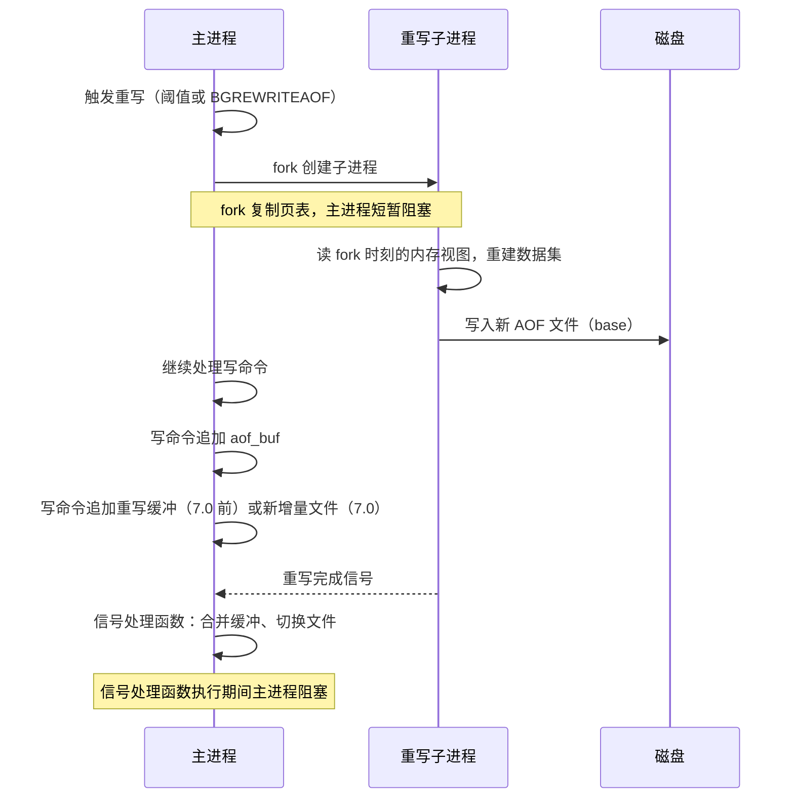
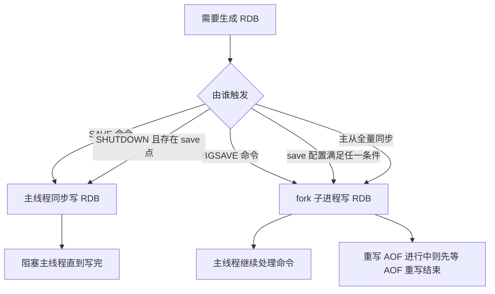

---
tags:
  - 中间件/Redis
---

# 持久化：AOF、RDB 与混合持久化

Redis 把数据放在内存里，读写快，代价是进程一退出内存内容就没了。持久化要回答的是「进程重启之后，磁盘上还剩多少、恢复成什么样、丢的那一段有多宽」。本篇讲 Redis 提供的三条落盘路径——RDB 快照、AOF 日志，以及 4.0 之后把两者拼在一起的混合持久化——它们各自把什么写到磁盘、在什么时刻写、崩溃时会丢哪一段，以及 fork 与写时复制给主线程带来的阻塞代价。

默认值与版本行为以 Redis 7.x 为准，配置项取自 7.0 分支的 `redis.conf` 与 `src/`。大量旧资料里按 7.0 之前版本叙述的地方，主要在 `save` 默认点和单文件 AOF 的组织方式两处，会在正文点出，跨版本差异集中写在「版本演进」一节。

## 1. 持久化要解决什么

内存数据库的持久化不是「把内存同步到磁盘」这么简单。磁盘上的副本越新、写入路径上的同步点越多，主线程被拖住的时间就越长。Redis 用两套互补的机制在「丢多少」和「慢多少」之间划分档位，理解它们的边界要先看清一件事：Redis 说的「不丢数据」指的是一个由刷盘参数决定的窗口，从来不是绝对值。

### 1.1 「不丢数据」在 Redis 里的真实语义

Redis 的写命令在主线程里执行完，返回值已经发给客户端，此时数据只存在于内存和内核缓冲区。真正决定「宕机后这份修改还在不在」的，是这份修改有没有被 `fsync` 到磁盘。`fsync` 由 `appendfsync` 控制，默认 `everysec`，官方文档对它的描述是「每秒 `fsync` 一次，快，但灾难发生时可能丢 1 秒数据」（来源：Redis Documentation, Redis persistence）。这意味着默认配置下，「Redis 保存成功」这个返回值的语义是「数据进了内存，最多丢 1 秒」，而不是「数据已经落到磁盘」。

把这句话展开成一条链：一条 `SET` 执行完成后，命令被追加到进程内的 `aof_buf`；事件循环在每轮循环里把 `aof_buf` 通过 `write()` 交给内核，数据进入 page cache；后台或主进程再按策略调用 `fsync()`，内核把 page cache 刷到盘。`write()` 返回不代表落盘，它只代表数据交给了操作系统。断电时 page cache 里的内容会丢，所以「从 `write()` 返回」到「`fsync()` 返回」之间，就是持久化的裸露窗口。

```text
   一条写命令在持久化上的时间线（appendfsync 默认 everysec）

   主线程执行 SET ──▶ 追加 aof_buf ──▶ write() ──▶ page cache ──▶ fsync() ──▶ 磁盘
        │                  │              │            │            │
        │                  │              │            │            └ 落盘，此前的修改安全
        │                  │              │            └ 断电即丢（尚未 fsync）
        │                  │              └ write 只把数据交给内核
        │                  └ 尚未 write 的部分，进程崩溃也会丢
        └ 返回客户端时，以上都还没保证

   窗口宽度 = fsync 的调用间隔：
     always   → 每个事件循环 ≈ 0
     everysec → ≤ 1 秒（正常），磁盘卡顿时可能拉长到约 2 秒
     no       → 交给内核，Linux 默认约 30 秒
```

窗口宽度由策略决定，而策略的取舍又反过来受大 Key 和后台重写影响（§3、§10）。先把「窗口」这个概念立住，后面每一处结论都能落到「这个操作把窗口开到了多宽」上。

### 1.2 四条落盘路径与各自的边界

Redis 的持久化选项有四种组合，官方文档把它们列成四条路径（来源：Redis Documentation, Redis persistence）。它们的差异集中在三处：写的是数据还是命令、写入的触发时机、恢复时的代价。

| 路径 | 落到磁盘的是什么 | 触发时机 | 崩溃丢什么 | 恢复代价 |
| --- | --- | --- | --- | --- |
| 无持久化 | 无 | — | 全丢 | — |
| RDB 快照 | 某一时刻的全量内存数据（二进制） | `save` 时间点、`BGSAVE`、`SHUTDOWN`、主从全量同步 | 上次快照之后的所有修改 | 直接读入内存，快 |
| AOF 日志 | 每条写命令的 RESP 文本 | `appendfsync` 决定刷盘时机 | `fsync` 间隔内的修改 | 逐条重放命令，慢 |
| 混合持久化 | 前半 RDB 全量 + 后半 AOF 增量 | 跟着 AOF 重写走 | 重写完成到崩溃之间的增量 | 前半快、后半重放 |

RDB 与 AOF 的一个结构性差别值得单独记住：RDB 恢复时把二进制直接读回内存，不需要再执行命令；AOF 恢复时把日志里的命令一条条重新执行。命令重放是单线程的，日志越大恢复越慢。这条差别是混合持久化存在的全部理由——让绝大部分数据走 RDB 的快路径，只有重写之后的一小段增量走 AOF 的重放路径。

```text
   四条路径在「丢多少 ↔ 慢多少」上的位置

   快 ◀────────────────────────────────────────▶ 安全
   无持久化 ── RDB 快照 ── everysec AOF ── always AOF
      │           │              │              │
      │           │              │              └ 每次事件循环 fsync
      │           │              └ 每秒 fsync，丢 ≤1s
      │           └ 丢上次快照之后的一段（可达数分钟）
      └ 重启即空

   混合持久化不是第五个档位：它把「恢复路径」从 AOF 换成「RDB 打底 + AOF 收尾」，
   丢数据窗口仍由 appendfsync 决定，改的只是同样窗口下的恢复速度
```

这里有一处常被忽略：**RDB 与 AOF 可以同时开启**。官方文档明确，两者同时启用时重启会优先用 AOF 重建数据，因为它「保证是最完整的」（来源：Redis Documentation, Redis persistence）。选择权在恢复时刻，不在配置时刻，这条规则在「崩溃恢复」一节展开。

## 2. AOF：写命令怎么变成日志

AOF（Append Only File）的思路是把每条会改变数据集的命令按执行顺序追加到一个文件，重启时把文件里的命令重新执行一遍。它记录的是「怎么改」，与 RDB 记录「改完是什么」相对。本节先把命令从执行到落盘的链路铺开，再讲清它与 MySQL `redo log` 的一个根本差别——写日志发生在命令执行之前还是之后。

### 2.1 从命令执行到 aof_buf 与 flushAppendOnlyFile

开启 AOF 的配置项是 `appendonly yes`，Redis 7.0 的默认值是 `no`（来源：redis/redis 7.0 `redis.conf`，`appendonly no`）。开启后，处理写命令的路径上多出三段：追加缓冲、事件循环写文件、按策略 fsync。

1. **执行命令并追加缓冲。** 主线程执行完一条写命令后，把这条命令按 RESP 协议编码，追加到 `server.aof_buf`。这一步只是内存里的字符串拼接，不碰磁盘。命令按 RESP 数组编码，`SET name xiaolin` 编码成 `*3\r\n$3\r\nset\r\n$4\r\nname\r\n$7\r\nxiaolin\r\n`：`*3` 表示三个参数，`$3` 是 `set` 的字节长度，`$4`、`$7` 分别是 `name` 与 `xiaolin` 的长度（来源：Redis Documentation, Protocol specification）。
2. **事件循环写文件。** Redis 的 `beforeSleep` 钩子在每轮事件循环里调用 `flushAppendOnlyFile`，把 `aof_buf` 里的内容通过 `write()` 写进 AOF 文件，数据进入内核 page cache。这个函数是 AOF 落盘路径的唯一出口，三种 `appendfsync` 策略的分叉就在这里（来源：redis/redis 7.0 `src/aof.c`，`flushAppendOnlyFile`）。
3. **按策略 fsync。** `always` 在本次 `flushAppendOnlyFile` 里立刻 `fsync`；`everysec` 记录上次 fsync 的时间，距上次超过一秒才 fsync，正常由后台线程执行；`no` 完全不主动 fsync。

```text
   AOF 写入链路（7.0）

   客户端写命令
      │
      ▼
   主线程执行 ──▶ 追加 server.aof_buf（内存）
      │
      ▼  每轮事件循环 beforeSleep
   flushAppendOnlyFile()
      ├─ write()  ──▶ AOF 文件（进 page cache，未落盘）
      └─ fsync()  ──▶ 真正落盘
            ├─ always  ：本次循环立即 fsync
            ├─ everysec：距上次 ≥1s 时由后台线程 fsync
            └─ no      ：从不主动 fsync，交给内核
```

`flushAppendOnlyFile` 的设计里有一处工程细节值得记住：`write()` 可能因为磁盘满或管道断开而写不完整，函数会把没写进去的部分留在 `aof_buf` 里，下一轮循环接着写，同时把 `aof_last_write_status` 置为 `err`。于是「AOF 写失败」不会当场丢掉数据，它会先在缓冲里堆积，直到 Redis 按 `aof-load-truncated` 与拒写策略决定下一步——这也是磁盘满时 Redis 拒写新命令的来源之一（§14）。

**只有真正改变数据集的命令才进 AOF。** 读命令（`GET`、`HGET` 等）不记录；写命令若没有产生实际修改也可能被跳过——Redis 用 `server.dirty` 计数跟踪「这次执行到底改了几处数据」，dirty 为 0 的命令不追加到 `aof_buf`。这条规则带来一个判读含义：`SET k v` 把值改成相同内容、`SINTERSTORE` 计算结果为空，都可能不出现在 AOF 里，AOF 的体积因此反映的是「真实修改量」而不是「收到的命令数」。

**非确定性命令在写 AOF 前被改写成确定形式。** `SPOP`、`SRANDMEMBER`、`RANDOMKEY`、`TIME` 这类命令的执行结果依赖随机数或时钟，直接重放会得到不同结果。Redis 在传播到 AOF（以及复制）时把它们换成等价的具体操作，例如把「随机弹出若干元素」记成「删除这几个具体的元素」，把相对时间的 `EXPIRE`/`SETEX` 记成绝对时间的 `PEXPIREAT`。恢复时重放的因此是确定操作，结果与执行时一致。**事务的原子性也靠 AOF 承载**：`MULTI`/`EXEC` 包裹的多条命令在 AOF 里同样包在 `MULTI`/`EXEC` 之间，恢复时整段一起重放。

**过期键的删除在主从两侧处理不同。** 主节点主动删除一个过期键时，会往 AOF 写一条等价的删除命令（`DEL`/`UNLINK`）；从节点不主动删过期键，只等主节点同步过来的删除命令执行。这保证了主从与 AOF 三处对「这个键什么时候消失」有一致的记录，避免了各自按本地时钟删键导致的不一致。

`aof_buf` 是进程内的一段 `sds` 缓冲，它的当前长度可以从 `INFO persistence` 的 `aof_buffer_length` 读到（来源：redis/redis 7.0 `src/server.c`，INFO persistence 段）。正常情况下它很小，因为每次事件循环都会把它排空；它在磁盘跟不上时会堆积变大，是「AOF 写盘落后」的一个直观信号（§14）。

### 2.2 AOF 是写后日志：与 MySQL redo 的对照

AOF 与 MySQL 的 `redo log`（见 [[07-日志、Buffer Pool 与崩溃恢复]]）看起来都是「日志」，但写入时机相反，这个差别决定了两者在崩溃恢复里扮演的角色。

MySQL 的 redo 是**写前日志**（write-ahead log）：修改数据页之前先把 redo 写进缓冲，提交时保证 redo 落盘，数据页可以晚很久再刷。InnoDB 因此允许数据页落后于日志，恢复时用 redo 前滚补齐。Redis 的 AOF 是**写后日志**：命令先执行、先把内存改完，再把这个已经成功执行的命令追加到日志。两者的读写方向完全相反。

写后日志带出两条好处。**一是省掉命令合法性检查。** 只有执行成功的命令才会进日志，日志里不会有语法错误或执行到一半失败的命令，恢复时逐条重放不必再做校验。若改成写前日志，就必须先解析、检查命令再执行，多一道开销。**二是写日志这一步不阻塞当前命令的返回值。** 命令已经执行完、结果已经确定，追加缓冲发生在结果之后，不影响这条命令本身的正确性。

代价同样明确。**修改与记日志之间存在一个窗口。** 命令执行成功、但还没 `write`+`fsync` 到磁盘时宕机，这份修改就丢了——这正是 §1.1 里那条时间线。窗口宽度由 `appendfsync` 决定，`always` 把它压到最小，`no` 放到最大。**记日志本身仍在主线程。** AOF 缓冲的追加和 `flushAppendOnlyFile` 的 `write()` 都在主线程的事件循环里完成，只是在返回结果之后。若磁盘 I/O 压力大导致 `write()` 变慢，拖住的是**后续**命令，当前命令已经返回了。这也解释了 §3.1 里大 Key 配 `always` 为什么危险：那次 `fsync` 卡在主线程的事件循环里，后面排队的命令全部要等。

| 维度 | Redis AOF（写后日志） | MySQL redo（写前日志） |
| --- | --- | --- |
| 记录时机 | 命令执行成功后追加 | 修改数据页前写入 |
| 记录内容 | 完整的写命令（可重放） | 对数据页的物理改动（前滚） |
| 数据可见性与日志的关系 | 内存先变，日志后写 | 日志先写，数据页后刷 |
| 崩溃恢复动作 | 逐条重放已记录的命令 | 从检查点前滚重放 |
| 幂等性要求 | 重放命令要求命令本身可重复执行 | 物理页重放天然幂等 |
| 主要风险 | 执行成功但未落盘的部分丢失 | 日志环写满导致写入停顿 |

写后日志还带来一个容易踩的坑：**同样的命令重放多次，结果未必和主线程执行一次相同**。`INCR` 这类命令本身没有随机性，重放安全；但 Redis 会把这些有随机性的命令改写成确定性形式再写 AOF（例如把 `SPOP`、`RANDOMKEY`、带 `EX` 的 `SET` 转成等价的具体操作），保证重放结果与执行时一致。理解这一点，才能理解为什么 AOF 文件里的命令有时看着和客户端发的不完全一样。

## 3. 三种写回策略与丢数据窗口

`appendfsync` 的三个取值把「丢多少」和「主线程多慢」切成三档。它们只在控制一件事：`fsync()` 什么时候被调用。`write()` 把数据交给内核这一步三档都做，差别全在什么时候命令内核把 page cache 刷到磁盘。本节把三档的窗口算清楚，再单独讲 `everysec` 的两秒边界。

### 3.1 always / everysec / no 各丢多少

官方文档对三档的描述是（来源：Redis Documentation, Redis persistence）：

- `appendfsync always`：每次有新命令追加就 `fsync`。**很慢、很安全**。文档同时说明，命令是「一批客户端命令或管道执行完之后」才追加并 fsync，所以多次并行写会尝试合并成一次 fsync（组提交）。
- `appendfsync everysec`：每秒 `fsync` 一次。**够快**（2.4 之后与快照相当），灾难时**可能丢 1 秒数据**。这是建议值也是默认值。
- `appendfsync no`：从不 `fsync`。更快、更不安全。Linux 在这种配置下**通常每 30 秒**刷一次，但取决于内核的具体调参。

把三档的窗口、代价与观测放在一起：

| 策略 | fsync 时机 | 最坏丢多少 | 主线程代价 | 相应的 INFO 信号 |
| --- | --- | --- | --- | --- |
| `always` | 每批命令执行后立即 fsync | 约 0（仅当前批次未 fsync 的） | 每次事件循环一次 fsync，吞吐受磁盘 IOPS 限制 | `aof_delayed_fsync` 通常为 0 |
| `everysec` | 距上次 ≥1 秒时 fsync | 约 1 秒（磁盘卡顿时可到约 2 秒） | fsync 在后台线程，主线程仅在磁盘卡顿时被拖 | `aof_delayed_fsync` 增长说明后台 fsync 卡顿 |
| `no` | 从不主动 fsync | 由内核决定，Linux 默认约 30 秒 | 主线程几乎不因 fsync 停顿 | `aof_delayed_fsync` 恒为 0，但窗口不可控 |

```text
   三种策略在同一段时间轴上的丢数据窗口（纵轴为已写入数据）

   always   ├►fsync├►fsync├►fsync├►fsync├►fsync┤   窗口 ≈ 0
   everysec ├──────┼──►fsync ─────┼──►fsync ─────┤ 窗口 ≤1s
                    ▲             ▲
                    丢到上一次 fsync
   no       ├────────────────────────────────────┤ 窗口 ≈ 30s（内核决定）
                    ▲
                    丢到内核上一次回写

   ▶ 表示一次落盘动作；两个 ▶ 之间的距离就是裸露窗口
```

`everysec` 是默认值，选它的理由写在官方配置注释里：「速度与数据安全之间通常正确的折中」（来源：redis/redis 7.0 `redis.conf`）。`always` 支持组提交，在并发写入很高时能把多个事务的 fsync 合并成一次，所以它慢的绝对值取决于并发度；`no` 快，但把「什么时候落盘」交给内核，运维层拿不到保证。

### 3.2 everysec 的两秒边界与主线程关系

`everysec` 的 1 秒窗口有一个容易忽略的边界：当一次 `fsync` 因为磁盘长时间不返回（常见于云盘限流、机械盘排队、与后台重写争 I/O）而超过 1 秒时，Redis 会**推迟主线程的 `write`**，最长推迟到约 2 秒，以避免 `write()` 在 fsync 未完成时不必要地阻塞。这段逻辑在 `flushAppendOnlyFile` 里：后台 fsync 未完成时，若推迟时间还不到两秒就继续等，超过两秒就放弃等待、照常写，并给 `aof_delayed_fsync` 加一，同时打日志「Asynchronous AOF fsync is taking too long (disk is busy?)」（来源：redis/redis 7.0 `src/aof.c`，`flushAppendOnlyFile`）。官方文档另外给出「最多丢约 30 秒」的说法，那是描述 `no-appendfsync-on-rewrite yes` 的场景（来源：redis/redis 7.0 `redis.conf`），与这里的 2 秒不是同一件事。

这里要把「谁在执行 fsync」分清楚。`everysec` 的 fsync 不在主线程里同步做，它交给后台线程（`bio`），主线程只负责 `write()`。因此正常情况下主线程不会被 fsync 的耗时直接卡住。可一旦磁盘卡顿传入 `write()` 这个同步系统调用，主线程仍会停在这行调用上，表现为命令延迟抖动。`INFO persistence` 里的 `aof_delayed_fsync` 专门计这种「因为后台 fsync 未完成而推迟 write」的次数，它是判断「磁盘是不是在拖 AOF 后腿」的第一手信号（来源：redis/redis 7.0 `src/server.c`，INFO persistence 段）。

```text
   everysec 下主线程与后台 fsync 的分工

   主线程（事件循环）                后台 bio 线程
      │                                │
   写命令 → aof_buf                    │
      │                                │
   write() ──▶ page cache             │
      │                                │
   距上次 ≥1s？ ──是──▶ 提交 fsync 任务 ─┘
      │                                │
      │◀── fsync 未完成则推迟 write ─────┤（推迟上限约 2 秒）
      ▼                                ▼
   继续处理命令                      fsync 返回，刷新时间戳

   └─ aof_delayed_fsync 增长 = 后台 fsync 拖慢，主线程被连带推迟
```

这也解释了一个观测现象：磁盘健康时 `everysec` 的主线程延迟几乎不受 AOF 影响；磁盘一旦排队，`aof_delayed_fsync` 增长、命令 P99 抖动同步出现，而 `aof_last_write_status` 仍是 `ok`——因为 fsync 最终成功了，只是慢。

### 3.3 策略选择与一致性窗口的推导

选策略其实是选「能接受多宽的一致性窗口」。把窗口和业务语义对上，三档的适用面就清楚了。

- **不能丢已确认的写**：用 `always`。它的语义最接近「返回成功即落盘」，代价是每次事件循环一次 fsync，写入吞吐被磁盘 IOPS 与组提交效果决定。
- **能接受丢约 1 秒**：默认的 `everysec`。这是绝大多数业务的档位——丢失窗口以一个 fsync 周期为单位，秒级。
- **把 Redis 当纯缓存、丢了能回源**：用 `no`，或干脆关掉 AOF 只留 RDB（§7）。把落盘交给内核，省掉主动 fsync 的开销。

一致性窗口的推导很直接：一条写命令返回给客户端后，如果此刻断电，会丢的是「上一次成功 fsync 之后写入的全部命令」。所以窗口上界等于「两次 fsync 的间隔」，与这条命令自身在缓冲里的位置无关。`always` 把间隔压到「一批命令执行完」这个量级，`everysec` 把它定在 1 秒，`no` 交给内核的 30 秒回写周期。选择时不应只看平均值，要看最坏情况下能接受多大的窗口——`everysec` 的平均丢失远小于 1 秒，但上界仍是 1 秒左右，规划时要按上界而不是按均值留余量。

## 4. AOF 重写：把日志压回最新状态

AOF 文件随写入量单调增长，同一个键被改一百万次，就留下一百万条命令，其中绝大多数对重建当前状态没有用。AOF 重写解决的就是这个问题：它不追加命令，而是**重新生成一个只含「重建当前数据集所需最少命令」的新文件**。本节讲重写读什么、什么时候触发，以及 7.0 之前它怎么落地。

### 4.1 重写的数据源是内存数据集

重写的输入是**当前内存里的数据集**，旧 AOF 文件不参与。子进程扫描数据库里的所有键值对，为每个键生成一条能重建它的命令，写进新文件。旧的 `SET name xiaolin` 与后来的 `SET name xiaolincoding` 在重写后只剩 `SET name xiaolincoding` 这一条，因为它在内存里就是当前的状态（来源：Redis Documentation, Log rewriting）。

这里有一个必须区分的点：重写后的文件仍然是**命令流**，只不过是最小命令集。它和 RDB 的二进制全量快照是两种东西——AOF 重写产生的是可读的 RESP 命令，恢复时要重放；RDB 产生的是二进制,恢复时直接读入（§7、§9）。混合持久化之所以叫「混合」，就是让重写产生的这个「全量」段改用 RDB 格式（§9.1）。

重写机制有一个安全边界：**新文件写失败不能污染旧文件**。7.0 之前的做法是把新 AOF 写进一个临时文件，只有全部写完、主进程把重写缓冲追加进去之后，才用一次 `rename()` 原子地替换旧文件（来源：Redis Documentation, Log rewriting）。这样重写中途失败，删掉临时文件即可，旧 AOF 完好。7.0 把这套机制换成了 manifest 切换（§6）。

### 4.2 重写什么时候被触发

重写有两种触发方式。一种是显式命令 `BGREWRITEAOF`，客户端或运维直接发起。另一种是自动触发，由两个参数控制（来源：redis/redis 7.0 `redis.conf`）：

- `auto-aof-rewrite-percentage 100`：当前 AOF 大小比「上次重写后的大小」增长超过这个百分比就触发。默认 100 表示「体积翻倍」触发一次。设成 0 关闭自动重写。
- `auto-aof-rewrite-min-size 64mb`：AOF 至少达到这个大小才考虑重写，避免文件还很小、只是翻倍就频繁重写。

两者的关系是「且」：增长百分比够了、体积也过了下限，才触发。配置注释里对此的说明是：Redis 记住上次重写后的 AOF 大小（若启动后没重写过，就用启动时的大小）作为基准，与当前大小比较（来源：redis/redis 7.0 `redis.conf`）。所以判断重写时机要读的是 `aof_current_size` 与 `aof_base_size` 的比值，而不是文件绝对大小。

```text
   AOF 自动重写的触发判定

   基准 = aof_base_size（上次重写后的大小；未重写过则取启动时大小）
   当前 = aof_current_size

   (当前 - 基准) / 基准 ≥ 100%   ──┐
                                  ├── 两者同时满足 ⟹ 触发 BGREWRITEAOF
   当前 ≥ 64mb                    ──┘

   └─ 单看「当前很大」不足以触发：基准也很大时，翻倍需要更多绝对增量
```

重写也有一个与 RDB 互斥的规则：官方文档明确，Redis 会避免在 RDB 快照进行时触发 AOF 重写，也不允许在有 AOF 重写进行时执行 `BGSAVE`，防止两个后台进程同时做重 I/O；若用户在快照进行时显式请求 `BGREWRITEAOF`，服务器返回成功状态但把重写排到快照之后（来源：Redis Documentation, Interactions between AOF and RDB persistence）。这条规则直接解释了一个运维现象：在 RDB 快照很重的实例上，AOF 重写会被推迟，`aof_current_size` 一直涨而 `aof_rewrites` 不增。看到「AOF 该重写却没重写」时，先查 `rdb_bgsave_in_progress` 是否为 1，再下结论。

### 4.3 7.0 之前的落地方式：临时文件加 rename

7.0 之前的 AOF 是**单个文件**（默认 `appendonly.aof`）。重写流程是：父进程 `fork` 出一个子进程，子进程把内存数据集重建后写进一个**临时新文件**；与此同时父进程照常把新命令写进**旧 AOF 文件**，并把重写期间的新命令**另存进一块进程内内存缓冲**（重写缓冲）。子进程写完，父进程收到信号，把重写缓冲追加到临时文件末尾，再用一次 `rename()` 原子地把临时文件覆盖成正式 AOF（来源：Redis Documentation, Log rewriting，Redis < 7.0 段落）。

这套流程有两个设计意图。**写临时文件再 rename，保证重写失败不污染旧文件**：重写中途崩溃，旧 AOF 仍完整，重启能正常恢复，只是白做了一次重写。**父进程在重写期间双写**：新命令既进旧 AOF（保底），又进重写缓冲（补全），这样无论重写成功与否，日志链都不丢命令。

代价集中在两点。一是**重写期间磁盘上要同时容纳旧文件与临时文件**，重写大库时磁盘用量接近翻倍。二是**信号处理与 rename 期间主进程阻塞**（§5.2）。7.0 的 multi-part AOF 把这两点分别改掉：不再需要「临时文件整体换旧文件」，改用 manifest 原子切换；失败重试也加了退避，避免反复失败反复建增量文件（来源：redis/redis 7.0 `redis.conf`，AOF 文件命名与 manifest 说明）。

## 5. AOF 后台重写：fork 与两个缓冲区

重写要扫描整个内存数据集，放在主线程做会卡住所有命令，所以 Redis 用「`fork` 子进程 + 父进程继续服务」的方式把它挪到后台。这套方案的关键全在 `fork` 的语义上：子进程拿到的是 fork 那一刻的内存视图，父进程随后的修改它看不到。本节讲清楚父子进程之间的数据流，以及主进程被阻塞的两个窗口。

### 5.1 fork 与父子进程的数据流

`fork` 系统调用创建子进程时，操作系统给子进程复制一份**页表**，页表记录虚拟地址到物理地址的映射；物理内存本身不复制，父子进程的页表暂时指向同一批物理页，且这些页的权限被标为只读（来源：Linux fork(2)/COW 语义）。这个「复制页表、不复制物理内存」的做法让 `fork` 的代价与**页表大小**成正比，而不是与物理内存大小成正比。

```text
   fork 之后的父子进程地址空间

   父进程页表 ──┐                     ┌── 子进程页表（fork 时复制）
                │                     │
                ▼                     ▼
         ┌───────────────────────────────────────┐
         │  同一批物理页（权限：只读）              │
         │  key A │ key B │ key C │ … │ 大数据块   │
         └───────────────────────────────────────┘
                ▲
                │ 任一方写入某页 ⟹ 触发写保护中断
                │ ⟹ 复制该页，改为可写，两边各持一份
                └─ 未写入的页保持共享，不产生额外内存
```

子进程基于 fork 那一刻的内存视图重建数据集，父进程继续处理新命令。这里就出现**数据不一致**：子进程读到的是 fork 时的旧值，父进程随后可能改了同一个键。例如 `key A` 在 fork 时是 `1`，子进程正要把它写成 `SET A 1`，父进程已经把内存里的 `A` 改成了 `2`。若不管，重写出来的新 AOF 会把 `A` 记成 `1`，与父进程当前状态不符。

解决办法是**重写缓冲**：创建重写子进程后，父进程每执行一条写命令，除了追加 `aof_buf`，还同时追加到一个专门的缓冲区；子进程写完后，父进程把这块缓冲里的内容补进新 AOF 的末尾，让新文件反映 fork 之后发生的所有修改（来源：Redis Documentation, Log rewriting）。在 7.0 里，这块「缓冲」改成了父进程新开的一个**增量 AOF 文件**——父进程直接把新命令写进新增量文件，代替了内存缓冲（来源：Redis Documentation, Log rewriting，Redis >= 7.0 段落）。



回到前面提过的「重写读内存不读旧 AOF」：正因为它读的是内存视图，「fork 之后父进程的修改」才需要靠第二条数据流（缓冲或增量文件）补回来。两条数据流合起来，才是重写后文件的完整内容。

**为什么用子进程而不是线程。** 多线程共享同一份地址空间，改共享数据要加锁；重写要遍历整个数据集，加锁会把主线程的读写路径全部拖慢。子进程通过 `fork` 拿到一份独立的地址空间（物理页暂时共享），父子进程各自写自己的页，不需要在数据集上加锁。这是选进程而非线程的核心理由：用「地址空间隔离」换掉「锁」。代价是进程间只能靠信号与管道通信，重写完成的通知、重写期间的增量传递都得另设通道——这就是下面两条数据流存在的背景。

需要分清「两条数据流」在 7.0 前后的名字变化。**AOF 缓冲区**（`aof_buf`）始终存在，它是所有新命令的必经之路，用于正常落盘。**第二条流**在 7.0 前叫「AOF 重写缓冲区」，是进程内一块内存，只在重写期间启用；7.0 起它被替换成一个**新的增量 AOF 文件**，父进程把重写期间的新命令直接写进这个文件。名字变了，职责没变：都是「把 fork 之后父进程的修改补回重写结果里」。区分它们的意义在于排障——7.0 实例上没有「重写缓冲大小」这个可读数字，要改成看增量文件的大小与数量。

### 5.2 主进程的两个阻塞窗口

后台重写的名字容易让人以为「主进程完全不阻塞」。实际有两处会卡住主进程（来源：Redis Documentation, Log rewriting）：

- **`fork` 期间**：内核要给子进程复制父进程的页表等数据结构。页表越大，复制越久，父进程阻塞越久。页表大小大致与内存中页的数量成正比，所以内存数据集越大，`fork` 越慢。观测指标是 `INFO stats` 里的 `latest_fork_usec`——「最近一次 fork 操作的耗时，单位微秒」（来源：redis/redis 7.0 `src/server.c`，INFO stats 段）。
- **信号处理函数执行期间**：子进程写完发信号，父进程的信号处理函数要把重写缓冲（或增量文件）合并进新文件，再完成文件切换。这一步在主进程里同步执行，期间主进程不处理命令。

```text
   后台重写的时间轴与两处阻塞

   主进程 ──┬─ fork ────────────────────────────────────┬─ 信号处理 ──► 继续
            │   ▲阻塞（复制页表）                        │   ▲阻塞（合并+切换）
            │                                           │
   子进程   └───────── 重建数据集、写新 AOF ────────────┘
                                    （此段主进程正常服务）

   latest_fork_usec = 最近一次 fork 阻塞时长；超 1 秒需优化（§14）
   写时复制发生在共享页被写时，是 fork 之后、分散在整个重写期间的第三类停顿
```

除这两处外，还有一类分散的停顿：**写时复制**。重写期间父进程每改一个共享页，内核就要复制那一页。改的是大 Key 时，一次复制可能涉及大量页，父进程会在那一刻停顿（§8）。`fork` 阻塞与 COW 停顿可以分别通过 `latest_fork_usec` 和 `current_cow_size` 观测。

## 6. 7.0 的 multi-part AOF

7.0 对 AOF 的存储组织做了一次结构性改动：单个 `appendonly.aof` 变成 `appendonlydir/` 目录下的**一组文件**，由一份 manifest 记录清单与顺序。这套机制在官方 release notes 与源码里的名字是 **Multi-Part AOF**（缩写 MP-AOF），随 7.0 引入（来源：redis/redis 7.0 `00-RELEASENOTES`，原文 `Multi-Part AOF mechanism to avoid AOF rewrite overheads (#9788)`）。

它真正要消掉的是旧版 AOF 重写（AOFRW）的三笔开销，「单文件」这个形态本身只是顺带的结果。官方设计说明把这三笔逐条列了出来（来源：redis/redis PR #9788 描述）：

| 旧版 AOFRW 的开销 | 具体表现 |
| --- | --- |
| **内存** | 重写期间到达的写命令要同时攒进一个**内存重写缓冲**，写入量大时占用可观 |
| **主进程停顿** | 重写完成那一刻，主进程要把缓冲里剩下的部分排干并 `fsync`，这段是同步的，数据量越大停得越久 |
| **磁盘双写** | 重写期间到达的数据要**同时**写进旧的 AOF 与新的 AOF，同一份数据落两次盘 |

MP-AOF 的核心动作是**删掉那个内存重写缓冲** —— 重写期间的新命令直接追加进一个新的增量文件，于是这三笔开销一起消失。这也解释了为什么新版 `appendonlydir/` 里会同时躺着多个 `incr` 文件：它们是重写之间累积的多段增量，属于正常形态。本节讲这套文件组织与新旧对照。

### 6.1 appendonlydir 与 manifest

7.0 起，AOF 文件被拆成两类（来源：redis/redis 7.0 `redis.conf`；Redis Documentation, Log rewriting）：

- **base 文件**（base file）：至多一个，代表 AOF 重写时的全量快照，格式可以是 RDB 或 AOF 命令流（由 `aof-use-rdb-preamble` 决定，§9.1）。
- **incr 文件**（incremental file）：可以有多个，包含 base 文件创建之后追加的增量命令。
- **manifest 文件**：记录这些文件的清单与应当应用的顺序。

文件名按固定规则生成。若 `appendfilename` 是 `appendonly.aof`，则可能得到 `appendonly.aof.1.base.rdb`（base 文件）、`appendonly.aof.1.incr.aof`、`appendonly.aof.2.incr.aof`（增量文件）、`appendonly.aof.manifest`（manifest）。所有文件都放在由 `appenddirname` 指定的目录下，默认 `appendonlydir`（来源：redis/redis 7.0 `redis.conf`，`appenddirname "appendonlydir"`）。

```text
   appendonlydir/ 的构成（Redis 7.0）

   appendonlydir/
     ├─ appendonly.aof.manifest        ← 清单：按序记录下面哪些文件、什么类型
     ├─ appendonly.aof.1.base.rdb      ← base 文件（全量，RDB 格式；至多一个）
     ├─ appendonly.aof.1.incr.aof      ← 增量文件（base 之后的新命令）
     └─ appendonly.aof.2.incr.aof      ← 再往后的增量文件

   恢复顺序 = manifest 里记录的顺序：先 base，再按序应用每个 incr
   └─ manifest 是唯一入口：换掉 manifest 就等于换了一整套 AOF 文件
```

两条实现约束值得一并记住（来源：redis/redis PR #9788 描述）：① **只有最后一个 AOF 文件可以被截断**（无论它是 base 还是 incr）—— 更早的文件出现截断时 Redis 直接退出，即使 `aof-load-truncated` 开着；② 不再被 manifest 引用的历史文件由自动 GC 清理，`aof-disable-auto-gc` 可以关掉它（官方注明该配置目前主要供测试用）。

### 6.2 重写期间不再整体替换

7.0 重写时的数据流与旧版不同（来源：Redis Documentation, Log rewriting，Redis >= 7.0 段落）：

1. 父进程 `fork` 出子进程。
2. 子进程把新 base 文件写进一个临时文件。
3. 父进程**新开一个增量 AOF 文件**继续追加新命令。若重写失败，旧的 base 与增量文件加上这个新增量文件，已经代表完整的最新数据集，所以不会丢数据。
4. 子进程写完 base，父进程收到信号，用「新开的增量文件 + 子进程生成的 base 文件」构造一份**临时 manifest** 并持久化。
5. 父进程**原子地切换 manifest**，重写生效；随后清理旧 base 与不再使用的增量文件。

关键差别在于「生效」这一步：旧方案要 `rename()` 一个可能巨大的单文件，新方案只切换一份描述清单。切换前旧文件一直有效，切换后旧文件被清理，中途失败也不会污染可用数据。此外，7.0 引入了**重写限流**。它的具体规则是：重写连续失败**满 3 次**后，下一次延后 **1 分钟**执行；再失败则按 2、4、8、16 分钟递增，**上限 1 小时**。限流期间仍可用 `BGREWRITEAOF` 手动立即触发（来源：redis/redis PR #9788 描述）。这样反复失败时不会疯狂创建增量文件。

```text
   7.0 重写：manifest 原子切换

   切换前                          切换后
   manifest ──▶ [base.x, incr.1]   manifest ──▶ [base.new, incr.2]
                    ▲                                 ▲
              仍在被读取                        新的 base 生效
                          │
     子进程生成 base.new，父进程把新命令写进 incr.2
     两者都就绪 ⟹ 写一份临时 manifest ⟹ 原子替换
     └─ 失败则丢弃临时 manifest，旧的 [base.x, incr.1] 仍是完整数据
```

### 6.3 与旧版对照

把两代方案的差异列表看清楚，就能理解为什么「升级到 7.0 后 `appendonly.aof` 文件不见了、多出一个目录」不是故障：

| 维度 | 7.0 之前 | 7.0 起 |
| --- | --- | --- |
| 文件组织 | 单个 `appendonly.aof` | `appendonlydir/` 下 base + incr + manifest |
| 重写期间的新命令 | 存进程内内存重写缓冲 | 写进新的增量 AOF 文件 |
| 生效方式 | `rename()` 覆盖单文件 | 原子切换 manifest |
| 重写失败 | 删临时文件，旧文件完好 | 丢弃临时 manifest，旧文件集完好 |
| 磁盘占用 | 重写需同时容纳旧文件与临时文件 | 增量文件按需产生，占用更可控 |
| 失败重试 | 无专门退避 | 引入重写限流，重试间隔递增 |
| 持久化状态字段 | 依赖单文件大小 | 增加 `aof_base_size`、`aof_current_size` 等按文件统计 |

对照里有一条对排障直接有用：旧版的 `aof_rewrite_buffer_length` 在 7.0 的 `INFO persistence` 里已经不存在了，取而代之的是增量文件的大小与 manifest 组织。查 7.0 实例时不要照着旧资料找这个字段（来源：redis/redis 7.0 `src/server.c`，INFO persistence 段实测无该字段）。

## 7. RDB：某一瞬间的全量快照

RDB 把某一时刻的整个内存数据集序列化成二进制写进磁盘，恢复时直接读回内存，不走命令重放。它的优点是恢复快、文件紧凑，缺点是两次快照之间的修改没有落到磁盘，宕机就丢。本节讲 `SAVE`/`BGSAVE` 的区别、自动触发的判定、被谁触发，以及文件格式的骨架。

### 7.1 SAVE、BGSAVE 与自动触发

Redis 提供两个命令生成 RDB（来源：Redis Documentation, Snapshotting）：

- `SAVE`：在**主线程**里同步写 RDB。写入时间多长，主线程就阻塞多长，期间不处理任何命令。生产上基本不用。
- `BGSAVE`：`fork` 一个子进程写 RDB，主线程继续服务。这是自动保存与运维备份用的方式。

自动触发的配置项叫 `save`，但**实际执行的是 `BGSAVE`**。7.0 的默认配置是（来源：redis/redis 7.0 `redis.conf`，SNAPSHOTTING 段）：

```text
save 3600 1 300 100 60 10000
```

含义是三个「或」条件，任意满足一个就执行 `BGSAVE`：3600 秒内至少 1 次修改、300 秒内至少 100 次修改、60 秒内至少 10000 次修改。这里要标注一处版本差异：**旧资料里的默认点是 `900 1`、`300 10`、`60 10000`，那是 7.0 之前的行为**；7.0 把前两条改成了 `3600 1` 与 `300 100`（许多旧资料仍按 7.0 之前的版本叙述，属于过时说法）。

`save ""` 可以完全关闭自动快照。关闭后 RDB 只在显式 `BGSAVE`、`SHUTDOWN`（若还有 save 点）或主从全量同步时产生。



### 7.2 SHUTDOWN 与主从全量同步触发的快照

除 `save` 时间点，还有两条路径会产生 RDB（来源：redis/redis 7.0 `src/server.c`，`prepareForShutdown` 与复制相关逻辑）。

**收到 `SHUTDOWN` 时**，如果配置里还有 save 点（`server.saveparamslen > 0`）且没有指定 `NOSAVE`，Redis 会执行一次**阻塞的 `rdbSave`**（`server.c` 里 `rdbSave`，非后台版本），把当前内存落盘后再退出。这就是「正常关闭不丢数据」的机制；若显式 `SHUTDOWN NOSAVE`，则跳过保存。注意这里用的是同步 `rdbSave` 而不是 `BGSAVE`——进程都要退出了，不需要后台子进程。

**主从全量同步时**，主节点要为从节点生成一份 RDB 并发送。这条路径也走 `fork` 子进程（`rdbSaveBackground`）。在磁盘直连复制（diskless）下，RDB 不落盘而是直接写 socket；7.0 的 `repl-diskless-sync` 默认是 `yes`（来源：redis/redis 7.0 `redis.conf`，`repl-diskless-sync yes`），所以全量同步不一定真的在磁盘上留下 RDB 文件，但仍会 `fork`。这带出一个与持久化直接相关的连带效应：**主从频繁全量同步会让 `fork` 变频繁**，从而推高 `latest_fork_usec` 的观测值（§10.2 会把它列进 fork 耗时的成因）。

### 7.3 RDB 文件格式的骨架

RDB 文件是一段有明确结构的二进制，不能当纯文本直接读。它的骨架可以按字节读出来（来源：redis/redis 7.0 `src/rdb.c`、`src/rdb.h`）：

- **魔数与版本**：文件头 9 个字节是 `REDIS` 加上 4 位版本号。`rdbSaveRio` 里用 `snprintf(magic,sizeof(magic),"REDIS%04d",RDB_VERSION)` 生成，然后写入 9 字节（来源：`rdb.c`，`rdbSaveRio`）。7.0 的 `RDB_VERSION` 是 `10`（来源：`rdb.h`，`#define RDB_VERSION 10`），所以文件头是 `REDIS0010`。
- **辅助字段（AUX）**：版本号之后是若干 `RDB_OPCODE_AUX`（250）字段，记录诸如 `redis-ver`、`redis-bits`、`ctime`、`used-mem` 等元信息。
- **数据库与键值对**：每个数据库以 `RDB_OPCODE_SELECTDB`（254）开头，可跟一个 `RDB_OPCODE_RESIZEDB`（251）作为哈希表扩容提示，然后是逐条键值对。
- **过期与淘汰提示**：键前面可以带 `RDB_OPCODE_EXPIRETIME_MS`（252）或旧的 `RDB_OPCODE_EXPIRETIME`（253）表示过期时间，`RDB_OPCODE_IDLE`（248）、`RDB_OPCODE_FREQ`（249）用于 LRU/LFU 信息。
- **结尾**：以 `RDB_OPCODE_EOF`（255，即 `0xFF`）结束，其后是 8 字节的 CRC64 校验和（来源：`rdb.h` 的 opcode 定义）。

```text
   RDB 文件的字节骨架（Redis 7.0，RDB_VERSION = 10）

   ┌────────────┬──────────────────────────────────────────────┐
   │ REDIS0010  │ 魔数 "REDIS" + 4 位版本号（共 9 字节）         │
   ├────────────┼──────────────────────────────────────────────┤
   │ 0xFA AUX   │ 辅助字段：redis-ver / used-mem / ctime …      │
   ├────────────┼──────────────────────────────────────────────┤
   │ 0xFE SELECTDB  │ 选择库号，随后是该库的键值对          │
   │ 0xFB RESIZEDB  │ 哈希表容量提示                        │
   │ 0xFC EXPIRE_MS │ 键的过期时间（毫秒）                  │
   ├────────────┼──────────────────────────────────────────────┤
   │ 0xFF EOF   │ 文件结束                                       │
   ├────────────┼──────────────────────────────────────────────┤
   │ CRC64      │ 8 字节校验和（rdbchecksum yes 时写入）         │
   └────────────┴──────────────────────────────────────────────┘

   字符串默认用 LZF 压缩（rdbcompression yes）：能压则压，压不动则原样存
```

两个与持久化直接相关的参数控制这里的行为。`rdbcompression yes`（默认）让可压缩的字符串用 LZF 压缩，省磁盘与网络带宽，代价是写、读时多一步压缩/解压；设 `no` 换回一点 CPU。`rdbchecksum yes`（默认）在文件尾写 CRC64，加载时校验，能发现文件损坏，代价是保存与加载各多约 10%（来源：redis/redis 7.0 `redis.conf`，`rdbcompression`、`rdbchecksum` 段）。`rdbchecksum no` 时校验和写 0，加载端看到 0 就跳过校验。

校验和与压缩还有一个排障用途：`redis-check-rdb` 能独立于服务进程读一遍 RDB，验证结构、版本与校验和，是「RDB 文件到底能不能加载」的离线判据。看到 `Can't handle RDB format version` 一类报错，多半是文件由更高版本写出、当前实例版本读不了；看到校验和错误，则是文件在传输或落盘过程中损坏。两种报错的处理方向不同：前者是版本不匹配（换版本或用 `redis-check-rdb` 确认），后者是文件损坏（回退到上一个可用备份）。

## 8. fork 与写时复制

`BGSAVE` 与 `BGREWRITEAOF` 都靠 `fork` 把重活挪到子进程。`fork` 本身很快，因为内核复制的是页表而不是物理内存；真正让内存翻倍、让主线程停顿的是随后发生的**写时复制**（Copy-On-Write, COW）。本节把 COW 的机制、内存代价与大 Key 的放大效应讲透，这是判断「fork 会不会打挂实例」的核心。

### 8.1 COW 的页面复制与内存翻倍

COW 的规则很直接：`fork` 之后，父子进程的页表指向同一批物理页，且这些页被标为只读。任何一方要写某一页时，CPU 触发写保护中断，内核在中断处理里**复制这一页**，把两边的页表分别指向各自的副本并改为可写，然后才允许写（来源：Linux COW 语义）。没被写过的页保持共享，不产生任何额外内存。

对 `BGSAVE` 而言，子进程只读地遍历内存写 RDB，不触发 COW；触发 COW 的是**父进程**——主线程在快照期间接受写命令，每改一页就复制一页。这带出两个直接后果：

- **子进程看到的是 fork 那一刻的快照。** 若父进程在快照期间改了某个键，该键的物理页被复制，子进程页表仍指向旧页，于是 RDB 里写的是旧值。父进程刚改的值只能等下**下一次** `BGSAVE` 才进 RDB。若恰好在 RDB 写完那一刻宕机，这段期间的修改就丢了（来源：Redis Documentation, Snapshotting）。
- **最坏情况下内存接近翻倍。** 若快照期间父进程把**所有**共享页都改了一遍，每一页都被复制一份，进程总内存占用接近原先的 2 倍。写多的场景要专门盯快照期间的内存曲线（来源：Linux COW 语义）。

```text
   COW 的页面复制（fork 后父进程写某页）

   fork 后（共享，只读）              父进程写 key B 后
   ┌──────────────┐                  ┌──────────────┬──────────────┐
   │ 页 P (key B) │◀─ 父子共享       │ 页 P (旧值)  │ 页 P' (新值) │
   └──────────────┘                  └──────┬───────┴──────┬───────┘
        ▲          ▲                        ▲              ▲
    父进程页表   子进程页表              子进程页表     父进程页表
                                            │              │
   父进程写 P ⟹ 写保护中断 ⟹ 复制 P 为 P' ──┘              │
   └─ 子进程继续读旧 P，RDB 里 key B 是 fork 时刻的值        └─ 父进程改 P'

   内存代价 = 被父进程写过的页数 × 页大小 ⟹ 全部写过时接近翻倍
```

`INFO persistence` 里的 `current_cow_size`「当前 COW 累计分配的字节数」与 `current_cow_peak`「COW 峰值」就是把这个代价量化出来的字段（来源：redis/redis 7.0 `src/server.c`，INFO persistence 段）。盯这两个值，比盯「实例总内存」更早发现快照正在把内存推高。

### 8.2 大 Key 与内存大页放大 COW 代价

COW 的代价与「被复制的页数」成正比，所以它被两类因素放大。

**一是大 Key。** 一个键的 value 很大时，它在内存里横跨很多页。父进程只要改动这个大 Key 的一小部分，内核仍要以页为单位复制——但大 Key 的「热点页」数量本来就多，父进程改它时触发的复制量也大。重写或快照期间修改一个 bigkey 时，复制物理内存的过程会比较耗时，有阻塞主进程的风险（来源：Redis Documentation, Redis persistence）。`fork` 阻塞与 COW 停顿是两处独立的阻塞（§5.2），大 Key 主要放大的是后者。

**二是内存大页（THP）。** Linux 常规内存页是 4KB 粒度，透明大页（Transparent Huge Pages）支持 2MB 的大页分配。若开启了 THP，一次 COW 要复制的单位从 4KB 变成 2MB——即使客户端只改了 100 字节，也要复制整张 2MB 大页。单位放大了 512 倍，写操作被拖慢（来源：Linux THP 语义；redis/redis 7.0 redis.conf，disable-thp 段）。官方配置注释也指出，THP 会让 `fork` 与 COW 的代价上升。禁用方法是：

```bash
echo never > /sys/kernel/mm/transparent_hugepage/enabled
```

```text
   THP 关闭 vs 开启时的单次 COW 复制量

   关闭 THP（4KB 页）           开启 THP（2MB 页）
   改 100B 的键 ──▶ 复制 4KB      改 100B 的键 ──▶ 复制 2MB
                        │                              │
                   单位小，停顿短                 单位放大 512 倍，停顿长

   └─ 后果：fork 与快照期间的写操作延迟抖动，但内存占用在两种情况下都是「复制一页」
```

这两条合起来给出一条容量规划经验：**实例内存越大、大 Key 越多、写越频繁，快照/重写期间的 COW 峰值就越高**。规划内存时不能只按「数据量」算，要留出 COW 峰值余量，否则快照期间可能触发 OOM（§14）。

## 9. 混合持久化

RDB 恢复快但快照间隔内会丢，AOF 丢得少但恢复要重放命令。4.0 引入的混合持久化让重写产生的新 AOF 文件「前半段用 RDB 格式的全量数据、后半段用 AOF 格式的增量命令」，同时拿到快恢复与少丢失。本节讲它怎么开启、文件长什么样、恢复时按什么顺序读。

### 9.1 aof-use-rdb-preamble 与文件构成

开启混合持久化的配置项是 `aof-use-rdb-preamble yes`，7.0 的默认值就是 `yes`（来源：redis/redis 7.0 `redis.conf`，`aof-use-rdb-preamble yes`）。配置注释的说明是：AOF 的 base 文件可以用 RDB 或 AOF 两种格式生成，**用 RDB 格式始终更快、更省**，关闭它只是为了向后兼容（来源：redis/redis 7.0 `redis.conf` 同段）。

它的工作位置在 **AOF 重写过程**里。开启混合持久化后，`fork` 出来的重写子进程先把与主进程共享的内存数据以 **RDB 格式**写进 base 文件，主进程在重写期间处理的新命令以 **AOF 格式**写进增量部分；重写完成后，新文件前半是 RDB、后半是 AOF（来源：Redis Documentation, Log rewriting）。在 7.0 的 multi-part 结构里，这件事更直观：base 文件本身可以是 `.rdb` 结尾，增量文件是 `.aof` 结尾（§6.1）。

```text
   混合持久化下 AOF 的构成（7.0 multi-part）

   appendonlydir/
     ├─ appendonly.aof.1.base.rdb   ← 前半：RDB 格式的全量数据（快）
     ├─ appendonly.aof.1.incr.aof   ← 后半：AOF 格式的增量命令（全）
     └─ appendonly.aof.manifest     ← 记录「先 base 再 incr」的顺序

   恢复 = 先按 RDB 方式读 base（直接进内存），再按 AOF 方式重放 incr
   └─ 丢数据窗口由 appendfsync 决定，与是否混合无关；混合只改恢复速度
```

7.0 之前，混合持久化是「单个 AOF 文件，开头一段是 RDB 字节流、后面接 AOF 文本」。这个形态有一个副作用：**文件不再是一份纯文本命令流**，用 `cat` 直接看会看到二进制乱码，可读性变差；而且这种含 RDB 段的 AOF 文件不能被 4.0 之前的 Redis 加载（来源：redis/redis 7.0 redis.conf，aof-use-rdb-preamble 段）。

### 9.2 恢复顺序与为什么更快

加载时，Redis 按 manifest 顺序先读 base、再按序重放 incr（来源：Redis Documentation, Log rewriting；redis/redis 7.0 `redis.conf`）。前半段是 RDB，读入方式是「直接把二进制反序列化进内存」，不需要执行任何命令；后半段是 AOF，按命令逐条重放。恢复时间主要由这两段各自的量决定——RDB 段快，AOF 段慢，所以重写之后增量越小，恢复越快。

「为什么混合比纯 AOF 恢复快」可以量化理解：纯 AOF 恢复要重放从进程启动到崩溃的**全部**写命令；混合持久化的 base 是重写那一刻的**全量状态**，恢复时只需读一份紧凑快照 + 重写之后的一小段增量。重写把「一长串历史命令」压成了「一次 RDB 读入」，这正是 AOF 重写（§4.1）与混合持久化叠加后的效果。

代价有两处。**一是兼容性**：含 RDB 段的 AOF 不能被 4.0 之前的 Redis 加载，跨版本回滚要留意。**二是 base 文件不可读**：它不再是纯命令文本，用文本工具排查 AOF 内容的做法在混合持久化下失效；要看 base 里的内容得起一个实例加载，或借助解析 RDB 的工具。这两点在设计「是否需要保留 AOF 文本可审计性」时要在权衡里。

## 10. 大 Key 对持久化的影响

大 Key（value 很大的键，或元素个数很多的集合键）除了拖慢命令本身，还会沿着持久化的每一条路径放大代价：让 AOF 的 fsync 变慢、让重写更早被触发、让 COW 复制更多内存。本节按路径拆开，再给判据与检测手段。

### 10.1 对 AOF 写路径与重写的影响

大 Key 对 AOF 的影响取决于 `appendfsync` 策略（来源：Redis Documentation, Redis persistence）：

- `always`：每次事件循环 `fsync`。写一个大 Key 时，这一次 `fsync` 要同步的数据量很大，主线程在事件循环里等这次 fsync 返回，耗时明显拉长，后面排队的命令全部被拖住。这是大 Key 与持久化组合里最危险的一档。
- `everysec`：fsync 在后台线程做，大 Key 的落盘不直接卡主线程，主线程最多被 `write()` 这一步影响。
- `no`：从不主动 fsync，大 Key 的落盘完全交给内核，主线程几乎不受影响。

```text
   大 Key 在不同 appendfsync 策略下的阻塞点

   always   ── 命令执行完 ──▶ 大 Key 写入 ──▶ fsync（主线程等待）──▶ 阻塞后续命令
   everysec ── 命令执行完 ──▶ 大 Key 写入 ──▶ write ──▶ 后台 fsync（不卡主线程）
   no       ── 命令执行完 ──▶ 大 Key 写入 ──▶ write ──▶ 内核决定何时回写

   └─ 三档里只有 always 会把大 Key 的落盘耗时直接计进主线程停机时间
```

对重写的连带影响是**触发提前**。大 Key 让 AOF 文件增长更快，`aof_current_size` 更快越过 `aof_base_size × 200%` 与 `64mb` 的门槛，于是 `BGREWRITEAOF` 更频繁（§4.2）。重写本身要 `fork`、要在父子进程间产生 COW，于是「大 Key → AOF 更大 → 重写更频繁 → fork 与 COW 更频繁」形成一条链。这也解释了一个现象：写入大 Key 多的实例，`latest_fork_usec` 与 `current_cow_peak` 通常都不小。

### 10.2 对大 Key 的判据、检测与删除

经验判据是：String 类型的 value 大于 10 KB，或 Hash/List/Set/ZSet 类型的元素个数超过 5000（来源：Redis Documentation）。这两个数字是经验阈值，不是 Redis 内部的硬性定义；实际是否算大 Key 还取决于实例规格与访问模式。

检测有三类手段（来源：Redis Documentation）：

- `redis-cli --bigkeys`：扫描每个键，**只返回每种类型里最大的那一个**。它走 `SCAN` 抽样，不阻塞太久，但拿不到「排前 N 位」的清单；对集合类型它统计的是元素**个数**，不是实际内存占用，元素个数多不代表占用内存一定大。建议在从节点执行，或低峰期执行，或用 `-i` 控制扫描间隔。
- `SCAN` + 类型命令：`STRLEN` 取 String 长度；集合类型用 `LLEN`/`HLEN`/`SCARD`/`ZCARD` 取元素个数再乘平均元素大小；拿不到平均大小时用 `MEMORY USAGE`（4.0+）直接查一个键的内存占用。
- `redis-rdb-tools` 之类第三方工具：直接解析 RDB 文件，输出键的内存报告，适合离线盘点。

删除大 Key 要避免用 `DEL`：它同步释放内存，释放大量内存时操作系统要把空闲块插回空闲链表，这一步本身耗时，会阻塞主线程。做法有两种：**分批次删除**（`HSCAN`+`HDEL`、`LTRIM` 每次删一批、`SSCAN`+`SREM`、`ZREMRANGEBYRANK` 每次删 top N），或用 `UNLINK`（4.0+）把释放放到后台线程（来源：redis/redis 7.0 redis.conf，lazyfree 段）。除主动删除，还可以让 Redis 在特定场景自动异步释放，四个 `lazyfree-lazy-*` 参数默认都是关闭的：`lazyfree-lazy-eviction`（内存超 `maxmemory` 淘汰时）、`lazyfree-lazy-expire`（过期键删除时）、`lazyfree-lazy-server-del`（隐式删除，如 `RENAME` 覆盖已存在目标键时）、`replica-lazy-flush`（从节点全量同步前清库时）。

```text
   大 Key 的检测与处置路径

   发现疑似内存倾斜
     ├─ 在线快速扫 ──▶ redis-cli --bigkeys（只给每类最大一个）
     ├─ 精确量占用 ──▶ SCAN 遍历 + MEMORY USAGE
     └─ 离线盘点   ──▶ 解析 RDB 文件（rdb-tools）
                          │
   确认大 Key ──▶ 处置：设计期拆分成多个小 Key
                    │
                    └─ 删除时：DEL（阻塞，弃用）→  分批删 / UNLINK（后台，优选）
```

大 Key 除了影响持久化，还会带来客户端超时阻塞（单线程执行大 Key 操作慢）、网络流量放大（大 Key 每秒千次访问可产生 GB 级流量）、集群内存倾斜（有大 Key 的节点内存与 QPS 偏高）等问题（来源：Redis Documentation）。持久化视角下最该盯的是「大 Key 让 COW 与 fsync 变重」，这一点在 §8.2 与 §14 分别展开。

## 11. 崩溃恢复：启动时选哪份日志

重启时的第一件事是决定用哪份日志重建内存。选择规则、校验工具、恢复顺序三件事决定了「宕机后能恢复到哪个时间点」。本节把它们讲清。

### 11.1 AOF 与 RDB 的选择

规则只有一条：**若 AOF 已启用，优先用 AOF 重建数据**（来源：Redis Documentation, Interactions between AOF and RDB persistence；redis/redis 7.0 `redis.conf`，注释「If the AOF is enabled on startup Redis will load the AOF, that is the file with the better durability guarantees」）。理由写在官方文档里：AOF 保证是「最完整的」（guaranteed to be the most complete）。RDB 只在 AOF 关闭时才作为恢复源。

这条规则有一个反直觉的推论：**同时开着 AOF 与 RDB 时，RDB 文件对恢复不产生作用**，它的价值在于「备份、跨版本迁移、主从全量同步」。若把 RDB 当作「兜底恢复源」而 AOF 开着，兜底实际不生效——恢复走的是 AOF。判断实例恢复走哪条路，读 `INFO persistence` 的 `aof_enabled` 即可。

### 11.2 校验工具与截断处理

AOF 与 RDB 各有独立的校验工具：`redis-check-aof` 与 `redis-check-rdb`（二者也常以软链接形式存在）。它们能检测文件结构是否完整、命令是否可解析，`redis-check-aof` 还支持 `--fix` 尝试修复尾部损坏。

运行期遇到的典型问题是 **AOF 尾部被截断**：系统崩溃（尤其 ext4 未用 `data=ordered` 挂载时）可能让 AOF 末尾少一段。`aof-load-truncated yes`（7.0 默认）让 Redis 尽量加载已有部分并打日志继续启动；设为 `no` 时遇到截断会报错拒启，要求先用 `redis-check-aof` 修好。这里有一条边界要记住：**该参数只处理「末尾不足」，文件中间损坏仍会导致启动报错**（来源：redis/redis 7.0 `redis.conf`，`aof-load-truncated` 段）。因此看到启动失败，要分清是尾部截断（可加载）还是中间损坏（必须修）。

### 11.3 恢复流程的时序

把启动恢复到可服务串成一条时序（来源：Redis Documentation, Redis persistence）：

```text
   启动恢复时序

   进程启动
     │
     ▼
   aof_enabled?
     ├─ 是 ──▶ 读 appendonlydir/manifest
     │            ├─ 先加载 base 文件（RDB 格式则直接反序列化；
     │            │   若为 AOF 格式则重放命令）
     │            └─ 再按序重放每个 incr 文件里的命令
     │
     └─ 否 ──▶ 若存在 RDB 文件，加载它（读入内存，不重放命令）
     │
     ▼
   校验：尾部截断？ ── aof-load-truncated 决定「加载并告警」还是「报错退出」
     │
     ▼
   内存数据集就绪 ──▶ 接受客户端连接

   恢复耗时 ∝ base 读入量 + 增量重放量；base 用 RDB 格式时明显更快（§9）
```

时序里最值得记的一点是恢复源的选择发生在很早的阶段，且由配置（`aof_enabled`）而非文件新鲜度决定。若某次事故后希望用 RDB 恢复，需要先确认 AOF 是否被加载——把 AOF 关掉或移走才能真正走 RDB。这条判断在「AOF 损坏但我有个更新的 RDB」这类场景里决定处置顺序。

## 12. 版本演进：AOF 文件组织与默认值

持久化这条链上有若干跨版本行为差异，它们直接影响「照着旧资料操作会不会出错」。按主题列出来，默认值均取自对应版本的官方配置（来源：redis/redis 各版本 `redis.conf`；Redis Documentation, Log rewriting）。

| 主题 | Redis 4.0 之前 | Redis 4.0–6.x | Redis 7.0 起 |
| --- | --- | --- | --- |
| AOF 存储组织 | 单文件 `appendonly.aof` | 单文件 | `appendonlydir/` 下 base + incr + manifest |
| 重写期间的新命令 | 进程内内存重写缓冲 | 进程内内存重写缓冲 | 新开增量 AOF 文件 |
| 重写生效方式 | `rename()` 覆盖单文件 | `rename()` 覆盖单文件 | 原子切换 manifest |
| 混合持久化 | 不支持 | 支持（4.0 引入，`aof-use-rdb-preamble`） | 支持，且是 multi-part 的 base 格式 |
| 失败重写重试 | 无专门退避 | 无专门退避 | 引入重写限流，重试间隔递增 |
| `save` 默认点 | `900 1` / `300 10` / `60 10000` | 同左 | `3600 1` / `300 100` / `60 10000` |
| AOF INFO 字段 | — | 含 `aof_rewrite_buffer_length` | 该字段移除，改看 base/incr 文件 |

这张表里最容易被旧资料带偏的是两处。**一是 `save` 默认点**：大量二手文章写的是 `900 1`、`300 10`、`60 10000`，那是 7.0 之前的行为；7.0 把「1 小时至少 1 次修改」与「5 分钟至少 100 次修改」作为前两条默认（来源：redis/redis 7.0 `redis.conf`，SNAPSHOTTING 段）。**二是 AOF 的文件形态**：7.0 起 `appendonly.aof` 这个单文件不再存在，取而代之的是 `appendonlydir/` 目录；运维脚本里若写死了 `appendonly.aof` 的路径，升级后会失效。

演进背后有一条设计主线：**让重写的生效步骤从「搬动大数据」变成「切换小元数据」**。旧方案要么 `rename` 一个可能几十 GB 的单文件，要么依赖内存重写缓冲（缓冲过大时本身成为内存压力）。7.0 用「base 不变、增量另开、manifest 原子切换」把生效成本压到接近常数，并给失败重试加了退避，避免反复失败时增量文件堆积。理解这条主线，就能理解为什么 7.0 的 AOF 目录里会同时出现多个 `incr` 文件——它们是重写之间累积的多段增量，不是异常。

## 13. 参数逐条

下面每个参数按「默认值 → 语义 → 什么时候改 → 改大改小的后果 → 联动 → 失败模式」写齐。默认值均取自 Redis 7.0 的 `redis.conf`（来源：redis/redis 7.0 `redis.conf`）。

**`appendonly`** —— 默认 `no`。是否启用 AOF。要「丢得起秒级以内」就用 AOF，纯缓存场景可以只留 RDB。改成 `yes` 后运行期可用 `CONFIG SET appendonly yes` 动态开启并触发一次重写。联动 `appendfsync`（关掉 AOF，`appendfsync` 无意义）。失败模式：开着 AOF 但把 `appenddirname` 指向不可写目录，重写与写入都会失败。

**`appendfsync`** —— 默认 `everysec`。AOF 的 fsync 策略，取值 `always`/`everysec`/`no`。要「返回即落盘」用 `always`，要默认的折中用 `everysec`，交内核就用 `no`。改向 `always` 提升安全但每次事件循环一次 fsync、写入吞吐受磁盘 IOPS 限制；改向 `no` 提升吞吐但窗口由内核决定（Linux 默认约 30 秒）。联动 `no-appendfsync-on-rewrite`。失败模式：设 `everysec` 而磁盘卡顿时 `aof_delayed_fsync` 增长、命令延迟抖动。

**`auto-aof-rewrite-percentage`** —— 默认 `100`。当前 AOF 比上次重写后的大小增长超过该百分比触发自动重写；`0` 关闭自动重写。AOF 增长快、恢复时间敏感时可调小（更早重写）。调小增加 fork 与重写频率，调大让文件更久才被压缩、恢复更慢。联动 `auto-aof-rewrite-min-size`（两者「且」）。失败模式：设得过小会让重写过于频繁，`latest_fork_usec` 与 COW 压力上升。

**`auto-aof-rewrite-min-size`** —— 默认 `64mb`。AOF 至少达到该大小才考虑自动重写。文件还小、只是翻倍就重写不划算，用它设下限。调小让重写更早发生（小实例也用），调大推迟重写。联动 `auto-aof-rewrite-percentage`。失败模式：设得过大，长时间不重写、恢复要重放的命令越积越多。

**`aof-use-rdb-preamble`** —— 默认 `yes`。AOF 的 base 文件是否用 RDB 格式生成。几乎总是保持 `yes`，因为 RDB 格式的 base「更快、更省」，关闭只为向后兼容。改成 `no` 后 base 变回命令流格式，恢复要重放命令、更慢，但文件是纯文本、可读性更好。联动 multi-part AOF 的 base 文件后缀（`.rdb` 或 `.aof`）。失败模式：关掉后再想回滚到支持混合的版本，文件格式需要兼容处理。

**`save`** —— 默认 `3600 1 300 100 60 10000`（7.0）。自动 `BGSAVE` 的时间点，`save ""` 关闭。按「能接受丢多少」设：丢得起一小时就 `3600 1`，丢不起就配更密的点或干脆靠 AOF。点位越密，`BGSAVE` 的 fork 与 COW 越频繁。联动 `stop-writes-on-bgsave-error`、`rdbcompression`、`rdbchecksum`。失败模式：全关 `save ""` 又没开 AOF，等于无持久化。

**`stop-writes-on-bgsave-error`** —— 默认 `yes`。最近一次 `BGSAVE` 失败（如磁盘满、权限错）时，是否停止接受写命令。`yes` 让磁盘问题快速暴露、避免「以为在持久化其实没写成功」；运维监控完善时可以设 `no`，让 Redis 在磁盘异常时继续服务。失败模式：设 `yes` 且磁盘满时会直接拒写，表现为 `MISCONF Redis is configured to save RDB snapshots...`，这是保护不是故障（§14）。

**`rdbcompression`** —— 默认 `yes`。RDB 里可压缩的字符串用 LZF 压缩。几乎总保持 `yes`，省磁盘与网络带宽，代价是保存/加载多一步压缩解压。设 `no` 省一点 CPU，但文件更大、主从全量同步传输更多。失败模式：一般无；大 Key 多且不可压缩时压缩收益低，改 `no` 能省子进程 CPU。

**`rdbchecksum`** —— 默认 `yes`。RDB 文件尾是否写 CRC64 校验和，加载时校验。`yes` 能尽早发现文件损坏，代价是保存与加载各多约 10%（来源：redis/redis 7.0 `redis.conf`）。只有明确追求极致性能、且文件完整性有别的保障时才设 `no`；`no` 时校验和写 0，加载端跳过校验。失败模式：设 `no` 后文件损坏可能在加载到一半才暴露。

**`no-appendfsync-on-rewrite`** —— 默认 `no`。`BGSAVE` 或 `BGREWRITEAOF` 进行时，主进程是否暂停 fsync。设 `yes` 能缓解「后台重 I/O 时主进程 fsync 阻塞」的延迟抖动，代价是这段时间持久性降到与 `appendfsync no` 相同——官方配置注释明确写「最坏情况下可能丢约 30 秒日志」（来源：redis/redis 7.0 `redis.conf`）。有延迟问题才设 `yes`，否则保持 `no`（持久性最优）。

**`aof-rewrite-incremental-fsync`** —— 默认 `yes`。重写子进程写新 AOF 时，是否按约 4MB 一批执行 fsync 而不是一次性全刷。`yes` 让子进程写盘更平滑、减少对磁盘的瞬时冲击。设 `no` 会让子进程的写盘更集中。对联动的观测：子进程写盘节奏影响主进程被 I/O 干扰的程度。

**`aof-load-truncated`** —— 默认 `yes`。启动时发现 AOF 尾部截断，是否加载已有部分并告警继续。`yes` 尽量恢复数据；设 `no` 时发现截断就报错退出，要求先用 `redis-check-aof` 修。注意它只处理尾部不足，文件中间损坏仍会报错。

**`appenddirname`** —— 默认 `appendonlydir`。7.0 起存放 base/incr/manifest 的目录名。迁移或备份脚本里要按这个目录取文件，不能再假设单文件 `appendonly.aof`。

**`repl-diskless-sync`** —— 默认 `yes`。主从全量同步时是否直连复制（RDB 直接写 socket，不落盘）。`yes` 省一次磁盘往返，但全量同步仍会 `fork` 生成 RDB。它不直接属于持久化参数，但主从频繁全量同步会推高 `latest_fork_usec`，排 fork 耗时要一起看。

## 14. 常见故障与排查

持久化相关的故障大多落在「慢」「卡」「拒写」「内存涨」四类。本节先给定位顺序，再列几种典型故障的判据与处置，最后给要盯的观测字段。

### 14.1 按观测信号定位

把「症状」映射到「先查哪里」，能少走弯路：

```text
   持久化故障的定位顺序

   ① 写入被拒（MISCONF / 报错）
        └─ 查 rdb_last_bgsave_status / aof_last_write_status（是否为 err）
             └─ err ⟹ 磁盘满、权限、磁盘故障；磁盘修好后恢复
   ② 命令延迟周期性抖动
        └─ 查 latest_fork_usec（fork 阻塞）、current_cow_size（COW 停顿）
             ├─ fork 耗时长 ⟹ 实例内存大 / 大 Key 多 / 主从全量同步频繁
             └─ COW 峰值高 ⟹ 快照期间写多、大 Key 多、THP 未关
   ③ 内存快照期间暴涨、接近 OOM
        └─ 查 current_cow_size / current_cow_peak / rdb_last_cow_size
             └─ 峰值 ≈ 数据量 ⟹ 几乎全部页被写，需留 COW 余量或调低快照频率
   ④ AOF 文件异常增长、恢复变慢
        └─ 查 aof_current_size / aof_base_size / aof_rewrites
             └─ 长期不重写 ⟹ 查 auto-aof-rewrite-* 与 rdb_bgsave_in_progress 互斥
```

### 14.2 典型故障与处置

**`latest_fork_usec` 过长。** 症状是 `BGSAVE`/`BGREWRITEAOF` 触发瞬间命令延迟尖峰。该字段在 `INFO stats` 段，含义是「最近一次 fork 操作耗时，单位微秒」（来源：redis/redis 7.0 `src/server.c`）。三条优化方向（来源：Redis Documentation, Redis persistence）：单实例内存控制在 10 GB 以下，让 `fork` 快速返回；纯缓存、不关心数据安全时可关闭 AOF 与重写，减少 `fork`；主从架构下适当调大 `repl-backlog-size`，避免 repl backlog 不够导致主节点频繁全量同步（全量同步会创建 RDB、调用 `fork`）。这三条都围绕「减少 fork 次数」与「降低页表大小」。

**COW 内存暴涨 / OOM。** 症状是快照或重写期间 RSS 快速上升，甚至触发 OOM Killer。判据是 `current_cow_size` 与 `current_cow_peak` 接近数据集大小——说明快照期间父进程几乎把每个共享页都写过一遍，内存接近翻倍。处置：确认 THP 已关闭（`echo never > /sys/kernel/mm/transparent_hugepage/enabled`）；把大 Key 拆小；在写高峰避免触发快照（调稀 `save` 点位）；内存规划时给 COW 留余量。容器里还要看 cgroup 内存上限，别只按宿主机总内存算。

**`stop-writes-on-bgsave-error` 导致拒写。** 症状是写入返回 `MISCONF Redis is configured to save RDB snapshots, but it is currently not able to persist on disk`。这是保护机制：最近一次 `BGSAVE` 失败（磁盘满、权限、磁盘只读），Redis 拒绝写入以避免「以为持久化了其实没有」。处置顺序是先修磁盘/权限，观察 `rdb_last_bgsave_status` 变回 `ok`，写入自动恢复；若确认监控完善、愿意在磁盘异常时继续服务，可把该参数设 `no`，但要明确这会让这段写入完全没有持久化保障。

**AOF 文件异常增长、恢复慢。** 症状是 `aof_current_size` 持续增大、`aof_rewrites` 不增。先查 `rdb_bgsave_in_progress` 是否为 1——RDB 快照进行时 AOF 重写会被推迟（§4.2）。若 RDB 不忙，检查 `auto-aof-rewrite-percentage` 是否为 0（关闭了自动重写），或 `auto-aof-rewrite-min-size` 设得过大。处置是手动 `BGREWRITEAOF` 一次，并校正参数。

**`everysec` 丢 1 秒的场景。** 症状是宕机后丢失最近约 1 秒的写入。这不是故障，是 `everysec` 的窗口语义。要缩小窗口只能换 `always`（代价是每次事件循环一次 fsync），或接受「Redis 只保证 1 秒级持久性」。判断「是否有丢」时，对照 `aof_last_write_status` 与重启时的加载日志：加载了截断的 AOF 会打告警（`aof-load-truncated yes` 时）。

**磁盘满。** RDB 文件、AOF（base + incr）、临时文件、7.0 前的重写临时文件都在抢同一块磁盘，任一写满都会让持久化失败，进而（`stop-writes-on-bgsave-error yes` 时）拒写。排查顺序是先看哪类文件增长最快：AOF incr 增长快多半是写入量大且重写被推迟；RDB 突增多半是 `save` 点密集或数据集大；临时文件残留说明重写失败过。处置是先清出空间，再校正重写频率与磁盘容量规划。

**AOF 重写被 RDB 长期推迟。** 症状是 `aof_current_size` 一直涨、`aof_rewrites` 不增、`aof_rewrite_scheduled` 却为 1。原因是 Redis 不让 AOF 重写与 RDB 快照同时做重 I/O（§4.2）：若有 `BGSAVE` 在跑，或快照点设得很密，AOF 重写会一直排在后面。处置是拉开 `save` 点位、或手动在快照间隙执行 `BGREWRITEAOF`。判断这条时先读 `rdb_bgsave_in_progress`，它是最直接的「谁在占着后台进程」证据。

**`aof-load-truncated` 造成的误判。** 症状是启动日志里出现「AOF loaded anyway because aof-load-truncated is enabled」告警，随后数据比预期少了尾部一段。这是 AOF 尾部确实被截断、Redis 按默认策略加载了可用部分，并非 bug。有时会把它误判成「AOF 损坏」，其实文件中间完好、只是末尾缺字节。要区分「尾部截断」与「中间损坏」：前者可加载并告警，后者会让启动直接报错退出，必须用 `redis-check-aof` 处理。

### 14.3 要盯的 INFO persistence 字段

`INFO persistence` 段是排持久化问题的第一屏（来源：redis/redis 7.0 `src/server.c`，INFO persistence 段）。按用途分三组记：

| 字段 | 含义 | 异常信号 |
| --- | --- | --- |
| `rdb_bgsave_in_progress` | 是否有 RDB 快照在进行 | 长期为 1 说明快照很重或卡住 |
| `rdb_last_bgsave_status` | 最近一次 RDB 保存结果 | `err` 配合拒写，先查磁盘 |
| `rdb_changes_since_last_save` | 距上次保存的修改数 | 很大说明很久没落盘 |
| `rdb_last_cow_size` | 最近一次 RDB 的 COW 字节数 | 接近数据集大小说明内存翻倍风险 |
| `aof_enabled` | AOF 是否启用 | 决定恢复走 AOF 还是 RDB |
| `aof_current_size` / `aof_base_size` | 当前 / 上次重写后的大小 | 比值即自动重写的百分比 |
| `aof_rewrite_in_progress` / `aof_rewrite_scheduled` | 重写是否进行 / 已排队 | 排队说明被 RDB 推迟 |
| `aof_last_write_status` | AOF 最近写入结果 | `err` 说明磁盘或权限问题 |
| `aof_delayed_fsync` | 因后台 fsync 未完成而推迟 write 的次数 | 增长说明磁盘在拖 AOF |
| `aof_last_cow_size` | 最近一次重写的 COW 字节数 | 与 `rdb_last_cow_size` 一起看内存代价 |
| `current_cow_size` / `current_cow_peak` | 进行中的 COW 累计 / 峰值 | 峰值高说明快照期间写多、大 Key 多 |
| `async_loading` | 是否在异步加载数据 | 恢复期判读 |
| `latest_fork_usec`（在 `INFO stats`） | 最近一次 fork 耗时（微秒） | 超 1 秒需优化（§14.2） |

读这些字段有三条原则。**一是看变化率而非瞬时值**：`aof_current_size` 静止不代表正常，要隔一段时间看它和 `aof_base_size` 的比值。**二是把 fork 与 COW 分开看**：`latest_fork_usec` 量的是 fork 阻塞，`current_cow_size` 量的是写时复制的内存代价，两者成因不同，处置也不同。**三是拒写类故障先看 `*_last_*_status`**：`err` 一律先查磁盘与权限，不要先去调参数。

## 相关

- [[00-Redis 专栏导览]] —— 本专栏的入口、边界与阅读顺序
- [[01-Redis 基础与线程模型]] —— 事件循环与主线程模型：理解 fsync 为什么阻塞这里
- [[06-高可用：主从复制、哨兵与 Cluster]] —— 全量同步要生成并传输一份 RDB

## 参考

- Redis. *Redis persistence*. https://redis.io/docs/latest/operate/oss_and_stack/management/persistence/
- Redis. *Redis configuration file example (7.0)*. https://raw.githubusercontent.com/redis/redis/7.0/redis.conf
- Redis. *src/server.c (7.0)*. https://raw.githubusercontent.com/redis/redis/7.0/src/server.c
- Redis. *src/aof.c (7.0)*. https://raw.githubusercontent.com/redis/redis/7.0/src/aof.c
- Redis. *src/rdb.c (7.0)*. https://raw.githubusercontent.com/redis/redis/7.0/src/rdb.c
- Redis. *src/rdb.h (7.0)*. https://raw.githubusercontent.com/redis/redis/7.0/src/rdb.h
- Redis. *Protocol specification (RESP)*. https://redis.io/docs/latest/develop/reference/protocol-spec/
- 小林coding. *图解 Redis v2.0*. https://xiaolincoding.com/redis/


