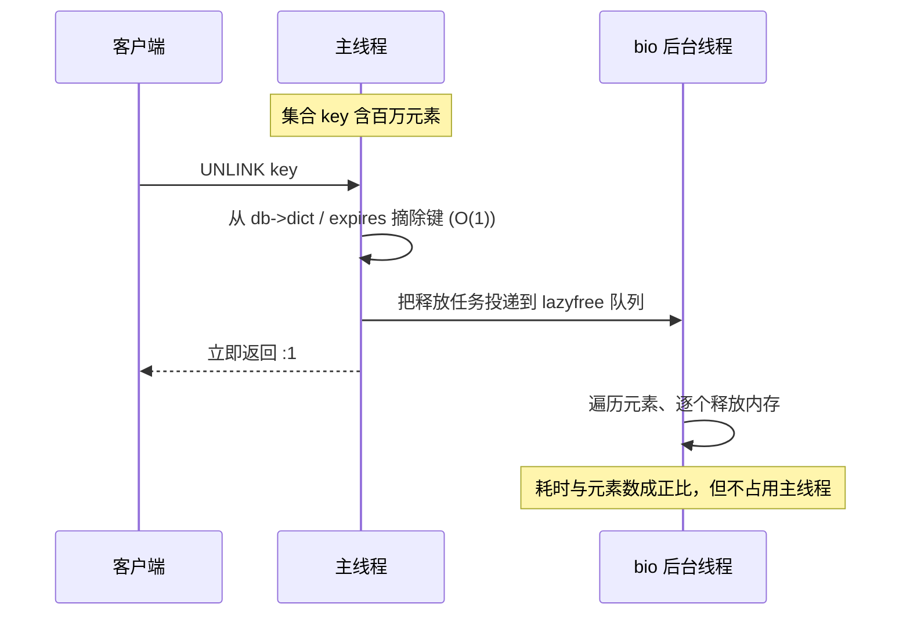

---
tags:
  - 中间件/Redis
---

# 过期删除与内存淘汰

前面的笔记把 Redis 的数据在内存里怎么组织、命令怎么被单线程执行讲完了。内存是有限的：一份数据要么因为**逻辑上到期**而该被回收，要么因为**物理内存装不下**而必须被腾走。Redis 用两套彼此独立的机制处理这两件事 —— 过期删除（key expiration）管前者，内存淘汰（key eviction）管后者。

两套机制都落在「删键、释内存」这个动作上，混淆恰恰从这里开始：网上常见的说法把 `maxmemory-policy` 说成「过期删除策略」，或者把 `TTL` 到期说成「淘汰」。本文按「先分清边界，再分别下钻」的顺序讲：过期时间怎么设置与判定、惰性删除与定期删除怎么配合、过期键在 RDB/AOF/主从下怎么处理、八种 `maxmemory-policy` 各自的判据、近似 LRU 与 LFU 的取舍、lazyfree 如何把释放挪出主线程，以及内存观测与碎片整理。默认值与常量以 **Redis 7.x** 为准，3.0–8.0 的行为差异在 §13 集中列出。

## 1. 两套「删除」的边界

区分这两套机制不能只看「都删键」，要同时看三件事：**谁触发、删哪些键、删的目的是什么**。三件事对上了，后面的策略、参数、失败模式才有地方挂。

### 1.1 触发条件与删除对象的差异

| 维度 | 过期删除 | 内存淘汰 |
| --- | --- | --- |
| 触发条件 | 键的 TTL 到期（读键时被动检查，或后台周期扫描） | 运行内存达到 `maxmemory`，且正在执行一条会增加数据的命令 |
| 删除对象 | 只针对设了过期时间、且已到期的键（`expires` 字典里的键） | 由策略决定：`allkeys-*` 面向全库，`volatile-*` 只面向设了 TTL 的键 |
| 选择依据 | 时间（`now > expire_at`） | 访问时间、访问频率、剩余 TTL 或随机 |
| 目的 | 让「逻辑上已失效」的数据不再可见、并逐步回收 | 把内存水位压回 `maxmemory` 以下，让写命令能继续 |
| 关键参数 | `hz`、`active-expire-effort`、`lazyfree-lazy-expire` | `maxmemory`、`maxmemory-policy`、`maxmemory-samples`、`lfu-*` |
| 不触发时的后果 | 过期键继续占用内存（惰性删除下可能长期滞留） | 写命令返回 OOM 错误（`noeviction`），或按策略淘汰键 |

两条路径的入口不同，走到「删键」这一步才汇合：

```text
   一次命令触达的两条删除路径

   客户端命令
        │
        ├─▶ 查 db->dict ── 命中 ──▶ 查 expires ──┬─ 有 TTL 且到期 ──▶ expireIfNeeded 删键
        │                                        └─ 无 TTL / 未到期 ─▶ 正常返回键值
        │
        └─▶ 写命令执行前检查 ── used_memory > maxmemory? ──┬─ 是 ──▶ performEvictions 淘汰
                                                           └─ 否 ──▶ 继续执行命令
```

图里上半支是过期删除，它在**读或写一个具体键**时被触发；下半支是内存淘汰，它在**写命令试图分配更多内存**时被触发。两条路径可以在同一条命令里先后发生：一条 `SET` 既可能因为键已过期而先走惰性删除，也可能因为写完超了水位而触发淘汰。

### 1.2 为什么必须分成两套

把两者合成一套在设计上行不通，原因在于它们回答的问题不同。

TTL 回答的是「这份数据在业务上还算不算数」。一个会话键 30 分钟后失效，是业务逻辑的要求，与 Redis 还剩多少内存无关 —— 内存再空，到期的键也该消失；内存再满，没到期的键也不能因为「占地方」被删掉。反过来，`maxmemory` 回答的是「这台机器的内存够不够」。当内存逼近上限，Redis 必须腾地方，此时它甚至可以淘汰一个 TTL 还有很长的热点键 —— 只要策略判定它「最不值得留」。两个判据互相独立，合成一套就会出现「内存充足时该到期的没到期」或「内存满了却因为键没过期而无处可删」这类死结。

两套机制在 `volatile-*` 这里发生交叉：这类淘汰策略把「只有设了 TTL 的键才能被淘汰」当作筛选条件，于是**过期时间同时参与了两套机制**。这个交叉正是 `volatile-lru` 在一实例混用缓存与持久键时的价值，也是它最危险的失败模式来源（§8）。

## 2. 过期时间的设置与判定

过期删除的所有后续行为都建立在两件事上：**过期时间怎么写到键上**，以及**怎么判断一个键过期了**。前者是一组命令与一条「什么时候清除 TTL」的规则，后者是一个字典加一次时间比较。

### 2.1 设置、查看与取消的命令族

设置过期时间的命令按「相对 / 绝对」和「秒 / 毫秒」两组维度交叉，共四个（来源：Redis Commands, `EXPIRE`／`PEXPIRE`／`EXPIREAT`／`PEXPIREAT`）：

| 命令 | 时间类型 | 单位 | 语义 |
| --- | --- | --- | --- |
| `EXPIRE key n` | 相对 | 秒 | 从现在起 n 秒后过期 |
| `PEXPIRE key n` | 相对 | 毫秒 | 从现在起 n 毫秒后过期 |
| `EXPIREAT key t` | 绝对 | 秒 | 在 Unix 时间戳 t 之后过期 |
| `PEXPIREAT key t` | 绝对 | 毫秒 | 在 Unix 毫秒时间戳 t 之后过期 |

设置字符串时还可以一次带上过期时间，有三条：`SET key value EX n`（秒）、`SET key value PX n`（毫秒）、`SETEX key n value`（秒）。查看剩余存活时间用 `TTL`（秒）或 `PTTL`（毫秒）；取消过期时间用 `PERSIST`。判断键是否存在过期时间，`TTL` 的返回值可以区分三种状态：正数是有 TTL 且剩余这么多秒，`-1` 是键存在但没有 TTL，`-2` 是键不存在。

有两条规则容易踩：

- **TTL 只在键被删除或被整体覆盖时清除。** `DEL`、`SET`、`GETSET`、以及所有带 `STORE` 的命令会清掉 TTL；只在概念上修改值的命令会保留它 —— `INCR`、`LPUSH`、`HSET` 都不改变 TTL。这意味着对一个已有 TTL 的计数器反复 `INCR`，它的过期时间不会被刷新。`RENAME` 则把 TTL 一起转移到新键名（来源：Redis Commands, `EXPIRE`）。
- **传入非正数或过去的时间戳会直接删键，而不是「已经过期」。** 对 `EXPIRE`／`PEXPIRE` 传非正数、对 `EXPIREAT`／`PEXPIREAT` 传过去时间，键会被删除，产生的键事件是 `del` 而不是 `expired`（来源：Redis Commands, `EXPIRE`）。排查为什么某个键「没有产生过期事件」时，这一条是第一嫌疑。

Redis 7.0 起 `EXPIRE` 增加了 `NX`／`XX`／`GT`／`LT` 四个可选项（互斥）：`NX` 只在键没有 TTL 时设置，`XX` 只在已有 TTL 时设置，`GT`／`LT` 分别只在新过期时间更大 / 更小时才设置，非易失键在 `GT` 语义下视为无限 TTL（来源：Redis Commands, `EXPIRE`）。

### 2.2 expires 字典与过期判定

每给一个键设过期时间，Redis 就把「键 + 过期时间」存进当前库的过期字典 `expires`。它挂在 `redisDb` 结构上，与存键值的 `dict` 并列（来源：Redis 7.2 源码 `src/server.h` 中 `redisDb`）：

```c
typedef struct redisDb {
    dict *dict;    /* 数据库键空间，存放所有键值对 */
    dict *expires; /* 键的过期时间 */
    /* ... */
} redisDb;
```

`expires` 的 key 是指向键对象的指针，value 是一个毫秒精度的 Unix 时间戳（存为 `long long`）。它是哈希表，所以「查一个键有没有 TTL」是 O(1)。判定流程是：先看键是否存在于 `expires`，不在就当作没有 TTL；在就取过期时间与当前时间比较，大于当前时间算未过期，否则判定已过期。

```text
   redisDb 里键空间与过期字典的对象布局

   redisDb
     ├── dict     ──▶ entry(key_sds, redisObject)     键值对，所有键
     └── expires  ──▶ entry(key_sds, long long)       仅带 TTL 的键
                        │
                        └── 值 = 绝对 Unix 毫秒时间戳
                             例：1735689600000
```

把过期时间存成**绝对时间戳**（而不是「还剩多少秒」）决定了两件事。第一，即使 Redis 停机，时间照常流动，重启加载后仍能按真实时间判断过期；第二，判断完全依赖系统时钟是否稳定 —— 把机器时间调快，没过期的键会立刻过期；时钟偏差很大的两台机器之间迁移 RDB 文件，可能出现「加载时所有键都已过期」（来源：Redis Commands, `EXPIRE` 的 *Expires and persistence* 一节）。从 Redis 2.6 起，过期判断的精度是 0–1 毫秒（2.4 及更早是 0–1 秒）。

## 3. 惰性删除

惰性删除（lazy expiration）把「检查是否过期」这件事推迟到访问该键的那一刻：不主动删，谁访问到谁负责删。它由 `expireIfNeeded()` 实现，入口在每一次键查找上。

Redis 在访问或修改一个键之前，都会先调用 `expireIfNeeded()`。它对键做三件事：判断是否过期，过期就删，然后把「这个键已经没了」作为结果返回给调用者。删除动作本身有两种执行方式，由 `lazyfree-lazy-expire` 决定是同步删还是异步删（Redis 4.0 起提供该参数）。对应到源码，就是 `expireIfNeeded` 末尾的 `server.lazyfree_lazy_expire ? dbAsyncDelete(db,key) : dbSyncDelete(db,key)`（来源：Redis 7.2 源码 `src/db.c` 的 `expireIfNeeded`）。

这里的「访问」覆盖范围比直觉宽：`GET`、`HGET` 这类读命令触发它，`SET`、`INCR` 这类写命令在查找旧值时也触发它，`EXISTS`、`TTL` 同样会走一遍过期判断。触发它的命令不限于读：任何触碰这个键的命令都会顺手判一遍、删一遍。

惰性删除的代价是内存：**没人访问的过期键，永远不会被删。** 如果一个键在被设了 TTL 之后再也没人碰它，它就留在 `dict` 里继续占用内存，`expires` 里也保留着它的条目。这是惰性删除对 CPU 友好（只在真正访问时做一次 O(1) 比较）的必然代价 —— 检查次数从「所有过期键」降到「被访问过的键」。只靠惰性删除，内存里会沉淀一批「已过期但还活着」的键。

从库上的惰性删除还要多一层。`expireIfNeeded()` 里有一段判断：如果当前实例是从库（`server.masterhost != NULL`），它**不删这个键**，而是直接返回「已过期」；只有可写从库（`replica-read-only no`）在执行写操作时才强制删除（来源：Redis 7.2 源码 `src/db.c` 的 `expireIfNeeded` 与 `lookupKey` 注释）。所以从库读到一个逻辑上过期的键会返回 `null`，但那个键在从库的内存里仍然占着位置，直到主库把 `DEL` 传播过来（§6）。「逻辑过期」与「物理存在」在从库上是分离的。

## 4. 定期删除

定期删除（active expiration）补上惰性删除的短板：后台周期性地从 `expires` 字典里随机抽样，删掉抽到的过期键。它由 `activeExpireCycle()` 实现，分为两种运行方式（来源：Redis 7.2 源码 `src/expire.c`）：

- **慢循环（SLOW）** 挂在 `serverCron` 上，频率由 `hz` 决定，默认 `hz 10`，即每秒跑 10 次；
- **快循环（FAST）** 在每个事件循环的 `beforeSleep()` 里跑一次，只有「上一轮慢循环是因为超时被打断」或「估算的过期键占比高于阈值」时才真正执行，单次时长上限 `ACTIVE_EXPIRE_CYCLE_FAST_DURATION` = 1000 微秒。

慢循环是主力，下面讲的流程都指它。几个常量与配置的关系是（来源：Redis 7.2 源码 `src/expire.c`）：

| 常量 | 基线值 | 含义 |
| --- | --- | --- |
| `ACTIVE_EXPIRE_CYCLE_KEYS_PER_LOOP` | 20 | 每轮每个库随机抽样的键数 |
| `ACTIVE_EXPIRE_CYCLE_SLOW_TIME_PERC` | 25 | 慢循环可占用的 CPU 百分比上限 |
| `ACTIVE_EXPIRE_CYCLE_ACCEPTABLE_STALE` | 10 | 抽样中过期键占比低于此值就停止该库本轮检查 |
| `ACTIVE_EXPIRE_CYCLE_FAST_DURATION` | 1000 微秒 | 快循环单次时长上限 |

`active-expire-effort`（默认 1）会按比例放大这几个基线：源码里先把配置值减一得到 `effort`（0–9），于是 `keys_per_loop = 20 + 20/4*effort`、`slow_time_perc = 25 + 2*effort`、`acceptable_stale = 10 - effort`。默认 `effort = 0`，三个值就是上表的 20、25、10。

一轮抽查的流程是循环执行的，至少跑一轮，然后按命中率决定是否继续：

```text
   activeExpireCycle 慢循环单库一轮

   进入当前库
     │
     ├─ 若 expires 已填充槽位 < 1% ──▶ 跳过该库（采样太稀疏，不划算）
     │
     ▼
   ┌───────────────────────────────────────────┐
   │ 从 expires 随机抽取 num 个键                │
   │ num = keys_per_loop（默认 20）              │
   │ 扫描桶数上限 num*20，避免空桶拖慢           │
   │ 逐个判断：已过期则删除，expired++           │
   └───────────────────┬───────────────────────┘
                       │
         ┌─────────────┴─────────────┐
         ▼                           ▼
  expired*100/sampled          expired*100/sampled
     > acceptable_stale           ≤ acceptable_stale
      (默认 >10%)                   (默认 ≤10%)
         │                           │
         ▼                           ▼
   回到抽取步骤继续循环          结束该库，下一轮再说
         │
         └─▶ 每 16 次迭代检查一次耗时，超过 timelimit 就置 timelimit_exit 退出
```

两个上限各防一类问题。**时间上限** `timelimit = slow_time_perc * 1000000 / hz / 100` 微秒，默认 `25 * 1000000 / 10 / 100 = 25000` 微秒，即 25 毫秒 —— 每秒预算正好是「10 次 × 25 毫秒 = 250 毫秒 = 25% CPU」，两个数字是同一件事。代码每 16 次迭代检查一次超时（`if ((iteration & 0xf) == 0)`），超时置位退出，下一轮从上次位置继续。**命中率阈值**避免「为回收一点内存做大量无用功」：抽样里过期键占比掉到阈值以下，说明该库过期键已不密集，继续扫不划算。

这里有一处与旧文章对不上的地方值得点出。许多资料写「本轮过期键超过 5 个（20/4），即占比大于 25% 就继续」。这条来自 6.0 之前的实现 —— 那时判据是 `expired > ACTIVE_EXPIRE_CYCLE_LOOKUPS_PER_LOOP/4`，即硬编码的 25%。**6.0 引入 `active-expire-effort` 后，判据改成按百分比阈值 `(expired*100/sampled) > acceptable_stale`，默认阈值 10% 而不是 25%**，常量名也从 `ACTIVE_EXPIRE_CYCLE_LOOKUPS_PER_LOOP` 改成 `ACTIVE_EXPIRE_CYCLE_KEYS_PER_LOOP`（来源：Redis 7.2 源码 `src/expire.c`）。按 25% 去推算现版本的清理强度会偏乐观。

定期删除的另一个短板是**抽样会漏**：它随机取固定数量的键、又有时间上限，一个「长期没人访问 + 一直没被抽到」的过期键可以滞留很久。抽样数越大漏得越少、CPU 代价越高，`active-expire-effort` 就是调这个平衡的。两条路径合起来看：惰性删除保证「被访问到的过期键一定被删」，定期删除保证「不被访问的过期键也有机会被删」，单独一条都清不干净 —— 这才是同时启用两者的原因。残留的过期键在 `volatile-*` 下还会被当作「可淘汰对象」参与内存腾挪。

## 5. 过期键在 RDB 与 AOF 下的处理

过期键是「逻辑上不存在、物理上可能还在」的键。把它写进持久化文件时，Redis 要在「文件尽量小」和「恢复后语义正确」之间选，两条持久化路径的处理并不相同。

**RDB 分生成与加载两个阶段。** 生成阶段，Redis 把内存快照落盘前会对键做过期检查，**已过期的键不写入新的 RDB 文件**；未过期但带 TTL 的键会正常写入，连同它的绝对过期时间一起存下来。加载阶段的行为取决于实例角色（来源：Redis Commands, `EXPIRE` 的 *Expires and persistence*）：

- 以**主库**模式加载时，程序逐个检查文件中的键，**已过期的键不载入**数据库，所以过期键不会污染主库；
- 以**从库**模式加载时，**不论是否过期都载入**。看似危险，但主从全量同步时从库的数据会被主库的 RDB 覆盖清空，所以实际影响有限 —— 这份「不检查」是为了保留过期状态，让从库在被提升为主库后能独立让键过期。

**AOF 分写入与重写两个阶段。** 写入阶段，如果某个过期键还没被删除，AOF 文件里会保留它 —— 因为 AOF 记录的是「执行过的写命令」，键被 `SET` 进来时就写下了，删除动作还没发生；等这个键真正被删（惰性删除或定期删除命中）时，**Redis 会向 AOF 显式追加一条 `DEL`**，把删除也记进日志。重写阶段，执行 AOF 重写时 Redis 检查每个键，**已过期的键不写入重写后的新 AOF**（来源：Redis Commands, `EXPIRE`；机制同样适用于 7.0 的 multi-part AOF）。

一份 AOF 里因此可能出现「先 `SET`、后 `DEL`」的配对，也可能被重写整体抹掉；恢复时过期键不会再出现。

三条路径的分支可以并排看：

```text
   过期键进入/离开持久化文件的分支

                 一个带 TTL 的键
        ┌───────────────┼───────────────┐
        ▼               ▼               ▼
      RDB            AOF 写入        AOF 重写
        │               │               │
   ┌────┴────┐     保留在日志      ┌────┴────┐
   ▼         ▼         │          ▼         ▼
 生成阶段  加载阶段      │       未过期    已过期
   │         │         │         │         │
 不写过   主库不载入    │       写入新   不写入
 期键     从库全量载入  │       AOF      新 AOF
                       ▼
            键被删时显式追加 DEL
```

## 6. 主从模式下的过期处理

主从复制下，过期判断权收归主库：**由主库统一决定，再通过复制链路把结果下发**。从库不主动删过期键（除了可写从库自己创建的键，源码 `src/expire.c` 的 `expireSlaveKeys` 专门处理这一例外）。

从库上的行为要分两层理解。**读这一层**：从库收到读命令时，`expireIfNeeded` 仍会判断键是否过期，逻辑上过期的键返回 `null`，客户端拿不到旧值 —— 这点保证了从库不会读到「明明该没了」的数据。**写这一层**：从库不删除这个键，物理条目留在 `dict` 里。真正的删除时机是主库那边键到期后，在它的 AOF 里合成一条 `DEL` 并传播给所有从库，从库执行这条 `DEL` 才把键清掉（来源：Redis Commands, `EXPIRE` 的 *How expires are handled in the replication link and AOF file*）。

要这么设计，根因是**判断权必须唯一**。过期判断依赖系统时钟，主库与从库的时钟不可能完全一致，读的负载也会让两边走上不同的代码路径。如果每个从库自行按本地时间删键，就会出现：从库认为键过期、删掉了，主库还认为键有效、还把该键的读命令当命中，两边数据集在「这个键存不存在」上直接分歧。把删除权收归主库之后，`DEL` 变成一条普通写命令走复制链路，顺序和内容都由主库保证，从库只需执行。

这条规则有两个直接后果。第一，**从库的内存可能比主库紧张**：主库删掉的键，`DEL` 传到从库之前从库还占着这块内存；主库负载高、复制有延迟时，从库的过期键滞留更久。第二，**从库默认忽略自己的 `maxmemory`** —— 从 Redis 5 起 `replica-ignore-maxmemory` 默认 `yes`，驱逐统一由主库做、再把 `DEL` 传播下来，避免主从各自驱逐导致不一致（来源：Redis 7.x `redis.conf`）。代价是从库实际可能用掉超过 `maxmemory` 的内存，容量规划要留余量。故障转移会改变这套分工：从库被提升为主库后，靠保留的过期状态独立判断并删除过期键，再把 `DEL` 发给下游 —— 这正是 RDB 加载阶段让从库「全量载入、不检查过期」的原因（§5）。

## 7. 内存淘汰的触发条件与八种策略

内存淘汰是另一条独立路径：它不看时间，只看内存水位。当 Redis 分配的运行内存超过 `maxmemory`，并且正在执行一条会继续增加数据的命令时，它会按 `maxmemory-policy` 选择键删除，直到内存降回上限以下（来源：Key eviction）。

`maxmemory` 的默认值随机器位数不同（来源：Key eviction 与 Redis 7.x `redis.conf`）：64 位系统默认 `0`，表示不限制；32 位系统有一个 3GB 的隐式上限。`0` 不代表安全 —— 没有上限时 Redis 不会检查可用内存，数据一路涨到系统 OOM 才崩，崩溃没有淘汰策略兜底。

触发的细节有三点。**第一，检查发生在「会增加数据」的命令上**，只读命令和删除命令不受影响，即使内存已经超限，读和删仍能正常工作。**第二，一条命令可能让内存大幅、临时地超过上限** —— 例如把一个很大的集合交集结果 `SUNIONSTORE` 到一个新键，分配过程无法按 `maxmemory` 逐步收紧，只能在事后回收（来源：Key eviction）。**第三，`noeviction` 之下超限不删键，而是让需要更多内存的写命令返回错误**，错误信息是 `OOM command not allowed when used memory > 'maxmemory'`（§15 展开）。

八种策略按「是否淘汰」和「淘汰范围」两个维度分类。不淘汰一类只有 `noeviction`；淘汰一类先按范围分成「仅在设了 TTL 的键中淘汰」和「在全库淘汰」，再按选择算法分 LRU／LFU／random／ttl（来源：Redis 7.x `redis.conf` 的 `maxmemory-policy` 段与 Key eviction）：

```text
   八种 maxmemory-policy 的分类

   maxmemory-policy
     │
     ├── noeviction（默认）────────── 不淘汰，写命令返回 OOM 错误
     │
     └── 进行淘汰
           │
           ├── volatile-*  仅在设了 TTL 的键中淘汰
           │     ├── volatile-lru     淘汰最久未使用的（近似 LRU）
           │     ├── volatile-lfu     淘汰访问频率最低的（近似 LFU）
           │     ├── volatile-random  随机淘汰
           │     └── volatile-ttl     淘汰剩余 TTL 最短的
           │
           └── allkeys-*   在全库范围内淘汰
                 ├── allkeys-lru      淘汰最久未使用的（近似 LRU）
                 ├── allkeys-lfu      淘汰访问频率最低的（近似 LFU）
                 └── allkeys-random   随机淘汰
```

| 策略 | 范围 | 选择依据 |
| --- | --- | --- |
| `noeviction` | 不淘汰 | 无 |
| `allkeys-lru` | 全库 | 最久未使用 |
| `allkeys-lfu` | 全库 | 访问频率最低 |
| `allkeys-random` | 全库 | 随机 |
| `volatile-lru` | 有 TTL 的键 | 最久未使用 |
| `volatile-lfu` | 有 TTL 的键 | 访问频率最低 |
| `volatile-random` | 有 TTL 的键 | 随机 |
| `volatile-ttl` | 有 TTL 的键 | 剩余 TTL 最短 |

淘汰的执行入口是 `performEvictions()`。对 LRU／LFU／ttl 三类，它先在每个库采样、把候选塞进一个全局淘汰池（`EVPOOL_SIZE = 16`），再从池里挑 idle 最大的淘汰；淘汰池跨多次调用保留，相当于用一小块固定内存顺带记住「上次采到的、还没来得及淘汰的好候选」（来源：Redis 7.2 源码 `src/evict.c`）。`random` 两类不走淘汰池，直接随机取键删除。这决定了 `*-lru`／`*-lfu` 的淘汰结果比 `*-random` 更贴近「该走的先走」，代价是每次淘汰多一轮采样与排序。

## 8. allkeys-* 与 volatile-* 的边界

这两组的差别只有一条：**候选集合是不是只取带 TTL 的键**。但就这一条，决定了完全不同的使用前提和失败模式。

`allkeys-*` 的选择过程**完全不看 TTL**。它对全库的键按访问时间、频率或随机挑，所以哪怕一个键的 TTL 还剩一年，只要它最久没被访问，`allkeys-lru` 照样淘汰它。它的前提是「这个实例里的所有数据都是可丢的缓存副本」。相对地，`allkeys-lru` 比 `volatile-*` **更省内存**：设 TTL 本身要额外占用 `expires` 字典的空间，而 `allkeys-*` 不需要键带 TTL 就能工作（来源：Key eviction）。

`volatile-*` 的前提是「实例里同时存在可丢的缓存键和不可丢的持久键，且持久键不带 TTL」。它把「有没有 TTL」当成「可不可丢」的标记：带 TTL 的键可淘汰，不带 TTL 的键永远不会被选中。这条设计让一个实例既能缓存又会话持久化，但也埋了风险 —— 官方文档明确指出，这种混用场景**更推荐拆成两个 Redis 实例**，用一个实例同时做缓存与持久存储会让两边互相牵制（来源：Key eviction）。

最需要记住的是 `volatile-*` 的失败模式：**如果没有可淘汰的键，它的行为退化成 `noeviction`**。假设实例里所有键都没设 TTL（或设了 TTL 的键刚好都被删光了），`volatile-lru` 找不到任何候选，于是不再淘汰，写命令直接返回 OOM 错误。排查时看到 `volatile-*` 策略却报 OOM，第一件事就是确认库里到底有没有带 TTL 的键 —— 用 `INFO keyspace` 看 `expires` 计数，或 `DBSIZE` 与 `INFO stats` 的 `expired_keys` 对照。`noeviction` 的语义在这里被复用：`volatile-*` 只改变候选集合，不改变「找不到候选就报错」这条兜底规则。

按场景选策略可以收成一张对照表：

| 场景 | 建议策略 | 理由 |
| --- | --- | --- |
| 纯缓存，访问热点集中 | `allkeys-lru` | 无偏好时的合理默认，按帕累托分布热点键会留下 |
| 纯缓存，有明显一次性批量读 | `allkeys-lfu` | 频率计数能识别「只读过一次」的键并优先淘汰 |
| 纯缓存，所有键访问频率接近 | `allkeys-random` | 访问均匀时 LRU 的额外开销换不来收益 |
| 缓存 + 持久键混用 | `volatile-lru`（优先拆实例） | 不带 TTL 的持久键受保护，不被误淘汰 |
| 能预测哪些键该先走 | `volatile-ttl` | 给候选键设短 TTL，让 TTL 本身表达优先级 |
| 数据不可丢 | `noeviction` | 宁可写失败，也不自动删键 |

最后一行是容量规划的底线：选 `noeviction` 意味着 Redis 不会替你兜内存，必须自己监控 `used_memory` 与 `maxmemory` 的差距，或让上层在写失败时降级。

## 9. 近似 LRU：采样与淘汰池

LRU（Least Recently Used，最近最少使用）的教科书实现是「哈希表 + 双向链表」：哈希表 O(1) 定位节点，链表按访问顺序排列，每次访问把节点移到表头，淘汰时删表尾。Redis 没有采用它，原因是这套结构在它的场景里代价偏高（来源：Key eviction；Redis 7.x `redis.conf`）：

- 链表要为**每一个**键维护前后指针，这是一笔与键数量成正比的额外空间开销，而且在对象本身之外再挂一层；
- 每次访问都要移动链表节点，热点键被高频访问时，这些移动操作会占掉单线程的 CPU 时间，直接影响命令延迟。

Redis 的做法是**近似 LRU**：只在对象头里加一个字段记「最后一次访问的时间」，淘汰时随机采样若干键、取其中最久未用的那个。对象头的 `lru` 字段是 24 位（`LRU_BITS = 24`），存的是一个**精度 1000 毫秒、24 位回绕**的相对时钟值（`LRU_CLOCK_RESOLUTION = 1000`，`LRU_CLOCK_MAX = 2^24 - 1`）（来源：Redis 7.2 源码 `src/server.h` 与 `src/evict.c` 的 `getLRUClock`）。24 位、1000 毫秒精度意味着这个时钟大约每 194 天回绕一次，回绕由比较逻辑处理，不需要额外的纪元字段。

具体的淘汰过程分两层：**先分库采样，再把候选放进淘汰池**。`performEvictions()` 对每个库调用一次 `evictionPoolPopulate()`，后者从该库随机取 `maxmemory-samples` 个键（默认 5），算出每个键的 idle 时间，按 idle 升序插入一个全局淘汰池；池容量 `EVPOOL_SIZE = 16`，空位用 NULL 占位。采样完成后，从池里 idle 最大的那一端挑键删除，直到内存降回上限。淘汰池不随单次调用清空，于是上一次采样里「idle 够大但没轮到被删」的键会留到下次，多轮下来相当于在采样精度之外又攒了一层候选（来源：Redis 7.2 源码 `src/evict.c`）。

```text
   近似 LRU 的一次淘汰

   performEvictions
        │
        ├── 对每个库：
        │     ├─ 随机取 maxmemory-samples 个键（默认 5）
        │     ├─ 逐个算 idle = now - obj->lru
        │     └─ 按 idle 升序插入淘汰池（EVPOOL_SIZE = 16）
        │              │
        │      ┌───────┴─────────────────────────────┐
        │      │ 淘汰池（跨调用保留）                  │
        │      │  idle 小 ◀────────────▶ idle 大      │
        │      │   [空][空]... [k7][k2]               │
        │      └───────────────────┬─────────────────┘
        │                          │
        └── 取右端 idle 最大的键删除 ◀┘
                  │
                  ▼
        仍超 maxmemory？──是──▶ 回到采样
                  │否
                  ▼
              停止淘汰
```

采样数决定近似的精度，也决定每次淘汰的 CPU 开销。`maxmemory-samples` 默认 5；官方给出三档的直觉：5 的结果已经够用，10 非常接近真正的 LRU 但 CPU 更高，3 更快但不够准（来源：Redis 7.x `redis.conf`）。Redis 8.0 的配置文件补充了上限为 64。改大采样数的代价在淘汰路径上：每次淘汰都要多取键、多算 idle、多维护池子，在写入密集的实例里会体现在淘汰延迟上；改小则可能把「刚好没被采到」的热点键误判成冷键淘汰掉。与它联动的是 `maxmemory-eviction-tenacity`（默认 10），这个参数控制单次淘汰的「韧性」—— 值越高，Redis 越愿意在淘汰上多花时间把内存压到上限以下，避免反复进入淘汰；值越低越接近「能腾一点是一点」。判断该不该调采样数，把 `INFO stats` 的 `evicted_keys` 与缓存命中率 `keyspace_hits`／`keyspace_misses` 一起读：淘汰量不高而命中率正常，说明默认采样足够；淘汰量高且命中率下降，先把采样数从 5 提到 10 观察，再考虑换策略。

## 10. LFU：24 位计数、对数递增与时间衰减

近似 LRU 有一个它解决不了的场景：**缓存污染**。应用一次批量读入大量数据（例如遍历全表后缓存每个结果），这些键刚被访问过，`lru` 时间戳很新，在 LRU 眼里它们和热点键一样「最近用过」；但它们只被读这一次，之后就没人再访问，却把真正的热点键挤了出去。问题的根子在 LRU 只看「最近」 —— 一次性扫描会让一组只读一次的键短暂地表现为「热点」。Redis 4.0 引入 LFU（Least Frequently Used，最少使用）解决它：按**访问频率**而不是「最近一次访问时间」决定淘汰谁（来源：Key eviction）。

### 10.1 24 位字段的拆分与初始值

LFU 复用了对象头里的同一个 24 位字段，只是拆成两段（来源：Redis 7.2 源码 `src/server.h`、`src/evict.c` 与 `src/db.c` 的 `updateLFU`）：

```text
   robj.lru 这 24 位在两种策略下的两种解读

   LRU 模式：整个 24 位 = 最后访问时间戳（精度 1 秒）
   ┌───────────────────────────────────────────────┐
   │                     lru (24 bit)              │
   └───────────────────────────────────────────────┘

   LFU 模式：高 16 位存 ldt，低 8 位存 logc
   ┌───────────────────────────────┬───────────────┐
   │        ldt (16 bit)           │  logc (8 bit) │
   │  上次衰减时间（分钟，&65535）  │  频率计数 0-255│
   └───────────────────────────────┴───────────────┘
```

- `ldt`（Last Decrement Time）是 16 位的分钟级时间（`LFUGetTimeInMinutes()` 取 `unixtime/60 & 65535`），记录上次做衰减的时间；
- `logc`（Logistic Counter）是 8 位的频率计数，范围 0–255，值越小越容易被淘汰。新键的初始值是 `LFU_INIT_VAL = 5`（而非 0）—— 留一点余量，让一个新键在被访问几次之前不至于因为计数最低被立刻淘汰（来源：Redis 7.2 源码 `src/server.h`、`src/evict.c` 注释）。

每次访问一个键，`updateLFU()` 按固定顺序做三步：**先按上次衰减时间对 `logc` 做衰减，再按概率把它加一，最后把新的时间与计数写回字段**（来源：Redis 7.2 源码 `src/db.c`）：

```c
void updateLFU(robj *val) {
    unsigned long counter = LFUDecrAndReturn(val); /* 1. 衰减 */
    counter = LFULogIncr(counter);                 /* 2. 递增 */
    val->lru = (LFUGetTimeInMinutes()<<8) | counter; /* 3. 写回 */
}
```

### 10.2 对数递增：Morris 计数器

递增按**概率**进行，计数器越大越难再涨，并不每次 `+1`（来源：Redis 7.2 源码 `src/evict.c` 的 `LFULogIncr`）：

```c
uint8_t LFULogIncr(uint8_t counter) {
    if (counter == 255) return 255;
    double r = (double)rand()/RAND_MAX;
    double baseval = counter - LFU_INIT_VAL;
    if (baseval < 0) baseval = 0;
    double p = 1.0/(baseval*server.lfu_log_factor+1);
    if (r < p) counter++;
    return counter;
}
```

把这个式子拆开看行为：概率 `p = 1/(baseval*lfu_log_factor + 1)`，其中 `baseval = counter - 5`（小于 0 时取 0）。当 `counter` 还是初始值 5 时 `baseval = 0`，`p = 1`，这次访问**一定**把它加到 6；随着 `counter` 升高，`baseval` 变大，`p` 越来越小，加一的概率越来越低；`lfu_log_factor` 越大，`p` 下降越快，计数器到达 255 所需访问次数越多。这个结构让 8 位空间表达出远超 255 的访问次数，它就是一个 Morris 计数器（来源：Key eviction 中「probabilistic counter / Morris counter」的说明）。

官方给出的饱和表能直接看出 `lfu-log-factor` 的作用（来源：Key eviction 与 Redis 7.x `redis.conf`）：

| `lfu-log-factor` | 100 次访问 | 1000 次 | 10 万次 | 100 万次 | 1000 万次 |
| --- | --- | --- | --- | --- | --- |
| 0 | 104 | 255 | 255 | 255 | 255 |
| 1 | 18 | 49 | 255 | 255 | 255 |
| 10（默认） | 10 | 18 | 142 | 255 | 255 |
| 100 | 8 | 11 | 49 | 143 | 255 |

表中的格子是访问这些次数后 `logc` 的值。`lfu-log-factor` 是「低访问区分度」与「高访问区分度」之间的取舍：默认 10 时，100 次和 1000 次访问分别对应 `logc` 10 与 18，能区分中等频率；factor 调到 100 后，100 与 1000 次只差 8 与 11，低访问几乎无法区分，换来的是对百万级访问仍有分辨率（143 vs 255）。访问量级在几十到几千时用默认 10，访问量级上百万、又需要区分「百万级热点」时再调大。

### 10.3 时间衰减与调参

**衰减是 LFU 的另一半。** 只有递增的话，一个过去被频繁访问的键会永久占据高位，访问模式一旦漂移，老热点不会被降级。`LFUDecrAndReturn()` 在扫描候选或访问键时按流逝时间做减法（来源：Redis 7.2 源码 `src/evict.c`）：

```c
unsigned long LFUDecrAndReturn(robj *o) {
    unsigned long ldt = o->lru >> 8;
    unsigned long counter = o->lru & 255;
    unsigned long num_periods = server.lfu_decay_time ? LFUTimeElapsed(ldt) / server.lfu_decay_time : 0;
    if (num_periods)
        counter = (num_periods > counter) ? 0 : counter - num_periods;
    return counter;
}
```

`LFUTimeElapsed(ldt)` 算出距上次衰减过了多少分钟，除以 `lfu_decay_time`（默认 1，单位分钟）得到「该衰减的周期数」，再从 `counter` 里减去这么多，减到 0 为止。**衰减没有独立的定时器，它在「扫描候选」和「访问」这两个时点上顺便算** —— 源码注释把它叫「incremental decrement」，没有后台线程专门遍历所有键去扣计数。`lfu-decay-time` 的特殊值 0 表示永不衰减。

为什么必须衰减，可以用一个可复现的例子说明。假设某键在上午被访问了 1000 次，`logc` 到了 18；下午它不再被访问，另一个新键开始升温。没有衰减时，新键要一路追到 `logc > 18`（在默认 factor 下约需上千次访问）才可能取代它；有衰减时，只要过了 `lfu-decay-time` 规定的若干分钟，`logc` 就按周期数往下掉，旧键在几十个周期内就降回低位。**衰减速度就是「多久忘记过去的热度」**：`lfu-decay-time` 调大，遗忘变慢，长期热点更稳但漂移响应迟钝；调小，遗忘变快，模型对近期访问更敏感，但偶发的访问抖动也会被放大。

LFU 相关参数有两个，都在 `redis.conf` 里（来源：Redis 7.x `redis.conf` 的 LFU 段）：`lfu-log-factor` 默认 10，调大让 `logc` 增长更慢、饱和所需访问更多；`lfu-decay-time` 默认 1 分钟，调大让衰减更慢、0 表示不衰减。两者配套使用：日志因子管「计数涨多快」，衰减时间管「计数掉多快」。

### 10.4 观测与选型

LFU 模式下的观测用 `OBJECT FREQ key`，它返回 `LFUDecrAndReturn(o)` 的结果，也就是「扣掉衰减之后」的当前频率计数；这个命令要求当前策略是 LFU 之一，否则报错。对照地，`OBJECT IDLETIME key` 给出的是空闲秒数，适用于 LRU 策略，在 LFU 策略下不可用（来源：Redis 7.2 源码 `src/object.c` 的 `objectCommand`）。

两种策略的适用边界可以并行对照：

| 维度 | 近似 LRU | LFU |
| --- | --- | --- |
| 判据 | 距最后一次访问多久 | 访问频率（对数计数，含衰减） |
| 字段用法 | 24 位全存时间戳 | 高 16 位 `ldt` + 低 8 位 `logc` |
| 抗缓存污染 | 弱，一次性批量读会挤掉热点 | 强，只读一次的键计数上不去 |
| 对访问模式漂移的响应 | 自然跟随最近访问 | 靠衰减，速度由 `lfu-decay-time` 控制 |
| 主要参数 | `maxmemory-samples` | `lfu-log-factor`、`lfu-decay-time` |
| 观测命令 | `OBJECT IDLETIME` | `OBJECT FREQ` |
| 适用场景 | 访问集中、热点稳定 | 存在周期扫描或一次性批量读，需要抗污染 |

一个实例里访问模式往往是混合的：既有稳定热点，也有周期性扫描。选 LRU 还是 LFU，等价于回答「更怕热点被挤掉，还是更怕老热点赖着不走」。**拿不准时先在 `allkeys-lru` 上观察命中率**，若 `evicted_keys` 增长伴随命中率下降、且负载里有明显的批量读，再切到 `allkeys-lfu` 比较 —— 切换是热生效的 `CONFIG SET`，但 LRU 与 LFU 共用同一个字段，切换后已有的计数需要一段时间才能重新收敛（`OBJECT FREQ` 的报错信息里也提示了这一点）。

## 11. lazyfree：把释放挪出主线程

删键这个动作本身并不总是便宜。`DEL` 把键从键空间摘除后，要把它占的内存还给分配器 —— 对一个只有几个字段的字符串键，这一步可以忽略；对一个包含百万级元素的集合或列表，释放每个元素、回收每块内存会在**执行删除命令的那条线程**上跑完，也就是主线程。删除期间主线程被占住，其他命令排队等待，表现为一次明显的延迟尖峰。

Redis 4.0 给出的解法是把「摘除键」和「释放内存」拆成两步，分别放在两个线程上。新命令 `UNLINK` 与 `DEL` 的语义都是删键，差别在执行方式（来源：Redis Commands, `UNLINK`）：`DEL` 同步释放，`UNLINK` 只把键从键空间里摘掉（这一步是 O(1) 的指针操作），然后把「这块内存要还」这件事交给一个后台线程（BIO，background I/O）异步完成。摘除动作完成后键立即不可见，所以 `UNLINK` 之后任何读命令都拿不到它 —— 异步的只是「内存归还」，不是「键的可见性」。



同样的异步释放机制也用在其他「隐式删键」的路径上，由四个开关控制，默认都是 `no`（来源：Redis 7.x `redis.conf`）：

| 参数 | 覆盖的删除路径 | 语义 |
| --- | --- | --- |
| `lazyfree-lazy-eviction` | 内存淘汰 | 淘汰键时异步释放内存 |
| `lazyfree-lazy-expire` | 过期删除 | 惰性 / 定期删除过期键时异步释放 |
| `lazyfree-lazy-server-del` | 服务端隐式删除 | 如 `RENAME` 覆盖、`SET` 覆盖旧值、重写时的删除 |
| `lazyfree-lazy-user-del` | 用户 `DEL` | 让 `DEL` 也走异步，等价于 `UNLINK` |

这四个开关的意义在于：**阻塞不只来自用户敲的 `DEL`，也来自 Redis 自己删键**。内存淘汰一个百万元素的键、过期删除一个大 key、`RENAME` 覆盖一个旧的大键，这些路径都可能卡住主线程，而它们不经过用户命令，用户无法用 `UNLINK` 规避，只能用这些开关统一切到异步。一个典型场景是大量大 key 设置了 TTL：`lazyfree-lazy-expire no` 时，定期删除一旦抽到这些键，主线程就要停下来释放它们；改成 `yes` 后，删除动作变成后台任务。

异步释放不是没有代价。释放任务堆在后台线程上时，真实内存不会立刻归还给分配器，`INFO memory` 的 `lazyfree_pending_objects` 会显示还在排队的待释放对象数。如果在很短时间里删除大量大 key，实际内存下降会滞后于逻辑删除，`maxmemory` 的判定仍然按逻辑删除后的数据算，但物理内存的回落要等后台线程追上。这既是解药，也是需要在容量上留余量的地方。

## 12. 内存观测与碎片整理

判断「内存到底被什么占着」，起点是 `INFO memory` 的几个字段（来源：Redis 7.2 源码 `src/server.c` 中 `INFO` 的 Memory 段）：

| 字段 | 含义 | 排查时的读法 |
| --- | --- | --- |
| `used_memory` | 分配器视角的已分配字节数（数据 + 内部开销） | 内存增长的主体指标，与 `maxmemory` 比较 |
| `used_memory_rss` | 操作系统看这个进程占用的物理内存（RSS） | 与 `used_memory` 的差异揭示碎片或换页 |
| `used_memory_peak` | 历史峰值 | 峰值远高于当前，说明存在过瞬时内存尖峰 |
| `used_memory_dataset` | 数据集本身占用（`used_memory` 扣除 `mem_not_counted_for_evict` 一类的开销） | 官方建议用它判断是否超过 `maxmemory` |
| `mem_fragmentation_ratio` | `used_memory_rss / used_memory` | 碎片率，见下 |
| `allocator_frag_ratio` | 分配器内部碎片比例 | 与 RSS 碎片分开看 |
| `maxmemory_policy` | 当前淘汰策略 | 确认策略是不是预期的那一个 |
| `lazyfree_pending_objects` | 待异步释放的对象数 | 大于 0 说明释放任务在排队 |

**碎片率是这一节的核心判据。** `mem_fragmentation_ratio = used_memory_rss / used_memory`，比值含义有三段：

- **大于 1**：操作系统给进程的内存多于 Redis 实际分配的，差额是碎片。刚过 1 属于正常范围，长期在 1.5 以上说明碎片明显，可以开启主动碎片整理（下段）；
- **接近 1**：内存利用紧凑，是理想状态；
- **小于 1**：`used_memory_rss` 竟然小于 `used_memory`，说明有一部分内存被操作系统换出到了 swap。这是危险信号 —— Redis 访问被换出的页会触发磁盘读取，延迟从内存级升到毫秒级。**碎片率小于 1 时先查机器是否在 swap，再谈别的**。

注意 `mem_fragmentation_ratio` 把两种碎片合在一起看：分配器内部碎片（`allocator_frag_ratio`）和进程 RSS 相对分配量的开销（`rss_overhead_ratio`）。要定位碎片来自哪一层，要把这三个指标对照读：`allocator_frag_ratio` 高说明分配器自身在浪费，`rss_overhead_ratio` 高说明分配器向操作系统要的比实际用的多。

碎片到了一定程度，可以用**主动碎片整理（active defragmentation）**在线压实。它默认关闭（`activedefrag no`），开启后由一组参数控制力度（来源：Redis 7.x `redis.conf` 的 *Active Defragmentation* 段）：

| 参数 | 默认值 | 作用 |
| --- | --- | --- |
| `activedefrag` | `no` | 总开关 |
| `active-defrag-ignore-bytes` | 100mb | 碎片字节数小于此值时不启动 |
| `active-defrag-threshold-lower` | 10 | 碎片率超过此百分比（%）才开始整理 |
| `active-defrag-threshold-upper` | 100 | 碎片率达到此百分比时用最大力度 |
| `active-defrag-cycle-min` | 1 | 整理占用的 CPU 时间百分比下限 |
| `active-defrag-cycle-max` | 25 | 整理占用的 CPU 时间百分比上限 |
| `active-defrag-max-scan-fields` | 1000 | 单次扫描的元素数上限 |

`MEMORY DOCTOR` 是快速体检命令，它会在发现问题时给出可读的诊断。其中一条明确对应碎片：当分配器外部碎片比例大于 1.1 时，它会提示「可以尝试开启 `activedefrag`」（来源：Redis 7.2 源码 `src/object.c` 中 `memoryCommand` 的 doctor 分支）。`MEMORY STATS` 给出更细的分配统计，适合在 `INFO memory` 发现异常后进一步下钻。

有一条边界要划清：**碎片整理压的是「分配器留下的空洞」，不是「数据本身占的空间」**。如果一个实例 `used_memory` 本身就逼近 `maxmemory`、碎片率却接近 1，开 `activedefrag` 不会腾出可用容量，此时该做的是淘汰策略与容量规划。碎片整理只值得在「分配量不大但 RSS 明显偏高」时启用。

## 13. 版本演进

这条线上的默认值变过几次，照着旧文章配参数容易配错，按版本列清楚：

- **2.8 及更早**：`maxmemory-policy` 默认是 `volatile-lru`。
- **3.0**：默认改成 `noeviction`，即内存超限时不再自动删键，而是让写命令报错；同一版改进了 LRU 的近似算法（来源：Redis 3.0.0 发布说明，`00-RELEASENOTES` 中「The default maxmemory policy in Redis 3.0 is no longer "volatile-lru" ... but "noeviction"」一段）。把默认从「悄悄删键」换成「报错」，是不替用户做丢数据决定的方向。
- **4.0**：一次性引入三样东西 —— LFU 两种策略（`volatile-lfu`／`allkeys-lfu`）、lazyfree 异步删除、以及配套的 `UNLINK` 命令（来源：Redis 4.0 发布说明中关于 LFU 与 lazyfree 的条目）。
- **5.0**：`replica-ignore-maxmemory` 默认改为 `yes`，从库不再按自己的 `maxmemory` 驱逐，统一由主库驱逐后传播 `DEL`（来源：Redis 7.x `redis.conf` 该参数说明的首句「Starting from Redis 5」）。
- **6.0**：引入 `active-expire-effort`（默认 1），定期删除从「硬编码阈值」变成「按 effort 缩放的参数组」（来源：Redis 6.0 `redis.conf` 中 `active-expire-effort 1`）。
- **7.0**：加入 `maxmemory-clients`（客户端缓冲区驱逐，默认关闭）与 `maxmemory-eviction-tenacity`（默认 10）；`EXPIRE` 增加 `NX`／`XX`／`GT`／`LT`；持久化侧切换到 multi-part AOF（来源：Redis 7.0 `redis.conf`）。
- **8.0**：`redis.conf` 中注明 `maxmemory-samples` 的取值上限为 64（来源：Redis 8.0 `redis.conf`）。
- **8.0 之后（unstable 分支）**：淘汰策略新增 `allkeys-lrm` 与 `volatile-lrm`（LRM，Least Recently Modified，按「最久未修改」淘汰），策略总数从 8 增至 10（来源：Redis `unstable` 分支 `src/config.c`）。具体从哪个版本开始提供未核对官方发布说明，标为待核。

把版本线读下来有一条主线：**默认值在向「不替用户丢数据」和「把选择权交给配置」收拢**。3.0 把默认淘汰策略从 `volatile-lru` 改成 `noeviction`，5.0 让从库忽略自己的内存上限以免主从分歧，7.0 把「驱逐时花多少时间」也变成参数。升级时核对旧配置，重点就是这几处默认值。

## 14. 参数逐条

下面每个参数按「默认值 → 语义 → 什么时候改 → 改大或改小的后果 → 联动 → 失败模式」写齐。默认值均取自 Redis 7.x 的 `redis.conf` 与官方 Key eviction 文档。

#### maxmemory

- **默认**：64 位系统 `0`（不限制），32 位系统隐式 3GB。
- **语义**：数据集可用的内存上限，超过后触发淘汰。
- **何时改**：几乎总要显式设置；按可用物理内存减去系统、客户端缓冲、复制缓冲区等开销后取值。
- **改大/改小**：改大延迟淘汰、命中率更高但逼近系统 OOM；改小淘汰更早、命中率下降。
- **联动**：与 `maxmemory-policy` 一起生效；与 `maxmemory-clients`、`replica-ignore-maxmemory` 相关。
- **失败模式**：保持 `0` 且数据一路增长 → 系统 OOM 杀进程，且没有淘汰策略兜底。

#### maxmemory-policy

- **默认**：`noeviction`。
- **语义**：超限时如何选键淘汰（§7 的八种）。
- **何时改**：把 Redis 当纯缓存就改成 `allkeys-lru` 或 `allkeys-lfu`；数据不可丢则保持 `noeviction`。
- **改大/改小**：不是数值量，换策略即在「丢哪些键」与「是否丢键」之间换档。
- **联动**：`volatile-*` 依赖键带 TTL；LRU／LFU 两类与 `maxmemory-samples`、`lfu-*` 联动。
- **失败模式**：用 `volatile-*` 但库里没有带 TTL 的键 → 退化成 `noeviction`，写命令报 OOM。

#### maxmemory-samples

- **默认**：5（8.0 起配置文件注明上限 64）。
- **语义**：每次淘汰从每个库随机采样的键数。
- **何时改**：淘汰量高、命中率偏低、且键的 idle 分布接近时，可提到 10。
- **改大/改小**：改大更接近真 LRU、CPU 开销更高；改小更快但可能误淘汰热点。
- **联动**：只对 `*-lru`／`*-lfu`／`volatile-ttl` 有效，`*-random` 不走采样。
- **失败模式**：采样过小 + 大批 idle 接近的键 → 冷热判断失准，命中率下降。

#### hz

- **默认**：10（每秒 10 次）。
- **语义**：后台任务的基础频率，定期删除慢循环的触发频率、超时预算都由它决定。
- **何时改**：只在要求极低延迟时才考虑调高，官方建议大多数用户保持 10。
- **改大/改小**：改大让后台任务更频繁、单次超时预算更短；改小则相反。
- **联动**：`timelimit = slow_time_perc*1000000/hz/100`，与 `active-expire-effort` 一起决定定期删除强度。
- **失败模式**：无节制调高会加大空转与 CPU 占用；过低的 `hz` 让周期任务响应变慢。

#### lfu-log-factor

- **默认**：10。
- **语义**：LFU 计数器对数递增的底数因子，控制 `logc` 涨到饱和所需的访问次数。
- **何时改**：访问量级在百万级以上、仍需区分高频键时调大。
- **改大/改小**：改大增长更慢、饱和更难、低访问区分度变差；改小增长更快、低访问区分度更好但更早饱和。
- **联动**：与 `lfu-decay-time` 配套；仅 `*-lfu` 策略下生效。
- **失败模式**：改得过小 → 计数器很快饱和到 255，高频键之间失去区分度。

#### lfu-decay-time

- **默认**：1（分钟），`0` 表示永不衰减。
- **语义**：LFU 计数器每隔多少分钟按周期数衰减一次。
- **何时改**：访问模式漂移快、希望更快「忘记」旧热点时调小；热点长期稳定时调大。
- **改大/改小**：改大遗忘慢、老热点更稳但响应漂移迟钝；改小遗忘快但易被偶发访问带偏。
- **联动**：与 `lfu-log-factor` 配套；仅 `*-lfu` 策略下生效。
- **失败模式**：设为 `0` 且访问模式已变 → 旧热点永不降级，长期占位。

#### lazyfree-lazy-eviction

- **默认**：`no`。
- **语义**：内存淘汰键时是否异步释放内存。
- **何时改**：库里存在大 key、淘汰时出现延迟尖峰时改为 `yes`。
- **改大/改小**：开启后淘汰不再阻塞主线程，但内存归还滞后。
- **联动**：与另外三个 `lazyfree-*` 开关、`lazyfree_pending_objects` 联动。
- **失败模式**：大量大 key 同时被淘汰 → 待释放任务堆积，物理内存回落慢。

#### lazyfree-lazy-expire

- **默认**：`no`。
- **语义**：过期删除（惰性 / 定期）键时是否异步释放内存。
- **何时改**：有大量带 TTL 的大 key 时改为 `yes`。
- **改大/改小**：开启后定期删除抽到大 key 不再卡主线程；代价同上一项。
- **联动**：与 `lazyfree-lazy-eviction`、`lazyfree_pending_objects` 联动。
- **失败模式**：保持 `no` 且定期删除抽到百万元素的大 key → 主线程一次明显停顿。

#### lazyfree-lazy-server-del

- **默认**：`no`。
- **语义**：服务端隐式删除（`RENAME` 覆盖、`SET` 覆盖旧值、重写时删除等）是否异步释放。
- **何时改**：存在大 key 被覆盖或重命名的负载时改为 `yes`。
- **改大/改小**：开启后隐式删除不再阻塞；内存归还滞后。
- **联动**：与其余 `lazyfree-*` 开关联动。
- **失败模式**：保持 `no` 且 `RENAME`／`SET` 覆盖大 key → 主线程停顿。

#### activedefrag

- **默认**：`no`。
- **语义**：主动碎片整理总开关，在线压实分配器留下的空洞。
- **何时改**：`mem_fragmentation_ratio` 长期在 1.5 以上、`MEMORY DOCTOR` 提示碎片时开启。
- **改大/改小**：不是数值量，开关之外用 `active-defrag-*` 调节力度与扫描上限。
- **联动**：`active-defrag-ignore-bytes`／`threshold-lower`／`threshold-upper`／`cycle-min`／`cycle-max`／`max-scan-fields` 共同决定启停与力度。
- **失败模式**：`used_memory` 本身已逼近 `maxmemory` 时开启无效（碎片不是瓶颈）；力度调过高会抢主线程 CPU。

## 15. 常见故障与排查

这一节的故障都可以从「内存这条路径走到哪一步卡住」入手。先给排查顺序，再逐条给判据。

```text
   内存相关故障的定位顺序

   ① 报错写着 OOM command not allowed？
        └─ 是 → 策略是 noeviction 还是 volatile-*？
        │        ├─ volatile-* → 去查库里有没有带 TTL 的键（§8）
        │        └─ noeviction → 查 maxmemory 是否设得过小，或本就不该淘汰
        └─ 否 ↓
   ② 内存只涨不落？
        ├─ 有大量设了 TTL 但长期不被访问的键 → 定期删除抽样没抽到（§4）
        ├─ 大 key 回收慢 → 看 lazyfree_pending_objects 与 lazyfree-* 开关（§11）
        └─ 无 TTL 的键持续写入 → 惰性 + 定期删除都不管没有 TTL 的键（§1）
   ③ used_memory 与 used_memory_rss 差异大？
        ├─ rss > used_memory（碎片率 > 1.5）→ 碎片，考虑 activedefrag（§12）
        └─ rss < used_memory（碎片率 < 1）→ 发生 swap，先查系统换页
   ④ 删除命令出现延迟尖峰？
        └─ 大 key 同步释放，改用 UNLINK 或开 lazyfree-*（§11）
```

**`OOM command not allowed when used memory > 'maxmemory'`。** 这是 `noeviction` 语义下的标准报错，`volatile-*` 找不到候选时也会报它。定位分两步：先 `CONFIG GET maxmemory-policy` 确认当前策略；若是 `volatile-*`，再用 `INFO keyspace` 看各库的 `expires` 计数 —— 归一化到 0 就说明没有可淘汰的键，策略实质上退化成了 `noeviction`（§8）。处置有两条路：把数据改成带 TTL 的键让 `volatile-*` 有候选，或换 `allkeys-*`（前提是数据可丢）。报错只影响需要更多内存的写命令，读和删仍能执行，所以实例不会完全不可用。

**内存只涨不落。** 先分清是哪一类键。惰性删除不回收「没人访问的过期键」，定期删除也只是抽样，所以**一批设了 TTL、之后长期不被访问的键可以滞留很久** —— 用 `INFO stats` 的 `expired_stale_perc`（估算的过期键占比）与 `expired_time_cap_reached_count`（慢循环因超时被打断的次数）判断：后者持续增长说明过期键太多、单轮扫不完，可适当调高 `active-expire-effort`（连带 `hz` 一起评估）。如果增长的键根本没设 TTL，两套过期机制都不管它们，只能靠淘汰策略或业务侧清理 —— 这是把 Redis 当存储用时的典型遗漏。第三类是大 key 回收慢，看 `INFO memory` 的 `lazyfree_pending_objects` 是否长期大于 0。

**`used_memory` 与 `used_memory_rss` 的差异。** 两个字段来自不同视角：前者是分配器的账，后者是操作系统的账。`rss` 明显大于 `used_memory`（碎片率大于 1.5）是碎片，`allocator_frag_ratio` 与 `rss_overhead_ratio` 能进一步区分是分配器内部还是进程开销。**反向的差异更要紧张：碎片率小于 1 意味着部分内存被换到了 swap**，Redis 访问这些页会走磁盘，延迟从微秒级升到毫秒级。看到小于 1，先确认机器有没有开 swap、有没有被 cgroup 限制内存，再去谈淘汰策略。

**删除大 key 造成主线程停顿。** 症状是延迟尖峰与小批超时集中出现在某些删除操作附近。判据是尖峰的宽度与某个大 key 的元素数量成正比。处置是让删除走异步：用户命令改用 `UNLINK`；Redis 自己触发的删除（淘汰、过期、覆盖）用 `lazyfree-lazy-eviction`／`-lazy-expire`／`-lazy-server-del` 打开（§11）。注意异步只改变内存归还时机，键的可见性不受影响。

排查时最值得先看的一组指标集中在两个段：`INFO memory` 的 `used_memory`／`used_memory_rss`／`mem_fragmentation_ratio`／`lazyfree_pending_objects`，和 `INFO stats` 的 `expired_keys`／`evicted_keys`／`expired_stale_perc`／`expire_cycle_cpu_milliseconds`。前者回答「内存现在被什么占着」，后者回答「删除这条路走得多顺」 —— 把这两问一起答出来，绝大多数内存现象的根因就能收敛到过期删除或内存淘汰的某一步上。

## 相关

- [[00-Redis 专栏导览]] —— 本专栏的入口、边界与阅读顺序
- [[02-数据类型与底层数据结构]] —— 键在内存里占多少、编码何时转换，决定了淘汰与碎片
- [[03-持久化：AOF、RDB 与混合持久化]] —— 过期键在 RDB / AOF 下的不同处理

## 参考

- Redis. *Key eviction*. Redis Documentation，https://redis.io/docs/latest/develop/reference/eviction/
- Redis. *EXPIRE*. Redis Documentation，https://redis.io/docs/latest/commands/expire/
- Redis. *UNLINK*. Redis Documentation，https://redis.io/docs/latest/commands/unlink/
- Redis. *redis.conf (7.2 branch)*. GitHub，https://raw.githubusercontent.com/redis/redis/7.2/redis.conf
- Redis. *src/expire.c (7.2 branch)*. GitHub，https://raw.githubusercontent.com/redis/redis/7.2/src/expire.c
- Redis. *src/evict.c (7.2 branch)*. GitHub，https://raw.githubusercontent.com/redis/redis/7.2/src/evict.c
- Redis. *src/db.c (7.2 branch)*. GitHub，https://raw.githubusercontent.com/redis/redis/7.2/src/db.c
- Redis. *src/object.c (7.2 branch)*. GitHub，https://raw.githubusercontent.com/redis/redis/7.2/src/object.c
- Redis. *src/server.c (7.2 branch)*. GitHub，https://raw.githubusercontent.com/redis/redis/7.2/src/server.c
- Redis. *src/server.h (7.2 branch)*. GitHub，https://raw.githubusercontent.com/redis/redis/7.2/src/server.h
- Redis. *Release notes — Redis 3.0.0*. GitHub，https://raw.githubusercontent.com/redis/redis/3.0/00-RELEASENOTES
- Redis. *Release notes — Redis 4.0.0*. GitHub，https://raw.githubusercontent.com/redis/redis/4.0/00-RELEASENOTES
- Redis. *redis.conf (7.0 branch)*. GitHub，https://raw.githubusercontent.com/redis/redis/7.0/redis.conf
- Redis. *redis.conf (8.0 branch)*. GitHub，https://raw.githubusercontent.com/redis/redis/8.0/redis.conf
- Redis. *src/config.c (unstable branch)*. GitHub，https://raw.githubusercontent.com/redis/redis/unstable/src/config.c

