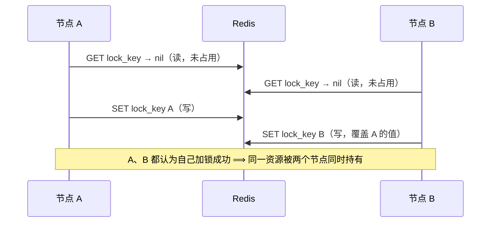
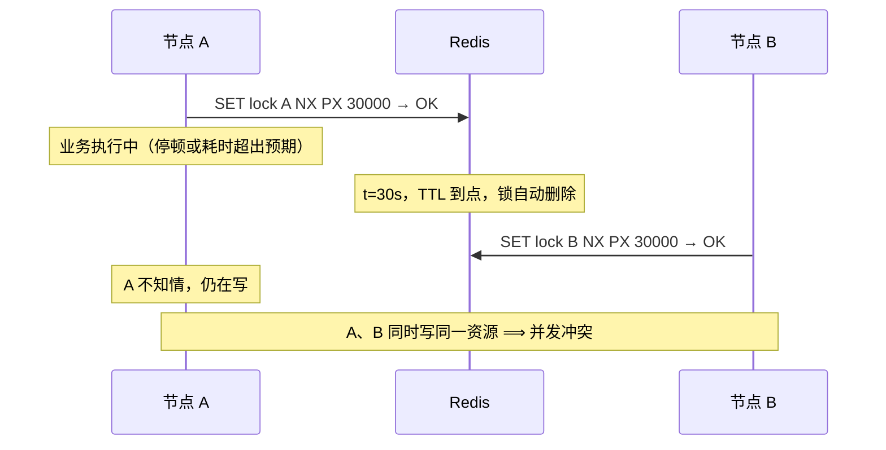
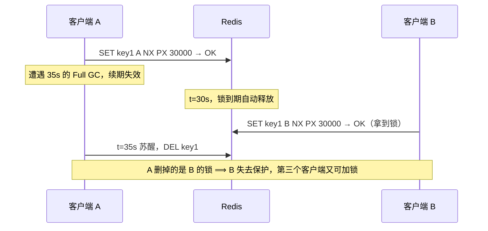
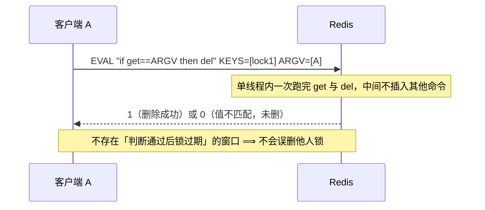
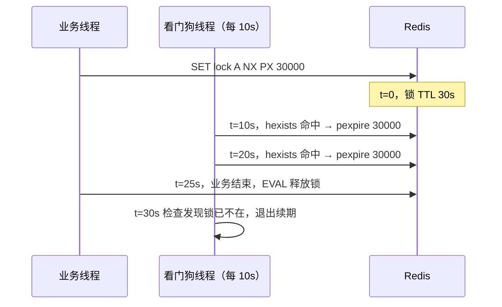
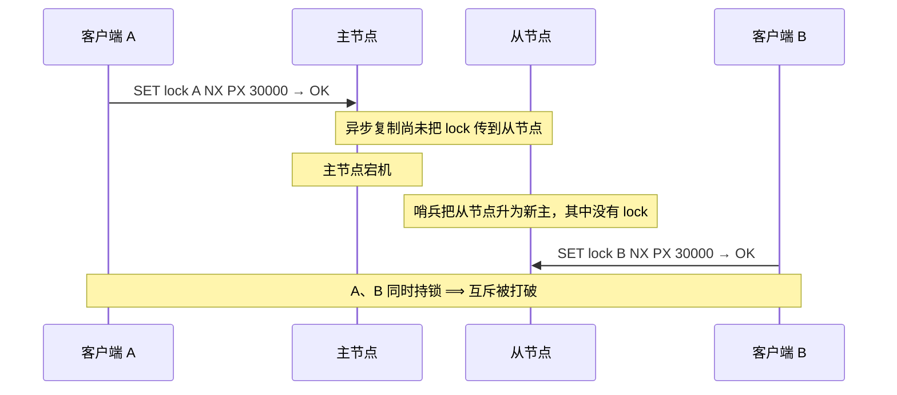
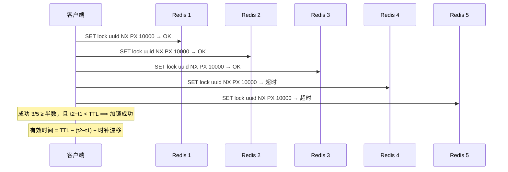

---
tags:
  - 中间件/Redis
---

# 分布式锁

Redis 常被拿来当分布式锁的存储，理由是它天然被多客户端共享、读写都在内存完成、`SET` 命令的 `NX` 选项直接给出互斥语义。本篇按「锁要解决什么 → 四类冲突 → 加锁 → 释放锁 → 续期 → 等待与重试 → 高可用 → 工程实现 → 性能与替代 → 边界 → 参数 → 排查」展开，落点放在两处：**判断与设置、判断与删除为什么各自必须合成一条命令**，以及**一把 Redis 锁在什么条件下会失效**。行为与默认值按 Redis 7.x 与 Redisson 现行实现核对，涉及版本差异处单独标出。

## 1. 分布式锁要解决的问题

单机内的并发控制用 `synchronized`、`ReentrantLock` 这类本地锁：锁状态保存在进程自己的内存里，同一个进程的所有线程都能看到，竞争在本地完成，不经过网络。分布式场景下同一个业务请求可能被负载均衡转发到任意实例，几个实例的线程各自在自己进程里加锁，看不到对方的锁状态，本地锁的互斥就不再成立。要让多个进程遵守同一条互斥规则，需要一个所有进程都能访问的共享存储来保存锁变量。

Redis 满足这个需求：它本身被多个客户端共享访问，锁变量写在 Redis 上；读写都在内存完成，一次锁操作的延迟在毫秒级；`SET` 命令的 `NX` 选项提供「key 不存在才写入」的语义，正好对应加锁的「只有一个客户端能成功」。数据库、ZooKeeper、etcd 也能提供共享的互斥点，选 Redis 的出发点通常是把锁的读写留在已经存在的缓存层里，省掉一套额外的协调组件（来源：Redis, *Distributed Locks with Redis*）。

### 1.1 本地锁的边界

本地锁与分布式锁的差别不在「互斥」这个目标，而在锁状态放在哪里、谁能看到它、进程崩溃后它去哪。

| 维度 | 本地锁 | 分布式锁 |
| --- | --- | --- |
| 锁状态位置 | 进程内存 | 共享存储（Redis / ZooKeeper / 数据库） |
| 可见范围 | 同一个进程的线程 | 所有能访问共享存储的进程 |
| 获取代价 | 内存 CAS，纳秒级 | 一次或多次网络往返 |
| 进程崩溃 | 锁随进程一起消失 | 锁留在共享存储，要靠过期或会话回收 |
| 典型失效 | 只在本进程内死锁 | 僵尸锁、锁过期、主从切换丢锁 |

被最后一行点名的问题决定了本篇后面的结构：本地锁不会「锁没释放」，因为进程一死锁就没了；分布式锁的持有者与锁的存储是两个进程，持有者死了锁还在，所以必须给锁加上「什么时候自动失效」这条规则。同理，本地锁的锁状态不会被复制到别处，分布式锁一旦落在主从架构上，就要面对复制延迟带来的新问题。

还有一个语义差别：本地锁的「锁归谁」由线程对象直接确定，谁的线程拿到就是谁的；分布式锁的「锁归谁」没有现成的载体，必须由加锁时写入的标识来记录。这一点解释了加锁命令里为什么一定要带一个客户端生成的唯一标识（第 3 节）：它同时承担「谁能释放这把锁」的判断依据，以及「这次加锁是不是我上次发的」的重试依据。

### 1.2 一把合格的锁要满足的三条性质

官方文档把分布式锁要保证的性质归为三条（来源：Redis, *Distributed Locks with Redis*）：

1. **安全性**：任意时刻只有一个客户端持锁（互斥）。
2. **无死锁**：持锁客户端崩溃或网络分区后，锁最终仍能被其他客户端获取。
3. **容错**：只要多数 Redis 节点在线，客户端就能加锁和释放锁。

把这三条对应到后文：互斥由加锁命令的原子性保证（第 3 节）；无死锁由过期时间与续期保证（第 5 节）；容错由多实例部署或可接受近似的单实例方案承担（第 7 节）。三条性质之间存在取舍——过期时间越短，「业务没跑完锁就到期」的风险越高，但「持锁者崩溃后别人要等多久」越短。第 5 节的续期机制就是为了把这个取舍从「业务总时长」上解耦下来。

## 2. 四类冲突

把三条性质放回真实部署，冲突集中在四个位置：判断与设置之间的窗口（锁争抢）、锁不释放（僵尸锁）、锁先于业务释放（锁过期）、锁存储本身不可靠（单节点与主从）。前两类分别对应互斥与无死锁，第三类是加过期时间带来的副作用，第四类对应容错。四类各自的成因与后果如下。

### 2.1 锁争抢：判断与设置之间的窗口

拿到锁需要两步：先判断锁当前有没有被占用，确认空闲后再写入自己的锁。这两步分开执行时，中间存在一个可被其他节点插入的窗口。

设想节点 A 先查询锁状态，读到「没人占用」，正在准备写入；节点 B 几乎在同一时间也查询，读到同样的结果；接下来两个节点各自完成写入，都认为自己是唯一的持锁者，随后同时操作同一份共享资源。



窗口的宽度等于「判断」与「设置」之间那一段时间。窗口内其他节点做的判断都会读到「空闲」，于是互斥被打破。要把窗口关掉，唯一可靠的做法是让「判断不存在」与「写入」在一次不可分割的操作里完成——这正是第 3 节 `SET ... NX` 要解决的问题。同样的结构在释放锁时又出现一次：判断归属与删除之间也有窗口（第 4 节）。

窗口不在 Redis 内部，而在客户端与服务器之间。Redis 单线程逐条执行命令，它能保证一条命令内部不被插入别的命令；它无法把某个客户端先后发出的两条命令绑成一个整体。客户端 A 发 `GET` 与 `SET`，客户端 B 也发 `GET` 与 `SET`，四条命令到达服务器后的执行顺序可能是：

```text
   服务器按命令粒度串行，但不按客户端配对
   ┌────────────────────────────────────┐
   │ GET lock_key（A） → nil             │
   │ GET lock_key（B） → nil             │  ← 两次判断都读到空闲
   │ SET lock_key A                     │
   │ SET lock_key B（覆盖 A 的值）        │  ← 两次设置都执行
   └────────────────────────────────────┘
   Redis 没有违反自己的执行顺序；
   被打破的是「A 的两条命令」与「B 的两条命令」之间的互斥
```

把这两条命令合并成服务器端的一条命令（第 3 节的 `SET ... NX`），或写成一个 Lua 脚本由服务器一次执行完，窗口才会关闭。用 `WATCH` + `MULTI` 做条件写入同样能表达「不存在才设置」，但它把冲突交给客户端重试，高并发下重试次数会被放大（见 10.1 的边界讨论）。

**怎么发现锁争抢。** 争抢本身不报错，只能从两个方向观察：服务端用 `INFO commandstats` 看 `cmdstat_set` 的调用次数，短时间内的调用量远高于业务量，说明有大量无效重试；客户端侧统计加锁失败率与平均等待时长，失败率随并发上升而陡增，说明临界区已成为热点。争抢的后果是互斥被打破后的数据异常，因此观测到高失败率时，先确认加锁命令是否原子，再考虑收敛（第 9 节）。

**争抢是常态，不等于锁坏了。** 要把两件事分开：正常的争抢是多个客户端同时发 `SET ... NX`，服务端串行执行，只有一个拿到 `OK`，其余收到 `nil`，互斥没有被破坏；出问题的是本节开头那套「两步判断」写法，那是加锁命令不原子导致的 bug。观测到加锁失败率高，先确认失败是「别人先拿到了」还是「两个都拿到了」——前者是预期行为，后者才需要改命令。区分方法是看进入临界区的是不是只有一方；如果两个客户端都进了临界区，命令就必须改。

高失败率本身仍有代价：每个失败的客户端都会消耗一次网络往返。降低它的手段是收敛并发（第 9 节）与给重试加随机退避——多个客户端用固定间隔重试会形成节拍一致的重试潮，随机化间隔能把它们错开。退避的取值有两条边界：间隔应大于一次锁操作的往返时间，否则退避不起作用、仍在高频打；间隔应小于锁的平均持有时间，否则锁已经空出来、客户端还在睡。这两条给出一个量级范围，具体值按监控里的实际持有时间分布调。

### 2.2 僵尸锁：崩溃后锁不释放

节点拿到锁后如果没有给锁设过期时间，一旦节点宕机或程序报错，它就无法执行释放操作。这条锁记录会一直留在 Redis 里，没有任何人能删掉它——后续所有想操作该资源的节点都被挡在门外，整条业务线阻塞。

僵尸锁的根因是「锁的持有者」与「锁」处在两个生命周期里：持有者进程崩溃，「删除锁」这一步不会发生。自动过期的锁不会有这个问题，因为兜底方从持有者变成了 Redis 自己。这也解释了为什么过期时间是不可选项：它会带来 2.3 的新问题，但把 2.2 这条路径彻底堵死，收益更大。

### 2.3 锁过期：过期时间与任务时长不匹配

加上过期时间后出现反向的失效路径：节点拿到锁、设好 TTL 后投入业务处理，业务还没跑完，锁先到期，Redis 自动释放了锁，而原持有者对此毫无察觉，仍在继续写。此时另一个节点发现锁已空闲，顺利抢到锁，开始操作同一份资源。结果是两个节点同时持锁、同时写。

把两条路径并排看，过期的意义更清楚——短 TTL 让 2.2 的恢复更快，却让 2.3 更容易发生；长 TTL 反过来。

```text
   节点加锁后的两条失效路径（互相牵扯的同一个参数：TTL）

   成功 SET NX
        │
   ┌────┴─────────────────────────┐
   ▼                              ▼
 不设 TTL                       设了 TTL
   │                              │
 节点崩溃                        业务耗时 > TTL
   │                              │
   ▼                              ▼
 锁永远留在 Redis                锁被 Redis 自动释放
 ── 僵尸锁，后续节点全堵 ──      另一节点抢到锁
                                │
                                ▼
                          原持有者仍在写
                          ── 两个节点同时持锁 ──
                                │
                                ▼
                          续期机制（第 5 节）从这里介入
```

2.3 的触发条件不止「业务本来就慢」：一次 Full GC 停顿、一段网络延迟、一次超出预期的计算，都可能让实际耗时超过 TTL。这类停顿无法事前排除，所以第 5 节用「TTL 设短 + 后台续期」来覆盖它。

把过期这条路径单独画成时间线，能看清它是怎么从「锁自动释放」走到「两个节点同时写」的：



把 TTL 设为业务耗时的若干倍并不能消除这条路径：TTL 是一个固定值，而停顿的长度没有上界，一次 stop-the-world 停顿可以长达数分钟，任何有限的 TTL 都可能被超过。**正确的做法是让锁的有效期跟随持有者的存活**——TTL 取一个较短的固定值，只要持有者还在推进就不断把它重置回原值；一旦持有者停住（停顿或崩溃），重置停止，TTL 到点自动释放。这就是第 5 节续期机制的由来，它把「TTL 该设多长」这个难题从「覆盖业务最长耗时」换成了「覆盖一次续期间隔」。

落到取数上，TTL 不该按平均耗时估算。平均耗时只说明一半请求的情况，判断 TTL 是否够用要看耗时分布的上尾——例如 P999 是 5 秒，TTL 取 10 到 20 秒留出缓冲，比按平均值取 1 秒稳妥得多。即使这样取值，上尾之外仍有极少数超长的请求，续期机制是覆盖这些尾巴的手段。

把「让锁留在持有者手上」的三种做法并排看，能看清续期为什么是前两行的折中：

| 做法 | 僵尸锁风险 | 业务超 TTL 丢锁风险 | 崩溃后恢复速度 |
| --- | --- | --- | --- |
| 不设过期时间 | 高（永久占用） | 无 | 需人工清理 |
| 设一个很长的 TTL | 低 | 低 | 慢（要等很久） |
| 设短 TTL + 续期 | 低 | 低 | 快（TTL 到点即回收） |

第三行把前两行的优点合起来，代价是引入续期线程以及续期失败的处理逻辑（第 5 节）。这也说明续期与过期时间的关系是配合：过期时间是兜底，续期只延长「持有者还活着」时的有效期，最终把锁收回的仍然是 TTL。

### 2.4 存储不可靠：单节点宕机

前三类冲突都建立在「锁的存储足够稳定」这个前提上。只用一个 Redis 单节点存锁时，节点一旦宕机，加锁、解锁、查锁状态的操作全部不可用，锁机制整体瘫痪，共享资源随即失去保护。

用主从复制加哨兵看起来能补上可用性，但异步复制会引出第四类问题的一个更隐蔽的变体：锁可能在故障转移后消失。这一条的正确性影响比不可用更严重，单独放在 7.1 节讲透，因为它是 Redlock 的动机。这里先记住分界——2.4 的后果是「锁服务不可用」，7.1 的后果是「同一时刻出现两个持锁者」。

## 3. 加锁：判断与设置合成一条命令

2.1 的窗口要靠单条命令关掉。Redis 提供的选项组合是 `SET lock_key unique_value NX PX 30000`，一条命令同时完成「判断 key 不存在」「写入」「设置过期时间」三件事。

### 3.1 SETNX + EXPIRE 的分步窗口

最朴素的写法是两条命令：`SETNX lock_key value` 负责「key 不存在才写入」，返回 1 表示加锁成功、返回 0 表示失败；再用 `EXPIRE lock_key 30` 给锁设过期。问题在于 `SETNX` 本身不设 TTL，第二条命令必须补上，而两条命令之间存在窗口：如果 `SETNX` 已成功、`EXPIRE` 尚未执行时进程崩溃，这把锁就永久留在 Redis 里，退化成 2.2 的僵尸锁。

```text
   加锁的两条路径

   分步：SETNX lock_key value
        ┌───────────┐      ┌──────────┐
        │ SETNX 成功 │─────▶│ 进程崩溃  │  锁没有 TTL，永久占用
        └───────────┘      └──────────┘
             （EXPIRE 还没来得及执行）

   单条：SET lock_key value NX PX 30000
        ┌───────────────────────────────────┐
        │ 判断不存在 + 写入 + 设置 TTL        │  中间没有可插入的窗口
        └───────────────────────────────────┘
        加锁成功返回 OK；key 已存在返回 nil
```

用 Lua 脚本把 `SETNX` 与 `EXPIRE` 包起来也能关掉窗口，但那等于自己实现一条 Redis 已经备好的命令。单条 `SET` 更短，也让客户端与服务端之间只发生一次往返。这也解释了后面 6.2 的加锁超时重试为什么要靠 value 判归属——重试的前提是「上次到底加没加上」可被查询，而 `SET ... NX` 的原子性保证了「加上」就意味着「TTL 也一起加上了」。

### 3.2 SET key value NX PX 的语义与 value 的唯一性

`SET lock_key unique_value NX PX 30000` 逐段拆开（来源：Redis, *SET*）：

- `lock_key` 是锁的键名，对应被保护的资源；
- `unique_value` 是客户端生成的唯一标识，例如 UUID 或请求 ID，用来区分不同客户端的加锁操作；
- `NX` 只在 `lock_key` 不存在时才写入，key 已存在时命令不做任何修改；
- `PX 30000` 把该 key 的过期时间设为 30000 毫秒（30 秒）。

返回值有两态：成功设置返回 `OK`，条件不满足（key 已存在）返回 `nil`（Null bulk string）。客户端据此判断加锁是否成功。

**value 用唯一标识有两个用途。** 一是释放锁时校验归属：只有 value 等于自己的标识才删除，避免误删别人的锁（第 4 节）。二是加锁超时后重试时判断上次是否成功：单看「现在有没有锁」无法区分「别人持有」与「自己上次其实加上了、只是响应丢了」，靠 value 才能分清（6.2 节）。官方示例里这个 value 取 `/dev/urandom` 的 20 字节，或退一步用微秒时间戳拼客户端 ID（来源：Redis, *Distributed Locks with Redis*）。

**TTL 单位用 `EX` 还是 `PX`。** 两者语义相同，只有单位不同：`EX` 按秒、`PX` 按毫秒。锁的 TTL 常与看门狗的续期间隔（默认 10 秒量级）、加锁超时重试的超时（几十毫秒量级）处在同一量级，用毫秒更便于和这些参数对齐；官方锁示例直接用 `PX 30000`，另一种常见写法是 `SET ... EX 30`，二者等价，选哪个不影响正确性，只要 TTL 明显大于业务预期耗时。`EX` 与 `PX` 属于同一组互斥选项，不能同时出现；`NX` 与 `GET` 的组合自 Redis 7.0 起被允许（来源：Redis, *SET* 版本历史）。

**value 要每个加锁请求新生成，不能复用常量。** 唯一性覆盖的范围是「所有客户端、所有加锁请求」，粒度到每一次请求。若同一客户端在多次加锁里复用同一个常量，遇到「上一把锁还没过期、客户端又发起一次加锁」时，服务端无法区分这两次加锁，6.2 里「等于自己的标识」那条判定会把两次请求混成一次。因此每次加锁都应生成新的随机值；官方建议取 `/dev/urandom` 的 20 字节，也接受「客户端 ID + 微秒时间戳」这类足够唯一的拼接（来源：Redis, *Distributed Locks with Redis*）。value 的长度不影响锁的正确性，只影响单键占用的一点内存。

`SETNX` 与 `SET ... NX` 的差别可以并成一张表：

| 维度 | `SETNX key value` | `SET key value NX PX ttl` |
| --- | --- | --- |
| 返回值 | 1（设置成功）/ 0（key 已存在） | `OK`（设置成功）/ `nil`（key 已存在） |
| 能否同时设 TTL | 不能，需另发 `EXPIRE` | 能，`EX` / `PX` 选项一次完成 |
| 原子性覆盖范围 | 只覆盖「判断 + 设置」 | 覆盖「判断 + 设置 + 设 TTL」 |
| 官方定位 | 可被 `SET` 选项替代，未来可能弃用 | 官方推荐的锁写法 |

这个差别直接决定加锁能不能一条命令做完：`SETNX` 的原子性只覆盖前两步，第三步的 TTL 落在原子范围之外，于是 3.1 的窗口重新出现；`SET ... NX` 把 TTL 纳入同一次原子操作，才把窗口完整关闭。官方明确 `SET` 的选项可替代 `SETNX`、`SETEX`、`PSETEX`、`GETSET`，这些命令未来可能被弃用并移除（来源：Redis, *SET*）。Redis 8.4 起 `SET` 还新增了 `IFEQ` / `IFNE` 等条件选项，以及可直接完成「值匹配才删除」的 `DELEX key IFEQ value` 命令；在 7.x 上，释放锁仍用 4.2 的 Lua 脚本。

## 4. 释放锁：判断归属再删除

加锁时把唯一标识写进 value，是为了在释放时能回答一个问题：此刻 key 上的锁是不是我加的。直接删除无法回答这个问题。

### 4.1 直接 DEL 删掉的是谁的锁

看一个时间线：客户端 A 加锁 `key1`，TTL 30 秒；A 遭遇一次长达 35 秒的 Full GC，续期随之失效；第 30 秒锁自动过期；第 31 秒客户端 B 抢到这把锁；第 35 秒 A 从 GC 中苏醒，业务执行完毕，执行 `DEL key1`——它删掉的是 B 的锁。



后果不止「B 丢锁」：A 的这一删让资源瞬间对所有节点开放，B 却仍以为自己持锁在写，同时可能再有节点加锁成功，并发写就此发生。

修法是释放前校验 value 是否等于自己的标识，相等才删。这里又出现 2.1 同构的窗口：`GET` 校验通过之后、`DEL` 执行之前，锁仍可能到期并被别人重新设置，此时 `DEL` 删掉的是新持有者的锁。因此「校验 + 删除」同样必须原子完成。

### 4.2 Lua 的判断-删除原子性与执行边界

Redis 执行 Lua 脚本的方式是把它当作一条命令在单线程里跑完，脚本执行期间不会插入其他客户端的命令。因此把一个「取值比较 + 删除」的脚本交给 `EVAL`，两步之间就没有窗口（来源：Redis, *Distributed Locks with Redis*）：

```lua
-- KEYS[1] = 锁的 key；ARGV[1] = 客户端的唯一标识
if redis.call("get", KEYS[1]) == ARGV[1] then
    return redis.call("del", KEYS[1])
else
    return 0
end
```

返回 1 表示删除成功，返回 0 表示 value 不匹配（锁已不属于自己或已不存在），脚本不做删除。



**执行边界。** 脚本的原子性建立在「执行期间独占实例」上，代价是长脚本会阻塞其他所有命令。Redis 用 `lua-time-limit` 给脚本执行时间设上限（默认 5000 毫秒）：超过后 Redis 对大多数命令返回 `BUSY`，只放行 `SCRIPT KILL`、`FUNCTION KILL`、`SHUTDOWN NOSAVE` 等少数命令，且 `SCRIPT KILL` 只能终止尚未执行过写命令的脚本（来源：`redis.conf`）。释放锁的脚本只有一次比较和一次删除，正常不会触及这个上限；把这个边界写出来是为了说明：**不要在锁脚本里做重活**，否则阻塞的是整个实例而不是单个客户端。参数细节见 11.1。

## 5. 续期：看门狗机制

2.3 的失效路径来自「TTL 比业务短」。把 TTL 设长能缓解它，却让 2.2 的恢复变慢，取舍仍然存在。续期把这两个量解耦：TTL 设一个较短的值，业务执行期间由后台线程按固定节奏把 TTL 重置回原值，只要持有者还活着，锁就一直有效。

### 5.1 锁过期如何变成双持锁

续期要解决的场景是：TTL 到点后锁被自动释放，原持有者不知情，另一节点抢到锁，两个节点同时操作资源。触发它的常见原因有三类——Full GC 造成的进程停顿、网络延迟、超出预期的计算量。这三类都无法在事前彻底排除，所以说「把 TTL 设得足够长就安全」并不成立：任何有限 TTL 都可能被一次足够长的停顿超过。

续期机制的时间账要算清楚：续期线程必须在「当前 TTL 剩下的时间」内完成下一次续约，否则锁仍会到期。Redisson 的做法是让续期周期远小于 TTL，留出重试余量。这里还有一个前提要写明：**续期线程与持锁进程同生共死**。进程崩溃，续期线程随之停止，锁终究会到期释放——这正是无死锁性质仍然成立的原因；续期只延长「持有者活着」时的 TTL，不制造新的僵尸锁。

### 5.2 看门狗的时间轴与续期失败

Redisson 内置了续期（看门狗）机制。默认值：锁看门狗超时为 **30 秒**，可通过 `Config.lockWatchdogTimeout` 修改（来源：Redisson, *Locks and synchronizers*）。续期只在获取锁时未显式指定租约时间（`leaseTime`）时启动；若指定了 `leaseTime`，锁到期即释放，不再续期。

续期的周期取 `internalLockLeaseTime / 3`，代入默认值即 **每 10 秒一次**（来源：Redisson 源码 `RenewalTask.schedule()`）。每次续期执行的脚本用 `HEXISTS` 判断锁是否仍属于当前线程，属于则用 `PEXPIRE` 把 TTL 重新设为 30000 毫秒（来源：Redisson 源码 `LockTask`）：



图里 10 秒的续期间隔给了 20 秒的余量：即使某一次续期因网络抖动失败，下一次仍在 TTL 之内，避免锁被 5.1 那条路径释放掉。

**续期失败怎么办。** 如果续期连续失败直到锁过期，原持有者已经丢失锁的归属，继续执行业务就会与已经抢到锁的节点并写。两种应对（来源：Redisson, *Locks and synchronizers*）：保守策略是续期失败即认为归属丢失，业务立即中断并回滚，对一致性最严格；激进策略是假设续期失败是小概率事件、业务继续，用一致性换可用性。

**框架能做的与业务要做的。** 分布式锁框架无法替业务中断执行，它只能在续期失败时发出一个中断信号（例如设置 `volatile` 标志位，或调用线程的 `interrupt()`）。是否响应这个信号取决于业务代码：大循环在每个循环开头检测一次，多步骤流程在每个关键步骤之后检测一次。这一层需要业务主动配合，框架单靠自己是做不到的。

两种取得 TTL 的模式并排看，取舍点在「业务耗时的上界是否已知」：

| 模式 | TTL 来源 | 是否续期 | 锁何时释放 | 适用 |
| --- | --- | --- | --- | --- |
| 显式 `leaseTime` | 调用方传入 | 否 | 业务主动释放，或到期 | 业务耗时上界明确且较短 |
| 看门狗 | `lockWatchdogTimeout`（默认 30 秒） | 是，每 `TTL/3`（默认 10 秒） | 业务主动释放，或持有者停顿/崩溃后到期 | 业务耗时不确定 |

**续期脚本同时是一次归属探测。** `HEXISTS` 返回 0 说明 field 已不在（锁已过期，或已被别人持有），此时脚本不执行 `PEXPIRE`，续期线程的外层逻辑据此判定「本客户端已失去锁」，进而发出中断信号。这条探测把 5.1 里那种「静默丢锁」变成持有者可以感知的事件——没有它，持有者要等业务写完才发现自己早已不持锁。

**多项锁的续期是批量做的。** 同一个客户端可能同时持有多把锁，逐个续期会把网络往返放大。Redisson 的续期任务把同一实例上的多把锁合并成一批发送（`lockWatchdogBatchSize` 控制每批大小）；在 Cluster 部署下，任务按 key 所属的哈希槽分组，再逐槽批量续期，避免跨槽的单条往返（来源：Redisson 源码 `RenewalTask`）。

**看门狗覆盖不到的地方。** 它只能延长「持有者还活着」时的锁，覆盖不了进程崩溃（续期线程随进程一起消失），也覆盖不了续期连续失败。把「开了看门狗就不会丢锁」当成前提，业务在锁提前释放时就缺少兜底。稳妥的做法是两条并行：尽量把临界区做短，让持有时间落在 TTL 与续期间隔能覆盖的范围内；同时给临界区内的写操作准备可回滚或可重放的兜底，避免锁一旦提前释放就有两个线程同时改数据。

**续期间隔为什么取 TTL 的三分之一。** 这个比例能在时间轴上算出来：若间隔取 TTL 的一半，一次续期失败后只剩半个 TTL 可以重试；取三分之一时，第一次失败后还剩三分之二的 TTL，至少还能再补两次，对网络抖动更耐受。间隔越短抗抖动越强，代价是续期请求频率越高、对 Redis 的压力越大。

## 6. 等待与重试

加锁失败后立即返回失败在很多场景不可接受，需要有等待；而等待过程中遇到网络超时，又引出「上次到底加上没有」的判定问题。

### 6.1 轮询与事件通知

两种主流等待策略（来源：Redisson, *Locks and synchronizers*）：

- **轮询（Spin Lock）**：加锁失败后 `sleep` 一段（例如 100 毫秒）再重试 `SET ... NX`，直到成功或超过总等待时间。总等待时间应约等于锁的平均持有时间——例如监控显示 99% 的业务在 800 毫秒内完成，总等待取 1 秒是合理的。实现简单，代价是无谓的 `sleep`（锁刚释放线程还在睡）和频繁的无效查询，实时性差、空耗资源。
- **事件通知**：利用发布订阅（Pub/Sub）或键空间通知（Keyspace Notifications），加锁失败的客户端订阅 `lock_key` 的删除事件，锁被释放时由 Redis 主动通知，订阅者再重试加锁。实时性与资源占用都优于轮询，实现更复杂。

事件通知有一个容易漏的竞态：从「`SET ... NX` 失败、发现锁存在」到「发起订阅」之间存在一个间隙，如果锁恰好在这段间隙里被释放，客户端会错过这次通知，陷入永久等待。工程上要把这个顺序做严密——先订阅再检查，或把订阅与检查合成一个有序动作，不能让「检测到锁存在」和「发起订阅」之间留空档。

### 6.2 超时重试的幂等识别

分布式环境里网络抖动是常态。客户端发出 `SET ... NX` 后收到超时响应时，它无法判断这次加锁到底成功没有——贸然重试可能重复写入，不重试又可能漏掉一次已经成功的加锁。value 用唯一标识后，重试逻辑可以分三种情况判定（来源：Redis, *Distributed Locks with Redis*）：

| 重试前 `GET lock_key` 的结果 | 含义 | 动作 |
| --- | --- | --- |
| `nil`（key 不存在） | 上次加锁没有到达 Redis 或执行失败 | 安全地重新执行 `SET ... NX` |
| 等于自己的标识 | 上次其实已经成功，只是响应包丢了 | 重置 TTL，按「加锁成功」返回 |
| 等于其他客户端的标识 | 锁已被别人持有 | 视为加锁失败，进入 6.1 的等待逻辑 |

判定依据仍是 value 的唯一性，与 4.1 的释放校验同源：一个唯一标识同时覆盖「谁加的锁」和「这次加锁是不是我上次发的」两个问题。实践中 Redis 性能高，加锁超时少见，重试一两次足够；即使重试一直超时，理论上也无需额外处理——若上次已成功，最坏是 TTL 到期后自然释放；若上次没成功，别人需要时自然能拿到锁。

## 7. 高可用：主从丢锁与 Redlock

单实例 Redis 的可用性瓶颈由 2.4 给出：节点宕机，锁服务整体不可用。一个自然的修法是上主从复制加哨兵，但异步复制会引入比「不可用」更严重的正确性问题。这一节先讲透这个问题，它是 Redlock 的动机，再讲 Redlock 与围绕它的争议。

### 7.1 主从异步复制下的锁丢失

Redis 的主从复制是异步的：主节点执行完写命令就返回给客户端，之后才把命令传播给从节点。把锁建在主从上时，这个「先返回、后复制」的顺序会造成锁丢失（来源：Redis, *Distributed Locks with Redis*）：



故障转移在这条时间线上把「A 持锁」这件事抹掉了：新主节点上根本没有 `lock` 这个 key，客户端 B 的加锁请求畅通无阻。与 2.4 的单节点宕机相比，这里的后果是**同一时刻出现两个持锁者**，数据可能被两个节点同时改写；单节点宕机只是让锁服务暂不可用。前者破坏安全性，后者破坏可用性，两者的严重程度不同。

这个窗口来自异步复制模型本身，并非「复制偶尔慢」造成的偶发现象：主节点返回成功后、传播完成前的任何一刻都可能是宕机点，窗口宽度随复制延迟变化，但不会消失。Redisson 的 `checkLockSyncedSlaves`（8.2 节）试图缩小这个窗口，它缩的是窗口宽度，不能把它关成零。这条路径成立需要三个条件同时出现：复制是异步的；故障转移发生在这把锁的 TTL 之内；新主节点上没有这把锁。

**同步等待能不能关掉这个窗口。** Redis 提供 `WAIT numreplicas timeout`：在 `SET ... NX` 之后调用它，可以阻塞到指定数量的副本确认已收到这次写入。它把「锁已写入主节点」与「锁已到达副本」之间的间隙显式等出来，窗口收窄；但 `SET` 与 `WAIT` 仍是两条命令，两条命令之间仍有间隙，且 `WAIT` 只保证副本收到写入、不保证故障转移一定选中持有该 key 的节点。它降低概率，不能把窗口关成零。

**为什么多加副本也解决不了。** 根因是「主节点先返回成功、再传播」，副本数量不改变这个顺序。增加副本只提高「其中至少有一个能升主」的概率，不保证升主的那个已经持有这把锁。要把正确性建在复制上，需要的是「写必须在多数副本确认后才返回」这种同步提交语义，Redis 的复制默认不提供它；上面那些手段都只是在压缩第 1 条或第 2 条的时间，改变不了「异步复制 + 自动故障转移」这个组合下窗口非零的事实。

**崩溃节点延迟重启。** 故障转移后，旧主节点若带着「内存里的锁已丢、别处还在」的状态立刻重启，可能让集群里同时存在旧锁与新锁。Kleppmann 转述 Redlock 文档的建议是：崩溃节点重启要延迟至少一个「最长锁的 TTL」再上线（来源：Kleppmann, *How to do distributed locking*）。这条建议本身依赖对时间的测量，时钟跳变会破坏它——这正是 7.3 第 3 点要说的那件事。

**怎么观测这个窗口。** 从 `INFO replication` 读主节点的 `master_repl_offset` 与从节点的 `slave_repl_offset`，两者差值就是当前的复制延迟；差值越大，7.1 这条时间线里「加锁成功但尚未传播」的窗口越宽。故障转移前后对比这个差值，可以判断这次切换是否落在了危险窗口里。

**一个容易混淆的参数方向。** Redis 有 `min-replicas-to-write`（配合 `min-replicas-max-lag`），可以让主节点在「健康副本不足」时拒绝写入，它保护的是写入不被无声无息地留在单一节点上，属于数据耐久性范畴。7.1 要回答的是另一个问题：故障转移之后锁的互斥是否仍然成立。即使副本都健康、写入都到了副本，切换时新主节点是否持有这把锁仍取决于复制的时序。拿耐久性参数去推正确性结论，会漏掉窗口本身。

**为什么选主会选到一个没有这把锁的节点。** 哨兵或 Cluster 在选新主节点时依据的是「哪个副本的数据更完整、优先级更合适」这类判据，判据里不包含「这把锁有没有同步过去」。锁在主节点上停留的时间越短、复制延迟越大，新主节点缺这把锁的概率越高。

### 7.2 Redlock 的加锁流程与最小有效时间

Redlock 用多个互相独立的主节点替代单个实例来覆盖上面这条路径。官方设定 N 个完全独立的 Redis 主节点（示例 N=5），节点之间不做复制、不做隐式协调，加锁与释放都沿用单实例的 `SET ... NX PX` 与 Lua 脚本（来源：Redis, *Distributed Locks with Redis*）。加锁步骤：

1. 客户端取当前时间（毫秒）记为 t1；
2. 并行向全部 N 个实例用**相同的 key 名与相同的随机 value** 发送 `SET ... NX PX`，每个实例设一个远小于锁有效期的连接与响应超时（例如锁 TTL 10 秒时，超时取 5–50 毫秒），避免在宕机节点上久等；
3. 用当前时间减去 t1 得到加锁总耗时；当且仅当在**多数实例**上成功（N=5 时至少 3 个），且总耗时小于锁的有效期，才判定加锁成功；
4. 加锁成功时，锁的有效期按「初始有效期减去总耗时」重新计算；
5. 加锁失败时（成功数不足半数，或算出的有效期已经为负），向**所有**实例发起释放，包括那些它认为没加上的实例。

最小有效时间的计算来自安全论证：设 T1 是接触第一个服务器之前取的时间、T2 是收到最后一个服务器回复的时间，则这一批 key 中最早到期的那个至少还能存活（来源：Redis, *Distributed Locks with Redis*）：

```text
   MIN_VALIDITY = TTL − (T2 − T1) − CLOCK_DRIFT
```

括号里的 `(T2 − T1)` 是加锁过程本身消耗掉的时间，`CLOCK_DRIFT` 预留给各实例之间的时钟漂移。多个客户端同时抢锁时也可能同时成功，Redlock 用「加锁要用时小于有效期、否则视为失败并释放」堵住这种情况：只要总耗时没有超过 TTL，`N/2+1` 个 `SET NX` 就凑不齐，第二个客户端无法在同一时刻锁定多数节点。



失败后应等待一个**随机延迟**再重试，以打散多个客户端的重试节奏；同时最好并行发出 N 个 `SET`，把加锁过程压到最短，缩小脑裂窗口（来源：Redis, *Distributed Locks with Redis*）。

**安全论证的骨架。** 多数派为什么能保证互斥：若某个时刻已有 `N/2+1` 个实例上存在这把锁的 key，另一个客户端的 `N/2+1` 次 `SET NX` 里必然有落在已存在 key 上的失败，凑不齐多数，因此同一时刻不可能有两个客户端各自锁定多数节点。加锁过程本身耗时超过 TTL 时，这次加锁被判为无效并立即释放，把「两个客户端都勉强锁住多数」这条路也堵掉。

**节点必须彼此独立。** 官方要求这 N 个实例是完全独立的主节点，之间不做复制、也不做任何隐式协调（来源：Redis, *Distributed Locks with Redis*）。若其中几个节点其实是同一主从组，它们会一起故障、一起丢数据，「多数派」就退化成一个节点，7.1 的窗口重新出现。节点分布在不同物理机或机房，是为了让故障尽量独立发生。

**释放要发给所有实例。** 无论客户端认为自己在某个实例上加锁成功还是失败，释放阶段都向全部 N 个实例发送释放脚本（来源：Redis, *Distributed Locks with Redis*）。原因是加锁过程里存在「实际写成功了但响应超时」的实例，只释放「认为成功」的那几个会留下无人持有的锁，要等它 TTL 到期才消失。

### 7.3 Redlock 的争议：时钟、停顿与围栏令牌

Redlock 发布后引发了公开的技术争论，两方的论点都需要照实看待。

Martin Kleppmann（2016）的批评有三层（来源：Kleppmann, *How to do distributed locking*）：

1. **先分清锁的用途。** 效率型锁失效只是多做一次工作（多花几分钱、重复发一封通知）；正确性型锁失效会导致数据损坏或永久不一致。若锁只用于效率，单实例 Redis 足够，不必上 Redlock 的五个节点与多数投票；若锁用于正确性，Redlock 不适用。
2. **Redlock 不产生围栏令牌（fencing token）。** 带自动过期的锁都存在「持锁者已过期却仍在操作资源」的窗口。修法需要资源侧参与：每次写带一个单调递增的令牌，存储校验并拒绝比已见过的更旧的令牌。Redlock 的加锁成功不携带这样的单调令牌，因此无法阻止一个停顿后的旧持有者继续写。
3. **Redlock 的安全性依赖同步系统模型。** 它要求有界的网络延迟、有界的进程停顿、有界的时钟漂移。两个反例：某节点时钟向前跳，导致锁提前过期，两批客户端各自锁住多数组；或客户端在收到多数成功响应之前进入 stop-the-world GC，等它醒来时锁已全部过期且被另一客户端抢走，它仍按内核缓冲里的响应认为自己持锁。GC 停顿可以发生在任意位置，包括「最后一次检查之后、写存储之前」，靠事后补一次检查堵不住。

Kleppmann 的结论：Redlock 对效率型锁太重，对正确性型锁又不够安全；需要正确性时应改用 ZooKeeper 这类共识系统，并在资源侧强制校验围栏令牌。

### 7.4 antirez 的回应

Redlock 的作者 antirez 逐条回应（来源：antirez, *Is Redlock safe?*）：

1. **围栏令牌的前提可疑。** 若要存储层能按令牌拒绝旧写，它本身已是一个线性一致存储，能解决竞争；分布式锁恰恰用在「对共享资源没有其他控制手段」的场合。Redlock 每次加锁关联一个 20 字节的大随机令牌，足以支撑 Check-and-Set 式的使用。
2. **时序假设被误读。** Redlock 不要求有界的绝对时钟误差，只要求各进程能以相近的「速率」计时——例如一段 5 秒的计时允许 ±10% 的偏差（4.5 或 5.5 秒都行）。手动改系统时钟与 ntpd 的大幅跳变都可以避免（后者用渐进式 slew）。他同意 Redis 与 Redlock 应改用单调时钟 API。
3. **停顿不打破加锁判定。** 官方加锁流程在拿到多数响应之后会再次取当前时间、检查是否已经超时（对应 7.2 的步骤 3）。因此无论消息或进程发生多长的延迟，一个实际上已超时的加锁都不会被当成成功。获取锁期间发生的进程停顿不影响算法的正确性，只影响「客户端能否在 TTL 内完成工作」，而这是所有带自动过期的锁共有的问题。

双方在一个点上是有共识的：锁的持有不应被当成「持锁进程活着就一直有效」，单调时钟比墙上时钟更适合计时。当前官方页面已经把这两点写进免责声明，明确建议使用围栏令牌，并提醒 Redis 的 TTL 过期不使用单调时钟，墙上时钟跳变可能导致锁被多个进程同时持有（来源：Redis, *Distributed Locks with Redis*）。

## 8. Redisson 的锁模型

前面的机制在工程里通常由客户端库实现。Java 生态中最常见的是 Redisson，它把加锁、续期、释放脚本封装成 `RLock`，并对可重入、公平性、读写分离分别给出实现。

### 8.1 可重入锁的 Hash 与重入计数

Redisson 的 `RLock` 是可重入锁：同一个线程可以重复获取同一把锁。它在 Redis 里把锁存成一个 Hash——key 是锁名，field 是「客户端 ID:线程 ID」，value 是这个 field 被重入的次数（来源：Redisson 源码 `RedissonBaseLock`，其中 `HEXISTS` 用于判断归属、`HGET` 用于读取重入计数）：

```text
   Redisson 可重入锁在 Redis 中的存储
   key = myLock   （Hash 类型）
   ┌───────────────────────┬───────┐
   │ field                 │ value │
   ├───────────────────────┼───────┤
   │ <客户端ID>:<线程ID>     │   2   │  ← 同一线程重入 2 次
   └───────────────────────┴───────┘
   加锁脚本：field 不存在则置 1 并 pexpire；field 属于自己则计数 +1
   释放脚本：计数 −1；减到 0 才 DEL 整个 key，并发布释放通知
```

用 Hash 而不是单独一个字符串，是为了让「归属」和「重入次数」放在同一个 key 里，判断归属与增减计数同样在一个脚本内完成。续期脚本也用 `HEXISTS` 判断 field 是否存在，存在才 `PEXPIRE`（5.2 节）——这把锁的续期对象是 Hash 这个 key，判定条件是 field 仍属于自己。

### 8.2 公平锁、读写锁与副本同步检查

- **公平锁**：等待线程按请求先后排队，FIFO 获取；某个等待线程已死亡时，Redisson 等它返回 5 秒，5 个死线程对应 25 秒延迟（来源：Redisson, *Locks and synchronizers*）。
- **读写锁**：允许多个读锁持有者，只允许一个写锁持有者，读锁与写锁都实现 `RLock` 接口，同样有看门狗与 `leaseTime`。
- **副本同步检查**：`checkLockSyncedSlaves` 默认开启，加锁后等待锁传播到副本；等待上限由 `slavesSyncTimeout` 控制，**默认 1000 毫秒**，超时未确认则释放该锁并让加锁失败（来源：Redisson, *Locks and synchronizers*）。这一项只在主从/哨兵部署下有意义，它降低的是 7.1 那条路径的概率，替代不了围栏令牌。

Redisson 还提供非重入锁、非重入公平锁、MultiLock、Spin Lock、Fenced Lock 等变体。其中 Fenced Lock 提供围栏令牌，对应 7.3 与 10.2 讨论的那类正确性场景。

## 9. 性能与替代方案

锁本身有开销：每一次加锁、续期、释放都是一次或多次网络 I/O，高并发下锁竞争会成为瓶颈。可用的优化方向只有两类——减少到达 Redis 的竞争次数，或从源头去掉对锁的需求。

**Singleflight 收敛。** 借鉴 Go 的 `singleflight` 模式：同一实例内针对同一个 key 只允许一个线程去 Redis 竞争锁，其余线程在本地等待这个代表的结果。举例：2 个实例、每个 10 个线程抢同一把锁，无优化时 20 个线程涌向 Redis，收敛后每实例只出 1 个线程，共 2 个线程竞争。竞争越激烈收益越大；没有并发时基本无收益。

**本地锁交接。** 持锁线程释放前，若本地还有等待同一把锁的线程，直接在内存里把锁凭证转交给下一个线程，省下一次 `DEL` 与一次 `SET ... NX`。代价有两处：引入了本地状态依赖，实例崩溃或重启会断裂接力关系，而在 Redis 看来锁尚未释放，形成锁泄漏；锁语义从「Redis 统一仲裁」变成「Redis + 本地协作两个数据源」，一致性边界变模糊。生产环境中用得少。

**乐观锁替代。** 很多用锁保护的流程是「读取 → 计算 → 写回」，例如扣库存。给资源表加 `version` 字段后，`UPDATE ... WHERE version = 第1步查到的值` 把并发控制交给这次原子写：返回 0 行说明版本已被他人修改，从头重试即可。全程无锁，代价是可能有多个线程做重复计算，但只要最终写入控制住并发就不影响结果。

**一致性哈希路由。** 分布式锁的需求来自「同一个业务请求可能被负载均衡打到任意实例」。若能按业务 ID（如 `order_id`）做一致性哈希，把同一 ID 的请求固定路由到同一实例，竞争就从「分布式」退化成「单机」，在实例内用本地锁或 Singleflight 即可，不必引入分布式锁。代价是引入路由约束，扩容或缩容时要处理 rehash 期间的路由变化。

这两类的共同点是从前提上消掉「需要跨节点互斥」：乐观锁把互斥下沉到数据库的一次条件写，一致性哈希把互斥限制在单机内部。判断用哪一种，先问「这个流程为什么会出现并发」以及「去掉锁之后哪一步还能保证正确」。

**为什么不用 `WATCH` + `MULTI` 实现锁。** `WATCH` 能监视一个 key、在 `EXEC` 时若它被改动就中止事务，理论上可以实现「不存在才设置」。把它当锁用有两个代价：一是事务被中止后客户端要重新读、重新判断、重新提交，冲突越多重试轮次越多，高竞争下重试成本会盖过锁本身的开销；二是 `MULTI` 里无法根据前一条命令的返回值决定后一条是否执行，条件判断只能放在 `WATCH` 与 `EXEC` 之间由客户端完成，判断与提交之间又是两步。`SET ... NX` 用一条命令表达同样的语义，失败时直接返回 `nil`，省掉事务的重试循环。

## 10. 边界：什么时候不用 Redis 锁

Redis 锁的适用面由它的性质决定：读写在内存、延迟低、没有天然的单调令牌、故障转移下有丢锁窗口。沿着这几点可以划出该用与不该用的边界。

### 10.1 数据库唯一约束、ZooKeeper 与 etcd

- **数据库唯一约束**：幂等写入场景把互斥交给唯一索引——把 `order_no` 建成唯一索引后，重复插入直接因唯一键冲突失败，业务捕获重试即可，省掉「先查后插」那次锁定读。代价是冲突以异常形式暴露。行锁（`SELECT ... FOR UPDATE`）与事务绑定，长事务下锁范围可能失控，机制与排查见 `MySQL 06-锁、加锁分析与死锁`。
- **ZooKeeper**：客户端创建带 `sequence` 与 `ephemeral` 标志的子节点，序号最小的持有锁；释放即删除节点，会话断开时临时节点自动删除；等待者只 watch 比自己小一号的节点，因此不轮询、不产生惊群（来源：Apache ZooKeeper, *Recipes and Solutions*）。持锁与「会话存活」绑定，进程崩溃后由会话超时回收。
- **etcd**：锁基于租约（lease）——key 绑定租约，客户端用 `LeaseKeepAlive` 续租，租约到期或被撤销时该 key 被删除；锁的归属用创建修订号（creation revision）判定。revision 是 etcd 全局 64 位单调计数器，每次键空间修改递增，可作为围栏令牌（来源：etcd, *etcd API*）。

三者的取舍可以并成一张对照表：

| 方案 | 互斥载体 | 进程崩溃后的回收 | 天然单调令牌 |
| --- | --- | --- | --- |
| Redis 单实例 | `SET ... NX PX` + Lua 释放 | TTL 到期 | 无（value 是随机标识，不单调） |
| Redis Redlock | 多数独立实例的 `SET ... NX PX` | 各实例 TTL 各自到期 | 无 |
| 数据库唯一约束 | 唯一索引 / 行锁 | 事务结束释放 | 可用自增列充当 |
| ZooKeeper | ephemeral + sequence 子节点 | 会话超时删除节点 | znode 序号单调递增 |
| etcd | lease + key，creation revision 判定 | 租约到期删除 key | revision 单调递增 |

Redis 两行的「无围栏令牌」是 7.3 批评的落点，也是选型时最需要先确认的一点：如果锁失效会造成数据损坏，就需要资源侧能校验一个单调令牌，而 Redis 锁本身不提供它。

### 10.2 Redlock 的适用边界与围栏令牌

Redlock 保证「同一时刻多数节点只有一个加锁成功」，不保证「已过期的持锁者不再操作资源」。7.3 与 7.4 的争论收敛到两点：

- **要保护外部资源时，锁本身不够，需要围栏令牌。** 令牌要由资源侧校验——写请求携带一个单调递增的值，资源拒绝比已见过更旧的值。Redis 锁不生成这种值，Redisson 的 Fenced Lock 或 ZooKeeper / etcd 的序号可以充当。
- **Redlock 的成本与收益要匹配用途。** 它需要 N 个独立节点、每次加锁多次网络往返，并依赖各节点时钟异常受控。锁只用于效率优化（重复计算的成本可接受）时，单实例 Redis 加看门狗通常就够；锁用于正确性且无法加围栏令牌时，应重新审视方案本身。

选型分叉可以先问一个问题：

```text
   锁失效会不会造成数据损坏？
        │
  否 ───┴────────────────────────── 是
   │                                │
   ▼                                ▼
 效率型锁                          正确性型锁
 ┌──────────────────────┐         ┌──────────────────────────┐
 │ 单实例 Redis + 看门狗 │         │ 资源侧能否校验单调令牌？  │
 └──────────────────────┘         └────────────┬─────────────┘
                                    能 ────────┴─────── 不能
                                     │                 │
                                     ▼                 ▼
                          ZooKeeper / etcd /     换个思路：
                          数据库自增列 + 围栏     乐观锁写回、
                          （Redis Fenced Lock）   一致性哈希路由
```

**围栏令牌的完整契约。** 一个可用的围栏令牌方案需要三件事同时成立：锁的授予带一个**单调递增**的编号，每次授予严格大于上一次；每次对受保护资源的写都携带当前持有的编号；资源侧记录见过的最大编号，拒绝比它更旧的写。三件事缺一不可——只做前两件、资源不校验，等于没有防护。

**Redis 锁为什么当不了围栏令牌。** `SET ... NX PX` 的 value 是客户端随机生成的标识，用来判归属，它不单调；Redlock 把同一个随机值写到多个实例，也不产生全局递增的编号。要在 Redis 侧产出单调编号，得额外维护一个自增 key，而「取编号」与「加锁」不再是同一次原子操作，中间又会插入窗口。

**替代路径各自补齐了哪一半。** ZooKeeper 的 znode 序号单调递增，天然可当令牌，代价是资源侧要实现校验；etcd 的 revision 是全局单调计数器，同样可作令牌；数据库自增列或行版本号能在一次事务里同时完成互斥与产号。Redisson 的 Fenced Lock 在 Redis 之上补了单调令牌，但资源侧的校验逻辑仍要业务自己实现——这与 7.3 的结论一致：没有资源侧参与，锁只是近似互斥。

选型的落点可以收成一句判断：受保护的资源若能被改写、且改写不能被撤销，就必须让资源侧参与校验令牌；若只是「重复执行一次也无害」的操作，对锁的精确性要求低，单实例 Redis 加看门狗即可。把这两类场景分开对待，能避免在效率型场景上付出 Redlock 的复杂度，也避免在正确性型场景上误信一个不带令牌的锁。

**令牌起作用的一个例子。** 设资源是一个可被覆盖的对象存储，令牌用自增编号。客户端 A 持锁（编号 33）后被 GC 停顿，锁过期，客户端 B 拿到锁（编号 34）写入并完成；A 苏醒后带编号 33 再写时，存储发现 33 小于已见过的 34，直接拒绝这次写。若存储不记录见过的最大编号，A 的这次写会覆盖 B 的结果——这正是没有令牌时无法避免的场景。Redis 锁加上资源侧令牌校验，与 Redis 锁单独使用，区别就在这一步拒绝上。

**令牌的值也可以不来自锁本身。** 资源侧自己维护一个发号器（数据库自增列、独立的计数器）同样能产出单调编号，锁只负责互斥，编号由资源侧授予。这种分法把「互斥」与「防旧持有者」两件事拆开，各用最合适的机制承担，代价是资源侧多一次发号交互。

## 11. 参数

这一节的参数决定锁相关的默认行为，逐个按「默认值 → 语义 → 什么时候该改 → 改大或改小的后果 → 联动 → 失败模式」六项写。数值已按官方文档或源码核对，由机制推导、官方未逐字给出的部分在正文中标明。

### 11.1 lua-time-limit

- **默认值**：`5000`（毫秒，即 5 秒）；`busy-reply-threshold` 是它的旧名，二者等价（来源：`redis.conf`）。
- **语义**：`EVAL` 脚本、函数以及部分模块命令在被 Redis 开始「处理或拒绝其他客户端」之前的最大执行时间。超过后 Redis 对大多数命令返回 `BUSY` 错误，只放行 `SCRIPT KILL`、`FUNCTION KILL`、`SHUTDOWN NOSAVE` 等少数命令。
- **什么时候该改**：正常不需要改。释放锁的 Lua 脚本只有一次比较与一次删除，远低于 5 秒。若应用里既有正常的原子脚本、又有已知的长脚本，应把长逻辑拆成多条命令或放到别处，而不是靠调大这个值。
- **改大或改小的后果**：调大，长脚本阻塞实例的时间上限抬高，其他命令被挡得更久；调小，正常脚本也可能被误判为超时。
- **联动**：与 `SCRIPT KILL` 的能力联动——`SCRIPT KILL` 只能终止**尚未执行过写命令**的脚本；脚本一旦已发出写命令，唯一能停下的手段是 `SHUTDOWN NOSAVE`。
- **失败模式**：客户端看到 `BUSY Redis is busy running a script`。此时实例仍在执行脚本，普通命令全部被拒；排查方向是找到执行的脚本（见 12.3），确认它有没有写过数据，再决定用 `SCRIPT KILL` 还是等它自然结束。

### 11.2 maxmemory-policy 与锁键

- **默认值**：`noeviction`（来源：`redis.conf`）。
- **语义**：内存达到 `maxmemory` 时按哪个策略淘汰 key。`noeviction` 不淘汰任何 key，需要更多内存的写命令直接报错；`volatile-*` 系列只淘汰**设置了过期时间**的 key；`allkeys-*` 系列可淘汰任意 key。
- **与锁的关系**：锁键是带 TTL 的普通 key，因此在 `volatile-*` 与 `allkeys-*` 策略下都可能被提前淘汰——淘汰发生在 TTL 到期之前。锁键被淘汰意味着锁凭空消失，另一个客户端可以立刻加锁成功，退化成 5.1 的双持路径。
- **什么时候该改**：若同一个实例既做缓存又存锁，锁键的「不能被淘汰」与缓存的「内存满了要腾地方」互相冲突。建议把锁放在独立实例上，且该实例使用 `noeviction`（或干脆不设 `maxmemory`），让内存压力以写报错的形式暴露，而不是静默丢锁。
- **改大或改小的后果**：`noeviction` 下内存涨满时加锁会失败（`SET` 报错），属于「可见的失败」；换成 `allkeys-*` 后加锁照常成功，但已有的锁可能被淘汰，属于「静默的正确性破坏」。
- **联动**：与 `maxmemory` 大小、以及 4.0 起的 `lazyfree` 系列淘汰开关联动。
- **失败模式**：缓存与锁共用一个实例且使用淘汰策略时，高内存压力下出现「锁莫名消失、并发写」。官方文档未针对锁给出单独的淘汰策略建议，以上是由淘汰机制推出的结论（`noeviction` 为默认值，来源：`redis.conf`）。

### 11.3 Redisson lockWatchdogTimeout 与业务侧参数

- **`lockWatchdogTimeout` 默认值**：30 秒（`Config.lockWatchdogTimeout`；来源：Redisson, *Locks and synchronizers*）。它同时决定锁的初始 TTL 与每次续期后的 TTL。
- **续期间隔**：`internalLockLeaseTime / 3`，即默认每 10 秒续期一次（来源：Redisson 源码 `RenewalTask.schedule()`）。
- **语义**：只在获取锁时未显式传入 `leaseTime` 时启动续期；传入 `leaseTime` 后锁到期即释放，不续期。因此「用看门狗」与「显式租约」是两种模式，二选一。
- **什么时候该改**：业务单次执行的 P999 耗时远小于 30 秒时可保持默认；若业务本身就可能在 10 秒内做完绝大多数工作，可把看门狗超时调小以加快崩溃后的恢复。
- **改大或改小的后果**：调大，续期更宽松，但持有者崩溃后锁要更久才自然释放；调小，崩溃恢复更快，但对业务耗时与续期的及时性要求更高。
- **联动**：与 6.2 的加锁超时重试、业务锁超时联动——重试的总等待时间应约等于锁的平均持有时间。
- **失败模式**：把 `leaseTime` 设得比业务耗时短又没开续期，锁会在业务中途释放，退化成 5.1 的双持。

业务侧参数同样要按六要素定：**锁超时（TTL）** 取值应基于业务耗时分位线（如 P999）再加缓冲；**续期间隔**取 TTL 的 1/3 量级，保证一次续期失败后 TTL 内仍有机会重试；**重试次数与间隔**——重试次数过多会把锁竞争放大成对 Redis 的压力，建议设上限并加随机退避。这三个值互相约束，只调其中一个容易破坏另外两个的前提。

## 12. 常见故障与排查

锁问题现场大多表现为「两个节点同时改一份数据」或「某个资源被永久占用」。排查顺序是先把「谁持锁、锁还在不在、值是谁的」问清楚，再去看是否发生过期或故障转移。

```text
   锁异常排查顺序
   ┌────────────────────────────────────────┐
   │ 1  CLIENT LIST：看谁在连，连接是否泄漏   │
   └───────────────────┬────────────────────┘
                       ▼
   ┌────────────────────────────────────────┐
   │ 2  EXISTS / TTL：锁键还在吗，TTL 剩多少  │
   └───────────────────┬────────────────────┘
                       ▼
   ┌────────────────────────────────────────┐
   │ 3  TYPE / HGETALL：锁是字符串还是 Hash，  │
   │    value 属于哪个客户端                   │
   └───────────────────┬────────────────────┘
                       ▼
   ┌────────────────────────────────────────┐
   │ 4  查是否发生过期、主从切换、淘汰         │
   └────────────────────────────────────────┘
```

几个典型故障的症状、判据与定位手段：

**误删他人锁（value 没有唯一标识）。** 症状是两个节点先后对同一资源并发写。判据是释放时没有校验 value，或校验与删除分两步执行。定位方式：抓取释放逻辑，确认它是不是直接 `DEL lock_key`、或先 `GET` 再 `DEL`；正确写法是 4.2 的 Lua 脚本。若历史数据里同一把锁的 value 恒为固定串，几乎可以确定踩了这条。

**锁提前过期造成并发写。** 症状是业务在中途失去锁的归属，另一节点同时进入临界区。判据有三处：锁的 TTL 是否小于业务 P999 耗时；看门狗是否根本没启动（获取锁时误传了 `leaseTime`）；续期是否因网络或 Redis 故障连续失败。定位方式：先量业务的耗时分布，再核 TTL 与续期间隔的比例，最后查续期线程是否在运行。

**主从切换后锁失效。** 症状是故障转移前后短时间内出现双持锁。判据是复制为异步、切换发生在「主节点加锁成功但尚未传播」的窗口内。定位方式：结合 7.1 的时序核切换时刻与加锁时刻的先后，检查是否开启了 `checkLockSyncedSlaves` 及其 `slavesSyncTimeout`（默认 1000 毫秒）。这条只能降低概率，不能根除。

**`BUSY Redis is busy running a script`。** 症状是实例上大量命令被拒。判据是有脚本执行超过了 `lua-time-limit`（默认 5 秒）。定位方式：确认是哪个脚本，判断它有没有执行过写命令——没写过可以用 `SCRIPT KILL` 终止，写过则可能要 `SHUTDOWN NOSAVE`（见 11.1）。根因通常是有人把重活放进了锁脚本。

**锁未释放导致资源被永久占用。** 症状是后续所有节点加锁一直失败。判据是锁键存在且 TTL 为 -1（没有过期时间），即 2.2 的僵尸锁；或客户端异常退出后没有关连接，锁键仍在。定位方式：用 `CLIENT LIST` 看连接与空闲时长，用 `TTL lock_key` 看是否还有过期时间；`TTL` 返回 `-1` 说明这把锁没有 TTL，需要人工清理并修正加锁逻辑。

一步定位可以按三条命令收束：

```text
   TTL lock_key   → -2：锁不存在（已释放或从未加上）
                  → -1：锁存在但没有过期时间 ⟹ 僵尸锁
                  → 正数：还有多少秒到期
   TYPE lock_key  → string：单值锁；hash：Redisson 可重入锁
   CLIENT LIST    → 看 addr / age / idle，找长期不动的连接
```

把症状、判据与首查项并成一张表：

| 症状 | 判据 | 先查什么 |
| --- | --- | --- |
| 两节点同时写 | 释放未校验 value，或 value 不唯一 | 释放逻辑是否用 Lua 判断-删除 |
| 业务中途丢锁 | TTL 小于业务耗时，或看门狗未启动 | TTL 与业务 P999、是否误传 `leaseTime` |
| 故障转移后双持 | 复制异步且切换落在传播窗口内 | `INFO replication` 的复制延迟 |
| 大量命令被拒 | 脚本执行超过 `lua-time-limit` | 是否有脚本在跑，是否写过数据 |
| 资源被永久占用 | `TTL lock_key` 返回 `-1` | 加锁是否设了 TTL、连接是否泄漏 |

排查的判据顺序与第 11 节参数一一对应：TTL 与 `leaseTime` 对 11.3，脚本超时对 11.1，锁键被淘汰回到 11.2 检查淘汰策略。

## 相关

- [[00-Redis 专栏导览]] —— 本专栏的入口、边界与阅读顺序
- [[06-高可用：主从复制、哨兵与 Cluster]] —— 主从异步复制与故障转移是锁失效的主要来源
- [[07-缓存设计与数据库一致性]] —— 同一批并发控制手段在缓存重建场景里的用法

## 参考

- Redis. *Distributed Locks with Redis*. https://redis.io/docs/latest/develop/use/patterns/distributed-locks/
- Redis. *SET*. https://redis.io/docs/latest/commands/set/
- Redis. *redis.conf*（`lua-time-limit` / `maxmemory-policy`）. https://raw.githubusercontent.com/redis/redis/unstable/redis.conf
- Redisson. *Locks and synchronizers*. https://redisson.org/docs/data-and-services/locks-and-synchronizers/
- Redisson. *RedissonBaseLock.java / RenewalTask.java / LockTask.java*（源码）. https://github.com/redisson/redisson
- Martin Kleppmann. *How to do distributed locking*. https://martin.kleppmann.com/2016/02/08/how-to-do-distributed-locking.html
- antirez. *Is Redlock safe?*. http://antirez.com/news/101
- Apache ZooKeeper. *ZooKeeper Recipes and Solutions*. https://zookeeper.apache.org/doc/current/recipes.html
- etcd. *etcd API*. https://etcd.io/docs/v3.5/learning/api/
- 小林coding. *图解 Redis v2.0*（分布式锁）. https://xiaolincoding.com/redis/

`SET ... NX PX`、`lua-time-limit`、`maxmemory-policy`、Redisson 看门狗默认值与续期间隔均已按官方文档或源码核对；Redlock 的多数派判定与最小有效时间取自官方算法说明，双方争议观点按各自原文归因。
