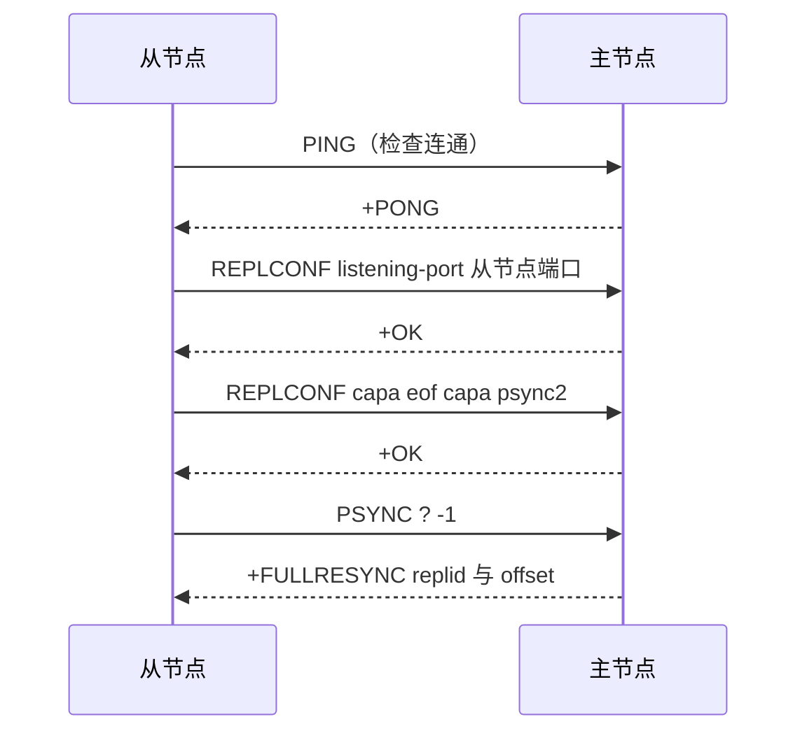
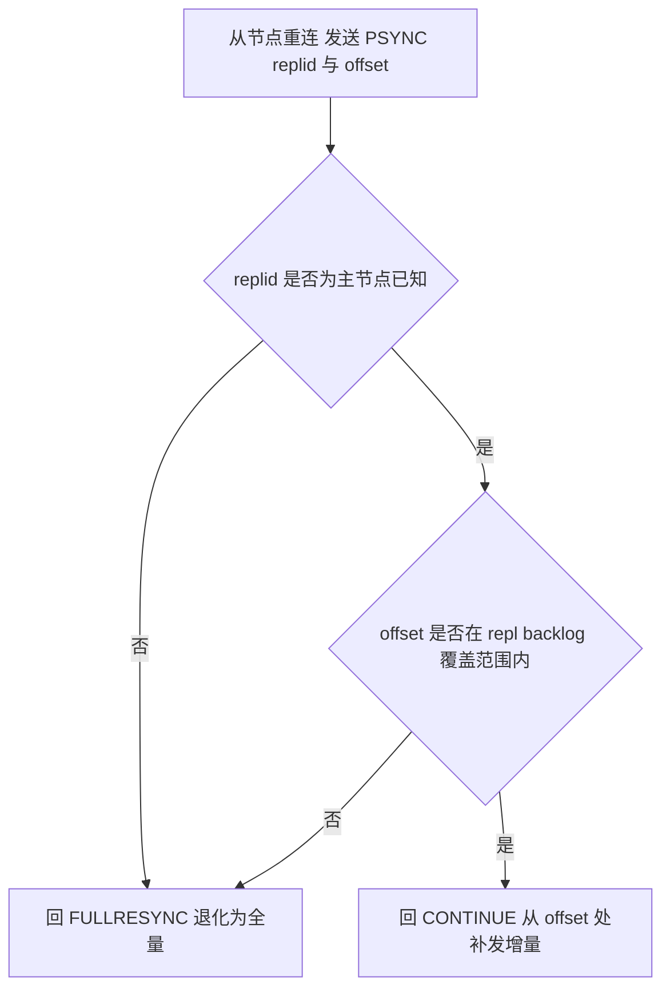
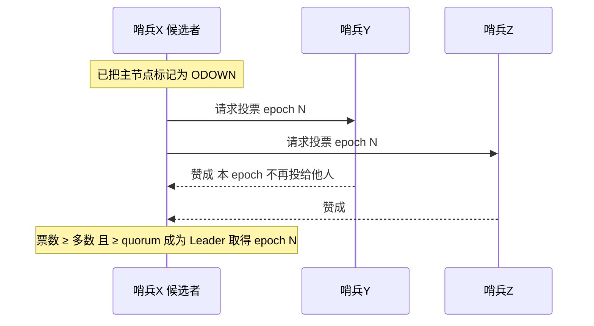
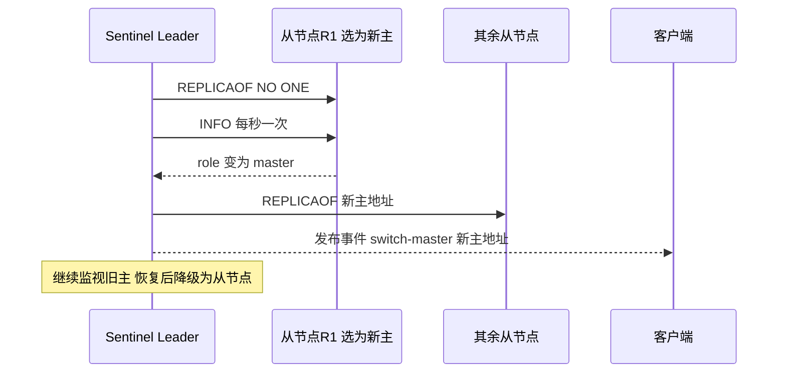
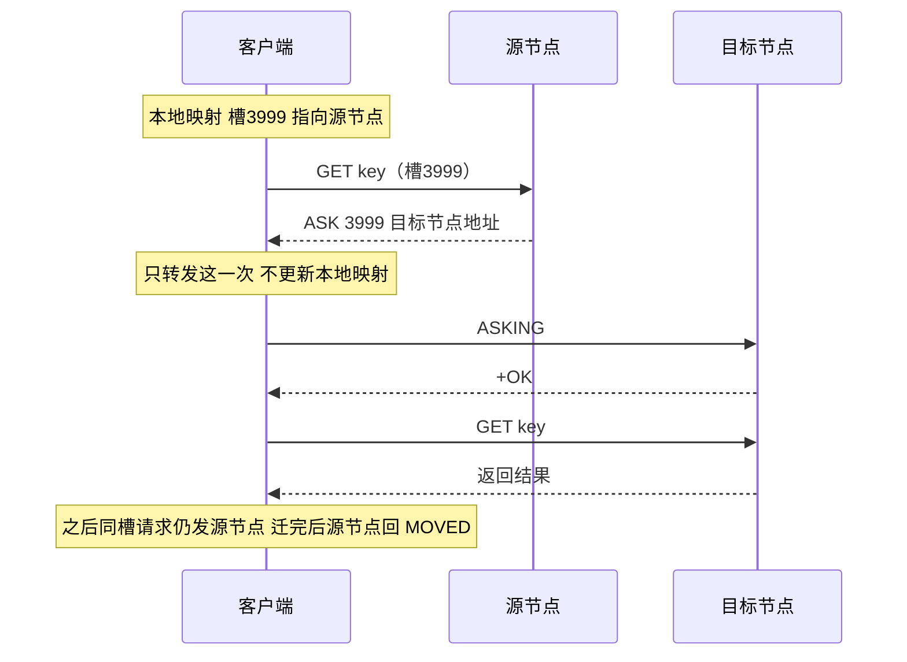

---
tags:
  - 中间件/Redis
  - 中间件/高可用
---

# 高可用：主从复制、哨兵与 Cluster

持久化回答的是「单机重启后数据还在不在」，高可用回答的是「单机挂掉后服务还在不在」。这两件事常被放在一起讲，落到机制上却是两条路：AOF 与 RDB 靠磁盘重建内存里的那份数据，主从复制、哨兵与 Cluster 靠把数据放到多台机器上继续对外服务。两者有一个交叉点——主从第一次同步直接把 RDB 当搬运载体用了一次，所以持久化的产物在这里被复用。

本篇按「复制 → 自动切换 → 水平分片」这条演进线展开：先讲主从复制怎么把一份数据搬到多个节点（§2–§5），再讲哨兵怎么在没人盯着的时候自动完成切换（§6–§8），最后讲 Cluster 怎么在复制之上再叠一层数据分片（§9–§12）。§13 把三种方案摊开对照并给选型判据，§14 逐条列参数，§15 给常见故障的排查顺序。

三套机制共用同一套复制底层：哨兵可以看成「主从复制 + 一层外部的决策进程」，Cluster 可以看成「主从复制 + 一层内嵌在节点里的分片与决策」。理解了复制的异步性与它带来的丢写窗口，后面哨兵和 Cluster 的很多行为都能顺着推出来。

本篇的默认值与行为以 Redis 7.2 为准。参数默认值取自该版本发行的 `redis.conf`、`sentinel.conf` 样例与 `src/config.c`，协议字段取自 `src/replication.c` 与 `src/cluster.c`，链接与转发语义取自官方文档。

## 1. 三种高可用方案的定位与演进

术语先行：下面把提供写服务、接受写命令的节点称为**主节点**（master），把复制主节点数据、默认只读的节点称为**从节点**（replica）。Redis 5.0 之前命令与配置里用 `slave`，5.0 起统一改成 `replica`；`slaveof` 改名为 `replicaof`，旧名作为别名保留（来源：redis.conf 7.2 中 `replica-priority` 一节的别名说明）。

### 1.1 单点故障与三层的解法

单台 Redis 对外服务时有两个绕不开的风险（来源：Redis replication）：

1. 进程或主机宕机。数据恢复要从 RDB/AOF 重建，耗时期间无法响应新请求。
2. 磁盘故障。若没有异地副本或备份，数据可能整体丢失。

主从复制解决的是这两件事里的**冗余**部分：把一台主节点的数据复制到多台从节点，任意一台故障时还有别的节点持有同一份数据，同时从节点可以分担只读查询。它留有一步没解决——主节点挂掉之后由谁接写，仍需人工介入。

哨兵（Sentinel）补上的正是这一层。它是一组独立进程，监控主从节点，在主节点不可达且达成多数判断后，自动从从节点里选一个提升为新主节点，并把新拓扑通知给其余从节点与客户端。哨兵不改变数据的存储方式，每个节点仍持有全量数据、主节点仍是写入瓶颈。

Cluster（Redis 3.0 引入）在复制之上再加一层**数据分片**：把整个键空间切成 16384 个哈希槽，槽分配给多个主节点，每个主节点带若干从节点。写吞吐与内存容量随主节点数量水平扩展，故障转移由集群内部完成，不需要外部进程。

### 1.2 三方案能力对照

| 方案 | 解决什么 | 数据布局 | 故障转移 | 扩容方式 |
| --- | --- | --- | --- | --- |
| 主从复制 | 数据冗余、读扩展 | 每个节点全量 | 需人工 | 加从节点 |
| 哨兵 | 主节点故障自动切换 | 每个节点全量 | 哨兵自动 | 加从节点，主节点仍是瓶颈 |
| Cluster | 内存与写吞吐水平扩展 | 按槽分片，节点持部分数据 | 集群内部自动 | 加主节点并迁移槽 |

三者的拓扑关系：

```text
   三种方案的拓扑关系

   ① 主从复制                ② 哨兵                    ③ Cluster
   ┌────────────┐          ┌────────────────┐      ┌────────┐ ┌────────┐ ┌────────┐
   │  Master    │          │  Sentinel 集群  │      │ Master │ │ Master │ │ Master │
   │  可写      │          │ S1 │ S2 │ S3   │      │ 槽A段  │ │ 槽B段  │ │ 槽C段  │
   └─────┬──────┘          └──┬──────┬──────┘      └───┬────┘ └───┬────┘ └───┬────┘
         │ 复制               │ 监控  │ 投票              │          │          │
   ┌─────▼──────┐          ┌──▼────┐ ┌▼──────┐      ┌────▼───┐ ┌───▼────┐ ┌───▼────┐
   │  Replica   │          │Master │ │Replica│      │Replica │ │Replica │ │Replica │
   │  只读      │          └───────┘ └───────┘      └────────┘ └────────┘ └────────┘
   └────────────┘
   全量冗余                  自动切换                 分片 + 自动切换
```

三者是叠加关系：哨兵的监控对象就是一主多从，Cluster 里每个主节点也带从节点、走同一套复制。把复制读透之后，后两层的行为大半可以顺着推出来。

### 1.3 复制是异步的：贯穿全篇的前提

Redis 默认采用异步复制（来源：Redis replication）。主节点收到写命令后，先在本地执行，再把命令写进发送缓冲、异步发给从节点，然后立即向客户端返回结果，**不等从节点执行完**。

与之配套的是一套反向确认：从节点每秒向主节点发送一次 `REPLCONF ACK <offset>`，上报自己已经处理到的复制偏移量。主节点据此记录每个从节点的进度，但这份确认同样是异步到达的（来源：redis.conf 中 `min-replicas-to-write` 的说明；`src/replication.c`）。

异步复制直接推出三个后果，后面各章反复用到：

- **丢写窗口**。主节点返回「成功」的那一刻，这条写可能还在主节点的发送缓冲里，从节点尚未收到。主节点此时宕机，这条写只有落到磁盘（AOF/RDB）才可能保留，否则丢失（§5.1）。
- **切换期间的不一致**。哨兵与 Cluster 的故障转移都建立在复制之上。新主节点被选出时，它的数据集可能落后于旧主节点，切换本身也会带来一段窗口（§7.3）。
- **脑裂放大丢写**。网络分区时旧主可能仍在接受写，切换完成后旧主降级、全量同步会清空这些写（§8.1）。

客户端若需要更强的保证，可以用 `WAIT numreplicas timeout` 命令阻塞等待指定数量的从节点确认收到写命令。官方文档明确：`WAIT` 只保证有指定数量的副本确认，不把一组 Redis 变成强一致的 CP 系统，切换时已确认的写仍可能丢失（来源：Redis replication）。它是缩小丢写窗口的工具，不是强一致开关。

## 2. 主从复制：第一次同步

新从节点接入、或断线太久无法做增量时，都要走一次**全量同步**。全量同步分三个阶段，本节先铺整条时序，再逐阶段下钻。

### 2.1 角色约定与 replicaof

建立主从关系只用一条命令，在从节点上执行：

```text
replicaof <主节点 IP> <主节点端口>
```

老版本（Redis 5.0 之前）用的是 `slaveof`。命令等价于在从节点配置文件里写 `replicaof <ip> <port>`；运行时也可以用 `REPLICAOF` 命令动态切换。执行后从节点会主动连向主节点并发起同步（来源：Redis replication）。

角色分工是**读写分离**：

- 主节点可读可写。写命令都在主节点执行，再同步给从节点。
- 从节点默认只读。`replica-read-only yes` 是默认值（来源：`src/config.c`），从节点收到客户端写命令会返回 `-READONLY You can't write against a read only replica.` 这道保护层防止误配，它不阻止管理类命令（`CONFIG`、`DEBUG` 等）在从节点执行（来源：redis.conf 中 `replica-read-only` 的说明）。

从节点同步期间是否继续服务读请求，由 `replica-serve-stale-data` 决定：默认 `yes`，即载入新数据前后仍用旧数据集响应；设为 `no` 时，同步链路断开期间对数据访问命令返回 `-MASTERDOWN Link with MASTER is down and replica-serve-stale-data is set to 'no'`，但 `INFO`、`REPLICAOF`、`AUTH`、`ROLE`、`CONFIG`、`SUBSCRIBE` 等命令不受影响（来源：redis.conf 中 `replica-serve-stale-data` 的说明）。

### 2.2 三阶段握手与 FULLRESYNC

第一次同步分三个阶段（来源：Redis replication）：

1. 建立连接、协商同步；
2. 主节点生成并传输 RDB；
3. 主节点把缓冲的新写命令发给从节点。

第一阶段是一次多步握手，报文顺序如下：



逐条看：

- `PING`：从节点先探一次连通性，收到 `+PONG` 才继续。
- `REPLCONF listening-port <port>`：从节点告诉主节点自己监听客户端命令的端口。主节点后续在 `INFO replication` 里列出的从节点地址，IP 取自这条 TCP 连接的对端地址、端口取自这里上报的值（来源：redis.conf 中 `replica-announce-ip` 的说明）。
- `REPLCONF capa eof capa psync2`：声明从节点支持的能力。`eof` 表示支持无盘复制（按 RDB 结束标记而不是按长度分帧），`psync2` 表示支持 PSYNC v2（故障转移后仍能增量）。主节点记录这些能力，用于决定后续的 RDB 传输方式（来源：`src/replication.c` 中的 `REPLCONF` 处理，支持 `listening-port`、`ip-address`、`capa <eof|psync2>`）。
- `PSYNC <runid> <offset>`：从节点请求部分重同步。第一次同步时，从节点没有缓存过主节点的 `replid`，于是 `runid` 用占位符 `?`、`offset` 用 `-1`（来源：`src/replication.c`，`psync_replid = "?"` 与 `memcpy(psync_offset,"-1",3)`）。
- 主节点回复 `+FULLRESYNC <replid> <offset>`：`replid` 是主节点当前的复制 ID，`offset` 是主节点当前的 `master_repl_offset`。从节点记下这两个值，作为后续比对增量的基准（来源：`src/replication.c`，`snprintf(..., "+FULLRESYNC %s %lld\r\n", ...)`）。

`replid` 是一段大的伪随机字符串，标记一份数据集的历史。主节点每产生一个字节的复制流，`master_repl_offset` 就加一，即使当前没有任何从节点连接也照加。`(replid, offset)` 这一对唯一标识主节点数据集的一个确切版本（来源：Redis replication）。

握手阶段还有几处细节值得记住：

- `REPLCONF` 支持多个选项，除 `listening-port`、`capa` 外还有 `ip-address`。`listening-port` 与 `ip-address` 一起决定主节点在 `INFO replication` 里报告的从节点地址；跨 NAT 时用 `replica-announce-ip`/`replica-announce-port` 覆盖（来源：`src/replication.c`；redis.conf 中 `replica-announce-ip` 的说明）。
- `PSYNC` 还可以带第三个可选参数 `FAILOVER`。源码里存在 `PSYNC <replid> <offset> FAILOVER` 的调用形式，用于受控故障转移时让从节点接受一次特殊的部分重同步（来源：`src/replication.c`）。日常重连不带这个参数。
- 握手期间从节点还没有被主节点计入「在线从节点」。`INFO replication` 的 `connected_slaves` 只有在从节点开始周期性发 `REPLCONF ACK` 之后才把它算进去，`min-replicas-to-write` 的判定同样基于这些已确认的从节点（来源：redis.conf 中 `min-replicas-to-write` 的说明）。
- `master_repl_offset` 在没有从节点连接时也持续递增（来源：Redis replication）。所以第一次全量同步时 `FULLRESYNC` 带回来的 offset 是「当下这一刻」的值，它此后成为从节点计算增量的基准；主节点从前到后产生的每一字节复制流都会让这个数继续增长。

### 2.3 RDB 传输与 replication buffer

第二阶段是搬数据。主节点执行 `BGSAVE` 派生子进程生成 RDB 快照，母进程继续处理客户端命令。RDB 生成完成后传给从节点。

这里有一个必须处理的一致性问题：**从 RDB 开始生成到从节点载入完成，这段时间主节点收到的新写命令没有进 RDB**。若不补，从节点一开始就落后。Redis 的补法是给每个从节点挂一个输出缓冲，把这些命令先存起来（来源：Redis replication 中「it starts to buffer all new write commands received from the clients」）。这段缓冲由从节点对应的客户端输出缓冲承担，通常统称 **replication buffer**（复制缓冲）。需要缓存的时间窗口覆盖三段：

1. 主节点生成 RDB 期间；
2. 主节点传输 RDB 期间；
3. 从节点载入 RDB 期间。

这个缓冲是**每个从节点一份**的，因为它要承载「这个从节点还差哪些命令」。

RDB 的传输有两种方式，由 `repl-diskless-sync` 决定（默认 `yes`，来源：`src/config.c`；Redis 7.0 起默认改为无盘）：

- **磁盘中转**：子进程把 RDB 写到磁盘文件，母进程再逐步读文件发给从节点。
- **无盘（diskless）**：子进程直接把 RDB 写进从节点的 socket，不落盘。磁盘慢、网络快时这种方式更省事。无盘模式有一个启动等待：主节点会等 `repl-diskless-sync-delay` 秒（默认 5，来源：`src/config.c`），希望在这段时间里凑齐更多从节点，一次性并行传输；一旦开始传输，新到的从节点要排队等下一轮。

从节点接收 RDB 这一侧也有选择，由 `repl-diskless-load` 控制（默认 `disabled`，来源：`src/config.c`）：默认先把 RDB 落到本地磁盘再读取；设为 `swapdb`（边收边解析、旧数据集暂留内存）或 `on-empty-db`（仅在当前数据集为空时边收边解析）可以省一次磁盘往返，代价是同步期间的内存峰值更高（来源：redis.conf 中 `repl-diskless-load` 的说明）。

### 2.4 从节点载入 RDB 与执行缓冲

从节点收到 RDB 后先清空当前数据集，再载入新数据，载入完成后回复主节点一个确认。接着主节点把阶段二里攒下的 replication buffer 命令发出去，从节点按序执行，此时主从数据一致。

这里有一条容易被忽略的阻塞边界：**载入 RDB 期间从节点会阻塞**。官方文档明确，从节点在初始同步中可以用旧数据集服务查询（取决于 `replica-serve-stale-data`），但在收到新 RDB 后、加载新数据集期间，会阻塞进来的客户端连接；对非常大的数据集，这个窗口可能持续数秒。Redis 4.0 起可以把「删除旧数据集」放到另一个线程做，但「加载新数据集」仍在主线程、仍会阻塞（来源：Redis replication）。

RDB 传输还有一个规模上的细节：如果多个从节点同时请求全量同步，主节点只做一次 `BGSAVE`，把同一份 RDB 分发给所有等待的从节点（来源：Redis replication 中「If the master receives multiple concurrent replica synchronization requests, it performs a single background save in to serve all of them」）。这一条在排查「同步风暴」时是关键（§4.4）。

一句话概括第一次同步：握手确定学谁、RDB 搬运存量、缓冲补上增量。三件事做完，进入命令传播阶段。

## 3. 主从复制：命令传播与异步性

### 3.1 长连接与心跳

第一次同步后，主从之间维持一条 TCP 长连接，主节点后续的每一条写命令都通过这条连接传播给从节点（来源：Redis replication）。长连接避免了每次同步都重新建连、握手的开销。

这条连接上有三类周期消息：

- **主节点 → 从节点：`PING`**。主节点按 `repl-ping-replica-period` 的频率发送（默认 10 秒，来源：`src/config.c`），用于探测从节点存活与连接状态。
- **从节点 → 主节点：`REPLCONF ACK <offset>`**。从节点默认每秒发一次，上报自己已处理到的偏移量，主节点据此实时判断复制进度，也据此判断复制流是否中断（来源：redis.conf 中 `min-replicas-to-write` 的说明）。
- **主节点 → 从节点：写命令本身**。这是复制流的主体，与 Redis 协议同格式。

主从两侧共用一个超时 `repl-timeout`（默认 60 秒，来源：redis.conf 中注释）。取值需大于 `repl-ping-replica-period`，否则低流量时会周期性误判断连。它覆盖三处：从节点视角的批量传输超时、从节点视角的主节点超时（数据与 ping）、主节点视角的从节点超时（`REPLCONF ACK`）。`REPLCONF ACK` 的到达时间同时也被主节点用来统计从节点的滞后秒数，供 `min-replicas-max-lag` 判断（§5.1）。

### 3.2 异步复制与数据丢失窗口

命令传播是异步的：主节点写入本地缓冲后立即返回客户端，不等待从节点执行结果。这就产生了一个确定的丢写窗口，窗口大小等于「命令在主节点发送缓冲里 + 在网络上 + 在从节点待执行队列里」这三段时间之和。

用一个具体数字算一遍。设主节点写命令的平均生成速率是 1 MB/s，主节点到从节点的单向网络往返 5 ms，从节点处理队列在低负载下近似为空。最坏情况下，主节点刚返回给客户端就宕机，这 5 ms 内生成的约 5 KB 写命令还在途中，随主节点内存一起消失。真实窗口还要加上从节点排队时间，网络抖动或从节点慢时窗口会明显放大。这个「约 5 ms 的窗口」是异步复制的最小代价，任何基于异步复制的切换都无法把这部分降为零。

把窗口显式限制住的手段有两个：`min-replicas-to-write` 组合（§5.1）与 `WAIT` 命令（§5.2）。两者都只能缩小窗口，不能消除。

### 3.3 过期键与淘汰键的传播

复制流里除了客户端写命令，还包括两类由主节点「代发」的删除动作：

- **过期键**。键到期后，主节点负责把它删除，并**模拟一条 `DEL`（或 `UNLINK`）命令**发给从节点，从节点收到后删除这个键。从节点自己不主动让键过期删除，它依赖主节点发来的删除命令（来源：Redis replication 中「keys expired or evicted」）。
- **淘汰键**。主节点因内存达到 `maxmemory` 触发淘汰时，同样把删除动作作为命令传播给从节点。

这条约定的意义在于**一致性由主节点单独裁决**。判断一个键是否过期依赖本地时钟，若主从各自判断，时钟偏差会让两边对同一个键的存亡产生分歧。把「删除」变成一条显式命令后，从节点完全跟随主节点的决定，复制流是唯一真相来源。这也解释了一个现象：从节点上明明有已经过期的键却仍能读到——它只是在等主节点的删除命令到达。

## 4. 主从复制：增量复制与同步风暴

断线重连之后有两种结局：只补断线期间丢掉的写命令（**增量复制**，也叫部分重同步），或从头再来一次全量。Redis 2.8 起支持增量复制；2.8 之前只要断线恢复就重新全量（来源：Redis replication）。把增量复制做出来，是主从复制在生产可用的关键一步。本节讲它靠什么判断能不能增量、缓冲区怎么配、配小了会引发什么。

### 4.1 repl_backlog 环形缓冲与 offset

增量复制依赖两个东西（来源：Redis replication；redis.conf 中 `repl-backlog-size` 的说明）：

- **`repl_backlog`**（复制积压缓冲区，`repl_backlog_buffer`）。主节点上**只有一份**，是一个环形缓冲，保存最近传播过的写命令。主节点在做命令传播时，除了发给从节点，也同步写一份进这个缓冲。默认大小 `repl-backlog-size 1mb`（1048576 字节，来源：`src/config.c`）。
- **两个偏移量**。主节点用 `master_repl_offset` 记录自己「写」到的位置；从节点用 `slave_repl_offset` 记录自己「读」到的位置。两者的差值就是「这个从节点还差多少字节」。

```text
   repl_backlog 环形缓冲与两个偏移量（默认 1MB）

   环形缓冲保存「最近传播过的写命令」，写满后从头覆盖最旧的数据

   起点 backlog->offset                                master_repl_offset
        │                                                      │
        ▼                                                      ▼
        ┌───────────────┬───────────────┬───────────────┬──────┐
        │ 段1 已被覆盖   │ 段2 断线期间   │ 段3 最近命令   │ 新命令│
        └───────────────┴───────────────┴───────────────┴──────┘
                         ▲
                         │
                  slave_repl_offset（从节点想从这里继续读）

   判据（主节点收到 PSYNC 时执行）：
     要读的位置仍在缓冲覆盖范围内 ──▶ 回 +CONTINUE，补发增量
     要读的位置已被覆盖 / replid 不匹配 ──▶ 回 +FULLRESYNC，退化为全量
```

`repl_backlog` 的分配与释放有明确的开关条件（来源：redis.conf 中 `repl-backlog-size`、`repl-backlog-ttl` 的说明）：

- **只在至少有一个从节点连接时分配**。没有从节点时主节点不需要它。
- 主节点在最后一个从节点断开后再过 `repl-backlog-ttl` 秒（默认 3600）释放这个缓冲；设为 0 表示永不释放。
- **从节点永远不因超时释放自己的 backlog**。原因是它将来可能被提升为主节点，需要能和其他从节点正确做部分重同步。

### 4.2 PSYNC 判定分支：CONTINUE 还是 FULLRESYNC

断线恢复后，从节点发 `PSYNC <replid> <offset>`，其中 `replid` 是它缓存的主节点复制 ID，`offset` 是它处理到的位置加一（来源：`src/replication.c`，`server.cached_master->reploff+1`）。主节点按下图分支判断：



主节点只回两种响应（来源：`src/replication.c`）：

- `+CONTINUE`（PSYNC v2 下可能带新的 replid）：同意增量。主节点从 `offset` 处开始，把 backlog 里保存的后续命令直接发过去（`addReplyReplicationBacklog`）。
- `+FULLRESYNC <replid> <offset>`：不同意增量，退回全量同步流程。

判定增量的两个条件在源码里是一段显式检查（来源：`src/replication.c`）：`offset` 既不小于 `repl_backlog->offset`（未被环形覆盖的起点），也不大于 `offset + histlen`（缓冲末尾）；`replid` 还要与主节点已知的 `replid` 或 `second_replid` 之一匹配。任一条件不满足就全量。

第一轮同步（`PSYNC ? -1`）必然落到 `+FULLRESYNC` 分支——`?` 不是任何已知 replid；这也是为什么第一次同步是全量。

### 4.3 replication buffer 与 repl_backlog 的区别

两个缓冲都叫「复制缓冲」，容易被混为一谈，实际在**数量、结构、满了之后的后果**三处都不同：

| 维度 | `replication buffer` | `repl_backlog` |
| --- | --- | --- |
| 出现阶段 | 全量复制阶段（暂存 RDB 期间的写命令）与增量补发 | 增量复制判定与补齐 |
| 数量 | 每个从节点一份（挂在从节点连接上） | 主节点全局一份 |
| 结构 | 不定长的输出缓冲 | 环形缓冲，写满覆盖最旧数据 |
| 写满的后果 | 该从节点连接被断开，触发重新全量同步 | 覆盖最旧数据，落后太多的从节点退化为全量 |
| 释放时机 | 跟随该从节点连接的生死 | 至少一个从节点连接时分配；空闲 `repl-backlog-ttl` 秒后释放 |
| 调参 | 由输出缓冲上限与 `client-output-buffer-limit replica` 间接控制 | `repl-backlog-size` 直接控制 |

两者都「有大小限制」，但限制被突破时的表现完全相反：**replication buffer 溢出会断连接**（一个从节点重来），`repl_backlog` 溢出**只影响判断结果**（某些从节点下一次重连时无法增量）。前者的可控范围小、后果重，后者影响面大、后果轻，这个差别决定了调优时主要盯的是 `repl-backlog-size`。

### 4.4 同步风暴的成因与容量估算

把上面几节串起来，就能推出「同步风暴」的完整因果链：

1. 主节点写入速率高于从节点消费速率，或断线时间较长；
2. `repl-backlog-size` 太小，从节点想读的位置在重连前就被环形覆盖；
3. 该从节点重连时 `offset` 已不在覆盖范围 → 主节点回 `+FULLRESYNC`；
4. 主节点为该从节点做一次 `BGSAVE`（`fork` + 生成 RDB + 传输），从节点清空并重载；
5. 若多个从节点同时抖动，第 4 步反复发生，主节点的 `fork`、磁盘 I/O、网络带宽被周期性挤占，从节点反复清库重载——这就是同步风暴。

第 3 步是关键：**一次误判全量，就会带来一次昂贵的重来**。防它的办法是把 `repl-backlog-size` 调到足够大，让「从节点断线到重连」这段时间里产生的写命令不会溢出缓冲。估算公式：

```text
   repl-backlog-size ≥ second × write_size_per_second × 安全系数（取 2）

   second                 从节点断线后平均多久能重连（秒）
   write_size_per_second   主节点平均每秒产生的写命令数据量
```

举例：主节点平均每秒产生 1 MB 写命令，从节点断线后平均 5 秒重连，则 `1 MB/s × 5 s = 5 MB` 是最小值，为应对突发取 2 倍即 10 MB。反过来说，写入量 10 MB/s、期望容忍 30 秒断线，就要配到 `10 × 30 × 2 = 600 MB` 量级——**这个值会随业务量增长而上涨，必须定期复核**。默认 1 MB 只适合写量很小的场景；写量大而沿用默认值时，断线超过一秒就可能触发全量。

`repl-backlog-ttl` 与这条链的关系是反方向的：它只在**没有任何从节点连接**时计时，决定多久后释放缓冲。设为过大不释放会白占内存；设为 0（永不释放）适合从节点会频繁短暂离线的场景，避免反复创建销毁。

### 4.5 级联复制分摊压力

主节点的两项耗时操作是 `BGSAVE` 生成 RDB 与传输 RDB。从节点越多，全量同步越密集，主节点的 `fork`（其阻塞时长与内存数据量正相关）和网络带宽压力越大（来源：redis.conf 中 `repl-diskless-sync` 关于多从节点排队的说明）。

缓解办法是**级联复制**（cascading replication）：让从节点自己再带从节点，形成树形结构。配置很简单，在作为「中间层」的从节点上执行 `replicaof <目标服务器 IP> 6379`，目标若本身是从节点，它就升级成「经理」角色，既接收主节点的数据，又把自己的从节点带起来。

```text
   级联复制：把全量同步的压力从主节点下移

   ┌────────┐
   │ Master │  只对「经理」做 BGSAVE 与传输
   └───┬────┘
       │
   ┌───▼────┐        ← 经理（同时是从节点）
   │ Replica│
   └───┬────┘
       ├──────────┬──────────┐
   ┌───▼───┐  ┌───▼───┐  ┌───▼───┐
   │子从节点│  │子从节点│  │子从节点│
   └───────┘  └───────┘  └───────┘
```

Redis 4.0 起，所有子从节点从主节点收到的是**完全相同的复制流**（来源：Redis replication 中「Since Redis 4.0, all the sub-replicas will receive exactly the same replication stream from the master」），中间层不需要自己做合并。级联的代价是复制延迟随层级增加而累积：写命令经过一跳就多一次转发与排队，越靠下游的节点越滞后。生产上通常只做一层级联，把从节点数量多、跨机房的场景交给中间层，主节点只直连少量节点。

## 5. 主从复制：丢写防护

异步复制的丢写窗口无法消除，只能限制。Redis 提供两个不同层次的工具：一个在**主节点写入前**就把关（`min-replicas` 组合），一个在**写完之后**让客户端主动等确认（`WAIT` 命令）。

### 5.1 min-replicas 组合

两个参数配合使用（来源：redis.conf 中 `min-replicas-to-write` 的说明；`src/config.c`）：

- `min-replicas-to-write <N>`：默认 0，即该功能默认关闭。要求主节点至少有 N 个处于「在线」状态的从节点。
- `min-replicas-max-lag <M>`：默认 10（秒）。要求这些从节点的滞后不超过 M 秒。滞后由主节点根据最后一次收到的 `REPLCONF ACK` 计算，而这个 ACK 通常每秒发一次。

组合语义是：**主节点连接的从节点中，至少有 N 个的 ACK 延迟不超过 M 秒，才接受写请求；否则拒绝并返回错误**。任一项设为 0 即关闭该功能。

官方文档对它的定位说得很明确：这个机制**不保证** N 个从节点一定接收成功，它做的是「把丢写的暴露窗口限制在指定的秒数内」——有界丢写比无界丢写好（来源：Redis replication）。

它同时是**脑裂防护**的核心（§8.2 展开）。网络分区时旧主与所有从节点失联，自然收不到 ACK，`min-replicas-to-write`/`min-replicas-max-lag` 的组合条件不满足，旧主就会停止接受写入。这样即便旧主之后被降级、数据被清空，也不会有新数据写进去再丢。

由此可以推出一条配置判据：**要让旧主在新主开始服务之前就停止接受写入，`min-replicas-max-lag` 应当小于哨兵的 `down-after-milliseconds`**。理由是切换最早在 `down-after-milliseconds` 之后才会触发（哨兵要等这么久才判 SDOWN），而旧主在失联满 `min-replicas-max-lag` 秒时就已停写；把这个值压在 `down-after-milliseconds` 之下，旧主的停写时刻早于切换时刻，两者之间的窗口被关掉。（这条是从两条时间线推出的判据，不是官方措辞。）

代价同样要认：把 `min-replicas-to-write` 设成 1、`min-replicas-max-lag` 设得很小，等于把「从节点抖动」放大成「主节点不可写」。一次网络抖动或从节点慢查询就可能让主节点短暂拒写，业务侧要能处理 `-NOREPLICAS` 类错误（提示写拒绝而非数据问题）。这两个参数是在**可用性**与**丢写上限**之间做取舍，没有一个通用的值。

### 5.2 WAIT 命令

`WAIT` 是一个客户端命令，语法 `WAIT numreplicas timeout`（来源：Redis replication）：

- 它阻塞当前客户端，直到该客户端此前发出的写命令**至少被 `numreplicas` 个从节点确认**，或等待超过 `timeout` 毫秒。
- 返回值是实际确认的从节点数。若超时仍未满足，返回值小于 `numreplicas`，由客户端决定如何处理。

它和 `min-replicas` 组合的差别在于把关的位置：`min-replicas` 在主节点**接受写之前**判断，`WAIT` 在**写之后**由客户端主动等确认，可以针对单条关键写使用，颗粒度更细。

官方文档对它的边界有明确限定：`WAIT` 只保证有指定数量的副本确认，**不把一组 Redis 变成强一致的 CP 系统**；切换时已确认的写仍可能丢失，取决于持久化配置。它的价值是把丢写概率压到很低的故障模式里，而不是给出「提交即持久」的保证（来源：Redis replication）。因此 `WAIT` 不能替代 `min-replicas` 组合做脑裂防护——后者防的是旧主在被切换前继续吞写，前者只对发起 `WAIT` 的那个客户端负责。

## 6. 哨兵：为什么需要与如何工作

主从复制留下的那一步人工操作，在故障发生时正好是最不方便操作的时候。哨兵（Sentinel）把这一步自动化。它自己是一组运行在特殊模式下的 Redis 进程，不持有业务数据，只做观察与决策。

### 6.1 手动切换的代价与哨兵的职责

主节点挂掉后，主从架构会同时失去两样东西：没有节点接受写请求，也没有节点给从节点同步数据。要从这个状态恢复，需要人工完成四步（来源：Redis Sentinel）：

1. 在从节点里挑一个，提升为主节点；
2. 让其余从节点改指这个新主节点；
3. 把新主节点的地址通知给所有客户端；
4. 旧主恢复后，把它配置成新主节点的从节点。

每一步都依赖有人及时发现故障、正确判断、正确操作。故障发生在半夜、判断错了选了数据最落后的从节点、客户端配置漏改了一台——每一样都会把停机时间拉长。

哨兵的职责按官方分类有四类（来源：Redis Sentinel）：

- **监控**（monitoring）：持续检查主节点、从节点、其他哨兵是否可达；
- **通知**（notification）：通过 Pub/Sub 把故障、切换等事件通知给客户端；
- **自动故障转移**（automatic failover）：主节点故障时选从升主、改指其余从节点；
- **配置提供者**（configuration provider）：作为客户端查询「当前主节点地址」的入口。

其中「监控」本身又分两个层次：判断单个实例是否下线，与判断主节点是否真的故障。这两层就是下面两节的主客观下线。

### 6.2 主观下线 SDOWN

哨兵默认每秒向它监控的每个主节点、从节点、其他哨兵发一次 `PING`（来源：Redis Sentinel）。一条有效回复只有三种（来源：Redis Sentinel）：

- `+PONG`；
- `-LOADING`（实例在加载数据）；
- `-MASTERDOWN`（实例处于主从链路断开状态）。

其他任何回复、或完全没有回复，都算无效。另外有一条容易踩的判定：**一个逻辑上是主节点、却在 `INFO` 输出里把自己报成从节点的实例，会被哨兵直接视为下线**（来源：Redis Sentinel）。

若一个实例在 `down-after-milliseconds` 毫秒内**连续**没有给出有效回复，哨兵把它标记为**主观下线**（Subjectively Down，SDOWN）。「连续」这个限定很重要：区间设 30000 ms 时，只要每 29 秒能收到一次有效 PING，实例就仍被判为正常（来源：Redis Sentinel）。

SDOWN 只是一个哨兵的本地意见，不足以触发故障转移。要触发转移必须达到 ODOWN 状态（来源：Redis Sentinel）。

### 6.3 客观下线 ODOWN 与 quorum

某个哨兵把主节点标为 SDOWN 后，会向其他哨兵发起询问，命令是 `SENTINEL is-master-down-by-addr <ip> <port> <current-epoch> <runid>`（来源：Redis Sentinel）。其他哨兵根据自己与主节点的网络状况回复同意或拒绝。同意数（含发起者自己）达到配置里的 `quorum` 时，主节点被这个哨兵标记为**客观下线**（Objectively Down，ODOWN）。

这里必须分清两个数，它们回答两个不同的问题：

| 名字 | 含义 | 用在哪一步 | 取值来源 |
| --- | --- | --- | --- |
| `quorum` | 多少个哨兵同意「主节点不可达」才判定故障 | 只用于 **ODOWN 判定** | `sentinel monitor <name> <ip> <port> <quorum>` |
| 多数票 majority | 多少个哨兵投票授权某个哨兵去执行转移 | 只用于 **Leader 授权** | `哨兵总数 / 2 + 1` |

官方文档把这条讲得很直白：`quorum` **只用于检测故障**；要真正执行故障转移，还得有一个哨兵被选举为 leader，并且得到**多数哨兵的投票**授权（来源：Redis Sentinel）。举例（官方示例）：5 个哨兵、`quorum = 2`，两个哨兵同时认为主节点不可达时其中一个会尝试发起转移；只要总共至少 3 个哨兵可达，转移就被授权并真正开始。

由此推出一条关键性质：**少数分区不会发起故障转移**。官方表述是，故障期间如果多数哨兵无法互相通信，哨兵永不开始转移（「Sentinel never starts a failover if the majority of Sentinel processes are unable to talk」）（来源：Redis Sentinel）。这条与 §8.1 的脑裂场景直接相关——网络分区把哨兵切成多数派与少数派时，只有多数派一侧能完成切换。

ODOWN **只适用于主节点**。从节点和其他哨兵只会有 SDOWN、不会有 ODOWN（来源：Redis Sentinel），因为哨兵不需要为它们的故障执行转移。SDOWN 也有语义后果：处于 SDOWN 状态的从节点不会被选为提升对象（来源：Redis Sentinel）。

```text
   主观下线（SDOWN）与客观下线（ODOWN）的判定链

   ┌──────────────────────────────────────────────────────────┐
   │ 每个哨兵各自每秒 PING 主节点                              │
   └───────────────────────┬──────────────────────────────────┘
                           │ 连续 down-after-milliseconds 无有效回复
                           ▼
   ┌──────────────────────────────────────────────────────────┐
   │ 哨兵 X：标记主节点 SDOWN（仅 X 的本地意见）                 │
   └───────────────────────┬──────────────────────────────────┘
                           │ X 发 SENTINEL is-master-down-by-addr
                           ▼
   ┌──────────────────────────────────────────────────────────┐
   │ 其他哨兵各自回复「同意 / 拒绝」                            │
   └───────────────────────┬──────────────────────────────────┘
                           │ 同意数（含 X 自己）≥ quorum
                           ▼
   ┌──────────────────────────────────────────────────────────┐
   │ 哨兵 X：标记主节点 ODOWN → X 成为 Leader 候选者            │
   └───────────────────────┬──────────────────────────────────┘
                           │ 但还要拿到「多数票」才能真的执行（§7）
                           ▼
   ┌──────────────────────────────────────────────────────────┐
   │ 选举 Leader（多数票 = 哨兵总数 / 2 + 1）                   │
   └──────────────────────────────────────────────────────────┘
```

`quorum` 的取值取向有两档（来源：Redis Sentinel）：设得**比多数小**，哨兵对主节点故障更敏感，少数哨兵认为有问题就会触发转移；设得**比多数大**，只有在非常多（超过多数）且连通良好的哨兵都同意时才允许转移。常见做法是把 `quorum` 取为「哨兵数的一半加一」，3 个哨兵取 2、5 个取 3，同时保证哨兵数是奇数，避免出现票数打平。

### 6.4 哨兵集群如何组成

配置一个哨兵时，只需要写被监控主节点的名字、地址、端口与 quorum（来源：Redis Sentinel）：

```text
sentinel monitor <master-name> <ip> <port> <quorum>
```

配置里不需要列出其他哨兵的地址。哨兵之间通过主从节点上的一个 Pub/Sub 频道 `__sentinel__:hello` 互相发现（来源：Redis Sentinel）：

- 每个哨兵**每 2 秒**向所有被监控主节点与从节点的 `__sentinel__:hello` 频道发布一条消息，带上自己的 IP、端口、runid；
- 每个哨兵都订阅了这些节点的该频道，从中发现未知哨兵并加入自己的哨兵列表；
- 这条消息还带发送方对某个主节点的当前完整配置，接收方若自己的配置更旧，立即更新；
- 加入新哨兵前先检查是否已有相同 runid 或相同地址的哨兵，有则替换。

从节点的发现同样不需要手工配置：哨兵**每 10 秒**向主节点发一次 `INFO`，从 `INFO replication` 输出里拿到从节点列表，再与每个从节点建立连接并监控（来源：Redis Sentinel 中「Since Sentinels auto detect replicas using masters `INFO` output information」）。

```text
   哨兵集群如何组成：两条互相独立的发现路径

   ① 哨兵 ↔ 哨兵：经保留频道 __sentinel__:hello
   ┌──────────┐   发布（每 2 秒）   ┌──────────────────────────┐
   │ Sentinel │ ─────────────────▶ │ Master/Replica 上的       │
   │   A      │                    │ __sentinel__:hello 频道    │
   └──────────┘                    └────────────┬─────────────┘
                                     订阅         │
                        ┌─────────────────────────┴──────────────┐
                        ▼                                        ▼
                  ┌──────────┐                             ┌──────────┐
                  │ Sentinel │                             │ Sentinel │
                  │   B      │                             │   C      │
                  └──────────┘                             └──────────┘

   ② 哨兵 → 从节点：经主节点的 INFO 输出
     哨兵 ──INFO（每 10 秒）──▶ Master ──返回从节点列表──▶ 哨兵据此连接每个从节点
```

一条安全提醒（来源：Redis Sentinel）：发现机制依赖保留频道 `__sentinel__:hello`。任何能在被监控节点上向该频道发布的客户端，都能注入伪造的拓扑信息、触发不该发生的故障转移乃至拒绝服务。`__sentinel__:` 前缀应视为哨兵内部保留；配置 ACL 时只给哨兵账号 `&__sentinel__:hello` 的订阅与发布权限。

运维读哨兵状态靠两条命令：`SENTINEL masters` 列出被监控的主节点及其 `flags`、`num-slaves`、`num-other-sentinels`、`quorum` 等；`SENTINEL sentinels <master-name>` 列出这个主节点上被发现的其余哨兵及其地址（来源：Redis Sentinel）。哨兵会把发现到的从节点与其他哨兵信息**写回自己的配置文件**，重启后带着上一次的拓扑认知继续工作，不必从零重新发现（来源：Redis Sentinel）。跨 NAT 或容器端口映射时，还要配 `resolve-hostnames`/`announce-hostnames` 与 `sentinel announce-ip`/`announce-port`，否则哨兵之间、哨兵到从节点的连接会指向不可达地址（来源：Redis Sentinel；sentinel.conf）。

## 7. 哨兵：领导者选举与故障转移

主节点被标为 ODOWN 之后，还得回答两个问题：由哪个哨兵去执行转移，以及转移到哪个从节点。前者是 Leader 选举，后者是选主。两件事都完成后才开始实际改配置。

### 7.1 候选者与多数派投票

判断主节点 ODOWN 的那个哨兵，就是 Leader 的候选者：它向其他哨兵发起请求，表明希望成为 leader 来执行这次转移。每个哨兵**在一个 epoch 内只有一票**，可以投给自己或别人，但只有候选者能投给自己（来源：Redis Sentinel 中 majority vote 的说明）。

候选者要成为 Leader 需要同时满足两个条件：

1. 拿到**半数以上**的赞成票（严格多数，不是半数）；
2. 票数同时 **≥ quorum**。

第二条通常比第一条松（`quorum` 一般取「半数加一」，等于或略小于多数），但当 `quorum` 被故意配成大于多数时，它就成了更紧的约束。官方表述：转移被触发后，发起转移的哨兵必须向**多数哨兵**请求授权，若 `quorum` 设得比多数更大，则需要比多数更多的票（来源：Redis Sentinel）。

如果两个哨兵在同一时刻各自判定了 ODOWN、同时成为候选者，谁先拉到票谁当选：每个哨兵只有一票，先收到谁的请求就投给谁，后到的请求因为自己已投票而被拒（来源：Redis Sentinel）。没有满足条件的候选者时重新选举。

### 7.2 任期（epoch）与重试 

被授权的哨兵会拿到一个**唯一的 configuration epoch**（配置纪元），用于给转移后的新配置打版本号。因为多数哨兵同意把这个版本分配给它，其他哨兵无法再用这个版本（来源：Redis Sentinel）。这是选举的**安全性**保证：每一次对同一个 master 的故障转移都使用不同的 epoch，不会出现两个哨兵用同一个版本各改一套配置的情况。官方的两条保证（来源：Redis Sentinel）：

- **活性**：只要多数哨兵能互相通信，主节点故障最终会有一个哨兵被授权去转移；
- **安全性**：每个哨兵对同一个 master 的转移使用不同的 configuration epoch。

如果某个哨兵已经为某个主节点的转移投过票，它需要等待一段时间才会再次尝试转移这个主节点，延迟是 `2 × failover-timeout`（来源：Redis Sentinel；sentinel.conf 中 `failover-timeout` 的说明）。这个「冷却期」防止选举反复空转。

关于「哨兵选举是不是 Raft」：官方 Sentinel 文档**没有**出现 Raft 一词，也没有把 leader 选举描述成 Raft 算法。文档给出的机制是「多数派投票选举 leader + configuration epoch 版本化」，其中 SDOWN→ODOWN 的升级官方明确说「不使用强共识算法，只是一种 gossip 形式」（来源：Redis Sentinel）。把它称为「Raft 式选举」在官方文档里找不到依据，本篇按官方措辞写成「多数派投票 + epoch」。Cluster 的故障转移同样用 epoch 与多数票，但它们是不共享代码的两套实现（§12.2）。



### 7.3 选新主：四个判据与三轮排序

Leader 选出后，从旧主的从节点里挑一个提升。评估四项信息（来源：Redis Sentinel）：与主节点的断连时长、`replica-priority`、已处理的复制偏移量、run ID。流程是先过滤、再三轮排序。

**过滤**：与主节点断连时间超过下式的从节点直接淘汰（来源：Redis Sentinel）：

```text
   淘汰阈值 = down-after-milliseconds × 10
              + 主节点从「被该哨兵判为 SDOWN」起已经过去的毫秒数
```

此外，`replica-priority = 0` 的从节点**永不**被提升（来源：Redis Sentinel；redis.conf 中 `replica-priority` 的说明）。

**三轮排序**（逐轮比较，前一轮打平才看下一轮）（来源：Redis Sentinel）：

| 轮次 | 比较对象 | 胜出规则 |
| --- | --- | --- |
| 第一轮 | `replica-priority` | 数值**越小**越优先 |
| 第二轮 | 已处理的复制偏移量 | 从主节点**收到数据更多**的优先 |
| 第三轮 | run ID | 字典序**较小**的优先 |

第三轮的 run ID 只是为了让选择过程确定化，官方明确说 run ID 小对从节点本身没有好处（来源：Redis Sentinel）。第一轮的实际用法是给性能更好的机器配更小的 `replica-priority`，让它在选主时优先；这也解释了为什么给「只读报表节点」配 `replica-priority 0` —— 它们永远不参与选主。

### 7.4 故障转移的四个步骤

转移由 Leader 执行，分四步（来源：Redis Sentinel 的状态机事件）：

1. **选新主**。向被选中的从节点发送 `REPLICAOF NO ONE`，解除它的从节点身份，把它升为新主节点。
2. **改指新主**。向旧主属下其余从节点发送 `REPLICAOF <新主 IP> <端口>`，让它们复制新主节点。
3. **通知客户端**。通过 Pub/Sub 把新主节点地址发布出去。
4. **旧主降级**。继续监视旧主，等它恢复后向它发送 `REPLICAOF`，把它变成新主节点的从节点。

几个要点：

- 步骤 1 发出 `REPLICAOF NO ONE` 后，Leader 会以**每秒一次**的频率向被升级节点发 `INFO`（转移前是每 10 秒一次），观察其角色从 `slave` 变为 `master`。一次故障转移被判定成功的条件是：哨兵成功发出 `REPLICAOF NO ONE`，且之后在 `INFO` 输出里观察到角色切换（来源：Redis Sentinel）。
- 步骤 2 由 `parallel-syncs` 控制**同时**改指新主的从节点数量。数值越小，转移整体耗时越长，但同时处于同步中、不可读状态的从节点越少。默认 1（来源：sentinel.conf 中 `parallel-syncs` 的说明）。若从节点还要承担读流量，把它保持在 1，避免所有从节点在同一时刻因同步而不可读。
- 步骤 3 的频道是 `+switch-master`，它携带新旧主节点地址，是外部最关心的一条事件（来源：Redis Sentinel）。



### 7.5 客户端如何感知主节点变更

客户端与哨兵建立连接后，订阅哨兵提供的 Pub/Sub 频道。转移完成时，哨兵向 `+switch-master` 频道发布新主节点的 IP 与端口，客户端据此更新连接（来源：Redis Sentinel）。除它之外，一整条事件链反映转移进度（来源：Redis Sentinel 的 Pub/Sub 事件表）：

| 事件 | 含义 |
| --- | --- |
| `+sdown` / `+odown` | 实例进入主观 / 客观下线 |
| `+new-epoch` | epoch 更新 |
| `+try-failover` | 开始一次转移，等待多数派选出 Leader |
| `+elected-leader` | 赢得了某个 epoch 的选举，可以执行转移 |
| `+failover-state-select-slave` | 进入选从节点状态 |
| `selected-slave` | 选中了要提升的从节点 |
| `+failover-state-reconf-slaves` | 进入重配其余从节点状态 |
| `+slave-reconf-sent` / `+slave-reconf-done` | 已向某从节点发出 `REPLICAOF` / 该从节点已完成同步 |
| `failover-end` | 转移成功结束 |
| `switch-master` | 主节点地址已变更（外部最关心的事件） |

客户端不需要自己实现选举逻辑，主流客户端库内置了「连哨兵问主节点地址、订阅切换事件」的能力。生产上还常用 `sentinel client-reconfig-script` / `notification-script` 挂钩子执行自定义动作，例如刷新本地的连接池或发告警（来源：sentinel.conf）。

## 8. 哨兵：脑裂与数据丢失

哨兵把「主节点挂掉」从人工变成自动，代价是引入了新的失败模式：网络分区让哨兵误判，从而选出第二个主节点。这种「两个主节点同时存在」的状态称为**脑裂**（split-brain）。它带来的数据丢失是可以讲清楚的，防护手段也已经落在 §5.1 的两个参数上。

### 8.1 脑裂的发生路径

把分区前后的事件按时间铺开，丢失发生在哪一步一目了然：

```text
   脑裂导致数据丢失的完整时序

   t0  正常：Master ──复制──▶ Replica1 / Replica2，客户端写 Master
   │
   t1  网络分区：Master ⇢⇢（断开）⇢⇢ Replica1 / Replica2 / 哨兵
   │      但 Master 与客户端之间的网络仍然正常
   │
   t2  客户端不知情，继续向旧 Master 写
   │      这些写进了旧 Master 内存，因为主从网络已断，同步不到任何从节点
   │
   t3  哨兵侧：与 Master 失联，满足 quorum → ODOWN → 选出 Leader
   │      从 Replica 里选一个提升为新 Master（此刻集群有两个 Master）
   │
   t4  网络恢复：哨兵把旧 Master 降级为从节点
   │      旧 Master 向新 Master 发起同步
   │
   t5  旧 Master 清空本地数据、载入新 Master 的 RDB
   │      t2 期间客户端写入的数据全部丢失
   └─ 丢失的数据 = 分区期间写到旧主、且来不及也无法同步出去的那批写
```

第 5 步的「清空」由增量复制判定分支决定：旧主换主后，它的 `replid` 与新主不同，`PSYNC` 的 replid 匹配检查失败（§4.2 的第一个分支），只能走全量；而全量同步的第一步就是清空本地数据集，再载入新数据集（§2.4）。§4.2 那条 `+FULLRESYNC` 分支在这里有了一个具体的业务后果。

丢多少由两段时间决定：**从主从链路断开到旧主停止接受写入**的这段时间里积压的写，加上已经写进从节点发送缓冲、但还没送达从节点的少量写。前者是大头，也是 `min-replicas` 组合能压掉的那部分。

### 8.2 min-replicas 组合如何防护

防护思路是**让旧主在分区期间自己停写**。网络分区时旧主与所有从节点失联，收不到 `REPLCONF ACK`，`min-replicas-to-write` / `min-replicas-max-lag` 的组合条件无法满足，旧主就拒绝写请求、直接返回错误（§5.1）。t2 那批写不会发生，t5 的降级清空也就没有新数据可丢。

把两条时间线放在一起，就得到配置判据：

```text
   让「旧主停写」早于「新主上线」

   旧主停写时刻 ≈ 失联后 min-replicas-max-lag 秒
   新主上线时刻 ≥ 哨兵 down-after-milliseconds 之后（还要加上选举与执行时间）

   ⇒ 取 min-replicas-max-lag < down-after-milliseconds
      旧主先停写、哨兵后切换，中间的丢写窗口被关掉
```

反过来，若 `min-replicas-max-lag` 大于 `down-after-milliseconds`，会留下一段「哨兵已经开始切换、旧主却还在收写」的窗口，这段写入必然丢失。这是从两条时间线推出的判据，不是官方措辞；官方文档只给到「用这两个参数把丢写窗口限制在指定秒数内」（来源：Redis replication）。

组合参数的最初取向可以按故障代价来定：能容忍丢失几十秒数据的缓存类业务，`min-replicas-to-write` 可以不设或设得很宽松；计费、库存这类丢一条都麻烦的数据，应当设 `min-replicas-to-write 1` 与较小的 `min-replicas-max-lag`，用「主节点可能短暂拒写」换「丢写窗口被关掉」。

代价的量化：设 `min-replicas-to-write 1`、`min-replicas-max-lag 1` 之后，任何一次从节点慢查询、网络抖动超过 1 秒，主节点都会进入拒写状态，客户端收到 `-NOREPLICAS` 类错误。这个错误与「主节点故障」的错误不同，业务侧要能区分并做重试或降级，否则会把短暂抖动放大成业务故障。也可以为写请求准备一条降级路径：把失败的写先落到本地缓存或消息队列，等主节点恢复可写后再补写——这类缓冲本身也会引入重复与顺序问题，需要在业务侧兜住幂等。

## 9. 为什么需要 Cluster

哨兵把可用性这一维补上了，容量与吞吐这两维还没动。数据大到一台机器装不下、或写请求多到一台 CPU 处理不过来时，哨兵帮不上忙——它监控的每个节点仍存全量数据，主节点仍是唯一的写入点。

### 9.1 单机内存与写吞吐上限

单机 Redis 有两个硬上限：

- **内存**。一台机器的物理内存有限。数据量超过单机可承载的量时，靠加从节点解决不了——从节点复制的是同一份数据，占同样的内存。
- **写吞吐**。Redis 处理命令的主流程是单线程的，写密集时单机 CPU 成为瓶颈。从节点默认只读，只分担读，写仍全部压在唯一的每个主节点上。

一个具体的量：单实例保存 15 GB 数据时，RDB 持久化要 `fork` 子进程，`fork` 的耗时与数据量正相关，数据越大 `fork` 越慢、阻塞主线程越久（来源：Redis Documentation）。把 15 GB 拆到 3 台各 5 GB，每次 `fork` 的数据量下降，写吞吐也能随主节点数上升。

切片集群（sharding）的思路是横向拆：把数据分片到多台主节点，每台只存一部分，各自承担一部分写。Redis Cluster 是 Redis 3.0 起官方提供的切片集群实现（来源：Scale with Redis Cluster）。

```text
   哨兵与 Cluster 解决不同维度的问题

   哨兵（可用性：纵向冗余）          Cluster（容量与吞吐：横向分片）
   ┌────────────┐                  ┌──────────┐ ┌──────────┐ ┌──────────┐
   │  Master    │ ← 全量数据        │  主-0    │ │  主-1    │ │  主-2    │
   │  可写      │                  │ 槽0–5460 │ │5461–10922│ │10923–16383│
   └─────┬──────┘                  └────┬─────┘ └────┬─────┘ └────┬─────┘
         │ 复制                         │ 复制       │ 复制       │ 复制
   ┌─────▼──────┐                  ┌────▼─────┐ ┌────▼─────┐ ┌────▼─────┐
   │  Replica   │ ← 全量数据        │  从-0    │ │  从-1    │ │  从-2    │
   │  只读      │                  └──────────┘ └──────────┘ └──────────┘
   └────────────┘
   每节点一份全量，写集中在单主        数据分片，写分散到多个主
```

### 9.2 分片换来的约束

分片不是免费的。数据被拆到不同节点后，原本在单机上原子的操作会跨节点：

- `MGET`/`MSET` 涉及多个 key，若这些 key 落在不同槽/节点，就要由客户端拆分、分别发送、合并结果，无法在一次命令里原子完成。
- 事务（`MULTI`/`EXEC`）与 Lua 脚本要求所有 key 在同一节点，跨节点时会在运行时被拒。
- `KEYS`、`SCAN` 之类的遍历命令只作用于当前节点，客户端要手动聚合。

Redis Cluster 用「同一槽 = 同一节点」界定原子性边界：落在同一个槽内的多键操作仍可原子。这引出 hash tag（§10.3）——用 `{}` 把需要一起操作的 key 强制放进同一个槽。换句话说，Cluster 提供的是**分片内的原子性**，跨分片的原子性要由客户端或上层承担。

### 9.3 建集群与最小规模

官方给出的最小可用规模是 **3 个主节点**，生产推荐 6 节点（3 主 3 从）（来源：Scale with Redis Cluster）。每个实例以 `cluster-enabled yes` 启动。

两种建法（来源：Scale with Redis Cluster；Cluster specification）：

- **自动**：`redis-cli --cluster create <ip:port> ... --cluster-replicas 1` 自动分配槽与主从关系，完成后打印 `[OK] All 16384 slots covered`。
- **手工**：先用 `CLUSTER MEET <ip> <port>` 让节点互相认识，再用 `CLUSTER ADDSLOTS <slot...>` 给每个主节点指定槽。`CLUSTER MEET` 只做一件事——向目标节点发一条 `MEET` 消息把它引入集群；之后的节点发现由 gossip 完成（§12.1）。

必须把 16384 个槽全部分配完，集群才进入可用状态。槽没分完时，配合 `cluster-require-full-coverage yes`（默认值），整个集群拒绝服务（§12.6）。

## 10. 数据分片与哈希槽

Cluster 在「key → 节点」之间加了一层**哈希槽**（hash slot）：整个键空间固定切成 16384 个槽，key 先映射到槽，槽再绑定到节点。这一层间接映射是 Cluster 能平滑扩缩容的关键。

### 10.1 CRC16(key) mod 16384

槽的计算是一个固定公式（来源：Cluster specification）：

```text
HASH_SLOT = CRC16(key) mod 16384
```

CRC16 的规格是明确的（来源：Cluster specification）：XMODEM 变体，16 位宽，多项式 `0x1021`，初始值 `0x0000`，输入与输出不反射，输出异或 `0x0000`；对 `"123456789"` 的输出是 `0x31C3`。CRC16 输出 16 位（65536 个取值），取模 16384 相当于只用低 14 位——源码里就是 `crc16(key) & 16383`。14 位刚好落在 16384 这个数上，这是「为什么槽数是 16384」的第一个线索（§12.5 给完整理由）。

验证单个 key 属于哪个槽用 `CLUSTER KEYSLOT <key>`。集群模式下用普通命令访问时，槽的计算是隐式的。

两级映射的关系如下：

```text
   数据 → 哈希槽 → 节点 的两级映射

   key ──CRC16(key) mod 16384──▶ slot（0 … 16383）
                                    │
                                    槽区间绑定到节点
                                    ▼
   ┌────────────┐  ┌────────────┐  ┌────────────┐
   │  主节点 A   │  │  主节点 B   │  │  主节点 C   │
   │ 槽 0–5460  │  │5461–10922 │  │10923–16383│
   └─────┬──────┘  └─────┬──────┘  └─────┬──────┘
         │ 复制           │ 复制          │ 复制
   ┌─────▼──────┐  ┌─────▼──────┐  ┌─────▼──────┐
   │  从节点 A'  │  │  从节点 B'  │  │  从节点 C'  │
   └────────────┘  └────────────┘  └────────────┘

   验证某个 key 落在哪个槽：CLUSTER KEYSLOT <key>
```

### 10.2 槽的分配与查看

集群里每个主节点负责一部分槽。3 个节点时，一种典型分配是节点 A 负责 0–5460、B 负责 5461–10922、C 负责 10923–16383（来源：Scale with Redis Cluster）。槽的分配方式有两种（来源：Scale with Redis Cluster）：

- **平均分配**：`redis-cli --cluster create` 自动把 16384 个槽尽量平均分给各主节点。
- **手动分配**：`CLUSTER MEET` 建连后，用 `CLUSTER ADDSLOTS <slot...>` 指定每个节点的槽。

客户端要知道「哪个槽在哪个节点」，靠两个命令（来源：Cluster specification）：

- `CLUSTER SLOTS`：返回「槽区间 → 主节点及从节点」的数组。每段的前两个数是槽区间起止，随后的 address-port 对里**第一个是服务该区间的主节点**，其余是它的从节点（从节点处于故障状态时会被省略）。集群错配时它不保证覆盖全部 16384 个槽，客户端应把未分配槽初始化为 NULL。
- `CLUSTER SHARDS`：更新的替代命令，按分片组织信息。遇到 `MOVED` 时用它刷新整个客户端布局（来源：Cluster specification 中「refresh the whole client-side cluster layout using the `CLUSTER SHARDS`, or the deprecated `CLUSTER SLOTS`」）。

### 10.3 hash tag：把多键强制放进同一个槽

`CRC16(key) mod 16384` 里的 key 有一个例外，叫 **hash tag**（来源：Cluster specification）。满足三个条件时，只有 `{}` 之间的子串参与哈希：

- key 含一个 `{`；
- `{` 右侧存在一个 `}`；
- `{}` 之间至少一个字符。

| key | 参与哈希的部分 | 结果 |
| --- | --- | --- |
| `{user1000}.following` | `user1000` | 与下一行同槽 |
| `{user1000}.followers` | `user1000` | 与上一行同槽 |
| `foo{}{bar}` | 整串 | `{}` 中间为空，退化为整串哈希 |
| `foo{{bar}}zap` | `{bar` | 取第一个 `{` 到其后第一个 `}` 之间 |
| `foo{bar}{zap}` | `bar` | 只取第一对 |

hash tag 的用途是把本来会分散到不同槽的 key 拉到同一个槽，放回一次原子操作里。典型场景：`{user1000}.following` 与 `{user1000}.followers` 要一起读，用 `{user1000}` 做前缀就落同一槽。代价是**可能造成倾斜**——所有 `{user1000}` 的 key 都落到同一个槽、同一个节点，热点全压在一台机器上。hash tag 要按「确实需要原子」的粒度设，别把所有 key 都挂到一个 tag 上。

## 11. 客户端如何定位数据与重定向

簇内节点共享式地维护「槽 → 节点」的全量视图，客户端也缓存一份。请求走本地缓存直达目标节点，只有缓存与现实不一致时，才由服务端的重定向错误来纠正。

### 11.1 本地缓存槽映射

客户端不必每次问服务端「这个 key 在哪」。它先取一份「槽 → 节点」映射缓存在本地：对 key 算 `CRC16(key) mod 16384` 得到槽，查本地映射得到节点，直接连过去。映射来源是 `CLUSTER SLOTS`/`CLUSTER SHARDS`（§10.2）。绝大多数请求因此是一次直达，没有额外跳转。

映射会过期：槽迁移、故障转移、加节点都会改变归属。客户端靠服务端返回的两种重定向错误纠正认知，这就是 `MOVED` 与 `ASK`（来源：Cluster specification）。

### 11.2 MOVED：槽已永久改属

当请求的 key 对应的槽**不属于**客户端连的节点，且该槽已永久迁移到别的节点时，节点回：

```text
-MOVED 3999 127.0.0.1:6381
```

含义是：槽 3999 现在由 `127.0.0.1:6381` 永久服务（来源：Cluster specification）。客户端要做两件事：

1. 记录「槽 3999 → 127.0.0.1:6381」，**更新本地映射**；
2. 把这次请求重发到新节点。

关键词是**永久**。`MOVED` 出现后，继续往老节点发同一个槽的请求都会被拒，客户端必须更新映射。若目标节点的认知也过期，还会再返回 `MOVED` 指向更正确的位置，形成一连串重定向——排查「MOVED 循环」就是看这个链条有没有收敛（§15.5）。

### 11.3 ASK：迁移中的临时指向与 ASKING

槽迁移过程中会出现中间状态：槽的一部分 key 已从源节点迁到目标节点，另一部分还在源节点。此时客户端本地映射仍指向源节点，请求打到源节点后有两种情况：

- key 还在源节点 → 正常返回；
- key 已迁走 → 源节点回 `-ASK 3999 127.0.0.1:6381`，告诉客户端**这一次**去目标节点取。

`ASK` 的语义是**临时**（来源：Cluster specification）：

- 客户端只把**这一次**请求转发到目标节点；
- **不更新**本地映射（槽还没迁完，后续请求仍应发源节点）；
- 转发这次请求前，必须先发一条 `ASKING` 命令。

为什么非要 `ASKING`？目标节点此时处于 `IMPORTING` 状态——它知道自己正在接收这个槽，但**不认为**自己已经是正式属主。若客户端不带 `ASKING` 直接请求，目标节点会用 `-MOVED` 把它打回源节点，造成来回弹。`ASKING` 在客户端连接上打一个**一次性标记**，强制节点为这一次请求处理 `IMPORTING` 槽（来源：Cluster specification）。官方文档：「node B will only accept queries of a slot that is set as IMPORTING if the client sends the ASKING command before sending the query」。

一次被 `ASK` 重定向的请求，完整时序是：



### 11.4 MOVED 与 ASK 的完整对照

| 维度 | `MOVED` | `ASK` |
| --- | --- | --- |
| 触发时机 | 槽已永久改属 | 槽迁移进行中，key 已不在源节点 |
| 客户端是否更新本地映射 | **更新** | **不更新** |
| 后续同槽请求发往 | 新节点 | 仍是源节点（直到收到 `MOVED`） |
| 是否需要先发 `ASKING` | 不需要 | **需要** |
| 服务端槽状态 | 正常归属 | 源节点 `MIGRATING`、目标节点 `IMPORTING` |
| 出现频率 | 迁移完成后、拓扑稳定期的偶发 | 只在迁移进行中出现 |
| 客户端做错时的后果 | 反复被判错节点 | 不带 `ASKING` 被 `MOVED` 弹回，来回重定向 |

```text
   两条重定向路径的差别

   ① MOVED：槽永久改属
   客户端 ──GET key──▶ 节点X（不再持有该槽）
   节点X  ──▶ -MOVED 3999 节点Y
   客户端 ──① 更新本地映射（槽3999 → 节点Y）
             ② 请求改发节点Y

   ② ASK：迁移中的临时指向
   客户端 ──GET key──▶ 源节点（槽迁移中，key 已迁走）
   源节点 ──▶ -ASK 3999 目标节点
   客户端 ──① 不更新本地映射
             ② 先发 ASKING，再发 GET key 到目标节点
             ③ 目标节点仅因 ASKING 接受这一次请求
```

## 12. 节点通信、故障转移与边界

Cluster 没有中心节点，节点之间的认知靠一套二进制 gossip 协议维持。理解这套协议，才能理解 PFAIL/FAIL 的判定、槽位图的传播，以及为什么槽数定在 16384。

### 12.1 cluster bus 与 Gossip

每个集群节点额外开一个 TCP 端口用于节点间通信，端口号 = 数据端口 + 10000（6379 → 16379），也可用 `cluster-port` 指定（来源：Cluster specification）。这个通道叫 **cluster bus**，节点间通信只用这个二进制协议，客户端命令走数据端口。节点之间是全网状（full mesh）：N 个节点每个有 N−1 条入向连接与 N−1 条出向连接。

节点交换信息靠 **Gossip**（流言）：每个节点周期性地从节点列表里随机挑若干节点发送消息，收到消息的节点再把信息传给其他随机节点，直到所有节点收敛到一致（来源：Cluster specification）。消息类型（来源：Cluster specification）：

- `MEET`：通知新节点加入。管理员用 `CLUSTER MEET ip port` 触发，入群后转入周期性 PING/PONG。
- `PING`：节点每秒向若干随机节点发 PING，携带自己已知的节点、槽、状态信息。
- `PONG`：收到 PING/MEET 时的响应，同样携带自己已知的节点信息。
- `FAIL`：节点判定另一节点下线后向集群广播 `FAIL`，其他节点收到后更新该节点为下线状态。

节点数量变化时，每个节点发送的 PING 总量保持恒定（每秒若干条），靠随机挑选而不是全量广播来维持收敛（来源：Cluster specification）。

### 12.2 心跳包结构与槽位图传播

心跳包（PING 与 PONG 统称）的公共头部携带（来源：Cluster specification）：节点 ID（160 位伪随机串，节点创建时分配、终身不变）、`currentEpoch` 与 `configEpoch`、节点标志（master/replica 等）、**所服务槽的位图**（从节点携带其主节点的槽位图）、发送方的数据端口与 cluster 端口、发送方视角的集群状态（ok/down），以及（若为从节点）其主节点的 node ID。

槽位图是一个 `unsigned char slots[CLUSTER_SLOTS/8]` 位图，每个 bit 代表一个槽是否属于该节点（来源：`src/cluster.h`）。16384 个槽对应 16384/8 = **2048 字节**。

心跳包还带一个 gossip 段，只包含发送方所知的一部分随机节点（数量与集群规模成比例），每个节点报 Node ID、IP、端口、标志（来源：Cluster specification）。

```text
   Gossip：槽位图如何在心跳里传播

   节点 A 的心跳包（PING/PONG）头部
   ┌────────────────────────────────────────────────────┐
   │ node ID │ currentEpoch │ configEpoch │ flags         │
   │ slots[16384/8] = 2 KB 位图（第 i 位=1 表示槽 i 归 A）│
   │ 数据端口 │ cluster 端口 │ 集群状态 ok/down            │
   ├────────────────────────────────────────────────────┤
   │ gossip 段：A 所知的部分随机节点（ID/IP/端口/标志）    │
   └───────────────────────┬────────────────────────────┘
                           │ 每秒发往随机若干节点
                           ▼
   B 收到后 ① 更新对 A 的槽位认知
            ② 在后续心跳里把这条信息继续传给 C、D
            ③ 最终全网对「槽归属」收敛到一致
```

### 12.3 主观下线 PFAIL 与客观下线 FAIL

集群用 ping/pong 做故障发现，分两级（来源：Cluster specification）：

- **PFAIL**（Possible failure，主观下线）：一个节点超过 `cluster-node-timeout`（默认 15000 毫秒，来源：`src/config.c`）未收到某节点的有效 ping 回复，就在本地把它标为 PFAIL。主节点与从节点都能打 PFAIL。
- **FAIL**（客观下线）：某节点把另一节点标为 PFAIL 后，通过 gossip 收集其他主节点的意见；当**多数主节点**在一段时间内（`cluster-node-timeout × 2`，冗余因子在实现里取 2）都报告该节点 PFAIL 或 FAIL，就把 PFAIL 升级为 FAIL，并向全网广播 `FAIL` 消息（来源：Cluster specification）。只有持有槽的主节点故障才需要故障转移。

`cluster-node-timeout` 是所有集群内部时间限制的倍数基准：PFAIL 的判定阈值、FAIL 的有效期、选举延迟、`cluster-replica-validity-factor` 的换算都基于它（来源：redis.conf 中 `cluster-node-timeout` 的说明）。调大它，故障发现更迟钝、但更容忍网络抖动；调小它，发现更快、但更容易把抖动误判为故障。

### 12.4 从节点选举与故障转移

主节点被标为 FAIL 后，它的从节点里会有一个发起选举（来源：Cluster specification；`src/cluster.c`）：

1. **资格检查**：从节点的原主节点处于 FAIL、原本服务非零个槽、且从节点与主节点断连时间不超过 `(node-timeout × cluster-replica-validity-factor) + repl-ping-replica-period`（来源：redis.conf 中 `cluster-replica-validity-factor` 的说明）。不满足就不参与。
2. **准备选举时间**：按复制偏移量算 rank（偏移量最大的 rank 0），选举延迟为 `500ms + random(0–500ms) + rank × 1000ms`（来源：Cluster specification）。随机数避免多个从节点同时发起，按 rank 拉开让数据最新的从节点先发起。
3. **发起选举**：向所有主节点广播 `FAILOVER_AUTH_REQUEST`（来源：Cluster specification）。
4. **投票**：主节点在一个 epoch 内只投一次，且只投给其主节点处于 FAIL 的从节点；投过之后在 `cluster-node-timeout × 2` 内不再投给同一主节点的其他从节点（来源：Cluster specification）。从节点收到**多数主节点**的 `FAILOVER_AUTH_ACK` 后当选。多数判断的基数是 `cluster->size`，即**持有槽的主节点数**（来源：`src/cluster.c`，`needed_quorum = (server.cluster->size / 2) + 1`）。
5. **接管槽**：当选的从节点提升为主节点，接管原主节点负责的槽，并通过 gossip 把新的槽归属广播出去。

```text
   Cluster 故障转移：从 PFAIL 到接管槽

   ① 节点A 与主节点M 失联超 cluster-node-timeout
        └─▶ A 本地把 M 标 PFAIL
   ② A 通过 gossip 收集意见，多数持槽主节点都报 PFAIL/FAIL
        └─▶ M 升级为 FAIL，A 广播 FAIL 消息
   ③ M 的从节点：资格检查通过 ──▶ 按 rank 延迟后发 FAILOVER_AUTH_REQUEST
        └─ 延迟 = 500ms + random(0–500ms) + rank×1000ms
   ④ 持槽主节点投票，收到多数 FAILOVER_AUTH_ACK 的从节点当选
        └─ 多数 = cluster->size / 2 + 1（持槽主节点数）
   ⑤ 当选从节点升为主节点，接管 M 的槽，广播新槽归属
```

几条实现细节补充：

- 选举发起前要等到一个「选举时刻」`failover_auth_time`。它等于「当前时间 + rank × 1000ms + 500ms + 随机 0–500ms」；如果从节点发现自己的复制偏移量是集群里最新的，就把延迟压到最小、尽快发起（来源：`src/cluster.c`）。这样多个从节点不会同时抢票。
- 从节点发起 `FAILOVER_AUTH_REQUEST` 后，如果在一个 `cluster-node-timeout` 内没有收到多数的 `FAILOVER_AUTH_ACK`，会**重试**；每次重试都推进 `currentEpoch`，让本轮请求的 epoch 更大，避免被主节点按「旧 epoch」拒绝（来源：Cluster specification 的投票规则）。
- 主节点的投票记录 `lastVoteEpoch` 会**落盘**。主节点重启后不会因为丢失内存状态而重复投给同一个 epoch，「每个 epoch 只投一次」在重启之后仍然成立（来源：Cluster specification）。
- 存在一次**手工故障转移**：`CLUSTER FAILOVER`（可带 `TAKEOVER`/`FORCE`），由运维主动触发，不走 PFAIL/FAIL 判定。它与自动转移共用同一套选主与投票逻辑，常用于计划内的主节点维护。自动转移在新主上线时会丢一小段未同步的写，手工转移会先等从节点追上主节点，因此能把这次转移的丢写压到零（来源：Cluster specification）。

### 12.5 为什么 Hash Slot 是 16384

CRC16 能产生 65536 个值，为什么槽数取 16384 而不是 65536？Redis 作者 Salvatore Sanfilippo 在官方仓库的回答给出两条理由（来源：redis/redis Issue #2576）：

> Normal heartbeat packets carry the full configuration of a node... This means they contain the slots configuration for a node, in raw form, that uses 2k of space with 16k slots, but would use a prohibitive 8k of space using 65k slots.
>
> At the same time it is unlikely that Redis Cluster would scale to more than 1000 master nodes because of other design tradeoffs. So 16k was in the right range to ensure enough slots per master with a max of 1000 masters, but a small enough number to propagate the slot configuration as a raw bitmap easily.

译成两句：

- **心跳包大小**。槽位图以原始位图形式放进心跳包，16384 槽占 2 KB，65536 槽占 8 KB。心跳包每秒都在节点间传，8 KB 的头部带来的带宽开销被 Sanfilippo 称为「prohibitive（不可接受）」。
- **集群规模上限**。受其他设计权衡约束，Redis Cluster 不太可能扩展到超过 1000 个主节点。16384 个槽在 1000 个主节点的规模下仍能保证每个主节点分到足够多的槽，同时位图又小到能轻松放进心跳包。

同一回答里还补了一条边角理由：小集群里位图的填充率高（N 个节点时约「槽数/N」个 bit 被置 1），压缩效果差；槽数少一些反而压缩更好，但这一点不是主要理由（来源：redis/redis Issue #2576）。

数字可以自己验算：`16384 / 8 / 1024 = 2` KB，`65536 / 8 / 1024 = 8` KB。源码里 `unsigned char slots[CLUSTER_SLOTS/8]`，`CLUSTER_SLOTS` 在 `src/cluster.h` 中定义为 16384（来源：`src/cluster.h`）。把这两个数与「每秒一次心跳 × 全网 N×N 条连接」相乘，就能理解为什么 8 KB 会被判为不可接受。

把这两条理由量化一下，能看出 16384 是「够用 + 便宜」的交点，而不是某个精确算出来的最优值：

- **槽粒度**。官方判断主节点数不超过 1000，16384 / 1000 ≈ 16，即每个主节点至少能分到约 16 个槽。分片粒度到「槽」这一层已足够做迁移与再平衡，不需要 65536 个槽。
- **位图成本**。心跳每秒一次、且是全网状两两连接，节点数 N 时全集群每秒的 PING/PONG 量级为 O(N²)（重连或抖动时还会集中爆发）。头部从 2 KB 涨到 8 KB，等于把控制平面的带宽放大四倍，而控制平面本身不承载业务数据。
- **压缩不是退路**。位图在传输前会压缩，但小集群里填充率高、压缩率差，靠压缩抵消 8 KB 头部不可靠（来源：redis/redis Issue #2576）。

反过来说，16384 也带来两个已知边界：一是**分片粒度有下限**，一个槽内的所有 key 必须待在同一节点，热点槽无法再拆；二是**集群规模有软上限**，gossip 的 O(N²) 通信会在数千节点时先于槽数成为瓶颈。这两条都不是「槽数取小了」造成的——换更大的槽数解决不了它们。

### 12.6 边界与坑

**`CROSSSLOT`**。一次命令涉及多个 key 且它们不在同一槽时，服务端回 `-CROSSSLOT Keys in request don't hash to the same slot`。`MGET k1 k2` 在集群下若 k1、k2 不同槽就会被拒。解决办法是用 hash tag 把它们放进同槽（§10.3），或由客户端拆成多次单键请求再合并。

**批量操作的分片代价**。`MGET`/`MSET`、pipeline、Lua 脚本在集群下的处理方式不同：

- `MGET`/`MSET`：要么同槽（用 hash tag），要么客户端按键分组、分别发到各自节点再合并；每条子请求是独立的网络往返。
- pipeline：同一节点的命令可以 pipelining，跨节点时客户端要按节点拆分 pipeline。
- Lua 脚本与事务：所有 key 必须同槽，否则运行时报错；无法像单机那样跨数据原子操作。

**`cluster-require-full-coverage`**。默认 `yes`。此时只要有一个槽没有节点服务（例如某主节点故障且没有可提升的从节点），整个集群进入 `cluster_state:fail`，**所有槽都拒绝服务**，直到槽重新被覆盖。设为 `no` 则只有未覆盖槽的请求被拒，其余槽继续服务；代价是「部分可用」增加了一致性判断的复杂度（来源：Cluster specification；redis.conf 中 `cluster-require-full-coverage` 的说明）。

**`cluster-allow-reads-when-down`**。默认 `no`。集群 down（`cluster_state:fail`）时连读也拒绝。设为 `yes` 允许节点在自己仍认为持有槽时继续服务读请求，适合「缓存类、对一致性不敏感」或「1–2 分片、想先上集群再扩容」的场景（来源：redis.conf 中 `cluster-allow-reads-when-down` 的说明）。

**`cluster-migration-barrier`**。默认 1。当一个主节点失去了所有可用从节点（成为 orphan master）时，其他有富余从节点的主节点可以迁一个从节点过去补位。迁走的前提是原主节点**至少还留有一个从节点**，这个下限就是 migration barrier。设为 1 表示「留至少一个」；设很大等于关闭迁移（也可用 `cluster-allow-replica-migration no` 直接关）；设为 0 只用于调试，生产上有风险（来源：redis.conf 中 `cluster-migration-barrier` 的说明）。

**槽未覆盖**。手动建集群时忘了用 `CLUSTER ADDSLOTS` 分完 16384 个槽，`cluster_state` 会一直是 `fail`。用 `CLUSTER INFO` 的 `cluster_slots_assigned` 看已分配槽数是否等于 16384（§15.4）。

**`MOVED` 循环**。客户端不更新映射、或拓扑频繁变动时，同一次请求可能被连续重定向。判据与排查见 §15.5。

**迁移期的 `TRYAGAIN`**。槽迁移中途，源节点对「这个槽里已经不存在的 key」会回 `-ASK`；对「涉及多个 key 且部分 key 已迁走」的操作会回 `-TRYAGAIN Multiple keys request during rehashing of slot`，意思是「稍后重试」。客户端遇到 `TRYAGAIN` 应当短暂退避后重试，不当成永久错误。迁移由 `CLUSTER SETSLOT <slot> MIGRATING|IMPORTING|NODE`、`CLUSTER GETKEYSINSLOT`、`MIGRATE` 这几个命令配合完成（来源：Cluster specification）。

**再平衡与体检**。加节点后用 `redis-cli --cluster add-node` 把新节点加入，再用 `redis-cli --cluster rebalance` 把槽从旧节点迁过去；`redis-cli --cluster check` 做一次一致性体检，报告槽覆盖、节点可达性、从节点配置等（来源：Scale with Redis Cluster）。手工做平衡时记住一个前提：迁移是**槽粒度**的，迁一个槽会把该槽当前的所有 key 一起搬过去。

**`KEYS` 与 `SCAN`**。这两个命令在集群下只作用于当前节点，遍历不到别的节点的 key。要遍历整个集群，得由客户端对每个主节点分别执行再合并；`KEYS` 本身在生产环境就应避免，集群下它的代价被进一步放大。

## 13. 三种方案对照与选型

把前三部分摊到一张表上，三个方案的能力边界就清楚了。

| 维度 | 主从复制 | 哨兵 | Cluster |
| --- | --- | --- | --- |
| 数据布局 | 每节点全量 | 每节点全量 | 按 16384 槽分片 |
| 写入口 | 单主 | 单主 | 多主（每主负责一部分槽） |
| 读扩展 | 从节点分担 | 从节点分担 | 多主 + 从节点分担 |
| 内存上限 | 受单机约束 | 受单机约束 | 随主节点数水平扩展 |
| 写吞吐上限 | 受单机约束 | 受单机约束 | 随主节点数水平扩展 |
| 故障转移 | 人工 | 哨兵自动 | 集群内部自动 |
| 跨键操作 | 全支持 | 全支持 | 受限，需同槽 |
| 客户端复杂度 | 低 | 中（先问哨兵拿主地址） | 高（槽映射 + 重定向） |
| 运维复杂度 | 低 | 中 | 高 |

选型按问题逐层分叉：

```text
   选型判据（按问题从大到小分叉）

   数据量或写吞吐是否超过单机上限？
     ├─ 超过 ──▶ 需要水平扩展 ──▶ Cluster
     └─ 未超过
          是否需要主节点故障自动切换？
            ├─ 需要 ──▶ Sentinel（主从 + 哨兵集群）
            └─ 不需要 ──▶ 主从复制（人工切换）
                              └─ 仅用于读扩展或数据冗余
```

几条补充判据：

- **能用哨兵解决就不上 Cluster。** Cluster 带来跨键操作限制、客户端复杂度与运维成本，这些代价只在「单机装不下或写不过来」时才值得付。数据能装进单机、写量单机扛得住、只愁可可用性时，主从 + 哨兵是更简单的解。
- **Cluster 与哨兵不叠加。** Cluster 自带故障转移，不需要外部哨兵进程；在 Cluster 上再挂哨兵会引入两套互相干扰的决策。
- **Cluster 内部仍是主从。** 每个主节点带从节点，走的是同一套异步复制，所以 §1.3 的丢写窗口、§5 的防护手段在 Cluster 里同样适用。
- **规模上限不同。** 主从与哨兵受单机内存约束；Cluster 受位图与 gossip 开销约束，官方判断不超过约 1000 个主节点（§12.5）。

## 14. 参数逐条

下面每个参数按「默认值 → 语义 → 什么时候改 → 改大改小的后果 → 联动 → 失败模式」写齐。默认值出处在括号内标注，Redis 7.2。

### 14.1 复制类参数

**`repl-backlog-size`**（默认 1048576，即 1 MB，来源：`src/config.c`）。语义：主节点全局一份的环形复制积压缓冲，保存最近传播的写命令，供断线从节点做增量复制。何时改：只要写入速率不低，几乎都要改大。改大/改小：调大让从节点能容忍更长断线而仍可增量，代价是多占内存；调小则断线稍久就退化成全量。联动：与 `repl-backlog-ttl`、从节点的断线频率相关，估算见 §4.4。失败模式：太小 → 频繁全量同步 → 同步风暴；太大 → 每台主节点常驻一块内存，且收益递减。

**`repl-backlog-ttl`**（默认 3600 秒，来源：`src/config.c`）。语义：主节点在最后一个从节点断开后，等待多久释放 backlog。何时改：从节点会频繁短暂离线时可设大或设 0。改大/改小：调大（尤其设 0 永不释放）保证从节点重连还能增量，代价是常驻内存；调小则空闲不久就释放，下次重连可能全量。联动：与 `repl-backlog-size` 共同决定内存占用。失败模式：设得很小且从节点离线较久 → 释放后重连只能全量。

**`repl-diskless-sync`**（默认 `yes`，来源：`src/config.c`；Redis 7.0 起默认无盘）。语义：全量同步时 RDB 是走磁盘中转还是直接从 socket 发。何时改：磁盘慢、网络快时默认的无盘更好；想把 RDB 落盘留档或磁盘充裕时改回磁盘中转。联动：无盘时 `repl-diskless-sync-delay` 生效；从节点的 `repl-diskless-load` 决定接收侧怎么加载。失败模式：网络带宽不足时无盘传输会拖慢整个主节点出口。

**`repl-diskless-sync-delay`**（默认 5 秒，来源：`src/config.c`）。语义：启用无盘时，主节点等这么久以凑齐更多从节点一起并行传。何时改：希望同步尽快开始时调小。改大/改小：调大能合并更多从节点、摊薄单次传输成本，代价是新从节点要等；调小（0）立即开始，但新来的从节点要排队等下一轮。联动：只在 `repl-diskless-sync yes` 时生效。失败模式：设得过大让首次同步迟迟不开始。

**`repl-diskless-load`**（默认 `disabled`，来源：`src/config.c`）。语义：从节点接收 RDB 时的加载方式。三取值（来源：redis.conf）：`disabled` 先落盘再读；`swapdb` 边收边解析、旧数据集暂留内存；`on-empty-db` 仅当当前数据集为空时边收边解析。何时改：省一次磁盘往返、磁盘是瓶颈时可改 `on-empty-db`。联动：与 `repl-diskless-sync` 配合。失败模式：`swapdb` 在同步期间内存峰值翻倍，内存不足可能 OOM。

**`repl-ping-replica-period`**（默认 10 秒，来源：`src/config.c`）。语义：主节点向从节点发 PING 的间隔。何时改：一般不改。改大/改小：调小探测更及时、心跳更多；调大则探测更迟钝。联动：必须小于 `repl-timeout`，否则低流量时会周期性误判断连。失败模式：设得大于 `repl-timeout` → 主从反复误判超时。

**`repl-timeout`**（默认 60 秒，来源：redis.conf 注释）。语义：复制相关的超时，覆盖批量传输、从节点看主节点、主节点看从节点三处。何时改：跨机房高延迟链路可适当调大。联动：必须大于 `repl-ping-replica-period`。失败模式：调小 → 高延迟链路频繁断连重连。

**`replica-read-only`**（默认 `yes`，来源：`src/config.c`）。语义：从节点是否拒绝客户端写命令。何时改：几乎不改；只有需要往从节点写临时数据时才设 `no`。改小（设 `no`）的后果：从节点可写，但写入的数据在下次同步时会被覆盖。失败模式：设 `no` 后误把业务写打到从节点，导致数据不一致。

**`replica-serve-stale-data`**（默认 `yes`，来源：`src/config.c`）。语义：从节点与主节点断连时，是否继续用旧数据响应读。何时改：不能容忍读到旧数据时设 `no`。改小（设 `no`）的后果：断连期间数据访问命令直接报错，避免读到过期数据，代价是可用性下降。失败模式：设 `no` 后一次短暂断连就让从节点的读请求全部失败。

**`replica-priority`**（默认 100，来源：`src/config.c`）。语义：哨兵选主时的优先级，被写入 `INFO` 输出。何时改：给性能好的机器配更小的值，让它在选主时优先。改大/改小：数值**越小越优先**；设 0 表示**永不**被提升。联动：只在哨兵故障转移时生效。失败模式：误把关键从节点设为 0，主节点故障时它不参与提升，可能延长切换时间。

**`min-replicas-to-write` / `min-replicas-max-lag`**（默认 0 / 10，来源：`src/config.c`）。语义：主节点要求的「在线且滞后不超过 M 秒的从节点」最少数量 N，不满足则拒绝写。何时改：需要限制脑裂丢写时改（§8.2）。改大 N 或改小 M：防护更紧，但更容易因从节点抖动而拒写。联动：`min-replicas-max-lag` 应小于哨兵 `down-after-milliseconds`。失败模式：任一设为 0 即关闭；组合过紧时业务会收到写被拒的错误。

### 14.2 哨兵与集群类参数

**`sentinel monitor <name> <ip> <port> <quorum>`**（示例 quorum = 2，来源：sentinel.conf）。语义：哨兵要监控的主节点及其 quorum。quorum 决定「多少哨兵同意才判 ODOWN」，与「选举 Leader 所需多数票」是两个数（§6.3）。何时改：哨兵数量变化时同步调整。联动：与哨兵总数共同决定能否切换；建议取「哨兵数/2 + 1」且哨兵数为奇数。失败模式：quorum 过大 → 主节点故障也难判 ODOWN；过小 → 更易误判。

**`sentinel down-after-milliseconds`**（默认 30000，来源：sentinel.conf）。语义：连续多久无有效 PING 回复就标 SDOWN。何时改：跨机房或网络抖动大的环境调大。改大/改小：调小故障发现更快、更易误判；调大更稳、切换更慢。联动：与 `min-replicas-max-lag`、`quorum` 一起决定切换时刻。失败模式：设得过小 → 抖动触发不必要切换。

**`sentinel failover-timeout` / `parallel-syncs`**（默认 180000 毫秒 / 1，来源：sentinel.conf）。语义：`failover-timeout` 是转移的多个超时基准（同一主节点再次尝试转移的延迟是它的 2 倍）；`parallel-syncs` 控制同时改指新主的从节点数。何时改：从节点要承担读流量时把 `parallel-syncs` 保持 1。改大/改小：`parallel-syncs` 调大转移更快，但同一时刻更多从节点因同步不可读。失败模式：`failover-timeout` 过小 → 转移被反复取消重试。

**`sentinel auth-pass <name> <password>`**（来源：sentinel.conf）。语义：哨兵连接被监控实例时使用的密码。何时改：主从设置了 `requirepass` 时必须配。联动：Redis 6.2 起支持 ACL，可用 `sentinel-user`/`sentinel-pass` 分别控制对上游、对哨兵间的认证。失败模式：没配而主从开了密码 → 哨兵连不上实例，监控失效。

**`cluster-enabled`**（默认 `no`，来源：`src/config.c`）。语义：是否以集群模式启动该实例。何时改：接入集群时设 `yes`，且该选项不可在线修改（`IMMUTABLE_CONFIG`）。失败模式：单机模式实例无法加入集群。

**`cluster-node-timeout`**（默认 15000 毫秒，来源：`src/config.c`）。语义：节点多久不可达就判 PFAIL，集群内多种时间限制的倍数基准。何时改：跨机房或高抖动环境调大。改大/改小：调小故障发现快、易误判；调大更稳、转移更慢。联动：PFAIL 阈值、FAIL 有效期、选举延迟、`cluster-replica-validity-factor` 的换算都基于它。失败模式：设得过小 → 抖动触发不必要故障转移。

**`cluster-require-full-coverage`**（默认 `yes`，来源：`src/config.c`）。语义：是否要求 16384 个槽全部被覆盖才服务。何时改：接受「部分槽可用、其余继续服务」时设 `no`。改小（设 `no`）的后果：未覆盖槽的请求仍被拒，其余槽正常；代价是一致性判断更复杂。失败模式：保持 `yes` 时，一个槽因主节点故障且无从节点补位而失守，整个集群拒服务。

**`cluster-allow-reads-when-down`**（默认 `no`，来源：`src/config.c`）。语义：集群进入 `fail` 状态时是否仍允许读。何时改：缓存类、对一致性不敏感，或 1–2 分片想先上集群再扩容时设 `yes`。失败模式：设 `yes` 后 down 期间读到可能过期的数据。

**`cluster-migration-barrier`**（默认 1，来源：`src/config.c`）。语义：从节点迁往 orphan master 前，原主节点至少要留下的从节点数。何时改：希望更积极补位时保持 1；希望禁用迁移时设很大。联动：`cluster-allow-replica-migration` 可整体关闭迁移。失败模式：设 0 会让某主节点失去全部从节点，生产上有风险。

**`cluster-replica-validity-factor`**（默认 10，来源：`src/config.c`）。语义：从节点断连超过 `node-timeout × factor + repl-ping-replica-period` 就不参与选举。何时改：追求最大可用性可设 0（永远参与）。改大/改小：调大允许数据更旧的从节点参与，可能提升出落后数据；调小可能没有任何从节点有资格，导致无法选举。失败模式：设得太小且所有从节点都断连较久 → 集群无法完成故障转移。

**`cluster-replica-no-failover` / `cluster-announce-ip`**（默认 `no` / 空，来源：`src/config.c`）。语义：前者设为 `yes` 阻止从节点自动发起故障转移（多数据中心里让某一侧永不提升）；后者在 NAT/端口映射下发集群宣示自己的可达地址。何时改：跨机房部署时用前者控制提升侧，用后者修正对外地址。失败模式：`announce-ip` 配错 → 节点间按错误地址连接，集群通信失败；`replica-no-failover` 全设 `yes` → 主节点故障时无人接替。

## 15. 常见故障与排查

排查的前提是知道正常长什么样。本节先给三个命令的读法，再按故障类型给定位顺序。所有字段名取自 `src/server.c`（`INFO`）与 `src/cluster.c`（`CLUSTER INFO`/`CLUSTER NODES`），Redis 7.2。

### 15.1 全量同步风暴

**现象**：主节点 CPU 与磁盘 I/O 周期性飙升，日志里反复出现 `Full resync from master` / `Starting BGSAVE for SYNC`；从节点反复清库重载；`INFO replication` 里从节点的 `slave_repl_offset` 与主节点 `master_repl_offset` 差值反复拉大又归零。

**成因链**（§4.4）：`repl-backlog-size` 太小或主节点写入速率过高 → 从节点短暂断线后想读的位置已被环形缓冲覆盖 → `PSYNC` 判定失败 → 退回全量 → 主节点 `BGSAVE` + 传输、从节点清库重载 → 若多个从节点同时抖动，这一步反复发生。

**定位顺序**：

```text
   ┌──────────────────────────────────────────┐
   │ 全量同步风暴的定位顺序                     │
   └──────────────────────────────────────────┘

   ① 看是否真在全量
       主节点日志 grep "Full resync" / "BGSAVE for SYNC"
       INFO stats 看 rdb_bgsave_in_progress、rdb_last_bgsave_status
  ② 看是哪个从节点、多久一次
       从节点日志 grep "Full resync" 的时间戳间隔
  ③ 估 backlog 够不够
       比较 master_repl_offset − 从节点 slave_repl_offset 与 repl-backlog-size
       断线时长 × 写入速率 > backlog 容量  ⟹ 每次断线都必然全量
  ④ 对策
       调大 repl-backlog-size（按 §4.4 公式，取 2 倍余量）
       写量特别大时再考虑级联复制分摊 BGSAVE 压力（§4.5）
```

**判读原则**：`rdb_bgsave_in_progress` 长期为 1，说明一直在做全量；`sync_full` 这个统计项每次全量加一，隔一段时间取两次差值就能算出全量频率（`sync_full` 出现在 `INFO stats`）。

### 15.2 master_link_status: down 的排查顺序

**现象**：从节点 `INFO replication` 里 `master_link_status:down`，或客户端读到旧数据、写入报错。

**字段先认全**（来源：`src/server.c` 的 `INFO replication` 段）：

| 字段 | 含义 | 异常指向 |
| --- | --- | --- |
| `role` | 本节点是 master 还是 slave | 与预期不符说明拓扑被改过 |
| `master_link_status` | 主从链路 up/down | down 表示链路断 |
| `master_last_io_seconds_ago` | 距上次收到主节点数据/心跳的秒数 | 持续增长说明链路真的断了 |
| `master_link_down_since_seconds` | 链路已断开多少秒 | 用于判断断了多久 |
| `slave_repl_offset` | 从节点已处理到的偏移 | 与主节点差值即落后量 |
| `master_repl_offset`（主节点） | 主节点已写到的偏移 | 与从节点差值即缺口 |
| `master_sync_in_progress` | 是否正在做全量同步 | 为 1 说明在大搬迁 |
| `slave_read_only` | 从节点是否只读 | 为 0 提示可能误配 |

**定位顺序**：

```text
   ┌──────────────────────────────────────────────┐
   │ 从节点 master_link_status:down 的定位顺序      │
   └──────────────────────────────────────────────┘

   ① 先分清是「链路断」还是「正在全量」
       master_sync_in_progress:1  ⟹ 正在全量，等一下再看
       master_link_status:down 且 sync 不为 1 ⟹ 链路真断
   ② 看断连时长
       master_link_down_since_seconds 小（秒级）⟹ 可能是抖动，观察
       持续增长（分钟级）⟹ 查网络与进程
   ③ 网络与进程
       从节点到主节点端口能否连通（telnet / nc）
       主节点是否在（role:master）、是否达到 maxmemory 被 OOM
       检查 repl-timeout 是否被设得小于 repl-ping-replica-period
   ④ 恢复后看是增量还是全量
       日志 grep "Partial resynchronization" / "Full resync"
       走全量则回到 §15.1 查 backlog
   ⑤ 数据核对
       比较 master_repl_offset 与 slave_repl_offset 的差值趋势
```

**判读原则**：`master_last_io_seconds_ago` 与 `master_link_down_since_seconds` 一起看——前者缓慢增长而后者不动，多为主节点侧的慢查询或阻塞；两者同步跳变，多为网络问题。

### 15.3 哨兵不切换

**现象**：主节点故障后迟迟没有新主节点；客户端一直连不上或一直报错。

**定位顺序**：

```text
   ┌──────────────────────────────────────────┐
   │ 哨兵不切换的定位顺序                       │
   └──────────────────────────────────────────┘

   ① 确认哨兵自己活着、能看到主节点
       SENTINEL masters 看 flags（s_down / o_down）
       SENTINEL sentinels <name> 看哨兵数量与相互可见性
   ② 是否达到 ODOWN
       flags 里有 s_down 但没 o_down ⟹ 同意数没到 quorum
       ⟹ 查 quorum 设置与可达哨兵数
   ③ 是否达到「多数票」
       哨兵总数 / 2 + 1 的多数是否可达
       少数分区 ⟹ 按设计就不会切换（§6.3）
   ④ failover-timeout 是否过小导致反复重试
       日志里 try-failover 反复出现 ⟹ 调大 failover-timeout
   ⑤ 有没有可提升的从节点
       SENTINEL replicas <name> 看从节点
       全被过滤（断连超阈值 / replica-priority 0）⟹ 无可提升对象
```

**判读原则**：先分清「判不出故障」（quorum 不够）与「判定故障但选不出 Leader」（多数票不够）两件事——前者看 `is-master-down-by-addr` 的同意数，后者看集群里可达哨兵的数量。两者都指向同一个根因：可通信的哨兵数不足。

### 15.4 CLUSTERDOWN、槽未覆盖与 MOVED 循环

**`CLUSTERDOWN`**。客户端收到 `-CLUSTERDOWN The cluster is down`，`CLUSTER INFO` 里 `cluster_state:fail`。按顺序查：

```text
   ┌──────────────────────────────────────────┐
   │ CLUSTERDOWN 的定位顺序                     │
   └──────────────────────────────────────────┘

   ① CLUSTER INFO 看 cluster_slots_assigned
       < 16384  ⟹ 有槽没分配，须 CLUSTER ADDSLOTS 补上（§9.3）
       = 16384 但 state 仍 fail ⟹ 进 ②
   ② 看 cluster_slots_pfail / cluster_slots_fail
       > 0 ⟹ 有槽所在的主节点被判下线，去 CLUSTER NODES 找那个节点
   ③ 看那个主节点有没有可提升的从节点
       有 ⟹ 等故障转移完成，或查选举为何没成（cluster-replica-validity-factor）
       没有 ⟹ 该槽无人服务；要么恢复主节点，要么调整 cluster-require-full-coverage
   ④ 若接受部分可用
       设 cluster-require-full-coverage no，只拒未覆盖槽的请求
```

**`CROSSSLOT`**。`MGET`/`MSET`/Lua 涉及跨槽 key。用 `CLUSTER KEYSLOT <key>` 逐个确认槽号，再用 hash tag `{}` 收敛到同槽（§10.3），或改为客户端分组。

**`MOVED` 循环**。同一次请求被连续 `MOVED`。定位顺序：读 `MOVED` 里带的槽号与目标地址，用 `CLUSTER SLOTS`（或 `CLUSTER SHARDS`）核对「这个槽到底在哪个节点」；若不同节点对同一槽的说法不一致，说明槽迁移或故障转移还在进行，客户端应刷新布局并重试（§11.2）；若客户端实现不更新本地映射，会一直循环——这是客户端 bug 而非服务端问题。

### 15.5 三个命令怎么读

**`INFO replication`**。主节点侧关注：`role:master`、`connected_slaves`、每个从节点行里的 `offset` 与 `lag`（`lag` 即从节点滞后秒数，也是 `min-replicas-max-lag` 判定的输入）；从节点侧关注 §15.2 表里的 `master_link_status`、`master_last_io_seconds_ago`、`slave_repl_offset`。主从对比 `master_repl_offset` 与 `slave_repl_offset` 的差值，就是实时落后量。

**`CLUSTER INFO`**。关键字段（来源：`src/cluster.c`）：`cluster_state`（ok/fail）、`cluster_slots_assigned`（已分配槽数，正常为 16384）、`cluster_slots_ok`、`cluster_slots_pfail`、`cluster_slots_fail`、`cluster_known_nodes`（已知节点数）、`cluster_size`（持有槽的主节点数，也是选举多数票的基数）、`cluster_current_epoch`、`cluster_my_epoch`。判读：`cluster_state:fail` 先看 `cluster_slots_assigned` 是否 16384，再看 `cluster_slots_fail`。

**`CLUSTER NODES`**。每行一个节点，字段顺序为：节点 ID、地址（`ip:port@cport`）、标志、若为从节点则是其主节点 ID、上次 ping 时间、上次 pong 时间、config epoch、链路状态、以及该节点负责的槽（单个槽或 `start-end` 区间）。

```text
   ┌────────────────────────────────────────────┐
   │ CLUSTER NODES 一行的字段结构                 │
   └────────────────────────────────────────────┘

   <node-id> <ip:port@cport> <flags> <master-id> <ping-sent> \
       <pong-recv> <config-epoch> <link-state> <slot-or-range> ...

   flags 常见值：
     myself       本行是当前节点自己
     master       主节点
     slave        从节点
     fail?        PFAIL（主观下线，尚未达成多数）
     fail          FAIL（客观下线）
     handshake    正在握手
     noaddr       地址未知
   link-state：connected / disconnected
   槽字段：单个槽（如 0）或区间（如 5461-10922）
```

判读 `flags` 里的 `fail?` 与 `fail` 的区别，对应 §12.3 的两级判定：`fail?` 只是本节点看到的主观下线，`fail` 是已达多数的客观下线。用 `CLUSTER NODES | grep fail` 快速定位问题节点，再回到 `CLUSTER INFO` 看它影响了多少槽。

## 相关

- [[00-Redis 专栏导览]] —— 本专栏的入口、边界与阅读顺序
- [[03-持久化：AOF、RDB 与混合持久化]] —— 第一次同步依赖 RDB 的生成与传输
- [[05-分布式锁]] —— 主从切换为什么会丢锁

## 参考

- Redis. *Redis replication*. https://redis.io/docs/latest/operate/oss_and_stack/management/replication/
- Redis. *High availability with Redis Sentinel*. https://redis.io/docs/latest/operate/oss_and_stack/management/sentinel/
- Redis. *Redis Cluster specification*. https://redis.io/docs/latest/operate/oss_and_stack/reference/cluster-spec/
- Redis. *Scale with Redis Cluster*. https://redis.io/docs/latest/operate/oss_and_stack/management/scaling/
- Redis. *redis.conf（7.2 发行样例）*. https://raw.githubusercontent.com/redis/redis/7.2/redis.conf
- Redis. *sentinel.conf（7.2 发行样例）*. https://raw.githubusercontent.com/redis/redis/7.2/sentinel.conf
- Redis. *src/config.c（7.2）*. https://github.com/redis/redis/blob/7.2/src/config.c
- Redis. *src/replication.c（7.2）*. https://github.com/redis/redis/blob/7.2/src/replication.c
- Redis. *src/cluster.h（7.2）*. https://github.com/redis/redis/blob/7.2/src/cluster.h
- Redis. *src/cluster.c（7.2）*. https://github.com/redis/redis/blob/7.2/src/cluster.c
- Salvatore Sanfilippo. *why redis-cluster use 16384 slots? · Issue #2576*. redis/redis, https://github.com/redis/redis/issues/2576
- 小林coding. *图解 Redis v2.0*. https://xiaolincoding.com/redis/
