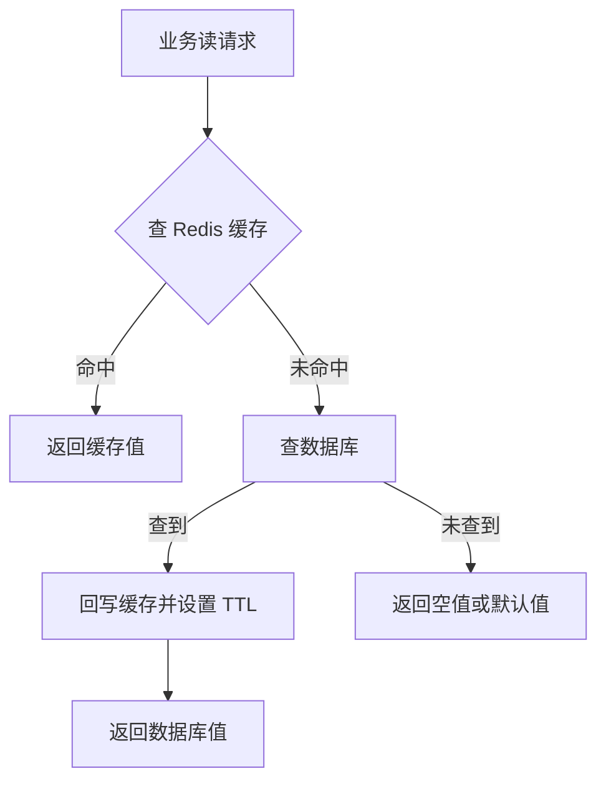
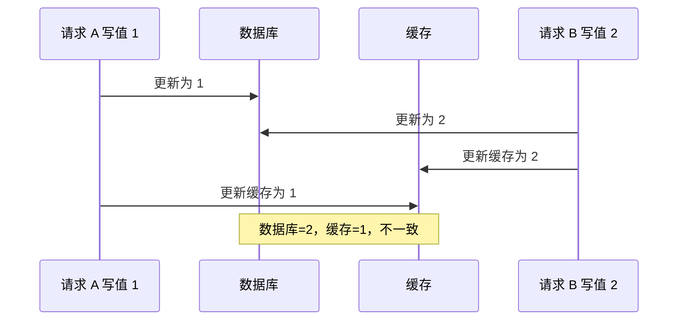
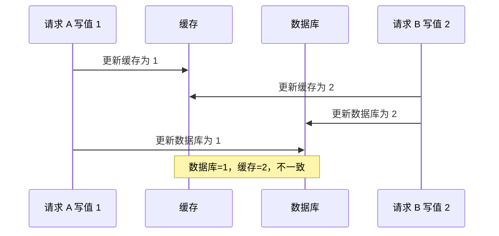
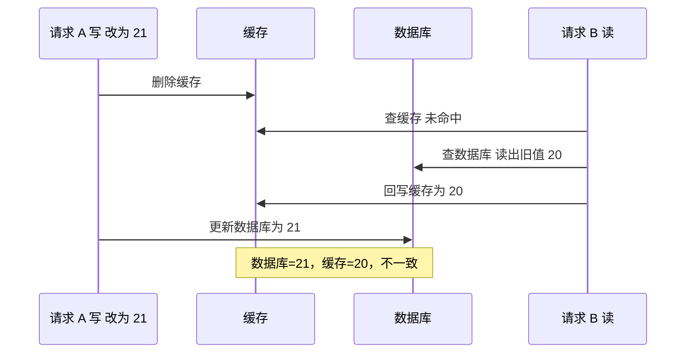
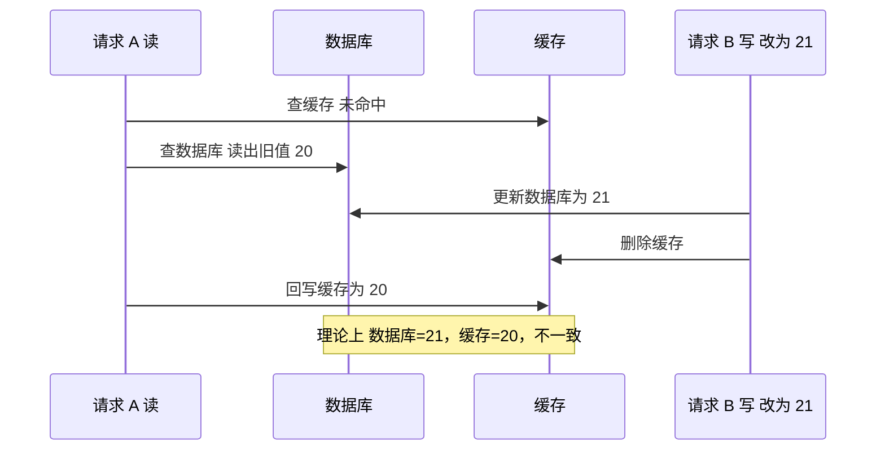
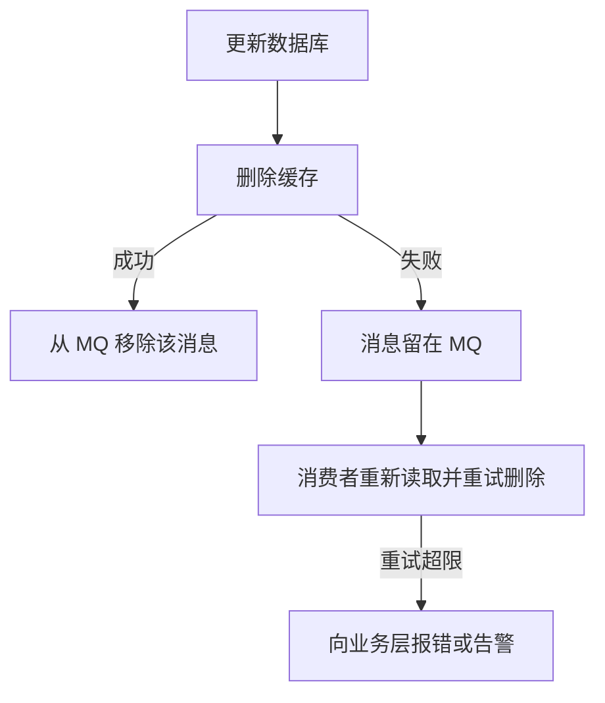
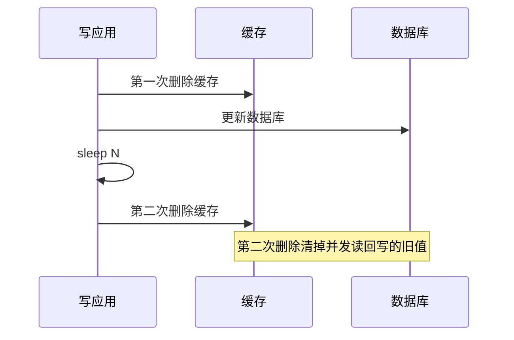

---
tags:
  - 中间件/Redis
---

# 缓存设计与数据库一致性

Redis 作为缓存层，把数据库的数据复制到内存里，读请求先走缓存，只有缓存未命中才落到数据库。这条路日常走得很顺，但它有若干个可被击穿的环节：键会过期、Redis 会挂、数据库里可能根本没有这条数据、写入时缓存与数据库两份副本会分叉。本篇按「读路径 → 三类异常 → 更新策略 → 双写一致性 → 兜底与边界 → 参数与排查」讲清这些环节各自的失效条件，以及每种对策在什么场景下不再成立。默认值与命令行为以 Redis 7.x 为准。

## 1. 读缓存的正常路径

缓存层能提升性能，前提是请求大部分在缓存里被处理掉。这条路径本身很短，但后面所有异常都从它的某个环节断掉，所以先把正常路径固定下来。

一次读请求进入业务系统后按下面的顺序处理：



命中路径只有「查缓存 → 返回」两步，全部在内存里完成，延迟在亚毫秒级；未命中路径多出「查数据库 → 回写缓存」两步，其中查数据库是一次磁盘（或至少是另一次网络）访问，回写缓存又是一次网络写。缓存的价值就是把绝大多数请求收敛到上一条路径上。

**未命中之后一定要回写。** 回写把这次查库的结果沉淀成缓存，后续同样的请求才会命中。回写通常还带一个 TTL（Time To Live，过期时间），让缓存里的旧值有机会被自动清掉，这是后面「最终一致」的兜底手段之一。

**命中率是这条路的核心指标。** 它等于命中次数除以总查询次数。`INFO stats` 里的 `keyspace_hits` 与 `keyspace_misses` 分别记录主字典上查找成功与失败的累计次数，两者相除即命中率（来源：Redis 官方文档, INFO 命令）。命中率低意味着大量请求走到查库那一支，缓存几乎没起作用；命中率突然下跌，往往就是某一类异常正在发生。

```text
   一次读请求：命中与未命中

   业务请求 ──▶ ┌─────────────────┐
                │  查 Redis 缓存   │
                └────────┬────────┘
               命中 ┌────┴────┐ 未命中
                    ▼         ▼
           ┌────────────┐  ┌───────────────┐
           │ 返回缓存值  │  │   查数据库     │
           └────────────┘  └───────┬───────┘
                          查到 ┌───┴───┐ 未查到
                               ▼       ▼
                    ┌──────────────┐ ┌──────────────┐
                    │ 回写缓存+TTL │ │ 返回空值/默认 │
                    └──────────────┘ └──────────────┘
```

这条路有三段可以被绕过：缓存查不中（键过期或不存在）、缓存整体不可用（Redis 故障）、数据库里也没有这条数据（回写不了）。三类缓存异常就分别对应这三段。

## 2. 三类异常是同一路径上的三个断点

把上面那条路径摊开看，缓存雪崩、缓存击穿、缓存穿透都是这条路径在某个环节断掉，只是断点位置和断掉之后的后果不同：

```text
   三类异常在读路径上的断点

   请求 ──▶ 查缓存 ──命中──▶ 返回            （正常）
              │
              │ 未命中
              ▼
         ┌─────────────────────────────┐
         │  断点位置                    │
         ├─────────────────────────────┤
         │ ① 一大批键同时失效           │──▶ 雪崩
         │ ② 单个热点键失效             │──▶ 击穿
         │ ③ 数据在库里也不存在         │──▶ 穿透
         └──────────────┬──────────────┘
                        ▼
                  大量请求落到数据库
```

雪崩发生在「大批键同时失效」这一段，击穿发生在「单个热点键失效」这一段，穿透发生在「数据在库里也不存在」这一段。三者都会把请求放大到数据库上，但断点的性质不同，对策也就不能通用。

## 3. 缓存雪崩

缓存雪崩是大量缓存键在同一时间失效，或缓存层整体不可用，导致原本由缓存吸收的请求一起涌向数据库，数据库被瞬时高并发打垮，进而引发连锁故障。它的两种成因后果相似，对策却完全不同，需要分开处理。

### 3.1 成因一：大量键在同一时间过期

业务通常给缓存键设置 TTL。若一批键是在同一时刻写入、又用同一个固定 TTL，它们就会在同一时刻一起到期。到期瞬间，这批键对应的请求全部未命中，全部去查库并回写，数据库的瞬时读压力等于平时被缓存挡住的全部流量。

举例：一个活动页面在 0 点把 1 万个商品详情预热进缓存，TTL 统一设 3600 秒。1 点整这 1 万个键同时过期，接下来的几秒内所有对该批商品的请求同时查库，数据库 QPS 从「缓存挡剩的少量」跳到「全量」。这就是最典型的雪崩。

对策有三类：

**打散过期时间。** 在基础 TTL 上加一个随机抖动，让键的到期时刻分散到一段时间窗口里，同一时刻到期的键数量从「全量」降为「总量 ÷ 窗口秒数」。缓存 TTL 是业务侧参数，没有官方默认值；常见做法是在基础 TTL 上叠加一个比例随机量，让不同键的到期时间彼此错开。抖动窗口要大于「重建一个键所需的时间」，否则同一批键还可能在同一秒内二次同时过期。

**互斥锁重建。** 缓存未命中时不直接查库，先抢一把分布式锁，只有拿到锁的那一个请求去查库并回写，其余请求等待或返回兜底值。这样即使一批键同时失效，落到数据库上的重建请求也只有一个。互斥锁必须设超时，否则持锁请求异常阻塞会让锁永不释放，其他请求全部卡死。这一手法与 §4 击穿的对策是同一个。

**后台预更新。** 业务线程不再负责重建缓存，缓存也不设 TTL（或设得很长），由后台线程定期全量刷新。这样键不会因为 TTL 到期而同时失效。代价是数据存在「刷新周期」量级的延迟，且要额外处理被内存淘汰（而非过期）的键，见 §11。

### 3.2 成因二：Redis 整体故障

第二种成因与 TTL 无关：Redis 实例宕机、网络分区，或集群大范围故障，缓存层整体不可用。此时所有请求都绕过缓存直接查库，数据库承担全量读压力。它与「大量键同时过期」的区别在于，问题不在过期策略，而在缓存层本身的可用性。

对策偏「保护数据库 + 恢复可用性」：

**服务熔断。** 检测到缓存不可用后，暂停业务对缓存与数据库的访问，直接返回错误。熔断保护了数据库不被压垮，代价是这段时间业务整体不可用。

**请求限流。** 不完全切断，只放行少量请求到数据库，其余在入口拒绝。等缓存恢复并预热完成后解除限流。限流比熔断对业务的伤害小，但放行比例需要按数据库实际承受能力设定。

**构建高可用集群。** 熔断与限流都是故障发生后的补救，真正的解法是让缓存层本身不轻易整体不可用：用主从复制加哨兵，或 Redis Cluster，让主节点故障时能从节点接管。这类方案把单点故障降级为「切换窗口内的短暂不可用」，无法完全消除雪崩窗口，但把窗口从「故障持续期」缩短到「故障转移时间」。

> [!warning] 两类成因不能混用对策
> 打散 TTL 只对「大量键同时过期」有效，对 Redis 整体故障无效——键再怎么打散，缓存整层不可用时请求照样全部落到数据库。反过来，熔断限流不解决「键同时过期」的问题。判断当前是哪一类，看的是「Redis 是否还能响应命令」。

## 4. 缓存击穿

缓存击穿是单个热点键过期时，大量并发请求同时未命中，一起查库重建，把数据库的瞬时压力打到单点。它与雪崩的区别在「键的数量」：雪崩是大批键，击穿是一个键；它与穿透的区别在「数据是否存在」：击穿的数据在数据库里是有的，只是缓存暂时没有。

触发窗口很窄，但破坏力集中。如果某个热点键每秒被访问 10 万次，它在过期的瞬间，这一秒内的 10 万次请求全部未命中，全部去查同一条数据，同一条 SQL 被重复执行 10 万次。数据库的 QPS 与连接数都会被这个单键打满。

两种重建思路：

**互斥锁加重建。** 未命中后抢锁，只有持锁请求去查库并回写缓存，其余请求短暂等待后重读缓存。它把「10 万次查库」压成「1 次查库 + 10 万次等待」。要注意等待请求的超时与兜底：持锁请求执行慢时，等待请求要么返回旧值或默认值，要么快速失败，不能让它们无限期挂住。

**热点数据不过期加后台异步重建。** 热点键不设 TTL，由后台线程在数据变更时或按固定周期刷新。这是更常见的选择，因为热点键数量少，后台刷新成本可控，且业务路径上没有等待。代价是写入后到后台刷新之间有一段旧值窗口，需要业务能容忍这个窗口，或由数据变更事件（消息队列、binlog）触发刷新而非等周期。

**逻辑过期加异步重建。** 键的物理 TTL 设得很长或不过期，但在值里额外存一个逻辑过期时间字段。读请求发现逻辑过期后不阻塞，先返回旧值，同时启动一个异步任务去重建缓存并把逻辑过期时间往后推。它把「过期时的同步等待」换成「过期时的旧值短暂服务」，用一致性换可用性与低延迟，适合能接受短暂脏读、但不能接受请求排队的场景（商品详情、排行榜）。

三种手法在「过期时请求是否等待」上分档：

| 手法 | 过期时请求行为 | 一致性 | 适用 |
| --- | --- | --- | --- |
| 互斥锁重建 | 等待（或兜底返回） | 较强，重建后立即新 | 重建快、能容忍少量等待 |
| 热点不过期加后台刷新 | 不等待，始终返回缓存值 | 弱，有刷新周期延迟 | 热点数量少、有变更事件源 |
| 逻辑过期加异步重建 | 不等待，返回旧值 | 弱，有旧值窗口 | 能容忍短暂脏读、重视延迟 |

## 5. 缓存穿透

缓存穿透是请求的数据在缓存和数据库里都不存在。查缓存未命中，查数据库也查不到，因此没有任何「正确值」可以回写进缓存——缓存无法用一个不存在的值去挡住后续请求。每次这样的请求都会完整走一遍「查缓存 + 查数据库」。若攻击者构造大量不存在的键持续请求，数据库被这些永远查不到结果的查询打垮。

**布隆过滤器（Bloom Filter）。** 它用一个位图数组和 N 个哈希函数，判断某个元素是否**可能**在集合里。它的核心性质是单向误判：判定「不存在」时一定不存在，判定「存在」时可能不存在（假阳性）。

写入与查询的机制（位图长度 m，哈希函数个数 N）：

```text
   布隆过滤器：位图 + N 个哈希函数（示例 N=3，位图长度 m=8）

   写入元素 x：
     x ──▶ h1(x) mod 8 = 1 ┐
     x ──▶ h2(x) mod 8 = 4 ├──▶ 把位图第 1、4、6 位置 1
     x ──▶ h3(x) mod 8 = 6 ┘

     位图  ┌───┬───┬───┬───┬───┬───┬───┬───┐
           │ 0 │ 1 │ 0 │ 0 │ 1 │ 0 │ 1 │ 0 │
           └───┴───┴───┴───┴───┴───┴───┴───┘
             0   1   2   3   4   5   6   7

   查询元素 y：三个位置任一为 0 ──▶ 一定不存在（可直接拒绝）
   查询元素 z：三个位置全为 1 ──▶ 可能存在（需再查库确认）
```

三个步骤（来源：Redis 官方文档, BF.RESERVE）：

1. 用 N 个哈希函数分别对元素做哈希，得到 N 个哈希值；
2. 每个哈希值对位图数组长度取模，得到位图中的 N 个下标；
3. 写入时把这 N 个位置置 1；查询时检查这 N 个位置是否全为 1。

**误判方向。** 由于不同元素可能哈希到相同的位（哈希冲突），一个从未写入的元素 y，其 N 个位置可能恰好都被其他元素置成了 1，于是查询判定「可能存在」——这就是假阳性。反过来，只要有一个位置是 0，说明没有任何写入过程碰过这个位置，元素一定不在集合里。因此：**布隆过滤器说「不存在」，数据库里一定不存在，可以放心拒绝；说「存在」，数据库里不一定存在，还要继续走缓存和数据库。**

布隆过滤器只增不删。位图置 1 之后无法安全置回 0（该位可能被其他元素共享），所以元素删除后不能从过滤器里移除。若要支持删除，得用计数布隆过滤器（Counting Bloom Filter）或 Cuckoo 过滤器。

**容量与误判率。** 假阳性率由位图长度、元素个数、哈希函数个数决定。官方给出的关系是：最优哈希函数个数 k = `ceil(-ln(error_rate) / ln(2))`，每个元素需要的位数 = `-ln(error_rate) / ln(2)^2`（来源：Redis 官方文档, BF.RESERVE）。也就是说，误判率越低，每个元素占用的位数越多：

| 目标误判率 | 哈希函数个数 | 每个元素位数 |
| --- | --- | --- |
| 1% | 7 | 9.585 |
| 0.1% | 10 | 14.378 |
| 0.01% | 14 | 19.170 |

若实际写入量超过容量估算值，过滤器会连锁创建子过滤器（缩放），子过滤器越多，查询要依次检查每一个，性能随之退化。因此 `BF.RESERVE` 应尽量按预期元素量预留容量。

**空值缓存与入口限制。** 查库确认数据不存在后，把一个空值（或约定的默认值）写进缓存，并设置一个较短的 TTL。后续同样的请求会在缓存里读到这个空标记，直接返回，不再查库。难点在 TTL 的取值：太短，穿透窗口没被盖住；太长，如果这条数据后来真的被写入，缓存里的空值会把真实数据挡住，直到 TTL 到期。因此空值 TTL 要明显短于正常缓存 TTL，且数据写入时要主动删除对应的空值键。

空值缓存与布隆过滤器的分工：空值缓存针对已经出现过的穿透键（每个新键第一次仍会查库）；布隆过滤器针对整批可能不存在的键，在查缓存之前就把不可能的键拦掉，第一次也不会查库。两者常一起用。

**入口参数校验与限流。** 在 API 入口判断请求参数是否合法（字段存在、格式正确、取值在合法范围内），非法请求直接返回错误，不进入缓存与数据库。这一层拦的是明显构造的恶意请求，比如不存在的 ID 格式、超出范围的批量查询。它拦不住「格式合法但键不存在」的请求，那类要靠空值缓存或布隆过滤器。

**请求限流。** 对同一来源或同一键的请求做频率限制，超过阈值直接拒绝。它限制的是攻击的速率，不区分请求是否合法。

## 6. 三类异常对照

三者的差异可以摊在一张表里读：

| 维度 | 缓存雪崩 | 缓存击穿 | 缓存穿透 |
| --- | --- | --- | --- |
| 触发条件 | 大量键同时过期，或 Redis 整体故障 | 单个热点键过期 | 请求的数据在缓存和数据库里都不存在 |
| 影响范围 | 整个缓存层或大批键 | 一个热点键 | 一批不存在的键 |
| 数据库里是否存在 | 存在 | 存在 | 不存在 |
| 缓存能否恢复 | 重建后即可恢复 | 重建后即可恢复 | 无法缓存「不存在」，不能靠重建恢复 |
| 对策重心 | 打散过期时间、熔断限流、高可用集群 | 互斥锁、热点不过期加异步重建、逻辑过期 | 布隆过滤器、空值缓存、入口校验与限流 |

**「数据库里是否存在」是分水岭。** 雪崩与击穿时数据库里有数据，缓存重建即可把压力重新挡回缓存；穿透时数据库里没有数据，缓存没有办法缓存一个「不存在」，每次请求都会穿透到数据库，只有布隆过滤器或空值缓存这类专门机制能拦住。这也解释了为什么穿透与另外两类的对策差异最大。

**判读当前是哪一类。** 按现象对号：缓存内存占用正常但数据库 QPS 齐涨、且集中在某一时刻，疑似雪崩（大量键同时过期，见 §13）；数据库 QPS 尖峰集中在同一条查询上，疑似击穿（单个热点键）；数据库 QPS 高、缓存命中率低且查库大量返回空，疑似穿透（大量不存在的键）。三个信号分别对应 §13 里的排查入口。

## 7. 缓存更新策略

缓存与数据库之间存在两份副本，写操作要决定「什么时候、以什么方式」同步这两份。工程上有三种更新策略：Cache Aside、Read/Write Through、Write Behind。

### 7.1 Cache Aside（旁路缓存）

Cache Aside 是最常用的一种：应用程序直接与数据库和缓存交互，自己负责维护两者的关系，缓存组件不感知数据库。

读策略：

1. 读缓存，命中则直接返回；
2. 未命中则读数据库，把结果写入缓存（带 TTL），再返回。

写策略：

1. 先更新数据库；
2. 再删除缓存。

这个顺序的排序理由，以及它为什么也不是绝对安全，是 §8 要推演的核心。

**写策略为什么是删除缓存而不是更新缓存。** 三点理由：

- **删除更轻量。** 缓存的值可能来自多张表的聚合（商品详情要关联商品表、价格表、库存表）。数据源变化时，重新计算并写入一个聚合值是重操作；删除只是一个 `DEL`。
- **避免无效写入。** 更新后的缓存值可能长时间不被访问（懒加载，Lazy Loading），提前更新等于计算了一个没人要的结果。
- **并发更简单。** 更新缓存是「写一个计算后的值」，删除是「让缓存失效、下次读时重建」，后者把「算新值」这一步推迟到真正要读的时候，减少一次写入竞态。

Cache Aside 适合读多写少的场景：写入频繁时，每次写都删缓存，导致缓存频繁失效、命中率下降。

### 7.2 Read/Write Through 与 Write Behind

**Read/Write Through（读穿/写穿）。** 应用只与缓存交互，不再直接访问数据库，缓存组件自己负责与数据库的读写。读时缓存未命中，由缓存组件去查数据库并回填（Read Through）；写时缓存组件同步更新数据库，然后才返回（Write Through）。应用侧代码更简单，因为数据库访问被缓存组件代理了。它少见于 Redis、Memcached，因为这类分布式缓存组件不提供「写入数据库」和「自动加载数据库数据」的能力，需要自己封装或使用具备该能力的本地缓存组件。

**Write Behind（写回，也叫 Write Back）。** 应用写时只更新缓存并标记为脏，立即返回；数据库的更新由后台批量异步完成。它写入延迟最低，特别适合写多的场景。代价是一致性最弱、宕机丢数据：缓存一般是内存，未刷回的脏数据在机器掉电后会丢失。这是 CPU 缓存与操作系统页缓存（Page Cache）采用的设计，不适合 Redis 加数据库这种组合，因为 Redis 没有「异步更新数据库」的能力。

### 7.3 三种策略的取舍

| 策略 | 应用与谁交互 | 写延迟 | 一致性 | 宕机丢数据 | Redis 场景可用性 |
| --- | --- | --- | --- | --- | --- |
| Cache Aside | 应用直接管缓存与数据库 | 中（写库加删缓存） | 较弱，需兜底 | 否 | 主流选择 |
| Read/Write Through | 应用只与缓存交互 | 中（缓存同步写库） | 较强 | 否 | 少见，需缓存组件支持 |
| Write Behind | 应用只与缓存交互 | 最低（只写缓存） | 最弱 | 是 | 不适用（Redis 不异步写库） |

取舍的判据是「能不能容忍丢数据」和「写延迟要求」：不能丢数据就排除 Write Behind；写延迟要求极高、且能容忍丢数据才考虑它。Cache Aside 与 Read/Write Through 都不丢数据，区别在数据库访问由谁发起——由应用发起（Cache Aside）代码可控但繁琐，由缓存组件发起（Read/Write Through）代码简洁但需要组件支持。Redis 场景下，Cache Aside 是实际选择。

## 8. 双写一致性的四种写顺序

Cache Aside 的写策略是「先更新数据库，再删除缓存」。要理解它为什么被选为工程主流，需要把「写数据库」和「写缓存」这两个操作的所有排列都推演一遍，看每种顺序在并发下会在哪里失效。四种排列是：先更新库再更新缓存、先更新缓存再更新库、先删缓存再更新库、先更新库再删缓存。

**先更新数据库，再更新缓存。** 两个并发写请求 A、B 更新同一条数据（A 写值 1，B 写值 2），在没有任何并发控制时，两个操作的执行顺序可能交错：



失效条件：**两个请求的「库」和「缓存」两次写发生交叉**。A 先把库写成 1，B 再把库写成 2；但缓存侧的写入顺序反过来——B 先写 2，A 后写 1。最终数据库是最新的 2，缓存停留在旧的 1。根因是两个写操作各自独立、没有并发控制，交错顺序不受控。

**先更新缓存，再更新数据库。** 把顺序倒过来同样有漏洞：



失效条件同上：两次缓存写的顺序与两次库写的顺序相反。最终缓存是较新的 2，数据库停留在旧的 1。两处推演说明：只要「写库」和「写缓存」是两个独立的、无并发控制的步骤，无论谁先谁后，交错都会导致不一致。

**先删除缓存，再更新数据库。** 既然更新缓存会引入「两次写」的交错，Cache Aside 改成删除缓存。先把顺序排成「先删缓存，再更新库」，看「读加写」并发时的漏洞：



失效条件：**读请求 B 的「查库 → 回写」落在写请求 A 的「删缓存 → 更新库」之间**。B 在 A 删缓存之后、更新库之前查库，读到的是旧值 20，并把它回写进缓存；A 随后才把库更新为 21。缓存里的旧值 20 没有任何人来清理，会一直服务到 TTL 到期。这是「先删缓存再更新库」在读写并发下无法避免的漏洞，因此它不被采用。

**先更新数据库，再删除缓存（工程主流）。** 把顺序改成「先更新库，再删缓存」，用同样的读写并发推演：



理论上同样能构造出不一致：读请求 A 在「查库读出 20」与「回写缓存」之间，写请求 B 完成了「更新库为 21 + 删缓存」，A 再把旧值 20 回写进缓存。**但实际中这个窗口极难命中。**

**为什么概率低。** 关键在两类操作的耗时差：缓存的写（`SET`、`DEL`）是内存操作，通常在微秒到亚毫秒级；数据库的更新是一次写事务，要写日志、刷盘、可能等锁，通常在毫秒到几十毫秒级。要构造出不一致，需要读请求 A 在「查库返回」之后、「回写缓存」之前的这段极短时间里，恰好让写请求 B 完成「更新库加删缓存」两个更慢的操作，也就是 A 的回写必须慢到被 B 的整个写事务超过。缓存写的耗时远小于数据库写，所以 A 几乎总能在 B 删缓存之前完成回写；一旦 A 先回写完，B 随后的删缓存就把这个旧值清掉了，后续请求会重新查库得到新值。这个失败窗口存在，但只在「缓存写异常慢（网络抖动、缓存负载高）」叠加「库写异常快」时才有机会被撞上。

工程上的补充手段：

- **给缓存加 TTL 兜底。** 即使极端情况下写入了旧值，TTL 到期后缓存失效、下次读重建，达到最终一致。TTL 是最终一致的兜底，不保证强一致。
- **删除失败的补偿。** 「先更新库再删缓存」是两个操作，第二个操作（删缓存）可能失败。若删缓存失败，缓存里会一直留旧值直到 TTL 到期，这就是 §9 要解决的问题。

四种写顺序的结论：先更新库再更新缓存、先更新缓存再更新库，都会因「两次写交错」而不一致；先删缓存再更新库，在读写并发下会把旧值回写进缓存且无人清理；先更新库再删缓存，理论上也有窗口，但失败窗口依赖「缓存写慢于库写」这一叠加条件，实际概率极低，配合 TTL 兜底后成为工程主流。

## 9. 删除失败的兜底：重试与订阅 binlog

「先更新库再删缓存」拆成两个操作，只要第二个操作（删缓存）失败，缓存里就会残留旧值。有两种方式保证删缓存这件事最终一定被执行。

### 9.1 消息队列重试

把「要删的缓存键」放进消息队列，由消费者执行删除：



流程：应用更新数据库成功后，把对应键投递到 MQ；消费者消费消息并执行删缓存；删除成功则把消息从队列移除（避免重复操作），失败则留在队列里继续重试；重试超过一定次数仍失败，向业务层报警。

**优点**：能保证删缓存最终被执行，一致性强。**缺点**：对业务代码有入侵——原本的业务写路径要额外接入 MQ 投递逻辑。

### 9.2 订阅 binlog（Canal）

「先更新库再删缓存」的第一步是更新数据库，而数据库的更新会写进 binlog（二进制日志）。订阅 binlog 就能拿到哪些数据变了，再据此删缓存，不需要业务代码主动投递 MQ。

Canal 是这套方案的常用中间件。它模拟 MySQL 从库的交互协议，把自己伪装成一个从库，向主库发送 dump 协议；主库收到 dump 请求后开始推送 binlog；Canal 解析 binlog 字节流，转成结构化数据供下游订阅（来源：Canal 官方文档）。链路如下：


做法：Canal 采集 binlog 发送到 MQ；一个缓存删除消费者订阅 binlog 事件，按更新记录删除对应缓存，并通过 ACK 机制确认处理。

**优点**：与业务代码没有耦合，无入侵。**缺点**：引入 Canal 加 MQ 等组件，链路更长，对团队的运维能力要求更高。

### 9.3 关键约束：先删缓存成功，再回 ACK

无论走 MQ 重试还是 Canal 加 MQ，消费端都有一个必须遵守的顺序：**必须先确认删除缓存成功，再向消息队列回 ACK**。

反例：消费者从 MQ 拿到事件后先回 ACK，再执行删除缓存。若删除缓存失败，因为已经提前 ACK，这条消息被视为已消费、不会再重投，重试机制失效，缓存里的旧值会一直留到 TTL 到期。正确的做法是「执行删除 → 成功 → 回 ACK」，删除失败就不回 ACK，让 MQ 重新投递。这条约束是「保证删缓存被执行」能否成立的关键点，顺序写反了，整条兜底链路就形同虚设。

两种方案的共同点是都采用异步操作缓存：删缓存不再发生在业务写路径上，改在另一个异步链路里重试，直到成功。

## 10. 延迟双删与一致性的边界

**延迟双删。** 「先删缓存再更新库」在读写并发下会把旧值回写进缓存（§8）。延迟双删针对的就是这个窗口：先删一次缓存，更新库之后再删一次，第二次删除把读请求回写进来的旧值清掉。



伪码：

```text
DEL key          # 第一次删除缓存
UPDATE db        # 更新数据库
sleep(N)         # 等待并发读完成「查库 + 回写」
DEL key          # 第二次删除缓存
```

**sleep 时间的不确定性。** 要让第二次删除命中「读请求回写进来的旧值」，N 必须大于「并发读请求从查库到回写缓存」的耗时。但这个耗时无法事先精确评估：它取决于数据库当时的负载、网络延迟、缓存响应时间，且随并发读请求的数量变化。N 取小了，读请求可能还没回写；N 取大了，写入延迟被白白拉长。因此延迟双删只是尽可能保证一致，无法保证必然一致，极端情况下仍会不一致。它的定位是「在已经选了先删缓存顺序时的一种补救」，并不比「先更新库再删缓存」更优。这也是工程上仍推荐「先更新库再删缓存」的原因。

**删除而不是更新缓存的两条工程补充。** 第 7.1 节从轻量、无效写入、规避竞态三个角度解释了写策略为什么是删除，这里补两条：

- **删除的代价是命中率下降。** 每次写都删缓存，被删的键下次读要重新查库回填。读多写少的场景下这个代价可忽略；写频繁时命中率会被明显拉低。
- **若确实要提高命中率，可以改为「更新数据库加更新缓存」，但要加并发控制。** 两种做法：更新前加分布式锁，保证同一时间只有一个请求更新缓存（代价是写入性能下降）；或给缓存设一个较短的过期时间，缓存不一致时也能很快过期（代价是不一致窗口内业务要能接受脏读）。

**一致性的边界。** 缓存与数据库是两套独立存储，没有跨系统的分布式事务，因此不存在免费的强一致。需要在三个层次上做取舍：

- **强一致与最终一致之分。** 强一致要求任一时刻读到的缓存值与库一致，通常要引入锁或分布式事务，代价高、吞吐低。「先更新库再删缓存 + TTL 兜底 + 删除失败重试」给的是最终一致：正常情况下立即一致，异常情况下在 TTL 或重试完成时收敛。
- **TTL 是最终一致的兜底，不是主要手段。** TTL 到期会让缓存失效（哪怕删缓存漏掉了），但 TTL 期间的脏读是存在的。TTL 越短，不一致窗口越短，但缓存命中率越低、数据库压力越大。
- **业务能否容忍延迟一致。** 商品详情、排行榜、评论数这类读多写少、短时间脏读可接受的业务，可以直接用最终一致方案；余额、库存扣减这类要求准确的场景，不应把 Redis 当唯一数据源，正确性判断要回到数据库（或改用带原子操作的方案），缓存只作为读加速。

判据一句话：先问这个业务能不能容忍「最多 TTL 时长的不一致」。能容忍，就用「先更新库再删缓存 + TTL 兜底 + 异步删除重试」；不能容忍，就不要让缓存承担正确性，把关键判断留在数据库侧。

## 11. 热点数据与缓存策略

**动态缓存热点数据。** 系统内存有限，不可能把所有数据都放进缓存，通常只缓存被频繁访问的那部分（热点数据）。热点是动态变化的（活动、爆款），所以需要一套「动态识别并保留热点」的策略。

总体思路：按数据的最近访问时间排序，定期淘汰掉不常访问的，只留下经常访问的。以「只缓存访问最频繁的 Top 1000 商品」为例：

- 用一个排序队列（如长度 1000）记录商品 ID，按最近访问时间更新排名，越近访问排越前；
- 定期过滤掉排名最后的 200 个，再从数据库随机读 200 个补充进队列；
- 请求到达时先从队列取商品 ID，命中则按 ID 到另一个缓存结构里读实际商品信息。

在 Redis 里可以用 `ZADD`（按访问时间更新分数）和 `ZRANGE`（取末尾 200 个）实现这个排序队列。

**识别真实热点。** 上面的队列是「自己维护」的近似；如果想知道 Redis 实际认为哪些键最热，用 LFU 统计：把 `maxmemory-policy` 设为 LFU 策略后，`OBJECT FREQ key` 返回该键的对数访问频率计数器（来源：Redis 官方文档, OBJECT FREQ），`redis-cli --hotkeys` 扫描并列出热点键。注意这两个手段都只在 LFU 策略下可用，LRU 策略下 `OBJECT FREQ` 不可用。

**两级缓存。** 单用分布式缓存（Redis）时，热点键的每次读都要一次网络往返。把本地缓存（进程内，如 Caffeine）叠在分布式缓存前面，形成两级：

```text
   两级缓存读路径

   请求 ──▶ ┌──────────────┐ 未命中 ┌──────────────┐ 未命中 ┌──────────┐
            │ 本地缓存(L1) │ ─────▶ │  Redis(L2)   │ ─────▶ │  数据库   │
            └──────┬───────┘        └──────┬───────┘        └────┬─────┘
                   │ 命中                  │ 命中                  │
                   ▼                       ▼                       ▼
                直接返回                回填 L1                 回填 L1/L2
```

L1 命中时零网络开销，能把最热的那批键的读延迟压到进程内级别。代价是一致性更难维护：L1 分散在多个应用进程里，删缓存（L2）之后各进程的 L1 仍是旧值。常见做法是给 L1 设很短的 TTL（秒级），或用发布订阅、消息广播通知各进程失效本地缓存。因此 L1 一般只放「变化少、能容忍秒级延迟」的热点键。

**缓存预热与降级。** 缓存预热：系统刚上线或刚重启时缓存是空的，此时所有请求都会查库。做法是在开放流量之前，后台线程先把热点数据加载进缓存（§3.1 的后台更新机制天然适合做这件事）。预热失败或流量提前放开，就会触发一次人为的雪崩。缓存降级：当缓存不可用或命中率异常低、数据库也接近极限时，主动降低服务质量以保住核心链路，返回默认值、过期数据，或对非核心功能直接返回错误。降级与熔断（§3.2）配合使用：熔断切断对故障缓存与数据库的访问，降级决定切断之后返回什么。

## 12. 参数逐条

下面这些参数属于业务侧与缓存配置侧，除 `maxmemory-policy` 外都没有统一的官方默认值，需要按业务场景设定。每条按「默认值 → 语义 → 什么时候改 → 改大改小的后果 → 联动 → 失败模式」写。

**缓存 TTL 与随机化**

- **默认**：无官方默认，业务设定。Redis 键不设 TTL 即永不过期。
- **语义**：缓存副本的有效期，到期后缓存在下次读时失效重建；同时是最终一致的兜底。
- **何时改**：数据变更不频繁、能容忍较长不一致窗口时设长；数据敏感、要求尽快收敛时设短。
- **改大改小**：TTL 长则命中率高、数据库压力小，但不一致窗口长；TTL 短则不一致窗口短，但命中率低、重建频繁。
- **联动**：与随机抖动一起用，避免大量键同时到期（§3.1）。
- **失败模式**：统一 TTL 且无抖动会导致雪崩；TTL 过长会导致长期脏读；TTL 过短则缓存形同虚设。

**互斥锁超时**

- **默认**：无官方默认，业务设定（`SET key value NX PX <ms>` 的 `ms`）。
- **语义**：重建缓存时互斥锁的持有上限，防止持锁请求异常阻塞导致锁不释放。
- **何时改**：按「一次重建（查库加回写）的最坏耗时」设置为略大于它的值。
- **改大改小**：过大则持锁请求真挂掉时，其他请求等待过久；过小则重建还没完成锁就超时，其他请求又去并发重建，互斥失效。
- **联动**：与请求侧的等待超时一起设，等待超时要大于锁超时。
- **失败模式**：不设超时会导致锁永不释放、请求全部阻塞；超时短于重建耗时会导致并发重建、互斥被绕过。

**布隆过滤器误判率与容量**

- **默认**：隐式创建（对不存在的 key 执行 `BF.ADD`）时使用一个默认过滤器。官方命令页未列出默认 error rate 与 capacity 的完整数值；`BF.INFO` 的示例显示隐式创建的过滤器 capacity 为 100、expansion 为 2（来源：Redis 官方文档, BF.INFO）。error rate 的默认值按未核对官方文档处理（常见记为 0.01）。
- **语义**：`BF.RESERVE key error_rate capacity`，决定假阳性率与预估元素量；误差率越低，每位元素占用越多（§5 的表）。
- **何时改**：按实际要写入的元素量和能容忍的假阳性率预留。
- **改大改小**：error_rate 调小则假阳性更少、内存更大；capacity 小于实际则连锁创建子过滤器、查询变慢。
- **联动**：与 `EXPANSION` 一起决定缩放行为；`NONSCALING` 超过容量直接报错。
- **失败模式**：容量估算过小会导致误判率飙升、子过滤器增多、查询性能退化。

**空值缓存 TTL**

- **默认**：无官方默认，业务设定。
- **语义**：把「查库确认不存在」记成空值缓存的有效期。
- **何时改**：穿透压力大、且数据后来可能被写入的频率低时可稍长；数据写入频繁时要短。
- **改大改小**：过长则数据后来真被写入时，空值会把真实数据挡住；过短则穿透窗口未被盖住。
- **联动**：与「写入时主动删除空值键」一起用。
- **失败模式**：空值 TTL 长于业务对「新数据可见性」的要求时，新写入的数据读不到（被空值挡住）。

**maxmemory-policy（纯缓存场景应改为 allkeys-lru）**

- **默认**：`noeviction`（来源：Redis 官方文档, Key eviction）。
- **语义**：达到 `maxmemory` 后如何淘汰键。`noeviction` 不淘汰，对需要更多内存的写命令直接返回错误。
- **何时改**：把 Redis 当纯缓存用时，应改为 `allkeys-lru`（或 `allkeys-lfu`）。
- **改大改小**：这是策略选择而非数值。默认 `noeviction` 在缓存场景下会让写请求在内存打满时报错；`allkeys-lru` 会淘汰最久未使用的键来腾空间。
- **联动**：与 `maxmemory` 一起生效；LFU 策略下才能用 `OBJECT FREQ` 与 `--hotkeys`（§11）。`maxmemory` 默认 0，即 64 位系统不设上限（来源：Redis 官方文档, Key eviction）。
- **失败模式**：纯缓存却保留 `noeviction`，内存打满后 `SET`、`HSET` 等写命令报 `OOM command not allowed`，业务写入失败，表现为「缓存写不进去」。

## 13. 常见故障与排查

缓存相关故障大多表现为「数据库压力骤增」或「缓存写不进去」，根因落在命中率、一致性、单节点热点、内存上限、过滤器容量五处。下面按「症状 → 判据 → 先看什么」组织。

**缓存命中率低怎么定位。** 症状是数据库 QPS 上升、响应变慢，缓存内存占用却不高。定位顺序：

```text
   缓存命中率低：定位顺序

   ① 读 INFO stats 的 keyspace_hits 与 keyspace_misses
        └─ hits/(hits+misses) 突然下跌 ↓ 继续
   ② 看命中率是「整体低」还是「某类键低」
        ├─ 整体低    ⟹ 缓存容量 / TTL / 淘汰策略问题
        └─ 部分键低  ⟹ 疑似雪崩或击穿（§3、§4）
   ③ 查 expired_keys 与 evicted_keys（INFO stats）
        ├─ expired_keys 齐涨 ⟹ 大量键同时到期 → 雪崩
        ├─ evicted_keys 齐涨 ⟹ 内存不足在淘汰 → 查 maxmemory 与策略
        └─ 两者都平          ⟹ 疑似穿透 → 查是否有大量「查库返回空」
```

三条判读原则：先分清是「键没了」还是「键没被访问」——`expired_keys`、`evicted_keys` 反映键的消失，`keyspace_misses` 的增速反映访问落空；看增速不看绝对值——累计值本来就增长，关键是某时刻后的斜率变化；把 miss 的增速与数据库 QPS 的增速对齐——两者同拍上涨说明 miss 正直接转化为数据库压力，两者背离说明数据库压力另有来源。

**缓存与数据库不一致的排查顺序。** 症状是业务读到旧值，或「更新后一段时间才生效」。判据与顺序是先确认写顺序，再确认第二个操作是否成功，最后确认是否有并发读回写：

1. **确认写顺序**：代码里是「先更新库再删缓存」还是别的顺序。若是「先删缓存再更新库」且无延迟双删，怀疑 §8 的读回写漏洞。
2. **确认删缓存是否成功**：查删缓存操作的日志与失败计数。若删缓存失败且无重试，缓存会残留旧值到 TTL 到期，表现为「过一段时间才生效」。
3. **确认是否有并发读回写**：在「先更新库再删缓存」下，若缓存写异常慢叠加库写异常快，可能撞上 §8 的窗口。
4. **确认兜底是否生效**：TTL 是否设置、是否在合理范围；删缓存失败后 MQ、Canal 链路是否在重试。

最常见的根因是第 2 步（删缓存失败且没有重试），而不是写顺序选错。判据是「现象是可自愈的还是不自愈的」：TTL 到期后自愈，说明是删缓存失败加 TTL 兜底；一直不自愈，说明连 TTL 都没有，或数据被反复写坏。

**热 key 打爆单节点。** 症状是单个 Redis 节点 CPU 打满、网络带宽打满，其他节点空闲；某个键的 QPS 远超其他键。判据是用 `redis-cli --hotkeys`（LFU 策略下）或 `OBJECT FREQ` 找出高频键；在 Cluster 下，热点键落在哪个槽和节点，就压垮哪个节点（Cluster 按 key 分片，同一个键永远在同一个节点）。处置方向：给热点键做读副本分散（Cluster 下用只读从库分流读）、在应用侧加本地缓存（§11 的 L1）把最热的键挡在进程内、或对热点键做拆分（把一个热键拆成 N 个子键，读时随机挑一个）。

**maxmemory 打满导致写失败。** 症状是 `SET`、`HSET`、`LPUSH` 等写命令报错（`OOM command not allowed when used memory > 'maxmemory'`），读命令正常。判据是查 `maxmemory-policy`：若为默认的 `noeviction`，达到 `maxmemory` 后不淘汰、写命令直接报错（来源：Redis 官方文档, Key eviction）；`INFO stats` 的 `evicted_keys` 为 0 也印证没有在淘汰。处置：纯缓存场景把 `maxmemory-policy` 改为 `allkeys-lru`（或 `allkeys-lfu`）；若部分键不能丢，改 `volatile-*` 策略并确保这些键设了 TTL；同时复核 `maxmemory` 是否设得小于实际可用内存。

**布隆过滤器容量估算错误导致误判率飙升。** 症状是布隆过滤器「说存在」的比例异常高，大量本不存在的请求被判为「可能存在」，继续查库，穿透没被拦住。判据是 `BF.INFO key` 看当前元素数与实际容量：若实际写入量远超 `BF.RESERVE` 时预留的 capacity，且允许缩放（默认 `EXPANSION 2`），过滤器会连锁创建多个子过滤器，每个子过滤器有自己的位图与哈希函数，假阳性率随子过滤器数量累积上升，查询要依次检查所有子过滤器，性能也下降。处置：按预期元素量重建过滤器（`BF.RESERVE` 预留足够 capacity），或按 §5 的公式重新估算 error_rate 与位数；容量无法预估时考虑用不支持缩放的 `NONSCALING` 并显式处理超容量报错，而不是让误判率失控。

## 相关

- [[00-Redis 专栏导览]] —— 本专栏的入口、边界与阅读顺序
- [[04-过期删除与内存淘汰]] —— 过期与淘汰决定了缓存会怎样失效
- [[05-分布式锁]] —— 互斥锁重建与延迟双删都用得到它
- [[01-Kafka 知识汇总]] —— 「删缓存失败重试」的另一种兜底是消息队列
- [[05-事务隔离与 MVCC]] —— 数据库那一侧的双写与隔离性

## 参考

- Redis. *Key eviction*. https://redis.io/docs/latest/develop/reference/eviction/
- Redis. *INFO*. https://redis.io/docs/latest/commands/info/
- Redis. *OBJECT FREQ*. https://redis.io/docs/latest/commands/object-freq/
- Redis. *BF.RESERVE*. https://redis.io/docs/latest/commands/bf.reserve/
- Redis. *BF.ADD*. https://redis.io/docs/latest/commands/bf.add/
- Redis. *BF.INFO*. https://redis.io/docs/latest/commands/bf.info/
- redis/redis. *redis.conf (7.2)*. https://raw.githubusercontent.com/redis/redis/7.2/redis.conf
- alibaba/canal. *canal — 简介*. https://github.com/alibaba/canal
- 小林coding. *图解 Redis v2.0*. https://xiaolincoding.com/redis/
