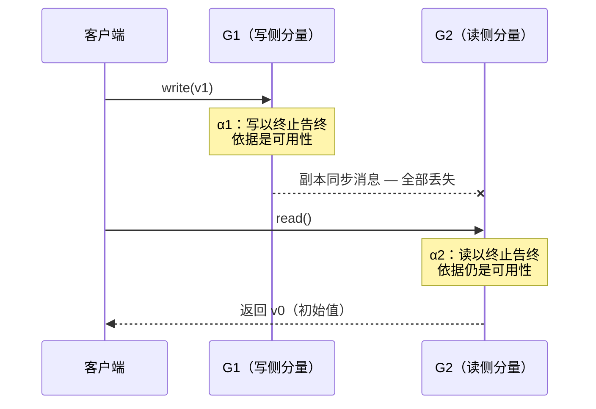
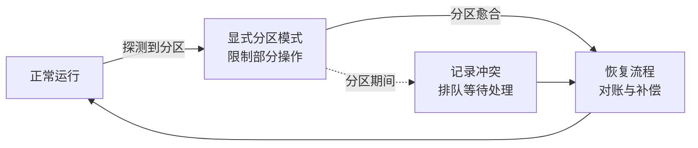

---
tags:
  - 分布式
  - 分布式/一致性
---

# CAP 定理

CAP 定理（CAP Theorem）是由计算机科学家 Eric Brewer 在 2000 年提出的，它指出在分布式系统中，不可能同时满足以下三个特性：

1. **一致性（Consistency）**：
    - 所有节点在同一时间看到的数据是一致的。
    - 任何读操作都能读到最新的写操作结果。
    - 一致性要求：一旦某个数据在分布式系统中的某个节点上被更新（如修改成新值），那么后续对该数据的读取操作，无论发生在哪个节点上，都应该返回更新后的值，即：**所有节点在同一时间内，都能看到相同、且最新写入的值**。
      思考：在`MySQL`主从模式下，一个新值写入后还未提交，此时在从节点上读取到了老值，满足`CAP`的一致性要求吗？
      答案是满足，只要保证事务提交前，所有节点读到的数据都为老值，就满足一致性要求！
2. **可用性（Availability）**：
    - 系统在任何时候都能响应客户端的请求，返回非错误的结果。
    - 即使某些节点发生故障，系统仍然可用。
    - 可用性强调的是系统对外部请求的响应能力，具体来说，它要求系统能够在一定的时间内，对任何非失败的外部请求做出响应。这意味着，无论系统内部发生什么情况，只要外部用户发出请求，系统都应该尽快做出响应，即使回应的是拒绝服务或错误消息。因此，可用性关注的是系统对外部请求的响应速度和可靠性。
3. **分区容错性（Partition Tolerance）**：
    - 系统在网络分区（即部分节点之间的通信中断）的情况下仍然能够继续运行。
    - 分区容错性是分布式系统的基本要求，因为网络分区是不可避免的。
    - 节点的加入与断开都可以被认作为系统内的网络分区，因此CAP中的P也可以理解为分布式系统内对于节点动态加入与离开的处理能力

## CAP 定理的含义

根据 CAP 定理，分布式系统只能在以下三种组合中选择两种：

- **CP 系统**：一致性和分区容错性，牺牲可用性。
- **AP 系统**：可用性和分区容错性，牺牲一致性。
- **CA 系统**：一致性和可用性，牺牲分区容错性（在实际分布式系统中几乎不可能实现，因为网络分区是不可避免的）。

> 一致性要求所有节点在同一时间看到相同的数据；
> 可用性则要求系统能够始终对请求做出响应；
> 分区容错性则是指系统在遇到网络分区时，仍然能够保持一定的可用性和一致性。
>
> 虽然其中的 A、P 在某些方面看起来相似，但它们关注的焦点并不相同：可用性侧重于系统对用户请求的响应能力，而分区容错性更侧重于系统在出现网络分区时的表现。

假设我们自己要研发一款分布式组件，如果要保证`CA`（一致性与可用性），该怎么实现？

可用性可以理解成高可用，高可用的前提是解决单点故障，因此我们可以考虑集群设计方案，使用多个节点来组成整个系统，当系统部分节点出现故障时，外部请求能自动转移到其他健康的节点上处理。通过这种方案，我们可以保证系统在节点故障时的可用性，不过这里又有个问题，如何感知节点是否健康？

**设计健康检查机制**！而最主流的方案则是心跳机制，就好比一个正常的人，一定会有心跳，换到程序设计中，一个正常的节点，必然也具备发送心跳包的能力。反之，如果一个节点发送不了心跳包，或者系统内其他节点收不到某个节点的心跳包，说明该节点已经处于故障状态，后续不用将请求转发到该节点。

保障了可用性后，接着来看看一致性，因为此时有多个节点，多个节点的数据一致该怎么实现？选择`2PC、3PC`这类强一致方案，当外部往某个节点写入数据时，该节点触发数据同步机制，将写入的数据同步给所有节点，当所有都同步完成后，再给客户端返回写入成功，这样就能保证所有节点数据完全一致。

通过上述步骤，就设计出了一个简易版的`CA`分布式组件，存在什么问题吗？问题很大，节点间的心跳检测、数据同步，需要依靠网络进行通信，先来看看心跳检测的问题：

> 某个节点其实很健康，但发出的心跳包，因为网络抖动造成丢包，其他节点没收到就认为它故障了，这合理吗？不合理。
> 某个节点发出的心跳包，部分节点收到了，部分节点没收到，一部分节点认为健康，一部分节点认为故障，从而造成了分区，怎么办？

再来看看保证一致性的数据同步方案，假设某个节点故障，又或者同步数据时的包丢失，导致系统内多个节点数据不一致，系统为了达成“数据一致态”，会不断触发重试机制，造成外部请求阻塞，一直无法成功写入……

综上，最开始的设计思路，只是我们最理想的状态，但网络其实是个不可控因素，总会由于各种各样的原因造成故障出现。因此，在设计分布式系统时，网络故障带来的分区问题，一定要率先考虑，如果对分区问题没有容错性，代表系统内一个节点出现问题时，会造成整个系统无法正常运行，这也是为什么只有保证`AP、CP`的分布式组件，没有保证`CA`的原因。

> 有没有能保证`CA`的组件呢？答案是有，就是单机版本，毕竟只有一个节点，数据写入成功后，就能保证多个外部请求看到的数据都相同；同样，只要这一个节点活着，系统就肯定可用，也是一种“狭义上的可用”。

综上，分布式肯定要保证`P`，无法保证`P`的分布式组件，只能被称为“部署在多个节点上的单体系统”，为此，对于`CAP`那幅图，正确的画法应该是这样的：


虽然很多人在聊`CAP`时，说到三选二，可是分布式系统中，实际只能在`A、C`里选，不存在`CA`这个组合！ 好了，回过头，再来看为什么`CAP`不能一起实现呢？

分布式系统中的通信离不开网络，而恰恰网络出现故障是常事，在出现分区问题时，节点间的通信会受到严重阻碍，来看个例子：


如上图所示，该系统由`A、B、C`三个节点组成，其中由于`C`节点故障导致分区问题出现。如果要完全满足`CAP`里的一致性要求，意味着当外部写入数据时，`A`节点必须等到`C`节点同步完成，才能给客户端返回写入成功，可此时`C`节点已经挂了，注定着数据写不进去……

假设此时出现读取该数据的请求怎么办？此时只有两种办法：

- 放弃可用性：等待所有节点的数据都达到一致状态，保证任意节点返回的数据都相同，可这时系统必然无法及时响应；
- 放弃一致性：给客户端返回已经写入进`A、B`的新数据，但后续`C`节点恢复，请求去到`C`时，会出现读取到的数据不一致；

通过这个例子，相信大家一定明白了`C、A`之间为何只能选一个，保证可用性（`AP`），虽然可以快速响应外部请求，但无法做到任意时间点、所有节点数据的一致；保证一致性（`CP`），就需要等到所有节点数据达到一致，从而造成系统无法及时响应外部请求，可用性降低。

## 三个词的精确边界：C、A、P 各自在说什么

开头那段列表给的是直觉版本。Gilbert 与 Lynch 在证明前把三个词换成了可证伪的版本，日常争论里混用的正是这两套：一套是「数据一致」「系统可用」这类工程用语，一套是定理里的形式定义。逐个对齐。

**一致性（C）**：定理采用的是**原子一致性**（atomic consistency，即线性一致性）——存在所有操作上的一个全序，每个操作看起来都在单个瞬间完成；一次读要么返回最近一次写的值，要么返回更早的值序列中的一个。数据库语境的 consistency 说的是**事务间的约束保持**（外键、唯一性、check）；ACID 里的 A 说的是**事务内操作要么全做要么全不做**。两者与这里的 C 不在同一层：CAP 的 C 只管**单个读写对象**上的请求序列。

**可用性（A）**：**每一个未失效的节点**收到的每个请求都必须产生响应。定义有两处容易读漏的地方：它不要求响应正确——正确性由一致性条款单独背书，这一条只保证「有响应」；它不限制响应多快，定义被 Gilbert 与 Lynch 自评为「弱」，但与 P 组合后立即变强：**即使发生严重的网络故障，每个请求也必须终止**。

**分区容错（P）**：网络被允许**任意丢失**节点之间的消息。字面定义只有这一句；「分区时业务还能跑」是它的工程推论——如果系统不容忍分区（一处网络故障就让整体停摆或出错），它只能算部署在多个节点上的单体。

C 的谱系要单独摆一下，因为「放弃 C」这句话不说明放弃了哪一档：

```
强 ────────────────────────────────── 弱
线性一致性      顺序一致性      因果一致性      最终一致性
linearizable    sequential     causal        eventual
   ▲
   └─ CAP 的 C 只指这一档
```

从左到右，等待越少、保证越弱：全局有序（线性）→ 只保证每个节点本地有序（顺序）→ 只保证有因果关系的操作有序（因果）→ 只保证停止写入后收敛（最终）。[[03-一致性模型]] 给出每一档的完整定义与判定方法。

几个高频误读集中列一遍：

| 误读 | 实际情况 |
| --- | --- |
| CAP 的 C 是「数据库一致性」 | 只是单对象读写的线性一致性那一档 |
| 可用性 = 响应快 | 只约束「必须有响应」，不约束响应时长 |
| P 是可以放弃的第三选项 | 分布式系统内的通信必然可能故障，放弃 P 等于放弃分布式 |
| 一个系统要么 CP 要么 AP | 取舍可按操作、按数据、按用户粒度发生（Brewer 2012） |
| 无分区时也要三选二 | 分区不存在时，定理不给任何约束 |

## RPO 与 RTO：取舍落到运维指标上的两个投影

上面讲的 CP / AP 是**模型层**的选择。同一组取舍落到运维上，会体现在两个具体指标里：

| 指标 | 全称 | 含义 | 与 CAP 的对应 |
| --- | --- | --- | --- |
| **RPO** | Recovery Point Objective，恢复点目标 | 灾难发生后**允许丢失多长时间的数据** | 要求 RPO = 0（不丢已确认的写）就必须**同步复制**，写入要等副本确认 —— 也就是选 **CP** |
| **RTO** | Recovery Time Objective，恢复时间目标 | 灾难发生后**系统恢复到可用需要多长时间** | 要求 RTO 极小（几秒内接管）通常只能靠**异步复制 + 快速切主** —— 偏向 **AP** |

**这两个指标是同一件事的两个读法**：RPO 管「丢多少」，RTO 管「停多久」。想要 RPO = 0，写入就必须等到副本确认，可用性随之下降；想要 RTO 极小，就只能在没等齐全部副本时就对外服务，一致性随之放宽。

分布式关系型数据库的常见配置是 **RPO = 0、RTO < 几分钟** —— 也就是「数据不能丢，但可以停几分钟」。这条配置本身就是一次明确的取舍：在一致性上不让步，用恢复时间来换。

> 缩写容易混：**R**ecovery **P**oint Objective 里的 P 是 Point（时点），**R**ecovery **T**ime Objective 里的 T 是 Time（时长）。前者指"回到哪个数据点"，单位是数据量/时间跨度；后者指"多久能恢复服务"，单位是时间。

## 使用CAP视角看目前成熟的分布式方案

Quorum Replication 用三个参数描述一份配置：

- **$N$**：副本数
- **$W$**：一次写入要等多少个副本确认成功
- **$R$**：一次读取要问多少个副本

**判据是 $W + R > N$** —— 只要满足这条，读集合与写集合必然相交，于是永远至少有一个副本持有最新的正确值。

| $N$ | $W$ | $R$ | 效果 |
| --- | --- | --- | --- |
| 3 | 1 | 3 | 写只需 1 个确认 → **写可用（AP）**；读要问全部 3 个 → **读一致（CP）** |
| 3 | 3 | 1 | 写要等全部 3 个确认 → **写一致（CP）**；读只问 1 个 → **读可用（AP）** |

两种配置的 $W + R = 4 > 3$，都满足判据；差别在于**把可用性的代价放在写侧还是读侧**。

W+R>N 这行判据背后有三个可以单独推演的事实。

### W+R>N 为什么成立：读集与写集必相交

一次写被确认 W 个副本接收，一次读触及 R 个副本。$W + R > N$ 时，这两个副本集合**必然有交集**——两个集合大小之和超过总数，不相交的摆法不存在。交集中的副本同时被写与读触及，读因此能看见那次写。

这条论证有一个常被省略的前提：**版本必须可比**。副本要能判断谁新谁旧，读侧才能从交集中挑出最新版本。工程上用每次写单调递增的版本号、时间戳或 vector clock 实现。没有版本可比性，交集存在也选不出新值。

判据保证的是**存在**一份新值可读，**旧值窗口**另由 W 与 R 各自离 N 的距离决定：$R = 1$ 时，被问的那唯一副本可能尚未推进到最新版本——交集仍存在，落在交集里的是落后副本的旧值。判据回答「能不能读到新的」，配置回答「多久之后的读一定读到新的」。

### 从开关到旋钮：N、W、R 的经典配置

| 配置 | 写路径 | 读路径 | 容忍的副本故障 |
| --- | --- | --- | --- |
| $W = N,\ R = 1$ | 等全部副本确认（慢） | 只问一个（快） | 0 个——任一副本不可用，写即失败 |
| $W = 1,\ R = N$ | 只写一个（快） | 问全部副本（慢） | 0 个——任一副本不可用，读即失败 |
| $W = R = \lceil (N+1)/2 \rceil$ | 等多数派 | 问多数派 | $\lfloor (N-1)/2 \rfloor$ 个 |

多数派配置算一遍：$N = 3$ 时 $W = R = 2$，任一写与任一读的交集至少 1 个副本，同时最多容忍 1 个副本故障——两个多数派集合在任何单点故障下仍然相交。Paxos 类协议用多数派，依托的正是这条不空交集性质。

判据的形态早于 CAP 的流行：用加权投票管理复本数据的工作在 1979 年就给出了（Gifford, SOSP 1979）。

Cassandra 把这套旋钮再切一层到数据中心维度：LOCAL_QUORUM 只在本数据中心内取多数派，跨数据中心复制异步进行。同一个集群里，本地读写与跨数据中心读写落在不同的取舍档上（Cassandra 文档的 consistency level 定义）。

### 系统实例：同一判据下的三种选择

**Dynamo**。N、W、R 都是可配置项，R 与 W 由业务按请求语义指定，取值小时延迟低、读到旧值的窗口存在；目标副本不可达时写仍然成功，被顺延到环上后续的 fallback 节点暂存（hinted handoff），副本恢复后回迁（DeCandia et al., SOSP 2007）。可用性的代价落在一致性上。

**ZooKeeper**。写走 ZAB 协议，必须取得多数派确认；读默认命中本地内存，只保证顺序一致性——读到比最新写落后一个广播间隔的值属于正常行为，需要线性读的客户端先发 sync()（Hunt et al., USENIX ATC 2010）。同一个系统的写侧与读侧选了不同的档。

**Bigtable**。每个 Tablet 在任一时刻只由一个 TabletServer 服务——单点保证强一致，代价是 TabletServer 故障时该 Tablet 整体不可用，直到恢复流程重新指派（Chang et al., OSDI 2006）。

三者的差别最终落在超时与降级路径的具体行为上，「CP 系统」「AP 系统」这类标签把行为折叠成了一个词。

## CAP 的形式化：Gilbert 与 Lynch 的证明

2002 年 PODC 上，Seth Gilbert 与 Nancy Lynch 把 Brewer 的猜想证成了定理。他们先给三个词下定义 —— 这一步是后来所有争论的基础，因为日常语境里的「一致性」「可用性」含义各不相同。

**原子一致性（atomic / linearizable）**：存在所有操作上的一个全序，使每个操作看起来都在**单个瞬间**完成。等价说法是：分布式共享内存的请求表现得像在**单个节点**上、一次执行一个操作。

> 两处容易混的地方要注明：数据库的 consistency 说的是事务，原子一致性说的只是**单个请求/响应操作序列**的属性；而 ACID 里的 A 与 C 在这一层被原子一致性一并包含了。

**可用性**：系统中**每一个未失效的节点**收到的每个请求都必须产生响应，也就是服务用的算法**必须最终终止**。这个定义被自评为「弱」—— 它不限制算法终止前能运行多久；但一旦与分区容错合起来看，它就变强了：**即使发生严重的网络故障，每个请求也都要终止。**

**分区容错**：网络被允许**任意丢失**节点之间发送的消息。分区发生时，从一个分量的节点发往另一个分量的消息全部丢失。一个类比 —— 这类似纯共享内存系统里的 **wait-free 终止**：即使网络中其他所有节点都失效（自己成为唯一分量），也必须能生成一个合法的（原子的）响应。**任何小于「全网络失效」的故障集合，都不允许让系统给出错误响应。**

## 定理 1 与它的证明

> **定理 1**：在异步网络模型中，不可能实现一个读/写数据对象，同时保证
> - 可用性；
> - 原子一致性；
>
> 对所有**公平执行**（fair execution，含消息丢失的那些）成立。

**证明用反证法，构造一条具体执行。** 设存在算法 A 满足原子性、可用性与分区容错。

1. 网络至少有两个节点，把它分成两个不相交的非空集合 $\{G_1, G_2\}$；
2. 设所有 $G_1$ 与 $G_2$ 之间的消息都丢失；
3. 设 $v_0$ 是原子对象的初始值。取执行前缀 $\alpha_1$：$G_1$ 上发生一次写入（写入的值 $\ne v_0$），这次写**以终止告终** —— 依据是可用性；期间 $G_1$、$G_2$ 上都没有其他客户端请求。
4. 取执行前缀 $\alpha_2$：$G_2$ 上发生一次读，读也**以终止告终** —— 同样依据可用性；期间两个方向的消息也全部丢失。
5. $\alpha_2$ 里没有发生过任何写，所以这次读**返回的值必须是 $v_0$**。
6. 现在构造执行 $\alpha = \alpha_1 \cdot \alpha_2$（先 $\alpha_1$ 再 $\alpha_2$）。对 $G_2$ 里的节点来说，$\alpha$ 与 $\alpha_2$ **不可区分** —— $G_1$ 到 $G_2$ 的消息全丢（在 $\alpha_1$、$\alpha_2$ 里都丢），而 $\alpha_1$ 里没有任何发往 $G_2$ 的客户端请求。
7. 于是 $\alpha$ 里的那次读**仍然必须返回 $v_0$**。但这次读是在 $\alpha_1$ 里那次写**完成之后**才发起的 —— 与原子一致性矛盾。

矛盾说明这样的算法不存在。

证明构造的那条执行 $\alpha_1 \cdot \alpha_2$ 对应的时序：



反证法的力量集中在三个支点上，对着时序图读：

1. **可用性强制两次终止**。$\alpha_1$ 的写与 $\alpha_2$ 的读都发生在各自分量内部，可用性要求它们各自给出响应——算法没有「拒答」这个选项。
2. **丢包切断分量间的因果**。G2 从未收到任何来自 G1 的消息，它对「发生过写」没有证据。
3. **全序性给出相反的要求**。$\alpha = \alpha_1 \cdot \alpha_2$ 里，读发生在写完成之后，原子一致性要求返回 v1；而 G2 的观测历史与单独执行 $\alpha_2$ 时完全相同，它只能返回 v0。

第 3 点用的手法是**不可区分执行**：对 G2 而言，$\alpha$ 与 $\alpha_2$ 收到的全部消息、经手的全部请求一模一样。同一手法也是 FLP 共识不可能证明的骨架（见下面的网络模型一节）。

## 推论：连「只在无丢包时保证一致性」都不可能

> **推论 1.1**：在异步网络模型中，不可能实现同时保证
> - 可用性（所有公平执行）；
> - 原子一致性（**只在没有消息丢失的**公平执行中）
>
> 的读/写数据对象。

这条推论抓的是**异步模型的本质**：算法**无法区分一条消息是丢了还是被任意延迟了**。所以如果存在一个算法能在「无丢包执行」里保证原子一致性，就能构造出一个在**所有**执行里都保证原子一致性的算法 —— 而后者与定理 1 矛盾。

它说明了定理 1 的强度：结论不依赖「真的丢包」，丢包只是**延迟的极端情形**。

推论 1.1 的论证只有一步改造：把定理 1 那条执行里的「丢包」换成「推迟投递」。

G1 发往 G2 的同步消息不丢掉，只被延迟到**整个执行结束之后**才投递。这条新执行里所有消息最终都到达——没有消息丢失，落在推论 1.1 的适用范围内，算法必须保证原子一致。而 G2 在做出读响应的那一刻，这些消息**都还没有到**：它收到的全部消息、经历的全部请求，与真丢包的执行完全相同。读仍然返回 v0，原子性仍然被破坏。

丢包在这条证明里只是道具。异步模型没有投递时限，**「永远不到」与「还没到」对算法不可区分**——一条消息在响应时点尚未到达，算法说不出它是丢了还是慢了。

工程上的读法也在这里：认为网络质量好、基本不丢包，就能同时要 C 与 A，这条思路不成立——只要延迟没有上界，一个包都不丢也不影响结论。给延迟设上界（超时之后判定分区）把系统从异步模型挪进部分同步模型，那是定理 2 的地盘，结论没有变。

## 部分同步模型也救不了

最直接的绕开思路是承认现实网络并非纯异步：给每个节点一个时钟。部分同步模型是：

- 每个节点有时钟，**所有时钟以相同速率前进**；
- 但时钟**互不同步** —— 同一真实时刻可以显示不同读数。所以时钟起的是**计时器**作用：进程观察它来测量过了多久，据此把某个动作调度在另一事件之后若干时间；
- 每条消息要么在已知时间 $t_{msg}$ 内被投递，要么丢失；
- 每个节点在已知时间 $t_{local}$ 内处理收到的消息。

> **定理 2**：在部分同步网络模型中，**仍然不可能**实现保证可用性与原子一致性（对所有执行，含消息丢失的情形）的读/写数据对象。

证明与定理 1 同构：同样把网络分成 $\{G_1, G_2\}$、构造「$G_1$ 写 → $G_2$ 读」的可容许执行，差别在第二个执行要**先经过一段长时间**，以便把时钟的不确定性拉满。部分同步只把「不可能」推得更远一点，没有取消它。

## 定理依赖的网络模型

不可能性定理都在具体的计算模型里成立，换模型结论就可能变。Gilbert 与 Lynch 用了两个：定理 1 在异步模型里证，定理 2 在部分同步模型里证。

| | 异步模型 | 部分同步模型 |
| --- | --- | --- |
| 时钟 | 节点没有可用的时钟 | 有时钟，速率相同但互不同步 |
| 消息 | 延迟无上界，可能永远不到 | 要么在已知时限 $t_{msg}$ 内投递，要么丢失 |
| 本地处理 | 无时限约束 | 在已知时限 $t_{local}$ 内完成 |
| 对应结论 | 定理 1、推论 1.1 | 定理 2 |

**时钟在部分同步模型里只是计时器**：进程观察它测量「过了多久」，据此把动作调度在另一事件之后。时钟互不同步意味着同一真实时刻两台机器的读数不同，拿它给跨节点事件排序会出错——这正是逻辑时钟这类基于消息计数、不依赖壁钟的排序工具存在的原因（[[03-逻辑时钟：Lamport 与向量]]）。

异步模型里节点能做的事只有三件：本地计算、收消息、发消息。「等多久」不可观察，于是「消息没到」永远有两种解释——丢了，或者还在路上。推论 1.1 抓的就是这一点。

**同手法的近亲：FLP。** 1985 年的 FLP 定理证明：异步系统中只要有一个节点可能失效，共识问题就没有同时保证终止与一致的确定性解（Fischer, Lynch, Paterson, JACM 1985）。它的证明同样是构造一条坏执行，让非失效节点收到的消息序列在「可终止」与「保持一致」之间无法两全。两者一起划出了异步系统的能力边界：**不能用超时区分「慢」与「死」的系统，共识与读写一致性都要付不可逾越的代价**。

**TCP 为什么救不了。** TCP 的重传解决「个别包丢了」，解决不了两件事：其一，分区期间连接本身不可用，TCP 重试到上限后断开连接、向上层报错——失败被推迟，没有被取消；其二，CAP 的「丢消息」对应的是「在算法需要的时点消息没到」，TCP 只承诺「最终能到」（重试成功的前提下），两个承诺差着一整个响应时点。把可靠性寄托在传输层重传上，等于把分区决策推迟到 TCP 自己超时的那一刻——决策没有消失，这是超时判据那条结论的又一实例。

## 十二年后的修正：Brewer 自己说「三选二」是误导

Brewer 在 2012 年的 *CAP Twelve Years Later* 里给出三点修正。这三点比定理本身更常用，因为工程上遇到的正是这些。

**一、分区是罕见的。**「三选二」的说法会误导人放弃不该放弃的东西。该文的措辞是：CAP 只禁止设计空间中极小的一部分 —— **在分区存在时同时做到完美可用与完美一致**。分区不发生时，没有理由放弃 C 或 A。

**二、C 与 A 的取舍可以在同一个系统内、以很细的粒度反复发生。** 不只是不同子系统可以各自选择，选择还可以随**操作**、随**具体数据**、甚至随**用户**变化。

**三、三个属性都是连续的，不是二值的。** 可用性在 0–100% 之间连续；一致性也有很多层级；连分区本身都有细微差别 —— 包括**系统内部对一个分区是否真的存在都不一致**。

正确的做法由此变成一条三段的流程：

> **检测分区 → 进入显式的分区模式（限制一部分操作）→ 启动恢复流程，恢复一致性并补偿分区期间犯的错。**

三段流程画成状态流转（探测 → 分区模式 → 恢复）：



探测段的手段按系统而异：gossip 集群里节点互相探活、外置仲裁服务、或干脆依赖超时。分区模式限制什么由业务定——拒绝部分写、把强一致操作降级成异步、对同一账户的并发写挂起。恢复段负责把分区期间各分量各自做的事对齐：Dynamo 用 merkle 树在副本间做差异对账（DeCandia et al., SOSP 2007），补偿型事务（TCC / Saga）回滚或补偿分区期间的半成品操作（[[01-分布式事务]]）。

## PACELC：延迟这个维度在 CAP 里没有位置

CAP 说了「分区时在 A 与 C 里选」，没有说「无分区时怎么办」。Abadi 补上这一半：**if Partition, choose A or C; Else, choose Latency or Consistency**（Abadi, IEEE Computer 2012）。

无分区时的取舍就是同步复制与异步复制的差别：

- **等副本确认再应答**（同步复制）：一致性高，每次写的延迟加上副本间往返——同城毫秒级、跨地域几十到上百毫秒（按链路距离的量级估计，光在光纤中的往返是其中主要项）；
- **不等就应答**（异步复制）：延迟低，副本落后一段时间窗口，主副本所在节点故障时窗口内的写可能丢失。

两层选择叠起来，系统的坐标就清楚了：

| 系统 | 分区时 | 无分区时 |
| --- | --- | --- |
| Dynamo / Cassandra | 选 A（sloppy quorum 换可用） | 选 L（低延迟优先） |
| Bigtable / HBase | 选 C（单点服务，宁可停） | 选 C（写等提交日志落盘，接受延迟） |
| PNUTS | 选 C | 中间档：时间线一致性（单条记录内有序，记录之间无序） |

CAP 的三个字母没有地方安放第二列——Bigtable 这类系统在没有分区的日常里也在为一致性付延迟的钱。PACELC 把这笔账单独记了一栏。

判据合起来读：**工程上的多数时间落在 E（无分区）**，此时日常取舍是延迟对一致性；分区是小概率但必然发生的时段，此时才轮到可用性对一致性。只在分区时讨论取舍的框架，覆盖不了系统大多数时间里的行为。

## 落到操作层面：CAP 的实质发生在超时那一刻

一条很锐利的操作化判据：**CAP 的实质发生在一次超时里。** 超时是程序必须做「分区决策」的时刻：

- **取消操作** —— 于是降低可用性；
- **继续操作** —— 于是冒不一致的风险。

紧接着有一条容易被忽略的结论：**反复重试通信以换取一致性（例如 Paxos 或两阶段提交），只是把决策往后推。** 到了某个时点程序总得决策；**无限重试在本质上就是选了 C 而不是 A。**

这一条把定理与工程直接接上了：讨论「这是不是 AP 系统」用处有限，该问的是**这套代码在超时分支上做了什么**。

超时决策的两个分支落到三个文档化的系统行为里：

```
                一次跨节点操作超时
                        │
            ┌───────────┴───────────┐
            ▼                       ▼
        取消 / 报错            继续推进
            │                       │
        降低可用性          冒着不一致的风险
   （请求失败，客户端重试）（分区愈合后靠对账或补偿收敛）
```

**Dynamo 的写路径走右边**：目标副本不可达时写被顺延到环上后续的 fallback 节点暂存，并标记归属；原副本恢复后数据回迁（DeCandia et al., SOSP 2007）。请求成功，代价是副本间的暂时不一致。

**Chubby 的租约走左边**：客户端与 master 之间的会话靠租约维持，租约到期（默认 12 秒）客户端失去全部锁与缓存句柄，直到重新协商（Burrows, OSDI 2006）。宁可让客户端停下，也不给两个客户端同时持有同一把锁的机会——选 C 的系统在超时处的动作是收紧。

**2PC 把决策推给了参与者**：coordinator 发出 prepare 之后故障，参与者既不能提交也不能回滚——它不知道决议；不引入终结机制（3PC、Paxos Commit、coordinator 日志恢复）就只能阻塞等待。「无限重试就是选 C」在协议层的形态正是这个阻塞：协议宁可不可用，也不给出可能错误的决议。

## CAP 不适用于什么

**定理只覆盖单个读写对象。** 定理证的对象是 read/write object——一个被并发读写的寄存器。跨对象约束（外键）、多对象事务、跨行二级索引的一致性，都不在定理的直接范围内；这些场景的代价来自别处（事务模型、索引维护协议），套 CAP 得不出有效结论。

**「放弃 C」必须说明放弃到哪一档。** CAP 的 C 只是线性一致性那一档，因果一致性、最终一致性、会话一致性都在定理讨论之外。说一个最终一致系统「放弃了 C」是同义反复——它放弃的本来就是线性档，同时保住的是因果档或者更弱档。有效的讨论形式是「保哪档、弃哪档」，完整谱系在 [[03-一致性模型]]。

**无分区时段，定理沉默。** 分区不存在时，CAP 不强迫任何取舍——单机能做到的 C 与 A 同时实现，无分区的集群同样能做到。Brewer 2012 第一条修正的含义正在这里：CAP 排除的设计空间只是一角——分区存在时的完美可用加完美一致。

**延迟不在这三个字母里。** 可用性的定义只要求「有响应」，快慢不计。同步复制把跨节点往返加进每次提交，这笔代价在 CAP 框架里无处安放——PACELC 补的就是这个维度。

**CAP 划边界，不给方案。** 定理只说「同时满足三者不可能」，不回答选哪个、选了怎么恢复。检测分区、进入分区模式、事后补偿这套流程是工程侧的补全，CAP 本身没有这部分内容。

**单机不在定理范围。** 定理的前提是「节点之间的消息可能丢失」；单机没有节点间通信，P 无从谈起。能把 CA 做到的系统正是那些没有真正分布的系统：单机、共享内存的多处理器（消息经由内存总线，不走会丢的网络）。

## 与前面几节的对照

上面按「CAP 只能在 A、C 里选，不存在 CA 组合」来讲，并得出「分布式必须保证 P」的结论。Gilbert-Lynch 的定理支持这个结论（异步模型下 C+A 不可同时满足），但它把话说得更准：

| 常见说法 | 更准的说法 |
| --- | --- |
| CAP 三者只能选两个 | 三者不可**同时**满足；且「C 与 A 只能选一个」只在**分区存在（或被感知到）时**才成立 |
| 分布式必须保证 P，所以只能在 C、A 里选 | 成立，但要注意 P 的代价是「允许任意丢包」；而丢包只是延迟的极端情形 |
| 系统要么是 CP 要么是 AP | 取舍可以在系统内按操作 / 数据 / 用户细粒度变化，且三属性都是连续的 |
| 选 C 就要一直等 | 无限重试等于选 C；真正要设计的是**超时分支**的行为 |

## 相关

- [[03-一致性模型]] —— CAP 里的 C 在形式化上就是**线性一致性**；那篇给出它的 L1/L2 定义与线性化点
- [[02-BASE 理论]] —— CAP 说清取舍，BASE 给出**选 A 之后工程上怎么做**（四步 SQL 改写与幂等表）
- [[01-分布式事务]] —— 跨节点操作的原子性走的是另一条线：XA / TCC / Saga，以及用 Paxos 让 TM 容错的 Paxos Commit

## 参考

- Seth Gilbert, Nancy Lynch. *Brewer's Conjecture and the Feasibility of Consistent, Available, Partition-Tolerant Web Services*. ACM SIGACT News, Vol. 33, No. 2, June 2002, pp. 51–59（PODC 2002）.
- Eric Brewer. *CAP Twelve Years Later: How the "Rules" Have Changed*. IEEE Computer, Vol. 45, No. 2, February 2012, pp. 23–29.
- David K. Gifford. *Weighted Voting for Replicated Data*. SOSP 1979.
- Michael J. Fischer, Nancy A. Lynch, Michael S. Paterson. *Impossibility of Distributed Consensus with One Faulty Process*. Journal of the ACM, Vol. 32, No. 2, April 1985, pp. 374–382.
- Giuseppe DeCandia, Deniz Hastorun, Madan Jampani, Gunavardhan Kakulapati, Avinash Lakshman, Alex Pilchin, Swaminathan Sivasubramanian, Peter Vosshall, Werner Vogels. *Dynamo: Amazon's Highly Available Key-value Store*. SOSP 2007, pp. 205–220.
- Fay Chang, Jeffrey Dean, Sanjay Ghemawat, Wilson C. Hsieh, Deborah A. Wallach, Mike Burrows, Tushar Chandra, Andrew Fikes, Robert E. Gruber. *Bigtable: A Distributed Storage System for Structured Data*. OSDI 2006, pp. 205–218.
- Patrick Hunt, Mahadev Konar, Flavio P. Junqueira, Benjamin C. Reed. *ZooKeeper: Wait-free Coordination for Internet-scale Systems*. USENIX ATC 2010.
- Mike Burrows. *The Chubby lock service for loosely-coupled distributed systems*. OSDI 2006.
- Daniel J. Abadi. *Consistency Tradeoffs in Modern Distributed Database System Design: CAP is Only Part of the Story*. IEEE Computer, Vol. 45, No. 2, February 2012, pp. 37–42.
