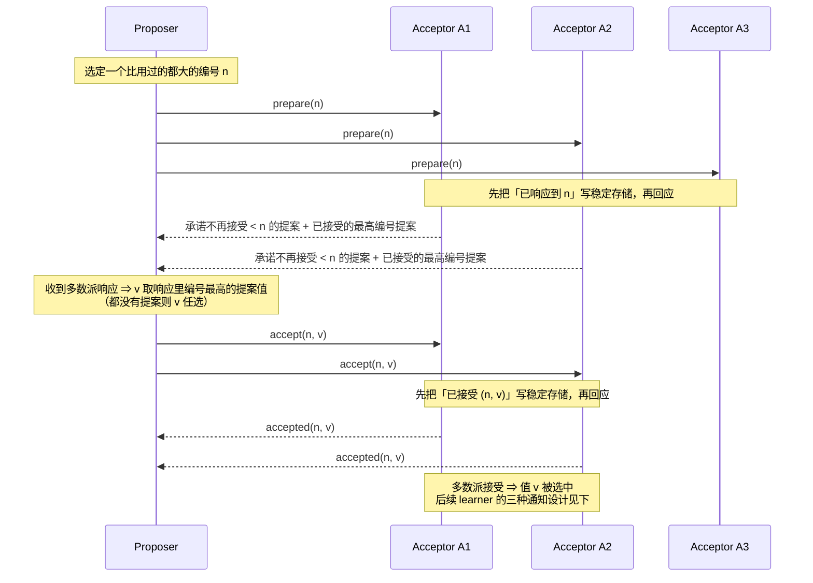

---
tags:
  - 分布式/共识算法
---

# Paxos

Paxos 的三份材料分工不同，合起来才完整：

| 材料 | 解决的问题 |
| --- | --- |
| *Paxos Made Simple*（Lamport, 2001） | 把算法**推导**出来 —— 从"只允许一个值被选中"这条要求一步步推出两阶段协议 |
| *Paxos Made Practical*（Mazières） | 文献**没写的那部分**：怎么就多个值达成一致、机器来去时"多数派"指谁的多数 |
| *Paxos Made Live*（Chandra, Griesemer, Redstone, 2007） | 把伪码变成生产系统时撞上的三类问题 |

先看 *Made Simple*。它开篇的一句话值得记住：**"Paxos 算法用平实的英语表述时非常简单"** —— 难的不是算法，是把上面那条安全性要求推出来的那条路。

## 问题与三种角色

要选的是一个**被选中的（chosen）值**，而不是随便"某个值"。安全性要求三条：

- 只有**被提出过**的值才可能被选中；
- 只会**有一个**值被选中；
- 进程不会**在被选中之前**就学到某个值被选中。

算法里有三类角色（agent），一个进程可以同时扮演多个：

- **proposer**：提出提案；
- **acceptor**：接受提案；
- **learner**：学习被选中的值。

模型是**异步、非拜占庭**的：agent 以任意速度运行，可能因为停止而失败、随后重启（这意味着**必须有一些信息被持久化**，否则失败重启后无解）；消息可以延迟任意长、可以重复、可以丢失，但**不会被篡改**。

## 从 P1 到 P2c：安全性是怎么推出来的

这一节是整个 Paxos 最值得读的部分 —— 它展示了协议不是设计出来的，是**逼出来的**。

### P1 与它为什么不够

最自然的想法是让**只有一个 acceptor**：proposer 把提案发给它，它选第一个收到的值。这个方案不行，因为那个 acceptor 一挂就没得玩了。

于是用**多数派（majority）**代替单点：**任意两个多数派至少有一个 acceptor 相交**，所以只要一个 acceptor 至多接受一个值，就不会出现两个不同的值各自被多数派接受。在没有故障与丢包的前提下，我们希望**即使只有一个 proposer 提出一个值也能被选中**，这给出了：

> **P1**：acceptor 必须接受它收到的**第一个**提案。

P1 立刻带来新问题：几个 proposer 几乎同时提出不同的值，于是**每个 acceptor 都接受了一个值，但没有任何一个值被多数派接受**。两个值各被约一半 acceptor 接受时，**再挂掉一个 acceptor 就永远无法判断哪个值被选中了**。

P1 加上"值要被多数派接受才算选中"推出一个必须让步的地方：**acceptor 必须被允许接受多个提案**。为了区分它们，给每个提案分配一个**（自然数）编号**，于是**提案 = 编号 + 值**，并且要求**不同提案的编号不同**。

### P2：把"只能选一个"变成对编号的约束

"值被选中"的定义是：**某个提案被多数派接受**。

允许接受多个提案之后，必须保证**所有被选中的提案值相同**。用**对提案编号的归纳**可以把它化归成：

> **P2**：若值为 $v$ 的提案被选中，则**每个编号更高的被选中的提案**的值也是 $v$。

由于编号是全序的，P2 就保证了"只会有一个值被选中"这条关键安全性。

### P2a → P2b：为什么从"被接受"提到"被提出"

要被选中，提案必须至少被一个 acceptor 接受过。于是可以先满足一个更弱的条件：

> **P2a**：若值为 $v$ 的提案被选中，则**任何 acceptor 接受的**每个编号更高的提案的值也是 $v$。

但 P2a 与 P1 合起来做不到。原因是**通信是异步的**：一个提案可能被选中，而某个 acceptor $c$ **从未收到过任何提案**。这时一个新 proposer 醒来，提出一个编号更高、值不同的提案 —— **P1 强制 $c$ 接受它，P2a 就被破坏了**。

所以必须把约束从"被接受"提到"被提出"：

> **P2b**：若值为 $v$ 的提案被选中，则**任何 proposer 提出的**每个编号更高的提案的值也是 $v$。

提案必须先被提出才能被接受，所以 **P2b ⟹ P2a ⟹ P2**。

### P2c 与那条归纳

现在来做 P2b 的证明 —— 而**协议就是从证明过程里读出来的**。

要证：假设编号 $m$、值 $v$ 的提案被选中，则任何编号 $n > m$ 的提案值也是 $v$。对 $n$ 做归纳，于是可以额外假设**编号在 $[m, n-1]$ 内的每个提案的值都是 $v$**。

$m$ 被选中意味着存在一个多数派 $C$，其中每个 acceptor 都接受了它。把归纳假设合起来：

> $C$ 中的每个 acceptor 都接受过编号在 $[m, n-1]$ 内的提案，而任何 acceptor 接受过的、编号在 $[m, n-1]$ 内的提案值都是 $v$。

任何多数派 $S$ **至少包含 $C$ 的一个成员**，所以只要保证下面这条不变量成立，编号 $n$ 的提案值就是 $v$：

> **P2c**：对任意 $v$ 与 $n$，若值为 $v$、编号为 $n$ 的提案被提出，则存在一个多数派 $S$，使**要么** (a) $S$ 中没有任何 acceptor 接受过编号小于 $n$ 的提案，**要么** (b) $v$ 是 $S$ 中各 acceptor 接受过的、**编号小于 $n$ 的提案中编号最高者的值**。

### 关键一步：不预测未来，而是索取承诺

要维持 P2c，提出编号 $n$ 的 proposer 必须知道"某个多数派里每个 acceptor **已经或将**接受的、编号小于 $n$ 的最高编号提案"。

**"已经接受"容易知道，"将接受"无法预测。** Paxos 的处理方式是这句话：

> **不预测未来，而是通过索取承诺来控制未来。**

具体做法：proposer 要求 acceptor **承诺不再接受任何编号小于 $n$ 的提案**。这就把"将来可能发生的接受"消掉了。于是有了 issuing proposal 的算法：

1. proposer 选定一个新编号 $n$，向某个 acceptor 集合的每个成员发请求，要求它回应：(a) **承诺不再接受任何编号小于 $n$ 的提案**；(b) **它已经接受过的、编号小于 $n$ 的最高编号提案**（如果有）。这个请求叫 **prepare 请求**。
2. 若 proposer 收到**多数派**的响应，它就可以发出编号 $n$、值为 $v$ 的提案，其中 **$v$ 是所有响应里编号最高的那个提案的值**；若响应里没有任何提案，则 $v$ 可以是 proposer 任选的值。

把这条推导链单独画出来，每一步的名称就是它挡住的那条路：

```
P1   acceptor 接受它收到的第一个提案
     拿不下：多个 proposer 并发 ⇒ 每个值都拿不到多数派
     ▼ 让一步：acceptor 可以接受多个提案 —— 提案 = 编号 + 值，编号唯一
P2   被选中的提案值相同（用「对编号的归纳」表达）
     落不了地：约束的是「被选中」这件事，不是任何可执行的动作
     ▼
P2a  acceptor 接受的、编号更高的提案值相同
     与 P1 冲突：从未收到过提案的 acceptor 会被 P1 逼着接受新值
     ▼ 把约束从「被接受」提到「被提出」
P2b  proposer 提出的、编号更高的提案值相同
     ▼ 对 n 归纳 ⇒ 必须知道「某个多数派已接受或将接受的最高编号提案」
P2c  「将接受」无法预测 ⇒ 改为索取承诺：acceptor 承诺不再接受编号小于 n 的提案
     ▼ 这个请求就是 prepare —— 两阶段协议是从证明过程里读出来的
```

## 完整的两阶段算法

把 proposer 与 acceptor 的动作合起来，算法两阶段：

**Phase 1**

- (a) proposer 选定编号 $n$，向**多数派** acceptor 发 `prepare(n)`；
- (b) acceptor 收到编号 $n$ **大于它已响应过的任何 prepare 编号**时，回应：**承诺不再接受任何编号小于 $n$ 的提案**，并附上**它已经接受过的最高编号提案**（如果有）。

**Phase 2**

- (a) proposer 收到**多数派**对 `prepare(n)` 的响应后，向那些 acceptor 发 `accept(n, v)`，其中 $v$ 是响应里编号最高的提案的值；若响应中没有提案，$v$ 可任选；
- (b) acceptor 收到 `accept(n)` 时，**除非它已经响应过编号大于 $n$ 的 prepare**，否则接受该提案。

acceptor 的两条规则可以合起来写成：

> **P1a**：acceptor 可以接受编号为 $n$ 的提案，当且仅当它**没有响应过编号大于 $n$ 的 prepare 请求**。

P1a 蕴含 P1。

**proposer 可以随时放弃一个提案**，正确性不受影响（该提案的请求或响应可能在很久之后才到达）。但有个不影响正确性的性能优化：若 acceptor 因为收到更高编号的 prepare 而忽略了某个请求，它应当告知 proposer，proposer 应当放弃该提案。

一次完整的往返（多数派取 2/3 示意）：



## Acceptor 要持久化的两样东西

上面的算法还有一个**优化**（也是落地的必要条件）：如果一个 acceptor 收到 `prepare(n)`，而它已经响应过编号更大的 prepare，那么它**没有理由**再响应 —— 反正它也不会接受编号 $n$ 的提案，直接忽略即可。**它也已经接受过的提案的 prepare 请求同样忽略。**

经过这一步，**acceptor 只需要记住两件事**：

1. **它接受过的最高编号的提案**；
2. **它响应过的最高编号的 prepare 请求的编号**。

**并且这两样必须持久化，崩溃重启后仍然有效** —— 因为 P2c 的不变量必须**与故障无关地**保持。这是 Paxos 实现里"稳定存储"这一层的由来：**acceptor 必须在实际发出响应之前，把打算做的响应记录到稳定存储**。

## 提案号的分配

**不同提案的编号必须不同**，否则算法会失效。*Made Simple* 给的做法是：**不同 proposer 从互不重叠的编号集合里取号**；每个 proposer 在稳定存储里**记住自己试过的最高编号**，并从比它更大的编号开始 phase 1。

*Paxos Made Practical* 补了一个实现层面的细节：**编号的低位比特放 proposer 的唯一标识**，这样两台机器永远不会撞号。

## Learner：三种设计，三种代价

learner 要知道某个值被选中，就必须知道某个提案被多数派接受。三种做法：

| 设计 | 消息数 | 代价 |
| --- | --- | --- |
| 每个 acceptor 接受后**通知所有 learner** | acceptor 数 × learner 数 | learner 最快知道，但消息量是乘积 |
| acceptor 只通知**一个 distinguished learner**，由它转告其他 learner | acceptor 数 **+** learner 数 | 多一轮延迟；且该 learner 故障就断了（**单点**） |
| acceptor 通知**一组** distinguished learner，各自再转告全体 | 介于两者之间 | 可靠性换通信量 |

还有一种情况要处理：**因为丢包，一个值可能被选中而没有任何 learner 知道**。learner 可以主动去问 acceptor 接受了什么，但**某个 acceptor 故障就无法判断是否曾有多数派接受过某个提案** —— 此时只能等下一个提案被选中才知道。若 learner 必须确定某个值是否被选中，可以让一个 proposer **发起一个新提案**（用上面的算法）。

## 活性：dueling proposers 与 leader

活性不是白给的。一个具体的恶性循环：两个 proposer 各自不断提出编号递增的提案，**没有一个能被选中**。

- proposer $p$ 完成编号 $n_1$ 的 phase 1；
- 另一个 proposer $q$ 完成编号 $n_2 > n_1$ 的 phase 1；
- $p$ 对 $n_1$ 的 phase 2 请求全被忽略 —— 因为 acceptor 都已承诺不接受编号小于 $n_2$ 的提案；
- 于是 $p$ 又完成编号 $n_3 > n_2$ 的 phase 1，把 $q$ 的 phase 2 也废掉；
- 如此循环。

**解法**：选一个**唯一的 distinguished proposer（leader）**，只有它尝试提提案。如果它能与多数派通信、且用的编号大于任何已用过的编号，就能成功。

这里直接引了 FLP（见 [[01-不可能性结果：FLP 与部分同步]]）：**一个可靠地选举 proposer 的算法必须使用随机性或真实时间**（例如超时）。但紧接着是一句关键的边界说明：

> **安全性不依赖于选举的成功与否。**

没有 leader 时，不会有新命令被提出；有多个 leader 时，它们可能在同一实例里各自提提案、导致谁也选不出值 —— **但安全性始终成立：两个不同的服务器永远不会对第 $i$ 条命令的值有分歧。** 选举单一 leader 只是为了**进展**。

## 状态机实现：Multi-Paxos

**把 Paxos 用起来的方式是跑一串实例。** 一个确定性状态机，若两个实例从相同初态出发、收到相同的请求序列，就会产生相同的响应序列。要复制它，只需让所有副本执行**相同的命令序列**：

> 用**一系列 Paxos 实例**，第 $i$ 个实例选出的值就是第 $i$ 条状态机命令。

每个服务器在每个实例里扮演**全部三种角色**。正常运行时选出一个 leader 扮演 distinguished proposer；客户端把命令发给 leader，由 leader 决定命令在序列中的位置 —— 若它判定某命令是第 135 条，就尝试让该命令成为第 135 个实例的值。

**效率的关键在于：Paxos 里"要提议的值"直到 phase 2 才确定。** phase 1 完成后，要么值已被确定，要么 proposer 可以自由选任何值。

### 空洞与 no-op

新 leader 上任时的实际流程（设新 leader 已经知道命令 1–134、138、139，**中间有洞**）：

1. 对 135–137 以及所有编号大于 139 的实例执行 phase 1；
2. 设执行结果是：135 与 140 的待提议值被确定，其余实例不受约束；
3. 对 135 与 140 执行 phase 2，选出命令 135 与 140；
4. **但 136、137 还没被选出，所以 138–140 都不能执行** —— 状态机必须按序执行；
5. **补洞**：leader 立即提议一个特殊的 **no-op 命令**作为 136 与 137，它不改变状态；
6. no-op 被选出后，138–140 就可以执行，至此 1–140 全部选出；
7. leader 也已对所有编号大于 140 的实例完成 phase 1，于是可以在 phase 2 里自由提议任何值 —— 下一个客户端命令就是 141，再下一个是 142。

**洞是怎么来的**：leader 可以**流水线**，即在还不知道第 141 条是否被选出时就提议第 142 条。如果它对 141 发出的 phase 2 消息全部丢失、而 142 已被选出，那么其他服务器还不知道 141 是什么 —— 一旦 leader 在这时失败，序列里就留下了洞。一般化地说：

> 若 leader 能超前 $\alpha$ 条命令（在第 $1 \dots i$ 条选出后就能提议第 $i+1 \dots i+\alpha$ 条），那么**最多可能出现 $\alpha - 1$ 条命令的空洞**。

空洞与补洞画在日志上：

```
leader 看到的日志：

   序号   1 … 134 │ 135   136   137 │ 138   139 │ 140   141 …
   状态   已选出   │ 待定   洞    洞  │ 已选出 已选出│ 待定

   状态机按序执行 ⇒ 136、137 是洞，138–140 全部卡住

补洞：对 135–137 与 140 之后的实例做 phase 1，对 135、140 做 phase 2（选出各自的值），
      再提出两个 no-op 填 136、137 —— no-op 不改变状态

   序号   1 … 134 │ 135   136    137   │ 138  139 │ 140
   状态   已选出   │ 已选出 no-op  no-op │ 可执行 可执行│ 已选出
                   └─────── 1–140 全部选出，状态机可以推进 ───────┘
```

**洞的来处**：leader 流水线提议时，若第 141 条的 phase 2 消息全丢而 142 已选出，它一失败就在序列里留下洞。超前 $\alpha$ 条 ⇒ 最多留 $\alpha - 1$ 个洞。

### 新 leader 的 phase 1 为什么便宜

新 leader 要对**无限多个**实例执行 phase 1，这看起来开销巨大，实际不然：

- 它可以对**所有实例使用同一个提案号**，因此只需发**一条相当短的消息**；
- 而在 phase 1 里，**acceptor 只有在已经收到过某个 proposer 的 phase 2 消息时**才会给出比"OK"更多的响应 —— 所以一条短消息就能覆盖全部实例。

### 成本下界与最优性

由此得到一条结论：**达成一条状态机命令共识的有效成本，就是 phase 2 的成本**（因为 leader 失败与换届应当是罕见事件）。而 *Made Simple* 引用 Keidar 与 Rajsbaum 的结果指出：

> **Paxos 的 phase 2 达到了"有故障时达成一致"这一问题上可能的最小成本** —— 因此 Paxos 在本质上是**最优**的。

### 成员变更：用状态机自己管

服务器集合可变时，需要一种机制确定"哪些服务器实现哪些实例"。最简做法是**通过状态机本身**：把**当前服务器集合作为状态的一部分**，用普通的状态机命令来改变它。

配合上面的流水线：允许 leader 超前 $\alpha$ 条命令，让**"执行第 $i+\alpha$ 个实例的服务器集合"由第 $i$ 条命令执行后的状态指定** —— 这允许实现**任意复杂**的重配置算法。

## 文献没写的那部分：Paxos Made Practical

Mazières 的这篇开篇有一句很准的评价：

> 一批声称"用 Paxos 做共识"的容错系统，其说法**相当于说"我们用 socket 做共识"** —— 它留了太多细节没规定。

它列出的两个核心缺口：

1. **系统必须就多个值达成一致**（不是单个值）；
2. **机器会来会去** —— 如果正在用 Paxos 就"复制这个服务的机器集合"达成一致，那么"多数派"是指**旧的**副本集合的多数、**新的**副本集合的多数，还是两者的多数？新集合是否已拥有旧集合的全部状态？变更时正在进行的操作怎么办？如果机器失败、没有任何新副本收到 decide 消息怎么办？

Viewstamped Replication 是唯一做过全面努力的工作，但有两个不足：一是用分布式事务来描述（带来应用并不都需要的大量复杂度），二是**假设可能的 cohort 集合固定不变**。

第二条的具体后果值得记住：**要求"全部可能 cohort 的多数"参与，而不是"活跃 cohort 的多数"**。举例 —— 一个组有 5 个 cohort，其中 2 个失败，组会重配置为 3 个 cohort 继续运行；但**若在这 2 个修好之前再失败 1 个，整个组就失败** —— 而这本来是不必要的，因为 **3 个活跃 cohort 的多数仍然在运行**。所以需要能**动态增删 cohort**（用于迁移维护、负载均衡）。

## 从伪码到生产系统：Paxos Made Live

Google 用 Paxos 重建 Chubby 的复制层（替换掉一个有复制 bug 史、复制机制**没有基于有证明的算法**的第三方数据库）。它最有价值的一点是把问题分了类：

| 类别 | 内容 |
| --- | --- |
| **文献里的算法缺口** | 文献没写、但生产必须决定的东西 |
| **软件工程挑战** | 几千行代码的正确性怎么建立 |
| **意外故障** | 算法之外的失败模式 |

三条可以直接当判据用的观察：

- **"Paxos 可以用一页伪码描述，但完整实现是几千行 C++。"** 膨胀不是因为用了 C++，也不是因为代码风格啰嗦 —— 把算法变成实用系统涉及大量已发表和未发表的功能与优化（本笔记上面那些"优化"就是例子）。
- **容错算法社区习惯用伪码与严格证明确立正确性，但这套做法在几千行代码的规模上不可用。** 要在真实系统上建立正确性信心，必须换方法。
- **容错算法容忍的是一组精心挑选的失败；真实世界暴露的失败模式宽得多** —— 算法本身的错误、实现 bug、运维误操作都算在内，必须从软件工程和运维流程两方面同时处理。

还有一条对"写笔记"也成立的观察：**真实系统很少被精确规定**，甚至可能在规范阶段就因为理解偏差而"失败" —— 所以**实现必须可塑（malleable）**。

## 判据速查

| 问题 | 答案 |
| --- | --- |
| 为什么需要编号 | 允许 acceptor 接受多个提案，同时区分它们 |
| 为什么编号必须唯一 | 否则 P2 的归纳前提不成立 |
| 为什么提案值在 phase 1 后才能定 | 否则可能覆盖已选中的值；而"晚定"正是 Multi-Paxos 效率的来源 |
| acceptor 崩溃重启后必须记得什么 | 接受过的最高编号提案 + 响应过的最高编号 prepare |
| 什么时候可以忽略 prepare | 已响应过更高编号的；或该提案已被它接受过 |
| 安全性靠什么保证 | 多数派交集 + acceptor 的承诺（**与 leader 选举无关**） |
| 活性靠什么保证 | 一个唯一的 leader，且能与多数派通信 —— **需要随机性或超时** |
| 序列出现空洞怎么办 | 提议 no-op 填洞；空洞最多 $\alpha - 1$ 条 |
| 换一套服务器怎么做 | 把服务器集合放进状态机状态，用普通命令改 |
| 单条命令的成本 | 只有 phase 2 一轮，且这是最优的 |

## 相关

- [[01-不可能性结果：FLP 与部分同步]] —— Paxos 的活性为什么只能"有条件"：它正是在部分同步模型（安全性无条件、终止性有条件）里工作
- [[01-CAP 定理]] —— 用 Paxos 做复制时那种"少数派侧不响应"的行为，正是 CAP 取舍的一个实例
- [[01-分布式事务]] —— Paxos Commit 用 Paxos 替换 2PC 的事务管理器，那篇里有它的代价与容错界

## 参考

- L. Lamport. *Paxos Made Simple*. ACM SIGACT News 32(4), 2001.
- T. Chandra, R. Griesemer, J. Redstone. *Paxos Made Live — An Engineering Perspective*. PODC 2007.
- D. Mazières. *Paxos Made Practical*. https://www.scs.stanford.edu/~dm/home/papers/paxos.pdf
- I. Keidar, S. Rajsbaum. *On the Cost of Fault-Tolerant Consensus When There Are No Faults — A Tutorial*. MIT-LCS-TR-821, 2001.
