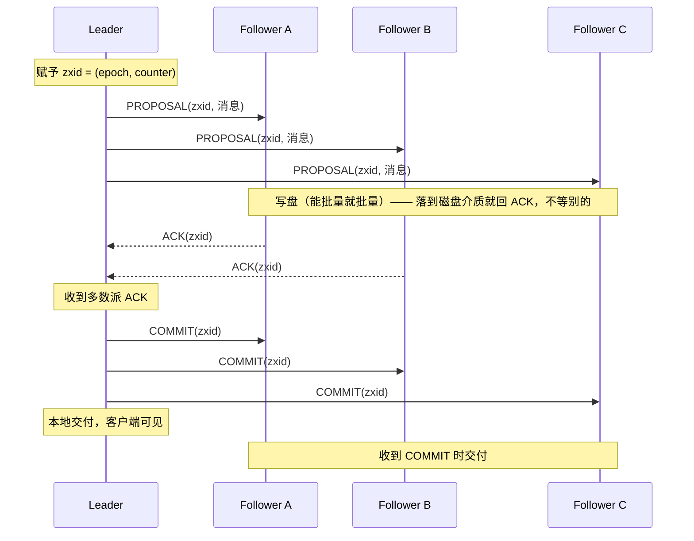
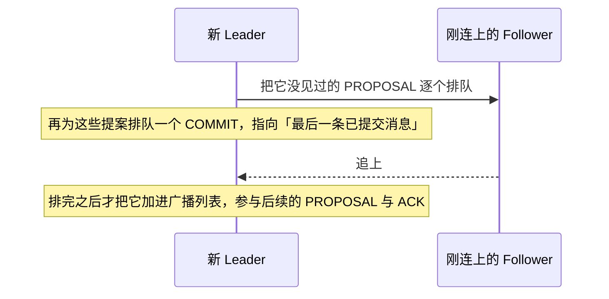

---
tags:
  - 分布式/共识算法
---

# Zab 与 ZooKeeper

这两份材料是同一个系统的两层：

- **ZooKeeper** 是 Yahoo! 的协调服务 —— 对外提供 znode 树、watch、会话，用来做配置管理、命名、组成员、锁这些协调任务；
- **Zab**（ZooKeeper Atomic Broadcast）是它内部的全序广播内核，负责让所有副本保持同一份状态。

关系可以一句话说清：**ZooKeeper 内嵌了一个全序广播协议就是 Zab** —— 全序广播既是维护副本一致性的手段，也是实现客户端保证的前提。

标题里的 "Wait-Free" 值得先澄清：它指的是**协调原语不阻塞**（不提供锁、不阻塞更新），而这套"不阻塞"是靠**放宽一致性定义**换来的，见下面 A-linearizability 那一节。

## ZooKeeper 的数据模型

术语先对齐（要区分三个词）：**client** 是服务的使用者，**server** 是提供服务的进程，**znode** 是内存中的数据节点，整体构成一棵**data tree**（层次命名空间，用 UNIX 路径记法，如 `/A/B/C`）。

znode 有两种：

- **Regular**：由客户端**显式**创建与删除；
- **Ephemeral**：客户端创建后，要么显式删除，**要么在创建它的会话终止时（主动断开或故障）由系统自动删掉**。

创建时还可以加 **sequential 标志**：名字后面附加一个**单调递增计数器**的值。这条性质需要一个精确表述 —— 若 $n$ 是新 znode、$p$ 是其父 znode，则 **$n$ 的序号永远不小于 $p$ 下曾经创建过的任何其他 sequential znode 的序号**。这条性质是"队列"类原语的基础。

数据模型本身**比文件系统简化得多**：只有一个 key/value 式的接口，**只支持整块数据读写**，没有部分读、部分写。

## 会话与 watch：不阻塞客户端缓存

客户端连上 ZooKeeper 就建立一个**会话（session）**，拿到一个 **session handle** 用来发请求。ephemeral znode 的生命周期绑在这个会话上。

**watch 机制**的设计动机可以直接对照 Chubby：

| | Chubby | ZooKeeper |
| --- | --- | --- |
| 客户端缓存怎么管 | **服务端直接管** | 客户端自己管 |
| 数据变更时 | **阻塞更新**，逐个去失效所有缓存了该数据的客户端 | 只**通知**，不阻塞 |
| 慢/故障客户端的影响 | 会**延迟更新**；用 **lease** 兜底 | **完全避免这个问题** |
| 兜底手段的局限 | lease 只能**限制**慢/故障客户端的影响范围 | 不需要兜底 |

于是 ZooKeeper 的 watch 有三个必须记住的性质：

1. **一次性触发器**：watch 触发一次就注销，或随会话关闭而失效；
2. **只报"变了"，不报"变成什么"** —— 例子：客户端在 `/foo` 被改**两次之前**发 `getData("/foo", true)`，只会收到**一个** watch 事件；
3. **会话事件（如连接丢失）也送进 watch 回调** —— 目的是让客户端知道 watch 事件**可能被延迟**。

## 两条顺序保证，以及 A-linearizability

ZooKeeper 只给**两条**基本顺序保证：

> **线性一致的写（Linearizable writes）**：所有更新 ZooKeeper 状态的请求都是可串行化的，并且**尊重先后关系（precedence）**。
>
> **FIFO 客户端顺序（FIFO client order）**：来自**同一个客户端**的所有请求，按客户端发出的顺序执行。

紧接着有一个必要的澄清：**他们的线性一致性定义与 Herlihy 原来的不一样，他们称之为 A-linearizability（异步线性一致性）**。

区别只在客户端一侧：

| | Herlihy 原始定义 | ZooKeeper 的 A-linearizability |
| --- | --- | --- |
| 一个客户端的未完成操作数 | **只能有一个**（客户端是单线程） | **允许多个** |
| 那未完成操作之间要不要保证顺序 | 不需要（本来只有一个） | **选择保证 FIFO 顺序** |

一条推论：**所有对线性一致对象成立的结果，对 A-linearizable 对象也成立** —— 因为满足 A-linearizability 的系统自然也满足线性一致性。（反过来不成立。）

**读为什么能本地处理**：因为**只有更新请求是 A-linearizable 的**。读请求不需要过 Zab 全序，因此**每个副本可以在本地处理读** —— 这正是"加服务器就能线性扩展读吞吐"的来源，也是 ZooKeeper 适合读:写 > 2:1 负载的原因。

### 一个把两条保证用起来的例子

这个场景很实用，值得完整记下来。系统选出 leader 指挥一批 worker。新 leader 上任要改一大批配置参数，改完通知其他进程。两个要求：

- 新 leader 开始改时，**其他进程不能开始使用正在被改的配置**；
- 若新 leader 在配置全部改完前挂掉，**其他进程不能用上这份半成品配置**。

**分布式锁（比如 Chubby 那种）能解决第一个要求，但对第二个不够** —— 锁只能保证互斥，保证不了"要么看到全部新配置、要么看到全部旧配置"。

ZooKeeper 的做法：新 leader 约定一个路径作为 **ready znode**，其他进程**只在它存在时才使用配置**。于是新 leader 的顺序是：

1. **删除 `ready`**；（此时其他进程停止使用配置）
2. 更新各个配置 znode；
3. **创建 `ready`**。

这三步**可以全部流水线化、异步发出**，从而快速完成配置切换。这里用到的正是 **FIFO 客户端顺序** —— 三个请求由同一客户端发出，保证按序执行；如果允许异步但顺序不定，这个 recipe 就不成立。

## 版本号做条件更新

znode 的写操作可以带上**期望的版本号**：

- 版本号与 znode 当前版本**不匹配** → 更新失败，返回 unexpected version 错误；
- 版本号是 **$-1$** → **不做版本检查**。

这是 ZooKeeper 实现 CAS 类原语的机制 —— 把"只有在我看到的状态上才更新"这件事交给服务端判定。

## Zab：ZooKeeper 的全序广播内核

### 三条保证与两类因果

Zab 要维持三件事，才能保证副本正确：

1. **可靠性与全序** → 所有副本状态一致；
2. **因果序** → 副本状态从**应用视角**看是正确的；
3. leader 基于收到的请求提出更新。

第 2 条里的"因果"包含**两个维度**，第二个维度容易被忽略：

- **同一台服务器发出的两条消息 a、b，若 a 先被提出，则 a 因果先于 b**（这个和通常的 FIFO 要求一样）；
- **Zab 假设任一时刻只有一个 leader 能提交提案。若发生 leader 变更，则此前所有被提出的消息都因果先于新 leader 提出的消息。**

### 一个违反因果序的具体场景

一条完整的操作序列说明了第二个维度的必要性：

1. 客户端 $C_1$ 请求把 znode `/a` 设为 1 → 消息 $w_1 = (\text{"/a"}, \text{"1"}, 1)$（三元组是 路径、值、结果版本）；
2. $C_1$ 再请求设为 2 → $w_2 = (\text{"/a"}, \text{"2"}, 2)$；
3. leader $L_1$ 提出并交付了 $w_1$，但**只来得及把 $w_2$ 发给自己就失败了**；
4. 新 leader $L_2$ 接管；
5. 客户端 $C_2$ 请求**在 `/a` 为版本 1 的条件下**把它设为 3 → $w_3 = (\text{"/a"}, \text{"3"}, 2)$；
6. $L_2$ 提出并交付了 $w_3$。

此时客户端对 $w_1$ 收到了成功、对 $w_2$ 收到了错误（因为 leader 失败）。**若 $L_1$ 后来恢复、重新当上 leader 并试图交付 $w_2$，客户端请求的因果序就被破坏，副本状态将不再正确** —— 因为 $C_2$ 已经在 $w_2$ 未生效的前提下把值改成 3 了。

把上面那六步铺成时间线（$\to$ 是"提出并交付"的方向）：

```
C₁ ──▶ L₁ : w₁ = (/a, "1", 版本 1)          已交付 —— C₁ 收到成功
C₁ ──▶ L₁ : w₂ = (/a, "2", 版本 2)          L₁ 只把它发给了自己就失败
                              │
                    换届（epoch 加一）      C₁ 对 w₂ 收到错误
                              ▼
C₂ ──▶ L₂ : w₃ = (/a, "3", 版本 2)          以「版本 1」为条件 ⇒ 已交付，版本变成 2
                              │
        L₁ 恢复、重新当选，想补交付 w₂ ──────┘
                              ▼
        若 w₂ 真的被交付，C₂ 那次条件更新（基于「版本 1」）就失去前提，
        副本状态不再正确 ⇒ 新 leader 提出的消息必须因果后于旧 leader 已提出的消息
```

### 广播：zxid、写盘、ACK、COMMIT

broadcast 阶段本身很简单，**关键设计是用 FIFO（TCP）通道做所有通信** —— 理由是：**用 FIFO 通道，保持顺序保证就变得非常容易**，消息按通道顺序投递，只要按接收顺序处理即可。

流程：

1. leader 在提出消息前赋予一个**单调递增的唯一 id，叫 zxid**。因为 Zab 保持因果序，**已交付的消息也按 zxid 排序**；
2. leader 把带消息的提案放进**每个 follower 的发送队列**，经 FIFO 通道发出；
3. follower 收到提案 → **写盘**（能批量就批量）→ 提案**一落到磁盘介质就回 ACK**（不等其他任何事）；
4. leader 收到**多数派 ACK** → 广播 **COMMIT**，并在本地交付；follower 收到 COMMIT 时交付。

还有一个被否掉的设计：**可以不发 COMMIT，改让 follower 互相广播 ACK**。但他们拒绝了，理由有三条 —— 增加网络流量、要求**完全连通图而非星形拓扑**（星形在建立 TCP 连接上更好管理）、客户端要维护这个图并跟踪 ACK（被认为是不必要的复杂化）。

一次广播的完整往返（多数派取 2/3 示意）：



通道全部走 FIFO（TCP）——所以"按接收顺序处理"就足以保持顺序保证。

### zxid 的结构：epoch + counter

这一节是 Zab 与 Paxos 家族最不一样的地方：

> **zxid 是 64 位数。低 32 位是简单计数器**（每个提案 +1），**高 32 位是 epoch**。

leader 换届时：取自己日志里**最高 zxid 的 epoch**，**把它加一**，然后用"epoch 位为新值、计数器为 0"的 zxid 开始。

**用 epoch 标记领导权变更，并要求多数派服务器承认某服务器在该 epoch 上是 leader**，这样就**避免了多个 leader 用同一个 zxid 发出不同提案**。

这个设计带来一个直接好处：**leader 失败时可以跳过（skip）实例**，从而**加速并简化恢复流程**。原因也很直白：一台曾宕机的服务器若带着**来自此前 epoch、从未被交付的提案**重启，**它不可能成为新 leader**（新 leader 的 epoch 必须更高），所以那些陈旧提案自然作废。

zxid 是 64 位，两段各有分工：

```
 63                    32 31                     0
┌────────────────────────┬────────────────────────┐
│        epoch           │        counter         │
│   高 32 位：领导权代次   │  低 32 位：该代次内计数  │
└────────────────────────┴────────────────────────┘

换届时：取自己日志里最高 zxid 的 epoch → 加一 → 计数器归零
        zxid = (旧 epoch + 1, 0)

带来两个结果：
  · 同一 epoch 上只有一个 leader 被多数派承认 ⇒ 两个 leader 不可能用同一个 zxid 发不同提案
  · 带着「旧 epoch、从未交付」的提案重启的服务器不可能当选（新 leader 的 epoch 更高）
    ⇒ 那些陈旧提案自然作废，恢复可以「跳过」
```

### 恢复：两条必须的保证

单纯广播处理不了 leader 失败，所以 Zab 需要恢复模式来选新 leader 并把所有服务器带到正确状态。选举必须**以高概率成功**（这是活性的来源）：选举要让 leader 知道自己当选，**还要让多数派同意这一决定**；若选举阶段出错，服务器不会推进，最终超时并重新选举。实现里有两种选举算法，最快的一种在有多数派正确服务器时**几百毫秒**完成。

恢复过程中有**两条必须同时成立的保证**，它们方向相反：

- **绝不能忘记已交付的消息**：一条消息在一台机器上交付过，即使那台机器失败，它**也必须在所有机器上交付**。这个情况很容易发生 —— leader 提交了消息、然后在 COMMIT 到达任何其他服务器之前失败（下面的情形一）。因为 leader 已经提交，**客户端可能已经看到了该事务的结果**，所以必须最终交付给所有其他服务器，客户端才能看到一致的视图。
- **被跳过的必须保持被跳过**：leader 生成了一个提案但没提交就失败（下面的情形二：提案 3 没有任何其他服务器见过它）。它重启后重新加入时必须**丢弃这个提案** —— 否则如果它在消息 100000001、100000002 已交付之后再提交 3，就**违反了顺序保证**。

**解法**：让**leader 选举协议保证新 leader 拥有多数派服务器中最高的提案号**，于是新当选的 leader 也就拥有全部已提交消息。在提出任何新消息之前，新 leader 先确保**它事务日志里的所有消息都已被提出并被多数派 follower 提交**。

一点优化：**"要求新 leader 是拥有最高 zxid 的那个进程"是一条优化** —— 有这条，新 leader 就不必先向一组 follower 问出谁的 zxid 最高、再去取缺失事务。

follower 追上的机制也在同一节：leader 对刚连上的 follower，把它**没见过的 PROPOSAL 逐个排队**，然后为这些提案排队一个到"最后已提交消息"的 COMMIT；**排完之后**才把该 follower 加进广播列表参与后续的 PROPOSAL 与 ACK。

恢复的两条保证各对应一个失效场景，方向正好相反。

**情形一：已交付的不能忘。** leader 已提交、但 COMMIT 还没到达任何其他服务器时失败：

```
   leader      ┌── 交付 w₅（客户端已看到结果）──┐
   follower A  │ 已写盘，未收到 COMMIT          │
   follower B  │ 已写盘，未收到 COMMIT          │
   follower C  │ 没收到 PROPOSAL                │
                    │
               leader 崩溃 ──▶ 新 leader 上台
                    ▼
   要求：w₅ 必须在所有机器上最终交付 —— 否则客户端看到的视图不一致
```

**情形二：被跳过的必须保持被跳过。** leader 生成了一个提案、没提交就失败，且没有其他服务器见过它：

```
   leader      提案 3 只写进了自己的日志，未提交
   follower A  当前已交付到 zxid 100000002
                    │
               leader 崩溃、随后重启 ──▶ 若它把提案 3 补交付
                    ▼
   会把「3」排在 100000001、100000002 之后 ⇒ 违反顺序保证
   要求：该提案必须被丢弃
```

两条靠同一个机制同时成立：**选举协议保证新 leader 拥有多数派中最高提案号**，于是它在提出任何新消息前，先确保自己日志里的全部消息都已被提出并被多数派 follower 提交。

新 leader 把 follower 带进广播列表的过程：



## 故障模型与工程取舍

- **故障模型**：crash-fail + **有状态恢复（stateful recovery）**。不假设时钟同步，但假设各服务器感知时间以大致相同速率流逝（用超时检测故障）。
- **恢复后的状态可能是部分有效的**：可能缺少较近的事务；更麻烦的是**可能持有从未交付过的事务，而现在必须跳过**。
- 要处理**相关可恢复故障**（例如断电），因此要求**消息在被交付前记录到多数派磁盘上**。
- **明确不做拜占庭容错**，但**用摘要检测数据损坏**，并在协议包里加额外元数据做完整性检查；**检测到损坏或检查失败就中止服务器进程**。理由很实在：操作系统与协议各自的独立实现问题让**完整的拜占庭容错系统在实践中不可行**，而且"真正做到可靠的独立实现需要的不只是编程资源"。还有一句观察：**迄今为止多数生产问题要么是影响所有副本的实现 bug，要么是 Zab 实现范围之外但会波及 Zab 的问题（如网络配置错误）**。
- **存储布局**：ZooKeeper 用**内存数据库**，事务日志与周期性快照落盘；**Zab 的事务日志兼作数据库的预写日志（WAL）**，所以一个事务只写一次盘。瓶颈因此是**写盘 I/O**。
- **批量写**：为缓解写盘瓶颈，把事务**批量写**。批量发生在**副本层而不是协议层**，所以实现更接近数据库的 **group commit** 而非 message packing；**选择不用 message packing 是为了最小化延迟**。
- **幂等与"至多一次"的放宽**：因为恢复时会读快照并**重放**此后的已交付事务，**原子广播不需要保证"至多一次"投递**。事务是**幂等**的，所以**重复投递没问题，只要重启后保持顺序**。这被称为对全序要求的一个**放宽**：具体说，若 $a$ 在 $b$ 之前交付，某次故障后 $a$ 被重新交付，则 **$b$ 也会在 $a$ 之后被重新交付**。
- **规模**：ZooKeeper 服务通常由 **3 到 7 台**机器组成；可容忍 $f$ 个崩溃故障，需要**至少 $2f + 1$ 台**服务器。

## 判据速查

| 问题 | 答案 |
| --- | --- |
| ZooKeeper 给几条顺序保证 | **两条**：线性一致的写 + FIFO 客户端顺序 |
| 读请求走全序广播吗 | **不走** —— 只有更新是 A-linearizable，读在每个副本本地处理 |
| A-linearizability 与 Herlihy 的定义差在哪 | Herlihy 假设客户端一次一个未完成操作；ZooKeeper 允许**多个**，并选择保证它们的 FIFO 顺序 |
| watch 会触发几次 | 一次（一次性触发器），触发即注销 |
| watch 通知里有什么 | 只有"变了"，**没有变化内容** |
| ephemeral znode 什么时候消失 | 显式删除，或**创建它的会话终止时** |
| sequential 标志保证什么 | 新 znode 的序号**不小于父节点下曾创建过的任何 sequential znode 的序号** |
| 怎么做条件更新 | 写操作带期望版本号；不匹配则失败；**$-1$ 表示不检查** |
| zxid 的结构 | 64 位 = **高 32 位 epoch + 低 32 位计数器** |
| 换届时 zxid 怎么变 | 取日志里最高 zxid 的 epoch，**加一**，计数器归零 |
| epoch 解决什么问题 | 避免**多个 leader 用同一 zxid 发出不同提案**；并让陈旧的未交付提案自动作废（可跳过） |
| 恢复有哪两条相反的保证 | **已交付的不能忘** + **被跳过的必须保持跳过** |
| 为什么用 FIFO 通道 | 让顺序保证变得容易：按接收顺序处理即可 |
| 为什么 leader 要负责发 COMMIT | 避免完全连通图与客户端跟踪 ACK 的复杂度 |
| 需要"至多一次"投递吗 | **不需要** —— 事务幂等，恢复时重放，只要保持相对顺序 |
| 单事务写几次盘 | **一次** —— Zab 的事务日志兼作数据库 WAL |
| 批量写在协议层还是副本层 | **副本层**（更接近数据库的 group commit） |

## 相关

- [[02-Paxos|Paxos]] —— 同为全序广播内核；Zab 的 zxid（epoch + counter）与 Paxos 的提案号是两种不同的"给提案编号"思路
- [[03-Raft|Raft]] —— 同期另一套 leader 制共识协议；任期号与 epoch 解决同一类问题
- [[01-不可能性结果：FLP 与部分同步]] —— Zab 的 crash-fail + 有状态恢复模型，与 FLP 的崩溃故障模型是同一层设定

## 参考

- Patrick Hunt, Mahadev Konar, Flavio P. Junqueira, Benjamin Reed. *ZooKeeper: Wait-free Coordination for Internet-Scale Systems*. USENIX Annual Technical Conference (ATC) 2010.
- Benjamin Reed, Flavio P. Junqueira. *A Simple Totally Ordered Broadcast Protocol*. LADIS 2008, pp. 1–6.
