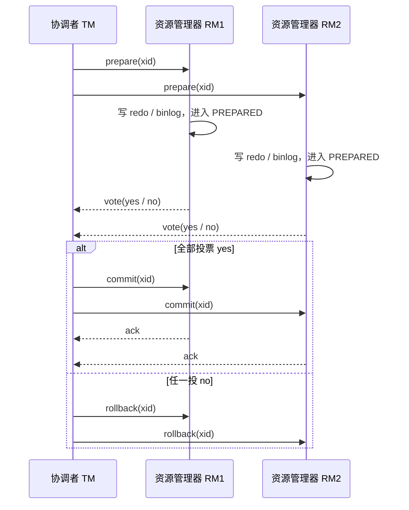
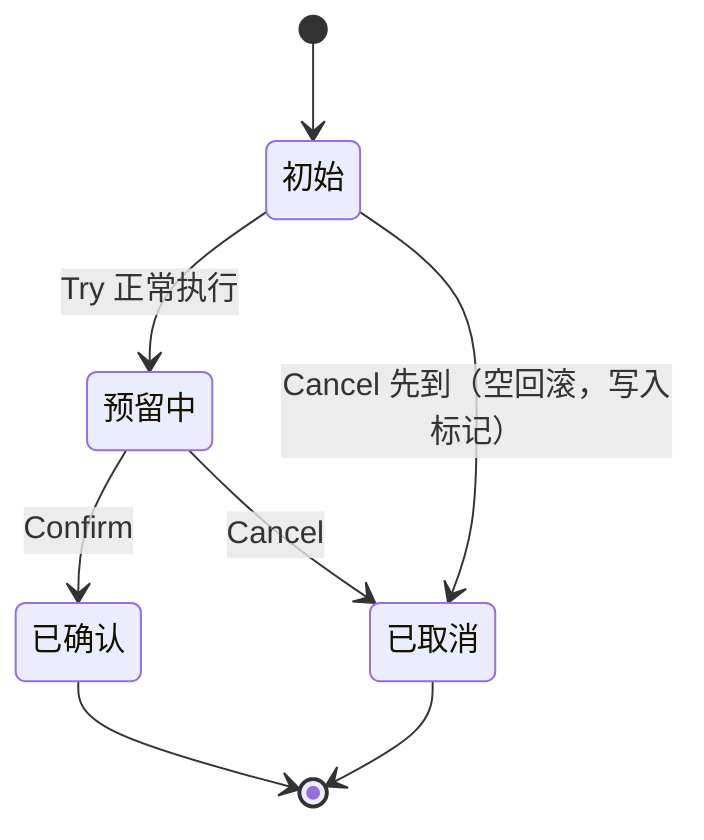
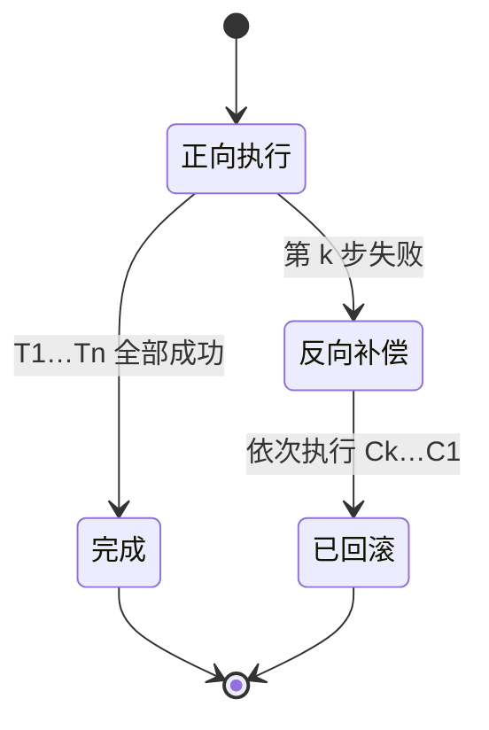
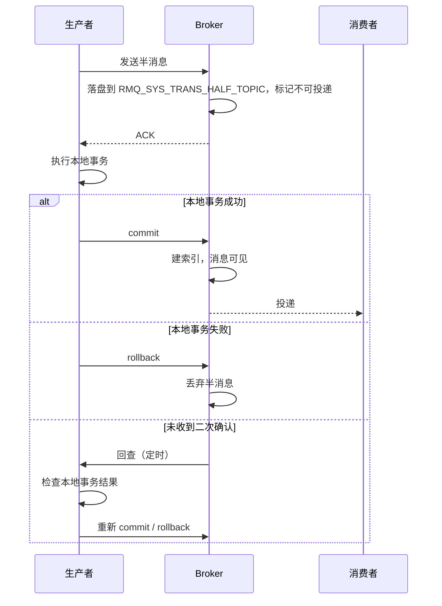

---
tags:
  - 分布式
  - 分布式/事务
---

# 分布式事务

## XA 模型

### 概述

XA 模型是一种基于两阶段提交（2PC, Two-Phase Commit）的分布式事务协议。它由 X/Open 组织定义，旨在确保分布式系统中的多个资源管理器（如数据库、消息队列等）在事务提交时能够保持一致性。

### 两阶段提交（2PC）

1. **准备阶段（Prepare Phase）**：

    - 事务协调者（Transaction Coordinator）向所有参与者（Participants）发送准备请求，询问它们是否可以提交事务。

    - 参与者执行事务操作，但不提交，而是将事务状态记录在日志中，并向协调者返回“准备就绪”或“无法准备”的响应。

2. **提交阶段（Commit Phase）**：

    - 如果所有参与者都返回“准备就绪”，协调者向所有参与者发送提交请求，参与者完成事务提交。

    - 如果有任何一个参与者返回“无法准备”，协调者向所有参与者发送回滚请求，参与者回滚事务。

两阶段的文字描述到这里，落到报文上还有一层需要说清：协调者与参与者之间到底怎么往返。以两个资源管理器 RM1、RM2 为例，TM 把各分支执行到「可提交」后发出 prepare，收齐响应再发 commit 或 rollback。



TM 在「已发出 prepare、尚未收齐响应」这个窗口崩溃，是 2PC 最麻烦的落点。各 RM 的处境由它自己这侧的状态决定：

- **prepare 已到达、RM 已进入 PREPARED**：分支的锁仍然被持有，redo 与 binlog 已落盘，事务要等到有人显式 commit 或 rollback 才结束。这类 in-doubt 事务会挂在服务器上，`XA RECOVER` 能列出来（来源：MySQL 8.0 Reference Manual 15.3.8.1）。
- **prepare 尚未到达**：RM 不知道有这回事，按自己的超时回滚。TM 恢复后若把该 RM 当成「已投 no」，判断是对的；若当成「已投 yes」就错了。
- **TM 恢复后**：单看某一个 RM 无法裁定这个全局事务该提交还是回滚 —— RM 只知道「我准备好了」，不知道别人是否准备好，选择权在 TM，它必须依据自己的持久化日志来定。

### 优点

- **强一致性**：确保所有参与者要么全部提交，要么全部回滚，保证事务的强一致性。

- **标准化**：XA 协议是标准化的，许多数据库和消息队列都支持 XA 协议。

### 缺点

- **性能问题**：两阶段提交过程中，所有参与者都需要锁定资源，直到事务提交或回滚，可能导致性能瓶颈。

- **单点故障**：事务协调者是单点故障点，如果协调者失败，整个事务可能无法继续。

## TCC 模型

### 概述

TCC（Try-Confirm-Cancel）模型是一种基于补偿机制的分布式事务处理模型。它将事务分为三个阶段：Try、Confirm 和 Cancel。

### 三个阶段

1. **Try 阶段**：

    - 尝试执行事务操作，但不提交，而是预留资源或执行部分操作。

    - 如果所有参与者都成功完成 Try 阶段，则进入 Confirm 阶段；如果有任何一个参与者失败，则进入 Cancel 阶段。

2. **Confirm 阶段**：

    - 确认事务操作，提交所有预留的资源或完成所有部分操作。

    - 如果 Confirm 阶段成功，则事务完成；如果失败，则需要回滚。

3. **Cancel 阶段**：

    - 取消事务操作，释放所有预留的资源或撤销所有部分操作。

    - 确保事务回滚到初始状态。

### 优点

- **性能优化**：TCC 模型在 Try 阶段不锁定资源，减少了资源锁定时间，提高了性能。

- **补偿逻辑可自定义**：TCC 模型允许在 Confirm 和 Cancel 阶段编写自定义补偿操作，适用于复杂的业务场景。

### 缺点

- **复杂性**：TCC 模型的实现较为复杂，需要开发者编写 Try、Confirm 和 Cancel 阶段的逻辑。

- **一致性问题**：TCC 模型不能保证强一致性，可能会出现部分提交或部分回滚的情况。

## Saga 模型

### 概述

Saga 模型是一种基于事件驱动的分布式事务处理模型。它将一个长事务分解为多个短事务，每个短事务都有对应的补偿操作。

### 执行流程

1. **正向操作**：

    - 按顺序执行一系列短事务操作，每个操作都有对应的补偿操作。

    - 如果所有操作都成功，则事务完成。

2. **补偿操作**：

    - 如果某个操作失败，则按相反顺序执行补偿操作，撤销之前已完成的操作。

    - 确保事务回滚到初始状态。

### 优点

- **高可用性**：Saga 模型通过事件驱动的方式，减少了资源锁定时间，提高了系统的可用性。

- **补偿逻辑可自定义**：Saga 模型允许在每个短事务中定义补偿操作，适用于复杂的业务场景。

### 缺点

- **最终一致性**：Saga 模型不能保证强一致性，只能保证最终一致性。

- **复杂性**：Saga 模型的实现较为复杂，需要开发者编写每个短事务及其补偿操作的逻辑。

## 三种模型的适用场景

- **XA 模型**：适用于需要强一致性的场景，但性能和可用性较差。

- **TCC 模型**：适用于性能要求较高且业务逻辑复杂的场景，但实现复杂。

- **Saga 模型**：适用于高可用性和最终一致性的场景，但实现复杂且不能保证强一致性。

把三种模型按「一致性强度 / 失败时的行为 / 隔离性 / 业务侵入 / 补偿来源」并排看，取舍的落点更清楚：

| 模型 | 一致性强度 | 失败时的行为 | 隔离性 | 业务侵入 | 回滚由谁执行 |
| --- | --- | --- | --- | --- | --- |
| XA / 2PC | 提交点前原子，强一致 | 协调者崩溃时 prepared 分支阻塞 | 由 RM 的事务隔离提供 | 低（走数据库 XA 接口） | 数据库本地回滚 |
| TCC | Confirm 后生效，最终一致 | 靠 Cancel 释放预留 | 无全局隔离，需业务自保 | 高（Try / Confirm / Cancel 三套逻辑） | 业务写出的 Cancel |
| Saga | 最终一致 | 靠反向补偿 | 无隔离，中间态可见 | 高（每步一个补偿） | 业务写出的补偿 |

三者的分界线在「谁来承担回滚」：XA 把回滚交给数据库的本地回滚，TCC 与 Saga 把回滚交给业务代码写出来的补偿。XA 一致性最强也最重，TCC / Saga 更轻但把复杂度推给了业务；这也解释了为什么后两者一定要处理空回滚、悬挂与幂等。

## 安全性与活性：2PC 的问题出在哪

前面三节把 XA / TCC / Saga 并列讲了，但要判断一个协议的好坏需要一把尺子。分布式算法有两条性质：

- **安全性（safety）**：坏事不会发生；
- **活性（liveness）**：好事最终会发生。

**2PC 是安全的**（不会把坏数据写进数据库），**但它的活性不好**：TM 在错误的时点失败，整个事务就**阻塞**。这是 2PC 最被人诟病的地方，也是后面三节要解决的对象。

## 2PC 的出处与「必然要三段」这个结论

- 2PC 由 Jim Gray 在 *Notes on Database Operating Systems*（1979）里描述。
- **Skeen 在 *NonBlocking Commit Protocols*（1981）里证明**：分布式事务要避免 2PC 的阻塞问题，**需要三段提交（3PC）**。必要性得到了证明，但一个可用的 3PC 算法迟迟没有出现 —— 用该文的说法，这件事「花了将近 25 年」。

这条结论把问题定了性：**阻塞的根源在两阶段的形态本身，不在 2PC 实现得好不好。**

## 事务提交不是拜占庭问题

1986 年，做共识的人和做事务的人开了一次会。当时共识侧最好的算法是拜占庭将军方案，但它对事务来说太贵。Jim Gray 把会议整理成 *A Comparison of the Byzantine Agreement Problem and the Transaction Commit Problem*（1987），引言里写道：

> Prior to the conference, it was widely believed that the transaction commit problem faced by distributed systems is a degenerate form of the Byzantine Generals Problem studied by academe. Perhaps the most useful consequence of the conference was to show that these two problems have little in common.

也就是说：**在会议之前大家以为事务提交是拜占庭问题的退化情形，会后发现两者几乎没有共同点。**

而事务提交真正对应的共识变种是 **uniform consensus（一致共识）**：**所有进程都必须就取值达成一致，包括故障的那些**。理由很直接 —— 事务只有在所有 RM 都 prepared 的前提下才允许提交。这与「只要非故障进程达成一致」的普通共识不同，**uniform consensus 比普通共识更难**（见 *Uniform consensus is harder than consensus*，2000）。

## Paxos 的安全性来自一个简单的交集论证

Paxos 的多数派要求（majority quorum）常被当成一条规则背下来，它背后的推理只有一句话：**给定固定的进程数，任意两个多数派必然至少有一个共同进程。**

以三个进程 A、B、C 为例，可能的多数派只有 AB、AC、BC 三种。假设在 AB 在场时做出了一个决定，那么将来任意一个多数派在场时，至少有一个进程记得上次的决定：

| 将来在场的多数派 | 谁记得上次的决定 |
| --- | --- |
| AB | A 与 B 都记得 |
| AC | A 记得 |
| BC | B 记得 |

**于是旧的决定不可能被后来的多数派推翻。** 这就是 Paxos 安全性的来源，也是它不需要依赖时钟的原因。

Paxos 能容忍的故障形态（按该文的列举）：消息丢失、延迟、重复、乱序。达成共识的条件是：**存在单个 leader 持续足够久，使它能与多数派通信两次**。容错范围还包括：

- 任何进程（**包括 leader**）都可以失败并重启；
- **所有进程同时失败过，算法仍然是安全的**；
- 可以同时存在**多个 leader**（安全性不受影响，只影响活性）。

**活性是有条件的**：Paxos 是异步算法，**没有显式超时**，它只在系统表现得同步（消息在有界时间内送达）时才达成共识；否则保持安全但不做决定。存在符合 FLP 结论的病理性场景，但那类场景在实践中容易避开。

## Paxos Commit：用 Paxos 让 2PC 的 TM 容错

Lamport 与 Gray 在 *Consensus on Transaction Commit*（2005）里把 Paxos 用到事务提交上。做法是：

1. **用 Paxos 复制 2PC 的 TM**（TM 不再是单点）；
2. **为每一个参与事务的 RM 起一个 Paxos 实例**，用来就「该 RM 能否提交」达成一致。

「每个 RM 一个 Paxos 实例」看起来开销很大，但该文给的计算是：**在无故障情形下 Paxos Commit 两个阶段就完成，消息延迟与 2PC 相同**（只是消息条数更多）。**只有在出现故障时才需要第三阶段** —— 这与上面 Skeen 的结论一致。

容错界是：**给定 $2n+1$ 个 TM 副本，可以容忍 $n$ 个副本故障。**

有一处容易误解的地方值得单独指出：**Paxos Commit 并没有用 Paxos 去直接解 uniform consensus**，它是用 Paxos 让系统容错。

## 那它到底还阻不阻塞：一场带数字的具体争论

这是这一篇材料里最有价值的部分 —— 博客评论区里博主与读者就 Paxos Commit 是否仍然阻塞展开了来回，双方都承认了一部分。

- **博主的断言**：「因为 2PC 会阻塞所以分布式事务不该用」是个**空洞的论点**，Paxos Commit 已经处理了阻塞问题。
- **读者的反驳**：Paxos Commit **仍然是阻塞协议**。若一个 RM 投了 prepare，而网络故障、或 leader 长时间无法与多数派通信两次，这个 RM 会处于阻塞状态。
- **博主承认的两种阻塞条件**：① 可用 acceptor 不足多数派；② 有两个活跃 leader 试图选出不同结果。他同时指出第二种不太可能，因为 **Paxos Commit 里任何新 leader 都会试图让 Abort 胜出**。
- **读者补的第三种**：RM 投出 yes 之后，若网络断到**无法与任何 acceptor 通信**，它会无限期不知道事务到底提交还是中止。

争议的落点不在概率，而在**状态**：**prepared 状态下资源提供方可能无限期等待结果**，这件事在跨管理域、跨信任域时尤其要紧。

博主随后给了量化：**5 个 acceptor、平均无故障时间 120 天、平均修复时间 1 天，则平均到 Paxos 发生阻塞的时间是 160 年。** 他也立刻补了一句：这个值是否真的能达到、需要什么条件才达到，才是关键问题。

> 以上出自 2007 年的一篇博客及其评论区（Mark Mc Keown, *Beta Thoughts*），**未经同行评审**。引用到的文献是真实的经典文献，但转述与推理过程未经评审，采信时需要知道这一点。评论区里「160 年」这类数字是博主的估算，文中未给出推导。

## 用共识视角看 CAP

同一篇材料给了一个把 CAP 与共识直接对上的推法，值得记下来作对照（[[01-CAP 定理|CAP 定理]] 那篇从 Gilbert-Lynch 的形式化走，这里从 FLP 走）：

1. 把 **consistency 等同于 consensus**；
2. 异步系统加一个故障进程 → 由 FLP 可知**无法达成共识**；
3. 于是异步系统下**不可能同时具备一致性与可用性**。

再用三节点的 Paxos 系统 A、B、C 具体看分区：

- 两个节点可用即可达成共识 —— 也就是**一致性与可用性都有**；
- 若 C 被分区，**C 无法响应**。原因是 C 分不清三种情况：自己被分区了、另外两个节点宕了、还是网络只是很慢；
- 另外两个节点仍是多数派，可以继续服务。

所以要绕开分区带来的不可用，只能靠工程手段：

- **数据中心内部**：用两张相互独立的网络 —— Paxos 不在意消息重复，所以多路径是安全的；
- **互联网上**：让客户端**同时查询全部节点**，C 不通就查 A 或 B；
- **同步网络下**另有一条路：C 若在固定时间内收不到消息，**可以判定自己被分区**，于是主动向客户端声明自己已宕机。

最后这条与 [[01-CAP 定理|CAP 定理]] 那篇里 Brewer 的说法正好对上 —— 「检测分区、进入显式的分区模式」是同步模型给的能力，纯异步模型没有。

## XA 的 wire level：六个接口、XID 与事务状态

前面把 XA 当成「基于 2PC 的协议」讲，具体到代码，XA 是一套由 X/Open 定义的接口规范（*Distributed Transaction Processing: The XA Specification*），MySQL 把这套接口落成一组以 `XA` 开头的 SQL 语句，让 MySQL 服务器扮演资源管理器、连接它的客户端程序扮演事务管理器（来源：MySQL 8.0 Reference Manual 15.3.8）。接口一共六条语句，各自把事务推进到下一个状态：

| 语句 | 作用 | 状态变化 |
| --- | --- | --- |
| `XA START xid` / `XA BEGIN xid` | 启动一个分支事务 | → `ACTIVE` |
| `XA END xid` | 结束该分支的事务边界，之后不能再追加语句 | `ACTIVE` → `IDLE` |
| `XA PREPARE xid` | 准备提交，把分支的改动与状态落到持久存储 | `IDLE` → `PREPARED` |
| `XA COMMIT xid [ONE PHASE]` | 提交分支 | `PREPARED` → 结束 |
| `XA ROLLBACK xid` | 回滚分支 | `PREPARED` → 结束 |
| `XA RECOVER [CONVERT XID]` | 列出服务器上所有处于 `PREPARED` 状态的分支 | 只读 |

`ONE PHASE` 是一个优化：全局事务只有一个资源、或某个分支不需要两段时，`XA COMMIT ... ONE PHASE` 把 prepare 与 commit 合并成一步（来源：MySQL 8.0 Reference Manual 15.3.8.2）。

`xid` 是分支的标识，结构是 `gtrid [, bqual [, formatID ]]`：`gtrid` 标识全局事务，`bqual` 标识全局事务内的哪一个分支，`formatID` 说明前两段用什么格式解释。`gtrid` 与 `bqual` 各最长 64 字节（是字节，不是字符），可以写成引号字符串、十六进制串或位串；`formatID` 是无符号整数，缺省值为 1，`bqual` 缺省值为空串（来源：MySQL 8.0 Reference Manual 15.3.8.1）。同一个全局事务的所有分支必须共用同一个 `gtrid`，而 `bqual` 必须互不相同 —— 「bqual 必须不同」是 MySQL 当前实现的限制，XA 规范本身没有这一条（来源：同上）。

状态机单向推进：`ACTIVE` 只能 `XA END` 到 `IDLE`；`IDLE` 可以 `XA PREPARE` 到 `PREPARED`，也可以直接 `XA COMMIT ... ONE PHASE` 结束。`ACTIVE` 状态下不允许执行任何会隐式提交的语句，否则 MySQL 直接报错，因为那会让这个分支再也无法回滚：

```text
ERROR 1399 (XAE07): XAER_RMFAIL: The command cannot be executed
when global transaction is in the ACTIVE state
```

这条错误给出了第一个值得记住的错误码语义：`XAER_RMFAIL` 表示「资源管理器当前状态不允许这条命令」，在 MySQL 里由「`ACTIVE` 状态叠加隐式提交语句」触发（来源：MySQL 8.0 Reference Manual 15.3.8.2）。另一个常见的是 `ER_XAER_NOTA`，含义是「这个 XID 不存在」：MySQL 8.0.29 起 `xa_detach_on_prepare` 默认开启，`XA PREPARE` 之后分支与当前会话脱钩，可以被别的连接提交或回滚；若某个连接在这个事务已被别的连接处理之后，再拿同一个 `xid` 去提交或回滚，就被判为无效 XID（来源：同上）。`XA RECOVER` 自身需要 `XA_RECOVER_ADMIN` 权限，这道权限防止普通用户看到别人未决事务的 XID（来源：MySQL 8.0 Reference Manual 15.3.8.1）。

几个 MySQL 实现上的硬约束需要记住：

- **只有 InnoDB 支持 XA**：内部 XA 要求存储引擎在 table handler 层实现两阶段提交，当前只有 InnoDB 做到（来源：MySQL 8.0 Reference Manual 15.3.8.3）。
- **分布式事务建议用 `SERIALIZABLE`**：官方说明 `REPEATABLE READ` 对分布式事务可能不够，对读现象敏感时应改用 `SERIALIZABLE`（来源：MySQL 8.0 Reference Manual 15.3.8）。
- **XA 事务写 binlog 分成两段**：`XA PREPARE` 写入前半段并打一个 `XA_prepare_log_event`，`XA COMMIT` / `XA ROLLBACK` 再写后半段，两段各有自己的 GTID，甚至可以落在不同的 binlog 文件里，因此 `PREPARED` 状态是持久的，直到显式结束（来源：MySQL 8.0 Reference Manual 15.3.8.3）。
- **复制过滤器与 XA 不兼容**：过滤可能让某个 XA 事务在副本上变成空事务，而空 XA 事务不被支持，会记录 `ER_XA_REPLICATION_FILTERS`（来源：同上）。
- **XA 对基于语句的复制不安全**：源端并行提交的两个 XA 事务在副本上按相反顺序 prepare 时可能死锁；`binlog_format` 取 `ROW` 或 `MIXED` 时 DML 用行格式记录，问题不存在（来源：同上）。
- **8.0.30 之前 XA 对意外停机不健壮**：在 `XA PREPARE`、`XA COMMIT`、`XA ROLLBACK` 执行中途停机，服务器与 binlog 可能落到不一致状态；8.0.30 起 `XA PREPARE` 改成两阶段操作，先保证存储引擎与服务器状态一致再广播（来源：同上）。

关于「`XA START ... FOR UPDATE`」这个流传较广的说法：MySQL 8.0 的 XA 语句语法里没有 `FOR UPDATE` 子句，能跟在 `XA START` 后面的只有 `JOIN` 与 `RESUME`，且两者都被识别为无效果（来源：MySQL 8.0 Reference Manual 15.3.8.1；MySQL 8.0 源码 `sql/sql_yacc.yy` 的 `xa` 产生式）。需要给分支加锁时，做法是在 `XA START xid` 之后正常执行 `SELECT ... FOR UPDATE` 一类语句，加锁由普通 SQL 完成。

## 3PC：多一个阶段解决什么，又带来什么新问题

前面 `## 2PC 的出处与「必然要三段」这个结论` 一节已经记下 Skeen 的必要性证明，这里补三段各自消掉哪个阻塞窗口、以及它换来的新问题。

先把 2PC 会阻塞的窗口逐个列出来，阻塞与否取决于协调者崩溃的时点：

| 崩溃时点 | 参与者状态 | 后果 |
| --- | --- | --- |
| 收到 prepare 之前 | 无感知 | 协调者恢复后按「未投票」处理，可安全中止，不阻塞 |
| 已收齐 yes、发出 commit 之前 | 全部 PREPARED 且持锁 | 参与者不知道最终结果，阻塞 |
| commit 已发给部分参与者 | 一部分已提交、一部分仍 PREPARED | 已提交的无法回退，未收到的阻塞且不能自行决定 |

只有第一格不阻塞，后两格就是 3PC 要处理的。做法是在 prepare 与 commit 之间插入一个**预提交（preCommit）**阶段，把「所有人都投了 yes」这条信息在提交前先广播出去：

```text
协调者                              参与者
  │  canCommit ───────────────────▶ │
  │  ◀──────────────────── yes / no │
  │  preCommit ───────────────────▶ │   多数派此时已知「将提交」
  │  ◀──────────────────────── ack  │
  │  doCommit  ───────────────────▶ │
  │  ◀──────────────────────── ack  │
```

三段各自消掉的窗口：

- **canCommit**：参与者还没做任何不可逆的动作，超时即中止，与 2PC 的第一格相同。
- **preCommit**：参与者一旦收到 preCommit，就知道所有人投了 yes；此后哪怕协调者失联，它超时后可以自行提交，第二格消除。
- **doCommit**：收到命令即提交；没收到但过了超时也提交。

换来的新问题在于 preCommit 的判定是**乐观**的：若发生网络分区，使 preCommit 只到达一部分参与者，另一部分超时中止，而收到 preCommit 的那部分超时提交 —— 分裂的两侧做出相反的决定，结果不一致。也就是说，3PC 用一致性换活性，2PC 用活性换一致性，两者都无法在所有异步故障场景下同时保住这两条性质。Skeen 证明的是「避免阻塞就至少要三段」这一必要条件，而三段本身并不能在有分区与超时的异步模型下同时保证安全性与活性 —— 这解释了为什么必要性早有结论、可用算法却迟迟没有。

工程上很少直接部署 3PC。跨管理域的强一致，实际用的是把协调者做成多数派复制的 Paxos Commit；能接受最终一致的，则改用本地消息表、事务消息这类方案。判断一句「3PC 消除了 2PC 的阻塞」是否成立，先看它的前提：它在「只有崩溃、没有分区」的模型下成立。

把 2PC 与 3PC 摊开对照，取舍一目了然：

| 维度 | 2PC | 3PC |
| --- | --- | --- |
| 阶段数 | 2（prepare / commit） | 3（canCommit / preCommit / doCommit） |
| 无故障时的消息轮次 | 2 轮往返 | 3 轮往返 |
| 协调者单点崩溃 | 参与者可能长期阻塞在 PREPARED | 参与者可依超时自行决定，不阻塞 |
| 网络分区 | 分区两侧都不提交，保住一致 | 两侧可能做出相反决定，可能不一致 |
| 优先保住的性质 | 安全性 | 活性 |

多一轮往返换来的是「参与者能在协调者失联后自行决定」，代价是「自行决定可能决定错」。预提交阶段真正的作用，是把「全局投票结果」变成参与者自己掌握的信息：2PC 里参与者只知道自己的票，最终决定权全在协调者；3PC 里参与者在 preCommit 之后知道了全局结果，于是获得了「没有协调者也能决定」的能力。这份信息可能只到一部分人手里，分裂就此产生。

3PC 的适用面因此很窄：它要求系统里没有网络分区，只有进程崩溃，而真实数据中心里分区恰恰是最难排除的一类故障。它还假定「超时」可以可靠地区分「进程死了」与「消息慢」，这个假定在异步网络里不成立。现代系统改用两条更明确的路 —— 把协调者做成多数派复制（Paxos Commit，用共识替代超时判断），或者放弃强一致、改用可重试的最终一致方案。

## TCC 的三个真问题：空回滚、悬挂与幂等

TCC 的三个阶段在前文已讲。真正决定它能不能上线的，是三个失败模式，而它们的共同来源只有一个：Try / Confirm / Cancel 三个请求由协调者分别发出，任何一个都可能超时、重试、乱序。

**空回滚**：Try 尚未执行（或请求在路上丢了）而 Cancel 先到。触发链是——协调者等待 Try 超时，判定该分支失败，走全局回滚，于是向这个分支发 Cancel；可这个分支压根没执行过 Try。若 Cancel 直接执行「把预留扣减掉」，就会把没扣过的额度减掉，余额凭空少一块。判据：Cancel 执行时先按业务主键查 Try 留下的预留记录，查不到就往一张事务控制表插一条该分支的终态标记（状态＝已取消），然后直接返回成功。这条判据成立的原因在于，它把「谁先到」变成一条单调写入的记录，Try 与 Cancel 的先后由表里的行决定，不再依赖网络到达顺序。

**悬挂**：Cancel 先到（并在控制表里留下「已取消」标记），随后迟到的 Try 才到。没有防护时，Try 会真的冻结资源；而全局事务早已结束，不会再有第二次 Confirm 或 Cancel，这笔预留就永远扣着，形成悬挂。判据：Try 执行前先查控制表，只要该分支已有「已取消」标记就直接返回失败、不再预留。悬挂与空回滚共用同一张控制表、按同一个业务主键唯一定位，所以一条记录同时挡住两种乱序。

**幂等**：Confirm 与 Cancel 都可能被重试——协调者的上报重试、RPC 超时后的重发，都会让同一个分支的第二阶段收到多次。判据：控制表以分支 XID（或业务主键）为主键记录该分支状态，重复请求先读状态，已经是终态就直接返回。状态机是单调的，一个分支不会既 Confirm 又 Cancel，读到的终态就是最终答案。

把这三个保护合起来，分支的状态流转是这样一张图（虚线路径＝需要防护的乱序）：



Try 阶段的「资源预留」有三种常见形态，取舍在于回滚成本与并发表现：

| 形态 | 做法 | 回滚成本 | 并发表现 | 对账方式 |
| --- | --- | --- | --- | --- |
| 冻结额度 | 可用额度减、冻结额度加 | 低，反向加回即可 | 与正常扣减共用一行，靠行锁串行 | 可用 + 冻结守恒，易对 |
| 占位行 | 插入一条状态为待确认的记录 | 低，删除或置为已取消 | 业务主键唯一约束天然挡住重复 | 需扫描待确认行 |
| 状态机字段 | 把订单状态从待支付推进到预占用 | 中，要保证状态只能回退一步 | 状态字段本身提供幂等 | 状态即对账依据 |

判读原则：TCC 的每个阶段都必须能承受**重复执行**与**乱序执行**。不能承受这两点的实现，在真实网络下一定会出问题；而这三个问题用同一张控制表、同一个业务主键就能一起解决，代价是每个阶段多一次读写。

回到一个具体场景，三个防护是这样配合的。以「A 账户转账给 B 账户」为例，A 侧的 Try 是「冻结 A 的 100 元」，Confirm 是「把冻结的 100 元扣掉」，Cancel 是「把 100 元解冻」：

- 若 Try 的请求丢了，协调者超时后发 Cancel：A 侧 Cancel 查不到冻结记录，插入一条「已取消」标记后返回成功——空回滚被挡住。
- 若 Cancel 因乱序先到并留下了标记，迟到的 Try 到达时先查标记，直接返回失败，不再冻结——悬挂被挡住。
- 若 Confirm 被重试两次：第二次读到控制表里该分支已是「已确认」，直接返回——幂等被满足。

三种防护能共用一张表，是因为它们要回答的是同一个问题：这个分支对这笔全局事务，究竟执行到哪一步了。控制表的主键选「全局事务 XID 加分支标识」，就同时容纳了空回滚、悬挂与幂等三件事。

TCC 与 AT 的分界也在这里。AT 模式由框架用 undo_log 自动生成反向 SQL 做补偿，业务不感知；TCC 的三套逻辑要业务自己写，换来的是对资源预留粒度的完全控制——需要「冻结额度」这类业务语义时，AT 给不了。

判断一个 TCC 实现是否合格，只要问三个问题：Cancel 在查不到 Try 记录时会怎么做？Try 看到一个已取消标记时会怎么做？同一个 Confirm 发两次会有什么后果？三个问题都能在不看代码的情况下答出来，这套实现才算把三个问题处理完了。

## Saga 的补偿语义：可交换性、无隔离性与两条实现路线

Saga 把一个长事务拆成 T1…Tn，失败时反向执行 Cn…C1，执行流程前文已讲。真正要在设计阶段定下来的，是补偿能不能被这样执行。

**补偿的可交换性要求**：补偿 Ci 只应撤销 Ti 自己造成的效果，不能依赖其他步骤当前的状态。举个会踩的例子——T1 扣库存、T2 生成订单、T3 发券；若 C2 的实现写成「把订单号对应的券退掉」，它就依赖了 T3 的产物，而补偿是从 Cn 往 C1 走，执行到 C2 时 T3 一定已被 C3 补偿过，读到的状态与 T2 当时的语义不一致。做法是让 C2 只读 T2 自己写下的、能用业务主键定位到的那部分状态。

**Saga 没有隔离性**：中间态对外可见。T1 成功而 T2 尚未完成时，其他事务能读到「库存已扣、订单未生成」这一半结果。两种缓解：

- **语义锁（semantic lock）**：用一个业务字段把「已预留、未确认」标出来，例如订单表加 `status = processing`，其他读取按该状态过滤，把中间态挡在业务语义之外。代价是每条读路径都要带上这个过滤条件。
- **业务层重读校验**：提交前重新读一遍关键读集，确认没有被改动再提交。它是乐观的，冲突时退回重试，读集越大越容易失败。

**编排与协同**是两条实现路线，区别在「谁决定下一步」：

| 路线 | 谁决定下一步 | 优点 | 代价 |
| --- | --- | --- | --- |
| 编排 orchestration | 一个中心协调器（状态机引擎） | 流程集中、可观测、易改 | 多一个组件，可能成为单点 |
| 协同 choreography | 各参与者订阅事件互相驱动 | 松耦合、无中心单点 | 流程散在各服务，整体难观测与修改 |

**补偿必须幂等**：协调器重试、消息重投都会让同一个补偿被多次执行，理由与 TCC 的幂等同源——用一个按业务主键定位的状态记录挡住重复执行。

把正向与反向画在一张图上：



与 TCC 的对照：TCC 有明确的预留阶段（Try），Saga 没有。没有预留，就只能靠语义锁把中间态挡在业务之外，或者接受中间态可见。这也是长事务里 Saga 更轻、但更难保证「读一致性」的原因。

把 Saga 与 TCC 并排放，选择依据更清楚：

| 维度 | TCC | Saga |
| --- | --- | --- |
| 阶段 | Try（预留）/ Confirm / Cancel | 正向 T1…Tn / 反向 Cn…C1 |
| 是否有预留 | 有，Try 阶段冻结资源 | 没有，直接生效 |
| 回滚依据 | 释放 Try 的预留 | 执行每一步的补偿 |
| 中间态形态 | 「未生效」的预留状态 | 「已生效」的可见状态 |
| 适合的流程 | 短、参与方少、能表达预留 | 长、参与方多、每步可补偿 |
| 主要风险 | 空回滚 / 悬挂 / 幂等 | 补偿不可交换 / 补偿失败 |

补偿的可交换性还有一条容易被忽略的推论：补偿不该依赖「读当前最新状态」。若 C2 的实现是「把当前订单的券全部退回」，那么在 C2 执行前如果又有别的事务改了这张订单，C2 退的就不是 T2 当初发的那张券。正确做法是让每一步写下的状态自带业务主键，补偿只按这个主键回退自己写的那一份。

补偿失败是 Saga 需要单独处理的一类问题：补偿本身也可能因网络或对端故障而失败。处理方式与正向失败对称——补偿要能重试（因此必须幂等），重试到上限仍失败时进入人工兜底。这也是生产上的 Saga 引擎通常把状态机定义与每一步执行状态持久化的原因（Seata 的 Saga 模式把状态机定义存成 JSON，执行状态存在状态机本地库），进程重启后能接着把没走完的补偿走完。

Saga 的适用边界由此确定：流程长、参与方多、每一步都有明确的业务反向操作、且业务能接受中间态可见。反过来，如果某一步的副作用不可逆（已经发出的短信、已经扣掉的第三方手续费），Saga 给不出答案，这类场景要靠 TCC 的预留把它变成可逆。

## 本地消息表：把消息和业务写进同一个本地事务

本地消息表出自 eBay 的 BASE 实践（来源：Dan Pritchett. *Base: An Acid Alternative*. ACM Queue 2008）。它要解决的问题是：业务写库成功而消息发送失败，或反过来，两个动作不在一个事务里，任何一侧失败都会让上下游对不上。

核心做法是把「改业务表」与「写一条待投递的消息」放进同一个本地事务，用数据库的原子性保证两者同生同死。两张表的形态大致是：

```text
┌──────────────────────────────┐   ┌────────────────────────────────────────┐
│ 业务表 order                  │   │ 本地消息表 outbox                       │
├──────────────────────────────┤   ├────────────────────────────────────────┤
│ id, user_id, amount, status  │   │ id, biz_id, topic, payload,             │
│                              │   │ status(待投递/已投递), retry_count,      │
│                              │   │ next_retry_at, created_at               │
└──────────────────────────────┘   └────────────────────────────────────────┘
              ▲                                    ▲
              └────────── 同一个本地事务写入这两张表 ──┘
```

执行链路：

1. 开启本地事务，写业务表；
2. 在同一个事务里向 outbox 插一条 `status=待投递` 的记录；
3. 提交；
4. 一个独立的投递者（定时任务或后台线程）轮询 outbox 中 `status=待投递` 的行，按 `next_retry_at` 排序取出；
5. 投递到 MQ，成功后把 `status` 置为已投递；失败则 `retry_count + 1`，按退避算法算下一次 `next_retry_at`。

投递者的两条保证需要分开看：

- **重试**：以 `biz_id` 为单位做退避重试，超过最大次数的进入死信并告警，人工介入。
- **顺序**：同一业务实体的消息要保序，做法是按 `biz_id` 哈希到固定分区、单线程投递，并按自增 `id` 排序；跨实体只保证「最终都投出去」，不保证全局顺序。
- **重复**：投递成功后进程崩溃、`status` 未更新，重启后会再投一次，所以投递语义是**至少一次**，下游必须幂等。

| 维度 | 保证 | 不保证 |
| --- | --- | --- |
| 原子性 | 业务写与「消息待投递」原子 | —— |
| 投递 | 消息最终会被投出去（至少一次） | 恰好一次 |
| 时延 | —— | 实时，受轮询间隔限制 |
| 顺序 | 同一 `biz_id` 可保序 | 全局顺序 |
| 依赖 | 只需要一个数据库与任意 MQ | 不绑定特定 MQ |
| 运维 | —— | outbox 会膨胀，需归档清理 |

一致性上限取决于「投递者是否可靠」与「下游是否幂等」，这两条缺一条，最终一致就不成立。

为什么不直接「先写业务库、再发消息」或「先发消息、再写业务库」，值得说清楚，因为这两种顺序各有明确的失败模式：

- **先写库、再发消息**：本地事务提交成功后发消息，若此时进程崩溃或网络超时，业务已生效而消息没发出去，下游永远不知道这笔业务——丢失。
- **先发消息、再写库**：消息已投递，但本地事务随后回滚，下游收到一条对应不到业务的「幽灵消息」——多算。

本地消息表用「写库与写消息在同一个本地事务里」把上面两种失败模式一起关掉：只要事务提交，消息记录一定在 outbox 里；投递者从 outbox 出发，就一定能补偿「进程在提交后崩溃」这一段。eBay 的原始方案里还有一张 `updates_applied` 表，用来记录哪些消息已被消费方处理过，让消费侧的重试也幂等（来源：Dan Pritchett. *Base: An Acid Alternative*. ACM Queue 2008）。

投递者的可靠性本身也要设计：如果投递者只有一个实例，它就是新的单点；多实例并发扫描 outbox 时，要用行级锁或「选定分区」的方式，避免同一条消息被两个投递者同时取走。

outbox 的清理是长期运行的必做项：已投递的记录要按时间归档或删除，否则表会持续膨胀、投递者扫描变慢。常见做法是投递成功后异步删除，或按天分区、定期 drop 过期分区。

## 事务消息：RocketMQ 的半消息与回查

RocketMQ 在 4.3.0（2018-07-24）引入事务消息（来源：Apache RocketMQ. *Release Notes 4.3.0*）。它把「本地事务」与「消息发送」的一致性从业务侧搬到 MQ 侧，业务不再需要 outbox 表。

半消息（half message）是这套机制的核心：生产者先把消息发到 broker，broker 落盘后把它标记为不可投递（消费者拉不到），这个状态的消息就是半消息，落在系统保留 topic `RMQ_SYS_TRANS_HALF_TOPIC`（来源：Apache RocketMQ. *Parameter Constraints and Suggestions*）。broker 返回 ACK 后，生产者才执行本地事务。

拿到本地事务结果后，生产者发第二次确认：`commit` 时 broker 为消息建索引、对消费者可见；`rollback` 时 broker 丢弃半消息；若断网、生产者重启导致没发，或状态是 Unknown，broker 过一段时间发起**回查（check back）**，向生产者集群里的任一实例询问这条半消息对应的本地事务结果。



回查由几个 broker 参数控制（来源：Apache RocketMQ 源码 `BrokerConfig.java`）：

| 参数 | 默认值 | 语义 |
| --- | --- | --- |
| `transactionTimeOut` | `6 * 1000`（6 秒） | 半消息最早可被回查的时间间隔，超过它才允许第一次回查 |
| `transactionCheckInterval` | `30 * 1000`（30 秒） | 事务状态回查的间隔 |
| `transactionCheckMax` | `15` | 回查的最大次数 |
| `transactionOpMsgMaxSize` | `4096`（字节） | 事务 op 消息的批量大小 |
| `transactionOpBatchInterval` | `3000`（3 秒） | 事务 op 消息的批量落盘间隔 |

> [!warning] 官方文档与源码不一致：官方 *Parameter Constraints and Suggestions* 页写「事务异常检查间隔默认 60 秒」「半事务消息最大超时 4 小时」，与 `BrokerConfig.java` 的 30 秒 / 6 秒对不上。此处取源码值，文档页的两个数字标为待核。

超过回查次数或超时仍无结果的半消息，broker 强制回滚，也就是「未决即回滚」（来源：Apache RocketMQ. *Parameter Constraints and Suggestions*）。

与本地消息表的分工区别：

| 维度 | 本地消息表 | 事务消息 |
| --- | --- | --- |
| 原子性由谁保证 | 业务自己的数据库 | MQ 的半消息 |
| 额外表 | 需要 outbox（+ 可选已处理表） | 不需要 |
| 投递任务 | 需要自建轮询投递者 | broker 内置回查 |
| MQ 依赖 | 任意 MQ | 必须支持事务消息（RocketMQ 4.3.0+） |
| 一致性边界 | 业务写与消息落库原子 | 本地事务与消息发送一致 |

边界要说清：事务消息只保证「本地事务」与「消息发送」一致，**不保证下游消费成功**，官方明确下游要自己重试并保证正确处理；它也只在消息投递到消费者之后才收敛，投递之前上下游没有状态一致性（来源：Apache RocketMQ. *Transaction Message*）。

## 最大努力通知：只保证「通知过」

「最大努力通知」是分布式事务实践中的一类模式名，指发起方在本地事务成功后尽最大努力把结果通知接收方，通知失败按策略重试，但不保证通知一定到达。它不保证最终一致，只保证「通知这个动作被执行过」。

机制由两截组成：通知重试与对账兜底。

```text
发起方                              接收方
  │ 本地事务提交成功                  │
  │ 通知（尝试 1..N，间隔递增） ──────▶│
  │ ◀──────────────── 处理结果 ack ──│
  │ 重试耗尽 → 记入「待对账」          │
  │ 定时对账（主动查询）─────────────▶│
  │ ◀──────────────── 补齐结果 ──────│
```

- **通知重试**：本地事务提交成功后异步调用接收方的通知接口（常见是 HTTP 回调），失败按 N 次、递增间隔重试；到上限仍失败就放弃，把这条记入待对账。
- **对账兜底**：接收方在收到通知后若需要最终确认，会主动回调发起方的查询接口，或由一方跑定时对账，把漏掉的结果补齐。

与前面两种方案放一起看，边界很清楚：

| 方案 | 保证到什么程度 | 谁来兜底 |
| --- | --- | --- |
| 本地消息表 / 事务消息 | 消息最终被投递（至少一次） | 下游幂等 |
| 最大努力通知 | 通知动作被执行过，不保证到达 | 接收方主动查询 + 对账 |

适用与不适用：它适合对外部系统的结果通知（例如把支付结果回调给第三方、账单推送）；资金这类强约束场景不能只靠它，必须叠加对账。判断一句「最大努力通知能保证最终一致」是否成立，先问「谁在对账」——一致性来自对账，通知本身只把延迟压到可接受范围。

## 配置项

这一节把三种模型落地时要调的参数按六要素摊开：默认值 → 语义 → 什么时候该改 → 改大或改小的后果 → 联动 → 失败模式。数值核到官方文档或源码的直接写，核不到的标待核。

**Seata 客户端重试、超时与锁（来源：Apache Seata. *Client Configuration*）**

| 参数 | 默认值 | 语义 | 什么时候该改 | 改大的后果 | 改小的后果 | 失败模式 |
| --- | --- | --- | --- | --- | --- | --- |
| `client.rm.report.retry.count` | 5 | RM 向 TC 上报一阶段结果的重试次数 | TC 偶发不可达、网络抖动大 | 上报更可靠，失败分支拖更久才暴露 | 更快放弃，TC 可能收不到分支状态 | 重试耗尽 → 分支状态缺失 → 全局事务悬挂 |
| `client.tm.commit.retry.count` | 1（官方建议 >1） | TM 上报全局提交结果的重试次数 | 生产环境一律调大 | 提交结果更可靠 | 一次抖动就丢上报 | TC 长期不知道全局已提交 |
| `client.tm.rollback.retry.count` | 1（官方建议 >1） | TM 上报全局回滚结果的重试次数 | 同上 | 同上 | 同上 | 回滚结果丢失，分支与全局状态不一致 |
| `client.tm.defaultGlobalTransactionTimeout` | 60 秒 | 全局事务超时，超时后 TC 发起回滚 | 长事务（跨多服务、含人工环节） | 长事务不易被误杀，异常分支占锁更久 | 正常长事务被中途回滚 | 误回滚，或锁被长时间占用 |
| `client.rm.lock.retryInterval` | 10 毫秒 | 抢全局锁的重试间隔 | 热点行冲突频繁 | 抢锁更慢，事务整体变慢 | 高频重试打满 TC | 抢锁失败报锁冲突 |
| `client.rm.lock.retryTimes` | 30 | 抢全局锁的重试次数 | 需要写同一热点行 | 冲突时更晚报错、等待更久 | 稍微一冲突就失败 | 报锁冲突，业务回滚 |
| `client.undo.dataValidation` | true | 二阶段回滚前校验前后镜像 | 对脏写敏感时保持 true | —— | 更快，但脏写检测失效 | 脏数据被回滚覆盖 |
| `client.undo.compress.enable` | true | undo 日志压缩（阈值 `client.undo.compress.threshold` 默认 64k） | 存在大字段、大 row | 省空间与带宽，增 CPU | 不压缩，undo 表膨胀 | undo 表膨胀拖慢回滚 |

两处联动要一起看：`client.rm.report.retry.count` 乘以 `transport.rpcRmRequestTimeout`（默认 15 秒）就是最坏情况下的上报耗时；`client.tm.defaultGlobalTransactionTimeout` 要和各分支的业务超时拉开梯度，否则全局先超时，分支还没跑完就被回滚。

**RocketMQ 事务回查（来源：Apache RocketMQ 源码 `BrokerConfig.java`）**

`transactionCheckMax` 改大 → 未决半消息拖更久才强制回滚，回查压力更大；改小 → 强制回滚更早，可能误杀「本地事务很慢但最终成功」的消息。`transactionCheckInterval` 与 `transactionCheckMax` 共同决定一条半消息的最长未决时长；`transactionTimeOut` 决定最早的回查时点。回查线程池由 `endTransactionThreadPoolNums`（默认 `max(8 + 处理器数 * 2, …)`）与 `endTransactionPoolQueueCapacity`（默认 100000）控制，队列打满时回查会被拒绝。

**MySQL XA（来源：MySQL 8.0 Reference Manual 15.3.8.2）**

`xa_detach_on_prepare`（8.0.29 起）默认 `ON`，`XA PREPARE` 后分支与连接脱钩，可被别的连接提交；改成 `OFF` 后 prepared 分支必须由原连接结束，适合与老版本行为兼容，代价是连接被占住。

补两条按模式区分的参数（来源：Apache Seata. *Client Configuration*）：

- `client.rm.lock.retryPolicyBranchRollbackOnConflict`（默认 `true`）：分支抢全局锁时若与一个正在全局回滚的事务冲突，默认放开本地锁让回滚先走。改成 `false` 会让回滚被锁住，通常保持默认。
- `client.rm.sagaBranchRegisterEnable`（默认 `false`）：Saga 模式是否向 TC 注册分支。设 `true` 时分支状态也进 TC，可观测性更好、多一次注册开销；设 `false` 时分支状态只在状态机本地库，性能更好、但状态机不可用时无法从 TC 恢复。

补两条的失败模式：RocketMQ 回查参数配错的典型后果是「半消息永久卡在不可见状态」或「本地事务成功但消息被强制回滚」——前者来自回查不触发或回查实现永远返回 Unknown，后者来自 `transactionCheckMax` 或 `transactionTimeOut` 太小。MySQL 的 `xa_detach_on_prepare=OFF` 配错的典型后果是「prepared 分支把连接占死」，表现为连接池被逐步耗尽、业务报无可用连接。

## 版本演进

这一节只记与本专栏直接相关的行为变化，逐版本列。

**Seata（来源：Apache Seata 官方 wiki 概览与各版本 Release Notes）**

| 版本 | 日期 | 事务相关的关键变化 |
| --- | --- | --- |
| v0.1（当时叫 Fescar） | 2019-01 | 开源，AT 模式、Dubbo、单机 TC |
| v0.5.x | 2019 | 更名 Fescar → Seata；引入 TCC 模式；动态配置与服务发现 |
| v0.6.x | 2019 | TC 集群（HA） |
| v0.8.x | 2019 | Prometheus、管理控制台 |
| v1.0.0 | 2019-12-21 | 生产可用 |
| v1.2.0 | 2020-04-21 | **引入 XA 模式**（#2381）；事务传播模式 REQUIRED / REQUIRES_NEW / SUPPORTS / NOT_SUPPORTED |
| v1.4.0 | 2020-11-02 | 新增 `client.tm.defaultGlobalTransactionTimeout` |
| v1.4.1 | 2021-02-08 | 新增 `client.rm.report.retry.count`；undo 日志压缩 |
| v1.5.x | 2021–2022 | Oracle / PostgreSQL / OceanBase 支持；RocketMQ、HBase、Redis 多数据源 |
| v2.0.0 | 2023-11-24 | TCC 结构拆分、二阶段并行下发、Raft 集群部署、控制台集成 Saga 设计器；AT 增加 SQLServer / PolarDB-X 2.0 / 达梦 |
| v2.1.0 | 2024-09-02 | 集成 RocketMQ 事务消息（#6230）；Saga 与 Spring 解耦 |
| v2.2.0 | 2024-10-12 | 自研注册中心 Namingserver；TCC 三阶段钩子（#6766）；兼容 0.6.1 及以下旧协议 |
| v2.3.0 / v2.4.0 | 2025-03-20 / 2025-06-10 | 控制台事务控制、Kingbase 等 XA 支持 |

一处需要留意的时间线冲突：Seata 官方 wiki 的路线图把「XA 事务模式」列在 v2.0.0，而 1.2.0 的 Release Notes 已写明 `[#2381] 支持 XA 事务模式`。路线图是规划、Release Notes 是事实，此处按 Release Notes 记 1.2.0（待 YJ 复核）。Saga 模式的具体引入版本官方 wiki 未单列，1.2.0 的 Release Notes 里已有 Saga 相关改动（#2308），可确认 1.2.0 之前已在（待验证）。

**RocketMQ（来源：Apache RocketMQ Release Notes）**

- **4.3.0（2018-07-24）**：`[ISSUE-292] 增加对事务消息的支持`，半消息加回查的机制从这一版开始提供。
- **5.x**：事务消息纳入 topic 的 `message.type=TRANSACTION` 限制，普通 topic 不能投递事务消息，发送会报错（来源：Apache RocketMQ. *Transaction Message*）。

**MySQL XA（来源：MySQL 8.0 Reference Manual 15.3.8）**

| 版本 | 变化 |
| --- | --- |
| 5.7.5 | `XA RECOVER` 支持 `CONVERT XID`，可按十六进制取 XID |
| 8.0.29 | `xa_detach_on_prepare` 默认 `ON`，引入 detached XA |
| 8.0.30 | `XA PREPARE` 改为两阶段操作，修复意外停机导致的 binlog 与引擎不一致 |
| 8.0.31 | `XA START` / `XA END` / `XA COMMIT` / `XA ROLLBACK` 不再被 `--replicate-do-db` / `--replicate-ignore-db` 过滤 |

按演进读一遍能看出依赖顺序：Seata 在 1.2.0 引入 XA 之前，跨库强一致只能靠 AT（本质是 undo_log 补偿，最终一致）；RocketMQ 的 4.3.0 早于 Seata 2.1.0 的「集成 RocketMQ 事务消息」，后者是把一种已有的 MQ 能力接进来。

两条主线可以从版本表里读出来：

- **协调者从单机走向集群**：0.1 的单机 TC、0.6.x 的 HA 集群、2.x 的 Raft 集群与 2.2.0 的自研 Namingserver，走的都是「把协调者这个单点做成多数派」。这与 Paxos Commit 复制 TM 的思路一致，只是由框架实现。
- **数据源与模式持续扩张**：从只有 MySQL 的 AT，到 1.5.x 的 Oracle / PostgreSQL / OceanBase，再到 2.0.0 的 SQLServer / PolarDB-X 2.0 / 达梦；模式上 AT → TCC（0.5.x）→ XA（1.2.0），2.1.0 又把 RocketMQ 事务消息接进来。每加一个数据源或模式，都要处理该数据源的元数据大小写、主键自增、SQL 方言差异，版本表里大量 bugfix 都落在这类适配细节上。

读这张表时有一点要记住：默认值会随版本变。`client.rm.report.retry.count` 是 1.4.1 才新增的，1.4.1 之前的 `file.conf` 里没有这一项；照老版本的配置去理解新版本的默认行为会出错。

## 底层依赖

三种模型各自压在什么机制上，决定了「哪些参数必须存在」。从依赖反推参数，是排查「配了但不生效」的入口。

**MySQL XA 压在 InnoDB 内部 2PC 与 binlog 上**

- 依赖 InnoDB 在 table handler 层的两阶段提交，只有 InnoDB 支持（来源：MySQL 8.0 Reference Manual 15.3.8.3）。
- 依赖 binlog 作为内部协调者：XA 事务的 binlog 被切成两段（prepare 段与 commit/rollback 段），每段各自 GTID。
- 由此推出必须存在的配置：`binlog_format`（XA 要求 `ROW` 或 `MIXED`，statement-based 不安全）、`gtid_mode`（用于定位 prepared 事务）、`xa_detach_on_prepare`；并且不能启用复制过滤器。
- 副本上 XA 事务 prepare 后会与 applier 线程脱钩，可被任意线程提交或回滚，判断还有哪些未决要用 `XA RECOVER`，不能用 Performance Schema 的事务表（来源：同上）。

**RocketMQ 事务消息压在存储层、两个系统 topic 与定时回查上**

- 依赖 commitlog / consumequeue 的落盘；半消息写进 `RMQ_SYS_TRANS_HALF_TOPIC`，事务 op（commit / rollback 记录）写进 `RMQ_SYS_TRANS_OP_HALF_TOPIC`。这两个 topic 名是系统保留项，不允许业务使用（来源：Apache RocketMQ. *Parameter Constraints and Suggestions*）。
- 依赖 broker 的定时线程做回查，因此 `transactionCheckInterval`、`transactionCheckMax`、`transactionTimeOut` 必须存在；回查线程池 `endTransactionThreadPoolNums` 默认 `max(8 + 处理器数 * 2, sendMessageThreadPoolNums * 4)`，队列 `endTransactionPoolQueueCapacity` 默认 100000（来源：Apache RocketMQ 源码 `BrokerConfig.java`）。
- 运维信号：日志或 topic 列表里出现 `RMQ_SYS_TRANS_HALF_TOPIC`，说明有事务消息在用。

**Seata 压在注册中心、配置中心与存储模式上**

- 依赖注册中心（Nacos / Eureka / ZooKeeper / Consul / 自研 Namingserver）解析 TC 地址，依赖配置中心下发参数。
- 依赖存储模式 `store.mode`（file / db / redis / raft）保存全局事务与分支会话；DB 模式下需要 `global_table`、`branch_table`、`lock_table`。
- AT 模式额外依赖 `undo_log` 表（表名可配 `client.undo.logTable`），二阶段回滚靠它；XA 模式不需要 undo_log；TCC 需要业务自己的控制表。
- 由此推出必须存在的配置：`service.vgroupMapping.*`（事务分组到 TC 集群的映射）、`store.mode`、AT 的 `client.undo.logTable`。

把三组依赖并起来，得到一份部署前的检查清单——配置项存在不等于生效，逐条确认更稳：

- **MySQL 侧**：确认 `binlog_format` 是 `ROW` 或 `MIXED`、`gtid_mode` 已开、`xa_detach_on_prepare` 的值符合预期；确认没有对 XA 事务使用复制过滤器；确认连接池不会在 XA 事务中途复用连接。
- **RocketMQ 侧**：确认 broker 的 `transactionCheckMax`、`transactionCheckInterval`、`transactionTimeOut` 是期望值；确认 `RMQ_SYS_TRANS_HALF_TOPIC` 与 `RMQ_SYS_TRANS_OP_HALF_TOPIC` 没有被业务误用；确认回查线程池队列没有长期打满。
- **Seata 侧**：确认 `service.vgroupMapping.*` 指向正确的 TC 集群、`store.mode` 与预期一致（DB 模式下三张表已建）、AT 的 `undo_log` 表在每个业务库里都存在。

判断「某个参数是否真的生效」，可以从依赖反推它的观测点：`transactionCheckInterval` 生效的表现是半消息会在预期间隔内收到回查请求；`xa_detach_on_prepare` 生效的表现是 prepare 之后原连接能立刻开始新事务；`store.mode` 生效的表现是重启 Seata Server 后事务与锁是否还在。

依赖关系还决定了一件事：换了底层，参数含义会变。把 Seata 从 AT 切到 XA，`undo_log` 表不再需要，但 `binlog_format` 与 XA 的复制限制会立刻变成新的约束；把消息方案从本地消息表切到 RocketMQ 事务消息，outbox 表可以删掉，但回查实现必须补上。

## 取舍的边界：什么场景不该用分布式事务

大多数「要不要上分布式事务」的问题，答案在「能不能不用」。

**三类不该用的场景**

- **同一库内的事务**：单库 ACID 就能保证原子，引入 XA 只会多一层协调者和协调者单点，没有一致性收益。
- **能靠幂等重试解决的**：一次 RPC 超时不等于失败，用业务幂等键（订单号加状态机）重试即可。分布式事务处理的是「多资源写」，重试处理的是「单资源的幂等」，两者的适用面不重叠。
- **能靠业务补偿或对账解决的**：非实时、可容忍中间态的业务，用本地消息表或事务消息，比 XA 便宜得多。

**被考虑过的方案与它们的代价**

| 方案 | 被否掉的典型理由 | 换来的代价 |
| --- | --- | --- |
| XA / 2PC | 协调者可能阻塞、持锁到提交、吞吐低 | 强一致，但跨管理域时 prepared 分支可能长期占锁 |
| TCC | 业务侵入大，空回滚 / 悬挂 / 幂等都要自己做 | 无全局锁，但每个阶段都要幂等与防乱序 |
| Saga | 无隔离，中间态可见 | 长事务友好，但补偿要可交换、必须幂等 |
| 本地消息表 / 事务消息 | 只到最终一致，不能用于需要读己之写的跨库场景 | 无阻塞、吞吐高，但下游必须幂等、要处理重复 |

**2PC 与最终一致方案的分界线**

| 维度 | 2PC / XA | 最终一致（本地消息表 / 事务消息 / TCC / Saga） |
| --- | --- | --- |
| 一致性 | 提交点前原子 | 中间态可见，最终收敛 |
| 阻塞 | 协调者故障时可能阻塞 | 无阻塞，靠重试与补偿 |
| 吞吐 | 低（持锁到提交） | 高（本地事务短） |
| 复杂度 | 低（框架接管） | 高（幂等、补偿、对账自己写） |
| 适用 | 跨库、强一致、量小 | 跨服务、可容忍延迟、量大 |

选型可以按一张分流图走：

```text
需要多资源写入吗？
  ├─ 不需要 ──────────────────────▶ 单库事务
  └─ 需要
      ├─ 能接受中间态可见吗？
      │    ├─ 不能（要强一致）────▶ XA / 2PC（或 Paxos Commit）
      │    └─ 能
      │         ├─ 有预留语义（可冻结）吗？──▶ TCC
      │         ├─ 是长流程且每步可补偿吗？──▶ Saga
      │         └─ 只是要把变更通知下游吗？──▶ 本地消息表 / 事务消息
      └─ 能否用幂等重试替代？──────▶ 幂等重试（不引入事务框架）
```

选型的两个问题按顺序问：先问「能不能不用」，再问「能容忍多久的不一致」。答完这两个，框架基本就定了。

## 排查线索

分布式事务的故障大多表现为「状态停在中间不动」或「两侧对不上」。这一节把症状、判据、先看什么列成表。

| 症状 | 判据（看哪里） | 先看什么 |
| --- | --- | --- |
| `XAER_RMFAIL`（ERROR 1399 / XAE07） | 连接在 XA `ACTIVE` 状态时执行了隐式提交语句 | 先看该连接是否在 XA 事务内，再查业务 SQL 里是否混入 DDL、`SET autocommit` 一类会隐式提交的语句 |
| XA 分支悬挂（`PREPARED` 长期不结束） | `XA RECOVER` 能列出该事务 | 先确认它该提交还是回滚（必须问业务侧 TM），再按 `gtrid_length` / `bqual_length` 从 `data` 切分出 xid 执行 commit / rollback |
| `ER_XAER_NOTA`（无效 XID） | 提交或回滚时报 XID 不存在 | 先看该分支是否已被别的连接处理（detached XA），或 XID 是否拼错 |
| 补偿重复执行（TCC / Saga） | 同一分支的 Confirm / Cancel 被多次执行 | 先查事务控制表里该分支是否已是终态；没有控制表就是缺幂等 |
| RocketMQ 半消息长期不可见 | 消费者拉不到，且 `RMQ_SYS_TRANS_HALF_TOPIC` 有积压 | 先看生产者是否实现了幂等的回查、`transactionCheckMax` 与 `transactionCheckInterval` 是否被改小、回查线程池是否打满 |
| Seata 分支悬挂 | TC 的 `global_table` / `branch_table` 有长期未结束的记录 | 先看 `client.rm.report.retry.count` 是否耗尽、TM 与 TC 的通道是否断 |
| 两侧对不上账 | 按业务主键在两侧各拉一条记录比对 | 先判定方向（多了还是少了），再回溯是哪一步没有推进到终态 |

三条判读原则：

1. **先分清是「状态没落盘」还是「状态落了但没人推进」**：前者查存储与连接，后者查定时任务、回查线程与重试队列。这两类的处置完全不同。
2. **每个状态机都要有终态兜底**：超时强制回滚（RocketMQ 的 `transactionTimeOut`、Seata 的 `defaultGlobalTransactionTimeout`）就是兜底。排查时先确认兜底是否生效，再去看具体分支。
3. **任何「不一致」先按业务主键把所有参与方的那条记录拉出来对齐**，判断多了还是少了，再回溯是哪一步没推进到终态，不要一上来就怀疑协调者。

排查顺序可以按这条链走：

```text
症状（报错 / 悬挂 / 对不上）
  │
  ├─▶ 定位参与方：哪个 RM / 哪个分支
  │
  ├─▶ 看状态：XA RECOVER / branch_table / outbox / 半消息积压
  │
  ├─▶ 判定方向：状态没落盘？还是落了没人推进？
  │
  └─▶ 处置：补推进（重试 / 手动 commit-rollback）或问业务定终态
```

补两类容易漏掉的症状与判据：

| 症状 | 判据（看哪里） | 先看什么 |
| --- | --- | --- |
| TCC 分支卡在 Try 之后 | 控制表里该分支停在「预留中」 | 先看全局事务是否已超时、TC 是否发出过 Confirm 或 Cancel；再看该 RM 的日志里第二阶段请求是否到达 |
| 本地消息表 outbox 持续增长 | outbox 里 `status=待投递` 的行越来越多 | 先看投递者进程是否活着、MQ 是否可达、`retry_count` 是否已到上限 |

三条定位手段：

- **XA 未决事务**：`XA RECOVER` 是唯一可靠的入口。`data` 列是 `gtrid` 与 `bqual` 的拼接，要按 `gtrid_length` 与 `bqual_length` 切开才能组装出可用的 `xid`；包含不可打印字符时用 `XA RECOVER CONVERT XID` 取十六进制（来源：MySQL 8.0 Reference Manual 15.3.8.1）。
- **RocketMQ 半消息**：半消息在 `RMQ_SYS_TRANS_HALF_TOPIC`，回查是否发生可以看生产者侧是否收到回查回调的日志；回查不触发先查 `transactionTimeOut` 与 `transactionCheckInterval`，触发了但拿不到结果先查回查实现本身。
- **Seata**：TC 侧的 `global_table` / `branch_table` / `lock_table` 是全局事务、分支会话与全局锁的落点，DB 模式下可以直接查；`store.mode=file` 时这些状态在内存与本地文件里，重启会丢，排查时要意识到这一点。

最后一条判读纪律：**先把「这个事务应该是什么终态」定下来，再去动数据。** XA 的 in-doubt 事务、TCC 停在预留中的分支，单看一个 RM 都判断不出该提交还是该回滚，必须由业务侧给出裁定，否则补提交和补回滚都会制造不一致。

## 相关

- [[01-CAP 定理]] —— 本篇「用共识视角看 CAP」一节用的是那篇的结论
- [[02-BASE 理论]] —— 两种取舍口径同源：一个在定理层，一个在模式层
- [[03-一致性模型]] —— 事务隔离（可串行化）与一致性模型是两个正交的轴

## 参考

- Mark Mc Keown. *A brief history of Consensus, 2PC and Transaction Commit*. Beta Thoughts, 2007-06-13.
- Jim Gray. *Notes on Database Operating Systems*. 1979.
- Dale Skeen. *NonBlocking Commit Protocols*. SIGMOD 1981.
- Jim Gray. *A Comparison of the Byzantine Agreement Problem and the Transaction Commit Problem*. 1987.
- Leslie Lamport, Jim Gray. *Consensus on Transaction Commit*. ACM TODS 2006（2005 年提交）.
- Bernadette Charron-Bost, André Schiper. *Uniform consensus is harder than consensus*. 2000.
- Dan Pritchett. *Base: An Acid Alternative*. ACM Queue 2008. https://queue.acm.org/detail.cfm?id=1394128
- Oracle. *MySQL 8.0 Reference Manual: XA Transactions*. https://dev.mysql.com/doc/refman/8.0/en/xa.html
- Apache RocketMQ. *Transaction Message*. https://rocketmq.apache.org/docs/featureBehavior/04transactionmessage/
- Apache RocketMQ. *Parameter Constraints and Suggestions*. https://rocketmq.apache.org/docs/introduction/03limits/
- Apache RocketMQ. *Release Notes 4.3.0*. 2018. https://rocketmq.apache.ac.cn/release-notes/2018/07/24/4.3.0
- Apache Seata. *Client Configuration*. https://seata.apache.org/docs/user/configurations/
- Apache Seata. *Seata 1.2.0 Release Notes*. 2020. https://seata.io/zh-cn/docs/v1.2/release-notes/
- Apache Seata. *Overview*. https://github.com/apache/incubator-seata/wiki/概览
