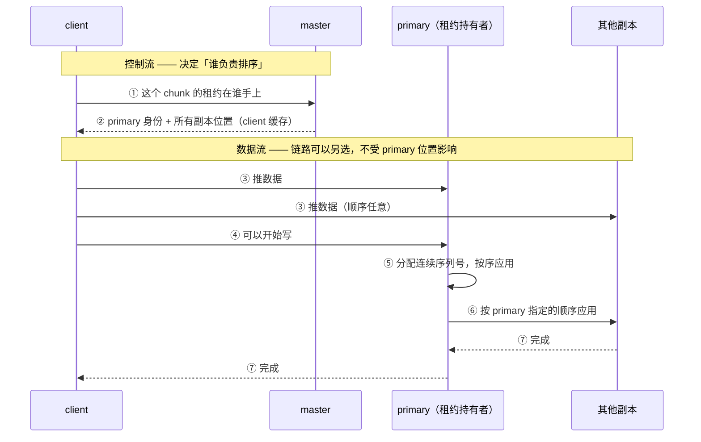

---
tags:
  - 分布式/存储
---

# GFS

Google File System（SOSP 2003）是一套**从假设反推设计**的系统 —— 先把负载特征和硬件现实摆出来，再让每个设计决策都能对回某条假设。这让整套设计很好把握：**大部分设计选择都能用一条假设解释**。

它先摆出这些假设：

- **由大量廉价商品组件构成，组件经常故障** —— 所以系统必须持续自我监控，并把检测、容忍、恢复组件故障当作**日常**工作；
- **存少量大文件**：预期几百万个文件，**每个通常 100 MB 以上**，多 GB 是常见情形；小文件要支持但不做优化；
- **负载以顺序读写大文件为主**，小随机读次之；
- 规模锚点：**最大的集群有 1000+ 存储节点、300+ TB 磁盘**，被数百个客户端持续重度访问。

## 架构：单 master + chunkserver

一个 GFS 集群包含**一个 master**、**多个 chunkserver** 和**多个 client**，三者都是跑在商品 Linux 机器上的用户态服务进程。

- **文件被切成固定大小的 chunk**（见下一节）。每个 chunk 有一个**不可变、全局唯一的 64 位 chunk handle**，由 master 在创建 chunk 时分配。
- chunkserver 把 chunk 当**普通 Linux 文件**存在本地盘上，按 chunk handle + 字节范围读写。
- **默认 3 副本**，用户可以对命名空间的**不同区域**指定不同的副本级别。

**master 持有全部元数据**：命名空间、访问控制信息、文件到 chunk 的映射、每个 chunk 副本的当前位置。它还控制系统级活动：**chunk 租约管理、孤儿 chunk 的垃圾回收、chunkserver 之间的 chunk 迁移**。master 与每个 chunkserver 通过 **HeartBeat** 消息定期通信（下指令 + 收集状态）。

**一条重要的分工**：client 与 master 只做**元数据操作**，**所有携带数据的通信都直接走 chunkserver**。客户端不经过 master 转发数据 —— 这是单 master 不会成为数据面瓶颈的前提。

### 两个刻意的"不做"

另外两个刻意的"不做"：

- **不提供 POSIX API**，所以不需要挂进 Linux 的 vnode 层；
- **client 和 chunkserver 都不缓存文件数据**。client 侧的理由是多数应用**流式读大文件**，或者工作集**大到缓存不下**，缓存收益小；不缓存还消除了缓存一致性问题（**client 会缓存元数据**，这是两回事）。chunkserver 侧根本不需要缓存 —— chunk 就是本地文件，**Linux 的 buffer cache 已经把热数据留在内存里了**。

## 为什么 chunk 是 64 MB

**chunk 大小是"关键设计参数"之一，取值 64 MB**，比典型文件系统块大得多。每个 chunk 副本是一个普通 Linux 文件，**按需扩展（lazy space allocation）**，因此不会因为内部碎片浪费空间 —— 这是对大 chunk 最常见的反对意见，被这条实现细节化解了。

三条收益，每条都对应一条假设：

| 收益 | 机制 |
| --- | --- |
| **减少 client 与 master 的交互** | 同一 chunk 上的读写只需**一次**初始请求拿位置信息。对"顺序读写大文件"的负载效果显著；即使是小随机读，client 也能**轻松缓存多 TB 工作集的全部 chunk 位置** |
| **减少网络开销** | chunk 大意味着 client 更可能对同一 chunk 做多次操作，于是可以**保持长期 TCP 连接** |
| **减小 master 上的元数据规模** | 直接结果是元数据能**放进内存**，而这又带来内存元数据的一整套好处 |

### 大 chunk 的代价：热点

**代价是热点**：小文件只占少量 chunk（可能就 1 个），很多 client 同时访问同一文件时，存这些 chunk 的 chunkserver 会被压垮。这个问题的处理很具体：

> 实践中热点不是主要问题（应用主要顺序读大文件），**但它确实发生过** —— GFS 最初被一个批处理队列系统使用时，一个可执行文件被作为**单 chunk 文件**写入 GFS，然后在**数百台机器上同时启动**，少数 chunkserver 被数百个并发请求压垮。

修法是两条：给这类可执行文件**更高的副本因子**，以及让批处理系统**错开应用启动时间**。长期方案是：允许 client 在这种情况下**从其他 client 读数据**。

## 元数据全放内存，但 chunk 位置不落盘

master 的元数据分三类：**文件与 chunk 命名空间**、**文件到 chunk 的映射**、**每个 chunk 副本的位置**。

**三类都在内存里**，但**只有前两类持久化** —— 通过**操作日志（operation log）**，日志写在 master 本地盘并复制到远程机器。

**内存方案的成本可以算出来**：master 为每个 64 MB chunk 维护**少于 64 字节**的元数据；文件命名空间用**前缀压缩**，每个文件通常也少于 64 字节。"大多数 chunk 是满的"，因为一个文件通常含很多 chunk，只有最后一个可能是部分填充。

### 为什么 chunk 位置反而不落盘

**chunk 位置是三类元数据里唯一不持久化的**，这条反直觉的决定有专门解释，而且**最初确实尝试过持久化**：

- 启动时（以及 chunkserver 加入集群时）**直接向 chunkserver 询问**它们有哪些 chunk；
- 此后 master 能保持最新，因为**它控制所有 chunk 放置**，并用定期 HeartBeat 监控 chunkserver 状态。

**放弃持久化的理由**：这**消除了 master 与 chunkserver 保持同步的问题** —— 在数百台服务器的集群里，chunkserver 加入、离开、改名、故障、重启这些事件"发生得太频繁了"。一句很本质的总结：

> **chunkserver 对自己盘上有哪些 chunk 有最终话语权。**

在 master 上维持一份一致的视图没有意义：chunkserver 上的错误可能让 chunk **突然消失**（比如盘坏掉被禁用），运维人员也可能**给 chunkserver 改名**。

把七步按角色画一遍，能看清"数据流与控制流解耦"落在哪一步：



位置信息**每次都被重新"发现"**，而不是从磁盘读回来的：

```
   master 启动 / chunkserver 加入集群
        │
        ├─▶ 主动询问：「你盘上有哪些 chunk？」 ──▶ 各 chunkserver
        ▼
   内存里的位置表（三类元数据里唯一不落盘的）
        ▲
        │  之后靠两件事维持最新：
        ├─ 定期 HeartBeat（chunkserver → master）
        └─ master 控制所有 chunk 放置（刚放到哪，它自己知道）
        ▼
   chunkserver 侧：对自己盘上有哪些 chunk 有最终话语权
        └─ 盘坏被禁用、运维给机器改名 ⇒ chunk「突然消失」
           master 不必去同步 —— 因为它本来就没打算保存这份信息
```

### 操作日志与 checkpoint

**操作日志不只是一份恢复用的记录，它同时是定义并发操作顺序的逻辑时间线** —— 文件、chunk 以及它们的版本，都由**创建时的逻辑时间**唯一且**永久**地标识。

正确性的要求是严格的：**必须在日志记录本地与远程都刷盘之后，才响应 client**。否则即使 chunk 数据还在，也会**丢掉整个文件系统或最近的客户端操作**。为了不让刷盘与复制拖垮吞吐，master 会**批量攒多条日志记录**再一次刷盘。

恢复靠**重放日志**，所以日志必须小 —— 日志超过一定大小时 master 做 **checkpoint**：一次完整的 checkpoint 是**紧凑的 B 树形式，可以直接映射进内存**用于命名空间查找、无需额外解析。实现上有两个细节：

- **做 checkpoint 不阻塞 incoming mutation** —— master 切换到新日志文件，在**单独线程**里建新 checkpoint；新 checkpoint 覆盖切换前的所有 mutation；
- 耗时量级：**几百万文件的集群大约一分钟**能建完；完成后同时写本地与远程。恢复只需要最新一个完整 checkpoint 加其后的日志；旧 checkpoint 与日志可以删，但会保留几个以防灾难。**checkpoint 期间失败不影响正确性** —— 恢复代码会检测并跳过不完整的 checkpoint。

## 参数与可调项

模型层的旋钮只有六个，但每一个都能对回一条假设：

| 旋钮 | GFS 的取值 | 它换的是什么 |
| --- | --- | --- |
| **chunk 大小** | **64 MB** | 元数据规模 ↔ 热点风险 |
| **副本因子** | **默认 3**，可按命名空间区域指定 | 存储开销 ↔ 可用性 |
| **租约超时** | **初始 60 秒**，可无限延期 | master 管理开销 ↔ 一致性窗口 |
| **操作日志刷盘** | **批量攒多条再一次刷盘**（本地 + 远程） | 吞吐 ↔ 恢复窗口 |
| **checkpoint 触发** | **日志超过一定大小** | 恢复时间 ↔ 运行时开销 |
| **chunk 位置** | **不持久化**，启动时向 chunkserver 询问 | 一致性维护成本 |

它的开源直系后代是 **HDFS**，参数名与默认值都有官方页可核。两者并排看，更能看出哪些东西是**随负载演进被改掉的**：

| HDFS 参数 | 默认值 | 对应 GFS 的哪个旋钮 |
| --- | --- | --- |
| `dfs.blocksize` | **134217728（128 MB）** | chunk 大小 —— **翻了一倍** |
| `dfs.replication` | **3** | 副本因子 —— 一致 |
| `dfs.replication.max` | **512** | 用户可指定的副本上界（GFS 只说"可以指定"） |
| `dfs.heartbeat.interval` | **3 秒** | HeartBeat 周期（GFS 未给具体值） |
| `dfs.namenode.heartbeat.recheck-interval` | **300000 毫秒** | 判死的复核周期 |
| `dfs.namenode.checkpoint.period` | **3600 秒** | checkpoint —— **从"按日志大小"改成按时间** |
| `dfs.namenode.checkpoint.txns` | **1000000 事务** | checkpoint 的第二个触发条件 |
| `dfs.namenode.checkpoint.check.period` | **60 秒** | 轮询未 checkpoint 事务数的周期 |
| `dfs.namenode.fs-limits.max-blocks-per-file` | **10000** | **GFS 没有** —— 限制每文件块数 |
| `dfs.datanode.balance.bandwidthPerSec` | **100m** | **GFS 没有** —— 块迁移/均衡的限流 |
| `dfs.namenode.safemode.threshold-pct` | **0.999f** | **GFS 没有** —— 安全模式的门限 |
| `dfs.namenode.safemode.extension` | **30000 毫秒** | 达到门限后再等多久退出安全模式 |
| `dfs.namenode.stale.datanode.interval` | **30000 毫秒** | "陈旧节点"的判据（对应陈旧副本） |
| `dfs.namenode.handler.count` / `dfs.datanode.handler.count` | **10 / 10** | RPC 服务线程数 —— GFS 未暴露 |

按六要素摊开两处。

**`dfs.blocksize`（默认 128 MB）** —— 语义是"新文件的默认块大小"。**它比 GFS 的 64 MB 大一倍**，方向与当初选大块的理由一致（减少元数据条目、让元数据装进内存），**代价也一并继承**：块越大，小文件造成的热点越集中。什么时候该改？**文件普遍很小时该往小改** —— 否则每个文件至少占一个块的元数据这一点不会变；**文件普遍很大、元数据压力大时该往大改**。联动的是 `dfs.namenode.fs-limits.max-blocks-per-file`，两个一起决定"一个文件能有多大"。失败模式是**小文件多到把内存吃满**：块大小管的是"每个文件的元数据条目数"，**管不到"每个文件至少一条"**。

**`dfs.namenode.checkpoint.period`（默认 3600 秒）与 `.txns`（默认 1000000）** —— 语义是"每隔多久，或累计多少事务，就做一次 checkpoint"，**两个条件是"或"的关系**（官方描述明确：无论时间是否到期，累计到事务数就做）。**这里与 GFS 的触发方式不同**：GFS 的触发是"日志超过一定大小"，HDFS 换成了**时间 + 事务数双触发**。两种方式的取舍很清楚 —— **按日志大小触发与恢复代价直接挂钩**（日志越长重放越久），**按时间/事务数触发更容易预测运行时开销**。改小的后果是 checkpoint 更频繁、**后台 I/O 更多**；改大的后果是**故障时重放更久**。联动 `dfs.namenode.checkpoint.check.period`（负责轮询事务数的那个周期）。

**一处结构性观察**：HDFS 比 GFS 多出来的那几条参数（**安全模式、stale datanode、均衡限流、每文件块数上限**）**全是运维侧的**。GFS 把"集群由自家团队运维"当作前提，HDFS 要面对外部部署，于是**把一批运维判断做成了可配的参数**。参数表的差异因此不只在数值上，**也在"哪些事被做成了旋钮"上**。

## 一致性模型：defined / consistent / inconsistent

GFS 的模型是**放宽的**，这么做的理由是"大幅简化文件系统而不给应用加上沉重负担"。它只有三个状态词，关键是把"一致"与"已定义"分开：

| 术语 | 定义 |
| --- | --- |
| **一致（consistent）** | 所有 client **无论读哪个副本**，都看到相同的数据 |
| **已定义（defined）** | 在一致的基础上，client 会看到该 mutation **完整写出**的内容 |
| **不一致（inconsistent）** | 不同 client 在不同时刻可能看到不同的数据 |

### 三种情形落在哪一档

三种情形落在这三档上：

- **串行成功**（没有并发写干扰）→ 受影响区域 **defined**（因而也 consistent）；
- **并发成功** → 区域 **consistent 但 undefined**：所有 client 看到相同的**同一份**数据，但它可能**不反映任何一个 mutation 写的内容** —— 通常是多个 mutation 的**混合碎片**；
- **失败** → 区域 **inconsistent**（因而也 undefined）。

**应用不需要区分不同种类的 undefined 区域**，只需要分清 defined 与 undefined。

**命名空间 mutation（例如创建文件）是原子的**，由 master 独占处理：命名空间锁保证原子性与正确性，而**master 的操作日志定义了这些操作的全局全序**。

### 两种数据 mutation，与 record append 的代价

- **write**：数据写在**应用指定的文件偏移**上；
- **record append**：数据（"记录"）**在存在并发 mutation 的情况下也原子地至少追加一次**，但**偏移由 GFS 自己选**。

注意一个容易混的点：**"普通 append"只是 client 认为的当前文件末尾偏移上的一次 write**，不是同一个东西。record append 返回的偏移**标记一段 defined 区域的起点**，这段区域里含该记录。

**它的代价被明确写出来了**：GFS 可能在记录之间插入 **padding 或记录副本**，这些区域被视为 **inconsistent**，但"通常比用户数据量小得多"。**这也解释了为什么 record append 是"至少一次"（at least once）而不是恰好一次。**

### 这套保证靠什么成立

两条机制：

1. **在所有副本上以相同顺序应用 mutation**（靠租约，见下一节）；
2. **用 chunk version number 检测陈旧副本** —— chunkserver 宕机期间会错过 mutation，副本据此变陈旧。

**陈旧副本**永远不会参与 mutation，也**不会被给到**向 master 询问 chunk 位置的 client，并且会被尽早垃圾回收。

**一个真实存在的一致性窗口**同样被点明：因为 client **缓存了 chunk 位置**，它可能在信息刷新前**读到陈旧副本**。这个窗口受限于**缓存条目的超时**与**文件下次 open**（open 会清掉该文件所有 chunk 信息的缓存）。一条降低实际影响的观察：**由于多数文件是 append-only，陈旧副本通常返回"chunk 提前结束"而不是过期数据**。

## 租约与 mutation 顺序

**mutation** 指改变 chunk 内容或元数据的操作（write、append）。**每个 mutation 都会在该 chunk 的所有副本上执行。**

要在副本之间维持一致的顺序，GFS 用的是**租约**：

1. **master 把 chunk 租约授予其中一个副本，称为 primary**；
2. **primary 为该 chunk 的所有 mutation 选一个串行顺序**；
3. **所有副本按这个顺序应用 mutation**。

于是**全局 mutation 顺序由两段定义**：

> 先由 **master 选定的租约授予顺序**决定，租约之内由 **primary 分配的序列号**决定。

### 租约参数为什么这样设计

**租约参数的目的是让 master 的管理开销最小**：

- 初始超时 **60 秒**；
- 但只要 chunk 正在被 mutation，primary 就可以请求延期，**而且通常能无限期地拿到**；
- 延期请求与授予**捎带在 HeartBeat 消息上**（master 与所有 chunkserver 之间本来就定期交换），不额外增加消息类型；
- master 有时会**在到期前主动撤销租约**（例如它想禁用某个正在被改名的文件的 mutation）；
- **即使 master 与 primary 失去通信，它也能安全地在旧租约到期后把新租约授予另一个副本**。

### 写流程：七步，以及"数据流与控制流解耦"

写流程按编号图走一遍：

1. client 向 master 询问**哪个 chunkserver 持有该 chunk 的当前租约**以及其他副本的位置（若无租约，master 授予一个）；
2. master 回复 **primary 的身份与所有 secondary 副本的位置**。client **缓存**这些信息，只在 primary 不可达、或 primary 回复自己已不持有租约时，才再次联系 master；
3. **client 把数据推给所有副本**（顺序任意）。每个 chunkserver 把数据存在**内部 LRU 缓冲**里，直到数据被使用或被老化掉；
4. client 通知 primary 可以开始写……
5. primary 分配连续的序列号，按序应用 mutation；
6. secondary 按 primary 指定的顺序应用；
7. secondary 回复 primary，primary 回复 client。

**第 3 步的位置是关键**：数据**先于**控制消息推出去，而且 client 推给谁、按什么顺序推都自由。这条叫**把数据流与控制流解耦**，它带来一个直接收益：

> 可以**按网络拓扑调度昂贵的数据流**，而**不受哪个 chunkserver 是 primary 的影响**。

也就是说，"哪台机器负责排序"（控制）与"数据走哪条链路"（吞吐）分开优化 —— 数据可以沿链式（pipeline）传给拓扑上最近的机器，绕开远的 primary。

## 版本演进：从 GFS 到 HDFS 与 Colossus

这台系统最重要的演进是**它的假设被现实改了**。三条线可以分开看。

**第一条：规模上限先暴露出来。** GFS 实际扩到的量级是**约 5,000 万文件、约 10 PB**，而天花板来自单 master —— **元数据全在内存里**，内存能装多少条元数据是有数的。单 master 同时是**单点**（缓解手段是用 shadow master 提供**只读**访问），并且**对元数据密集的负载会成为瓶颈**：大量小文件、高频元数据操作。

**第二条：Google 自己的继任者 —— Colossus（约 2010 年起替换 GFS）。**

| 维度 | GFS | Colossus |
| --- | --- | --- |
| **元数据** | 单 master、全在内存 | **分布式元数据服务**（分片到多台机器，建立在 Bigtable 之上） |
| **单 master 的容量** | 约 5,000 万文件 | **每 master 约 1 亿文件** |
| **块大小** | 64 MB | **小到 1 MB 量级** |
| **冗余方式** | 三副本（3× 开销，容忍 2 个失败） | **纠删码，(6,3) Reed-Solomon：1.5× 开销、容忍 3 个失败** |

两处值得点出来。**块变小与元数据分片是一起发生的**：前者会**放大元数据的条目数**，没有后者的水平扩展，块变小根本做不到。而**纠删码换掉的正是三副本** —— 三副本"读一份就拿到数据、恢复简单"，纠删码"省空间，但恢复要读多个分片、代价更高"。**Colossus 没有正式发表的设计文档**（公开材料只有一次 2010 年的会议演讲记录），所以这条线可核到的细节不多，**但方向是清楚的：单 master 这个选择有天花板，规模上去就会撞上。**

**第三条：开源分支 —— HDFS。**

**HDFS 与 GFS 的对应关系几乎是逐项直译的**：master → NameNode、chunkserver → DataNode、chunk（64 MB）→ block（128 MB）、操作日志 + checkpoint → edit log + FsImage。**架构相同**：一个 NameNode 在内存里存全部命名空间元数据、DataNode 把块存本地盘、client 先问元数据再直接与 DataNode 通信、默认三副本、心跳与块汇报持续上报。它是 2006 年为 Hadoop 而写的，此后成了批处理框架的事实标准。

三处差别值得记：

- **块大小从 64 MB 变成 128 MB** —— 方向与 GFS 一致（减少元数据条目），幅度更激进；
- **实现语言从 C++ 变成 Java** —— 换来更广的开发者基础，代价是 **JVM 开销与 GC 停顿**，这是 GFS 的 C++ 实现里没有的一项；
- **最初是硬单点**：一个 NameNode、**没有自动故障切换**，它挂掉文件系统就不可用，直到人工重启。**后续版本才补上 NameNode HA（用 ZooKeeper 做自动切换）与 Federation（多个独立 NameNode 各管命名空间的一部分）。**

**"Federation"这个补法与 Colossus 是同一个方向** —— **两者都收敛到同一个认识：规模化之后，元数据本身就是个独立的分布式系统问题，需要和数据一样的那些手段（复制、分片、协调）。** "三副本换纠删码"是另一条同向的证据：**冗余方式从"简单但贵"移到"省空间但恢复贵"。**

**一条判断**：这套设计留下的东西**是"把控制流与数据流分开"这个结构性决定，而不在"单 master"** —— 它让元数据服务不必成为数据面的瓶颈。后续所有改进都是在这个决定之上**把元数据那一侧做成可扩展的**。单 master 只是这个决定在当时规模下的一个实现选择。

**三处演进放在一起，能看出一条共同的修正方向**：**单 master 的容量、块的大小、冗余的方式** —— 三处修正都朝同一个方向走：**把"集中"换成"分散"**（元数据分片、块变小以便分布更均匀、冗余从整副本换成纠删码）。**GFS 的集中式选择在 2003 年的规模上是对的；而修正它需要的技术（分片、一致性哈希、纠删码）当时也已经存在** —— 缺的不是技术，是需求还没到。

**一条读法**：**评估一个存储系统时，"它自述的规模锚点"比"它的架构图"更能预告它会在哪里撞墙。** 这份材料开头就把"1000+ 节点、300+ TB"摆在最前面，而它实际扩到的量级是 **5,000 万文件 / 10 PB** —— **两个数字之间的距离，就是单 master 那套选择留下的余量。** 后来的系统把规模锚点抬高了两个数量级，代价是元数据层必须变成分布式的。**这条读法可以推广：任何"单点控制"的设计，余量都可以用"自述锚点"与"实际撑到的规模"之差来估。**

## 底层依赖：网络拓扑、本地文件系统与数据完整性

三处依赖，前两处在正文里出现过，第三处容易被忽略。

**① 网络拓扑 —— "机架内带宽高、机架间低"直接决定了数据流怎么走。** 正文那条"数据流与控制流解耦"之所以有收益，前提正是**链路之间不等价**：数据可以沿链式传给拓扑上最近的机器，而"谁负责排序"（控制）不必跟着数据走。**如果所有链路都等价，这个解耦就没有意义** —— 它省下的恰恰是"跨机架的那一段"。

**② 本地文件系统 —— chunk 就是普通 Linux 文件。** 这条依赖带来三个好处，值得并列记下：

| 好处 | 说明 |
| --- | --- |
| **不用自己管块设备** | 交给 Linux 的页缓存与文件系统 |
| **chunkserver 侧不需要数据缓存** | chunk 就是本地文件，**页缓存已经把热数据留在内存里了** |
| **按需扩展不浪费空间** | lazy space allocation 化解了"大 chunk 内部碎片"这条最常见的反对意见 |

**③ 数据完整性 —— 用校验和把"磁盘不可信"变成"可检测"。** 这条正文里没展开，但它是"假设反推"的另一半：**既然硬件会静默损坏（而不是 fail-stop），就必须有一个不依赖硬件的检测手段。** 做法是**每个 chunk 维护校验和**（按固定大小的块计算），**在返回读数据之前验证**；校验和的更新**记在本地日志**里，此外还有**周期性重校验**用来发现后台损坏。

这一条的分量在于它**改写了故障模型**：**"磁盘坏了"从一个"停下来的故障"变成"一个可以被发现的数据错误"** —— 后者能靠副本恢复，前者只能靠重启。**代价是"读一个副本"这个动作变成有成本的**（要验校验和），所以**副本数与校验开销其实是同一笔账的两面**。

**三处依赖合起来说明一件事：这套设计的"商品硬件"前提落在三层具体的让步上，而不只是一句口号** —— 网络让步（数据绕开远链路）、文件系统让步（块的物理布局交给 Linux）、数据完整性让步（用校验和补上硬件的不可信）。**每一层都对应一个必须存在的机制。**

**这三处依赖各自可以怎么验证**，值得一并记下 —— 三处都有自己的可观测面：

| 依赖 | 怎么看出它在哪里起作用 | 材料里的证据 |
| --- | --- | --- |
| **网络拓扑** | 数据流实际路径与 primary 位置**不一致**时，吞吐仍然好 | "按网络拓扑调度昂贵的数据流、不受 primary 位置影响"这条收益 |
| **本地文件系统** | chunkserver 侧**没有**数据缓存，热读却仍然快 | "chunk 就是本地文件，页缓存已经把热数据留在内存里" |
| **数据完整性** | 损坏被**提前发现**，而不是被读出来 | 返回读数据之前验证校验和 + 周期性重校验 |

**三处依赖与"哪些机制必须存在"的对应关系**，能说明依赖是设计的骨架，而不只是背景知识：

| 依赖 | 它推出来的机制 |
| --- | --- |
| **链路不等价** | **数据流与控制流解耦**（第 3 步可以自由调度）；副本位置的选择 |
| **chunk 就是普通文件** | **lazy space allocation**；**不需要 chunkserver 侧缓存**；chunk 大小可以定得很大 |
| **硬件会静默损坏** | **每 chunk 校验和**；**副本因子** —— 能被发现的错误才修得回来 |

**最后一条的推论值得单独说**：**校验和与副本数是同一笔账的两面。** 副本数决定"能容忍几次损坏"，校验和决定"损坏能不能被算作损坏"。**没有校验和，副本机制只能对付"节点不见了"这一种故障**；有了它，"数据悄悄变了"也进同一个恢复流程。**这两个机制在这套系统里是一起出现的，拆开任何一个都不成立。**

**一条收束**：**每一项让步都不是免费的** —— 网络让步要求实现"数据流与控制流解耦"这一整套协议；文件系统让步要求接受"chunk 就是文件"带来的全部后果（包括多年后 HDFS 里 JVM 与本地盘的那一堆问题）；完整性让步要求每次读都付校验成本。**三条让步合起来，才是"用商品硬件"这个前提的真实价格。**

**一处容易被当成"实现细节"、其实是依赖的**：**chunk 位置在 client 侧是缓存、在 master 侧不落盘** —— 这两件事建立在同一个前提上：**位置可以随时重新问出来。** 而"能随时问出来"靠的是 chunkserver 侧有权威、且心跳持续在跑。**所以心跳链路一旦长时间不通，不只意味着"某个节点可能坏了"，还意味着"位置信息开始不可信"** —— 这正是心跳周期与判死门限必须成组看的原因。

**另一处**：**操作日志要同时写到本地与远程**，这条依赖的是"至少还有另一台机器活着"，而它把**写延迟的下界**钉在"两份存储都确认"上。换来的是很具体的东西：**master 所在机器整机损毁时，文件系统不会退回到上一个 checkpoint。** 这也是这套设计里"日志盘"与"数据盘"要分开的原因之一。

## 不适用于什么：四条假设的边界

开头摆出的四条假设，**每条反过来就是一条不适用条件**。

| 假设 | 不成立的场景 | 后果 |
| --- | --- | --- |
| **组件经常故障** | —— | 这条**几乎总是成立**，是四条里最安全的一条 |
| **存少量大文件**（几百万文件、每个 100 MB+） | **海量小文件** | **每个文件仍至少占一个 chunk 的元数据**，而元数据在 master 内存里 ⇒ **文件数而不是数据量成为瓶颈**；真实后果之一是**应用被迫把小文件打包成容器文件** |
| **负载以顺序读写大文件为主** | **低延迟随机访问** | 设计目标是**聚合带宽而不是低延迟**，延迟敏感的应用在这里得不到保障 |
| **规模到 1000+ 节点、300+ TB** | **超出单 master 的元数据容量** | 实际扩到约 **5,000 万文件 / 10 PB** 就到头，再往上要换架构 |

**第二行是这套设计最常被引用的边界**，机制值得说清：**每个文件至少占一条元数据，而元数据在内存里** —— 于是"文件数"是比"总字节数"更硬的约束。**大 chunk 缓解的是"每个文件的元数据条目数"（一个 1 GB 文件只占 16 条），缓解不了"每个文件至少一条"。** 所以**同一个决定同时带来了"元数据能装进内存"与"小文件低效"两件事** —— 收益与代价出自同一处。

**第三条与"要不要缓存"相关**：client 不缓存文件数据的理由之一是**工作集大到缓存不下**。**这条理由在"读小文件"的负载上不成立** —— 那种负载的工作集可能很小，缓存本来有效。**所以"不缓存"是跟着假设走的决定，而不是一条普适的优化。**

**还有一条没写进假设、但在正文里露出来的边界：写语义只保证到"至少一次"。** record append 明说可能插入 padding 或记录副本，这些区域算 inconsistent。**任何"一条不多一条不少"的追加需求，都得应用自己去做去重与识别** —— 这是"放宽一致性"换来的代价，而且被明确标了出来。

**与相邻系统的对照**：同一位置上的其他选择，各自换掉了这里的哪一维 ——

| 系统 | 换掉了什么 | 保留了什么 |
| --- | --- | --- |
| **Ceph** | 用一致性哈希（CRUSH）替代中心 master，把"元数据集中"换成"可计算的放置" | 副本冗余的思路 |
| **对象存储**（S3 / GCS / Azure Blob） | 换掉了"文件系统"这个形态，改成扁平 REST 接口 | **append-only 与"先复制再服务"的组织方式** |
| **Colossus** | 换掉了单 master 与三副本 | 控制流/数据流分开这个结构 |

**这套设计真正的遗产是底层的组织方式，而不是它的接口** —— 对象存储那条路最能说明这一点：它把"文件系统"这层壳去掉了，**内部的组织方式却仍然是 GFS 形状的。**

**把四条边界收成一张选型表**：

| 你的场景 | 能不能用 | 要补什么 |
| --- | --- | --- |
| **超大文件、顺序读写、批处理** | **能** | —— |
| **海量小文件** | **勉强** | **必须先把小文件打包成容器文件** —— 这是应用侧的活，系统不代劳 |
| **低延迟随机访问** | **不建议** | 设计目标是聚合带宽 |
| **多写者并发修改同一处** | **不建议** | 写语义只到"至少一次"，且只保证 defined / undefined 的区分，不保证内容 |
| **需要"一条不多一条不少"** | **不能** | 应用自己去做去重与识别 |
| **文件数超过千万级** | **不能** | 换元数据可水平扩展的架构 |
| **需要 POSIX 语义** | **不能** | 它明确不提供 POSIX API |

**最后一行值得单独说**：**"不提供 POSIX API"是一次有意的省略，而不算疏漏。** 省掉它换来两件事：**不必挂进 Linux 的 vnode 层**（实现简化），以及**可以自己定义一致性语义**（POSIX 的约束会限制它放宽一致性）。**换句话说，这套放宽的一致性模型之所以做得出来，前提之一就是它放弃了对 POSIX 的兼容。** 这一条把"接口选择"与"一致性选择"连在了一起 —— **两者不是独立的两件事。**

**一条给选型的判断**：**这套设计的所有取舍都指向"批处理"这一个场景** —— 大文件、顺序读写、聚合带宽、放宽的一致性、后果由应用承担。**在这个场景上它做得极好，代价是它明确不做其他场景。** 判断一个场景适不适合，最省事的办法是**把它对着上表逐行过一遍**，而不是去读架构图。

## 排查：从症状到判据

| 症状 | 判据 | 先看什么 | 常见归因 |
| --- | --- | --- | --- |
| **写入卡住不返回** | 是"数据没到"还是"日志没刷盘" | 第 3 步（数据推送）与第 7 步（回复）的耗时 | 数据流与控制流是分开的：**数据没到齐，或日志没在本地与远程都刷盘** |
| **某个 chunkserver 被打爆** | 该 chunk 被多少 client 命中 | 单 chunk 的请求数 | **热点** —— 小文件/单 chunk 文件被多台机器同时读 |
| **读到的数据看起来是乱的** | 该区域是 defined 还是 undefined | 这次写是否并发成功 | **并发成功 ⇒ consistent 但 undefined**（混合碎片），模型允许，不是故障 |
| **读到旧数据** | client 是否缓存了 chunk 位置 | 该文件是否重新 open 过 | **陈旧副本** —— 窗口受缓存超时与下次 open 限制 |
| **副本"莫名"消失** | chunkserver 是否被禁用或改名 | chunkserver 侧状态 | **设计如此**：chunkserver 对自己盘上的 chunk 有最终话语权 |
| **master 内存吃满 / 启动慢** | 文件数（而不是总字节数） | 文件数与每文件元数据量 | **元数据在内存里** —— 文件数约束的直接体现 |
| **checkpoint 期间写变慢** | checkpoint 是否在跑 | 日志盘的 I/O | checkpoint 不阻塞写，但**它与写争同一条日志盘** |
| **与租约相关的异常** | 租约是否被提前撤销 | master 的撤销记录 | **master 会在到期前主动撤销租约**（例如要禁用某个正在被改名文件的 mutation） |

**三条判读原则：**

1. **先分清"数据面"与"元数据面"。** 这两条路径在这套系统里是分开的（client 的数据直接走 chunkserver），**所以"慢"要先归到哪一侧**：元数据面慢表现为"打开/创建文件慢"，数据面慢表现为"读写慢"。**两侧的扩法完全不同** —— 元数据侧受 master 内存限制，数据侧受 chunkserver 与网络限制。**归错侧，后面所有动作都是白做。**
2. **把"模型允许的"与"故障"分开。** 这套一致性模型**主动允许** undefined 区域存在。看到"数据是乱的"先判断这次写是不是并发的 —— 是并发的就落在模型范围内，该改的是代码（改用 record append，或在应用层串行化），而不是系统。
3. **恢复代价与两处长度成正比**：**操作日志的长度**（决定重放时间）与**单次 checkpoint 的耗时**。判据是"最近一次 checkpoint 距今多久"。**要缩短恢复时间，动的是这两处，而不是节点数。**

**最后一条与前文接得上**：这套系统的可用性靠"副本 + 快速重放"两条腿 —— **副本对付数据丢失，重放对付 master 状态丢失**，而后者的时间由 checkpoint 策略决定、与集群规模基本无关。**这也是为什么"checkpoint 按什么触发"值得当成一个正式参数来看**：它是一笔可以在"运行时开销"与"恢复时间"之间移动的账。

**一个可直接照走的排查顺序**：

1. **先归侧** —— 打开/创建文件慢属于元数据面，读写慢属于数据面。这一步决定后面查哪一半；
2. **再看"这一次写是不是并发的"** —— 并发成功留下的 undefined 区域落在模型范围内，不是故障。**把它当故障查会一直查不到根因**；
3. **然后看热点** —— 单个 chunk 的请求数。最初的翻车案例正是"一个单 chunk 文件被数百台机器同时启动"，判断依据是**少数 chunkserver 的请求数远高于其他**；
4. **最后看恢复侧** —— 最近一次 checkpoint 距现在多久、操作日志多长。这两个数直接决定"故障后要等多久"。

**第 2 步最容易被跳过**，因为"数据是乱的"看起来就像 bug。**但这套一致性模型本来就允许某些区域未定义** —— 判断依据只有一条：**这次写有没有并发。**

**一处与观测相关的提醒**：这套系统里**最有信息量的两个量是"文件数"和"单 chunk 请求数"**，而不是"总字节数"和"平均负载"。**前两个决定它会在哪里撞墙，后两个基本不影响判断** —— 文件数撞的是 master 的内存，chunk 请求数撞的是个别 chunkserver。**看平均负载只会得到"一切正常"。**

## 判据速查

| 问题 | 答案 |
| --- | --- |
| 为什么用单 master | 大幅简化设计，且让 master 能做复杂的 chunk 放置与复制决策 |
| chunk 为什么是 64 MB | 减少 client↔master 交互、支持长期 TCP 连接、让元数据能放进内存 |
| 大 chunk 的代价 | 小文件造成**热点**；真实案例是单 chunk 可执行文件被数百台机器同时启动 |
| 元数据哪一类**不**持久化 | **chunk 位置** —— 启动时向 chunkserver 询问；理由是 chunkserver 对自己盘上的 chunk 有最终话语权 |
| 每个 chunk 的元数据开销 | **少于 64 字节** |
| 什么时候才响应 client | 日志记录在**本地与远程都刷盘之后** |
| checkpoint 阻塞写入吗 | **不阻塞** —— 切新日志 + 单独线程建 checkpoint；几百万文件约一分钟 |
| 三个一致性术语的关系 | **defined ⊂ consistent**；不满足 consistent 就叫 inconsistent |
| 并发成功的结果是什么 | consistent 但 **undefined** —— 所有 client 看到同一份数据，但它可能是多个 mutation 的**混合碎片** |
| record append 为什么是"至少一次" | GFS 可能插入 **padding 或记录副本**，那些区域算 inconsistent |
| 陈旧副本怎么被发现 | **chunk version number**；陈旧副本不参与 mutation，也不给 client |
| 全局 mutation 顺序谁定 | 两段：master 的**租约授予顺序** + primary 在租约内分配的**序列号** |
| 租约超时多久，能续吗 | 初始 **60 秒**；chunk 持续被写时可**无限延期**，延期捎带在 HeartBeat 上 |
| 数据流与控制流解耦为了什么 | 让**数据**可按网络拓扑调度，不受 primary 位置影响 |

**再补几行**（覆盖本轮补进来的内容）：

| 问题 | 答案 |
| --- | --- |
| 数据完整性靠什么 | **每个 chunk 的校验和**：读之前验证 + 周期性重校验，把"磁盘静默损坏"变成可检测的错误 |
| 单 master 的天花板在哪 | **约 5,000 万文件 / 10 PB** —— 元数据全在内存，装不下更多 |
| 天花板被什么撞破的 | **元数据分片**（Colossus）；HDFS 走的是 Federation |
| 冗余方式后来怎么变 | **三副本 → 纠删码**：Colossus 用 (6,3) Reed-Solomon（1.5× 开销、容忍 3 个失败） |
| 两种冗余各换什么 | 三副本"读一份就拿到、恢复简单"；纠删码"省空间、恢复要读多个分片" |
| HDFS 与 GFS 最直接的三处差别 | 块 **64 → 128 MB**；C++ → **Java**（多了 JVM 与 GC 停顿）；**最初是硬单点**（后来才有 HA 与 Federation） |
| 这套设计真正的遗产 | **"控制流与数据流分开"**这个结构性决定，而不是"单 master" |

**这张表的用法**：**它列的每一条都是"某条假设在某个具体参数上的落点"。** 所以读它的正确方式是**遇到新场景时能指出它踩到了哪条假设**，而不是背答案。例如"文件数太多"踩的是"少量大文件"那条，"要低延迟"踩的是"顺序读写大文件"那条 —— **每条不适用条件都能回到一条假设上，这正是这套设计"可解释"的地方。**

**最后三条结构性决定，它们比参数更重要**（参数会变，这三条没变）：

1. **控制流与数据流分开** —— client 只向 master 要元数据，数据直接走 chunkserver。后面所有改进都是在这条之上把元数据侧做成可扩展的；
2. **把"一致的顺序"委托给一个副本** —— 租约 + primary 排序。HDFS 沿用；后来的系统有的在这条上换成了共识协议，代价是额外的通信轮次；
3. **数据完整性由端到端校验保证，而不靠硬件** —— 这条决定了"副本"这个手段有效：**能被发现的数据错误才修得回来，发现不了的只能靠假设。**

**"三副本换纠删码"其实是第三条的延伸**：**冗余方式可以换，但"必须先能发现错误"这个前提不能换。**

**最后一处用法提示**：这张表里**凡是"不能 / 不建议"开头的答案，都对应一条被有意放弃的能力**（POSIX、精确一次、低延迟、小文件优化）。**放弃它们是这套设计能在批处理场景上做到极致的原因，而不是遗漏。** 读这类系统的资料时，**"它不做什么"比"它做什么"更能说明它是什么。**

## 相关

- [[02-Bigtable|Bigtable]] —— 直接建在 GFS 之上，把 GFS 当 SSTable 与日志的存储层
- [[03-一致性模型]] —— GFS 的 defined/consistent/inconsistent 是一套**面向追加负载的专用模型**，与通用一致性模型的谱系不同
- [[01-分布式事务|分布式事务]] —— 跨文件的多步操作不在 GFS 范围内，那是上一层的事

## 参考

- S. Ghemawat, H. Gobioff, S.-T. Leung. *The Google File System*. SOSP 2003.
- Apache Hadoop. *`hdfs-default.xml`*（HDFS 配置项官方默认值）. https://hadoop.apache.org/docs/stable/hadoop-project-dist/hadoop-hdfs/hdfs-default.xml —— 用于与 GFS 的参数逐项对照
- Colossus 的公开材料只有一次 2010 年的会议演讲记录（无正式论文）；上表按多份独立公开材料一致的描述整理
- 本篇用的 PDF 抽取文本里，引入部分的两段（约 3200 字符，占全文 3.6%）因字体缺 ToUnicode 映射无法还原；上述内容全部来自可读部分。
