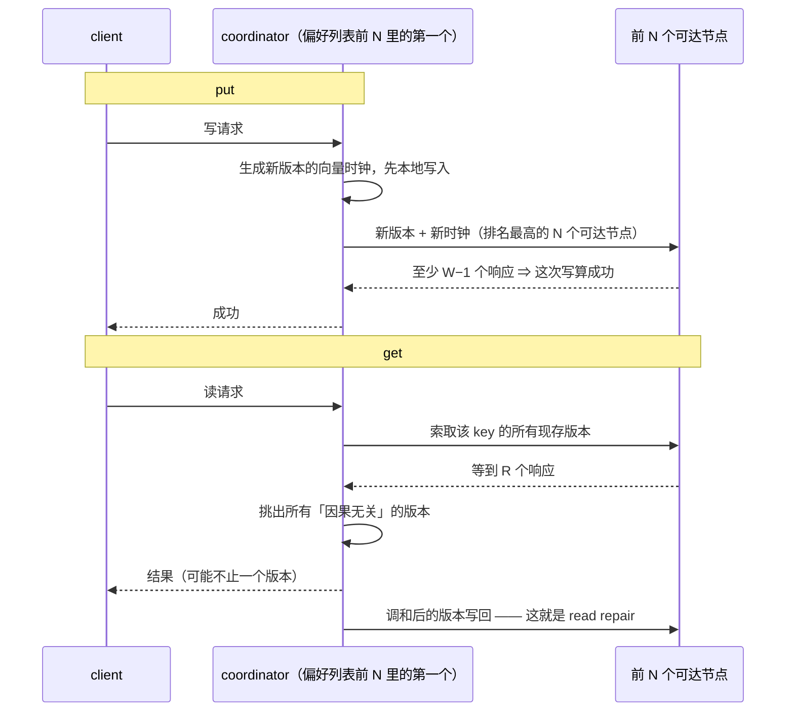

---
tags:
  - 分布式/存储
---

# Dynamo

Dynamo（SOSP 2007）是 Amazon 的**高可用 KV 存储**。它与前两篇的取向正好相反：GFS 与 Bigtable 是"先把一致性定清楚，再看可用性有多少"，Dynamo 是**先把可用性拉满，一致性作为可配置的让步**。

理解它的钥匙是背景那句话：

> 客户应当能够查看购物车、往里加商品，**即使磁盘被龙卷风摧毁**。

这不是修辞。Amazon 的架构里**始终有少量但数量可观的服务器与网络组件在失效**，所以「把故障处理当作正常情况」是设计要求，而不是异常路径。

## 四条设计考量

| 考量 | 具体表述 |
| --- | --- |
| **查询模型** | 大量服务只需要**主键访问**（畅销榜、购物车、客户偏好、会话管理、销售排名） |
| **ACID** | **Amazon 的经验是"提供 ACID 保证的数据存储往往可用性差"**。Dynamo 面向愿意接受**较弱一致性（ACID 里的 C）**的应用，**不提供任何隔离保证，只允许单键更新** |
| **效率** | 必须跑在**商品硬件**上；服务延迟按 **99.9 分位**衡量；服务必须能配置 Dynamo 以稳定达成延迟与吞吐目标 |
| **其他假设** | 只给 Amazon 内部服务用；环境**非敌对**，**没有认证授权这类安全需求**；每个服务用自己的 Dynamo 实例；**初始设计目标是数百台存储主机** |

### 为什么 SLA 定在 99.9 分位

这一节值得单独记，因为它是"为什么不能只看平均值"的经典论证。

SLA 是形式化协商的合同，约定请求速率分布与预期延迟。一个例子：

> 在峰值 **500 req/s** 下，保证 **99.9% 的请求在 300 ms 内**响应。

Amazon 的电商页请求通常要调 **150 个以上的服务**，调用图常有一层以上，所以链路上每个服务都必须守住自己的性能契约。

**为什么不用均值或中位数**：如果目标是「**所有**客户都有好体验」而不是「多数客户有」，均值/中位数不够。一个很具体的例子 —— **用了大量个性化技术时，历史记录更长的客户需要更多处理，性能在高分位端受影响**；用均值或中位数描述的 SLA **覆盖不到这个重要客户群**。

**为什么不选比 99.9% 更高**：基于成本效益分析，**再提高那么多性能会显著增加成本**。

## 一张表说清全部技术

五个问题与对应技术可以一一对齐，这是全篇的骨架：

| 问题 | 技术 | 优势 |
| --- | --- | --- |
| 分区 | **一致性哈希** | 增量可扩展 |
| 写的高可用 | **带读取时协调的向量时钟** | **版本大小与更新速率解耦** |
| 处理临时故障 | **Sloppy quorum + hinted handoff** | 部分副本不可用时仍提供高可用与持久性 |
| 从永久故障恢复 | **用 Merkle 树做反熵** | 后台同步分叉的副本 |
| 成员管理与故障检测 | **基于 Gossip 的成员协议与故障检测** | 保持对称性，**避免中心化注册表** |

## 一次读写走完的路径

**环上任何存储节点都有资格接收任意 key 的 `get` 与 `put`**。两个操作都通过 Amazon 自己那套请求处理框架、走 HTTP 发起。客户端选节点有两条路：

| 方式 | 代价 |
| --- | --- |
| 经**通用负载均衡器**路由（按负载信息选节点） | 应用里**不必链接任何 Dynamo 特有的代码**；但可能多一次转发 |
| 用**分区感知的客户端库**直接路由到合适的协调节点 | **延迟更低，因为它省掉了一次可能的转发步骤** |

处理读写的那个节点叫 **coordinator**，通常就是**偏好列表中前 $N$ 个里的第一个**。如果请求是经负载均衡器进来的，可能落到环上任意一个节点；**这个节点若不在该 key 偏好列表的前 $N$ 里，它就不做协调，而是把请求转发给偏好列表中前 $N$ 个里的第一个**。

读写涉及的始终是**偏好列表里前 $N$ 个健康的节点**，跳过那些 down 或不可达的。全健康时访问的就是前 $N$ 个；有故障或网络分区时，会往下访问排名更低的节点。

**法定人数的定义与一条直接后果**：

- **$R$** = 一次成功读操作**必须参与**的最小节点数；**$W$** = 一次成功写操作**必须参与**的最小节点数；
- 取 $R + W > N$ 就得到一个类法定人数系统；
- **`get`（或 `put`）的延迟由 $R$（或 $W$）个副本里最慢的那个决定** —— 正因为如此，**$R$ 与 $W$ 通常配置得比 $N$ 小**，以换取更好的延迟。

两条流程的细节值得逐句看，因为它们解释了后面很多设计：

**写（put）**：coordinator **为新版本生成向量时钟**，**先本地写入新版本**，然后把新版本连同新向量时钟发给**排名最高的 $N$ 个可达节点**。**只要有至少 $W-1$ 个节点响应，这次写就算成功。**

**读（get）**：coordinator **向偏好列表里排名最高的 $N$ 个可达节点索取该 key 的所有现存版本**，**等到 $R$ 个响应后**才把结果返回给客户端。**若最终收集到多个版本，它会把所有它判定为"因果无关"的版本一并返回。** 随后的动作是：**这些分歧版本被调和（reconcile），调和后的版本取代当前各版本被写回。**

两条流程按角色画一遍：



### read repair：把反熵的一部分摊到读路径上

读操作的状态机是五步：① 向节点发读请求；② **等最低要求的响应数**；③ **若在给定时限内收到的响应太少就把请求置为失败**；④ 否则收集所有数据版本并决定返回哪些；⑤ **若启用了版本机制，执行语法级调和（syntactic reconciliation），并生成一个不透明的写上下文，其中含有涵盖其余所有版本的那个向量时钟。**

**响应已经返回给调用方之后**，状态机还会**再等一小段时间以接收尚未到达的响应；如果任何响应里带回了过期版本，coordinator 就用最新版本去更新那些节点**。这个动作叫 **read repair** —— 它**在机会窗口里就地修好那些漏掉了最近一次更新的副本，从而把反熵协议从这件事里解放出来**（不必全靠反熵兜底）。

### 写协调者为什么不是固定那一个

"**总是让前 $N$ 里的第一个节点协调写**"这件事在直觉上更可取（能把所有写串行化在单一位置），但**这个做法导致了负载分布不均、进而违反 SLA**，原因是**请求负载在对象之间并不是均匀分布的**。

对策是**允许前 $N$ 里任意一个节点协调写**。具体的选法很巧：**因为每次写通常都紧跟在一次读之后，所以写协调者被选为"上一次读操作中响应最快的那个节点"，这个信息存在请求的上下文里**。有两条收益：

1. **它挑中的是"持有前一次读所读数据"的节点**，因此**提高了拿到 "read-your-writes" 一致性的机会**；
2. **它降低了请求处理性能的波动，从而改善了 99.9 分位的性能。**

## 分区：一致性哈希的两个问题与虚拟节点

基础一致性哈希让每个节点负责环上它与前驱之间的区域，**主要优势是节点离开或加入只影响直接邻居**。但它有两个问题：

1. **节点在环上的位置是随机的**，导致数据与负载**分布不均**；
2. 算法**对节点性能的异构性一无所知**。

Dynamo 的修法是**虚拟节点（virtual node）**：**不把节点映射到环上单个点，而是多个点**。一个虚拟节点在系统里看起来像一个单节点，但每个物理节点可以负责多个虚拟节点；新节点加入时被分配环上**多个位置（token）**。

虚拟节点的三条收益，第三条直接回应了上面的问题 2：

1. 节点不可用（故障或例行维护）时，**它承载的负载被均匀分散到其余可用节点**；
2. 节点恢复或新节点加入时，新节点从其他每个可用节点那里接受**大致等量**的负载；
3. **虚拟节点数量可以按物理节点的容量决定**，从而照顾基础设施的异构性。

**复制**：每个数据项复制到 **N 台主机**（N 是每实例配置的参数）。每个 key 有一个**协调者（coordinator）**，它除了本地存自己范围内的 key，还把 key 复制到**环上顺时针的后继 N−1 个节点**。结果是**每个节点负责环上它与第 N 个前驱之间的区域**。

## 向量时钟与 D1–D5

Dynamo 明确承认**同一份数据允许多个版本**（这是"永不丢更新"的代价），用**向量时钟**捕捉版本间的因果关系。

**向量时钟本质是一个 `(node, counter)` 对的列表**，每个对象的**每个版本**关联一个。

**比较规则只有一条**：

> 若第一个对象时钟上的计数**逐项小于等于**第二个，则第一个是第二个的**祖先**，可被遗忘；**否则两个改动冲突，需要协调**。

**客户端更新必须指定它在更新哪个版本** —— 通过传它从先前读操作拿到的 **context**（含向量时钟信息）。若读时发现多个**无法在语法上协调**的分支，Dynamo **返回所有叶节点对象**及其版本信息；用这个 context 做的更新被视为**已协调**，分支**折叠成一个新版本**。

用一个五步演化把规则走一遍：

| 步骤 | 结果 | 时钟 |
| --- | --- | --- |
| Sx 处理首次写入 | D1 | `[(Sx, 1)]` |
| **同一节点**再处理 | D2 —— **D2 是 D1 的后代，覆盖 D1** | `[(Sx, 2)]` |
| 换节点 **Sy** 处理 | D3 | `[(Sx, 2), (Sy, 1)]` |
| 另一客户端读了 D2 后更新，由 **Sz** 处理 | D4（D2 的后代） | `[(Sx, 2), (Sz, 1)]` |
| 客户端读到 D3 与 D4，协调后由 Sx 写入 | D5 | `[(Sx, 3), (Sy, 1), (Sz, 1)]` |

两个判断值得注意：

- **知道 D1 或 D2 的节点收到 D4 时，可以判定 D1/D2 已被覆盖、可回收**；
- **知道 D3 的节点收到 D4 时，会发现二者无因果关系** —— 各有对方未反映的改动，**两个版本都必须保留**，读时一起呈现给客户端做**语义协调**。
- D5 的那一步里，客户端读到的 context 是 D3 与 D4 时钟的**汇总** `[(Sx,2),(Sy,1),(Sz,1)]`，协调后由 Sx 协调写入，Sx 更新自己那一项。

**向量时钟的已知缺陷是大小会增长**。实践中不太可能 —— **写入通常由 preference list 里前 N 个节点之一处理**；但在网络分区或多个服务器故障时，写可能落到**不在前 N 的节点**上，向量时钟就会变大（随后给了限长的处理方案）。

五步演化画成一棵分叉与收复的树：

```
   Sx: [(Sx,1)]        D1
        │  同一节点再处理
        ▼
   Sx: [(Sx,2)]        D2 ──── 客户端读了 D2 后更新，由 Sz 处理 ────┐
        │                                                          ▼
        │  换节点 Sy 处理                          Sz: [(Sx,2),(Sz,1)]  D4
        ▼                                                          │
   Sy: [(Sx,2),(Sy,1)]  D3 ────────────────────────────────────────┤
        │                                                          │
        │  D3 与 D4 无因果关系（各有对方未反映的改动）               │
        │  ⇒ 两个版本都必须保留，读时一起给客户端做语义协调           │
        ▼                                                          ▼
        └──────────▶ 客户端读到 D3 与 D4，context 汇总 ◀─────────────┘
                     [(Sx,2),(Sy,1),(Sz,1)]
                          │  协调后由 Sx 写入
                          ▼
                     Sx: [(Sx,3),(Sy,1),(Sz,1)]   D5
```

## (N, R, W) 与 sloppy quorum

三个可配置值：

- **R**：成功读操作必须参与的最小节点数；
- **W**：成功写操作必须参与的最小节点数；
- **R + W > N** 就得到类 quorum 系统。

**延迟由最慢的那个决定**，这是这套参数的关键性质：

> get（或 put）的延迟**由 R（或 W）个副本中最慢的那个决定**。

所以 **R 与 W 通常配成小于 N**，以取得更好的延迟。两个操作的流程：

- **put()**：协调者生成新版本的向量时钟并**本地写入**，然后把新版本连同新时钟发给 **N 个排名最高且可达的节点**；**至少 W−1 个节点响应**即算成功。
- **get()**：协调者向 **N 个排名最高且可达的节点**请求该 key 的**所有现有版本**，等 **R 个响应**后返回；若收集到多个版本，**返回它认为因果关系无关的那些**，然后协调后写回。

### Sloppy quorum 与 hinted handoff

传统 quorum 的问题很直接：**若用传统 quorum 方式，Dynamo 在服务器故障与网络分区期间会不可用，而且即使在最简单的故障条件下持久性也会下降。**

于是它**不强制严格的 quorum 成员**，改用 **sloppy quorum**：

> **所有读写都在 preference list 上前 N 个"健康"节点上执行**，这些节点**未必是沿哈希环走遇到的第 N 个**。

**具体例子（N=3）**：节点 A 临时宕机或不可达时，本该落在 A 的副本**被送到节点 D**；**发给 D 的副本在元数据里带一个 hint，指明原本的接收者**（这里是 A）。

收到 hinted 副本的节点把它们放在**单独的本地数据库**里定期扫描；**发现 A 恢复后 D 尝试把副本交给 A**；转移成功后 D 可以删掉本地那份，**而不减少系统中的总副本数**。

**W=1 的语义**：需要最高可用性的应用可以把 W 设成 1 —— **只要有一个节点把 key 持久写进本地存储，写就被接受**；于是**只有所有节点都不可用时写才被拒**。但随即有一句补充：**实践中多数 Amazon 生产服务设置更高的 W** 以满足所需持久性。

**跨数据中心**：每个对象**跨多个数据中心复制**，preference list 被构造成让存储节点**分散在多个数据中心**，数据中心之间用高速网络连接 —— 因此**整个数据中心故障也不造成数据中断**。

N = 3、A 不可达时的例子：

```
   环：… → A → B → C → D → …

   key 的偏好列表 = 前 N = 3 个节点 = A、B、C
        │
        ├─ 三个都健康
        │     └─▶ 副本落在 A、B、C
        │
        └─ A 临时宕机或不可达 ⇒ sloppy quorum
              └─▶ 本该落在 A 的副本被送到 D
                    └─ 元数据里带一个 hint，指明原本的接收者是 A
                          └─▶ D 把 hinted 副本放在单独的本地数据库里，定期扫描
                                └─▶ 发现 A 恢复 ⇒ D 尝试把副本交给 A
                                      └─ 转移成功后 D 删掉本地那份
                                         （系统里的总副本数不减少）
```

## Merkle 树做反熵

hinted handoff 在**成员变动少、故障短暂**时最好用；但它覆盖不了一种情况：**hinted 副本在能归还给原节点之前就变得不可用了**。为应对这个和其他持久性威胁，Dynamo 实现了**反熵（副本同步）协议**，用 **Merkle 树**来降低代价。

Merkle 树是**哈希树**：叶子是各个 key 值的哈希，父节点是其子节点的哈希。它的优势在于**每个分支可以独立检查，不需要下载整棵树或整个数据集**。

同步流程就三步：

1. 比较两棵树的**根哈希** —— **相等则叶子值相等，无需同步**；
2. 不等则交换**子节点的哈希值**，逐层往下；
3. 到达叶子时**定位出"不同步"的 key**，只同步这些。

Merkle 树在这里同时省了两样东西：**同步需要传输的数据量**，以及**反熵过程中的磁盘读次数**。

**Dynamo 的具体用法**：**每个节点为它托管的每个 key range（一个虚拟节点覆盖的 key 集合）维护一棵独立的 Merkle 树**，这样可以比较某个 key range 内的 key 是否最新。两个节点交换它们在**共同托管**的 key range 上对应的树根，然后用上面的遍历找差异。

> [!warning] 这一节埋着后面策略演进的引线
> 这个方案的**缺点**也在这里点出：**节点加入或离开时会有大量 key range 发生变化，从而要求重新计算那些树** —— 而这在**生产系统上是个不小的操作**。它由后面那个改进后的分区方案来解决。回头看，**这正是分区策略从 Strategy 1 演进到 Strategy 3 的动机之一**，而且它和另一个问题同源：Strategy 1 里"数据分区"与"数据放置"被缠在了一起（详见后文「运营经验」一节）。

## 成员管理、故障检测与节点增删

**加入与移除都是显式动作，这一点是刻意的。** Amazon 的环境里**节点中断常常是暂时的、却可能持续很久**，而且**一次中断很少意味着永久离开** —— 所以**不该因为一次中断就触发分区重分配或副本修复**。另一头是**人为错误**：**误启动节点是可能的**。于是**加入与移除由一个显式机制发起**：管理员用命令行工具或浏览器连到某个节点发出成员变更，**处理该请求的节点把这条变更连同发生时间写进持久存储**。**成员变更形成一部历史** —— 因为节点可以被移除后再次加入多次。

**这部历史靠 gossip 传播**，维护一个**最终一致的成员视图**：**每个节点每秒随机联系一个对端，两者对账各自持久化的成员变更历史**。

**分区与放置信息走同一条通道：** 节点首次启动时**选择自己的 token 集合、并建立"节点 → token 集合"的映射**，映射也持久化在磁盘上，**初始只含本地节点与它的 token 集合** —— 这个映射**与成员变更历史在同一个通信交换里对账**。于是**每个存储节点都知道对端负责哪些 token 区间，从而能把某个 key 的读写直接转发给正确的节点集合**。

### 为什么还需要 seed

上面这套机制**可能暂时造出一个逻辑上分区的环**。例子很直白：**管理员先联系节点 A 把 A 加入、再联系节点 B 把 B 加入 —— 此时 A 与 B 各自都认为自己是环的成员，但谁也不知道对方**。为防止逻辑分区，**部分节点扮演 seed**：**seed 通过外部机制发现、且为所有节点所知**；**因为所有节点最终都会与某个 seed 对账，逻辑分区极不可能发生**。seed 可以来自静态配置或一个配置服务，**通常就是环里功能完整的普通节点**。

### 故障检测：一个纯本地的概念就够了

故障检测在这里的用途**很窄** —— 只是**避免在 `get`/`put`、以及转移分区与 hinted 副本时去尝试联系不可达的对端**。而对这个用途来说：

> **节点 A 可以认为节点 B 失败，只要 B 不响应 A 的消息 —— 即便 B 对节点 C 的消息是响应的。**

理由是**只要有稳定的客户端请求在驱动节点间通信**：B 不响应某条消息时，A 很快就会发现它无响应，**转用别的节点服务那些映射到 B 的分区，并周期性重试 B 以检查是否恢复**。而**在两个节点之间没有客户端请求驱动流量时，它们其实并不需要知道对方是否可达**。

这里有一处**设计上的减法**值得单独记：**早期设计用过一套去中心化的失败检测器来维护全局一致的失败视图；后来发现"显式的加入与离开"让全局视图变得多余** —— **永久性的增删已由显式 join/leave 通知，而临时故障由各节点在自己通信失败时本地发现**。那套全局失败视图因此被去掉。

### 增删节点：搬运与一个确认轮

**新节点 $X$ 加入时会拿到一批随机散布在环上的 token。** 对**分配给 $X$ 的每个 key 区间**，当前可能有**最多 $N$ 个节点**在负责落在该 token 区间里的 key。因为区间归了 $X$，**某些既有节点不再需要持有其中一些 key，它们就把这些 key 转移给 $X$**。

范围关系可以举一个具体例子：**节点 $X$ 加在 $A$ 与 $B$ 之间时，它负责的区间是 $(F, G]$、$(G, A]$、$(A, X]$** —— 于是 **$B$、$C$、$D$ 分别不再需要存这三个区间里的 key**，**它们会主动提出、并在 $X$ 确认后转移对应的 key 集合**。**移除节点时，key 的真实位置变化是反过来的过程。**

两条工程细节：**这种做法的 key 分配负载在所有存储节点上分布均匀** —— 这对满足延迟要求、以及**快速 bootstrap** 都重要；另外，**在源与目标之间加一个确认轮**，可以保证**目标节点不会对某个 key 区间收到重复的转移**。

## 实现：三个组件与可插拔持久化引擎

每个存储节点有**三个主要软件组件**：**请求协调、成员管理与故障检测、本地持久化引擎**，全部用 Java 实现。

**本地持久化刻意做成可插拔的**，在用的引擎有四种：**Berkeley Database（BDB）Transactional Data Store、BDB Java Edition、MySQL，以及一个带持久化后备存储的内存缓冲**。目的是**挑最贴合应用访问模式的存储引擎** —— 例如 **BDB 处理典型的几十 KB 量级对象，MySQL 处理更大的对象**，应用按自己的**对象大小分布**来选。**生产中占多数的是 BDB Transactional Data Store。**

**请求协调**建在一个**事件驱动的消息底座**上，**消息处理流水线被切成多个阶段，结构类似 SEDA**；**所有通信都用 Java NIO channel**。协调者代表客户端执行读写：读时从一或多个节点收集数据，写时向一或多个节点写数据。

**每个客户端请求会在收到它的那个节点上创建一个状态机**，状态机里含全部逻辑 —— **识别该 key 对应的负责节点、发请求、等待响应、必要时重试、处理应答、打包返回给客户端**。**每个状态机实例只处理一个客户端请求。**

另一条容易漏的细节：**若版本机制基于物理时间戳，那么任何一个节点都可以协调写**（而不限于偏好列表前 $N$ 个）。

## 底层依赖：gossip、Merkle 树与可插拔的本地引擎

三处依赖的形态各不相同：**一处是协议（gossip）、一处是数据结构（Merkle 树）、一处是可替换的组件（本地引擎）。**

**① gossip —— 全成员路由表的传播通道。** 每个节点**每秒随机联系一个对端**，对账各自持久化的**成员变更历史**与**节点到 token 集合的映射**，而且**这两样走同一个通信交换**。这条通道决定了整套设计能不能去中心：它是**唯一**的成员信息来源（没有中心注册表）。

它的成本结构值得记住：**成本随"成员信息体积 × 节点数"增长**。所以材料里那句"**Strategy 3 让每节点维护的成员信息量小了三个数量级**"才有分量 —— **gossip 的信息体积是这套架构的直接成本项**，而不是顺带的开销。

它还有个天花板：材料明确写了**全成员模型在几百个节点规模下工作良好，扩展到几万个节点并不容易**，因为**维护路由表的开销随系统规模增长** —— 突破要靠分层。

**② Merkle 树 —— 反熵的代价压缩器。** 它省两样东西（传输量、磁盘读次数），而**粒度选择有一个直接后果**：**每个 key range 一棵树**意味着**分区一变就要重算树** —— 这正是 Strategy 1 被列为罪状的一条，也是分区策略演进的动机之一。**反熵的代价与"分区的稳定性"是绑在一起的。**

**③ 可插拔的本地持久化引擎 —— 唯一一处"换实现不改契约"的地方。** 四种引擎（BDB 两种、MySQL、带持久化后备的内存缓冲），选的依据是**对象大小分布**（几十 KB 量级用 BDB，更大的用 MySQL），**生产中占多数的是 BDB Transactional Data Store**。

**三处依赖合起来，能看出这套设计的"可替换边界"划在哪**：

| 层 | 能不能换 | 换的代价 |
| --- | --- | --- |
| **本地持久化引擎** | **能，而且是刻意做成可插拔的** | 只影响单节点的读写特性 |
| **分区 / 放置方案** | **能，而且换过三次** | 影响全集群的数据搬运与 Merkle 重算 |
| **gossip 与成员模型** | **难** —— 全成员模型有规模天花板 | 换掉它要改架构（分层） |

**这条排序本身就是材料最有价值的判断之一：它承认了哪个边界最难动。** 而这条"最难动"的边界，后来确实成了需要演进的方向。

## 分区策略的三次演进

这是最"工程复盘"的一节 —— 它说明**最初的方案在生产里出了什么问题**。

### Strategy 1（每个节点 T 个随机 token，token 决定分区）

三个问题，都是生产环境才暴露的：

- **数据移交要靠扫描**：节点加入/离开时，移交 key range 的节点**必须扫描本地持久化存储**才能取出相应数据项。而在生产节点上扫描是"棘手的"——**扫描是高度资源密集的操作**，必须后台跑且不影响客户性能，于是只能把 bootstrap 任务放到**最低优先级**。**后果是可量化的：这显著拖慢 bootstrap，在购物季节点每天处理数百万请求时，bootstrap 花了将近一天。**
- **Merkle 树要重算**：节点加入/离开会让**许多节点负责的 key range 改变**，新 range 的 Merkle 树必须重算 —— 在生产系统上不是小事。
- **没法给 key 空间做快照**：因为 key range 是随机的，归档只能逐节点取 key，**极其低效**。

根本原因一句话：

> **问题在于数据分区与数据放置这两个方案被缠在一起了。**

后果很具体：**想加节点来应对请求量增长，却没法在不影响数据分区的前提下加节点。** 于是理想状态是**用相互独立的方案做分区与放置**。

### Strategy 2（每节点 T 个随机 token + 等大小分区）

把哈希空间分成 **Q 个等大小的分区**，每个节点分配 T 个随机 token，**Q 通常远大于 N，也远大于 $S \times T$**（S 是节点数）。关键变化是：

> **token 只用来构造"把哈希值映射到有序节点列表"的函数，不再决定分区。**

一个分区被放在**从该分区末端沿环顺时针走遇到的第一个 N 个不重复节点**上。两个优势：**分区与放置解耦**；以及**可以在运行时更换放置方案**。

### Strategy 3（每节点 Q/S 个 token + 等大小分区）

在 Strategy 2 的基础上进一步约束 token 分配：**每个节点分到 Q/S 个 token**。**节点离开时它的 token 被随机分给剩余节点**以保持这些性质；**节点加入时它从系统中"偷" token**，同样保持性质。这三种策略是在 $S = 30$、$N = 3$ 的系统上评估的。

### 三种策略的公平对比与结论

对比的难点在于**三种策略各有自己的可调参数**（Strategy 1 是 token 数 $T$，Strategy 3 是分区数 $Q$），直接比不公平。公平口径是：**在"每节点维护的成员信息量相同"的前提下比负载倾斜**。

两个定义先立起来：

- **负载均衡效率** = **每个节点服务的平均请求数 ÷ 最热节点服务的最多请求数**；
- 判定"失衡"的阈值取 **15%** —— 节点请求负载偏离均值不到 15% 算 in-balance，否则算 out-of-balance。

**结果：Strategy 3 的负载均衡效率最好，Strategy 2 最差。** Strategy 2 曾在一段时间里**作为从 Strategy 1 迁到 Strategy 3 的过渡形态**。

Strategy 3 相对 Strategy 1 的收益有一条量级很扎眼：**负载均衡效率更好的同时，每节点维护的成员信息量小了三个数量级**。之所以在意这个体积 —— **节点会周期性 gossip 成员信息，所以这份信息越紧凑越好**。

另外两条优势都是从"分区范围固定"直接推出来的：

- **bootstrap / 恢复更快**：分区范围固定意味着**可以存成独立文件**，于是**一个分区可以作为整体搬迁 —— 只需传文件，避开了"定位具体条目"所需的随机访问**；
- **归档更容易**：周期性归档是多数 Amazon 存储服务的硬要求；**分区文件可以分开归档**。反过来看 Strategy 1：token 随机选取，归档只能**逐节点分别取 key**，既低效又慢。

Strategy 3 的**代价是改成员需要协调**，因为要保持分配的那些性质。

## 生产配置与实测

- **多个 Dynamo 实例的常见配置是 $(N, R, W) = (3, 2, 2)$**，选这组值是为同时满足性能、持久性、一致性、可用性的 SLA。所有测量在**活系统**上做，**几百个同构硬件节点**。
- 典型 SLA：**99.9% 的读写请求在 300 ms 内完成**。
- **延迟实测（30 天）的三条观察**：
  - **明显的日周期模式**，与请求率的昼夜差异一致；
  - **写延迟高于读延迟** —— 因为写一定涉及磁盘访问；
  - **99.9 分位延迟约 200 ms，比平均值高一个数量级**（受请求负载变化、对象大小、局部性模式等因素影响）。
- **持久性与可用性的关系不是简单的正相关**："传统智慧认为持久性与可用性相伴而行，但这里不一定" —— **提高 W 可以缩小持久性的脆弱窗口，但会增加拒绝请求的概率（降低可用性）**，因为需要更多主机存活才能处理写。
- **对性能要求更高的服务**，Dynamo 提供**用持久性换性能**的开关：每个存储节点在主存里维护一个**对象缓冲**，写操作先进缓冲区、**由写线程周期性写盘**，读操作**先查缓冲区、命中就直接从缓冲读**。效果量级很明确：**即便缓冲区小到只装一千个对象，峰值流量下 99.9 分位延迟也降了 5 倍；写缓冲还会把高分位的延迟"抹平"。**
  - 代价同样明确：**服务器崩溃会丢掉还在缓冲里排队的写**。为了压低这个风险，写操作被细化成 **coordinator 从 $N$ 个副本里挑一个执行"持久写"** —— 而因为 **coordinator 只等 $W$ 个响应**，**那个单副本持久写的耗时不会拖慢整个写的性能**。
- **平均延迟远低于 99.9 分位**的一个原因是**存储引擎的缓存与写缓冲命中率好**；而且**负载均衡器与网络会额外引入响应时间波动**，所以 99.9 分位的收益比平均收益更大。

## 三类用法模式与三个参数的调法

Dynamo 被多个服务以不同配置使用，差异在**版本调和逻辑**与**读写法定人数**。三种主要用法模式：

| 模式 | 做法 | 典型服务 |
| --- | --- | --- |
| **业务逻辑调和** | 出现分歧版本时**由客户端应用自己执行调和逻辑** | **购物车**：业务逻辑把同一顾客购物车的多个版本**合并** |
| **时间戳调和** | 与前者的唯一区别是调和机制 —— 执行简单的 **"最后写赢"**，即**物理时间戳最大的那个对象**算正确版本 | **顾客会话信息** |
| **高性能读引擎** | 读请求率高、更新很少，通常 **$R = 1$、$W = N$**；靠分区与复制获得增量扩展性 | **商品目录与促销项**；有些实例充当**重量级后端存储之上的权威持久化缓存** |

三个参数各自的语义边界：

- **$N$ 决定每个对象的持久性**，**典型取值 3**；
- **$W = 1$ 时，只要系统里还有一个节点能成功处理写，写请求就永不被拒**；
- **低 $W$ 与低 $R$ 会提高不一致风险** —— 写在只落到少数副本时就被判定成功并返回客户端；同时**引入一个持久性脆弱窗口**。

## 参数与可调项

模型层的旋钮（从正文抽出来）：

| 旋钮 | 取值 | 换什么 |
| --- | --- | --- |
| **$N$（副本数）** | **典型 3** | 每个对象的持久性 |
| **$R$ / $W$（读写法定人数）** | 生产常见 **(3,2,2)** | 延迟 ↔ 一致性 ↔ 可用性 |
| **是否满足 $R+W>N$** | 决定是不是类 quorum | 读到最新版本的概率 |
| **每节点的 token 数 $T$** | Strategy 1 / 2 的参数 | 负载均衡 ↔ 成员信息体积 |
| **分区数 $Q$** | **远大于 $N$，也远大于 $S \times T$** | 分区与放置的解耦程度 |
| **对象缓冲大小** | **小到"一千个对象"也有效** | 99.9 分位延迟 ↔ 崩溃时丢写的窗口 |
| **Merkle 树粒度** | 每个 key range 一棵 | 反熵开销 ↔ 分区变更的重算代价 |
| **客户端成员刷新周期** | **10 秒轮询一次随机节点** | 成员新鲜度 ↔ 服务端负载 |

三个参数的语义边界，材料给了很干脆的表述：**$N$ 决定每个对象的持久性（典型 3）；$W=1$ 时只要系统里还有一个节点能处理写，写请求就永不被拒；低 $W$ 与低 $R$ 会提高不一致风险，同时引入一个持久性脆弱窗口。**

**然后看它在托管服务里的形态。** 内部形态是"每个服务一套实例、按访问模式配参数"；而**托管服务把"可调参数"换成了"固定配额"**：

| 维度 | 内部形态 | 托管服务的官方配额 |
| --- | --- | --- |
| **吞吐** | 自己配 $R$/$W$/$N$ 与节点数 | **每表默认 40,000 RCU / 40,000 WCU**；账户级 80,000；**任何表或索引的下限是 1** |
| **表数** | 每个服务自己的实例 | **每账户每 Region 初始 2,500 张**（可申请到 10,000） |
| **二级索引** | 无（只有主键） | **每表 5 个本地索引 / 20 个全局索引** |
| **表大小** | 受节点数与 $N$ 影响 | **没有实际上限**（条数与字节数都不限） |
| **缩容速率** | 无此概念 | **每天最多 27 次**（从 4 次可用起，每小时 +1，最多囤 4 次） |

**这条对照的结论与 Bigtable 那一篇一致**：**托管服务把"调参责任"从使用者手里拿走，换成了"配额即契约"** —— 你调不了 $R$/$W$，但能申请配额；你加不了节点，吞吐随 Region 统一给。

**而"缩容每天最多 27 次"这条特别值得注意**：**它把"缩容是有风险的"这件事写进了产品规则** —— 官方给的是一条**可以算出来的节流曲线**（起始 4 次、每小时恢复 1 次、上限囤 4 次），而不是一句"请谨慎缩容"。**把一个运维判断做成一条可计算的节流规则，是托管服务里比较少见的做法。**

**一处与前面几篇呼应的观察**：GFS→HDFS 多出来的是**运维参数**，Bigtable→HBase 多出来的是**防护型参数**，而 Dynamo→托管服务多出来的是**配额与节流**。**三者都在做同一件事：把"内部系统靠人判断"的部分，变成外部可执行、可预测的规则。** 这是"从框架到平台"最一致的转变方向。

**把"内部形态"与"托管形态"的差别再收一句**：**前者把选择权交给使用者，后者把选择权收走、换成可预测的边界。**

| | 内部形态 | 托管形态 |
| --- | --- | --- |
| 谁决定吞吐 | 使用者配 $(N,R,W)$ 与节点数 | **平台给配额**（每表 40,000 / 账户 80,000，下限 1） |
| 谁能加容量 | 使用者加机器 | **申请配额调整** |
| 谁承担缩容风险 | 使用者的运维判断 | **平台用一条节流曲线兜住**（每天最多 27 次） |
| 二级索引 | 没有（只有主键） | **平台提供，且有固定上限**（5 本地 / 20 全局） |

**这张对照里最值得记的是最后一行**：**Dynamo 不支持二级索引是它的数据模型决定的**（键被哈希掉、没有排序），**而托管服务提供索引、上限固定** —— 也就是说，**平台把"模型上的缺失"用一层额外的机制补上了，并把补出来的那部分限定在固定规模内。** 这与 Bigtable 那篇里"二级索引是被加上去的"是同一个做法：**不改前提，在外面加一层，并把这一层限定在可控规模里。**

**一条推论**：**"哪些东西被做成可调参数、哪些被做成固定边界"，比参数的具体数值更能说明一个系统的定位。** 可调参数多 → 它假设使用者了解自己的工作负载；**固定边界多 → 它假设使用者只需要知道"能不能装下"。**

## 运营经验

**分歧版本的实际数量**（购物车服务，24 小时）：**99.94% 的请求只见到一个版本；0.00057% 见到 2 个、0.00047% 见到 3 个、0.00009% 见到 4 个**。这说明**分歧版本很少被创建**。而经验给出的原因值得注意：**分歧版本数量的增加来自并发写者变多，与失败事件无关** —— 而并发写的增加**通常由忙碌的机器人（自动化客户端程序）触发，很少由人触发**。

**读操作中若涉及多个存储节点，性能受最慢的那个 $R$（或 $W$）副本限制**，这也是为什么 $R$、$W$ 通常配得比 $N$ 小。

**客户端驱动 vs 服务端驱动协调**：

- 服务端驱动下，**读请求由负载均衡器均匀分配给环上节点，任何节点都能当读协调者**；**写请求必须由该 key 当前偏好列表里的节点协调** —— 因为这些节点额外负责**生成一个因果上涵盖被更新版本的新版本戳**（**若版本机制基于物理时间戳，则任何节点都能协调写**）。
- 客户端驱动下，**状态机被移到客户端**：客户端用库在本地做协调，**周期性从随机一个 Dynamo 节点下载当前的成员状态**，据此自己算出任意 key 的偏好列表。**读请求可以在客户端协调，省掉"请求被负载均衡器随机分配"带来的那次额外网络跳**。
- 一个不显眼但重要的好处：**这样做之后负载均衡器不再是必需的** —— **公平的负载分配由"key 近乎均匀地分配给存储节点"隐式保证**。
- 代价是**成员信息的新鲜度**：**客户端每 10 秒轮询一次随机节点**取成员更新；**选拉取而非推送，是因为前者对大量客户端扩展性更好、且服务器端不需要为客户端维护状态**；**最坏情况下客户端会暴露在过期成员信息下 10 秒**；若客户端发现自己的成员表过期（例如某些成员不可达），**它会立即刷新**。
- 实测收益（24 小时，Table 2）：

| 协调方式 | 99.9 分位读 | 99.9 分位写 | 平均读 | 平均写 |
| --- | --- | --- | --- | --- |
| 服务端驱动 | **68.9 ms** | **68.5 ms** | **3.9 ms** | **4.02 ms** |
| 客户端驱动 | **30.4 ms** | **30.4 ms** | **1.55 ms** | **1.9 ms** |

**99.9 分位至少降 30 ms、平均降 3–4 ms**，来源是**省掉了负载均衡器的开销与那次额外网络跳**。

**前后台任务的准入控制**是另一条生产经验。每个节点除了前台的 `put`/`get`，还要跑**副本同步与数据移交**（hinting、增删节点）的后台任务。**早期生产环境里这些后台任务引发资源争用、影响了前台性能**，于是**后台任务被接入一个准入控制机制**：

- **每个后台任务用这个控制器预留"资源的时间片"**（例如数据库的时间片），**时间片在所有后台任务间共享**；
- **一个基于前台任务实测性能的反馈机制，用来调整可供后台任务使用的时间片数量**；
- **控制器持续监控执行前台 `put`/`get` 时的资源访问行为**，监控项包括**磁盘操作的延迟、因锁争用与事务超时导致的数据库访问失败、请求队列等待时间**；
- 这些信息用来判断**某个滑动时间窗内延迟（或失败）的分位数是否接近期望阈值** —— 具体例子：**后台控制器检查"过去 60 秒的数据库读延迟 99 分位"离预设阈值（比如 50 ms）有多近**，据此判断前台的资源余量，**再决定给后台任务多少时间片**。

**服务自身的形态**：多套 Amazon 内部服务已使用两年，**请求成功率 99.9995%（未超时）且至今没有发生数据丢失事件**。与流行的商用数据存储不同，**Dynamo 把数据一致性与调和逻辑的问题暴露给开发者** —— 本来预期应用逻辑会变复杂，但**Amazon 的平台本就为高可用而建、许多应用已经设计成能处理各种失败模式与不一致**，所以迁移相对简单；**新应用则需要在开发初期做分析，挑对冲突解决机制**。

**一个明确的规模边界**：Dynamo 采用**全成员模型 —— 每个节点都知道对端托管的数据**，办法是**每个节点主动把完整的路由表 gossip 给其他节点**。这个模型**在几百个节点规模下工作良好**，但**扩展到几万个节点并不容易，因为维护路由表的开销随系统规模增长**。可以靠**分层扩展**来突破，而这一类问题**在 O(1) DHT 系统里已经被专门处理**。

**再补一处材料里藏得很深、但很实用的做法**：**后台任务与前台任务的资源争用，是自建存储系统里最容易被忽略的一处运维成本。** 材料给的是一套**闭环**，而不是"给后台任务设优先级"这类粗糙办法：后台任务向控制器**预留时间片**，控制器**持续监控前台的资源访问行为**（磁盘操作延迟、因锁争用与事务超时导致的数据库访问失败、请求队列等待时间），再用**"过去 60 秒的数据库读延迟 99 分位离阈值还差多远"**判断前台余量，据此**调整给后台任务的时间片数量**。

**这套做法的可迁移之处在于：它把"后台任务该不该跑"从一个静态配置，变成了一个由前台实际表现驱动的动态决定。** 材料里那句"早期生产环境里后台任务引发资源争用、影响了前台性能"是它的起因 —— **换句话说，这条机制不是设计出来的，是被生产事故逼出来的。**

## 版本演进：Dynamo 之后，这套设计去了哪里

这篇的演进线比其他几篇短，但方向很清晰：**它的机制被拆散，装进了很多不同的系统。**

**第一条：分区策略在它自己的设计过程中就演进过三次**（正文已详述）。复盘出的根因值得当作这一节的起点 —— **"数据分区与数据放置被缠在一起"**，修法是**让 token 只用来构造映射、不再决定分区**。**这条修正的影响面很宽**：它同时修好了 bootstrap 慢、Merkle 树重算、无法给 key 空间做快照三件事，**因为三件事的根因是同一个。**

**第二条：它的五个机制各自被独立继承。** Dynamo 最有影响的地方是**它把"高可用 KV"拆成了五个可以单独取用的机制**，而不在"它是一个系统"：

| 机制 | 后来出现在 |
| --- | --- |
| **一致性哈希 + 虚拟节点** | 几乎所有分片系统（本栏 11 篇里 Ceph 用 CRUSH 把"放置"直接算出来，是对同一问题的另一种回答） |
| **向量时钟 / 版本冲突** | 本栏 05 篇（Cassandra）与大量多副本存储；CRDT 那条线是它在数据类型侧的延伸 |
| **sloppy quorum + hinted handoff** | 去中心复制系统的标准配置 |
| **Merkle 树做反熵** | 成为"后台副本同步"的常用手段 |
| **gossip 做成员管理与故障检测** | 从 KV 扩散到集群管理 |

**这里有一条与前面几篇对照得出的判断**：**GFS 与 Bigtable 被继承的是"数据模型与格式"，而 Dynamo 被继承的是"机制"。** 差别在抽象层次 —— **数据模型是一份契约、可以被照抄；机制是一组可组合的零件、可以被拆开装到别处。** 它没有定义"数据长什么样"的强约定（键就是主键、值是字节），**留下的是"怎么在多副本之间不出错"的答案** —— 所以被继承的方式自然是机制级的。

**第三条：它自己承认了一个规模天花板，而天花板的位置说明了一件事。** **全成员模型在几百节点工作良好，扩展到几万节点不容易** —— 因为**每个节点都要主动把完整路由表 gossip 出去**，**维护开销随系统规模增长**；可用的方向是**分层扩展**，而材料明确说**这类问题在 O(1) DHT 系统里已经被专门处理过**。

**这条自述的分量在于：它把这一对权衡的两端都摆出来了。** 本栏前几篇里，GFS 与 Bigtable **选了集中**（一个 master，或依赖 Chubby），代价是单点与容量上限；Dynamo **选了全成员**，代价是**信息体积随节点数增长**。**两条路都有天花板，只是撞墙的位置不同** —— 一个撞在"元数据的绝对量"，一个撞在"每个节点要维护的信息量"。

**一条判断**：**这套设计最可能过时的部分，正是它最著名的部分 —— 全成员 gossip。** 而它最耐久的部分是那三个参数（$N$、$R$、$W$）：**"用可调的一致性换可用性"这个接口形态，后来几乎成了分布式存储的默认设计语言** —— 本栏后面几篇里，凡是要表达"一致性松紧"的地方，都能看到它的影子。

**三处演进放在一起，能看出一条与其他几篇相反的规律**：

| | GFS / Bigtable 那条线 | Dynamo 这条线 |
| --- | --- | --- |
| **被继承的是什么** | 数据模型与文件格式 | **五个可以拆开取用的机制** |
| **继承方式** | 照抄（HBase 照搬模型与 SSTable） | **拆散装到别处**（哈希环进分片系统、版本向量进多副本存储） |
| **它自己的天花板** | 元数据的绝对量 | **每个节点要维护的信息量** |
| **突破方向** | 元数据分片（Colossus） | 分层（而材料说这类问题在 O(1) DHT 里已处理过） |

**这张表里最有意思的一行是继承方式**：**一份可以被照抄的契约（数据模型）与一组可以被拆装的零件（机制），后者的传播面更广、但留下的"系统"更少。** 这解释了为什么 Bigtable 那条线至今还叫 Bigtable（Cloud Bigtable 就是它自己），而 Dynamo 那条线上，**"Dynamo"这个名字更多指一组设计语言，而不是一个具体系统** —— 后来的系统各取其中几件，很少整体照搬。

**一条判断**：**这套设计的价值落在"它把一组机制组合成的那个可复用的答案"上，而不在"它这个系统"。** 材料自己的写法也支持这个判断：**五个问题与五个技术一一对齐的那张表就是全篇的骨架** —— **它从设计之初就是按"问题 → 机制"组织的，而不是按"系统 → 组件"。**

## 不适用于什么：AP 取向的代价

这套设计的边界全部来自"先要可用性"这一个决定。材料自己说得很直：**不提供任何隔离保证，只允许单键更新**。

| 你想要的 | 能不能给 | 代价落在谁身上 |
| --- | --- | --- |
| **永远可写**（哪怕机房被摧毁） | **能** | 一致性：可能出现多个版本 |
| **强一致（读到的就是最新的）** | **不能直接给** | $R+W>N$ 能提高概率，**不能消除** —— 分区期间照样可能读到旧值 |
| **多键事务 / 隔离** | **不能** | 只有单键更新 |
| **范围查询** | **不能** | 键经一致性哈希分布，**相邻的键不在相邻的节点上** |
| **自动合并冲突** | **不能** | **调和逻辑由应用写**（购物车自己合并、会话用"最后写赢"） |
| **担心面向人的高并发写** | **不需要担心** | 实测：分歧版本**主要来自忙碌的机器人，很少由人触发** |
| **万级节点以上** | **不能** | 全成员模型的天花板 |

**第三行与第四行是它和本栏前两篇最大的分野**：**Bigtable 至少还提供单行事务与按主键的范围扫描**（因为它有序存储），而 **Dynamo 把键哈希掉了，连"扫描相邻键"都做不到**。**同一个时代的两个系统，一个买了排序、一个买了可用性 —— 代价是排序被换成了分布均匀。**

**第五行是这套设计最独特的一条：它把"冲突解决"明确定义成应用的责任，并为此提供了三套现成答案。** 材料给的三种用法模式（**业务逻辑调和 / 时间戳调和 / 高性能读引擎**）正好覆盖"冲突该怎么处理"的全部选项：应用自己合并、交给时间戳、或者**让冲突少到不需要处理**（$R=1$、$W=N$）。**也就是说，它没有回避这个问题，而是把它显式化，并给出了三套可选的落地方式。**

**"新应用则需要在开发初期做分析，挑对冲突解决机制"** —— 这句话是这套设计的真实使用成本：**它把一部分复杂度从系统搬到了应用设计阶段。** 材料也给出了为什么这在亚马逊内部不成为问题：**平台本就为高可用而建，许多应用已经设计成能处理各种失败模式与不一致**。

**一条给选型的判断**：**先问"冲突能不能自动合并"。** 能（计数器、集合、购物车这类天然可合并的语义），这套取向很划算；不能（例如需要"读到最新余额"），**要么用 $R=1$、$W=N$ 这类配置把冲突压到极少、并接受概率性的旧读，要么换一套把定序做成前提的系统** —— 后者是本栏 04 篇与 06 篇各自给出的答案。

**把边界收成一张判断表**，可以照着过一遍：

| 你的情况 | 结论 |
| --- | --- |
| 只要"永远能写"，读到旧值可以接受 | **合适** —— 这正是它的设计目标 |
| 数据天然可合并（计数器、集合、多版本） | **合适**，且能拿到很好的可用性 |
| 需要"读到最新余额" | **不合适** —— 要么用 $R=1$、$W=N$ 把冲突压到极少并接受概率性旧读，要么换系统 |
| 需要范围扫描 | **不合适** —— 键被哈希掉了，相邻键不在相邻节点上 |
| 需要多键事务 | **不合适** |
| 写入方绝大多数是人 | **冲突会很少** —— 实测分歧主要来自自动化客户端 |
| 规模要上万个节点 | **不合适** —— 全成员模型的天花板 |
| 团队不想在应用侧写合并逻辑 | **不合适** —— 这是这套设计的明确要求 |

**最后一行是这套设计与其他几篇最不一样的地方**：**它要求的是**应用设计能力**，而不是运维能力。** GFS 要的是"能接受放宽的一致性语义"、Bigtable 要的是"能把 schema 设计对" —— 这两者都可以靠少犯错误来满足；**而 Dynamo 要求的是"应用必须能处理冲突"，这是一段必须写出来的代码，不写就没有。** 三种用法模式实际上是在说：**这段代码你可以用现成的（时间戳调和）或自己写（业务逻辑调和），但不能不写。**

**一条给选型的判断**：**先问"如果读到两个版本，我能不能自动合并"。** 答案是"能"而且逻辑简单 → 这套取向几乎没有代价；答案是"能但很麻烦" → 把这份麻烦算进成本；答案是"不能" → **这套设计从根上不合适**，因为它的可用性正是靠"允许暂时不一致"换来的，而"不能合并"意味着这个交换不成立。

**最后一处呼应前文**：这条边界是**它把一致性让出去之后的必然结果**，而不是设计缺陷 —— 开头那句"客户应当能够查看购物车、往里加商品，即使磁盘被龙卷风摧毁"是这笔交换的正面，**而"应用必须能合并冲突"是同一笔交换的反面。** 只讲正面会低估使用成本，只讲反面会看不出它为什么能撑住那么高的可用性。

## 排查：从症状到判据

| 症状 | 判据 | 先看什么 | 常见归因 |
| --- | --- | --- | --- |
| **客户端读到多个版本** | 是不是并发写 | 向量时钟的分支数 | **正常行为** —— 并发写者的产物，**与失败事件无关** |
| **99.9 分位高、均值正常** | $R$/$W$ 个副本里谁最慢 | 各副本的响应分布 | **延迟由最慢的那个决定**；也可能来自负载均衡器与网络的波动 |
| **bootstrap 花很久** | 移交数据要不要扫描本地存储 | bootstrap 任务的优先级与进度 | **分区与放置缠在一起**（Strategy 1 的形态）—— 扫描只能后台低优先级跑 |
| **后台任务拖慢前台** | 后台任务有没有走准入控制 | 前台 99 分位延迟与后台时间片 | **缺准入控制** —— hinting 与搬运会和前台争资源 |
| **副本长期不一致、反熵开销大** | Merkle 树重算的频率 | key range 是否频繁变化 | **分区不稳定 ⇒ 树不断重算** |
| **某个节点明显更热** | token 的分布 | 每节点服务的请求数分布 | **token 随机导致失衡**（判定阈值 15%）；Strategy 3 的均衡效率最好 |
| **hint 堆积不回收** | 目标节点是否长期不可达 | 单独数据库里的 hint 数量 | **hinted handoff 覆盖不到"目标长期不回"** —— 那要靠反熵 |
| **成员视图不一致 / 环分裂** | seed 是否可达 | 与 seed 的对账情况 | **逻辑分区** —— seed 正是为防它而存在 |
| **读吞吐上不去** | $R$ 是不是设得过大 | $R$ 与 $N$ 的关系 | **$R$ 通常该小于 $N$**；读延迟由最慢的 $R$ 个决定 |

**三条判读原则：**

1. **先分清"设计如此"与"真的坏了"。** 这套系统有几处行为看起来像故障但属于契约：**读到多个版本**（并发写的正常产物）、**短暂读到旧值**（最终一致）、**hint 停留在别的节点上**（sloppy quorum 的机制）。**把它们当故障查，会在正确的设计上找 bug。**
2. **看高分位，不看均值。** 实测本身就是这个论点的证据：**99.9 分位约 200 ms，比均值高一个数量级**。而 SLA 定在 99.9 分位的原因是**目标要让所有客户都有好体验** —— 个性化场景下**历史记录更长的客户**恰恰落在高分位端。
3. **"持久性"与"可用性"在这里不是正相关。** 材料明确写了一句反直觉的话：**提高 $W$ 能缩小持久性的脆弱窗口，但会增加拒绝请求的概率**。**这两个指标要分开看**，不能用一个"更可靠"概括 —— 调参的方向取决于当前更怕哪一种损失。

**最后一条与前文接得上**：这套系统的运维重心**不在"修故障"，而在"配平三个参数"** —— $(3,2,2)$ 是常见配置而不是唯一答案，三种用法模式说明**同一套系统在不同服务上的参数可以差很远**。**排查时先确认"这个服务在用哪种模式"，比直接看指标省时间。**

**一个可直接照走的排查顺序**：

1. **先确认这个服务在用哪种模式** —— 业务逻辑调和 / 时间戳调和 / 高性能读引擎三者对"正常"的定义不同。**跳过这一步，后面每个指标都要重新解释一遍**；
2. **把"契约允许的行为"划出去** —— 读到多个版本、短暂读到旧值、hint 停在别处，这三样都不是故障。**划掉之后再看指标，剩下的才是真问题**；
3. **看高分位而不是均值** —— 实测的量级是**99.9 分位约 200 ms、均值差一个数量级**。**均值正常而高分位高**是这套系统的典型形态，而不是异常；
4. **最后才动参数** —— 动的顺序有讲究：**先看 $R$/$W$ 与 $N$ 的关系**（$R+W>N$ 是否成立、$R$ 是否设得过大），再看 token 分布是否失衡，最后才看单机侧（引擎、缓冲、准入控制）。

**这个顺序的道理是：前两步解释现象，后两步改变现象。** 这套系统的症状里有相当一部分属于契约，**不先解释就动手，等于在正确的设计上做无用功** —— 材料那句"传统智慧认为持久性与可用性相伴而行，但这里不一定"就是提醒：**两个指标的走向可能相反，先弄清当前更怕哪一种损失。**

**一处与运营侧对接的做法**：材料里最有迁移价值的是**那套"后台任务准入控制"的闭环**，而不是任何单个机制 —— 用前台的**实测分位**（而不是静态配额）来决定后台能用多少资源。**排查时如果发现"调整后台任务能立竿见影地改善前台"，说明缺的就是这个闭环。**

## 判据速查

| 问题 | 答案 |
| --- | --- |
| Dynamo 在 CAP 里选什么 | 明确偏 **AP**：接受弱一致性（ACID 的 C），**不提供隔离保证，只允许单键更新** |
| 为什么 SLA 看 99.9 分位 | 目标是**所有客户**都有好体验；个性化场景下**历史长的客户**性能在高分位端受影响，均值/中位数覆盖不到 |
| 基础一致性哈希的两个问题 | 节点随机位置导致**分布不均**；对**节点性能异构**一无所知 |
| 虚拟节点怎么解决异构 | **虚拟节点数量可按物理节点容量决定** |
| 向量时钟的比较规则 | 计数**逐项 ≤** 则是祖先（可回收）；**否则冲突**，两版本都留 |
| 客户端怎么表达"我在更新哪个版本" | 传读操作返回的 **context**（含向量时钟） |
| 向量时钟的缺陷 | **大小会增长**（多个节点协调写入时）；正常情况写落在前 N 个节点，影响小 |
| R 与 W 的角色 | R 决定读的参与节点数、W 决定写的；**延迟由最慢的那个决定**，所以通常配成 $< N$ |
| 什么配置算 quorum | $R + W > N$ |
| 什么是 sloppy quorum | 读写只在 preference list 上**前 N 个健康节点**上做，**不一定是环上第 N 个** |
| hinted handoff 解决什么 | 目标节点不可达时把副本送到别的节点，**元数据里带 hint**；目标恢复后归还 |
| W=1 意味着什么 | **只要一个节点持久写入就接受写**；只有全挂才拒绝。但生产普遍用更高的 W |
| 怎么扛整个数据中心故障 | 每个对象**跨多个数据中心复制**，preference list 让节点分散在多个 DC |
| Merkle 树做反熵的好处 | **每个分支可独立检查**，不必下载整棵树；同步只传差异，**减少磁盘读** |
| Merkle 树的粒度 | **每个 key range（虚拟节点覆盖的集合）一棵** |
| Strategy 1 的根本问题 | **分区与放置被缠在一起**；后果是"想加节点却不能不影响分区" |
| Strategy 1 的具体代价 | bootstrap 要后台低优先级扫描，**购物季花过将近一天**；Merkle 树重算；无法给 key 空间做快照 |
| Strategy 2/3 的关键变化 | **token 只用于构造哈希值→节点列表的映射，不再决定分区**；分区与放置解耦 |
| 生产配置与延迟 | $(3,2,2)$、几百节点；**99.9 分位约 200 ms**，比均值高一个数量级；写比读慢（写必涉盘） |

**再补几行**（覆盖本轮补进来的内容）：

| 问题 | 答案 |
| --- | --- |
| **哪一层最难替换** | **成员模型（全成员 gossip）** —— 本地引擎可插拔、分区方案换过三次，而这一层有规模天花板 |
| 天花板的机制 | 每个节点**主动把完整路由表 gossip 出去**，**维护开销随规模增长**；几百节点良好，几万节点要靠分层 |
| 分歧版本有多少 | 购物车 24 小时实测：**99.94% 只见到一个版本**；2 / 3 / 4 个版本的占比分别是 0.00057% / 0.00047% / 0.00009% |
| 分歧版本由什么触发 | **并发写者变多**，与失败事件无关；而并发写**多由自动化客户端触发，很少由人** |
| 生产默认配置与 SLA | **$(N,R,W) = (3,2,2)$**；**99.9% 的读写请求在 300 ms 内**完成 |
| 延迟的量级关系 | **99.9 分位约 200 ms，比均值高一个数量级**；写比读慢（写必涉盘） |
| 哪些行为"看着像故障但属于契约" | 读到多个版本；短暂读到旧值；hint 停留在别的节点 |
| 托管服务多出来的是什么 | **配额与节流**：每表默认 40,000 RCU / 40,000 WCU（下限 1）、每账户 2,500 表、每表 5 本地 / 20 全局索引、**缩容每天最多 27 次** |

**这张表的用法**：**它区分了三类东西 —— 机制（怎么工作）、实测（实际表现如何）、契约（哪些行为是允许的）。** 读这类系统的资料时，**把"契约"那一行单独记下来最有用**，因为它是排查时唯一能把"设计如此"与"真的坏了"分开的依据。**而"实测"那一行的价值在于它给出了量级** —— 99.94% 与 0.00009% 这样一对数字，比"分歧很少"这句话有用得多。

**最后三条结构性判断：**

1. **把"永远可写"放在第一位，其余全部可以让步** —— 一致性、隔离、范围查询都是这次排序的结果；
2. **把冲突解决显式推给应用，并为它提供几套现成答案** —— 三种用法模式就是这个决定的产物；
3. **用 gossip 换掉中心注册表，代价是"信息体积随节点数增长"** —— 这是它唯一自述的天花板，也是最需要改的一处。

**三条合起来，这套设计的身份就清楚了：它用一个非常窄的承诺（单键、最终一致、冲突可合并）换到了极致的可用性，并把剩下的复杂度显式写进了应用的设计要求里** —— 与本栏前两篇（先定一致性、再谈可用性）正好构成一组镜像。

## 相关

- [[01-GFS|GFS]] / [[02-Bigtable|Bigtable]] —— 同一时代相反取向的两个系统：那两个先定一致性再看可用性，Dynamo 反过来
- [[03-逻辑时钟：Lamport 与向量|逻辑时钟：Lamport 与向量]] —— 向量时钟的原理与更新规则，Dynamo 的版本向量是它在复制系统里的工程形态
- [[03-一致性模型]] —— 最终一致在谱系里的位置；Dynamo 是 AP 侧的代表
- [[06-Spinnaker|Spinnaker]] —— 反面论证：它专门用一段说明**为什么单数据中心里选 CA 比选 AP 更合适**

## 参考

- G. DeCandia, D. Hastorun, M. Jampani, G. Kakulapati, A. Lakshman, A. Pilchin, S. Sivasubramanian, P. Vosshall, W. Vogels. *Dynamo: Amazon's Highly Available Key-value Store*. SOSP 2007.
- Amazon DynamoDB. *Quotas in Amazon DynamoDB*（官方配额页）. https://docs.aws.amazon.com/amazondynamodb/latest/developerguide/ServiceQuotas.html —— 用于对照"内部系统 vs 托管服务"在可调性上的差别
