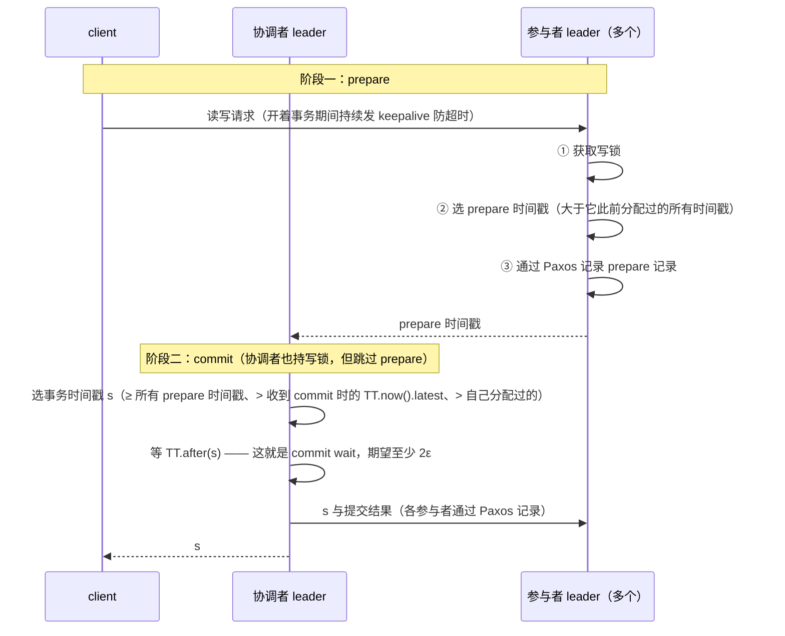

---
tags:
  - 分布式/存储
---

# Spanner 与 F1

Spanner（OSDI 2012 / TOCS 2013）是 Google 的**全球分布数据库**。前面几篇里，[GFS](01-GFS.md) 与 [Bigtable](02-Bigtable.md) 放弃了跨行的强一致，[Dynamo](03-Dynamo.md) 干脆把一致性做成可配置项 —— Spanner 走的是第三条路：**先把"一台机器能做到的事"当成目标，再用一个物理设施把它在全局范围内重新做出来。**

这个定位的表述是：Spanner 是**第一个在全球规模上提供这些保证的系统**，而关键使能者是 **TrueTime API 及其实现**。

F1 是 Spanner 的落地案例 —— Google 广告后端的重写，从**手工分片多份的 MySQL** 迁过来。

## 一个物理前提：TrueTime

传统分布式系统里"时间不可靠"是公理，所有设计都围绕**绕开时钟**展开（逻辑时钟、向量时钟、不依赖时序的安全性）。Spanner 反过来做：**它把时钟不确定性变成一个可以被代码读到的数值，然后为这个数值付代价。**

### API 的形状

TrueTime 把时间显式表示为 **TTinterval** —— 一个**带界时间不确定性**的区间，这与"返回一个时间点、不告诉你不确定度"的标准时间接口是根本区别。区间的端点类型是 **TTstamp**。

| 方法 | 语义 |
| --- | --- |
| `TT.now()` | 返回一个 TTinterval，**保证包含 `TT.now()` 被调用期间的真实绝对时间** |
| `TT.after(t)` / `TT.before(t)` | 前者的便捷包装 |

形式化保证是：对一次调用 $tt = \text{TT.now}()$，有

$$tt.\text{earliest} \le t_{abs}(e_{now}) \le tt.\text{latest}$$

其中 $e_{now}$ 是这次调用事件。定义**瞬时误差界 $\epsilon$** 为区间宽度的一半，**平均误差界 $\bar{\epsilon}$**。时间纪元类比 UNIX 时间，但用**闰秒涂抹（leap-second smearing）**。

### 实现：两类时间源与它们的失效模式

**为什么同时用 GPS 和原子钟** —— 理由是**它们的失效模式不同**：

| 时间源 | 失效模式 |
| --- | --- |
| **GPS** | 天线与接收机故障、本地无线电干扰、**相关故障**（闰秒处理错误这类设计缺陷、以及**欺骗 spoofing**）、GPS 系统级中断 |
| **原子钟** | 失效方式**与 GPS 不相关、彼此也不相关**；但**长期会因频率误差显著漂移** |

两类一起用，才能让"同时坏掉"成为不可能。

具体实现是**每个数据中心一组 time master 机器 + 每台机器一个 timeslave daemon**：

- **多数 master 带 GPS 接收机与专用天线**，这些 master **在物理上分散**，以降低天线故障、无线电干扰与欺骗的影响；
- **其余 master 装原子钟，称 "Armageddon masters"** —— 成本说明也很实在：**原子钟并不那么贵，一个 Armageddon master 的成本与一个 GPS master 同一量级**；
- **所有 master 的时间参考定期互相比对**；每个 master 也**核对自己的参考推进时间的速率与本地时钟**，**出现显著分歧就自我驱逐**；
- 每个 daemon **轮询多个 master**（附近数据中心与远处数据中心的 GPS master，加一些 Armageddon master），用 **Marzullo 算法的一个变体**检测并**剔除说谎者（liars）**，再把本地时钟同步到非说谎者；
- **同步之间，Armageddon master 公布一个缓慢增长的不确定性**（由保守施加的最坏情况时钟漂移推出）；**GPS master 公布的不确定性通常接近 0**；
- 为防止本地时钟坏掉，**频率偏移超过"由组件规格与运行环境推出的最坏情况界"的机器会被驱逐**。

### ε 的实际数字：一条锯齿

这是全篇最有用的一组具体数字：

- **生产环境中 $\epsilon$ 是时间的锯齿函数，在每个轮询周期内从约 1 ms 变到 7 ms；$\bar{\epsilon}$ 大部分时间是 4 ms**；
- 分解：**daemon 的轮询间隔目前是 30 秒，当前使用的漂移率设为 200 微秒/秒** —— 这两者一起解释了**锯齿的 0 到 6 ms 边界**；**剩下的 1 ms 来自到 time master 的通信延迟**；
- 故障时会超出锯齿：**偶发的 time master 不可用会造成数据中心范围的 $\epsilon$ 增大**，过载的机器与网络链路会造成**偶发的局部尖峰**。

**这里有一句决定性的边界说明**：

> **方差不影响正确性，因为 Spanner 可以等掉不确定性；但 $\epsilon$ 变得太大时性能会退化。**

这就把 TrueTime 的两条设计约束讲清楚了：**保守地报告不确定性对正确性是必要的，把不确定性边界保持得小对性能是必要的。**

### 实测数据里的两个真实事件

一组**跨距离达 2200 km 的数据中心、几千台 spanserver** 的实测给出了 $\epsilon$ 的 90/99/99.9 分位。采样方式是**在 timeslave daemon 刚轮询完 time master 后**，因此**略去了本地时钟不确定性造成的锯齿**，测的是 **time master 不确定性（一般是 0）+ 到 time master 的通信延迟**。

结论是这两个因素**在决定 $\epsilon$ 的基值时一般不是问题**，但**尾部延迟会造成更高的 $\epsilon$**。两个真实事件：

- 3 月 30 日开始的**尾部延迟下降**，原因是**网络改进减少了瞬时的链路拥塞**；
- 4 月 13 日 $\epsilon$ 增大（**持续约一小时**），原因是**一个数据中心的两台 time master 为例行维护而关闭**。

## 外部一致性：两条规则与四步证明

这是整篇的核心。Spanner 要保证的是**外部一致性**（等价于线性一致性的分布式版本），它可以化归成两条规则加一个传递性证明。

先定义事件：设写事务 $T_i$ 的提交请求到达其协调者 leader 的事件为 $e^i_{server}$，该事务的提交事件为 $e^i_{commit}$，事务 $T_i$ 分配的提交时间戳为 $s_i$。

> **Start 规则**：写 $T_i$ 的协调者 leader 分配的提交时间戳 $s_i$ **不小于"在 $e^i_{server}$ 之后计算的 $\text{TT.now}().\text{latest}$"**。
>
> **Commit Wait 规则**：协调者 leader 确保**客户端在看到 $T_i$ 提交的任何数据之前，$\text{TT.after}(s_i)$ 已为真**。这保证 $s_i$ 小于 $T_i$ 的绝对提交时间：$s_i < t_{abs}(e^i_{commit})$。

要维持的不变式是：若 $t_{abs}(e^1_{commit}) < t_{abs}(e^2_{start})$，则 $s_1 < s_2$ —— 也就是"真实时间上先完成的事务，时间戳必须更小"。

### 四步不等式链

**证明只有四步不等式链：**

$$
\begin{aligned}
s_1 &< t_{abs}(e^1_{commit}) && \text{（Commit Wait）} \\
t_{abs}(e^1_{commit}) &< t_{abs}(e^2_{start}) && \text{（前提假设）} \\
t_{abs}(e^2_{start}) &\le t_{abs}(e^2_{server}) && \text{（因果性）} \\
t_{abs}(e^2_{server}) &\le s_2 && \text{（Start 规则）} \\
\hline
s_1 &< s_2 && \text{（传递性）}
\end{aligned}
$$

**每一步都对应一个具体机制**：Commit Wait 把"时间戳"压到"提交时刻"之前；因果性保证请求到达不早于客户端发起；Start 规则把"请求到达时刻"压到"时间戳"之下。三段夹逼把两个时间戳的相对顺序和两个真实事件的相对顺序锁在一起。

**代价值得单独记住**：commit wait 里，协调者 leader 因为 $s$ 是基于 `TT.now().latest` 选的，而现在要等到那个时间戳保证成为过去，**所以期望的等待至少是 $2\epsilon$**。**这个等待通常与 Paxos 通信重叠** —— 这是它能被接受的原因。

## safe time：副本怎么判断自己够不够新

外部一致性给了"时间戳有意义"的保证，接下来要回答"某个副本能不能满足一次指定时间戳的读"。Spanner 的答案是 **safe time**：

> 每个副本跟踪 **$t_{safe}$ = 它已经是最新的最大时间戳**。**副本可以满足时间戳 $t$ 的读，当且仅当 $t \le t_{safe}$。**

$t_{safe}$ 取两者的较小值：

$$t_{safe} = \min(t^{Paxos}_{safe},\ t^{TM}_{safe})$$

- **$t^{Paxos}_{safe}$** 简单：**已应用的最高 Paxos 写的时间戳**。因为时间戳单调递增、写按序应用，所以在这个时间戳及以下不会再出现新写。
### $t^{TM}_{safe}$ 处理的那个不确定区间

- **$t^{TM}_{safe}$** 处理"已 prepare 但未提交"这个不确定区间：若无此类事务，它是 $\infty$；若有，那些事务影响的状态是**不确定的** —— 参与者的副本还不知道它们会不会提交。
  公式是

$$t^{TM}_{safe} = \min_i(s^{prepare}_{i,g}) - 1$$

  （对所有在 group $g$ 上 prepare 的事务取最小的 prepare 时间戳再减 1。）**之所以能减 1，是因为协调者保证提交时间戳 $s_i \ge s^{prepare}_{i,g}$。** 这条不等式把"我不知道它会不会提交"转成了"它提交的话时间戳至少是这个值"。

$t_{safe}$ 是两个上界的较小值，两个上界处理的是两类不同的不确定：

```
   副本能服务时间戳 t 的读  ⟺  t ≤ t_safe

   t_safe = min( t_safe^Paxos , t_safe^TM )
                  │                    │
                  │                    └─ 处理「已 prepare 但未提交」这一段不确定区间
                  │                          ├─ 没有这类事务 ⇒ ∞
                  │                          └─ 有 ⇒ min_i( s_i,g^prepare ) − 1
                  │                                （之所以能减 1：协调者保证
                  │                                  s_i ≥ s_i,g^prepare，于是
                  │                                  「我不知道它会不会提交」
                  │                                  被转成「它提交的话时间戳至少是这个值」）
                  │
                  └─ 已应用的最高 Paxos 写的时间戳
                        （时间戳单调递增、写按序应用
                          ⇒ 这个时间戳及以下不会再出现新写）
```

## 事务的三种形态

### 读写事务：客户端驱动的两阶段提交 + commit-wait

- 与 Bigtable 一样，**事务内的写缓冲在客户端直到提交**；因此**事务内的读看不到本事务写的效果**（读返回所读数据的时间戳，而未提交的写还没有时间戳）。这个设计在 Spanner 里成立是因为**时间戳是读的一部分**；
- 事务内的读用 **wound-wait** 避免死锁；
- 客户端向相应 group 的 leader replica 发读，leader 获取读锁后读最新数据；事务开着期间客户端**发 keepalive** 防止参与者 leader 判它超时；
- **由客户端驱动两阶段提交** —— 理由很具体：**避免数据跨广域网链路传送两次**；
- **非协调者参与者 leader**：① 先获取写锁；② 选一个 **prepare 时间戳**，要求它**大于它此前为任何事务分配过的所有时间戳**（保持单调性）；③ 通过 Paxos 记录 prepare 记录；
- **协调者 leader**：也先获取写锁，但**跳过 prepare 阶段**；在听到所有其他参与者 leader 的回复后为**整个事务**选时间戳 $s$，三个约束是
  $$s \ge \text{所有 prepare 时间戳},\quad s > \text{收到 commit 消息时的 } \text{TT.now}().\text{latest},\quad s > \text{该 leader 此前分配过的所有时间戳}$$
- **只有 Paxos leader 获取锁**；锁状态**只在 prepare 时记日志**。若 prepare 前锁已丢失（死锁避免、超时、Paxos leader 变更），参与者中止；**leader 变更时新 leader 先恢复已 prepare 但未提交事务的锁状态，才接受新事务**；
- 最后：**协调者等到 `TT.after(s)`**（就是 Commit Wait），然后才允许任何协调者副本应用提交记录；之后把 $s$ 发给客户端与其他参与者 leader，各参与者通过 Paxos 记录结果，**所有参与者以相同时间戳应用，然后释放锁**。

两阶段提交与 commit wait 的时序：



### 快照事务（只读）：先做 scope 推断，再挑最小可用时间戳

- 分配时间戳需要涉及读的所有 Paxos group 之间**协商**，所以 Spanner 要求每个快照事务带一个 **scope 表达式** —— **概括整个事务将读的键**。对独立查询，Spanner **自动推断 scope**；
- 若 scope 的值由**单个** Paxos group 服务，客户端就把快照事务发给该 group 的 leader（**当前实现只在 Paxos leader 上为快照事务选时间戳**）；
- **单点读有一个比 `TT.now().latest` 更好的选择**：定义 $\text{LastTS}()$ 为**某 Paxos group 最后一次已提交写的时间戳**。**若没有 prepared 事务，则赋值 $s_{read} = \text{LastTS}()$ 显然满足外部一致性** —— 事务会看到最后一次写的结果，因此排在它之后。**这样做还避免了读被 $t_{safe}$ 卡住**（而选 `TT.now().latest` 则可能需要阻塞等待 $t_{safe}$ 前进）；
- scope 跨多个 group 时，最复杂的方案是与所有 leader 协商 $s_{read}$；**Spanner 当前实现了一个更简单的选择**（避免协商轮次）。

快照事务的两步：先推断 scope，再据它挑时间戳。

```
   一次只读查询（快照事务）
        │
        ├─ ① 带一个 scope 表达式 —— 概括整个事务将要读的键
        │      （分配时间戳要跨 Paxos group 协商，scope 决定该找哪些 leader）
        │      └─ 对独立查询，Spanner 自动推断 scope
        ▼
   ② scope 的值由单个 Paxos group 服务？
        ├─ 是 ⇒ 把快照事务发给该 group 的 leader
        │        └─ 当前实现只在 Paxos leader 上为快照事务选时间戳
        │             └─ 单点读有一个比 TT.now().latest 更好的选择：
        │                  s_read = LastTS()（该 group 最后一次已提交写的时间戳）
        │                  ├─ 没有 prepared 事务时，它显然满足外部一致性
        │                  └─ 还避免了读被 t_safe 卡住
        │                     （选 TT.now().latest 可能要阻塞等 t_safe 前进）
        │
        └─ 否（跨多个 group）⇒ 最复杂的方案是与所有 leader 协商 s_read
               └─ 当前实现了一个更简单的选择，避免协商轮次
```

## 目录：复制与数据移动的单位

- **universe** = 一个 Spanner 部署（全局只有少数几个）；
- **zone** ≈ 一个 Bigtable 服务器部署，是**管理部署的单位**、**数据可被复制到的位置集合**、也是**物理隔离的单位**（一个数据中心里可能有多个 zone）；
- 一个 zone 有 **1 个 zonemaster** 和 **100 到几千个 spanserver**；**per-zone location proxy** 让 client 定位到服务其数据的 spanserver；
### 单例与自动移动

- **universe master** 是单例，主要是显示状态的控制台；**placement driver** 也是单例，负责**分钟级**的数据跨 zone 自动移动；
- **每个 spanserver 负责 100 到 1000 个 tablet**，tablet 实现 `(key:string, timestamp:int64) → string`。**与 Bigtable 不同，Spanner 给数据分配时间戳** —— 这是它更像**多版本数据库**而不是 KV 的地方；
- tablet 状态存在**一组 B 树状文件 + 一个预写日志**里，都放在 **Colossus**（GFS 的继任者）上；
- **每个 spanserver 在每个 tablet 上实现一个 Paxos 状态机**。有一条演进：**早期 Spanner 支持一个 tablet 多个 Paxos 状态机**（可以让复制配置有更多变化），**但因为复杂而放弃了**。

## 底层依赖：时间设施、Paxos 与 Colossus

三处依赖里，**第一处是这套设计独有的**：

| 依赖 | 形态 | 失效时的表现 |
| --- | --- | --- |
| **TrueTime 的时间设施**（GPS + 原子钟 + time master + timeslave daemon） | **独有** —— 别的系统都绕开时钟，它把时钟当成基础设施 | **$\epsilon$ 变大 ⇒ 性能退化**（正确性不受影响）；master 全挂才是真故障 |
| **Paxos**（每 tablet 一个状态机） | 通用 —— 多数派存活即可用 | 少数派不可用不影响；**leader 变更时要先恢复已 prepare 事务的锁状态** |
| **Colossus** | 通用 —— tablet 状态（B 树状文件 + 预写日志）的落点 | 数据面：读写延迟 |

**第一处为什么算"独有"**，值得说清：**它把"时间不可靠"这条公理换成了"时间的不确定性有界"。** 一连串后果由此展开：

- **FLP 的不可能性不再适用** —— 有界时钟误差等价于**有界不确定性**，也就把系统放进了**部分同步模型**；FLP 禁的是"纯异步 + 一个崩溃故障"那个组合；
- **"绕开时钟"的那一整套技巧都不需要了** —— 逻辑时钟、向量时钟这些设计的目标是"不依赖时序也能定序"，而 Spanner **直接把时序当成一个可读的量**；
- **代价是这套设施本身** —— 每个数据中心一组 time master、多数带 GPS 接收机（**物理上分散**以对抗干扰与欺骗）、其余装原子钟、每台机器一个 timeslave daemon、用 **Marzullo 算法的变体**剔除说谎者、**所有 master 的时间参考定期互相比对**、**出现显著分歧就自我驱逐**。**这是一整套独立运行的时钟基础设施，Spanner 的强一致是它上面的一个应用。**

**三处依赖的"可替换性"排序**：

| 层 | 能不能换 | 换的代价 |
| --- | --- | --- |
| **Colossus** | **能** —— GFS → Colossus 已经换过一次 | 只影响数据落点 |
| **Paxos** | **理论上能**（换别的共识协议） | 会牵动恢复路径的细节（prepared 锁状态） |
| **时间设施** | **不能** | **整套外部一致性证明都建在 $\epsilon$ 之上** |

**这条排序与前面几篇的形态一致：越靠近"证明所依赖的前提"，越难替换。** Dynamo 最难换的是成员模型，Spanner 最难换的是时间设施 —— 两者都是"结论所依赖的那个假设。

**一处与 Dynamo 的对照值得并记**：**两者都在"时间"上做了非常规选择，而方向正好相反。** Dynamo 用**向量时钟**表达因果关系、**不依赖物理时间**（它的"时间戳调和"只被列为三套用法之一）；Spanner **把物理时间做成一个可读的区间**，并接受为之付出的等待与设施成本。**同一个问题（事件先后）的两条极端路线，而两者都成立** —— 差别在于对"不确定性"的处理方式：**一个绕开它，一个量化它并等待。**

**时间设施的内部构造值得单独列一遍**，它解释了"为什么它能给出有界的不确定性"：

| 角色 | 构造 | 它挡的是哪种故障 |
| --- | --- | --- |
| **GPS master** | 带 GPS 接收机与专用天线，**物理上分散** | 天线故障、本地无线电干扰、欺骗、闰秒处理错误 |
| **Armageddon master** | 装原子钟 | GPS 的系统级中断与欺骗 —— 失效模式**与 GPS 不相关** |
| **timeslave daemon** | 每台机器一个，轮询多个 master | **单个 master 说谎或偏掉** —— 用 Marzullo 变体剔除说谎者 |
| **master 之间的定期比对** | 所有 master 的时间参考互相比对 | **某个 master 自己跑偏** —— 显著分歧就自我驱逐 |

**四个角色对应四类不同的失效，而目标只有一个：让"同时坏掉"变成不可能。** 成本说明也很实在 —— 材料明确说**原子钟并不那么贵，一个 Armageddon master 的成本与一个 GPS master 同一量级**。**这句话拆掉了一个常见的反对意见**：别人以为"原子钟"意味着难以承受的成本，实际它同量级。

**三处依赖合起来给出一条可迁移的判据**：**要判断一个系统能不能换掉某处依赖，看它的"结论"多依赖这一处** ——

- **Colossus** 只承担"数据放哪"，换掉它只需重新落盘（已经换过一次）；
- **Paxos** 承担"值怎么定下来"，换协议要重做恢复路径（prepared 事务的锁状态怎么恢复）；
- **时间设施** 承担"**时间戳的相对顺序与真实事件的相对顺序能不能被锁在一起**" —— 那是四步不等式链的全部内容，**换掉它等于换掉证明**。

**这条判据在别处也成立**：Dynamo 最难换的是成员模型（"去中心"这个身份依赖它），Bigtable 最难换的是"单一索引"（跨系统被继承的正是这条）。**每篇里"最难换的那一处"，就是它的身份所在。**

## F1：落地案例

- Spanner 从 **2011 年初**开始在**生产负载**下被实验性评估，作为 Google **广告后端 F1** 重写的一部分；
- 这个后端**原本基于手工分片多份的 MySQL**；
- **未压缩数据集有数十 TB** —— "与许多 NoSQL 实例相比不大，但**大到足以让分片 MySQL 出现困难**"。

这条对照对理解 Spanner 的定位有用：它的目标**是在一个中等规模、但需要强事务语义的数据集上，把手工分片的运维负担消掉**，而不是"比 NoSQL 更能装"。

## 参数与可调项

模型层的旋钮几乎全部围绕一个数：**$\epsilon$**。

| 旋钮 | 取值 | 换什么 |
| --- | --- | --- |
| **轮询间隔** | **30 秒** | 锯齿的上升区间（$\epsilon$ 随时间增长） |
| **假定的漂移率** | **200 微秒/秒** | 保守程度 —— 先假定跑得比规格快 |
| **$\epsilon$ 的锯齿范围** | **1–7 ms**，$\bar\epsilon$ 多数时间 **4 ms** | 正确性不敏感、**性能敏感** |
| **commit wait** | **期望至少 $2\epsilon$** | 提交延迟的下界 |
| **Paxos 组** | 每个 tablet 一个状态机 | 写延迟（多数派往返） |
| **每 spanserver 的 tablet 数** | **100 到 1000** | 单机负载粒度 |
| **zone 结构** | 一个 zone = 1 个 zonemaster + **100 到几千个 spanserver** | 复制与隔离粒度 |
| **placement driver** | **分钟级**跨 zone 自动移动 | 数据局部性 |
| **读的时间戳边界** | 强 / 有界限过时 / 精确过时 | 延迟 ↔ 陈旧度 ↔ 可重复性 |
| **`version_retention_period`** | **默认 1 小时，最长可配到 1 周** | 能回溯多久的历史版本 |

按六要素摊开三处。

**① $\epsilon$ 的锯齿（1–7 ms）** —— 它**由两个参数推出来**，而不是一个配置项：**30 秒轮询间隔 × 200 µs/s 漂移率 → 锯齿的 0 到 6 ms**，再加上**到 time master 的通信延迟 1 ms**。这条推导的价值在于说明：**$\epsilon$ 的大小是可以算出来的，而改它的两个旋钮各有代价。** 缩短轮询间隔会增加 master 的负载与网络流量；降低假定的漂移率会放松保守性，但可能在时钟异常时低估不确定性 —— 而**低估 $\epsilon$ 直接破坏正确性**。**所以这两个旋钮的方向是相反的：一个为性能而收紧，一个为正确性而放松。**

**② commit wait（期望至少 $2\epsilon$）** —— 语义是"协调者在允许任何副本应用提交记录之前，必须等到 $s$ 保证成为过去"。**它是这套系统里唯一一处"用等待换正确性"的地方**，而量级由 $\epsilon$ 决定 —— **$\epsilon$ 从 1 ms 涨到 7 ms，这笔等待跟着涨。** 什么时候能容忍？材料给的答案很关键：**这个等待通常与 Paxos 通信重叠**。也就是说，**当 $2\epsilon$ 小于 Paxos 往返时间时，它是免费的** —— 这条判据说明 commit wait **在 Paxos 往返里塞进一个上限**，而不只是"额外加 2ε 的延迟"；只有 $\epsilon$ 大到超过往返时间，它才开始显性收费。

**③ 读的时间戳边界（三种）** —— 如果 Dynamo 的形态是"三个可配置值（N/R/W）"，**Spanner 的对应物就是"读用哪个时间戳"这个选择**，而托管形态把它做成了显式选项：

| 边界 | 行为 | 代价 |
| --- | --- | --- |
| **强（默认）** | 读最新数据 | **不可重复** —— 并发写时两次强读可能不一致 |
| **有界限过时** | 在过时界限内**挑最新**，**在最近的可用副本上读、不阻塞** | 比精确过时**慢一点**；不可重复；**只能用于一次性只读事务**；**至少 10 秒的过时才拿到性能优势** |
| **精确过时** | 在指定时间戳读，**会阻塞**直到冲突事务完成 | **不需要协商阶段，比等效的有界限过时稍快**；结果更旧 |

**这张表有一处反直觉**：**"更精确"的那个反而更快**（精确过时不需要协商阶段），而"能选最新"的那个要付一次跨越或等待。**选哪个取决于你更在意"结果多新"还是"延迟多低"**，而"至少 10 秒才拿到优势"这条数字，把"要不要用 staleness"变成了一个可以算的决定。

**最后一条：`version_retention_period`（默认 1 小时，最长 1 周）** —— 它决定**"能读多久以前的版本"**，也就是 staleness 读能走多远。**默认 1 小时意味着：更早的版本已被 GC，任何指向更早时间戳的读都会失败。** 这条默认值把"历史版本的保留"与"存储开销"直接挂钩 —— 要更长的回溯窗口，就得留更多版本。

## 版本演进：从一份设计到一项服务

**这篇的演进线很短，但方向很干净：它的核心创新没有被改进过，而是被"产品化"了。**

**第一条：Spanner 自己。** 2012 年 OSDI 发表（TOCS 2013），而它**2011 年初就已在生产负载下被评估** —— 作为 Google 广告后端 **F1 重写**的一部分。**F1 的迁移目标很具体**：从**手工分片多份的 MySQL** 迁过来，未压缩数据集只有**数十 TB**。材料自己把它说成"与许多 NoSQL 实例相比不大，但**大到足以让分片 MySQL 出现困难**"。**这句话框定了定位：它消掉的是手工分片的运维负担，而不是比 NoSQL 更能装。**

**第二条：时间设施这条线，可迁移的是"把不确定性量化"这个想法本身。** 它的价值不在 GPS 或原子钟，而在**那个接口的形状** —— **返回一个区间、并明确给出误差界限**，而不是返回一个点、假装它是准的。**凡是"绕开时钟"的设计，前提都是时间接口给不出不确定度**；Spanner 只是换了一个能给出不确定度的接口。**换句话说，它的一部分创新在 API 设计上，而不在硬件上。**

**第三条：与 Dynamo 的对照，是本栏最值得并读的一组。** 两篇回答同一个问题（全球分布下的事件定序），答案却相反：

| | Dynamo | Spanner |
| --- | --- | --- |
| **定序依据** | **向量时钟**（因果关系，不依赖物理时间） | **TrueTime**（物理时间 + 显式不确定性） |
| **一致性** | 可配置的弱一致 | **外部一致性**（线性一致的分布式版） |
| **可用性代价** | 永远可写，冲突交给应用合并 | **提交时等 commit wait**（$2\epsilon$） |
| **设施代价** | 无特殊硬件 | **GPS + 原子钟 + time master 一整套** |
| **运行前提** | 业务能接受暂时不一致 | **装得下 GPS 与原子钟**（因此是数据中心） |
| **推出的托管服务** | DynamoDB | Cloud Spanner |

**最后一行是这组对照的关键**：**两条路线各自推出了一个托管服务** —— 也就是说**它们都被验证为可以产品化**。这否掉了"谁淘汰了谁"这类问题：**它们解决的是不同的问题**，一个回答"永远能写且最终一致"，一个回答"全球范围的外部一致"。

**一条判断**：**Spanner 的长期影响在于它证明了"强一致可以在全球规模上做到"，而它靠的不是更聪明的算法，是一个物理设施。** 这条结论对后来者很具体：**如果你也想要这套保证，先问自己能不能装上那套时钟** —— 不能，就得在 $\epsilon$ 之外找别的路（或退回到更弱的同步假设上）。**这是"强一致不是免费的"最直白的一次定价。**

**三处演进合起来，能看出一条与本栏其他几篇相反的规律**：

| | GFS / Bigtable / Dynamo 那条线 | Spanner 这条线 |
| --- | --- | --- |
| **被改进的是什么** | 架构（元数据分片、换冗余方式、解耦分区与放置） | **几乎没有** —— 核心机制在设计说明里就定稿了 |
| **被"产品化"的是什么** | 底层实现（开源实现、托管服务） | **同一套机制**（云服务与内部版共享同一套东西） |
| **验证方式** | 规模与参数表 | **生产负载**（F1 的重写从 2011 年初就在跑） |
| **留下的可迁移物** | 数据模型、格式、机制 | **一个接口形状**（返回区间 + 不确定度） |

**第一行最值得记**：**Spanner 的架构在设计说明里就基本定稿了，后面没被改过。** 本栏前几篇都经历了"架构被现实修正"（GFS 的单 master 撞墙、Dynamo 的分区方式换过三次），而 Spanner 需要改的是**外围**（设施部署、读边界的暴露方式）。**这条差别来自它的瓶颈不在架构上，而在物理设施上** —— 而设施是花钱就能铺开的，不需要重新设计。

**第四行是它对后世最实际的影响**：**"返回带界不确定性"这个接口形状，比它的任何具体机制都更容易被借用。** 一套用逻辑时钟的系统，如果某天获得了有界的时钟误差，它需要的改动主要是"把时间从点改成区间"。**接口形状决定了别人的迁移成本** —— 这一点在 Bigtable 那篇里以"数据模型被照抄"的形式出现过，这里是"接口被借用"。

**一条判断**：**如果要给这一栏系统排一个"创新有多难被复制"的序列，Spanner 大概排在最难的一端** —— 它的机制可以被写进设计说明，但它需要的那套设施、以及"愿意为强一致付设施成本"这个决策，都不是读一份设计说明能拿到的。**这也解释了为什么它后来是以 Cloud Spanner 的形式出现的，而不是以一堆开源 fork 的形式。**

## 不适用于什么：代价落在哪

**这套设计的边界可以全部追到一个数：$\epsilon$。**

| 你想要的 | 能不能给 | 代价 / 前提 |
| --- | --- | --- |
| **全球外部一致** | **能** | **必须有那套时间设施**（GPS + 原子钟 + time master） |
| **跨地域的低写延迟** | **代价很大** | **提交要等 commit wait（$2\epsilon$）+ Paxos 多数派往返** |
| **读的延迟很低** | **能** —— 用 staleness 读 | **放弃"读到最新"**；有界限过时**至少要 10 秒**才拿到性能优势 |
| **可重复读** | **不能靠"强读"** | **强读不可重复**；要一致就在同一事务里读，或用精确过时钉时间戳 |
| **回读很久以前的历史版本** | **有限** | **`version_retention_period` 默认 1 小时、最长 1 周**；更早的已被 GC |
| **在没有专用硬件的环境里跑** | **不能** | 整套保证建在"$\epsilon$ 有界"上；没有时钟设施就给不出有界的 $\epsilon$ |
| **比 NoSQL 更能装** | **不是它的目标** | F1 的规模只有**数十 TB** —— 它解决的是事务与运维，不是容量 |

三处最值得记住的：

**第一，"强读不可重复"这一条是反直觉的。** 直觉上"强"应该什么都好，但材料写得很清楚：**如果存在并发写，两次连续的强只读事务可能返回不一致的结果** —— 因为它们各自读"自己开始时刻的最新"，而两次之间可能有新提交。**要跨读一致，只能在同一个事务里读，或者用精确过时钉一个时间戳。** 这条边界经常被忽略，而它决定了一个应用能不能"先读一次拿基线、再读一次做对比"。

**第二，"至少 10 秒的过时才有性能优势"把 staleness 变成了可算的决定** —— **落点在于"过时到足够长（10 秒量级）才能选到不需要等 $t_{safe}$ 前进的副本"，而不在"过时就能更快"。**低于这个量级，staleness 读拿不到好处，却仍要付结果更旧的代价。

**第三，"数十 TB"这个规模锚点是这套设计最重要的自我限定。** 它说明 **Spanner 解决的是"事务与运维"问题，而不是"容量"问题** —— 前面几篇（Bigtable、Dynamo）都在争"能装多大"，它争的是"能不能在分片之上保住事务语义、而不用人工分片"。**判断一个场景适不适合它，看的是"事务需求 + 运维痛点"，而不是数据量。**

**一处与前面几篇呼应的判断**：这一栏里，"能不能用"这个问题有四种不同的答案形态 —— **GFS 问"文件数与顺序访问"、Bigtable 问"能不能用单一主键表达、schema 定不定得下来"、Dynamo 问"冲突能不能自动合并"、Spanner 问"装不装得上时钟"**。**四个问题各问一处，正好说明这套系统们的边界不在同一个维度上。**

**把这张表按"代价落在谁身上"再切一次，会更清楚**：

| 代价 | 落在谁身上 | 具体表现 |
| --- | --- | --- |
| **时钟设施的建造成本** | **部署方** | 每个数据中心一组 time master + 每台机器一个 daemon |
| **$2\epsilon$ 的提交等待** | **写路径** | 跨地域更明显；常态下与 Paxos 往返重叠 |
| **staleness 带来的结果陈旧** | **读侧的业务** | 换来"不阻塞"与"可就近读" |
| **不可重复读** | **应用设计** | 想跨读一致就得用同一事务或钉时间戳 |
| **历史窗口有限** | **依赖回读的运维动作** | 超过 1 小时（默认）的旧版本读不到 |

**这条切法的用处是：把"要不要用 Spanner"换成四个可以分别回答的问题。** 例如一个只要"点查 + 偶尔按时间点回读"的应用，第二行和第四行的代价它根本不付 —— **它只需关心"装不装得上时钟"与"1 小时的窗口够不够"。** 而一个高频跨地域写的应用，第二行就是它的主要成本。

**第四行最容易被忽略**：**这个代价落在"应用设计"上，而不是落在系统上。** 这条与 Dynamo 那一篇形态完全一致 —— 两者都把一部分复杂度推给了应用（那里是"必须能合并冲突"，这里是"必须自己保证跨读一致"）。**本栏里凡是要"绕开某个系统级代价"的设计，都能看到同一笔转移：系统省下的，应用要补上。** 判断一笔取舍划不划算，就看那个应用是否本来就要做这件事。

## 排查：从症状到判据

| 症状 | 判据 | 先看什么 | 常见归因 |
| --- | --- | --- | --- |
| **提交延迟整体上升** | $\epsilon$ 是否变大 | timeslave daemon 报的 $\epsilon$ | **commit wait 随 $\epsilon$ 上涨**（$2\epsilon$）；也可能跨地域 Paxos 往返本身在涨 |
| **$\epsilon$ 间歇性尖峰** | 是不是过载的机器或网络链路 | $\epsilon$ 的时间序列与网络指标 | **局部尖峰** —— 材料明确说过载的机器与链路会造成偶发的局部尖峰 |
| **某个数据中心范围的 $\epsilon$ 变大** | time master 是否可用 | 该 DC 的 master 数与状态 | **time master 不可用**（材料记过一次：两台 master 例行维护导致 $\epsilon$ 持续约一小时） |
| **读卡住不返回** | 选的时间戳是否大于 $t_{safe}$ | $t_{safe}$ 与所读时间戳 | **$t^{TM}_{safe}$ 被"已 prepare 未提交"的事务拉住** |
| **同一查询两次结果不一致** | 用的是不是"强读"或有界限过时 | 读的时间戳边界 | **这两者都不可重复**（有并发写时）；要重复就读同一事务或用精确过时 |
| **原先能读的旧时间戳突然报错** | 该时间戳是否超出保留窗口 | `version_retention_period` | **版本已被 GC** —— 默认保留 1 小时 |
| **跨地域提交慢得不成比例** | commit wait 与 Paxos 往返谁占主导 | 两段的耗时分解 | **$\epsilon$ 超过往返时间后，commit wait 开始显性收费** |
| **节点被驱逐 / 退出** | 频率偏移是否超界 | daemon 的自我驱逐日志 | 本地时钟坏掉，或偏移超出"由组件规格与运行环境推出的最坏情况界" |

**三条判读原则：**

1. **先分清"正确性问题"与"性能问题" —— 这一篇的分界线特别清楚。** 材料有一句决定性的说明：**"方差不影响正确性，因为 Spanner 可以等掉不确定性；但 $\epsilon$ 变得太大时性能会退化。"** **所以 $\epsilon$ 变大时，第一件事是判断"它还在不在正确的范围内"** —— 在，就是纯性能问题；不在（保守估计被打破），才是另一类事情。
2. **把 commit wait 与 Paxos 往返分开看。** 这两段在正常情况下**重叠**，所以"提交延迟"的构成平时看不出来；**只有当 $\epsilon$ 大到超过往返时间，commit wait 才显性收费**。判据是**做一次分段计时** —— 否则会把"$\epsilon$ 变大"误判成"网络变慢"。
3. **读的延迟问题，先问"用的是哪种时间戳边界"。** 三者的延迟特征完全不同（有界限过时能选最近可用副本、精确过时不需要协商、强读最严格）。**在确认边界之前调别的参数，等于在错误的地方找瓶颈。**

**最后一条经验与这套系统的取向一致**：**它的性能问题几乎都指向"时间"这一处** —— $\epsilon$ 的锯齿、commit wait 的长度、$t_{safe}$ 的前进速度、保留窗口的长短。**因为它的正确性证明完全建在时间上，所以时间的任何抖动都会在性能上留下痕迹。** 这是"把不确定性量化"这个选择的另一面：**你获得了一个可以推理的量，同时也获得了一个必须持续监控的量。**

**把三条原则收成一个顺序**：**先看 $\epsilon$（是不是变大了、为什么变大）→ 再看 commit wait 与 Paxos 往返的分解 → 最后看读用的是哪种边界。** 这个顺序的道理在于：**前两处的因果是单向的**（$\epsilon$ 影响 commit wait，而 commit wait 不反过来影响 $\epsilon$），所以从上游往下游查；而"读的延迟"是另一条独立链路，它不吃 $\epsilon$ 的账（有界限过时读甚至能绕开 $t_{safe}$ 的等待）。

**一处与观测对接的做法**：材料里那份跨 2200 km、几千台 spanserver 的实测，采样点选得很讲究 —— **在 timeslave daemon 刚轮询完 time master 之后采样**，于是"略去了本地时钟不确定性造成的锯齿"，测到的正是 **time master 不确定性（一般是 0）+ 到 master 的通信延迟**。**这个选择说明一件可迁移的事：$\epsilon$ 的两个来源（本地漂移、通信延迟）要用不同的采样点分开测** —— 混在一起只能得到一个偏大的合成值，无法判断该改轮询间隔还是该改网络。

## 判据速查

| 问题 | 答案 |
| --- | --- |
| TrueTime 与传统时间接口的根本区别 | 它**显式返回一个带界不确定性区间**，而不是一个时间点 |
| 为什么同时用 GPS 和原子钟 | **两者失效模式不相关**：GPS 有欺骗/干扰/闰秒处理错误，原子钟会长期漂移 |
| Armageddon master 是什么 | 装原子钟的 time master；成本与 GPS master **同一量级** |
| daemon 怎么防说谎的 master | 轮询多个 master，用 **Marzullo 算法的变体**剔除说谎者 |
| $\epsilon$ 的实际值 | 锯齿，**每个轮询周期 1–7 ms**，$\bar{\epsilon}$ 大部分时间 **4 ms** |
| 锯齿怎么来的 | **30 秒轮询 + 200 µs/s 漂移率 → 0–6 ms；通信延迟贡献 1 ms** |
| 不确定性大了会怎样 | **正确性不受影响**（可以等），**性能退化** |
| 外部一致性靠哪两条规则 | **Start**（时间戳 ≥ 请求到达后算的 `TT.now().latest`）+ **Commit Wait**（客户端看到数据前 `TT.after(s)` 已为真） |
| Commit Wait 的证明作用 | 它给出 $s_1 < t_{abs}(e^1_{commit})$，与 Start 的 $t_{abs}(e^2_{server}) \le s_2$ 夹逼出 $s_1 < s_2$ |
| Commit Wait 的代价 | **期望等待至少 $2\epsilon$**，但**通常与 Paxos 通信重叠** |
| 副本怎么判断能否满足某个时间戳的读 | $t \le t_{safe}$，而 $t_{safe} = \min(t^{Paxos}_{safe}, t^{TM}_{safe})$ |
| $t^{TM}_{safe}$ 为什么减 1 | 因为协调者保证 $s_i \ge s^{prepare}_{i,g}$，所以 pending 事务的时间戳至少是 prepare 时间戳 |
| 谁驱动两阶段提交 | **客户端** —— 避免数据跨广域网链路传送两次 |
| 协调者 leader 为什么可以跳过 prepare | 它是协调者，只需在听到所有参与者回复后为整个事务选时间戳 |
| 事务内的读能看到本事务的写吗 | **不能** —— 写缓存在客户端，未提交的写还没有时间戳 |
| 快照事务为什么要 scope 表达式 | 分配时间戳需要跨 Paxos group 协商，scope **概括将读的键**，从而知道要找哪些 leader |
| 单点读为什么用 `LastTS()` 而不用 `TT.now().latest` | 前者**显然满足外部一致性**，且**避免因 $t_{safe}$ 未前进而阻塞** |
| Spanner 与 Bigtable 的关键差别 | **Spanner 给数据分配时间戳**，因此更像多版本数据库 |
| 复制单位是什么 | **每个 tablet 上一个 Paxos 状态机**；早期一个 tablet 多个 Paxos 状态机**因复杂被放弃** |
| F1 的原始架构与规模 | **手工分片多份的 MySQL**；未压缩数据**数十 TB** |

**再补几行**（覆盖本轮补进来的内容）：

| 问题 | 答案 |
| --- | --- |
| 哪一层最难替换 | **时间设施** —— Colossus 已换过一次（GFS → Colossus），Paxos 理论上可换，而整套外部一致性证明都建在 $\epsilon$ 上 |
| $\epsilon$ 是怎么算出来的 | **30 秒轮询 × 200 µs/s 漂移率 → 锯齿 0–6 ms**，再加**到 time master 的通信延迟 1 ms** |
| 为什么两个旋钮方向相反 | 缩短轮询间隔是为性能，降低假定漂移率是为保守性 —— 而**低估 $\epsilon$ 直接破坏正确性** |
| commit wait 什么时候是"免费"的 | **当 $2\epsilon$ 小于 Paxos 往返时间时** —— 它与通信重叠 |
| 三种读边界各自的关键代价 | 强读**不可重复**；有界限过时**要 10 秒以上才有优势**且只能用于一次性只读事务；精确过时**结果更旧但更快** |
| 历史版本能留多久 | **`version_retention_period` 默认 1 小时、最长 1 周** |
| 它的规模锚点 | F1 的未压缩数据**数十 TB** —— 这是自我限定：解决的是事务与运维，不是容量 |
| 这一栏四篇各自问的那个"能不能用" | GFS 问**文件数与顺序访问**；Bigtable 问**单一主键能不能表达、schema 定不定得下来**；Dynamo 问**冲突能不能自动合并**；Spanner 问**装不装得上时钟** |

**这张表的用法**：**它把这一篇和本栏前几篇串起来了** —— 四个系统各自被一个问题卡住，而问题的维度互不相同。**读一栏资料时，把"每篇卡在哪一维"列出来，比记住每篇的机制更有用**，因为它直接给出了选型时的对照表。

**最后三条结构性判断：**

1. **把"时间不确定"从公理改成可读的量** —— 这是整套设计的起点，也是它唯一不可能被替换的那一层；
2. **把强一致的代价定价为"$2\epsilon$ 的等待"** —— 并且让这笔等待与通信重叠，从而使它在常态下基本免费；
3. **把"要读多新"做成应用侧的选择** —— 强 / 有界限过时 / 精确过时三种边界，对应三种延迟与陈旧度的组合。

**三条合起来构成本栏里最反直觉的一组取舍**：**别的系统都在"绕开"不确定性，这一篇选择"量化并等待"不确定性** —— 代价是一整套时钟设施，换来的是一个可以被证明的外部一致性。

## 相关

- [[01-GFS|GFS]] / [[02-Bigtable|Bigtable]] —— Spanner 的 tablet 状态存在 **Colossus**（GFS 继任者）上，Paxos 状态机叠在 Bigtable 式的 tablet 抽象上；本层补上了那两层缺的跨行事务
- [[03-Dynamo|Dynamo]] —— 同一问题的另一条路线：Dynamo 用可配置弱一致换可用性，Spanner 用**物理时钟设施**把强一致拿回来
- [[01-不可能性结果：FLP 与部分同步|FLP 与部分同步]] —— TrueTime 本质上把系统**放进了部分同步模型**（有界时钟误差 = 有界不确定性），于是 FLP 的不可能性不再适用；代价是依赖 GPS 与原子钟这套物理设施
- [[04-Zab 与 ZooKeeper|Zab 与 ZooKeeper]] —— 另一种"用时间换一致"的思路：Zab 用 epoch 做逻辑时钟，Spanner 用 TrueTime 做物理时钟

## 参考

- J. C. Corbett, J. Dean, M. Epstein, A. Fikes, C. Frost, J. J. Furman, S. Ghemawat, A. Gubarev, C. Heiser, P. Hochschild, W. Hsieh, S. Kanthak, E. Kogan, H. Li, A. Lloyd, S. Melnik, D. Mwaura, D. Nagle, S. Quinlan, R. Rao, L. Rolig, Y. Saito, M. Szymaniak, C. Taylor, R. Wang, D. Woodford. *Spanner: Google's Globally-Distributed Database*. OSDI 2012（TOCS 31(3), 2013）.
- J. Shute, M. Oancea, S. Ellner, B. Handy, E. Rollins, B. Samwel, R. Vingralek, C. Whipkey, X. Chen, B. Jegerlehner, K. Littlefield, P. Tong. *F1: A Distributed SQL Database That Scales*. VLDB 2012.
- Google Cloud. *Timestamp bounds*（官方文档：强 / 有界限过时 / 精确过时三种边界，以及 `version_retention_period` 默认 1 小时、最长 1 周）. https://cloud.google.com/spanner/docs/timestamp-bounds
