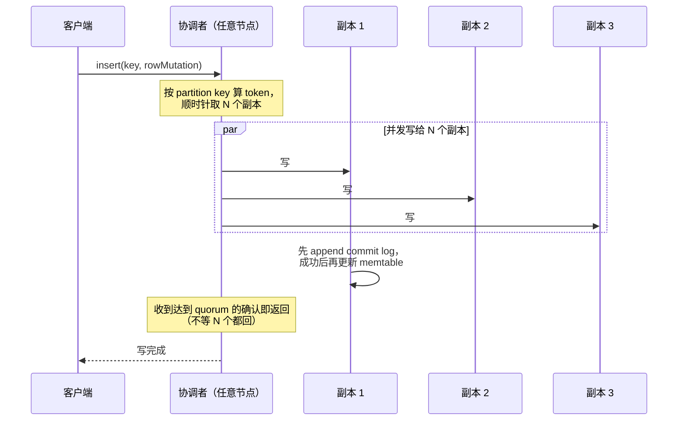
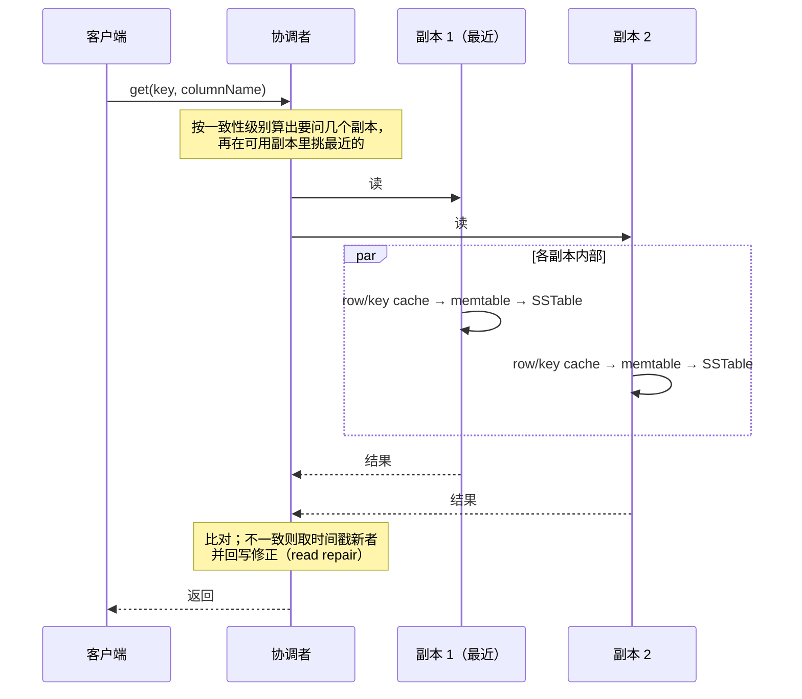
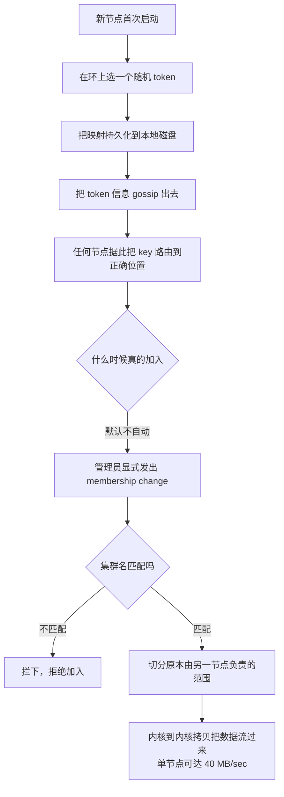

---
tags:
  - 分布式/存储
---

# Cassandra

Cassandra（2009）是 Facebook 为 **Inbox Search** 写的存储系统，后来开源。它在这条线上的位置很好定位：**用 Dynamo 的分布式方案（一致性哈希 + gossip + 无中心）套 Bigtable 的数据模型**。

需求很具体：Inbox Search 要**每天处理数十亿次写**，还要随用户数扩展；用户从**地理分布的数据中心**被服务，所以**跨数据中心复制**是压低搜索延迟的关键。系统 **2008 年 6 月上线时约 1 亿用户，两年后超过 2.5 亿**，并已成为 Facebook 内多个服务的后端。

设计目标一句话：**跑在廉价商品硬件上，处理高写吞吐而不牺牲读效率。**

## 数据模型：Bigtable 那套，加一层 super column

这个数据模型**与 Bigtable 非常相似**。两处不同：

- **两类 column family**：**Simple** 与 **Super**。**Super column family 可以看作"column family 里再套一个 column family"**；
- **应用可以指定列在 family 内的排序顺序** —— 系统允许按**时间**或按**名字**排序。**按时间排序被 Inbox Search 这类应用直接利用**（结果本来就按时间倒序显示）。

访问约定区分了两种深度：

```
普通列：      column family : column
super 内：    column family : super column : column
```

一条部署现实：**系统支持多表的概念，但所有部署的 schema 里只有一张表**。

**API 只有三个方法**，这是 Denormalization（反范式）式设计的直接后果：

- `insert(table, key, rowMutation)`
- `get(table, key, columnName)`
- `delete(table, key, columnName)`

`columnName` 可以指向 family 内的具体列、一个 column family、一个 super column family，或 super column 内的一列。

**请求路由**：读写请求通常被路由到集群里**任意一个节点**，由该节点确定这个 key 的副本。

- **写**：把请求路由到副本，**等一个副本 quorum 确认写完成**；
- **读**：**根据客户端要求的一致性保证**，要么路由到**最近的副本**，要么路由到**所有副本**并等 quorum 响应。

### 从 column family 到 CQL 表：模型没变，表达变了

今天用 CQL 建表，同一套模型换了个写法：`PRIMARY KEY (a, b)` 里第一个分量是 **partition key**（决定这个 key 落到环上哪个位置），后面的分量是 **clustering key**（决定同一分区内的物理顺序）。设计里那条"应用可以指定列在 family 内的排序顺序"，现在就是建表时的 `CLUSTERING ORDER BY`。

它有一个不能事后改的属性：**`CLUSTERING ORDER BY` 在表建好之后改不了**，并且直接约束"哪些查询能做"。把分区内顺序固定成时间倒序，按时间倒序的范围查询就是顺序读；反过来查就要扫完整个分区。

两处与设计不同的地方值得记：

- **复制因子不再按实例配。** 设计里写的是"N 是按实例配置的复制因子"；现在是 **keyspace 级**的 `replication` 表项，同一个集群里不同 keyspace 可以有不同复制因子和不同策略（`SimpleStrategy` / `NetworkTopologyStrategy`）。
- **"所有部署只有一张表"这条限制没了。** 一个 keyspace 下可以有任意多张表；`durable_writes`（这个 keyspace 的更新是否走 commit log）也挂在 keyspace 上，默认 `true`。

表级的可调项是另一层，都是这套模型在生产里必须交代的东西：压缩（默认 `LZ4Compressor`，`chunk_length_in_kb` 默认 64）、缓存（key cache 默认 `ALL`，row cache 默认 `NONE`）、compaction 策略、`bloom_filter_fp_chance`（默认 `0.00075`）、`gc_grace_seconds`（默认 864000 秒，即 10 天）。`## 参数与可调项` 会把它们摊开。

### 反范式的三条后果

三个 API、没有 join，这三条后果要在数据建模阶段就付掉：

- **一份数据按查询展开写多次。** 同一个值可能同时存在于多张表、多个列里，写时展开、读时取一份。代价是空间与写放大，收益是每个查询只碰一个分区。
- **删除是一次写。** 删除不抹掉数据，而是写入一个 **tombstone（墓碑标记）**，同 key 的旧值在读到它时被判为已删。墓碑要留一段时间才能清理，这段时间就是 `gc_grace_seconds`，**默认 864000 秒（10 天）**。这个值同时是**反熵的等待窗口**：它表示"超过这个时长之后，落后的副本不再有机会收到那条删除"。调小它加快墓碑回收，代价是把"某副本长期离线后带着旧数据回来"变成数据复活。
- **一致性在查询时定，不在 schema 里定。** 同一张表，一次读要几个副本答复是查询时指定的。配套的两个表级默认值也在这条线上：`read_repair` 默认 `BLOCKING`（读时发现副本不一致就阻塞着修），`speculative_retry` 默认 `99PERCENTILE`（某个副本慢过本表的 p99 就再问一个副本）。前者保证读到的结果新，后者保证一个慢副本不拖住整次读。

## 一次读写走完的路径

请求可以落在集群里任意一个节点上，那个节点成为这次请求的**协调者**：它按 partition key 算出 token，找到该 token 的 N 个副本，再由自己出面把请求转过去。



**写路径的关键只有两条**：写**先落 commit log、成功之后才更新内存结构**；返回的时机是**一个 quorum 的确认**，不是全部副本。后一条决定了"一个副本挂掉不影响写"这件事靠 quorum 达成，不靠重试。

读路径分两层决策。**协调者层面**：按客户端给的一致性级别决定发给几个副本 —— 只要可用性就问最近的副本，要强一致就问所有副本并等 quorum。**单个副本内部**：先查内存结构，再按**从新到旧**的顺序查磁盘文件，见 `### 读路径：memtable → SSTable → Bloom filter`。

**冲突解决用的是时间戳，不是向量时钟。** 每个写入带时间戳，同 key 的多个版本按时间戳大者取胜。这一条划出了 Cassandra 与 Dynamo 的分工差异：Dynamo 把"要不要保留冲突、交给谁合并"做成显式选择，Cassandra 直接按时间戳裁定。**代价是丢更新（lost update）不会被发现** —— 两个客户端几乎同时写同一个 key，后到的那条覆盖前一条，系统不会告诉任何人发生过竞争。这是它与 [[03-Dynamo|Dynamo]] 那套"向量时钟 + 应用合并"最实质的分歧。

读路径的协调者层面有一处与写路径不对称的地方：**写是"发给所有副本、等够级别"，读是"只发给够级别的副本"**。于是读的副本选择本身成了一个可调点 —— 协调者要先按一致性级别算出"要问几个副本"，再在可用的副本里挑最近的几个。跨数据中心时这个选择直接决定延迟：`LOCAL_ONE` / `LOCAL_QUORUM` 的读不会跑到远端，`ONE` / `QUORUM` 则可能。



**两张图放在一起看，能读出这套设计的一个基本取向**：写路径把"要多少个答复"交给一致性级别，读路径把"要问多少个副本"也交给它，两者用同一个 `W + R > RF` 绑定。**代价是级别选错不会报错，只会让读悄悄变旧** —— 这是把一致性推给查询侧时一并推出去的责任。

还有一处细节值得记：**写入带的时间戳由客户端给，协调者与副本都不改写它。** 这让重放变得简单（同一条变更带同一个时间戳重放多少次都只算一次），也让"客户端时钟"从实现细节升级成了系统前提。

## 分区：也用了保序哈希

Cassandra 的分区也是**一致性哈希**，但有一个关键区别：

> **它用的是保序的哈希函数（order-preserving hash function）。**

这条改动的意图是让"哈希后相邻的 key，其原始 key 也相邻" —— 于是**范围扫描可以在环上顺序进行**。Dynamo 那套随机哈希组织 KV 没问题，但支持不了范围查询。

基础一致性哈希的两个问题与 Dynamo 诊断的完全一样：

1. **节点在环上的位置是随机的**，导致数据与负载分布不均；
2. 算法**对节点性能的异构性一无所知**。

**但 Cassandra 选的解法与 Dynamo 不同。** 两种方式：

- **① 节点在环上占多个位置** —— 也就是 Dynamo 的虚拟节点；
- **② 分析环上的负载信息，让轻载节点在环上移动，以分担重载节点**。

> **Cassandra 选择了后者**，理由是它让**设计与实现"非常可控"（very tractable）**，并且**让负载均衡的决策变得非常确定（deterministic）**。

这是一个值得记的取舍：虚拟节点把均衡问题交给随机化（位置多了自然均匀），移动 token 则把它交给一个可预测的控制回路。**前者靠概率，后者靠调度。**

### 保序哈希换来的范围扫描，和它换掉的负载均衡

保序哈希让"哈希后相邻的 key，其原始 key 也相邻"，于是范围扫描能在环上顺序进行。代价落在负载上：**连续写入的 key（时间戳、自增 id、日志序列）会哈希到环上相邻的位置**，这些位置归少数节点负责，热点就这么来的。随机哈希把顺序打散，负载自然均匀，代价是跨分区的范围扫描没法做了。

今天的分区器是 `Murmur3Partitioner`：**随机哈希，不支持跨分区的范围扫描**。官方文档对另外三个（`RandomPartitioner`、`ByteOrderedPartitioner`、`OrderPreservingPartitioner`）的说法是"**仅为向后兼容保留**"，并明确要求新集群不要改这个值。

那条路是这样绕过去的：**范围查询改在分区内部做** —— 用 clustering key 的 `CLUSTERING ORDER BY` 保证分区内有序，一个分区内的范围读就是顺序读；跨分区按非主键列找，用二级索引（5.0 起是 SAI）。**保序哈希当初想一次解决两件事（均衡与范围扫描），后来被拆成两处各自解决：均衡交给随机哈希，范围交给键内的 clustering 顺序。**

### 虚拟节点：从"移 token"到"每人多 token"

设计里明确选了"分析环上负载、让轻载节点移动 token"，理由是这样**可控**且**确定**。后来的实现走了另一条路：**给每个物理节点分配多个 token，也就是虚拟节点（vnode）。**

官方的术语划得很细：**token** 是环上一个位置，**endpoint** 是一个物理 IP 加端口，**host id** 是一个"物理节点"的唯一标识，**vnode** 是同一个 host id 拥有的一个 token。多 token 换来三件事：新增节点时从环上多个邻居各取一部分数据，**分布自动接近均匀**；下线一个节点时它的数据同样均匀散给其他节点；一个节点失效时查询负载摊到很多节点上，而不是全压给它的下一个后继。

### 它自己承认的三条代价

**代价官方自己也列了三条**，这是这套方案最该记住的部分：

- **每个 token 最多引入 `2 * (RF − 1)` 个额外邻居** —— 邻居组合越多，"某段环同时失去足够副本"的组合就越多，**集群整体的不可用概率随 token 数上升**；
- **集群级维护变慢**：repair 的操作次数随每节点 token 数上升（每个 token 范围都要单独修）；
- **跨 token 范围的操作性能受影响**。

数量本身也演进过一轮：**2.x 只有"随机挑 token"一种算法**，要靠很高的数量才压得住不均衡，**所以默认是 256 个 token/节点** —— 这正是上面第一条代价最重的取值。**3.x 起换成确定性分配器**，由它挑出一组让环尽量均衡的 token，**每节点默认 token 数降到 16**。这个方向在 4.0 又推进了一步：Zero Copy Streaming 让扩容时的数据搬迁在**不用 vnode** 的情况下快 5 倍。

**这里是全篇最值得对照设计的一处。** 设计当初否掉虚拟节点，理由是均衡决策要确定；后来的结论是，随机分配必须靠 256 个 token 才够均衡，而高 token 数直接换来更高的不可用概率 —— **于是加回一个确定性的分配器，同时满足均衡与低 token 数。**"可控"这个诉求没有消失，满足它的位置从"移动 token"挪到了"选择 token"。

## 复制与三档复制策略

每个数据项复制到 **N 台主机**（N 是按实例配置的复制因子）。协调者除了本地存自己范围内的 key，还把它复制到环上的 **N−1 个节点**。

**Cassandra 提供三档复制策略**，这是它对 Dynamo 的明显扩展：

| 策略 | 副本怎么选 |
| --- | --- |
| **Rack Unaware** | 非协调者副本取**协调者在环上的 N−1 个后继** |
| **Rack Aware**（数据中心内） | 算法稍复杂 —— 避免同一机架的副本一起失效 |
| **Datacenter Aware** | 同样更复杂 —— 让副本分散到不同数据中心 |

环上怎么取副本有一条顺次规则，它同时解释了"多 token"为什么会牵连可用性：

```
   token 空间（首尾相接的环，这里摊开成一条线）

   0 ──────●───────────●───────────●──────────●─────▶
            A           B           C          D
            ▲
            │ 一个 key 哈希成 token 落在这里
            └─ 从它开始沿环走，凑满 RF 个不同的节点：A、B、C

   Rack Unaware     ：就是这条"顺次取 RF 个"（今天叫 `SimpleStrategy`）
   Rack Aware       ：在同一个数据中心内避开同机架的副本
   Datacenter Aware ：把副本摊到多个数据中心（今天叫 `NetworkTopologyStrategy`）
```

**取副本的规则是"边扫边去重"**：从目标 token 开始沿环走，遇到一个 token 就看它所属的节点是否已在副本集合里，不在就加进来，走到集合里有 RF 个**不同**节点为止。这条规则解释了多 token 为什么要付代价 —— 同一个物理节点在环上占的位置越多，一次扫描越容易在少数几个物理节点之间打转。

### 用 ZooKeeper 做 token 元数据的集中管理

一个与"无中心"直觉相反的设计：**Cassandra 用 ZooKeeper 在节点中选出一个 leader**，所有节点加入集群时**联系 leader**，leader **告诉它们负责哪些范围**，并**努力维持"没有节点负责超过 N−1 个范围"这条不变式**。

**为什么需要它**：**节点负责范围的元数据缓存在本地，同时以容错方式存在 ZooKeeper 里** —— 这样**崩溃后重启的节点知道它原先负责哪些范围**。沿用 Dynamo 的说法：一个范围对应的节点集合称为该范围的 **preference list**。

**跨数据中心**与 Dynamo 相同：**每一行跨多个数据中心复制**，preference list 被构造成让存储节点分散在多个数据中心，因此整个数据中心故障不至于造成中断。

### 一次性把 R 与 W 换成一个菜单：一致性级别

设计的说法是"按客户端要求的一致性保证"调整读路径。实现把它做成一个可以直接选的菜单，换掉了 Dynamo 那套"自己配 R 与 W 并保证 R + W > N"。

| 级别 | 需要几个副本答复 |
| --- | --- |
| `ONE` | 1 个 |
| `TWO` / `THREE` | 2 / 3 个 |
| `QUORUM` | 多数（n/2 + 1） |
| `ALL` | 全部 |
| `LOCAL_QUORUM` | **本数据中心**的多数（按协调者所在机房算） |
| `EACH_QUORUM` | **每个数据中心各自**达到多数 |
| `LOCAL_ONE` | 1 个，且保证读不发往远端数据中心 |
| `ANY` | 1 个即可；**只对写有效** —— 连副本都没有时，协调者存一条 hint 稍后重放 |

两条语义很容易记错，官方文档说得很清楚：

- **写永远发给全部副本，与一致性级别无关。** 级别只控制"协调者等几个答复才回客户端"。
- **读一般只发给够满足级别的那几个副本。** 例外是 `speculative_retry`：原副本在时间窗内没回，协调者会向额外一个副本发冗余读请求。

### 级别怎么选：让两个副本集相交

**级别怎么选**：让读的副本集与写的副本集相交即可，也就是沿用 Dynamo 的 **W + R > RF**。RF = 3 时读写都用 `QUORUM`，各要 2 个答复，两次的副本集至少有一个重合，写过的就必然读得到。跨数据中心时 `LOCAL_QUORUM` 给一个更弱但更实用的保证：**保证读到本数据中心内最新的那次写**。再往下是拿一致性换吞吐与可用性 —— `LOCAL_ONE` 通常比 `ONE` 更快，`ONE` 则更可用（任意数据中心有 1 个副本活着就成）。

`ANY` 那一行值得单独看：它是写路径与 hinted handoff 的接口。**"1 个副本都没有也能算写成功"这件事，实现方式是协调者把这条变更存成一条 hint，等那个副本回来再重放** —— 副本的恢复不靠重试队列，靠这条 hint。

另有一族只服务于条件更新（`IF` 子句）：`SERIAL` 与 `LOCAL_SERIAL`，它们定的是 **Paxos 阶段**（serial phase）的级别，普通级别定的是"learn 阶段"。两者要分开看 —— 一条 `IF` 写如果普通级别是 `ANY`，那么只有 `SERIAL` 级别的读保证看到它，`ALL` 都不够。

## 故障检测：Accrual Failure Detector 与那个概率表

这是 Cassandra 相对 Dynamo 最不同的技术点，也值得单独记。

**Accrual 故障检测的核心思想是不输出布尔值**：

> 故障检测模块**不输出"节点 up / down"**，而是输出一个**怀疑级别（suspicion level）**，记作 $\phi$。

$\phi$ 的语义被量化得很清楚 —— **给一个阈值，假设我们决定在 $\phi = 1$ 时怀疑节点 A，那么判断错误的可能性（该决定将来会被迟到的心跳推翻）约 10%；$\phi = 2$ 时约 1%；$\phi = 3$ 时约 0.1%；依此类推。**

也就是说，**判错的概率随 $\phi$ 每加一就降一个数量级** —— 这是一个可以直接拿来做参数的刻度，而不是"猜一个超时时间"。

**怎么算 $\phi$**：每个节点维护一个**"来自其他节点的 gossip 消息到达间隔"的滑动窗口**，确定这个间隔的分布，再据此计算 $\phi$。

**这里有一个实现层面的发现**：Accrual Failure Detector 的原方案建议用**高斯分布**近似这个间隔分布，**但在 gossip 通道上指数分布是更好的近似** —— 理由是 **gossip 通道的特性及其对延迟的影响**。这也被称作**第一个在 Gossip 场景下实现 Accrual Failure Detection 的工作**。

它的**准确性与速度都很好，且能很好地适应网络条件与服务器负载条件**。

### φ 的两个可调项与它们的调法

φ 是一个按误判概率**反向设定**的量，不用先去猜一个超时：**φ = 1 约 10%、φ = 2 约 1%、φ = 3 约 0.1%，每加一降一个数量级**。按这条刻度，默认阈值 8 落在 10⁻⁸ 量级。

阈值本身是 `cassandra.yaml` 里的 `phi_convict_threshold`，**默认 8**；官方注释对它的态度是"多数用户从不需要调它"。真会动它的是两类情况：

- **调小**：想更快宣布节点失效，缩短故障转移时间；代价是网络抖动或长时间 GC 停顿更容易把健康节点判成死掉，触发不必要的流式传输与修复。**GC 停顿是这里最常见的假信号** —— 节点没死，只是被一次长停顿卡住了。
- **调大**：节点跨在延迟高、抖动大的链路上（跨地域、拥塞网络），想避免误判；代价是真正的故障要更久才被发现。

### 分布模型：一处改不了配置的改动

第二个可调项在实现里：用来拟合间隔分布的**是指数分布**，不是原方案建议的高斯分布，理由是 gossip 通道的延迟特性。**换分布模型这件事改不了配置，只能改代码**，所以它属于"知道就好"的档次：它解释了为什么这套检测在 gossip 通道上比按高斯拟合的方案更准。

φ 的计算是一条固定链路，链路上能调的地方只有最后一步：

```
   每条 gossip 消息的到达时刻
        │
        ▼
   滑动窗口：记下"来自该节点的相邻消息到达间隔"
        │
        ▼
   用指数分布拟合这个间隔分布
        │   ← 原方案建议高斯分布；换成指数是这套实现自己的改动
        ▼
   算出 φ（由"现在还没收到下一条"的剩余概率取负对数）
        │
        ▼
   与阈值比较：phi_convict_threshold，默认 8
        │
        ▼
   超过阈值 ⇒ 标记该节点 down，触发流式传输与 repair
```

**前两步（窗口与分布模型）在实现里定死了，能调的只有阈值。** 所以 `phi_convict_threshold` 调的是"多大把握才判死"这个判据，**不是"检测灵敏度"这个连续变量的旋钮** —— 这解释了为什么遇到误判时，改它是在改判据的松紧，不是在修检测本身。

## Bootstrap：为什么必须显式触发

这一节的推理链很完整，值得照抄。

节点的加入方式本身很简单：**首次启动时为它在环上的位置选一个随机 token**，为容错把这个映射**持久化到本地磁盘并存进 ZooKeeper**，然后把 token 信息 gossip 出去 —— 这就是所有节点及其环上位置被知晓的方式，也是**任何节点都能把 key 路由到正确节点**的前提。

**复杂的是"什么时候该触发加入"**。一个观察：

- 在 Facebook 的环境里，**节点宕机（故障与维护任务导致）通常短暂，但可能持续很长时间**；故障形式多样（磁盘故障、CPU 坏等）；
- **节点宕机很少意味着永久离开，因此不应该导致分区分配重新平衡、也不应该触发对不可达副本的修复**；
- 另一方面，**人为错误可能导致无意中启动新的 Cassandra 节点**。

于是设计上做了两件事：

1. **每条消息都带集群名** —— 若配置错误让节点试图加入错误的实例，可以**根据集群名把它拦下**；
2. **用显式机制发起节点的加入与移除**：管理员用命令行工具或浏览器连到某个节点，**发出 membership change 来 join 或 leave**。

**扩容的实测数字**：新节点被分配一个 token 以分担某个重载节点，于是**切分**了原本由另一节点负责的范围；**让出数据的节点用内核到内核拷贝技术把数据流给新节点，单节点速率可达 40 MB/sec**。改进方向是**让多个副本参与 bootstrap 传输以并行化，类似 Bittorrent**。

### 移除、替换与搬迁

加入有显式的 join，离开同样有显式的 leave，中间还有三条运维路径：

- **移除（decommission）**：节点先把自己的数据按环上的位置散给其他节点，再退出。**顺序不能反** —— 先退出再搬数据，那份数据就只能靠副本重建。
- **替换（replace）**：一个节点永久损坏（磁盘报废），让新机器顶替它的位置与 token，从其他副本流式重建。它与"新加入"的差别是**不改变环的布局**，因此不触发数据搬迁。
- **搬迁（move）**：只改某个节点在环上的 token 位置，不动它的身份。

### 数据搬迁：三条路径共用的那条链路

三条路径共享同一条约束：**都靠流式传输（streaming）搬 SSTable**。这条链路的性能直接决定运维窗口 —— bootstrap 时单节点约 40 MB/sec，4.0 的 Zero Copy Streaming 把它推到"比之前快 5 倍（不用 vnode 的情况下）"。设计里提的改进方向（多个副本并行传，类似 Bittorrent）没有成为主线，走的是零拷贝这条路。

反熵那一侧也补齐了：全量 repair 让副本各自对数据集建 **Merkle 树**再互相比对，**子范围 repair** 把哈希树的粒度压细到可以只覆盖一部分范围（最细到单个分区），**增量 repair** 只修上次之后变过的分区。后两种是这套实现自己在全量 repair 之外加的。

加入这件事的形状可以用一张流程图钉住：



**这张图里最容易被忽略的是 `Q` 那个判断点。** 前四步（选 token、持久化、gossip、路由）全是自动的，只有"真的加入"这一步需要人按下去。

## 本地持久化：一套很具体的工程参数

- **典型写操作** = 写入 **commit log**（为了持久性与可恢复性）+ 更新**内存数据结构**；**内存更新只在 commit log 写成功之后执行**；
- **为 commit log 专门配一块盘** —— 因为**对 commit log 的所有写都是顺序的**，这样可以最大化磁盘吞吐；
- 内存结构超过阈值（**按数据大小与对象数计算**）时 dump 到磁盘，落在机器众多商品盘之一上；**所有写都是顺序的**，并为基于 row key 的查找**生成索引**，索引与数据文件一起持久化；
- 盘上文件多了之后，**一个后台合并进程把它们收拢成一个** —— **这与 Bigtable 的 compaction 过程非常相似**；
- **读**：先查内存结构，再查盘上文件，**文件按从新到旧的顺序查**；
- **Bloom filter**：为避免在不含该 key 的文件里白查，**每个数据文件都存一个汇总其 key 的 bloom filter 并常驻内存**，查找时**先咨询它**；
- **列索引**：一个 family 里的 key 可能有很多列，为检索**离 key 较远的列**，不扫描磁盘上每一列，而是**维护列索引跳到正确的 chunk**；**生成规则是每 256K 一个索引**，这个边界可配置，**但生产负载下 256K 效果很好**。

### commit log 的两种同步模式与各自代价

commit log 决定"崩溃时丢多少写"，而它只有一个旋钮：`commitlog_sync`。三种取值的语义差别很大：

| 取值 | 什么时候算写完 | 崩溃会丢 |
| --- | --- | --- |
| `periodic`（**默认**） | **立即向客户端确认**，每 `commitlog_sync_period`（默认 10000 ms）刷一次盘 | 最多最近一个周期内的写 |
| `group` | 攒到 `commitlog_sync_group_window` 一起刷，刷完再确认 | 不丢，代价是每批都等一次刷盘 |
| `batch` | **每条写都触发刷盘**，刷完才确认 | 不丢，代价是延迟直接钉在磁盘的 fsync 上 |

**默认选 `periodic` 是有意的取舍**：写延迟不被 fsync 绑架，换来"崩溃丢最后几个毫秒到几秒"这个窗口。把它改成 `batch`，写延迟立刻从"内存级"掉到"磁盘级"，吞吐也随之掉一个量级 —— 所以真要动它，通常配合"客户端自己幂等可重放"来用。

三处联动要注意：

- **keyspace 级的 `durable_writes`（默认 `true`）能整个绕开 commit log。** 把它设成 `false`，这个 keyspace 的更新就只进 memtable，进程一挂就没了 —— 它不是性能开关，是持久性开关。
- **commit log 单独一块盘**，因为对它的写全是顺序追加。和 WAL 混在同一块盘上，两个顺序流会互相打断，两边都慢。
- **`memtable_flush_period_in_ms` 默认 0**，意思是"不按时间刷，只按满不满刷"。给它一个正值，是拿更多的 SSTable 换更可预测的写延迟。

### 读路径：memtable → SSTable → Bloom filter

一个副本内部的读走四层，顺序由"数据有多新"决定：

```
   一次读（协调者已确定要问哪几个副本）
        │
        ▼
   row cache（行缓存，默认 NONE）── 命中即返回，不用碰下面任何一层
        │
   key cache（键缓存，默认 ALL）── 命中即知道数据在哪个文件
        │
   memtable（内存写缓冲，最新的一份）
        │  未命中
        ▼
   SSTable —— 从新到旧依次查
        ├─ ① 先问 Bloom filter（每个文件一个，常驻内存）
        │      说不含这个 key 就整个跳过，不产生磁盘 I/O
        ├─ ② 查列索引，跳到正确的 chunk
        │      边界默认 64 KiB（BIG 格式）/ 16 KiB（BTI 格式）
        └─ ③ 读数据块，取出这个 key 的各个版本
        │
        ▼
   按时间戳合并各层与各副本的版本（大者胜）
   需要时顺带触发 read repair，把不一致的副本修掉
```

### 四层各自解决什么

四层各自解决一个明确的问题，也各自引入一笔代价：

- **Bloom filter** 解决"某个文件根本不含这个 key"。它常驻内存，所以**它的误判率是内存与磁盘 I/O 之间的兑换率**：`bloom_filter_fp_chance` 默认 `0.00075`，调小它会让 Bloom filter 本身变大（占内存、占磁盘），换更少的无效磁盘查找。**误判只造成一次白读，不会返回错误数据** —— 它可能说"有"而实际没有，不会说"没有"而实际有。
- **列索引**解决"一个 family 里 key 可能有很多列，不想扫全部"的问题。索引粒度就是块大小，块越大索引越小、跳转次数越少，但每次多读一些无用列。
- **SSTable 从新到旧查**解决"同一个 key 在多个文件里有多个版本"。它在**最坏情况下要碰到全部文件** —— 这正是 compaction 存在的理由：文件数不收敛，读放大就无上限。
- **合并同 key 的多版本**这一步让"删除"变得可读。墓碑（tombstone）就是这里参与比较的一个版本：读到时间戳更新的墓碑，旧值就算已删。**墓碑在合并前不会被丢掉，所以一个满是墓碑的分区，读它要跳过的东西比数据本身还多。**

## 底层依赖：gossip、本地文件系统与一处缺席的协调服务

这篇的依赖清单里，最值得看的是**少掉的那一项**。

**依赖一：gossip**

成员关系、节点状态、token 映射全靠 gossip 传播 —— 节点交换的不只是自己的状态，还有它知道的其他节点的状态。**Φ 故障检测就跑在 gossip 之上**，它统计的对象正是"来自某个节点的 gossip 消息到达间隔"。两条附带设计：**每条消息都带集群名**（配错集群的节点会被拦下），以及**每条消息带节点间协议的版本**（成员发现要和协议协商捆绑在一起）。

**这条依赖的性质是"可降级"**：gossip 变慢只会让 Φ 的反应变钝、让成员变更传播变慢，不会让已有的读写停摆 —— 因为读写走的是另一条路径（协调者直接按 token 映射发给副本）。

**依赖二：本地文件系统与 commit log**

**进程崩了能恢复、机器崩了会丢一部分** —— 这个分界完全由 commit log 划出来。于是本地磁盘是硬依赖：commit log 必须先落盘成功，才允许更新内存结构。**这条依赖换不掉**，只能调整它的同步模式（见 `### commit log 的两种同步模式与各自代价`）。

**依赖三：客户端时钟**

这里有个不太显眼但影响面很大的依赖：**冲突解决靠写入带的时间戳，而时间戳的单调性由客户端提供。** 系统这一侧没有任何时钟设施 —— 没有时钟同步服务、没有不确定性区间、没有 commit wait。

**这一条正是它与本栏 [[04-Spanner 与 F1|Spanner]] 的分水岭。** Spanner 花了一整套时间设施（GPS + 原子钟 + 每台机器的 daemon）去换取"时间戳顺序与真实事件顺序可以被锁在一起"；Cassandra 把这件事整个交给客户端，代价是**一个时钟走快的客户端可以压制后来写入的所有其他客户端的更新** —— 而且系统不会察觉。这是"零设施成本"换来的具体账单。

**缺席的那一项：协调服务**

**设计里的 ZooKeeper 没有留到今天的实现里。** 它当初承担两件事：存各节点负责哪些范围的元数据，以及在节点中选出一个 leader 来维持分配不变式。今天是 gossip 传播成员与 token 映射、各节点把范围元数据缓存在本地。

**这条缺席改变了系统的可用性边界**：只要 gossip 还能跑，集群就能工作，不存在"协调服务不可用导致整个集群不能改元数据"的窗口。代价是**元数据的收敛变成最终一致** —— 两个节点短时间内可能对"谁负责哪段环"有不同看法，这期间的请求会被路由到旧副本，靠 hinted handoff 与 repair 补齐。**用一次一致性换来一处单点消失，这笔账和它把一致性交给读侧级别是同一种取向。**

**依赖四：repair 与 Merkle 树**

反熵不自发完成，要有东西主动比对。**全量 repair** 让副本各自对数据集建 Merkle 树再互相比对；**子范围 repair** 把哈希树粒度压细（最细到单个分区）；**增量 repair** 只修上次之后变过的分区。后两种是实现自己在全量之上加的。

**没有它，账对不上**：hinted handoff 只在"知道哪个副本没收到"时管用，read repair 只在"那个 key 恰好被读到"时管用。**两个机制都是碰巧性的，repair 是唯一兜底的那一层。**

四处依赖可以排成一张把"换不掉"和"换得掉"分开的表：

| 依赖 | 承担什么 | 换掉它的代价 |
| --- | --- | --- |
| **本地文件系统 + commit log** | 进程崩溃后的可恢复性 | **换不掉**，只能调同步模式 |
| **gossip** | 成员、节点状态、token 映射 | 换成外部协调服务，等于把这里省下的单点又请回来 |
| **客户端时钟** | 冲突裁决用的时间戳 | 换成服务端时钟，需要一整套时钟同步设施 |
| **repair 周期** | 兜底的反熵 | 没有替代品 —— hint 与 read repair 都只在碰巧时生效 |

**这张表的用法是判断"改一处会牵连到哪"。** 比如想把"读到的可能是旧数据"改成"一定新"，有三条可选路径：抬高读的一致性级别（多等副本答复）、保持 `read_repair` 为 `BLOCKING`（牺牲慢副本的延迟）、缩短 repair 周期（吃资源）。**三条都不动上面任何一处依赖** —— 说明这套系统把"更强的一致性"放在了下游的配置里，而不是上游的设施里。反过来，真要动"时间戳由谁给"，那就不是调参，是换系统。

**清单之外还有一处"半依赖"值得记**：Bloom filter 与 key cache 都常驻内存，它们不是外部依赖，但**内存大小直接决定了这套设计要产生多少磁盘 I/O**。堆给得太小，Bloom filter 与缓存互相驱逐，读会退化成"每次都问磁盘"；给得太大，GC 停顿变长，又反过来喂给 φ 检测。**这是全篇唯一一处"内存参数同时影响读性能与故障判定"的地方。**

## 参数与可调项

这套系统真正会被调的参数分成三层。**层级选错是最常见的坑** —— 把 keyspace 级的东西当表级去改，或反过来。

**节点级：启动前就要定下来**

| 参数 | 默认值 | 语义 | 动它的后果 |
| --- | --- | --- | --- |
| `partitioner` | `Murmur3Partitioner` | 分区哈希函数 | **建集群之后不能换** —— 换它等于把所有数据重新分布一遍 |
| `num_tokens` | 16 | 每节点 token 数 | 调大均衡更好，不可用概率与 repair 次数一起上升；加入集群后不宜再动 |
| `commitlog_sync` | `periodic` | 写何时算完成 | 改成 `batch` / `group` 用延迟换持久性 |
| `commitlog_sync_period` | 10000 ms | 周期刷盘的间隔 | 调小丢得少，fsync 更频繁 |
| `phi_convict_threshold` | 8 | 判死的 φ 阈值 | 调小故障转移快、误判多；**GC 停顿是最常见的假信号** |
| `concurrent_reads` | 32 | 并发读线程 | 官方给的算法是 **16 × 磁盘数** |
| `concurrent_writes` | 32 | 并发写线程 | 官方给的算法是 **8 × 核数**（写几乎不碰 I/O） |
| `memtable_flush_writers` | 2 | memtable 刷盘线程 | 单数据目录下默认 2；多目录时每个目录一个 |
| `memtable_cleanup_threshold` | `1 / (flush_writers + 1)` | 何时触发刷盘 | **已废弃** —— 官方直言"默认算法是唯一合理的选择"，别动 |
| `read_request_timeout` | 5000 ms | 协调者等读的上限 | 下限 10 ms；调大不出错，但故障暴露得更慢 |
| `write_request_timeout` | 10000 ms | 协调者等写的上限 | 同上 |
| `compaction_throughput` | 64 MiB/s | compaction 的总吞吐上限 | **设 0 等于关掉限流**，compaction 会抢走全部磁盘带宽 |
| `disk_access_mode` | `mmap_index_only` | 磁盘访问方式 | 用 `mmap` 后，活动 SSTable 装不进内存会引发大量换页 |
| `hinted_handoff_enabled` | true | 是否给不可达副本存 hint | 关掉就放弃"短暂不可达"的补偿机制 |
| `bloom_filter_fp_chance` | 0.00075 | Bloom filter 误判率 | 调小换更少的无效磁盘查找，代价是 filter 本身变大 |

**表级：可以事后改，但有的改不了**

`CLUSTERING ORDER BY` **建表后不能改**，其余大多可以 `ALTER`：`gc_grace_seconds`（默认 `864000`，10 天）、`bloom_filter_fp_chance`、`default_time_to_live`（默认 `0`，即不自动过期）、`read_repair`（默认 `BLOCKING`）、`speculative_retry`（默认 `99PERCENTILE`）、`compaction` 策略、`compression`（默认 `LZ4Compressor`，`chunk_length_in_kb` 默认 64）、`caching`（key cache 默认 `ALL`，row cache 默认 `NONE`）、`memtable_flush_period_in_ms`（默认 `0`）。

**`gc_grace_seconds` 是这一层最需要想清楚的**：它同时是"墓碑多久后能被清理"和"一个离线副本多久后不再有机会补上那条删除"。调小它省空间，代价是把数据复活的风险敞口开大。

**查询级：一致性级别与它的两个伴随项**

一致性级别是**每次查询**指定的（见 `### 一次性把 R 与 W 换成一个菜单：一致性级别`）。它有两个伴随项常被一起动：`speculative_retry` 决定"要不要向额外副本发冗余读"，`additional_write_policy` 决定"什么条件下把便宜的 quorum 写升级到包含瞬时副本"（默认同为 `99PERCENTILE`）。

**三个必调项与它们的联动**

真要在生产里动参数，动的通常是这三个：

1. **`concurrent_reads` / `concurrent_writes`** —— 新机器核数与磁盘数变了就跟着调。**它们不联动**：读吃 I/O，写吃 CPU，两个方向分开算。
2. **`compaction_throughput`** —— 提升它加快 compaction 积压的消化，代价是抢走读写的磁盘带宽。**它与 `gc_grace_seconds` 联动**：compaction 越快，墓碑清理越快，同样的 `gc_grace_seconds` 下风险窗口越短。
3. **`num_tokens`** —— 只在"加节点后分布明显不均"时才考虑，且改它意味着重建节点。**与 `phi_convict_threshold` 间接相关**：token 越多邻居越多，误判带来的流式传输与 repair 也越多。

**三个失败模式值得单独记**：`compaction_throughput` 设 0 会让 compaction 无限抢占磁盘；`gc_grace_seconds` 降到小时级而 repair 周期比它长，等于每次 repair 前都可能读到复活的数据；`commitlog_sync` 用默认的 `periodic` 却在同一块盘上跑数据目录，会让 commit log 的顺序写优势消失。

## 版本演进：设计里被推翻的那几处决定

这篇的版本线比本栏其他几篇都更有看头 —— **它有几处是设计当初明确做了选择、后来被反过来推翻的**。

```
   2009  这份设计           保序哈希 · 移 token 做均衡 · ZooKeeper 选 leader · 单实例单表
     │                      · 时间戳解决冲突 · 三档复制策略
     ▼
   1.x   分区与均衡先改向   Murmur3Partitioner 成为默认
     │                      ← 保序哈希被推翻（范围扫描改由 clustering 顺序承担）
     ▼
   2.x   虚拟节点            每节点多个 token；只有随机分配，默认必须给到 256
     │                      ← "移 token 不用 vnode"被推翻
     ▼
   3.x   确定性 token 分配   由分配器挑出一组均衡的 token，默认降到 16 个/节点
     │                      ← 同时满足均衡与低 token 数，把"可控"找回来
     ▼
   4.0   弹性与可观测        Zero Copy Streaming（无 vnode 时快 5 倍）·
     │                      transient replication（实验，RF 写成 N/M）· 审计日志 ·
     │                      虚拟表 · 按数据中心授权 · JDK 11 + ZGC
     ▼
   5.0   查询与存储重做      SAI 取代二级索引 · Trie memtable / Trie SSTable（BTI 格式）·
                            Unified Compaction Strategy · 向量检索 · 动态数据脱敏 ·
                            JDK 17；同时宣布 3.x 系列 EOL
```

**四条决定后来的下场**

| 设计里的决定 | 后来的处理 |
| --- | --- |
| **保序哈希换范围扫描** | 换成随机哈希（Murmur3）；范围扫描改由分区内的 clustering 顺序与二级索引/SAI 承担 |
| **不用虚拟节点，靠移 token 均衡** | 改成虚拟节点；再改成确定性分配器（默认 256 → 16） |
| **用 ZooKeeper 存元数据并选 leader** | **没有留到今天** —— 成员与 token 映射改由 gossip 传播、范围元数据本地缓存 |
| **所有部署只有一张表** | 变成 keyspace + 多表，复制因子与 `durable_writes` 挪到 keyspace 级 |

**4.0：把"弹性"和"可观测"补上**

- **Zero Copy Streaming** —— 扩容时的数据搬迁**比之前快 5 倍**（不用 vnode 的情况下），直接改善了"加节点"这个运维动作的窗口；
- **transient replication**（实验）—— 复制因子写成 `N/M`，M 个瞬时副本只保存"尚未增量修复"的数据。它把**存储开销与冗余度解耦**，换来的是"cheap quorum"：写只在全量副本不够时才落瞬时副本。**限制清单是这篇里最有信息量的一段**：不能用单调读、不能用 LWT、不能用 logged batch、不能用计数器、不能用物化视图、不能用二级索引；
- **审计日志**与 **虚拟表**（把系统指标和配置当表读）、**按数据中心授权**（`CassandraNetworkAuthorizer`）、**JDK 11 + ZGC**（当时标为实验）。

**5.0：两个"重做"比新功能更值钱**

**SAI（Storage-Attached Indexing）取代原来的二级索引。** 旧的 2i 是**每个节点一张隐藏表**，索引数据与业务数据分开存，查询必须落回持有该索引的节点。SAI 把索引**附着在 SSTable 上**，与数据同节点、随 SSTable 一起更新。这条改动直接解开了"索引要么慢要么不一致"的老账。

**Trie memtable 与 Trie SSTable**（新格式 BTI）把内存与磁盘的布局都换成字节可比的字典树结构，**需要显式开启**。加上 **Unified Compaction Strategy**（官方称它为"数据组织的自动驾驶"）与 **向量类型 + ANN 索引**，5.0 把存储层与查询层同时换了一轮底座。同一个公告里宣布了 **3.x 系列 EOL**。

### 一条提案线：分布式事务

**CEP-15「通用事务」在 2022 年初通过投票**，方向是把分布式事务做成**可插拔的 API**，为 LWT 之外的多分区事务铺路。这条线在 5.0 的官方功能清单里没有出现 —— 它还在路上。（同期通过的还有 CEP-17 → SAI、CEP-11 → 可插拔 memtable、CEP-3 → 资源护栏、CEP-13 → 禁止读取指定分区。）

**发布节奏也变了**：从 4.0 一代起改成一年一个版本，同时支持三个 GA 版本，每个支持三年。

## 不适用于什么：没有多行事务这件事的后果

这套设计的取舍清单不长，但每一条都会在具体场景里咬人。

**成立前提**

- **丢更新可以接受，或者不会发生。** 冲突按时间戳裁定，系统不会报告竞争。
- **客户端时钟大致可靠。** 时间戳由客户端给，时钟走快的客户端能压制后来写入的所有更新。
- **跨分区不要求原子性。** 一条写只作用在一个分区（单行）。真正的多分区原子写要走 LWT，而 LWT 走 Paxos，往返代价高。
- **删除可以延后生效。** 墓碑要留过 `gc_grace_seconds`（默认 10 天）。
- **查询能按 primary key 设计出来。** 否则要建索引，或改数据模型。

**前提被违反时的后果**

| 违反的前提 | 具体后果 |
| --- | --- |
| 时钟不可靠 | **丢更新悄悄发生** —— 后写的被时间戳更旧的覆盖，无人知晓 |
| 分区过大 | 单个分区读写慢、compaction 与 repair 的粒度变粗、一次读要碰的 tombstone 变多 |
| 墓碑堆积 | `gc_grace_seconds` 到期后，长期离线的副本回来会**让已删数据复活** |
| 拿 LWT 做高频写 | Paxos 的多轮往返把写延迟抬到数量级之上，且 LWT 与瞬时分区的组合被明令禁止 |
| 依赖二级索引做核心查询 | 旧 2i 的数据与业务数据分开存、查询要落回特定节点；这是 SAI 要解决的问题 |

**与相邻系统的对照**

| | Cassandra | Dynamo | Bigtable | Spanner |
| --- | --- | --- | --- | --- |
| **冲突解决** | 时间戳裁定 | 向量时钟 + 应用合并 | 单行内有序，无多写者 | 时间戳，但有 TrueTime 保证单调 |
| **跨行原子性** | 无（LWT 是单分区） | 无 | 单行原子，无跨行事务 | 有（2PC + commit wait） |
| **范围扫描** | 分区内有序 | 不支持 | 按行键有序 | 按主键有序 |
| **一致性交给谁** | 读侧级别（每次查询选） | 应用（R/W/quorum） | 单行强、跨行无 | 系统（外部一致性） |
| **需要什么设施** | 无（时钟由客户端提供） | 无 | Chubby | GPS + 原子钟 + 时间 daemon |

**代价落在谁身上**

| 代价 | 落在谁身上 |
| --- | --- |
| 反范式的写放大 | **应用的数据模型** |
| 时间戳冲突的丢更新 | **应用**（要么接受，要么自己做幂等） |
| 墓碑与 `gc_grace_seconds` 的空间代价 | **运维**（调它就是在调数据复活的风险） |
| LWT 的延迟 | **写路径上依赖 LWT 的那些操作** |
| 分区分布不均 | **运维**（调 token 或加节点） |
| repair 的周期与资源 | **运维**（它是唯一兜底的反熵） |

**这张表读下来，落点集中在两处：应用的数据模型，和运维的周期动作。** 系统把"一致性怎么达成"这件事拆成了两部分 —— 一部分推给建表的人（按 primary key 设计），一部分推给运维（repair 与 `gc_grace_seconds`）。判断一笔取舍划不划算，就看那个应用是否本来就要做这件事。

**反过来读，什么情况下它是合适的。** 把上面的代价逐条取反，适配面就清楚了：写多读少、按 key 取用、跨地域部署、能接受最终一致、能按 primary key 设计出查询。这几条同时成立时，它给出的东西别处不好凑：无单点、写吞吐随节点数增长、跨数据中心复制是内建而非外挂。

**一条具体的判据**：如果数据模型的形状是时间序列、消息、传感器读数、用户活动流，查询基本都是"某个实体最近 N 条"，那么反范式与时间戳冲突这两笔代价几乎不用付 —— 写入天然带单调时间戳，读天然按主键分区。**反过来，如果模型里到处需要 join、唯一约束、跨行原子更新，那这套系统会把这些需求全部推到应用层**，代价远大于它省下的运维复杂度。

**与 [[03-Dynamo|Dynamo]] 的一处具体分歧也在这里**：Dynamo 把"冲突怎么合并"交回应用（向量时钟 + 业务合并逻辑），Cassandra 用时间戳把这一步盖掉。**后者省掉了应用代码，代价是把"两个客户端同时写"从可检测的冲突降级成静默的覆盖。** 这个降级对活动流无所谓，对余额与库存则不可接受 —— 判断一个场景适不适合，往往就看这一条。

**还有一条边界不在技术里，在团队里。** 这套系统把一致性、反范式、repair 周期三件事都推给使用方，于是它要求团队同时具备两样能力：**建表阶段就能把查询形状定下来**（事后改主键等于重做数据），以及**把 repair 当作周期例行动作跑**（它是唯一兜底的反熵）。两样缺一样，症状都会在半年后以"读到的数据偶尔不对"的形式出现，而那时改模型的成本已经很高。

## 排查：从症状到判据

```
   症状
     │
     ├─ 单个分区读写慢 ─────▶ 看分区大小与墓碑数
     │                          ├─ 分区过大 ⇒ 建模问题，不是调参能救的
     │                          └─ 墓碑多 ⇒ 看 gc_grace_seconds 与 TTL 设置
     │
     ├─ 一张表整体慢 ───────▶ 看 compaction 是否积压
     │                          └─ 看 compaction_throughput（默认 64 MiB/s）
     │
     ├─ 写延迟尖刺 ─────────▶ 看 commitlog_sync 是 periodic 还是 batch
     │                          └─ 再看 commit log 是否与数据目录共用一块盘
     │
     ├─ 节点被踢出又回来 ───▶ 先排除 GC 停顿，再看 phi_convict_threshold
     │                          └─ 调小阈值会让这种假信号更多
     │
     └─ 读到的结果旧 ───────▶ 看这次查询的一致性级别
                                ├─ 级别够 ⇒ 看 hint 是否积压（hinted handoff）
                                └─ 都正常 ⇒ 看上次 repair 是什么时候
```

**三条判读原则**

1. **先分清是"一个分区"还是"一张表"，再往下查。** 两者的根因几乎不重叠：前者是建模或墓碑，后者是 compaction 或磁盘带宽。跳过这一步会一直在调错的参数。
2. **写延迟的问题几乎总在 commit log 上，读延迟的问题几乎总在 compaction 与缓存上。** 这两条链路的旋钮完全不同 —— 前者只有 `commitlog_sync` 一个，后者有一组。
3. **"节点不见了"要先怀疑 GC，再怀疑网络，最后才改阈值。** `phi_convict_threshold` 默认 8 对应 10⁻⁸ 量级的误判，被误判的节点多半是真的停了很久 —— 而最常见的停顿原因是 GC。**调低这个阈值是在把假阳性换成更快的故障转移，不是在修复根因。**

还有一条与"读旧数据"有关的排查顺序：**先确认一致性级别够不够，再看 hint，最后才怀疑 repair。** 三个机制里只有 repair 是兜底，前两个是碰巧生效的，所以它们的失败不会留下明显痕迹 —— 反过来说，如果级别够、hint 也没积压，而数据仍然是旧的，那问题一定在 repair 这一层。

**每个症状背后要看的具体指标。**

| 症状 | 先看的配置或指标 | 它回答什么 |
| --- | --- | --- |
| 单分区读写慢 | 分区大小、墓碑数 | 是模型问题还是参数问题 |
| 一张表整体慢 | `compaction_throughput`、未完成的 compaction | compaction 是否积压 |
| 写延迟尖刺 | `commitlog_sync`、commit log 所在盘 | 是不是每次写都在等 fsync |
| 节点反复被判死 | GC 停顿时间、`phi_convict_threshold` | 真故障还是假信号 |
| 读结果旧 | 本次查询的一致性级别、hint 积压、上次 repair 时间 | 三个机制里是哪个没生效 |
| 空间涨得比数据快 | 墓碑数、`gc_grace_seconds`、`default_time_to_live` | 是数据在涨还是墓碑在涨 |

**最后一行值得单独说。** 空间涨而数据量没涨，几乎总是墓碑 —— 删除是一次写，墓碑要留过 `gc_grace_seconds`（默认 10 天）才可能被清理，而清理本身要等 compaction 把它们合到一起。**所以"删了很多"这个动作，代价会延后十天以上才通过空间体现出来。** 看到空间异常时先算一遍：最近的删除量乘上保留期，大致就是这段本该被算进去的开销。

**第三条判读原则展开一点**：把"节点被判死"和"节点真的挂了"分开，看的是**它回来之后有没有触发数据搬迁**。真死过的节点回来后要重新接收这段时间错过的写；被误判的节点从未停止服务，只是短暂地从成员视图里消失，回来后几乎不需要补数据。**前者的痕迹是流式传输，后者的痕迹是 hint 重放** —— 看哪一个在涨，就知道刚才那次是误判还是真故障。

**这条区分之所以重要，是因为两者的处置相反**：频繁误判要调大 `phi_convict_threshold` 或排查 GC；真故障频繁则说明硬件或网络有问题，调阈值只会掩盖它。**把阈值当成"减少告警"的开关，等于把一次真实的硬件问题推迟成一次更晚暴露的硬件问题。**

## 判据速查

| 问题 | 答案 |
| --- | --- |
| Cassandra 的两条来源 | **Dynamo 的分布式方案** + **Bigtable 的数据模型** |
| 为什么用保序哈希 | 让范围扫描能在环上顺序进行 —— 随机哈希组织 KV 可以，但支持不了范围查询 |
| 节点负载不均怎么解决 | **不用虚拟节点，而是分析环上负载、让轻载节点在环上移动 token**；理由是**可控且确定** |
| 三档复制策略 | Rack Unaware / Rack Aware / Datacenter Aware |
| Rack Unaware 怎么选副本 | 协调者在环上的 **N−1 个后继** |
| 为什么明明无中心却要用 ZooKeeper | 存**各节点负责哪些范围的元数据**（本地也缓存一份），使崩溃重启的节点知道自己原来的范围 |
| ZooKeeper 里的 leader 还负责什么 | **维持"没有节点负责超过 N−1 个范围"这条不变式** |
| Accrual 故障检测与传统检测的差别 | **不输出 up/down 布尔值，而输出怀疑级别 $\phi$** |
| $\phi$ 的刻度 | $\phi=1$ 判错约 **10%**，$\phi=2$ 约 **1%**，$\phi=3$ 约 **0.1%** |
| 分布用什么近似 | **指数分布**（比原方案建议的高斯分布更贴合 gossip 通道的延迟特性） |
| 为什么节点加入必须显式触发 | 宕机**通常不是永久离开**，不该触发再平衡与修复；而**人为错误可能误启动节点** |
| 怎么防误加入错的集群 | **每条消息带集群名**，不匹配就拦下 |
| bootstrap 的实测速率 | **单节点 40 MB/sec**（内核到内核拷贝）；改进方向是多副本并行，类似 Bittorrent |
| commit log 为什么单独一块盘 | 对 commit log 的写**全是顺序的**，独立盘能拉满磁盘吞吐 |
| 内存更新与 commit log 的先后 | **先写 commit log 成功，再更新内存结构** |
| Bloom filter 用在哪 | 每个数据文件一个，**避免在不含该 key 的文件里查找** |
| 列索引的粒度 | **每 256K 一个 chunk 边界**（可配置，生产上 256K 效果很好） |

## 相关

- [[03-Dynamo|Dynamo]] —— 分布式方案直接来源：一致性哈希、preference list、N、跨数据中心复制；**两处关键分歧是分区哈希（保序 vs 随机）与负载均衡（移 token vs 虚拟节点）**
- [[02-Bigtable|Bigtable]] —— 数据模型与本地存储的来源：commit log + memtable + SSTable + compaction + Bloom filter
- [[04-Zab 与 ZooKeeper|Zab 与 ZooKeeper]] —— 这里 ZooKeeper 承担什么（存范围元数据、选 leader 维持不变式）
- [[03-一致性模型]] —— 「按客户端要求的一致性保证」调整读路径，是最终一致谱系里的典型做法

## 参考

- A. Lakshman, P. Malik. *Cassandra: A Decentralized Structured Storage System*. LADIS 2009.
- Apache Cassandra. *cassandra.yaml file configuration*（官方配置参考：`num_tokens` 默认 16、`partitioner` 默认 `Murmur3Partitioner`、`disk_access_mode` 默认 `mmap_index_only`，以及三个旧分区器「仅为向后兼容保留」的说明）. https://cassandra.apache.org/doc/latest/cassandra/managing/configuration/cass_yaml_file.html
- Apache Cassandra. *Dynamo*（架构文档：一致性级别菜单与「写永远发给全部副本」、vnode 的收益与三条代价、2.x 随机分配默认 256 → 3.x+ 确定性分配器默认 16、repair 的三种形态）. https://cassandra.apache.org/doc/latest/cassandra/architecture/dynamo.html
- Apache Cassandra. *Data Definition*（keyspace 与表级选项默认值：`gc_grace_seconds` 864000、`bloom_filter_fp_chance` 0.00075、`durable_writes` true、默认 compaction 为 `SizeTieredCompactionStrategy`）. https://cassandra.apache.org/doc/latest/cassandra/developing/cql/ddl.html
- Apache Cassandra. *cqlsh: the CQL shell*（`SERIAL` / `LOCAL_SERIAL` 与条件更新的 serial phase 语义）. https://cassandra.apache.org/doc/4.1/cassandra/tools/cqlsh.html
- Apache Cassandra. *Transient Replication*（4.0 实验特性：`transient_replication_enabled`、复制因子写作 `N/M`、与 LWT / 计数器 / logged batch / 物化视图 / 二级索引 / 单调读的互斥清单）. https://cassandra.apache.org/doc/latest/cassandra/managing/operating/transientreplication.html
- Apache Cassandra. *Introducing Apache Cassandra 4.0 Beta: Battle Tested From Day One*（Zero Copy Streaming 快 5 倍、审计日志、虚拟表、`CassandraNetworkAuthorizer`、JDK 11 + ZGC）. https://cassandra.apache.org/_/blog/Introducing-Apache-Cassandra-4-Beta-Battle-Tested-From-Day-One.html
- Apache Cassandra. *Announcing Apache Cassandra 5.0*（SAI 取代二级索引、Trie memtable 与 Trie SSTable、Unified Compaction Strategy、向量检索、动态数据脱敏、JDK 17；同一公告宣布 3.x 系列 EOL）. https://cassandra.apache.org/_/blog/Apache-Cassandra-5.0-Announcement.html
- Apache Cassandra. *Changelog #11*（CEP-15「通用事务」通过投票，2022-01；同期 CEP-3 护栏、CEP-11 可插拔 memtable、CEP-13 分区拒读、CEP-17 SAI）. https://cassandra.apache.org/_/blog/Apache-Cassandra-Changelog-11-January-2022.html
