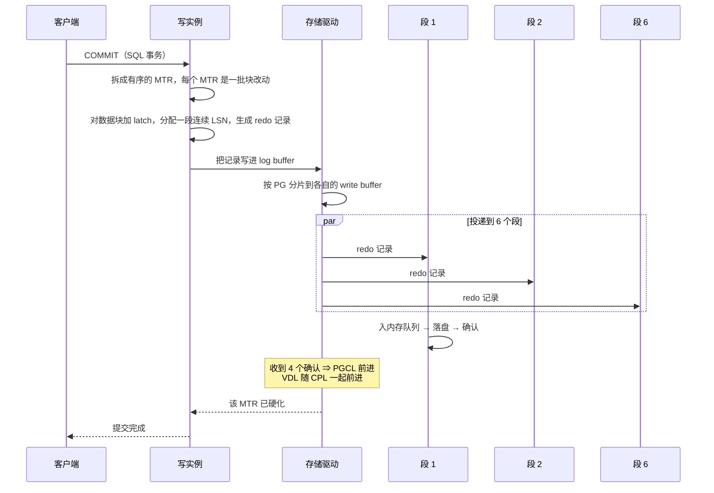
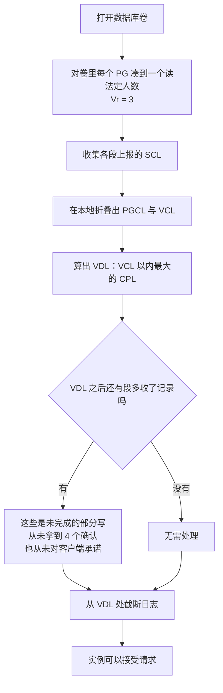

---
tags:
  - 分布式/存储
---

# Aurora

Aurora（SIGMOD 2017）是 AWS 的云原生关系型数据库。它与 [Spanner](04-Spanner 与 F1.md) 构成一组正面对照 —— **两者都要在全球/跨可用区范围内拿到强一致，但靠的东西完全不同**：

| | Spanner | Aurora |
| --- | --- | --- |
| 拿强一致靠什么 | **全局物理时钟（TrueTime）** | **共享存储层 + 精心设计的法定人数** |
| 跨地域的手段 | Paxos 组 + 2PC + commit-wait | **把 redo 日志送到存储层**，数据库层不做多阶段同步 |
| 钟表依赖 | 需要 GPS + 原子钟 | 不需要 |

三条贡献正好对应三个层次：

1. **如何在云规模上推理持久性**，以及如何设计对**相关故障**有韧性的法定人数系统（第 2 节）；
2. **如何利用智能存储**，把传统数据库的"下半部分"卸载到存储层（第 3 节）；
3. **如何消除分布式存储中的多阶段同步、崩溃恢复与检查点**（第 4 节）。

## 先说清楚瓶颈搬到了哪

设计的起点是一个环境判断：现代云服务通过**把计算与存储解耦**来获得韧性与可扩展性。一旦解耦，**传统数据库的 I/O 瓶颈就换了位置**：

- I/O 可以铺到很多节点、很多盘上，**单块盘与单个节点都不再是热点**；
- 于是**瓶颈移到"数据库层请求 I/O"与"存储层执行 I/O"之间的网络**；
- 除了每秒包数（PPS）与带宽这两个基础瓶颈，还有**流量放大** —— 一个高性能数据库会**并行地把写发到整个存储集群**；
- 而且**离群节点、离群盘、离群网络路径的性能会主导响应时间**。

同步操作的代价是：**一次缓冲池未命中导致的磁盘读就是同步的** —— 读取线程必须等它完成，甚至可能还要为腾出页面而驱逐并刷写一个脏页。后台处理（如 checkpoint）能减少这种情况，但**后台处理本身也会造成 stall**。

**结论是设计的出发点：把"跨网络写的东西"变少、把"必须同步等待的点"变少。**

## 持久性：为什么 2/3 法定人数不够

这是全篇最有价值的论证，值得完整走一遍。

### 法定人数的两条规则

设一个数据项有 $V$ 份副本，每份一个投票权。读需要 $V_r$ 票、写需要 $V_w$ 票。一致性要求两条规则：

- **$V_r + V_w > V$** —— 保证读集合与写集合**相交**，于是读的法定人数里至少有一个位置持有最新版本（"每次读必须知道最近的写"）；
- **$V_w > V/2$** —— 保证写之间互相可见，避免冲突写。

常见做法是 $V = 3$、$V_w = V_r = 2$。**2/3 法定人数不充分。**

### 关键在于 AZ 故障是"相关故障"

先理解 AWS 里的概念：**Availability Zone（AZ）** 是 Region 的一个子集，**与其他 AZ 之间用低延迟链路相连，但对大多数故障是隔离的**（电力、网络、软件部署、洪水等）。把副本分散到 AZ 上，可以让典型的规模化故障只影响一份副本。

**但在大规模存储集群里，故障的背景噪声意味着任何时刻都有一部分盘或节点已经失效、正在修复。** 这些背景故障**在 AZ A、B、C 里各自独立地分布**。于是：

> **AZ C 因火灾、屋顶塌陷、洪水等失效时，会同时破坏"任何在 AZ A 或 AZ B 里恰好有故障"的那份副本的法定人数。**

在 2/3 模型下，此时**已经丢了两份**，**无法判断第三份是否最新**。本质在于：

> **各 AZ 内副本的独立故障是不相关的，但一个 AZ 的故障是该 AZ 内所有盘与节点的相关故障（correlated failure）。**

所以法定人数必须**既能容忍 AZ 故障，也能容忍同时发生的背景噪声故障**。

### Aurora 的选择与它能达到的性质

- 设计点：**(a) 丢失整个 AZ 加额外一个节点（AZ+1）而不丢数据；(b) 丢失整个 AZ 而不影响写数据的能力**；
- 做法：**每个数据项复制 6 份、跨 3 个 AZ、每个 AZ 内 2 份**；
- 法定人数：**$V = 6$，$V_w = 4/6$，$V_r = 3/6$**。

由此得到两条具体性质：

- **丢失一个 AZ 加一个额外节点（共 3 个节点故障）不丢读可用性**（因为 $V_r = 3$）；
- **丢失任意两个节点（包括单个 AZ 故障）仍保持写可用性**（因为 $V_w = 4$）。

再补一句链条：**保证读法定人数，使我们可以通过增加额外副本把写法定人数重建起来。**

### 6 份为什么不是 5 或 7：把三种故障摆成一张矩阵

6 这个数字是从三种故障的组合里解出来的，而不是从“多数”里挑出来的。三种故障分别是：AZ A 与 AZ B 里各自的背景噪声故障（互相独立），以及整片 AZ C 失效（A 与 B 的相关故障）。

```
   故障组合                        剩余副本   能读   能写
   ────────────────────────────────────────────────────────
   无                              6          1      1
   一个 AZ 失效                    4          1      1    ← 4/6 写法定人数正好够
   一个 AZ + 1 个节点              3          1      0    ← 3/6 读法定人数正好够
   一个 AZ + 2 个节点              2          0      0
   两个 AZ 失效                    2          0      0
   ────────────────────────────────────────────────────────
   （1 = 可用，0 = 不可用）
```

两条设计点就藏在这张表的两行里：**AZ+1 失效不丢数据，单个 AZ 失效不丢写能力。**

**为什么不是 5 份。** $V_w = 4$ 的前提是 $V_w > V/2$。5 份下写法定人数是 3，于是“一个 AZ 失效”的结果取决于副本恰好怎么分布 —— 某片 AZ 里放 3 份还是 2 份，结论不同。**能不能撑住变成了分布巧合的函数。** 6 份摊成 3×2 之后，“一个 AZ 失效”永远只拿走 2 份，这一步变成确定性的。

**为什么不是 7 份。** 多一份换不到新的容错档位：7 份下 $V_w > 3.5$ 要求写法定人数 4，仍然只容忍丢 2 份；而 $V_r + V_w > V$ 要求读 4，**读反而比 6 份时更贵（从 3 涨到 4）**。多付一份存储与一份写带宽，容错档位一格没动。

## 分段：为什么降低 MTTR 比降低 MTTF 更有效

下一个问题是**AZ+1 是否提供足够的持久性**。要保证这一点，必须确保**非相关故障造成双故障的概率（MTTF）在修复一个故障所需的时间（MTTR）内足够低** —— 否则 AZ 故障叠加背景故障就会破坏法定人数。

一个很实际的判断：

> **把 MTTF（独立故障的平均间隔）降到一定程度之后就很难再降了；于是转向降低 MTTR，用它来缩小"双故障暴露窗口"。**

降低 MTTR 的手段是**把数据库卷切成小的固定大小段，当前是 10 GB**：

- 每段**复制 6 份组成一个 Protection Group（PG）**，于是**每个 PG 由 6 个 10 GB 段组成，跨 3 个 AZ、每个 AZ 内 2 段**；
- **一个存储卷是 PG 的拼接**，物理上用大量 EC2 虚机 + 附加 SSD 实现；
- **PG 随卷增长而分配**；当前**支持未复制状态下最大 64 TB 的卷**；
- **段成为独立背景噪声故障与修复的单位**，Aurora 监控并自动修复它。

**为什么分段能降 MTTR**：修复的单位从"整个卷"缩小到"一个 10 GB 段"，于是**故障恢复要搬的数据量与所花时间都小得多**。这是一个把"事后恢复"当作一等设计目标的例子。

### 修复窗口是 10 秒，不是一小时

“降 MTTR”要落到具体数字上才算数：**10 GB 的段在 10 Gbps 链路上修复需 10 秒。**

这个数字同时定义了两件事。

一是**双故障暴露窗口**。会丢法定人数的情况是“10 秒内出现两次独立故障，且失效的 AZ 不含这两处”。窗口从小时级的运维动作，压缩到一次网络传输的时间。

二是**段粒度为什么必须小**。修复时间正比于要搬的数据量；把单位从“整个卷”缩到“10 GB 段”，MTTR 就从一个由数据量支配的量，变成基本恒定的量（段大小 ÷ 链路带宽）。于是“双故障概率 = 故障率 × MTTR”里的第二项被钉住，只剩故障率在动。

对照一下：一个 64 TB 的卷若按整卷修复，即便链路同样快，MTTR 也是 10 GB 段的数千倍 —— **同一个故障率下，双故障概率高三个数量级。** 这就是“降 MTTR 比降 MTTF 更有效”的算术含义。

## 核心机制：日志即数据库

这一节是 Aurora 最出名的想法。

### 先看传统数据库写什么

像 MySQL 这样的系统要写**数据页**（堆文件、B 树等对象）以及把 **redo log 记录**写进 WAL。**一条 redo log 记录由被修改页面的 after-image 与 before-image 之差构成** —— 把记录应用到 before-image 就得到 after-image。

以**跨 AZ 同步镜像的主备 MySQL** 为例，引擎实际要写的**五类数据**是：

1. **redo log**；
2. **二进制（语句）日志** —— 归档到 S3 以支持时间点恢复；
3. **被修改的数据页**；
4. **数据页的第二次临时写（double-write）** —— 防止 torn page；
5. **元数据（FRM）文件**。

IO 顺序是：步骤 1、2 写 EBS（EBS 再写 AZ 本地镜像，**两者都完成才确认**）→ **步骤 3 用同步块级软件镜像把写暂存到备库** → 步骤 4、5 写备库的 EBS 卷与镜像。

**这个模型有两条问题：**

- **从"怎么写"看**：步骤 1、3、5 是**顺序且同步**的，所以**延迟是叠加的**；而且**即使异步写也必须等最慢的那个操作**，于是**抖动被放大，系统受离群点摆布**。一个很准的定性：**这个模型相当于 4/4 的写法定人数**（四份都要写成功），对故障与离群性能都脆弱。
- **从"写什么"看**：应用的操作引发许多不同类型的写，**常常用多种方式表示同一份信息** —— double-write buffer 就是典型：它是为了防 torn page 而存在的**纯冗余**。

### Aurora 的做法：只把日志送过网络

- 传统数据库改一个数据页时，会生成 redo log 记录并调用 **log applicator** 把它应用到内存中的 before-image 得到 after-image。**事务提交要求日志已写，但数据页的写可以推迟** —— Aurora 把这个"可以推迟"推到了极限；
- **在 Aurora 里，唯一跨网络的写是 redo log 记录。数据库层从不写页面 —— 不是后台写、不是 checkpoint，也不是缓存淘汰**；
- **log applicator 被下推到存储层**，由它在后台或按需生成数据库页；
- 当然，**每次都从"时间开始"起的完整修改链生成页面代价高得不可接受**，所以 Aurora **持续在后台物化数据库页**。

这里有一句必须原样记住的声明：

> **后台物化从正确性角度完全是可选的 —— 对引擎而言，日志就是数据库；存储系统物化出的任何页面只是 log 应用的缓存。**

还有一条**与 checkpoint 的关键区别**：

> **只有修改链很长的页面才需要重新物化。checkpoint 受整个 redo log 链的长度支配，而 Aurora 的页面物化受单个页面自己的链长度支配。**

这是"消除 checkpoint"的技术实质 —— **改动落在粒度上：从全局链改成单页链**，而不是把 checkpoint 做得更快。

### IO 流程与实测差距

主实例**只把日志记录写到存储服务**，并把日志记录与元数据更新**流式发给副本实例**。IO 流**按共同目的地（一个逻辑段，即 PG）把完全有序的日志记录分批**，每批投递到 **6 个副本**并持久化到盘，**数据库引擎等其中 4 个确认**才算满足写法定人数、认为这批日志记录已"硬化"。**副本用这些 redo 记录把改动应用到自己的缓冲池。**

用 SysBench 的**只写负载 + 100 GB 数据集 + 30 分钟 + r3.8xlarge** 对比了两种配置：

| 配置 | 事务数 | IO/事务 |
| --- | --- | --- |
| 镜像 MySQL | 780,000 | 7.4 |
| 带副本的 Aurora | **27,378,000** | **0.95** |

三条读法：

- **Aurora 承受的事务数是镜像 MySQL 的 35 倍**；
- **数据库节点上的 IO/事务少了 7.7 倍** —— 注意这是**在 Aurora 把写放大 6 倍的前提下**，而且**还没算 EBS 内部的链式复制与 MySQL 的跨 AZ 写**；
- **每个存储节点看到的是未放大的写**（它只是六份之一），所以**这一层需要处理的 I/O 少了 46 倍**。

## 一次写走完的路径

一条写从 SQL 层走到存储节点，要穿过四层，每层的“完成”含义不同。



四层各自的“完成”含义：

| 层 | 完成的含义 |
| --- | --- |
| **MTR**（mini-transaction） | 一批块改动**原子**生效；它的最后一条日志记录被标成 CPL |
| **PGCL**（PG complete LSN） | 某个 PG 的 6 个段里，**至少 4 个**已持久化到这一点 |
| **VDL**（volume durable LSN） | 卷上**所有 PG** 都能取到的那个 CPL —— 也就是可以对客户端承诺的持久点 |
| **客户端** | 只有 VDL 越过这条事务的 CPL，提交才算完成 |

**这里没有第二个来回。** 传统 2PC 是“准备 → 提交”两轮网络往返；Aurora 把“准备”那一轮要收集的信息（哪些段已经持久化）持续记在写实例的本地状态里，于是提交只需要一次写与一次等确认。**共识被一道本地运算替代了** —— 这也就是 2018 那篇标题里“避开共识”的含义。

**写实例只等 4 个确认，而“是哪 4 个”不重要。** 这正是 4/6 的意义：不必知道哪 4 个段回了，数够 4 个，日志在卷上就已经耐久。**代价是“究竟哪 4 个”这件事被推迟到崩溃恢复时才需要知道** —— 见 `## 崩溃恢复被“摊薄”了`。

**写路径上还有三处细节值得单独记。**

**一、先分配 LSN，再生成记录。** 实例先对要被改的数据块加 latch，**分配一段连续编号的 LSN**，然后才生成日志记录并发出写请求。顺序不能反 —— 连续 LSN 是后面那条“按 LSN 顺序应用就不会读到劈了一半的树”成立的前提。

**二、一条事务会被拆到多个 PG 的写缓冲里。** 记录的投递目的地是“这条记录所属数据块所在的 PG”，于是一条跨多个数据块的事务会被**分片**到多个 PG 的写缓冲，各自独立地数确认。**这就是“跨 PG 事务放大等待”的机制来源**：等待时间取决于“所有涉及的 PG 各自第四个确认”里最慢的那个，与参与 PG 的个数直接相关。

**三、群组提交在这里几乎不产生额外延迟。** 传统实现把多个事务的 fsync 合并成一次，会引入一个为了凑批而产生的等待窗口。这里的提交不依赖本地 fsync，而是等远端 4 个确认，**因此群组提交没有引进额外延迟，工作线程也不会为此空转。**

把这三条与前面那张表合起来看，能读出一个总的形状：**写的成本被集中在“一次网络往返 + 数够 4 个答复”上**，其余环节（页面物化、版本回收、校验、备份）全部被推到后台。**前台只做两件事：把日志发出去，把确认数够。**

**读路径与写路径的形状不一样，值得放在一起对照。** 写是“一份日志发到 6 个段、等 4 个确认”；读是“挑一个段、直接问它”。**这个不对称是设计出来的**：写要的是持久性（多副本确认），读要的是新鲜度（一致性点保证那个段一定够新）。

代价落在读侧的一条约束上：**段必须知道“还有没有人需要更旧的版本”**，否则它不敢回收旧日志与旧块。写侧没有对应约束 —— 写不需要知道“谁还没收到”，只需要数够 4 个。**一侧是“数够就行”，另一侧是“必须知道下限在哪”**，这是两条路径在机制上最深的一处分歧。

### 一条日志记录带三条链

每条日志记录里存了三个“前驱 LSN”，对应三条互相独立的链：

```
   volume chain   本条 LSN ──▶ 卷上前一条记录的 LSN
                   └─ 用来定义 VDL / PGCL 这些卷级一致性点

   segment chain  本条 LSN ──▶ 同一段上前一条记录的 LSN
                   └─ 存储节点靠它识别自己漏了哪几条
                   └─ 补洞靠与同 PG 的同伴 gossip

   block chain    本条 LSN ──▶ 同一数据块上一条记录的 LSN
                   └─ 存储节点靠它按需物化单个数据块
                   └─ 页面物化只受“这一块自己的链长”支配
```

三条链分工很干净：**volume chain 管“卷到哪了”，segment chain 管“我漏了什么”，block chain 管“这一块怎么重建”。** 缺任何一条，都要退化成“扫全部日志”或“问所有人”。

**block chain 是“消除 checkpoint”的技术落点。** 传统 checkpoint 的进度受整条 redo 链支配（一条长事务就能把 checkpoint 推不动）；这里的页面物化进度只受单个块的链长支配 —— **一次巨大的批量导入不会拖住别的块。** 改动落在粒度上，而不是把 checkpoint 做得更快。

## 崩溃恢复被"摊薄"了

- 传统数据库崩溃后必须**从最近的 checkpoint 开始重放日志**，确保所有已持久化的 redo 记录都被应用；
- **在 Aurora 里，持久 redo 记录的应用发生在存储层 —— 持续、异步、分散在整个集群上**；
- **任何对数据页的读请求，如果该页不是最新的，可能需要先应用一些 redo 记录**；
- 于是**崩溃恢复的过程被分摊到所有正常的前台处理里，数据库启动时什么都不需要做**。

这就是"消除多阶段同步与崩溃恢复"的实现方式：**恢复不再是一个独立阶段，而是被摊进了正常的前台处理。**

**崩溃恢复的机制值得单独走一遍 —— 它是“本地瞬时状态”这笔债的还款方式。**

写实例在正常运行时不与存储节点协商一致性，它自己记着“哪些段已经确认到哪”。实例一崩，这份本地状态就没了。重建的方式是：



**这就是“摊薄”的确切含义**：恢复的动作是“重新数一遍每个段手里有什么”，而不是“重放日志到最新”。**重放的动作早在正常运行期间就被存储节点做完了**，实例要做的只是一次折叠，以及对每个 PG 收 3 个答复。

**有一句话值得原样记下来**：用本地瞬时状态省下的提交时间，“必须在崩溃恢复时还回来”。这是一笔**明知要还、仍然借的**账 —— 理由是提交比崩溃常见好几个数量级。**还款方式是设计的一部分，不是意外成本。**

四个参与者的职责也可以按“谁来恢复什么”再切一次：

| 角色 | 崩溃后要做什么 |
| --- | --- |
| **存储节点** | 上报自己的 SCL；不需要知道卷级结论 |
| **写实例** | 收读法定人数、折叠出 PGCL/VCL/VDL、截断日志 |
| **只读副本** | 不做恢复 —— 状态由写实例通过日志流重建 |
| **未完成事务** | **是否回滚对每个事务分别判定** —— 逻辑留在数据库引擎里，和它写本地盘时一样 |

## 存储节点的八个步骤与一条反相关的调度原则

存储节点上的活动分解为八步：

1. 收到日志记录，加入**内存队列**；
2. **持久化到盘并确认**；
3. 组织记录、**识别日志中的缺口**（有些批次可能丢失）；
4. **与同 PG 的同伴 gossip 填补缺口**；
5. **把日志记录合并（coalesce）成新的数据页**；
6. 周期性把日志与新页面**暂存到 S3**；
7. 周期性**垃圾回收旧版本**；
8. 周期性**校验页面上的 CRC 码**。

**只有步骤 1 和 2 在前台路径上**，其余全是异步。

调度原则是这一节的核心：

> **Aurora 里后台处理与前台处理是负相关的** —— 这与传统数据库相反（传统数据库的页面后台写与 checkpoint 与前台负载**正相关**）。

一个"用 CPU 换磁盘"的具体例子：**存储节点忙于处理前台写请求时，不必对旧页面版本做垃圾回收 —— 除非磁盘快满了。**

**积压怎么办**：会**节流前台活动**防止队列过长；而因为**段以高熵分布在各个存储节点上**，某个节点被节流**正好被 4/6 写法定人数消化掉，表现为"一个慢节点"**。这是 4/6 这个选择在调度层面的额外好处。

存储节点的八步活动，按“在前台还是后台”再切一次：

```
   前台路径（在写请求的临界路径上）
   ─────────────────────────────────────────────
   ① 收到 redo 记录，加入内存队列
   ② 持久化到盘并确认                ← 只有这两步会让写等

   后台路径（全部异步）
   ─────────────────────────────────────────────
   ③ 组织记录、识别日志缺口
   ④ 与同 PG 的同伴 gossip 补洞
   ⑤ 把 redo 记录合并成新的数据块
   ⑥ 周期性把日志与新块暂存到 S3
   ⑦ 周期性回收旧版本
   ⑧ 周期性校验块上的 CRC
```

**六步后台活动没有一步影响写的确认时间**，而它们的进度反过来受一个来自写实例的数字支配：PGMRPL。**前台与后台在这里是负相关的** —— 前台越忙，后台越可以推迟，因为推迟的下限是 PGMRPL 而不是一张固定时间表。

## 一致性点：五个 LSN 与“日志只向前走”

Aurora 在多个尺度上各维护一个“已经确认到哪”的点。它们**全部单调递增**，这个性质本身就是设计里最重要的一条不变量。

```
   单调递增，逐级收窄：

   SCL      每个段自己：本段持久化到哪
    │        （6 个段各有一个，互不等待）
    ▼
   PGCL     某个 PG：6 个段里至少 4 个持久化到哪
    │        （写实例数够 4 个确认就推进）
    ▼
   VCL      整卷：6 个段全部持久化到哪 —— “完整”的点
    │        （没有缺口，但可能还没被数据库认可）
    ▼
   VDL      整卷：VCL 以内最大的那个 CPL —— “耐久”的点
             （对客户端承诺的持久点；日志就截在这里）

   PGMRPL   某个 PG：所有未完成读里最小的 read point
             （存储节点可以安全回收早于它的日志与旧版本）
```

**“完整”与“耐久”是两个不同的概念，这一点最容易记错。** 一个具体的例子：数据已经完整到 LSN 1007，如果数据库只把 900、1000、1100 标成 CPL，那么卷的持久点是 **1000** —— 完整到 1007，但只能承诺到 1000。**CPL 可以理解为“存储系统必须按顺序接受的那一层事务边界”**，它比日志记录的粒度粗，是数据库主动划出来的。

**关键不变量是“日志只向前走”。** 五个点只增不减，带来两个好处：一是它们可以被压缩地表示与比较（每个只是一串 LSN），二是**协调多个请求处理器（多个副本对同一份共享存储）变成一件简单的事** —— 谁都不用回头。

**为什么不用共识也成立**：这些点全部由**写实例本地维护**，不是靠多个存储节点投票投出来的。存储节点只上报自己的 SCL，剩下的是写实例的一次折叠运算。

### PGMRPL：单段读靠什么成立

正常运行时，Aurora 的读**不走读法定人数**。机制是 read point：

1. 读一个数据块时，**写实例以“发出请求那一刻的 VDL”作为这次读的 read point**；
2. 写实例知道每个段的 SCL，于是**挑一个 SCL 大于 read point 的段**，直接向它发读请求 —— 那个段一定持有不低于该点的数据；
3. 因此**一次读只落到一个段上**，不需要问 3 个。

代价是**存储节点必须知道“还有没有人需要更旧的版本”**，否则它不敢回收旧日志或旧数据块。这就引出 PGMRPL：

**PGMRPL = 所有未完成读的 read point 的最小值**，在 PG 粒度取最小。有只读副本时，写实例与副本 gossip，把它们各自的最小值也折进来，得到全节点范围内的最小值。

**它的语义是一条低水位线**：存储节点据此可以确定，**不会再有 read point 低于 PGMRPL 的读请求**；于是早于它的日志与旧版本块都可以安全回收（先合并，再 GC）。

**这一条把三个东西串成了一条链**：单段读（省掉读法定人数）→ 需要 read point → 需要 PGMRPL → 决定存储节点什么时候能回收。**省掉一次读法定人数，代价是维护一个全节点范围的最小值** —— 而这笔代价只花在 gossip 上，不在读路径上。

## 日志向前走：用 LSN 和 gossip 替代 2PC

第 4 节回答"日志怎么从引擎生成，使持久状态、运行时状态、副本状态始终一致" —— **关键是不用昂贵的 2PC**。对 2PC 的评价是**"话多（chatty）且不容忍故障"**。

它利用的观察是：**日志本身就是有序的变更序列**，而且**每条日志记录有一个由数据库生成的、单调递增的 LSN**。由此可以异步地维护状态：

- **维护"一致性与持久性的点"，并在收到未完成存储请求的确认时持续推进这些点**；
- **任何单个存储节点都可能漏掉一条或多条日志记录**，所以它们**与 PG 内的其他成员 gossip，找出缺口并填补** —— 这与前面"存储节点第 4 步"是同一件事的两面；
- **数据库维护的运行时状态使单段读成为可能，不必走法定人数读**，**唯一的例外是恢复时**（状态丢失、必须重建）；
- 数据库可能有**多个未完成的隔离事务**，它们可能**以与发起不同的顺序完成**；若数据库崩溃或重启，**是否回滚是对每个事务分别判定的**。

## 复制与只读副本：三条不变量

**一个写实例加最多 15 个只读副本，共用同一份存储卷。** 直接后果是**只读副本不增加任何存储成本与磁盘写操作** —— 它们不持有自己的数据副本，只是另一组访问同一份卷的计算节点。为压低延迟，写实例产生的日志流在发往存储节点的同时**也发给所有副本**，副本自行把改动应用到自己的缓冲池。

共享存储这件事有一个反直觉的难点：**共享的是持久状态，不共享的是各自的内存状态**（缓冲池、latch、锁表）。写实例在本地做快照隔离、事务排序、结构原子性都很容易，因为所有写都经过它；副本就难了 —— 它看到的是别人写的页，而自己的缓存要靠自己维护。

Aurora 用**三条不变量**把这件事管住：

- **副本的 read view 必须落后于写实例的耐久一致性点。** 这条保证**写实例与副本不需要协调缓存淘汰** —— 副本永远不会在读一个写实例正准备淘汰的版本。**这条是“允许副本滞后”从缺陷变成设计的那个转折**：既然副本可以滞后，两边的缓存就成了两个互不相干的问题。
- **结构性变更（B 树的分裂与合并）必须原子地对副本可见。** 一个 MTR 就是“一批块改动原子生效”的单位，它对应的日志记录是一批**连续编号**的 LSN。于是副本只要按 LSN 顺序应用，就不会读到“劈了一半”的树。
- **副本上的 read view 必须能锚定到写实例时间线上的等效点。** 这条保证**快照隔离跨系统成立** —— 副本上的一次读，等价于写实例在某个时刻的一次读。

**这三条合起来说明一件事：共享存储并不能省掉副本侧的一半设计。** 存储共享了，但“副本读到的世界是否自洽”仍要靠三条不变量约束。**它省下的是存储成本与写带宽，不是正确性工作。**

**还有一处与 undo 有关的不变量**：undo 记录在所有 read view 都推进过它之前不能清除。原因很直接 —— 副本要靠 read view 回退到某个 LSN，再撤销在该点之后开始的（或当时还活跃的）事务。**只要还有副本可能回到旧的时间点，undo 就不能扔。**

**顺带一个实现上的分叉**：Aurora MySQL 用原地更新加 undo；Aurora PostgreSQL 用**异地写**（每条记录带事务 id）+ 定期清理旧版本。两者在“三条不变量”这一层是同一个模型，差别在存储版的 MVCC 怎么落。

## 底层依赖：EC2、本地 SSD 与被省掉的那一层

**依赖一：EC2 实例 + 附加本地 SSD。**

存储节点是“挂本地 SSD 的 EC2 实例”，而不是裸机。这个选择决定了存储层的失效模型 —— 它面对的是**实例级的替换**，而不是换一块盘。**段的修复因此是“在别处重新放一份段”，而不是“修这块盘”。** 这条依赖换得掉（换实例型即可），但换它会改变修复时间，也就是改变双故障窗口。

**依赖二：三个 AZ 之间的隔离性。**

整套法定人数是围绕“AZ 是最大的相关故障单位”建起来的。**这条假设一旦不成立，6/4/3 的取值全部要重算** —— 把副本摊到 4 个 AZ、或者把 Region 当作故障单位，都要重新解那张故障矩阵。**这是唯一一处换不掉的依赖。**

**依赖三：网络带宽 —— 它是修复时间的分母。**

前面那个“10 GB 段 10 秒修完”，分母就是链路带宽（10 Gbps）。**这是全篇唯一一处“基础设施性能直接进设计算式”的地方**：带宽减半，双故障窗口翻倍。反过来，4.0 那一代产品把扩容搬迁做成零拷贝并宣称快 5 倍，改的也是这个分母。

**依赖四：写实例的本地内存。**

一致性点全在本地瞬时状态里。**这是一个用内存换网络的依赖** —— 省下的每一次网络协商，代价是崩溃后要从各段的 SCL 重算一遍。表三那类“内存参数同时影响读性能与故障判定”的说法在这里不成立：Aurora 的内存账主要是缓冲池，而缓冲池大小不参与一致性判定。

**依赖五：S3 作为二线存储。**

存储节点周期性把日志与新数据块暂存到 S3，备份因此不再是一次昂贵的一次性操作，而是**持续异步动作的一部分**。**这条依赖把“备份”从运维事件变成了后台流程** —— 也是“把下半部分卸载到存储层”这条思路延伸到了备份上。

**被省掉的那一层才是最值得看的。**

设计里**没有分布式共识**，**也没有一个独立的协调服务**（对比 Chubby 之于 Bigtable、ZooKeeper 之于早期 Cassandra）。省掉它的方式是让每个点都**单调递增**：所有参与者只需要知道“我到了哪”，不需要知道“别人到了哪”。**没有需要协商的对象，就不需要协商。**

正面对照一下这两条路线：

| | Spanner / 早期 Cassandra | Aurora |
| --- | --- | --- |
| 定序靠什么 | 全局时钟（TrueTime）/ 外部协调服务（ZK） | **单调递增的 LSN 与一致性点** |
| 跨节点一致怎么达成 | Paxos 组 + 2PC | **写实例本地折叠，无共识** |
| 成员变更 | 需要共识（Paxos membership） | **epochs + quorum sets，非阻塞** |
| 需要什么设施 | GPS + 原子钟 / ZK 集群 | **只需要“AZ 隔离”这条环境性质** |

**把这份依赖表再往前推一步，能得出一条判断“这套架构能不能被别处复制”的判据。** 复制它需要的是三样环境性质，而不是代码：

- **故障域有明确的层级**（这里是“AZ 是最大的相关故障单位”）。没有这个层级，“6 份怎么摊”就没有依据 —— 摊几份、每份几片，全部是从故障域的形状解出来的。
- **存储节点可以随时被整台替换**（EC2 实例）。段的修复逻辑建立在“换掉这台、在别处重放一份”之上；如果硬件要现场维修，整个 MTTR 论证就换了前提。
- **节点之间有一条稳定的高带宽内网**。修复时间的分母、日志投递的延迟、副本的滞后，全部挂在它上面。

**缺哪一样，都有明确的替代代价。** 没有故障域层级，就退回“多数派”这类不区分相关性的模型，于是失去 AZ+1 这条档位；不能整台替换，修复变成现场运维，MTTR 从 10 秒回到小时级，双故障窗口跟着回到小时级；内网带宽不足，要么拉长修复窗口，要么把段切得更小 —— **而段更小意味着同样数据量下 PG 更多，恢复时要收的答复也更多。**

**这三条也解释了一份设计为什么难以照搬。** 这套机制（LSN、五级一致性点、折叠、gossip 补洞）都可以被重新实现，但**“AZ 是最大的相关故障单位”是环境事实，不是设计本身的结论**。把它搬到只有单机房、或只有两个故障域的环境里，6/4/3 这个解就不成立了。

**这份依赖表里有一处对称性值得记下来。** 三条环境性质分别对应三个设计量：**故障域的层级**决定“要几份副本”（6），**节点的可替换性**决定“一份修多久”（10 秒），**内网带宽**决定“修复窗口有多大”（同样是那 10 秒）。**三个量互相独立，改动任何一个都不直接影响另外两个** —— 这正是这套设计可以用一张表讲清的原因。

反过来，一个把这三件事混在一起谈的架构，通常也意味着它没法把它们分开：修复时间同时受数据量与硬件更换流程支配，副本份数同时受成本与时钟精度牵制。**能分开，才谈得上分别优化。**

## 参数与可调项

Aurora 的参数分三层，而且**大多数“参数”不是旋钮，是选型** —— 这一点与自己在 EC2 上跑一个 MySQL 很不一样。

**第一层：集群级选型（建库时定，事后可改但有成本）**

| 项 | 取值 / 默认 | 语义与改动后果 |
| --- | --- | --- |
| 存储计费配置 | 标准 / **I/O-Optimized** | I/O-Optimized 在 **I/O 支出超过数据库总支出 25%** 时最多省 40%；代价是计费方式从按请求变成按存储 |
| 实例拓扑 | 1 写 + 最多 **15** 只读副本 | 副本**不增加存储成本**，只增加读带宽；写实例的类型决定计算上限 |
| 卷容量 | 自动增长，按 **10 GB** 增量，上限 **256 TiB**（2025-07 起从此前 128 TiB 翻倍） | 不需要预置容量；**“10 GB 增量”与存储段大小是同一个数** |
| Serverless v2 | 按 ACU 自动伸缩 | 可与预置实例混用；适合负载波动大、又想留在同一套架构里的场景 |
| Limitless（PostgreSQL） | 分片组，最大容量 **16–6144 ACU** | **只支持 I/O-Optimized**；每个分片上限 128 TiB；整组参考表上限 32 TiB；部分 SQL 命令不支持 |
| Global Database | 跨 Region | 用**存储级复制**把卷铺到多个 Region；每个 Region 可再加 15 个只读副本 |

**第二层：数据库参数组**

与自建 MySQL / PostgreSQL 一致的那套（缓冲池、连接数、字符集、超时）仍然存在，通过参数组管理。**但有一整类参数失去了对应物**：

| 自建 MySQL 的参数 | 在 Aurora 里的状态 |
| --- | --- |
| checkpoint 间隔 | **无对应物** —— 没有 checkpoint 这个阶段 |
| double-write 开关 | **无对应物** —— 页面不跨网络，torn page 问题在存储侧解决 |
| redo 日志文件大小 | **无对应物** —— 日志是虚拟化的连续 LSN 流，不是环形文件 |
| 刷脏页频率 | 影响缓冲池，但不影响持久性 —— 到存储的不是页 |

**这是“架构变了，参数表跟着变”的一个具体例子。** 看到一份 Aurora 参数调优清单，先确认里面列的机器在 Aurora 里还存在；**上面这四类恰好是最常被照搬过来的。**

**第三层：应用侧真正影响行为的东西**

Aurora 没把一致性做成本地参数，它落在应用写法上：

- **读走不走只读副本。** 走 reader endpoint 就会落到副本上，而**副本的 read view 落后于写实例的耐久点**，于是副本上的读天然“略微过时”。**要不要接受这个过时，是应用决定的第一件事。**
- **事务的形状。** MTR 是原子单位，一批块改动共享一段连续 LSN。**把一条事务写很大不会让它更慢，但会让它的 CPL 只在末尾出现** —— 于是“完整”与“耐久”之间的距离变长。
- **单条事务触及多少个 PG。** 一条修改跨越多个 PG 时，日志要分片到多个 PG 的 write buffer，**提交要等每个涉及的 PG 都数够 4 个确认**。**跨 PG 的大事务是这里唯一一处会放大等待的形状。**

**三处最容易被当成旋钮、其实不是的东西**：卷大小（自动增长）、checkpoint 那一批老参数（无对应物）、副本数量对存储成本的影响（为零）。**真正要决策的只有两件：计费模式，以及读能不能接受过时。**

**还有一层“参数”很容易被忽略：端点。** 一个集群对外至少给出三个入口 —— **集群端点**（永远指向当前写实例）、**reader 端点**（分摊到只读副本）、**自定义端点**（按实例分组路由）。**它们不是性能开关，但决定请求落到哪一类节点上**；把分析型查询走 reader 端点、把写入走集群端点，是最常用的一条分工。

**换端点是零成本的，也不需要改数据模型**，但它把前面那三条应用侧决策落到了具体配置上：读走不走副本，等价于“要不要把这个连接指到 reader 端点”；把一类查询隔离到专门的实例组，等价于“给这组实例建一个自定义端点”。**与前面三层相比，这一层最容易被调，也最容易被忽略** —— 因为它在连接串里，不在参数表里。

**最后一处容易被忽略的是“参数的可见边界”。** 前面三层里，**第一层与第三层客户能改，第二层有一半改不了**（没有对应物）。**判断一份 Aurora 调参建议是否可用的最快方法，就是看它列的参数能不能在参数组里找到** —— 找不到的那些，通常是照着自建 MySQL 的经验写出来的。

## 版本演进：从最早那版的 64 TB 到今天的 256 TiB

```
   2017  SIGMOD 第一篇           64 TB 卷上限 · 单写 + 15 只读副本 · 6 份 / 3 AZ / 4 写 3 读
     │                           · 日志即数据库 · 10 GB 段 · 实测 35 倍事务数
     ▼
   2018  SIGMOD 第二篇           补上“如何避开共识”：epochs + quorum sets
     │                           · 五个一致性点（SCL / PGCL / PGMRPL / VCL / VDL）
     │                           · 副本的三条不变量 · 成员变更变成非阻塞
     ▼
   2019+ 服务铺开                Global Database（跨 Region 用存储级复制）· Parallel Query
     │
   2020+ 伸缩方式改变            Serverless v2：按 ACU 自动伸缩，可与预置实例混用
     │
   2023+ 计费模式成为选项        I/O-Optimized：I/O 占比超过 25% 时最多省 40%
     │
   2024+ 写吞吐再上一档          PostgreSQL Limitless Database GA：分片组横向扩，
     │                           兼容 PostgreSQL 16.4，只支持 I/O-Optimized
     ▼
   2025-07 卷上限翻倍            256 TiB（从此前的 128 TiB）
```

**四条最初的设计判断，后来各自的下场：**

| 最初的设计判断 | 后来的处理 |
| --- | --- |
| 卷上限 64 TB | → 128 TiB → **256 TiB**；**10 GB 的段粒度没有变**，卷容量仍然按 10 GB 增量涨 |
| 单写实例 + 最多 15 只读副本 | **数字没变**；跨 Region 时“每个 Region 可再加 15 个” |
| 靠降 MTTR 而不是降 MTTF | **方向没变**，分母（链路带宽）变大了 |
| 读不走过读法定人数 | 延续；读的扩展方式是加副本，而副本零存储成本 |

**最值得注意的一件事：2017 那篇没解决的问题长成了 2018 那篇的主线。** 第一篇把“写与提交不需要共识”讲透了，但**成员变更**还悬着 —— 存储节点坏了要换、要散热管理、要滚动升级，这些都是集群拓扑在变。2018 那篇用 **epochs + quorum sets** 补上：变更只依赖“对相关法定人数读写”这一对基本操作，于是**变更可逆且非阻塞，成员变更决策本身变得无关紧要**。这句话把 Chubby / ZooKeeper 那一类协调服务的整个职责消掉了 —— 不需要先选出谁说了算，才能决定换掉哪个节点。

**产品线有三次转向值得记：**

- **计费模式显式化。** I/O-Optimized 把“存储与 I/O 打包计费”变成可选项，判据是“I/O 支出是否超过总支出 25%”。**这是一次把架构特性（写放大低）直接换算成账单的尝试。**
- **伸缩方式换轨。** Serverless v2 让容量按 ACU 自动伸缩，并且**允许它与预置实例在同一个集群里混用** —— 这一步承认了“全自动伸缩”与“可预测性能”各自都有场景，不必二选一。
- **横向扩展回归。** Limitless 用分片组突破单实例的写上限。**这条路线与第一篇的取向是有张力的** —— 共享存储的单写者模型本来靠“不扩写者”换来了简单（没有多写者协商，才不需要共识）。Limitless 的约束清单正好提示了代价：只支持 I/O-Optimized、每个分片上限 128 TiB、整组参考表上限 32 TiB、部分 SQL 命令不支持。

**还有两处服务侧的工程化不在这份设计里**：一是**至今不需要重放 redo 日志来做崩溃恢复**（官方表述），把重启时间压低；二是**把数据库缓冲池与数据库进程隔离，使缓存能活过一次重启**。**第二条正好回应了那句“实例状态是瞬时状态”** —— 瞬时指的是持久性不依赖它，不意味着它会白白丢掉。

**吞吐的数字也留在官方口径里**：SysBench 下“最多 5 倍于 MySQL、3 倍于 PostgreSQL”。**这是相对自建同规格的对比，与前面那个“35 倍事务数”不是同一个基准** —— 后者比的是跨 AZ 同步镜像的 MySQL。

## 不适用于什么：省掉的每一层各自意味着放弃什么

**成立前提**

- **工作负载是 OLTP，且有明确的单写点。** 整套设计围绕“一个写实例 + 一份共享卷”展开；写要横向扩，就得换到 Limitless 那类分片结构。
- **能接受只读副本读到略微过时的数据。** 副本的 read view 被不变量约束为落后于写实例的耐久点。**要“副本读到的和写实例完全一样”，就必须放弃副本或改用别的读路径。**
- **事务不需要跨 Region 的强一致提交。** Global Database 用存储级复制把卷铺到多 Region，**跨 Region 复制的延迟决定了这条路能走多远**；要跨 Region 的强一致，路线会回到 Spanner 那一类。
- **不需要自己控制数据放在哪个可用区。** 6 份的分布由服务决定，客户拿不到“把这行数据放到 AZ B”这种控制权。
- **能接受“恢复靠数数，不靠重放”这个过程不可干预。** 崩溃恢复的折叠是全自动的，没有“手动指定恢复到哪个 LSN”的操作面。
- **规模在单卷 256 TiB 与 15 副本之内。** 超出要换形态。

**前提被违反时的后果**

| 违反的前提 | 后果 |
| --- | --- |
| 写压力超出单写实例 | 写吞吐有硬上限；Limitless 是唯一的横向出口，而它有 SQL 子集与 32 TiB 参考表的上限 |
| 要求副本强读一致 | 只能绕开 reader endpoint，等于放弃副本带来的读扩展 |
| 事务跨多个 PG | 提交要等每个涉及的 PG 都数够 4 个确认 —— **这是唯一一处会放大等待的事务形状** |
| 需要按可用区摆放数据 | 做不到 —— 副本布局是服务的内部决定 |
| 需要跨 Region 强一致写 | 超出这套模型；Global Database 的复制是异步的 |
| 依赖 checkpoint / double-write 那批调优经验 | 那些参数在 Aurora 里没有对应物，照搬会调空 |

**与相邻系统的对照**

| | Aurora | Spanner | 早期 Cassandra | 自建 MySQL 主备 |
| --- | --- | --- | --- | --- |
| 跨故障域的强一致靠什么 | **共享存储 + 本地折叠，无共识** | TrueTime + Paxos + 2PC | 读侧一致性级别 | 4/4 同步镜像 |
| 需要时钟/协调设施 | 都不需要 | GPS + 原子钟；Chubby | 无（时钟由客户端给） | 无 |
| 成员变更 | **epochs + quorum sets，非阻塞** | Paxos 成员变更 | gossip + 显式 join/leave | 手工切换 |
| 扩容写能力 | **单写实例（Limitless 才横向）** | 天然分片 | 无中心，加节点即扩 | 需要分库分表 |
| 读扩展 | 共享存储的只读副本，零存储成本 | 读副本 + 分片 | 加副本 | 只读从库 |

**代价落在谁身上**

| 代价 | 落在谁身上 |
| --- | --- |
| 提交要等 4 个确认 | **写路径**（但只有一个来回） |
| 副本读到略微过时 | **应用**（决定读走不走副本） |
| 崩溃恢复要收齐每个 PG 的读法定人数 | **重启时间**（卷越大，PG 越多，这一步要收的答复越多） |
| 段修复占用的网络带宽 | **集群的网络**（修复时间就是双故障窗口） |
| 纵向扩展有硬上限 | **容量规划**（要提前判断会不会撞上单实例上限） |
| 计费模式选择 | **账单**（I/O 占比是关键判据） |

**这张表读下来，落点集中在两处：写路径的那一次等待，与应用对“读可能过时”的取舍。** 前者是这套设计主动付出去的成本，后者是它推给使用者的责任。**判断一笔取舍划不划算，就看那个应用是否本来就要容忍副本滞后** —— 一个读多写少、读又允许过时的应用，几乎不付第一行以外的任何代价。

**最后一条边界与“共享存储”的隐含假设有关。** 整套设计默认**写实例是唯一的事实来源**，所有写都经过它。这条假设换来的是“不需要在多写者之间协商”，代价是**写的扩展只能纵向**。

想横向扩写，就必然要引入第二个写者，而那意味着重新面对“多个写者对同一份数据定序”的问题。Limitless 的解法没有让两个写者写同一片数据，**而是把数据切开，让每个写者只管一片**。**这说明“横向扩写”与“不做多写者协商”这两件事，只能选一个** —— 分片把写者之间的协商换成了数据之间的边界。

**把这条边界与前面那张对照表连起来看，会发现一个共同点：复杂度被集中在“写者数量”这一个维度上。** 单写者换来的是免共识、免协调服务、免多阶段提交；代价是写扩展只能纵向，一旦要横向就得引入分片。

**本栏其他几篇也在同一个维度上做交易，区别只在把边界画在哪。** [[03-Dynamo|Dynamo]] 允许任意节点接受写，代价是把冲突合并推给应用；[[04-Spanner 与 F1|Spanner]] 也是单写者，但它为跨地域写付出了时钟设施。**同样是“要不要允许多个写者”，三个系统给出的答案差别巨大，而它们的架构分歧基本都能从这个答案里推出来。**

## 排查：从症状到判据

```
   症状
     │
     ├─ 写延迟高 ───────────▶ 先看事务跨了几个 PG
     │                          └─ 跨 PG 多 ⇒ 提交要等每个 PG 都数够 4 个确认
     │
     ├─ 提交偶发慢，但不持续 ▶ 看这一批事务的 CPL 间距
     │                          └─ CPL 只在大事务末尾出现 ⇒ “完整”与“耐久”之间距离长
     │
     ├─ 重启后恢复慢 ───────▶ 看卷里有多少个 PG
     │                          └─ 恢复是“每个 PG 收 3 个答复 + 折叠”，不是重放
     │
     ├─ 副本上的读结果旧 ───▶ 看这次读走没走 reader endpoint
     │                          └─ 走了 ⇒ 读的是被不变量限定为滞后的 read view
     │
     ├─ 存储层后台活动堆积 ──▶ 看 PGMRPL 有没有前进
     │                          └─ PGMRPL 不前进 ⇒ 有个长读卡着，旧版本回收不了
     │
     └─ I/O 账单异常 ───────▶ 看 I/O 支出占总支出比例
                                └─ 超过 25% ⇒ I/O-Optimized 可能是更便宜的配置
```

**三条判读原则**

1. **先分清是“写路径的一次等待”还是“后台活动的堆积”，两者根因不重叠。** 写延迟的问题几乎总在“跨几个 PG”上；后台堆积的问题几乎总在 PGMRPL 上。**跳过这一步会一直在调错的参数。**

2. **排队与过时是两个方向的问题。** 副本相关的症状分两类：**延迟**（读副本太多抢资源）与**过时**（read view 落后）。前者看负载分布，后者看一致性要求。**把“读到的数据旧”当成性能问题去调，永远调不好。**

3. **恢复慢要先怀疑 PG 个数，再怀疑实例规格。** 崩溃恢复要“对每个 PG 收一个读法定人数”，所以它随卷的分段数增长，而不是随数据量线性增长。**换更大的实例不会让折叠这一步变快** —— 变快的是并发收答复的能力。

**还有一条与“没有崩溃恢复”有关的排查顺序。** 听到“Aurora 不需要崩溃恢复”时，容易误以为重启后立刻可用。实际过程是：**先把持久化状态折到一个一致点（VDL），再让实例接受请求**。所以“重启慢”的原因通常是“折得慢”，而折得慢的原因是**卷里的 PG 多、或者某些 PG 凑不齐读法定人数**。**后一种情况还会伴随一个信号：某些段的修复正在进行** —— 段与 PG 是同一个粒度的两个视角。

**把上面这张表按“要看的是持久状态还是瞬时状态”再切一次，会更容易定位。**

| 观察对象 | 属于什么 | 在哪里看 |
| --- | --- | --- |
| SCL（每个段一个） | 存储节点的**持久**状态 | 存储层 |
| PGCL / VCL / VDL | 写实例的**瞬时**状态（崩溃后重建） | 数据库实例 |
| PGMRPL | 写实例的**瞬时**状态（要汇总所有读与所有副本） | 数据库实例（靠 gossip 收齐） |
| 段的修复进度 | 存储层的后台活动 | 存储层 |

**关键区分是“瞬时还是持久”。** 前两类的症状在重启后会自己消失（重算一遍），但**重启后症状消失不代表问题不存在 —— 它只说明那个点被重算过了**。而 PGMRPL 不前进这类问题，重启后会立刻复发，因为卡住它的那个长读还在。

**两种“慢”要分开处理。** 一种是**等待**（写等第 4 个确认、恢复等读法定人数），它的量由“参与方有几个”决定，换更大的实例帮助有限；另一种是**竞争**（并发抢 latch、缓冲池不够），它的量由资源配比决定，换实例有效。**看到“加机器没用”时，先确认自己遇到的是等待还是竞争。**

**最后一组判据与“哪些现象其实不是故障”有关。** 三类看起来像故障、实际是设计行为的现象：**段修复时的网络流量**（这是后台活动，不是写放大）、**只读副本上读到略旧的数据**（这是不变量允许的，不是同步问题）、**卷容量自己变大了**（这是自动增长，不是异常分配）。**把它们当故障去查，多半会一路查到“设计就是这样”。**

**反过来，三类容易被当成正常、实际要处理的现象**：**PGMRPL 长期不前进**（有长读卡着，旧版本永远回收不了）、**写入延迟随跨 PG 数上升**（事务形状问题，不是资源不足）、**重启时间随卷增长**（PG 个数在涨）。**这三类的共同点是它们不会自己恢复** —— 与前面三类正好相反。**判断一个现象该不该处理，先问它的量是随时间收敛还是发散。**

## 判据速查

| 问题 | 答案 |
| --- | --- |
| 与 Spanner 的根本区别 | Spanner 靠**全局物理时钟**，Aurora 靠**共享存储层 + 法定人数**，不需要钟表设施 |
| 法定人数的两条规则 | $V_r + V_w > V$（读知道最近的写）与 $V_w > V/2$（写之间不冲突） |
| 为什么 2/3 不够 | **AZ 故障是相关故障**：它会叠加 AZ A/B 里的背景噪声故障，2/3 下已丢两份、无法判断第三份是否最新 |
| 副本布局与法定人数 | **6 份 / 3 AZ / 每 AZ 2 份**；$V_w = 4/6$，$V_r = 3/6$ |
| 由此获得的两条性质 | **丢一个 AZ + 一个节点不丢读可用性**；**丢任意两个节点（含单 AZ 故障）仍可写** |
| 为什么选降 MTTR 而不是降 MTTF | **MTTF 降到一定程度就难再降**；缩小双故障暴露窗口更有效 |
| 分段的作用 | **段（10 GB）成为独立故障与修复的单位** → 修复的数据量与时间都小得多 |
| PG 是什么 | **6 个 10 GB 段**，跨 3 AZ、每 AZ 2 段；**卷是 PG 的拼接** |
| 卷的规模上限 | 未复制状态下**最大 64 TB** |
| 传统数据库要写几类数据 | **5 类**：redo log、二进制日志、数据页、double-write、元数据 |
| 镜像 MySQL 相当于几路的写 | **4/4 法定人数** —— 四份都要成功 |
| Aurora 跨网络写的唯一东西 | **redo log 记录**；页面从不跨网络 |
| "日志即数据库"的确切含义 | 后台物化的页面**只是 log 应用的缓存**，从正确性看**完全可选** |
| 与 checkpoint 的粒度差别 | **checkpoint 受整个 redo log 链支配；页面物化只受单个页面的链支配** |
| IO 流怎么组批 | 按**共同目的地（PG）**把完全有序的日志记录分批，投到 6 个副本，**等 4 个确认** |
| 实测差距 | 事务数 **35 倍**；数据库节点 IO/事务少 **7.7 倍**（且已放大 6 倍）；存储层 I/O 少 **46 倍** |
| 崩溃恢复为什么没有了 | 应用发生在存储层且**持续异步**；**db 启动时什么都不需要做** |
| 存储节点哪几步在前台 | **只有收记录入队 + 持久化并确认**这两步 |
| Aurora 的后台/前台相关性 | **负相关** —— 与传统数据库的正相关相反 |
| 节点积压了怎么办 | 节流前台活动；因为段**高熵分布**，被节流的节点**被 4/6 法定人数消化成"一个慢节点"** |
| 为什么不用 2PC | 它**"话多且不容忍故障"**；改用**单调递增 LSN + 点推进 + gossip 补缺** |
| 什么时候才需要法定人数读 | **只有恢复时**；正常运行时靠数据库维护的运行时状态做**单段读** |
| 多个未完成事务怎么处理 | 它们可能**乱序完成**；崩溃后**是否回滚逐个事务判定** |

## 相关

- [[04-Spanner 与 F1|Spanner 与 F1]] —— 正面对照：两种把跨地域强一致做出来的路径（TrueTime vs 共享存储 + 法定人数）
- [[03-Dynamo|Dynamo]] —— 同样是 $R + W > N$ 的法定人数模型，但 Dynamo 用它换可用性；Aurora 用**6 份 / 4 写 / 3 读**换**容忍 AZ 级相关故障**
- [[01-GFS|GFS]] / [[02-Bigtable|Bigtable]] —— 「把存储当智能层来用」这条线的更早形态：GFS 的 chunkserver 只存不处理，Aurora 让存储层跑 log applicator
- [[05-Cassandra|Cassandra]] —— 本地持久化那一套（commit log / memtable / compaction）在 Aurora 里被整体搬到存储侧，数据库层只剩日志

## 参考

- A. Verbitski, A. Gupta, D. Saha, M. Brahmadesam, K. Gupta, R. Mittal, S. Krishnamurthy, S. Maurice, T. Kharatishvili, X. Bao. *Amazon Aurora: Design Considerations for High Throughput Cloud-Native Relational Databases*. SIGMOD 2017.
- A. Verbitski, A. Gupta, D. Saha, J. Corey, K. Gupta, M. Brahmadesam, R. Mittal, S. Krishnamurthy, S. Maurice, T. Kharatishvilli, X. Bao. *Amazon Aurora: On Avoiding Distributed Consensus for I/Os, Commits, and Membership Changes*. SIGMOD 2018.
- Amazon Web Services. *Amazon Aurora features*（存储按 10 GB 增量自动增长、上限 256 TiB；最多 15 个只读副本、副本滞后常为个位数毫秒；I/O-Optimized 在 I/O 占比超 25% 时最多省 40%；Limitless 每个分片上限 128 TiB、参考表 32 TiB）. https://aws.amazon.com/rds/aurora/features/
- Amazon Web Services. *Amazon Aurora MySQL database clusters now support up to 256 TiB of storage volume*（2025-07，上限从此前的 128 TiB 翻倍）. https://aws.amazon.com/about-aws/whats-new/2025/07/amazon-aurora-mysql-database-clusters-256-tib-storage/
- Amazon Web Services. *Amazon Aurora PostgreSQL Limitless Database is now generally available*（分片组容量 16–6144 ACU；只支持 I/O-Optimized；兼容 PostgreSQL 16.4）. https://aws.amazon.com/cn/blogs/china/amazon-aurora-postgresql-limitless-database-is-now-generally-available/
- Amazon Web Services. *Amazon Aurora Documentation*（设计上不需要重放 redo 日志做崩溃恢复；把缓冲池与数据库进程隔离使缓存能活过一次重启；Global Database 用存储级复制）. https://aws.amazon.com/documentation-overview/aurora/
