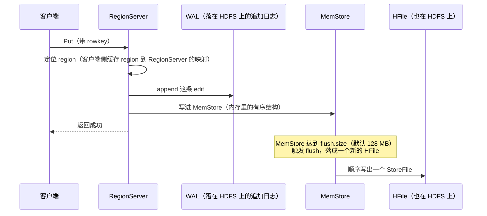

---
tags:
  - 分布式/存储
---

# HBase 与 LSM-Tree

前几篇讲的是"多台机器怎么协作"，这一篇讲**单机上的存储结构** —— 而且它是这批材料里唯一给出**完整代价模型**的一篇。

两半的关系要说清楚：**LSM-Tree 是 1996 年提出的数据结构**（O'Neil 等），用**顺序 I/O 换随机 I/O**，并算出了它什么时候比 B 树便宜；**HBase 是这套结构在 Bigtable 式数据模型上的一个开源落地**，它的 MemStore / HFile / compaction 就是 LSM-Tree 的工程形态。

## LSM-Tree：为什么需要一个新结构

出发点是一个很具体的应用形态：**高性能事务系统里的 History 表** —— 应用持续往表里插行留下活动轨迹，同时事务系统还生成日志。这类负载是**插入密集**的，而 B 树在这种负载下有个结构性弱点：

> **B 树里每个项的插入通常需要两次 I/O** —— 读它所在的那个叶节点、再写回去。

LSM-Tree 的思路是把插入**批量化、延迟化**：

- **把随机的单页写，换成对多页块的顺序读写**；
- **代价是把"一次插入"变成"一次合并步骤的一部分"**，于是延迟与写放大都要重新算。

### 两组件结构

最简形态只有两层：

- **$C_0$ 树在内存**；
- **$C_1$ 树在磁盘**。

流程是：每生成一条新行，**先写一条日志记录（用于恢复这次插入）到 $C_0$**，之后这个项**会随时间迁移到磁盘上的 $C_1$**；任何索引项搜索**先在 $C_0$ 找，再在 $C_1$ 找**。

两个必须记住的性质：

- **在内存 $C_0$ 里插入索引项没有 I/O 代价** —— 但**内存容量的代价相对磁盘很高**，这直接限制了 $C_0$ 的大小；
- 项**在迁出到 $C_1$ 之前有延迟** → 隐含了"崩溃后需要恢复那些还没落盘的索引项"这个需求（这就是 WAL 存在的原因）。

### 滚动合并（rolling merge）

当 $C_0$ 因插入达到接近上限的阈值时，一个**持续的 rolling merge 过程**启动：**从 $C_0$ 删掉一段连续的项，合并进磁盘上的 $C_1$**。

$C_1$ 的目录结构**与 B 树相当，但为顺序磁盘访问做了优化**：**节点 100% 满**，每个层级下面是**单页节点的序列**，以利于磁盘臂使用。（这个优化也用在 SB-tree 里。）**多页块 I/O 正是用在 rolling merge 步骤里**。

一次 merge 步的动作可以拆成四句：

1. **读入一个包含 $C_1$ 叶节点的多页块** —— 这使 $C_1$ 里一段范围的项驻留缓冲区；
2. 逐个处理：**读一个页大小的 $C_1$ 叶节点**（已在该块中缓冲），**把它与从 $C_0$ 叶层取来的项合并**，从而**减小 $C_0$ 的大小**；
3. 合并结果写成**新的 $C_1$ 叶节点**。术语是：装着合并前旧节点的缓冲多页块叫 **emptying block**，新叶节点写到另一个缓冲多页块叫 **filling block**；filling block 填满时整块写到磁盘上一个**新的空闲区**；
4. **新块写到新的磁盘位置，所以旧块不会被覆盖** —— 这一点对崩溃恢复友好（这也是所有 LSM 系结构的共同做法）。

逐层向上的目录节点随之更新，**旧节点在 merge 步完成后失效并被删除**。

### 一次滚动合并步：两个缓冲块怎么配合

把一次 merge 步画出来，能看清“新块写新位置”这条性质是怎么落到工程上的：

```
   C0（内存）
   ┌──────────┐
   │ 连续一段   │
   │ 索引项     │
   └────┬─────┘
        │ ① 从 C0 删掉这段，读进缓冲
        ▼
   ┌────────────────────────────────────────────────┐
   │ emptying block（装着旧 C1 叶节点的多页块）         │
   │   ┌─────┬─────┬─────┬─────┐                    │
   │   │ 叶 1 │ 叶 2 │ 叶 3 │ 叶 4 │  ← ② 逐页取出   │
   │   └──┬──┴──┬──┴──┬──┴──┬──┘                    │
   └──────┼─────┼─────┼─────┼───────────────────────┘
          │  与 C0 的项合并  │
          ▼     ▼     ▼     ▼
   ┌────────────────────────────────────────────────┐
   │ filling block（装着合并结果的新叶节点）           │
   │   ┌─────┬─────┬─────┬─────┐                    │
   │   │新叶1 │新叶2 │新叶3 │新叶4 │  ← ③ 填满即整块写│
   │   └─────┴─────┴─────┴─────┘                    │
   └────────────────────────────────────────────────┘
          │ ④ 写到磁盘上一个新的空闲区
          ▼
      旧块原地不动，merge 完成后才失效、才删除
```

**两个缓冲块的名字值得记：** 装“合并前旧节点”的多页块叫 **emptying block**，装“合并结果”的叫 **filling block**。名字本身就说明了过程 —— 一个在空出来，一个在填满。

### 第 ④ 步是整套结构里唯一一处直接为崩溃恢复服务的设计

**第 ④ 步是整套结构里唯一一处直接为崩溃恢复服务的设计。** 新块写到新位置、旧块原地不动，于是任何时刻磁盘上都有一份完整的旧数据。**merge 中途掉电，丢掉的只是这一轮的进度，不是数据。** 这也解释了 LSM 系为什么不需要 undo —— 它们靠“写新位置”而不是“原地改”来保证旧版本始终可读。

## 代价模型

这一节最有价值，因为它把"LSM-Tree 比 B 树便宜"这件事**算成了公式**。

### 四个成本参数与一个关键比值

| 记号 | 含义 |
| --- | --- |
| $\text{COST}_d$ | 1 MB **磁盘存储**的成本 |
| $\text{COST}_m$ | 1 MB **内存存储**的成本 |
| $\text{COST}_P$ | 提供 1 page/sec I/O 速率的**磁盘臂**成本，**随机页** |
| $\text{COST}_p$ | 提供 1 page/sec I/O 速率的**磁盘臂**成本，**作为多页块 I/O 的一部分** |

**关键比值是 $\text{COST}_p / \text{COST}_P$** —— 它代表 **LSM-Tree 用多页块做全部 I/O 所换来的优势**：**它省掉大量寻道与旋转延迟时间，使同样的磁盘臂能服务多得多的页 I/O。**

这个比值有两个实测来源，**结论都是约 $1/10$**：

- **2 ms/页（多页块）对 20 ms（随机）** → 比值约 $1/10$；
- 对更新的 SCSI-2 盘读一个 **4 KB 页（9 ms 寻道 + 5.5 ms 旋转延迟）** → **同样是约 $1/10$**。

### 插入成本公式

两组件 LSM-Tree 的插入代价是

$$\text{COST}_{LSM\text{-}ins} = \frac{2 \cdot \text{COST}_p}{M}$$

（这里**忽略了索引更新的 I/O 这类相对不重要的成本**。）与 B 树相比：

$$\frac{\text{COST}_{LSM\text{-}ins}}{\text{COST}_{B\text{-}ins}} = K_1 \cdot \frac{\text{COST}_p}{\text{COST}_P} \cdot \frac{1}{M}$$

其中 $K_1$ 是一个近乎常数 $2/(D_e + 1)$，**在考虑的索引规模下约为 $0.67$**。

**这个公式把 LSM-Tree 的两个效率来源写得很清楚**：

1. **$\text{COST}_p/\text{COST}_P$** —— 多页块 I/O 相对随机 I/O 的成本比。**这是一个硬件常数，LSM-Tree 结构本身对它无能为力**；
2. **$1/M$** —— $M$ 是**滚动合并期间批进一个页大小叶节点里的项数**。这是**结构能改善的那一项**。

一个可直接算的算例：**16 字节的索引项，一个完全填满的 4 KB 页的 $C_1$ 叶节点能装 250 项**；若 **$C_0$ 是 $C_1$ 大小的 $1/25$**，那么**每个新 $C_1$ 叶节点 I/O 期间会有约 10 个新项进入**。也就是 $M \approx 10$。

### 判据：什么时候该用 B 树而不是 LSM-Tree

$M$ 不一定大于 1。**若 $C_1$ 相对 $C_0$ 极大，或者项极大、一页只放得下几个**，$M$ 就可能小于 1 —— 含义是**平均每个从 $C_0$ 合并进来的项要带进带出多于一个 $C_1$ 页**。

于是有一条明确的失败判据：

> **若 $M < K_1 \cdot \text{COST}_p / \text{COST}_P$，多页磁盘读的批处理效果会被抵消 —— 这种情况下用普通 B 树做插入反而更好。**

## 两组件的最优 $C_0$：一段操作性推导

"$C_0$ 该多大"没有闭式解，给出的是一段推理，但推得很干净。

设总叶项大小 $S = S_0 + S_1$ 大致稳定，$C_0$ 的插入速率是常数 $R$（字节/秒）。假设 $C_0$ 里插入的项在被合并到 $C_1$ 之前不会被删除，那么**项必须以与插入相同的速率通过 rolling merge 迁出 $C_1$**，才能把 $C_0$ 保持在阈值附近。

**关键因果链**：

> 要维持恒定的迁出速率（字节/秒），**rolling merge 游标必须以恒定速率（字节/秒）扫过 $C_0$ 的项**；因此 **$C_0$ 越小，从最小到最大索引值的循环速率越高**，**$C_1$ 里为执行 rolling merge 所需的多页块 I/O 速率也必须越高**。

推到极端就很直观了：**若 $C_0$ 只能装一个项，那就要求每插入一个新项就循环一遍整个 $C_1$** —— 一句很重的比喻是：**这种"每次插入都去合并 $C_0$ 与 $C_1"而不是像 B 树那样只访问相关节点的做法，会变成套在脖子上的磨石。**

反方向就是内存成本：**$C_0$ 越大，merge 游标循环越慢、插入 I/O 成本越低，但内存驻留组件的成本越高。**

**求最优点的方法是操作式的**：

1. 从**很大的 $C_0$** 开始，把 $C_1$ **紧密打包**在磁盘介质上 —— 此时对 $C_1$ 的 I/O 速率非常小；
2. **逐步减小 $C_0$**，用昂贵的内存换廉价的磁盘空间，直到**服务 $C_1$ 的 I/O 速率上升到"坐在 $C_1$ 介质上的磁盘臂满负荷"那一点**；
3. 从这点再减小 $C_0$，就**必须把 $C_1$ 摊到"半满的盘"上来降低磁盘臂负载**，于是**介质成本开始上升**；
4. 继续减小，**某处到达最小成本点**。

**结论**：两组件 LSM-Tree 里 **$C_0$ 在内存使用上仍然相当昂贵** → 这就是**多组件 LSM-Tree** 的动机。

## 多组件：为什么把比值拉平

**K+1 组件**的结构是：$C_0, C_1, \dots, C_K$ 尺寸递增，**$C_0$ 在内存、其余在磁盘**（热页照常缓冲）；**相邻组件对 $(C_{i-1}, C_i)$ 之间各有一条 rolling merge**，每当较小组件 $C_{i-1}$ 超过阈值就把项移出。**一个长寿的项从 $C_0$ 开始，经 $K$ 次异步的 rolling merge 步最终到达 $C_K$。**

定义相邻组件的**尺寸比**：

$$r_i = \frac{S_i}{S_{i-1}}$$

两个定理把"为什么组件尺寸该按几何级数排"证明了出来：

> **定理 3.1**：若假设**最大组件尺寸 $S_K$ 固定**（连同内存尺寸 $S_0$），则最小化总页 I/O 速率 $H$ 的解是**所有 $r_i$ 相等**，取同一个常数 $r$。
>
> **定理 3.2**：给出**总尺寸 $S$ 固定**时更精确的解；常数 $r$ 在所有实际关心的区域给出相似结果。

取常数 $r$ 就有 $S_i = r^i \cdot S_0$，于是总尺寸

$$S = S_0 + r S_0 + r^2 S_0 + \cdots + r^K S_0$$

可以反解出 $r$ 与 $S$、$S_0$ 的关系。

**这条结论的实际含义**：加入中间组件后，**$C_0$ 可以做得相对整个索引小得多**，从而显著改善成本 —— 因为内存那一层不再需要独自承担"缓冲整个插入流"的任务，中间的磁盘组件按几何级数分摊掉了它。

## 顺带：温度模型与三个成本区间

这里借用了 Copeland 等人的"温度"概念来讨论"数据该不该驻留内存"，这一节对判断任何存储层级都有用。

**温度定义为 $H/S$**（$H$ 是随机页访问率，$S$ 是 MB 数据量）。三种成本区间：

$$T_f = \frac{\text{COST}_d}{\text{COST}_P} \quad(\text{freezing point，cold 与 warm 的分界})$$

$$T_b = \frac{\text{COST}_m}{\text{COST}_P} \quad(\text{boiling point，warm 与 hot 的分界})$$

其中 **warm 与 hot 的分界是 Five Minute Rule 的推广**。成本式是：

$$\text{COST-TOT} = \min\Big(\max(S \cdot \text{COST}_d,\ H \cdot \text{COST}_P),\ S \cdot \text{COST}_m + S \cdot \text{COST}_d\Big)$$

读法是：**磁盘驻留数据**的成本取决于"介质容量"与"磁盘臂服务率"哪个是限制因素，另一个就免费；**而一旦规则要求内存驻留，成本就变成内存项主导**（因为 $\text{COST}_m \gg \text{COST}_d$）。

**1995 年典型工作站成本**可以直接代入：

| 参数 | 值 |
| --- | --- |
| $\text{COST}_m$ | **\$100/MB** |
| $\text{COST}_d$ | **\$1/MB** |
| $\text{COST}_P$ | **\$25/(IOs/sec)** |
| $\text{COST}_p$ | **\$2.5/(IOs/sec)** |
| $T_f$ | **0.04 IOs/(sec·MB)** |
| $T_b$ | **4 IOs/(sec·MB)** |

注意 $T_b / T_f = 100$ —— **"热"与"冷"之间隔了两个数量级的访问密度**，这个跨度本身就说明分层设计为什么有空间。

## 三种放大：这套结构真正在做交易的地方

代价模型算的是插入成本，但 LSM 的取舍要用三个量一起读：

| 放大 | 定义 | 谁买单 |
| --- | --- | --- |
| **写放大** | 一份用户数据在它的生命周期里被重写多少次 | **磁盘寿命与后台带宽**（compaction 越勤越高） |
| **读放大** | 一次读要碰多少个 sorted run | **读延迟**（run 越多，要查的地方越多） |
| **空间放大** | 存 1 字节用户数据实际占多少物理空间 | **介质成本**（未合并的旧版本与墓碑占着地方） |

**三者的关系是不可能三角**：压住其中两个，第三个必然涨。同一套 LSM 思想后来分出这么多算法，原因就在这里 —— **它们之间是并列关系 —— 各自在不同工作负载下选不同的角。**

**回到代价模型那条链**：$M$ 越大（一次 merge 批进更多项），写放大越低；但 $C_0$ 要更大（内存更贵），而 merge 游标扫得更慢（延迟的账）。**前面那个算例 $M \approx 10$，就是在写放大与内存成本之间取的一个点。**

### 五种压实算法各自站在哪

| 算法 | 写放大 | 读放大 | 空间放大 | 适合什么 |
| --- | --- | --- | --- | --- |
| **Classic Leveled**（最初那条路） | 高（最坏等于 fanout） | **低** —— 每层只有一个 sorted run | **最低** | 读多、空间敏感 |
| **Tiered**（RocksDB 里叫 Universal） | **最低** —— 每层一份，per-level 写放大为 1 | 高 | 高（临时空间放大明显） | 写密集、能容忍读放大 |
| **Tiered+Leveled**（RocksDB 的 Level Compaction，**默认**） | 中 | 中 | 中 | 通用 |
| **Leveled-N** | 低 | 较高 | 中 | 写多但还要读 |
| **FIFO** | 不合并，直接丢最旧的文件 | 低 | 低 | 缓存类、时间序列 |

**fanout 是这套词汇里的关键量**：相邻两层的尺寸比。**写放大在最坏情况下等于 fanout**，而前面那条定理 3.1 说明“各层用同一个 fanout 时总 I/O 最小”。**表里那两行“写放大 = 1”与“写放大 = fanout”，本质是 tiered 与 leveled 对“每层要不要只留一份”给出的两种答案。**

### 两处实现层面的分歧

**还有两处实现层面的分歧值得记：**

- **最初那版设计的 compaction 是 all-to-all**（$C_{i-1}$ 的全部与 $C_i$ 的全部合并），**LevelDB 与 RocksDB 改成 some-to-some**（只合并重叠的那部分）。这一步让“按 key 顺序插入”这类负载的写放大明显下降 —— 只重写真正重叠的片段。
- **RocksDB 有一个 `allow_trivial_move` 开关，默认 `false`**：当输入文件与下层不重叠时，**直接把文件搬下去而不重写**。这是 key 顺序插入场景写放大能大幅下降的原因。

**五个算法里只有一个与 HBase 的历史直接相关**：HBase 早期用的 `DateTieredCompactionPolicy` 属于 tiered 一族，**在 2.x 里被移除了**。被它换掉的是一条更朴素的路线：minor compaction 凑够若干个文件就合并（见 `## 两种 compaction 与它们的默认触发条件`）。

## HBase：这套结构的工程形态

HBase 是 HDFS 上的列式（column-oriented，更准确地说是 Bigtable 式的 wide-column）存储。它的架构有三个角色：

| 角色 | 职责 |
| --- | --- |
| **HMaster** | 把 region 分配给 region server（借助 ZooKeeper）、**负载均衡**（卸下忙的服务器、移到空闲的）、schema 变更、建表与建 column family、监控 Hadoop 集群、故障切换、DDL |
| **Region server** | **工作节点**，处理客户端的 CRUD，跑在 **HDFS data node** 上 |
| **ZooKeeper** | **站在客户端与 HMaster 之间**；在 region server 崩溃时把它承载的 region 交给其他正常节点；**记录所有 region server 的信息**（有多少个、各自持有哪些 data node） |

**一条与 Bigtable 类似的分工**：**客户端访问 region 的第一接触点是 ZooKeeper**，因为 master 与 region server 都注册在 ZooKeeper 上。

### Region server 的四个组件——正好是 LSM-Tree 的工程映射

| 组件 | 对应 LSM-Tree 里的什么 |
| --- | --- |
| **MemStore** | **写缓存**，存还没落盘的新数据 —— 就是内存里的 $C_0$ 树 |
| **WAL（Write Ahead Log）** | 存还没写入永久存储的新数据 —— 对应"迁移前需要先记日志以支持恢复" |
| **HFile** | **真正存**排序后键值的文件 —— 就是磁盘上的多层 $C_i$（HBase 的技术报告里没写 compaction 的细节，但 HFile 的"有序"性质正是 rolling merge 的前提） |
| **Block cache** | **读缓存**，缓存满时淘汰最近的数据 —— 对应"热页照常缓冲" |

**表与 region 的关系**：表由多个 **region** 组成，每个 region **由 startkey 与 endkey 定义**；**schema 里只有父 column family 是固定的**，其他列在表中**动态添加**；每个 cell 关联到特定的 column family 与列名。

> **region 是按 row key 范围切分的**：每个 region 由 **startkey 与 endkey** 定义，落在这段范围内的行归该 region。**column family 是 region 内部的纵向分组**（同一行不同列族各自存在独立的 Store 里），两者是不同维度上的划分，不要混为一谈。


## HBase 的写路径与读路径

四个组件（MemStore / WAL / HFile / Block cache）怎么串成两条路径，值得分开画一遍。



**写路径的顺序不能反：先 WAL，后 MemStore。** MemStore 是内存，掉电就没了；WAL 是这条 edit 唯一的持久副本。返回给客户端的时机在 WAL append 之后。

**这里有一处与自建数据库不同的地方**：HBase 的 WAL 本身落在 HDFS 上，而 **HDFS 已经在底下做了多副本**。于是“WAL 写到哪一层才算持久”这个问题被外包给了 HDFS —— 这是本篇唯一一处**耐久性依赖另一个系统**的地方。它也解释了为什么调 HBase 的写入耐久性，实际要动的是 HDFS 的副本数与同步策略。

读路径是四个组件第一次一起出场的地方：

```
   一次 Get / Scan（rowkey 已知）
        │
        ▼
   BlockCache（默认占最大堆 40%）── 命中即返回
        │ 未命中
        ▼
   MemStore ── 命中即返回（这里的数据最新）
        │ 未命中
        ▼
   若干 StoreFile（HFile），从新到旧
        ├─ ① Bloom filter（列族级 BLOOMFILTER，默认 ROW）
        │      说这个文件不含该 row 就整个跳过
        ├─ ② 读索引块，定位到数据块（BLOCKSIZE 默认 65536 字节）
        └─ ③ 读数据块，取出候选版本
        │
        ▼
   合并各来源、各文件的版本；墓碑按语义屏蔽旧值
```

**读路径的成本完全由“要问几个来源”决定**：BlockCache、MemStore，再加 n 个 StoreFile。**这就是读放大的具体形态** —— 它落在“一次读要碰几个文件”上，而不是一个抽象比值。于是所有治理 StoreFile 数量的措施（minor compaction、`hbase.hstore.blockingStoreFiles`）都在直接改善读延迟。

**BlockCache 占最大堆 40%，MemStore 的总上限也是 40%** —— 两者合起来已经吃掉堆的八成。**一个默认配置的 RegionServer，堆里几乎没有留给别的东西。** 这是“RegionServer 的堆要按堆内缓存与堆外缓存分开规划”这条运维常识的来源。

**写路径与读路径的分工还有一处不对称值得记。** 写路径上唯一同步等待的点是 **WAL append**；读路径上唯一同步等待的点是**磁盘上的那次数据块读**。**两者的差别在于“等多久可控”** —— WAL 是顺序追加，延迟基本稳定；数据块读要跨文件、跨来源，延迟随 StoreFile 数量波动。**这就是“LSM 系统写延迟比读延迟稳”这句话的机制来源。**

**另一处不对称在缓存归属上。** 写路径只用 MemStore（内存），读路径同时用 BlockCache 与页缓存。**两块缓存各自独立淘汰，谁也不为对方让路** —— 一次大范围 Scan 把 BlockCache 冲掉之后，写路径的 MemStore 一点都不受影响。**这个隔离是好事，代价是“缓存调优”这件事在读侧要做两遍。**

**最后补一处与“哪个组件最值得先动”有关的判据。** 写路径上要动的组件只有 WAL 与 MemStore 两个，**而 MemStore 的上限同时受三个参数约束**（单 MemStore 的 flush.size、全局的 40% 堆、以及 4 倍的阻塞倍数）；读路径上要动的有三个来源（BlockCache、页缓存、StoreFile 数）。**写侧是一个组件、多个阀门，读侧是多个组件、各自有阀门** —— 这解释了为什么写侧调参容易调出“看不出效果”（阀门太多，动错一个就白调），而读侧容易调出“顾此失彼”。

## 两种 compaction 与它们的默认触发条件

HBase 的 compaction 分两档，差别不只是“合并多少文件”。

```
   minor compaction（默认阈值 3）
   ┌────┬────┬────┐
   │ F1 │ F2 │ F3 │        ← 同一 Store 下若干个（默认 ≥3）StoreFile
   └────┴────┴────┘
        │ 合并成一个
        ▼
      ┌────┐
      │ F' │              ← 结果是一个新 StoreFile
      └────┘
   范围：只挑符合条件的若干文件（单次最多 10 个）
   作用：把重叠的版本合掉，减少文件数
   触发：文件数达到 hbase.hstore.compaction.min（默认 3）

   major compaction（默认 7 天一次）
   ┌────┬────┬────┬─────┬────┐
   │ F1 │ F2 │ F3 │ F4  │ F5 │   ← 该 region 该列族下全部 StoreFile
   └────┴────┴────┴─────┴────┘
        │ 全部合并成一个
        ▼
   ┌──────────────────────────┐
   │            F'            │   ← 顺带把墓碑与过期版本真正删掉
   └──────────────────────────┘
   触发：hbase.hregion.majorcompaction 默认 604800000 ms（7 天）
         hbase.hregion.majorcompaction.jitter 默认 0.50（把时间点摊开）
         设为 0 可以关掉定时 major，改由手工触发
```

**两档的关键差别是“墓碑什么时候真的消失”。** minor 不做全量重写，所以**墓碑只是被合并、不会因为“下面再也没有旧版本”而消失**；只有 major 把该列族全部文件合成一个时，**墓碑才能连同它遮蔽的旧版本一起被物理删掉**。

**因此这组参数是互相牵制的：`hbase.hregion.majorcompaction` 决定了墓碑真正被清理的周期。** 把它设成 0（关掉定时 major）能避免周期性 I/O 尖刺，**代价是墓碑一直累积到有人手工触发 major 为止** —— 而墓碑累积直接推高读放大与空间放大。

**另一处必须同时看的是 `hbase.hstore.blockingStoreFiles`（默认 16）。** 它是写路径上的保护阀：**一个 Store 里的 StoreFile 超过 16 个，该 region 的更新会被阻塞，直到 compaction 完成或超时。** 于是 minor compaction 跟不上写速度时，症状是**写直接卡住**，而不是“读变慢” —— 这是最容易被误判成“集群故障”的一类现象。

### major 的时间点为什么要摊开

**jitter 默认 0.50 的作用是把 major 的时间点摊开。** 不加抖动的话，一台 RegionServer 上所有 region 会在同一时刻一起做 major，形成周期性的 I/O 尖刺。**这个默认值本身就说明了一件事：major compaction 是全局性的资源事件，必须被主动打散。**

## region、Store 与分裂

三个层级的关系容易被写混，用一张图钉住：

```
   表
    └── region（按 row key 范围切分，由 startkey / endkey 定义）
          └── column family（纵向分组）
                └── Store（一个 region 里的一个列族 = 一个 Store）
                      ├── MemStore（该 Store 的内存写缓冲）
                      └── 若干 StoreFile（= HFile，磁盘上按 key 排序）
```

两处容易记错的：

- **region 按 row key 的横向范围切，column family 是同一 region 内部的纵向分组。** 两者是不同维度，谈“切分”时要说清切的是哪个方向。
- **Store 是“region × column family”这个组合的单位**，所以一个 region 有几个列族就有几个 Store，每个 Store 各自有 MemStore、各自做 compaction。

### 打开文件数由什么决定

**打开文件数直接由这个结构决定。** 官方给的估算是 `(每个列族的 StoreFile 数) × (每台 RegionServer 的 region 数)`，例子是“每 region 3 个列族、每列族平均 3 个 StoreFile、每台 100 个 region” → **3 × 3 × 100 = 900 个文件描述符**（还不含 JAR 与配置文件）。**这就是“列族不要建太多”这条建议的算术依据** —— 列族数在公式里是最外面那一项。

**分裂由 `hbase.hregion.max.filesize`（默认 10737418240，即 10 GB）触发**：一个 region 的 HFile 总量超过它，region 就一分为二。默认策略是 **`SteppingSplitPolicy`**（早期默认是 `ConstantSizeRegionSplitPolicy`，按固定阈值切），另有 `BusyRegionSplitPolicy`、`KeyPrefixRegionSplitPolicy`、`DelimitedKeyPrefixRegionSplitPolicy`，以及会**连手工分裂一起禁止**的 `DisabledRegionSplitPolicy`。

**分裂还有一个总量阀门**：`hbase.regionserver.regionSplitLimit` 默认 `1000`；官方明确说它**是“到这个量级就停止分裂”的指导值，而非硬上限**。

**分裂的代价落在“新 region 要先搬家”上**：分裂出来的子 region 要等数据真正写过去、旧引用被释放才算完成。**它把一次突发的写压力换成了一次后台搬迁。** 预分区（建表时先按 key 前缀把 region 划好）要解决的正是这件事 —— **让分裂发生在可控的时刻，而不是在流量峰值上被触发。**

## 底层依赖：本地文件系统、HDFS 与一块堆内内存

这套结构看上去全在用户态，实际压着四层底座，而且**每一层都直接决定了某个上层参数的取值**。

**依赖一：本地文件系统与页缓存。**

HFile 是磁盘上按 key 排序的文件，读它时**实际有两层缓存**：HBase 自己的 BlockCache，和**操作系统的页缓存**。默认配置里 BlockCache 拿 40% 堆，而页缓存拿的是整台机器除去 JVM 之后剩下的内存。**这两者的比例决定了“命中率提升该从哪来”** —— 前者改配置，后者改机器规格或调小 JVM 堆上限。

**这也是 LSM 结构在现代机器上“看起来比当年快”的一个原因**：前面那个 20 ms 是当年的磁盘臂时间，而现在一次“读 HFile”多半是一次页缓存命中。**代价是它把一部分性能放到了配置体系之外** —— 页缓存命中率不是 HBase 的参数，是机器规格的函数。

**依赖二：HDFS。**

HBase 把数据、WAL 与 `hbase:meta` 都放在 HDFS 上。这一条带来的连锁关系比看上去长：

- **WAL 不逐条 fsync，是因为 HDFS 的耐久性已经在底下兜住了**。所以调 HBase 的写耐久性，实际要动的是 HDFS 的副本数与 `dfs.*` 的同步策略；
- **HDFS 的块大小与副本数决定了 HBase 的顺序 I/O 有多“顺序”** —— 这是 LSM 赖以成立的那条“顺序比随机便宜”的前提在下层的投影；
- **“HBase 的数据有几份”这个问题在 HBase 这一层没有答案**，它由 HDFS 的副本因子给出。

**依赖三：一块堆内内存（最紧的一处）。**

BlockCache 40% + MemStore 40% = 80% 的堆。剩下 20% 要同时装下读路径的对象、compaction 的缓冲区，以及 RPC 与网络层的开销。**这条依赖的形态是“总量固定、只能决定怎么切”**，所以 RegionServer 的内存规划本质是一次分配问题，而不是一次扩容问题。

`hbase.hregion.memstore.mslab.enabled` 默认 `true`，官方对它的描述是“减少重写负载下的堆碎片” —— **一个默认开启、且描述里明确写着“防止堆碎片”的开关，等于承认这块内存会被反复分配与释放。** 它是这条依赖最直接的一块补丁。

**依赖四：ZooKeeper。**

它承担三件事：客户端与 RegionServer 之间的第一接触点、region server 崩溃时把 region 重新分配、以及记录所有 RegionServer 的信息。会话超时 `zookeeper.session.timeout` 默认 **90000 ms（90 秒）** —— 这个值决定“多久判定一个 RegionServer 失联”，因此它同时是 region 重分配的最短等待时间。**它是这套结构里唯一一处“用秒数表达可用性”的参数。**

**四处依赖排成一张表：**

| 依赖 | 承担什么 | 换得掉吗 |
| --- | --- | --- |
| 本地文件系统 + 页缓存 | HFile 的读取与缓存 | **换不掉**；但它与 BlockCache 的比例决定内存该怎么分 |
| HDFS | 数据、WAL、meta 的持久性与副本 | 换得掉，代价是丢掉“WAL 耐久性外包”这条便利 |
| 堆内内存 | MemStore 与 BlockCache | **换不掉**；只能改分配比例 |
| ZooKeeper | 第一接触点、region 重分配、成员信息 | 换得掉，代价是失去一个稳定的“谁在哪”的真相来源 |

**一处值得单独指出的事实：这套结构里没有任何一处依赖时钟。** 合并顺序由 key 顺序与文件新旧决定，冲突由写在 cell 上的版本号决定，而这个版本号不需要物理时钟同步。**它和 [[06-Aurora|Aurora]] 一样不需要时间设施，但理由完全不同** —— Aurora 靠共享存储与法定人数，这里是因为**单机结构里根本没有需要定序的并发写者**。

**这份依赖清单还解释了一处常见的误判。** 看到“HBase 写很慢”，第一反应往往是调 MemStore 或 WAL；但**在 HDFS 侧的队列一旦积压，HBase 这一层的所有参数都调不出效果** —— 因为 WAL append 与 HFile flush 最终都落在同一个 HDFS 上。**判断顺序应该是：先看 HDFS 的写入延迟与队列，再看 HBase 的参数。**

**反过来，“读很慢”很少是 HDFS 的问题。** 读路径上最有价值的是缓存命中率（BlockCache 与页缓存），而这两块都在这台机器上。**写慢往下一层看，读慢往本机缓存看** —— 这是这篇里最实用的一条分诊原则。

## 参数与可调项

这份参数表可以按“它保护的是哪一侧”分成三组：**保护写、保护读、保护后台**。

| 参数 | 默认值 | 语义 | 动它的后果 |
| --- | --- | --- | --- |
| `hbase.hregion.memstore.flush.size` | **134217728**（128 MB） | MemStore 超过它即 flush | 调小 → HFile 更多、compaction 更频繁；调大 → 单次 flush 更久、崩溃后要重放的 WAL 更长 |
| `hbase.hregion.memstore.block.multiplier` | **4** | MemStore 达到 4 × flush.size 时**阻塞写入** | 防写尖峰失控的阀；调大等于允许更长的阻塞前缓冲 |
| `hbase.hstore.blockingStoreFiles` | **16** | 单 Store 的 StoreFile 超过它就**阻塞该 region 的更新** | 真正的保护阀。调大能扛住 compaction 积压，代价是读放大继续恶化 |
| `hbase.hstore.compactionThreshold` | **3** | 文件数达到它触发 minor compaction | **已改名为 `hbase.hstore.compaction.min`**；调小更勤，调大更省 I/O 但文件更多 |
| `hbase.hstore.compaction.max` | **10** | 单次 minor 最多选几个文件 | 调大 → 单次合并更久，但文件数下降更快 |
| `hbase.hregion.majorcompaction` | **604800000**（7 天） | 定时 major 的间隔 | **设 0 关掉定时 major** → 没有 I/O 尖刺，但墓碑不再被自动清理 |
| `hbase.hregion.majorcompaction.jitter` | **0.50** | major 时间点的抖动系数 | 调小 → 尖刺更集中；这是把 major 摊开的手段 |
| `hfile.block.cache.size` | **0.4** | BlockCache 占最大堆的比例 | **与 `global.memstore.size` 此消彼长，两者之和不能超堆** |
| `hbase.regionserver.global.memstore.size` | 有效 **0.4**（XML 里留空以兼容旧名） | 全 RegionServer 的 MemStore 总上限 | 超过则阻塞更新并强制 flush |
| `hbase.regionserver.global.memstore.size.lower.limit` | 有效 **0.95** | 达到总上限的 95% 就强制 flush | 留出 5% 缓冲，避免刚好撞上限才动手 |
| `hbase.regionserver.optionalcacheflushinterval` | **3600000**（1 小时） | 一条 edit 在内存里最多活多久 | **设 0 关掉定时 flush** —— 低频写的表省 flush，但恢复时 WAL 更长 |
| `hbase.regionserver.handler.count` | **30** | RPC handler 线程数 | 读多调高、写多调低；过高会让请求在线程间抢锁 |
| `hbase.client.write.buffer` | **2097152**（2 MB） | 客户端写缓冲 | 调大省 RPC，代价是客户端内存与“最后一批没发出去”的窗口 |
| `zookeeper.session.timeout` | **90000**（90 秒） | ZK 会话超时 | 决定“多久判定 RegionServer 失联”，也就决定了 region 重分配的最短等待 |
| `hbase.hregion.max.filesize` | **10737418240**（10 GB） | region 分裂阈值 | 调大 → region 更少但更大，单 region 的 compaction 更重 |
| `hbase.regionserver.region.split.policy` | **`SteppingSplitPolicy`** | 分裂策略 | 另有按固定阈值、按忙闲、按 key 前缀等几种 |
| `hbase.regionserver.regionSplitLimit` | **1000** | 停止分裂的指导值 | **是指导值而非硬上限**，官方给的就是这个说法 |
| `hbase.hregion.memstore.mslab.enabled` | **true** | 减少重写负载下的堆碎片 | 关掉通常只在小堆上更省内存 |

### 四条调参纪律

**第一条纪律：BlockCache 与 MemStore 是同一个预算里的两项。** 两个比例加起来不能超堆，“同时调大”是做不到的，只能选一个。**这是 RegionServer 调优里最容易犯的错 —— 把两者当成独立的参数分别往上调。**

**第二条纪律：三处“阻塞写”的参数是同一套保护的三个层级。** `memstore.block.multiplier`（单个 MemStore 到 4 倍）、`global.memstore.size`（全局到 40% 堆）、`blockingStoreFiles`（单 Store 到 16 个文件）。**它们在做同一件事：宁可让写等，也不让内存或文件数失控。** 看到写被阻塞，要分清是哪一层先动的手 —— 三层的处置完全不同。

**第三条纪律：墓碑与 major compaction 是一个联合决策。** 关掉定时 major 之后，墓碑只在手工 major 或 region 分裂时才被清理。**“关掉 major 省下的 I/O”与“墓碑一直压着读放大”是一笔账的两半。**

**第四条纪律：三处“能关掉的定时器”要一起看。** `hbase.hregion.majorcompaction`（7 天）、`hbase.regionserver.optionalcacheflushinterval`（1 小时），以及 compaction 本身没有定时器但有阈值。**把定时器关掉能消除周期性尖刺，代价是把触发权完全交给“量”** —— 而量的触发是不可预测的。

**一处已经消失的参数**：`hbase.hstore.compaction.date.tiered.*` 那一系列随 `DateTieredCompactionPolicy` 一起**在 2.x 里被移除**。照抄旧版本文档里的这一族参数，会得到“配置无效但不报错”的结果。

## 版本演进：同一套思想的三条分支

**三个节点立住了这条路：**

```
   1996   LSM-Tree 原始设计   两组件结构 + 滚动合并 + 代价模型
     │                        · 给出“什么时候该用 B 树”的判据
     │                        · compaction 是 all-to-all
     ▼
   2006   Bigtable            把 LSM 放进分布式系统：memtable + SSTable + Chubby
     │                        · 确立“内存刷成文件、再后台合并”这条形态
     ▼
   2008+  HBase               这套结构在 HDFS 上的开源落地
     │                        · MemStore / HFile / WAL / BlockCache
     │                        · 用 ZooKeeper 替代 Chubby
     ▼
   2011   LevelDB             compaction 从 all-to-all 改成 some-to-some
     │                        · 引入分层与 fanout 的工程实现
     ▼
   2012   RocksDB             LevelDB 的分支，补上策略谱系：
     │                        · Level（默认）/ Universal / FIFO
     │                        · allow_trivial_move：不重叠时直接搬文件
     ▼
   2018   设计空间的整理        Classic Leveled / Tiered / Tiered+Leveled /
                             Leveled-N / FIFO —— 五种算法各自的三个放大
```

**四条最初的设计判断，后来的下场：**

| 最初的设计判断 | 后来的处理 |
| --- | --- |
| compaction 是 all-to-all | LevelDB / RocksDB 改成 **some-to-some**（只合并重叠部分），顺序写场景的写放大明显下降 |
| 各层用同一个 fanout | **保留下来并成了默认** —— RocksDB 的默认策略就是 leveled 一族 |
| $C_0$ 在内存、其余在磁盘 | 保留；现代实现细化为 memtable 层 + L0（可多层文件）+ 分层 |
| 多组件（K+1 层）解决内存成本 | 保留；层数与层尺寸倍率变成可配项（如 `target_file_size_base` 默认 64 MB） |

**HBase 这一侧走过的路与上面不同步。** 它先用了 `DateTieredCompactionPolicy`（tiered 一族，对时间序列友好），**在 2.x 里把这个策略连同参数一起移除**，回到更朴素的 minor / major 两档。同一时期 HBase 2.x 还改了三件事：

- **分裂策略的默认值换成 `SteppingSplitPolicy`**（早期是固定阈值那一种）；
- **in-memory compaction 作为一类可选的 MemStore 实现出现** —— 官方参数 `hbase.systemtables.compacting.memstore.type` 默认 `NONE`，可设 `BASIC` / `EAGER`，当前作用范围是系统表；
- **运行环境升级**：JDK 11 支持自 **2.3.0** 引入，JDK 17 支持自 **2.5.x** 引入；Hadoop 3 的构件自 **2.5.2** 起提供。

**3.x 的目标已经写在官方的升级路径文档里**：RegionServer Grouping 被重新实现，`hbase:namespace` 表被并入 `hbase:meta`。**注意这条演进的方向** —— 把一张单独的系统表折进另一张，是在减少“需要单独维护一致性的结构”；2.x 把 Master Procedure Store 改成由标准 region 承载，是同一个取向。

**这三条分支在“谁是事件驱动者”上也不一样。** leveled 由“某层超过了尺寸比”驱动；tiered 由“同尺寸文件够多了”驱动；FIFO 根本不看数据，只看文件年龄与总量。**触发条件不同，直接决定了负载曲线上的尖峰形状** —— FIFO 的尖峰只来自文件过期，另外两者的尖峰来自数据本身。

### 还有一条没变的

**还有一条“没变”值得记：从 1996 到今天的实现里，滚动合并那四步动作没有变** —— 读入旧块、逐页合并、写满新块、写到新位置。变的是层数、每层留几份、以及合并哪些部分。**结构没有被推翻，被反复调整的是策略。** 这也是本篇把 LSM-Tree 与 HBase 放在一起讲的理由：**一边是不变的那部分，一边是随负载而变的那部分。**

**这三条分支后来出现过一次值得注意的收敛。** Tiered 与 leveled 最初被当成两条对立路线（一个省写、一个省空间），而 **Tiered+Leveled 把两者按层组合起来** —— 小层用 tiered（吸收写入），大层用 leveled（压住空间）。**RocksDB 把这个组合做成了默认策略**，等于承认“单一策略在整棵树上都不最优”。

**HBase 这一侧的走向略有不同**：它把 tiered 一族的 `DateTieredCompactionPolicy` 移除，回到 minor / major 两档。**这一步把“策略选择”从 compaction 挪到了上层的 region 划分上，而非技术上的退步** —— 时间序列场景在 HBase 里通常靠建表时的预分区与 TTL 来解决，而不是靠一个专门的 compaction 策略。

**换句话说：同一套 LSM 底座，RocksDB 选择在 compaction 层做适配，HBase 选择在数据模型层做适配。** 这是两条分支分道扬镳的地方。

**三条分支今天的状态也可以一句话概括。** 原始那条（leveled）留在 RocksDB 与后续实现里当了默认；tiered 那一族被拆成 Universal 与 FIFO 两个具体策略；tiered+leveled 这个组合成了“既要写吞吐又要空间控制”时的落点。**而 HBase 走的是第三条路 —— 把适配推给数据模型，compaction 只留两档。**

**最后一条与“该怎么选”有关。** 五种算法里**只有 FIFO 不做合并** —— 它直接丢最旧的文件，因此写放大与空间放大同时最低，读放大只取决于当前保留的文件数。**时间序列场景之所以常选它，是因为“最旧的先没价值”这条业务语义恰好与它对齐。** 其余四种都要靠合并来维持，区别只在合并的激进程度。

## 不适用于什么：这套结构在什么条件下会输给 B 树

**成立前提**

- **写多读少，或者读有局部性。** LSM 把写成本摊给后台，代价是读要碰多个来源；读一旦没有局部性（随机点查、大范围 Scan），这个代价立刻显形。
- **能接受“删除延后生效”。** 墓碑要先被合并、再由 major compaction 物理删除；**“删了之后空间马上回来”在 LSM 上不成立。**
- **后台 I/O 有余量。** compaction 抢的是同一块盘。**写满盘的系统上，compaction 会与前台争带宽**，而这条争抢在配置上只有一个间接旋钮。
- **key 分布不极端。** 单调递增的 key（时间戳、自增 id）会让写入集中到 region 末尾，形成热点 region；要靠预分区或加盐 key 对冲。
- **能接受空间放大暂时超过数据量。** 未合并的旧版本、墓碑、compaction 中间产物都会占地方。

**前提被违反时的后果**

| 违反的前提 | 后果 |
| --- | --- |
| 读必须有稳定低延迟 | **读放大随 StoreFile 数上升**；`blockingStoreFiles` 到顶之前，延迟已经在恶化 |
| 要求删除立刻释放空间 | 空间不回来，一直等到 major；**把 major 关掉就等于永远不回来** |
| 后台带宽不足 | compaction 积压 → StoreFile 到 16 个 → **写被阻塞**（症状从“慢”变成“停”） |
| key 单调递增 | 写入集中在一个 region，**该 region 频繁 flush 与 compaction，其他 region 空闲** |
| 小表 / 低写入量 | compaction 的开销由后台承担，但配置与运维的面一点没少 —— **小场景下 B 树类实现更省事** |

**最初那份设计自己给出的判据，仍然是最明确的一条**：**若 $M < K_1 \cdot \text{COST}_p / \text{COST}_P$，多页磁盘读的批处理效果会被抵消 —— 这种情况下用普通 B 树做插入反而更好。** 翻译成工程语言：**当一个页里装不下几个项、或者内存那一层相对磁盘小得可怜时，LSM 的核心机制（批量化）就没有作用对象了。**

**与相邻结构的对照**

| | LSM（HBase / RocksDB） | B 树 | [[02-Bigtable\|Bigtable]] | [[06-Aurora\|Aurora]] |
| --- | --- | --- | --- | --- |
| 写路径 | 追加 + 后台合并 | 原地改页 | 追加 + 后台合并 | 只发 redo 日志 |
| 删除 | 墓碑，延后清理 | 页内直接改 | 墓碑 | 由引擎管 undo |
| 读放大 | 由 sorted run 数决定 | 由树高决定 | 同 LSM | 由单段读决定 |
| 空间放大 | 有（旧版本 + 墓碑） | 小 | 有 | 视 checkpoint 策略 |
| 后台负载与前台的关系 | 争同一块盘 | 争同一块盘 | 争同一块盘 | **被设计成负相关** |

**这张表的最后一列是本栏里唯一一个把“后台负载与前台负载”做成反向关系的系统。** 在 LSM 与 B 树这两条路上，后台 compaction 或刷脏页都会与前台争资源 —— **差别只在争的方式**：B 树争随机 I/O，LSM 争带宽。

**这解释了一个常见现象：把 LSM 系统调得“写更快”，往往会让读更慢** —— 省下的写 I/O 被 compaction 吃掉了，而 compaction 的产物是更多的 StoreFile，最终落到读路径上。**写侧与读侧在这个结构里是同一笔 I/O 预算的两种花法，并非两个独立的性能面。**

**这张对照表还能读出一处结构性的差别：四者里只有 Aurora 把“后台负载”做成了设计变量。** LSM 与 B 树的后台活动都是“必须做的事，尽量不影响前台”，而 Aurora 明确把后台与前台设成负相关 —— **前台忙时后台主动推迟，推迟的下限由一个来自前台的数字（PGMRPL）给出**。

**LSM 这边没有这样的机制**，能做的只是把 compaction 的带宽上限调一调（RocksDB 的 `max_background_jobs` 默认 2、HBase 的 `hbase.hstore.blockingStoreFiles` 默认 16）。**两者都是在“后台压不住”时才介入的保护阀，而不是一个主动的调度关系。** 这个差别来自结构本身：LSM 的后台任务（合并文件）与前台任务读的是同一批文件，**没法在不影响数据可见性的前提下无限推迟**。

**还有一处边界要单独说：这套结构在“小规模”上是吃亏的。** 前面那个代价模型里，优势来自 $1/M$ 这一项 —— 也就是“一次合并要处理多少项”。**表很小、写入很慢时，$M$ 也会很小**，甚至落到那条判据的反面。**这时运维面的成本（列族、region、compaction、GC 这一整套）一点没少，收益却拿不到。** 判断该不该上 LSM，规模与写入速率要一起看，不能只看“写多”。

## 排查：从症状到判据

```
   症状
     │
     ├─ 写被卡住（不是慢，是停）──▶ 先看哪一层保护阀动了手
     │                                 ├─ 单 Store 文件数 ≥ 16 ⇒ blockingStoreFiles
     │                                 ├─ 全局 MemStore ≥ 40% 堆 ⇒ 强制 flush
     │                                 └─ 单个 MemStore ≥ 4 × flush.size ⇒ block.multiplier
     │
     ├─ 读延迟随时间上升 ────────▶ 看 StoreFile 数在涨，还是 compaction 落后
     │                                 └─ 都在涨 ⇒ compaction 吞吐不足，不是缓存不够
     │
     ├─ 删了空间也不下降 ────────▶ 看墓碑数与上次 major 的时间
     │                                 └─ major 被关了 ⇒ 墓碑永远不物理删除
     │
     ├─ 周期性 I/O 尖刺 ─────────▶ 看 majorcompaction 周期与 jitter
     │                                 └─ jitter 太小 ⇒ 多个 region 同时 major
     │
     ├─ 只有一段 key 慢 ─────────▶ 看 region 的 key 分布
     │                                 └─ 单调递增 key ⇒ 热点 region，预分区或加盐
     │
     └─ RegionServer 频繁被判失联 ▶ 看 ZK 会话超时与 GC 停顿
                                       └─ 90 秒超时 + 长 GC ⇒ 误判，方向在内存不在 ZK
```

**三条判读原则**

1. **先分清“变慢”与“被阻塞”，两者处置相反。** 变慢是资源竞争，减负载或加资源都有效；**被阻塞是保护阀生效，说明某个上限已经被撞到** —— 这时加资源只是把上限抬一点，根因还在产生压力的那一边（通常是 compaction 跟不上）。
2. **读问题先看文件数，写问题先看 WAL 与内存。** 两条路径的旋钮几乎不重叠：读侧是 BlockCache、Bloom filter、StoreFile 数；写侧是 WAL、MemStore 上限、flush 频率。
3. **“空间不降”几乎总是墓碑，而不是数据没删掉。** 删除在 LSM 上是一次写 —— 写进去一个墓碑，等 major 把它与旧版本一起物理删除。**先确认 major 有没有在跑，再去查数据本身。**

**一处必须与 compaction 一起看的东西是 split 策略。** 分裂与 compaction 都在搬数据，而**分裂之后子 region 的数据要靠 compaction 真正落进自己的 Store**。于是“region 数在涨、但延迟没改善”这类现象，原因往往在**分裂策略持续制造新的搬迁任务**，而非 compaction 不够。**判断顺序是：先看 region 数是否稳定，再看 compaction 是否跟得上。**

**最后一处要分清的是“阻塞”与“限流”这两个不同的机制。** `blockingStoreFiles`、`global.memstore.size`、`memstore.block.multiplier` 这三者做的是**阻塞**：让持续的写请求停下来等。而 `hbase.regionserver.handler.count`（默认 30）做的是**限流**：请求还在排队，只是并发的处理者有限。**两者的症状都是写变慢，但一个是队列不进、一个是队列太长** —— 前者要靠压后台（compaction、flush），后者要靠加处理线程或降低单请求成本。

**区分它们的一个直接办法是看延迟的分布形状。** 阻塞会让延迟出现一个明显的平台（写卡在一个固定值上等），限流会让延迟随队列长度平滑上升。**平台在对数坐标上很显眼；而平滑上升意味着该查的是单请求成本，或者加线程。**

**把上面几条原则再压成一句可执行的话：先定层，再定参数，最后才定量。** “定层”是确认症状在哪一层产生（客户端 / RegionServer / HDFS）；“定参数”是确认那一层里哪个阀门在起作用；“定量”才是决定调大还是调小。**三步的顺序不能换** —— 换序就会出现“调了三个参数、症状没变”这种最常见的结果。

### 最后一条与内存有关

**最后一条与内存有关。** BlockCache 与 MemStore 共享 80% 的堆，**任何一侧的调整都会改变另一侧的有效容量**。所以“加内存之后延迟变好了”这个结论要谨慎：**加内存同时放大了两个缓存，无法区分是哪一侧见效**。要判断根因，得先只调一侧的比例再看。

**最后补一处与前面对照表相呼应的判据。** 上面那张表里，LSM 与 B 树都被归成“后台与前台争同一块盘”。**但两者争的方式不同：B 树争的是随机 I/O，LSM 争的是带宽。** 这条差别决定了遇到瓶颈时该往哪个方向调 —— **B 树侧优先看 IOPS 与队列深度，LSM 侧优先看磁盘吞吐与 compaction 的带宽上限**。

**这也解释了为什么“把 LSM 的写调快”常常换来读变慢**：省下的随机写被换成了后台的顺序写，而顺序写的产物是更多的 StoreFile。**写侧省下来的每一份 I/O，都会在读侧以“多查一个文件”的形式回来。**

**还能再往前推一步：把“该动哪一类参数”变成一句可以直接执行的话。** 三步的顺序是 —— **先看是哪一侧的症状（读还是写）→ 再看是哪一层在拦（单个 Store / 单台 RegionServer / 整个 HDFS）→ 最后才动那一个参数。** 跳过前两步直接调参，最常见的后果是把压力从一层挤到另一层：比如为了缓解写阻塞去调大 `blockingStoreFiles`，结果读延迟跟着涨；为了缓解读延迟去调大 BlockCache，结果 MemStore 的可用堆变小、flush 更频繁。

**最后补一条与“调参顺序”有关的判据。** 遇到写被阻塞时，先确认 `blockingStoreFiles` 是不是被撞到的那一层（它是最外层、症状最明显的一个）；如果它没到而写已经卡了，说明拦在 MemStore 那一层，要看的是全局 40% 堆与 4 倍阻塞倍数。**从外往里查，比从参数表头开始查快得多。**

**三层作用范围之外还有一层“不属于这几层”的问题：客户端侧。** 批量写的缓冲区（`hbase.client.write.buffer` 默认 2 MB）满了才发一次 RPC，**于是“应用看到的写延迟”里包含了攒批的等待**。这条延迟不在 RegionServer 的任何指标里，**排查时最容易被漏掉** —— 服务端一切正常，应用却在抱怨写慢，第一件该确认的就是客户端缓冲有没有被攒满。

### 上面这张症状表要配合一条时间尺度来读

**上面这张症状表要配合一条时间尺度来读。** 同一个参数在不同时间尺度上是不同的问题：`hbase.hregion.memstore.flush.size`（128 MB）是**秒到分钟级**的节奏；`hbase.hstore.blockingStoreFiles`（16 个文件）是**分钟到小时级**的积压；`hbase.hregion.majorcompaction`（7 天）是**周级**的事件。**尺度和处置窗口是同一条线** —— 秒级的问题只能靠自动机制解决，周级的问题才留得下人工介入的空间。

**这也决定了“该不该关掉定时器”这个决策的形态。** 关掉 7 天的 major，等于把一个周级事件变成“由积压量触发”，而积压量的触发点是不可预测的 —— **你用一个可安排的事件，换来了一个不可安排的事件。** 只有当“墓碑与旧版本带来的空间/读放大”确实可控时，这笔交换才划算。

**最后一条与“观测点该放在哪”有关。** HBase 侧暴露的是 region、Store、MemStore、compaction 这几类指标，HDFS 侧暴露的是队列与写入延迟，客户端侧暴露的是缓冲与重试。**一次写请求穿过这三层，任何一层的排队都会表现为“写慢”**，而三层的观测点互不可见。**排查的第一步因此是先确认“慢”在哪一层产生，而不是先看指标。**

### 还有一处与“症状出现在哪一层”有关的判据值得单独记

**还有一处与“症状出现在哪一层”有关的判据值得单独记。** MemStore 被阻塞时，受影响的只有**那一个 region**（单 Store 的文件数或单 MemStore 的体积）；全局 MemStore 到 40% 堆时，受影响的是**整台 RegionServer 上所有 region**；HDFS 侧积压时，影响的是**整个集群**。**三层的作用范围不同，能用的观测点也不同** —— 前两层在 HBase 的指标里直接可见，第三层要看 HDFS 的队列与写入延迟。

**这也决定了处置动作的作用范围。** 调 `blockingStoreFiles` 只影响一个 Store；调全局 MemStore 比例影响一台机器；第三层的问题在 HBase 里没有对应旋钮，只能从 HDFS 或机器规格下手。**先确定作用范围，再决定动哪一个参数** —— 这条顺序能挡掉大部分“改了但没效果”的调参。

## 判据速查

| 问题 | 答案 |
| --- | --- |
| B 树在插入密集负载下的弱点 | **每个项插入通常要两次 I/O** —— 读它所在的叶节点再写回 |
| LSM-Tree 的核心交换 | **用多页块的顺序 I/O 换单页的随机 I/O** |
| $C_0$ 与 $C_1$ 各在哪 | **$C_0$ 在内存，$C_1$ 在磁盘**；搜索先在 $C_0$ 再在 $C_1$ |
| 为什么必须有 WAL | **项在迁出 $C_1$ 前有延迟**，崩溃时要能恢复还没落盘的插入 |
| rolling merge 的两个缓冲块 | **emptying block**（装合并前的旧节点）与 **filling block**（装合并结果） |
| 为什么新块写到新磁盘位置 | **旧块不被覆盖** —— 崩溃恢复友好 |
| 四个成本参数 | $\text{COST}_d$（磁盘介质）、$\text{COST}_m$（内存介质）、$\text{COST}_P$（随机页的磁盘臂）、$\text{COST}_p$（多页块里的页） |
| 关键比值的取值 | $\text{COST}_p/\text{COST}_P \approx 1/10$（两处独立估算都是这个量级） |
| 插入成本公式 | $\text{COST}_{LSM\text{-}ins} = 2\text{COST}_p / M$；相对 B 树是 $K_1 \cdot (\text{COST}_p/\text{COST}_P) \cdot (1/M)$，$K_1 \approx 0.67$ |
| 公式里的两个因子哪些可控 | $1/M$ **结构可控**；$\text{COST}_p/\text{COST}_P$ 是**硬件常数，结构无能为力** |
| 算例给出的 $M$ | 16 字节项、4 KB 页装 250 项、$C_0$ 是 $C_1$ 的 $1/25$ → **$M \approx 10$** |
| 什么时候该改用 B 树 | **$M < K_1 \cdot \text{COST}_p/\text{COST}_P$** —— 批处理效果被抵消 |
| $C_0$ 变小的因果链 | $C_0$ 越小 → merge 游标循环越快 → **$C_1$ 的多页块 I/O 速率越高**；极端（$C_0$ 一个项）就要每插一项循环整个 $C_1$ |
| 最优 $C_0$ 怎么找 | 从大 $C_0$ 开始逐步缩小，**直到磁盘臂满负荷**；再缩就要把 $C_1$ 摊到半满盘上，介质成本上升 → 最小成本点 |
| 为什么需要多组件 | 两组件下 **$C_0$ 内存成本仍然很高** |
| 定理 3.1 的结论 | 固定 $S_K$ 与 $S_0$ 时，**最小化总 I/O 速率要求所有 $r_i$ 相等** |
| 一个项在 K+1 组件里经历几步 | **从 $C_0$ 出发经 K 次异步 rolling merge 到达 $C_K$** |
| 温度 $T_f$ / $T_b$ 是什么 | **cold/warm 分界 = $\text{COST}_d/\text{COST}_P$**；**warm/hot 分界 = $\text{COST}_m/\text{COST}_P$**（Five Minute Rule 的推广） |
| 1995 年的成本数字 | $\text{COST}_m = \$100/\text{MB}$、$\text{COST}_d = \$1/\text{MB}$、$\text{COST}_P = \$25$、$\text{COST}_p = \$2.5$；$T_f = 0.04$、$T_b = 4$ |
| HBase 的四个存储组件对应什么 | MemStore→$C_0$、WAL→迁移前的恢复日志、HFile→磁盘多层、Block cache→热页缓冲 |
| region 按什么切 | **按 row key 范围**（startkey / endkey）—— 材料里另有"按 column family 纵向切分"的说法，**那是不对的** |

## 相关

- [[02-Bigtable|Bigtable]] —— HBase 直接对标的对象：SSTable 就是 HFile 的同类，compaction 就是 rolling merge 的同类
- [[05-Cassandra|Cassandra]] —— 同一套结构的另一份落地，那篇里给的是工程参数（专用 commit log 盘、Bloom filter、256K 列索引）
- [[06-Aurora|Aurora]] —— 把 log applicator 下推到存储层，与 LSM 的"后台把日志合并成页"是同一族思路
- [[01-GFS|GFS]] —— HBase 的 HFile 落在 HDFS 上，与 Bigtable 落在 GFS 上是同一层关系

## 参考

- P. O'Neil, E. Cheng, D. Gawlick, E. O'Neil. *The Log-Structured Merge-Tree (LSM-Tree)*. Acta Informatica, 1996.
- H. Patel. *HBase: A NoSQL Database Technical Report*. 2017.
- HBase 那份技术报告的参考文献以 tutorialspoint、DeZyre 等教程站点为主、非同行评审，属于低可信度来源；本篇只取它的架构层面内容。
- Apache HBase. *Apache HBase Reference Guide*. https://hbase.apache.org/book.html
- Apache HBase. *hbase-default.xml*. https://github.com/apache/hbase/blob/master/hbase-common/src/main/resources/hbase-default.xml
- Apache HBase. *Upgrade Paths*. https://hbase.apache.org/docs/upgrading/paths
- RocksDB. *Compaction*. https://github.com/facebook/rocksdb/wiki/Compaction
