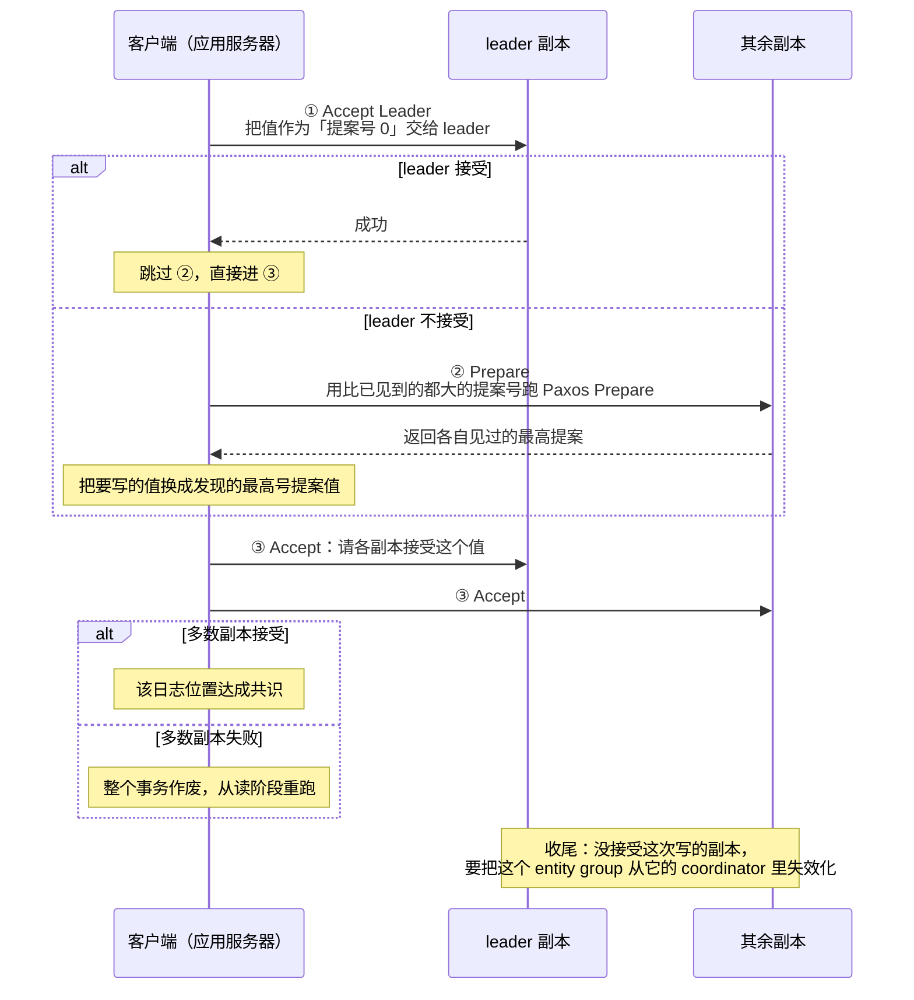

---
tags:
  - 分布式/存储
---

# MegaStore

MegaStore（CIDR 2011）是 Google 在 [Bigtable](02-Bigtable.md) 之上补"跨行事务"的那一层，也是 [Spanner](04-Spanner 与 F1.md) 的直接前身。它的定位用一句话说清：**在细粒度分区内提供完全可串行化的 ACID 语义** —— 而"细粒度分区"这个限制，是它能在广域网上同步复制还保持可接受延迟的原因。

五条互相冲突的需求恰好解释了为什么它必须走这条路线：

| 需求 | 具体表述 |
| --- | --- |
| **高度可扩展** | 互联网带来巨大潜在用户群；用 MySQL 起步容易，但扩展到数百万用户需要**重做整个存储基础设施** |
| **快速开发** | 服务要争夺用户，需要快速迭代、快速上市 |
| **低延迟** | 服务必须响应快 |
| **一致视图** | 更新的结果要**立即可见且持久** —— 原话：**「看到云上协作表格的编辑短暂消失，是不好的用户体验」** |
| **高可用** | 用户期待 7×24；要承受从单盘、单机、单路由故障一直到整个数据中心级中断 |

而两条既有路线各有硬伤：**关系数据库**功能丰富便于构建，但**难以扩展到数亿用户**；**NoSQL（Bigtable / HBase / Cassandra）**高度可扩展，但**API 有限、一致性模型松散，让应用开发变复杂**。跨远距离数据中心复制同时保持低延迟已经很困难，**而在故障期间保证复制数据的一致视图尤其困难** —— MegaStore 就是冲这两点去的。

## Entity group：把"原子性范围"做成可配置的

整个设计的枢纽是 **entity group（实体组）**：

> **为了扩展吞吐并把故障局部化，把数据分成分组，每组跨广域网独立且同步地复制。**

它的定义落在 schema 上，规则只有两条：

- Megastore 的表分两类：**entity group root table** 与 **child table**；
- **每个 child table 必须声明一个唯一的、指向 root table 的外键**（schema 里的 `ENTITY GROUP KEY` 注解）。于是**每个 child entity 引用它 root table 里的某个特定 entity（root entity）**。

由此：**一个 entity group = 一个 root entity + 所有引用它的 child entity**。而**一个 Megastore 实例可以有多个 root table，于是产生不同类别的 entity group**。

**组内的操作是有保障的**：

- **entity 用单阶段 ACID 事务修改，其提交记录通过 Paxos 复制**；
- **组内的索引遵守 ACID 语义**。

### 跨组的操作

**跨组的操作则是有代价的**：

- 可以依赖**昂贵的两阶段提交**，但**通常利用 Megastore 的异步消息传递** —— 发送组的事务往队列里放一条或多条消息，接收组的事务**原子地消费这些消息并应用随之而来的 mutation**；
- **跨组的索引一致性更松**。

这里有一句容易被误读的澄清：

> **用的是逻辑上相距远的 entity group 之间的异步消息，不是物理上相距远的副本之间。** 数据中心之间的**所有网络流量都来自复制操作，而它们是同步且一致的**。

"跨组用异步消息"**是把跨组操作排除在同步路径之外的设计选择**，而不构成对一致性的让步。

### 边界怎么划：三个例子

边界划分本身是个取舍，两头都要讲清楚：

> **边界太细** → 迫使过多的跨组操作；**把太多无关数据塞进一个组** → **串行化无关的写，降低吞吐**。

三个真实的划法：

- **Email** —— **每个邮件账号构成一个天然的 entity group**。账号内的操作是事务性且一致的：用户发送或给邮件打标签后，**即使发生到其他副本的故障切换，也保证能观察到变化**。**账号之间的通信用外部邮件路由器**（不在 MegaStore 内）。
- **Blogs** —— 需要**多类 entity group**：每个用户的 **profile 天然一组**；博客是**协作式、没有单一永久所有者**的，所以另建一组放每篇博客的帖子与元数据；再建第三类为**每篇博客认领的唯一名字**建组。**当一个用户操作同时影响博客与 profile 时，应用依赖异步消息**；而对「创建新博客并认领唯一名字」这种**低流量**操作，**两阶段提交更方便且性能可接受**。
- **Maps** —— 地理数据**没有天然的一致或便利粒度的划分**，所以把地球切成**互不重叠的 patch** 作为 entity group，跨 patch 的 mutation 用 2PC 保证原子性。判据是：**patch 要大到让两阶段事务不常见，又要小到每个 patch 只需很小的写吞吐**。与前两例不同的是，**entity group 的数量不随使用量增长，所以必须一开始就创建足够多的 patch** 来支撑后续规模。

收尾判断是：**几乎所有基于 MegaStore 构建的应用都找到了划 entity group 边界的自然方式。**

## 事务协议：一次写走完的三个步骤

原稿到这里为止讲的全是数据模型，而 MegaStore 真正的机制在写入路径上 —— 它的目标是**在广域网上一次写只花一个来回**，而标准 Paxos 做不到这一点（官方给出的判断是：标准 Paxos 需要多轮通信，不适合高延迟链路）。

写入算法本身只有三步：



三步之外还有一步**不是可选**的收尾，叫 **invalidation（失效化）**。coordinator 按副本记录“这个副本上哪些 entity group 是最新的”；**一旦某次写没能在某个副本上被接受，就必须从那个副本的 coordinator 里删掉这个 entity group 的键**。官方给的要求是：**一次写要被认定为已提交并可以应用，必须让所有 full replica 或者接受了这个值、或者它的 coordinator 已经被失效化。**

**这四步里只有第 ① 步与第 ③ 步在常见路径上**，第 ② 步是慢路径，invalidation 是那个必须做的收尾。

**为什么这样就够快**，关键在于第 ① 步的语义：把值当作“提案号 0”交给 leader。**在一个没有竞争者、且 leader 就是当前 accept leader 的时刻，leader 可以直接接受，一跳就到第 ③ 步** —— 也就是**一个来回完成一次共识**。标准 Paxos 至少要“准备 + 接受”两轮，MegaStore 用一个受控的前置状态把准备轮省掉了。

**这份前置状态就是 coordinator**，它是整套低延迟 Paxos 的关键，值得单独看。

**这套协议值得在广域网上跑，理由在于它把延迟花在了一处有长期回报的地方，而不只是“能同步复制”。** 官方的判断是：**跨广域分布的副本做同步复制带来的延迟惩罚，被“单一系统镜像”的便利与电信级可用性的运维收益抵消并有余** —— 换句话说，**多花的那几十毫秒换掉的是“应用要自己处理多副本语义”这一整类工作**。这是这套设计愿意接受同步复制的根本理由，也是它与“异步复制 + 应用补偿”那条路线分道扬镳的地方。

**还有一条与冲突有关的连锁效应值得记。** 同步复制带来一个不太显眼的后果：**它提高了“给定每组提交速率下发生冲突的概率”**。原因是“从读到提交”的窗口被同步复制拉长了 —— **延迟越长，窗口越大，乐观并发撞车的可能越高**。这条连锁把一个纯性能指标（延迟）和一个正确性指标（冲突/重试率）绑在了一起，也解释了为什么这套系统扩容写吞吐的正路是**缩短窗口**（切细分组、把副本放进同一 region），而不是加副本。

**还有一个数字要对照它自己的代价来读。** 生产数据里给出的口径是**平均读延迟几十毫秒** —— 注意这是**读**。写的延迟由同步复制决定，**它比读高，而且它的下界由 leader 与写者之间的距离定死**。**“读便宜、写贵”这个不对称来自设计目标本身，而不来自实现偏差**：整套机制（本地副本读、只读副本、单段读）都在把读拉近，而写必须为每一次提交付一次跨数据中心的共识。

**于是判断这套系统适不适合，有一个比“延迟多少毫秒”更准的问法：这个负载的读写比是多少，以及写能不能被摊薄。** 读多写少的交互式负载几乎不用付写的代价；写占比高的负载则会持续为每一次提交付同步复制的账。

### coordinator：把两轮 Paxos 压成一轮

省掉准备轮的前提是“**知道这个副本上哪些 entity group 是最新的**” —— 这份信息由 coordinator 维护。

coordinator 是一个**每个副本一份的小进程**，记录本副本上每个 entity group 是否最新。这份设计对它的描述里有两句很关键：

- **它状态简单、没有外部依赖、没有持久化存储，因此比 Bigtable 服务器稳定得多**；
- **但网络与主机故障仍会让它不可用。**

它的故障检测是**带外协议加 Chubby 锁**：coordinator 启动时到远端数据中心获取一组特定的 Chubby 锁，**要处理请求就必须持有其中多数**。一旦因崩溃或网络分区丢掉多数锁，它会**把状态退回保守默认值 —— 认为它管辖的所有 entity group 都是过期的**；此后该副本上的读**必须向多数副本查询日志位置**，直到锁被重新拿回、coordinator 条目被重新校验。

**这份保守默认值是整套设计里很值得记的一个取舍。** 它把“coordinator 会不会说错”换成了“coordinator 说不知道” —— **不确定时宁可退化到慢路径，也不给出一个可能过期的“我知道它是最新的”**。

代价有明确的量化：**当一个持有活跃 coordinator 的数据中心突然不可用时，会出现一段“数十秒”的写中断** —— 所有写者都要等那个 coordinator 的 Chubby 锁过期。**这段窗口是设计承认的成本，不是故障。**

### invalidation：什么时候必须退到完整 Paxos

把 coordinator 那套信息与写入算法合起来看，能读出一条清晰的判据：

```
   写者要提交一个值
        │
        ▼
   问 leader：能不能把它当提案号 0 接受？
        │
        ├─ 能   ⇒ 直接进 Accept 阶段             ← 一个来回
        │
        └─ 不能 ⇒ 先跑 Prepare 拿到最高提案号     ← 两个来回
                    └─ 并把要写的值替换成发现的最高号提案值
```

**“不能”有两种典型来源**：这个日志位置上已经有别的提案（有竞争写者），或者 leader 自己不确定（刚恢复、或副本状态没跟上）。**两种情况都需要先问一遍其他副本“你们见过什么”，也就是准备轮的本来用途。**

**invalidation 处理的是另一个方向的问题**：某个副本没接受这次写。这时**不需要重新投票**，只需要**把那个 entity group 从它的 coordinator 记录里删掉** —— 后续写不再指望这个副本“是最新的”，它会在读路径上自然把自己当作过时副本。

**这一步的必要性来自“新 leader 必须能看到旧值”这条不变量。** 如果一次写只在部分副本上生效、而那些副本的 coordinator 还认为自己是“最新的”，那么后续在这个 entity group 上当选新 leader 的副本就可能基于不完整的状态做决定。**invalidation 是那条不变量的执行手段。**

**一处工程细节值得记**：witness 副本**没有 coordinator**，因此**它们确认失败时不会额外逼出一个来回**。这是“用 witness 凑法定人数”比“用 full replica 凑”便宜的具体一处。

### 为什么“通常用队列，而不是 2PC”

跨组操作有两条路，MegaStore 的态度很明确：**跨 entity group 的 2PC 是支持的，但官方普遍不建议，宁愿用队列。**

理由给得很直接：**这类事务延迟高得多，而且提高冲突风险**。机制是 —— 跨组事务要求多个组同时处于“能提交”的状态，于是**每组的提交速率越高，冲突概率越大**；而组内写的延迟本身已经受同步复制支配。

**队列这条路是异步的**：发送组的事务往队列里放消息，接收组的事务**原子地消费并应用**。它把跨组这件事从“同步路径”挪到了“最终会完成”的路径上，于是**跨组延迟不再计入前台的提交延迟**。

**边界也很清楚**：当跨组操作**低频**（例如“创建账号并认领唯一名字”这类）时，2PC 的延迟完全可以接受；当它**高频**时，队列几乎总是更好的选择。**判断依据是“这类操作占总体流量的多少”，不是“一致性要求有多强”。**

**队列这个构件本身也在接口里** —— 它和读写、事务并列，不是外围补丁。这一点把它与“事后用消息中间件补跨库一致性”的做法区分开了。

## 三种读与三种副本

MegaStore 对“读”的处理比写细，这从它提供三种读就能看出来：

| 读类型 | 用哪个时间戳 | 保证什么 |
| --- | --- | --- |
| **current read** | **最新已提交事务的时间戳** | 读之前**先确保此前已提交的写都已应用** —— 读到的是最新状态 |
| **snapshot read** | **最后一个已知“完整应用”的事务的时间戳** | 即使有些已提交事务还没应用，也从这个点读 —— **自洽但可能不是最新** |
| **inconsistent read** | 不看日志 | **直接读最新值** —— 可能过期，也可能读到部分应用的数据 |

**current 与 snapshot 都限定在单个 entity group 内**；inconsistent read 是给“对延迟要求更激进、能容忍过期或部分应用数据”的操作用的。

**副本这边也分三种，而且是围绕“能不能服务 current read”划的：**

```
   full replica       含全部 entity 与索引数据
                      ⇒ 能服务 current read；有 coordinator
                      ⇒ 参与投票

   witness replica    只投票 + 存预写日志
                      不应用日志、不存 entity 与索引数据
                      ⇒ 存储成本低，作用是补票（tie breaker）
                      ⇒ 没有 coordinator，确认失败不额外逼出一个来回

   read-only replica  不投票，但含完整数据快照
                      ⇒ 读到的是“最近某个时刻”的一致视图
                      ⇒ 把数据铺到地理上更广的范围，而不影响写延迟
```

**三种副本的分工其实在回答同一个问题：为了让一次写更快，哪些副本可以“少做一点”。** witness 少做的是“应用日志与存数据”，换来“确认失败不额外加一个来回”；read-only 少做的是“投票”，换来“读能在更广的范围里本地化”。**两者都通过放弃一部分能力，把写路径的前台成本压下来。**

**顺带一个选副本的启发式**：用**最近的副本**。它成立的前提是“多数应用反复从同一个 region 提交写” —— 这个前提是一条经验结论，也是整套同步复制能容忍广域网延迟的现实基础。

### 写事务总是从一次 current read 开始

一个容易被忽略但信息量很大的细节：**写事务总是以一次 current read 开头**，用途是**确定下一个可用的日志位置**。

这一句把读写关系讲清楚了 —— **写的形状是“先读到当前位置，再在它之后追加”，而不是“直接写”**。这和 LSM 系“先写日志再定序”不同：这里的顺序来自**共享的日志位置**，而位置要靠一次读获取。

**提交时的动作也是“往日志上追加一条”**：把这次事务的 mutation 收拢成一个日志条目，**分配一个比此前任何时间戳都高的时间戳**，然后用 Paxos 追加到日志上。**并发控制是乐观的** —— 读阶段与提交阶段之间如果发生冲突，事务作废，并从读阶段重跑。

**这条链路解释了两个现象：**

- **为什么读延迟大部分是本地延迟。** 生产数据里“平均读延迟是几十毫秒，且大多数读是本地读” —— 因为 current read 只要求本地副本已应用到位，不必跨数据中心。
- **为什么提高每组的提交速率会提高冲突率。** 乐观并发加同步复制意味着“从读到提交”之间有一段真实的时间跨度，**提交速率越高，撞上这个窗口的概率越大**。

**于是扩容写吞吐的两条正路也就清楚了**：**把 entity group 切得更细**（降低每组的提交速率），或者**把副本放在同一个 region**（缩短那个窗口）。**两条都在动“窗口长度”这个量**，而不是动 Paxos 本身。

## 生产数据与部署形态

这一节的细节解释了“层”这个词在工程上落在哪。

**部署形态是“客户端库 + 辅助服务器”。** 应用链接一个客户端库，**Paxos 与其余算法（选读副本、追赶滞后的副本等）都实现在库里**；辅助服务器承担库之外的那部分职责。**每条应用服务器有一条指定的本地副本**，而**客户端库通过把事务直接提交到本地 Bigtable，让该副本上的 Paxos 操作变成持久的**。

**这个形态有个直接后果：协议的一部分在应用进程里。** 选副本、追副本、跑 Paxos —— **这些事都落在每个应用服务器上，而不在服务端。**它把“客户端”这个词的含义推后了一层：**这里的客户端是共识算法的执行者之一，而不只是一层薄薄的协议封装。**

### 生产数据里的三条口径

**生产数据里的三条口径：**

| 指标 | 数值或结论 |
| --- | --- |
| 生产应用数 | **超过 100 个应用**把它当作存储服务 |
| 平均读延迟 | **几十毫秒**（取决于数据量）—— **说明大多数读是本地读** |
| 延迟尾部分布 | **它的延迟尾部显著短于底层各层** |

**最后一条是这份数据里最值得记的。** 一个系统把延迟尾部做得比它脚下的每一层都短，说明**中间层在主动吸收下层的抖动** —— 而它的手段是前面那些机制：**读只落到本地副本**（不碰跨数据中心的往返）、**写只等一个法定人数**（不等最慢的那个副本）、**段级的后台活动不进入前台路径**。**“尾部更短”不是运气，是“把可变的部分从关键路径上移走”这件事的结果。**

**官方对可用性的总结词是“电信级”** —— 而与它并列的那条结论更值得记：**多数应用在计划内与计划外的中断中，几乎不需要人工干预就能撑过去。** 这两句话合起来给出了这套设计的目标函数：**它优化的是“故障期间不需要人来决定什么”，而不是峰值延迟。**

## 物理布局：把"行"当资源用

- 用 **Bigtable** 做单个数据中心内的可扩展容错存储 —— **通过把操作铺到多个行上来支撑任意读写吞吐**；
- **把每个 entity group 分配到它被访问最多的 region 或大洲**；在该 region 内把**三个或五个副本分配到故障域隔离的数据中心**；
- **为低延迟、缓存效率与吞吐，一个 entity group 的数据放在 Bigtable 行的连续范围里**；
- schema 语言让应用**控制层级数据的放置**：把一起访问的数据放到相邻行，或**反规范化到同一行**。

### Pre-joining with keys：用键序代替 join

这一节是 MegaStore 数据模型里最有意思的部分。

传统关系建模推荐**主键都用代理值（surrogate value）**，而 **MegaStore 的键被选来把"会一起读的 entity"聚集在一起**：

- **每个 entity 映射到单个 Bigtable 行** —— 主键值拼接成 Bigtable 的 row key，其余属性各占一个 Bigtable 列；
- schema 里的 `IN TABLE User` 指示把它与父表 **colocate 到同一个 Bigtable**，而**键序保证 Photo entity 存在对应的 User 旁边**；
- **这个机制可以递归应用，加速任意连接深度的查询** —— 原话是：**用户可以通过操纵键序来强制层级布局**。

还有一个防热点的开关：schema 可以声明键升序、降序，**或者完全阻止排序** —— `SCATTER` 属性指示 MegaStore **给每个键前置一个两字节哈希**。**这样编码单调递增的键可以防止跨 Bigtable 服务器的大数据集出现热点。**

### 两类索引

| 类型 | 范围 | 一致性 |
| --- | --- | --- |
| **Local index** | 当作**每个 entity group 各自**的索引，用于**在组内**找数据 | 索引项**存在组内，与主 entity 数据原子且一致地更新** |
| **Global index** | **跨 entity group**，用于在**事先不知道 entity group** 的情况下找 entity | **可以读到许多组的数据，但不保证反映所有最近更新** |

### 三个声明式特性

另外三个声明式特性都是为"减少读时的查找次数"服务的：

- **`STORING` 子句**：正常通过索引访问是两步（先读索引拿主键、再用主键取 entity），`STORING` 允许**把部分 entity 数据反规范化进索引项** —— 例子里 `PhotosByTag` 直接存了缩略图 URL，省掉第二次查找；
- **Repeated index**：索引重复属性与 protobuf 子字段，**可以替代 child table**；每个唯一的 tag 生成一个索引项；
- **Inline index**：把源 entity 的数据反规范化进相关的目标 entity，索引项**作为目标 entity 上的虚拟重复列**出现 —— **实现多对多关系时它比维护一张链接表更省**。

## 到 Bigtable 的映射：一个关键技巧

这一条是整个事务机制能成立的前提：

> **在 root entity 的那一个 Bigtable 行里，存该 entity group 的事务与复制元数据，包括事务日志。把所有元数据放在单个 Bigtable 行里，就可以通过一次 Bigtable 事务原子地更新它。**

Bigtable 只给单行事务（见那篇的"不支持跨行事务"），而 MegaStore 把**它需要原子的所有东西塞进一行** —— 于是拿 Bigtable 的单行事务当自己的原子性原语。这是"分层"这个词在这里的确切含义。

其余映射细节：

- Bigtable 的**列名 = Megastore 表名 + 属性名拼接**，使不同 Megastore 表的 entity 能映射到同一 Bigtable 行而不冲突；
- **每个索引项表示为单个 Bigtable 行**，row key = 索引属性值 + 被索引 entity 的主键；
- **索引重复字段会为每个重复元素产生一个索引项** —— 一张有三个 tag 的照片在 `PhotosByTag` 里出现三次。

## API 设计哲学：成本透明优先于表达力

这一节解释了 MegaStore 为什么长得不像关系数据库。

> ACID 事务简化正确性推理，但**能推理性能同样重要**。MegaStore 强调**成本透明的 API**，其运行时成本要匹配开发者的直觉。

**不用"规范化 + 查询时 join"的三条理由**：

1. **高流量交互式负载更看重性能可预测，而不是查询语言的表达力**；
2. **目标应用里读多于写，所以把工作从读时移到写时是值得的**；
3. **层级数据在 Bigtable 这类 KV 存储里存储与查询很直接**。

所以它的数据模型与 schema 语言提供**细粒度物理局部性控制**，靠**层级布局与声明式反规范化**消除大部分 join 需求。

### join 在应用代码里做

**那么 join 怎么办？在应用代码里做。** 一个具体的落地方案 —— 实现 **merge join 算法的 merge 阶段**：

> 用户提供**多个返回同一张表主键、且顺序相同的查询**，系统返回**所有查询结果的键的交集**。

还有应用用**并行查询实现外连接**：通常先做**一次索引查找**，再用第一次查找的结果做**并行索引查找**。适用边界也说清了：**当二次索引查找并行进行、且第一次查找的结果数量不太大时，这能有效替代 SQL 风格的 join。**

## 底层依赖：Bigtable、Chubby 与一张广域网

MegaStore 自己几乎没有存储逻辑 —— 它是一层协议，压在三件外部设施上。

**依赖一：Bigtable，而且用得比“当存储”更巧。**

两处用法值得分开看：

- **数据**：entity 与索引都落在 Bigtable 行上，一个 entity 映射一行，索引项各占一行；
- **元数据与事务日志**：**放在 root entity 的那一个 Bigtable 行里** —— 包括事务与复制元数据、以及事务日志。**把所有需要原子的东西塞进一行，就可以用 Bigtable 的单行事务原子地更新它。**

**第二条是整套事务机制能成立的前提。** Bigtable 只提供单行原子性，MegaStore 把“它需要一次原子更新的全部东西”收进一行，于是**借到了 Bigtable 的原子性原语**。这是分层设计里“借用下层最强的那个保证”的典型做法。

**依赖二：Chubby —— 只承担 coordinator 的故障检测。**

Chubby 在这套设计里的职责比在其他系统里窄得多：**它既不存元数据、也不参与选主，只给 coordinator 提供一组锁，用来判断“别的 coordinator 是不是活着并且可达”。** coordinator 必须持有多数锁才能处理请求。

**这条依赖的形状值得注意**：Chubby 只影响**写延迟**，不影响读 —— coordinator 失效后读者可以退到“向多数副本查日志位置”的慢路径，功能不丢。**换句话说，这套设计里 Chubby 的可用性只决定“快路径还开不开”，不决定“系统能不能用”。**

**依赖三：广域网，而且它直接进入设计算式。**

- 写延迟的下界由 **leader 与写者之间的距离**决定 —— 官方明确写了“因为写者必须在提交给其他副本之前先与 leader 通信，所以我们把 writer-leader 延迟压到最小”；
- **把副本放在同一个 region** 是缩短写窗口的一条正路，代价是失去地理分散带来的故障隔离；
- **read-only 副本存在的意义就是“在不影响写延迟的前提下把数据铺开”**。

**依赖四：时间，但只是逻辑时间。**

这套设计**不需要物理时钟同步**。写事务的时间戳由日志位置决定 —— **一个新条目被分配“比此前任何时间戳都高的时间戳”**，而“此前”由日志位置定义，不由墙上时钟定义。跨副本的定序也全部来自 Paxos 对单个日志位置的共识。

**这一条把它与 [[04-Spanner 与 F1|Spanner]] 划在了两边**：MegaStore 的定序来自**日志位置**，Spanner 的定序来自**有界不确定性的物理时钟**。两者都要“定序”，但一个从共识里取，一个从时钟里取。

**四处依赖排成一张表：**

| 依赖 | 承担什么 | 换得掉吗 |
| --- | --- | --- |
| Bigtable | 数据的行式存储 + **单行原子性**（元数据与日志借用它） | 难换 —— 换掉它就要自己实现那一行上的原子更新 |
| Chubby | coordinator 的带外故障检测 | 换得掉（换成别的锁服务），影响面只到写延迟 |
| 广域网 | 副本间同步复制的载体 | **换不掉** —— 整套设计的延迟特征由它决定 |
| 逻辑时间（日志位置） | 写时间戳与跨副本定序 | **换不掉** —— 换成就变成 Spanner 那条路 |

**这份依赖表最值得记的一点是“没有时钟”这件事。** 本栏里不用时间设施的系统有两个：[[07-HBase 与 LSM-Tree|HBase]] 是因为单机结构里没有并发写者需要定序；**MegaStore 是因为它把定序这件事完全交给了 Paxos 对日志位置的共识** —— 顺序从共识里长出来，而不是从时钟里读出来。

**这份依赖清单里还藏着一处“依赖关系的方向”值得记清。** Bigtable 提供的是**单行原子性**，而 MegaStore 要的是“事务元数据与日志能一次原子更新”——**两者不是同一层的能力，是 MegaStore 通过摆放数据把下层的弱保证用成了自己需要的强保证**。

**这条做法的可迁移之处在于：判断一个分层系统能不能只借下层最弱的那条保证，看它能不能把“需要一起变的东西”收进一个下层原子单位的边界内。** 这里能收进一行，是因为事务元数据与日志的总量不大；**如果某天日志大到一行装不下，这个技巧就失效了** —— 而这正是后来被换掉的那种压力类型：不是协议不行，是底层原子单位的容量成了上限。

**这份清单里还有一处“看不见的依赖”值得单独点出：应用自己的进程。** 客户端库跑在应用服务器里，**这意味着 Paxos 的执行、副本的追赶、读副本的选择都要占用应用进程的资源**。它换来的好处是“客户端到本地副本的路径极短”，代价是**协议开销与应用负载在同一个进程里竞争**。**这与“客户端做薄、复杂度留在服务端”是两条相反的路线**，选哪条取决于应用进程本身是不是已经跑在托管环境里。

## 参数与可调项

这套系统里**能被调的东西几乎全是“结构选择”，没有几个数值旋钮** —— 这是它与自建数据库最不同的地方。

**第一层：副本的组成（建实例时定）**

| 项 | 取值 | 语义与后果 |
| --- | --- | --- |
| **full replica 数** | 常见 **3 或 5** | 决定法定人数的大小；**3 个 full 时一个 witness 就能凑够票**，这是 witness 存在的场景 |
| **witness replica** | 可选 | 只投票 + 存日志；**存储成本低，且因为没有 coordinator，确认失败不额外逼一个来回** |
| **read-only replica** | 可选 | 不投票、含完整快照；**扩展读的地理覆盖，不影响写延迟** |
| 副本所在数据中心 | 故障域隔离 | **放在多个数据中心**是前提；放在同一 region 则写更快但故障隔离更弱 |
| 每个写者的“本副本” | 应用服务器指定 | 客户端库把 Paxos 操作落到**本副本的 Bigtable** 上，这是“最近副本”启发式的落点 |

**第二层：entity group 的划分**

这是这套系统里**唯一真正需要设计的东西**，而且它没有数值旋钮，只有边界画在哪：

| 观察 | 含义 |
| --- | --- |
| 划得太细 | **跨组操作变多**，于是 2PC 或队列的使用频率上升 |
| 划得太大 | **串行化无关的写，吞吐下降** |
| 数量是否随用量增长 | Email 与 Blogs 的组数**随用户增长**；**Maps 的 patch 数量不随用量增长，所以一开始就必须建够** |

**一条与它联动的旋钮是键的排布**：schema 可以声明键升序、降序，或**完全阻止排序**（`SCATTER` 给每个键前置两字节哈希）。**它调的是“相关数据落在哪些相邻行”，而这只对 local index 与 pre-joining 的收益有影响，不影响一致性。**

**第三层：每次操作的选择**

| 项 | 取值 | 后果 |
| --- | --- | --- |
| **读类型** | current / snapshot / inconsistent | 决定读到的是最新值、自洽但可能旧的视图、还是不经日志的最新值 |
| **跨组手段** | 队列 / 2PC | 队列异步、不进前台延迟；2PC 同步、延迟高且提高冲突风险 |
| **索引类型** | local / global | local 与主数据原子一致；global 跨组、不保证反映最近更新 |
| **索引声明式优化** | `STORING` / repeated / inline | 都是减少读时查找次数的写法，不改变一致性 |

**三条读这张表的纪律：**

1. **副本组成是“可用性、写延迟、成本”三者的兑换表**，不是性能参数。加一个 witness 能让 3 副本达到 5 副本的投票规模，但**它不存数据，所以读的可用性并没有跟着提高** —— 这是最容易记错的一处。
2. **entity group 的划分是唯一会影响全局的决策**，而且**改它等于改数据模型**。官方那条现实观察是“几乎所有基于它构建的应用都找到了划边界的自然方式” —— **如果找不到自然方式，说明负载形态与这套系统不匹配。**
3. **读类型是每次查询都能选的，也是唯一“零成本可调”的项**。它把一致性从系统级下放到查询级，与 [[05-Cassandra|Cassandra]] 的一致性级别是同一个思路。

**一处已经不可调的项：写的时间戳。** 它由日志位置分配，**应用无从干预** —— 这与 MVCC 系统里“可以指定事务时间戳”的做法相反。**想控制顺序，只能控制“谁先提交”。**

**这张表里还有一处参数之间的关系值得单独点出。** **witness 的数量与 full replica 的数量不是独立的** —— witness 的用途是“在 full replica 不够时补票”，所以它的存在与否取决于“用几个 full replica”。**3 个 full 时加 1 个 witness 能把投票规模推到 4；而如果本来就是 5 个 full，witness 就没有存在的必要。**

**这条关系决定了一处容易搞错的比例**：witness 让**投票**规模上去了，但**数据副本数并没有增加**。于是“加了 witness 之后可用性是不是提高了”这个问题有两个答案：**写的可用性提高了**（更不容易丢掉法定人数），**读的可用性没有变**（witness 不存数据，不能服务读）。**把两者混为一谈，是一个具体的容量规划错误。**

## 版本演进：从“细粒度分区 + 带外锁”到“时钟取代协调”

这条路线的三代可以并列看清：

```
   2006   Bigtable            KV / 宽列，只有单行原子性
     │                        · 事务范围 = 一行
     ▼
   2011   MegaStore（CIDR）   在 Bigtable 之上补跨行事务
     │                        · 事务范围 = entity group（可配置）
     │                        · 同步复制 + 低延迟 Paxos + coordinator
     │                        · 跨组用队列，2PC 不推荐
     │                        · 三种副本：full / witness / read-only
     │                        · 三种读：current / snapshot / inconsistent
     ▼
   2012   Spanner（OSDI）     同一问题的下一代答案
   2017   Spanner（SIGMOD）   · 事务范围 = 全局（不再需要 entity group）
                             · 用有界不确定性的物理时钟取代码外协调
```

**四条最初的设计判断，后来的下场：**

| 最初的设计判断 | 后来的处理 |
| --- | --- |
| **事务范围要可配置**（entity group） | Spanner 把这个限制去掉了 —— **事务范围变成全局**，不再要求应用先划边界 |
| **定序来自日志位置 + Paxos** | Spanner 改成**时钟给时间戳、Paxos 只保证副本一致** —— 定序从共识里挪到了时钟里 |
| **coordinator + Chubby 锁做快路径** | Spanner 不再需要这样一层 —— 有界不确定性的时钟让“跳过准备轮”变成“直接给一个可信时间戳” |
| **跨组用队列、2PC 不推荐** | Spanner 里跨组事务变成常态，**队列这条建议随 entity group 的取消一起消失** |

**这四条的变化其实是同一件事的四个面：MegaStore 把“全局强一致”的代价转移给了应用（划边界、用队列、接受跨组放宽），Spanner 把那笔代价收回到系统内部，代价是建一套时间设施。** 两条路线的分界就在这里，而不在 Paxos 的实现质量上。

**三处 MegaStore 自己承认的边界，值得记下来 —— 它们都是“下一代要解决的问题”的前身：**

- **“数十秒的写中断”**：持活跃 coordinator 的数据中心突然不可用时，所有写者要等 Chubby 锁过期。**这是一段由外部服务超时定义的停机窗口** —— Spanner 用时钟消除了这类窗口。
- **冲突率随每组提交速率上升**：官方给的缓解办法是“切细 entity group”或“把副本放同一 region”。**两条都在改变部署形态，而不是改进协议** —— 说明这套设计在扩容写吞吐上是有结构上限的。
- **全局索引不保证反映最近更新**：跨组索引一致性更松是设计选择，但它把“用哪个索引用得对”变成了应用要理解的东西。

**还有一条服务侧的进化不在协议里**：这套系统在生产里跑过**超过 100 个应用**，官方给的一线经验是“多数应用觉得延迟可接受”，而**少数应用必须精心挑选 entity group 边界来最大化写吞吐**。**这句话本身就是一个判据：需要精心挑边界的应用，正是该等下一代的那一类。**

**这条演进线还有一处容易被略过的中间态。** MegaStore 之后、Spanner 之前，Google 内部还有过“用更少的假设换取同样目标”的尝试 —— 而 MegaStore 自己给出的判据已经预告了方向：**它把“跨远距离复制保持低延迟”和“故障期间保证一致视图”列为最难同时满足的两条**，并且承认自己是用“细粒度分区 + 带外协调”绕过去的。

**绕过去的部分就是下一代要正面解决的。** Spanner 换掉了两样东西：**定序的来源**（从日志位置换成有界不确定性的物理时钟）与**事务的范围**（从 entity group 换成全局）。**换了这两样之后，“跨组用队列”与“coordinator 快路径”这两条设计连同它们的代价一起消失了。**

**一条时间线上的细节值得核清**：这篇的发表场合是 **CIDR 2011**，而它的两处“下一代”分别发表在 **OSDI 2012** 与 **SIGMOD 2017**。**三代之间隔得很短，说明这套设计被替换得很快** —— 从“细粒度分区 + 带外锁”到“全局事务 + 有界时钟”，中间只隔了一年多。**替换得快，通常说明前一代的限制在真实负载上被撞得很快**，而不是说明前一代写得不好。

## 不适用于什么：这套设计把代价放在了哪

**成立前提**

- **能划出边界。** entity group 的粒度决定了系统的上限；**划不出来就没有可用的配置**。官方那句“几乎所有应用都找到了自然方式”，反过来读就是：找不到自然方式的应用不该用它。
- **跨组操作低频。** 跨组的常态手段是队列（异步、最终完成），2PC 可用但官方不建议。
- **能接受一个由外部服务超时定义的写中断窗口。** coordinator 的 Chubby 锁过期会带来“数十秒”的写不可用。
- **能接受“每组有一个写吞吐上限”。** 上限由同步复制的时间跨度与冲突率共同决定，**扩容的正路是切细分组，不是加副本**。
- **应用能接受成本透明的 API。** 用不了 join、没有查询语言表达力 —— 这是**主动的选择**，不是能力缺失。

**前提被违反时的后果**

| 违反的前提 | 后果 |
| --- | --- |
| 划不出合理的边界 | 要么跨组操作泛滥（前台延迟被 2PC 或队列拖累），要么大组串行化无关写 |
| 跨组操作是主流程 | 每条跨组路径都要在“慢但一致”和“快但最终一致”之间选一边 |
| 依赖其可用性到秒级 | **数十秒的写中断窗口**会成为一次可见的故障 |
| 需要跨组强一致 | 超出这套模型；这正是 Spanner 被做出来的原因 |
| 想让应用直接写 SQL / join | 数据模型层面就不提供；**join 要在应用代码里手写 merge 或并行二次索引查找** |

**与相邻系统的对照**

| | MegaStore | [[02-Bigtable\|Bigtable]] | [[04-Spanner 与 F1\|Spanner]] | [[05-Cassandra\|Cassandra]] |
| --- | --- | --- | --- | --- |
| 原子性的范围 | **entity group（可配置）** | 单行 | **全局** | 单分区（LWT 亦单分区） |
| 跨副本定序靠什么 | **日志位置 + 低延迟 Paxos** | 无（单行） | **有界不确定性的物理时钟** | 时间戳（客户端给） |
| 需要什么外部设施 | **Chubby（只给 coordinator 用）** | Chubby | **GPS + 原子钟 + 时间 daemon** | 无 |
| 跨故障域的手段 | 同步复制 + 队列跨组 | 无 | Paxos 组 + 2PC | 读侧一致性级别 |
| 扩展写吞吐靠什么 | **切细 entity group** | 单 master | 分片 + Paxos 组 | 加节点 |

**代价落在谁身上**

| 代价 | 落在谁身上 |
| --- | --- |
| 划 entity group 边界的判断 | **应用的数据建模** |
| 跨组操作用队列还是 2PC | **应用的设计** |
| 全局索引可能不反映最近更新 | **应用要知道该用哪种索引** |
| 数十秒的写中断窗口 | **运维与可用性预期** |
| 每组的写吞吐上限 | **容量规划** |
| 没有 join 与查询语言的表达力 | **应用的代码** |

**这张表读下来，落点几乎全在“应用的数据建模”上。** 系统把跨行事务做到了 entity group 这一级，而**“哪些数据该放进同一个组”这个决定被推给了建模的人**。这与 [[03-Dynamo|Dynamo]] 把冲突合并推给应用、[[07-HBase 与 LSM-Tree|HBase]] 把查询设计推给应用是同一种取向 —— **本栏里凡是要绕开某个系统级代价的设计，都会看到同一笔转移：系统省下的，应用要补上。**

**判断这笔转移划不划算，看的还是同一件事：那个应用是否本来就要做这件事。** MegaStore 的拥护理由是“读多于写，把工作从读时移到写时值得” —— **如果应用本来就要按访问模式设计数据（高流量交互式服务几乎都要），这笔建模工作不算额外成本；如果应用的数据形态是“到处都要 join”的分析型负载，那它付的就是双份。**

**最后一条边界与“这套设计的哪一部分最贵”有关。** entity group 的划分之所以是全书最费判断的一步，是因为**它同时决定了两件事**：一是跨组操作的频率（进而决定前台延迟与冲突率），二是每组的写吞吐上限。**这两个量一个往小走、一个往大走，而它们由同一个决定控制** —— 这就是“划边界”没有通用解的原因。

**Maps 那个例子把这条张力讲得最清楚**：patch 要**大到让 2PC 不常见**，又要**小到每个 patch 只需很小的写吞吐**。**两头都是约束，中间那条带有多宽，取决于负载自身的形态。** 这也解释了为什么官方只能给出“几乎所有应用都找到了自然方式”这种经验性结论，而给不出一条可计算的判据。

## 排查：从症状到判据

```
   症状
     │
     ├─ 写延迟高，但没报错 ─────▶ 先看是不是走了慢路径
     │                              └─ 有竞争写者 / leader 状态不确定
     │                                 ⇒ 每次写都跑了 Prepare（两个来回）
     │
     ├─ 写**整段不可用**（数十秒）▶ 看是不是 coordinator 的锁过期
     │                              └─ 持活跃 coordinator 的数据中心失联
     │                                 ⇒ 等 Chubby 锁超时，窗口是设计成本
     │
     ├─ 冲突/重试率上升 ────────▶ 看**每组的提交速率**
     │                              └─ 乐观并发 + 同步复制 ⇒ 窗口内撞车
     │                                 ⇒ 切细 entity group 或把副本放同一 region
     │
     ├─ 读到的数据旧 ───────────▶ 先确认用的是哪种读
     │                              ├─ snapshot read ⇒ 本来就读“最后一个完整应用的点”
     │                              ├─ inconsistent read ⇒ 本来就可能过期
     │                              └─ 只有 current read 才承诺最新
     │
     ├─ 只有某一段 key 慢 ──────▶ 看 entity group 的划分与键序
     │                              └─ 大组串行化无关写 / 热点集中在少数组
     │
     └─ 跨组操作拖慢前台 ───────▶ 看用的是队列还是 2PC
                                    └─ 高频跨组用了 2PC ⇒ 换队列
```

**三条判读原则**

1. **先分清“慢”与“不可用”，两者处置相反。** 慢通常是走了两个来回的慢路径，改善方向在**减少竞争**（切细分组）；不可用是 coordinator 的锁在等超时，**没有任何参数能加速它**，只能等。**把“数十秒不可用”当性能问题去查，会一路查到“设计就是这样”。**
2. **读的问题先确认读类型，再查系统。** 三种读的承诺本就不同 —— **snapshot 与 inconsistent 读到旧值是设计行为**。跳过这一步会一直在查一个不存在的问题。
3. **写吞吐的上限是结构性的，不是资源性的。** 每组有一个由“同步复制的窗口长度 + 冲突率”决定的上限，**加副本、加内存都不会抬高它**。扩容的正路只有两条：切细分组，或缩短副本之间的距离。

**还有一条与“该不该继续用它”有关的判据。** 官方给的一线经验是“多数应用觉得延迟可接受”，而**少数应用必须精心挑选 entity group 边界来最大化写吞吐**。**这条分界本身就是一次诊断**：如果一个应用在持续地“精心调边界”，说明它的负载形态与这套系统不匹配 —— 那是该换方案或等下一代的信号，不是该继续调参的信号。

**最后一条与依赖有关的排查顺序**：**写路径的问题先看 Chubby 与网络，读路径的问题先看本地副本与读类型。** 两者几乎不共享观测点 —— coordinator 只出现在写路径上，而读的时间戳选择只出现在读路径上。

**这份排查表里还有一处顺序值得强调：先确认“是慢还是停”，再确认“停在哪一层”。** 这套系统的“停”只有两个来源 —— **coordinator 的锁在等超时**、或者**凑不齐多数副本**。两者都不在任何 HBase 式的参数旋钮上。

**这也是它跟本栏其他系统在运维面上的最大差别。** [[07-HBase 与 LSM-Tree|HBase]] 的排查有大量可调参数（BlockCache 比例、compaction 阈值、阻塞阀），[[05-Cassandra|Cassandra]] 有一整套一致性级别与超时；**而 MegaStore 的运维动作基本是“绕开、禁用、等”这三类** —— 因为它的可调空间在**建模阶段**就被用掉了（entity group 怎么划），运行期只剩下“这个副本还要不要用”这种粗粒度决定。**一份排查表里如果几乎都是“等”与“绕开”，那说明这套系统的调节点在上游，不在运行期。**

## 判据速查

| 问题 | 答案 |
| --- | --- |
| MegaStore 与 Bigtable 的关系 | 在 Bigtable 之上补**跨行事务**；用 Bigtable 做单数据中心内的可扩展容错存储 |
| 与 Spanner 的关系 | **Spanner 的直接前身** —— 同样是"Bigtable 之上补事务"，Spanner 换掉了底层的时钟假设 |
| 原子性的默认范围 | **entity group 之内**（单阶段 ACID，提交记录走 Paxos） |
| entity group 怎么定义 | **一个 root entity + 所有引用它的 child entity**；child table 必须声明指向 root table 的唯一外键 |
| 跨组操作怎么办 | 可用**昂贵的 2PC**，但**通常用异步消息**（发送组入队、接收组原子消费并应用） |
| 「跨组异步」是不一致的让步吗 | **不是** —— 异步只用**逻辑上相距远的组之间**；**数据中心之间的流量全是同步一致的复制** |
| 边界划错的两种代价 | 太细 → 跨组操作过多；太大 → **串行化无关的写、降吞吐** |
| 三个划法的判据 | Email 用**账号**；Blogs 要**多类组**（profile / 博客 / 唯一名）且低流量操作用 2PC；Maps 的 patch 要**大到 2PC 不常见、小到每个 patch 写吞吐很小**，且**数量不随用量增长、必须初始就够多** |
| 数据在哪 | 每个 entity group 分配到**访问最多的 region**，组内数据放在 Bigtable 的**连续行范围** |
| 副本怎么放 | 三个或五个副本，分配到**故障域隔离的数据中心** |
| Pre-joining 是什么 | **键按"会一起读"来选**，让相关 entity 落在相邻行；`IN TABLE` 指示 colocate |
| 为什么要 pre-joining | 让**任意连接深度的查询**变快，用**键序代替 join** |
| `SCATTER` 解决什么 | 给键前置两字节哈希，**防止单调递增键跨 Bigtable 服务器造成热点** |
| local / global index 的差别 | 前者**组内、与主数据原子一致更新**；后者**跨组、不保证反映最近更新** |
| `STORING` 子句省掉什么 | 省掉「先读索引再取 entity」的**第二次查找** |
| 原子性的关键技巧 | **把 entity group 的事务与复制元数据（含事务日志）放进 root entity 的单个 Bigtable 行**，于是用 Bigtable 的**单行事务**做原子更新 |
| 为什么不用 join | ① **高流量交互式负载看重性能可预测胜于表达力**；② **读多于写，把工作从读时移到写时值得**；③ 层级数据在 KV 里存取直接 |
| 那 join 怎么做 | 在**应用代码**里：实现 merge join 的 merge 阶段（多个同序查询 → **取主键交集**）；外连接用**并行二次索引查找**，要求第一次结果数量不太大 |
| 五条冲突需求里最难同时满足的两条 | **跨远距离数据中心复制保持低延迟** + **故障期间仍保证一致视图** |

## 相关

- [[02-Bigtable|Bigtable]] —— MegaStore 的底座；「把元数据塞进一行」正是为了用 Bigtable 的单行事务
- [[04-Spanner 与 F1|Spanner 与 F1]] —— 同一问题的下一代答案：Spanner 不再靠"细粒度分区 + 跨组异步"绕开，而是用 **TrueTime** 把全局强一致做出来
- [[01-分布式事务|分布式事务]] —— XA / TCC / Saga 是另一条工程路线；MegaStore 的 entity group 是"把事务范围定义成可配置的"这一思路的代表
- [[07-HBase 与 LSM-Tree|HBase 与 LSM-Tree]] —— Bigtable 的另一个开源落地

## 参考

- J. Baker, C. Bond, J. C. Corbett, J. J. Furman, A. Khorlin, J. Larson, J.-M. Leon, Y. Li, A. Lloyd, V. Yushprakh. *Megastore: Providing Scalable, Highly Available Storage for Interactive Services*. CIDR 2011.
