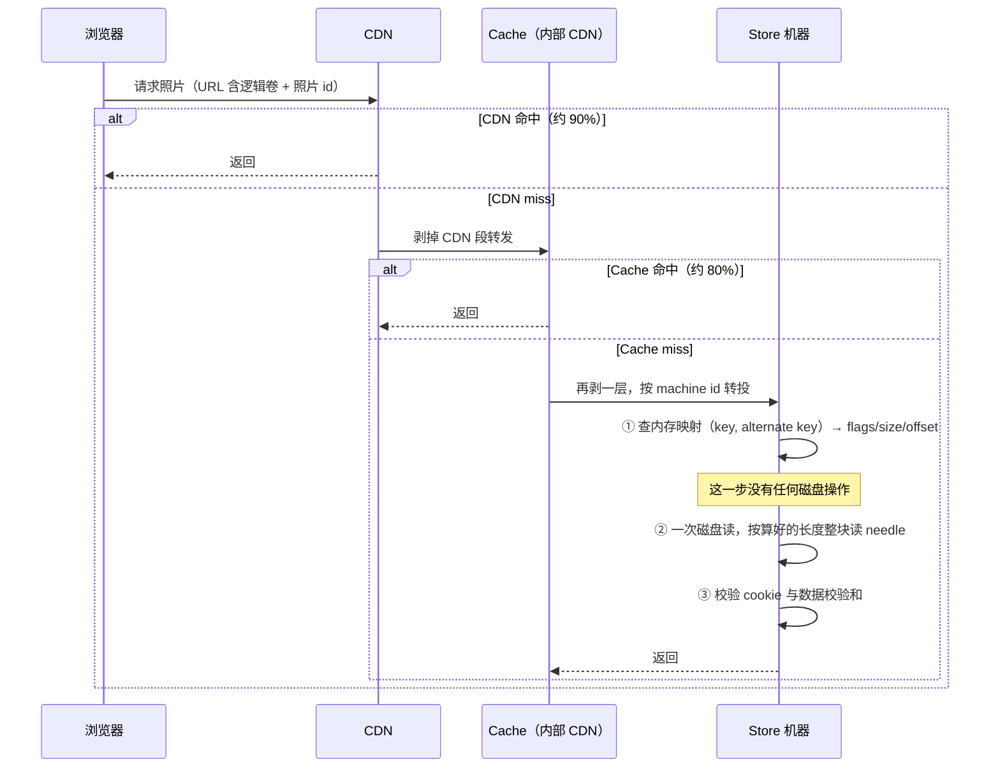
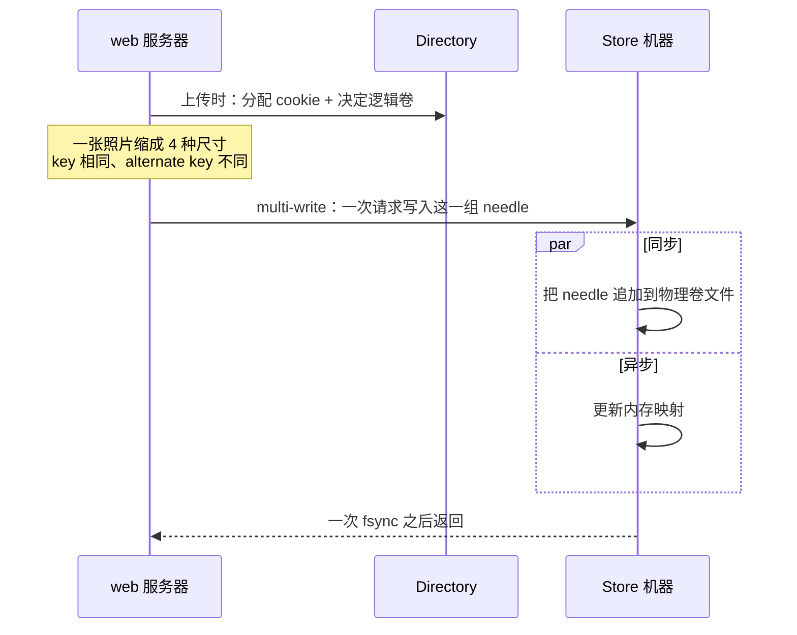

---
tags:
  - 分布式/存储
---

# Haystack

Haystack（OSDI 2010）是 Facebook 的照片存储。它在这条线上是**唯一一篇做减法**的：前面几篇都在往系统里加机制（加复制、加时钟设施、加分层、加日志），Haystack 的问题恰好相反 —— **传统文件系统给的元数据能力它全都不需要，而这些用不上的能力正在吃掉它的读吞吐**。

规模锚点：**650 亿张照片**，，每张照片生成 **4 种尺寸**，合计 **2600 亿张图、超过 20 PB**；**每周新增 10 亿张（约 60 TB）**；**峰值每秒服务超过 100 万张图**（这组数字与下面的日流量口径不同：前者是累计存量与峰值，后者是单日）：

| 每日操作 | 数量 |
| --- | --- |
| 用户上传照片 | **1.2 亿** |
| Haystack 写入的照片 | **14.4 亿**（= 1.2 亿 × 4 尺寸 × 3 副本，正好 12 倍） |
| 被浏览的照片 | **800 到 1000 亿** |
| 其中 Haystack 实际读取 | **100 亿**（约 10%，其余 90% 由 CDN 消化） |

被浏览的尺寸分布也很说明问题：缩略图 **10.2%**、小图 **84.4%**、中图 **0.2%**、大图 **5.2%**。**八成以上是小图**，而小图恰好是 News Feed 里用的、对延迟最敏感的那类 —— 所以元数据开销必须压小，因为**单张图的元数据成本会被这个量级的请求数放大**。

## 要解决的问题：一次读取要花几次磁盘 I/O

上一版系统是 **NFS 挂载的商用 NAS**，每张照片一个文件。问题链可以一步步量出来：

1. **每目录放几千个文件** → NAS 设备的**目录 blockmap 大到无法被缓存** → **单张图常见超过 10 次磁盘操作**；
2. 把每目录降到**几百个文件** → 仍然稳定要 **3 次**：① 读目录元数据进内存；② 读 inode 进内存；③ 读文件内容本身；
3. 让 Photo Store 服务器**用 memcache 缓存 NAS 返回的 file handle**，并为此给内核加了 `open by filehandle` 系统调用 → **改善很小** —— 因为**冷门照片本来就不会被缓存**。"把所有 file handle 都塞进 memcache"这条退路也堵着：它只解决了一半问题，**仍然依赖 NAS 设备把全部 inode 驻留内存**。

> [!warning] CDN 不能替代后端存储
> 这条是主要教训：CDN 擅长服务**最热的内容**（头像、刚上传的照片），但社交网站还会产生大量**冷门（常常是旧的）内容请求**，即**长尾**。长尾请求**几乎全部落在后端存储上**（它们通常在 CDN miss），而把长尾全部缓存起来**不划算**（缓存容量要求太大）。

四个设计目标也就此确定：**高吞吐低延迟**（每次读取最多一次磁盘操作）、**容错**、**低成本**、**简单**（简单性的分量很重：正因如此，**几个月而不是几年**就建成并上线）。

## 三个组件

| 组件 | 职责 |
| --- | --- |
| **Store** | 持久化存储，**唯一管理文件系统元数据的组件** |
| **Directory** | 逻辑卷 → 物理卷的映射、应用元数据、读写负载均衡 |
| **Cache** | **内部 CDN**，替 Store 挡住最热照片；上游 CDN 故障重取时也靠它兜 |

三层容量单位的关系是：**物理卷**（physical volume，**100 GB** 一个）→ 同一台机器上的多个物理卷构成一块容量（例如**10 TB 的服务器切成 100 个物理卷**）→ **跨机器的物理卷再组成逻辑卷**（logical volume），**照片写进一个逻辑卷时会写到它对应的所有物理卷**。冗余就发生在这里。

### URL 就是寻址方案

```
http://<CDN>/<Cache>/<Machine id>/<Logical volume, Photo id>
```

**CDN 只用最后一段（逻辑卷 + 照片 id）就能在内部查到照片**；查不到就剥掉 CDN 段转投 Cache，Cache 同理再剥一层转投 Store 机器。这一条决定了 Haystack **不需要在 Store 前面放任何查表服务**。

### Directory 的四件事

1. 提供逻辑卷 → 物理卷的映射（上传时用，构造图片 URL 时也用）；
2. **把写分散到逻辑卷上、把读分散到物理卷上**；
3. **决定一个请求该走 CDN 还是走 Cache** —— 这个功能让人**能主动调节对 CDN 的依赖程度**；
4. **标记只读逻辑卷**（运营原因或容量已满）。标记**以机器为粒度**：扩容新加的机器是**可写**的，只有可写机器接受上传；时间推移容量耗尽即转为只读。

Directory 本身是个朴素组件：信息存在**复制的数据库**里，通过 PHP 接口访问，**用 memcache 降延迟**。丢掉一台 Store 机器的数据时，从映射里删掉对应条目，等新机器上线补上。

### Cache 的两条缓存条件（值得单独记）

缓存一张照片要**同时满足两条**：

- **(a) 请求直接来自用户，而不是来自 CDN**；
- **(b) 照片取自一台「可写」的 Store 机器**。

条件 (a) 的理由来自 NFS 时代的实测经验：**CDN 之后的缓存基本无效**，因为**在 CDN miss 的请求，落到内部 Cache 也大概率 miss**。

条件 (b) 的理由是间接的，但推理很干净：**照片在刚上传后访问最密集**，而且**这台文件系统在做读或写中的一件事时表现更好，不能读写混做**（见下面评测一节）。两条合起来意味着：**如果没有 Cache，可写 Store 机器会承担最多的读** —— 所以要用 Cache 专门把它们隔开。

还有一个很自然的优化方向：既然刚上传的照片马上会被读很多次，**不如主动把新上传的照片推入 Cache**。

## 核心：needle 与内存映射

> **一台 Store 机器只用逻辑卷 id 和照片在文件里的 offset，就能快速定位一张照片。这个能力是 Haystack 设计的基石（keystone）：取到一张照片的 filename、offset、size 而不需要任何磁盘操作。**

一个物理卷就是一个**很大的文件**，路径形如 `/hay/haystack<logical volume id>`。文件结构是 **superblock + 一串 needle**，一张照片 = 一个 needle：

| 字段 | 说明 |
| --- | --- |
| Header | **magic number，用于恢复** |
| **Cookie** | **随机数，抵御暴力枚举查找** |
| **Key** | **64 位照片 id** |
| **Alternate key** | **32 位补充 id** |
| Flags | 标记删除状态 |
| Size | 数据大小 |
| Data | 照片数据本身 |
| Footer | **magic number，用于恢复** |
| Data Checksum | 完整性校验 |
| Padding | **needle 总长对齐到 8 字节** |

**那一对 (key, alternate key) 的用法值得说明**：上传时 web 服务器把同一张照片**缩成 4 种尺寸**，写成 **4 个 needle，key 相同**；**alternate key 用来区分尺寸** —— 取值范围是：**按递减顺序可为 `n`、`a`、`s`、`t`**。

每台 Store 机器为**每个卷**维护一个**内存数据结构**，把 **(key, alternate key)** 映射到该 needle 的 **flags、字节数、卷内 offset**。**崩溃后，Store 机器可以直接从卷文件重建这个映射**。

**Cookie 是寻址安全的一环**：它的值由 **Directory 在上传时随机分配并保存**，嵌在照片的 URL 里，用来**消除"猜有效 URL"这类攻击**。Cache 向 Store 请求照片时，要同时提供逻辑卷 id、key、alternate key 和 cookie。

### 读 / 写 / 删三种操作的语义

**读**：在内存映射里查到元数据 → 若未删除则 seek 到 offset，**按预先算好的长度整块读出 needle** → **校验 cookie 与数据完整性** → 返回。

**写**：机器**同步地**把 needle 追加到物理卷文件、**异步地**更新内存映射。这里有个后果要记住 —— **Haystack 禁止覆盖 needle**，所以修改照片的方式只能是**追加一个 (key, alternate key) 相同的新 needle**：

- 新 needle 写到**不同逻辑卷** → **Directory 更新应用元数据**，此后的请求永远不会取到旧版本；
- 新 needle 写到**同一逻辑卷** → 追加到对应的物理卷文件，**Haystack 用 offset 区分重复 needle：卷内 offset 最高的那个就是最新版本**。

**删**：把内存映射和卷文件里的 **delete 标志都置位**（卷文件里是同步置位）。请求已删除照片时先查内存标志直接返回错误。**被删 needle 占的空间此刻是丢掉的** —— 靠后续压实回收。

### index file：把重启时间压下来

理论上 Store 机器**读全部物理卷就能重建内存映射**，但那是**若干 TB 的数据全部读一遍**，耗时太长。于是每个卷维护一个 **index file**：它是内存数据结构的**检查点**，布局与卷文件类似（superblock + 一串 index record），**record 的顺序必须与 needle 在卷文件中的顺序一致**。

这里的设计取舍很具体：**写新照片时同步追加 needle、异步追加 index record**；**删照片时同步置 needle 的 flag、完全不更新 index file**。好处是**写和删都省掉一次同步磁盘写、返回更快**，代价是两个副作用：

- **orphan**：**有 needle 但没有对应 index record**。重启时机器顺序扫描每个 orphan，补一条 record 追加到 index file。孤儿能**被快速识别**，因为 **index file 的最后一条 record 对应卷文件里最后一个非孤儿 needle**；
- **index record 不反映已删照片**：重启后可能取到实际已删除的照片。处理方式是把整个 needle 读出来之后**再检查 delete flag**，若已删则**更新内存映射并通知 Cache「对象不存在」**。

### 为什么选 XFS

Store 机器需要一个**不需要多少内存就能在大文件里快速随机 seek** 的文件系统。Haystack 用 **XFS**（extent-based），两条好处：**若干连续大文件的 blockmap 小到能放进内存**；**XFS 支持文件预分配**，抑止碎片、限制 blockmap 增长。

于是 **Haystack 在读照片时可以把文件系统元数据那几次磁盘操作完全消掉**。这里有个必须写明的边界：**这不保证每次读恰好一次磁盘操作** —— **照片数据跨越 extent 或 RAID 边界时，文件系统仍可能要多花一次**。所以 **Haystack 预分配 1 GB 的 extent、并把 RAID stripe 设成 256 KB**，使这些情况在实践中很少遇到。

> [!warning] "恰好一次"是目标而非不变式
> "最多一次磁盘操作"是**目标**而非不变式。跨 extent / 跨 RAID 边界的照片会破坏它，1 GB extent 与 256 KB stripe 是**把这个概率压低**的工程手段。

## 一次读走完的路径

这一节把“最多一次磁盘操作”这个目标落到一条具体的链路上。整条链路有四跳，而**其中三跳都可能直接终止**：



**四跳的分工各自成立的前提不同，这是这一节最值得记的地方：**

| 跳 | 靠什么命中 | 命中的前提 |
| --- | --- | --- |
| **CDN** | 最热的内容（头像、刚上传的） | **长尾请求必然 miss** —— 冷门照片在 CDN 里没有副本 |
| **Cache** | **可写 Store 机器上的照片**（也就是较新的） | 只缓存“来自用户”且“取自可写机器”的照片 |
| **Store 的 ①** | **纯内存**：每张照片约 10 字节的映射 | 索引常驻内存，这本身是设计目标之一 |
| **Store 的 ②** | 一次 seek + 一次整块读 | 需要 ② 之前已经知道 offset 与 size |

**“最多一次磁盘操作”这句话的准确含义是“② 那一步只有一次”。** ① 是内存操作，③ 是 CPU 操作。**传统方案里那 3 次磁盘操作（目录元数据、inode、文件内容）被压成了 1 次，压掉的两次全部落在“元数据该不该从磁盘读”这个判断上。**

**还有一处必须与这条链路一起记的取舍**：Store 机器**读完之后才校验 cookie**，而不是“先按 cookie 找” —— 因为**内存里不存 cookie 值**。这一条正是内存账本能压到 10 字节的原因之一（见 `## 内存账本：为什么“全放内存”是可行的`）。

**这条路径还有一处容易被忽略的性质：它的前三跳都是“可以缺席”的，只有最后一跳不可缺席。** CDN 与 Cache 都可以整层拿掉 —— 拿掉 CDN，请求直接落到 Cache；拿掉 Cache，请求直接落到 Store。**系统不会因此出错，只是每秒钟要服务的读次数变成原来的十倍。** 这一条把“分层的意义”说清了：**前三层买的是后端的读吞吐，而不是正确性。**

**由此也能推出一条容量判断**：这套系统的后端规模应该按“**CDN miss 的那 10%**”来规划，而不是按“被浏览的总量”。**看到后端读压力上升时，要先确认是总量涨了，还是 CDN 的比例掉了** —— 后者的杠杆在一个完全不同的地方（内容热度分布），而不在存储侧。

**这条路径的成本还可以从“每一跳买到什么”的角度再读一遍。** CDN 买到的是**从离用户最近的地方返回**；Cache 买到的是**把最热的那部分从 Store 的读负载里摘出来**（实测命中率约 80%，且它只缓存可写机器上的照片，于是正好降低了本会受影响最大的那些机器的读请求率）；**Store 买到的是“一次磁盘操作”这个下界** —— 它是唯一无法被前两跳替代的一层，因为**只有它知道数据在盘上的确切位置**。

**三层各自用不同的“键”做判断，这一点是它们能叠起来的原因**：CDN 按内容热度、Cache 按照片 id 与所属机器类型、Store 按 (key, alternate key) 与内存映射。**键不同，判断依据就不同，于是三层不会退化成三份同样的缓存。**

**这条链路还有一处“顺序上的必然”：四跳必须按这个顺序走，因为每一跳都在为下一跳缩小范围。** CDN 只能按 URL 里的逻辑卷与照片 id 判断；Cache 拿到的是同一段 URL 加上“这台机器可写”这一条信息；Store 拿到的是机器 id 与逻辑卷 id，才能算出物理卷文件的位置。**反过来说，如果顺序颠倒（Store 先判断热度），它就必须自己维护一份热度表 —— 而那正是它想避免的东西。**

### 那条路径上的每一跳都可能终止

把四跳画成一条直线，会漏掉一个重要性质：**它们是四个各自独立的判定点**，而不是“逐级回退的缓存层次”。

```
   请求进来
     │
     ├─ CDN：命中就结束       ← 约 90%（被浏览 800–1000 亿 vs 实际读 100 亿）
     │     判断依据：内容有多热
     │
     ├─ Cache：命中就结束      ← 在到达 Cache 的请求里约 80%
     │     判断依据：照片是否来自「可写」机器 + 请求是否直连用户
     │
     └─ Store：无论如何都要走完
           ① 内存映射（必然命中，除非该 key 不存在）
           ② 一次磁盘读
           ③ cookie 与校验和验证
```

**第一跳与第二跳的判断依据完全不同，这是关键。** CDN 按“内容热度”判断，**Cache 按“数据在哪一类机器上”判断** —— 后者是 Haystack 自有的概念（可写机器 vs 只读机器），CDN 不知道这个概念。

**这条差别带来一个运营上的抓手**：Directory 的第三个职责是“决定一个请求该走 CDN 还是走 Cache”，于是**对 CDN 的依赖程度是可以在运行期调节的** —— 想减少 CDN 的流量就多走 Cache，想减轻 Store 的压力就多走 CDN。**把“缓存策略”做成一个可以主动调的旋钮，而不是一套写死的规则**，这一点在 CDN 与源站之间划出了一条可移动的边界。

**第三跳那些“看起来多余”的校验也各有用处**：**cookie 用来消除“猜 URL”这类攻击**（它由 Directory 随机分配并嵌在 URL 里）；**数据校验和用来挡静默损坏**。两者都不改变命中率，只改变“不该被返回的东西会不会被返回”。

## 一次写走完的路径与 multi-write

写路径的关键在于**它几乎不做同步 I/O**：



**写路径上有三个刻意的“不做”：**

- **不做覆盖。** needle 一旦写下就不再修改，改照片的唯一方式是**追加一个 (key, alternate key) 相同的新 needle**，并用 offset 定版本（详见原稿“读/写/删三种操作的语义”）。
- **不同步更新内存映射。** 卷文件是同步追加的，**内存映射是异步更新的**。这让写返回更快，代价是“崩溃后内存映射可以由卷文件重建”这条能力必须成立。
- **不同步写 index file。** index file 是同一个取舍的延伸：写照片时同步追加 needle、异步追加 index record；**删照片时只同步置 needle 的 flag，完全不更新 index file**。

**这第三个“不做”换来的是删除变得极便宜**，但它留下两类不一致（orphan 与“index record 不反映已删照片”），而这两类的处理方式恰好都建立在同一件事实上：**index file 的 record 顺序必须与 needle 在卷文件中的顺序一致** —— 顺序一旦对齐，“哪些 needle 没有对应 record”就能被快速算出来。

### multi-write 的收益从哪来

生产环境里**写永远是 multi-write**，这有两个天然来源：**每张图的 4 个尺寸天然成组**，以及**用户常整本相册上传**。

合成负载给出的收益是明确的：**把 1 次写摊到 4 张与 16 张上，吞吐分别提升 30% 与 78%**，单张延迟同时下降。**而生产实测的平均值更值得记：某台可写机器平均每次 multi-write 写 9.27 张图** —— 也就是说真实负载的批量天然落在 4 张与 16 张之间。

**更大的批量为什么还能涨吞吐**，原因要回到硬件那一层：**写延迟的均值随批量上升（4.9 → 15.2 → 43.9 ms），但吞吐涨得更快**，因为一次请求只付一次“排进磁盘 + 一次 fsync”的固定成本。**收益与代价的方向相反，而生产选择的是吞吐那一侧。**

**multi-write 的存在还解释了一处生产观测**：**multi-write 延迟 1–2 ms 且非常平稳**，而合成负载里测到的是 4.9 ms 起。**差别来自 NVRAM 支撑的 RAID 控制器缓存写** —— needle 先落到控制器的 NVRAM 就返回，真正的卷文件写入是异步的，multi-write 完成后**只发一次 fsync**。**生产比合成快，是因为合成负载没有把 NVRAM 的作用算进去。**

## 内存账本：为什么"全放内存"是可行的

这是全篇最能说明"减法"价值的一组数字。

- Store 机器**不保存 cookie 值**，而是**读完 needle 后再校验传来的 cookie**；
- **内存里不用标志位表示删除，而是把已删照片的 offset 设为 0**；
- 这两项**把内存占用降低 20%**；
- 现状：**平均每张照片约 10 字节内存**。

把账算到底：每张上传的图缩成 **4 张**，**key 64 位 + alternate key 32 位 + data size 16 位，共 32 字节**，再加**哈希表开销约 2 字节** → **同一张图的 4 个尺寸合计 40 字节**。

**对照组：Linux 里一个 xfs inode 是 536 字节。**

### 把不必要的东西移出内存

**内存账本这一节的做法值得单独提炼：是“把不必要的东西移出内存”，而不是“压缩数据结构”。** 三处动作都属于后者：

- **cookie 不进内存** —— 它本来会被存成每张照片一份的随机数；改成“读完 needle 再校验传来的 cookie”，**内存里就不需要这一项**；
- **删除状态不进内存的标志位** —— 改成**把已删照片的 offset 设为 0**，于是“已删”这件事借用了一个本来就要存的字段；
- 二者合起来**降低内存占用 20%**。

**这个方向的普遍形式是：能靠“再读一次磁盘上的数据”换回来的东西，就不要常驻内存。** 它的适用条件是“那次额外的读本来就要做” —— 这里恰好成立，因为**读 needle 是必经之路，cookie 就在 needle 的头部**。

**对照那个 536 字节的 xfs inode 能看清这笔账的量级**：同一张图的 4 个尺寸在 Haystack 里合计 **40 字节**（**key 64 位 + alternate key 32 位 + data size 16 位 = 32 字节**，加哈希表开销约 2 字节，再乘 4 个尺寸），而**通用文件系统为每个文件准备 536 字节**。**“通用”的代价就写在这两个数字的比值里** —— 而 Haystack 之所以能吃下这个减法，是因为它的对象**不带目录语义、不需要权限、不需要时间戳、不需要硬链接**。

## 压实与回收

**compaction** 是在线操作，回收**被删除的 needle 与重复的 needle**（key 与 alternate key 都相同者）所占空间：把 needle 复制进新文件，**跳过重复与已删条目**；期间**删除操作同时写到两个文件**；到文件末尾后**阻断对卷的进一步修改，原子地交换文件与内存结构**。

删除的规律与浏览相似 —— **新照片被删的概率大得多**，**一年之内约 25% 的照片会被删除**。

**压实这一节还有两处细节值得补上。** 一是**“重复”的定义**：key 与 alternate key **都相同**的 needle 才算重复 —— 这正是“改照片 = 追加同 (key, alternate key) 的新 needle”这条约定的直接后果，**一份数据在卷里最多留两条，旧的那条是压实要清掉的对象**。

二是**压实期间的写怎么处理**：删除操作**同时写到两个文件**（旧卷与新卷），于是压实过程中进来的删除不会丢。走到文件末尾后，**阻断对卷的进一步修改，然后原子地交换文件与内存结构** —— 这个“阻断 + 原子交换”的窗口就是这套在线压实唯一的停机点，而它的长度由最后那一步决定，不由搬数据的过程决定。

**删除的规律与浏览规律一致，这一点让压实可以做得更聪明**：**新照片被删的概率大得多，一年之内约 25% 的照片会被删除**。于是“哪些卷最值得压实”是可以排序的 —— **越老的卷，里面的死数据越多**。

## 容错与恢复

两套朴素手段，一套管检测、一套管修复：

- **pitchfork**：后台任务，周期性检查每台 Store 机器健康度（远程测连接、检查每个卷文件可用性、**尝试从该机器读数据**）。若持续失败则**自动把该机器上的所有逻辑卷标记为只读**，根本原因离线人工处理；
- **bulk sync**：用**副本提供的卷文件**重置一台 Store 机器的数据。**每月只发生几次**，简单但慢 —— **瓶颈是要同步的数据量常常比该机器网卡速率大好几个数量级，恢复时间以小时计**。。

**容错这一节的关键判断是“两套手段的成本不对称”。** 检测很便宜：pitchfork 是个后台任务，**远程测连接、检查卷文件可用性、试着从机器读数据**，持续失败就自动把该机器的所有逻辑卷标成只读，把根因留给人工。**它的动作是“标记”，不是“修复”。**

修复很贵：**bulk sync 用副本的卷文件重置一台机器**，而**瓶颈是“要同步的数据量常常比该机器网卡速率大好几个数量级”** —— 于是恢复时间以小时计（原稿记的是“以小时计”，具体量级由机器容量与网卡带宽的比值决定）。**它每月只发生几次**，所以慢一点可以接受。

**这两条合起来是一条可迁移的判据：检测可以频繁做（因为它便宜），修复只有在“罕见且可以慢”时才做全量重建。** 一旦修复变频繁，全量重建就会成为系统的主要矛盾 —— 这也正是 Haystack 把逻辑卷标成只读、把根因交给人工的原因：**它宁可让一台机器退出服务，也不愿让修复进入常态。**

## 评测

**Cache 命中率约 80%** —— 因为 Cache 只存**可写机器上的照片**，而那些照片是较新的，正好落在访问密集的区间。这使 Cache**显著降低了那批本会受影响最大的机器的读请求率**。

硬件基线：2U 存储刀片，**2 颗超线程四核 Xeon、48 GB 内存、带 256–512 MB NVRAM 的硬件 RAID 控制器、12 块 1 TB SATA**，约 **9 TB 容量配成 RAID-6**。两处取向说明：**因为经验表明在 Store 机器上缓存照片无效，NVRAM 全部留给写**；**磁盘缓存关闭**，以保证崩溃或断电后数据一致。

### 合成负载（单位：images/s）

| 负载 | 读吞吐 | 读延迟均值 / 标准差 | 写吞吐 | 写延迟均值 / 标准差 |
| --- | --- | --- | --- | --- |
| Random IO（只读，基线） | 902.3 | 33.2 / 26.8 ms | — | — |
| A（只读，64 KB） | 770.6 | 38.9 / 30.2 ms | — | — |
| B（只读，混 8 KB 与 64 KB） | 877.8 | 34.2 / 28.1 ms | — | — |
| C（只写，1 张/次 multi-write） | — | — | 6099.4 | 4.9 / 16.0 ms |
| D（只写，4 张/次） | — | — | 7899.7 | 15.2 / 15.3 ms |
| E（只写，16 张/次） | — | — | 10843.8 | 43.9 / 16.3 ms |
| F（98% 读 + 2% multi-write） | 718.1 | 41.6 / 31.6 ms | 232.0 | 11.9 / 6.3 ms |
| G（96% 读 + 4% multi-write，16 张/次） | 692.8 | 42.8 / 33.7 ms | 440.0 | 11.9 / 6.9 ms |

负载 A 的解读：**Haystack 达到裸设备吞吐的 85%，延迟只高 17%**。开销来自四处：① 跑在文件系统之上而非直接访问磁盘；② 磁盘读的**比 64 KB 大**，因为要整块读 needle；③ 存的图**可能没对齐 RAID-6 stripe**，一小部分图要从多块盘读；④ Haystack 服务端的 **CPU 开销**（索引访问、校验和计算等）。

**批量写收益**：把 1 次写摊到 4 张与 16 张上，吞吐分别提升 **30% 与 78%**，单张延迟也随之下降。生产环境里**写永远是 multi-write**，因为"每张图的 4 个尺寸"天然成组，且用户常整本相册上传 —— 实测某台可写机器的**平均每次 multi-write 写 9.27 张图**。

### 生产负载

- **multi-write 延迟 1 到 2 ms 且非常平稳** —— 因为有 **NVRAM 支撑的 RAID 控制器缓存写**，**needle 异步写入，multi-write 完成后只发一次 fsync 刷卷文件**；
- 只读机器的读延迟在流量波动（三周内**最多 3 倍**）下也相当平稳；
- 可写机器的读延迟受三个因素影响：① 机器上照片越多读流量越大；② **可写机器上的照片被 Cache 缓存、只读机器上的不被缓存**，所以 buffer cache 对只读机器更有效；③ 刚写的照片**很快被读回**（Facebook 会突出近期内容），这些读**必然命中 buffer cache**，反而抬高了命中率；
- **CPU 空闲率 92% 到 96%**；
- 负载节律：**周日、周一上传峰值**，此后平滑下降，**周四到周六持平**，下一个周日又创新高 —— **整体规模每天增长 0.2% 到 0.5%**。

## 成本对照

用两个口径量化收益：**每可用 TB 的成本**与**每可用 TB 的读速率**。结论是**每可用 TB 便宜 28%，且每秒处理的读次数是 NAS 方案的约 4 倍**。

## 底层依赖：文件系统、RAID 与那台“不能读写混做”的机器

这套设计有一半的决定是在“下面那一层允许什么”这个约束下做出来的。

**依赖一：一个 blockmap 小到能进内存的文件系统 —— 它选了 XFS。**

需求说得很具体：**在没有多少内存的前提下，能在很大的文件里快速随机 seek**。XFS 的两条性质正好对上：**若干连续大文件的 blockmap 小到能放进内存**；**支持文件预分配**，于是能抑止碎片、限制 blockmap 继续增长。

**这条依赖一旦不成立，整个“一次磁盘操作”就垮掉** —— 因为被压掉的那两次磁盘操作（目录元数据、inode）全部发生在文件系统这一层，而不是 Haystack 自己写的代码里。**换句话说：Haystack 的核心收益是从文件系统那里“借”来的。**

这里有一处对照很能说明这条依赖有多挑：**OBFS**（一个用户态的对象文件系统）**只有 XFS 的 1/25 大小**，**写吞吐比 XFS 更好**，但**读吞吐略差** —— 而读是 Haystack 的主要关切，于是这条路线被放弃了。**“更小更简单但读稍差”在这里是不合格的**，因为整套设计的目标函数里读排在第一位。

**依赖二：硬件 RAID 控制器与它的 NVRAM。**

配置是**带 256–512 MB NVRAM 的硬件 RAID 控制器**，12 块 1 TB SATA，**约 9 TB 容量配成 RAID-6**。两处取向值得记：

- **NVRAM 全部留给写** —— 理由是“经验表明在 Store 机器上缓存照片无效”，所以不拿它做读缓存；**生产里 multi-write 延迟 1–2 ms 且平稳，就直接来自这块 NVRAM**；
- **磁盘缓存关闭** —— 以保证崩溃或断电后数据一致。**这是一处用性能换一致性的开关，而它被拨向了“一致性”**。

**RAID stripe 设成 256 KB**，这是为了让“一张照片跨越 stripe 边界”这种情况在实践中很少遇到。它与 **1 GB 的 extent 预分配**合起来，是**把“最多一次磁盘操作”这条目标从“不变式”降级为“高概率成立”**的两条工程手段。

**依赖三：8 字节对齐。**

needle 的总长**对齐到 8 字节**。这条看起来琐碎，但它决定了“整块读 needle”这件事在底层是否一次就能取完 —— **不对齐就可能让一次逻辑读跨到两个物理块上**。

**依赖四：Directory 的复制数据库与 Cache 的分布式哈希表。**

- **Directory**：信息存在**复制的数据库**里，通过 **PHP 接口**访问，**用 memcache 降延迟**。丢掉一台 Store 机器的数据时，从映射里删掉对应条目，等新机器上线补上。
- **Cache**：组织成**分布式哈希表**，**用照片 id 作为 key** 定位缓存数据。

**依赖五：那一句“机器不能读写混做”。**

这条是脚下硬件的行为事实，而不是外部依赖，但它直接改变了 Cache 的策略设计：**一台机器在做读或做写其中一件事时表现更好，不能读写混做**。于是 Cache 的缓存条件里多了一条“**照片取自可写 Store 机器**” —— 目的是**把可写机器从读负载里隔开**，因为它们本来就是写最多的那些机器。

**把五条依赖排一张表：**

| 依赖 | 承担什么 | 换得掉吗 |
| --- | --- | --- |
| **XFS**（extent + 预分配） | 把“目录 + inode 两次磁盘操作”消掉 | **换得掉但要求很挑** —— 候选方案（如 OBFS）读吞吐必须不下降 |
| **硬件 RAID + NVRAM** | 写延迟的 1–2 ms、以及“最多一次读”的概率 | 换得掉，代价是写延迟从“控制器级”掉到“磁盘级” |
| **8 字节对齐** | 一次逻辑读不跨物理块 | **换不掉** —— 它是内存账本与一次性读之间的桥 |
| **复制数据库 + memcache（Directory）** | 逻辑卷到物理卷的映射 | 换得掉，但它是“上传”与“构造 URL”两处都依赖的真相来源 |
| **CDN**（外部） | 消化约 90% 的浏览请求 | 换得掉，代价是后端直接面对那 90% 的长尾 |

**这张表里有两条依赖的方向相反，值得单独看。** XFS 是“往下借收益”（借文件系统省下两次磁盘操作），CDN 是“往上借容量”（把热度挡在外面）。**Haystack 自己解决的问题，恰好是这两层都解决不了的那一段：中间的长尾。**

**这份依赖清单里有一处“反向依赖”值得单独点出：Haystack 依赖 XFS 提供的性质，而它对 XFS 的用法是高度特化的。** 它把一个大文件当“不做覆盖的顺序容器”用，把文件系统当“提供 offset 寻址与块映射的结构”用，**其余能力（目录、权限、时间戳、稀疏文件、属性）一概不用**。

**这条用法的强弱在于它的收益与风险来自同一处**：收益是“目录与 inode 那两次磁盘操作被彻底消掉”；风险是“**XFS 的行为一旦在某些边界上不符合预期（跨 extent、跨 stripe），那条目标就从不变式退化成概率**”。**换文件系统等于换掉这条收益 —— 换之前必须验证的是那些边界情况的表现，而不是功能**，这正是 OBFS 那条路线被放弃的原因：它在“读”这个最主要的关切上退了一步。

## 参数与可调项

这套系统的参数几乎全是**结构常量与阈值**，真正能在运行期调的很少 —— 这与它“做减法”的定位一致。

**容量与布局**

| 项 | 取值 | 语义与后果 |
| --- | --- | --- |
| **物理卷大小** | **100 GB** | 一个物理卷就是一个大文件，路径形如 `/hay/haystack<逻辑卷 id>` |
| **单机容量** | 例如 **10 TB 切成 100 个物理卷** | 一台机器上的多个物理卷构成一块容量 |
| **逻辑卷** | 跨机器的物理卷组成 | **照片写进逻辑卷 = 写到它对应的所有物理卷** —— 冗余就发生在这一层 |
| **needle 对齐** | **8 字节** | 决定一次逻辑读是否跨物理块 |
| **extent 预分配** | **1 GB** | 压低“照片跨 extent 边界”的概率 |
| **RAID stripe** | **256 KB** | 同上，压低“跨 stripe 边界”的概率 |
| **RAID 级别与容量** | **RAID-6**，12 × 1 TB ≈ 9 TB | 与“禁用覆盖 + 校验和”合起来构成持久性 |

**内存与索引**

| 项 | 取值 | 语义与后果 |
| --- | --- | --- |
| **每张照片的内存占用** | 平均约 **10 字节** | 这决定了“全放内存”是否可行 |
| 内存项的构成 | **key 64 位 + alternate key 32 位 + data size 16 位 = 32 字节**，加哈希表开销约 **2 字节**，一张图的 4 个尺寸合计 **40 字节** | 对照：**xfs inode 536 字节** |
| **cookie 是否进内存** | **不进** —— 读完 needle 再校验 | 省下每张照片一项；前提是“读 needle 本来就要做” |
| **删除状态怎么表示** | **把 offset 设为 0**，不用标志位 | 借用本来就存在的字段；与上一条合起来**省 20% 内存** |

**写路径**

| 项 | 取值 | 语义与后果 |
| --- | --- | --- |
| **multi-write 批量** | 生产上是自然的：**一张图的 4 个尺寸**、整本相册上传；**实测平均一次写 9.27 张** | 批量越大吞吐越高（4 张 +30%、16 张 +78%），但单张延迟上升（4.9 → 43.9 ms） |
| **fsync 时机** | multi-write 完成后**只发一次** | 配合 NVRAM，生产延迟 1–2 ms |
| **index record** | **异步**追加 | 换来“写更快”，代价是 orphan 与“删了但 index 不知道” |

**后台任务**

| 项 | 取值 | 语义与后果 |
| --- | --- | --- |
| **pitchfork 检查** | 周期性：远程测连接 + 检查卷文件可用性 + **试着真读一次数据** | 持续失败就把该机器所有逻辑卷**标成只读**，根因交人工 |
| **bulk sync** | **每月只发生几次** | 用副本卷文件全量重置；瓶颈是数据量 vs 网卡速率，**恢复以小时计** |
| **压实** | 在线；**阻断修改 + 原子交换**是唯一的停机点 | 回收已删与重复的 needle |

**三条读这张表的纪律：**

1. **容量参数（100 GB / 10 TB）不是性能参数，是“冗余单位”的参数。** 物理卷是复制的载体，逻辑卷是冗余的单位 —— **调卷大小改的是“一台机器坏掉会影响多少数据”，不是快慢。**
2. **两个“压低概率”的数（1 GB extent、256 KB stripe）必须一起看。** 它们共同支撑“最多一次磁盘操作”这条目标；**只改其中一个，边界情况的发生率不会按预期下降。**
3. **写路径的三个“异步”是一笔打包的取舍。** 内存映射异步、index record 异步、fsync 只发一次 —— **三者合起来换来生产级的 1–2 ms 写延迟**，代价是崩溃后的重建工作（orphan 扫描、已删判断）与那两类不一致。

**一处“参数化程度很低”的地方值得指出**：这套系统里**没有一个像“缓存大小”那样可以直接调的旋钮** —— 唯一接近的是 Directory 的第三个职责（**决定一个请求走 CDN 还是走 Cache**）。**能做到这种程度，是因为它把绝大多数价值做进了数据布局里，而不是做进了运行期策略里。**

## 版本演进：四年后的第二次减法

Haystack 这条路有一个罕见的后续 —— **同一家公司、同一批问题，四年后又做了一次减法**。

```
   2010  OSDI   Haystack
     │          · 把“一次读的磁盘操作数”从 3 次压到 1 次
     │          · needle + 内存映射 + 追加写 + 压实
     │          · 3 副本（逻辑卷跨机器的物理卷）
     │          · 规模锚点：650 亿张照片、2600 亿张图、20 PB+
     ▼
   2014  OSDI   f4 —— Facebook's Warm BLOB Storage
                · 触发点：BLOB 体量继续增长，用 Haystack 存「越来越不划算」
                · 做法：按访问模式划出温度区，隔离出「warm BLOB」
                · 效果：f4 存超过 65 PB 逻辑 BLOB，
                        把等效复制因子从 3.6 降到 2.8 或 2.1
```

**四年后的这次减法与 Haystack 的第一次是同一种手法，只是作用对象换了。** Haystack 减的是**每次读的磁盘操作数**（把元数据从磁盘挪进内存）；f4 减的是**每字节数据的冗余度**（把冷数据的存储开销压下去）。**两次都在问同一个问题：“这个负载真正需要的保证是什么，剩下的能不能不要。”**

**f4 的切入点是“温度”，这一点与 Haystack 的 Cache 策略直接呼应。** Haystack 已经隐含了一个温度判断 —— Cache 只缓存**可写机器上的照片**（那些是较新的、访问密集的），而 **CDN 消化的是最热的 90%**。**f4 把这件事从“缓存策略”提升成了“存储系统划分”**：既然访问频率分布得很开，就**为不同的温度段配不同的存储方案**，而不是让一套方案承担全部。

**数字上的对比最能说明问题**：Haystack 时代冗余是 **3 副本**；f4 把 **warm BLOB 的等效复制因子从 3.6 降到 2.8 或 2.1**。**“等效复制因子”这个提法本身就值得记** —— 它承认冗余是一个可以用更省的方式达到的等效值，而不必是整数副本。**这是 Haystack 那套“用减法定成本”的思路能被继续推下去的证据。**

**这份设计自己留下的两处“未做的事”也在同一个方向上：**

- **Ceph 的生成函数。** Haystack 里“逻辑卷 → 物理卷”是**显式查表**（Directory 里的映射）；Ceph 的做法是**引入生成函数代替显式映射，客户端直接算出元数据而不是查表**。**在 Haystack 里实现它仍然是 future work** —— 而这条一旦成立，Directory 这个组件本身就可能被消掉，**于是又是一次减法**。
- **obj id 里嵌关系。** 相关工作里有一条观察：**传统元数据预取算法在对象存储上效果更差，因为对象只有唯一编号、缺少目录隐含的语义分组**。他们的解法是**把对象间关系嵌进对象 id**。这条与 Haystack 是正交的 —— 因为 **Facebook 把这类语义关系显式存在社交图里**，不需要塞进照片 id。

**把这三段连起来看，能读出一条关于“通用存储 vs 专用存储”的判断**：Haystack 的收益来自**放弃通用性**（不要目录、不要权限、不要时间戳），f4 的收益来自**再放弃一层通用性**（不要“所有 BLOB 用同一套冗余”），而 Ceph 那条 future work 是**再放弃“显式映射”**。**每一次减法都要求负载的形状更确定 —— 而这条路能走多远，取决于负载的形状能不能被继续说得更细。**

**把这两次减法的顺序对照一下，能看出一条共同的判据：先减“每次操作的固定开销”，再减“每字节的存储开销”。** 2010 年的问题是“每次读要花几次磁盘操作”——**固定开销**，与对象大小无关；2014 年的问题是“每存一字节要配多少冗余”——**单位开销**，与对象总量成正比。

**这个顺序不是巧合。** 当对象数量还小、单次操作次数偏多时，先优化固定开销收益最大；**当积累到几十 PB、读写模式已经稳定下来之后，固定开销已经被优化过了，剩下的可减项只有单位开销。** 换句话说：**减法能把“操作次数”压到接近理论下界，等人开始为“存量数据”付账时，就该转向冗余度了。**

**这也给它自己的 future work 划了位置。** Ceph 那条“用生成函数取代显式映射”减的是**查表这一步的固定开销**（而且减掉的是 Directory 这个组件本身）—— 它属于第一类的继续推进。**而 f4 已经证明第二类还有空间**（等效复制因子从 3.6 降到 2.1，接近三分之一的砍幅）。

## 不适用于什么：减法成立的边界

**成立前提**

- **写一次、读多次、几乎从不修改。** 整套追加写与 offset 定版本的机制，前提是“覆盖”这件事可以退化成“追加一条新的”。
- **对象不带目录语义。** 不需要权限、时间戳、硬链接、按名字列目录 —— **内存账本能压到 10 字节，正是因为这些都被放弃了**。
- **能接受 Directory 是“最终正确的映射”。** 它存在复制的数据库里，靠 memcache 降延迟；丢掉一台机器的数据时是“删条目、等新机器补上”。
- **长尾由后端承担。** CDN 只挡最热的约 90%，剩下的 10% 必然落到 Store 上。
- **能接受“最多一次磁盘操作”是目标而非不变式。** 照片跨 extent 或 RAID 边界时，仍可能多花一次。
- **一台机器不能读写混做。** 这条硬件行为决定了 Cache 必须区分“可写机器”与“只读机器”。

**前提被违反时的后果**

| 违反的前提 | 后果 |
| --- | --- |
| 数据需要就地更新 | 追加写会让卷文件迅速膨胀，**压实成为常态而不是后台清理** |
| 需要目录 / 权限 / 时间戳语义 | 每对象的内存占用从 10 字节量级跳向 inode 量级，**“全放内存”不再成立** |
| 需要强一致的元数据映射 | Directory 那套复制数据库 + memcache 不够；要换更强的方案 |
| 想把长尾也缓存起来 | 缓存容量要求太大，**不划算** —— 这正是当年 NAS 路线的教训 |
| 读写必须混做（同一台机器既写又读） | **Cache 的两条缓存条件失效**，可写机器会承担最多的读 |
| 一次读的延迟不可预测 | 跨 extent / stripe 边界的那部分请求会破坏延迟分布的上尾 |

**与相邻系统的对照**

| | Haystack | [[01-GFS\|GFS]] | [[07-HBase 与 LSM-Tree\|HBase]] | [[09-Windows Azure Storage\|WAS]] |
| --- | --- | --- | --- | --- |
| 面向的对象 | **海量小对象的高并发随机读** | 大文件、批量处理 | 宽列行的读写混合 | 通用对象/表/队列 |
| 写模式 | 追加 + 压实 | 追加为主 | 追加 + LSM 合并 | 追加 + 两级复制 |
| 元数据在哪 | **内存（约 10 字节/对象）** | 内存 + 磁盘（chunk 级） | 内存（MemStore）+ 磁盘 | 内存（分区层索引） |
| 定版本靠什么 | **卷内 offset 最高者最新** | 无版本概念 | 时间戳 | PartitionName 内的顺序 |
| 冗余 | **3 副本（逻辑卷跨机器）** | 3 副本 | 由 HDFS 提供 | intra-stamp 3 副本 |

**这张表最值得注意的一行是“元数据在哪”。** 前三者都把元数据放进内存，但**放的东西不一样**：GFS 放的是 chunk 位置（每 chunk 一条）、HBase 放的是 MemStore（数据本身的一部分）、**Haystack 放的是“每张照片 10 字节的映射”—— 而它是唯一一个把“元数据足够小”本身当作设计目标的**。

**代价落在谁身上**

| 代价 | 落在谁身上 |
| --- | --- |
| 不能就地更新、必须追加 | **应用与压实** |
| 放弃目录语义 | **依赖文件系统接口的上层** |
| 长尾请求全部落到后端 | **Store 机器的读吞吐** |
| “最多一次”只是高概率 | **延迟分布的上尾** |
| Directory 的最终正确性 | **运维（丢机器时删条目、等新机器）** |
| 机器不能读写混做 | **Cache 的策略设计** |

**这张表读下来，落点集中在两处：对象的语义被砍到什么程度，以及后端能不能扛住长尾。** 这两件事决定了能减掉多少、减掉之后还剩下什么 —— **而它们都不是可以事后调的东西，必须在建模阶段就定下来。**

**这张对照表里还有一处“看起来相同、其实不同”的地方值得指出：Haystack 与 GFS 都用了“追加为主 + 定版本靠 offset”这套约定，但两者的版本语义不一样多。** GFS 的 chunk 会被反复修改，所以它必须用租约选出 primary；**Haystack 的 needle 一旦写下就不再改，于是完全没有“谁是 primary”这个问题** —— 这是“把可变性从数据结构里去掉”带来的第二次收益（第一次是省掉磁盘操作）。

**这条差别直接决定了两个系统的组件构成**：GFS 需要 master 管 chunk 位置与租约；**Haystack 的 Store 机器之间没有主从关系，Directory 也不管 primary** —— 它只管“逻辑卷映射到哪些物理卷”。**少一个需要选主的角色，就少一整类故障处理逻辑。**

## 排查：从症状到判据

```
   症状
     │
     ├─ 读延迟高，但磁盘不忙 ──▶ 先看请求走到了哪一跳
     │                              ├─ CDN 回源率高 ⇒ 长尾在变大，属预期
     │                              ├─ Cache 命中率低 ⇒ 看两条缓存条件是否被破坏
     │                              └─ Store 在忙 ⇒ 看内存映射是否命中（不该 miss）
     │
     ├─ Store 读延迟高且抖动 ──▶ 看这台机器是不是「可写」机器
     │                              └─ 可写机器同时承担写与读 ⇒ 读写混做，
     │                                 本应由 Cache 隔开
     │
     ├─ 重启/恢复很慢 ─────────▶ 看 index file 与 orphan 数量
     │                              └─ 有 index file ⇒ 不该全卷扫描；
     │                                 重启慢往往是 orphan 扫描在跑
     │
     ├─ 空间只涨不降 ──────────▶ 看压实的进度与旧卷的死亡比例
     │                              └─ 老卷死数据多（一年内约 25% 被删）
     │
     ├─ 写延迟高 ─────────────▶ 看 multi-write 的批量与 fsync 次数
     │                              └─ 批量小 ⇒ 固定成本被摊薄得不够；
     │                                 NVRAM 与 fsync 时机是另一侧
     │
     └─ 单张照片读取偶尔要两次盘 ▶ 看它是否跨了 extent 或 RAID stripe 边界
                                    └─ 属“目标而非不变式”的已知例外
```

**三条判读原则**

1. **先定位“哪个跳”再查“为什么”，因为四跳的判据完全不同。** CDN 按热度、Cache 按“数据在哪类机器上”、Store 按内存映射与磁盘 IO。**把长尾变多当成故障去查，会一路查到“设计就是这样”。**
2. **读写混做是这套系统里最特殊的一类故障，因为它是“行为不匹配”，而不是资源不足。** 一台可写机器读延迟高，先确认 Cache 是否按设计把它从读负载里隔开了 —— **加资源帮不上忙。**
3. **“意外多读一次盘”要先怀疑边界对齐，再怀疑硬件。** 1 GB extent 与 256 KB stripe 是把概率压低的手段，**它们不能把概率变成零**。看到少量请求多花一次读，先算一算它是否跨了边界。

**还有一条与“该不该扩容”有关的判据。** 这套系统的容量压力会表现为**两类不同的现象**：**物理卷写满**（属正常，转只读、上新机器）与**长尾占比上升**（属负载形态变化）。**前者扩容能解决，后者不能** —— 长尾变多意味着 CDN 的比例在下降，而 CDN 的比例是由“内容热度分布”决定的，不是由后端容量决定的。**把后者当前者处理，会一直加机器而看不到改善。**

**最后一条与“哪些现象其实不是故障”有关。** 三类看起来像故障、实际是设计行为的现象：**CDN 回源率上升**（内容热度分布在变，属正常）、**可写机器上物理卷被标成只读**（容量耗尽，属正常）、**少量请求多花一次盘**（跨 extent 或 stripe 边界，属已知例外）。**把它们当故障查，会一路查到“设计就是这样”。**

**反过来，三类容易被当成正常、实际要处理的现象**：**Cache 命中率低于约 80%**（两条缓存条件可能被破坏了）、**重启时间随容量线性增长**（index file 没在起作用、或 orphan 堆积）、**空间只涨不降**（压实没跑或旧卷死亡比例不够高）。**这三类都与“某个本该生效的机制没有生效”有关**，而与负载变化无关。

**最后一处与前一条呼应：查“哪一层”的时候要用该层的观测点，不要跨层用。** CDN 的回源率、Cache 的命中率、Store 的磁盘 IO 与内存映射命中率 —— **三者分别对应三跳，混在一起就分不清是哪一跳的问题**。前面那条判据（先定位跳、再查原因）在观测点上同样成立。

## 相关

- [[03-Dynamo|Dynamo]] —— 对照：Dynamo 用一致性哈希把 KV 摊开、为写可用性放弃强一致；Haystack 不解决一致性（**写一次、读多次、从不修改**），把复杂度全花在"读路径的磁盘操作数"上
- [[01-GFS|GFS]] —— GFS 也有"追加为主"的写模式与 chunk 概念；差别在 **GFS 面向大文件与大数据块批处理、面向 MapReduce 类负载**，Haystack 面向**海量小对象的高并发随机读**
- [[07-HBase 与 LSM-Tree|HBase 与 LSM-Tree]] —— 同为"追加 + 后台合并"的家族：那边是 $C_0/C_1$ 的多层 rolling merge，这边是 **needle 追加 + compaction**；两篇都把"禁用覆盖、用 offset 定版本"当作核心约定
- [[06-Aurora|Aurora]] —— 都在把随机写转成顺序写；Aurora 的落点是 redo log，这里的落点是 needle 追加 + **NVRAM 攒批后单次 fsync**
- **Ceph**（本专栏后续会收）—— 与之对照，Ceph 的做法是**用生成函数代替显式映射**（客户端直接算元数据而不是查表），并把"在 Haystack 里实现该技术"列为 future work

## 参考

- D. Beaver, S. Kumar, H. C. Li, J. Sobel, P. Vajgel. *Finding a Needle in Haystack: Facebook's Photo Storage*. OSDI 2010.
- S. Muralidhar, W. Lloyd, S. Roy, C. Hill, E. Lin, W. Liu, S. Pan, S. Shankar, V. Sivakumar, L. Tang, S. Kumar. *f4: Facebook's Warm BLOB Storage System*. OSDI 2014.
