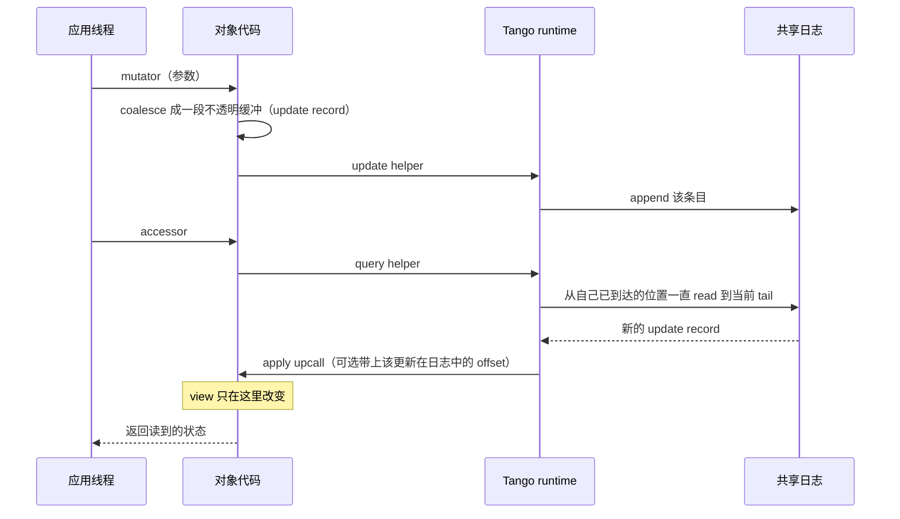
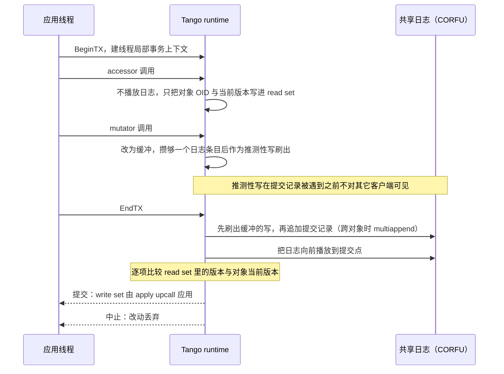

---
tags:
  - 分布式/存储
---

# Tango

Tango（SOSP 2013）在这条线上站的位置很特殊：它**不解决"数据怎么摆"，解决的是"抽象怎么给"**。前面十一篇各自造了一套机制（复制、定序、放置、恢复），Tango 问的是另一个问题：**能不能让应用只面对一个底座 —— 一条共享日志 —— 就把强一致、持久、高可用全部白拿过来？**

它把答案压成了一句话：

> **在 Tango 里，共享日志就是对象本身；view 只是软状态（soft state），按需在客户端被实例化、重建、以及通过把共享历史向前播放来更新。**

一个 Tango object 的状态有两个形态：**history**（日志里的有序更新序列）与 **view**（数据结构在客户端 RAM 里的完整或部分副本）。客户端改对象 = 往 history 追加一条更新；读对象 = 先把本地 view 与 history 同步。

## 要解决的问题：元数据服务为什么难做

切入点是：云平台给了分区存储与可并行计算两类抽象，但**对"存元数据"几乎没给支持**。而元数据的形态恰好是 map、tree、counter、queue、graph 这些**数据结构**（实例：文件系统命名空间、资源分配表、作业分配、网络拓扑、去重索引、血缘图）。它们的更新往往是**跨多个数据结构的多次操作**，同时要求原子性与隔离性 —— 例子很具体：**把一个节点从 free list 移到 allocation table**，或**把文件从一个命名空间位置移到另一个**。

现有方案三条路都不够：**云存储服务**（如 SimpleDB）与**协调服务**（ZooKeeper、Chubby）有持久性与高可用，但一只服务一种数据结构，且**对跨多个操作、条目或数据结构的支持很有限或没有**；**传统数据库**支持事务，但**可扩展性有限、且不是建在任意数据结构上**。

"给服务加高可用"有三条既有选择，第三条的问题最具体：

| 选择 | 问题 |
| --- | --- |
| 自己写容错协议 | 昂贵、耗时、**很难写对** |
| 用 Paxos 做状态机复制 | 要求服务被改造成状态机、**所有更新流经 Paxos 引擎** → 往往是**代码的大改写** |
| 用一个现成的高可用数据结构（如 ZooKeeper） | **强迫开发者用某一种数据结构存全部关键状态**。类比很损：**这就像 C++ STL 只提供哈希表、或 Java Collections 只带一个 TreeSet** |

第三条最要命的地方在于它会**逼出一个多系统拼装**：当时 HDFS namenode 加高可用的提案就是 **ZooKeeper + BookKeeper + 自研协议** 的组合。结果是**脆弱的系统依赖多个系统、每个都有自己的复杂协议与古怪失败模式**，底层协议还常常**重复地以略有不同的方式重新实现共识与持久化**，部署上则是**需要独立配置与供给多个分布式系统的噩梦**。

由此提出的目标是：**能不能用单一底层抽象，提供一批强一致、持久、高可用的数据结构，而且写一个新的、应用特定的数据结构只要几十行代码？**

## 共享日志为什么以前没流行

共享日志以前没流行起来有两条历史障碍，而它们都刚被消掉：

- **随机读负载**：日志主体会被大量客户端经网络并发访问，若底层介质是磁盘，这些随机读会拖慢其它读、并把 append 吞吐压成涓流。**flash 让这个顾虑基本消失**（Bernstein 等人的观察：flash 能支撑数千并发读写 IOPS）。
- **扩展性**：既有实现通常要求 **append 串行经过一台主服务器**，append 吞吐被单机 I/O 带宽限制。**CORFU 消除了这个**：吞吐上限变成**集中式 sequencer 分配 offset 的速度**。

### CORFU 的接口与内部

CORFU 的接口只有四个基本调用：**append（返回一个 offset）**、**check 当前 tail**、**read 指定 offset 的条目**、**trim 指定 offset**（表示可回收）。语义是**线性一致的** —— 一次 read 或 check 保证能看到任何已完成的 append。

内部组织：**存储节点分组成多个互不相交的 replica set**（例子：12 节点集群 = 4 个大小为 3 的 replica set）；**每个存储节点暴露一个 64 位 write-once 地址空间**，在 replica set 内做镜像；此外集群有一台专用 **sequencer**，本质上**是一个网络计数器，存着共享日志当前的 tail**。

写路径是：客户端先向 sequencer 要下一个空闲 offset → 用**一个基于集群成员的确定性映射**把这个全局 offset 映射到某个 replica set 上的本地 offset（**offset 0 → A:0，offset 1 → B:0，……直到函数绕回 A:1**）→ 客户端**直接向该 replica set 的存储节点写入**，用的是**一个客户端驱动的 Chain Replication 变体**。读走类似流程，只是不需要向 sequencer 取 offset。

**check tail 有两种**：**快速 check（亚毫秒，问 sequencer）**与**慢速 check（几十毫秒，查各存储节点的本地 tail 再反转映射函数得到全局 tail）**。

> [!warning] sequencer 为什么不是单点故障
> 它只存**一点软状态** —— **一个代表日志 tail 的 64 位整数**；它挂掉时**任何客户端都能用慢速 check 恢复这个状态**。更重要的是，**sequencer 只是"找 tail"的优化，不是正确性所需** —— 写入存储节点用的 Chain Replication 变体保证多个客户端争同一 offset 时**恰好一个会赢**。所以系统**能容忍存在多个 sequencer，也能完全不用 sequencer 运行**（代价是吞吐大幅下降，客户端得自己探测 tail 位置）。

另一种失败模式是**客户端拿到 offset 之后、写存储节点之前崩溃**，在日志里留下**空洞** —— CORFU 为此提供一个**亚毫秒的 fill 原语**。

**sequencer 的性能**有三代数字：早期用户态实现 **200K appends/sec**；改用 Windows Server 2012 的 Registered I/O 接口后，**随客户端增加上升到约 570K 请求/秒后趋于平坦**，且**除了 TCP/IP 默认的 Nagling 之外没做任何批处理**；**批大小为 4 时超过 2M 请求/秒**，当然会**影响 append 的端到端延迟**。这个观察和别人的数据对得上：Percolator 的集中式时间戳预言机在批处理下也超过 2M 请求/秒、Vasudevan 等人报告单服务器 **1.6M 次亚毫秒 4 字节读/秒**、Masstree 在批处理下 **6M 查询/秒**。

**底层介质与条目大小**：CORFU 存储节点就是一块**带自定义接口的 SSD**（用 write-once 的 64 位地址空间代替传统 LBA，空间靠显式 trim 而非覆写释放），所以性能与寿命与商用 SSD 类似，**顺序 trim 对 flash 的磨损显著小于随机 trim**。日志**单条目大小（所有条目一致）在部署时选定以配合介质** —— **DRAM 用 128 字节、NAND flash 用 4KB**。抽象设计**可以跑在任何形式的非易失内存上**（含电池后备 DRAM 与相变内存）。关于垃圾回收，一个判断是**这是个假问题（red herring）** —— 设计者对 log-structured 的疑虑来自硬盘时代的 GC 经验，而 flash 时代的 SSD 本身就在做同样的事。

**读路径为什么不需要 sequencer，值得单独点出。** `check 当前 tail` 只需要一个“日志现在到哪了”的答案，而**这个答案可以先从 sequencer 快取，也可以在 sequencer 不可用时由存储节点侧反推** —— **慢速 check 查各存储节点的本地 tail，再反转映射函数得到全局 tail**。这一步能成立，是因为**那个把全局 offset 映射到具体 replica set 的函数是确定性的，所以“局部 tail → 全局 tail”可以反算**：同一份确定性映射，正向用在写路径上，反向用在恢复 tail 上。

**由此得到一处不对称**：**写路径必须问 sequencer**（要一个全局唯一、尚未被用过的 offset），**读路径不必**。这正是“**sequencer 只是找 tail 的优化，不是正确性所需**”这条性质的物理来源 —— 这是两条路径对 sequencer 依赖程度不同的直接结果，而不算设计者的谦辞。

## Tango object 的解剖

Tango runtime 提供的 API 只有两个**helper**：

- **update helper**：接受对象给的一段不透明缓冲，把它 append 到共享日志；
- **query helper**：从共享日志读新条目，并通过 **apply upcall** 交给对象。

对象代码本身有三部分：**view**（内存表示，如 list 或 map；`TangoRegister` 里就是**一个整数**）、**apply upcall**（强制实现，view 只在它被调用时改变）、**外部接口**（对象特定的 mutator 与 accessor）。

有一条纪律值得单独拎出来：**view 只能由 Tango runtime 通过 apply upcall 修改，不能由应用线程调用对象任意方法去改**。

数据流是反直觉的：**mutator 不直接改内存状态，accessor 也不立刻读状态**。mutator 把参数`coalesce`（合并）成一段不透明缓冲 —— 一条 **update record** —— 然后调 update helper；accessor 先调 query helper，**由它把日志里的新 update record 一直播放到当前 tail 并通过 apply upcall 应用**，然后才返回。

**把上面两条路径接成一条时间线**，能看清 runtime 在中间做了什么：



**这条链上一共有三处“绕一下”，每一处都换来一条性质：**

- **mutator 不直接改内存，而是把参数 `coalesce` 成一段不透明缓冲** —— 于是**一次事务里的多次 mutator 可以合并成一个日志条目**，日志条目数与事务数而不是与操作数成正比。
- **accessor 不直接读内存，而是先让 query helper 把日志播放到 tail** —— 于是**读到的至少是自己已经看到过的最新状态**，而“什么算最新”由共享日志的全序决定，不由本地时钟决定。
- **view 只能由 apply upcall 修改，应用的任意方法都不许动它** —— 这条纪律保证**同一份日志前缀在任何客户端上播放出同一份内存状态**。**若让应用线程直接改 view，两个副本就可能在同一位置上有不同的内存内容**，而系统里没有任何机制能发现这件事。

### 从共享日志白拿的四个性质

四个性质各自怎么来的，这段是全篇的论证核心：

#### 一致性：与一个常规 SMR 对象不可区分

到此为止的 Tango object 与一个常规 SMR 对象无法区分：更新都汇入一个**全序引擎**（这里是共享日志）。强一致的读靠"先在当前全序位置放一个标记，再确保 view 已看到该标记之前的所有更新"实现 —— 常规 SMR 通常靠**向全序里注入一个读操作**或**把读请求导向 leader**，**而 Tango 用的是日志的 check 函数**。于是**同一对象在多个机器上有多个 view 时，其 mutator 与 accessor 的调用是线性一致的**。

#### 持久性：view 是建在共享日志上的索引

重建状态只需**新建一个实例并调 query helper**。更微妙的一点是：**对象的内存数据结构里可以放指向日志中值的指针**，于是它**变成了一个建在 log-structured 存储之上的索引**。为此**每个 Tango object 对它的底层共享日志有直接、只读的访问权**，而 **apply upcall 可选地提供该更新在日志中的 offset**。**TangoMap 可以在每次 apply 时往内部 hashmap 里存 offset 而不是值**，之后 `get` 时**用 hashmap 定位 offset、再直接向共享日志发一次随机读**。

#### 历史：回滚到任意前缀

因为所有更新都在日志里，**新建实例并 sync 到日志的某个前缀，就能把对象回滚到历史任一点**；query helper 因此接受一个可选参数指定停止同步的 offset。view 很小时（如 `TangoRegister` 的一个整数），对象可以先建 **checkpoint** 交给 Tango（内部存在共享日志上）；而 **`forget` 调用**可以让对象**放弃对某个 checkpoint 之前的回滚（或索引）能力**，从而让 Tango **trim 日志、回收容量**。

#### 弹性：加 view 就是加读吞吐

**强一致读的吞吐可以只靠增加 view 来扩**：更多读意味着对共享日志更多次 check 与 read，**在日志饱和之前线性扩展**。还有一个附带的用法：**不同内存结构可以共享日志上的同一份数据** —— 例如一个命名空间可以用两棵树表示（一棵按文件名排序、一棵按目录层级），从而同时支持两类查询（"列出所有以 B 开头的文件" vs "列出这个目录下的所有文件"）。

## 事务：把 OCC 放到共享日志上

Tango 的隔离做法是**乐观并发控制，靠往共享日志里追加"推测性（speculative）事务提交记录"**。

- **提交记录保证原子性**：它**确定了持久全序中的一个点**，事务的改动从这个点起对所有客户端可见；
- **提供隔离**的是提交记录里的**一个 read set** —— 事务读过的对象列表及其**版本**，而**版本就是日志中最后一次修改该对象的 offset**；
- **事务只有在提交记录被遇到时其读都没有过期（即读过的对象此后未被修改）才成功**。

这里有一个很重的定性：**Tango 提供的隔离保证与两阶段锁相同，至少与严格可串行化一样强，并且与近期的 Spanner 系统完全相同。**

接口层是 **`BeginTX` / `EndTX` 括住 accessor 与 mutator 调用**：`BeginTX` 在**线程局部存储**里建一个事务上下文；`EndTX` 追加提交记录、**把日志向前播放到提交点**、然后做提交/中止判定。**每个遇到提交记录的客户端各自但确定性地判断**该提交还是中止 —— 比较 read set 里的版本与对象的当前版本。若读过的对象都没变，事务提交，write set 里的对象由 apply upcall 更新。

两个设计细节值得记：

**一、对象代码完全不需要改动。** 支持事务访问**对 Tango object 代码要求零修改**（`TangoRegister` 那段代码本身就支持事务）；**Tango runtime 只是在操作运行于事务上下文时，替换 update helper 与 query helper 的实现**。替换后的行为是：**update helper 改为缓冲更新、而不是立即写日志**；**攒够一个日志条目的量之后作为推测性写刷出** —— 这些写在提交记录被遇到之前**不对其它客户端可见**；`EndTX` 在追加提交记录之前把缓冲的更新刷出。对应地，**query helper 在事务上下文里不向前播放日志**，而是**用对象的 OID 与当前版本更新事务的 read set**。

**二、命名与版本粒度。** 唯一 OID 靠一张**从人类可读字符串（如 `FreeNodeList`）到唯一整数的目录**来分配 —— 而**这张目录本身就是一个 Tango object，带一个硬编码的 OID**。目录还兼管 `forget` 这个回收接口：因为**条目里可能含有影响多个对象的提交记录**，**目录记录每个对象的 forget offset，Tango 只在所有对象的最小值以下 trim 日志**。

版本粒度上，"每对象一个版本号"被指出不够：**对 register 或 counter 这类细粒度对象合适，但对 map、tree、table 这类大结构会造成不必要的高中止率** —— 因为这类结构上，**事务本应被允许并发修改互不相关的部分**。所以**对象可以可选地给 update/query helper 传不透明的 key 参数**，指明正在访问的是哪个**互不相交的子区域**，从而实现**对象内部的细粒度版本**；Tango 内部**追踪对象内每个 key 的最新版本**。对**不能静态划分为子区域的数据结构（如 queue 或 tree）**，对象可以**自带 key 方案，并提供 upcall 让 Tango runtime 调用以检查与更新版本**。

**三种事务的捷径**：**只读事务**的 `EndTX` **不往日志插提交记录**，只把日志播放到当前 tail 再判定 —— 如果系统没有写活动，**只读事务只需 check 一次日志 tail，在 CORFU 里就是到 sequencer 的一次往返**；Tango 还支持**从陈旧快照出发的快速只读事务**（`EndTX` 本地判定、完全不碰日志）。**只写事务**需要一次 append，但**可以立即提交、不必向前播放**。

**失败处理**简单得出奇，这是使用容错共享日志的直接后果：**事务中途崩溃的客户端会在日志里留下没有对应提交记录的孤儿数据**，其它客户端可以**插一条"设计来中止"的哑提交记录**把事务了结；**CORFU 层留下的空洞**则由遇到它的客户端**在可调超时（默认 100ms）后用 fill 操作补上**。除此之外，**Tango 客户端崩溃没有别的副作用**。

**判定的精确形式值得写出来。** 对 read set 里的每个条目 $(oid, v)$，取该对象在日志前缀 $[0, X)$ 上最后一次修改它的 offset $v'$；**若所有 $v' = v$，事务在位置 $X$ 处提交**。这个判定**只用版本号，不需要读取被读对象的旧值** —— 因为版本的定义是“最后一次修改该对象的 offset”，而 offset 是全序上的坐标，**它同时是版本号与位置**。

**这一点与快照隔离的分野值得记**：快照隔离需要保留多版本供读，而这里保留的只是“最后一次修改发生在全序的哪一格” —— **旧值本身仍然躺在日志里，随时可以按 offset 取回**。这也是为什么 TangoMap 能**在内部 hashmap 里存 offset 而不是存值**：**对象的内存结构变成了一个建在 log-structured 存储之上的索引，而“旧值在哪”这件事不需要它自己记住。**

## 一次事务走完的路径：从 BeginTX 到判定

前面把推测性提交、read set、helper 替换拆开讲了，这一节把它们接成**一条时间线** —— 因为 Tango 事务最有讲究的地方在时间轴上：**判定发生在每个客户端各自播放日志的过程中，日志里没有任何一步是“协调者”**。



**三处判据要一起读：**

1. **“提交”这件事没有执行者。** 判定条件是**每个遇到提交记录的客户端各自、且确定性地**比较 read set 里的版本与对象的当前版本 —— 版本的定义是**日志中最后一次修改该对象的 offset**。同样的日志前缀喂给任何客户端都得出同样的结论，所以**不需要一个节点来宣布结果**。
2. **提交点是全序里唯一的分界。** 提交记录**确定了持久全序中的一个点**，事务的改动从这个点起对所有客户端可见；在这之前，推测性写对别人不存在。
3. **孤立数据不需要清理协议。** 事务中途崩溃的客户端**在日志里留下没有对应提交记录的孤儿数据** —— 这些数据永远等不到自己的提交点，因此对任何客户端都不可见；其它客户端可以**插一条“设计来中止”的哑提交记录**把它了结。

**事务上下文改的是 helper 的两处行为**，对象代码一行不动：**update helper 从“立即写日志”改成“缓冲、攒够一个条目再作为推测性写刷出”**；**query helper 从“向前播放日志”改成“只把 OID 与当前版本写进 read set”**。`EndTX` 负责在追加提交记录之前把缓冲刷出去 —— 顺序不能反，否则提交记录之后才出现的写会被别人当成“提交点之后的新更新”。

**两条捷径在时间线上的形态完全不同：**

- **只读事务**的 `EndTX` **不往日志插提交记录**，只把日志播放到当前 tail 再判定。**如果系统里没有写活动，一次只读事务只需要一次 check 日志 tail —— 在 CORFU 里就是到 sequencer 的一次往返**。更极端的一条是**从陈旧快照出发的快速只读事务**：`EndTX` 完全在本地判定，一次日志都不碰。
- **只写事务**需要一次 append，但**可以立即提交、不必向前播放** —— 因为没有读过任何对象，read set 为空，冲突判定是平凡的。

**判定开销落在谁身上，决定了这套设计的扩展形状。** 一次读到提交点的播放，代价是“把这段时间里别人写进日志的条目都取回来、只把与本事务相关的应用上去”；因此**事务的冲突窗口只等于日志中从读到提交记录之间的那段跨度**，与系统里同时有多少客户端无关。这解释了后面评测里的一条现象：**单对象事务的吞吐在 3 节点就达到上限，加节点不再提升** —— 瓶颈是**单个客户端播放日志的速度**，是单机现象。

**与两阶段锁的对照在这里最清楚**：2PL 在提交前要握住锁、需要一个协调者来决定放锁顺序、并且会死锁；Tango 的提交记录**本身就写在日志里并按全序排列**，判定是各客户端独立做的。评测里专门实现了一个分布式 2PL 做对照，结论是**两者的扩展特性相似，而 Tango 不带有死锁与协调者崩溃这类问题**。

**为什么播放的终点是“提交点”而不是“当前 tail”，这条边界也值得点一下。** 提交点的位置由提交记录在日志中的 offset 决定，**在它之后写入的更新来自更晚的事务，按全序与本事务不冲突**。若把终点定在当前 tail，**read set 里每个对象的版本都会被后来的写刷新**，于是每一次判定都落在“读已过期”上 —— **那等于把可串行化退化成“任何并发写都中止”**。**播放终点这个选择直接决定了中止率**，而它不是一个性能旋钮，是决定语义的一步。

**反过来说，这也给出一条调优方向**：**读集越小、从 `BeginTX` 到 `EndTX` 的跨度越短，播放区间越短、被别人的写打断的机会越少**。评测里“每事务读 3 个 key、写 3 个 key”就是按这个思路把事务切小的。

## 分层分区与 stream

上面的描述里有一个隐含前提：**每个客户端播放整条共享日志，由 runtime 把日志里的更新多路分解到各个对象**。这在两种情形下够用：应用本身是**大规模全复制服务**（如运行在多台应用服务器上的作业调度服务，由 TangoMap + TangoList + TangoCounter 组成），或**不同对象共享同一段历史**（如对同一份数据同时提供树型 map 与哈希 map 来优化不同访问模式）。

但另外两种情形下就浪费了：**不同服务或组件共享部分状态**（如作业调度器与一个备份服务都需要那个 free list，但互不关心对方的其它对象）；**不同客户端托管互不相交的对象子集**，从而在分区内扩展。

> **我们把这种做法叫做分层分区（layered partitioning）：每个客户端托管全局状态的一个（可能重叠的）分区，而这个分区方案被叠在单一条共享日志之上。**

实现手段是 **stream**。**stream 在共享日志的接口（append 与随机 read）之上加了一个 `readnext` 调用**；**多条 stream 可以共存于同一条共享日志**，**对一个 stream 调 `readnext` 返回日志中属于该 stream 的下一个条目，跳过属于其它 stream 的条目**。于是**客户端可以靠播放自己关心的那些 stream 来有选择地消费共享日志**。

一个关键性质：**stream 不必然互不相交** —— **`multiappend` 调用允许日志里的一个物理条目属于多条 stream**，而这正是实现跨对象事务所依赖的能力。

与常规分片（sharding）的对照很清楚：

- **相同处**：像分片一样，每个托管分层分区的客户端**只看到系统流量的一部分**，所以**吞吐能随分区数线性扩展**（假定分区不重叠）；
- **不同处**：与分片不同，应用**仍能跨分层分区执行强一致操作（如事务）**，因为**共享日志在所有分区之上施加了全局定序**；
- **交换来的代价**：**所有分区的总吞吐有了上限** —— **一旦共享日志饱和，再加分层分区也不提升吞吐**。

### 跨 stream 的事务

做法很直接：**每个 Tango object 分配自己的专用 stream**；若事务不跨对象边界，runtime 无需改动。**事务跨对象边界时，Tango 改变 `EndTX` 的行为，把提交记录 `multiappend` 到 write set 涉及的所有 stream**。这个做法保证两条对原子性与隔离性必需的性质：

1. **影响多个对象的事务在全序中只占一个位置** —— 即**原始共享日志里每个事务只有一条提交记录**；
2. **托管某对象的客户端会看到每一条影响该对象的事务**，即使它不托管任何其它对象。

一条提交记录被 `multiappend` 到多条 stream 后，每个 Tango runtime **可能多次遇到它，每播放一条 stream 遇到一次**（底层 streaming 层会**从共享日志取一次并缓存**）。**第一次在位置 $X$ 遇到时，它把涉及的所有 stream 都播放到位置 $X$**，确保自己拿到**该事务触及的所有对象在 $X$ 处的一致快照**，然后照单对象的情形检查读冲突并判定提交/中止。

当客户端不再托管系统里每个对象时，读写都可能涉及“本地没托管的对象”。

#### 情况 A–D：四种远端访问的处置

分四种情况讨论：

| 情况 | 处理 |
| --- | --- |
| **A. 生成客户端上的远端写** | 简单 —— **客户端不需要播放一条 stream 就能往它 append**，所以生成客户端直接把提交记录追加到远端对象的 stream |
| **B. 消费客户端上的远端写** | 更新本地对象、**忽略对远端对象的更新**。这类事务是重要能力：可以让**生产者-消费者队列的生产者往队列加条目、而不必本地托管它**，也让 **ZooKeeper 的命名空间可以被切成多个实例、用远端写事务把 key 从一个挪到另一个** |
| **C. 消费客户端上的远端读** | 客户端**没有本地副本可比对读版本**，因此**无法判定**。解决方式是**在冲突解决流程里多加一轮**：**生成提交记录的客户端立即把日志播放到提交点、为自己刚追加的记录做出判定，然后再追加一条 decision record 到同一组 stream**；其它遇到该提交记录但没有本地副本的客户端**等待这条 decision record 到达** |
| **D. 生成客户端上的远端读** | **目前不允许**。对一个没有本地 view 的对象调 accessor 是有问题的（数据本地不存在）；可能的解法是对持有该对象 view 的其它客户端发 RPC，或在事务开始时本地重建 view（可能太贵）。若真发 RPC，**冲突解决会变得麻烦** —— 生成提交记录的节点没有所读对象的本地 view，无法检查其最新版本 |

关于 C 那个 **decision record**，有一条很干净的判断：**这一额外阶段增加了事务延迟，但不提高中止率，因为事务的冲突窗口仍然只是日志中从读到提交记录之间的那段跨度**。判定条件是：**如果系统里存在某个客户端托管了本事务 write set 中的对象、但不托管 read set 的全部对象，生成客户端就必须为这个事务插一条 decision record**。当前实现**要求开发者把对象标记为"需要 decision record"** —— 这个方案**简单但保守且静态**，更动态的方案可能要追踪每个客户端托管了哪些对象。

另外两条限制也写明了：**multiappend 对单个条目能追加到的 stream 数有上限**，也就是**单个事务能写的对象数有上限**；这个上限**在部署时设定，并转化为每个日志条目内的存储开销** —— **每个额外 stream 在 4KB 日志条目里占 12 字节**。**decision record 机制还引入了新的失败模式**：客户端可能在追加提交记录之后、追加 decision record 之前崩溃。但**额外的 decision 阶段只是优化 —— 共享日志里已经有做提交/中止判定所需的全部信息**：托管该事务 read set 的其它客户端可以在超时后补一条 decision record；若这样的客户端不存在，更大的超时之后**任何客户端都可以把 read set 里每个对象的本地 view 重建到提交 offset 并检查冲突**。

**四种情况的判定路径可以画成一张图**，因为它们的差别只在于“有没有本地 view 可用来做冲突检查”：

```
   一次跨对象的访问，对象view在不在本地？
        │
        ├─ 写 · 目标对象【本地托管】
        │     └─► 常规路径：本地 append，不需要额外机制
        │
        ├─ 写 · 目标对象在【远端】
        │     ├─ 生成客户端（情况 A）
        │     │     └─► 不必播放该 stream 就能 append
        │     │         ⇒ 直接把提交记录 multiappend 到远端 stream
        │     └─ 消费客户端（情况 B）
        │           └─► 更新本地对象、忽略对远端对象的更新
        │               （生产者-消费者队列、命名空间跨实例搬迁靠这条）
        │
        └─ 读 · 目标对象在【远端】
              ├─ 生成客户端（情况 D）
              │     └─► 【目前不允许】
              │         没有本地 view 可比对 ⇒ 冲突检查无处落脚
              └─ 消费客户端（情况 C）
                    └─► 本地无法判定
                         │
                         ▼
                    生成客户端立即把日志播放到提交点、为刚追加的
                    记录自判，再追加一条 decision record 到同一组 stream
                         │
                         ▼
                    其它遇到该提交记录、但没有本地副本的客户端
                    等待这条 decision record 到达
```

**这张图里最值得记的是 A 与 B 的分工**：**客户端不需要播放一条 stream 就能往它 append** —— 这一条让“生产者往自己并不托管的队列里加条目”成为可能，也让 **ZooKeeper 的命名空间可以被切成多个实例、用远端写事务把 key 从一个挪到另一个**。**写可以远，读不能远** —— 因为写只需要一个 append 的位置，而读需要一个本地副本作为冲突检查的基准。

### 一条提交记录在三条 stream 上的生命

`multiappend` 把一条提交记录写进多条 stream 之后，它在系统里的经历值得单独走一遍 —— 因为**这里同时用到“物理条目唯一”与“逻辑上属于多条 stream”两个事实**：

```
   一条跨对象事务的提交记录（write set = {A, B, C}）
        │
        │  multiappend
        ├──────────────────► stream A ──► 托管 A 的 runtime 播放它
        ├──────────────────► stream B ──► 托管 B 的 runtime 播放它
        └──────────────────► stream C ──► 托管 C 的 runtime 播放它
                                      │
   共享日志里它只占【一个物理条目】，位置为 X
                                      │
   runtime 甲（托管 A）在 stream A 上最先遇到它
        │  把涉及的三条 stream 全部播放到 X
        ▼
   拿到 A / B / C 在 X 处的一致快照
        │
        ▼
   用甲自己那套 read set 判提交或中止 ── 结果记在日志里，不另发通知
                                      │
   runtime 乙（托管 B）稍后在 stream B 上遇到同一条记录
        │  streaming 层从共享日志取一次并缓存，内容不重复读取
        ▼
   再判一次 ── 因判定是确定性的，结论必然与甲相同
```

**这段过程里有两条性质值得分开记：**

**一、“每个事务在全序里只占一个位置”是靠物理条目保证的。** 提交记录被 `multiappend` 到多条 stream，但**底层只有一个条目**，所以它在共享日志的全序里只有一个坐标 X。于是**所有托管者看到的相对顺序一致** —— 甲认为事务在 X 处提交，乙也必然在 X 处看到同一结论。这正是原子性所要求的那条：**影响多个对象的事务不能被不同客户端看成发生在不同位置**。

**二、“托管某对象的客户端会看到每一条影响该对象的事务”是靠 stream 成员关系保证的。** 乙可能只托管 B、完全不知道 A 和 C，但它播放 stream B 就一定遇到这条提交记录 —— 于是**它不会漏掉影响 B 的事务**。这两条性质合起来，就是“分区之后仍能跨分区做事务”的全部依据。

**第一次遇到位置 $X$ 时为什么要“把所有 stream 都播放到 $X$”**，也在这里显出来了：判定需要比较 read set 里每个对象的版本与**该对象在提交点的版本**。如果只播放一条 stream，乙手里可能只有 B 在 $X$ 处的状态，A 的版本还停在某个更早的位置 —— 比对就会用错基准。**把三条 stream 都推到 $X$，才拿得到该事务触及的所有对象在同一个全序位置的一致快照。**

**代价落在“重复遇到、重复判定”上**：一条提交记录被 `multiappend` 到 $k$ 条 stream，就最多被遇到 $k$ 次、判 $k$ 次。这看起来是浪费，但**判定的代价是只读的**（比对几个版本号），**而底层条目的读取由 streaming 层缓存掉**；真正被省下来的是“维护一份跨客户端的判定结果”所需的协调 —— 那才是它要避开的。**用可重复的本地计算换掉一次全局协调，和 CRUSH 用可重复的哈希换掉一张分配表，是同一种交易。**

### stream 在 CORFU 里怎么实现

stream 元数据被存成**共享日志地址空间上的一条 offset 链表，外加一个迭代器**。应用调 `readnext` 时，库**对迭代器指向的 offset 发一次常规 CORFU 随机读，然后把迭代器前移**。

为了在启动时快速构造这条链表，**共享日志的每个条目新增了一个小的 stream header**，含**一个 stream ID**以及**指向同一 stream 中最近 $K$ 个条目的 backpointer**。启动时应用给出关心的 stream ID 列表；库为每条 stream 找到日志中属于它的**最后一条**条目（这一步靠 sequencer 的接口），这条条目里的 $K$ 个 backpointer 让它**构造出该 stream 链表长度 $K$ 的一个后缀**；再对第 $K$ 个 backpointer 指向的 offset 发一次读，**取回链表里再往前 $K$ 个 offset**。如此**在日志上向后跨步**，**一条有 $N$ 个条目的 stream 需要 $N/K$ 次读**就能建好链表。**$K$ 越大，步长越长、链表构建越快。**

header 的格式有两种：默认**用相对于当前 offset 的 2 字节 delta 存这 $K$ 个 backpointer**，缺点是在**与前一 stream 条目的距离超过 64K 个条目时会溢出**；**当 $K$ 个 delta 全部溢出时，改用替代格式，把 $K/4$ 个 backpointer 存成 64 位绝对 offset**（可索引共享日志地址空间里任意位置）。于是**每个 header 多一个 bit 指示所用格式**，并带**要么 $K$ 个 2 字节相对 backpointer、要么 $K/4$ 个 8 字节绝对 backpointer**。实践中**用 31 位作 stream ID、剩下 1 位作格式指示**；**$K = 4$ 是这套方案的最小要求**，此时 **header 占 12 字节**（这也正好对上前面那个"每个额外 stream 12 字节"）。

因为**一个条目要能属于多条 stream**，**条目上存固定数量的这种 header，数量等于该条目能属于的 stream 数**，也就等于**单个事务能写的对象数**。

**sequencer 被拉进了这件事**：追加到一组 stream 时，客户端照常调 `increment` 取新 offset，但**现在这个请求里带上一组 stream ID**，而 **sequencer 为每个 stream ID 维护它发出的最近 $K$ 个 offset**，于是**在 `increment` 响应里连同新 offset 一起返回一组 stream header**。客户端拿到 offset 后**把 stream header 前置到应用载荷上**，再用常规 CORFU 协议写存储节点。sequencer 还支持一个**只返回这些信息而不递增计数器**的接口，让客户端在启动时能快速找到某条 stream 的最后一条条目。链表的**自更新**同理：库联系 sequencer 找到该 stream 最后一条条目，然后一路回溯到它已知的条目为止。

更新的时机是个取舍：可以**在 `readnext` 时被动触发**，但**若应用读得突发而稀疏，会让 `readnext` 延迟很高**；也可以**在 append 时主动触发**，但**对只写不读的应用是浪费**。为避免替应用瞎猜，改成库**新增一个 `sync` 调用**，把链表更新到最新并返回链表最后一个 offset —— **应用在发 `readnext` 之前必须调 `sync` 以保证 stream 的线性一致语义**，也可以**周期性地主动 `sync` 来摊薄维护成本**。

> [!warning] 改 CORFU 带来的一条容错能力回退
> 原版 CORFU **能容忍存在多个 sequencer**，而流式版本**不能**了 —— 那会导致客户端**为同一 stream 取得并存储互相冲突的 backpointer 集合**。为此**sequencer 被改成了 CORFU "projection"（成员视图）的一等成员**：sequencer 失败时，系统**用 CORFU 驱逐失效存储节点的同一套协议**重配置到带新 sequencer 的新视图；**任何在旧 sequencer 取过 offset 之后才去写存储节点的客户端会收到错误**，被迫更新视图并切到新 sequencer。**18 节点部署里替换失败 sequencer 在 10ms 内完成。** 新 sequencer 起来后要重建 backpointer 状态（当前靠**向后扫描共享日志**，计划改成 sequencer **周期性地把 checkpoint 写进日志**）。sequencer 的状态量很小：**$K = 4$ 时每条 stream 需 $4 \times 8$ 字节，100 万条 stream 合计 32MB**。
>
> 另一个新麻烦是**空洞**：常规 CORFU 里任何客户端可以用 `fill` 补一个垃圾值，但**垃圾值没有 backpointer**，所以流式 CORFU 里**客户端向后跨步填充/更新元数据时，若某个 offset 的 $K$ 个相对 backpointer（或绝对格式下的 $K/4$ 个）全部指向垃圾条目，就必须停下** —— 当前实现是**改为向后扫描日志去找该 stream 更早的一条有效条目**。

**为什么链表要存在共享日志里，而不是存在 sequencer 的内存里**，这一条是设计上真正的分水岭：**存进日志，就跟着日志一起获得了持久性与“任何客户端可读”**；存在 sequencer 内存里，则**每次 sequencer 重启都要重建、且无法被其它客户端验证**。**代价就是启动时要发 $N/K$ 次随机读去把链表跨步取回来** —— 这笔成本只付一次，之后每次 `readnext` 只需一次读。

**“给 stream 定位最后一条条目”这一步必须问 sequencer**，因为**链表是向后指的，从任一位置往前走不到尾巴** —— 这与读路径“只需要一个 tail 数字”是同一类依赖：**凡是要从“现在”出发定位，就得有一个知道“现在”的角色。** sequencer 在流式版本里被拉进这件事，根子就在这里。

## 评测

环境：**36 台 8 核机器分两个机架**，每节点千兆网卡，**机架顶交换机之间 20 Gbps**；**半数节点各配两块 Intel X25V SSD**（跨机架均匀分布）。**18 节点的 CORFU 部署按 9×2 配置**（9 组、每组 2 副本），**每条条目跨机架镜像**；**CORFU sequencer 跑在一台独立的 32 核机器上**；另外 18 台作客户端。**日志用 4KB 条目，每个客户端批大小为 4**（即 Tango runtime 每个日志条目里装 4 条提交记录）。

### 单对象的线性一致读

跑的就是 `TangoRegister` 那段代码：

| 场景 | 结果 |
| --- | --- |
| **单 view，只读负载** | **135K 次亚毫秒读/秒** |
| **单 view，只写负载** | **38K 次写/秒，延迟在 2 ms 内** |
| **两 view（primary / backup，写全导向一个、读全导向另一个）** | 吞吐随写入引入而**急剧下降**，随后**稳定在约 40K ops/sec**；**读延迟随写占主导而升高**（只读的 backup 要追赶 primary 的额外工作）；**任一节点都能服务读或写，所以一个挂了可以立即 failover** |
| **N view 的弹性** | 每个只读 view 承担 **10K 读/秒**、写固定 **10K 写/秒** → **读线性扩展直到共享日志饱和**：**2 服务器日志在约 120K 读/秒处瓶颈**，**18 服务器日志扩到 180K 读/秒（18 客户端）**；**加只读 view 不影响读延迟**，18 服务器日志下是 **1 ms 读** |

注意「读/写各自单 view 的数字」与「弹性实验里 180K」并不矛盾：前者是同一个 register 同时承担读写时单口的极限，后者是**读用多个只读 view 分摊、写负载单独固定**的情形。

### 事务

单对象（完全复制的 TangoMap，每事务**读 3 个 key、写 3 个 key**）：

- **skewed zipf（对应 YCSB 的 workload a）** 与 **uniform** 两种 key 分布；
- **3 节点时**，key 数只有数十或数百时 **goodput 很低**；**key 数到 10K 及以上时，uniform 达到吞吐的 99%、zipf 达到 70%**；
- **事务吞吐在 3 节点时达到最大，此后增加节点保持不变** —— 这正是**播放瓶颈的体现：系统级吞吐受限于"单个客户端播放日志的速度"**；
- 延迟（图中未画）**2 节点 + 100K key 时平均 6.5 ms**。

分层分区（**每个节点托管一个不同 TangoMap 的 view**，做单对象事务，3 读 3 写）：

- **吞吐随节点数线性扩展，直到共享日志饱和**；**6 服务器日志在约 150K 事务/秒饱和**，**18 服务器日志扩到 200K 事务/秒且未遇到上限**。

跨分区事务（在上面的 18 节点、200K 事务/秒 的基础上，加入"读本地对象、同时写本地与远端对象"的事务）：

- **把 `EndTX` 改成实现一个简单的分布式两阶段锁（2PL）** 作对照 —— 该协议**与 Percolator 用的类似，但实现可串行化而非快照隔离**，以便与 Tango 直接比较；
- 结果：**两种协议的吞吐都随跨分区事务比例翻倍而平滑退化**，**两者的 goodput 都在 99% 左右**（uniform key）；
- 这张图的用意很明确：**要展示 Tango 的扩展特性与一个常规分布式协议相似，却不带有那些协议特有的容错问题，例如死锁、协调者崩溃等。**

共享对象事务（4 节点，每个托管一个自己的 TangoMap **以及一个所有节点共享的** TangoMap；每个 map 100K key；一部分事务同时读写自己的对象与共享对象）：

- **吞吐从 0% 到 1% 急剧下降**，之后**平滑退化**；**goodput 从吞吐的 99% 微降到 98%**（uniform key）。

### 真实数据结构

在它之上实现了几个真东西，代码量对比是很有说服力的一项：

| 实现 | 代码量 | 结果 |
| --- | --- | --- |
| **TangoZK**（ZooKeeper 接口） | **不到 1000 行 Java**，原版**超过 13K 行** | **18 个客户端跑独立命名空间时约 200K 事务/秒**（事务不跨命名空间）；**把文件从一个命名空间原子地移到另一个时接近 20K 事务/秒** |
| **TangoBK**（BookKeeper 的单写者 ledger 抽象） | **约 300 行 Java** | **ledger 写直接翻译成 stream append**，所以**跑在共享日志的速度上**：18 节点共享日志下 **超过 200K 次 4KB 写/秒** |
| Java / C# Collections 接口（TreeSet、HashMap 等） | 每个 **100 到 300 行** | 持久、高可用、弹性，**在固定写负载下对线性一致读提供线性扩展** |

代码量的口径要交代清楚：**TangoZK 的数字不含维持接口兼容的辅助代码（各类 Exception 与回调接口），也不含 ACL 支持**。而且**TangoZK 的跨命名空间原子移动能力是 ZooKeeper 没有的** —— ZooKeeper 只支持单实例内的有限事务形式（`multi-op` 原子批操作）。

**保真性验证**：**HDFS namenode 跑在这两个变体之上**（改动仅限于实例化自己的类而非原版），**成功演示了 namenode 重启后的恢复、以及 failover 到备份 namenode**。

### 与其他定序机制的位置关系

related work 里有一句对定位很有用：按 SMR 的词汇，**Tango 客户端可以看作全序的 learner，而组成共享日志的存储节点扮演 acceptor**。关键区别在于 **共享日志接口是传统 SMR 的 upcall 接口的超集 —— 除一致性之外还提供持久性与历史**。

在"用一个全局定序源支持跨分片强一致"这条趋势上，几种机制可以并排看：**Percolator 用中心服务器发放不连续时间戳**、**Spanner 用经同步的物理时钟作为定序机制**、**Calvin 用分布式协商协议给输入事务批定序**。共享日志的定位：**可以看作一个更强的定序机制，因为它允许任何客户端遍历全局定序、并检查它的任意子序列**。

事务协议本身**受 Hyder 启发**（Hyder 在一个完全复制的数据库上、基于共享日志实现乐观并发控制），Tango **把该技术扩展到多对象的分区设置**；特别要注意 **Hyder 那篇只有仿真结果，而 Tango 提供了共享日志上事务的第一批实现数据**。与原版 CORFU 的关系是：**CORFU 实现了共享日志上的原子 multi-put，但没有聚焦任意数据结构或完整事务**。

## 底层依赖：write-once 地址空间、用户态 I/O 与字节尺寸

Tango 的可用性挂在四层依赖上，逐层都是**具体的机制而不是抽象前提**：

```
   ① flash 的随机读性能        ← 共享日志能流行的前提（磁盘时代不成立）
        │
        ▼
   ② write-once 的设备接口     ← 64 位地址空间 + 显式 trim，不覆写
        │                         日志语义被推给设备，不是被模拟出来
        ▼
   ③ 用户态 I/O 路径          ← sequencer 从 200K 到 570K 的那一次改动
        │
        ▼
   ④ 字节尺寸与介质的配合      ← 条目大小按介质选定，header 按条目大小分配
```

**第一层是最容易被跳过的一层。** 共享日志以前没流行起来，被两条历史障碍挡住：**随机读负载**（日志主体被大量客户端经网络并发访问，磁盘上这些随机读会拖慢其它读、并把 append 吞吐压成涓流）与**扩展性**（既有实现要求 append 串行经过一台主服务器）。**第一条障碍是被 flash 消掉的** —— Bernstein 等人的观察是 flash 能支撑数千并发读写 IOPS。**换句话说，Tango 这一整套抽象的地基落在“介质恰好变了”上，而不在“设计得多好”上** —— 换成磁盘，第 34 行那句“每个客户端播放整条日志”立刻不成立。

**第四层是真正的工程细节。** 日志的**单条目大小（所有条目一致）在部署时选定以配合介质 —— DRAM 用 128 字节、NAND flash 用 4KB**。这个数字不是随便挑的：**条目越小、header 的相对开销越大**（后面会看到 $K = 4$ 时 header 占 12 字节，在 128 字节条目里接近一成）；**条目越大、小事务越浪费**（一个 4KB 条目里只装一条提交记录，剩下的空间白扔）。抽象本身**可以跑在任何形式的非易失内存上**（含电池后备 DRAM 与相变内存）—— 换介质只换这个数字。

**运行时的依赖也一并记下**：TangoZK 是**不到 1000 行 Java**、TangoBK 是**约 300 行 Java**、Collections 接口在 Java 与 C# 上各有一套（每个 100 到 300 行）。**这意味着这套抽象的可用性依赖一个带 GC 的托管运行时** —— 对象状态放在客户端 RAM 里由 runtime 通过 apply upcall 推进，而 view 是 Java/C# 的堆对象。评测里的事务延迟数字（如 2 节点 100K key 时平均 6.5 ms）就包含这段运行时开销。

### write-once 地址空间：为什么它敢把日志当存储

**CORFU 的存储节点是一块带自定义接口的 SSD**：它**用 write-once 的 64 位地址空间代替传统 LBA**，**空间靠显式 trim 而非覆写释放**。这一个接口替换同时解决了两件事：

- **设备侧不需要理解日志**：地址一旦写过就不变，所以“地址”就是“日志 offset”，**映射不需要一层会变的翻译**；
- **顺序 trim 对 flash 的磨损显著小于随机 trim** —— 而日志的价值回收天生就是顺序推进（trim 到某个 offset 之前都作废），两者对齐。

**关于垃圾回收有一条很干脆的判断：这是个假问题（red herring）。** 设计者对 log-structured 的疑虑来自硬盘时代的 GC 经验 —— 那时候要在盘上搬块、维护空闲块表、还要担心写放大。**而 flash 时代的 SSD 控制器本身就在做同样的事**：它内部就是 log-structured 的，磨损均衡、GC、块映射全在设备里。**把这套职责留在设备内、只向上一层暴露“写一次 + 顺序 trim”，是把复杂度放在了真正便宜的那一侧。**

**失败模式也因此变得具体**：**trim 不推进 ⇒ 可用地址空间耗尽 ⇒ append 失败**。而 trim 的推进由上层决定 —— 这正是 Tango 侧 `forget` 与 checkpoint 存在的原因（见 `## 参数与可调项` 里 `forget` 那一条）：**对象不放弃旧的回滚能力，Tango 就不能回收那段日志。**

### 用户态 I/O：sequencer 从 200K 到 570K 的那一次改动

**sequencer 的吞吐上限就是整个共享日志的 append 上限**（CORFU 消除了串行主服务器，把上限变成了“集中式 sequencer 分配 offset 的速度”）。所以它被单列了一组数字：

| 实现 | 吞吐 | 说明 |
| --- | --- | --- |
| 早期用户态实现 | **200K appends/sec** | —— |
| 改用 Windows Server 2012 的 **Registered I/O** | **约 570K 请求/秒后趋于平坦** | **随客户端增加而上升，除 TCP/IP 默认的 Nagling 之外没做任何批处理** |
| 同上 + **批大小为 4** | **超过 2M 请求/秒** | 代价是**影响 append 的端到端延迟** |

**2.85 倍的那次提升来自一次接口替换，而不是算法。** Registered I/O（RIO）的机制是**把缓冲区预先注册给内核、并用完成队列收敛通知** —— 于是每次 I/O 不再需要一次内核态切换与一次缓冲拷贝。**在一个“每 append 都要问一次计数器”的路径上，这一处开销就是主要开销**：路径本身只做“取一个数、加一、回一个数”。

**“除了 Nagling 之外没做任何批处理”这句话本身就是一条依赖**：Nagling 是 TCP/IP 的默认行为（攒小消息再发），**它是被动的、由协议栈决定的、且延迟不可控**。所以那 570K 是**在“没有主动批处理”条件下的数字**；要再上一个数量级，只能自己攒批（也就是 2M 那一行），代价写在端到端延迟上。**这是一条很典型的取舍：想要吞吐就得自己控制攒批，而攒批直接从延迟里扣。**

这个量级与同期的其它集中式定序源对得上：**Percolator 的集中式时间戳预言机在批处理下也超过 2M 请求/秒**、**Vasudevan 等人报告单服务器 1.6M 次亚毫秒 4 字节读/秒**、**Masstree 在批处理下 6M 查询/秒**。**共同点是“单点定序在批处理下能到百万级”这件事本身成立** —— 单点不是瓶颈，单点的往返次数才是。

## 参数与可调项

Tango 与 CORFU 的可调项分两类，**性质完全不同**：**部署时选定的**（条目大小、$K$、单条目 stream 数上限 —— 改了要重建日志或 header 布局）与**运行时可调的**（批大小、空洞填充超时、decision record 超时）。**前一类是“定架构”，后一类是“定价”。** 下面按这两类逐个列。

### 日志条目大小

- **默认值**：**DRAM 用 128 字节、NAND flash 用 4KB**，**所有条目大小一致**，在部署时选定。
- **语义**：共享日志地址空间里每个 offset 对应一个定长条目；**提交记录、stream header 与应用载荷都装在这个定长块里**。
- **什么时候该改**：介质换了，或者单事务的字节量变了（例如载荷从几个 key 涨到整棵子树）。
- **改大或改小的后果**：**改小** ⇒ 小事务的单位开销低、但 header 与批处理带来的相对开销高（$K = 4$ 时 header 占 12 字节，在 128 字节条目里接近一成），且**同样字节数需要更多 offset ⇒ 日志更快耗尽**；**改大** ⇒ 单条小记录浪费空间，但一次能装更多提交记录（批处理的容器更大）。
- **联动**：与**批大小**直接耦合（批大小是“每个条目装几条提交记录”）、与**单条目 stream 数上限**耦合（header 数量按条目大小分配）。
- **失败模式**：**条目大小一旦定下就不能在线改** —— 它是地址空间的粒度，改了等于换一套日志。

### 批大小

- **默认值**：**Tango 评测用 4**（即 runtime 每个日志条目里装 4 条提交记录）；CORFU 侧默认**不做主动批处理**。
- **语义**：把同一段时间里产生的小记录攒进一个定长条目，一次 append 送走。
- **什么时候该改**：**要吞吐就加，要延迟就减** —— 这是这个参数唯一的用法。
- **改大或改小的后果**：sequencer 的数字说明了量级 —— **批大小为 4 时超过 2M 请求/秒**，而**不批处理时约 570K**；代价是**影响 append 的端到端延迟**（一条记录要等同伴攒齐才能发出）。**改小到 1 意味着每条记录一次往返。**
- **联动**：与**条目大小**耦合（批越大，条目里越该装得下）；与**空洞填充**耦合（批处理让崩溃更容易一次留下多个待填 offset）。
- **失败模式**：**攒批窗口内的崩溃会放大空洞数量**；**攒批与 Nagling 叠加会让延迟不可预测**（两层攒批各自有超时，谁先到不确定）。

### K：每个 header 的 backpointer 数

- **默认值**：**$K = 4$ 是这套方案的最小要求**，此时 **header 占 12 字节**。
- **语义**：共享日志每个条目的 stream header 里含**指向同一 stream 中最近 $K$ 个条目的 backpointer**，用来在启动时**从尾部向后跨步把 stream 链表搭出来**。
- **什么时候该改**：启动延迟或 sequencer 内存成为问题时。
- **改大或改小的后果**：**$K$ 越大，步长越长、链表构建越快** —— 一条有 $N$ 个条目的 stream 需要 $N/K$ 次读；代价是 **header 变宽（每个条目要放更多 backpointer）**，且**sequencer 的状态量线性增长**（$K = 4$ 时每条 stream 需 $4 \times 8$ 字节，**100 万条 stream 合计 32MB**）。
- **联动**：与**条目大小**耦合（header 宽度直接吃条目空间）、与**sequencer 内存**耦合。
- **失败模式**：$K$ 偏小时**启动时要发大量随机读**，在日志很长的部署里表现为启动慢；**此参数也是地址空间级布局，不能在线改**。

### header 的格式阈值与位宽分配

- **默认值**：默认用**相对于当前 offset 的 2 字节 delta** 存这 $K$ 个 backpointer；**当 $K$ 个 delta 全部溢出时改用替代格式，把 $K/4$ 个 backpointer 存成 64 位绝对 offset**。**实践中用 31 位作 stream ID、剩下 1 位作格式指示。**
- **语义**：两种格式二选一，**每个 header 多一个 bit 指示用的是哪种**。
- **什么时候该改**：不能改 —— **这是自动降级，不是旋钮**；能改的只有它触发的条件。
- **触发条件**：**与前一 stream 条目的距离超过 64K 个条目时，2 字节 delta 溢出**。
- **后果**：绝对格式**可索引共享日志地址空间里任意位置**（不受距离限制），代价是**同样宽度里能放的 backpointer 少到 $1/4$**（$K/4$ 个 8 字节 vs $K$ 个 2 字节）—— 于是**同一个 header 在稀疏 stream 上前进得更慢**。
- **失败模式**：这是**为稀疏 stream 准备的降级路径**；它的成本体现在“一条 stream 的条目在日志里隔得很远”时构建链表要更多次读。

### 单条目可属的 stream 数上限

- **默认值**：**在部署时设定**，等于**单个事务能写的对象数上限**。
- **语义**：因为**一个条目要能属于多条 stream**，条目上存**固定数量的 stream header**，数量等于该条目能属于的 stream 数。
- **什么时候该改**：当跨对象事务的 write set 比默认值大时。
- **改大或改小的后果**：**这个上限直接转化为每个日志条目的存储开销 —— 每个额外 stream 在 4KB 日志条目里占 12 字节。** 加大 ⇒ 4KB 里留给载荷的空间减少；不加 ⇒ **超过上限的事务写不了**。
- **联动**：与**条目大小**（分母）和 **$K$**（每个 header 的宽度）耦合。
- **失败模式**：**事务触及的对象数超过这个上限时无法表达** —— 这是一条**静态的、由部署决定的表达能力边界**，运行期无法绕过。

### 空洞填充的超时

- **默认值**：**100 ms**。
- **语义**：客户端**拿到 offset 之后、写存储节点之前崩溃**会在日志里留下**空洞**；遇到空洞的客户端**在超时后用 `fill` 操作补一个垃圾值**。
- **什么时候该改**：客户端崩溃概率或网络抖动明显偏离设计假设时。
- **改大或改小的后果**：**改小** ⇒ 对“只是慢、没崩”的客户端误判，**把它的写覆盖掉**；**改大** ⇒ 空洞在日志里停留更久，**读路径要更久才越过它**（read 走到空洞时无法返回）。
- **联动**：与**批大小**耦合（批处理让一次崩溃留下多个连续空洞）；与**stream 元数据更新**耦合（垃圾值没有 backpointer）。
- **失败模式**：这正是流式 CORFU 那条新麻烦的来源 —— **客户端向后跨步填充/更新元数据时，若某个 offset 的 $K$ 个相对 backpointer（或绝对格式下 $K/4$ 个）全部指向垃圾条目，就必须停下**，当前实现是**改为向后扫描日志去找该 stream 更早的一条有效条目**。

### decision record 的超时

- **默认值**：**两级超时**，具体值未在正文给出。
- **语义**：**情况 C（消费客户端上的远端读）**里，客户端没有本地副本可比对，**无法判定**；生成提交记录的客户端因此**立即播放到提交点、自己做判定、再追加一条 decision record 到同一组 stream**，其它客户端等这条记录。
- **什么时候该改**：当存在“托管 read set 全部对象的客户端”时，这个阶段是多余的开销。
- **触发条件**：**系统里存在某个客户端托管了本事务 write set 中的对象、但不托管 read set 的全部对象**，生成客户端就必须为这个事务插一条 decision record。
- **改大或改小的后果**：**这一额外阶段增加了事务延迟，但不提高中止率** —— 因为**事务的冲突窗口仍然只是日志中从读到提交记录之间的那段跨度**，多出来的只是等一条记录的时间。
- **联动**：与“对象是否被标记为需要 decision record”耦合。
- **失败模式**：**客户端可能在追加提交记录之后、追加 decision record 之前崩溃**。但**额外的 decision 阶段只是优化 —— 共享日志里已经有做提交/中止判定所需的全部信息**：托管该事务 read set 的其它客户端**可以在超时后补一条 decision record**；若这样的客户端不存在，**更大的超时之后任何客户端都可以把 read set 里每个对象的本地 view 重建到提交 offset 并检查冲突**。**两级超时对应这两条补救路径。**

### forget offset 与 trim 水位

- **默认值**：每个对象的 `forget` offset **由应用决定**；**Tango 只在所有对象的最小值以下 trim 日志**。
- **语义**：**`forget` 调用**让对象**放弃对某个 checkpoint 之前的回滚（或索引）能力**，从而让 Tango 回收容量。分配唯一 OID 的那张目录**兼管这个接口，记录每个对象的 forget offset**。
- **什么时候该改**：想让日志缩小、或者想保留更长的历史时。
- **改大或改小的后果**：**推进 forget** ⇒ 日志可回收、容量回来，代价是**丢掉回滚到更早历史的能力**（以及“对象内部索引指向日志值”那种用法里更早的 offset 全部作废）；**不推进** ⇒ 历史完整，但**日志只增不减**。
- **联动**：与 **checkpoint** 耦合（先有 checkpoint 才能安全 forget）；与**目录这个对象本身**耦合 —— **因为目录条目里可能含有影响多个对象的提交记录，所以必须取所有对象 forget offset 的最小值**，一个对象不松手，整条日志就 trim 不动。
- **失败模式**：**一个长期不调 `forget` 的对象会拖住全局 trim 水位**，表现为日志持续增长直至地址空间耗尽；**这是分布式的“最慢者决定全局”在容量回收上的形态。**

## 版本演进：为 stream 牺牲掉的一条容错能力

Tango 只发表过一版（SOSP 2013），所以这里的“版本演进”指的是**它对所依赖的 CORFU 做的那次改造**，而不是产品迭代 —— 而这次改造的方向很特别：**在加深抽象的同时，退掉了一条容错能力**。

```
   2011   Hyder（CIDR 2011）
     │      · 在一个完全复制的数据库上、基于共享日志实现 OCC
     │      · 当时只有仿真结果
     │
     ▼
   2012   CORFU（NSDI 2012）—— 共享日志本身可用
     │      · sequencer 只是“找 tail 的优化”，不是正确性所需
     │      · 允许存在多个 sequencer，也可以完全不用 sequencer
     │      · 多个客户端争同一 offset 时，由客户端驱动的
     │        Chain Replication 变体保证恰好一个会赢
     │
     ▼
   2013   Tango（SOSP 2013）—— 在 CORFU 之上加 stream，得到分层分区
     │      · sequencer 升格为 CORFU「projection」（成员视图）的一等成员
     │      · 代价：不再容忍多个 sequencer
     │      · 多对象事务、按事务粒度的隔离、任意数据结构
     │
     ▼
   计划中  sequencer 周期性把状态 checkpoint 写进日志（替代向后扫描）
            更动态的 decision record 判定（替代开发者静态标注）
```

### CORFU（NSDI 2012）：sequencer 只是优化

原版 CORFU 对 sequencer 的定位非常克制：**它只存一点软状态 —— 一个代表日志 tail 的 64 位整数**；它挂掉时**任何客户端都能用慢速 check 恢复这个状态**。更根本的一条是**它只是“找 tail”的优化，不是正确性所需**：

- **写入存储节点用的是客户端驱动的 Chain Replication 变体，它保证多个客户端争同一 offset 时恰好一个会赢**；
- 因此系统**能容忍存在多个 sequencer，也能完全不用 sequencer 运行** —— 后者的代价是**吞吐大幅下降，客户端得自己探测 tail 位置**。

**“可以不用的优化”是一种很强的降级保证**：单点故障的定义被缩小成“性能故障”。这一点在后面被改掉了。

### 流式 CORFU（Tango，SOSP 2013）：sequencer 变成一等成员

**加 stream 之后，sequencer 的职责从“发 offset”扩到“发 offset + 一组 stream header”** —— 追加到一组 stream 时，客户端照常调 `increment` 取新 offset，但**请求里带上一组 stream ID**，而 **sequencer 为每个 stream ID 维护它发出的最近 $K$ 个 offset**，于是**在 `increment` 响应里连同新 offset 一起返回一组 stream header**。客户端**把 stream header 前置到应用载荷上**，再用常规 CORFU 协议写存储节点。

**这一扩就吃掉了多 sequencer 能力**：**原版 CORFU 能容忍存在多个 sequencer，而流式版本不能了** —— 那会导致客户端**为同一 stream 取得并存储互相冲突的 backpointer 集合**。原因很直接：**offset 是天然幂等分配的（谁发都一样），而 backpointer 是状态相关的（同一 offset 在不同 sequencer 上对应不同的前驱集合）**。前一版容忍多 sequencer 的前提是 sequencer 无状态，这一版把它变成了有状态的组件。

**代价是用 CORFU 自己的重配置机制付掉的**：**sequencer 被改成了 CORFU “projection”（成员视图）的一等成员**；**sequencer 失败时，系统用 CORFU 驱逐失效存储节点的同一套协议重配置到带新 sequencer 的新视图**；**任何在旧 sequencer 取过 offset 之后才去写存储节点的客户端会收到错误**，被迫更新视图并切到新 sequencer。**18 节点部署里替换失败 sequencer 在 10ms 内完成。**

**但恢复状态这件事没有跟着变快**：**新 sequencer 起来后要重建 backpointer 状态（当前靠向后扫描共享日志）**，而这个扫描的代价与日志长度相关 —— 与 10ms 的视图切换不在一个量级。**状态量本身不大**（$K = 4$ 时**每条 stream 需 $4 \times 8$ 字节，100 万条 stream 合计 32MB**），**问题在“重建”这一步只能扫日志。**

**还有一条新的失败模式是空洞带来的**：常规 CORFU 里**任何客户端可以用 `fill` 补一个垃圾值**，但**垃圾值没有 backpointer**，所以流式 CORFU 里**客户端向后跨步填充/更新元数据时，若某个 offset 的 $K$ 个相对 backpointer（或绝对格式下的 $K/4$ 个）全部指向垃圾条目，就必须停下** —— 当前实现是**改为向后扫描日志去找该 stream 更早的一条有效条目**。

**把这一步与上一版对照，能读出一条规律**：**把一个无状态组件改造成有状态组件，不会增加它的逻辑复杂度（还是取号 + 加一），但会把它的故障恢复从“换一个进程继续”变成“换一个进程之后还要重建状态”。** 10ms 与一次全日志扫描的差别，全部来自这一个属性变化。

### 自述的未落地改进

它自己列了两处“当前实现不够好”的地方，都属于工程债：

- **sequencer 状态重建靠向后扫描日志**，计划改成 **sequencer 周期性地把 checkpoint 写进日志** —— 这样新 sequencer 只需要从最近的 checkpoint 往后补，把“与日志长度相关”压成“与 checkpoint 间隔相关”。**这与 Tango 对象侧用 checkpoint 换取 forget 是同一个手法，只是用在了组件状态上。**
- **decision record 需要开发者把对象标记为“需要 decision record”** —— 这个方案**简单但保守且静态**；更动态的方案可能要**追踪每个客户端托管了哪些对象**。代价是可观的状态：**那等于要求每个客户端把自己的托管集合公布给全局**，而这正是这套抽象一直想避免的东西。

**两处未落地的地方指向同一种债**：**为了把“谁持有什么”这个问题保持在本地，系统宁可让开发者手工标注，也不引入一份全局视图。** 这属于这套设计的一贯取向，而不算疏忽 —— 从 CRUSH 把位置算出来、到 Tango 把判定下放给每个客户端，选择都是“重复计算”而不是“维护全局状态”。

## 不适用于什么：共享日志抽象的四条前提

**成立前提**

- **介质是 flash 一类能扛住并发随机读的设备。** 共享日志抽象流行起来的前提是“随机读不再贵” —— **磁盘时代日志主体被大量客户端经网络并发访问，这些随机读会拖慢其它读、并把 append 吞吐压成涓流**。换成 HDD 或远程块设备，整套抽象立刻不成立。
- **客户端愿意（也扛得住）从日志尾部一遍遍往前播放更新。** 同步 view 的代价与“这段时间里别人写了多少”相关；**读路径的开销模型是“读日志”，不是“读数据”**。
- **对象代码是确定性的。** 判定由**每个遇到提交记录的客户端各自且确定性**地做 —— 比较 read set 里的版本与对象的当前版本。**若 apply upcall 依赖本地时钟、随机数或本地外部状态，不同客户端的判定就会分叉**，而系统里没有仲裁者来纠正。
- **能接受“单一全局全序”这个天花板。** 全序是这套抽象提供一切性质的方式，也是它所有吞吐上限的来源（见下）。
- **设备能提供 write-once 语义或等价手段。** CORFU 的做法是**用 64 位 write-once 地址空间代替传统 LBA、靠显式 trim 而非覆写释放空间**。**若底层只能覆写，就必须在软件里实现地址一次性与 GC** —— 那是另一套工程量。

**边界一：总吞吐有上限，而且日志饱和后加分区无效**

这是全篇最硬的一条边界，也是**分层分区与常规分片最本质的差别**：分片能随分区数线性扩展吞吐，**而分层分区不行** —— 因为**共享日志在所有分区之上施加了全局定序**，于是**所有分区的总吞吐有了上限**：**一旦共享日志饱和，再加分层分区也不提升吞吐**。

评测把这个上限量化了：**6 服务器日志在约 150K 事务/秒饱和**、**18 服务器日志扩到 200K 事务/秒且未遇到上限**；而**把日志从 2 服务器换到 18 服务器，读吞吐从约 120K/秒 扩到 180K/秒**。**上限是一条会出现在容量规划里的曲线。**

**共享对象这一类负载尤其暴露它**：4 节点、每个节点托管一个自己的 map 加一个所有节点共享的 map，**吞吐在“跨节点事务比例”从 0% 升到 1% 时急剧下降**，之后才平滑退化。**原因是共享对象的每一次写都要进同一段日志，于是它成了全系统的串行点。**

**边界二：单客户端播放速度是单节点瓶颈**

**单对象（完全复制的 TangoMap）的事务吞吐在 3 节点就达到最大，此后增加节点保持不变** —— 归因是**播放瓶颈：系统级吞吐受限于“单个客户端播放日志的速度”**。它的来源是**每个托管者都要把日志走到提交点**这件事，不在网络或存储。

把这条与边界一合起来看，会得到一句很实用的判断：**这套抽象的扩展性来自“加托管者分摊读”，而不是“加节点分摊写”。** 所以它天生适合**读多写少、或者写能按对象切开**的负载（作业调度器的状态、命名空间、ledger 写），不适合**单一热点对象的持续高写**。

**边界三：有几处能力是明确不提供的**

| 不提供 | 具体表现 |
| --- | --- |
| **生成客户端上的远端读（情况 D）** | **目前不允许** —— 对一个没有本地 view 的对象调 accessor 是有问题的（数据本地不存在）。可能的解法是对持有该对象 view 的其它客户端发 RPC，或在事务开始时本地重建 view（可能太贵）。若真发 RPC，**冲突解决会变得麻烦** —— 生成提交记录的节点没有所读对象的本地 view，无法检查其最新版本 |
| **超出上限的跨对象事务** | **multiappend 对单个条目能追加到的 stream 数有上限**，也就是**单个事务能写的对象数有上限**，且**在部署时设定** |
| **布局参数的在线调整** | **条目大小、$K$、单条目 stream 数上限都是地址空间级布局**，改了等于换一套日志 |
| **查询与二级索引** | 提供的是**数据结构 + 事务**，不是查询语言。**二级索引要靠“同一份数据用多种内存结构表示”自己搭** —— 例如命名空间同时用一棵按文件名排序的树与一棵按目录层级的树，来同时支持“列出所有以 B 开头的文件”与“列出这个目录下的所有文件” |
| **自动的分区方案** | `stream` 是机制，**“谁托管哪些对象”由应用自己决定并自洽** —— 且因为 **stream 不必然互不相交**（`multiappend` 正是靠这一点实现跨对象事务），分区方案不能假设自己独占某段历史 |

**边界四：几条失败假设不能违反**

- **客户端之间的托管集合必须是“应用说得清”的**：decision record 是否需要插入，取决于**“是否存在某个客户端托管了本事务 write set 中的对象、但不托管 read set 的全部对象”** —— 当前实现**要求开发者把对象标记为“需要 decision record”**。**这个方案简单但保守且静态**，代价是开发者要手工维护一个本可以推导出来的性质。
- **提交记录的可见性依赖“所有托管者都播放到了那个位置”**：一条提交记录被 `multiappend` 到多条 stream 后，**每个 Tango runtime 可能多次遇到它**，而**第一次在位置 $X$ 遇到时，它必须把涉及的所有 stream 都播放到位置 $X$**。**若某个托管者落后太多，它读到的一致快照就得等**。
- **sequencer 的故障恢复代价与日志长度相关**：视图切换本身很快（**18 节点替换失败 sequencer 在 10ms 内**），但**新 sequencer 重建 backpointer 状态当前靠向后扫描共享日志** —— 这条债被列在“计划改进”里。

## 排查：从症状到判据

这套系统的症状与原因之间隔得比较远 —— **大部分症状最终指向的是“有一条看不见的全局序列在限制你”，而不是某个组件坏了**。所以排查顺序建议从“有没有碰到共享日志的上限”开始，而不是从组件状态开始：

```
   吞吐/i 延迟异常
        │
        ▼
   ① 日志有没有饱和？ ──── 是 ──► 加分区无效，只能扩容日志或加批
        │ 否
        ▼
   ② 是不是单客户端播放瓶颈？ ── 是 ──► 加托管者分摊【读】，不是加写节点
        │ 否
        ▼
   ③ 有多少事务跨分区/碰同一对象？ ── 是 ──► 共享对象是串行点
        │ 否
        ▼
   ④ 中止率是否偏高？ ──── 是 ──► 查版本粒度是不是还停在「每对象一个版本」
        │ 否
        ▼
   ⑤ 是不是元数据/回收侧的问题？ ── 是 ──► 查空洞、forget 水位、sequencer 重建
```

**① 吞吐上不去，先问日志饱和没有。** 判据是这条曲线：**6 服务器日志在约 150K 事务/秒饱和，18 服务器日志扩到 200K 事务/秒**。**若日志已饱和，加分层分区不会提升吞吐** —— 因为**所有分区的总吞吐有上限，一旦共享日志饱和，再加分层分区也不提升吞吐**。这时候只有两条路：**换更大的日志部署，或者自己攒批**（批大小为 4 时 sequencer 超过 2M 请求/秒，而批处理直接从端到端延迟里扣）。

**② 加了节点吞吐不变，问是不是播放瓶颈。** 判据是这条：**单对象（完全复制的 TangoMap）的事务吞吐在 3 节点达到最大，此后增加节点保持不变**，归因是**播放瓶颈：系统级吞吐受限于“单个客户端播放日志的速度”**。**这条症状很容易被误诊成“日志带宽不够”** —— 区别在于：日志饱和时所有负载一起平掉，播放瓶颈时只有托管者侧的吞吐平掉。**处置方向也不同：播放瓶颈要靠“加托管者分摊读”，而不是“加节点分摊写”。**

**③ 跨分区事务比例很低但吞吐骤降，问是不是撞了共享对象。** 判据：4 节点、每个节点托管一个自己的 map 加一个所有节点共享的 map，**吞吐在跨节点事务比例从 0% 升到 1% 时急剧下降**，之后才平滑退化。**原因是共享对象的每一次写都要进同一段日志，于是它成了全系统的串行点** —— 这跟“跨分区比例”不是一回事，一部分是全局的。**处置是把共享对象拆开，或者承认它就是那个串行点。**

**④ 中止率偏高，先查版本粒度。** 判据：**“每对象一个版本号”对 register 或 counter 这类细粒度对象合适，但对 map、tree、table 这类大结构会造成不必要的高中止率** —— 因为这类结构上，**事务本应被允许并发修改互不相关的部分**。**处置**：**对象可选地给 update/query helper 传不透明的 key 参数**，指明正在访问的是哪个**互不相交的子区域**，从而实现**对象内部的细粒度版本**（Tango 内部追踪对象内每个 key 的最新版本）。**对不能静态划分为子区域的数据结构（如 queue 或 tree）**，**对象可以自带 key 方案，并提供 upcall 让 Tango runtime 调用以检查与更新版本**。

**⑤ 读延迟突然升高，查 `sync` 是被动还是主动触发的。** 判据是一条明确的取舍：stream 链表更新**可以在 `readnext` 时被动触发**，但**若应用读得突发而稀疏，会让 `readnext` 延迟很高**；也可以**在 append 时主动触发**，但**对只写不读的应用是浪费**。**这一条的作用是让应用有控制权** —— **应用在发 `readnext` 之前必须调 `sync` 以保证 stream 的线性一致语义**，也可以**周期性地主动 `sync` 来摊薄维护成本**。**症状如果是“隔一段时间第一次读特别慢”，被动触发就是主因。**

**⑥ append 延迟抖动，查两层攒批是否叠加。** 判据：**除 TCP/IP 默认的 Nagling 之外没做任何批处理**（那是 570K 那档的条件），而**批大小为 4 时超过 2M 请求/秒、代价是影响 append 的端到端延迟**。**当应用自己攒批、TCP 又攒批时，两层超时谁先到不确定** —— 症状是延迟分布出现双峰而不是单峰延长。**处置是把应用的攒批窗口显式定住，别让协议栈的默认行为参与决策。**

**⑦ stream 元数据更新卡住，查空洞。** 判据：**`fill` 补的垃圾值没有 backpointer**，所以**客户端向后跨步填充/更新元数据时，若某个 offset 的 $K$ 个相对 backpointer（或绝对格式下的 $K/4$ 个）全部指向垃圾条目，就必须停下**。**处置**：当前实现是**改为向后扫描日志去找该 stream 更早的一条有效条目**；根治方向是减少空洞 —— 而**空洞填充的超时是默认 100ms**，调小会更早补、但**可能把“只是慢、没崩”的客户端写覆盖掉**。

**⑧ 日志只增不减，查 `forget` 水位。** 判据：**Tango 只在所有对象 forget offset 的最小值以下 trim 日志** —— **一个对象不松手，整条日志就 trim 不动**。**这属于“最慢者决定全局”的一类症状**：报障的通常是整个集群的容量告警，而真凶是某一个长期不调 `forget` 的对象（或者一个没建 checkpoint 就没法安全 forget 的对象）。**处置是先定位那个最小值对应的对象，而不是去查存储节点。**

**⑨ sequencer 故障后系统“半恢复”，查状态重建。** 判据：**视图切换与状态重建是两件事** —— **18 节点部署里替换失败 sequencer 在 10ms 内完成**，但**新 sequencer 起来后要重建 backpointer 状态（当前靠向后扫描共享日志）**，而这一步的代价与日志长度相关。**症状表现为“故障瞬间就切过去了，但之后一段时间 append 一直偏慢”** —— 那段时间就是扫描在跑。**“sequencer 周期性把 checkpoint 写进日志”列为计划改进，正是为了消掉这一段。**

**⑩ 事务卡在判定上，查情况 C。** 判据：**若系统里存在某个客户端托管了本事务 write set 中的对象、但不托管 read set 的全部对象，生成客户端就必须为这个事务插一条 decision record**，其它遇到该提交记录但没有本地副本的客户端**等待这条 decision record 到达**。**当前实现要求开发者把对象标记为“需要 decision record”。** 症状是**这些事务的延迟比同类事务高一截**（多等一条记录），而**中止率并不因此升高** —— 因为**事务的冲突窗口仍然只是日志中从读到提交记录之间的那段跨度**。**这条很有用：它把“延迟高”与“冲突多”彻底分开了。**

## 相关

- [[04-Spanner 与 F1|Spanner 与 F1]] —— 隔离保证被明确宣称为"**与 Spanner 完全相同**"；两者都在"用一个全局定序源支撑跨分片强一致"这条路上，但**Spanner 的定序源是经同步的物理时钟（TrueTime），Tango 的是一条共享日志** —— 一个买时间，一个买日志
- [[02-Paxos|Paxos]] / [[03-Raft|Raft]] —— Tango 的卖点就是**绕开这些协议**：更新只 append、读只 check 日志，不把服务改造成状态机。但要注意底层并**没有真的省掉共识** —— CORFU 的 chain replication + sequencer 本身就是为 append 定序的机制，Tango 只是把它藏进了一条日志的接口后面
- [[01-分布式事务|分布式事务]] / [[04-Spanner 与 F1|Spanner 与 F1]] —— 隔离级别**与两阶段锁相同**，评测里还**自己实现了分布式 2PL 做对照**，结论是两者的扩展特性相似、而 Tango **不带有死锁与协调者崩溃这类问题**（因为提交记录本身就写在日志里，判定是各客户端独立且确定性地做的）
- [[01-全序、偏序|全序、偏序]] —— 全篇的支点就是这个概念：**共享日志提供全序，视图只是这个全序上的一个前缀**；`check` 得到的 tail 就是"当前全序视图的终点"
- [[01-Kafka 知识汇总|Kafka]] —— 同为"以日志为底座"，但**分工不同**：Kafka 的日志是**按分区定序**的、消费位点由 consumer group 自行维护，**它不打算承载"跨对象的原子事务"**；Tango 的共享日志是**单一全局全序**，且**每个事务在全序里恰好占一个位置**（`multiappend` 保证的那条性质）
- [[11-Ceph|Ceph]] —— 摆在一起看是两种"把复杂度下推"的路线：Ceph 把**位置**下推成生成函数、把复制与恢复下推给 OSD；Tango 把**一致性、持久性、历史**下推给共享日志，客户端只剩"播放日志 + 应用更新"

## 参考

- M. Balakrishnan, D. Malkhi, T. Wobber, M. Wu, V. Prabhakaran, M. Wei, J. D. Davis, S. Rao, T. Zou, A. Goldszmidt. *Tango: Distributed Data Structures over a Shared Log*. SOSP 2013.
- M. Balakrishnan, D. Malkhi, V. Prabhakaran, T. Wobber, M. Wei, J. D. Davis. *CORFU: A Shared Log Design for Flash Clusters*. NSDI 2012.
- P. Bernstein, C. Reid, S. Das. *Hyder — A Transactional Record Manager for Shared Flash*. CIDR 2011.
