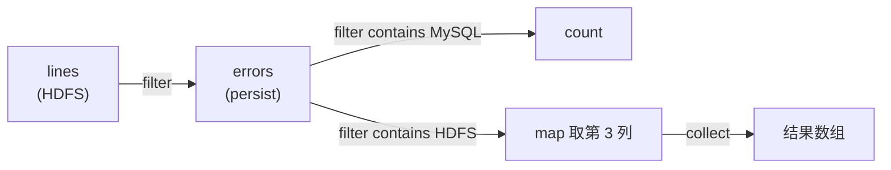
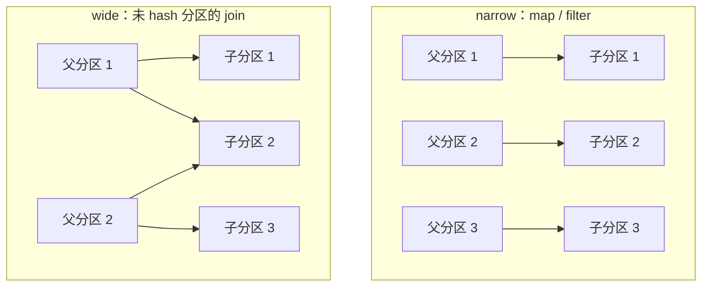

---
tags:
  - 分布式/计算
---

# RDD（弹性分布式数据集）

RDD（Resilient Distributed Datasets）要解决的是一个很具体的低效：**集群计算框架有并行算子，却没有利用分布式内存的抽象**。

MapReduce 与 Dryad 让用户用高层算子写并行计算，不必管工作分发与容错。但**复用中间结果是另一回事** —— 两个 MapReduce job 之间想共享数据，唯一的途径是写进外部稳定存储（例如分布式文件系统），代价是**数据复制、磁盘 I/O 与序列化**，而这些开销**可以主导应用的执行时间**。

需要复用的应用有两类，都很常见：

- **迭代式算法** —— PageRank、K-means、逻辑回归，每一轮都在同一份数据上重复计算；
- **交互式数据挖掘** —— 用户在**同一数据子集**上反复跑 ad-hoc 查询。

此前已有针对性的系统，例如把中间数据留在内存的图计算系统 `Pregel`、提供迭代式 MapReduce 接口的 `HaLoop`。但它们**只支持特定的计算模式**（例如把一串 MapReduce 步骤循环起来），而且**对这些模式隐式地做数据共享** —— 没有可用于通用复用的抽象，比如"把几个数据集读进内存、在上面跑 ad-hoc 查询"。

RDD 给出的抽象是**只读、分区的记录集合**，配合一套粗粒度算子来解决这个问题。它是 Spark 的核心抽象。

## 核心取舍：用粗粒度变换换容错

设计 RDD 的主要难点是：**定义一个既通用、又能以低开销提供容错的编程接口**。

已有的集群内存存储（分布式共享内存、KV 存储、数据库、`Piccolo`）都建立在**对可变状态的细粒度更新**这个接口上 —— 例如表格里的单元格。在这类接口上，提供容错只有两条路：

- **跨机复制数据**；
- **跨机记录更新日志**。

两条路对数据密集型负载都很贵：都要在集群网络上搬大量数据，而**集群网络的带宽远低于 RAM**，同时还有可观的存储开销。

RDD 换成**粗粒度变换**接口（`map`、`filter`、`join`，把同一个操作施加到大量数据项上），于是容错可以靠**记录"用来构建这个数据集的那些变换"（即血统 lineage），而不是记录数据本身**。

> [!note] 丢一个分区怎么办
> 一个 RDD 有足够的信息知道自己是怎样从其他 RDD 推导出来的。**如果某个分区丢了，只需要按血统重算那一个分区** —— 不需要代价高昂的复制。血统链变得很长时，对部分 RDD 做 checkpoint 会有帮助。

## 抽象定义与编程接口

**形式定义**：RDD 是**只读、分区的记录集合**，只能由**确定性操作**创建，操作对象要么是（1）稳定存储里的数据，要么是（2）其他 RDD。这类创建操作叫 **transformation**，与另一类操作即 **action** 相区分。

- **transformation**（`map`、`filter`、`join`…）是**惰性**的：它定义一个新 RDD，不触发计算；
- **action**（`count`、`collect`、`save`…）**启动计算**，把值返回给程序或把数据导出到存储系统。

**RDD 不需要时刻被物化** —— 它带着自己的血统就够。这一点带来一个很强的性质：**程序不可能引用一个它在故障后无法重建的 RDD**。

用户还能控制另外两件事：

| 可控制的 | 内容 |
| --- | --- |
| **持久化（persistence）** | 指明哪些 RDD 会被复用，并为它们选存储策略（如常驻内存） |
| **分区（partitioning）** | 按记录里的某个键把元素跨机分区，用于放置优化 —— 例如确保两个将被 join 的数据集做了同样的 hash 分区 |

接口是**语言内嵌**的（与 DryadLINQ、FlumeJava 同类）：每个数据集是一个对象，transformation 通过对象上的方法调用。参数是**闭包**，Scala 把每个闭包表示为一个 Java 对象，这个对象可以序列化后送到另一个节点执行；闭包捕获的变量作为字段存在该对象里。

`persist` 的默认行为是**留在内存**，RAM 不够时**溢写到磁盘**；也可以用标志要求其他策略（**仅存磁盘**、**跨机复制**）。每个 RDD 还能设**持久化优先级**，指定内存数据里谁先被溢写。

**Spark** 是这个抽象的实现，用 Scala 写的语言内嵌 API。它同时支持从 Scala 解释器交互式查询大数据集 —— 这套组合让**通用编程语言第一次能在集群上以交互速度做内存数据挖掘**。

**为什么定义里是"只读、分区、记录集合"这三个词，而不是别的？** 这三个限定词各自对应一条后面会用到的性质：

| 限定词 | 它排除了什么 | 换来的性质 |
| --- | --- | --- |
| **只读** | 排除了"就地改某个元素" | 不可变 ⇒ 可以安全地并发读、可以在失败后重算、可以缓存在多处 |
| **分区** | 排除了"必须整体处理" | 每个分区可以独立计算与恢复 ⇒ **并行度与恢复粒度都以分区为单位** |
| **记录集合** | 排除了"任意数据结构" | 算子必须是批量的 ⇒ 依赖关系可以简化成"分区之间的映射"，也就是 narrow 与 wide |

**transformation 与 action 的划分依据是"要不要现在算"。** transformation 只记录"怎么算"，action 才触发实际计算。这个划分有一个直接后果值得单独指出：**一条算子链在遇到 action 之前不会做任何事** —— 包括不会报出数据错误。所以"程序跑了但没输出"和"程序在某个 action 处炸了"是两类不同的现象，排查的入口也不同：前者要看有没有 action，后者要看那个 action 涉及的血统链。

**用户能控制的两个点（持久化、分区）其实是两类优化**，容易被混在一起说：

- **持久化解决"重复计算"** —— 它把中间结果留下来，让下一次用得上的时候不必重算。**代价是内存**；
- **分区解决"数据搬运"** —— 它让需要联合处理的数据留在同一台机器上，从而把 wide 依赖降级成 narrow。**代价是需要一次显式的重分区，且之后要维持这个分区**。

两者正交：一个 RDD 可以"持久化了但分区不合理"（省了重算却仍在 shuffle），也可以"分区合理但没持久化"（不 shuffle 但每轮重算）。**判断该先做哪一个，看瓶颈在哪**：CPU 时间花在重算上就先持久化，花在 shuffle 上就先调分区。

**`persist` 的存储级别是一个二维组合**，选择依据可以归结成一句话表：

| 级别 | 内存不足时 | 什么时候用 |
| --- | --- | --- |
| `MEMORY_ONLY` | **分区直接丢弃，用到时重算** | 数据量小、重算便宜；默认档 |
| `MEMORY_ONLY_SER` | 同上（但每分区更小，更少被丢） | 对象开销大（字段多、装箱多）时的折中 |
| `MEMORY_AND_DISK` | **溢写磁盘** | 重算代价大于磁盘 I/O 时 |
| `MEMORY_AND_DISK_SER` | 同上，但先序列化再落盘 | 同上的场景 + 对象开销大 |
| `DISK_ONLY` | —— | 数据大到进不了内存、但重算极贵（例如要回查外部系统） |
| 带 `_2` 后缀 | —— | 需要容忍单节点故障，代价是**存储翻倍** |

**判据可以简化成两个问题**：**① 重算这个 RDD 贵不贵？**（贵 → 倾向 AND_DISK）**② 对象在内存里占得大不大？**（大 → 倾向 SER）。两个都"是"就 `MEMORY_AND_DISK_SER`；都"否"就用默认的 `MEMORY_ONLY`。**唯一明确不该选的是"重算便宜却用 `DISK_ONLY`"** —— 那是把 CPU 的开销换成了更慢的磁盘读写。

### 三个写法，看出机制落在哪

**① 日志挖掘（交互式查询）**

```scala
lines  = spark.textFile("hdfs://...")
errors = lines.filter(_.startsWith("ERROR"))
errors.persist()
```

三行的效果：第 1 行定义一个由 HDFS 文件支撑的 RDD（一行一条文本记录）；第 2 行从它派生一个过滤后的 RDD；第 3 行要求 `errors` 常驻内存，供后续查询共享。**此时集群上还没有做任何工作** —— 到第一个 action 才触发。



一条值得注意的设计：**基 RDD `lines` 不会被读进内存**。这是想要的 —— 错误消息可能只占数据的一小部分，而那一小部分才是需要反复查的。若 `errors` 的某个分区丢了，Spark **只对 `lines` 的对应分区重跑一次 filter** 就能重建它。

**② 逻辑回归（迭代式 ML）**

```scala
val points = spark.textFile(...).map(parsePoint).persist()
var w = // 随机初始向量
for (i <- 1 to ITERATIONS) {
  val gradient = points.map { p =>
    p.x * (1/(1+exp(-p.y*(w dot p.x)))-1) * p.y
  }.reduce((a,b) => a+b)
  w -= gradient
}
```

梯度下降每轮都在同一份 `points` 上算 `map` + `reduce`。**把 `points` 留在内存里跨迭代复用，能带来约 20 倍加速。**

**③ PageRank（顺带用上分区控制）**

```scala
val links = spark.textFile(...).map(...).persist()
var ranks = // (URL, rank) 的 RDD
for (i <- 1 to ITERATIONS) {
  val contribs = links.join(ranks).flatMap { (url, (links, rank)) =>
    links.map(dest => (dest, rank/links.size))
  }
  ranks = contribs.reduceByKey((x,y) => x+y)
                  .mapValues(sum => a/N + (1-a)*sum)
}
```

这里的血统图**随迭代轮数线性变长**，于是有两个后果：

- **部分 `ranks` 版本需要可靠复制**，以压低故障恢复时间 —— 用带 `RELIABLE` 标志的 `persist` 做；
- **`links` 反而不需要复制**：它的分区可以靠重跑一次 map 重建，而且它**通常远大于 `ranks`**（每个文档有许多链接，但只有一个 rank 数值）。用血统恢复它，比"对整个内存状态做 checkpoint"要省。

**分区控制**是这里的第二个杠杆。如果把 `links` 按 URL 做 hash 分区，`ranks` 用同样的方式分区，**`links` 与 `ranks` 之间的 join 就不需要任何通信** —— 每个 URL 的 rank 和它的链接列表在同一台机器上。还能写自定义 `Partitioner` 把互相链接的页面聚到一起（例如按域名分区）：

```scala
links = spark.textFile(...).map(...).partitionBy(myPartFunc).persist()
```

**"跨迭代保持分区一致"正是 `Pregel` 这类专用框架的主要优化之一**，RDD 让用户直接表达这个目标。

**三个例子合起来覆盖的是三类数据复用形态**，这一点值得点明，因为它决定了"什么时候该想起 RDD"：

| 例子 | 复用的是什么 | 复用的周期 |
| --- | --- | --- |
| 日志挖掘 | **一份筛选后的子集** | 多次 ad-hoc 查询之间，**间隔不定** |
| 逻辑回归 | **同一份训练数据** | 每轮迭代，**固定且高频** |
| PageRank | **两份互相依赖的数据集**（图结构与排名） | 每轮迭代，**且需要跨节点对齐** |

第一类只需要"留住"，第二类在"留住"之外还要求"每轮都读得快"，第三类则进一步要求"两侧的数据在同一台机器上"。**三类需求逐级加强，而 RDD 的 persist 与 partitionBy 正好分别对应后两级** —— 这也是为什么这两个接口在示例里总是同时出现。

### 算子清单

| transformation | 签名 |
| --- | --- |
| `map` | `(f: T ⇒ U): RDD[T] ⇒ RDD[U]` |
| `filter` | `(f: T ⇒ Bool): RDD[T] ⇒ RDD[T]` |
| `flatMap` | `(f: T ⇒ Seq[U]): RDD[T] ⇒ RDD[U]` |
| `sample` | `(fraction: Float): RDD[T] ⇒ RDD[T]`（**确定性**采样） |
| `groupByKey` | `RDD[(K,V)] ⇒ RDD[(K, Seq[V])]` |
| `reduceByKey` | `(f: (V,V) ⇒ V): RDD[(K,V)] ⇒ RDD[(K,V)]` |
| `union` | `(RDD[T], RDD[T]) ⇒ RDD[T]`（**不去重**） |
| `join` | `(RDD[(K,V)], RDD[(K,W)]) ⇒ RDD[(K,(V,W))]` |
| `cogroup` | `(RDD[(K,V)], RDD[(K,W)]) ⇒ RDD[(K,(Seq[V], Seq[W]))]` |
| `crossProduct` | `(RDD[T], RDD[U]) ⇒ RDD[(T,U)]` |
| `mapValues` | `(f: V ⇒ W): RDD[(K,V)] ⇒ RDD[(K,W)]`（**保持分区**） |
| `sort` / `partitionBy` | 按键排序 / 按给定 Partitioner 重分区 |

| action | 签名 |
| --- | --- |
| `count` / `collect` / `reduce` | 返回元素数 / 返回全部元素 / 两两归约 |
| `lookup` | `(k: K): RDD[(K,V)] ⇒ Seq[V]`（**仅在 hash/range 分区的 RDD 上**） |
| `save` | 把 RDD 输出到存储系统（如 HDFS） |

几条约定：`join` 这类算子**只在键值对 RDD 上可用**；`map` 是一对一映射，`flatMap` 把每个输入值映到一到多个输出（与 MapReduce 里的 map 同义）；`groupByKey`、`reduceByKey`、`sort` **自动产出 hash 或 range 分区的 RDD**；用户能取出一个 RDD 的分区顺序（用 `Partitioner` 类表示）并据此分区另一个数据集。

**按"是否需要 shuffle"给算子分类**，是这套清单里最实用的一条 —— 因为它直接决定了"这次操作贵不贵"：

| 类别 | 算子 | 说明 |
| --- | --- | --- |
| **窄依赖（不 shuffle）** | `map`、`filter`、`flatMap`、`mapValues`、`filter` 变体 | 逐元素处理，**可在单节点流水线完成** |
| **宽依赖（要 shuffle）** | `groupByKey`、`reduceByKey`、`join`、`cogroup`、`sort`、`partitionBy`、`distinct` | 需要按 key 重组数据，**必须物化一次** |
| **条件性** | `join`、`cogroup` | **两侧分区方式一致时退化为窄依赖** —— 这是分区优化能省掉 shuffle 的原因 |
| **特殊** | `sample` | 窄依赖，但**必须确定性**（前面「可重算性」一节说过） |

**`reduceByKey` 与 `groupByKey` 的差别值得单独说清**，因为两者在"按 key 聚合"这个语义上等价、代价却差一个量级：

- **`groupByKey` 先把同一个 key 的所有 value 拉到一起**（一次完整 shuffle），再交给用户函数处理 —— 数据要原样搬一遍；
- **`reduceByKey` 在 map 侧先做一次预聚合**（combine），**把同一个 map 任务里相同 key 的多个 value 先合成一个**，再 shuffle 合并后的结果 —— 搬运量可能小一个数量级。

由此推出一条几乎总能用的替换：**只要聚合函数是可结合、可交换的，"先 `groupByKey` 再聚合"就应该换成 `reduceByKey`**。前者在没有明确理由时使用，是这类作业里最常见的性能问题来源之一 —— 而且它**在监控上表现为"shuffle write 量远大于输入量"**，很好识别。

**`mapValues` 保持分区**这一点同样值得记住：它只改 value、不动 key，所以**不需要重新分区**。这使得"对一个已按 key 分好区的 RDD 做值变换"可以不破坏后续 join 的窄依赖性质 —— 这是分区优化链路上的一环。

## 表示：narrow 与 wide 依赖

要给 RDD 选一种能**跨各种变换追踪血统**的表示。它由几项信息构成：

| 项 | 内容 |
| --- | --- |
| **partitions** | 数据集的原子的片段集合 |
| **dependencies** | 对父 RDD 的依赖 |
| **计算函数** | 基于父 RDD 算出本数据集 |
| **元数据** | 分区方案与数据位置 |

例如一个代表 HDFS 文件的 RDD：**每个文件块一个分区**，并且知道每个块在哪几台机器上；而对这个 RDD 做 `map` 的结果，**分区相同**，只是计算元素时要把 map 函数施加到父 RDD 的数据上。

设计这个接口时最有意思的问题是**怎么表示依赖**。把依赖分成两类既充分又有用：

- **narrow 依赖** —— 父 RDD 的每个分区**最多**被子 RDD 的一个分区使用。例如 `map`。
- **wide 依赖** —— 子 RDD 的**多个**分区可能依赖父 RDD 的同一个分区。例如 `join`（除非父 RDD 是 hash 分区的）。



这个区分有用，理由有两条：

1. **执行方式**：narrow 依赖允许**在单个节点上流水线执行** —— 父分区能在本地全部算出来，例如逐元素地做一次 `map` 再跟一次 `filter`。wide 依赖则要求**所有父分区都就位**，并用一次类 MapReduce 的操作在节点间 **shuffle**。
2. **故障恢复**：narrow 依赖下**只需重算丢失的父分区，而且可以在不同节点上并行重算**；wide 依赖下，**单个节点故障可能让某个 RDD 的所有祖先都丢掉一个切片**，从而需要完整重算。

这个统一接口的实际收益很直接：**Spark 里大多数 transformation 用了不到 20 行代码实现**，连新用户都能在不了解调度器细节的情况下加出新变换（采样、各种 join）。几个具体实现：

| 算子 | 实现要点 |
| --- | --- |
| **HDFS 文件** | `partitions` 每个文件块一个分区（块偏移存在 `Partition` 对象里），`preferredLocations` 给出块所在节点，`iterator` 读块 |
| **`map`** | 返回 `MappedRDD`：**分区与位置和父 RDD 相同**，只在 `iterator` 里把函数施加到父记录上 |
| **`union`** | 子分区是父分区的并，每个子分区通过 **narrow** 依赖在对应的父分区上算出 |
| **`sample`** | 与 map 类似，区别是**每个分区存一个随机数发生器种子**，从而对父记录做确定性采样 |
| **`join`** | 可能是两个 narrow（两侧都按同一 partitioner 做了 hash/range 分区）、两个 wide、或一窄一宽（一侧有 partitioner 一侧没有）。输出的 RDD 一定带 partitioner（继承自父，或默认 hash） |

**分区器（`Partitioner`）是这一类优化的接口**，值得单独交代它管什么：

| 它决定 | 影响 |
| --- | --- |
| **一个 key 落到哪个分区** | 决定了 join 是 narrow 还是 wide |
| **分区数** | 决定了并行度，也决定了"两侧分区数是否匹配" |
| **是否相同** | 两侧用同一个分区器实例或同样的分区规则，才能逐分区对应 |

**默认按 key 的哈希分区**在多数场景下够用，但有两种情况需要自定义：**业务上相关的 key 需要聚在一起**（例如按域名分区，让同一站点的页面落在同一台机器上）；或者**需要避免热点**（默认哈希可能把大量小 key 挤到少数几个分区里）。

一处必须提醒的边界：**自定义分区器只在"重分区被显式触发"时才生效**。写了一个 `Partitioner` 却不调用 `partitionBy`，数据仍按原有的方式分布 —— 这类"写了但没生效"的问题在监控上表现为**"明明按 key 分好区了，join 还是在 shuffle"**，排查时先确认有没有那次 `partitionBy`。

## 血统的可重算性：它成立的条件与反例

「程序不能引用它无法重建的 RDD」这句话听起来像是一个免费得到的性质，但它**有前提**。把前提拆开，才能知道哪些代码写法会把这个性质弄丢 —— 而这是 RDD 这一层最容易被用错的地方。

**前提一：创建 RDD 的操作必须是确定性的。** 定义里就限定了只能由**确定性操作**创建。一个非确定性的变换会让"重算"得到与原来不同的数据 —— 那么容错就变成了"换一份数据"，而不是"恢复"。最典型的反例是**未种子化的随机采样**：如果 `sample` 直接用全局随机数发生器，同一个分区重算两次会得到不同的样本，血统恢复就失真了。

这也解释了 Spark 把 `sample` 实现成"**每个分区存一个随机数发生器种子**"的用意：**种子被记进 RDD 的元数据，于是采样变成确定性的** —— 同样的输入与种子必然产出同样的样本。**这并非实现细节 —— 它正是让 `sample` 能进入血统体系的前提条件。**

**前提二：父 RDD 的分区必须是"可再取一次"的。** 血统重算的链条总要终止在某处 —— 终止点就是**稳定存储**。所以一个 RDD 能被恢复，要求它的祖先链最终落到"内容不变的存储"上（HDFS 的文件块、对象存储的对象）。链条如果终止在一个**会被改写的外部系统**上，恢复就无从做起。

**前提三：血统图必须能表达这一步做了什么。** 这就是前面「五项接口」存在的理由 —— 分区集、对父的依赖、计算函数、分区方案与数据位置。**带外部副作用的变换无法被这个结构表达**：如果一个 `map` 顺带往数据库写了一条记录，那"重算这个分区"就会**再写一次**，血统恢复从"幂等"变成了"放大副作用"。

把三条前提合起来，可以得到一张"哪些操作会破坏可重算性"的判据表：

| 操作特征 | 是否破坏可重算 | 原因 |
| --- | --- | --- |
| 纯函数（只依赖输入记录） | 不破坏 | 确定的输入 → 确定的输出 |
| 依赖外部可变状态（查库、读配置、读系统时间） | **破坏** | 重算时外部状态已经变了 |
| 未种子化的随机 | **破坏** | 每次重算结果不同 |
| 带写副作用（写库、写文件、发消息） | **不破坏恢复，但会放大副作用** | 重算会重复执行那一次写 |
| 依赖输入的顺序（跨分区做全局排序后取前 N） | 注意 | 需保证"分区内有序 + 全局有序"两级语义都成立 |

**一处容易混淆的区分**："可以重算"保证的是**语义上一致**，而不是"重算出逐字节相同的内存表示"。只要变换是确定性的，重算出来的数据在语义上就与原来等价 —— 至于它在内存里是哪个对象实例、占多少字节，都不影响正确性。**这一点也是 RDD 能用"记变换"替代"记数据"的根本原因。**

由此还能反向推出 checkpoint 的动机：**重算的代价与血统链的长度成正比**。链越长，一次恢复要串起来重算的步骤越多；而当链条里含 wide 依赖时，重算还会牵动 shuffle。**所以 checkpoint 的判据落在"它的血统链长、且含 wide 依赖"上，而不在"这个 RDD 重要"** —— 前面「checkpoint」一节里那张两类对照表，根就在这里。

**"确定性"在工程上怎么保证，有几种固定做法**，值得列出来，因为它不是自然成立的：

| 做法 | 解决什么 |
| --- | --- |
| **把随机种子记进 RDD 元数据** | 让采样类操作可重算（`sample` 就是这么做的） |
| **避免在算子体里读外部状态** | 不读数据库、不读系统时间、不读环境变量；需要什么就当作参数传进去 |
| **把"读外部状态"提前到 driver** | 在 driver 侧查一次、广播出去，算子体只读这份快照 |
| **位置相关的逻辑改用分区号推导** | 需要"第几个分区"时从 `TaskContext` 取，而不靠全局计数器 |

**最后一条最容易忽略**：一个常见写法是"用一个全局计数器给记录编号"，这在分布式执行下**每次重跑都会得到不同的编号**（任务执行顺序不定）。正确做法是**用分区号加分区内序号**构造确定性的编号 —— 这与"把状态挪到 driver"是同一个思路的不同应用。

**这些做法合起来构成一条判据**：**一个变换能不能进血统体系，取决于"给它同样的输入分区，是否必然产出同样的输出分区"。** 能，就随便用；不能，就得先把它改造成能 —— 而改造的方式几乎总是"把不确定性挪到前面某一步去固化"（固化种子、固化外部状态、固化编号规则）。

**这三条前提还有一个共同的推论：血统恢复的代价是可以预估的。** 因为血统图记录了"从稳定存储到目标 RDD 要经过几步"，而每一步的代价都能从分区数估出来，所以"不 check 这个 RDD 的话恢复要多久"是一个**可以事后估算、却很难事前保证的量**。工程上的做法通常是：**先用血统恢复跑一段时间**，观察恢复耗时是否在容忍范围内，**只有当某条链的恢复时间明显超出容忍度时才加 checkpoint** —— 而不是一开始就给所有关键 RDD 都开上。

**最后一条边界关于"确定性"落在哪里**：它要求的是**变换**确定，而不要求**数据**确定 —— 同一份输入分区配同一个变换，必然得到同一个输出分区；至于这份输入分区在集群的哪个位置、由哪个任务算出，都不影响结果。**正是这条性质让"重算"与"原地执行"在语义上等价**，也正是它让 RDD 可以只记录"怎么算"、不必记录"算在哪"。

## 底层依赖：序列化、JVM 内存与 shuffle 的落盘

RDD 的三档存储策略、20 倍加速的来源、以及 wide 依赖的代价，全都落在这一层。**把这三个底层机制写清，前面几节的数字才有解释。**

### 序列化：它出现在三个地方，而不是一个

默认序列化器是 `org.apache.spark.serializer.JavaSerializer`（官方文档口径）。它的代价来自"把类结构一起写进去"：每个对象都带类描述、字段名等元信息，**体积大、反序列化慢**。换成 Kryo 一类的紧凑格式通常能显著缩小体积，代价是要注册类、且对 schema 演进的容忍度更低。

关键是要意识到**序列化在 RDD 程序里出现在三处**，而它们的取舍不同：

| 出现位置 | 什么时候发生 | 影响 |
| --- | --- | --- |
| **shuffle 的中间数据** | wide 依赖需要跨节点传数据 | 影响网络流量与磁盘落盘量，**这是最大的一处** |
| **缓存以序列化形式存储** | `persist` 选了序列化档 | 用 CPU 换内存：省下堆空间，读写时多一次编解码 |
| **闭包与任务的传输** | 每次提交任务时把函数与捕获的变量发到 executor | 单次量小，但**捕获了大对象时会意外放大**（例如闭包引用了一个大集合） |

**最后一处是最隐蔽的失败模式**：一个看起来无害的闭包，如果捕获了一个几百 MB 的集合，会随每个任务被序列化并发出去 —— 表现是"任务启动很慢、网络流量莫名很大"，而代码里看不出来。

### JVM 内存：为什么"存对象"与"存字节"差那么多

RDD 的默认存储是**堆里的 Java 对象**。这条路"最快"（JVM 能原生访问每个元素），但它有两项固定开销：

- **对象头与对齐**：每个对象都带对象头，还有对齐填充；一个只装两个字段的小对象，实际占用可能是字段本身的数倍；
- **指针与装箱**：对象之间靠引用串起来，基本类型会被装箱成对象。

把这两项加起来就能理解**为什么"序列化存储"值得存在** —— 它把 N 个对象压成一段连续字节，代价是每次访问都要解码。所以两条路的关系落在**用 CPU 时间换内存占用**上，谈不上"哪个更好"，而选择的依据是"内存是不是瓶颈"。

**堆外内存是第三条路**：`spark.memory.fraction` 控制的那部分（堆空间减去 300 MB 之后的比例）是给执行与存储共用的区域，它内部的 `spark.memory.storageFraction` 决定其中多少**免于被驱逐**。这两个参数的关系正是"统一内存管理"这一设计的核心 —— 执行与存储共享同一块预算，互相可以借用（见下面「参数逐条」）。

### shuffle 的落盘：wide 依赖的具体代价

narrow 依赖可以在单节点上流水线执行，**wide 依赖做不到** —— 因为子分区需要"所有父分区"的数据。所以它必须走一次物化：

```
map 侧：把输出按"目标 reduce 分区"分组写成本地文件
        （这一步可能落盘，也可能在内存里按分区组织）
   │
   ▼  网络
reduce 侧：从各 map 节点拉取自己那部分数据，再做聚合
```

**这一步有两个直接后果**：

- **数据要经过"写出去再读回来"** —— 序列化、压缩、可能的磁盘 I/O 全在这里发生；
- **它是"阶段（stage）边界"的物理来源**：前面调度一节说"stage 的边界是 wide 依赖所需的 shuffle"，指的就是这里。

把这条与前面的实测数字接起来看，PageRank 那个"2.4 倍 → 7.4 倍"的跳变就有解释了：**哈希分区让 `links` 与 `ranks` 的 join 从 wide 退化成 narrow，于是每一轮迭代里的 shuffle 消失了** —— 省掉的是这一整套"写出去再读回来"的物化，而不在"计算"本身。

**narrow 与 wide 的区分还有一个"传递"性质**：**wide 依赖一旦出现在血统图里，它的影响会向下游传播** —— 因为 stage 的边界在 wide 依赖处，而每个 stage 内部才是流水线。于是：

- **一条链上只要有一处 wide 依赖，链就被切成两段**，两段之间必须物化一次；
- **narrow 依赖处"可以流水线"这个性质是局部的** —— 它保证的是"这一段内部不需要物化"，而不是"整条链都不需要"。

**join 是 narrow 还是 wide，取决于两侧的分区器是否一致**，这是分区优化能生效的全部原理：

| 两侧的分区情况 | join 的依赖类型 | 代价 |
| --- | --- | --- |
| 都按同一个 `Partitioner` 哈希分区 | **narrow** | 每个子分区只依赖对应的父分区，**零通信** |
| 一侧有分区器、另一侧没有 | **混合** | 需要把没有分区器的那一侧重分区 |
| 两侧都没有分区器（或分区器不同） | **wide** | **两侧都要 shuffle** |

由此可以理解 PageRank 那个优化的本质：**它做的是"把 join 从 wide 改成 narrow"，而不在"让 join 更快"** —— 前者是量变，后者是质变（省掉整个物化环节）。也正因为如此，**自定义 `Partitioner` 是一个真正有杠杆的接口**：它让"哪些数据该在一起"这件事由业务语义决定，而不是由默认哈希决定。

一处容易忽略的配套要求：**窄依赖的 join 需要两侧"分区数相同且分区方式一致"**。如果 `links` 分了 100 个区而 `ranks` 只有 10 个，即使都用同一个哈希算法也无法逐分区对应 —— 这类不一致会**静默地退化成 wide**（不报错，只是变慢），所以调整分区时要把两侧一起调。

**shuffle 的物化并非"必须落盘"** —— 它落不落、落多少，取决于内存够不够。所以"wide 依赖很贵"这句话的准确含义是**"它多了一次物化的机会"**：内存充足时可以少落盘，内存紧张时会大量溢写。**由此还有一条推论：宽依赖作业的性能对内存配置的敏感度远高于窄依赖作业** —— 调内存对后者几乎无效，对前者可能翻倍。

## 实现：Spark

Spark 用约 **14,000 行 Scala** 实现，跑在 **`Mesos`** 集群管理器上，因此能和 Hadoop、MPI 等应用共享资源。**每个 Spark 程序是一个独立的 Mesos 应用**，有自己的 driver（master）和 workers，应用之间的资源共享交给 Mesos。它通过 Hadoop 现成的 input plugin API 读任何 Hadoop 输入源（HDFS、HBase），跑在**未修改的 Scala** 上。

### 作业调度

调度器与 Dryad 的相似，但**额外考虑了哪些持久化 RDD 的分区已经在内存里**。

用户运行一个 action 时，调度器检查该 RDD 的血统图，构建一张 **stage 的 DAG**：**每个 stage 里塞进尽可能多的 narrow 依赖流水线**，stage 的**边界**是 wide 依赖所需的 shuffle 操作，或任何**已经算好的分区**（它能短路掉父 RDD 的计算）。随后调度器为每个 stage 里缺失的分区启动任务，直到目标 RDD 算完。

```
action 触发
   │
   ├─ stage 1：  narrow 流水线 …
   │             └──▶ 输出（已在内存 → 短路）
   ├─ 边界： wide 依赖的 shuffle
   ├─ stage 2：  narrow 流水线 …
   └─ stage 3：  最终 RDD
```

任务放置**按数据局部性**，用 **delay scheduling**：

- 任务要处理的分区**已在某节点的内存里** → 送到那个节点；
- 否则若该分区有 **preferred locations**（例如 HDFS 文件块）→ 送到那些节点。

**wide（shuffle）依赖的中间记录，被物化在持有父分区的节点上**，以简化故障恢复 —— 这一点与 MapReduce 物化 map 输出相同。

故障处理分两层：

- **任务失败** → 只要它所在 stage 的父分区还在，就在另一个节点上重跑；
- **某些 stage 已不可用**（例如 shuffle 的 map 侧输出丢了）→ **并行重新提交任务来算出丢失的分区**。

还**不容忍调度器本身失败**（不过复制 RDD 血统图是直接可行的）。另外在试验一种方向：让集群上的任务（例如 map）调用 `lookup`，对 hash 分区的 RDD 按键做**随机访问** —— 那样任务需要在分区缺失时通知调度器去算。

**stage 的划分是一个从终点反向遍历的过程**，把它写清楚，很多"为什么任务数是这样"的问题就能自己回答：

```
从 action 作用的目标 RDD 出发，反向沿血统图走：
  · 遇到 narrow 依赖  → 继续走，放进同一个 stage
  · 遇到 wide 依赖    → 在这里切一刀，把父 RDD 作为新 stage 的输出
  · 遇到"已经在内存里"的分区 → 也切一刀（这一段不必再算）
直到走到数据源（稳定存储）为止
```

三条推论：

- **一个 stage 的任务数 = 该 stage 最后那个 RDD 的分区数**。所以"任务数太少"通常意味着"某个上游的分区数太少"，而不一定是调度问题；
- **stage 之间的依赖是"父 stage 必须全部完成"** —— 这就是 wide 依赖造成的同步点，也是"stage 边界"这个说法的物理含义；
- **已经在内存里的分区会短路计算** —— 这是持久化能减少后续作业工作量的机制来源（它不只是"省重算"，还会**减少 stage 数**）。

**任务放置用 delay scheduling，它解决的是一对矛盾**：按数据局部性派任务能省网络传输，但如果某台机器一时忙、严格等它就会让 CPU 空转。delay scheduling 的做法是**先等一小段时间**（等窗口由 `spark.locality.wait` 控制），**等不到就降一级局部性把任务派出去**。它的依据是一个统计事实：**等待一小会儿换来本地读，通常比立刻起一个要走网络的任务更划算** —— 而"等多久"就是这个策略唯一的旋钮。

**任务失败与 stage 失败是两件不同的事**，恢复路径也不同：

| 失败类型 | 触发 | 恢复方式 |
| --- | --- | --- |
| **任务失败** | 单个任务抛异常或所在 executor 掉线 | **只要它所在 stage 的父分区还在**，就在另一个节点重跑这一个任务 |
| **stage 输出丢失** | shuffle 的 map 侧输出随 executor 消失 | **重跑产生这些输出的整个 stage** —— 这是 wide 依赖恢复代价高的具体形态 |
| **反复失败** | 同一个任务连续失败 | 说明**数据或算子本身有问题**（超大的单条记录、反序列化失败），重试不会改变结果 |

**第二行是"wide 依赖恢复更贵"的落地**：narrow 依赖下丢一个分区只需重算那一个分区，而 wide 依赖下丢的是"某个 map 任务的输出"，涉及它的 reduce 任务全部要重来。**判读上也很好区分**：任务失败只影响一个任务的耗时，stage 重跑会让整个作业**退回上一个阶段**、进度条倒退。

### 解释器集成

Scala 解释器的常规做法是**为每一行输入编译一个类**、加载进 JVM、再调用其上的函数；这个类包含一个单例对象，持有该行定义的变量或函数，并在 `initialize` 方法里执行该行代码。要支持交互式查询大数据集，改了两处：

1. **类分发** —— 让解释器**用 HTTP 把这些类提供给 worker 节点**，worker 才能取到每行生成的字节码；
2. **改代码生成** —— 常规做法下，每行的单例对象通过所在类上的静态方法访问。这意味着**序列化一个引用了上一行变量的闭包时，Java 不会沿对象图把包着那个变量的单例实例一起送出去**，worker 就拿不到该变量。Spark 改成**直接引用每一行对象的实例**。

**解释器集成那两处改动，还可以从"为什么必须改"的角度再收紧一层**：

- **类分发**之所以必须做，是因为 Scala 解释器的每行代码都在运行时编译成新的类，**这些类不在任何 jar 里、也不在任何 executor 的类路径上**。worker 要执行这行代码产生的闭包，就必须能加载那个类 —— 解释器用 HTTP 把它提供出去，是最直接的做法；
- **改代码生成**之所以必须做，是因为**闭包要能跨进程传输**。而 Java 的序列化是"沿对象图走"：它会把闭包引用的对象一起序列化。常规的每行单例对象是通过静态方法访问的，**序列化器不会沿着"静态方法"这条边把实例带过去** —— 于是 worker 拿到的闭包引用了那个变量，但变量所在的实例没到。**改成直接引用实例之后，序列化器才会把它一起带上路。**

**这两处改动合起来暴露了一个一般性的约束**：**"交互式编程"与"分布式执行"的张力都在"代码本身是数据"这一点上** —— 在解释器里，你输入的每一行都是**要发到别的机器上执行的代码**，因此它必须是**可分发、可序列化**的。任何"到处引用本机状态"的写法都会在这条边界上失效。

### 内存管理

持久化 RDD 有三档存储选项：

| 选项 | 取舍 |
| --- | --- |
| **内存中存反序列化的 Java 对象** | 最快 —— JVM 能原生访问每个元素 |
| **内存中存序列化数据** | 空间紧张时更省内存，代价是性能更低（**轻量处理下最多差 2 倍**） |
| **存磁盘** | 适合大到放不进 RAM、但每次重算代价又高的情况 |

内存有限，所以用 **RDD 级别的 LRU 逐出**：当一个新分区算完却放不下时，**从最近最少访问的那个 RDD 里逐出一个分区**；但**如果那就是产生新分区的同一个 RDD，则保留内存里的旧分区**，避免同一个 RDD 的分区被反复换入换出。后一条规则重要，是因为**大多数操作会对整个 RDD 跑任务**，所以已经在内存里的那个分区很可能马上还要用。默认策略在实践中表现良好，此外每个 RDD 还能设**持久化优先级**做更细的控制。

目前**每个 Spark 实例有自己独立的内存空间**（跨实例共享 RDD 留作后续工作）。

**内存管理的完整规则**比"LRU 逐出"四个字要多几层，逐层说清：

**第一层：以 RDD 分区为逐出单位。** 逐出的单位是**整个分区**，而非一条记录。原因是分区的计算是原子的（要重算就得算完整个分区），逐出半个分区没有意义。

**第二层：LRU 作用在 RDD 级别，而不是分区级别。** 空间不够时，**从"最近最少被访问的那个 RDD"里挑一个分区逐出**。这个选择的依据与操作系统缓存不同 —— 它假设"同一个 RDD 的所有分区热度相近"，这在一批任务扫过整个 RDD 的访问模式下是成立的。

**第三层：有一条反直觉的例外 —— 如果被逐出的 RDD 正是产生新分区的那个 RDD，则保留旧分区。** 也就是说，**同一个 RDD 的分区不会互相逐出**。理由很实际：**大多数操作会对整个 RDD 跑任务**，所以"刚算出来的那个分区"和"内存里已有的那个分区"很可能马上都要用；如果允许互逐，就会出现"算一个丢一个"的抖动 —— 每个新分区都把旧分区挤掉，而稍后又要把旧分区重算回来。**这条规则防的是这种震荡。**

**第四层：用户可以用持久化优先级干预。** 当内存不够、需要决定"谁先被逐出"时，优先级提供了一个业务侧的表达方式 —— 把"更重要的是别丢"的那部分数据标上高优先级。默认策略在这些场景下猜不出业务意图，而这个旋钮补上了这一层。

**第五层：存储内存与执行内存是借用的关系**（统一内存管理）。执行与存储共享 `spark.memory.fraction` 划出的那块预算，互相可以借；但存储被借走的空间在需要时**可以被执行侧驱逐回来**，而 `spark.memory.storageFraction` 界定的那部分是**免于被驱逐**的底线。**这解释了一个常见现象**：作业跑着跑着"缓存好像不见了" —— 常见原因是**执行侧（shuffle 聚合）占了内存把缓存挤了出去**，而非配置没生效。**判据是看存储内存的进出曲线**，而不是只看"有没有调 persist"。

**三档存储与上述规则的关系**：三档（对象 / 序列化 / 磁盘）改变的是"同样一份数据占多少空间"，从而改变"多快会被逐出"。**序列化档让分区更小 ⇒ 同样内存能容下更多 ⇒ 逐出更少**，代价是每次访问多一次解码。所以"要不要用序列化"这个问题的实质是：**你愿意用多少 CPU 时间去买多少内存空间。**

### checkpoint

血统**总能**用来恢复，但**血统链很长的 RDD 恢复起来可能很费时间**，所以对部分 RDD 做 checkpoint 到稳定存储会有帮助。判据可以归结成两类：

| RDD 类型 | checkpoint 是否值得 |
| --- | --- |
| **血统图长、且含 wide 依赖**（如 PageRank 的 `ranks`） | **值得** —— 节点故障可能让每个父 RDD 都丢一部分数据，导致完整重算 |
| **对稳定存储做 narrow 依赖**（如逻辑回归的 `points`、PageRank 的 `links`） | **可能永远不值得** —— 节点故障时丢失的分区能在其他节点上并行重算，代价只是复制整个 RDD 的一个零头 |

Spark 提供 checkpoint 的 API（`persist` 的 `REPLICATE` 标志），但**选哪些数据 checkpoint 留给用户**。正在研究自动 checkpoint：**调度器知道每个数据集的大小、也知道它首次计算花了多久**，理论上能选出一组最优的 RDD 来最小化系统恢复时间。

**RDD 的只读性让 checkpoint 比一般共享内存简单**：**不存在一致性问题**，于是可以**在后台写出，不需要暂停程序，也不需要分布式快照方案**。

## Spark 参数逐条

以下默认值取自 Apache Spark 4.2.0 的官方配置文档。**注意 Spark 的参数在版本间有更迭**（例如统一内存管理替代了早期的存储比例参数），**换版本时要重新核一遍。**

### 序列化与内存

#### `spark.serializer`

默认 **`org.apache.spark.serializer.JavaSerializer`**。作用域是"需要通过网络发送、或以序列化形式缓存"的对象。

**什么时候该改**：只要序列化进了关键路径就该考虑换 Kryo —— 也就是**有 shuffle 或用了序列化缓存**的作业。**改大/改小的后果**不存在，这是个替换实现的选择：JavaSerializer 稳（任何 `Serializable` 对象都能用）但体积大；Kryo 紧凑但要注册类、对类结构变更的容忍度低。**联动**：与 `spark.shuffle.compress` 叠加 —— 先序列化再压缩，两步都影响网络流量。**失败模式**：换 Kryo 后未注册的类会退回 Java 序列化（不再报错但也不再有收益），或者直接抛序列化异常；**排查方式是看网络传输量有没有真的下降**，而不是看配置有没有生效。

#### `spark.memory.fraction`

默认 **`0.6`**，表示"（堆空间 − 300 MB）中用于执行与存储的比例"。剩下那部分是给用户数据结构、内部元数据与"防 OOM 的余量"的。

**什么时候该改**：作业里有大量缓存或大量 shuffle，且 JVM 堆已经调大时，可以适当提高（0.7–0.8）。**改大的后果**：留给用户对象的空间变小，**更容易在业务代码处 OOM**；改小则相反 —— 缓存更容易被驱逐、shuffle 更容易溢写磁盘。**联动**：与 `spark.memory.storageFraction` 一起决定"存储能保住多少"。**失败模式**：调得过高时的表现是"作业跑得更快但偶发 OOM"，而且 OOM 的位置看起来与缓存无关 —— 容易误判成代码问题。

#### `spark.memory.storageFraction`

默认 **`0.5`**，表示在 `spark.memory.fraction` 划出的区域里，**免于被驱逐**的存储内存占比。

**什么时候该改**：一个作业里同时有"要反复读的大缓存"和"要大量 shuffle 的执行"，两者争抢时它决定谁让谁。**改大的后果**：缓存保得住，但执行侧可借用的空间少，**shuffle 更容易溢写**；改小则缓存容易被挤掉，表现是"缓存好像没起作用、迭代并没有变快"。**失败模式与判读**：缓存被挤掉的典型现象是**同一份数据被反复重算**（storage 界面里的 executor 存储量起起伏伏）—— 这时要看的是"缓存命中是否稳定"，而不是"缓存有没有配"。

### 并行度与任务

#### `spark.default.parallelism`

默认值**随场景而定**（官方文档的口径）：对 shuffle 类操作（`reduceByKey`、`join`）取**父 RDD 分区数的最大值**；对无父 RDD 的操作（如 `parallelize`）在本地模式取本地核数，其他模式取"全部 executor 的核数总数或 2 之间的较大者"。

**什么时候该改**：默认值在"输入文件少、但数据量大"的作业上容易偏小 —— 分区数不足会让并行度上不去；反之分区过多会让任务调度开销与 shuffle 元数据膨胀。**联动**：它与输入的分区数、以及 `reduceByKey` 的显式分区数参数共同决定实际并行度。**失败模式**：分区数过少的典型现象是**只有少数 executor 在跑、其余空闲**，而在监控上表现为"资源申请了但利用率很低"。

#### `spark.executor.cores`

默认：**YARN 模式下为 `1`**，Standalone 模式下为 worker 上所有可用核心。

**什么时候该改**：它决定"每个 executor 里能并行跑几个任务"，而 executor 的内存是**所有核心共享**的。**改大的后果**：单 executor 内并行度高、但每个任务分到的内存变少，且一个 executor 挂掉损失的并行度更大；改小则相反 —— 内存更充裕但 executor 数量变多、调度开销上升。**联动**：与每 executor 的内存配置一起决定"每个任务能拿多少内存"，这两者必须一起调。**失败模式**：核心数给太多而内存没跟上时，表现为**任务频繁因内存不足而失败重试**，或 GC 时间占比飙升。

#### `spark.storage.memoryMapThreshold`

默认 **`2m`**。Spark 从磁盘读块时，**超过这个大小就做内存映射**（mmap）而不是普通读。

**什么时候该改**：通常在"块很大且要反复读"的场景下调小以更多使用 mmap；但 mmap 在多进程/多任务并发访问时**受虚拟地址空间与页表开销限制**，块数量极多时反而更慢。**失败模式**：mmap 相关的问题表现为"读块时抛出与虚拟内存相关的异常"，或者在大量小文件场景下地址空间接近上限。

### 网络与稳定性

#### `spark.reducer.maxSizeInFlight`

默认 **`48m`**。每个 reduce 任务**同时**拉取的 map 输出总量上限。

**什么时候该改**：它直接约束"reduce 侧的拉取并发" —— 调大能提高拉取吞吐，代价是 reduce 端的**内存压力上升**（拉回来的数据要先放在内存里等聚合）。**联动**：与 reduce 侧的内存预算、以及 `spark.network.timeout` 一起决定"拉取会不会超时"。**失败模式**：调得过大时表现为 **reduce 阶段 OOM 或频繁 GC**；调得过小时表现为**拉取成为瓶颈、任务长时间停在 fetch 阶段**。

#### `spark.shuffle.file.buffer`

默认 **`32k`**。每个 shuffle 文件输出流的内存缓冲区大小，官方文档明确指出它的用途是**减少磁盘寻道与系统调用**。

**什么时候该改**：map 侧输出量很大时适当调大可以降低写盘次数。**改大的代价**：**每个并发写 shuffle 文件的任务都各占一份**，所以这个值的实际开销要乘上并发任务数；调得太大（例如几百 KB）在任务数多时会明显吃内存。**失败模式**：把它当成"越大越快"来调，会出现"调了之后内存反而紧张"。

#### `spark.shuffle.compress` / `spark.shuffle.spill.compress`

默认都是 **`true`**。前者压缩 **map 输出文件**，后者压缩 **shuffle 期间溢写的数据**，两者都用 `spark.io.compression.codec` 指定的编解码器。

**什么时候该改**：默认开启通常在两端之间取得平衡 —— 压缩省网络与磁盘，代价是 CPU。**只有在 CPU 明显成为瓶颈、且网络不是瓶颈时**才考虑关掉（例如本地模式下的测试）。**联动**：与序列化器叠加（先序列化后压缩）。**失败模式**：换成压缩率更高的编解码器（如 zstd 相对 lz4）时，**CPU 开销会上升**，在 CPU-bound 的作业上可能得不偿失 —— 判断依据是"省下的 I/O 时间是否大于多花掉的 CPU 时间"。

#### `spark.driver.maxResultSize`

默认 **`1g`**。**每个动作（如 `collect`）所有分区序列化结果的总大小上限**，超过则直接中止作业。

**什么时候该改**：它是一道**保护栏** —— 不加限制时，一个"把几亿条数据 collect 回 driver"的写法会把 driver 直接撑死。**调小的场景**：driver 内存紧张时调小可以让问题更早暴露。**失败模式**：它的报错信息很清楚（"结果超过 maxResultSize"），**但真正的修法通常落在改掉 `collect` 这个动作上，而不在调大它** —— 需要的往往只是"取前 N 条"或"聚合后的统计量"。**这是这一批参数里唯一一个"报错即提示设计问题"的。**

#### `spark.network.timeout`

默认 **`120s`**。所有网络交互的默认超时（未单独配置其他超时项时以它为准）。

**什么时候该改**：与 `spark.reducer.maxSizeInFlight` 是一对 —— 单次拉取量大、网络带宽有限时，拉取可能超过默认超时。**改大的后果**：故障（真的挂掉的 executor）**要更久才被发现**，作业会长时间卡在"等一个已经不会有响应的节点"上。**失败模式**：超时的现象是 `FetchFailedException` 相关的重试与阶段重算，**在监控上表现为"作业突然退回到上一个 stage 重跑"**。

**checkpoint 那一节还应补上"选谁"与"什么时候做"这两个操作层面的问题**：

**选谁**：判据是血统链的长度与依赖类型，但**具体到哪个 RDD** 要看"重算它需要回溯多少步"：

- 血统链的**根附近**（靠近稳定存储）的 RDD **通常不值得** —— 重算它们的代价就是重读一次输入；
- 血统链的**末端**（接近 action）的 RDD 也**未必值得** —— 它们本来就是最后一轮计算，重算就是再跑一遍这一轮；
- **真正值得的是"链中段且被多轮复用"的那些** —— 重算它们要跨过若干轮迭代或若干次 shuffle，而它们又被反复读到。PageRank 里的 `ranks` 正属于这一类，`links` 与 `points` 则都不属于。

**什么时候做**：前面说过，只读性让 checkpoint 可以**在后台做、不需要暂停程序**。这一点与"快照"类机制有实质差别 —— **它避开了"为了一致性而停整个应用"这个代价**，而这正是 RDD 那套"记变换"设计在恢复环节上继续兑现的红利。

**一处常见的误用**是"给所有 RDD 都开 checkpoint"。它的问题不在于慢，而在于**每一份 checkpoint 都要写一次稳定存储** —— 写出去的字节数与"被 check 的 RDD 大小 × 次数"成正比，很快会把磁盘带宽变成瓶颈，而且这些数据在恢复时**未必真的被用到**。**判断标准始终是那个问题：不 check 它的话，恢复要多重算多少？**

## 实测

环境：Amazon EC2 的 **m1.xlarge**（4 核、15 GB 内存），存储用 HDFS、**256 MB 块**，**每个测试前清 OS buffer cache** 以便准确测量 I/O 成本。

四条总结论：

- **迭代式机器学习与图应用上，Spark 比 Hadoop 最多快 20 倍** —— 加速来自把数据以 Java 对象形式存在内存里，从而避开 I/O 与反序列化；
- **用户写的应用性能与扩展性都好**，其中一份原本跑在 Hadoop 上的分析报表被提速 **40 倍**；
- **节点故障时，只重建丢失的 RDD 分区就能快速恢复**；
- **1 TB 数据集可以用 5–7 秒的延迟交互式查询。**

### 迭代式 ML：20 倍从哪来

两个应用（逻辑回归、K-means）各跑 10 轮，数据集 **100 GB**，集群 **25–100 台**。对比三个系统：Hadoop 0.20.2、HadoopBinMem（第一轮把输入转成低开销二进制格式、放进内存 HDFS，以消除后续轮次的文本解析）、Spark。

**第一轮**：三者都从 HDFS 读文本。Spark 只是**中等程度**快于 Hadoop —— 差值是 **Hadoop master 与 worker 之间心跳协议的信令开销**。HadoopBinMem 最慢，因为它多跑一个 MapReduce job 做格式转换，还要把数据跨网写进**有副本的内存 HDFS**。

**后续轮次**：逻辑回归上 Spark 比 Hadoop 快 **25.3 倍**、比 HadoopBinMem 快 **20.7 倍**（100 台机器）；计算密集的 K-means 上加速比是 **1.9–3.2 倍**。

**为什么连"数据已在内存里的 Hadoop"也被拉开 20 倍** —— 拆成三条：

| 来源 | 实测代价 |
| --- | --- |
| **Hadoop 软件栈的最小开销** | 空跑一个 Hadoop job，光"job 建立 + 启动任务 + 清理"就**至少 25 秒** |
| **HDFS 服务每个 block 的开销** | 多份内存拷贝加一次校验和 —— **即便数据已在本地内存，经内存 HDFS 读也比读本地文件多约 2 秒** |
| **反序列化** | 文本与二进制的解析差 **7 秒**；**即便从内存文件读，把预算好的二进制转成 Java 对象还要 3 秒** —— 几乎和逻辑回归本身一样贵 |

**Spark 把 RDD 元素直接存成内存中的 Java 对象，三条开销一并绕开。**

### PageRank：分区一致性值 3 倍

用 **54 GB** 的 Wikipedia dump 跑 10 轮，处理约 **400 万**条目的链接图：

- **仅靠内存存储** → 30 台机器上 **2.4 倍**于 Hadoop；
- **再加上跨迭代一致的分区控制** → **7.4 倍**；
- 到 60 台机器时**接近线性扩展**。

另有一版 PageRank 用"跑在 Spark 上的 `Pregel`"实现，迭代时间相近，但**每轮长约 4 秒**，因为 Pregel 每轮多一个让顶点"投票"决定是否结束的操作。

### 故障恢复：迭代时间 58 → 80 → 58 秒

K-means、**75 台**机器、100 GB、每轮 **400 个任务**，正常情况每轮约 **58 秒**。在第 6 轮开始时**杀掉一台机器**，导致该机器上的任务与它持有的 RDD 分区一起丢失。Spark 把这些任务**并行**在其他机器上重跑，它们重新读取对应输入、**用血统重建 RDD**，该轮迭代时间升到 **80 秒**；丢失的分区重建完之后，又回到 **58 秒**。

对照 checkpoint 方案，恢复**很可能需要重跑至少好几轮**（取决于 checkpoint 频率），而且要**把应用的 100 GB 工作集跨网复制** —— 在内存里复制要么占掉两倍内存，要么得等这 100 GB 写进磁盘。

> [!note] 规模对照
> **上面这些例子的 RDD 血统图全都不足 10 KB。** 用 10 KB 的元数据替代 100 GB 的复制，这就是"记变换而不是记数据"的全部意义。

### 内存不足时

把 Spark 配置成"每台机器只用一定比例的内存存 RDD"，用 100 GB 数据、25 台机器跑逻辑回归。结果是**性能随可用空间减少而平滑退化** —— 放不进 RAM 的分区落盘，性能与当前的数据并行系统相当。

### 用户应用

| 应用 | 场景与结果 |
| --- | --- |
| **Conviva（内存分析）** | 原本是一串 Hive 查询：都在**同一个数据子集**上（客户给定过滤条件的记录）算不同的分组统计（均值、百分位、`COUNT DISTINCT`），因此需要多个 MapReduce job。改用 Spark 并把共享子集**一次加载进 RDD** 后，报表提速 **40 倍**：一份 **200 GB 压缩数据**、原本在 Hadoop 集群上要 **20 小时**的报表，现在**只用两台 Spark 机器跑 30 分钟**，且只需 **96 GB 内存** —— 因为 RDD 里只存匹配过滤条件的行列，不是整个解压后的文件 |
| **交通建模（Mobile Millennium）** | 从稀疏的车载 GPS 测量推断路网拥堵。源数据是**1 万条链路**的都市路网加 **60 万条**点到点行程时间样本；用 EM 算法训练，反复跑两轮 `map` + `reduceByKey`。**20 → 80 台**（每台 4 核）**接近线性扩展** |
| **Twitter 垃圾链接分类（Monarch）** | 逻辑回归分类器，用分布式的 `reduceByKey` 并行累加梯度向量。在 **50 GB** 子集上训练：**25 万个 URL**、**$10^7$ 个**与网络及内容属性相关的特征。扩展性**不如线性**，原因是每轮的**固定通信开销更高** |

### 交互式数据挖掘

分析 **1 TB** 的 Wikipedia 页面浏览日志（两年数据），用 **100 台 m2.4xlarge**（8 核、68 GB 内存）。三个查询都要**全量扫描输入**：统计（1）所有页面的浏览量、（2）标题精确匹配某词的页面、（3）标题部分匹配某词的页面。

**即便在 1 TB 数据上，查询也只要 5–7 秒**；同一份 1 TB 文件**从磁盘查要 170 秒** —— 差了一个数量级以上。

## 版本演进：RDD 之后的十二年

RDD 这个抽象的落地版本是 Spark 1.0.0（**2014-05-30**），版本号此后走到 Spark 4.2.0（**2026-07-14**）。这十二年里主干上发生了三类事，每一类都正好填上 RDD 这一层刻意留下的一处空白。

**第一类：结构化 API —— 从"用户写算子"到"用户写意图"。**

| 版本 | 日期 | 发生了什么 |
| --- | --- | --- |
| 1.3.0 | 2015-03-13 | **DataFrame API** 引入；Spark SQL 同时从 alpha 状态毕业 |
| 1.6.0 | 2016-01-04 | **Dataset API** 引入 —— "与 RDD 类似，但用自定义对象与 lambda 的同时还能拿到 Spark SQL 执行引擎的收益" |
| 2.0.0 | 2016-07-26 | **DataFrame 与 Dataset 统一**：Scala 与 Java 里 DataFrame 就是 `Dataset[Row]` 的别名；`SparkSession` 取代 `SQLContext` 与 `HiveContext`；MLlib 的 DataFrame API 成为主 API，**RDD API 转入维护模式** |

官方对 DataFrame 的定位说得很直白：**"DataFrame 是基础 RDD API 的演进，加上了命名字段与 schema 信息。"** 这句话背后是一次取舍的转移 —— RDD 交给用户的是"变换 + 依赖类型"，用户怎么写就怎么执行；有了 schema，**优化器开始能改写用户写下的意图**（谓词下推、列裁剪、join 重排）。**表达能力让出一分，优化空间就多一分**，这条互换是后面所有事情的前提。

**第二类：执行层 —— 把逐行解释执行的开销拿掉。**

1.6.0 引入了**统一内存管理**：执行内存与缓存内存**共享同一块区域，而不再把两块划死**。同为 1.6.0，`spark.sql.tungsten.enabled` 这个开关被**删除**了 —— Tungsten 模式与代码生成变成永远开启。到 2.0.0，**whole stage code generation** 在 SQL 与 DataFrame 的常见算子上给出 **2–10×** 的加速；同版本还带来原生 SQL parser（同时支持 ANSI-SQL 与 Hive QL）、向量化的 Parquet 扫描、以及窗口函数的原生实现。

**第三类：运行时自适应 —— 把静态配置换成运行时决定。**

**AQE 是这条线的落点，它对着的正是宽依赖的代价**：1.6.0 先有"自动为 join 与聚合挑选 reducer 数"的雏形，3.0.0 形成完整机制，**3.2.0 起默认开启**。它要解决的两个目标都来自静态默认值 —— `spark.sql.shuffle.partitions` 默认 **200**（这个值自 1.1.0 起就没变过），以及 `spark.sql.files.maxPartitionBytes` 默认 **128 MB**。四条主要手段各自对着一种形态：

| 手段 | 关键默认值 | 对着什么问题 |
| --- | --- | --- |
| **合并分区** | 目标大小 `advisoryPartitionSizeInBytes` = 64 MB；下限 `minPartitionSize` = 1 MB | 分区数被静态定死，数据变小后大量任务只干一点点活 |
| **切分倾斜分区** | `skewJoin.skewedPartitionFactor` = 5.0；`skewJoin.skewedPartitionThresholdInBytes` = 256 MB | 少数 key 挤在同一个分区里，拖成长尾任务 |
| **sort-merge join 降级为广播 join** | `autoBroadcastJoinThreshold` 沿用 `spark.sql.autoBroadcastJoinThreshold` | 一侧很小这件事运行时才暴露，静态规划判不出来 |
| **本地 shuffle 读取** | `localShuffleReader.enabled` = `true` | 分区不再需要重排时，仍去网络上拉一遍 shuffle 数据 |

一处容易踩的默认值：**`coalescePartitions.parallelismFirst`（3.2.0 引入）默认 `true`** —— 打开时**合并分区会忽略 64 MB 这个目标大小，只守住 1 MB 的下限以最大化并行度**。官方明确建议**在繁忙集群上改成 `false`**，否则会产出大量小任务。这是个"默认值为了兼容性而取保守"的例子，也说明 AQE 的默认行为并非处处最优。

**三条证据说明这些演进没有推翻 RDD 的取舍：**

- **血统仍然承担容错。** 结构化 API 的执行依旧建在任务重算上，只是重算单元从"RDD 分区"变成了"算子阶段"；RDD 那一篇里"重算代价可估"的推论照旧成立 —— 这也是为什么"要不要 checkpoint"这个判断在结构化 API 里换了个名字（对中间结果做物化）之后依然要做；
- **宽依赖仍然贵。** AQE 并没有消灭 shuffle，它做的是**把 shuffle 的规模从静态决定改成运行时决定**：合并、切分、降级、本地读取，四条都在减少"不必要的搬运"，没有一条能省掉必要的搬运；
- **`rdd` 这个出口一直在。** 2.0.0 移除了 Python DataFrame 上直接返回 RDD 的方法（`map`、`flatMap`、`mapPartitions` 等），但把它们留在了 `dataframe.rdd` 字段上。**结构化 API 把 RDD 收成了底层接口，而没有取代它。**

顺带一个闭环：2.0.0 的移除清单里有 **Bagel** —— Spark 上那个 Pregel 实现。RDD 那一篇拿 Pregel 当作"专用框架能被通用抽象表达"的论据，而 Spark 自己那个 Pregel 实现最终被移除，图计算交给 GraphX。**表达得出来，与值得作为内置组件长期维护，是两件事。**

## 能表达哪些既有模型

RDD 看起来因为不可变与粗粒度变换而接口受限，但实际上能表达**相当多此前各自独立提出的集群编程模型**，而且是在"能把它们的优化也表达出来"的意义上 —— 不只是产出相同结果，还能**捕获那些框架所做的优化**：把特定数据留在内存、分区以最小化通信、以及降低故障恢复的代价。

| 模型 | 怎么表达 |
| --- | --- |
| **MapReduce** | `flatMap` + `groupByKey`；有 combiner 时用 `reduceByKey` |
| **DryadLINQ** | 它比 MapReduce 提供更多算子，但都是**批量算子**，与 Spark 的 `map`、`groupByKey`、`join` 等一一对应 |
| **SQL** | 与 DryadLINQ 表达式一样，SQL 查询在记录集合上做数据并行操作 |
| **`Pregel`** | 关键在于：**Pregel 每轮对"所有顶点"施加同一个用户函数**。于是可以把每一轮的顶点状态存进一个 RDD，用一次 `flatMap` 施加该函数、生成一个"消息"的 RDD，再把这个 RDD 与顶点状态 `join` 完成消息交换。同时 RDD 能像 Pregel 一样**把顶点状态留在内存**、**靠控制分区最小化通信**、并支持**部分恢复**。实现成一个 **200 行的库** |
| **迭代式 MapReduce**（`HaLoop`、`Twister`） | 它们的两个优化 —— **跨迭代保持数据分区一致**、**把数据留在内存** —— 用 RDD 表达都很直接。`HaLoop` 实现成 **200 行**的库 |
| **批式流处理** | 那些周期性用新数据更新结果的增量处理系统做的是类 Dryad 的批量操作，却把应用状态放在分布式文件系统里。**把中间状态放进 RDD 会加快它们的处理** |

**为什么 RDD 能有这种表达力**：因为它加的限制在很多并行程序里**影响很小**。

- 虽然只能通过批量变换创建，但**许多并行程序本来就是"对多条记录施加同一个操作"**；
- **不可变也不是障碍** —— 可以创建多个 RDD 来表示同一个数据集的多个版本。今天大量 MapReduce 应用本来就跑在**不允许更新文件**的文件系统上（例如 HDFS）。

反过来看，此前那些框架为什么没提供同样的通用性：它们各自探索的是 MapReduce 与 Dryad 处理不好的具体问题（例如迭代），**却没有看出这些问题的共同根因是缺少数据共享抽象**。

**每个可表达的模型，代价是不同的** —— 把"用什么算子表达"和"代价在哪"一起写出来，才算说清"能表达"这件事：

| 模型 | 表达方式 | 代价 / 边界 |
| --- | --- | --- |
| **MapReduce** | `flatMap` + `groupByKey`；有 combiner 时用 `reduceByKey` | 直接映射，**没有额外代价** |
| **DryadLINQ / SQL** | 一组批量算子（`map`、`filter`、`join`、`groupByKey`） | 直接映射；但**SQL 的优化器能力（谓词下推、连接重排）不在这一层** —— 表达得出语义，不等于拿到执行计划的优化 |
| **Pregel** | 顶点状态存 RDD；每轮 `flatMap` 施加函数生成消息 RDD；与顶点状态 `join` 完成交换 | **要自己维护"哪一轮"与终止条件**；原框架的"投票停机"要改造成"某轮无消息"的判据 |
| **迭代式 MapReduce（HaLoop / Twister）** | 循环体写成算子链；跨轮用 `persist` + 一致分区 | 与 Pregel 同一套做法，**优化的关键都在"分区一致"上** |
| **批式流处理** | 把中间状态放进 RDD，周期性用新批次更新 | **RDD 本身不解决"什么时候触发下一批"** —— 调度仍在外部系统手里 |

**这张表里真正值得带走的一条是"表达 ≠ 优化"**：用 RDD 表达一个模型，语义上完全等价；但那个专用框架在实现里做的调优（Pregel 的顶点放置、SQL 的连接顺序）**需要在这里重新做一遍**。前面说"Pregel 与 HaLoop 各用 200 行库实现"时，那 200 行做的事正是**把这些优化用算子与分区控制重新表达出来** —— 行数少不代表省掉了这层工作。

**还有一样东西在迁移中必然丢掉：框架级的全局视图。** 专用框架知道"整个图的结构"或"整个查询的计划"，因此可以在全局做决策；而 RDD 这一层只暴露"分区与依赖"，**全局性的决策要靠上层库自己收集信息**。这解释了为什么 Dataframe/SQL 这类上层抽象后来长了出来 —— 它们补的正是"全局视图与优化器"这一层。

## 不适用于什么

RDD 适合**把同一操作施加到数据集所有元素**的批量应用 —— 这类应用可以把每个变换记成血统图里的一步，恢复丢失分区时不必记录大量数据。

它**不适合对共享状态做异步、细粒度更新**的应用，例如 Web 应用的存储系统、增量式网络爬虫。这类场景用**传统的更新日志 + 数据 checkpoint** 更合适 —— 对应的系统是数据库、`RAMCloud`、`Percolator`、`Piccolo`。

**"不适用于什么"这一节还应该补上"边界为什么在这里"**，因为这句话直接决定了"什么时候该换系统"。

**判据可以归结成一条：这个应用需不需要"就地改一个已经存在的位置"。**

| 应用形态 | 访问模式 | 适合的系统 |
| --- | --- | --- |
| 批量分析、迭代优化、按 key 聚合 | **整批读、整批写** | **RDD 这一层** |
| Web 应用的会话存储 | **随机读写单个条目、延迟敏感** | 键值存储 / 数据库（如 RAMCloud、Percolator） |
| 增量爬虫的 URL 去重表 | **高频插入与查询单个 key** | 同上 |
| 细粒度计数器（每次事件 +1） | **对同一位置反复小改** | 同上；RDD 下要把"改"变成"重算整批" |

**"异步、细粒度更新"这几个字里，"细粒度"是关键，"异步"是结果。** 因为更新粒度细，容错就不能靠"记录变换"（那会记下海量的小变换），只能回到"复制"或"记更新日志"两条老路；而这两条路正是 RDD 当初要绕开的东西。所以**边界不在"实时与否"，而在"更新的粒度"** —— 一个实时但批量的场景（例如每秒把一批日志聚合成统计量）仍然适合 RDD 这一层。

**一处容易混的对照**：`reduceByKey` 看起来也在"更新一个累计值"，但它与"细粒度更新"有本质差别 —— **它的累计发生在一次批处理的内部，且不可从外部单独修改某个 key 的值**。也就是说，它模拟了累计的效果，但**不提供"改某一个 key"这个接口**。真正的细粒度更新需要的是"任意位置可写"，而那正是 RDD 用"只读"换掉的东西。

## 血统的第二个用途：调试

RDD 最初是**为了容错而设计成确定性可重算**的，这个性质顺带对调试有用：把 job 运行期间创建的 RDD 血统记录下来的话，可以

1. **事后重建这些 RDD**，让用户交互式查询；
2. **把 job 里任意一个任务放进单进程调试器**重跑 —— 只要重算它依赖的那些 RDD 分区。

与通用分布式系统的 **replay debugger** 相比：后者必须**捕获或推断跨多个节点的事件顺序**，而这条路**记录开销几乎为零** —— 只需要记录 RDD 血统图。

**调试这条用途的边界，值得与它的收益一起写**。收益是"记录开销几乎为零"（只记血统图），但有三个前提：

- **任务必须是确定性的** —— 否则重跑出的中间结果与原来不同，"事后查询"看到的就不是当时的真实值（这一点与「可重算性」那三条前提同源）；
- **血统图必须被完整保留** —— 它记录的是"怎么算"，不记录"算了什么"。所以**能复现计算过程，不能复现当时的输入数据**：如果输入文件后来被覆盖，重跑会读到新数据；
- **重跑是"从上游重算"，不是"从快照恢复"** —— 这让它在"调试逻辑"上很好用，但在"复现偶发故障"上不如快照类手段 —— 因为偶发故障（超时、乱序、资源竞争）本身就不是确定性的。

**这三条前提正好把它与传统 replay debugger 的分工划清了**：传统手段记录的是**事件的时序**，因此能复现"什么时候发生了什么"；血统记录的是**计算的依赖**，因此能复现"这个结果是怎么算出来的"。**前者擅长查并发与时序问题，后者擅长查逻辑问题** —— 而后者恰好是数据处理作业里更常见的一类。

## 排查：从症状到参数的对应

前面各节的机制，落到运维上是"看到某个现象该查什么"。下面这张表把常见症状、判据与排查顺序固定下来 —— **顺序很重要，因为它按"最可能 → 最便宜验证"排列**。

| 症状 | 先看什么 | 常见归因 |
| --- | --- | --- |
| **只有少数 executor 在忙，其余空闲** | 各 stage 的**任务数**与输入分区数 | 并行度不足 —— 检查输入文件数、`spark.default.parallelism`、以及 shuffle 操作的分区数 |
| **绝大多数任务几秒完成，少数几个跑几十分钟** | **任务耗时的分布**（不是平均值） | 数据倾斜 —— 某个 key 的记录数远超其余。定位方式是看"任务处理的输入大小分布"，而不是看代码 |
| **GC 时间占任务时间的一半以上** | **每个 executor 的 GC 时间占比**与存储内存用量 | 对象驻留过多 —— 考虑换序列化存储档，或上调 `spark.memory.fraction`（但要留足用户对象空间） |
| **缓存像是没生效，迭代没有变快** | **本地存储内存的进出曲线**（是否被反复驱逐） | 存储内存不足或被挤压 —— 看 `spark.memory.storageFraction`，以及是否有更大的 shuffle 在抢同一块预算 |
| **作业突然退回到上一个 stage 重跑** | **失败的 stage 与 `FetchFailedException`** | 拉取失败 —— 检查 `spark.network.timeout`、`spark.reducer.maxSizeInFlight`，以及是否有 executor 因 OOM 被杀 |
| **driver 报结果过大的异常** | **`collect` / `take` 这类动作的调用点** | 设计问题，不是参数问题 —— 先改代码（改成取前 N 条或先聚合），**调大 `spark.driver.maxResultSize` 通常只是把问题推后** |
| **任务启动很慢，网络流量莫名很大** | **闭包捕获的对象大小** | 闭包捕获了大集合 —— 每个任务都会把它序列化发一遍。这一条**从参数上都看不出来**，只能看代码 |
| **作业在同一个任务上反复重试后失败** | **任务的重试次数与失败原因** | 该任务所在分区的数据有问题（极端大的单条记录、反序列化异常），重试不会改变结果 —— **要改的是数据或算子，不是重试次数** |

三条判读原则值得单独说：

- **不要看平均值**。"平均任务耗时"会把倾斜掩盖掉 —— 一个 100 个任务里有 1 个跑了十分钟的作业，平均耗时才几十秒。**要看分布，或直接看最慢的那几个任务。**
- **先区分"计算慢"还是"等待慢"**。前者是 CPU/GC 问题，后者是 I/O 或网络问题；两者的参数方向完全相反。**判断方法是看任务的时间构成**（计算时间 / 反序列化时间 / 拉取等待时间），而不是总时长。
- **能从代码解决的，不要从参数解决**。上表里"collect 结果过大"和"闭包捕获大对象"两条都属于这一类 —— **参数调优只能缓解症状，不改变复杂度。**

**这一节补充"这些判断从哪几个界面看出来"** —— 前面每一条讲的是"看到什么该查什么"，这里补上"去哪儿看"。

| 要看的数据 | 在 Spark UI 的哪一页 |
| --- | --- |
| **任务耗时的分布**（判断倾斜） | stage 详情页的任务列表 —— **按耗时排序看最慢的几个**，并对比它们的输入大小 |
| **shuffle 读写量**（判断宽依赖代价） | stage 详情页的 shuffle read / write 两个量 |
| **任务的输入与输出记录数** | stage 详情页的任务明细；**"输入远大于输出"说明聚合在起作用** |
| **存储内存的进出**（判断缓存是否被挤） | **Storage** 页 —— 看每个 RDD 缓存的**实际大小与剩余比例**，以及它是否被部分驱逐 |
| **GC 时间占比** | executor 页 —— **GC 时间与任务时间之比**；这个比值比总 GC 时间更有意义（它排除了"作业本来就久"这个因素） |
| **executor 的存活与死亡** | executors 页 —— 频繁消失说明**内存超限被杀**，要看的是"失败前后的内存曲线"，而不是只看最终状态 |

**把一整套排查走一遍**，能看出上面几张表怎么配合。假设"某个作业比预期慢三倍"：

1. **先看 stage 列表，找最慢的那个 stage** —— 这一步把问题范围从"整个作业"缩到"一个 stage"；
2. **看该 stage 的任务耗时分布** —— 如果大多数任务很快、少数极慢 ⇒ **数据倾斜**（它的输入记录数会明显偏大）；如果所有任务都慢 ⇒ 才轮到看 CPU/GC；
3. **若是倾斜，往上看这个 stage 的输入来自哪个 shuffle** —— 定位到是哪个 key 造成的；处理方式通常是给 key 加盐打散再聚合，或者换一个能容忍倾斜的聚合方式；
4. **若不是倾斜，看 GC 与存储内存** —— GC 占比高说明对象驻留过多（换序列化存储档或加内存）；存储内存被反复驱逐说明缓存没落到实处；
5. **最后才动参数** —— 前三步定位到的是"结构问题"（倾斜、分区不合理、缓存策略不当），这些**改参数解决不了**；只有确认是"资源与并发配置不匹配"时才轮到参数。

**这个顺序的价值在于它按"改动成本"从低到高排列**：看 stage 列表不花钱、改分区要重跑、改内存配置要重启集群。**从最便宜的观察开始，是最省时间的排查方式** —— 而反过来的做法（先怀疑参数、先调参数）在多数情况下只是把问题推迟。

## 相关

- [[01-GFS|GFS]] —— **RDD 的血统重算最终落到稳定存储上**：`lines` 这类基 RDD 由文件块支撑，丢分区时靠重跑一次 `filter`/`map` 从块重建；这与 GFS 把"文件内容不变"当作前提是同一套假设
- [[03-Dynamo|Dynamo]] —— 另一条容错路线的对照：Dynamo 用**复制 + 反熵**维持可用性，RDD 用**血统重算**替代复制，代价是要求变换**确定性**且恢复时间依赖重算成本

## 参考

- M. Zaharia, M. Chowdhury, T. Das, A. Dave, J. Ma, M. McCauley, M. J. Franklin, S. Shenker, I. Stoica. *Resilient Distributed Datasets: A Fault-Tolerant Abstraction for In-Memory Cluster Computing*. NSDI 2012.
- Apache Spark. *Spark News（发布记录）与各版本 Release Notes*. https://spark.apache.org/news/ —— 用于核对 1.3.0 / 1.6.0 / 2.0.0 的具体变更
- Apache Spark. *Performance Tuning*（Spark 4.2.0 文档）. https://spark.apache.org/docs/latest/sql-performance-tuning.html —— 用于核对 AQE 各配置项的默认值与引入版本
