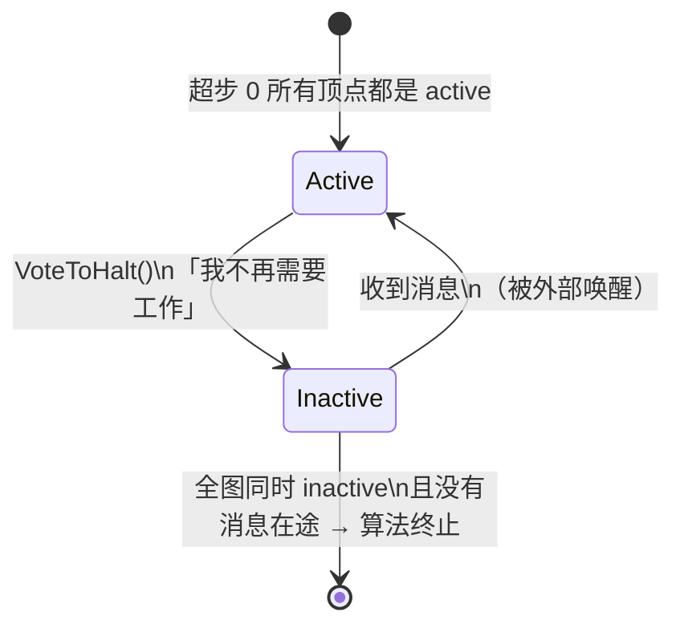
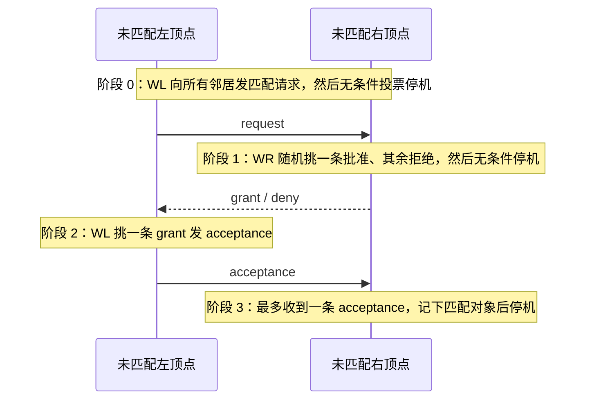

---
tags:
  - 分布式/计算
---

# Pregel

Pregel 是一个**面向大规模图的分布式计算框架**，把程序组织成**顶点中心**（vertex-centric）、**按超步同步**的形状。它要处理的图在规模上很极端：**顶点可达数十亿、边可达数万亿**，典型的例子是 Web 图与各种社交网络。

它同时也是"专用框架"这条路线的一个标志性样本 —— RDD 那篇把它当作论据之一，说明**图计算可以只用 200 行库在通用抽象上表达出来**。所以这一篇值得读两层：Pregel 自己定下的模型，以及它为此付出的专用化代价。

## 为什么图计算需要专门的框架

图算法有三个共同的形状特征，合起来让通用框架很难伺候：

- **内存访问的局部性很差**；
- **每个顶点上的工作量极少**；
- **执行过程中并行度会变**。

把这套东西**分发到多台机器上会放大局部性问题**，同时**提高"计算期间某台机器挂掉"的概率**。

而实现一个处理大图的算法，当时只有四条路，每条都不合用：

| 可选路径 | 问题 |
| --- | --- |
| 自己造一套分布式基础设施 | 工作量巨大，而且**每换一个算法或换一种图表示就得重来一遍** |
| 借现成的分布式平台 | 常常不适配图处理。MapReduce 用在很多大规模计算上很合适，也被用来挖大图，但会带来欠优的性能与可用性问题；它被扩展出过聚合、类 SQL 查询等能力，但这些扩展**对更适合消息传递模型的图算法并不理想** |
| 用单机图算法库（BGL、LEDA、NetworkX、JDSL、Stanford GraphBase、FGL） | **限制了问题规模** |
| 用已有的并行图系统（Parallel BGL、CGMgraph） | 处理了并行图算法，但**不解决容错**，以及大规模分布式环境里其他要紧的问题 |

Pregel 的目标是补上这一格：**一个可扩展、可容错、且 API 足以表达任意图算法的平台**。

高层组织方式借鉴了 Valiant 的 **BSP（Bulk Synchronous Parallel）** 模型。

## 模型：超步与顶点状态机

**输入**是一个有向图：每个顶点由一个**字符串顶点标识符**唯一确定，并带一个**用户定义、可修改的值**；有向边从属于它的**源顶点**，每条边由**一个可修改的值加一个目标顶点标识符**构成。

**计算过程**是：输入（初始化图）→ 一串**超步**（superstep），超步之间由**全局同步点**分隔 → 输出，直到算法终止。

**在一个超步内，所有顶点并行计算**，每个都执行同一个用户定义函数。这个函数只负责描述**"顶点 $V$ 在超步 $S$"** 的行为，能做的事有四件：

- 读**上一个超步**发给 $V$ 的消息；
- 发消息给其他顶点（**在下一个超步被收到**）；
- 修改 $V$ 自己的状态，以及它的**出边**的状态；
- **改图的拓扑**（增删点边）。

**边不是一等公民** —— 边没有关联的计算，只有值。

### 终止条件：投票停机

算法终止靠**每个顶点投票停机**（vote to halt）：



规则是三句话：

- **超步 0 里每个顶点都处于 active**，所有 active 顶点参与任一超步的计算；
- 顶点通过投票停机来**自我停用** —— 含义是"除非被外部触发，我没有别的工作要做"，此后框架**不再执行它，除非它收到消息**；
- **被消息重新唤醒的顶点必须显式地再次停用自己**。

**算法整体终止的条件是：所有顶点同时处于 inactive，且没有消息在途。**

**输出**是顶点显式输出的值的集合。它**常常是同构于输入的有向图，但这不是系统必需的性质** —— 计算过程中顶点和边都可以增删。聚类算法可能产出一小组从大图里选出的不连通顶点；图挖掘算法可能只输出聚合统计量。

一个最小例子：给定一张强连通图、每个顶点持有一个值，把**最大值传播到每个顶点**。每个超步里，任何从消息中学到更大值的顶点把它发给所有邻居；当某个超步里不再有顶点改变时算法终止。

### 为什么是纯消息传递

Pregel **只做消息传递**，不做远程读、也不提供其他模拟共享内存的手段。两个理由：

1. **表达力足够** —— 消息传递已经够强，不需要远程读；**没有找到任何消息传递表达不了的图算法**。
2. **性能更好** —— 在集群环境里**从远端机器读一个值会引入无法轻易隐藏的高延迟**；而消息传递模型可以**把消息异步地批量投递，从而摊薄延迟**。

与"把图算法写成一串链式 MapReduce 调用"相比，差别在于：

- **Pregel 让顶点和边留在做计算的那台机器上**，网络只用于传消息；
- MapReduce **本质上是函数式**的，所以把图算法写成链式 MapReduce **要求把图的整个状态从一个阶段传到下一个阶段** —— 一般会带来多得多的通信与随之而来的序列化开销；此外**协调链式 MapReduce 的各步骤**额外引入编程复杂度，而 Pregel 用超步迭代把这块消掉了。

## 表达的边界：顶点中心能写什么、写不了什么

"消息传递足以表达任意图算法"这句话，口径要收窄三层才能用：**能表达**（存在一份等价的顶点中心程序）、**写得顺**（不必为了绕开模型的缺失去搭额外结构）、**跑得值**（不为绕开缺陷付出成倍的通信或超步）。三层是三个不同的问题，把第一层当成全部，会在选型时误判。

顶点中心的形状约束只有一条，但很硬：**`Compute()` 能看到的全部输入，就是"上一超步到达的消息 + 本顶点的值 + 本顶点的出边"**。凡是这三样之外的信息，都得先想办法搬进来；搬运方式决定写起来顺不顺：

| 需要的东西 | 顶点中心里怎么拿到 | 代价 |
| --- | --- | --- |
| 全局统计量（总数、最值、直方图） | **Aggregator** —— 本超步供给、下一超步全局可见 | 只提供**归约**，拿不到全部值，且慢一个超步 |
| 远方某个顶点的**当前值** | 发一条请求消息，等对方在下一超步回复 | **往返两个超步**，而回复到达时对方的值可能已经变了 |
| 自己的**入边** | 拿不到 | 入边是源顶点所持列表的一部分，源顶点通常在另一台机器上 |
| 一份**稳定的全图快照** | 拿不到 | 任何时刻看到的都是"上一超步结束时的值" |

后两行是同一个物理事实的两面：**框架把顶点和它的出边放在同一台机器上**，于是"出边可读、入边不可读"；而"只看得到上一超步"是超步屏障的直接后果。这两条合起来划定了顶点中心的能力圈，也解释了为什么三处"看起来缺了什么"的地方都能被现有机制绕过去 —— 代价是慢一轮或换一种写法。

**Aggregator 与"全局状态"的差别值得单独说清**：它给的是**一个归约结果**，不是一份可读写的全局变量。想统计图的边总数，用 `sum` 聚合出度即可；但"想知道某个特定顶点当前的值"这类查询，聚合器帮不上忙 —— 只能走请求消息。这也解释了为什么可以放心省掉远程读：**需要远端值时发消息、等一轮回复，通信本身可以批量投递**；而远程读是一次**不可批量的同步等待**，延迟无从隐藏。

一个容易踩的写法陷阱是**"比较两个顶点的当前值"**。顶点中心里没有"读一眼邻居 $u$ 现在是多少"这个操作；写 `SendMessageTo(u, REQ)` 再在下一超步取回复，**$u$ 的值在这期间可能已经变了**。要写得自洽，必须把语义改写成"基于上一超步结束时的快照做判断" —— **这是模型强加给算法的一条语义约定，而不只是实现细节**。

另一条边界落在**确定性**上：受限恢复要求用户算法确定；不确定的算法照样能跑，只是恢复时退回基本机制、重算量更大。随机化算法可以用"按超步与分区确定性播种伪随机数发生器"变成确定性的 —— 把算法改造成适配框架，这是常见做法而不是例外。

**一段选型前的判据** —— 把算法改写成顶点中心之前，先问三个问题：

1. 一个顶点做决策所需的输入，能不能全部从"上一超步的消息 + 自己的值 + 自己的出边"推出来？
2. 算法里有没有"必须一次看到全图才能继续"的步骤？
3. 有没有依赖"读到别人最新值"的地方？

三个都能答"能"或"没有"，改写通常直接；只要有一个答不上，就得先设计"怎么把那条信息搬进消息"，而这一步往往决定这个算法写起来是顺畅还是别扭。从 Pregel 自己的使用经验看，**转到"像顶点一样思考"这个视角之后，API 是直觉、好用的** —— 这是模型层面的收获；但"能写"与"写得好"之间的距离，正是上面三问要提前量出来的。

## C++ API：每顶点一个值 + `Compute()`

写一个 Pregel 程序就是**继承预定义的 `Vertex` 类**。它的模板参数定义三个值类型：**顶点值、边值、消息值**。这种"每顶点/每边只有一个值"的统一性看起来受限，但用户可以用协议缓冲区这类能承载任意结构的类型。

```cpp
template <typename VertexValue, typename EdgeValue, typename MessageValue>
class Vertex {
 public:
  virtual void Compute(MessageIterator* msgs) = 0;
  const string& vertex_id() const;
  int64 superstep() const;
  const VertexValue& GetValue();
  VertexValue* MutableValue();
  OutEdgeIterator GetOutEdgeIterator();
  void SendMessageTo(const string& dest_vertex, const MessageValue& message);
  void VoteToHalt();
};
```

用户覆盖 `Compute()`，它在每个 active 顶点、每个超步被执行。通过 `GetValue()` / `MutableValue()` 读写顶点值，通过出边迭代器读写出边的值。**这些状态更新立即可见**，但因为可见范围**限于被修改的那个顶点**，所以从不同顶点并发访问值**不存在数据竞争**。

一条设计上很关键的约束：**顶点及其边的值是唯一跨超步存活的每顶点状态**。把框架管理的图状态限制成"每顶点/每边一个值"，简化了三件事 —— **主计算循环、图的分发、以及失败恢复**。

### 消息传递

消息由**一个消息值加一个目标顶点名**构成，值是用户指定的模板参数。一个顶点在一个超步里可以发任意多条消息。**超步 $S$ 里发给 $V$ 的全部消息，在超步 $S+1$ 调用 $V$ 的 `Compute()` 时通过迭代器可见。**

两条保证、一条不保证：

- **保证送达**；
- **保证不重复**；
- **迭代器里不保证消息顺序**。

目标顶点**不必是 $V$ 的邻居** —— 顶点可以从先前收到的消息里学到非邻居的标识符，也可以隐式知道（例如图是完全图、顶点 ID 是 $V_1$ 到 $V_n$）。

**任何消息的目标顶点不存在时，执行用户定义的 handler** —— 例如创建缺失的顶点，或者把那条悬空边从源顶点上删掉。

### Combiner：减少消息开销

发消息（尤其是发往另一台机器）是有开销的，用户可以在某些情况下帮忙降低它。举例：如果 `Compute()` 收到的是整数消息，而**只有"和"有意义、各个具体值无所谓**，那么系统就能**把发给顶点 $V$ 的多条消息合并成一条装着它们之和的消息**，从而减少需要传输和缓冲的消息条数。

**Combiner 默认不开启**，原因是**不存在机械的办法找出一个既有用、又与用户 `Compute()` 语义一致的合并函数** —— 这件事必须由用户声明。做法是继承 `Combiner` 类并覆盖 `Combine()`。

一条必须注意的边界：**对"合并了哪些消息、分组方式、合并顺序"都没有任何保证**，所以**只能对可交换且可结合的操作启用 Combiner**。

实测收益：在单源最短路（见下）这类算法上，**消息流量减少到原来的四分之一以下**。

### Aggregator：全局通信与协调

Aggregator 是**全局通信、监控与数据**的机制：每个顶点在超步 $S$ 提供一个值，系统用**归约算子**把它们合并，**合并结果在超步 $S+1$ 对所有顶点可用**。预定义的有 `min`、`max`、`sum`，覆盖整数与字符串类型。

三类典型用法：

- **统计** —— 对每个顶点的出度做 `sum` 就是图的边总数；更复杂的归约算子可以生成某个统计量的直方图；
- **全局协调** —— 让 `Compute()` 的一个分支先执行若干超步，直到一个 `and` 聚合器判定所有顶点都满足某条件，再切换执行另一个分支；
- **选出特殊角色** —— 对顶点 ID 做 `min` 或 `max`，就选出了一个顶点来在算法里扮演特殊角色。

自定义方式是继承 `Aggregator`，指定**聚合值如何从第一个输入值初始化**、以及**多个部分聚合值如何归约成一个**；归约算子同样应当**可交换且可结合**。

一条容易忽略的差别：**默认的 aggregator 只归约单个超步的输入值**，但也可以定义 **sticky aggregator**，它使用**所有超步**的输入值 —— 例如维护一个只在增删边时才调整的全局边计数。

还能做更高级的事：**用 aggregator 实现 $\Delta$-stepping 最短路算法所需的分布式优先队列** —— 按暂定距离把每个顶点分到优先级桶，一个超步里各顶点把自己的桶号提供给 `min` 聚合器，最小值在下一超步广播给所有 worker，**最低桶号里的顶点去松弛边**。

### 拓扑变更：偏序 + handler

有些图算法需要改图的拓扑：聚类算法可能把每个簇替换成一个顶点，最小生成树算法可能只保留树上的边。`Compute()` 除了发消息，也可以发出**增删顶点或边**的请求。

同一超步里**多个顶点可能发出冲突的请求**（例如两个请求以不同初始值添加同一个顶点 $V$）。Pregel 用**两个机制**取得确定性：

**① 偏序。** 变更和消息一样，**在请求发出的下一个超步才生效**；在那个超步内，顺序被固定下来：

```
先 删除
   ├─ 先删边
   └─ 再删顶点      （删顶点会隐式删掉它的全部出边）
后 添加
   ├─ 先加顶点
   └─ 再加边
最后 才轮到 Compute() 被调用
```

这个偏序对**大部分冲突**都能产出确定性的结果。

**② handler。** 剩下解决不了的冲突交给用户定义的 handler。例如同一超步里多次请求创建同一个顶点时，**默认行为是系统任意挑一个**，有特殊需要的用户可以在 `Vertex` 子类里定义合适的 handler 来指定更好的冲突解决策略。多次删除顶点、多次增删边的冲突用的也是同一套 handler 机制。把解决方式委派给 handler 是为了**让 `Compute()` 的代码保持简单** —— 代价是限制了 handler 与 `Compute()` 之间的交互，但实践中没有成为问题。

一条设计取向值得单独记：**协调是惰性的** —— **全局变更在被应用之前不需要任何协调**。这个选择有利于流处理。其直觉是：**涉及顶点 $V$ 修改的冲突，由 $V$ 自己处理**。

另外，Pregel 支持**纯局部变更**，即一个顶点增删自己的出边、或者删除自己。这类变更**不可能引入冲突，因此被做成立即生效**，用更简单的顺序编程语义简化分布式编程。

### 输入与输出

图的文件格式有很多可能（文本文件、关系数据库里的一组顶点、Bigtable 里的行……）。为避免强加某种格式，Pregel **把"把输入文件解释成图"和"图计算"这两件事解耦**；输出也能以任意格式生成、以最适合应用的形式存储。库里为常见格式提供了 reader 与 writer，特殊需求可以继承抽象基类 `Reader` / `Writer` 自己写。

## 实现

目标环境是 Google 的集群架构：**成千上万台商用 PC 按机架组织、机架内带宽很高**，机架之间互连但地理上分散。应用通常跑在一个**集群管理系统**上，由它调度作业以优化资源分配，**有时会杀掉实例或把它们迁到别的机器**；系统带**名字服务**，实例可以用逻辑名引用而不依赖它当前绑在哪台物理机上。持久数据放在**分布式存储（GFS）或 Bigtable** 上，**临时数据（例如缓冲的消息）放在本地磁盘**。

### 分区与执行阶段

**分区**的划分方式是：**每个分区 = 一组顶点 + 这些顶点的全部出边**。

一个性质很关键：**顶点到分区的归属只取决于顶点 ID** —— 这意味着**即使某个顶点属于别的机器、甚至这个顶点还不存在，也能算出它该属哪个分区**。默认的分区函数就是 $\mathrm{hash}(ID) \bmod N$（$N$ 是分区数），用户可以替换。

**顶点到 worker 机器的分配，是 Pregel 里分布不透明的唯一主要地方。** 有些应用用默认分配就够，有些则能从自定义分配函数里获益，以更好利用图自身的局部性 —— 例如 Web 图上常见的启发式是**把同一站点的页面放在一起**。

无故障时，程序执行分几个阶段：

```
① 启动：多份用户程序副本起来，一个任 master（不持图，负责协调）
   worker 通过名字服务发现 master，并发送注册消息
        │
② 分配分区：master 决定分区数，给每个 worker 分一个或多个分区
   每 worker 多于一个分区 → 分区间并行 + 更好负载均衡，通常提升性能
   每个 worker 拿到「全部 worker 的完整分配表」
        │
③ 分输入：master 把一部分输入分给每个 worker（输入是一条条记录，
   每条含任意数量的顶点与边）；输入划分与图分区正交，通常按文件边界
   ├─ 加载的顶点属于自己的分区 → 立即更新数据结构
   └─ 否则 → 向拥有该顶点的远端 peer 排一条消息
   加载完成后，所有顶点标记为 active
        │
④ 循环超步：worker 遍历 active 顶点，每个分区一个线程，调用 Compute()
   消息异步发送（重叠计算与通信、便于批量），但必须在超步结束前送达
   结束后回报「下一超步将有多少 active 顶点」
   重复直到没有 active 顶点、也没有在途消息
        │
⑤ 停机后：master 可指示各 worker 保存自己那部分图
```

### 容错：checkpoint + ping

**容错通过 checkpoint 实现。** 在**每个超步开始时**，master 指示 worker 把各自分区的状态存到持久存储 —— 包括**顶点值、边值、以及入向消息**；**master 单独保存 aggregator 的值**。

**故障检测**靠 master 定期向 worker 发的 **ping 消息**：如果 worker 在指定间隔内没有收到 ping，**它自己终止**；如果 master 收不到某个 worker 的回应，**就把它标记为失败**。

恢复流程：一个或多个 worker 失败时，它们所辖分区的当前状态就丢了。master **把图分区重新分配给当前可用的 worker 集合**，它们**从超步 $S$ 开始时最近可用的 checkpoint 重新加载分区状态**。这个 checkpoint 可能比失败前任何分区已完成的最新超步 $S'$ **早好几个超步**，于是恢复**需要重放缺失的那些超步**。

**checkpoint 的频率用一个"平均无故障时间"模型来选**，在 checkpoint 成本与期望恢复成本之间做平衡。

**受限恢复（confined recovery，开发中）** 是针对恢复成本的改进：worker 在**图加载与各超步期间额外记录自己分区的出向消息**。于是恢复被**限制在丢失的分区**上（它们由 checkpoint 恢复），系统**用健康 partition 的日志消息 + 恢复 partition 重算出来的消息**，把缺失的超步重放到 $S'$。两点收益：**只重算丢失的分区**从而省计算；**每个 worker 需要恢复的分区可能更少**从而降低恢复延迟。代价是记录出向消息带来的开销，但**典型机器的磁盘带宽足以让 I/O 不成为瓶颈**。

受限恢复有一条硬前提：**要求用户算法是确定性的** —— 否则"原执行留下的消息"与"恢复期新算出来的消息"混在一起会产生不一致。**随机算法可以通过"基于超步与分区确定性地播种伪随机数发生器"来变成确定性的**；真正不确定的算法可以关掉受限恢复，退回基本恢复机制。

### worker 内部

worker 把图的一部分状态**放在内存**里：可以看成一个**从顶点 ID 到顶点状态的映射**，每个顶点的状态由四样东西组成 —— **当前值**、**出边表**（目标顶点 ID + 边值）、**入向消息队列**、**一个标明是否 active 的标志**。

执行一个超步时，worker 遍历所有顶点调用 `Compute()`，传入当前值、消息迭代器、出边迭代器。**入边无法访问** —— 每条入边是源顶点所持有的列表的一部分，而那个源顶点**通常在另一台机器上**。

有三处实现细节值得记：

**① active 标志与消息队列分开存**（出于性能考虑）。

**② 顶点和边的值只有一份，但 active 标志与入向消息队列有两份** —— 当前超步一份、下一超步一份。原因是并发性：**worker 在处理超步 $S$ 的顶点时，另一个线程同时在接收来自其他 worker（它们也在执行超步 $S$）的消息**；而顶点收到的是**上一个超步**发出的消息，所以超步 $S$ 与 $S+1$ 的消息必须分开存。由此还有一条语义：**一条消息到达顶点 $V$ 意味着 $V$ 将在"下一个"超步 active，而不一定是当前超步**。

**③ 发送路径分远端与本地**：

- **远端** —— 消息先缓冲；**当缓冲大小达到阈值时，最大的那些缓冲被异步刷出**，每个作为一条网络消息投递到目标 worker；
- **本地** —— 可以直接**放进目标顶点的入向消息队列**（一个优化）。

**若用户提供了 Combiner，它在两个位置都会被应用**：消息**加入出向队列时**，以及**到达入向队列时**。后一个位置**不减少网络用量，但减少存储消息所需的空间**。

### master 内部

每个 worker 在注册时得到一个**唯一标识符**。master 维护一张当前存活 worker 的列表，含唯一标识符、寻址信息、以及它被分配到图的哪一部分。一个重要的规模性质：**master 数据结构的大小与分区数成正比，而与顶点数、边数无关** —— 所以**单个 master 就能协调哪怕非常大的图**。

**大多数 master 操作在屏障（barrier）处终止**：向"操作开始时已知存活"的每个 worker 发出同一个请求，并**等待每个 worker 的响应**。任一 worker 失败就进入恢复模式；屏障同步成功则进入下一阶段 —— 对计算屏障而言，就是**递增全局超步号**再进入下一个超步。

master 还维护一批运行统计：**图的总大小、出度分布直方图、active 顶点数、近期超步的耗时与消息流量、以及所有用户定义 aggregator 的值**。为了让用户能监控，**master 跑一个 HTTP 服务器展示这些信息**。

### aggregator 的实现

每个 worker 维护一组 aggregator 实例，用**类型名加实例名**标识。一个 worker 为图的任一分区执行超步时，先把供给某 aggregator 实例的所有值合并成**一个局部值** —— 也就是"在该 worker 该分区的全部顶点上部分归约"的结果。**超步结束时，worker 之间组成一棵树**，把部分归约的 aggregator 归约成全局值并交给 master。

这里有个刻意的选择：**用树形归约，而不是沿 worker 串成一条链做流水线** —— 目的是**在归约过程中并行使用 CPU**。最后 master 在**下一个超步开始时**把全局值发给所有 worker。

## 底层依赖：消息的序列化、缓冲与落盘

"网络只用于传消息"这句话落到物理层，要经过三个落点，每一处的容量都有限：

```
计算线程 SendMessageTo()
        │
   ① 出向缓冲（内存，按目标 worker 分组）
        │  缓冲大小达到阈值 → 挑最大的几个异步刷出，各作为一条网络消息
        ▼
   ② 网络传输（机架内带宽高，机架间与跨集群受地理分布限制）
        ▼
   ③ 目标 worker 的入向消息队列（内存，按顶点分组）
```

**① 缓冲为什么按"目标 worker"分组、又按阈值刷出**：一条消息单独发一次的固定开销远大于消息本身，攒起来发才能摊薄；而"挑最大的那些先发"是为了让大缓冲尽早进入网络、不至于全部卡在最后。**临时数据（缓冲中的消息）落在本地磁盘**，持久数据（输入图、输出、checkpoint）落在 GFS 或 Bigtable —— 这个分工意味着本地盘的延迟不进入关键路径，因为它只承载暂存。

**② 本地消息有一条直投优化**：目标顶点归本 worker 所有时，消息**直接进目标顶点的入向队列**，不经过缓冲与网络。这条优化顺带提示了"合并该在何处生效" —— **若用户提供了 Combiner，它在两个位置都会被应用**：消息加入出向队列时、以及到达入向队列时。后一个位置**不减少网络流量，但减少缓冲占用的空间**。想省网络要在第一个位置生效，想省内存则两个位置都起作用。

**③ "每顶点一个值"这个限制，出口在序列化格式上**。顶点值、边值、消息值都是模板参数，看起来一板一眼；实际写法是**用协议缓冲区这类能承载任意结构的类型**把它们顶上去 —— 于是"每顶点只有一个值"约束的是**值的数量**，不约束值的**结构复杂度**。代价是这些值都要经过**序列化**才能跨机器、才能落盘，而序列化开销是顶点中心框架里一处固定的成本项。

**拓扑假设决定优化方向**：集群由**成千上万台商用 PC 按机架组织，机架内带宽很高**，机架间互连但地理上分散。于是"顶点放在哪台机器"直接决定跨机架流量，而**顶点到 worker 的分配是整个模型里唯一不透明的地方**。默认的哈希分配在多数图上够用；图自身带局部性时（Web 图上把同一站点的页面放在一起）自定义分配能拿到实打实的收益。

**内存是这套设计的硬边界**：worker 把图的这一部分**整个放在内存**里 —— 概念上是"顶点 ID → 顶点状态"的映射，每个顶点状态含**当前值、出边表、入向消息队列、active 标志**四样。**入边无法访问**的物理原因也落在这里：入边是源顶点所持列表的一部分，而那个源顶点通常在另一台机器上。

**这也解释了 worker 内部两处实现细节为什么不是随意的**：顶点值与边值只有一份，**active 标志与入向消息队列却各存两份**（当前超步一份、下一超步一份）。原因是并发 —— worker 在处理超步 $S$ 的顶点时，另一个线程正在接收来自其他 worker（它们也在跑超步 $S$）的消息；而顶点该收到的是**上一超步发出的消息**，两个超步的消息必须分开存。由此得到一条容易被忽略的语义：**一条消息到达顶点 $V$，意味着 $V$ 将在"下一个"超步 active，而不一定是当前超步。**

把这条链读完，一个结论是自然浮出来的：**整个计算状态都在 RAM 里，"图装不装得下"直接决定作业能不能跑** —— 这正是后来 out-of-core 与单机磁盘路线要解决的事。

## 参数与可调项

Pregel 本身是 Google 内部系统，没有公开的配置文档页，所以这一节分两栏看：**模型层定下了哪些旋钮**，以及**这些旋钮在开源对应物（Apache Giraph）里被具体化成什么参数名与默认值**。下面的默认值照录 Giraph 官方选项页，不做推测。

模型层定义的旋钮有七个，归属各不相同：

| 旋钮 | 影响什么 | 由谁决定 |
| --- | --- | --- |
| **分区函数** | 顶点落到哪个分区（默认 $\mathrm{hash}(ID) \bmod N$） | 用户可替换 |
| **分区数 $N$** | 并行度、每个 worker 拿几个分区 | 框架默认，可覆盖 |
| **顶点到 worker 的分配** | 跨机架流量 | 用户可替换（唯一不透明处） |
| **Combiner** | 消息条数与缓冲占用 | 用户声明，**默认关闭** |
| **Aggregator** | 全局归约的语义与生命周期（是否 sticky） | 用户声明 |
| **冲突 handler** | 拓扑变更里偏序解决不了的冲突 | 用户声明，默认任选一个 |
| **checkpoint 频率** | 恢复成本与运行时开销的平衡 | 由"平均无故障时间"模型定 |

在 Giraph 里，这些旋钮长成下面这样：

| 参数 | 默认值 | 语义 |
| --- | --- | --- |
| `giraph.numComputeThreads` | `1` | 顶点计算用几个线程 |
| `giraph.numInputThreads` / `giraph.numOutputThreads` | `1` / `1` | 输入切分加载、输出写出的线程数 |
| `giraph.graphPartitionerFactoryClass` | `HashPartitionerFactory` | 顶点到分区的划分（对应上面的分区函数） |
| `giraph.partitionClass` | `SimplePartition` | 分区容器实现 |
| `giraph.userPartitionCount` | `-1` | `-1` 表示按框架默认算，非负则覆盖分区数 |
| `giraph.useOutOfCoreGraph` | `false` | 是否把图放到内存之外 |
| `giraph.outEdgesClass` | `ByteArrayEdges` | 出边的存储实现，决定边值怎么落内存 |
| `giraph.messageEncodeAndStoreType` | `BYTEARRAY_PER_PARTITION` | 消息的编码与存储方式 |
| `giraph.checkpointFrequency` | `0` | `0` 表示不 checkpoint，`1` 表示每个超步都做，`2` 表示每两个超步 |
| `giraph.checkpointDirectory` | `_bsp/_checkpoints/` | checkpoint 落在 HDFS 的哪个目录 |
| `giraph.maxNumberOfSupersteps` | `1` | 完成这么多个超步后停机 |
| `giraph.SplitMasterWorker` | `true` | master 与 worker 分离，动态恢复需要它 |
| `giraph.masterComputeClass` | `DefaultMasterCompute` | master 侧的计算逻辑 |
| `giraph.metrics.enable` | `false` | 是否开启 Metrics |
| `giraph.logLevel` | `info` | 覆盖 Hadoop 日志级别 |

按六要素把其中三个最要紧的摊开。

**`giraph.checkpointFrequency`（默认 `0`）** —— 语义是"每多少个超步做一次 checkpoint"。**默认值本身就是一个立场**：`0` 意味着开箱状态下不落 checkpoint，失败的代价是**整个作业从头重跑**。什么时候该改？图大到"重算一次的成本不可接受"时。往小改（更频繁）→ 恢复更快，但**每个超步都要把分区状态全量写进持久存储**，运行时开销随之上升；往大改（更稀疏）→ 运行时开销降低，但单次恢复要重放的超步更多。联动的是 `checkpointDirectory` 所在存储的写入带宽。失败模式两头都像"没配过这个参数"：配得太密时表现为**超步耗时莫名变长**（时间花在写盘上），配得太疏时表现为**机器一挂就要重跑很久**。

这里有一处值得对照的地方：**模型层面把 checkpoint 定在"每个超步开始时"**，而开源实现的默认是**关掉**。同一件事在两处的默认值相反，说明"机制存在"与"默认启用"是两个独立的决定 —— 而且 Pregel 自己的实测就是**关掉 checkpoint 跑的**（失败概率低、跑得快）。

**`giraph.maxNumberOfSupersteps`（默认 `1`）** —— 语义是"完成这么多个超步后停机"。官方描述给了一个例子：设成 `3`，则作业最多跑超步 `0`、`1`、`2`，然后进入 shutdown 超步。按这个语义，**默认 `1` 意味着不显式改它就只能跑超步 `0` 就收尾** —— 也就是"加载图 + 一轮计算"。需要多轮迭代的算法（PageRank、最短路、半聚类）**都必须显式把这个值放大**。失败模式很直白：**作业秒退、超步计数停在 `1`**，而日志层面不报错，看起来像"图没加载进来"。

**`giraph.useOutOfCoreGraph`（默认 `false`）** —— 语义是"把图放到内存之外"。默认 `false` 对应模型原本的假设：**整个计算状态常驻 RAM**。什么时候该改？图大到单机内存装不下、又拿不到 tb 级内存时。改成 `true` 的后果是**计算期间反复读写磁盘，超步耗时上一个台阶**；不改的后果是**装不下就起不来**。这条参数之所以存在，直接对应模型自己承认的一处短板：**"目前整个计算状态都在 RAM 里，已经有一部分数据 spill 到本地盘，会继续往这个方向走。"**

几条联动关系值得记住：

- **`numComputeThreads` 与 `partitionClass`**：模型层的说法是"每个分区一个线程"，实现层把它显式化成线程数 —— 分区数与线程数的配比决定 CPU 用不用得满；
- **分区数与 `graphPartitionerFactoryClass`**：换分区函数往往要连带调分区数，否则"顶点分布变了、每分区大小也变了"；
- **Combiner 与 `messageEncodeAndStoreType`**：Combiner 减少消息**条数**，编码方式影响每条消息的**字节数**，两者作用在不同维度上，可以叠加。

## 四个应用

### PageRank

顶点值类型 `double`（存暂定的 PageRank），消息类型 `double`（承载 PageRank 分量），**边值类型是 `void` —— 因为边不存信息**。

```cpp
class PageRankVertex : public Vertex<double, void, double> {
 public:
  virtual void Compute(MessageIterator* msgs) {
    if (superstep() >= 1) {
      double sum = 0;
      for (; !msgs->Done(); msgs->Next()) sum += msgs->Value();
      *MutableValue() = 0.15 / NumVertices() + 0.85 * sum;
    }
    if (superstep() < 30) {
      const int64 n = GetOutEdgeIterator().size();
      SendMessageToAllNeighbors(GetValue() / n);
    } else {
      VoteToHalt();
    }
  }
};
```

初始状态假定超步 0 里每个顶点的值是 $1/\mathrm{NumVertices}()$。前 30 个超步里，每个顶点沿每条出边发送"自己的暂定值除以出边数"。从超步 1 起，每个顶点把到达的消息值求和，并把自身暂定 PageRank 设为

$$0.15/\mathrm{NumVertices}() + 0.85 \times \text{sum}$$

到第 30 个超步之后不再发消息，每个顶点投票停机。**现实中 PageRank 会一直跑到收敛，而"检测收敛条件"正是 aggregator 的用武之地。**

### 单源最短路

最短路有三个重要变体：**单源**（一个源到其余每个顶点）、**s-t**（给定 $s$ 与 $t$ 之间一条最短路，行车导航就是这类）、**全对**（因需要 $O(|V|^2)$ 存储，对大图不现实）。

s-t 这类问题实际上相对容易：**典型路网上的解法只访问极小一部分顶点** —— 有一例观察到的是**3200 万顶点里只访问了 8 万个**。这里选单源变体讲，因为它**更贴合大规模图，同时又能给出更有意思的扩展性数据**。

```cpp
class ShortestPathVertex : public Vertex<int, int, int> {
  void Compute(MessageIterator* msgs) {
    int mindist = IsSource(vertex_id()) ? 0 : INF;
    for (; !msgs->Done(); msgs->Next())
      mindist = min(mindist, msgs->Value());
    if (mindist < GetValue()) {
      *MutableValue() = mindist;
      OutEdgeIterator iter = GetOutEdgeIterator();
      for (; !iter.Done(); iter.Next())
        SendMessageTo(iter.Target(), mindist + iter.GetValue());
    }
    VoteToHalt();
  }
};
```

每个顶点的值初始化为 `INF`（一个大于从源点出发任何可行距离的常数）。每个超步里，顶点先收到邻居发来的"候选最小距离"；**若这些更新里的最小值小于当前值，就更新自身并向邻居发出"每条出边的权重加上新最小值"**。**第一个超步里只有源顶点会更新（从 `INF` 变成 0）**并向它的直接邻居发出更新，这些邻居再更新并向下传播 —— 于是形成一道**波前（wavefront）**在图中推进。**不再有更新时终止**，此时每个顶点的值就是从源点到它的最小距离（`INF` 表示不可达）。**所有边权非负时保证终止。**

这个算法的消息本质是"可能更短的距离"，而**接收方最终只关心其中的最小值**，所以它**适合用 Combiner 优化**：

```cpp
class MinIntCombiner : public Combiner<int> {
  virtual void Combine(MessageIterator* msgs) {
    int mindist = INF;
    for (; !msgs->Done(); msgs->Next())
      mindist = min(mindist, msgs->Value());
    Output("combined_source", mindist);
  }
};
```

这个 Combiner **大幅减少了 worker 之间传输的数据量**，也减少了执行下一个超步之前缓冲的数据量。

一条诚实的取舍：**这个算法会比顺序版本（Dijkstra、Bellman-Ford）做多得多的比较**，但它**能在任何单机实现都无法企及的规模上求解最短路**。更高级的并行算法（如 Thorup、$\Delta$-stepping）**同样能在 Pregel 框架里表达**；不过上面这段实现的简洁性、加上已经可以接受的性能，对没条件做大量调优的用户是有吸引力的。

### 二分图匹配

输入由**两组互不相交的顶点**构成，边只跨组；输出是一个**端点互不相同的边子集**。**极大匹配**是指无法在不共享端点的前提下再加入任何一条边的匹配。这里讲其中的**随机化极大匹配**算法。

顶点值是一个二元组：**标明顶点属于 $L$ 还是 $R$ 的标志**，加上**一旦确定后它匹配到的顶点名**。边值类型 `void`，消息是布尔值。

算法的骨架是**四阶段一轮的循环，阶段号就是"超步号 mod 4"，整体是一个三方握手**（`WL` 表示左组顶点）：



各阶段的细节值得逐个说清，因为**停机的时机是这套四阶段设计的核心**：

- **阶段 0**：每个**未匹配的左顶点**向它的每个邻居发一条匹配请求，然后**无条件投票停机**。这里有一个微妙的判断：**若它没有发出任何消息**（已经匹配了，或者没有出边），**或者消息的所有接收者都已经匹配**，那么它**再也不会被重新激活**；否则它会在两个超步后收到回应而被激活。
- **阶段 1**：每个**未匹配的右顶点随机选择**收到的一条消息，给它批准，并给其余请求者发拒绝；然后**无条件投票停机**。
- **阶段 2**：每个**未匹配的左顶点**从收到的批准里选一条，发出接受消息。**已经匹配的左顶点永远不会执行到这个阶段** —— 因为它们在阶段 0 就没发过消息。
- **阶段 3**：一个未匹配的右顶点**最多收到一条接受消息**。它记下匹配对象，然后**无条件投票停机** —— 它没有别的事要做了。

### 半聚类

Pregel 被用于多个版本的聚类。其中**半聚类（semi-clustering）**出现在社交图上：顶点代表人，边代表人与人之间的连接，连接可能基于**显式动作**（例如在社交网站上加好友），也可能**从行为里推断**（例如邮件往来、合作发表）；边可以带权，表示互动的频率或强度。

**半簇**是"一群互相频繁互动、与外部互动较少的人"。它与普通聚类的区别在于：**一个顶点可以属于多个半簇。**

算法是并行的贪心：

- **超步 0**：$V$ 把自己作为**规模 1、得分 1** 的半簇写进自己的列表，并把自身发布给所有邻居；
- **后续超步**：
  - $V$ 遍历上一超步收到的半簇 $c_1 \dots c_k$。若某个半簇 $c$ **还不包含 $V$**、且 $|V_c| < M_{\max}$，就把 $V$ 加入它形成 $c'$；
  - 把 $c_1..c_k$ 与 $c'_1..c'_k$ **按得分排序**，把最好的那些发给 $V$ 的邻居；
  - $V$ 用"包含 $V$ 的那些半簇"更新自己的列表。

**终止条件**是半簇不再变化，**或者（为了性能）达到用户指定的超步上限**。此时可以把每个顶点的最佳半簇候选**聚合成一个全局的最佳半簇列表**。

## 实测：单源最短路

环境是 **300 台多核商用 PC**，所有边权隐含为 1。**不计**集群初始化、在内存中生成测试图、以及校验结果的时间。**因为所有实验都能在较短时间内跑完、失败概率低，checkpoint 被关掉了。**

先看**按 worker 数扩展**：十亿顶点的二叉树（因此是十亿减一条边），worker 数从 50 变到 800 —— 运行时间**从 174 秒降到 17.3 秒**，**16 倍的 worker 换来约 10 倍加速**。

再看**按图规模扩展**：二叉树从十亿到五百亿顶点，固定 800 个 worker —— 时间**从 17.3 秒增到 702 秒**，说明**在平均出度低的图上，运行时间随图规模线性增长**。

二叉树显然不代表真实图，所以另外用**对数正态分布的出度**做实验：

$$p(d) = \frac{1}{\sqrt{2\pi}\,\sigma d} e^{-(\ln d - \mu)^2 / 2\sigma^2}$$

取 **$\mu = 4$、$\sigma = 1.3$，平均出度 127.1**。这种分布接近许多真实的大规模图（Web 图、社交网络）：**大多数顶点度相对很小，少数离群点则大得多 —— 可达十万以上**。图规模从 1000 万到十亿顶点（**边数因此超过 1270 亿**），800 个 worker 跑在 300 台多核机器上：**最大的那个图跑了十分钟出头**。

**这些数字不该被读成 Pregel 的最好成绩**，有两个原因：实验中用的是**默认的随机 hash 分区函数**（拓扑感知的分区函数会给出更好性能），而且用的是**朴素的并行最短路算法**（更高级的算法会更好）。**想说明的是：用相对很少的编码量就能拿到令人满意的性能。** 十亿顶点与边的结果与 Parallel BGL 在 **112 个处理器 / 2.56 亿顶点 / 10 亿边**上的 $\Delta$-stepping 结果相当，**而 Pregel 在更大规模上扩展得更好**。

## 版本与后续演进

Pregel 自己没有后续版本 —— 它是在生产里用了几年、把模型和实现讲清楚就停在那里的一个系统。真正在演进的是它留下的模型，而**设计里主动承认了三处不足，此后十年的顶点中心系统基本可以按这三条线归类**。

**不足一：同步屏障的代价。** 每个超步结束时所有 worker 都要等齐，**快的那批必须空等慢的**。沿这条线的做法是把同步放松：

- **GraphLab**（2012）改用**异步**执行，顶点主动**拉取**邻居数据而不是被动收消息；
- **PowerGraph**（2012）进一步**按边切分**而不是按顶点切分，缓解高度顶点造成的负载倾斜；
- **GiraphUC**（2015）走折中，把同步与异步混起来。

这里有一处值得记的反直觉结果：异步模型对随机游走这类任务收敛更快，但**在多数任务上比同步慢，主要开销落在加锁与解锁上** —— 放松同步换来的并行度，可能还不够抵消一致性维护的成本。

**不足二：整个计算状态常驻 RAM。** 这条线的第一步是**开源实现的 out-of-core 模式**；更彻底的一条是把磁盘当作一等存储、用单机处理巨图（GraphChi、X-Stream、VENUS 这一类）。单机路线的代价也很明确：**每轮迭代都要扫一遍磁盘上的图，哪怕本轮只有很小的子集需要计算**；对"重迭代、轻载"的分析型作业尚可，对轻量查询就很浪费。

**不足三：顶点到机器的分配。** 这是模型自己点名的难点 —— 按拓扑分区**在拓扑与消息流量一致时够用，不一致时就不够**。三个系统各补了一块：

- **GPS**（2013）：把**高度顶点镜像到多台机器**上，让"给自己全部邻居发同一条消息"这个动作不必跨机器摊开；
- **Mizan**（2013）：**运行时监控 + 顶点迁移**做动态负载均衡，处理的是"分区时算不准、运行时才暴露"的倾斜；
- **Pregel+**（2015）：把**镜像与消息合并**放在一起，用**代价模型**判断某个顶点值不值得镜像，另加一套**请求-响应**机制，专门压掉"只读远端值"这一类开销。

**另一条方向是把顶点中心收进通用抽象**，这也是 RDD 那篇预告过的事：

- **GraphX**（2014）在 Spark 上提供名为 `pregel` 的算子 —— 但它**实现的是 GAS（gather-apply-scatter）**，而非逐顶点的消息推送；
- **Pregelix**（2015）把顶点中心架在数据流引擎上；**Gelly**（2015）在 Flink 上同时给出顶点中心、scatter-gather 与 GAS 三套 API。

还有一支走**子图中心 / 块中心**：**Giraph++**（2013）把子图整体暴露给用户编程，**Blogel**（2014）让块可以像顶点一样有状态并通信 —— 它们针对的是"顶点中心把消息条数放大到边数量级"这个痛点，用"把一组顶点当成一个单元"来压通信量。

作为这条线里唯一还在持续发版的开源实现，**Apache Giraph 的发布节奏可以当作顶点中心系统的生命周期参照**：`0.1-incubating`（2012-02）→ `1.0.0`（2013-05）→ `1.1.0`（2014-11）→ `1.2.0`（2016-10）→ `1.3.0`（2020-06）。它在基本模型之外补的东西集中在四处：**master 侧计算、分片 aggregator、面向边的输入、out-of-core**。

**一条选型判据**：先问"瓶颈落在哪一条线上"，答案直接指向该看哪类系统 —— 瓶颈是**屏障空等**就看异步或混合路线；是**内存装不下**就看 out-of-core 或单机磁盘路线；是**少数高度顶点拖慢全局**就看镜像与迁移这一类优化。而如果作业本身不是重迭代的，**通用引擎上的一个 `pregel` 算子往往够用**，不必为此另起一套专用集群。

## 与相关工作的边界

与 MapReduce 概念上相似，但 Pregel 提供**自然的图 API**，且**对图上的迭代计算支持得好得多**。这一点也让它区别于其他隐藏分发细节的框架（Sawzall、Pig Latin、Dryad）。另一处更根本的差别是模型：

> Pregel 实现的是**有状态的模型** —— 长生命周期的进程做计算、通信并修改本地状态；而不是**数据流模型** —— 任何进程只对输入数据计算、产出被别的进程消费的输出。

它受 **BSP** 启发（超步模型就来自这里）。已有的通用 BSP 库实现（Oxford BSP Library、Green BSP、BSPlib、Paderborn BSP）在提供的通信原语、以及如何处理可靠性（机器故障）、负载均衡与同步上各不相同；但**它们的可扩展性与容错没有被评估到几十台机器以上，而且没有一个提供图专用的 API**。

最接近的两个：

| 系统 | 差别 |
| --- | --- |
| **Parallel BGL** | 用 property map 存顶点与边的信息，用 **ghost cell 保存远端组件的值** —— 需要引用大量远端组件时会出现扩展问题；**Pregel 用显式消息获取远端信息，不在本地复制远端值**。最关键的区别是**Pregel 提供容错**，因此能在"故障很常见（硬件故障、或被更高优先级作业抢占）"的大集群环境里工作 |
| **CGMgraph** | 用 CGM（Coarse Grained Multicomputer）模型 + MPI；**底层分发机制对用户暴露得多得多**；侧重"给出算法实现"而不是"提供一个用来实现算法的基础设施"；用面向对象风格而非泛型风格，有一定性能代价 |

除 Pregel 与 Parallel BGL 之外，**很少有大到数十亿顶点量级的实验结果**，而其中最大的那些来自**定制的 s-t 最短路实现**而不是通用框架：BlueGene/L 上 32,768 个 PowerPC 处理器跑广度优先搜索，**3.2 十亿顶点 / 320 亿边的 Poisson 随机图用 1.5 秒**；Cray MTA-2 上 10 节点的高多线程系统，**1.34 亿顶点 / 8.05 亿边的 R-MAT 图用 0.43 秒**；Parallel BGL 在 200 处理器的 x86-64 Opteron 集群上，**40 亿顶点 / 200 亿边的 Erdős–Rényi 随机图用 0.43 秒** —— 他们把更好的性能归因于 ghost cell，同时观察到**自己的实现在超过 32 个处理器后性能开始变差**。

## 排查：从症状到判据

顶点中心作业的运行特征和批处理很不一样：**超步屏障把"最慢的 worker"变成了超步耗时本身**，所以观察的落点不是吞吐，而是**每个超步的耗时曲线与 active 顶点数曲线**。

| 症状 | 判据 | 先看什么 | 常见归因 |
| --- | --- | --- | --- |
| 超步耗时呈**阶梯状**（稳定若干轮后突然上一个台阶） | 某几个 worker 的顶点数或消息量远高于其他 | 分区分布、出度直方图 | **倾斜** —— 少数高度顶点挤在同一个分区 |
| 超步耗时不降、active 顶点数也不降 | 每轮都有大量顶点在给别人发消息 | active 计数、消息总量 | 停机条件写错，或收敛判据没落到 `VoteToHalt()` 上 |
| 消息量远大于顶点数 | 消息条数与顶点数的比值 | 消息流量统计 | 消息没聚合，**Combiner 未启用** |
| 部分 worker 早已空闲，超步却不结束 | 屏障在等最慢的那个 | 各 worker 的完成时刻 | 负载不均，或某台机器本身慢 |
| 作业秒退，`superstep` 停在 `1` | 是否显式设过超步上限 | 启动参数 | 超步上限取了默认值 |
| 图加载完就 OOM | 单机要装的顶点数与出边表规模 | 顶点数、边数、分区数 | 状态常驻内存；需减少每机分区或改 out-of-core |
| 机器挂掉后重跑很久 | 上一个可用 checkpoint 距失败点有多远 | checkpoint 目录、checkpoint 频率 | **checkpoint 关了**或太稀疏 |
| 恢复期结果与原执行不一致 | 算法是否确定 | 受限恢复是否开启 | 算法里有非确定性（随机、读外部状态） |

**active 顶点数的曲线怎么读**，值得单独说：它是一条**先冲高再递减**的曲线，**拐点位置反映算法的性质**。广搜这类"波及范围逐层扩大"的算法，active 数会持续上升很久才回落；最短路这类"更新次数有限"的算法，通常是**第一轮全图更新、之后迅速收窄到波前**。曲线长期贴在高位不掉，先怀疑停机条件、再怀疑性能 —— **"所有顶点每轮都发消息"是最常见的写法错误**。

**消息量 / 顶点数这个比值是顶点中心的第一指标**：它直接决定网络流量与缓冲占用，也因此决定内存能装多少。单源最短路这类"接收方只关心最小值"的算法，**启用 Combiner 后消息流量降到原来的四分之一以下**。判断该不该写 Combiner 的判据很统一：**消息之间做归约是否与 `Compute()` 的语义一致**（是否可交换、可结合）。

三条判读原则：

1. **看分布，不看平均值。** 屏障把超步耗时定义为最慢那个 worker 的耗时，**平均值漂亮但个别 worker 拖尾**就足以解释超步为什么慢。先看"每个 worker 处理的顶点数与发出的消息数"的分布。
2. **先分清"计算慢"还是"等待与传输慢"。** 两者的解法相反：计算慢要从算法与线程数上找，等待慢要从分区与分配上找。判据是**各 worker 完成的时刻是否分散** —— 分散说明进度不一，齐头并进才是真慢。
3. **能从分区与算法解决的，不从加机器解决。** 倾斜的根因在分区函数（哈希把高度顶点挤到了一起），**加机器只会把倾斜复制到更多机器上**；同理，消息量大的根因通常是没有 Combiner 或算法设计问题，加带宽只是让问题延后暴露。

最后一条与前文接得上：**"顶点到机器的分配是整个模型里唯一不透明的地方"**，所以它也是排查时最容易漏掉的一环 —— 分区与分配在代码里是两处配置，在监控上是两条曲线。

## 相关

- [[01-RDD|RDD]] —— **同一个优化目标的两个表达**。RDD 那篇把 Pregel 列为"能用通用抽象表达"的样本：把每一轮的顶点状态放进 RDD、用 `flatMap` 生成消息的 RDD、再与顶点状态 `join` 回去，**实现成一个 200 行的库**。两篇并读能看清专用化的代价与收益：Pregel 把**顶点和边留在做计算的机器上、网络只传消息**，RDD 靠**跨迭代一致的分区**让 join 零通信 —— 后者明确说这正是 Pregel 这类专用框架的主要优化，"RDD 让用户直接表达这个目标"
- [[01-GFS|GFS]] —— Pregel 的持久化落点：**持久数据放 GFS 或 Bigtable**，临时数据（缓冲的消息）放本地磁盘
- [[02-Bigtable|Bigtable]] —— 同上；图也可以存在 Bigtable 里，用行承载顶点

## 参考

- G. Malewicz, M. H. Austern, A. J. C. Bik, J. C. Dehnert, I. Horn, N. Leiser, G. Czajkowski. *Pregel: A System for Large-Scale Graph Processing*. SIGMOD 2010.
- V. Kalavri, V. Vlassov, S. Haridi. *High-Level Programming Abstractions for Distributed Graph Processing*. IEEE TKDE（DOI 10.1109/TKDE.2017.2762294；预印本 arXiv:1607.02646, 2016）—— 用于核对 2009–2015 年间顶点中心系统的年份、执行模型与通信机制归类
- Apache Giraph. *Giraph Options*. https://giraph.apache.org/options.html —— 用于核对开源实现的参数名与默认值
