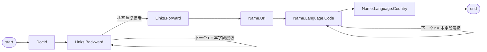

---
tags:
  - 分布式/计算
---

# Dremel

Dremel 是**只读嵌套数据的交互式分析查询系统**。它把两件事合在一起 —— **多级执行树**与**列式数据布局** —— 从而做到**在万亿行表上以秒级完成聚合查询**；系统能扩到**数千 CPU 与 PB 级数据**，在 Google 内部有**数千用户**。

它**不是 MapReduce 的替代品**，定位是互补：常用来分析 MapReduce 管道的输出，或者为更大的计算做快速原型。**2006 年起就在生产环境**，部署实例从几十节点到几千节点。

## 为什么需要它：交互式响应与原地数据

交互式响应时间在数据探索、监控、在线客服、快速原型、调试数据管道这些事上**带来的是质的差别**，不是量的差别。而在大尺度上做交互式分析需要很高的并行度，这里有两个规模账：

- **用当时的商用磁盘，1 秒读完 1 TB 压缩数据需要数万块磁盘**；
- **CPU 密集的查询可能需要数千个核才能在秒级完成**。

Google 的并行计算跑在共享的商用机器集群上，这个环境有几个必须正视的性质：集群里同时跑着大量分布式应用、负载差异很大、机器硬件参数各异；**一个 worker 执行某个任务可能比别的慢得多，也可能因为故障、或者被集群管理系统抢占而永远跑不完**。因此**对付掉队者与故障是拿到快速执行与容错的前提**。

另一个前提是数据形态：web 与科学计算里**数据常常是非关系型的**，编程语言的数据结构、分布式系统交换的消息、结构化文档，**天然适合用嵌套表示**；而**把它们规范化再在 web 规模上重组，通常是不可行的**。

Dremel 的答案有两个要素：

| 要素 | 内容 |
| --- | --- |
| **in situ（原地）** | 不搬数据，直接在所在的存储层上访问 —— 分布式文件系统（GFS）或别的存储层（Bigtable） |
| **不翻译** | 用类 SQL 的高层语言写 ad hoc 查询，**原生执行，不把它们翻译成 MapReduce job**（这是与 Pig、Hive 这类层的分别） |

"原地"这件事的价值值得说清：它**省掉了耗时很长的加载阶段** —— 而在分析型处理里，这个加载阶段正是数据库难以被用起来的主要原因之一，**往往可以跑上几十个 MapReduce 分析，一个 DBMS 还没把数据加载完、连一条查询都没执行**。附带的好处是文件系统里的数据可以用标准工具摆弄（搬到别的集群、改访问权限、按文件名圈出要分析的那一部分）。

它借鉴了三个已有想法：**分布式检索引擎里的 serving tree**（查询沿树下推、**每一层都重写一次**、结果靠聚合下层回包得到）、**类 SQL 的高层语言**、以及**列条纹（column-striped）存储表示**。列存用在平面关系数据上早已成功，但**没有被扩展到嵌套数据模型** —— 这正是 Dremel 的主要贡献所在。

它的使用场景很杂，一共列了 11 类：抓取到的 web 文档分析、Android Market 的应用安装数据跟踪、Google 产品的崩溃上报、Google Books 的 map 结果、垃圾内容分析、Google Maps 地图瓦片的调试、托管 Bigtable 实例的 tablet 迁移、分布式构建系统上的测试结果、几十万块磁盘的 I/O 统计、数据中心作业的资源监控、以及代码库里的符号与依赖关系。

## 数据模型：强类型嵌套记录

这个数据模型来自分布式系统的序列化需求（"Protocol Buffers"这个名字就是那么来的），在 Google 广泛使用，有开源实现。它基于**强类型的嵌套记录**，抽象语法是

$$\tau = \mathrm{dom} \;\mid\; \langle A_1: [\tau \mid ?], \dots, A_n: [\tau \mid ?] \rangle$$

其中 $\mathrm{dom}$ 是原子类型（整数、浮点、字符串等）。记录由一个或多个字段构成。**字段的"多重性"只有三种**：

| 标签 | 语义 |
| --- | --- |
| **repeated（$\ast$）** | 可以在记录里出现多次，解释为**值的列表** —— 因此**字段出现顺序是有意义的** |
| **optional（$?$）** | 可以从记录里缺失 |
| **required（无标签）** | 必须**恰好出现一次** |

举个例子，一个表示 web 文档的 `Document`：它有 required 的整数 `DocId`、optional 的 `Links`（里面是若干 `Forward` 与 `Backward` 条目，各自持有别的网页的 `DocId`）；一个文档可以有多个 `Name`（即引用它的不同 URL）；一个 `Name` 里是一个 `Code` 与 optional `Country` 配对构成的序列。

**字段构成一棵树的层级**，嵌套字段的完整路径用点号记法（如 `Name.Language.Code`）。

跨语言互操作靠一份**标准的二进制线格式：字段值按它们出现在记录里的顺序依次排布**。于是 Java 写的 MapReduce 程序可以消费由 C++ 库暴露的记录。这条互操作要求直接推出一个工程约束：**一旦记录以列式表示存储，"快速装配出记录"就变得很重要** —— 否则与 MapReduce 及其他数据处理工具的互操作会被拖垮。

## 嵌套列存：三个挑战

目标是**把某个字段的全部值连续存放**：这样读 `A.B.C` 就不必连带读 `A.E`、`A.B.D`。

```
记录式（行）：  [ DocId | Links | Name₁(Url, Lang) | Name₂(Url, Lang) ]  ← 读一个字段要穿过整行
                 ────────────────────────────────────────────────▶

列式（列条纹）：
   DocId:            d1      d2      d3  ...
   Links.Backward:   ...
   Links.Forward:    ...
   Name.Url:         u1      u2      u3  ...        ← 同一字段的值连续
   Name.Language.Code: ...
```

代价是**结构信息不能丢**。要解决三件事：**在列式格式里无损表达记录结构**、**编码要快**、**装配的代价要低**。

### repetition level 与 definition level

**光有值不足以表达结构。** 给两个来自重复字段的值，无法知道它们**在哪一层**发生了重复 —— 是两条不同记录里的两个值，还是同一条记录里的两个重复值。同理，给一个缺失的 optional 字段，也不知道**哪些外层记录是被显式定义过的**。

**repetition level** 回答前一个问题：它说明**在该字段的路径上，哪一个重复字段处发生了重复**。

以 `Name.Language.Code` 为例，它的路径里有**两个**重复字段（`Name` 与 `Language`），所以 repetition level 取值 0 到 2，其中 **0 表示一条新记录的开始**。自上而下扫描样本记录 $r_1$：

| 值 | 判断 | repetition level |
| --- | --- | --- |
| `en-us` | 还没遇到任何重复字段 | **0** |
| `en` | `Language` 发生了重复 | **2** |
| `en-gb` | 最近发生重复的是 `Name`（`Language` 在那之后只出现过一次） | **1** |

所以 `Code` 在 $r_1$ 里的三个值，repetition level 依次是 **0、2、1**。还有一处细节：$r_1$ 的**第二个 `Name` 里根本没有 `Code`**，为了把这个事实表达出来，**要在 `en` 与 `en-gb` 之间插入一个 NULL** —— 否则无从判断 `en-gb` 属于第三个 `Name` 而不是第二个。

**definition level** 回答后一个问题：路径 $p$ 上每个值（**尤其是每个 NULL**）都有一个 definition level，表示 $p$ 上那些**本来可能未定义**的字段（因为 optional 或 repeated）里**实际出现了几个**。三个例子都来自样本记录：

- $r_1$ **没有** `Backward` 链接，但 `Links` 字段**是定义了的**（在第 1 层）→ 为保住这个区别，往 `Links.Backward` 列里加一个 **definition level 为 1 的 NULL**；
- `Name.Language.Country` 在 $r_2$ 的缺失处，definition level 是 **1**；
- 同一个字段在 $r_1$ 的两处缺失，definition level 分别是 **2**（在 `Name.Language` 内）与 **1**（在 `Name` 内）。

**为什么用整数 definition level，而不是"是不是 NULL"的位**：这样**叶子字段（如 `Name.Language.Country`）的数据里就带着它那些父字段的出现情况**。后面讲记录装配时会用到这份信息。

这套编码**无损地保留了记录结构**。

### 编码形态

每个列存成**一组 block**，每个 block 里是 levels（repetition + definition）与压缩后的字段值。几处省法：

- **NULL 不显式存储** —— 由 definition level 决定：任何**小于"路径上 repeated 与 optional 字段总数"的 definition level 都表示 NULL**；
- **永远有定义的字段不存 definition level**；
- **repetition level 只在需要时存** —— 例如 definition level 为 0 蕴含 repetition level 为 0，后者可以省掉；
- 样本数据里 **`DocId` 这一个 level 都不存**。

levels **按位序列打包**，需要几位用几位 —— 例如最大 definition level 是 3 时，每个 definition level 用 **2 位**。

### 把记录拆成列

基础算法会**递归进记录结构**、为每个字段值算出 levels。一个不能忽略的事实：**字段值缺失时也照样要把 levels 算出来**。而 Google 的很多数据集**很稀疏** —— **schema 有几千个字段、某条记录只用到其中几百个，并不罕见** —— 所以缺失字段的处理必须尽量便宜。

做法是建一棵**与 schema 字段层级同构的 field writer 树**。核心思路：

> **field writer 只在自己有数据时被更新，不主动把父状态往树里传播。**

为此，**子 writer 从父那里继承 levels，并在有新值加入时与父的 levels 同步**。

### 记录装配：一台有限状态机

对面向记录的工具（例如 MapReduce）来说，**装配记录的代价是关键**。给定字段子集，目标是重建出"只含被选字段、其余字段都被剥掉"的原记录。

核心思路是造一台**有限状态机（FSM）**：它读各字段的值与 levels，**把值按顺序追加到输出记录上**。

- **一个 FSM 状态对应"为每个被选字段各配一个 field reader"**；
- **状态转移用 repetition level 打标签**；
- 某个 reader 取到一个值后，**看下一个 repetition level 决定接下来用哪个 reader**；
- **每条记录把 FSM 从 start 走到 end 一次**。



（示意，非原文原图。自环的含义是：**当下一个 repetition level 等于该字段自身的层级时，继续用同一个 reader**。）

**转移怎么构造**：设当前 field reader 为字段 $f$ 返回的下一个 repetition level 是 $l$。**在 schema 树里从 $f$ 出发，找到"在 level $l$ 处重复的那个祖先"，再选该祖先内部的第一个叶子字段 $n$**，就得到转移 $(f, l) \to n$。举例：$f = \texttt{Name.Language.Country}$ 读出 $l = 1$，它在 level 1 处重复的祖先是 `Name`，而 `Name` 的第一个叶子字段是 $\texttt{Name.Url}$。

**只取字段子集时，构造一台更简单的 FSM，执行也更便宜。**

一处容易被忽略的价值：这套编码与装配算法**保住了 `Country` 的外层结构** —— 对需要访问"第二个 `Name` 的第一个 `Language` 里的 `Country`"的应用来说这很重要，对应 XPath 里的 `/Name[2]/Language[1]/Country`。

## 查询语言

语言基于 SQL，并且是**面向"能在列式嵌套存储上以低代价实现"来设计的**。没有给出形式化定义，只展示风格。每个语句（以及它翻译成的代数算子）吃一到多个嵌套表及其 schema，产出一个嵌套表及其输出 schema；**字段用路径表达式引用**。示例查询同时做了投影、选择与记录内聚合 —— **它产生嵌套结果，尽管查询里没有任何"构造记录"的写法**。

三个算子的语义值得逐个记：

**选择（`WHERE`）—— 剪枝。** 把嵌套记录想成**一棵带标签的树**，每个标签对应一个字段名。**选择算子把不满足条件的树枝剪掉** —— 只有那些 `Name.Url` 有定义、且以 `http` 开头的嵌套记录被留下。

**投影 —— 层级由"最重复的输入字段"决定。** `SELECT` 里每个标量表达式**在与该表达式所用到的"最重复的输入字段"相同的嵌套层级上发射一个值**。所以字符串拼接表达式发射的 `Str` 值落在输入 schema 里 `Name.Language.Code` 的层级上。

**记录内聚合。** `COUNT` 在每个 `Name` 子记录**内部**做聚合，为每个 `Name` 发射 `Name.Language.Code` 的出现次数，类型是 64 位无符号整数。

语言还支持嵌套子查询、记录间与记录内聚合、top-k、join、用户定义函数。

## 查询执行

### serving tree 与查询重写

Dremel 用一棵**多级 serving tree** 执行查询：**root server 收到查询、读表的元数据、把查询路由到下一级**；叶子 server 与存储层通信，或者访问本地磁盘上的数据。

以一条聚合查询为例：

```sql
SELECT A, COUNT(B) FROM T GROUP BY A
```

root server 收到后先确定 $T$ 的全部 **tablet**（表的水平分区），把查询重写成：

```sql
SELECT A, SUM(c) FROM (R¹₁ UNION ALL ... R¹ₙ) GROUP BY A
```

其中

```sql
R¹ᵢ = SELECT A, COUNT(B) AS c FROM T¹ᵢ GROUP BY A
```

$T^i_1 \dots T^i_n$ 是**第 1 级 server $i$ 所处理的那些 tablet 构成的一个不相交分区**。**每一级 serving 层都做同样的重写**。最终查询抵达叶子，**并行扫描 $T$ 里的 tablet**；在回程上，**中间 server 对部分结果做并行聚合**。

这个模型的适用面要说清：它**很适合返回小到中等结果的聚合查询** —— 而这类正是交互式查询里非常常见的一种。**大聚合以及其他类别的查询，则需要借助并行 DBMS 与 MapReduce 里的那些机制。**

### query dispatcher：调度、容错、掉队者

Dremel 是**多用户系统**（通常同时有多条查询在跑）。query dispatcher **按优先级调度查询并做负载均衡**；它**另一个重要作用是容错** —— 应对"某个 server 变得比别的慢得多"或"某个 tablet 副本变得不可达"。

一个关键概念是 **slot**：**slot 就是叶子 server 上的一个执行线程**。举例换算：**3000 个叶子 server 各用 8 个线程 = 24,000 个 slot**；一张跨 10 万个 tablet 的表，可以按**每个 slot 分到约 5 个 tablet** 来处理。

调度侧的机制：

- 执行期间 dispatcher**统计 tablet 处理时间的直方图**；**某个 tablet 耗时明显离谱，就把它改派到另一台 server**；**有些 tablet 需要被改派多次**；
- 叶子 server 按列式表示读 **stripe**（数据条带）；stripe 里的 block **被异步预取**，**read-ahead 缓存通常能达到 95% 的命中率**；
- tablet 通常**三副本**；某个副本访问不到时**落到另一个副本**；
- dispatcher 认一个参数：**返回结果前必须扫过的 tablet 最小百分比**。把它调低 —— 例如**从 100% 调到 98%** —— 往往能**显著加快执行**，**副本因子小的时候尤其明显**。

### 服务器内部

每台 server 有一棵**内部执行树**，对应物理查询执行计划（含标量表达式的求值）。**多数标量函数会生成经过优化的、类型专用的代码。** 对 project-select-aggregate 类查询，执行计划是**一组以锁步（lockstep）方式扫描输入列的迭代器**，它们发射聚合与标量函数的结果、并**带上正确的 repetition 与 definition level** —— 也就是**执行期间完全绕过记录装配**。

另有一处取舍：**有些查询（如 top-k、count-distinct）用已知的单趟算法返回近似结果。**

## 实测

数据与条件：**未压缩、未复制的状态下这些数据集约占 1 PB**；所有表都是**三副本**（其中一张两副本）；**含 10 万到 80 万个大小不一的 tablet**。实验**在两个数据中心、与许多其他应用同跑、常规业务时段**进行；除非另作说明，执行时间是**五次运行的平均**；表名与字段名做了匿名化。

### 本地磁盘：列式 vs 记录式

对象是表 $T_1$ 的 **1 GB 片段（约 30 万行）**。在本地磁盘上，它以压缩列式表示占约 **375 MB**；记录式格式**用了更重的压缩，磁盘占用大致相同**。机器是**双核 Intel、磁盘读带宽 70 MB/s**。**所有时间都是冷读 —— 每次扫描前刷掉 OS cache。** 列式的每个数据点由 **30 次**运行平均得到，每次随机挑一组给定基数的列。

| 步骤 | 列式 | 记录式 |
| --- | --- | --- |
| 读 + 解压 | 图 (a) | 图 (d)：**大头花在解压上，压缩数据从磁盘读出来只占大约一半时间** |
| 装配嵌套记录 | 图 (b) 在 (a) 之上叠加 | —— |
| 解析成强类型 C++ 结构 | 图 (c) 再叠加 | 图 (e)：**解析在读 + 解压之上再加 50%** |

**记录式的这些开销是为所有字段付的，包括不需要的那些字段。**

三条结论：

- **只读少数列时，列式表示的收益大约是一个数量级**；
- **列式嵌套数据的检索时间随字段数线性增长**；
- **记录装配与解析都很贵，各自都可能让执行时间翻倍**。

还有一个实用的数：**记录式开始优于列式的交叉点，经验上常常落在"几十个字段"**，随数据集而变，也取决于是否需要做记录装配。

### MapReduce 与 Dremel 的对照

算 $T_1$ 里 `txtField` 字段的平均词数。MapReduce 用 Sawzall 写（两个累加器 `numRecs` 与 `numWords`，每条记录 `emit numWords <- CountWords(input.txtField)`，最后算 `numWords / numRecs`）；SQL 等价写法是

```sql
Q1: SELECT SUM(CountWords(txtField)) / COUNT(*) FROM T1
```

两个 MapReduce job 跑在 **3000 个 worker** 上；Dremel 用 **3000 节点**实例跑 $Q_1$。

| 配置 | 读入的压缩数据 |
| --- | --- |
| MapReduce on records | **87 TB** |
| MapReduce on columns / Dremel | **约 0.5 TB** |

（图 10 的说明是:3000 节点、**850 亿条记录**。）

由此得到两级台阶：**MapReduce 从记录式换到列式，效率提升一个数量级 —— 从小时级到分钟级；再换成 Dremel，又提升一个数量级 —— 从分钟级到秒级。**

### serving tree 的层数：多分组聚合才吃这一层

两条 `GROUP BY` 查询，各自只扫一遍数据。表 $T_2$ 有 **240 亿条嵌套记录**，每条记录有一个重复字段 `item` 含数值 `amount`；**`item.amount` 在数据集里重复了约 400 亿次**。

```sql
Q2: SELECT country, SUM(item.amount) FROM T2 GROUP BY country
```

$Q_2$ 返回**几百条记录**，读约 **60 GB** 压缩数据。

```sql
Q3: SELECT domain, SUM(item.amount) FROM T2
     WHERE domain CONTAINS '.net' GROUP BY domain
```

$Q_3$ 读约 **180 GB**，产出约 **110 万个不同的 domain**。

三种拓扑下叶子 server 数固定为 **2900**（这样累计扫描速度可比）：**2 级 = 1:2900**、**3 级 = 1:100:2900**、**4 级 = 1:10:100:2900**。

| 查询 | 结果 |
| --- | --- |
| **$Q_2$（分组少）** | **3 级时 3 秒**；再加一层**收益不大** |
| **$Q_3$（分组多）** | 层数增加让执行时间**减半**；**2 级时根本画不进图** —— root server 不得不**近乎顺序地**聚合来自数千节点的结果 |

**结论：返回大量分组的聚合能从多级 serving tree 里获益。**

再往下一层看**每 tablet 的耗时直方图**：计时从"tablet 被调度到某个可用 slot"开始，**不含在作业队列里的等待** —— 这样能把其他并发查询的影响排除掉。**$Q_2$（或 $Q_3$）有 99% 的 tablet 在一秒（或两秒）内处理完。**

### 记录内聚合能省多少

$Q_4$ 在表 $T_3$ 上统计"记录内 `a.b.c.d` 之和大于 `a.b.p.q.r` 之和"的记录数，这些字段在**不同的嵌套层级**上重复：

```sql
Q4: SELECT COUNT(c1 > c2) FROM (
      SELECT SUM(a.b.c.d) WITHIN RECORD AS c1,
             SUM(a.b.p.q.r) WITHIN RECORD AS c2
      FROM T3)
```

**因为列条纹化，只从磁盘读了 13 GB —— 而 $T_3$ 总共 70 TB —— 查询 15 秒完成。** 若不支持嵌套，这个查询在 $T_3$ 上会贵得离谱。

### 可扩展性

$Q_5$ 在 $T_4$ 上取 top-20 的 `aid` 及其出现次数，**扫描 4.2 TB** 压缩数据，用 **1000 到 4000 节点**四种配置：

```sql
Q5: SELECT TOP(aid, 20), COUNT(*) FROM T4
     WHERE bid = {value1} AND cid = {value2}
```

**每次运行消耗的总 CPU 时间几乎相同，约 30 万秒**，而**用户感知的时间随系统规模接近线性下降**。这个结果的读法是：**更大的系统在资源使用上可以和小系统一样有效，同时允许更快的执行。**

### 掉队者

$Q_6$ 在万亿行的 $T_5$ 上跑。与别的数据集不同，**$T_5$ 是两副本** —— 于是**改派工作的机会更少，掉队者拖慢执行的可能性更高**：

```sql
Q6: SELECT COUNT(DISTINCT a) FROM T5
```

它读**超过 1 TB** 压缩数据，被检索字段的压缩比约 **10**。**99% 的 tablet 每 tablet 每 slot 处理时间在 5 秒以内**；但**一小部分 tablet 慢得多，把查询响应时间从不到一分钟拖到好几分钟**（2500 节点系统）。

## 观察小结

规模锚点先摆出来：**Dremel 每月扫过的记录数达到千万亿条（quadrillions）**；在典型月度负载里，**大多数查询在 10 秒内处理完，稳稳落在交互式范围内**；**有些查询在共享集群上做到接近每秒 1000 亿条记录的扫描吞吐**，在专用机器上更高。

八条观察：

1. **基于扫描的查询可以在磁盘驻留、多达万亿条记录的数据集上以交互速度执行**；
2. 对**数千节点**的系统，**在列数与 server 数上的近线性扩展是可以做到的**；
3. **MapReduce 能像 DBMS 一样从列式存储里获益**；
4. **记录装配与解析很贵** —— **查询处理层之外的软件层需要被优化到能直接消费列式数据**；
5. MapReduce 与查询处理是互补的：**一层的输出可以喂另一层的输入**；
6. 在多用户环境里，**更大的系统既有规模经济，又给出质上更好的用户体验**；
7. 如果接受用速度换精度，**查询可以提前很多就终止，却已经看到了大部分数据**；
8. **web 规模数据集的大部分能很快扫完；但要在一个紧的时间界内拿到最后几个百分点，很难。**

最后一个规模指标：**Dremel 的代码库很紧凑 —— 不到 10 万行 C++、Java、Python。**

## 与相关工作的边界

与 MapReduce 一样，Dremel 提供**容错执行、可表达嵌套的数据模型、以及原地数据处理**。差别在取向：MapReduce 面向**长时间运行的批处理作业**，Dremel 强调两者**互补**而非替代。MapReduce 的成功带来了第三方实现（尤其是开源的 Hadoop），以及一批"并行 DBMS + MapReduce"的混合系统（Aster、Cloudera、Greenplum、Vertica 这些厂商的产品，HadoopDB 是其中的研究系统）。

两处它明确指出的空白：

- **哪怕是并行 DBMS，也没有公开发表的工作或行业报告尝试把它扩到数千节点**；
- **也没有先前文献研究过"MapReduce + 列式存储"**。

列式表示本身建立在几十年前的两个想法上：**把结构与内容分离**、**用转置表示**。与 XML 存储路线的比较值得记：XML 方案同样试图分离结构与内容，但**因为 XML 数据模型自身的自由度而面临更多挑战**；而 **XMill 是个压缩工具 —— 它把结构对所有字段合并在一起存，不适于按列做选择性检索**。

数据模型是复杂值模型与嵌套关系模型的一个变体。查询语言则建立在 1989 年的一项工作之上：**那个语言在访问嵌套数据时避免重构**；相比之下 XQuery 与面向对象查询语言**通常需要重构**（用嵌套 for 循环和构造器）。**那项工作没有已知的实际实现。** 其他可比的并行数据处理系统还有 Scope、DryadLINQ；Pig 是较近的一个作用于嵌套数据的类 SQL 语言。

## 相关

- [[01-GFS|GFS]] —— **in situ 的第一层**：列式格式就落在 GFS 上，GFS 用副本对抗坏硬件、并在有掉队者时维持响应时间。"省掉加载阶段"这个论点正是建立在这类存储层之上的
- [[02-Bigtable|Bigtable]] —— 另一个 in situ 访问对象；Dremel 的列式嵌套格式与 Bigtable 的列族是同一时期对"按列组织数据"的两种不同取舍（一个为扫描与聚合，一个为在线随机读写）
- [[01-RDD|RDD]] —— 同一时期针对"**读得更少**"的另一条路线。RDD 靠**内存驻留 + 血统**避开磁盘 I/O 与反序列化；Dremel 靠**列裁剪**绕过不需要的字段。两者都把"反序列化与装配很贵"当成主要敌人，也都因此选择了**绕过记录装配**（RDD 直接存 Java 对象，Dremel 用 levels 直接算聚合）
- [[02-Pregel|Pregel]] —— 同为"在 MapReduce 之外为特定计算形态造的专用系统"，但关注点正交：Pregel 处理**迭代式图计算与拓扑变更**，Dremel 处理**只读分析查询的列裁剪**；两篇的实测章恰好构成一组对照（Pregel 讲图规模与 worker 数的扩展，Dremel 讲列数与 server 数上的近线性扩展）

## 参考

- S. Melnik, A. Gubarev, J. J. Long, G. Romer, S. Shivakumar, M. Tolton, T. Vassilakis. *Dremel: Interactive Analysis of Web-Scale Datasets*. VLDB 2010.
