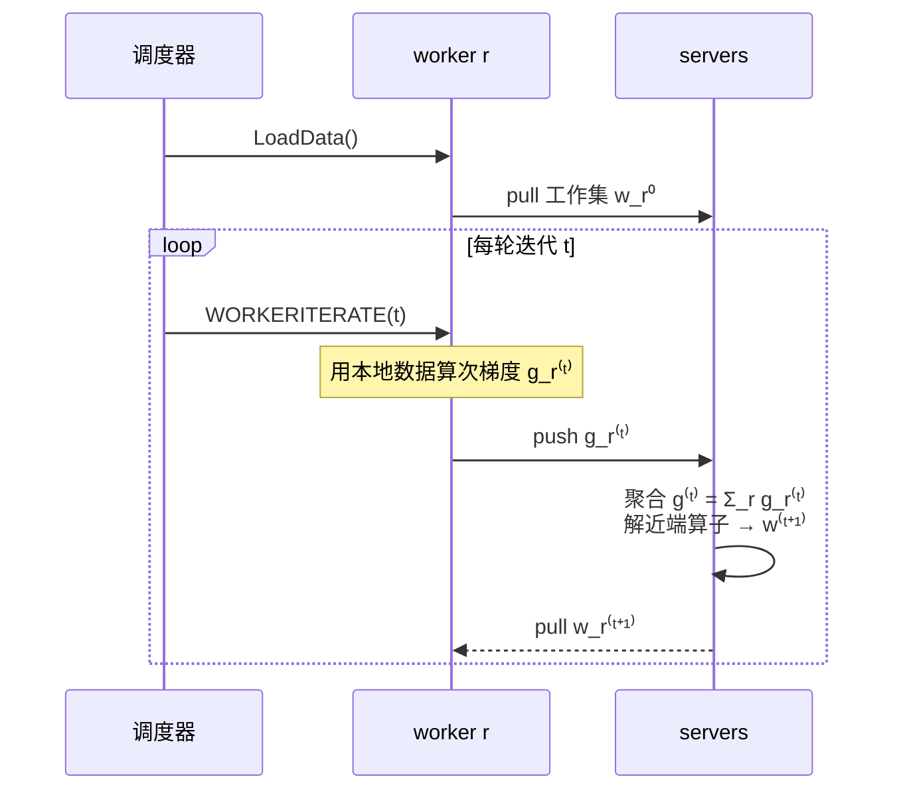

---
tags:
  - 分布式/计算
---

# 参数服务器（Parameter Server）

参数服务器是**分布式机器学习的参数共享框架**。分工很直白：**worker 节点分担数据与计算，server 节点维护全局共享的参数**，参数以稠密或稀疏的向量与矩阵表示。框架负责节点之间的**异步数据通信**，并支持**可调的一致性模型、弹性伸缩与持续容错**。

它的实测规模到**数 PB 真实数据、数十亿样本与参数**，覆盖从稀疏逻辑回归到 LDA 与分布式 sketch 的任务。这篇是**第三代开源实现**，关注点是分布式推断的**系统侧**，而不是算法侧。

## 为什么需要它

分布式优化与推断已经成为大规模机器学习的前置条件：单机不可能足够快地求解这类问题，原因是数据增长与随之而来的模型复杂度提升 —— 后者常表现为**参数数量的增加**。现实中的训练数据在 **1 TB 到 1 PB** 之间，能支撑**参数规模 $10^9$ 以上**的复杂模型。

> [!warning] 数字存疑
> 这一句的指数上标在 PDF 抽取时丢失（只剩 `10⁹ to 10^?`），**上界没有可核对的来源**，所以这里只保留能核到的下界 $10^9$。摘要里的口径是"数十亿样本与参数（billions of examples and parameters）"。

这些模型**被所有 worker 全局共享**，而 worker 在做计算、改进模型时要**频繁访问**这些共享参数。共享带来三个挑战：

- **访问参数需要极大的网络带宽**；
- **许多机器学习算法是顺序的** —— 由此产生的屏障，在同步开销与机器延迟都高的时候会损害性能；
- **规模化下容错是必需的** —— 学习任务常在云环境里跑，机器可能不可靠、作业可能被抢占。

第三条有一份量化的日志佐证。下面是某大型互联网公司一个集群三个月内**批量机器学习作业**的统计：

| 机器数 × 时间 | 作业数 | 失败率 |
| --- | --- | --- |
| 100 机时 | 13,187 | **7.8%** |
| 1,000 机时 | 1,366 | **13.7%** |
| 10,000 机时 | 77 | **24.7%** |

失败的主因是**被抢占、或在缺少必要容错机制的情况下丢掉机器**。研究环境里作业往往独占集群、没有竞争，**而在真实部署里容错是必需品**。

## 三代参数服务器：它要克服什么

| 代 | 代表 | 做法与局限 |
| --- | --- | --- |
| **第一代** | 原始的参数服务器 | 把 **memcached** 拿来当分布式的 (key,value) 同步机制 —— **既缺可调性也缺性能** |
| **第二代** | YahooLDA、Distbelief | 换成**专用服务器**，提供**用户可定义的更新原语（set / get / update）**与更讲究的负载分配；但都是**应用专用**的 |
| **第三代** | 本文 | 通用平台。Petuum 迈出过第一步 —— 在 YahooLDA 之上加**有界延迟模型**，但**对 worker 的线程模型加了更多约束**；本系统去掉这些限制 |

它和通用分布式系统之间的边界也交代得很清楚：

- **Mahout（Hadoop）与 MLI（Spark）** 走迭代式 MapReduce。共同的问题是**强制同步的迭代通信** —— 扩到几十个节点还行，规模一大，"某个节点跑得慢"的概率上升就变成问题。**Spark 与 MLI 的关键洞见是跨迭代保留状态，而这正是参数服务器的核心目标之一**。
- **GraphLab** 用图抽象异步调度通信，但它**缺弹性伸缩**、**依赖粗粒度快照做恢复**（两者都妨碍扩展），而且**缺"全局变量同步"这个一等原语**。**参数服务器的一个核心目标，就是拿到 GraphLab 的异步好处而不带它的结构性限制。**
- **Piccolo** 用了相近的策略（worker 先在本地预聚合，再把更新发给保存聚合状态的服务器），因此大体上是本系统功能的**子集** —— 它缺**消息压缩、复制、以及用依赖图表达的变量一致性模型**。

再看一张横向对照：**在一致性上本系统给出的自由度最大，是唯一提供持续容错的**，而原生的（稀疏）向量/矩阵数据类型让它在数据分析场景里更友好。

## 五个自述的设计特征

1. **通信开销低** —— 异步通信模型**不阻塞计算（除非显式要求）**，并针对机器学习任务做过削减流量与开销的优化；
2. **一致性模型可调** —— 松弛一致性进一步把同步开销与延迟藏起来。**由算法设计者在"算法收敛速度"与"系统效率"之间取舍**，而最优权衡取决于数据、算法与硬件；
3. **弹性伸缩** —— 加节点**不需要重启**运行中的框架；
4. **容错与持久性** —— **1 秒内**从非灾难性机器故障中恢复，**不打断计算**；**向量时钟**保证网络分区与故障之后行为有定义；
5. **易用** —— 全局共享参数就是（可稀疏的）向量与矩阵，线性代数数据类型自带高性能多线程库。

这里的方法论值得单独说一句：**新颖性来自"协同"** —— 挑对系统技术、把它们适配到机器学习算法上，**再反过来把机器学习算法改成对系统更友好**。具体说，**一批本来很难满足的系统约束可以被放松，因为对应的机器学习算法对扰动相当容忍**。后面几乎所有设计取舍都能追到这一条前提上。

## 两个工程挑战

### 通信：为什么不能直接用键值存储

参数当然可以当成传统键值存储里的键值对来更新，但**朴素地用这个抽象是低效的**：**值通常很小（float 或 int），而把每条更新当作一次键值操作发出去，开销很高**。

改进来自一个观察：**许多学习算法把参数表示为结构化的数学对象**（向量、矩阵、张量），而**在每个逻辑时刻（或一次迭代）通常只更新对象的一部分** —— worker 通常发的是**一个向量的一个区段，或矩阵的一整行**。于是就可以**把"更新的通信"和"参数服务器上的处理"一起做批处理**，并让**一致性跟踪得以低成本实现**。

### 容错：不能重启长时间运行的计算

- **服务器之间对参数做在线复制，支持热故障切换**；
- **故障切换与自修复反过来支持动态伸缩** —— 把"移除机器"当作**故障**、"加入机器"当作**修复**。

## 机器学习侧：两类算法与"工作集"

### 风险最小化

训练数据有 $n$ 条样本，$x_i$ 是第 $i$ 条，常是长度为 $d$ 的向量；**$n$ 与 $d$ 都可能到数十亿乃至数万亿量级**。很多情况下每条样本带一个标签 $y_i$（广告点击预测里，$y_i$ 可以是 1 表示"点击"、−1 表示"未点击"）。模型由参数 $w$ 构成，预测就是 $x^\top w = \sum_{j=1}^{d} x_j w_j$，再按符号决定。

**正则化风险最小化**要找的是在模型复杂度与训练误差之间平衡的模型 —— 最小化"预测误差的损失 $\phi(x,y,w)$"与"惩罚复杂度的正则项 $\Psi[w]$"之和：

$$F(w) = \sum_{i=1}^{n} \phi(x_i, y_i, w) + \Psi(w)$$

具体的损失与正则函数对预测性能重要，**但对本文的目的相对不重要** —— 所给算法适用于主流的损失与正则。

数据量与模型规模之间有一条需要记的关系：**更精细的模型能提升准确率，但只到某一点** —— 训练数据太少时，高度精细的模型会**过拟合**，退化成"逐条记住训练集"的系统；模型太小则抓不住对判断重要的属性。

### 分布式次梯度下降（算法 1）

这是用来把机制讲清楚的最简模型。三个角色：**调度器**、**worker**、**server**。

```
任务调度器:  LoadData() → 所有 worker；for t = 0…T: WORKERITERATE(t) → 所有 worker

worker r:  LoadData()         载入自己那份训练数据 {y_ik, x_ik}
                              pull 工作集 w_r^(0)          ← 只取自己需要的那部分
           WORKERITERATE(t)   算本地次梯度 g_r^(t) = Σ_k ∂φ(x_ik, y_ik, w_r^(t))
                              push g_r^(t) → servers
                              pull w_r^(t+1)               ← 取回更新后的权重

servers:   SERVERITERATE(t)   聚合 g^(t) = Σ_r g_r^(t)
                              w^(t+1) ← w^(t) − η( g^(t) + ∂Ψ(w^(t)) )
```



最贵的一步是算次梯度，它被分摊到所有 worker 上。而 worker 算 $w^\top x_{ik}$ 这件事，在 $w$ 维度极高时本来是不可行的 —— 转折点在于一条判据：

> **一个 worker 需要知道 $w$ 的某个坐标，当且仅当它的部分训练数据引用了那个条目。**

举例：广告点击预测里的关键特征是广告中的词。如果只有极少数广告包含 "OSDI 2014" 这个短语，那么**多数 worker 根本不会为 $w$ 里对应的那个条目产生更新，也就不需要它**。

于是：**$w$ 的总大小可以超过单机容量，但某个 worker 需要的工作集能轻松缓存在本地。** 实测这个工作集有多小：

| worker 数 | 每个 worker 需要的参数占比 |
| --- | --- |
| 100 | **7.8%** |
| 10,000 | **0.15%** |

**把这段伪代码里每一步的代价摆出来**，"最贵的一步被分摊"这句话才具体：

| 步骤 | 代价由什么决定 | 频率 |
| --- | --- | --- |
| `LoadData()` | 分配给该 worker 的数据量 | 一次 |
| `pull` 工作集 | **该 worker 的参数占比**（实测 7.8% ~ 0.15%） | 每轮 |
| 算本地次梯度 | 该 worker 的数据量 × 其特征数 | **每轮，且是最贵的一步** |
| `push` 梯度 | 梯度的稀疏度（KKT 过滤器后可能极稀） | 每轮 |
| server 聚合 + 解近端算子 | worker 数 × 每份梯度的大小 | 每轮 |
| `pull` 新权重 | 与工作集同量级 | 每轮 |

**"最贵的一步被分摊到所有 worker 上"这句能成立，靠的正是前面那条工作集判据** —— 每个 worker 只碰自己的数据引用到的那些参数，于是梯度计算可以按数据划分来均分。**如果工作集判据不成立，均分就无从谈起**，这一步会退化成"每个 worker 都要过一遍全量参数"。

**两处容易混的地方：**

- `pull w_r^(t+1)` 取回的是**更新后的权重**，而不是别人算出的梯度 —— **worker 拿不到其他 worker 的梯度**，这与"worker 之间不通信"是同一件事的两种说法；
- 真实的实现（实测用的那个算法）与这段伪代码有四处不同：**每次只更新一个参数块**（块坐标更新）、worker 同时算梯度与二阶导数的对角部分、**server 自己要解一个近端算子**而不是只做步长缩放、以及用有界延迟加 KKT 过滤。**前面三处都在把计算往 server 挪，第四处才是通信侧的优化。**

### 生成模型

第二大类问题里**标签未知**，所以要无监督算法来捕捉数据的内在结构。典型是主题模型：给定一批文档，推断每篇文档包含哪些主题（拿 SOSP'13 的会刊跑一遍，可能得到"分布式系统""机器学习""性能"这类主题）。**主题是从文档内容本身推断出来的，不是外部给的主题表。** 实际规模很大：**数亿用户、数十亿文档**。

有一个历史判断值得记：**这些算法只有在第一代参数服务器出现之后，才具备商业可行性。**

主题模型的关键挑战是：**描述"文档当前被估计成如何生成"的那些参数必须被共享。** LDA 的学习算法与算法 1 结构很像，**区别在于更新步的产出是"这篇文档能被当前模型解释得多好"的估计，而不是一个梯度**。这个计算需要**每篇文档的辅助元数据，且每次访问该文档都要更新它**；由于文档数量太大，**这份元数据通常在处理文档时读写磁盘**。辅助数据是"文档里每个词被指派到的主题集合"，而学习的参数 $w$ 是**词的相对出现频率**。

每个 worker 只需要存"它处理的那批文档里出现过的词"对应的参数 —— 于是效果与前一节相同：**能处理比单个 worker 所能容纳的大得多的模型**。

## 系统架构

一个实例可以**同时跑多个算法**。节点分成**一个 server group** 与**若干 worker group**：

```
                      ┌──────────────────┐
                      │  server manager  │  维护服务器元数据的一致视图
                      └────────┬─────────┘  （节点存活、参数分区归属）
                               │
              ┌────────────────┴────────────────┐
              │         server group            │  server 之间复制 / 迁移参数
              │  ┌────────┐ ┌────────┐ ┌──────┐ │  （为可靠性与扩展）
              │  │server 1│ │server 2│ │ ...  │ │  每个节点持有一个参数分区
              │  └────────┘ └────────┘ └──────┘ │
              └───────▲──────────────▲──────────┘
                      │  push / pull │   （worker 只与 server 通信，彼此不通信）
        ┌─────────────┴──┐        ┌──┴─────────────┐
        │ worker group 1 │        │ worker group 2 │   每个 group 跑一个应用
        │  ┌──────────┐  │        │  ┌──────────┐  │
        │  │scheduler │  │        │  │scheduler │  │   分配任务、监控进度
        │  └──────────┘  │        │  └──────────┘  │   worker 增减时重排未完成任务
        │   worker × N   │        │   worker × M   │
        └────────────────┘        └────────────────┘
```

几处结构性的决定：

- **server 节点维护全局共享参数的"一个分区"**，server 之间通信是为了**复制和/或迁移参数**；
- **worker 通常在本地存一部分训练数据**以算本地统计量（例如梯度）；
- **worker 只与 server 通信、彼此不通信**；
- **支持独立的参数命名空间** —— 一个 worker group 可以把自己的共享参数与别人隔离；反过来，多个 worker group 也可以共享同一个命名空间（例如用多个 group 解同一个深度学习应用以提高并行度）。另一个例子是：**模型正被某些节点查询（在线服务在消费它），同时另一个 worker group 正用新到达的训练数据更新它**。

**"worker 只与 server 通信、彼此不通信"这条约束推出的后果比看上去多**：

| 后果 | 说明 |
| --- | --- |
| **一次迭代里没有 worker 需要等另一个 worker** | 唯一的同步来自 server 侧的聚合 —— 这是"松弛一致性"能被做出来的结构前提 |
| **梯度平均必须由 server 做** | 于是 server 的 CPU 也要参与计算，而不只是存数据 —— 这正是"server 上可以跑用户定义函数"的来源 |
| **跨 worker 的数据交换走两跳** | worker → server → worker，而不只是一跳；但 PS 模型要的恰好是"先聚合再分发"，两跳就是语义本身 |
| **worker 数可以单独伸缩** | 因为没有 worker 之间的成对状态，加减一个 worker 不需要和其他 worker 协商 |

**调度器与 server manager 是两件事，分给两个组件管**：调度器管**任务的分配与进度**（worker 增减时重排未完成任务），server manager 管**节点存活与参数分区归属**（维护服务器元数据的一致视图）。分开的理由是它们的频率不同 —— 前者的变更随作业进度发生，后者的变更随节点进出发生。

**命名空间这一层自由度带来三种典型共存方式**，值得列出来，因为它决定了"一套集群能同时干几件事"：

- **隔离**：一个 worker group 把自己的共享参数与别人隔开，互不可见；
- **共享以提并行度**：多个 worker group 指向同一命名空间，一起解同一个深度学习应用；
- **读写分工**：**模型正被某些节点查询（在线服务在消费它），同时另一个 group 正在用新到达的训练数据更新它** —— 这是参数服务器与传统批处理最不一样的一处用法。

### (key,value) 向量：加上线性代数语义

模型表示为一组 (key,value) 对：风险最小化里这个对是**特征 ID 与它的权重**；LDA 里是**词 ID 与主题 ID 的组合，加一个计数**。

**改进点在于承认这些键值项的底层含义 —— 机器学习算法通常把模型当作线性代数对象。** 于是系统提供同样的功能，但支持一批优化过的操作：**向量加法 $w+u$、矩阵乘 $Xw$、求 2-范数 $\|w\|_2$** 之类。为支撑这些，**假设键是有序的**，于是参数作为 (key,value) 对同时被赋予**向量与矩阵语义，其中不存在的键关联到零**。

收益有两层：降低实现优化算法的编程量；**并且因为能利用 BLAS、LAPACK、ATLAS 这类面向 CPU 优化的多线程自调优线性代数库，代码本身也变快**。

### range push 与 range pull

数据通过 **push** 与 **pull** 发送。算法 1 里 worker push 整个本地梯度、再 pull 更新的权重；更高级的算法则**每次只通信一个键的区间**。接口就是范围的：

- **`w.push(R, dest)`** 把 $w$ 在**键区间 $R$ 内的所有存在条目**发给目的地；目的地可以是某个节点，也可以是"服务器组"这样的**节点组**；
- **`w.pull(R, dest)`** 从目的地读回 $R$ 内所有存在的条目；
- **把 $R$ 设为整个键区间就通信整个向量；设为单个键就只发一个条目。**

这个接口还能扩展到**通信任何与 $w$ 共享同一套键的本地数据结构**。例子：worker 要把本地梯度 $g$ push 上去做聚合，一种做法是让 $g$ 全局共享，但**注意 $g$ 与 worker 的工作集 $w$ 共享键** —— 于是可以直接写 `w.push(R, g, dest)`，既省内存又享受到后面那些优化。

### 服务器上的用户定义函数

**server 节点除了聚合数据，还能执行用户定义函数。** 这有实际好处：**server 节点往往对共享参数有更完整或更新的信息**。三个例子：算法 1 里 server 求正则项 $\Psi$ 的次梯度来更新 $w$；算法 3 里 server 要**解一个更复杂的近端算子**；在 sketch 场景里，**几乎所有操作都发生在 server 侧**。

### 异步任务与依赖

任务是**通过 RPC 发出**的：可以是 worker 发给 server 的 push / pull，也可以是调度器发给任意节点的用户定义函数。一个任务可以包含任意多个**子任务**（算法 1 里的 `WorkerIterate` 就含一次 push 加一次 pull）。

异步的语义有两端各自明确的判据：

- **调用方发出任务后可以立即继续计算**；它**只有在收到被调用方的回复时**才把任务标记为完成 —— 回复可以是用户定义函数的返回值、pull 请求到的 (key,value) 对、或一个空确认；
- **被调用方只有在该调用返回、且它发出的所有子任务都完成时**才算任务完成；
- **默认被调用方并行执行任务**以求性能；调用方若要串行化，就加一条 **execute-after-finished 依赖**。

依赖有**两个**用途。第一个是表达算法逻辑：算法 1 的 `ServerIterate` 只有在所有 worker 的梯度都聚合完之后才更新 $w$ —— 实现方式是让"更新任务"依赖所有 worker 的 push 任务。**第二个、也是更重要的用途，是支撑可调的一致性模型。**

### 一致性可调：三种模型

独立任务通过并行使用 CPU、磁盘与网络带宽提升系统效率，**但可能造成节点之间的数据不一致**：worker $r$ 在 $w^{(11)}$ 被 pull 回来之前就开始第 11 轮，于是它用的是旧的 $w_r^{(10)}$，得到与第 10 轮相同的梯度 $g_r^{(11)} = g_r^{(10)}$ —— 这种不一致**可能拖慢收敛进度**。

**但有些算法对这类不一致不那么敏感。** 算法 3 每次只更新 $w$ 的一个**区段**，所以不等第 10 轮结束就开始第 11 轮，只会让**一部分 $w$ 不一致**。

最优权衡取决于三类因素：**算法对数据不一致的敏感度、训练数据里的特征相关性、以及硬件组件之间的能力差异**。系统不替用户固定一种依赖，而是把定义一致性模型的自由度交给算法设计者 —— 这里明确写着这是**与其他机器学习系统的一个实质性差别**。

```
Sequential（顺序一致）    t0 ─▶ t1 ─▶ t2        任务逐个执行，结果与单线程实现完全相同
                                                 也叫 Bulk Synchronous Processing

Eventual（最终一致）      t0 ┐
                          t1 ├─ 同时开始
                          t2 ┘                  只在底层算法对延迟足够鲁棒时才推荐

Bounded delay（有界延迟） t0 ─▶ t1 ─▶ t2 ─▶ t3   新任务被阻塞，直到 σ 时间之前的所有任务完成
                          └──── σ = 2 ────┘      σ=0 即顺序一致性；σ=∞ 即最终一致性
```

**依赖图可以是动态的** —— 例如调度器可以按运行时进展增减最大延迟，以平衡系统效率与收敛速度；这种情况下调用方需要**遍历 DAG**。**若图是静态的，调用方可以把全部任务连同 DAG 一起发给被调用方，以减少同步开销。**

### 用户定义过滤器：在任务内部做细粒度一致性

与基于调度器的流控互补，系统**支持用户定义的过滤器来有选择地同步单个 (key,value) 对**，从而在**一个任务内部**做细粒度的数据一致性控制。

**洞见是：优化算法本身通常就掌握"哪些参数最值得同步"的信息。** 两个例子：

- **significantly modified filter** —— 只 push 那些自上次同步以来变化超过阈值的条目；
- **KKT 过滤器** —— 利用优化问题的**最优性条件**，worker **只 push 那些可能影响服务器上权重的梯度**。形式化：特征 $k$ 被过滤的条件是 $w_k = 0$ 且 $|\Delta g_k| \le \Delta$，其中 $\Delta g_k$ 是 worker 基于**本地信息**对全局梯度的估计，$\Delta > 0$ 是用户定义的参数。

## 实现

server 用**一致性哈希**存参数；为容错，条目用**链式复制**复制。与既往 (key,value) 系统的差别在于：**针对基于区间的通信做了优化，并对数据与"基于区间的向量时钟"都做压缩**。

### 向量时钟与它为什么能被压缩

由于任务依赖图可能很复杂、且需要快速恢复，**每个 (key,value) 对都关联一个向量时钟，记录每个节点在这个对上的时间**。它便于**跟踪聚合状态、或者拒绝被重复发送的数据**。

**朴素的向量时钟需要 $O(nm)$ 空间**（$n$ 个节点、$m$ 个参数）—— 几千节点加几十亿参数，内存与带宽上都不可行。转折点又是一个由通信模式带来的性质：

> **由于基于区间的通信模式，许多参数共享同一个时间戳** —— 一个节点 push 一个区间里的参数时，与它相关的那些参数的时间戳很可能是同一个。

于是可以压缩成一个**区间向量时钟**：给定键区间 $R$，$\mathrm{vc}_i(R) = t$ 表示 $\forall k \in R$，$\mathrm{vc}_i(k) = t$。初始时每个节点只有一个区间向量时钟，覆盖整个键空间、初值 0；每次区间集合的切分会**最多产生 3 个新的向量时钟**。设算法通信过的不同区间总数为 $k$，则**最多 $O(mk)$ 个向量时钟**，而 **$k$ 通常远小于参数总数**，空间因此显著下降。

### 消息格式与两处压缩

一条消息 = **区间 $R$ 内的 (key,value) 列表 + 关联的区间向量时钟**。这个格式**不只用于共享参数，也用于任务** —— 对任务而言，一个 (key,value) 对可以是 **(task ID, 参数或返回结果)**。

两条细节：消息可以只携带 $R$ 内**可用键的一个子集**，此时**缺失的键被赋予同一个时间戳、而不改变它们的值**；**消息可以按键区间切分**，发生在 worker 发给整个 server group、或接收节点的键归属发生变化时。

机器学习问题通常需要高带宽，所以消息压缩很有必要。两处都能省：

| 省法 | 依据 |
| --- | --- |
| **键缓存** | **训练数据在迭代之间往往不变，worker 可能重复发同样的键列表** → 接收节点缓存键列表，发送方之后**只发这个列表的哈希** |
| **值压缩（只发非零对）** | **值里可能有很多零** —— 稀疏逻辑回归里大部分参数不变；用户定义的过滤器也可能把很大比例的值归零。用 **Snappy** 压缩库**有效地把零去掉** |

**键缓存与值压缩可以同时使用。**

### 一致性哈希

键与 server 节点 ID 都插进哈希环：**每个 server 管理"从它的插入点到逆时针方向下一个节点之间"的键区间**，这个节点是该区间的 **master**。**一台物理机通常用多个"虚拟服务器"表示在环上**，以改善负载均衡与恢复。

管理上用**直接映射的 DHT 设计**简化：**server manager 负责环管理，其他所有节点在本地缓存键分区** —— 于是它们能直接判断哪个 server 负责某个键区间，并会被通知变更。

### "聚合后再复制"

**每个 server 节点保存它自己拥有的键区间之外、逆时针 $k$ 个邻居区间的副本**；持有副本的节点是相应区间的 **slave**（$k=2$ 时，server 1 复制 server 2 与 3 的区间）。

**worker 的 push 与 pull 都只与区间的 master 通信**；master 上的任何修改连同时间戳被复制到 slave，而且**修改是同步推送**的：worker 1 把 $x$ push 到 server 1，server 1 调用用户定义函数 $f$ 修改共享数据，**这个 push 任务只有在 $f(x)$ 被复制到 slave 之后才算完成**。

**朴素复制会把网络流量放大 $k$ 倍**，这对依赖高带宽的机器学习应用不利。框架因此允许一个重要优化 —— **聚合后再复制**：

```
朴素复制：  W1 ──x──▶ S1 ──f(x)──▶ S2     每来一个更新就复制一次
                     （流量 × k）

聚合后复制：W1 ──x──┐
                   ├─▶ S1  先聚合成 x+y，再施加 f(x+y)，最后复制
            W2 ──y──┘     （流量只用了 k/n）
```

server 常常本来就要聚合来自 worker 的数据（例如累加本地梯度），所以**把复制推迟到聚合完成之后**是自然的。**有 $n$ 个 worker 时，复制只用了 $k/n$ 的带宽**；而 **$k$ 通常是个小常数，$n$ 是几百到几千**。代价是**聚合增加了任务回复的延迟，但它可以被松弛一致性条件藏起来**。

### 节点增减

**server 加入**分三步：

1. **server manager 给新节点分配一个键区间作为 master** —— 这可能引起另一个键区间切分，或从被终止的节点那里移走；
2. 该节点**取回"要作为 master 维护的区间"，以及"要作为 slave 保留的 $k$ 个额外区间"**；
3. **server manager 广播节点变更**，收到消息的节点**可能按自己不再持有的键区间收缩数据，并把未完成任务重新提交给新节点**。

**取回区间 $R$ 的数据分两阶段，类似 Ouroboros 协议**：

- **阶段一**：$S$ **预复制** $R$ 内所有 (key,value) 对及其向量时钟（可能引起区间向量时钟切分）；**若新节点在这个阶段失败，$S$ 保持不变**；
- **阶段二**：$S$ **不再接受影响 $R$ 的消息 —— 直接丢弃，不执行也不回复**；同时把预复制阶段里 $R$ 上发生的所有变更发给新节点。

收到节点变更消息后，节点 $N$ 先检查自己是否也维护 $R$；如果是、而 $R$ 不再由它维护，就**删掉 $R$ 上所有关联的 (key,value) 与向量时钟**。接着 $N$ **扫描所有尚未收到回复的出向消息**，若某个键区间与 $R$ 相交，就**把消息切分并重发**。这里有一条与容错直接相关的保证：

> **由于延迟、故障与丢失的确认，$N$ 可能把消息发两次；因为用了向量时钟，原接收者与新节点都能拒掉这条消息，因而不影响正确性。**

**server 节点的离开（主动或故障）与加入类似** —— server manager 指派一个新节点接管离开节点的键区间，**故障靠心跳信号检测**。与 YARN、Mesos 这类集群资源管理器的集成留作后续工作。

**worker 加入**更简单：调度器给它分配一段数据 → 它**从网络文件系统或已有 worker 那里加载训练数据**（**训练数据通常是只读的，所以没有两阶段取回**）→ 从 server pull 共享参数 → 调度器广播变更，可能让其他 worker 释放一些训练数据。

**worker 离开时，调度器"可以"启动替代者**，而这里把选择权交给了算法设计者，理由是两条：

- 训练数据很大时，**恢复一个 worker 可能比恢复一个 server 更贵**；
- **在优化过程中丢掉少量训练数据，通常对模型影响很小**。

所以设计者可能宁愿不替换失败的 worker。**甚至可能有意终止最慢的 worker** —— 这条对掉队者的态度，与图计算与查询系统那两条路线截然不同（见"相关"）。

**节点加入与离开这两条路径的对称性值得点出来**：**把"移除机器"当作故障、"加入机器"当作修复** —— 于是只需要一套恢复机制，两种情形走同一条代码路径。这也是"弹性伸缩不需要重启"能成立的原因。

**两阶段取回与普通复制的差别，在阶段二那句话上**：$S$ **不再接受影响 $R$ 的消息 —— 直接丢弃，不执行也不回复**。这是**用"这块区间暂时不可用"换"不产生需要回滚的状态"**：既然消息根本没被执行，也就不存在"执行了但不该执行"的清理问题。代价是这段时间内对 $R$ 的更新会被丢掉（由发送方重发补上），而作业本身不会因为这块不可用而停。

**"可能把消息发两次、但靠向量时钟拒掉"这条保证，把幂等性从"协议要做的事"变成了"数据结构自带的能力"** —— 每个 (key,value) 对都带自己的时间戳，接收方据此判断这条更新是不是已经处理过。这比在协议层做去重要省事得多，也是"给每个参数配一个向量时钟"这笔开销换回来的收益之一。

**worker 的加入之所以更简单**，只因为一条事实：**训练数据通常是只读的，所以没有两阶段取回**。它从网络文件系统或已有 worker 那里加载数据、从 server pull 参数、调度器广播变更即可。

**一处当时还没接上的边界**：**与 YARN、Mesos 这类集群资源管理器的集成被留作后续工作**。也就是说，这套设计里"谁来给节点分配资源"这件事是从外部假定的 —— 它自己只假设"节点可能被抢占、可能被迁走"，并把这个假设消化在容错机制里。

**还有一处值得记的是"谁能触发节点变更"**：**server 的进出由 server manager 决定并广播，worker 的进出由调度器决定并广播** —— 两条路径的发起方不同，却收敛到同一组动作：**本地缓存的归属信息作废，未完成的任务重新提交**。这也是节点变更在这套设计里能被收敛成一条通用流程的原因 —— 主动扩容、主动缩容、被抢占后被动恢复，走的是同一条路。

## 实测

三个应用：**稀疏逻辑回归、LDA、以及 sketch**（后者用来展示框架的通用性）。实验**跑在两个不同的大型互联网公司与一个大学研究集群上**。

### 稀疏逻辑回归

**数据**：广告点击预测数据集，**1700 亿条样本、650 亿个唯一特征；未压缩 636 TB，压缩后 141 TB**。

**集群**：**1000 台机器，每台 16 个物理核、192 GB DRAM、10 Gb 以太网**；其中 **800 台当 worker、200 台当参数服务器**。**集群在运行期间同时被其他无关任务使用。**

**算法**用 Delayed Block Proximal Gradient，与前面那个简单版本有四处不同：

1. **每次迭代只更新一个参数块**；
2. worker 在这个块上同时算梯度**与二阶导数的对角部分**；
3. **参数服务器自己要算复杂的东西** —— 它基于聚合后的本地梯度**解一个近端算子**来更新模型；
4. 用**有界延迟模型**，并用 **KKT 过滤器**抑制那些"影响很可能可以忽略"的梯度分量的传输。

一个规模判断：**据我们所知，没有开源系统能把稀疏逻辑回归扩到这个规模。** 对照两个由某大型互联网公司开发的专用系统（记作 A 与 B）：

| 系统 | 代码量 |
| --- | --- |
| System A | **超过 10,000 行** |
| System B | **超过 10,000 行** |
| **参数服务器**（实现与 B 相同的功能） | **300 行** |

**这就是"把大部分系统复杂度从算法实现里搬进一个可复用的通用组件"的具体含义。**

**结果**（跑向同一个目标值）：B 优于 A 是因为**算法更好**；而参数服务器**用同样的算法**却优于 B，原因是**降低了网络流量并使用了松弛一致性**。最能说明问题的是 worker 的空闲比例：

| 系统 | worker 等待屏障造成的空闲 |
| --- | --- |
| System A | **32%** |
| System B | **53%** |
| **参数服务器** | **不到 2%** |

松弛一致性**显著提高了 worker 利用率**：worker 可以不等前一个块结束就开始下一个块，把原本由屏障同步带来的延迟藏起来。

**并非没有代价**：参数服务器比 B 用略多 CPU，两个原因 —— B 通过精心的数据预处理优化了梯度计算；而**异步更新需要更多迭代才能达到同一个目标值**。但由于通信成本大幅下降，**参数服务器把总时间减半**。

**网络流量削减**（两侧都测了）：

- **让发送方与接收方缓存键可以省掉将近 50% 的流量** —— 因为**键（int64）与值（double）大小相同，且键集合在优化过程中不变**；
- **数据压缩对值很有效**：server 侧 **超过 20 倍**；worker 侧在应用 KKT 过滤器时 **超过 6 倍**。两个原因：**$\ell_1$ 正则鼓励稀疏模型，所以从 server pull 回来的值大多是 0**；**KKT 过滤器让发给 server 的梯度里很大一部分是 0**。**超过 93% 的唯一特征被 KKT 过滤器过滤掉。**

**有界延迟的取舍**：**顺序一致性（$\sigma = 0$）下 worker 有 50% 空闲；$\sigma$ 设为 16 时空闲率降到 1.7%**。但**计算时间随 $\sigma$ 近似线性增长** —— 数据不一致拖慢收敛，需要更多迭代。**$\sigma = 8$ 是算法收敛与系统性能之间的最佳权衡。**

**把三组数字放在一起，才看得出这个实验的量级**：

| 维度 | 数值 |
| --- | --- |
| 样本数 | **1700 亿条** |
| 唯一特征数 | **650 亿个** |
| 未压缩 / 压缩后 | **636 TB / 141 TB**（压缩比约 4.5） |
| 集群 | **1000 台机器**（800 worker + 200 server），每台 16 物理核、192 GB DRAM、10 Gb 以太网 |

按这些数字摊一下就能看出"工作集"为什么是这套设计的命门：**650 亿个特征的权重不可能放在任何一台机器的内存里，而每个 worker 只需要它那部分数据引用到的一小片**。

**"300 行 vs 超过 10,000 行"这个对照的准确含义要说清**：两者实现的是**相同的功能**（"实现与 System B 相同的功能"），而代码量差三十倍以上。**它说的是系统复杂度被搬走了，不是说算法复杂度被搬走了** —— 稀疏逻辑回归的算法仍然是用户写的，被省掉的是通信、容错、调度、压缩这些与算法无关的部分。

**空闲率那组数字值得单独读一遍**：System A **32%**、System B **53%**、参数服务器**不到 2%**。这是把"屏障的代价"直接量了出来。而代价那一侧写得同样清楚：**参数服务器比 B 用略多 CPU** —— 两个原因，一是 B 通过精心的数据预处理优化了梯度计算，二是**异步更新需要更多迭代才能达到同一个目标值**。**省下来的时间是从通信与等待里省的，不是从计算里省的** —— 这条归因很干净，也解释了为什么总时间能减半。

### LDA

**数据**：建模用户兴趣 —— 依据他们点击的搜索结果 URL 里出现了哪些域名。搜索日志含**50 亿个唯一用户标识**，对**500 万个最常被点击的域名**评估模型。

**两种配置**：800 worker + 200 server，以及 5000 worker + 1000 server。机器是 **10 个物理核、128 GB DRAM、至少 10 Gb/s 网络**；同样与生产作业共享集群。

**算法**是**随机变分方法 + Collapsed Gibbs 采样 + 分布式梯度下降**的组合，梯度到达即异步聚合。这里有一处结构性的划分值得记：

- **局部参数（辅助元数据）与某个用户相关，每次访问该用户时从磁盘流式读入**；
- **全局参数在用户之间共享，表示为 (key,value) 对存在参数服务器上**；
- **用户数据在 worker 间分片**，每个 worker 跑一组计算线程对自己负责的用户做推断，**异步地发送/接收局部更新、并取回全局参数的新值**。

**规模**：最多 **100 亿个共享参数**（500 万 token × 2000 主题）。作对照，**此前最大的公开实验：任一时刻活跃用户不到 1 亿、token 不到 10 万、主题不到 1000 —— 也就是本工作的 2% 数据量与 1% 参数量。**

**结果**：监控训练对数似然（拟合优度）的收敛速度 —— **机器数从 1000 增加到 6000，收敛速度提升约 4 倍**。观察到的掉队者也说明了"架构必须能应对 worker 之间的性能差异"。

学到的一些主题：

| 主题 | 代表性域名 |
| --- | --- |
| Programming | stackoverflow.com、w3schools.com、cplusplus.com、github.com、oracle.com |
| Music | ultimate-guitar.com、guitaretab.com、911tabs.com、e-chords.com、chordify.net |
| Baby Related | babycenter.com、whattoexpect.com、babycentre.co.uk、thebump.com |
| Strength Training | bodybuilding.com、muscleandfitness.com、menshealth.com、myfitnesspal.com |

### Sketch：用来测通用性

选 sketch 是为了**测试通用性，因为它与机器学习算法的运作方式很不一样** —— 它观察来自流式数据源的大量事件写入。基准用 Wikipedia（以及其他 Wiki 项目）的页面浏览统计：**每条是一个网页的唯一键加上它在一小时内的请求数；2007-12 到 2014-01 共 3000 亿条、超过 1 亿个唯一键**。

**部署**：**90 个虚拟 server 节点跑在 15 台研究集群机器上**（每台 64 核、40 Gb 以太网）。

**它为什么需要这样的框架**：sketch 算法把海量数据的摘要存下来，以便快速回答近似查询，这在数据与查询都实时到达的流式应用里尤其重要（例：Cloudflare 的 DDoS 防护服务要分析整个内容分发架构上的页面请求，找出可能的攻击目标）。**这类应用记录的数据量远超单机容量，而常规做法——把负载分片到一个 Redis 之类的键值集群上——通常不允许"实现近似聚合所需要的用户定义聚合语义"。**

CountMin sketch（算法 4）：`Insert(x)` 对 $k$ 个哈希各加一；`Query(x)` 取这 $k$ 个计数的最小值。**按设计，查询结果是被观察键 $x$ 的数量的一个上界。把键切成区间天然地让 sketch 可以并行。** 与前两个应用不同，这里 **worker 只是把更新派发到合适的 server**。

| 指标 | 值 |
| --- | --- |
| 峰值插入速率 | **每秒 13 亿次** |
| 平均插入速率 | **每秒 11 亿次** |
| 每台机器峰值净带宽 | **4.37 Gbit/s** |
| 恢复一个失败节点的时间 | **0.8 秒** |

表现好有两个原因：**批量通信降低了通信成本**；**消息压缩把平均 (key,value) 大小压到约 50 比特**。**在插入过程中关掉一个 server 节点，参数服务器能在 1 秒内恢复它** —— 这是它面向实时场景的关键能力。

## 参数与可调项

这套设计本身没有公开的配置文档页，所以这一节分两栏：**模型层定下了哪些旋钮**，以及**它在开源同名实现（Apache MXNet 的 KVStore）里被具体化成什么接口与默认值**。下面的签名与默认值照录官方 API 文档，不做推测。

模型层的旋钮不多，但每一个都直接换一笔账：

| 旋钮 | 影响什么 | 取值与实测值 |
| --- | --- | --- |
| **σ（最大延迟）** | 一致性松紧 —— σ=0 即顺序一致，σ=∞ 即最终一致 | 实测最优 **σ = 8** |
| **副本数 $k$** | 容错能力与流量放大 | 常用 **2** |
| **$n$（worker 数）** | 复制带宽被摊薄的程度 | 几百到几千；复制只占 $k/n$ 的带宽 |
| **工作集大小** | worker 本地要缓存的参数比例 | 100 个 worker 时 **7.8%**，1 万个时 **0.15%** |
| **过滤阈值** | 有多少梯度需要发上去 | KKT 过滤器实测**滤掉超过 93% 的唯一特征** |
| **区间 $R$** | 通信的批量粒度 | 从整个键空间到一个键之间可调 |
| **消息压缩** | 带宽占用 | 键缓存省近 **50%**；值压缩 server 侧 **>20×**、worker 侧（开 KKT 时）**>6×** |

MXNet 侧的接口（默认值照录源码签名）：

| 接口 | 签名 | 对应模型层的什么 |
| --- | --- | --- |
| `kv.create(name)` | `'local'` 表示单机多设备；`dist*` 为分布式一族 | 部署形态 |
| `kv.push(key, value, priority=0)` | —— | 推梯度 |
| `kv.pull(key, out=None, priority=0, ignore_sparse=True)` | —— | 取参数 |
| `kv.pushpull(key, value, out=None, priority=0)` | —— | 一次往返完成推与拉 |
| `kv.row_sparse_pull(key, out=None, priority=0, row_ids=None)` | —— | **只取工作集需要的那些行** |
| `kv.broadcast(key, value, out, priority=0)` | —— | rank 0 广播 |
| `kv.set_optimizer(...)` | 源码判据是 `'dist' in self.type` | **server 侧的用户定义函数** |
| `kv.set_gradient_compression(...)` | 同样只对 `dist` 生效 | 值压缩 |
| `kv.save_optimizer_states(fname, dump_optimizer=False)` | —— | 优化器状态的持久化 |

按六要素把其中三处摊开。

**`pull` 的 `ignore_sparse`（默认 `True`）** —— 语义是"取参数时是否忽略参数的稀疏性、按稠密处理"。**默认 `True` 意味着开箱状态下 pull 回来的是稠密向量**。什么时候该改？参数极度稀疏、而某个 worker 的工作集很小时 —— 这恰恰是这套架构最核心的场景。不改的后果是**把稀疏收益整个丢掉**：明明只需要 0.15% 的参数，却按稠密取回整个向量，而那篇里最值钱的一条结论（"工作集能轻松缓存在本地"）就落不了地。联动的是 `row_sparse_pull`：要真正只取需要的行，得用它并显式给出 `row_ids`。

**`priority`（默认 `0`）** —— 语义是任务优先级，**优先级更高的操作更可能被提前执行**。这是"松弛一致性"落到接口上的那一处：**当 σ 允许任务乱序完成时，总得有东西决定谁先走**。默认全 0 意味着同优先级、由实现自行安排；要让关键更新先走（例如参数更新任务必须先于下一轮 pull），就得显式设优先级，或者用依赖图把它表达出来。失败模式很隐蔽：**调度顺序不理想不会报任何错，只会让需要的迭代数变多**。

**`set_optimizer` 只在 `dist*` 类型上生效** —— 语义是"把优化器注册进 KVStore，让 server 侧执行参数更新"。源码里的判据是 `'dist' in self.type`，也就是说**在 `'local'` 上调它是没有效果的** —— 本地模式里不存在独立的 server 节点。这条对应模型层里"服务器上可以执行用户定义函数"：**能不能把计算挪到 server 上做，取决于部署形态里有没有真正的 server**。失败模式是**单机上调了看不出区别、换到分布式又对不上**，排查时先确认 KVStore 的 type 是什么。

一处值得对照的实测值：**最优点在 σ = 8，而不在两个端点。** σ = 0 时 worker 有 **50% 空闲**；σ 到 16 时空闲率降到 **1.7%**，但**计算时间随 σ 近似线性增长**（要更多迭代）。**收益来自容忍不一致，所以把 σ 调到 0 等于把整套机制的收益退回给屏障** —— 这也是后面讲排查时最该先调、又最容易调过头的那个旋钮。

## 版本演进：两条流派与它们的合流

分布式训练后来分成了两条流派，而它们的分野**落在"要不要有长期存活的有状态节点"上，并不在算法上**。这条分野决定了两边各自能做什么、不能做什么。

**第一条：PS 这一流派，被收成了一层可替换接口。**

这套设计最直接的落地是 **Apache MXNet 的 KVStore**：`push` / `pull` / `pushpull` / `row_sparse_pull` / `set_optimizer` / `set_gradient_compression` 这一组接口，把前面讲的"按区间通信、server 侧的用户定义函数、只取工作集、压缩"全部变成了 API。有意思的是它的后端列表 —— **`Horovod` 与 `BytePS` 都出现在 `kvstore` 名字空间里**，也就是说，**PS 这层抽象被做成了可替换的，底下可以挂 allreduce 或混合后端**。

**第二条：allreduce 这一流派，无状态、只做一次集合通信。**

ring-allreduce 这条路线成型之后，**Uber 在 2017 年把它做成了"改几行代码就能用"的库（Horovod，当年 8 月发布 `v0.9.0`、10 月在工程博客上公开介绍）**。它的做法与 PS 相反：**每个 worker 持一份完整的模型副本，梯度用环形全归约在 worker 之间平均，没有中心参数服务器**。它在数十到数百 GPU 上拿到接近线性的扩展，一度成为这个规模上的默认选择；2018 年 12 月捐给 LF Deep Learning Foundation（后来的 LF AI & Data），2020 年毕业。

**它的热度后来收窄，原因不在它自己**：**TensorFlow 与 PyTorch 把同类能力收进了原生的分布式 API** —— 上层框架自己做掉了这件事，通用库的位置就被挤掉了（最后一个版本 `v0.28.1` 停在 2023 年 6 月）。

**回流：PS 被重新做了一遍。**

**BytePS** 把 PS 架构重新实现了一次，重心放在机器内部：**机器内用 NCCL、按 PCIe switch 与 NUMA 摆放数据与通信路径、给网络通信排优先级、共享内存零拷贝**。它在共享集群（公有云或私有云）上给出的结论是：**经过精心设计与高质量实现的 PS，不比 allreduce 差，某些环境下还能快一倍。**

这里有一处值得对照的地方：**这个实现自己列出的待补能力里，有"容错机制"与"延迟减缓"两条 —— 而这两条正是 2014 年那套设计里已经解决的事**；它还明确不支持纯 CPU 训练。**后来出现的实现在这两点上退回去了**，原因是重心从"通用平台"挪到了"GPU 集群的通信效率" —— 换了优化目标，取舍就要重做一遍。

**两条流派最后在接口这一层合流了**：**BytePS 与 Horovod 的接口高度兼容**（把 `import horovod.tensorflow as hvd` 换成 `import byteps.tensorflow as bps` 即可切换），而 **MXNet 的 KVStore 把两者都做成了可替换的后端**。也就是说，**"用 PS 还是用 allreduce"从一个架构决定，退化成了一个配置项。**

**一条判断**：这两条流派真正的差别就是**"有没有有状态的 server"**。

- **有** → 能做 server 侧的用户定义函数、能异步、能弹性伸缩、能调一致性；代价是 server 自己成了需要被恢复的有状态节点；
- **没有** → 实现简单、通信模式固定、扩展性好；代价是**拿不到那一层可调一致性**。

**"松弛一致性"这个自由度本身就建立在"server 是有状态的"这个前提上** —— 一致性跟踪、向量时钟、复制、聚合后再复制，全部挂在有状态的 server 上。**这也是为什么 allreduce 那条路线在这一维上不做选择：它没有可以做选择的地方。**

**"两条流派在接口层合流"这件事有一个直接后果**：既然换后端只是一个配置，那**选型时的判断就落到了"要不要有状态节点"这个功能需求上，而不是"哪个更快"**。需要 server 侧的用户定义函数、需要可调一致性、需要弹性伸缩的，选 PS 那一侧；只需要"同步地平均一下梯度"的，allreduce 那条路更简单也更省节点。

**看时间线能看出一件事**：2014 年这套设计给出了完整的机制 → 2017 年 ring-allreduce 被做成通用库、"allreduce 最好"成了行业认知 → 之后有人把 PS 的机器内通信认真做了一遍，在共享集群上反超了 allreduce。**"PS 性能不行"这个印象，很大程度上是"PS 的实现质量不行"的代理指标** —— 换一种实现，结论就翻过来了。

一条更一般的判断：**当一个架构被判定"不如另一个"时，先分清结论是关于架构的，还是关于那个具体实现的。** 这套设计的可调一致性、server 侧计算、弹性伸缩这些能力，allreduce 那边没有一个能对上 —— **那些能力从来不是性能数字能体现的。**

## 不适用于什么：这套设计的前提与边界

整套设计压在**一条前提**上，而这条前提有明确的适用范围。把它写出来，比记住机制清单有用。

**前提：算法对扰动容忍。**

**一批本来很难满足的系统约束之所以能被放松，是因为对应的机器学习算法对扰动相当容忍** —— 丢掉少量训练数据、梯度延迟几轮、参数暂时不一致，这些在系统侧算"出错"的事情，在算法侧只表现为收敛慢一点。**这条前提成立，整套设计才成立；不成立时，大部分机制就没有意义。**

由此推出四条边界：

| 前提被违反的情形 | 后果 |
| --- | --- |
| **算法对不一致敏感**（需要精确的、顺序累积的量） | 松弛一致性会改变结果，不只是变慢 |
| **不能丢数据**（每个样本都不可替代） | "不替换失败的 worker"这条选择失效，恢复成本回到普通分布式系统的水平 |
| **参数远小于单机容量** | server 组的价值下降，单机或一次 allreduce 就够 |
| **计算里有大量跨参数耦合**（并非每个 worker 只碰自己那份） | **工作集判据失效**：worker 需要很大的参数子集，本地缓存不下 |

**第三条边界是选型时最该先算的。** 那篇里最值钱的结论是"$w$ 的总大小可以超过单机容量，而某个 worker 需要的工作集能轻松缓存在本地"，依据是"**一个 worker 需要知道 $w$ 的某个坐标，当且仅当它的部分训练数据引用了那个条目**"；实测里 100 个 worker 时工作集占 7.8%、1 万个时占 0.15%。**这条判据依赖"数据稀疏、且样本与特征之间的引用关系是局部的"** —— 换成稠密模型（大部分参数每轮都被每个 worker 用到），工作集就退化成"全部参数"，设计里那些省法随之全部失效。

**第四条边界与本专栏相邻几篇对照起来更清楚：**

| 系统 | 对"最慢的那台机器" | 能不能丢数据 |
| --- | --- | --- |
| Pregel | 靠部分恢复容忍掉队者 | 不能 |
| Dremel | 把慢 tablet **改派**到别的 server | 不能 |
| **参数服务器** | **可以不替换失败的 worker，甚至主动终止最慢的** | **能** |

三者的差别只落在一条上：**算法允不允许丢掉一部分输入**。图计算与查询必须给出完整结果，所以只能用"重算、改派、加副本"这些手段；而训练**丢掉少量样本对模型的影响很小**，于是它能直接换掉整台机器。**这是"前提决定手段"最干净的一个例子。**

**一处容易被忽略的适用限制**：这套设计处理的是"**有共享参数、且参数更新可以被聚合**"的问题。实测里拿 sketch 来测通用性，正是因为 sketch 与机器学习算法的运作方式差别很大 —— 而它能跑起来，靠的是**"把键切成区间天然地让 sketch 可以并行"**。反过来说，**更新表达不成"按区间聚合一堆 (key,value)"的任务，在这套框架里就落不下去。**

**一处必须说清的边界：它与 BSP 的关系不是"取代"。**

那三种一致性模型里，**Sequential 被直接标注为又叫 Bulk Synchronous Processing** —— 也就是说，**σ = 0 这一档就是 BSP**，而"有界延迟"是它的松弛版本。所以这套设计对同步屏障的回答**是把屏障的严格程度做成一个旋钮，而不在取消屏障本身**，让算法设计者按收敛速度与系统效率自行取舍。这解释了前面为什么说 σ 调到 0 等于"把收益退回给屏障" —— 退回的是一个仍然合法、只是不再占优的配置。

**另一处边界在"它管到哪一步为止"**：server 上存的是**训练过程中的状态**，模型在训练完成后如何变成一个可服务的制品（版本、格式、加载路径）不在它的范围内。它提供的是持久化优化器状态的能力（对应到接口上是保存优化器状态那一对方法），**这一层与"模型仓库"那一层是分开的**。

**一条选型前的次序建议**：**先问"参数能不能切成互不耦合的块"，再问"数据稀疏不稀疏"。** 前者决定 worker 之间要不要频繁交换中间量（要交换，这套架构的"worker 之间不通信"就不成立）；后者决定工作集大小（不稀疏，本地缓存不下）。**两个问题都过，再谈 σ 怎么调** —— 反过来先调参数，很可能调的是本来就不适合这个架构的作业。

**还有一条容易被忽略的适用条件：worker 之间的工作量要能划分得比较均匀。** 这套设计里 worker 只与 server 通信，**没有"把某个 worker 的任务挪给另一个"这类机制**（那需要有状态节点之间的迁移）。工作量划分不匀时，它能靠的只有"容忍掉队者"这一条 —— 代价是按最慢的那个 worker 结算（σ 设得小时），或者让迭代数变多（σ 设得大时）。**也就是说，它对负载不均的应对是"忍"，而不是"调"。**

## 排查：从症状到判据

这类系统的性能问题与前几篇不同：**它不报错，也不容易从单机指标上看出来** —— 症状几乎都表现为"收敛变慢"或"利用率偏低"，而根因分散在调度、网络与算法三个层面。

| 症状 | 判据 | 先看什么 | 常见归因 |
| --- | --- | --- | --- |
| **收敛变慢**（同样目标值要更多轮） | 迭代数上升 | σ 配置、任务依赖图 | **一致性松得过头**，或优先级排错了序 |
| **CPU 利用率低、网络也不忙** | worker 等待屏障的空闲比例 | 屏障相关统计 | σ 太小，退回了 BSP |
| **迭代数没变、单轮时间变长** | 通信量与计算量的占比 | 网络流量、消息大小 | **压缩没生效**（键缓存、值压缩） |
| **参数规模一涨就变慢** | 单机要装的参数子集 | 工作集占比 | **工作集判据失效**（模型不够稀疏） |
| **复制把带宽吃满** | 每个更新触发的复制次数 | server 侧复制流量 | 没走"聚合后再复制"，流量被放大 $k$ 倍 |
| **加了机器没变快** | 每 worker 的工作集是否随之变小 | 工作集占比 | 数据划分有问题，或瓶颈本来不在计算 |
| **恢复时间远大于 1 秒** | 失败波及的键区间数 | 副本数 $k$ | 副本太少，或复制没走聚合路径 |
| **单机正常、分布式行为不一致** | KVStore 的 type | 部署形态 | **`set_optimizer` 之类的接口只在 `dist*` 上生效** |

**三条判读原则：**

1. **先把"收敛变慢"与"通信变慢"分开。** 两者的证据不同 —— 收敛慢表现为**迭代数上升**（时间花在更多轮次上，而且没更接近目标），通信慢表现为**单轮时间上升、迭代数不变**。混在一起调参数只会来回摆。
2. **σ 是最该先调、也最容易调过头的旋钮。** 实测曲线很清楚：**σ = 0 时 worker 有 50% 空闲，σ 到 16 时空闲率降到 1.7%，但计算时间随 σ 近似线性增长**。最优点落在中间（实测是 8）。**"空闲率降下来了"不等于"更快了"** —— 这两个指标在这套系统上经常反向移动。
3. **先算工作集，再谈优化。** 这套架构所有省法的前提都是"worker 只需要一个很小的参数子集"。**如果这个占比很高（接近 100%），后面所有调参都不会有效** —— 该换的是架构，而不是参数。

最后一条与前文接得上：**这套系统对掉队者的态度是本专栏三篇里最激进的** —— 可以不替换失败的 worker，甚至主动终止最慢的。但这条自由度**只在"丢数据不要紧"时成立**；算法换成需要完整数据的那一类，这个策略就要跟着改回去。

**一条先做实验再调参的做法**：把 σ 从 0 开始按 2 的幂往上扫（0、2、4、8、16），每次记录**总时间**与**迭代数**两条曲线。**最优点落在总时间曲线的谷底，而那个点通常不是空闲率最低的点** —— 空闲率最低处迭代数已经涨上去了。这个扫描只要几组实验，却能把最有价值的那个旋钮定下来。

**验证压缩是否真的生效，有个很直接的办法**：把梯度压缩关掉再跑一遍，对比网络流量与总时间。**如果流量几乎没变，说明压缩那条路径本来就没起作用** —— 常见原因是值本身不稀疏（例如模型已经不再被 $\ell_1$ 正则推向稀疏），这时"只发非零对"就无事可做。同一件事的另一面是：**压缩效果与被过滤掉的比例高度相关**，实测里 server 侧压缩 **>20×** 而 worker 侧（开 KKT 时）**>6×**，差别就来自两侧的稀疏程度不同。

**验证工作集判据是否成立，做法是把 worker 数翻倍再跑一次**：实测里 100 个 worker 时工作集占 7.8%、1 万个时占 0.15% —— **占比随 worker 数下降，才说明数据划分真的在起作用**。如果占比几乎不降，说明每个 worker 仍需覆盖绝大部分参数，**这时加机器不会带来任何收益**，该改的是模型或特征的设计。

**最后一条与前面接得上**：这套系统上最有效的三个验证实验（扫 σ、关压缩、翻 worker 数）有一个共同点 —— **它们都在验证"前提是否成立"，而不在调优**。"σ 调到多少最好"是调优问题，**"工作集判据还成不成立"是选型问题**；先把选型问题确认下来，调优才有意义。

一个现成的判据可以用来做这件事：**看总时间随 worker 数的变化。** 实测里机器数从 1000 增到 6000、收敛速度提升约 **4 倍**；如果换一个作业、加机器却几乎不变快，那多半是**这个作业的参数耦合程度超出了这套架构能容纳的范围**，而非参数问题。

## 相关

- [[01-RDD|RDD]] —— **对"跨迭代保留状态"的另一种回答**：RDD 把中间结果留在内存、容错靠血统重算；参数服务器把共享参数放在 server 组、容错靠**链式复制 + 向量时钟**。两篇都把"同步屏障的开销"当成主要敌人，但一个用血统绕开复制，另一个用**聚合后再复制**把复制代价压到 $k/n$
- [[03-Dremel|Dremel]] —— 同为"多层聚合"的结构，但性质相反：Dremel 的 serving tree **每一层都重写查询**、节点基本无状态、只读；参数服务器的 server group 是**长期存活的有状态节点**，聚合的是梯度而不是查询结果，并且**本身的失败需要被恢复**
- [[02-Pregel|Pregel]] —— 对"最慢的那台机器"三种态度值得并读：Pregel 靠部分恢复容忍掉队者，Dremel 把慢 tablet **改派**到别的 server，而参数服务器**可以选择不替换失败的 worker、甚至主动终止最慢的 worker** —— 因为**丢掉少量训练数据对模型影响很小**。这个差别正来自本文反复使用的那条前提：**机器学习算法对扰动容忍**
- [[01-GFS|GFS]] —— 分层关系：训练数据从**网络文件系统**加载（只读，因而没有两阶段取回），而共享参数的可靠性由参数服务器**自身的链式复制**保证

## 参考

- M. Li, D. G. Andersen, J. W. Park, A. J. Smola, A. Ahmed, V. Josifovski, J. Long, E. J. Shekita, B.-Y. Su. *Scaling Distributed Machine Learning with the Parameter Server*. OSDI 2014.
- Apache MXNet. *KVStore: Communication for Distributed Training*（API 文档）. https://mxnet.apache.org/versions/master/api/python/docs/api/kvstore/index.html —— 用于核对这套设计的开源落地接口与默认值
- Horovod（LF AI & Data 项目）. https://horovod.ai —— 用于核对 ring-allreduce 路线与项目时间线
- BytePS. https://github.com/bytedance/byteps —— 用于核对 PS 回流路线的设计重心与自述局限
