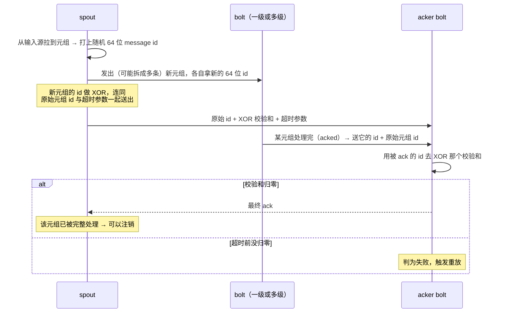

---
tags:
  - 分布式/计算
---

# Storm@Twitter

Storm 是 Twitter 的**实时分布式流处理引擎**，承载 Twitter 内部一批关键的实时数据管理任务。这篇的重头不在架构介绍上（那部分只占一半）：**生产环境里的三个运维故事**与一次**机器故障韧性的实测**才是主体，也是它比同类材料更有价值的地方。

它的自述是"实时、容错、分布式流数据处理系统"，由 Twitter 用于规模化地跑实时关键计算。

## 五个设计目标

| 目标 | 具体含义 |
| --- | --- |
| **可扩展** | 运维团队要能**加减节点而不打断既有拓扑的数据流**（拓扑又叫 **standing query**） |
| **有韧性** | 常部署在大集群上、硬件会坏，**集群必须继续处理既有拓扑且性能影响最小** |
| **可扩展功能** | 拓扑可以调用任意外部函数（例如查 MySQL 拿社交图谱） |
| **性能要好** | 实时应用的前提；Storm 的手段之一是**把所有存储与计算数据结构都放在内存里** |
| **便于运维** | Storm 处在用户交互的心脏位置，**终端用户会立刻察觉故障或性能问题**。运维团队需要**早期告警工具**并能**迅速指出问题来源** —— 所以好用的运维工具**是硬性需求，谈不上"有了更好"** |

关于血统，原文的表述很克制：它**追溯到流数据处理研究的丰厚积累并大量借用**，**关键差别在于把上面这些方面合到同一个系统里**；同时明确指出**不主张这些概念是 Storm 发明的**。同期的还有 `S4`，之后的系统包括 MillWheel、Samza、Spark Streaming、Photon。

几处历史节点：**由 Nathan Marz 在 BackType 初创**，**2011 年 Twitter 收购 BackType**；在 Twitter 被改进的重点是**扩到大量节点**与**降低对 ZooKeeper 的依赖**；**2012 年开源**，随后被外部采用 ——**60 多家公司在用或试验**，其中点名了 Yahoo!、Groupon、The Weather Channel、Alibaba、Baidu、Rocket Fuel。

## 数据模型：spout、bolt 与拓扑

**一个拓扑是一张有向图**：顶点代表计算，边代表计算组件之间的数据流。

**顶点被分成两个不相交的集合 —— spout 与 bolt**：

- **spout 是拓扑的元组源**，典型做法是从队列里拉数据（**Kafka**、**Kestrel** 是常见选择）；
- **bolt 处理传入元组，并把它们交给下游的 bolt**；
- **拓扑可以有环。**

从数据库系统的视角看，一个拓扑就是**一张算子的有向图**，也可以当作**逻辑查询计划**来理解。

最简例子是统计推文里的词频、**每 5 分钟**输出一次：一个 spout 从 Twitter 的 **Firehose API** 不断注入推文；第一个 bolt 把推文拆成词、对每个词发出**二元组 `(word, count)`**；第二个 bolt 按词聚合，每 5 分钟输出一次计数，**然后清空内部计数器**。

## 四个运行时层级

这四层最容易被混在一起，需要逐个分清：

```
  ┌─────────────────────────────────────────────────────────────┐
  │  Nimbus（每集群一个主节点）                                  │
  │  角色的类比：Hadoop 里的 JobTracker；用户与系统的接触点      │
  │  职责：调度拓扑到 worker 节点、监控元组在拓扑里的进展        │
  └───────────────▲─────────────────────────────────────────────┘
                  │  Supervisor 周期心跳（经 ZooKeeper 协调）
  ┌───────────────┴─────────────────────────────────────────────┐
  │  Supervisor（每个 Storm 节点一个）                           │
  │  收到 Nimbus 的分配 → 起 worker；监控 worker 健康并重启      │
  └───────────────▲─────────────────────────────────────────────┘
                  │
  ┌───────────────┴─────────────────────────────────────────────┐
  │  worker 进程（宿主机上的容器；一个进程映射到一个拓扑）        │
  │  跑在一个 JVM 里                                            │
  └───────────────▲─────────────────────────────────────────────┘
                  │
  ┌───────────────┴─────────────────────────────────────────────┐
  │  executor（worker 进程内的线程）—— 提供"拓扑内"并行          │
  └───────────────▲─────────────────────────────────────────────┘
                  │
  ┌───────────────┴─────────────────────────────────────────────┐
  │  task（spout 或 bolt 的一个实例）—— 提供"bolt 内/spout 内"并行│
  └─────────────────────────────────────────────────────────────┘
```

几条细节：

- **task 提供 intra-bolt / intra-spout 并行，executor 提供 intra-topology 并行**；worker 进程是宿主机上的容器；
- **一台机器上可以有多个 worker 进程**，而且**它们可能在执行同一个拓扑的不同部分**；
- 一条关键约束：**task 被严格绑定在一个 executor 上，因为这个分配当前是静态的**。未来工作才是**动态重分配**，以优化负载均衡或满足服务级目标（SLO）。

### 五种分组策略

数据在生产者与消费者之间 shuffle（**双方都可能有多个 task**）—— 这篇把它类比为**并行数据库里的 exchange 算子**。

| 策略 | 语义 |
| --- | --- |
| **shuffle grouping** | 随机分区 |
| **fields grouping** | 对元组属性/字段的**一个子集**做哈希 |
| **all grouping** | 把整个流**复制**给所有消费者 task |
| **global grouping** | 把整个流送给**单个 bolt** |
| **local grouping** | 送给**同一个 executor 内**的消费者 bolt |

分组策略**本身可扩展** —— 拓扑可以定义并使用自己的策略。

### 提交：Thrift 对象与 Summingbird

**Nimbus 是一个 Apache Thrift 服务，拓扑定义就是 Thrift 对象**。用户把拓扑描述成 Thrift 对象发给 Nimbus，于是**任何编程语言都能用来创建拓扑**。提交时还要把用户代码打包成 **JAR 上传到 Nimbus**。

**状态存在两处**：**用户代码放 Nimbus 机器的本地磁盘，拓扑的 Thrift 对象放 ZooKeeper**。Supervisor 用**周期心跳协议**联系 Nimbus，**申报自己在跑哪些拓扑、以及还有多少空位**；Nimbus 记住哪些拓扑待分配，并在待分配拓扑与 Supervisor 之间**做撮合**。**Nimbus 与 Supervisor 之间的所有协调都走 ZooKeeper。**

Twitter 上生成拓扑的一个常用途径是 **Summingbird**：一个通用的流处理抽象，它**有一个独立的逻辑规划器，可以映射到多种流处理与批处理系统**。因为**它理解类型以及数据处理函数之间的关系（例如结合律）**，所以能做一批优化。用 Summingbird 写的查询**可以自动翻译成 Storm 拓扑**，**也能生成跑在 Hadoop 上的 MapReduce job** —— 常见用法是**用 Storm 拓扑实时算近似答案，之后再与 MapReduce 的精确结果对账**。

## 容错：fail-fast 与 XOR 校验和

### 组件层：无状态是韧性的来源

**Nimbus 与 Supervisor 都是 fail-fast 且无状态的，所有状态都存在 ZooKeeper 或本地磁盘上 —— 这个设计是 Storm 韧性的关键。**

- Nimbus 失败时，**worker 仍然继续推进**；Supervisor 会重启失败的 worker；
- **但有两条限制必须记住**：Nimbus 挂着时**用户无法提交新拓扑**；而且**正在运行的拓扑若遇到机器故障，要等 Nimbus 恢复才能被重新分配到别的机器**。

### Supervisor 的三条定时线程

| 事件 | 周期 | 所在线程 | 做什么 |
| --- | --- | --- | --- |
| **heartbeat** | **15 秒** | 主线程 | 告诉 Nimbus 这个 supervisor 还活着 |
| **synchronize supervisor** | **10 秒** | event manager 线程 | 管理既有分配的变化；若变化里含新拓扑，就**下载所需的 JAR 与库**，并立即安排一次 synchronize process |
| **synchronize process** | **3 秒** | process event manager 线程 | 管理本节点上跑拓扑片段的 worker 进程 |

主线程另外负责读 Storm 配置、初始化 supervisor 的全局映射、**在文件系统里建一份持久化的本地状态**、以及安排这些周期事件。

synchronize process 会**从本地状态读 worker 心跳，并把它们分成四类**：

- **valid** —— 正常；
- **timed out** —— 在指定时间窗内没有心跳，**被当作已死**；
- **not started** —— 还没启动，因为它属于一个新提交的拓扑，或者某个既有拓扑的 worker 正在被移到这个 supervisor 上；
- **disallowed** —— **不应该在跑**，因为它的拓扑已经被杀，或者该 worker 已被移到别的节点。

### worker 内部的消息流

每个 worker 进程有**两条专用线程**（worker receive / worker send），每个 executor 内部又有**两条线程**（user logic / executor send）：

```
   网络入向
      │
      ▼
 ┌─────────────────┐
 │ worker receive  │  监听一个 TCP/IP 端口，是所有入向元组的「解复用点」：
 │ 线程            │  看目的 task id，投进对应 executor 的 in queue
 └────────┬────────┘
          ▼
 ┌─────────────────┐        ┌──────────────────┐
 │ executor 的     │  ────▶ │ executor 的      │
 │ user logic 线程 │        │ out queue        │
 │ 取元组→按 task  │        └────────┬─────────┘
 │ id 跑真正的 task│                 │
 └─────────────────┘                 ▼
                          ┌─────────────────────┐
                          │ executor send 线程  │
                          │ 投进全局 transfer   │
                          │ queue               │
                          └──────────┬──────────┘
                                     ▼
                          ┌─────────────────────┐
                          │ worker send 线程    │
                          │ 按目的 task id 发往 │
                          │ 下游 worker         │
                          └─────────────────────┘

   特例：目的 task 在同一个 worker 上时，
   executor send 线程直接写进目的 task 的 in queue（绕过网络）
```

### 两种语义

| 语义 | 含义 | 怎么得到 |
| --- | --- | --- |
| **at least once** | 每个进入拓扑的元组**至少被处理一次** | 默认（需要 ack 机制） |
| **at most once** | 每个元组要么被处理一次，要么**在故障时被丢弃** | **把拓扑的 ack 机制关掉** —— 此时不保证每个阶段成功或失败，处理继续往前推 |

### at-least-once 的实现：acker bolt + XOR 校验和

拓扑被**加装一个 "acker" bolt**，它**为 spout 发出的每个元组追踪其元组 DAG**。链路是这样：



三个机制细节：

- **朴素实现要保留每个元组的血统** —— 每条元组的来源 id 得一路留到处理结束，**溯源追踪的内存占用可能很大，复杂拓扑尤其如此**。Storm 用**按位 XOR** 绕开这个问题；
- **为什么 XOR 有效，尽管 XOR 本身不幂等**：**Storm 的通信走 TCP/IP，而 TCP 有可靠投递，所以没有元组会被投递多于一次**；
- **超时是必需的**：spout 一开始就指定了一个超时参数，acker bolt 跟踪它；**若校验和因故障永远不归零，超时即判失败**。

### 数据源侧要配合：hold 与 checkpoint

**at-least-once 要求数据源能"hold"住元组**：spout 收到正向 ack 才能让源删掉它；**若指定时间内没有收到 ack 或 fail 消息，源会让这个 hold 过期，并在后续迭代里重放该元组**。**Kestrel 队列提供这种行为。**

**Kafka 走另一条路**：**已处理的元组（消息 offset）按每个 spout 实例 checkpoint 到 ZooKeeper**；**spout 实例失败重启后，从 ZooKeeper 里记录的上一个 checkpoint 状态开始处理**。

## 生产实况

规模锚点：**跑在数百台服务器上、跨多个数据中心**；上面有**数百个拓扑**，其中**有些跑在几百个节点上**；**每天有数 TB 数据流过这些集群，产出数十亿条输出元组**。使用者包括 revenue、user services、search、content discovery 等团队；用途从**过滤与聚合**（算各种计数）到**在流数据上跑简单的机器学习算法（例如聚类）**。

拓扑的复杂度跨度很大：**大量拓扑的阶段数少于三个**（拓扑图的深度小于 3），**但有一个拓扑有八个阶段**。当时**拓扑之间在机器上是隔离的**，作者希望日后去掉这条限制。

三条可用性数字：**Nimbus 挂着 Storm 仍然工作**（worker 继续推进），为维护下线一台机器不影响拓扑；**处理一个元组的 p99 延迟接近 1 ms**；**过去 6 个月集群可用性 99.9%**。

## 可观测性

原文把"**把 Storm 的运行可视化**"当成实战里的关键一环。做法是：

**每个拓扑加装一个 metrics bolt** —— 各 spout 与 bolt 采集到的指标都送给它，它再把指标写进 **Scribe**，由 Scribe 路由到一个**持久化的键值存储**；每个拓扑据此建一个 dashboard。这套可视化**在定位与解决那些已经触发告警的问题上很关键**。

指标分两类：

| 类别 | 内容 |
| --- | --- |
| **系统指标** | 平均 CPU 利用率、网络利用率、**每分钟 GC 次数**、**每分钟 GC 耗时**、堆内存使用 |
| **拓扑指标**（**每个 bolt、每个 spout 分别上报**） | **spout**：每分钟发出的元组数、元组 ack 数、每分钟 fail 消息数、**整个拓扑处理一条元组的延迟**；**bolt**：已执行的元组数、每分钟 ack 数、平均元组处理延迟、**平均 ack 一个特定元组的延迟** |

## 三个运维故事

### ① ZooKeeper 被打爆：四代配置

这是全文最有价值的一段，因为它把"共享基础设施的容量问题"从症状一路追到了根因。

| 代 | 做法 | 结果 |
| --- | --- | --- |
| 一 | 复用 Twitter 既有的、被很多系统共享的 ZooKeeper 集群 | **很快超出该集群能支撑的客户端数**，反过来**影响了共享同一集群的其他系统的可用性** |
| 二 | 结构相同，但 **ZooKeeper 用专用硬件** | worker 与拓扑承载量显著提升，**但在约 300 个 worker 处撞墙**；一超限就**出现 worker 被调度器杀掉并重启** |
| 三 | 再换硬件：**事务日志放在 6×500 GB SATA RAID1+0，快照放在 1×500 GB 无 RAID 盘** | 扩到**约 1200 个 worker**；再超限又出现杀进程、重启 |
| **四（当时的当前生产）** | **改代码，不再堆硬件**：KafkaSpout 的状态改写键值存储；Storm core 的心跳改写到自研的 **heartbeat daemons** | 心跳守护集群**以牺牲读一致性换取高可用与高写性能**，并可水平扩展以匹配 worker 的负载 |

第二代那面墙的成因原文写得很具体：**每个 worker 进程都对应一个 zknode，必须每 15 秒写一次**，否则 **Nimbus 判定该 worker 不活、把它重排到新机器**。第三代的两盘分离也有明确依据：**把事务日志与快照分到不同磁盘是 ZooKeeper 文档的强烈建议，不照做集群可能变得不稳定**。

到第三代为止他们认为已经压榨完硬件了，于是**从一台 ZooKeeper 节点解析 tcpdump 分析写流量**，找到了真正的元凶：

- **对 ZooKeeper quorum 每秒的写入里，67% 来自 Storm 的一个库 `KafkaSpout`，而不是 Storm core 运行时。** 它用 ZooKeeper 存"从 Kafka 队列消费到哪了"这一点状态，而**默认配置是每个 partition、每个拓扑每 2 秒写一次**。当时他们的 Kafka topic partition 数在 **15 到 150** 之间，集群里约 **20 个拓扑**。tcpdump 样本中，**60 秒窗口内有 19,956 次写**落在 KafkaSpout 拥有的 zknode 上。
- **33% 的写来自 Storm 代码**；而这部分里 **96% 来自随 worker 进程一起发布的 Storm core** —— 它**默认每 3 秒**往 ZooKeeper 写一次心跳。

也就是说：**真正的写放大来自"每个进程每几秒一次"的心跳与 offset 上报，而不是来自拓扑的业务逻辑。** 这也解释了第四代为什么是"改代码"而不是"加硬件"。

### ② Storm 的开销到底有多大：三组对照实验

起因是一个担忧：用 Kafka spout 的拓扑，比直接用 Kafka 客户端手写 Java 要慢。触发点很具体 —— 一个拓扑**需要 10 台机器**才能处理每秒 **300K 条**消息的入流量；机器少于 10 台，消费速率就低于生产速率，**它就不再是实时的**了。这个拓扑对"实时"的定义是：**从元组里的初始事件发生，到实际在其上完成计算，延迟小于 5 秒**。

机器规格：**2× Intel E5645@2.4 GHz，12 个物理核带超线程（24 个硬件线程），24 GB RAM，500 GB SATA**。

| 实验 | 配置 | 结果 |
| --- | --- | --- |
| **一：不用 Storm 的 Java 程序** | Kafka Java 客户端 + 一个 `for` 循环尽快读、然后反序列化（之后只等 GC）。**它不支持可靠消息处理、不恢复机器故障、也不做任何流重分区** | **单机 300K msgs/sec**，CPU 利用率约 **700%**（top 口径；12 物理核的上限是 1200%） |
| **二：Storm 拓扑，关掉可靠性** | 逻辑与实验一相当，只做反序列化；**全部 JVM 进程用 Storm 的 Isolation Scheduler 挤到同一台机器**上，模拟实验一的布置。**10 个进程、每进程 38 个线程** | **单机同样 300K msgs/sec**，CPU 约 **660%** —— **比不用 Storm 的那个还略低** |
| **三：同一拓扑，打开可靠性** | **30 个 JVM 进程（每机 10 个）、每进程 5 个线程** | **至少要 3 台机器**才能到 300K msgs/sec，**平均 CPU 924%** |

结论分三层：

- **打开可靠性的 CPU 代价约为反序列化代价的 3 倍**；
- **当两边提供同样的可靠性保证时，CPU 利用率大致相同** —— 这一条打消了"Storm 相比原生 Java 有显著开销"的疑虑；
- 但实验也暴露：**可靠性机制带来的 CPU 代价并不小，与反序列化代价处于同一量级**。

还有一处诚实的交代：**那个需要 10 台机器的原始拓扑无法用"不用 Storm 的 Java 程序"复现** —— 它有三层 bolt/spout、把流重分区了两次，重写要花太多时间。**多出来的机器可能归因于该拓扑里业务逻辑的开销，以及流需要重分区时元组跨网收发带来的序列化与反序列化代价。**

### ③ max spout pending 的自动调参

拓扑有一个 **max spout pending** 参数（配置项 **`topology.max.spout.pending`**），它**限制任一时刻有多少元组"在飞"（尚未 ack 或 fail）**。

为什么需要这个参数：**Storm 用 ZeroMQ 把元组从一个 task 派发到另一个**。**如果消费端跟不上速率，ZeroMQ 的队列就开始堆积；最终元组在 spout 处超时并被重放，反过来给队列施加更多压力** —— 这是一个病态的失败循环。为避免它，才让用户限制在飞元组数。三条边界值得记住：

- **这个限制按"每个 spout task"生效，不是拓扑级**；
- **对不可靠的 spout（元组里不带 message id）这个值没有效果**。

用户的痛点在于取值：**值太小会饿死拓扑，值太大又会把它压到出现失败与重放**。所以**用户得反复部署、试不同的值**。Twitter 的应对是**一套自动调参算法**，周期性调整以达到最大吞吐 —— 这里"吞吐"的定义是**能推进 spout 多少进度**，而不只是能推多少元组过拓扑。它适用于 **Kafka 与 Kestrel spout**（这两者被增强过，能跟踪并上报进度）。

三个要点：

**① "progress" 指标的定义依 spout 而定。** Kafka spout 看的是 **Kafka 日志里被视为"已提交"的 offset**（即该 offset 之前的数据都已成功处理、永不会被重放）；Kestrel spout 看的是**从拓扑收到的 ack 数**。一处容易踩的坑：**不能用 ack 数当 Kafka spout 的进度指标** —— 因为在它的实现里，**已 ack 但尚未提交的元组仍可能被重放**。

**② 可插拔的 tuner 类**，默认实现提供两个 API：`void autoTune(long deltaProgress)`（用上次调用以来的进度来调参）与 `long get()`（返回调好的值）。

**③ 每 $t$ 秒调一次**（默认 $t = 120$ 秒），spout 把这段时间的进度交给 `autoTune`。调参器记录"上一次动作"，动作只有三种：

```
Increase   →  把 max spout pending 上调 25%
Decrease   →  下调 max(25%,  (上次 delta − 本次 delta) / 上次 delta × 100) %
No Change  →  保持当前值
```

状态机的转移规则围绕"上次进度 vs 本次进度"的比较展开，例如：**连续 5 次 No Change 就转 Increase**；若上次动作是 Increase 而这次进度"差不多"，则转 No Change 并把值**恢复到上次 Increase 之前的水平**。

## 机器故障韧性实测

目的：**考察 Storm 面对机器故障时的韧性与效率**。用一个**专为这次评测构造的拓扑**（原文明确声明**它不代表 Twitter 的典型负载**），跑 **at-least-once** 语义。

拓扑结构：一个 **Kafka spout** 读 `client_event` 流 → **shuffle grouping** 到 **Distributor bolt**，按 `user_id` 分区 → **UserCount bolt** 统计各类事件（following、unfollowing、查看推文，以及来自移动端与网页端的其他事件）的**去重用户数**，**每秒算一次（1 Hz）** → 按 **timestamp** 分区 → **Aggregator bolt** 汇总。

初始 task 数：spout **200**、DistributorBolt **200**、UserCountBolt **300**、AggregatorBolt **20**。**总 worker 数固定为 50，全程不变。**

做法：在 16 台机器上启动，等约 15 分钟，**杀掉三台机器**，如此重复三轮。

| 时间（相对实验开始） | 机器数 | worker 数 | 每机 worker 数（约） |
| --- | --- | --- | --- |
| 0 分 | 16 | 50 | 3 |
| +15 分 | 13 | 50 | 4 |
| +30 分 | 10 | 50 | 5 |
| +45 分 | 7 | 50 | 7 |
| +60 分 | **4** | 50 | **12** |

持续监控两项：**吞吐（每分钟处理的元组数）**与**每分钟的平均端到端延迟**。**吞吐按 acker bolt 里每分钟 ack 的元组数计量。**

| 时间窗 | 机器数 | 平均吞吐/分（百万） | 平均延迟/分（毫秒） |
| --- | --- | --- | --- |
| 0–15 分 | 16 | **6.8** | **7.8** |
| 15–30 分 | 13 | 5.8 | 12 |
| 30–45 分 | 10 | 5.2 | 17 |
| 45–60 分 | 7 | 4.5 | 25 |
| 60–75 分 | **4** | **2.2** | **45** |

读法有三层：

- **每次移除一组机器都会出现一个临时尖峰，但系统恢复得很快**；
- **吞吐每 15 分钟下降一次**（机器变少，符合预期），**每个 15 分钟窗口内都很快稳定**；
- **延迟每次移除机器都会上升**；**前几个窗口的尖峰小，最后两个窗口（资源紧得多）尖峰更高，但所有情况下系统都相当快地稳定下来**。

结论：**Storm 对机器故障有韧性，并且能在故障事件之后较快地把性能稳定下来。**

## 它自己列的未来工作

这份清单本身就是一篇"当时流处理还缺什么"的切片：

- **静态地自动优化拓扑**（intra-bolt 并行度、task 在 executor 里的打包方式），并在**运行时动态再优化**；
- **加 exact-once 语义（类似 Trident）而不带来大的性能损失**；
- 改进可视化工具；
- **提高部分组件的可靠性** —— 例如把 Nimbus 本地磁盘上的状态搬到更容错的系统（如 **HDFS**）；
- **改善 Storm 与 Hadoop 的集成**；
- **有可能用 Storm 去监控、反应并自适应地改进运行中拓扑的配置**；
- **支持声明式查询范式，同时仍然保留易扩展性**。

## 相关

- [[05-S4|S4]] —— 一组正面对照。**S4 把"运行中的集群不加不减节点"写进假设，Storm 把"能加减节点而不打断既有拓扑的数据流"当作第一条设计目标**；状态策略也相反：S4 用 PE 的本地内存装状态、故障即丢，Storm 用 **acker + XOR 校验和**换到 at-least-once，代价被实测出来了 —— **可靠性机制的 CPU 开销约是反序列化的 3 倍**
- [[04-Parameter Server|参数服务器]] —— **两篇都在同一个具体工程点上给出了方案：ZooKeeper 的写放大**。Storm 的诊断是"**每个进程每几秒一次的心跳与 offset 上报**"占掉了 67%+96% 的写，解法是把心跳搬到自研的 heartbeat daemon（**以读一致性换写性能**）；参数服务器则给每个 (key,value) 对配**区间向量时钟**，把朴素 $O(nm)$ 的记账压到 $O(mk)$。都是"先量清楚写从哪来，再改数据结构"
- [[01-RDD|RDD]] —— 状态与恢复的另一极：RDD 用**血统重算**替代数据复制，Storm 用 **XOR 校验和**把"溯源树"的内存占用压掉。前者省的是复制，后者省的是记账；两者都依赖同一条前提 —— **变换必须是确定性的、且通信可靠**
- [[01-GFS|GFS]] —— 持久化落点：Storm 的未来工作明确提到把 Nimbus 本地磁盘上的状态搬到 HDFS；而它的 Kafka spout 把消费 offset checkpoint 到 ZooKeeper

## 参考

- A. Toshniwal, S. Taneja, A. Shukla, K. Ramasamy, J. M. Patel, S. Kulkarni, J. Jackson, K. Gade, M. Fu, J. Donham, N. Bhagat, S. Mittal, D. Ryaboy. *Storm@Twitter*. SIGMOD 2014.
