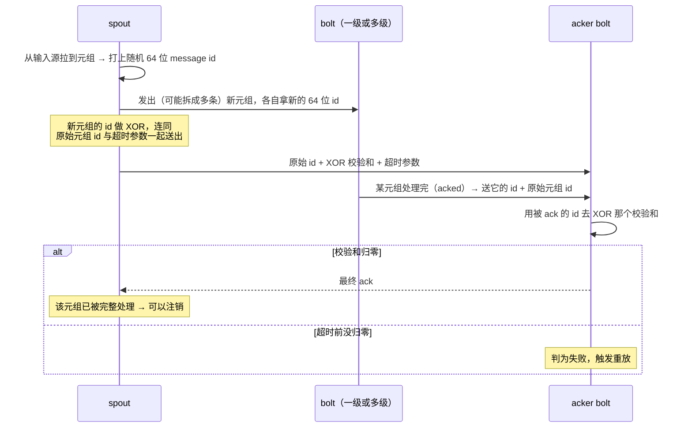

---
tags:
  - 分布式/计算
---

# Storm@Twitter

Storm 是 Twitter 的**实时分布式流处理引擎**，承载 Twitter 内部一批关键的实时数据管理任务。这篇的重头不在架构介绍上（那部分只占一半）：**生产环境里的三个运维故事**与一次**机器故障韧性的实测**才是主体，也是它比同类材料更有价值的地方。

它的自述是"实时、容错、分布式流数据处理系统"，由 Twitter 用于规模化地跑实时关键计算。

## 五个设计目标

| 目标 | 具体含义 |
| --- | --- |
| **可扩展** | 运维团队要能**加减节点而不打断既有拓扑的数据流**（拓扑又叫 **standing query**） |
| **有韧性** | 常部署在大集群上、硬件会坏，**集群必须继续处理既有拓扑且性能影响最小** |
| **可扩展功能** | 拓扑可以调用任意外部函数（例如查 MySQL 拿社交图谱） |
| **性能要好** | 实时应用的前提；Storm 的手段之一是**把所有存储与计算数据结构都放在内存里** |
| **便于运维** | Storm 处在用户交互的心脏位置，**终端用户会立刻察觉故障或性能问题**。运维团队需要**早期告警工具**并能**迅速指出问题来源** —— 所以好用的运维工具**是硬性需求，谈不上"有了更好"** |

关于血统，这里的表述很克制：它**追溯到流数据处理研究的丰厚积累并大量借用**，**关键差别在于把上面这些方面合到同一个系统里**；同时明确指出**不主张这些概念是 Storm 发明的**。同期的还有 `S4`，之后的系统包括 MillWheel、Samza、Spark Streaming、Photon。

几处历史节点：**由 Nathan Marz 在 BackType 初创**，**2011 年 Twitter 收购 BackType**；在 Twitter 被改进的重点是**扩到大量节点**与**降低对 ZooKeeper 的依赖**；**2012 年开源**，随后被外部采用 ——**60 多家公司在用或试验**，其中点名了 Yahoo!、Groupon、The Weather Channel、Alibaba、Baidu、Rocket Fuel。

## 数据模型：spout、bolt 与拓扑

**一个拓扑是一张有向图**：顶点代表计算，边代表计算组件之间的数据流。

**顶点被分成两个不相交的集合 —— spout 与 bolt**：

- **spout 是拓扑的元组源**，典型做法是从队列里拉数据（**Kafka**、**Kestrel** 是常见选择）；
- **bolt 处理传入元组，并把它们交给下游的 bolt**；
- **拓扑可以有环。**

从数据库系统的视角看，一个拓扑就是**一张算子的有向图**，也可以当作**逻辑查询计划**来理解。

最简例子是统计推文里的词频、**每 5 分钟**输出一次：一个 spout 从 Twitter 的 **Firehose API** 不断注入推文；第一个 bolt 把推文拆成词、对每个词发出**二元组 `(word, count)`**；第二个 bolt 按词聚合，每 5 分钟输出一次计数，**然后清空内部计数器**。

## 四个运行时层级

这四层最容易被混在一起，需要逐个分清：

```
  ┌─────────────────────────────────────────────────────────────┐
  │  Nimbus（每集群一个主节点）                                  │
  │  角色的类比：Hadoop 里的 JobTracker；用户与系统的接触点      │
  │  职责：调度拓扑到 worker 节点、监控元组在拓扑里的进展        │
  └───────────────▲─────────────────────────────────────────────┘
                  │  Supervisor 周期心跳（经 ZooKeeper 协调）
  ┌───────────────┴─────────────────────────────────────────────┐
  │  Supervisor（每个 Storm 节点一个）                           │
  │  收到 Nimbus 的分配 → 起 worker；监控 worker 健康并重启      │
  └───────────────▲─────────────────────────────────────────────┘
                  │
  ┌───────────────┴─────────────────────────────────────────────┐
  │  worker 进程（宿主机上的容器；一个进程映射到一个拓扑）        │
  │  跑在一个 JVM 里                                            │
  └───────────────▲─────────────────────────────────────────────┘
                  │
  ┌───────────────┴─────────────────────────────────────────────┐
  │  executor（worker 进程内的线程）—— 提供"拓扑内"并行          │
  └───────────────▲─────────────────────────────────────────────┘
                  │
  ┌───────────────┴─────────────────────────────────────────────┐
  │  task（spout 或 bolt 的一个实例）—— 提供"bolt 内/spout 内"并行│
  └─────────────────────────────────────────────────────────────┘
```

几条细节：

- **task 提供 intra-bolt / intra-spout 并行，executor 提供 intra-topology 并行**；worker 进程是宿主机上的容器；
- **一台机器上可以有多个 worker 进程**，而且**它们可能在执行同一个拓扑的不同部分**；
### 一条关键约束：静态绑定

- **task 被严格绑定在一个 executor 上，因为这个分配当前是静态的**。未来工作才是**动态重分配**，以优化负载均衡或满足服务级目标（SLO）。

### 五种分组策略

数据在生产者与消费者之间 shuffle（**双方都可能有多个 task**）—— 这篇把它类比为**并行数据库里的 exchange 算子**。

| 策略 | 语义 |
| --- | --- |
| **shuffle grouping** | 随机分区 |
| **fields grouping** | 对元组属性/字段的**一个子集**做哈希 |
| **all grouping** | 把整个流**复制**给所有消费者 task |
| **global grouping** | 把整个流送给**单个 bolt** |
| **local grouping** | 送给**同一个 executor 内**的消费者 bolt |

分组策略**本身可扩展** —— 拓扑可以定义并使用自己的策略。

### 提交：Thrift 对象与 Summingbird

**Nimbus 是一个 Apache Thrift 服务，拓扑定义就是 Thrift 对象**。用户把拓扑描述成 Thrift 对象发给 Nimbus，于是**任何编程语言都能用来创建拓扑**。提交时还要把用户代码打包成 **JAR 上传到 Nimbus**。

**状态存在两处**：**用户代码放 Nimbus 机器的本地磁盘，拓扑的 Thrift 对象放 ZooKeeper**。Supervisor 用**周期心跳协议**联系 Nimbus，**申报自己在跑哪些拓扑、以及还有多少空位**；Nimbus 记住哪些拓扑待分配，并在待分配拓扑与 Supervisor 之间**做撮合**。**Nimbus 与 Supervisor 之间的所有协调都走 ZooKeeper。**

Twitter 上生成拓扑的一个常用途径是 **Summingbird**：一个通用的流处理抽象，它**有一个独立的逻辑规划器，可以映射到多种流处理与批处理系统**。因为**它理解类型以及数据处理函数之间的关系（例如结合律）**，所以能做一批优化。用 Summingbird 写的查询**可以自动翻译成 Storm 拓扑**，**也能生成跑在 Hadoop 上的 MapReduce job** —— 常见用法是**用 Storm 拓扑实时算近似答案，之后再与 MapReduce 的精确结果对账**。

**四个层级之外还有一处容易被混的地方**：**task 与 executor 的关系是"静态绑定"，而 worker 与机器的关系是"由调度决定"** —— 前者定了就不动，后者在节点增减时重排。这两件事的**变更成本差了一个数量级**：worker 换机器只是重启一个进程，task 换 executor 则要重新分配拓扑的静态映射表。这也解释了为什么材料把"task 的动态重分配"单独列进未来工作 —— **它要动的是那条静态绑定，而不在调度。**

**四个层级之间的数量关系值得摆清**，因为"改了哪个数、影响哪一层"经常被搞混：

| 层级 | 数量由什么决定 | 配置里有没有显式入口 |
| --- | --- | --- |
| **Nimbus** | 每集群一个 | —— |
| **Supervisor** | 每个 Storm 节点一个 | —— |
| **worker** | **`topology.workers`**（默认 `1`） | **有** |
| **executor** | task 数与"每个 executor 装几个 task" | **由拓扑定义推导** |
| **task** | 拓扑定义里给的并行度提示 | 由 `setSpout` / `setBolt` 的参数决定 |

**只有 worker 那一层有显式的配置入口，另两层的数量是推导出来的。** 这条不对称是排查并行度问题时最容易踩的地方：**改代码里的并行度提示，改的是 task 数；worker 进程数没动，JVM 数与 GC 压力也就没动。**

**另一处硬件侧的约束是槽位**：`supervisor.slots.ports` 的默认值是 `6700` 到 `6703` —— **一台机器默认只开 4 个槽位，也就是最多 4 个 worker 进程**。这是"加机器"与"加并行度"之间的一道硬门：**拓扑需要的 worker 数超过集群总槽位数时，多出来的排不上**。它也解释了实测里的一个现象 —— 机器从 16 台减到 4 台而 worker 数固定 50 不变，**每台机器上的 worker 数从 3 涨到 12**，也就是要求单机承载 12 个进程，**远超默认的 4 个槽位**。

**最后一条性质是隔离性**：材料提到**当时拓扑之间在机器上是隔离的**，并希望日后去掉这条限制。隔离的代价是"每个拓扑要占满自己的机器"，好处是**一个拓扑的资源使用不会影响另一个**。**在"终端用户会立刻察觉故障或性能问题"这个前提下，隔离是一个合理的第一版选择** —— 而要去掉它，前提是先有一套能保证公平的资源划分。

**"拓扑定义是 Thrift 对象"这一点的影响比它看起来大。** 它带来两层后果：**任何编程语言都能用来创建拓扑**（提交的是一个结构化对象，而不是某语言的对象）；而且**拓扑定义本身是一份可传输、可存储、可版本化的数据** —— 它存在 ZooKeeper 里，是 Nimbus 做撮合的唯一依据。**换句话说，拓扑是"系统读得懂的一份声明"，而不只是"提交给系统的程序"**，用户代码只以 JAR 的形式挂在旁边。

**这也解释了状态为什么分散在两处**：**用户代码在 Nimbus 的本地磁盘、拓扑定义在 ZooKeeper** —— 前者可以重新上传，后者是集群的权威副本。**脆弱处就在"用户代码只在 Nimbus 本地"这一条上**，而材料把它列进未来工作时的提议，正是"把它搬到更容错的系统"。**一份声明式的定义配一份本地副本的代码，是这套提交模型留下的那个单点。**

## 拓扑的形状：深度、宽度与重分区

拓扑的形状有三个可调维度，各自撞的是不同的墙。

| 维度 | 含义 | 撞什么墙 |
| --- | --- | --- |
| **深度**（阶段数） | 从 spout 到最终输出的算子层数 | **每多一层就多一次序列化与网络往返** |
| **宽度**（并行度） | 每个算子的 task 数 | **受 worker 数与槽位数限制**，也受在飞量的实际值影响 |
| **边的性质** | 同机还是跨网、是否改变分区 | **重分区即跨网**，代价是双向的序列化 |

材料给的规模事实很具体：**大量拓扑的阶段数少于三个，但有一个拓扑有八个阶段**。而它最诚实的一处交代也在这里 —— 那个"需要 10 台机器"的拓扑**无法用不用框架的 Java 程序复现**，原因是"它有三层 bolt/spout、把流重分区了两次"；多出来的机器**可能归因于业务逻辑本身的开销，以及重分区时元组跨网收发的序列化与反序列化代价**。**这段话把"框架开销"与"拓扑形状的开销"分开了** —— 而后者经常被算到前者头上。

**一条实用判据**：**要在同一处逻辑上省开销，先看它跨了几次网。** 同机内两个 task 之间是直接写队列（绕过网络），跨 worker 才走序列化与网络。**所以"减少重分区次数"往往比"优化算子内部逻辑"收益更大** —— 这与前面几篇里"少搬运比快计算更值"是同一个结论。

## 参数与可调项

配置体系本身有五层，而**优先级顺序解释了"改了没生效"这类问题**：

```
defaults.yaml  <  storm.yaml  <  拓扑专属配置  <  组件内部配置  <  组件外部配置
（代码里）        （classpath）   （随拓扑提交）  （getComponentConfiguration） （addConfiguration）
```

三层约束值得记住：**拓扑专属配置只能覆盖以 `TOPOLOGY` 开头的键**（所以集群级的 ZK 地址与槽位端口在拓扑里改不了）；**自 0.7.0 起可以按 bolt / spout 覆盖，但只有四个键允许** —— `topology.debug`、`topology.max.spout.pending`、`topology.max.task.parallelism`、`topology.kryo.register`；其余配置只能改全局。**"哪些键能细粒度调"是被明确限定过的**，这条限制本身就是设计决定。

默认值照录官方 `defaults.yaml`：

| 键 | 默认值 | 作用 |
| --- | --- | --- |
| `storm.zookeeper.servers` / `.port` | `["localhost"]` / `2181` | 协调服务地址 |
| `storm.zookeeper.session.timeout` / `.retry.times` | `20000` / `5` | 会话超时（毫秒）与重试次数 |
| `nimbus.seeds` | `["localhost"]` | Nimbus 候选列表 |
| **`supervisor.slots.ports`** | **`6700`–`6703`** | **一台机器默认 4 个槽位** |
| `supervisor.heartbeat.frequency.secs` | `5` | supervisor 心跳周期 |
| `supervisor.worker.timeout.secs` | `30` | worker 判死门限 |
| `nimbus.task.timeout.secs` / `.supervisor.timeout.secs` | `30` / `60` | 任务与 supervisor 的判死门限 |
| `storm.local.dir` | `"storm-local"` | 本地状态目录 |
| **`topology.workers`** | **`1`** | 一个拓扑默认只给一个 worker 进程 |
| `topology.acker.executors` | `null` | acker 的并行度 |
| **`topology.max.spout.pending`** | **`null`** | 在飞元组上限 |
| **`topology.message.timeout.secs`** | **`30`** | 一条元组的时限 |
| `topology.executor.receive.buffer.size` | `32768` | executor 接收队列（会向上取整到 2 的幂） |
| `topology.transfer.buffer.size` | `1000` | worker 传输队列 |

按六要素摊开三处。

**`topology.max.spout.pending`（默认 `null`）** —— 语义是"任一时刻允许多少元组在飞（尚未 ack 或 fail）"。**默认 `null` 就是不限制**，而材料恰恰把这个参数列为"用户得反复部署去试值"的那一个。**默认值给的是"先跑起来"，而不是"跑得好"。** 改小 → 拓扑挨饿，吞吐上不去；改大 → 队列堆积、元组超时重放、重放又加压。三条边界要一起记：**它按"每个 spout task"生效而不是拓扑级**；**对不带 message id 的不可靠 spout 完全无效**；**它限制的是源头，不是链路**。第一、三条合起来推出一个实际后果：**调高 spout 的并行度会按倍数放大实际在飞量** —— "加了并行度之后限流像失效了"，根因就在这里。

**`topology.message.timeout.secs`（默认 `30`）** —— 语义是"一条元组从发出到必须被完整 ack 的时限"，也是 acker 判失败的**唯一**依据（校验和永远不归零时靠它兜底）。改小 → 重放更早发生，**在高压力下会把"慢"升级成"重放风暴"**；改大 → 失败发现得更晚，内存里滞留的在飞记录更多。它与上一个键必须一起看：**超时是"一条元组能活多久"，在飞上限是"同时能活多少条"，两者的乘积决定内存里要驻留多少记账。**

**`topology.workers`（默认 `1`）** —— 语义是一个拓扑分到几个 worker 进程。**默认 1 意味着"提高并行度"的第一件事是把它加上去**，而它同时决定 JVM 数量与随之而来的 GC 压力。三档并行度（worker / executor / task）在这个配置面里**只有 worker 是显式的**，另两档由 task 数与分组策略推导 —— 这是"为什么改了 task 数没看到预期效果"的常见原因：**改了推导结果，没改那个被直接读取的值。**

## 容错：fail-fast 与 XOR 校验和

### 组件层：无状态是韧性的来源

**Nimbus 与 Supervisor 都是 fail-fast 且无状态的，所有状态都存在 ZooKeeper 或本地磁盘上 —— 这个设计是 Storm 韧性的关键。**

- Nimbus 失败时，**worker 仍然继续推进**；Supervisor 会重启失败的 worker；
- **但有两条限制必须记住**：Nimbus 挂着时**用户无法提交新拓扑**；而且**正在运行的拓扑若遇到机器故障，要等 Nimbus 恢复才能被重新分配到别的机器**。

### Supervisor 的三条定时线程

| 事件 | 周期 | 所在线程 | 做什么 |
| --- | --- | --- | --- |
| **heartbeat** | **15 秒** | 主线程 | 告诉 Nimbus 这个 supervisor 还活着 |
| **synchronize supervisor** | **10 秒** | event manager 线程 | 管理既有分配的变化；若变化里含新拓扑，就**下载所需的 JAR 与库**，并立即安排一次 synchronize process |
| **synchronize process** | **3 秒** | process event manager 线程 | 管理本节点上跑拓扑片段的 worker 进程 |

主线程另外负责读 Storm 配置、初始化 supervisor 的全局映射、**在文件系统里建一份持久化的本地状态**、以及安排这些周期事件。

synchronize process 会**从本地状态读 worker 心跳，并把它们分成四类**：

- **valid** —— 正常；
- **timed out** —— 在指定时间窗内没有心跳，**被当作已死**；
- **not started** —— 还没启动，因为它属于一个新提交的拓扑，或者某个既有拓扑的 worker 正在被移到这个 supervisor 上；
- **disallowed** —— **不应该在跑**，因为它的拓扑已经被杀，或者该 worker 已被移到别的节点。

### worker 内部的消息流

每个 worker 进程有**两条专用线程**（worker receive / worker send），每个 executor 内部又有**两条线程**（user logic / executor send）：

```
   网络入向
      │
      ▼
 ┌─────────────────┐
 │ worker receive  │  监听一个 TCP/IP 端口，是所有入向元组的「解复用点」：
 │ 线程            │  看目的 task id，投进对应 executor 的 in queue
 └────────┬────────┘
          ▼
 ┌─────────────────┐        ┌──────────────────┐
 │ executor 的     │  ────▶ │ executor 的      │
 │ user logic 线程 │        │ out queue        │
 │ 取元组→按 task  │        └────────┬─────────┘
 │ id 跑真正的 task│                 │
 └─────────────────┘                 ▼
                          ┌─────────────────────┐
                          │ executor send 线程  │
                          │ 投进全局 transfer   │
                          │ queue               │
                          └──────────┬──────────┘
                                     ▼
                          ┌─────────────────────┐
                          │ worker send 线程    │
                          │ 按目的 task id 发往 │
                          │ 下游 worker         │
                          └─────────────────────┘

   特例：目的 task 在同一个 worker 上时，
   executor send 线程直接写进目的 task 的 in queue（绕过网络）
```

### 两种语义

| 语义 | 含义 | 怎么得到 |
| --- | --- | --- |
| **at least once** | 每个进入拓扑的元组**至少被处理一次** | 默认（需要 ack 机制） |
| **at most once** | 每个元组要么被处理一次，要么**在故障时被丢弃** | **把拓扑的 ack 机制关掉** —— 此时不保证每个阶段成功或失败，处理继续往前推 |

### at-least-once 的实现：acker bolt + XOR 校验和

拓扑被**加装一个 "acker" bolt**，它**为 spout 发出的每个元组追踪其元组 DAG**。链路是这样：



三个机制细节：

- **朴素实现要保留每个元组的血统** —— 每条元组的来源 id 得一路留到处理结束，**溯源追踪的内存占用可能很大，复杂拓扑尤其如此**。Storm 用**按位 XOR** 绕开这个问题；
- **为什么 XOR 有效，尽管 XOR 本身不幂等**：**Storm 的通信走 TCP/IP，而 TCP 有可靠投递，所以没有元组会被投递多于一次**；
- **超时是必需的**：spout 一开始就指定了一个超时参数，acker bolt 跟踪它；**若校验和因故障永远不归零，超时即判失败**。

### 数据源侧要配合：hold 与 checkpoint

**at-least-once 要求数据源能"hold"住元组**：spout 收到正向 ack 才能让源删掉它；**若指定时间内没有收到 ack 或 fail 消息，源会让这个 hold 过期，并在后续迭代里重放该元组**。**Kestrel 队列提供这种行为。**

**Kafka 走另一条路**：**已处理的元组（消息 offset）按每个 spout 实例 checkpoint 到 ZooKeeper**；**spout 实例失败重启后，从 ZooKeeper 里记录的上一个 checkpoint 状态开始处理**。

## 底层依赖：序列化、网络与 ZooKeeper 的写放大

这套系统站在三样东西上，而**它们的性质直接决定了哪些参数必须存在**。

**① ZooKeeper —— 承担 Nimbus 与 Supervisor 之间的全部协调。** 它存拓扑定义、做撮合、收心跳，还要接住 Kafka spout 的消费 offset。材料里最有价值的一段就是它的写放大诊断：**ZK quorum 每秒的写入里 67% 来自 Storm 的一个库而不是运行时本体，33% 来自运行时而这部分里 96% 来自随 worker 发布的 core** —— 两处都是"**每个进程每几秒一次**"的周期性写入。

**这里的结构性原因值得点出来：协调协议天然要靠"定期写一条状态"来表达存活**，因为不反复声明，协调者就无法区分"慢"和"死"。于是**写量约等于"进程数 ÷ 周期"，而这两个量在扩容时一个涨、一个不能涨太多**（调长周期会拉长故障发现时间）。**所以写放大的来源是"用定期写来表达存活"这个选择本身，而不能归到配置失误上。** 这也解释了为什么最终解法是**把心跳搬出 ZK**（换一种表达存活的通道）而不是**把周期调长**（那只是把墙往后挪）。今天的官方默认值把这一类周期都拉开了 —— **心跳 5 秒、worker 判死 30 秒、supervisor 判死 60 秒**，而材料里记的是 3 秒与 15 秒；方向一致：**降低写频率、同时放宽判死门限。**

**② 序列化 —— 跨 worker 的元组与跨 JVM 的一切都要过这一关。** 官方配置里有 `topology.kryo.register` 这类键，说明这一层是可配的。它的分量在那三组对照实验里被量出来：**实验一与实验二都只做"读 + 反序列化"**，CPU 分别约 700% 与 660% —— 也就是说**反序列化是这套系统里"不可省的那部分基准成本"**，而可靠性机制是在它之上再加约 3 倍。**把某个开销与反序列化比，是这套系统里最有信息量的一个对照方式。**

**③ 网络传输 —— 元组走消息层从一个 task 派发到另一个，而这条链路没有内建背压。** 消费端跟不上时队列开始堆积，元组在 spout 侧超时、被重放，**重放又给队列加压** —— 这条正反馈是设计上的已知形态。**`topology.max.spout.pending` 之所以存在，正是因为这个传输层不会自己刹车**：限流被放在源头而不是链路上。

**三处依赖合起来说明一件事：它们都决定了哪些参数必须存在，而不能算是"可选的优化点"。**

| 依赖 | 它推出来的参数 |
| --- | --- |
| ZK 的写放大 | 心跳周期类参数必须可调，且必须存在"心跳不走 ZK"的通道 |
| 序列化成本 | 它成为所有性能对照的基准线（"约 3 倍反序列化"是有意义的说法） |
| 无背压的传输 | 必须有一个源头限流参数（`max spout.pending`） |

**一处与相邻系统的对照**：S4 的通信层**明说控制消息可以要求保证送达、数据可以不保证送达**，把等级表达在消息本身上；Storm 的传输层不做等级区分，而是**在拓扑里加一个 acker bolt 来补出"至少一次"**。同样的目标，一个落在协议里，一个落在拓扑里 —— 而代价被量了出来：**那个 bolt 要付约 3 倍反序列化的 CPU。**

**这三处依赖各自都有"怎么量"的方法，值得一并记下**，因为材料里最有效的诊断都是用"分解来源"而不是"看总量"做出来的：

| 依赖 | 怎么量 | 材料里的做法 |
| --- | --- | --- |
| **ZooKeeper 的写** | **按 znode 归类写流量** | 在一台 ZK 节点上**解析 tcpdump**，把 60 秒窗口内的写入按归属拆开 —— 拆出 67% 与 33%（其中 96%）这个分解 |
| **序列化的占比** | **与"只做反序列化"的基准比** | 三组对照：不用框架的 Java 程序、关掉可靠性的拓扑、打开可靠性的拓扑 |
| **传输队列的堆积** | **看在飞元组数与队列深度** | 由限流那条链路推出（堆积 → 超时 → 重放 → 更堆积） |

**三处都是"把总量拆成来源"，而不是"给总量设阈值"。** 这个方法论上的共同点值得单独说：**当开销来自周期性行为而不是容量不足时，看总量的告警只会告诉你"墙到了"，拆来源才能告诉你"墙是谁砌的"。** 那次 ZK 诊断正是如此 —— 前三代都在加硬件（换专用机器、把日志与快照分盘），**第四代改成拆流量来源，一次就找到了根因**，而根因与业务无关。

**一条推论**：**周期性的、与业务无关的写入，是共享基础设施上最容易被误判的开销** —— 因为它不随业务量变化，看起来像"系统的固有成本"。**判据是"它是否与进程数成正比、与业务量无关"**；如果是，那它就是可以被搬走的东西，而不是必须承受的东西。

## 一次元组从 spout 到 ack 的完整路径

把前面几处机制串成一条时间线，能看清"一次投递"经过多少环节，以及每一处的失败会长成什么样：

```
① spout 从源拉到元组 → 打上随机 64 位 message id
        │  同时给源一个「hold」要求（Kestrel）或记下 offset（Kafka）
        ▼
② spout 发出若干新元组，各自拿新的 64 位 id
   把这些新 id 做 XOR，连同原始 id 与超时参数一起发给 acker
        ▼
③ 元组经 executor 的 out queue → 全局 transfer queue → 网络 → 下游 worker
   （目的 task 同机时走特例：直接写进它的 in queue，绕过网络）
        ▼
④ 下游 bolt 处理完 → 就地 ack → acker 用该 id 去 XOR 那个校验和
        ▼
⑤ 校验和归零 ⇒ 最终 ack 回到 spout ⇒ 源可以删掉那条（或提交 offset）
   超时前未归零 ⇒ 判失败 ⇒ 触发重放 ⇒ **回到 ③，但队列更满**
```

三处值得单独看：

- **第 ① 步与第 ⑤ 步是一对**：**至少一次不是系统单方面能给的，它要求数据源配合** —— Kestrel 靠"hold 住直到收到正向 ack"，Kafka 靠"把 offset checkpoint 出去、失败后从上次位置重来"。**两条路的差别在"重放从哪里开始"**：前者精确到一条，后者精确到一段。
- **第 ③ 步那个特例不只是优化**：**目的 task 同机时直接写队列，绕开了序列化与网络** —— 所以**把会互相通信的算子放在一起，是能省下实际开销的事**。
- **第 ⑤ 步那个回到 ③ 的箭头是整套系统最危险的地方**：**重放本身会增加队列压力，而队列压力正是当初超时的原因。** **这条正反馈才是 `max spout.pending` 存在的最初理由** —— **那个参数是"用来切断这条环的刹车"，而不能当作性能旋钮。**

## 生产实况

规模锚点：**跑在数百台服务器上、跨多个数据中心**；上面有**数百个拓扑**，其中**有些跑在几百个节点上**；**每天有数 TB 数据流过这些集群，产出数十亿条输出元组**。使用者包括 revenue、user services、search、content discovery 等团队；用途从**过滤与聚合**（算各种计数）到**在流数据上跑简单的机器学习算法（例如聚类）**。

拓扑的复杂度跨度很大：**大量拓扑的阶段数少于三个**（拓扑图的深度小于 3），**但有一个拓扑有八个阶段**。当时**拓扑之间在机器上是隔离的**，他们希望日后去掉这条限制。

三条可用性数字：**Nimbus 挂着 Storm 仍然工作**（worker 继续推进），为维护下线一台机器不影响拓扑；**处理一个元组的 p99 延迟接近 1 ms**；**过去 6 个月集群可用性 99.9%**。

## 可观测性

**"把 Storm 的运行可视化"被当成实战里的关键一环**。做法是：

**每个拓扑加装一个 metrics bolt** —— 各 spout 与 bolt 采集到的指标都送给它，它再把指标写进 **Scribe**，由 Scribe 路由到一个**持久化的键值存储**；每个拓扑据此建一个 dashboard。这套可视化**在定位与解决那些已经触发告警的问题上很关键**。

指标分两类：

| 类别 | 内容 |
| --- | --- |
| **系统指标** | 平均 CPU 利用率、网络利用率、**每分钟 GC 次数**、**每分钟 GC 耗时**、堆内存使用 |
| **拓扑指标**（**每个 bolt、每个 spout 分别上报**） | **spout**：每分钟发出的元组数、元组 ack 数、每分钟 fail 消息数、**整个拓扑处理一条元组的延迟**；**bolt**：已执行的元组数、每分钟 ack 数、平均元组处理延迟、**平均 ack 一个特定元组的延迟** |

## 三个运维故事

### ① ZooKeeper 被打爆：四代配置

这是全文最有价值的一段，因为它把"共享基础设施的容量问题"从症状一路追到了根因。

| 代 | 做法 | 结果 |
| --- | --- | --- |
| 一 | 复用 Twitter 既有的、被很多系统共享的 ZooKeeper 集群 | **很快超出该集群能支撑的客户端数**，反过来**影响了共享同一集群的其他系统的可用性** |
| 二 | 结构相同，但 **ZooKeeper 用专用硬件** | worker 与拓扑承载量显著提升，**但在约 300 个 worker 处撞墙**；一超限就**出现 worker 被调度器杀掉并重启** |
| 三 | 再换硬件：**事务日志放在 6×500 GB SATA RAID1+0，快照放在 1×500 GB 无 RAID 盘** | 扩到**约 1200 个 worker**；再超限又出现杀进程、重启 |
| **四（当时的当前生产）** | **改代码，不再堆硬件**：KafkaSpout 的状态改写键值存储；Storm core 的心跳改写到自研的 **heartbeat daemons** | 心跳守护集群**以牺牲读一致性换取高可用与高写性能**，并可水平扩展以匹配 worker 的负载 |

第二代那面墙的成因写得很具体：**每个 worker 进程都对应一个 zknode，必须每 15 秒写一次**，否则 **Nimbus 判定该 worker 不活、把它重排到新机器**。第三代的两盘分离也有明确依据：**把事务日志与快照分到不同磁盘是 ZooKeeper 文档的强烈建议，不照做集群可能变得不稳定**。

到第三代为止他们认为已经压榨完硬件了，于是**从一台 ZooKeeper 节点解析 tcpdump 分析写流量**，找到了真正的元凶：

- **对 ZooKeeper quorum 每秒的写入里，67% 来自 Storm 的一个库 `KafkaSpout`，而不是 Storm core 运行时。** 它用 ZooKeeper 存"从 Kafka 队列消费到哪了"这一点状态，而**默认配置是每个 partition、每个拓扑每 2 秒写一次**。当时他们的 Kafka topic partition 数在 **15 到 150** 之间，集群里约 **20 个拓扑**。tcpdump 样本中，**60 秒窗口内有 19,956 次写**落在 KafkaSpout 拥有的 zknode 上。
- **33% 的写来自 Storm 代码**；而这部分里 **96% 来自随 worker 进程一起发布的 Storm core** —— 它**默认每 3 秒**往 ZooKeeper 写一次心跳。

也就是说：**真正的写放大来自"每个进程每几秒一次"的心跳与 offset 上报，而不是来自拓扑的业务逻辑。** 这也解释了第四代为什么是"改代码"而不是"加硬件"。

### ② Storm 的开销到底有多大：三组对照实验

起因是一个担忧：用 Kafka spout 的拓扑，比直接用 Kafka 客户端手写 Java 要慢。触发点很具体 —— 一个拓扑**需要 10 台机器**才能处理每秒 **300K 条**消息的入流量；机器少于 10 台，消费速率就低于生产速率，**它就不再是实时的**了。这个拓扑对"实时"的定义是：**从元组里的初始事件发生，到实际在其上完成计算，延迟小于 5 秒**。

机器规格：**2× Intel E5645@2.4 GHz，12 个物理核带超线程（24 个硬件线程），24 GB RAM，500 GB SATA**。

| 实验 | 配置 | 结果 |
| --- | --- | --- |
| **一：不用 Storm 的 Java 程序** | Kafka Java 客户端 + 一个 `for` 循环尽快读、然后反序列化（之后只等 GC）。**它不支持可靠消息处理、不恢复机器故障、也不做任何流重分区** | **单机 300K msgs/sec**，CPU 利用率约 **700%**（top 口径；12 物理核的上限是 1200%） |
| **二：Storm 拓扑，关掉可靠性** | 逻辑与实验一相当，只做反序列化；**全部 JVM 进程用 Storm 的 Isolation Scheduler 挤到同一台机器**上，模拟实验一的布置。**10 个进程、每进程 38 个线程** | **单机同样 300K msgs/sec**，CPU 约 **660%** —— **比不用 Storm 的那个还略低** |
| **三：同一拓扑，打开可靠性** | **30 个 JVM 进程（每机 10 个）、每进程 5 个线程** | **至少要 3 台机器**才能到 300K msgs/sec，**平均 CPU 924%** |

结论分三层：

- **打开可靠性的 CPU 代价约为反序列化代价的 3 倍**；
- **当两边提供同样的可靠性保证时，CPU 利用率大致相同** —— 这一条打消了"Storm 相比原生 Java 有显著开销"的疑虑；
- 但实验也暴露：**可靠性机制带来的 CPU 代价并不小，与反序列化代价处于同一量级**。

还有一处诚实的交代：**那个需要 10 台机器的原始拓扑无法用"不用 Storm 的 Java 程序"复现** —— 它有三层 bolt/spout、把流重分区了两次，重写要花太多时间。**多出来的机器可能归因于该拓扑里业务逻辑的开销，以及流需要重分区时元组跨网收发带来的序列化与反序列化代价。**

### ③ max spout pending 的自动调参

拓扑有一个 **max spout pending** 参数（配置项 **`topology.max.spout.pending`**），它**限制任一时刻有多少元组"在飞"（尚未 ack 或 fail）**。

为什么需要这个参数：**Storm 用 ZeroMQ 把元组从一个 task 派发到另一个**。**如果消费端跟不上速率，ZeroMQ 的队列就开始堆积；最终元组在 spout 处超时并被重放，反过来给队列施加更多压力** —— 这是一个病态的失败循环。为避免它，才让用户限制在飞元组数。三条边界值得记住：

- **这个限制按"每个 spout task"生效，不是拓扑级**；
- **对不可靠的 spout（元组里不带 message id）这个值没有效果**。

用户的痛点在于取值：**值太小会饿死拓扑，值太大又会把它压到出现失败与重放**。所以**用户得反复部署、试不同的值**。Twitter 的应对是**一套自动调参算法**，周期性调整以达到最大吞吐 —— 这里"吞吐"的定义是**能推进 spout 多少进度**，而不只是能推多少元组过拓扑。它适用于 **Kafka 与 Kestrel spout**（这两者被增强过，能跟踪并上报进度）。

三个要点：

**① "progress" 指标的定义依 spout 而定。** Kafka spout 看的是 **Kafka 日志里被视为"已提交"的 offset**（即该 offset 之前的数据都已成功处理、永不会被重放）；Kestrel spout 看的是**从拓扑收到的 ack 数**。一处容易踩的坑：**不能用 ack 数当 Kafka spout 的进度指标** —— 因为在它的实现里，**已 ack 但尚未提交的元组仍可能被重放**。

**② 可插拔的 tuner 类**，默认实现提供两个 API：`void autoTune(long deltaProgress)`（用上次调用以来的进度来调参）与 `long get()`（返回调好的值）。

**③ 每 $t$ 秒调一次**（默认 $t = 120$ 秒），spout 把这段时间的进度交给 `autoTune`。调参器记录"上一次动作"，动作只有三种：

```
Increase   →  把 max spout pending 上调 25%
Decrease   →  下调 max(25%,  (上次 delta − 本次 delta) / 上次 delta × 100) %
No Change  →  保持当前值
```

状态机的转移规则围绕"上次进度 vs 本次进度"的比较展开，例如：**连续 5 次 No Change 就转 Increase**；若上次动作是 Increase 而这次进度"差不多"，则转 No Change 并把值**恢复到上次 Increase 之前的水平**。

## 机器故障韧性实测

目的：**考察 Storm 面对机器故障时的韧性与效率**。用一个**专为这次评测构造的拓扑**（这里明确声明**它不代表 Twitter 的典型负载**），跑 **at-least-once** 语义。

拓扑结构：一个 **Kafka spout** 读 `client_event` 流 → **shuffle grouping** 到 **Distributor bolt**，按 `user_id` 分区 → **UserCount bolt** 统计各类事件（following、unfollowing、查看推文，以及来自移动端与网页端的其他事件）的**去重用户数**，**每秒算一次（1 Hz）** → 按 **timestamp** 分区 → **Aggregator bolt** 汇总。

初始 task 数：spout **200**、DistributorBolt **200**、UserCountBolt **300**、AggregatorBolt **20**。**总 worker 数固定为 50，全程不变。**

做法：在 16 台机器上启动，等约 15 分钟，**杀掉三台机器**，如此重复三轮。

| 时间（相对实验开始） | 机器数 | worker 数 | 每机 worker 数（约） |
| --- | --- | --- | --- |
| 0 分 | 16 | 50 | 3 |
| +15 分 | 13 | 50 | 4 |
| +30 分 | 10 | 50 | 5 |
| +45 分 | 7 | 50 | 7 |
| +60 分 | **4** | 50 | **12** |

持续监控两项：**吞吐（每分钟处理的元组数）**与**每分钟的平均端到端延迟**。**吞吐按 acker bolt 里每分钟 ack 的元组数计量。**

| 时间窗 | 机器数 | 平均吞吐/分（百万） | 平均延迟/分（毫秒） |
| --- | --- | --- | --- |
| 0–15 分 | 16 | **6.8** | **7.8** |
| 15–30 分 | 13 | 5.8 | 12 |
| 30–45 分 | 10 | 5.2 | 17 |
| 45–60 分 | 7 | 4.5 | 25 |
| 60–75 分 | **4** | **2.2** | **45** |

读法有三层：

- **每次移除一组机器都会出现一个临时尖峰，但系统恢复得很快**；
- **吞吐每 15 分钟下降一次**（机器变少，符合预期），**每个 15 分钟窗口内都很快稳定**；
- **延迟每次移除机器都会上升**；**前几个窗口的尖峰小，最后两个窗口（资源紧得多）尖峰更高，但所有情况下系统都相当快地稳定下来**。

结论：**Storm 对机器故障有韧性，并且能在故障事件之后较快地把性能稳定下来。**

## 版本演进：从 0.5.0 到 2.5.0

官方发布记录给出的时间线（前五个版本属非 Apache 时期）：

| 阶段 | 版本 | 时间 |
| --- | --- | --- |
| **非 Apache 时期** | **`0.5.0`（首个版本）** | **2011-09-19** |
| | `0.6.0` / `0.7.0` / `0.8.0` | 2011-12-15 / 2012-02-28 / 2012-08-02 |
| | `0.9.0` | 2013-12-08 |
| **进入 Apache** | 进入孵化 | **2013-09** |
| | `0.9.1`（首个 Apache 版本） | 2014-02-10 |
| | **毕业为顶级项目** | **2014-09** |
| **主线** | `0.10.0` | 2015-11-05 |
| | **`1.0.0`** | **2016-04-12** |
| | `1.1.0` / `1.2.0` | 2017-03-29 / 2018-02-15 |
| | **`2.0.0`** | **2019-05-30** |
| | `2.1.0` → `2.5.0` | 2019-09-06 → **2023-08-04** |

**这份材料落在哪一代**：它发表于 2014 年 6 月，官方发布记录里紧邻的是 `0.9.1`（2014-02）与 `0.9.3`（2014-11）。所以**它描述的是 `0.9.x` 这一代**。这个定位有用 —— 材料里那张"未来工作"清单，正好可以拿 `0.9` 之后发生了什么去逐条对照。

**一条需要留意的时序不符**：材料里记的开源时间是 **2012 年**，而公开发布记录显示**首个版本 `0.5.0` 出现在 2011-09-19**（另有资料记首次发布为 2011-09-17）。**年份差一年。** 可能的口径差异是"内部开源"与"公开 release"两个时点，但读时间线时这一处值得留意。**原始记述保留，这里只作标注。**

**一条对照很干净**：材料把"**加 exact-once 语义（类似 Trident）而不带来大的性能损失**"列为未来工作；而主线从 `0.9` 一路走到 `2.5.0`（2023-08），跨度十二年。**在那张清单里，真正被落实的是"让拓扑能自己调参"这一类运维侧的事**（材料里那个自动调参算法本身就是一个例子），**而"语义从至少一次推进到精确一次"这条主线，最终不是由 Storm 完成的** —— 它被同期出现的其他引擎承接了。**一份系统的"未来工作"清单，是判断它后来还有没有活力的好材料。**

**另一条线在 Twitter 内部，而且不在开源主线里**：**Twitter 在 2015-06-02 公布了 Heron，与 Storm 的 API 兼容。** 这是本专栏第二次出现同一个模式 —— **S4 的官方仓库里有一条没进主线的 Helix 集成线，Storm 则有一款 API 兼容的替代实现。** 两处的做法一致：**保持接口、重写实现**，用新实现绕开旧架构层的约束。**这比在原地改架构省事，代价是"改进不会回流到本体"。** 读一个系统的演进时，**只看主线版本号会漏掉这类"平行实现"** —— 而它们往往才是那个约束真正被解决的地方。

**一条判断**：**Storm 留下的主要是形状与一条被量化的取舍** —— 形状是"拓扑 = 算子的有向图、spout 与 bolt 两个不相交的顶点集合、五种分组策略对应 exchange 算子"；取舍是"可靠性机制的 CPU 代价约是反序列化的 3 倍"。**版本号走到 2.5.0 这件事说明它没有停，但新场景的增量已经被后来的引擎拿走了** —— 这两件事并存，也是成熟系统常见的形态。

**一条读版本号的方法**：**看"某个键还在不在默认值文件里"，比看版本号更能说明机制有没有换。** 今天官方默认值里仍然有 `topology.max.spout.pending`、`topology.message.timeout.secs`，也仍然有整组 `storm.zookeeper.*` —— 也就是说**那套"源头限流 + 超时重放 + 用 ZooKeeper 协调"的骨架在十二年里没有被替换掉**，被换掉的是它外面那层（部署形态、资源调度、更上层的语义抽象）。

**一个具体的对照**：`topology.max.spout.pending` 今天仍然默认 `null`，`topology.acker.executors` 也是 `null`。**材料里那个"用户得反复部署去试值"的痛点，在默认值层面没有被消除** —— 改善的是"能自动调"这件事本身（自动调参算法就是材料自己提出的应对）。**默认值的保守可以持续很多年，因为改它等于改变所有既有拓扑的行为** —— 这与前面几篇里"默认值服务于兼容性而非最优"是同一条规律。

**还有一处对照值得留意**：三个运维故事都发生在 `0.9` 时代，而它们要解决的问题在今天的默认值里留下了**方向一致的痕迹** —— 心跳类周期被拉开（心跳 5 秒、worker 判死 30 秒、supervisor 判死 60 秒，而当时记的是 3 秒与 15 秒）。**但痕迹只是方向的**：当年的结论是"改代码、把心跳搬走"，而默认值能体现的只是"把周期调宽"。**"当时的运维结论"与"后来的默认值"是两件事** —— 前者是诊断，后者是妥协后的产物。

## 它自己列的未来工作

这份清单本身就是一篇"当时流处理还缺什么"的切片：

- **静态地自动优化拓扑**（intra-bolt 并行度、task 在 executor 里的打包方式），并在**运行时动态再优化**；
- **加 exact-once 语义（类似 Trident）而不带来大的性能损失**；
- 改进可视化工具；
- **提高部分组件的可靠性** —— 例如把 Nimbus 本地磁盘上的状态搬到更容错的系统（如 **HDFS**）；
- **改善 Storm 与 Hadoop 的集成**；
- **有可能用 Storm 去监控、反应并自适应地改进运行中拓扑的配置**；
- **支持声明式查询范式，同时仍然保留易扩展性**。

## 不适用于什么：这套设计的边界

这套设计压在两条前提上，而两条都有明确的适用范围。

**前提一：下游能承受重复。** `at-least-once` 的"至少"意味着**重复投递是语义的一部分，而不是异常** —— 所以**下游必须幂等**，否则"至少一次"会变成"结果偏多"。**这条要求没有任何系统侧机制能替下游完成**：acker 能告诉你"这条处理完了"，但它不会阻止同一条被处理两次。

**前提二：通信不会重复投递。** XOR 校验和这条捷径**成立的前提是"没有元组会被投递多于一次"** —— 材料点明了它靠的是 **TCP 的可靠投递**。**换成可能重复的通信层，这套 acker 就不成立了。** 反过来，这也是它换到的收益：**不必保存血统，只需要一个 64 位校验和。**

两条前提之外，还有四处是它自己承认尚未解决的：

| 边界 | 具体含义 |
| --- | --- |
| **task 与 executor 是静态绑定** | 运行时**无法把热 task 挪到别的 executor**；动态重分配被列进未来工作 |
| **Nimbus 的本地磁盘是可接受的单点** | 用户代码放在 Nimbus 机器本地；把它搬到 HDFS 被列进未来工作 |
| **没有精确一次** | 结果必须"一条不多一条不少"的作业，得自己在下游做去重或对账 |
| **Nimbus 挂着时不能提交新拓扑** | 且运行中的拓扑遇到机器故障，要等 Nimbus 恢复才能重新分配 |

第三条在实践里有一条现成的绕法，而且材料自己给了：**用 Summingbird 那条路 —— Storm 拓扑算近似答案，之后再与 MapReduce 的精确结果对账。** 这条路的含义值得说清：**它的做法是把"精确"挪到离线侧，而没有去补精确一次的语义**，让实时侧只负责"尽快给一个可用的答案"。**凡是"实时只用来提前发现、最终以离线对账为准"的场景，这套边界就不成为问题。**

**第四条与 S4 形成一组对照**：S4 的限制是"**运行中的集群不加不减节点**"，Storm 的限制是"**task 不能换 executor**"。**两者都是"某个映射关系定了就不动"** —— 一个锁在集群形状上，一个锁在任务分布上。**区别在于 Storm 的第一条设计目标恰好是"能加减节点而不打断数据流"**，也就是说它把 S4 锁住的那一处解开了，**却把另一处（task 映射）留了下来。** 这说明"弹性"是一组映射关系要逐个解开的属性，做不到一次到位。

**收束一句：这套设计的成立条件可以归成两条 —— "下游能承受重复"与"通信不会重复投递"。** 前者是任务侧的前提，后者是环境侧的前提。**两条都成立时，它用极少的记账换到了至少一次语义；任一条不成立，要换的是语义本身，而不在参数上。**

**把边界收成一张表，选型时可以直接对**：

| 你要的东西 | 能不能直接给 | 要补什么 |
| --- | --- | --- |
| **至少一次** | **能**（默认，加 acker） | —— |
| **至多一次** | **能**（关掉 ack） | 接受"故障时丢元组" |
| **精确一次** | **不能** | 下游去重，或改走"实时算近似、离线对账" |
| **结果一条不多** | **不能** | 下游幂等 |
| **运行中把热 task 挪走** | **不能** | 被列进未来工作；只能重启拓扑 |
| **Nimbus 机器坏掉后立刻恢复提交能力** | **不能** | 等 Nimbus 恢复，或自己把用户代码放到共享存储 |
| **在可能重复投递的通信层上跑** | **不能** | acker 的前提被破坏 |

**表的读法在于"缺的那几行属于同一类"**：上面能给的，全部关于**"元组被处理了几次"**；下面不能给的，全部关于**"运行中的形状能不能改"**。**也就是：这套系统在"语义"这一维上是完整的，在"形状"这一维上是锁死的。** 这与它五个设计目标里排第一的那条（能加减节点而不打断数据流）正好形成对照 —— **它把集群形状的弹性做到了目标级，却把拓扑内部的映射关系冻在了部署时刻。**

**一条给选型的判断**：**瓶颈在"语义"上的作业，这套系统大概率够用；瓶颈在"形状"上的作业（要按负载动态挪任务、要按服务级目标重排并行度），它当时给不了** —— 而后者正是后来那一批新引擎的主攻方向。这也解释了为什么它的未来工作清单里，"静态地自动优化拓扑并在运行时动态再优化"被排在第一位：**那是它自己知道最缺的那一块，谈不上锦上添花。**

**一处补充的边界关于"谁来观测"**：这套系统的指标是**按拓扑建的**（每个拓扑一个 dashboard），所以它**天然擅长回答"这个拓扑怎么了"，不擅长回答"这台机器上哪个拓扑在抢资源"** —— 因为拓扑之间当时在机器上是隔离的。**隔离把这个问题从"互相抢"变成了"各自不够"**：代价是利用率，收益是排查路径短。**可观测性的粒度与资源隔离的粒度是绑在一起的**，这也是那条隔离设计带来的一项隐含约定。

## 排查：从症状到判据

这套系统的运维材料比它的架构材料更有价值，因为**它给出了"症状 → 根因"的完整链条**，而不是停在指标上。

| 症状 | 判据 | 先看什么 | 常见归因 |
| --- | --- | --- | --- |
| 吞吐上不去、延迟还在涨 | 在飞元组数是否贴着上限 | `topology.max.spout.pending`、队列深度 | **限流值太小**（拓扑挨饿）或太大（堆积→重放） |
| 出现重放风暴 | 重放量是否随压力正反馈 | fail 消息数、超时计数 | **超时太短 + 队列堆积** —— 这是设计上的已知形态 |
| **ZooKeeper 写入被打满** | 写流量按 znode 归类 | ZK 的写 QPS、按来源分解 | **周期性心跳与 offset 上报**，与业务逻辑无关 |
| worker 被反复杀掉重启 | 心跳是否按时到达 | worker 心跳、判死门限 | **心跳周期与判死门限不匹配** |
| CPU 高但吞吐低 | CPU 花在计算还是序列化 | GC 次数与耗时、反序列化占比 | **可靠性机制的固定开销**（约 3 倍反序列化），或拓扑里有跨网重分区 |
| 延迟尖峰、随后自行恢复 | 是否发生在节点增减时 | 机器数变化的时间点 | **重分配与重放带来的临时尖峰**（每次移除机器都会出现，随后稳定） |
| 结果比实际多 | 是否发生过重放 | fail 与重放计数、下游去重 | **至少一次的重复投递被下游当真了** |
| Nimbus 恢复前拓扑无法重分配 | Nimbus 是否存活 | Nimbus 状态 | **已知限制**：worker 继续推进，但机器故障后的重分配要等它回来 |

**三条判读原则：**

1. **先分清"被限住"与"到顶了"。** 吞吐上不去有两类原因：**源头被限**（`max spout.pending` 太小）与**链路到顶**（确实处理不过来）。判据是**在飞元组数有没有贴着上限** —— 贴着就是被限，没贴就是到顶。**两者的解法相反**：前者要放宽，后者要加资源或减少每个元组的工作量。
2. **重放是症状，不是原因。** 它会自我加压：重放 → 队列更长 → 更多超时 → 更多重放。**看到重放先切断这条正反馈**（临时加大超时或放宽限流），再去定位最初那一处慢在哪里 —— 否则会一直在追一个移动的目标。
3. **可靠性相关的开销要用"关掉再跑一遍"来量。** 那三组对照实验就是模板：**同一份逻辑，关掉 ack 跑一次、开着跑一次**，差值就是可靠性机制的代价。但要注意**这个差值不等于"Storm 的开销"** —— 与"不用 Storm 手写"的基准相比，两边在提供同样保证时 CPU 利用率大致相同；**差值的正确读法是"你在为语义付多少钱"，而不是"这个框架有多重"。**

最后一条与前文接得上：**这套系统上"看指标"往往不够，因为最贵的几处开销是结构性的**（心跳的周期性写入、序列化的不可避免、重放的正反馈）。**排查的落点因此常常是"参数与结构的关系"，而不是"某个指标偏了"** —— 这也是为什么材料把运维工具写成硬性需求，而不是"有了更好"。

**把三条原则收成一个排查顺序**，可以直接照着走：

1. **先看形状对不对** —— worker / executor / task 三档数量，以及它们与集群槽位数的关系。**形状错了，后面所有指标都不可解释**（例如所需 worker 数超过总槽位，那是在排队，而不是在变慢）；
2. **再看有没有"源头被限"** —— 在飞元组数是否贴着 `max spout.pending`。贴着就是限流问题，没贴就往下走；
3. **然后看重放** —— 有重放就先临时放宽超时或限流、切断正反馈，**不要在重放风暴里定位根因**；
4. **最后量开销的构成** —— 用"关掉可靠性再跑一遍"把可靠性的代价分离出来，再判断剩下的部分是计算、序列化还是跨网重分区。

**这个顺序不能反**：这套系统里最贵的几处开销都是**结构性**的（周期性的心跳写入、不可避免的序列化、重放的正反馈），它们不会因为调参数而消失。**先确认结构没错，再谈调参** —— 反过来做，就会一直在追一个移动的目标。

**一处与可观测性对接的做法**：材料把"把运行可视化"当成实战关键一环，做法是**每个拓扑加装一个 metrics bolt，各 spout 与 bolt 把指标送给它，由它写进一条路由到持久化键值存储的通道，再按拓扑建 dashboard**。值得照搬的是**它的指标分层**，而不在具体组件：**系统指标**（CPU、网络、GC 次数与耗时、堆内存）与**拓扑指标**（每个 spout 与 bolt 分别上报的吞吐、ack 数、fail 数、以及"处理一条元组的延迟"）。**两层放在一起看，才能分清"机器慢"与"拓扑慢"** —— 只有一层时，两者长得一模一样。

## 相关

- [[05-S4|S4]] —— 一组正面对照。**S4 把"运行中的集群不加不减节点"写进假设，Storm 把"能加减节点而不打断既有拓扑的数据流"当作第一条设计目标**；状态策略也相反：S4 用 PE 的本地内存装状态、故障即丢，Storm 用 **acker + XOR 校验和**换到 at-least-once，代价被实测出来了 —— **可靠性机制的 CPU 开销约是反序列化的 3 倍**
- [[04-Parameter Server|参数服务器]] —— **两篇都在同一个具体工程点上给出了方案：ZooKeeper 的写放大**。Storm 的诊断是"**每个进程每几秒一次的心跳与 offset 上报**"占掉了 67%+96% 的写，解法是把心跳搬到自研的 heartbeat daemon（**以读一致性换写性能**）；参数服务器则给每个 (key,value) 对配**区间向量时钟**，把朴素 $O(nm)$ 的记账压到 $O(mk)$。都是"先量清楚写从哪来，再改数据结构"
- [[01-RDD|RDD]] —— 状态与恢复的另一极：RDD 用**血统重算**替代数据复制，Storm 用 **XOR 校验和**把"溯源树"的内存占用压掉。前者省的是复制，后者省的是记账；两者都依赖同一条前提 —— **变换必须是确定性的、且通信可靠**
- [[01-GFS|GFS]] —— 持久化落点：Storm 的未来工作明确提到把 Nimbus 本地磁盘上的状态搬到 HDFS；而它的 Kafka spout 把消费 offset checkpoint 到 ZooKeeper

## 参考

- A. Toshniwal, S. Taneja, A. Shukla, K. Ramasamy, J. M. Patel, S. Kulkarni, J. Jackson, K. Gade, M. Fu, J. Donham, N. Bhagat, S. Mittal, D. Ryaboy. *Storm@Twitter*. SIGMOD 2014.
- Apache Storm. *Configuration*（官方配置文档）与 *`conf/defaults.yaml`*. https://storm.apache.org/releases/current/Configuration.html —— 用于核对配置的层级与优先级、以及各默认值
- Apache Storm 发布记录（各版本发布日期；非 Apache 时期的版本一并列出）—— 用于核对 `0.5.0` 到 `2.5.0` 的时间线
