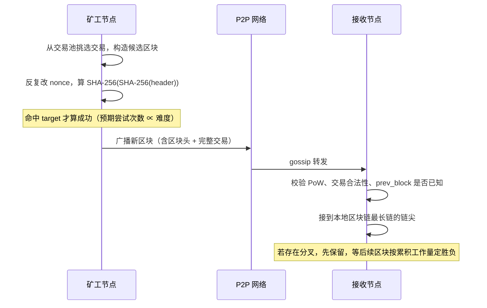
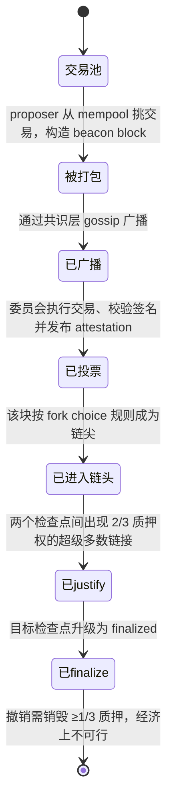
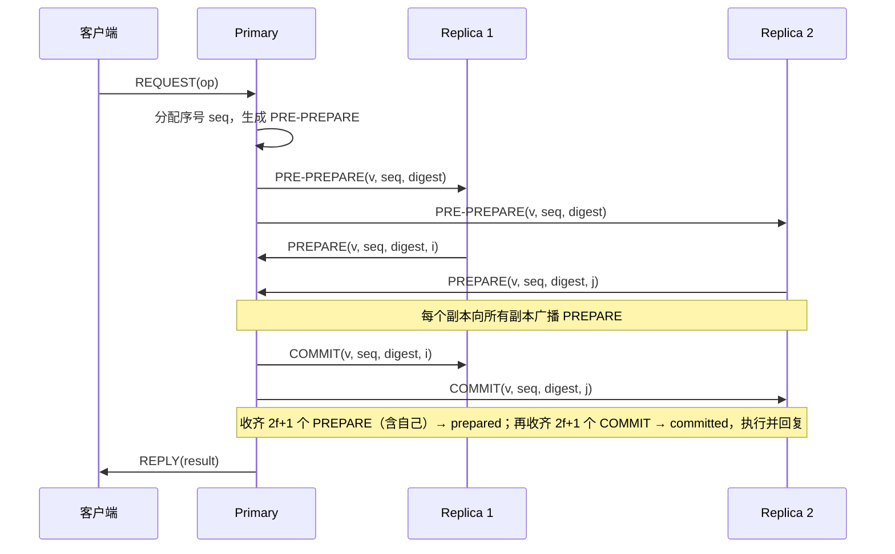

---
tags:
  - 分布式/共识算法
  - 分布式/区块链
---

# 区块链共识算法选型

## 公链（Public Blockchain）

公链是完全开放的区块链网络，任何人都可以参与网络的读写和共识过程。公链通常需要解决去中心化、安全性和可扩展性之间的平衡问题。

### 常见共识算法

1. **工作量证明（Proof of Work, PoW）**
   - **原理**：节点通过解决复杂的数学难题（挖矿）来竞争记账权，第一个解决问题的节点获得记账权并获取奖励。
   - **特点**：
     - 高度去中心化。
     - 安全性高，但能耗大。
     - 典型应用：比特币（Bitcoin）、以太坊（Ethereum 1.0）。
   - **优点**：
     - 抗攻击能力强。
     - 无需信任任何中心化机构。
   - **缺点**：
     - 能源消耗高。
     - 交易确认速度慢。

2. **权益证明（Proof of Stake, PoS）**
   - **原理**：节点根据持有的代币数量和时间（权益）来竞争记账权，持有更多代币的节点获得记账权的概率更高。
   - **特点**：
     - 能耗低、确认速度较快。
     - 典型应用：以太坊 2.0（Ethereum 2.0）、Cardano。
   - **优点**：
     - 节能环保。
     - 交易确认速度较快。
   - **缺点**：
     - 可能导致富者愈富（马太效应）。
     - 安全性依赖于代币分布。

3. **委托权益证明（Delegated Proof of Stake, DPoS）**
   - **原理**：代币持有者通过投票选出少数节点（代表）负责记账，代表轮流生成区块。
   - **特点**：
     - 能耗低、吞吐量高。
     - 典型应用：EOS、TRON。
   - **优点**：
     - 交易确认速度快。
     - 适合高吞吐量场景。
   - **缺点**：
     - 去中心化程度较低。
     - 依赖代表的诚实性。

## 私链（Private Blockchain）

私链是封闭的区块链网络，通常由单个组织或实体控制，只有经过授权的节点才能参与共识过程。私链更注重效率和隐私。

### 常见共识算法

1. **实用拜占庭容错（Practical Byzantine Fault Tolerance, PBFT）**
   - **原理**：节点通过多轮投票达成共识，系统可以容忍少数恶意节点（不超过总节点的 1/3）。
   - **特点**：
     - 低延迟。
     - 典型应用：Hyperledger Fabric。
   - **优点**：
     - 交易确认速度快。
     - 适合高吞吐量场景。
   - **缺点**：
     - 节点数量受限，扩展性较差。
     - 需要预先确定参与节点。

2. **Raft**
   - **原理**：通过选举领导者（Leader）来管理日志复制，领导者负责接收客户端请求并同步到其他节点。
   - **特点**：
     - 简单易实现。
     - 典型应用：私有链和联盟链。
   - **优点**：
     - 容易理解、实现简单。
     - 适合小规模网络。
   - **缺点**：
     - 不支持拜占庭容错。
     - 依赖领导者的可靠性。
   - **完整推导见 `一致性共识算法/03-Raft`（待建）** —— 它属于经典共识，不收在本专栏。

3. **Paxos**
   - **原理**：Paxos 是一种基于消息传递的分布式一致性算法，通过多轮投票和多数派决策机制，确保所有节点对数据状态达成一致。Paxos 分为两个阶段：Prepare 阶段和 Accept 阶段。
   - **特点**：
     - 强一致性：确保所有节点对数据状态达成一致。
     - 容错性：能够容忍部分节点故障。
     - 适合小规模网络。
   - **优点**：
     - 强一致性保证。
     - 容错性强，适合高可靠性场景。
   - **缺点**：
     - 实现复杂，难以理解和调试。
     - 对网络延迟敏感，性能受限于网络条件。
   - **完整推导见 `一致性共识算法/02-Paxos`（待建）** —— 同样属于经典共识。

## 联盟链（Consortium Blockchain）

联盟链是半开放的区块链网络，由多个组织共同维护，只有经过授权的节点才能参与共识过程。联盟链在去中心化和效率之间取得平衡。

### 常见共识算法

1. **PBFT（实用拜占庭容错）**
   - **原理**：与私链中的 PBFT 相同，适用于多组织协作的场景。
   - **特点**：
     - 安全性好。
     - 典型应用：Hyperledger Fabric、R3 Corda。
   - **优点**：
     - 支持拜占庭容错。
     - 适合多组织协作。
   - **缺点**：
     - 节点数量受限。
     - 需要预先确定参与节点。

2. **PoA（Proof of Authority）**
   - **原理**：由经过授权的节点（权威节点）负责记账，权威节点的身份和声誉是共识的基础。
   - **特点**：
     - 能耗低。
     - 典型应用：POA Network、以太坊测试网（Kovan）。
   - **优点**：
     - 交易确认速度快。
     - 适合信任度较高的场景。
   - **缺点**：
     - 去中心化程度低。
     - 依赖权威节点的诚实性。

3. **DPoS（委托权益证明）**
   - **原理**：与公链中的 DPoS 相同，但在联盟链中，代表节点由联盟成员选举产生。
   - **特点**：
     - 能耗低。
     - 典型应用：某些联盟链场景。
   - **优点**：
     - 交易确认速度快。
     - 适合高吞吐量场景。
   - **缺点**：
     - 去中心化程度较低。
     - 依赖代表的诚实性。

## 汇总

| 类型 | 共识算法 | 特点 | 典型应用 |
| --- | --- | --- | --- |
| **公链** | PoW | 去中心化、高能耗、安全性强 | 比特币、以太坊 1.0 |
|  | PoS | 节能、交易确认速度快 | 以太坊 2.0、Cardano |
|  | DPoS | 适合高吞吐量 | EOS、TRON |
| **私链** | PBFT | 低延迟、支持拜占庭容错 | Hyperledger Fabric |
|  | Raft | 简单易实现、适合小规模网络 | 私有链 |
|  | Paxos | 强一致性、容错性强、适合小规模网络 | 私有链中的一致性管理 |
| **联盟链** | PBFT | 安全、适合多组织协作 | Hyperledger Fabric |
|  | PoA | 节能、依赖权威节点 | POA Network |
|  | DPoS | 适合高吞吐量 | 某些联盟链 |

- **公链**：注重去中心化和安全性，适合开放的网络环境。
- **私链**：注重效率和隐私，适合单一组织内部使用。
- **联盟链**：在去中心化和效率之间取得平衡，适合多组织协作场景。

## 信任模型、故障模型与 $3f+1$

选型的起手式是先确定这条链运行在什么信任模型下，之后才轮到比较算法。公链没有准入，任何人可加入或退出、身份匿名，节点数量与身份都不可预知；联盟链有准入，参与方是已知组织、身份经过背书；私链只有单一控制方，节点之间默认互信。信任模型不同，算法要抵御的故障类型与安全假设也不同。

信任模型 → 故障模型 → 可用算法族的对应关系：

```
┌──────────┬──────────────┬──────────────┬──────────────────┐
│ 网络形态 │ 节点准入      │ 要抵御的故障  │ 可用算法族        │
├──────────┼──────────────┼──────────────┼──────────────────┤
│ 公链     │ 无准入、匿名  │ 拜占庭 + 女巫 │ PoW / PoS / DPoS  │
│ 联盟链   │ 准入、半可信  │ 拜占庭        │ PBFT 系 / PoA     │
│ 私链     │ 准入、可信    │ 崩溃          │ Raft / Paxos      │
└──────────┴──────────────┴──────────────┴──────────────────┘
```

「女巫」（Sybil）指攻击者批量伪造身份，让一个实体在网络里表现为成千上万个节点。无准入网络里若把投票权按"节点数"计，伪造身份即可操纵投票，所以 PoW 把投票权绑定到算力、PoS 绑定到质押代币。有准入的网络里身份经背书核验，女巫问题不存在，节点数才有意义。

这里的"可信"指节点不会主动作恶：它可能宕机、丢包、重启，但不会发送自相矛盾的消息。只抵御这类故障的叫崩溃容错（Crash Fault Tolerant, CFT）；还要抵御主动撒谎、伪造、选择性转发的，叫拜占庭容错（Byzantine Fault Tolerant, BFT）。两者对节点数下限的要求差一个量级。

CFT 的失效模型是 fail-stop：故障节点要么不响应，要么按协议正确响应，不会做出协议之外的动作。BFT 的失效模型是任意故障：一个拜占庭节点可以丢消息、延迟消息、向不同节点发送不同内容，在没有签名认证的年代还能伪造他人身份。

这个差别决定了安全论证的形态。CFT 里，只要多数节点播报的消息一致，落单的少数必然是自己过期了，重新向多数对齐即可；BFT 里，多数派本身可能全是坏人，正确性只能靠「两个 quorum 必然相交、交集中至少有一个诚实节点」推出来。PBFT 的 $n \geq 3f+1$ 与 Raft 的多数派，就是这两条论证各自的结论。

数字签名划掉了"伪造他人消息"，但划不掉"沉默""延迟""向不同节点发送互相矛盾的消息"——后者的两条消息各自都有合法签名。所以带签名的 PBFT 仍要 $n \geq 3f+1$。

$f$ 是算法能容忍的故障节点数。设节点总数 $n$、quorum 大小 $Q$，两条约束同时成立：

1. **安全**：任意两个 quorum 必须相交出至少一个诚实节点，即 $2Q - n \geq f + 1$（最坏情况下两个 quorum 重叠 $2Q-n$ 个节点，其中最多 $f$ 个是坏的，要剩下 $\geq 1$ 个诚实的）。由此得 $Q \geq \dfrac{n+f+1}{2}$。
2. **活性**：$f$ 个坏节点全不响应时，剩下的诚实节点 $n-f$ 仍要凑够一个 quorum，即 $n - f \geq Q$。

把第 1 条代入第 2 条：$n - f \geq \dfrac{n+f+1}{2} \Rightarrow 2n - 2f \geq n + f + 1 \Rightarrow n \geq 3f + 1$。

按这个界，PBFT 取 $n = 3f+1$、$Q = 2f+1$：任意两个 $2f+1$ 的 quorum 至少重叠 $f+1$ 个节点，其中至多 $f$ 个是坏的，于是交集里至少有一个诚实节点投过票，两个互相冲突的值不可能同时集齐 $2f+1$ 票。

Raft 走的是另一条路：它假设节点只会崩溃、不会撒谎，所以不需要"交集里免疫一个坏人"这道保护，只要多数派就够。$n = 2f+1$、$Q = f+1$：任意两个多数派必然重叠至少一个节点，同一任期（term）内不可能选出两个 leader；$f$ 个节点宕机后剩下的 $f+1$ 个正好构成 quorum，还能继续选主。同一套约束代入 CFT 的 $f$ 概念，得到的就是多数派，而不是 $3f+1$。

| 协议族 | 故障模型 | 容错上限 | quorum 大小 | 典型 $n$ 与 $f$ |
| --- | --- | --- | --- | --- |
| Raft / Paxos | 崩溃 | $f < n/2$ | 多数派 $\lfloor n/2 \rfloor + 1$ | $n=5, f=2$ |
| PBFT 系 | 拜占庭 | $f < n/3$ | $2f+1$（$n=3f+1$ 时） | $n=4, f=1$ |

这也是联盟链里 4 个排序节点只能容忍 1 个作恶、5 个 Raft 节点能容忍 2 个宕机的原因：同样是 5 台机器，换故障模型就换了容错名额。

## PoW：算力竞争与概率最终性

工作量证明（Proof of Work, PoW）把"谁来提议下一个区块"变成一场算力竞赛：谁先算出满足难度目标的哈希，谁就获得本轮记账权。它不要求节点有身份，因为出块权被绑定到已经花掉的算力上，伪造身份不产生额外算力。

### 一次出块从打包到被接受

比特币区块头的固定布局是 80 字节：`version`(4) → `prev_block`(32) → `merkle_root`(32) → `time`(4) → `bits`(4) → `nonce`(4)。`bits` 是对当前难度目标的紧凑编码，`nonce` 是 32 位计数器。挖矿即反复改动 `nonce`（不够用时再改 coinbase 交易里的 extranonce，从而改变 `merkle_root`）并对整个区块头做两次 SHA-256，直到结果小于 `bits` 编码的目标值。出块后被接受，还要经过全网最长链规则的选择：



关键点在于**广播到被接受之间有窗口**：矿工算出块时全网其他人还在旧链尖上挖。谁的链后续累积了更多工作量，谁才是规范链，另一条分支上的区块就变成孤块（stale / orphan block），其 coinbase 奖励作废。比特币没有叔块机制来补偿孤块，所以这个窗口直接等于矿工的风险。

### 难度调整的周期与上下限

难度目标不是常量，协议按固定周期把它拉回目标出块速度（来源：Bitcoin Developer Guide, Block Chain §Proof of Work）：

- **调整周期**：每 `2016` 个区块重算一次。
- **目标间隔**：`10` 分钟/块，`2016 × 10 分钟 = 1,209,600` 秒（两周），这是重算时用来比对的理想耗时。
- **调整幅度上限**：出块太快时难度最多上调 `300%`（即目标值最多变为原来的 $1/4$，难度最多 ×4）；出块太慢时难度最多下调 `75%`（目标值最多 ×4，难度最多降到 $1/4$）。
- 实现里有一个 off-by-one：实际取的是这 `2016` 个区块里前 `2015` 个的时间戳跨度，会带来轻微偏差（来源：Bitcoin Developer Guide 同节注释）。

为什么需要调整上限？如果单周期内算力暴增几十倍而难度一次跳到位，调整瞬间的偏差会让网络在下一个周期长时间卡住；把单次调整限制在 4 倍以内，把大扰动摊到多个周期里吸收。

**难度调整的语义**：`bits` 字段把 256 位目标压缩成 4 字节（1 字节指数 + 3 字节尾数），难度值定义为 $\text{difficulty} = \dfrac{\text{difficulty\_1\_target}}{\text{current\_target}}$，其中 `difficulty_1_target` 是创世难度对应的目标。全网算力上升时，为维持 10 分钟间隔，目标必须等比缩小，难度值随之上升。

### 孤块率与确认数

孤块率衡量的是"广播窗口 ÷ 出块间隔"这个比值。间隔越长、传播越快，窗口内越少人白挖，孤块率越低；比特币把间隔定在 10 分钟，就是把孤块率压到很低的水平。反过来，任何把出块间隔缩短到十几秒的 PoW 链，都会撞上传播延迟与出块速度同量级的问题，孤块率显著上升 —— 以太坊 PoW 时期的叔块（uncle）机制就是为补偿这类"被看见但没上主链"的区块而设计的，叔块也能拿到部分奖励。

**确认数与重组概率**：一笔交易被打包进区块，只是"当前最长链包含它"。攻击者若持有算力 $q < 0.5$，可以在私链上追赶，追上的概率随确认数 $z$ 增加而指数衰减 —— 白皮书 §11 给出的是这个追赶概率模型（来源：*Bitcoin: A Peer-to-Peer Electronic Cash System*, §11）。「6 确认」是钱包与交易所的约定阈值，协议本身没有把它写成常量；它保证的是"在攻击者算力低于网络的假设下，逆转概率已经足够小"，属于概率最终性，不是绝对最终性。

**确认数为什么不能无限加**：确认数每加一，攻击者追赶概率下降，但用户等待时间线性增加。6 这一档是"逆转概率已很小、等待时间尚可接受"的折中，交易金额越大，交易所通常会要求更多确认。

**PoW 承认的局限**（这些是选型时先要排掉的）：

- **算力集中**：矿池把分散的算力重新聚合，实际出块权集中在少数池子手里；算力集中到超过 50% 时，双花与审查在理论上可行。
- **自私挖矿（selfish mining）**：即使算力低于 50%，通过刻意隐瞒已挖到的区块、诱导他人做无用功，也能获得超出算力比例的收益（来源：I. Eyal, E. G. Sirer. *Majority is not Enough: Bitcoin Mining is Vulnerable*. 2014）。这动摇了"算力占比 = 收益占比"的直觉。
- **能耗随算力线性增长**：难度上调意味着全网每秒哈希次数上升，电力投入与算力成正比，这是机制的直接推论。
- **吞吐与最终性的根本矛盾**：出块间隔长（10 分钟）+ 区块容量受限（早期 1 MB，SegWit 后按 weight `4,000,000` 计，来源：BIP 141）把吞吐锁在个位数 TPS 量级；概率最终性又要求多确认等待。要吞吐就得缩间隔，缩间隔就撞上孤块率，这是 PoW 内部解不开的死结。

**重组概率可以量化**。设攻击者算力占比 $q$、诚实网络占比 $p = 1-q$，攻击者在私链上落后诚实链 $z$ 个区块。攻击者要完成逆转，必须让这条随机游走抹平 $z$ 个区块的差额。当 $q < p$ 时游走带负漂移，追上概率近似为 $(q/p)^z$ —— 白皮书 §11 给出的是更精确的泊松追赶模型，这里取它的近似形式（来源：*Bitcoin: A Peer-to-Peer Electronic Cash System*, §11）。取 $q = 0.1$、$p = 0.9$、$z = 6$，$(0.1/0.9)^6 \approx 1.9 \times 10^{-6}$，量级已经很小；若攻击者算力升到 $q = 0.3$，同一 $z=6$ 的概率涨到约 $0.2$ —— 可见真正决定安全的是攻击者算力占比，确认数只是在给定 $q$ 下把概率指数压低的旋钮。这也解释了交易所与钱包为什么按金额分档要求确认数：金额越大，能容忍的逆转概率越低，档位越高。

**重组深度与工程检测**。节点遇到分叉时不会立刻丢区块，而是把两条分支都留着，等后续区块按累积工作量定出胜者；被判负的分支上已挖出的区块作废。工程上判断"是否处在重组中"看两个信号：连续出现同一高度的多个区块、链头长时间来回切换。交易所风控通常设两档阈值：浅档标记风险，深档才放行提现；出现超过既定深度的重组就暂停该币种充值并复核。这也回到同一条判断：**确认数是概率阈值，不是绝对屏障**。

**孤块率与出块间隔的方向性关系**：单位时间内产生的区块越多，两个矿工几乎同时出块的概率越高，孤块率随出块频率上升而上升。推导很直接：出块过程可近似看作无记忆的到达过程，间隔缩短一半，冲突窗口出现的次数大致翻倍，而每次冲突都意味着有一个区块要作废。这条关系解释了为什么不同 PoW 链必须各自标定间隔 —— 比特币 10 分钟对应极低孤块率，间隔更短的链要么接受高孤块率，要么像以太坊那样引入叔块机制把作废区块的一部分奖励补回来。

**孤块率还决定了"最长链"之外的判断口径**：因为存在作废区块，节点比较链时用的是累积工作量而不是区块个数，两条分支谁的工作量大谁胜出 —— 这也解释了为什么同样高度的两条链不一定等价，以及为什么"最长链"这个叫法在比特币里其实指的是"工作量最大的链"。

## PoS：权益权重、罚没与最终性

权益证明（Proof of Stake, PoS）把出块权绑定到质押的代币，而不是算力。以太坊在 2022 年 9 月完成从 PoW 到 PoS 的合并（The Merge）后，时间不再由难度调节，而是切成固定节拍：**时隙（slot）12 秒、纪元（epoch）32 个 slot**；每个 slot 用 RANDAO 伪随机选出一个验证者当出块人（proposer），同时随机抽一个委员会（committee）为该区块投票（attestation）；一个验证者要参与，须向存款合约质押 **32 ETH** 并运行执行客户端、共识客户端与验证者客户端三件套（来源：ethereum.org, Proof-of-stake）。

出块权与权益的关系是概率性的：质押越多，被选为 proposer、被抽进委员会的概率越高，长期出块份额收敛到质押占比。PoS 改用押金作安全预算：作恶的代价是押金被销毁（罚没，slashing）。

一笔交易在 PoS 链上的生命周期：



这条状态链和 PoW 的关键差别在末两态：PoW 只有"概率上越来越难改"，PoS 有一个明确的事件 —— 达成 supermajority link 后交易变为 **finalized**，由 Casper FFG（Casper the Friendly Finality Gadget）负责升级检查点（来源：ethereum.org, Proof-of-stake §Finality）。

### Nothing at stake 与两类缓解

PoS 有一个 PoW 没有的攻击面：**nothing at stake**。验证者的签名没有物理成本，链分叉时它可以对每条分支都签名而几乎不付出代价 —— 某条分支胜出后，它总能声称自己支持过胜者。PoW 里矿工必须在某条分支上投入算力，投入即锁定，无法两头下注。

两类缓解手段配合使用：

1. **罚没（slashing）**：对可被密码学证明的双重签名、以及围绕同一目标的两个互相矛盾的投票，协议扣减甚至全额销毁验证者的质押。约束一旦写进协议，两头下注从"无成本"变成"押金归零"，nothing at stake 的收益前提被抽掉。
2. **检查点最终性（checkpoint finality）**：不只看最长链，而是让验证者对成对的检查点（epoch 边界区块）投票；当一对检查点拿到 ≥2/3 总质押权的票，较早的那个由 justified 升级为 finalized。finalized 之后的区块，撤销需要让 ≥1/3 的质押被罚没，攻击者在经济上不划算（来源：ethereum.org, Proof-of-stake §Finality）。

活性方面，如果 ≥1/3 的质押权选择拖延投票，链就无法达成 2/3，最终性会停摆。对此的防线是**不活跃泄漏（inactivity leak）**：当链连续超过 4 个 epoch 未能 finalize 时触发，逐步销毁那些"投反对票"的验证者的质押，让诚实方的相对权重回升，重新凑够 2/3（来源：ethereum.org, Proof-of-stake §Finality）。

### 弱主观性

PoS 的另一个结构性问题是**长程攻击（long-range attack）**：早期持币者退出质押、拿到私钥后，可以用这些旧密钥从很早的高度另造一条分叉链，因为 PoS 造块不消耗算力，"重造历史"的成本只是签名，不像 PoW 要为每个块重新烧一遍算力。

缓解手段是**弱主观性（weak subjectivity）**：新加入的节点、以及离线时间超过"质押赎回期"的节点，必须先从一个可信渠道获取一个较新的**弱主观性检查点**（一个 `(block_root, epoch)` 对），把它当作伪创世块，之后再从该点起独立验证。检查点同时充当**回退限制（revert limit）**：任何与检查点冲突的区块被直接拒绝，长程分叉在机制层面被判为非法（来源：ethereum.org, Weak subjectivity）。

弱主观性把"必须信任网络"降到很小的程度：只要检查点距离大于验证者的赎回期，在那个高度造假的验证者还没赎完质押、可以被罚没，于是只需信任"这个检查点是真的"一件事，之后全是可独立验证的（来源：V. Buterin. *Proof of Stake: How I Learned to Love Weak Subjectivity*. 2014）。工程上这表现为共识客户端普遍支持的 checkpoint sync：从可信的 Beacon API 拉一个较新的 finalized state 作为起点。

## DPoS：代表轮次与它的代价

委托权益证明（Delegated Proof of Stake, DPoS）在 PoS 上再收一层：持币人不直接出块，而是投票选出一小组**代表（block producer）**，由代表按固定轮次轮流出块。它换到的是确定性出块顺序与高吞吐，代价是代表数量少、投票权集中。

EOS 的白皮书给出的参数是：区块每隔 **0.5 秒**产生一个，任一时点恰好有一个代表获授权出块；出块以 **126 个区块为一轮**（6 块 × 21 个代表）；一轮开始时选出 21 个代表并按约定顺序排列；一个区块集齐 **15/21（即 2/3+1）** 个代表签名后即视为不可逆，正常情况下 1 秒内可达不可逆（来源：EOS.IO Technical White Paper v2, Consensus Algorithm）。

```
一轮 126 个区块（21 个代表 × 每个 6 块）
slot:  0 1 2 3 4 5 | 6 7 8 9 10 11 | ... | 120 ... 125 | 下一轮
代表:  P0          | P1            | ... | P20        |
▶ 每个代表在自己那 6 个块的窗口内连续出块，窗口结束换下一个
▶ 代表缺席则其窗口内所有 slot 被跳过，链上留 0.5 秒的缺口
```

轮次出块把"竞争下一个区块"变成"排队轮到谁"，代表相互合作而非竞争，正常情况下不出分叉。不确定性来自代表缺席：某个代表掉线时，它窗口内的区块全部跳过，交易要等下一个代表。

DPoS 的代价集中在两处：

- **投票集中**：只有几十个代表，持币量大的地址和交易所的票权重极高，实际控制权向少数实体聚拢；代表之间还可能形成投票同盟（卡特尔）。
- **代表的激励偏差**：当"审查某笔交易"或"双签"的收益大于被投票赶下台的损失时，兜底手段只剩投票惩罚。

## PBFT：三阶段与 $n \geq 3f+1$

实用拜占庭容错（Practical Byzantine Fault Tolerance, PBFT）是联盟链与私链里最常被引用的 BFT 算法，由 Castro 与 Liskov 在 OSDI 1999 提出（来源：M. Castro, B. Liskov. *Practical Byzantine Fault Tolerance*. OSDI 1999）。它假设节点身份已知、消息可认证，用**状态机复制**把客户端请求在 $n$ 个副本上按同一顺序执行，只要作恶节点不超过 $f$（$n \geq 3f+1$）就能同时保证安全与活性。

与 PoW / PoS 相比，PBFT 的最终性是**确定的**：一个请求集齐 quorum 即完成，不存在"再等几个块"的概率窗口。它的问题在扩展性 —— 通信量随节点数平方增长，节点数上限通常只有几十个，链上于是用"委员会 / 质押"把参与者先选小，再在其上跑 BFT。

### 三阶段报文、quorum 与视图切换

PBFT 有 leader（primary，由 $view\ \%\ n$ 推出）与其余 replica。正常流程是 pre-prepare → prepare → commit 三阶段，客户端请求先到 primary，再由 primary 排序广播：



- **pre-prepare**：primary 给请求分配视图号 $v$ 与序号 $seq$，向所有备份广播 `PRE-PREPARE(v, seq, digest)`。备份接受它有两个条件：自己在视图 $v$ 中、且未在同一个 $seq$ 接受过另一个 digest（防止 primary 在同一序号塞两条不同请求）。
- **prepare**：每个备份收到 pre-prepare 后向**所有**副本广播 `PREPARE`。当一个副本收到 $2f+1$ 个匹配的 prepare（含自己），进入 **prepared** 状态 —— 这个数字保证了三阶段之间的 quorum 相交。
- **commit**：进入 prepared 后广播 `COMMIT`；收齐 $2f+1$ 个匹配 commit 后视为 committed，执行请求并回复客户端。客户端收齐 $f+1$ 个相同回复，就确认结果是全网一致的结果。

为什么每阶段都要 $2f+1$？这正是前面 $3f+1$ 推导落到流程里的结果：$n=3f+1$ 时 quorum 取 $2f+1$，任意两个 quorum 重叠 $\geq f+1$ 个节点，其中至少一个诚实，于是"某个诚实节点既看到 prepared 又看到 conflicting commit"这类矛盾无法成立。三阶段拆开的原因是要同时防止：primary 给不同备份发不同请求（pre-prepare 阶段的 digest 校验加 prepare 交叉验证挡掉）、以及部分备份提前执行（要等 commit 阶段集齐 quorum）。

primary 可能是恶意的或不响应的。副本各带一个计时器，等待请求超时即怀疑 primary，发起**视图切换（view change）**：

1. 副本广播 `VIEW-CHANGE(v+1, n, C, P)`，其中 $C$ 是它已 prepared 的请求集合的证明，$P$ 是这些请求的 pre-prepare 消息集合。
2. 新 primary（视图 $v+1 \bmod n$）收到 $2f+1$ 个视图切换消息后，广播 `NEW-VIEW`，其中包含一份新的 pre-prepare 集合 $O$。
3. 副本校验 $O$ 与各自持有的 $C$、$P$ 一致，随后在新的视图里重跑三阶段。

视图切换要解决的核心问题是：**已经 committed 的请求不能因为换主而丢失或重排**。做法是让新 primary 在 $O$ 里为所有"至少被一个 quorum 见过 prepared"的请求保留序号 —— 由于 prepared 需要 $2f+1$ 个 prepare，而集合 $C$ 又只有 $2f+1$ 张视图切换消息才被采信，两个 quorum 必然相交，新 primary 一定见过旧请求。这就是 PBFT 不假设同步时钟也能保证安全的关键；它也直接推高了报文量 —— 一次视图切换的通信是 $O(n^2)$，这正是"节点数上去就不行"的量化来源。

## 区块链共识与经典共识的边界

经典共识（Paxos、Raft、Zab）与区块链共识要回答的问题有根本差别：经典共识**先假设 proposer 唯一且身份已知**，算法只解决"这个提案如何被所有副本按同一顺序接受"；区块链要额外解决"**谁来提议**"—— 在无准入、可能拜占庭、还可能伪造身份的网络里，连"该由谁提"都不确定。前者的完整推导在 [[00-一致性共识算法专栏导览|一致性共识算法]]，本篇只讲它们在链里的位置。

这条边界决定了经典算法在链里的用法：它们只出现在**参与者已被准入、且不预期作恶**的环节。Hyperledger Fabric 把"背书执行"（peer）与"定序"（orderer）分开：orderer 组成排序服务，只负责把交易排成确定顺序并打成区块。因为用的是确定性共识，peer 验证区块即为最终，账本不会像无准入链那样分叉（来源：Hyperledger Fabric Docs, The Ordering Service）。

### 链上如何把 BFT 缩到委员会

BFT 的通信量随 $n$ 平方增长，直接让全网成千上万个节点跑 PBFT 不现实。链上常见的做法是先用一层**准入或质押**筛出一小组委员会，再在委员会内部跑 BFT：

- **许可链直接指定**：联盟链的排序/共识节点由成员组织背书确定，$n$ 本来就小（几个到几十个），PBFT 的 $O(n^2)$ 可以接受。
- **公链按质押抽委员会**：PoS 链用随机抽样把全网验证者切成每个 slot 的委员会，委员会内部再聚合投票；抽样保证每个委员会里坏人的比例大概率不超过阈值，把 PBFT 的假设搬到随机子集上。
- **阈值签名压缩报文**：把 $2f+1$ 个签名聚合成一个固定大小的聚合签名，让 commit 阶段的广播不必逐个转发 $O(n)$ 份，缓解平方级的通信压力。

**Raft 在 Fabric 里的位置**：排序服务选 Raft 时（自 v1.4.1 起可用），每个 channel 独立跑一份 Raft 实例、各自选 leader，leader 把交易排进日志并复制给 follower；只要多数排序节点在线（5 节点可容忍 2 个宕机），排序服务就能继续工作。它的容错边界是**崩溃**，不是拜占庭，所以"排序节点被恶意控制"不在 Raft 的保护范围里（来源：Hyperledger Fabric Docs, The Ordering Service §Raft）。这也解释了为什么 Fabric 要额外提供 BFT 排序服务：当排序节点分属多个互不信任的组织时，CFT 的假设不再成立。

## PoA：权威节点与准入前提

权威证明（Proof of Authority, PoA）把出块权交给一组**经过授权、身份公开的节点**。它的前提与私链、联盟链完全一致：节点身份可核验、并且默认不出于恶意目的破坏网络。只要准入还在，PoA 就成立；一旦允许匿名节点加入，整个模型立刻失效 —— 因为没有任何机制阻止攻击者批量伪造"权威"。

以 go-ethereum 的 Clique 为例，它的参数与约束写得非常明确（来源：EIP-225, Clique proof-of-authority consensus protocol）：

- 只有授权签名者（authority set）能出块；签名直接附在区块头 `extraData` 末尾的 65 字节 secp256k1 字段里，`miner` 字段因此可省，`COINBASE` 与手续费都归真实签名者。
- 出块按轮次：当 `BLOCK_NUMBER % SIGNER_COUNT == SIGNER_INDEX` 时该签名者 in-turn，难度记为 `DIFF_INTURN = 2`；否则 out-of-turn，难度 `DIFF_NOTURN = 1`。in-turn 权重更高，应等待出块时刻立即签名广播；out-of-turn 则随机延迟 `rand(SIGNER_COUNT * 500ms)` 再签，以降低小区块分叉。
- 每个签名者每 `SIGNER_LIMIT = floor(SIGNER_COUNT / 2) + 1` 个连续区块里最多出 1 个块；授权名单的增删需要多数共识（`SIGNER_LIMIT`）才能生效。
- 建议的出块间隔 `BLOCK_PERIOD = 15s`，检查点周期 `EPOCH_LENGTH = 30000` 个区块。

```
PoA 的一轮（N 个授权签名者）
block#:  k      k+1     k+2    ...   k+N-1
in-turn: S0     S1      S2     ...   S(N-1)
         └ 谁轮到由 block# % N == 索引 决定；未轮到的可补位但延迟随机量
```

PoA 的容错假设比 BFT 弱得多：单个作恶签名者每 `SIGNER_LIMIT` 个区块只能出一个块，破坏力被频率限制住，其余签名者可以投票把它踢出；要真正阻断网络，需要控制**超过一半的签名账户**（来源：EIP-225 的威胁模型分析）。它因此只适合信任度较高的场景，例如联盟链成员共同维护的一条链，或测试网。以太坊早期的 Kovan 测试网就采用 PoA 出块（来源：以太坊测试网公开资料，具体弃用时间待验证）。

**PoA 与相邻算法对照**：

| 维度 | PoA（Clique 型） | PBFT 系 | PoW |
| --- | --- | --- | --- |
| 准入要求 | 必须有授权名单 | 参与者已知 | 无准入 |
| 故障模型 | 崩溃 + 有限恶意（受频率限制） | 拜占庭 | 拜占庭 + 女巫 |
| 容错名额 | 作恶需控制过半数签名账户 | $f < n/3$ | 算力 $< 50\%$ |
| 最终性 | 快速、近似确定 | 确定性 | 概率 |
| 出块权来源 | 预先授权 | 视图轮转 | 算力竞争 |

两条失败模式值得单列：一是**授权名单被伪造**——PoA 的安全性完全建立在"名单里的身份是真权威"之上，名单的管理合约一旦被攻破，信任根基就没了；二是**权威节点集体失联**——出块权没有算力或质押做后备，签发者全掉线时链直接停，不像 PoW 能靠剩余算力继续。这两点合起来划定了 PoA 的适用边界：**只在成员身份可核验、并愿意为在线率负责的联盟里用**。

**Clique 的部署形态**：在 go-ethereum 里，PoA 网络由创世文件的 `extraData` 指定初始签名者列表，配合两个创世参数 `period`（出块间隔秒数）与 `epoch`（检查点长度）即可起一条私有链；运行中的签名者增删走链上投票（用魔数 nonce 标记授权或移除）（来源：EIP-225）。它因此非常适合做开发网与测试网：起链不需要矿工、不需要质押，出块立刻发生。反过来，这条链的价值完全取决于出块者是谁 —— 同一份代码既可以用来跑一条成员互信的联盟链，也可以把名单交给单一运维方而退化成中心化账本。

**与联盟链其他算法怎么选**：成员数量小、彼此能接受"轮流出块加事后投票踢人"的，用 PoA 运维最轻，起链不需要矿工也不需要质押；成员之间存在明确不信任、需要密码学级别的安全证明的，用 PBFT 系，代价是要处理视图切换与更大的报文量。两者的分界不在性能，而在"是否愿意把出块权默认交给一群可信的人"。

## 选型判据

把前几节收成一张对照表，每格的数字都标出依据，核不到的只给量级并注明：

| 网络形态 | 故障模型 | 最终性 | 吞吐量级 | 典型系统 |
| --- | --- | --- | --- | --- |
| 公链（无准入） | 拜占庭 + 女巫 | 概率最终性，确认数越长越稳 | 个位数～数十 TPS（受 10 分钟间隔与区块容量限制，来源：BIP 141 的 weight 上限） | Bitcoin |
| 公链（无准入） | 拜占庭 + 女巫 | 检查点最终性，约两个 epoch | 数十 TPS 量级（受 12 秒 slot 与 gas limit 限制，具体值随区块变动，待验证） | Ethereum |
| 公链（无准入） | 拜占庭 + 女巫 | 代表聚合签名后快速不可逆 | 千级 TPS（EOS 白皮书称不可逆 ≤1 秒，来源：EOS.IO Technical White Paper v2） | EOS |
| 联盟链（准入） | 拜占庭 | 确定性，请求集齐 quorum 即最终 | 千级 TPS（节点数小时 $O(n^2)$ 报文可控，具体实测值待验证） | Hyperledger Fabric |
| 私链（准入、可信） | 崩溃 | 确定性，日志提交即最终 | 万级 TPS（多数派提交，无拜占庭开销，具体实测值待验证） | Hyperledger Fabric（Raft 排序） |

表中的"最终性"一列是选型的第一个分水岭：**概率最终性**意味着交易可能被重组，业务侧必须容忍"确认后仍可能回滚"；**确定性最终性**意味着一旦提交不可撤销，业务可以直接当数据库事务处理。

### 判据：什么信任模型下哪类可用

把上表反过来用，得到的是排除法：

```
是否需要多方可验证的状态？
├─ 否（可信第三方在场，如单组织内部数据库）──▶ 不该用区块链，用普通数据库 / Raft 复制即可
└─ 是
   ├─ 参与方是否可信（只崩溃、不作恶）？
   │   ├─ 是 ──▶ 私链 / 权限链：Raft / Paxos（CFT，多数派）
   │   └─ 否 ──▶ 参与方是否已知（有准入）？
   │        ├─ 是（联盟链）──▶ PBFT 系 / PoA（BFT，n ≥ 3f+1）
   │        └─ 否（公链）──▶ 是否需要高吞吐？
   │             ├─ 否，要最大去中心化 ──▶ PoW
   │             └─ 是 ──▶ PoS（去中心化与最终性折中）或 DPoS（吞吐优先，牺牲去中心化）
```

四条判据按顺序落地：

1. **有没有可信第三方**。存在一个所有参与方都信任的机构时，多方可验证账本的开销没有收益，直接用数据库加 Raft 复制。这一条排除了大量"为了区块链而区块链"的场景。
2. **参与方会不会作恶**。只崩溃就选 CFT（Raft 系），$n=2f+1$，成本低；可能作恶就必须 BFT（PBFT 系），$n=3f+1$，节点数上限被平方级通信压住，通常只能几十个。
3. **参与方是否已知**。已知（有准入）才能按身份限定共识参与者，BFT 的假设才有落点；未知（无准入）就必须先把投票权绑定到一个稀缺资源上，按资源选 PoW（算力）或 PoS（质押）。
4. **要确定性还是概率最终性**。金融结算、跨组织对账这类需要"提交即不可撤"的场景，选 PBFT 系或 PoS 的检查点最终性；只要"足够难逆转"的场景可用 PoW。

## 配置项

链共识的可调参数不多，但每一个都牵动一组取舍。下面按「默认值 → 语义 → 什么时候改 → 改大或改小的后果 → 联动 → 失败模式」六要素列出。带出处的写具体值，核不到官方默认值的标「待验证」。

**出块间隔（block time / slot duration）**：比特币的目标间隔是 `10` 分钟（来源：Bitcoin Developer Guide），以太坊 PoS 的时隙是 `12` 秒（来源：ethereum.org, Proof-of-stake），EOS 是 `0.5` 秒（来源：EOS.IO Technical White Paper v2），Clique 建议 `15` 秒（来源：EIP-225）。语义是"两个区块之间允许的最小/目标时间差"。改小会加快链头推进、降低确认延迟，但广播窗口相对变大，孤块/分叉率上升，状态增长加快；改大则吞吐下降、等待变长。它与难度调整周期、区块容量、确认数策略联动：间隔缩小后，难度（或 slot 数）必须同步重标定，否则出块速度不稳。失败模式是"间隔小于网络广播延迟"——节点长期在旧链尖上挖/签，分叉持续出现，最终性延迟。

**难度调整周期与幅度上限**：比特币的周期是每 `2016` 个区块一次，理想耗时 `1,209,600` 秒，单次上调上限 `300%`（目标最多降到 $1/4$）、下调上限 `75%`（目标最多升到 4 倍）（来源：Bitcoin Developer Guide）。语义是"每隔固定区块数，按实测耗时把难度拉动到目标间隔"。算力平稳时一般不改；算力大幅波动或新链启动时才需要关注。周期改短会让难度对噪声更敏感、容易在算力抖动时来回震荡；改长则对算力突变的响应变迟钝，出块速度长时间偏离目标。它与出块间隔联动（决定期望耗时），也与挖矿收益预期联动。失败模式是调整窗口内出现极端算力事件（大量算力闪电进场/退场），难度在未调整窗口里长时间错配，出块忽快忽慢。

**epoch 长度**：以太坊 PoS 一个 epoch 为 `32` 个 slot（来源：ethereum.org, Proof-of-stake），每个 epoch 的第一个区块是检查点。语义是"最终性投票与罚没结算的批大小"。它决定了两件事：只有当全部活跃验证者在一个 epoch 内都投过票，才凑得齐证明超级多数链接的样本，因此最终性以 epoch 为粒度；以及随机抽样与惩罚的统计窗口。改小会让委员会更频繁重组、最终性更快但开销更高；改大则最终性延迟拉长。它与确认数、惩罚窗口联动。失败模式是 epoch 过长时，一个 epoch 内未 finalize 的窗口变长，不活跃泄漏更容易触发；过短则投票与聚合开销压过收益。

**确认数（confirmation depth）**：PoW 链上钱包与交易所常用的默认是 `6` 个区块（属社区约定，协议未写死，概率模型见白皮书 §11）。语义是"交易所在区块之后还要求多少后续区块才视为可接受"。它按交易金额与对方风险调整：金额越大要求越多，小额支付可降低。改小会缩短等待但放大被重组风险，改大会更安全但用户感知变慢。它与出块间隔、攻击者算力占比联动 —— 同样的确认数，出块越快覆盖的真实时间越短。失败模式是"确认数远小于链的真实重组深度"，在算力剧烈波动或分叉期，已确认交易仍可能被回滚。

**验证者质押额（validator stake）**：以太坊要求 `32` ETH（来源：ethereum.org, Proof-of-stake）。语义是"参与出块与投票的入场押金，也是罚没的上限"。它决定了单验证者的权重粒度与作恶成本。协议层面通常不直接改（要硬分叉），实际能调的是参与验证者的数量。质押门槛降低会让验证者数量膨胀、共识开销上升；提高则排除小参与者、集中度上升。它与罚没比例、不活跃泄漏、最终性阈值（2/3 质押权）联动。失败模式是质押过度集中到少数实体，作恶被罚没的威慑因"罚的是同一批人"而打折。

**排序节点 quorum（Fabric Raft / BFT）**：Raft 排序服务的 quorum 是**多数派**（5 节点可容忍 2 个宕机），BFT 排序服务可容忍不超过 1/3 的作恶（来源：Hyperledger Fabric Docs, The Ordering Service）。语义是"能提交日志/区块所需的最小在线节点数"。扩容时按奇偶与容错名额一起规划，不单独改。节点数改大提高容错名额但抬高通信与运维成本；改小则容错名额下降。它与排序节点部署位置（跨机房）、channel 数量联动 —— 每个 channel 独立跑一份 Raft。失败模式是"失去 quorum"：Raft 集群剩余节点不足多数时，该 channel 的排序服务读写都停摆，新日志无法提交。

## 版本演进

**比特币的难度调整**：从创世至今每 `2016` 个区块调整一次、目标间隔 `10` 分钟这条规则没有变（来源：Bitcoin Developer Guide）。变的是区块容量的计价方式 —— 早期按 1 MB 的区块大小上限约束，SegWit（BIP 141）之后改为按 `4,000,000` weight 计，等价容量约 1–2 MB；难度算法本身、以及与它绑定的调整周期都保持原样，调整幅度上下限（目标的 $1/4$ 到 4 倍）也沿用至今。

**以太坊从 PoW 到 PoS**：以太坊在 2015 年上线时是 PoW，2022 年 9 月的合并（The Merge）把执行层保留、把共识层换成 PoS，出块节奏从"难度决定"变为"12 秒 slot / 32 slot epoch"（来源：ethereum.org, Proof-of-stake）。合并之后，fork choice 也从 PoW 时期的 GHOST 换成 LMD-GHOST（按证明权重投票选链尖），再叠加 Casper FFG 的检查点最终性。此后的两个大节点是 2023 年开放质押赎回（Shapella）与 2024 年引入 blob 数据（Dencun）：前者让"质押可以被取出"成为现实，也让弱主观性的"赎回期"成为需要管理的窗口；后者改变的是数据可用性成本，不改变共识本身。

**PBFT → 各类 BFT 变体**：PBFT（1999）开创了 $n \geq 3f+1$ 的三阶段 BFT；其后 BFT-SMART 把工程实现打磨成库，HotStuff 用流水线与三链式提交把轮次通信降到线性（来源：M. Yin, D. Malkhi, M. K. Reiter, G. G. Gueta, I. Abraham. *HotStuff: BFT Consensus in the Lens of Blockchain*. 2019），Tendermint 把 BFT 与出块轮次绑定。Hyperledger Fabric 的 BFT 排序服务选的是 **SmartBFT** —— 它在设计上受 BFT-SMART 启发，可看作 PBFT 非流水线版本的后继，容忍不超过 1/3 的排序节点作恶（来源：Hyperledger Fabric Docs, The Ordering Service §BFT）。

**Fabric 排序服务的更替**：Raft 排序服务自 v1.4.1 起可用，是生产环境的默认选择；Solo 在 v2.x 被弃用（仅供测试的单节点实现），Kafka 在 v2.x 被弃用、v3.x 起不再支持；BFT 排序服务在 3.0 引入（来源：Hyperledger Fabric Docs, The Ordering Service §Ordering service implementations）。这条次序把排序层的目标从"能跑"推向"能抗"：从单节点走向集群，再从崩溃容错走向拜占庭容错，安全界本身没动。

**难度炸弹与合并的时间线**：以太坊在 PoW 时期的难度计算里额外塞了一项随时间指数上升的"难度炸弹"，用来在合并窗口到达时把出块速度压到不可用，逼迫网络切换到 PoS；合并完成后这项被移除（来源：ethereum.org, The Merge 相关文档）。理解这段演进的落点：难度炸弹是把"共识切换"这个社会决策翻译成协议层的自动压力，属于少数把迁移写进奖励函数的例子。

## 底层依赖

共识算法本身只描述"谁提议、怎么表决"，真正把它跑起来还压着几层基础设施。每一层都反推出若干必须存在的参数。

**P2P 广播层（gossip）**。区块与交易靠点对点扇出传播，没有中心广播树。比特币用 `inv` / `getdata` 先通告哈希再拉取内容，并用 compact block（BIP 152）只发交易短 id 以缩短区块传播时间；以太坊共识层用 attestation 与 beacon block 的 gossip 通道。这层依赖直接推出三个必须存在的参数：**消息去重缓存**（同一区块被多个 peer 转发，必须记"见过"避免回环）、**扇出度与心跳间隔**（决定传播延迟与带宽）、**最大消息尺寸**（决定单块能塞多少数据）。传播延迟的量级决定了出块间隔的下限：间隔必须显著大于"区块从产生到覆盖多数节点"的时间，否则孤块率失控 —— 这也是 PoW 把间隔定在 10 分钟、而 PoA 里 out-of-turn 签名者要随机延迟的原因。

**交易池（mempool）**。交易先进入本地池子等待打包。因为池子有容量上限，必须有**手续费率排序与驱逐策略**（池满时按 feerate 淘汰）、**最低中继费率**（低于阈值不转发）、**交易替换规则**（RBF，BIP 125 允许用更高费替换同输入交易）。这些参数不直接出现在共识里，却决定"哪些交易有资格被提议"。比特币的池容量、最低中继费率和以太坊的账户/全局槽位上限都是这类参数（具体默认值随客户端版本变动，待验证）。失败模式是池长期满 → 低费率交易被无声驱逐，用户看到"发出去了但迟迟不上链"。

**状态存储**。链要把执行结果持久化成可验证的状态。以太坊用状态树（Merkle Patricia Trie）的根哈希把全网状态压成一个可验证承诺，落在 LevelDB/RocksDB 上；状态根进区块头，节点据此校验状态转移。它推出两个必须存在的概念：**状态根（state root）** 与 **剪枝/归档策略** —— 一旦有了确定性最终性，历史状态就可按策略剪掉；需要全历史查询的节点则开归档模式，代价是磁盘线性增长。比特币的 UTXO 集是另一种状态表示，状态更小，剪枝策略也随之不同。

**时钟与密码学原语**。PoW 用区块时间戳的中位数（median time past）作为时间判据，允许节点时钟有偏差；PoS 的 slot 时钟要求节点在秒级内对齐，否则会错过投票窗口；弱主观性检查点的"赎回期"也以真实时间为单位。这推出"节点必须有一个大致可靠、但不要求全局精确同步的时钟"这条前提 —— 它也是为什么 BFT 系（PBFT、Tendermint）通常假设部分同步网络。密码学侧推出三条不可省的原语：**哈希函数**（PoW 的 SHA-256d 与区块链接）、**数字签名**（secp256k1 / Ed25519，用于身份与消息认证）、**聚合/阈值签名**（把多个签名压成固定大小，缓解 BFT 的平方级通信）。缺任一原语，对应机制就无法成立。

四层依赖与它们各自逼出来的参数，可以并成一张对照：

```
层次          依赖的机制              由此必须存在的参数
────────────┬──────────────────────┬──────────────────────────────────
P2P 广播层   │ 点对点 gossip 扇出    │ 去重缓存、扇出度、心跳间隔、最大消息尺寸
交易池       │ 本地等待队列          │ 最低中继费率、费率排序与驱逐、RBF 替换规则
状态存储     │ 可验证状态承诺        │ 状态根、剪枝/归档策略、快照周期
时钟与密码学 │ 时间戳 / 身份认证     │ 时间戳窗口（中位数或 slot 边界）、签名与聚合方案
────────────┴──────────────────────┴──────────────────────────────────
▶ 逐格读法：左列是机制，右列是"不给这个参数，机制就跑不起来"的最小集合
```

这四层里任一层提供的参数被写错，症状都会先以"节点高度不同步"的形式出现 —— 所以排查时按层定位，比直接怀疑共识实现有效。

**这四层里，广播层与交易池是链上特有的**：传统共识库把网络与消息队列当作外部输入，只要求"消息最终送达"；链则必须把扇出、去重、费率这些策略写进共识边界。由此反推一条工程判据：现场出现"交易不上链、节点落后、分叉"时，先判断症状落在哪一层 —— 落在交易池就调费率策略，落在广播层就看出块间隔与传播延迟是否匹配，落在状态存储就看同步带宽与磁盘，落在时钟就查节点时间是否漂移。

## 取舍的边界

**什么场景不该用区块链**。区块链的收益来自"互不信任的多方之间无需可信第三方即可达成可验证一致"；这个前提不成立时它只剩成本。以下三类场景应当被直接排除：

- **存在可信第三方**（单组织内部、有中心清算方的封闭系统）：直接用数据库加主从或 Raft 复制，延迟、吞吐、运维复杂度全面更优。
- **不需要多方可验证**：只想要一份"不可篡改的日志"，用带签名的追加日志或对象存储加校验和就够。
- **高吞吐低延迟在线交易**：共识的多轮往返与广播开销决定了它不适合毫秒级、高并发的写路径；这类负载用分片数据库加事务。

**联盟链里为什么用 BFT 而不是 PoW**。有准入的网络里，节点身份经过背书、女巫攻击不成立，PoW"用算力稀缺性防伪造身份"的前提直接消失；此时继续跑 PoW 换来的是纯代价：能耗随算力线性增长、吞吐被长出块间隔锁死、永远只有概率最终性。改成 PBFT 系则同时拿到确定性最终性、千级 TPS 量级、不再需要算力军备竞赛。代价是另一组：参与者必须已知并预先配置、节点数受 $O(n^2)$ 通信限制、容错名额从"多数派"收紧到"不超过 1/3"。

**被否决的相邻方案与它们换掉的东西**：

| 场景 | 被否决的方案 | 换掉的代价 |
| --- | --- | --- |
| 有准入的联盟链 | PoW | 能耗、吞吐、概率最终性；换不到任何去中心化收益 |
| 公链 | 直接铺 PBFT | 节点数上限（$O(n^2)$）、需已知参与者 |
| 可信单组织 | 任何区块链共识 | 整条链的运维与协调开销，收益为零 |
| 需要快速概率确认的小额支付 | 等待高确认数 | 用户等待时间，安全收益边际极小 |

## 排查线索

链上故障大多落在四类症状上。按"症状 → 看哪个指标/日志 → 先看什么"的顺序排查，比盲目翻日志快。

```
分叉/不收敛 ──▶ 看链头数量、各分支累积权重/证明权重
                 ├─ 多数节点在同一分支？→ 看网络分区与出块间隔是否小于传播延迟
                 └─ 两分支势均力敌？→ 看是否有 >1/3 的 BFT 节点或算力在双签/双挖
交易长期 pending ─▶ 看交易池大小、feerate 分布、是否低于最低中继费率
                 ├─ 池满 → 低费率交易被驱逐，提高费率或等待
                 └─ 池空但不上链 → 出块停滞（见下）
出块停滞 ────────▶ 看最近区块时间戳间隔、出块者日志
                 ├─ PBFT/Raft → 看 quorum 是否还在线（view change / 选举日志）
                 ├─ PoS → 看验证者参与率、是否触发不活跃泄漏
                 └─ PoA → 看轮到出块的签名者是否掉线（窗口被跳过）
节点落后 ────────▶ 看本地区块高度 vs 对等节点高度、同步日志
                 ├─ 高度差持续扩大 → 看磁盘 I/O 与状态同步带宽
                 └─ 高度卡住不动 → 看共识是否停摆，或本地被分区
```

三条判读原则：

1. **先分"共识停了"还是"共识在跑但没人用对链"**。出块停滞是活性问题（查 quorum / 验证者在线率），分叉不收敛是安全问题（查双签或双挖）；两者处置方向相反，先定性再动手。
2. **费率类症状先看池子**。"交易卡住"绝大多数是交易池的费率和容量问题，与共识无关；先把 feerate 与最低中继费率比一比，再去看区块是否正常产生。
3. **容错名额是硬边界**。Raft 少于多数派、PBFT 坏节点达到 1/3、PoS 反对票达到 1/3，系统都会按设计停摆 —— 卡住时先算在线/诚实节点占比是否跌破门槛，再怀疑实现 bug。

## 相关

- [[00-一致性共识算法专栏导览|一致性共识算法]] —— PBFT 的三阶段协议、Raft 的选举安全性、Paxos 的归纳证明都在那个目录（01–06 篇在建）；本篇只讲它们在链里的用法
- [[01-CAP 定理]] —— 公链的「最终一致」与联盟链的「即时最终性」是同一组取舍在两条链形态上的表现
- [[03-一致性模型]] —— 链上的「最终确定性」对应哪一档一致性，可以对着那篇的谱系看

## 参考

- Satoshi Nakamoto. *Bitcoin: A Peer-to-Peer Electronic Cash System*. 2008.
- Miguel Castro, Barbara Liskov. *Practical Byzantine Fault Tolerance*. OSDI 1999.
- Hyperledger Foundation. *Hyperledger Fabric*. https://www.hyperledger.org/projects/fabric
- Bitcoin Developer Guide. *Block Chain*. https://developer.bitcoin.org/devguide/block_chain.html
- ethereum.org. *Proof-of-stake (PoS)*. https://ethereum.org/en/developers/docs/consensus-mechanisms/pos/
- ethereum.org. *Weak subjectivity*. https://ethereum.org/en/developers/docs/consensus-mechanisms/pos/weak-subjectivity
- Vitalik Buterin. *Proof of Stake: How I Learned to Love Weak Subjectivity*. 2014.
- Ittay Eyal, Emin Gün Sirer. *Majority is not Enough: Bitcoin Mining is Vulnerable*. 2014.
- EOS.IO. *EOS.IO Technical White Paper v2*.
- M. Yin, D. Malkhi, M. K. Reiter, G. G. Gueta, I. Abraham. *HotStuff: BFT Consensus in the Lens of Blockchain*. 2019.
- Bitcoin Improvement Proposal 141. *Segregated Witness*. https://github.com/bitcoin/bips/blob/master/bip-0141.mediawiki
- Ethereum Improvement Proposal 225. *Clique proof-of-authority consensus protocol*. https://eips.ethereum.org/EIPS/eip-225
- Hyperledger Foundation. *The Ordering Service*. https://hyperledger-fabric.readthedocs.io/en/latest/orderer/ordering_service.html

本篇是对主流链共识算法的一手文献与公开资料的通识梳理。正文的承重数字与结论已逐条给出内联来源；跨链横向对比里的吞吐量一列多为公开资料的量级估计，已在表中逐格标注。
