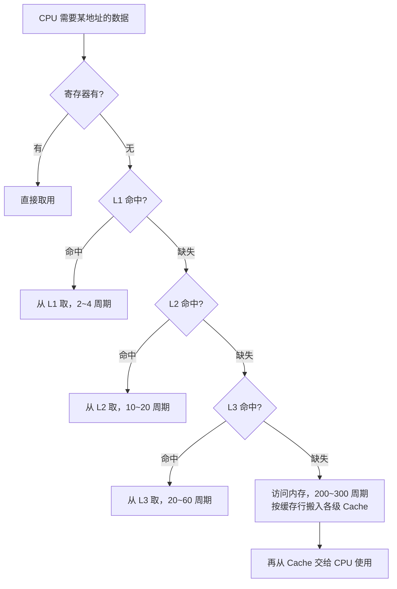
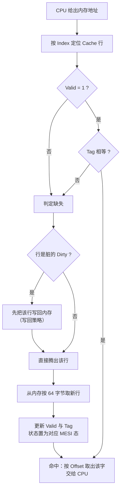
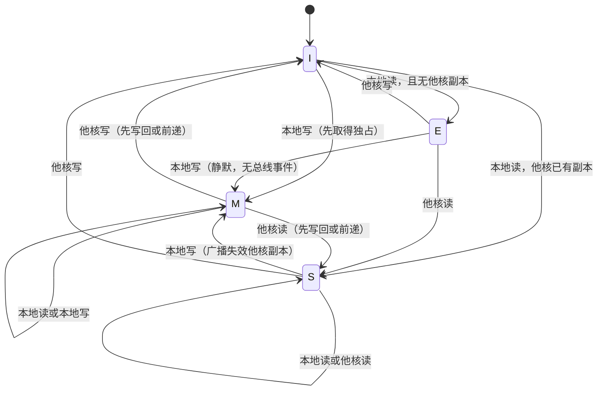
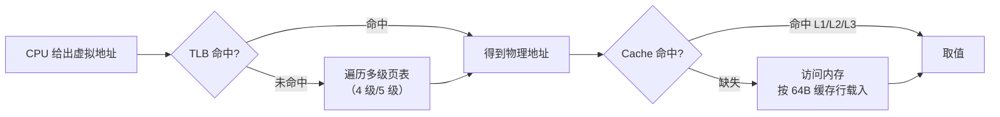
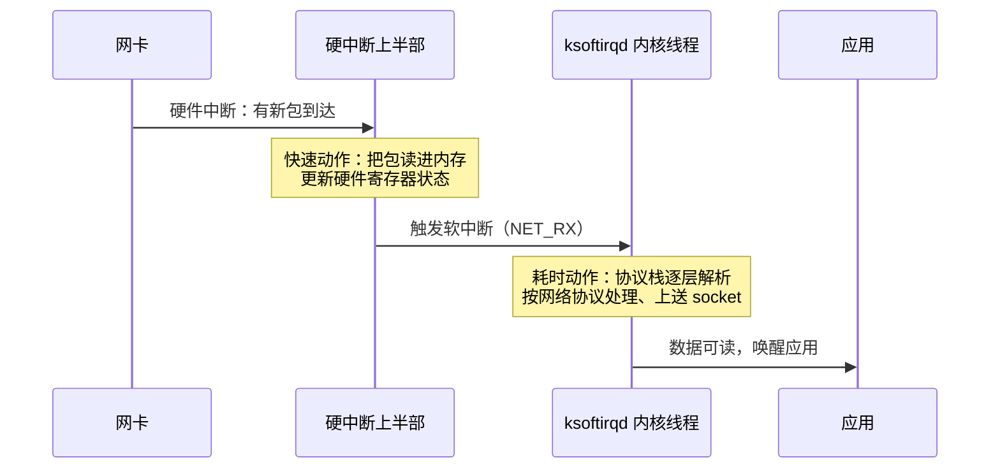

---
tags:
  - 基本功/系统
  - 基本功/硬件
---

# 硬件结构与 CPU

程序在应用层表现为「跑得快」或「跑得慢」，落到硬件上是一串可以被计数的时钟周期。把一条 `a = 1 + 2` 从 C 源码一路下沉到硅片，要依次穿过指令集、流水线、缓存层次与缓存一致性协议四层抽象。本篇自底向上铺开这些层：§1 用图灵机与冯诺依曼模型讲清 CPU 执行一条指令的模型与数据通路，§2 讲存储器为什么必须分层，§3 讲 Cache 的组织方式与写出缓存友好代码的判据，§4 讲多核下缓存一致性的两个必要条件与 MESI 协议，§5 讲 CPU 在多个任务之间如何选择下一个执行对象，§6 讲中断与软中断的分工与排查，§7 讲浮点数表示与精度损失的来源，§8 与 §9 给观测手段与常见故障的排查顺序。

调度策略的算法细节放在 [[04-进程、线程与调度]]，并发的内存模型与锁的语义放在 [[07-多线程与并发]]，软中断里网络包这一条链路放在 [[14-Linux 内核收发网络包]]；本篇只补这些机制所需的硬件与内核侧前提，不重复各自的 owner 内容。

数值口径：下面出现的时钟周期数、容量、价格都是数量级，用来比较不同层级之间的差距，不作为某一款具体型号的规格说明书。凡是能落到官方文档或内核源码的数字，在句末给出出处；只能给到典型值的，明确标注。

## 1. CPU 执行一条指令的模型

CPU 并不认识 `a = 1 + 2` 这样的字符串，它认识的只有一串二进制位。从「机器能不能做计算」这一层抽象，到「一条指令在硬件上如何走完」，中间有两段模型需要分清：图灵机定义了计算的可执行性，冯诺依曼模型把这套抽象落成可造出来的电路。

### 1.1 图灵机：纸带、读写头与状态

图灵机用最少的部件刻画「机械地做计算」这件事：一条划分成连续格子的纸带、一个能在纸带上左右移动的读写头，以及读写头内部的一组部件。纸带格子里可以写字符，等价于内存里的数据或程序；读写头读出格子内容后交给控制单元判断这是数据还是指令；运算单元按指令对已读入状态的数据做运算；结果再由读写头写回纸带。

以 `1 + 2` 为例走一遍完整过程：

1. 读写头把字符 `1`、`+`、`2` 分别写进纸带的三个格子，然后停在 `1` 所在格子上。
2. 读写头读入 `1`，把它存进一个称为「状态」的存储单元。
3. 读写头右移一格，以同样方式读入 `2`，此时状态里同时存着 `1` 和 `2`。
4. 读写头再右移一格，读到 `+`。控制单元识别出它是运算符，不把它存入状态，转去判定这是一条运算指令并通知运算单元工作。
5. 运算单元从状态里读出 `1` 和 `2`，计算得到 `3`，再把结果交回控制单元。
6. 读写头右移，把结果 `3` 写入纸带格子。

```text
  图灵机计算 1 + 2 的纸带、读写头与内部部件

  ┌───┬───┬───┬───┬───┬───┐
  │ 1 │ + │ 2 │   │   │   │      纸带（≈ 内存）
  └───┴───┴───┴───┴───┴───┘
    ▲
    │  读写头可读可写
  ┌─┴────────────────┐
  │ 读写头            │
  │ ┌──────────────┐  │
  │ │ 存储单元     │◀─┼── 读入的数字作为「状态」保存
  │ ├──────────────┤  │
  │ │ 控制单元     │  │  识别 数字 / 运算符，控制流程
  │ ├──────────────┤  │
  │ │ 运算单元     │  │  对状态中的数求 1 + 2
  │ └──────────────┘  │
  └───────────────────┘
```

图灵机的三种部件（存储、控制、运算）与「读纸带 → 识别 → 运算 → 写回纸带」这条循环，正是今天 CPU 的雏形。差别只在规模与速度：纸带换成了可寻址的内存，读写头换成了由程序计数器驱动的取指单元。

### 1.2 冯诺依曼模型的五个部件

1945 年，冯诺依曼等人在 EDVAC 报告（*First Draft of a Report on the EDVAC*）中提出：计算机用电子元件构造，用二进制进行计算与存储，并把基本结构约定为五个部件——中央处理器（CPU）、内存、输入设备、输出设备、总线。这份报告沿用了图灵机的设计，把「纸带 + 读写头」换成了「内存 + 由指令驱动的 CPU」。

五个部件的职责：

- **内存**：线性排列的存储区，地址从 0 开始自增编号，最后一个是「总字节数 − 1」。数据只存二进制位，最小可寻址单位是字节（byte），1 字节等于 8 位（bit）。这种「按下标随机访问、任意地址读取代价相同」的性质，正是后面讲 Cache 命中率时反复用到的前提。
- **中央处理器**：执行指令的部件，内部含控制单元、逻辑运算单元与一组寄存器。
- **总线**：CPU 与内存、外部设备之间的通信通道，分地址总线、数据总线、控制总线三条。
- **输入设备**：向计算机输入数据，键盘按键这类操作需要通过控制总线与 CPU 交互。
- **输出设备**：接收计算结果。

```text
  冯诺依曼模型的五个部件与三类总线

  ┌──────────────────────┐    地址总线（CPU → 内存，单向）
  │      中央处理器       │───────────────┬───────────────┐
  │  ┌────────────────┐   │               │               ▼
  │  │ 控制单元        │   │    数据总线（CPU ↔ 内存，双向）┌─────────────┐
  │  ├────────────────┤   │◀─────────────────────────────▶│    内存      │
  │  │ 逻辑运算单元    │   │    控制总线（CPU ↔ 设备，双向）│ 程序 + 数据  │
  │  ├────────────────┤   │◀─────────────────────────────▶└──────┬──────┘
  │  │ 寄存器组        │   │                                     │
  │  └───────┬────────┘   │                              ┌──────▼──────┐
  └──────────┼────────────┘                              │  输入设备    │
             │  控制总线                                  └─────────────┘
             ▼
      ┌─────────────┐
      │  输出设备    │
      └─────────────┘
```

模型的要点是「指令与数据同放在内存里、由同一个地址空间寻址」，这一条就决定了后面要辨析的「指令缓存与数据缓存为什么要分开」，以及程序为什么可以把代码当数据处理（自修改代码、JIT）。

冯诺依曼模型的三个约定各自带来可观测的后果：用二进制计算与存储，所有类型最终都要编码成位模式；指令与数据同放在一个内存、共用地址空间，程序可以像数据一样被读写，JIT 与自修改代码由此成立，代码注入这类安全问题也由此而来；计算由程序计数器顺序驱动，行为可预测，利于流水线与分支预测，代价是遇到分支会打断流水线。

把五个部件映到软件概念，能看清操作系统在硬件之上补了什么：

| 硬件部件 | 软件中的对应物 |
| --- | --- |
| 内存 | 进程地址空间（虚拟内存） |
| 寄存器 | 线程上下文（切换时保存与恢复） |
| CPU | 逻辑上被多个任务分时复用 |
| 总线 | 无直接对应，性能上表现为访存带宽 |
| 输入/输出设备 | 文件、socket、设备文件 |

与冯诺依曼模型相对的是**哈佛结构**（Harvard architecture），指令与数据分开存储。x86 在模型层是冯诺依曼结构（统一内存），在缓存层采用了哈佛式分离——L1 分成 iCache 与 dCache（§3.2）。「模型统一、缓存分离」这个组合是理解后面缓存设计的入口。

存储程序（stored-program）这一条约定值得单独说清。它把指令和数据放进同一个可寻址空间，带来三个直接后果：

- **程序可被程序改写**。解释器、JIT、动态链接都依赖这一点：同一段内存既能当数据处理，也能跳转过去当指令执行。代价是攻击者若能写入某段内存，就有机会让 CPU 去执行它——现代系统的不可执行位（NX）与写保护（W^X）就是针对这条约定加的边界。
- **指令与数据共享同一套地址翻译与缓存层次**。这解释了 §3.2 里 L1 为何要分成 iCache 与 dCache：两者访问模式不同（指令是顺序取指、数据是随机访问），混在一个缓存里会互相挤占。
- **指令长度是否固定会影响取指与 PC 自增**。MIPS 是定长 32 位（§1.7），x86 是变长指令，取指要先解析前缀才能知道这条指令有多长（来源：Intel SDM Vol. 2A，指令格式一节）。

### 1.3 三类总线的分工

总线是可被多个部件共享的通信通道，同一时刻只有一方在驱动它。三条总线各自负责一件事：

- **地址总线**（address bus）：指定本次操作要访问的内存地址。宽度决定可寻址空间，n 条地址线对应 $2^n$ 个地址。
- **数据总线**（data bus）：承载读写的数据。宽度决定一次能搬多少位。
- **控制总线**（control bus）：传递中断、设备复位、读写方向这类信号。

CPU 读写一次内存，走的是「先用地址总线给出地址，再用数据总线搬运数据」这两步。地址总线是单向的（CPU 只发出地址），数据总线与多数控制信号是双向的。总线被多个部件共享，这一点会在 §4.6 讲总线嗅探时变成一个瓶颈来源。

总线的宽度与频率共同决定带宽。一条 64 位宽、每秒传输 $f$ 次的数据总线，带宽约为 $8f$ 字节/秒；地址总线的宽度直接决定可寻址空间大小（$n$ 条地址线对应 $2^n$ 个地址，§1.5）。

三条总线被多个部件共享，同一时刻只能有一个部件驱动，因此需要**仲裁**：谁先拿到总线使用权，谁就传。共享带来的后果在 §4.6 会放大——总线嗅探靠广播保证写传播，广播量与核心数正相关，共享总线随即成为瓶颈。

现代高性能互联（Intel 的 UPI、AMD 的 Infinity Fabric、PCIe）改成了点对点链路而非共享总线，每条链路独立、可并行传输，代价是拓扑更复杂、需要路由。这类改进与 §4.9 的目录协议方向一致：把「广播给所有人」换成「只发给相关的人」。

### 1.4 线路位宽与 CPU 位宽的区别

数据在线路上靠电压高低表示二进制位：低电压为 0，高电压为 1。给一根线路依次施加「高、低、高」，传输的就是 `101`。只有一根线路时，每次只能传 1 bit，传 `101` 需要三个时序；这种一位接一位、后一位必须等前一位传完的方式叫**串行**。想一次多传几位，就增加线路，数据随即变为**并行**传输。

**线路位宽**指的就是这些并行的数据线/地址线的条数。地址线若只有 1 条，只能表示 0 或 1 两个地址；要一次编址 4 GB 的内存，就需要 32 条地址线，因为 $2^{32} = 4\text{GiB}$。

**CPU 位宽**（对照下面 §1.5）指 CPU 内部一次能处理的位宽，最直接的体现是一般通用寄存器一次能装多少位。二者容易混，可以用一句话区分：线路位宽是「CPU 与外部一次能交换多少位」，CPU 位宽是「CPU 内部一次能算多少位」。工程上两者的宽度通常一致，位宽失配会让控制器状态机显著复杂化。

以 32 位 CPU 加两个 64 位数为反例：它无法一次读入 64 位，只能把每个 64 位数拆成低 32 位和高 32 位，先加两个低位并记下进位，再加上两个高位，最后补上进位。到 64 位 CPU 上，一次读入 64 位、逻辑运算单元也支持 64 位加法，就能一步算完。

### 1.5 32 位与 64 位的寻址上限

CPU 位宽最常见的两种取值是 32 位与 64 位，它们各自的一般通用寄存器一次能装 4 字节或 8 字节。位宽越大，一次能表示的整数范围越大：8 位只能算 `0~255`，32 位能一次算到的最大无符号整数是 $2^{32}-1 = 4294967295$。

真正决定「能插多大内存」的是**地址总线宽度**，而它与 CPU 位宽常被一起讨论，因此有下面这条常被引用的结论：

| 项目 | 32 位 CPU | 64 位 CPU |
| --- | --- | --- |
| 一般通用寄存器宽度 | 4 字节 | 8 字节 |
| 一次可计算的整数上限（无符号） | $2^{32}-1$ | $2^{64}-1$ |
| 平坦地址空间上限 | 4 GiB | $2^{64}$ B（实际远小于此） |
| 超出 32 位整数的加法 | 需拆高低位多步 | 一步完成 |

`2^32 = 4 GiB` 是「32 位机最多认到 4 GB 内存」这句说法的来源。这里有两处需要澄清的边界：

1. **PAE（Physical Address Extension）** 把 x86 的物理地址线扩到 36 位，物理内存上限抬到 64 GiB，但单个进程的**线性（虚拟）地址空间**仍是 4 GiB。所以 32 位系统插 8 GB 内存，操作系统能看到并分配这 8 GB，单个进程却仍然只能用 4 GiB 虚拟地址（来源：Intel® 64 and IA-32 Architectures Software Developer's Manual Vol. 3A，物理地址扩展一节）。
2. **64 位 CPU 的理论寻址空间是 $2^{64}$ 字节，实际实现的地址位远小于此。** x86-64 长期采用 48 位线性地址（4 级页表，用户空间 128 TiB），5 级页表把它扩到 57 位（64 PiB）。写「2^64」只是理论上限，不代表硬件真的实现了 64 条地址线。

位宽更大不等于算得更快。绝大多数应用的单次运算数据不超过 32 位，此时 32 位与 64 位 CPU 的单次计算能力没有差别；只有在运算数据超过 32 位时，64 位 CPU 一次完成而 32 位 CPU 需多步的优势才体现出来。

### 1.6 指令周期：取指、译码、执行、写回

程序在内存里是一条条指令，CPU 的工作就是一条条地把它们执行掉。这个循环由**程序计数器**（Program Counter，PC）驱动——注意 PC 存的是「下一条指令的内存地址」，指令本身还在内存里，取指之后才进入 CPU。

一条指令在硬件上分四个阶段：

- **取指**（Fetch）：控制单元读出 PC 的值，经地址总线交给内存，内存把该地址处的指令经数据总线送回，存入**指令寄存器**（Instruction Register，IR）。
- **译码**（Decode）：控制单元分析 IR 中的指令，确定类型与参数。计算类指令交给逻辑运算单元，存储类指令由控制单元处理。
- **执行**（Execute）：逻辑运算单元做算术、逻辑运算，或完成地址计算；无条件跳转这类简单操作直接在控制单元里完成，不需要运算单元。
- **写回**（Write back）：把结果写回寄存器；若是 store 指令，则把寄存器值写回内存。


一个阶段走完，PC 自增指向下一条指令；自增量由指令长度决定。32 位 CPU 一条指令占 4 字节，占 4 个内存地址，所以 PC 每次自增 4。这个「取指 → 译码 → 执行 → 写回」的循环称为**指令周期**。

现代 CPU 用**流水线**（pipeline）把四个阶段并行起来：一条指令在译码时，下一条已经可以取指，于是同一个时钟周期里有四条指令分别处于四个阶段。流水线的代价是遇到分支时可能取错指令，需要分支预测与流水线冲刷来兜底（见 §3.8）。

### 1.7 指令编码：MIPS 的 R、I、J 三型

指令在硬件里是一串二进制机器码，不同 CPU 有不同的指令集（ISA），因而对应不同的汇编语言和机器码。这里用最规整的 MIPS 指令集看机器码如何生成：MIPS 指令是 32 位整数，高 6 位是操作码（opcode），其余 26 位按指令类型分成三种格式。

- **R 型**：用于算术与逻辑操作，字段依次是 `opcode | rs | rt | rd | shamt | funct`。`rs`、`rt` 是源寄存器编号，`rd` 是目标寄存器，`shamt` 是移位量，`funct` 是功能码——当 6 位 opcode 不足以区分指令时，用 funct 扩展。
- **I 型**：用于数据传输与条件分支，把 R 型里 `rd/shamt/funct` 三段合并成一个立即数或地址。
- **J 型**：用于跳转，除高 6 位外的 26 位整体是一个跳转地址。

把 `add R2, R0, R1`（把 R0 与 R1 相加存回 R2）编成机器码，按 R 型拼字段：

```text
  add R2, R0, R1 的 MIPS R 型编码（32 位）

  opcode   rs     rt     rd     shamt   funct
  ┌──────┬──────┬──────┬──────┬──────┬──────┐
  │000000│00000 │00001 │00010 │00000 │100000│
  └──────┴──────┴──────┴──────┴──────┴──────┘
   6 位   5 位   5 位   5 位   5 位   6 位
   add    R0     R1     R2     不移位  add 的功能码

  拼接结果 0b0000_0000_0000_0001_0001_0000_0010_0000
          = 0x00011020
```

编译器构造指令的过程叫**指令编码**，CPU 执行时解析机器码的过程叫**指令译码**。两者的字段定义由 ISA 规定，硬件的译码器直接按位切分，这也是「换一种 CPU 架构就要重新编译」的根本原因。

### 1.8 指令的五类与时钟周期

按功能划分，指令大致有五类：

| 类型 | 例子 | 作用 |
| --- | --- | --- |
| 数据传输 | `load` / `store` / `mov` | 寄存器与内存、内存与内存之间搬数据 |
| 运算 | 加减乘除、位运算、比较 | 最多处理两个寄存器中的数据 |
| 跳转 | 分支、`call` / `ret` | 修改 PC 的值改变执行流 |
| 信号 | `trap` | 触发中断或异常 |
| 闲置 | `nop` | 空转一个周期 |

CPU 的硬件参数里有 `GHz` 这个量，1 GHz 表示 1 秒产生 $10^9$ 次时钟脉冲，一次脉冲高低电平的转换是一个**时钟周期**。最基础的动作用一个时钟周期，但一条指令通常需要若干个周期，乘法比加法需要的周期多。

程序的执行时间可以拆成两个乘数：

$$T = \text{指令数} \times \text{CPI} \times \text{时钟周期时间}$$

其中 CPI 是每条指令的平均时钟周期数（Cycles Per Instruction），时钟周期时间的主频倒数。**指令数**主要由编译器决定，**CPI** 靠流水线等微架构技术压低，**时钟周期时间**是主频、由硬件决定。这条式子也是后面讲 Cache 时要回头对照的基准：提高缓存命中率降低的是 CPI 里的访存停顿部分，与主频无关。

### 1.9 `a = 1 + 2` 的逐级落地

把 `a = 1 + 2` 落到 32 位 CPU 上，要先经过「源码 → 汇编 → 机器码」三级翻译。编译器分析出 `1`、`2` 是数据，把它们放进**数据段**；把运算翻译成若干条指令，放进**正文段**（指令区）。数据与指令分开存放，是后文「L1 分为数据缓存和指令缓存」的现实依据。

设数据段里 `1` 存在 `0x100`、`2` 存在 `0x104`，变量 `a` 预留 `0x108`；正文段从 `0x200` 开始，四条指令各占 4 字节：

```text
  a = 1 + 2 在 32 位地址空间中的落地

  数据段                         正文段
  ┌──────────────┐               ┌──────────────────────────────────┐
  │ 0x100 : 1    │               │ 0x200 : load  R0, [0x100]        │
  │ 0x104 : 2    │               │ 0x204 : load  R1, [0x104]        │
  │ 0x108 : a(空)│◀──────────────│ 0x208 : add   R2, R0, R1         │
  └──────────────┘               │ 0x20c : store R2, [0x108]        │
                                 └──────────────────────────────────┘
   编译器按变量类型定宽度：            PC 初值 = 0x200，逐条执行，
   int 占 4 字节、char 占 1 字节        每条指令占 4 个地址
```

四条指令逐条执行时，硬件上的数据流是：

1. **`load R0, [0x100]`**：PC 为 `0x200`，取指得到 load 指令；译码后控制单元经地址总线给出 `0x100`，数据总线返回 `1`，装入通用寄存器 `R0`。写回阶段 PC 自增到 `0x204`。
2. **`load R1, [0x104]`**：同上，把 `2` 装入 `R1`，PC 自增到 `0x208`。
3. **`add R2, R0, R1`**：译码为运算指令，逻辑运算单元读 `R0`、`R1`，算出 `3`，写回 `R2`。这一步不访问内存（数据已在寄存器里），是四条指令里最快的。
4. **`store R2, [0x108]`**：把 `R2` 的值经数据总线写入地址 `0x108`，即变量 `a`。

把这条链与 §1.6 的四个阶段对照，可以看到一个细节：`add` 只经过「取指 → 译码 → 执行 → 写回」，不产生内存访问；两条 `load` 和一条 `store` 才是访存指令，也正是它们会在 Cache 缺失时吃下上百个时钟周期的停顿。**这解释了为什么「让代码跑得更快」的第一个着力点是减少访存停顿，而不只是减少指令条数**——同样的指令条数，访存多寡带来的 CPI 差异可以是几倍。

四条指令在流水线中的状态可以这样摊开（`IF`/`D`/`EX`/`WB` 分别对应取指、译码、执行、写回）：

```text
  四条指令在 4 级流水线中的重叠（无停顿的理想情况）

  周期    1    2    3    4    5    6    7
  load1  IF   D    EX   WB
  load2       IF   D    EX   WB
  add              IF   D    EX   WB
  store                 IF   D    EX   WB
```

理想情况下四条指令 7 个周期完成，平均 CPI 接近 1。真实执行有两处会被打断：

- **load-use 相关**：`add` 要用 `R0`、`R1`，而这两个寄存器由前两条 `load` 写入。若 `add` 在 `load` 的结果写回前就进入执行阶段，会读到旧值。硬件要么插入停顿（stall），要么用**前递**（forwarding）把 `load` 的结果直接送进运算单元。两条 `load` 紧邻 `add` 的写法因此比「先算其他数据再算 a」更容易吃到停顿。
- **访存停顿**：`load`、`store` 是仅有的访存指令，Cache 缺失时它们要等上百个时钟周期，把后面的指令一起卡住。

这也解释了 §3 的两条优化判据为什么落在访存上：`add` 只吃流水线停顿，`load` 与 `store` 还要额外吃缓存缺失代价，后者的量级大得多。

### 1.10 软件位宽：指令位宽与兼容运行

硬件说的 32 位 / 64 位指 CPU 位宽，软件说的 32 位 / 64 位指**指令的位宽**。操作系统本身也是程序，所以「32 位操作系统」指的是其中的指令是 32 位的。

两种失配的后果不对称：

- **32 位指令跑在 64 位机器上**：可行。x86-64 保留了兼容模式，能在 64 位 CPU 上执行 32 位指令。
- **64 位指令跑在 32 位机器上**：不可行。32 位机器的寄存器与地址空间装不下 64 位指令所需的状态。

因此 32 位操作系统可以装在 64 位机器上（走兼容模式），64 位操作系统不能装在 32 位机器上。

位宽还影响 ABI 与数据类型长度。64 位 Linux 采用 LP64 模型：`long` 与指针是 8 字节，`int` 仍是 4 字节。指针宽度翻倍直接推高内存占用——同一份数据结构在 64 位下可能比 32 位大 30% 以上，缓存能容纳的元素更少，命中率因此下降。这是「64 位不一定更快」的另一个来源。

兼容运行也有边界。64 位 CPU 跑 32 位程序时，进程的虚拟地址空间仍受 32 位限制（约 4 GiB，用户态通常只有 3 GiB），即使物理内存远超 4 GiB 也用不上。要把单个进程的可用内存提到 4 GiB 以上，程序本身必须编译成 64 位。

## 2. 存储器金字塔

CPU 内部有寄存器与 L1/L2/L3 Cache，外部有内存和 SSD/HDD。它们按「容量越大、速度越慢、单位成本越低」排成层次。这一节把三轴数量级摆开，解释这套层次为什么必须存在，以及一次访问要逐层穿过哪些设备。

### 2.1 为什么必须分层：三个数量级

一个绕不开的经验事实：**CPU 的增速长期快于内存**。CPU 性能大约每 18 个月翻倍，折算年化约 60%；内存访问速度的年化增长远低于此，一次内存访问要 200~300 个时钟周期（典型值，未核对具体型号官方规格）。这意味着 CPU 与内存之间的性能差已经到两三百倍。

若只有寄存器这一级，容量太小；若只有内存这一级，CPU 三分之二以上的时间都在等内存。分层的目标是把这两个诉求同时逼近：

> 让**每字节的成本**接近最便宜那一层（磁盘），让**访问速度**接近最快那一层（寄存器）。

做法是让容量大、单价低的层做容量，容量小、单价高的层做速度，中间用「把下层的一部分数据搬进上层」的缓存机制衔接。L1/L2/L3 三级 Cache 是这套思路在同一问题上的重复应用。

这里也能回到 §1.8 的那条式子：缓存存在的意义是压低 CPI 里的访存停顿。主频已经接近工艺极限，继续优化程序性能的空间主要在 CPI，而 CPI 里最大的一块就是访存。

### 2.2 各级存储器的容量、延迟与成本

把典型值摆进一张表，三个数量的差距会立刻显形：

| 层级 | 典型容量 | 典型访问延迟 | 相对 L1 的延迟倍数 | 单位成本量级 |
| --- | --- | --- | --- | --- |
| 寄存器 | 几十到几百个 × 4/8 字节 | < 1 个时钟周期 | 约 1 | 最高 |
| L1 Cache | 32 KB ~ 数百 KB | 2~4 个时钟周期 | ≈ 1 | 很高 |
| L2 Cache | 数百 KB ~ 几 MB | 10~20 个时钟周期 | ≈ 5 | 高 |
| L3 Cache | 几 MB ~ 几十 MB | 20~60 个时钟周期 | ≈ 15 | 较高 |
| 内存 | GB 级 | 200~300 个时钟周期 | ≈ 100 | 低 |
| SSD | 百 GB ~ TB 级 | 约 $10^5$ ns 级 | ≈ $10^5$ | 很低 |
| HDD | TB 级 | 约 $10^7$ ns（10 ms）级 | ≈ $10^7$ | 最低 |

表中的延迟是数量级，用来比较层级差异；具体的时钟周期数随微架构变化，未逐型号核对官方规格。L1 的随机访问延迟约 1 纳秒，内存约 100 纳秒，差约 100 倍；机械硬盘约 10 毫秒，相对 L1 差约 $10^7$ 倍。把差距按比例放大：若访问 L1 花 1 秒，访问内存要约 2 分钟，随机访问 SSD 要约 1.7 天，访问机械硬盘要接近 4 个月。**「分层有意义」这句话的量化含义就在这里**——差 100 倍时，一次命中就能省下几十到上百个时钟周期。

```text
  存储器金字塔：容量向上变小，速度与单价向上变高（三轴数量级）

              容量 ↑ 小                    速度 ↑ 快        单位成本 ↑ 贵
        ┌───────────────────────────┐
   ▲    │  寄存器   几十~几百 × 4/8B  │  < 1 周期       最高
   │    ├───────────────────────────┤
   │    │  L1 Cache  32KB ~ 数百 KB  │  2 ~ 4 周期
   │    ├───────────────────────────┤
   │    │  L2 Cache  数百 KB ~ 几 MB │  10 ~ 20 周期
   │    ├───────────────────────────┤
   │    │  L3 Cache  几 MB ~ 几十 MB │  20 ~ 60 周期
   │    ├───────────────────────────┤
   │    │  内存      GB 级           │  200 ~ 300 周期
   │    ├───────────────────────────┤
   │    │  SSD       百 GB ~ TB      │  ~ 10^5 ns
   ▼    ├───────────────────────────┤
  容量 ↓ 大│  HDD       TB 级          │  ~ 10^7 ns      单位成本 ↓ 低
        └───────────────────────────┘
```

比较不同层级不能只看单次延迟，要把命中率一起算进去。**平均内存访问时间**（Average Memory Access Time，AMAT）是这套层次的评判指标：

$$\text{AMAT} = T_{\text{hit}} + m \times T_{\text{miss}}$$

其中 $T_{\text{hit}}$ 是命中时的访问时间，$m$ 是缺失率，$T_{\text{miss}}$ 是缺失代价。以 L1 为例，$T_{\text{hit}} = 1$ ns、$T_{\text{miss}} = 100$ ns（回落到内存），命中率 95% 时 AMAT $= 1 + 0.05 \times 100 = 6$ ns；命中率掉到 90% 时 $\text{AMAT} = 1 + 0.1 \times 100 = 11$ ns。**命中率每掉 5 个百分点，平均访问时间接近翻倍**，这解释了为什么 §3 把命中率当成第一优化目标。

这套层次能生效的前提是**局部性**（locality）：时间局部性指刚被访问的数据短期内还会被访问，空间局部性指被访问地址附近的数据也会被访问。数组顺序遍历之所以快，正是空间局部性的直接结果。

缓存层次的效果最终由**工作集**（working set）大小决定：能被最近一层缓存容纳，访问就落在该层；超出则逐级下沉。以 L1 32 KiB 为例，一个 64 KiB 的数组顺序遍历时，每次都要回落到 L2 或更下层，局部性带来的收益被容量限制抵消。

缓存行大小本身也是一个取舍。行越大，一次搬运覆盖的后续数据越多，空间局部性的收益越高；行越大也意味着一次缺失搬运的数据更多、缺失代价更高，且**伪共享的粒度变粗**——64 字节的行里只要有一个被写的变量，整行都会被拖进一致性协议。行大小的典型取值在 32~128 字节之间，x86-64 长期固定在 64 字节（来源：Linux 内核 sysfs 的 `coherency_line_size` 属性，§8.2）。

这也是为什么多核处理器在容量之外还关心**共享层次**：L3 多核共享意味着一个核心加载的数据可能被另一个核心复用，也可能被另一个核心的写操作失效。私有层次管吞吐，共享层次管跨核复用与一致性。

### 2.3 SRAM 与 DRAM 的材料差异

Cache 与内存的差距来自芯片材料，而不只是设计取舍。

**Cache 用 SRAM**（Static Random-Access Memory，静态随机存储器）。一个 bit 用 6 个晶体管存储，只要通电数据就保持，断电丢失。晶体管多、存储密度低，同样面积能存的数据少，代价是电路简单、访问快。

**内存用 DRAM**（Dynamic Random-Access Memory，动态随机存储器）。一个 bit 只用 1 个晶体管加 1 个电容，密度高、功耗低、容量大、造价低。电容会漏电，必须周期性**刷新**（refresh）才能保住数据，「动态」二字由此而来；刷新与访问电路更复杂，访问就慢。

寄存器的材料速度最快、造价最贵，数量因此不能多，通常每个寄存器只存一个字（32 位 CPU 上是 4 字节，64 位 CPU 上是 8 字节）。寄存器的读写一般在半个时钟周期内完成，2 GHz 主频下时钟周期是 0.5 ns（来源：CPU 主频与时钟周期的定义，$T = 1/f$）。

回头看「寄存器 vs Cache」的分工：寄存器紧挨控制单元与运算单元，是运算的直接操作数来源；Cache 承担的是「把内存的一小块提前搬近 CPU」。前者解决延迟，后者解决带宽与命中率。

### 2.4 逐层加载：CPU 不直接与每一种设备打交道

存储器层次有一条工程约定：**每一层只与相邻的一层交互**。CPU Cache 的数据从内存加载，写回时也只写回内存；它不会绕过内存直接读写磁盘，磁盘数据要先加载到内存，再从内存进入 Cache。

这条约定既降低了总线与协议的复杂度，也决定了一次访问的延展式路径。当 CPU 要读某个地址的数据：

1. 看寄存器里有没有（正在被运算的操作数通常已经在寄存器）；
2. 寄存器没有，查 L1 Cache；
3. L1 没有，查 L2；
4. L2 没有，查 L3；
5. L3 也没有，才去访问内存，并把缺失的数据以**缓存行**为单位搬进 Cache。

因此，多级 Cache 本身就是一套「缓存内存」的体系，正对应「分级的目的是构造缓存体系」这句话。

写路径遵循同样的逐层约定：CPU 改写某地址后，写只落在 Cache，脏行在替换时才写回内存；内存不会主动把修改推给磁盘，磁盘的数据更新要走文件系统的回写，由内核在合适的时机落盘。**磁盘对 CPU 不可直接寻址**，任何文件读写都要先经内存缓冲，这也是 §3.3 里「内存充当磁盘缓存」的由来。

大块数据的搬运通常交给 **DMA**（Direct Memory Access）：设备直接把数据写进内存，不占用 CPU 的寄存器与指令周期，CPU 只在传输完成后收到中断。网卡收包就是这条路径——数据由网卡 DMA 进内存，之后才触发软中断做协议栈处理（§6.3）。

### 2.5 一次内存访问的完整查找路径

把上面五步连起来，就是一次内存访问的完整路径：



这张图也解释了后面两节的因果关系：**延迟主要由「命中在哪一层」决定**，所以 §3 关心的是如何提高命中率与减少缺失代价，§4 关心的是多核下同一份数据在各自 Cache 里如何保持一致。

## 3. CPU Cache

Cache 是 CPU 与内存之间的缓存层。理解它的组织方式，才能理解「顺序访问为什么快」「伪共享为什么慢」这两类工程现象。这一节先讲 Cache 的层次与读取单位，再讲地址映射的三种方式，最后给写出缓存友好代码的判据。

### 3.1 引入 Cache 的原因

内存在层次里离 CPU 太远，一次访问要 200~300 个时钟周期。Cache 用 SRAM，紧挨 CPU 核心，把内存中被反复访问的一小块提前搬近。CPU 读数据时先查 Cache，命中就直接返回，不再访问内存。

Cache 的成本高，所以容量以 KB 或 MB 计。一个常被引用的成本对比：每生产 1 MB Cache 的成本相对 1 MB 内存高出约两个数量级（典型值，未核对官方报价，随工艺与市场波动）。这决定了 Cache 不可能做得像内存那样大，只能在「命中率」上做文章。

更精确的说法是增速剪刀差。CPU 的访问速度约每 18 个月翻倍，年化约 60%；内存访问速度的年化增长远低于此，约 7% 量级。两者差距逐年拉大，到今天一次内存访问要 200~300 个时钟周期。

缩小这个差距只能靠「把数据提前搬到离 CPU 更近的地方」，也就是缓存。缓存容量受 SRAM 成本限制，无法一次覆盖整个工作集，于是同一策略被重复使用：L1 缓存 L2，L2 缓存 L3，L3 缓存内存。**层数增加是为了在容量约束下尽可能逼近「所有访问都命中最近一层」**。

### 3.2 L1/L2/L3 的私有与共享关系

多核 CPU 的缓存层次有一条固定分工：

- **L1**：每个核心独有，通常再分成**数据缓存**（dCache，`index0`）与**指令缓存**（iCache，`index1`）。分开的原因是 CPU 会分别处理数据与指令：`1 + 1 = 2` 里 `+` 是指令、`1` 是数据，放不同缓存，避免相互挤占。两半大小通常相同。
- **L2**：每个核心独有，比 L1 大、离核心更远。
- **L3**：**多个核心共享**，容量最大、延迟最高。

```text
  多核 CPU 的缓存私有与共享关系

  ┌───────────────────────────┐   ┌───────────────────────────┐
  │  CPU 核心 0                │   │  CPU 核心 1                │
  │  ┌─────────┐ ┌─────────┐  │   │  ┌─────────┐ ┌─────────┐  │
  │  │ iCache  │ │ dCache  │  │   │  │ iCache  │ │ dCache  │  │  每个核心私有
  │  │ (L1i)   │ │ (L1d)   │  │   │  │ (L1i)   │ │ (L1d)   │  │
  │  └────┬────┘ └────┬────┘  │   │  └────┬────┘ └────┬────┘  │
  │       └─────┬─────┘       │   │       └─────┬─────┘       │
  │        ┌────▼────┐        │   │        ┌────▼────┐        │
  │        │  L2     │        │   │        │  L2     │        │  每个核心私有
  │        └────┬────┘        │   │        └────┬────┘        │
  └─────────────┼─────────────┘   └─────────────┼─────────────┘
                └───────────┬───────────────────┘
                     ┌──────▼──────┐
                     │    L3       │   多核心共享
                     └──────┬──────┘
                     ┌──────▼──────┐
                     │    内存      │
                     └─────────────┘
```

加载路径是「内存 → 共享 L3 → 核心独有 L2 → L1 → CPU」。这条路径同时说明了 §3.9 里伪共享为什么只在多核下出现：L1/L2 私有，同一份数据会被复制到多个核心各自的私有缓存，任一核心的修改都要通知其余核心。

超线程（同时多线程）会改变这条分工的可见效果：同一物理核上的两个逻辑核共享该核的 L1/L2，某个逻辑线程把 L1 用满时，另一个线程的命中率会受影响。用 `lscpu` 的 `Thread(s) per core` 判断是否开启了超线程（§8.1）。

另一条推论与 §3.9、§3.10 的缓存亲和性直接相连：既然 L1/L2 私有，把同一个线程固定在一个核心上执行，就能持续利用该核心的私有缓存；线程在核心间迁移时，新核心的 L1/L2 是冷的，要重新预热，命中率出现一个短暂低谷。**「进程绑定核心」这项操作收益的量化来源，就是这里的私有缓存局部性。**

Cache Line 的 64 字节不是随便取的。它是「一次缺失搬运的数据量」与「伪共享粒度」的平衡点：行再小，一次搬运覆盖的后续数据变少，缺失次数上升；行再大，一次缺失的代价与一致性维护的粒度都变粗。x86-64 把 L1 数据、L1 指令、L2 三级的行大小统一到 64 字节，简化了跨级搬运与一致性协议。

从软件侧能观察到它：`getconf LEVEL1_DCACHE_LINESIZE` 与 sysfs 的 `coherency_line_size` 给出同一个值（§8.2）。**伪共享修复、结构体布局、无锁队列的对齐，都以这个值为单位。**

### 3.3 Cache Line 与按行加载

Cache 从内存加载数据以一小块为最小单位，称为 **Cache Line**（缓存行），而非单个变量。x86-64 上 L1 数据缓存的 Cache Line 通常是 **64 字节**，可读取：

```bash
$ getconf LEVEL1_DCACHE_LINESIZE
64
```

同类信息也能从 sysfs 读取（`coherency_line_size` 属性，见 §8.3；来源：Linux 内核 `Documentation/ABI/testing/sysfs-devices-system-cpu`）。

64 字节意味着一次缺失会顺带把相邻数据一起载入。以 `int array[100]` 为例，`int` 占 4 字节，访问 `array[0]` 时会连同 `array[1]`~`array[15]` 一起进入 Cache；下次访问这些元素就直接命中。

CPU 读数据时的判据是：**无论数据在不在 Cache，都先访问 Cache**；只有 Cache 找不到，才去内存，并把内存中的数据读入 Cache，再由 Cache 交给 CPU。这与「内存充当硬盘的缓存」是同一套逻辑。

### 3.4 直接映射：索引 + 组标记 + 偏移量

最基础的映射方式是**直接映射 Cache**（Direct Mapped Cache）。它把内存按下标切成一个个内存块（每块一行大小），再把内存块地址对行数取模，映射到唯一一行。

举例：内存切成 32 块，Cache 有 8 行。访问第 15 号内存块，若已在 Cache 中，必落在第 `15 % 8 = 7` 行。取模带来一个必然结果：多个内存块共用同一行——第 7、15、23、31 块都映射到第 7 行。为区分它们，行里要额外存一个**组标记**（Tag）记录该行当前装的是哪个内存块。

一个内存地址因此被拆成三段：

```text
  内存地址 → 直接映射 Cache 的字段切分

   内存地址（例：32 位）
  ┌───────────────┬────────────────┬────────────┐
  │   Tag 组标记   │  Index 索引     │ Offset 偏移 │
  └───────┬───────┴───────┬────────┴──────┬─────┘
          │               │               │
          ▼               ▼               ▼
     存进 Cache 行     选中哪一行     行内第几个字

  Cache 行的结构
  ┌─────────┬─────────┬─────────┬──────────────────────┐
  │ Valid   │  Tag    │ (索引)  │  Data Block 数据块     │
  │ 有效位  │ 组标记   │         │  = 一行 64 字节        │
  └─────────┴─────────┴─────────┴──────────────────────┘
```

三段字段各司其职：

- **索引（Index）**：决定落在哪一行；
- **组标记（Tag）**：与行内存的 Tag 比对，确认该行装的就是要访问的内存块；
- **偏移（Offset）**：行内定位到具体要读的**字**（Word，CPU 一次读取的数据片段）。CPU 读的是一行里的某个字，不读整行。

行内还有**有效位**（Valid bit）：为 0 时无论行里有没有数据，CPU 都当作无效，直接访问内存重新加载。

把地址切分落到具体位数。设 L1 数据缓存 32 KiB、8 路组相联、缓存行 64 字节，从地址低位往高位算：

- **偏移**：行内 64 字节，需 $\log_2 64 = 6$ 位；
- **索引**：总行数 $= 32768 / 64 = 512$，每组 8 路，组数 $= 512 / 8 = 64$，需 $\log_2 64 = 6$ 位；
- **组标记**：32 位地址减去 6 + 6 = 12 位，剩 20 位。

于是地址被切成 `[Tag:20][Index:6][Offset:6]`：

```text
  32 位地址在 32KiB / 8 路 / 64B 行 的 L1d 上的切分

   31                        12 11        6 5          0
  ┌───────────────────────────┬───────────┬────────────┐
  │        Tag 组标记 (20 位)  │ Index (6) │ Offset (6) │
  └───────────────────────────┴───────────┴────────────┘
        │                          │             │
        │                          │             └─ 行内 64 字节的字节偏移
        │                          └─ 选中 64 组中的一组
        └─ 与组内 8 路的 Tag 并行比对
```

寻址过程是：先用 Index 定位到一组，把地址里的 Tag 与组内 8 路的 Tag 并行比对，任一路命中且有效位为 1，就按 Offset 取字。8 路并行比对意味着 8 个比较器同时工作，这也是 §3.6 里「关联度越高、比较器越多」的具体体现。

直接映射的代价可以用一个算例看清。设 Cache 有 8 行，程序交替访问分别映射到第 7 行的第 15 与第 23 号内存块：

```text
  直接映射的冲突：两个热点地址撞同一行

  访问序列：块15 → 块23 → 块15 → 块23 → ...
  块15 % 8 = 7      块23 % 8 = 7
  ┌────────────────────────────────────────────┐
  │ 行7：装块15 → 装块23 → 装块15 → 装块23 …      │
  │      每来一次都是缺失，命中率 0，缓存形同虚设  │
  └────────────────────────────────────────────┘
```

这就是冲突缺失（§3.6）。把 Cache 改成 2 路组相联，第 7 组有两路，块 15 与块 23 可以同时驻留，命中率立刻回到接近 100%。**判据是「两个热点地址的索引位相同、而 Tag 不同」**：命中时先比 Index 找到组，再比 Tag 区分是哪一块。

索引位数由组数决定：组数越多，索引位越多、Tag 越短；组数越少（关联度越高），索引位越少、Tag 越长。总行数固定时，路数与组数成反比，这就是 §3.6 里三种结构在位数分配上的差别。

### 3.5 命中与缺失的判据与步骤

数据已在 Cache 时，一次访问按四步完成：

1. 用地址中的**索引**算出 Cache 行号；
2. 查该行的**有效位**，无效则视为缺失，访存重载；
3. 比对地址中的**组标记**与该行的 Tag，不等则视为缺失，访存重载；
4. 相等则在数据块中按**偏移**取出所需的字。

把第 2、3 步的失败路径展开，就是一次缓存缺失的完整路径：



命中时延取决于命中的层级（§2.5），缺失时延取决于要不要先写回脏行以及内存往返。**缺失代价远大于命中代价，这是「命中率」成为关键指标的原因。**

### 3.6 组相联与全相联：结构与代价

直接映射的每一行只接受固定的一个内存块，冲突时哪怕 Cache 里还有空行也得换出。放宽映射约束的两种方式是**组相联**与**全相联**：

- **全相联**（Fully Associative）：一个内存块可以放进任意一行。冲突最少，但查找时要并行比对所有行的 Tag，硬件比较器数量随行数增长，代价最高，通常只用于 TLB 这类行数很少的场景。
- **组相联**（Set Associative）：折中方案。Cache 先分成若干**组**，组内是全相联、组间是直接映射。地址的索引位选组，组内再并行比对各路（way）的 Tag。

```text
  直接映射 / 组相联 / 全相联的结构对照（N 路组相联示意）

  直接映射              2 路组相联                全相联
  1 块 → 1 行           1 块 → 组内任一路          1 块 → 任一行
  ┌──────────┐          ┌───────────────┐        ┌───────────────┐
  │ 行 0     │          │ 组 0: 路0 路1 │        │ 行 0          │
  ├──────────┤          ├───────────────┤        ├───────────────┤
  │ 行 1     │          │ 组 1: 路0 路1 │        │ 行 1          │
  ├──────────┤          ├───────────────┤        ├───────────────┤
  │ 行 2     │          │ 组 2: 路0 路1 │        │ ...           │
  ├──────────┤          ├───────────────┤        ├───────────────┤
  │ 行 3     │          │ 组 3: 路0 路1 │        │ 行 N-1        │
  └──────────┘          └───────────────┘        └───────────────┘
  比 1 个 Tag            比 2 个 Tag（并行）       比 N 个 Tag（并行）
  硬件最省               冲突与成本折中            冲突最少、成本最高
```

三者的取舍可以固定成一句话：**关联度越高，冲突缺失越少，Tag 比对的开销越大**。真实 CPU 的 L1 多用 8 路或 16 路组相联，在冲突率与比较器成本之间取平衡（典型值，具体路数随型号变化，未逐型号核对）。

把缺失按成因分三类，能看出关联度在治哪一类：

| 缺失类型 | 成因 | 提高关联度是否有用 |
| --- | --- | --- |
| 强制缺失 compulsory | 数据第一次被访问，缓存里必然没有 | 无用，任何策略都躲不开 |
| 容量缺失 capacity | 工作集大于缓存容量，被挤出的数据又被用到 | 无用，除非扩容 |
| 冲突缺失 conflict | 多个热点地址映射到同一组，互相替换 | 有用，提高关联度可缓解 |

直接映射的冲突缺失最严重：只要两个常用地址撞到同一行，就会反复互相淘汰，哪怕缓存里其他行是空的。组相联用「组内多路」把这种冲突从「一对一」放开到「一对多」，是缓解冲突缺失的主要手段。

替换策略多用 **LRU**（Least Recently Used）或其近似（如伪 LRU），在组内选最久未使用的一路换出。关联度越高，LRU 的硬件实现越贵，这也是组相联路数不会无限增大的原因。

三者的选择还有一条直接的软件观测线索：拿同一段程序在「顺序访问、跨步访问、随机访问」三种模式下跑 `perf stat`（§8.3），缺失率会呈现明显梯度。顺序访问的缺失大多来自强制缺失；跨步访问（步长恰好等于缓存行大小）会退化成每次缺失；随机访问则接近容量缺失。

**判据是「缺失率随访问模式阶梯变化」**：如果程序在顺序访问下缺失率仍高，问题通常不在算法而在数据结构本身过大（超出缓存容量），此时优化方向是分块（blocking）——把大数组按能放进缓存的块来遍历，提高块内复用。循环分块是 §3.7 之外的第三条数据缓存判据。

### 3.7 数据缓存判据：按内存布局顺序访问

「如何写出让 CPU 跑得更快的代码」可以改写成「如何写出缓存命中率高的代码」。因为 L1 分数据缓存与指令缓存，命中率要分开看。

数据侧的第一条判据是**按内存布局顺序访问**。以二维数组遍历为例，`array[i][j]`（行优先）与 `array[j][i]`（列优先）的访问顺序不同，前者与内存中的排列顺序一致：

```text
  2×N 数组在内存中的行优先布局，与两种遍历的访问顺序

  内存布局（行优先，连续存放）
  ┌──────┬──────┬──────┬──────┬──────┬──────┐
  │a[0][0]│a[0][1]│a[0][2]│a[0][3]│a[1][0]│a[1][1]│ ...
  └──────┴──────┴──────┴──────┴──────┴──────┘
   └──────── 一个 64B 缓存行可容纳 16 个 int ────────┘

  形式一 array[i][j]：→ → → → → →      顺序，命中率高
  形式二 array[j][i]：↓ × N × N × N     跳跃，每步易缺失
```

访问 `array[0][0]` 缺失后，其后的 15 个 `int` 被一并载入；`array[i][j]` 顺序访问正好用上这批数据。`array[j][i]` 每步跨一整行走，前一步载入的邻居元素用不上，命中率低，实测执行时间可差几倍。**判据是「访问序列是否与内存物理顺序一致」，与数组维度无关。**

### 3.8 指令缓存判据：分支预测与显式提示

指令侧的关键是**分支预测**。对一条 `if`，CPU 有两个可跳转的目标；若预测器能提前判断走哪个分支，就能提前把对应指令放进指令缓存，取指时直接命中。

经典实验：一个由 0~100 随机数组成的数组，先遍历把小于 50 的元素置 0，再排序，问「先遍历后排序」快还是「先排序后遍历」快。答案是**先排序再遍历更快**：排序后数组有序，前若干次循环命中 `if < 50` 的次数较多，分支预测器据此把 `array[i] = 0` 这条指令留在指令缓存，后续取指命中。元素随机时分支无规律，预测准确率下降，取指停顿增加。

当明确知道某分支概率很高时，可以用显式提示：C/C++ 编译器提供 `likely` / `unlikely` 宏，把大概率（或小概率）的分支表达式包起来，让编译与预测更倾向该路径。

```text
  分支预测对指令缓存的影响（有序 vs 随机输入）

  有序输入：if(i < 50) 连续成立/不成立       随机输入：真假交替
  ┌───────────────────────────┐            ┌───────────────────────────┐
  │ 前一半 true，后一半 false  │            │ true/false 无规律交替      │
  │ 预测器学到一个稳定模式     │            │ 预测器无稳定模式可学       │
  └─────────────┬─────────────┘            └─────────────┬─────────────┘
                ▼                                        ▼
        取指命中率高，CPI 低                      取指冲刷多，CPI 高
```

CPU 的动态分支预测已经很准，只有非常确定预测器会判错、并且知道真实概率时，才值得用这两个宏。

### 3.9 多核判据：缓存亲和与伪共享

多核下多出一条判据：**让同一份数据尽量留在同一个核心的私有缓存里**。

进程在不同核心间来回切换时，L1/L2 是私有的，切到新核心就吃不到原核心的私有缓存，命中率下降；把进程固定在某个核心上，L1/L2 命中率更高，访存频率更低。Linux 提供了 `sched_setaffinity` 把线程绑定到指定 CPU（来源：man sched_setaffinity(2)）。

反面现象是**伪共享**（False Sharing）：多个线程读写**同一个缓存行里的不同变量**，导致缓存行在核心间反复失效。它只给判据，完整实现链见 [[07-多线程与并发]]。机制是这样：两个 `long` 变量 A、B 在物理内存里相邻，同属一个 64 字节缓存行。核心 1 只写 A、核心 2 只写 B，看似无竞争，但按 MESI（§4）：

1. 核心 1 读入含 A、B 的缓存行，标记为独占；
2. 核心 2 也读入同一行，两核心状态变为共享；
3. 核心 1 要写 A，先广播把核心 2 的那一行置为失效，自己转已修改；
4. 核心 2 要写 B 时发现自己那行已失效，又要核心 1 把脏行写回内存，再重新载入。

第 3、4 步如此往复，Cache 失去缓存作用。**判据是「被不同线程高频写入的变量是否落在同一个缓存行」**，与逻辑上是否共享无关。

### 3.10 多核 CPU 的缓存亲和与绑定

把 §3.9 的两条判据合成可操作的判断：

- **症状**：多线程扩展性差，核心数增加但吞吐不涨甚至下降；`perf c2c` 或 `perf stat` 的 cache-miss 异常高。
- **先看什么**：先看线程是否被频繁迁移（`/proc/<pid>/status` 的 `Cpus_allowed_list`、`sched_setaffinity` 的返回），再看热点结构体是否把多个独立被写的字段放相邻。
- **判据**：把热点变量按缓存行对齐（内核的 `__cacheline_aligned_in_smp`），或用字节填充把变量隔到不同行。

这两条判断对应的完整锁实现与内存模型在 [[07-多线程与并发]]，本节只给硬件侧的判据。

线程绑定的操作接口是 `sched_setaffinity`，把线程的 CPU 亲和性限制到一个核心集合上（来源：man sched_setaffinity(2)）。两个使用要点：

- **绑定不等于独占**。其他任务仍可能被调度到同一核，独占要用 `cpuset` 隔离。
- **绑定有代价**。核间负载不均时，被绑定线程只能排队等自己那个核，整体吞吐可能下降。

**判据是「该进程对单核私有缓存敏感、且核间负载相对均衡」**，两个条件同时成立才值得绑定。

## 4. 缓存一致性

§3.9 的伪共享已经用到了「多个核心的缓存行如何协调」。这一节把这件事讲透：数据写入有几种策略，多核下为什么会出现不一致，以及 MESI 协议如何用状态机把总线流量压下来。

### 4.1 数据写入的四种组合

写操作要回答两个独立问题，组合出四种策略：

| 问题 | 取值 | 含义 |
| --- | --- | --- |
| 命中时怎么写 | 写直达 Write Through | 同时写 Cache 与内存 |
| 命中时怎么写 | 写回 Write Back | 只写 Cache，标脏，择机写回内存 |
| 未命中时怎么办 | 写分配 Write Allocate | 先把该块载入 Cache，再写 |
| 未命中时怎么办 | 非写分配 No-Write Allocate | 直接写内存，不载入 Cache |

「写直达 + 非写分配」与「写回 + 写分配」是两对常见的默认组合。下面四节逐一说明各自的机制与代价。

四个问题组合出的完整策略表：

| 组合 | 命中时 | 未命中时 | 收益与代价 |
| --- | --- | --- | --- |
| 写直达 + 非写分配 | 同写 Cache 与内存 | 直接写内存 | 一致性好，写吞吐受内存限 |
| 写直达 + 写分配 | 同写 Cache 与内存 | 先载入该块再写 | 每次写多一次读，少用 |
| 写回 + 非写分配 | 只写 Cache 标脏 | 直接写内存，不载入 | 少见组合 |
| 写回 + 写分配 | 只写 Cache 标脏 | 先载入该块再写 | 命中率高时最快，多核需一致性协议 |

「写回 + 写分配」成为现代 CPU 的默认组合，原因是它让**写命中不产生内存访问**。代价是内存与 Cache 不再一致，必须引入 §4.4 的一致性协议来收拾多核局面。**选择这套默认组合换来的是单核写性能，付出的是多核一致性协议的复杂度。**

### 4.2 写直达

**写直达**保持 Cache 与内存一致的方式最直接：每次写都同时落到两处。写之前先判断数据是否已在 Cache：

- 数据已在 Cache：先更新 Cache，再写入内存；
- 数据不在 Cache：直接写入内存（非写分配）。

这只是一种策略，写直达也可以配写分配（未命中时先载入再写），但那样每次写都要多一次读，多数实现选非写分配。

它的代价是**每次写都要等内存**，而内存访问要上百个时钟周期，写操作的吞吐被内存速度封顶。好处是 Cache 与内存始终一致，不存在脏数据，替换时无需写回。

写直达虽然每写必达内存，但通过**写缓冲**（write buffer）削弱了它的延迟代价：写操作先进缓冲区，CPU 不必等内存写完就继续执行，缓冲区在后台把写排空。写缓冲让写直达的吞吐不再被内存延迟完全封顶。

写直达的适用场景是「读多写少、且对一致性要求高」的地方：TLB、页表这类小结构常用它，避免脏数据带来的替换开销。与之对照，§4.3 的写回把一致性推迟到替换时才处理，换来更高的写吞吐。

### 4.3 写回与脏标记

**写回**只把新值写进 Cache，并给该行打上**脏**（Dirty）标记，表示 Cache 中的值与内存不一致。写回分两种情况（配写分配）：

- 写命中：更新 Cache 中的值，标脏，**不写内存**；
- 写缺失：若目标行装的是别的地址的数据，先检查该行是否为脏。脏则先把该行写回内存腾出位置；不脏则直接覆盖。随后把要写的数据写入该行，并标脏。

关键差别在命中路径：**写命中时不产生任何内存访问**，脏行只在被替换时才写回。缓存命中率高时，绝大部分写都在 Cache 内完成，性能显著高于写直达。代价是内存与 Cache 的一致性被打破，需要替换时的写回逻辑，也多出多核下的同步问题——这正是 §4.4 的起点。

写回的「择机写回」有两个触发点：**该行被替换**，或**其他核心请求该行**（此时按 MESI 把数据前递或先写回内存，§4.8）。除这两个点外，脏行可以一直待在 Cache 里，这是它能省下大量内存写的来源。

写回同样配有**存储缓冲**（store buffer）：新值先写进缓冲、标脏，CPU 立即往下走，缓冲在后台合并同一地址的多次写。存储缓冲带来一个新的观测现象——**同一核心上「先写 X、后读 X」在缓冲未排空时可能读到旧值**，这类重排正是 §4.10 内存屏障要约束的对象。

### 4.4 多核缓存一致性问题的产生

多核 CPU 里 L1/L2 私有，同一份数据会同时存在于多个核心的私有缓存中。用两个核心（A、B）操作共享变量 `i`（初值 0）说明问题：

1. 核心 A 执行 `i++`。按写回策略，新值 1 写入 A 的 L1/L2，标记为脏，**此时没有同步到内存**，内存里的 `i` 仍是 0。
2. 核心 B 尝试读 `i`，从内存读到 0——**读到的是旧值**。

A、B 的缓存此刻不一致，程序结果因此出错。这是写回策略在多核下的必然结果，与编程对错无关。

把这个例子按 MESI 状态走一遍，能看到问题的完整链路：

1. A 读入 `i`，缓存行状态为 **E**（独占，别无副本）。
2. A 执行 `i++`：E 态下本地写可静默升级到 **M**，A 的行变脏，**内存仍是 0**。
3. B 读 `i`：B 缺失，发起总线读。A 监听到请求后把脏行前递或写回内存，A 的行转为 **S**，B 得到 **S**。
4. 此刻内存里的值已被更新为 1，B 能读到正确的值。

问题出现在 A 写完、B 尚未读之前的那一刻：**若 B 直接从内存取，会读到 0**。所以写传播与串行化缺一不可。把第 3 步的监听动作制度化，就是 §4.6 的总线嗅探。

### 4.5 一致性的两个必要条件

要消除这种不一致，协议必须同时保证两点：

- **写传播**（Write Propagation）：某个核心更新了它缓存中的数据后，这个更新事件必须传播到其他持有同一数据副本的核心。
- **事务串行化**（Transaction Serialization）：某个核心对数据的多次操作，在其他核心看来必须顺序一致。

用一个四核心（A、B、C、D）的例子说明串行化为什么不能少：A 把 `i` 改成 100，几乎同时 B 把 `i` 改成 200，两次修改都传播给了 C、D。若 C 先收到 A 的更新、再收到 B 的，C 看到 `i` 是 100→200；若 D 收到的顺序相反，D 看到 200→100。**写传播做到了，但 C 与 D 看到的变化顺序不同，结果仍不一致。** 串行化要求所有核心看到同一顺序，例如都是 100→200。

实现串行化要做两件事：核心对缓存数据的操作要同步给其他核心；对同一份数据的更新要串行化（工程上表现为对缓存行的独占权获取），拿不到独占权就不能改。

### 4.6 总线嗅探与它的局限

写传播最常见的实现是**总线嗅探**（Bus Snooping）：核心修改了自己的缓存后，通过总线把事件广播出去；每个核心都监听总线，检查自己缓存里是否有相同数据，有则按协议更新或失效。

用 §4.4 的例子走一遍：核心 A 改了 L1 里的 `i`，经总线广播；核心 B 监听总线发现自己的 L1 里也有 `i`，于是做出相应处理（失效或更新）。

总线嗅探有两个绕不开的局限：

1. **广播加重总线负载**。无论别的核心是否有该数据的副本，都要广播一次。核心数越多，总线上的无效广播越多，带宽被吃掉。
2. **嗅探只保证写传播，不保证串行化**。它让其他核心知道「发生了更新」，但无法保证大家看到同一顺序。

因此需要一个基于总线嗅探、又能实现串行化、还能压低总线流量的协议——MESI。

嗅探的流量可以估算：每次写命中 S 态行，都要发一次总线失效广播。若 $N$ 个核心反复写同一行的不同变量（伪共享现场），每秒广播量约为「写频率 × $N$」，全部占用同一条共享总线。核心数从 4 增到 64，广播量同比例增长，而总线带宽基本不变，瓶颈随即出现。

嗅探还有第二个代价：**每个核心都要监听并检查每次广播**，即使自己缓存里根本没有该数据。这属于无效监听，与广播本身一起占掉总线的有效带宽。这两条合起来，就是 §4.9 里「为什么多核下嗅探不够用」的量化版本。

### 4.7 MESI 的四状态

MESI 四个状态对应缓存行的四种情况：

| 状态 | 名称 | 数据与内存是否一致 | 是否有其他核心持有 |
| --- | --- | --- | --- |
| M | Modified 已修改 | 否（本行脏，内存是旧值） | 没有 |
| E | Exclusive 独占 | 是 | 没有 |
| S | Shared 共享 | 是 | 有，至少一个 |
| I | Invalid 已失效 | 无意义（数据不可用） | —— |

三个要点：

- **M 就是写回里的脏标记**，表示本行已被改、尚未写回内存。
- **E 与 S 都是干净的**，与内存一致；区别只在「是否只有本核心持有」。E 态下写数据可直接改写，无需通知其他核心——别无副本，不存在一致性问题。
- **E → S 的一个触发条件**是：其他核心把同一份数据读进了自己的缓存。

**S 态下写数据**必须先广播，把其他核心的对应行置为 I，再改本行并转 M。这是 MESI 里代价最高的一条路径，也是伪共享现场反复发生的动作。

### 4.8 MESI 的状态转换

MESI 的状态机由两类事件驱动：**本地核心**的读写（PrRd 本地读、PrWr 本地写）和**来自总线**的其他核心请求（BusRd 总线读、BusRdX 总线读并请求独占、BusUpgr 总线升级、Flush 数据回写）。给定当前状态与触发事件，下一状态如下：

| 当前状态 | 本地读 PrRd | 本地写 PrWr | 其他核心读 BusRd | 其他核心写 BusRdX / BusUpgr |
| --- | --- | --- | --- | --- |
| M（已修改） | M | M | S（先回写内存，再共享） | I（先回写内存，让出） |
| E（独占） | E | M（静默升级，无需广播） | S | I |
| S（共享） | S | M（先广播失效其他副本） | S | I |
| I（已失效） | S 或 E（从内存或他核取） | M（发起 BusRdX） | I | I |

把表里最容易混的两格单独强调：

- **E → M 是静默的**。E 态下本地写不产生任何总线事件，直接转 M。这是 MESI 相对 MSI 多出的优化：只有本核心持有副本时，写不必惊动总线。
- **M 态被他核读**：M 的行是脏的、内存是旧值，所以要先**回写内存**（或直接把数据前递给请求方，Flush），再转为 S。这一步决定了 MESI 下「读到脏行」的代价。



对照 §3.9 的伪共享，可以看到伪共享现场正是 `S → M`（广播失效）与 `M → I`（写回并让出）这两条边被反复走：两个核心各自写同一行的不同变量，每次都触发这两条边，缓存行在核心间来回倒手。

把状态机用一条完整路径串起来。设 A、B 两核心，变量 `i` 初值为 0，初始都不在缓存：

1. **A 读 `i`**：A 缺失，总线读，内存返回，A 的行状态为 **E**（只有 A 持有，且与内存一致）。
2. **B 读 `i`**：B 缺失，总线读。A 监听到，把自己那行降为 **S** 并响应数据；B 得到该行为 **S**。两核心现在都是 S，内存仍一致。
3. **A 写 `i`**：A 发现自己是 S，先发总线失效（BusUpgr 或 BusRdX），B 的行被置为 **I**，A 的行转为 **M**（脏）。
4. **A 再写 `i`**：A 已是 M，本地写不产生任何总线事件，直接改。
5. **B 读 `i`**：B 是 I，缺失，总线读。A 监听到，把自己的脏行写回内存（或直接前递），A 转 **S**，B 得到 **S**。
6. **A 的行被替换**：若替换时 A 的行仍是 M，先把脏行写回内存，再载入新行。

两条总线请求的差别要分清：**BusRd** 是「我只想读」，持有 M 态行的核心响应数据后转 S；**BusRdX 或 BusUpgr** 是「我要读并可写」，持有副本的核心直接失效（转 I），请求方拿到独占权后可转 M。伪共享现场反复出现的正是第 3、5 步对应的两条边。

一个容易漏的细节是 **M 态被他核读时的数据来源**：内存里是旧值，正确值只在 A 的缓存里，所以必须由 A 前递（cache-to-cache transfer）或先让 A 写回内存。这一步的延迟在高争用场景下不可忽略。

把几种总线请求按语义摊开，便于对照：

| 请求 | 发起方意图 | 持 M 态行的核心如何响应 | 请求方最终状态 |
| --- | --- | --- | --- |
| BusRd | 只想读 | 回写或前递数据，转为 S | S |
| BusUpgr | 想写，但本地已有 S 副本 | 使自己的行失效，转为 I | M（升级，无需传数据） |
| BusRdX | 想读写，且本地无副本 | 回写或前递数据并失效，转为 I | M（读入后独占） |

BusUpgr 与 BusRdX 的差别在**是否要传数据**：本地已是 S 时数据就在手上，只需让其他副本失效即可写（BusUpgr）；本地是 I 时才需要把整行读进来（BusRdX）。**这个差别决定了伪共享现场的开销**——反复在 S 与 I 之间切换时，每一次都要经历一次数据搬运或失效广播，这正是 §3.9 里性能悬崖的机制来源。

### 4.9 目录协议与嗅探的取舍

总线嗅探靠广播保证写传播，核心数一多，广播流量与总线争用成为瓶颈。**目录协议**（Directory Protocol）是另一条路线：用一个目录记录「哪些核心持有哪一行的副本」，更新时只向持有副本的核心发消息，而不是广播给所有核心。

两者的取舍：

| 维度 | 总线嗅探 | 目录协议 |
| --- | --- | --- |
| 一致性通知 | 向总线广播，所有核心监听 | 查目录，点对点通知持有者 |
| 核心数扩展性 | 差，广播量随核心数增长 | 好，消息量与持有者数相关 |
| 硬件复杂度 | 低，靠共享总线 | 高，需维护目录 |
| 典型场景 | 单总线、核心数少 | 多插槽、NUMA、大规模多核 |

这也是「为什么多核下总线嗅探不够用」的答案：**嗅探的流量随核心数线性增长，且每次都占用共享总线**；核心数上去后，目录协议用「记录副本位置」换来点对点通知，代价是目录本身要占用存储并保持一致。

### 4.10 一致性协议与内存序的边界

MESI 保证的是**缓存一致性**（Coherence），即对单个地址的读写看起来是串行的。它**不保证内存一致性**（Consistency），即不同地址的读写顺序在其他核心看来一致。写缓冲、乱序执行与编译器重排都会让「先写 X 再写 Y」在别的核心看来变成「先看到 Y 再看到 X」。

要约束这个顺序，需要内存屏障指令（x86 上是 `mfence` / `sfence` / `lfence`）或带屏障语义的原子操作。这条边界是并发编程里语义最强的部分，具体的内存模型、`acquire/release` 与锁的实现放在 [[07-多线程与并发]]，本节只把「MESI 管单地址、内存序管多地址」这条分工记清楚。写多线程代码时把这两层混为一谈是最常见的错误来源。

嗅探与目录不是必须二选一，真实芯片常混用：同一插槽内的核心靠嗅探（共享 L3 附近的互联），跨插槽或跨 NUMA 节点靠目录点对点通知。判断一个平台的核心数扩展上限，可以先看它的一致性域（coherence domain）划到哪一层——域内嗅探、域间目录是常见划分。

## 5. CPU 如何执行任务

前面讲的都是「一条指令怎么走完」。这一节换一个粒度：当系统里同时有很多可运行的任务，而核心只有几个时，CPU 依据什么选出下一个执行对象。

### 5.1 CPU 读写数据的完整路径

抛开细节，CPU 读一次数据要经过地址翻译与缓存查找两道关：

1. **地址翻译**：程序给出的是虚拟地址，需要经页表翻译成物理地址。翻译结果缓存在 **TLB**（Translation Lookaside Buffer）里，命中则一步到位，未命中要遍历多级页表（x86-64 四级页表，5 级页表见 §1.5），代价是若干次内存访问。
2. **缓存查找**：按物理地址走 §3.5 的四步，命中则在对应层级取值，未命中则逐层向下直到内存。



TLB 与 Cache 是两级独立的缓存：TLB 缓存地址映射，Cache 缓存数据本身。**页面切换或大页配置会同时影响两者**：页越小、页表层级越多，TLB 能覆盖的地址范围越小，TLB 缺失越频繁；使用大页（huge page）能用更少的 TLB 表项覆盖更大范围。

### 5.2 任务抽象：task_struct 与调度对象

Linux 内核里进程与线程都用 `task_struct` 结构体表示。线程的 `task_struct` 与进程共享部分资源——内存地址空间、代码段、文件描述符等，因此 Linux 的线程被称为**轻量级进程**，`task_struct` 承载的资源较少。

没有创建过线程的进程只有单个执行流，称为主线程。无论进程还是线程，落到内核都是 `task_struct`，所以**调度器的调度对象统一是 `task_struct`**，下文把调度对象统称「任务」。

`task_struct` 里与调度直接相关的字段包括：`prio`（动态优先级）、`static_prio`（nice 对应的静态优先级）、`policy`（调度策略）、`se`（CFS 调度实体，含 `vruntime`）、`cpus_allowed`（CPU 亲和性掩码）。

上下文切换要保存与恢复的部分包括通用寄存器、程序计数器、栈指针和页表基址寄存器。**切换成本不只是保存寄存器**：切到新地址空间时 TLB 可能失效、Cache 可能变冷，这些隐性开销让过于频繁的切换反而降低吞吐——这正是 §3.10 缓存亲和性存在的理由。

### 5.3 任务的优先级与调度类

按优先级与响应要求，任务分两类，**数值越小优先级越高**：

- **实时任务**：对响应时间要求高，优先级在 `0~99`；
- **普通任务**：响应要求没那么高，优先级在 `100~139`。

Linux 用调度类区分不同任务，优先级顺序为 **Deadline > Realtime > Fair**：

| 调度类 | 调度策略 | 适用任务 |
| --- | --- | --- |
| Deadline | SCHED_DEADLINE | 按 deadline 调度，距当前最近的优先 |
| Realtime | SCHED_FIFO | 同优先级先来先服务，高优先级可抢占 |
| Realtime | SCHED_RR | 同优先级轮转，用完时间片回队列尾，高优先级可抢占 |
| Fair | SCHED_NORMAL | 普通任务，CFS 管理 |
| Fair | SCHED_BATCH | 后台任务，不与终端交互，可适当降优先级 |

`SCHED_FIFO` 与 `SCHED_RR` 的差别在**同优先级内部**：前者没有时间片、一直运行到阻塞或让出，后者每轮分到时间片、用完轮转到队尾。两者共同点是高优先级任务总能抢占低优先级任务。

### 5.4 CFS 与 vruntime

普通任务由 **CFS**（Completely Fair Scheduling，完全公平调度）管理，目标是让每个任务分到的 CPU 时间大致相等。它给每个任务记一个**虚拟运行时间** `vruntime`：

- 任务运行时 `vruntime` 增长，且增长快慢与权重相关；
- 未运行的任务 `vruntime` 不变；
- 调度时**优先选 `vruntime` 最小的任务**。

用一个类比：把一桶奶茶平均倒进 10 个杯子，看哪个杯子少就多倒一点，多轮之后虽不能完全相等，但足够公平。算法要落到权重：`vruntime` 还要除以任务的权重，内核里有一张 nice 值与权重的转换表，**nice 值越低权重越大**，算出的 `vruntime` 增长越慢，于是更容易被选中。因此 nice 值低的任务实际获得更多 CPU 时间。

调度算法的细节（多级反馈队列、优先权、响应比等）在 [[04-进程、线程与调度]]，本节只给 CFS 在硬件层的落点：vruntime 的顺序结构决定了「下一个选谁」。

### 5.5 CPU 运行队列与下一个任务的选取

每个 CPU 有自己的**运行队列**（Run Queue，rq），描述在该 CPU 上可运行的任务。队列按调度类分成三个子队列：

- `dl_rq`：Deadline 运行队列；
- `rt_rq`：实时任务运行队列；
- `cfs_rq`：CFS 运行队列，用**红黑树**按 `vruntime` 排序，最左侧节点就是下一个要调度的任务。

```text
  单个 CPU 运行队列 rq 的结构与选取顺序

        选取顺序：先 dl_rq，再 rt_rq，最后 cfs_rq
        ┌──────────────────────────────────────────┐
        │  rq（每个 CPU 一个）                       │
        │  ┌──────────────┐  ① 最先看             │
        │  │  dl_rq       │                        │
        │  ├──────────────┤  ② 其次看             │
        │  │  rt_rq       │                        │
        │  ├──────────────┤  ③ 最后看             │
        │  │  cfs_rq      │  红黑树按 vruntime 排序  │
        │  │   ◀─ 最左叶   │  ← 下一个被选中的任务   │
        │  └──────────────┘                        │
        └──────────────────────────────────────────┘
```

三类的优先级 Deadline > Realtime > Fair 直接决定选取顺序：先从 `dl_rq` 选，没有再从 `rt_rq` 选，最后才是 `cfs_rq`。因此**实时任务总是先于普通任务被执行**，这也是实时任务配错会拖死整机的原因。

`cfs_rq` 用红黑树按 `vruntime` 排序，**树的最左节点就是下次调度的任务**，维护是 $O(\log n)$、读取最左节点是 $O(1)$。选下一个任务的时机有两类：

- **被动**：当前任务阻塞（等 I/O、等锁）、时间片用完（时钟中断触发）；
- **主动**：更高优先级任务被唤醒，触发抢占。

每个 CPU 维护自己的运行队列，减少跨核争用；负载不均衡时由负载均衡逻辑在队列之间迁移任务。调度算法本身的细节（CFS 的历史公式、MLFQ、优先权）见 [[04-进程、线程与调度]]。

运行队列还能解释一条常见的排查线索：某个任务「应该被很快调度」却没及时运行。先看它的调度类与优先级（§5.3），再确认它所在 CPU 的 `rt_rq`、`dl_rq` 是否有实时任务持续占用——实时任务优先级高于普通任务，一旦有实时任务不释放 CPU，普通任务会被饿住。**判据是「目标任务的调度类 + 同核上是否有更高优先级任务持续运行」。**

### 5.6 nice 值与优先级的映射

不指定优先级时启动的任务默认是普通任务，由 CFS 管理。想给某个普通任务更多执行时间，调它的 **nice** 值即可。nice 的取值范围是 `-20 ~ 19`，值越低优先级越高，默认 0。

nice 表示优先级的**修正量**，并非优先级本身：

$$\text{priority(new)} = \text{priority(old)} + \text{nice}$$

内核里 priority 的范围是 `0~139`，越低越高。其中 `0~99` 留给实时任务，nice 映射到 `100~139`，因此 **nice 调整的是普通任务的优先级**——无论把 nice 调到多低，任务仍是普通任务，不会变成实时任务。要提升实时性，必须改变调度策略使任务进入 Realtime 或 Deadline 类。

把 nice 与 CFS 连起来看：nice 越低 → 权重越大 → vruntime 增长越慢 → 越先被选中 → 实际获得时间越多。启动时可用 `nice -n -3 mysqld` 指定 nice；对运行中的任务用 `renice` 调整（来源：man nice(1)、man renice(1)）。

## 6. 中断与软中断

前面的所有机制都假设 CPU 在按自己的节奏执行指令。现实中外部设备会随时插入请求，CPU 必须能被打断并尽快处理。这一节讲中断机制为什么分上下半部，以及软中断打满单核时如何定位。

### 6.1 中断是什么

**中断**是系统响应硬件设备请求的机制：操作系统收到硬件的中断请求后，打断正在执行的进程，转去执行内核中的中断处理程序。它把「CPU 主动轮询设备」换成「设备主动通知 CPU」，是一种**异步**事件处理机制，能提高系统的并发处理能力。

一个直接的类比：点外卖后不必一直盯着平台，等配送员打电话再下楼去取。外卖平台的进度显示等价于轮询，配送员的电话等价于中断。

中断机制有两个固有约束，直接决定了后面「上下半部」的拆分：

1. **中断处理程序会打断正常进程**，所以它要尽可能快，减少对调度的影响。
2. **中断处理程序可能临时关闭中断**。关闭期间其他中断无法被响应，可能**丢失中断**，因此处理程序必须短且快。

硬件中断有编号与优先级，内核用**中断向量表**把中断号映射到处理程序。用 `cat /proc/interrupts` 可以看到每个 CPU 上各类中断的累计次数，第一列是中断号，各列是对应设备名：

```text
$ head -4 /proc/interrupts
            CPU0       CPU1       CPU2       CPU3
  16:     123456          0          0          0  IR-IO-APIC   16-fasteoi  i801_smbus
  24:          0     982113          0          0  IR-PCI-MSI  327680-edge  eth0
```

读法与 `/proc/softirqs` 相同：绝对值无意义，看增量与分布。某一设备的硬中断集中在一个 CPU，往往预示对应的软中断也会集中在该核（§9.2）。

### 6.2 上/下半部的分工

为同时满足「快速响应」与「处理复杂」这两个冲突的诉求，Linux 把中断处理拆成**上半部**和**下半部**：

| 部分 | 触发方 | 是否可被抢占/打断 | 职责 |
| --- | --- | --- | --- |
| 上半部（硬中断） | 硬件触发 | 会打断当前任务，可能关中断 | 与硬件紧密相关、时间敏感的工作，尽快做完 |
| 下半部（软中断） | 内核触发 | 以内核线程方式运行，可调度 | 上半部未完成的、耗时较长的收尾工作 |

回到外卖的例子：第一位配送员打来长电话时，先告诉他「我马上下楼」，挂断电话（上半部），到楼下再取外卖、聊其他事（下半部）。这样第一位配送员不会长时间占线，第二位配送员仍有很大概率打通。这里的「占线」对应硬件关闭中断，「第二位打不通」对应中断丢失。

上下半部各有一条硬约束：

- **上半部不能睡眠**。它运行在中断上下文，没有可被调度的任务上下文，任何可能阻塞的操作（等待锁、分配可回收内存）都不允许，只能做与硬件相关、确定能很快完成的动作。
- **关中断期间会丢中断**。中断处理程序若长时间关闭中断，期间到达的其他设备中断无法被响应，可能永久丢失。这决定了上半部必须尽可能短，把耗时工作推给下半部。

### 6.3 软中断为什么存在

以网卡收包为例看上下半部的实际分工：

1. 网卡收到网络包，通过硬件中断通知内核（上半部，中断处理程序执行）。
2. 上半部只做两件事：把网卡数据读到内存、更新硬件寄存器状态（例如标记「数据已读到内存」）。这些动作与硬件强相关、必须快。
3. 内核随后触发一个**软中断**，把耗时且复杂的工作交给软中断处理程序（下半部）：从内存中找到网络数据，按网络协议栈逐层解析处理，最后交给应用程序。



**软中断存在的理由就是这条分工**：把「从内存里做协议栈解析」这种耗时工作从「必须关中断、必须快」的硬中断上下文里搬走，交给可以延迟、可以被调度、可以被打断的内核线程去做。这样硬中断窗口被压到最短，其他设备的中断不会因为一个包的处理而长时间被屏蔽。

软中断还包括硬件中断下半部之外的一些内核自定义事件，比如内核调度、RCU 锁等。

### 6.4 ksoftirqd 内核线程

软中断以内核线程的方式执行，**每个 CPU 对应一个软中断内核线程**，名字形如 `ksoftirqd/CPU编号`——0 号 CPU 对应 `ksoftirqd/0`，依此类推。用 `ps` 可以看到：

```bash
$ ps -e | grep ksoftirqd
   12 ?        00:00:02 ksoftirqd/0
   19 ?        00:00:01 ksoftirqd/1
   25 ?        00:00:01 ksoftirqd/2
   31 ?        00:00:01 ksoftirqd/3
```

内核线程的名字带中括号，表示 `ps` 无法取到它们的命令行参数；一般把名字在中括号里的进程都视为内核线程。四核机器上会出现 4 个 `ksoftirqd`，与核心数一一对应。

`ksoftirqd` 与硬中断的关键区别：**硬中断会立即打断当前任务，软中断由内核线程承载、可被调度**。因此软中断的处理延迟取决于 `ksoftirqd` 能否及时被调度——这也解释了后面「软中断打满单核」的排查思路。

### 6.5 如何读 `/proc/softirqs`

软中断的运行情况可以从 `/proc/softirqs` 读取，硬中断则看 `/proc/interrupts`。`/proc/softirqs` 的内容按 CPU 列出各类软中断的累计次数：

```text
              CPU0       CPU1       CPU2       CPU3
HI:              0          0          0          0
TIMER:    34839172   32118043   33200517   32846512
NET_TX:        466        512        489        501
NET_RX:     98211345     105221     98765      101233
BLOCK:           0          0          0          0
IRQ_POLL:        0          0          0          0
TASKLET:         23         18         21         19
SCHED:    12003342   11887651   11990233   12011210
HRTIMER:         0          0          0          0
RCU:      18881245   19002231   18993456   19045512
```

读这个文件有三个要点：

1. **第一列是软中断类型**。常见类型有 `NET_RX`（网络接收）、`NET_TX`（网络发送）、`TIMER`（定时器）、`RCU`（RCU 锁）、`SCHED`（内核调度）等（来源：Linux 内核源码 `kernel/softirq.c` 的 `softirq_to_name[]`）。
2. **同一类型在各 CPU 上的分布**。正常情况下分布应大致均衡、处于同一数量级；某一核显著偏高就是单核瓶颈的信号。
3. **这些是累计值，绝对值没有意义**，有意义的是**变化速率**。用 `watch -d cat /proc/softirqs` 观察增量，才能看出哪一类在快速上涨。

上面的示例里 `NET_RX` 在 CPU0 上明显高于其他核，属于典型的网络软中断集中现象，正是 §6.6 要定位的对象。

`/proc/interrupts` 与 `/proc/softirqs` 是一对互补视角：前者看**硬件**把中断打到哪个 CPU，后者看**内核**把下半部处理放在哪个 CPU。排查软中断问题时两个都要读——若硬中断已集中在一核，软中断跟着集中只是结果，根因在硬件中断的亲和性（§9.2）。

读 `/proc/softirqs` 时还要注意**采样本身的代价**。`watch -d cat /proc/softirqs` 的刷新间隔决定了能看清多快的突发：刷新太快会因读数变化太小而难以分辨，太慢会漏掉短时尖峰。**经验做法是先用 1 秒间隔看哪一类在涨，再缩短到 0.2 秒看它的波形**。

对同一类软中断，还要看它在各核上的**分布形状**：均匀分布说明硬件或软件散列生效，集中在一核说明散列未生效或亲和性被写死。这两个形状对应两类不同的修复方向（§9.2）。

### 6.6 定位软中断 CPU 使用率过高

**症状**：系统 CPU 使用率不算特别高，但 `top` 里 `si`（softirq，软中断占用）一列偏高，且占用 CPU 最高的进程是 `ksoftirqd`。这时可以认定系统开销主要来自软中断。

**排查顺序**：

1. **看总账**。`top` 的 `si` 列是 CPU 花在软中断上的比例；若若干核的 `si` 都在 3%~4% 以上，且 `ksoftirqd` 位居进程 CPU 使用率之首，就锁定软中断（来源：man top(1)，`si` 列的定义）。`si` 高但每个核都不高，问题可能是分布不均而非总量。
2. **看是哪一类**。`watch -d cat /proc/softirqs`，看哪一类软中断的增量涨得最快。对网络 I/O 高的 Web 服务器，通常是 `NET_RX`（网络接收）涨得最快。
3. **看是哪个网卡**。`sar -n DEV 1` 查看各网卡的收包速率，定位到具体网卡（来源：man sar(1)）。
4. **抓包定位来源**。`tcpdump` 抓该网卡的包，分析来源：非法地址加防火墙规则，正常流量则考虑硬件升级（多队列网卡、网卡中断亲和性）。

```text
  软中断打满单核的排查顺序

  top 看 si 列 ──▶ /proc/softirqs 看类 ──▶ sar -n DEV 看网卡 ──▶ tcpdump 看来源
  ┌────────────┐   ┌──────────────────┐   ┌─────────────────┐   ┌──────────────┐
  │ si 偏高且   │   │ NET_RX 增量最快   │   │ 定位到具体网卡   │   │ 非法地址→防火墙│
  │ ksoftirqd 高│──▶│ 集中在某一核      │──▶│ 收包速率异常     │──▶│ 正常流量→升级 │
  └────────────┘   └──────────────────┘   └─────────────────┘   └──────────────┘
       ①                  ②                      ③                   ④
```

这一类问题的网络侧完整链路（从网卡到协议栈再到 socket）见 [[14-Linux 内核收发网络包]]。本节只负责把「软中断在 CPU 侧的表现与定位顺序」讲清楚。**判据是「`si` 高 + `ksoftirqd` 高 + 某类软中断增量异常」三者同时成立**，只满足其一不足以断定是软中断问题。

把缓解手段摊开，按「先定位、后调整」的顺序：

| 手段 | 作用层 | 前提 | 代价 |
| --- | --- | --- | --- |
| RSS 多队列网卡 | 硬件：多接收队列散列到多核 | 网卡支持多队列 | 队列数受硬件限制 |
| RPS 软件收包散列 | 内核：把收包软中断分到多核 | 单队列网卡可用 | 增加跨核同步开销 |
| 中断亲和性绑定 | 内核：把队列中断绑到指定核 | —— | 需与业务核规划配合 |
| 增大 `net.core.netdev_max_backlog` | 内核：加大收包积压队列 | —— | 只缓冲突发，不解决持续超载 |
| 增大 `net.core.dev_weight` | 内核：单次轮询处理的包数 | —— | 单次处理更久，增加本核占用 |

前两项治「分布不均」，中间项调「中断落点」，后两项治「突发导致的丢包」，升级硬件治「持续超载」。**判据是「先分清是分布问题还是容量问题」**：若某核 `si` 高、其他核低，属于分布问题，用 RSS/RPS 与亲和性；若所有核 `si` 都高，属于容量问题，靠扩容而非调参。

`ksoftirqd` 自己也是普通任务，会和业务线程争 CPU。软中断暴增时，`ksoftirqd` 被 CFS 调度到的时间片有限，处理不过来就积压，表现为网络延迟抖动——这条链路里 `ksoftirqd` 的优先级与其绑定核是排查重点。

补充 `ksoftirqd` 与调度器的关系。软中断积压到一定程度时，内核把处理工作推给 `ksoftirqd` 内核线程，由它按普通任务的规则被调度。也就是说，**软中断的处理速度受 CFS 给它分配的时间片约束**；当收包速率超过 `ksoftirqd` 的处理速度，增量会持续落在 `ksoftirqd` 运行的那个核上，队列积压表现为丢包与延迟抖动。

这类场景要区分两种状态：`si` 稳定偏高属于持续负载，调参与扩容；`si` 随流量突发而尖峰属于突发负载，`net.core.netdev_max_backlog` 这类积压队列参数能吸收一部分尖峰（§6.6 的缓解手段表）。**判据是「`si` 是稳态还是尖峰」**：稳态靠资源，尖峰靠缓冲。

## 7. 浮点数

整数用二进制表示很直观，小数则不然。这一节从补码讲到 IEEE 754，解释 `0.1 + 0.2 != 0.3` 的完整推导，以及浮点比较的正确写法。

### 7.1 为什么负数用补码

十进制整数转二进制用**除 2 取余法**：不断除以 2、取余数、倒序排列。以 `int`（32 位）为例，最高位是符号位（正数 0、负数 1），其余 31 位是数值。

负数用**补码**表示：把正数的二进制取反再加 1。例如 `-1` 是 `1` 的二进制取反后加 1。

要理解补码为什么被采用，可以先假设**不用补码**、只用「符号位变 1」表示负数：`-2` 就是 `2` 的符号位置 1。此时算 `-2 + 1`，按常规二进制加法得到的结果按符号位解读是 `-3`，而正确答案是 `-1`。**这种表示下负数不能直接用加法，必须先判断正负，再把加法翻转成减法。** 加法在计算机里太常用，每做一次都多一层判断，代价不可接受。

补码消除了这层判断：用它表示负数后，`-2 + 1` 直接按无符号加法运算，结果就是正确的 `-1`。**判据是「加减法是否能统一为同一套加法电路」**，能，就说明补码达到了设计目的。补码还消掉了 `+0` 与 `-0` 的两种表示（这在符号位方案下会出现），使 0 只有一种编码。

### 7.2 十进制小数转二进制

整数部分与小数部分的转换方法不同：

- **整数部分**：除 2 取余；
- **小数部分**：**乘 2 取整**——小数部分乘 2，取整数位作为二进制的一位，再用剩下的小数部分继续乘 2，直到小数部分为 0。

以 `8.625` 为例：整数部分 `8` 转成 `1000`；小数部分 `0.625` 乘 2 得 `1.25`，取整得 1；`0.25` 乘 2 得 `0.5`，取整得 0；`0.5` 乘 2 得 `1.0`，取整得 1，小数部分归零。于是小数部分是 `.101`，合起来是 `1000.101`。

反之，二进制小数转十进制时，小数点后的指数是**负数幂**：二进制 `0.1` = $2^{-1}$ = 十进制 `0.5`，二进制 `0.01` = $2^{-2}$ = 十进制 `0.25`。例如 `1010.101` = $8 + 2 + 0.5 + 0.125 = 10.625$。

### 7.3 为什么 0.1 是无限循环

并非所有小数都能用有限位二进制表示。`0.625` 是特例——它刚好能被 2 除尽。把 `0.1` 按乘 2 取整展开：

```text
  0.1 转二进制：乘 2 取整法

  0.1 × 2 = 0.2  → 取 0，余 0.2
  0.2 × 2 = 0.4  → 取 0，余 0.4
  0.4 × 2 = 0.8  → 取 0，余 0.8
  0.8 × 2 = 1.6  → 取 1，余 0.6
  0.6 × 2 = 1.2  → 取 1，余 0.2   ← 回到第 1 步的余数 0.2
  0.2 × 2 = 0.4  → 取 0，余 0.4   ┐
  0.4 × 2 = 0.8  → 取 0，余 0.8   │ 进入 0011 循环
  0.8 × 2 = 1.6  → 取 1，余 0.6   │
  0.6 × 2 = 1.2  → 取 1，余 0.2   ┘

  结果：0.1 = 0.0 0011 0011 0011 ...（0011 无限循环）
```

余数 `0.2` 在几步后又出现，之后的过程完全重复，因此 `0.1` 的二进制是**无限循环小数**。计算机位数有限，无法精确表示它，只能用**近似值**——在有限精度下取到最接近 `0.1` 的二进制数，精度损失由此产生。

判断一个十进制小数能否用有限二进制表示，只需看它最简分数的分母是否只含因子 2。分母是 2 的幂（如 `1/2`、`1/4`、`1/8`）可以精确表示；分母含 2 以外的因子（如 `1/10`、`1/5`）则不能。十进制本身也有同类现象——`1/3`、`1/7` 在十进制下同样除不尽，只是我们习惯了它的舍入。

### 7.4 定点数到浮点数：规格化与科学记数法

`1000.101` 这种小数点位置固定的形式是**定点数**：移动小数点就会改变数值。计算机存小数用的是**浮点数**——小数点可以浮动，类似科学记数法。

十进制的 `1230000` 可写成 $1.23 \times 10^6$，小数点左边只有一位非零数字，称为**规格化**。二进制的规格化要求基数为 2、小数点左侧只有一位且必须是 1，例如 `1000.101` 规格化为 $1.000101 \times 2^3$。这个表示里真正承载信息的是两部分：

- **尾数**（mantissa）：小数点右侧的数字 `000101`；
- **指数**（exponent）：指示小数点在数据中的位置 `3`。

有了尾数和指数，就唯一确定了这个二进制小数，这构成浮点编码的基础。

定点数的取值范围由位数直接算出：一个 $m$ 位整数位、$n$ 位小数位的定点数，可表示的范围是 $[-2^{m-1},\ 2^{m-1} - 2^{-n}]$，精度是 $2^{-n}$。**精度与范围是同一次位数分配下的取舍**：小数位多则精度高但范围小，整数位多则相反。浮点数用「阶码决定范围、尾数决定精度」把这两个维度解耦，因此同一套位数能同时兼顾较大范围与较高精度。

### 7.5 IEEE 754 的位布局

现代计算机采用 IEEE 754 标准的浮点格式，一个浮点数分三部分（来源：IEEE Std 754-2019）：

- **符号位**：0 正 1 负；
- **指数位**：指示小数点位置，本身有正负，因此要加**偏移量**（bias）转成无符号存储，位数越多可表示的范围越大；
- **尾数位**：小数点右侧的数字，位数越多精度越高。

32 位的是**单精度**（`float`），64 位的是**双精度**（`double`），布局如下：

```text
  IEEE 754 位布局（float 与 double）

  float（32 位）
  ┌─┬────────┬───────────────────────────┐
  │S│ 阶码   │        尾数（小数部分）     │
  │1│ 8 位   │        23 位               │
  └─┴────────┴───────────────────────────┘
   31 30..23  22.....................0

  double（64 位）
  ┌─┬──────────┬───────────────────────────────────────────────┐
  │S│  阶码    │                尾数（小数部分）                 │
  │1│  11 位   │                52 位                           │
  └─┴──────────┴───────────────────────────────────────────────┘
   63 62..52   51...............................................0

  隐含 1：规格化后小数点左侧恒为 1，不存进尾数，计算时自动补回
```

三位宽度的作用：

- **尾数位**决定精度。`double` 尾数 52 位、`float` 尾数 23 位，各自加一个**隐含 1**（规格化后小数点左侧恒为 1，无需存储）后，有效二进制位分别是 53 位和 24 位，对应十进制有效数字约 $\log_{10}(2^{53}) \approx 15.95$ 位和 $\log_{10}(2^{24}) \approx 7.22$ 位，即 `double` 约 15~16 位有效数字、`float` 约 7~8 位（含整数与小数部分）。
- **阶码位**决定范围。`double` 11 位、`float` 8 位，`double` 能表示的数值范围大得多。

**隐含 1** 是省下的那一位：`float` 的尾数只存 23 位小数部分，运算时把那个恒为 1 的位补上，等效多出 1 位精度。只有规格化数有这个约定；非规格化数、零、无穷、NaN 走特殊编码（来源：IEEE Std 754-2019）。

IEEE 754 还规定了几类特殊编码，处理它们才能读对边界行为：

- **零**：阶码与尾数全 0，符号位区分 `+0` 与 `-0`。
- **非规格化数**（subnormal）：阶码全 0、尾数非 0，隐含位按 0 处理。它填补了 0 与最小规格化数之间的空隙，让下溢更平滑，代价是精度随尾数变小而下降。
- **无穷**（Infinity）：阶码全 1、尾数全 0，符号位区分正负。
- **NaN**（Not a Number）：阶码全 1、尾数非 0，表示 `0/0`、`∞-∞` 这类未定义结果。

非规格化数的存在解释了「最小正 `double` 是 $2^{-1074}$ 而不是 $2^{-1022}$」，也解释了 `NaN != NaN` 为真这类反直觉行为（来源：IEEE Std 754-2019）。

阶码的位数与偏移量是一组配套设计：`float` 的 8 位阶码要覆盖 `-126 ~ +127`，偏移量取 127；`double` 的 11 位阶码覆盖 `-1022 ~ +1023`，偏移量取 1023。**偏移量等于 $2^{k-1}-1$（$k$ 为阶码位数）**，这样无符号编码的取值范围正好对称地覆盖正负指数。两位的对应关系：

| 格式 | 阶码位数 | 偏移量 | 规格化指数范围 |
| --- | --- | --- | --- |
| float | 8 | 127 | $-126 \sim +127$ |
| double | 11 | 1023 | $-1022 \sim +1023$ |

阶码全 0 与全 1 被保留给特殊值（§7.5 的非规格化数、无穷、NaN），因此规格化指数范围的两端各少一个值。

### 7.6 浮点数的编码过程

以 `10.625` 编成 `float` 为例走完整过程：

1. **转二进制**：`10.625` = `1010.101`。
2. **规格化**：小数点左移 3 位，得 $1.010101 \times 2^3$。左移为正指数、右移为负指数。
3. **算阶码**：指数 3 加偏移量 127，得 130，二进制 `10000010`，这就是 8 位阶码。`float` 的指数范围（规格化数）是 `-126 ~ +127`，偏移量 127 保证阶码始终为非负（来源：IEEE Std 754-2019）。
4. **取尾数**：取小数点右侧的 `010101`，补 0 到 23 位，得 `01010100000000000000000`。

反向解码时，把 23 位尾数前补**隐含 1**，得 $1.\text{mantissa}$，再乘 $2^{(\text{阶码}-127)}$ 即是原值。偏移量的作用是把有符号指数转成无符号整数存储，避免对指数单独做符号处理——这与 §7.1 里「用补码统一加减法」是同一种「消除特殊判断」的工程思路。

### 7.7 `0.1 + 0.2 != 0.3` 的完整推导

有了上面的编码规则，可以完整推导这个经典结果。

`0.1` 与 `0.2` 的二进制都是无限循环（§7.3），`float`、`double` 只能取近似。以 `float` 为例：

- `0.1`：阶码 `01111011`（$123 = -4 + 127$），尾数 `10011001100110011001101`；
- `0.2`：阶码 `01111100`（$124 = -3 + 127$），尾数 `10011001100110011001101`。

把这两个编码按隐含 1 还原成精确十进制：

```text
  float 近似值的精确十进制展开

  0.1 → 0.100000001490116119384765625
  0.2 → 0.200000002980232238769531250
  两数精确相加：
        0.300000004470348358154296875   ≠ 0.3
```

即两个近似值相加得到的仍是近似值，与真实 `0.3` 有偏差。JavaScript 的数字统一用 `double`，结果与推导一致：`0.1 + 0.2` 得到 `0.30000000000000004`。

`double` 下的偏差可以算得更细。两个 `double` 的精确值是：

- $0.1 = 3602879701896397 / 2^{55} = 0.1000000000000000055511151231257827\ldots$
- $0.2 = 3602879701896397 / 2^{54} = 0.2000000000000000111022302462515654\ldots$

两者之和恰为 $10808639105689191 / 2^{55}$，即 $0.3000000000000000166533453693773481\ldots$。而 `0.3` 附近两个可表示的 `double` 是：

- $5404319552844595 / 2^{54} = 0.2999999999999999888977697537484\ldots$
- $5404319552844596 / 2^{54} = 0.3000000000000000444089209850063\ldots$

精确和正好落在两者的**中点** $10808639105689191 / 2^{55}$。IEEE 754 默认舍入模式是**就近舍入、平局取偶**（roundTiesToEven），中点上取尾数为偶数的一方，于是结果是 $5404319552844596 / 2^{54}$，即 `0.30000000000000004`（来源：IEEE Std 754-2019，roundTiesToEven 默认舍入模式）。**所以 `0.1 + 0.2 != 0.3` 是「两个近似值相加、再就近取偶舍入」的必然结果，与具体的语言或编译器无关。**

一个反直觉的推论：**能用二进制精确表示的数，其运算结果也未必精确**。整数 `0.5`、`0.25` 可精确表示，但一旦参与不能精确表示的中间量运算，仍可能被舍入。

把 `float` 与 `double` 的偏差放在一起对比，可以看出精度如何随尾数位数变化：

| 格式 | 有效二进制位（含隐含 1） | 十进制有效数字 | `0.1 + 0.2` 的结果 |
| --- | --- | --- | --- |
| float | 24 | 约 7~8 | 落在 `0.3` 附近，误差量级 $10^{-8}$ |
| double | 53 | 约 15~16 | `0.30000000000000004`，误差量级 $10^{-17}$ |

两条推论：

- **误差量级由格式决定，不由语言决定**。同一段十进制字面量在 C、Java、Python、JavaScript 里，只要都用 `double`，`0.1 + 0.2` 的二进制结果是同一个。
- **误差会累积**。把 `0.1` 累加 10 次，`double` 下得到 `0.9999999999999999`，与 `1.0` 不等。循环累加、求和归并这类操作的偏差随次数增长，属于 §9.3 的排查对象。

十进制本身也有同类现象：`1/3`、`1/7` 在十进制下除不尽。我们觉得十进制「正常」，只是因为习惯了它的舍入规则。**浮点误差的本质是「用有限位表示无限循环小数」，与进制无关。**

为什么尾数是 `10011001100110011001101` 这个模式？`0.1` 的二进制是 `0.0001100110011...`，规格化后尾数就是 `1001100110011...` 的无限循环；`float` 只留 23 位，于是截断在 `...11001` 后按就近舍入处理。`double` 留 52 位，能多存约 29 位循环节，误差因此小得多。

把三组数字摆在一起，能看到精度与位数的对应：

| 表示 | 尾数位 | `0.1` 的精确值 |
| --- | --- | --- |
| 十进制（精确） | —— | 0.1 |
| float | 23 | 0.100000001490116119384765625 |
| double | 52 | 0.1000000000000000055511151231257827021181583404541015625 |

**误差是「把无限循环小数截到有限位」的确定性结果，不是随机噪声。** 同一份数据在不同格式下误差量级不同，但都落在各自的机器精度内。

### 7.8 浮点比较的正确写法

由 §7.7，浮点等值比较不能直接用 `==`。可选做法：

- **定阈值比较**：判断 $|a - b| < \varepsilon$，`ε` 取业务可接受的精度（如 `1e-9`）。缺点是在数量级跨度大时会失真。
- **相对误差比较**：用 $|a - b| / \max(|a|, |b|) < \varepsilon$，适合数值跨度大的场景。
- **整数化**：把金额等改为以最小单位（分）存储的整数，从根上避免二进制小数误差。
- **定点或十进制类型**：金融计算用十进制浮点（如 `decimal` 类型），按需求舍入。

**判据是「比较的是两个近似值的差，是否小于业务能接受的误差」**。用 `==` 判断 `0.1 + 0.2 == 0.3` 会得到 `false`，这是浮点表示论下的正常结果，并非程序 bug。

更细的做法是按 **ULP**（Unit in the Last Place，末位单位）比较：两个浮点数相差不超过若干个 ULP 时视为相等。C++ 的 `std::nextafter`、Python 的 `math.isclose` 都提供相对容差比较（Python 的 `math.isclose` 默认 `rel_tol=1e-9`）。

```python
import math
math.isclose(0.1 + 0.2, 0.3, rel_tol=1e-9)   # True
0.1 + 0.2 == 0.3                            # False
```

选哪种方式取决于业务语义：**金额用整数或十进制类型，比例用相对误差，物理量按该领域的 ULP 约定**。定一个全局的 `ε` 直接套所有场景，会在数量级跨度大时失效。

## 8. 参数与观测

前面讲的机制都能在系统里观测到。这一节给三组最常用的观测手段：CPU 与缓存的基本参数、sysfs 里的缓存拓扑、以及用 `perf` 读缓存缺失。

### 8.1 lscpu 与 /proc/cpuinfo

`lscpu` 汇总 CPU 与缓存拓扑，是最快的入口（来源：man lscpu(1)）：

```bash
$ lscpu
Architecture:          x86_64
CPU(s):                8
Thread(s) per core:    2        # 每核 2 个硬件线程（超线程）
Core(s) per socket:    4
Socket(s):             1
L1d cache:             128 KiB  # 8 核 × 16 KiB
L1i cache:             128 KiB
L2 cache:              512 KiB
L3 cache:              8 MiB    # 全核共享
NUMA node(s):          1
```

要读的几列：`Thread(s) per core` 判断是否开启超线程（>1 表示同一物理核上的两个逻辑核共享 L1/L2）；`Core(s) per socket` 与 `Socket(s)` 共同决定 L3 是几核共享；`NUMA node(s)` 判断内存访问是否存在远端延迟。

`/proc/cpuinfo` 是每个逻辑 CPU 一段文本，字段更细：

```bash
$ grep -m1 -E 'model name|cache size|flags' /proc/cpuinfo
model name  : Intel(R) Core(TM) i5-10400 CPU @ 2.90GHz
cache size  : 12288 KB
flags       : fpu vme ... sse4_2 avx2 ...
```

`flags` 里的指令集能力（`sse4_2`、`avx2`、`avx512f`）决定这段机器码能不能用上向量指令；`cache size` 是 L3 的总量。**判据是「先看 lscpu 的拓扑，再用 cpuinfo 看指令集与频率」**，两者互补。

### 8.2 /sys/devices/system/cpu/ 的缓存信息

sysfs 把每个逻辑 CPU 的缓存按索引暴露成目录，`/sys/devices/system/cpu/cpu0/cache/indexN/` 下的 `type`、`level`、`size`、`coherency_line_size`、`ways_of_associativity` 给出该级缓存的完整描述：

```bash
$ for i in 0 1 2 3; do
>   echo -n "index$i: "
>   paste -d' ' \
>     /sys/devices/system/cpu/cpu0/cache/index$i/level \
>     /sys/devices/system/cpu/cpu0/cache/index$i/type \
>     /sys/devices/system/cpu/cpu0/cache/index$i/size \
>     /sys/devices/system/cpu/cpu0/cache/index$i/coherency_line_size \
>     /sys/devices/system/cpu/cpu0/cache/index$i/ways_of_associativity
> done
index0: 1 Data 32K 64 8
index1: 1 Instruction 32K 64 8
index2: 2 Unified 256K 64 4
index3: 3 Unified 3072K 64 12
```

各属性含义（来源：Linux 内核 `Documentation/ABI/testing/sysfs-devices-system-cpu`）：

- `level` + `type`：哪一级、数据/指令/统一。index0 是 L1 数据、index1 是 L1 指令（两者同大小是常见布局）、index2 是 L2、index3 是 L3。
- `size`：该级容量。取值随型号变化，唯一可靠的是现读。
- `coherency_line_size`：缓存行大小，通常是 64。这是 §3.3 里「一次载入多少字节」的直接来源。
- `ways_of_associativity`：组相联的路数（§3.6）。上例 L1 是 8 路、L2 是 4 路、L3 是 12 路。

**读法**：把 `size × 8 / (coherency_line_size × ways_of_associativity)` 可以反推出组数。`coherency_line_size` 同时直接决定伪共享的实现判据——把热点变量对齐到这一字节边界，就能把它们隔到不同行。

### 8.3 perf stat 读缓存缺失

`perf stat` 采集硬件性能计数器，直接给出一段程序的缓存行为（来源：man perf-stat(1)）：

```bash
$ perf stat -e cache-references,cache-misses,LLC-loads,LLC-load-misses ./app
 Performance counter stats for './app':
       120,000,000      cache-references
         3,600,000      cache-misses        #   3.00% of all cache refs
        45,000,000      LLC-loads
         4,500,000      LLC-load-misses     #  10.00% of all LL-cache accesses
```

三组判读：

- `cache-references` / `cache-misses` 是末级缓存（LLC）的访问与缺失，缺失率是缓存友好度的直接指标。缺失率异常高（相比同负载基线翻倍）就值得查访问模式与伪共享。
- `LLC-load-misses` 高而 `cache-misses` 不高，说明数据能进 L1/L2 但在 L3 层被反复淘汰，工作集大小可能刚好卡在 L3 容量附近。
- 配合 `perf c2c` 可以定位到**具体的缓存行地址**在哪些 CPU 间被反复争用——这正是 §9.1 伪共享的定位工具。

`perf` 需要 `perf_event_paranoid` 允许，默认值随发行版不同；容器内常被限制，观测前先确认权限。

## 9. 常见故障与排查

把前面各节的机制收敛成三条可操作的排查线：伪共享、软中断单核打满、浮点误差。

### 9.1 伪共享导致的性能悬崖

**症状**：多线程程序在核心数增加后吞吐不涨甚至下降；单线程性能正常，多线程扩展比接近 1 甚至为负；`perf stat` 的 `cache-misses` 随线程数线性增长。问题的根源是缓存行争用，与算法无关。

**判据与排查顺序**：

1. **看扩展性曲线**。若吞吐随核数先升后降、且拐点出现在「线程数 ≈ 核数」附近，同时热点代码里多个线程写的是**同一个数组的不同下标或同一结构体的不同字段**，优先怀疑伪共享。
2. **定位到行**。用 `perf c2c record` + `perf c2c report` 找 HITM（Hit Modified）事件最集中的缓存行地址，得到的地址就是争用的行（来源：man perf-c2c(1)）。
3. **确认布局**。检查该地址对应的结构体：若两个会被不同线程高频写的字段距离小于 64 字节，它们大概率共处一行。
4. **验证修复**。把字段按 `coherency_line_size` 字节对齐隔开，或用填充把两个字段推到不同行，再跑同一组线程观察扩展比是否恢复。

```text
  伪共享的定位与修复

  症状            定位                    验证
  ┌──────────┐   ┌────────────────────┐   ┌──────────────────────┐
  │ 扩展比   │   │ perf c2c HITM 热点  │   │ 对齐/填充后扩展比恢复  │
  │ 随核数下降│──▶│ 缓存行地址          │──▶│ 且 cache-misses 回落   │
  └──────────┘   └────────────────────┘   └──────────────────────┘
      ①                  ②                        ③
```

修复手段（`__cacheline_aligned_in_smp`、字节填充）的实现与 JVM 侧的 Disruptor 方案见 [[07-多线程与并发]]。**判据是「争用发生在缓存行粒度、被不同线程写」**，只把变量拆开但仍在同一行，不能解决问题。

修复后的验证要量化，不靠「感觉快了」：

- 用同一组线程数与数据规模，对比修复前后的耗时与 `perf stat` 的 `cache-misses`；伪共享修复后 `cache-misses` 应显著下降，常见降幅数倍以上，随争用强度变化。
- 用 `perf c2c report` 再看一次 HITM 热点，原有的热点缓存行应从列表里消失或大幅下降。
- 检查扩展比：把线程数从 1 增到核数，吞吐应近似线性上升；若仍有拐点，说明还有别的争用点。

**判据是「争用缓存行的 HITM 事件消失 + cache-misses 回落 + 扩展比线性化」三条同时成立**。只看到耗时下降但 `cache-misses` 未变，可能是别的因素（如迁移、锁）在起作用。

伪共享也有不受欢迎的**反模式**：为了「避免共享」而无条件给每个字段加填充，会把本来能放进一个缓存行的热数据撑开，反而降低有效容量、增加缺失。**判据是「该字段是否被不同线程高频写」**——只有被不同线程高频写、且落在同一行的字段才值得拆开；只读的共享字段不必拆。

另一个相关现象是**真共享的合理开销**：多个线程确实要写同一个计数器时（如全局计数），争用是必要的代价，改用原子操作或分片计数（每个线程一个本地计数再汇总）能降低争用频率，而不是消除共享本身。

### 9.2 软中断打满单核

**症状**：整机 CPU 使用率不高，但某一核的 `si` 长期偏高，`ksoftirqd/该核` 位居进程 CPU 榜首；网络延迟抖动增大。这与 §6.6 是同一条线，这里补上单核聚焦与缓解手段。

**排查顺序**：

1. **确认集中在单核**。`top` 按 `1` 展开每核，或看 `mpstat -P ALL 1` 的 `%soft` 列逐核对比；只有一核高而其余低，说明软中断没有均衡到多核。
2. **定位类型与网卡**。`watch -d cat /proc/softirqs` 看 `NET_RX` 等类型的增量，`sar -n DEV 1` 定位网卡。
3. **确认队列与亲和性**。多队列网卡（RSS）把不同流散列到不同接收队列，每个队列对应一个中断、可绑到不同核；单队列网卡的所有收包中断集中在一个核，是单核打满的常见根因。
4. **缓解**：开启并校准 RSS/RPS 把软中断分散到多核，或对网卡中断做 CPU 亲和性绑定，把该队列的中断与 `ksoftirqd` 放到不同核以减少相互争抢。

**判据是「`si` 集中在单核 + 某类软中断增量异常 + 网卡收包集中在单一队列」**。若 `si` 均匀分布在多核且都高，问题更可能是总流量本身超出单机处理能力，属于扩容而非均衡问题。网络侧从网卡到 socket 的完整链路见 [[14-Linux 内核收发网络包]]。

把两个观测面配合起来看：`/proc/interrupts` 定位硬中断落在哪个核，`/proc/softirqs` 看软中断处理落在哪个核。以多队列网卡为例，RSS 把不同流散列到不同队列，每个队列一个中断，可以用 `/proc/interrupts` 里各队列中断号的 CPU 分布来确认散列是否生效；若所有队列中断都挤在同一核，说明网卡未开启多队列或中断亲和性被错误设置。

```bash
# 查看网卡队列与中断分布
$ ls /sys/class/net/eth0/queues/
rx-0  rx-1  rx-2  rx-3  tx-0  tx-1  tx-2  tx-3
$ grep eth0 /proc/interrupts
```

**判据是「硬中断已分散到多核，软中断才会跟着分散」**；两者都集中时，先治硬件中断的亲和性，再谈软中断的软件散列。

### 9.3 浮点误差导致业务判断错误

**症状**：金额、比例或计数在边界上判断错误，例如 `a + b == expected` 偶发为假、`>=` 判断在临界值上漏掉或误报；同一份数据在不同语言或不同编译优化级别下结果不同。

**排查顺序**：

1. **确认是浮点表示问题**。把参与比较的两个数按 §7.7 展开成精确十进制，看差异是否来自近似值相加或舍入；若差异在 `1e-15` 量级（`double`）或 `1e-7` 量级（`float`），基本可以确认。
2. **检查比较方式**。搜代码里对浮点的 `==` / `!=`，尤其在金额、库存、限流这类业务字段上。
3. **定位累积误差**。若误差随循环次数增长，说明是反复累加与舍入的叠加，而不是单次比较；这类问题换比较方式也救不回已经损失的有效位。
4. **选择修复**：金额改为整数最小单位；比例改为相对误差比较；需要十进制定点的场景改用 `decimal` 类型。

**判据是「误差量级与浮点格式的机器精度同阶」**。`double` 的相对精度约 $2^{-53} \approx 1.1 \times 10^{-16}$，`float` 约 $2^{-24} \approx 6.0 \times 10^{-8}$（来源：IEEE Std 754-2019 的精度定义）；误差落在这个量级就属于表示精度问题，不是计算逻辑错误。

更细的做法是按 **ULP** 判断浮点误差是否已不可观测：

```text
  浮点误差类问题的处理决策

  参与比较的量是什么？
  ┌──────────────────┬──────────────────────────────────┐
  │ 金额 / 精确计数   │ 改整数最小单位 或 decimal 类型     │
  ├──────────────────┼──────────────────────────────────┤
  │ 比例 / 科学计算   │ 相对误差 或 ULP 比较               │
  ├──────────────────┼──────────────────────────────────┤
  │ 累积求和的中间量  │ 改求和算法(Kahan/成对求和)减少误差 │
  └──────────────────┴──────────────────────────────────┘
            │
            ▼
  修复后用该格式的机器精度量级复检误差是否已不可观测
```

**先分流再改**：金额类问题换表示类型能根治；累积误差类问题换比较方式救不回已经损失的有效位，要改求和算法。

## 相关

- [[00-系统专栏导览]] —— 本专栏的入口、边界与阅读顺序
- [[02-内核结构与设备管理]] —— 上一层：内核怎么被组织起来、怎么和硬件设备对话

## 参考

- 小林coding. *图解系统*（v1.0）. https://xiaolincoding.com
- Intel Corporation. *Intel® 64 and IA-32 Architectures Software Developer's Manual, Volume 3A: System Programming Guide*. https://www.intel.com/content/www/us/en/developer/articles/technical/intel-sdm.html
- IEEE. *IEEE Standard for Floating-Point Arithmetic (IEEE Std 754-2019)*. DOI: 10.1109/IEEESTD.2019.8766229
- Linux kernel. *Documentation/ABI/testing/sysfs-devices-system-cpu*. https://www.kernel.org/doc/html/latest/
- Linux kernel. *kernel/softirq.c*（`softirq_to_name[]`）. https://git.kernel.org/pub/scm/linux/kernel/git/torvalds/linux.git/tree/kernel/softirq.c
- Linux kernel. *include/linux/interrupt.h*（`enum` 软中断类型）. https://git.kernel.org/pub/scm/linux/kernel/git/torvalds/linux.git/tree/include/linux/interrupt.h
- man7.org. *lscpu(1)*, *perf-stat(1)*, *perf-c2c(1)*, *sched_setaffinity(2)*, *nice(1)*, *sar(1)*, *top(1)*. https://man7.org/linux/man-pages/

材料可靠性说明：上述内核文档链接以 master 分支为准；`lscpu`、`perf`、`sysfs` 的具体输出随硬件型号与内核版本变化，正文中的数值均为示例，实际以现读为准。

