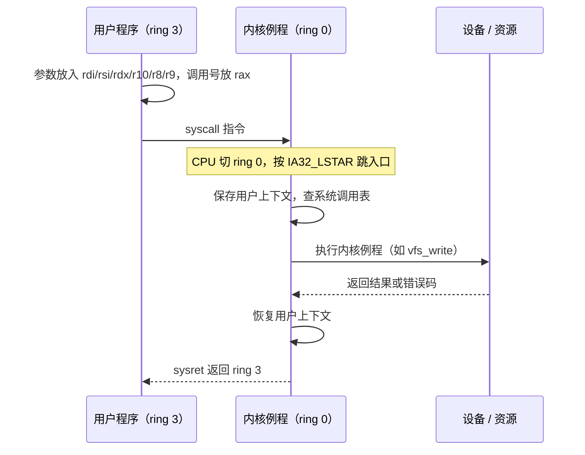
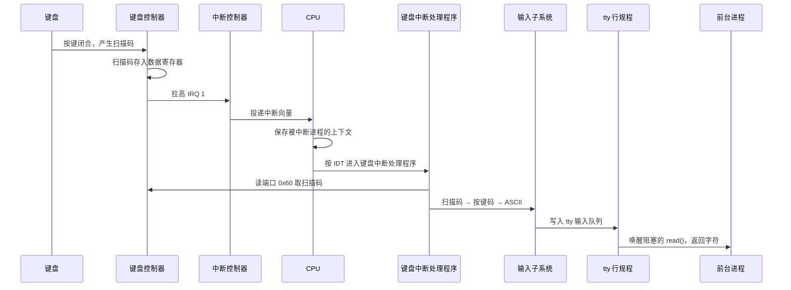

---
tags:
  - 基本功/系统
  - 基本功/操作系统
---

# 内核结构与设备管理

应用调一次 `read()`、敲一次键盘、写一次磁盘，背后都要穿过内核。内核对上把硬件差异收敛成一组稳定的抽象（进程、文件、套接字），对下把 CPU、内存和设备管理起来。理解它的边界在哪里、一次请求在哪一层完成地址空间或数据形态的转换，是排查 I/O 慢、驱动异常、中断不均衡这类问题的前提。

本篇分两块：前半部分（§1–§4）讲内核自身的结构——它处在什么位置、内核态与用户态怎么划界、宏内核与微内核在取舍什么、Linux 具体做了哪些设计选择；后半部分（§5–§10）讲设备管理，从设备控制器、四种 I/O 控制方式的演进，一路到驱动、通用块层、存储软件分层，最后用「敲下一个字母」把整条链路串起来。§11 逐条列参数，§12 给常见故障的排查顺序。

机制描述中的接口与常量以 Linux 主线内核文档 `Documentation/`、`man` page 与 x86 架构手册为准，涉及具体默认值的条目标注来源，取不到官方出处的标注为待验证。

## 1. 内核在系统中的位置

内核是运行在最高特权级上的常驻程序，站在两条边界上：对上是系统调用，对下是设备驱动。这条边界怎么划，决定了后面所有机制的形态。

### 1.1 内核是什么，为什么需要它

计算机由 CPU、内存、磁盘、网卡、显示控制器等硬件组成。每类硬件的编程接口都不一样：磁盘要下发块读写命令，网卡要走描述符环收发包，键盘靠端口读扫描码。如果每个应用都自己对接这些协议，应用会臃肿到无法维护，硬件一换代码就得重写。

内核把这段对接工作集中到一处。它是一种运行在最高特权级上的常驻程序，对上给应用提供一组与硬件无关的抽象，对下用具体的设备驱动操作硬件。应用看到的是「文件」，内核把它翻译成「哪个块设备、第几个扇区、走哪条命令队列」。

内核向应用承诺的能力可以归为四类：

- **进程调度**：决定哪个进程或线程在哪个 CPU 上、什么时候运行，处理抢占与时间片。
- **内存管理**：把物理内存切成页，给每个进程一套独立的虚拟地址空间，负责缺页处理、换出与回收。
- **设备管理**：为进程与硬件之间提供通信路径，包括驱动、中断处理与缓冲。
- **系统调用**：给用户程序一个进入内核的稳定入口，需要更高权限的操作都从这里发起。

这四类能力对应的接口是内核的两条边界：对上是系统调用，对下是设备驱动。应用不直接接触寄存器，驱动不直接面向用户。排查问题时先判断异常落在哪条边界上，能大幅缩小范围——`Device or resource busy` 是上层接口层的拒绝，`I/O error` 则是下层设备返回的失败。

### 1.2 内核态、用户态与系统调用入口

大多数操作系统把虚拟地址空间切成两块：**内核空间**只允许内核代码访问，**用户空间**给应用使用。CPU 在用户空间执行时称处于**用户态**，在内核空间执行时称处于**内核态**。这个划分靠 CPU 的特权级硬件实现，不靠软件自觉。

x86 定义了四个特权级，记作 ring 0 到 ring 3，数字越小权限越高（来源：Intel SDM Vol. 3A, Chapter 5）。ring 0 可以执行全部指令、访问全部内存与端口；ring 3 不能执行特权指令，也不能访问内核空间。Linux 只用到两端：内核跑在 ring 0，用户程序跑在 ring 3，中间两级留给虚拟化等场景（来源：Linux 内核文档 `Documentation/x86/`）。

用户态切换到内核态的触发有三类：**系统调用**（程序主动请求）、**中断**（设备异步通知）、**异常**（如除零、缺页、非法访问）。系统调用是应用唯一能主动、合法进入内核态的入口——用户程序不能直接调用内核函数，也不能直接读写设备寄存器。

```text
   ┌───────────────────────── 用户空间（ring 3）─────────────────────────┐
   │   应用进程 A            应用进程 B             应用进程 C            │
   │   只能访问自己的虚拟地址空间；执行特权指令触发 #GP 异常               │
   └──────────────────────────────┬──────────────────────────────────────┘
                                  │  系统调用 / 中断 / 异常
                    ┌─────────────▼─────────────┐
                    │  门（gate）：切换特权级     │
                    └─────────────┬─────────────┘
   ┌──────────────────────────────▼──────────────────────────────────────┐
   │                        内核空间（ring 0）                            │
   │  进程调度 │ 内存管理 │ VFS │ 网络栈 │ 设备驱动 │ 中断处理             │
   │  可访问全部物理内存与全部特权指令                                     │
   └──────────────────────────────────────────────────────────────────────┘
```

一次系统调用的机器级过程（以 x86-64 为例，来源：Intel SDM Vol. 2B 的 `SYSCALL`/`SYSRET` 指令说明；`man 2 syscall`）：

1. 用户程序把系统调用号放进 `rax`，把前六个参数依次放进 `rdi`、`rsi`、`rdx`、`r10`、`r8`、`r9`（第六个参数用 `r10` 而非 `rcx`，因为 `syscall` 会覆盖 `rcx`）。
2. 执行 `syscall` 指令。CPU 把返回地址存入 `rcx`、标志位存入 `r11`，把特权级切到 ring 0，并从 MSR `IA32_LSTAR` 取出内核入口地址跳转过去。
3. 内核入口保存用户寄存器、按调用号在系统调用表里找到对应函数执行。
4. 返回时执行 `sysret`（或 `iret`），特权级切回 ring 3，`rcx` 与 `r11` 里的返回地址和标志位被恢复。

老式的 32 位路径用 `int 0x80` 软件中断，走的是中断门；64 位内核为兼容仍保留它，但新代码用 `syscall`（来源：`man 2 syscall`）。



隔离带来两个直接后果，后面反复用到：一是内核的崩溃会让整机停摆，因为内核态没有更上层来兜底；二是每次进入内核都要付一次上下文保存与特权级切换的开销（约几百个时钟周期量级），所以高频操作会尽量在用户态完成或批量进入。**这两点正是宏内核与微内核之争、DMA 与中断之争的共同背景。**

## 2. 宏内核与微内核

内核按「哪些模块跑在内核态」分成三种结构，差异集中在两个量上：跨模块的调用开销，以及单个模块出错时的影响范围。

### 2.1 三种内核结构

内核按「哪些模块跑在内核态」分成三种结构：

- **宏内核**（monolithic kernel）：调度、内存管理、文件系统、设备驱动等全部模块都在内核态，运行在同一个地址空间里，模块之间直接函数调用。Linux 属于这一类。
- **微内核**（microkernel）：内核态只保留最基本的能力，通常是最小调度器、虚拟内存、进程间通信（IPC）与中断处理；驱动、文件系统、网络协议栈等移到用户态，作为独立服务进程运行，服务之间通过 IPC 通信。QNX、L4、MINIX 3 属于这一类，鸿蒙微内核也采用这一结构。
- **混合内核**（hybrid kernel）：雏形接近微内核，但实现上把大量服务搬回内核态，整个内核仍是一个完整程序。Windows NT 是典型代表，macOS 的 XNU 内核（Mach + BSD）也归入此类。

```text
   宏内核（Linux）                          微内核（QNX / L4 / MINIX 3）
   ┌───────────────────────────┐            ┌───────────────────────────┐
   │         内核态             │            │         内核态             │
   │  ┌────┬────┬────┬────┐    │            │   ┌──────────────────┐    │
   │  │调度│内存│VFS │驱动│    │            │   │ 最小内核：        │    │
   │  │    │    │    │FS  │    │            │   │ 调度 / 虚拟内存 /  │    │
   │  └────┴────┴────┴────┘    │            │   │ IPC / 中断        │    │
   │  所有服务在同一地址空间    │            │   └────────┬─────────┘    │
   └───────────┬───────────────┘            └────────────┼──────────────┘
               │ 函数调用，无切换                        │ IPC，跨地址空间
               ▼                                        ▼
   ┌───────────────────────────┐            ┌───────────────────────────┐
   │         用户态             │            │         用户态             │
   │  应用（服务不驻留用户态）  │            │ 驱动服务 │ 文件系统 │ 网络  │
   └───────────────────────────┘            └───────────────────────────┘
```

### 2.2 性能与稳定性的取舍

两种结构的差异集中在两个量上：**跨模块调用的开销**和**单个模块出错的影响范围**。

宏内核的模块在内核态同一地址空间，一次驱动调用就是一次普通函数调用，没有地址空间切换、没有 IPC 序列化。代价是错误会直接反映到内核：驱动里一个野指针可能改坏内核数据结构，触发整机 panic（内核 panic 后通常只能重启）。内核体积也因此更大，改动一处要重新编译或加载模块。

微内核把服务隔离到各自地址空间，一个驱动服务崩溃可以被父进程重启，不牵连整机，这是它主打的可靠性来源。代价是驱动与硬件交互要走 IPC：驱动在用户态收到请求，需要进内核态让最小内核代为访问硬件，再切回用户态，一来一回至少两次特权级切换加一次消息拷贝。**频繁调用底层能力的驱动（网络、磁盘）在微内核下每个 I/O 都要付这笔 IPC 开销**，这是微内核在吞吐敏感场景的主要短板。

混合内核走的是折中：用微内核的模块化设计来组织代码，但把性能敏感的服务（图形、文件系统、驱动的一部分）放回内核态，只保留一个最小的内核骨架概念。它在可靠性上不如纯微内核，在调用开销上接近宏内核。

> [!note] 取舍的量级
> 微内核相对宏内核的额外开销主要在 IPC，通常是一次消息传递加两次模式切换。这个开销对每秒几次的桌面操作可以忽略，对每秒几十万次的网络包处理就显著。判断一种内核结构是否合适，先看目标负载的调用频率量级。

### 2.3 三种结构对照与选型

| 维度 | 宏内核 | 微内核 | 混合内核 |
| --- | --- | --- | --- |
| 内核态模块 | 调度、内存、FS、驱动全部 | 调度、虚拟内存、IPC、中断 | 最小骨架 + 性能敏感服务 |
| 模块间通信 | 函数调用 | IPC 消息 | 以内核内调用为主 |
| 单模块崩溃影响 | 可能拖垮整机 | 通常限于该服务 | 介于两者之间 |
| 典型调用开销 | 最低 | 最高（两次模式切换 + 拷贝） | 接近宏内核 |
| 可移植性 | 较低（硬件相关代码散在内核） | 较高（驱动在用户态） | 中等 |
| 代表系统 | Linux、传统 UNIX | QNX、L4、MINIX 3 | Windows NT、macOS XNU |

选型上没有绝对优劣，判据是负载特征：调用频率高、对延迟敏感的基础设施（数据库、网关）适合宏内核的低开销；对可靠性和隔离要求高、允许单服务重启的场景（车载、医疗设备）微内核的管理优势更明显。

## 3. Linux 的设计

Linux 在宏内核的框架内做了一组具体选择：多任务与 SMP 是并发模型，一切皆文件是接口模型，内核模块是扩展模型。

### 3.1 多任务、SMP 与 ELF

Linux 是**多任务**（multitasking）系统，多个任务可以「同时」推进。这里的「同时」有两种：单核上每个任务执行一小段时间就切换，从宏观上看一段时间内多个任务都在前进，称为**并发**；多核上多个任务被不同核心真正同时执行，称为**并行**。

**SMP**（Symmetric Multi-Processing，对称多处理）指每个 CPU 地位相等、对资源的使用权限相同、共享同一份物理内存，任意 CPU 都能访问完整内存与硬件资源。因此 Linux 不会让某个 CPU 专为应用或内核服务，任何线程都可以被调度到任意 CPU 上，调度器要额外处理缓存亲和性，避免线程频繁跨核迁移导致 cache 失效。

**ELF**（Executable and Linkable Format）是 Linux 可执行文件、目标文件与共享库的存储格式。它用两类索引描述同一份内容（来源：`man 5 elf`）：**Program header table** 记录运行时装载器需要的段（哪个段映射到哪个虚拟地址、权限如何），**Section header table** 记录链接时各节（代码 `.text`、数据 `.data`、符号表等）的信息。运行时不读 section table，链接时不读 program header。

一个可执行文件从源码到运行的路径：

```text
   源码 .c ──编译器──▶ 汇编 ──汇编器──▶ 目标文件 .o ──链接器──▶ ELF 可执行文件
                                                        │
                                        装载器（execve）│ 按 program header 映射进内存
                                                        ▼
                                    CPU 从入口地址取指，指令与数据已在各自段中
```

### 3.2 一切皆文件

Linux 把「一切皆文件」当作统一的抽象入口：普通文件、目录、设备节点、管道、套接字都可以用 `open`/`read`/`write`/`close`/`ioctl` 这一组系统调用操作。硬盘这个块设备在 `/dev` 下就是一个文件节点，对它 `read` 等同于从设备读字节。

这层抽象的价值在于接口收敛：应用不需要为「读文件」和「读键盘」写两套代码，VFS（虚拟文件系统）会根据 `open` 的对象类型把请求转给对应的文件系统或驱动。设备除了读写，还有设备特有的配置与状态，这类操作走 `ioctl`，它是配置与修改特定设备属性的通用接口。

这层抽象落地的载体是文件描述符：`open("/dev/sda", ...)` 返回一个 fd，后续 `read`/`write`/`lseek` 都作用在这个 fd 上，与打开一个普通文本文件没有区别。管道（`pipe`）、字符设备、套接字都被纳入同一套 fd 体系，`select`/`poll`/`epoll` 因此可以同时等待文件、管道和网络套接字，这是「一切皆文件」在 I/O 多路复用上的直接收益。

抽象也有边界：文件接口表达得了「顺序读写一段数据」，表达不了「开始录制」「设置采样率」这类设备命令，所以 `ioctl` 一直无法被完全替代，各设备定义自己的 `ioctl` 命令号。目录、符号链接这些对象也是靠 VFS 的几类对象（`inode`、`dentry`、`file`、`super_block`）统一建模的。

### 3.3 内核模块与 /proc、/sys 两个虚拟文件系统

Linux 是宏内核，但支持**可加载内核模块**（Loadable Kernel Module，LKM），大部分设备驱动以模块形式存在，可以运行期加载和卸载，不必重编内核（来源：`man 8 insmod`、`man 8 modprobe`）。常用命令：

- `insmod <file.ko>`：把指定 `.ko` 文件插入内核。它需要给出完整路径，且**不解析依赖**，被依赖的模块必须已经加载。
- `modprobe <module>`：按模块名加载，会读 `/lib/modules/$(uname -r)/modules.dep` 自动先加载依赖模块，也能一次加载多个。
- `lsmod`：列出已加载模块及被引用计数，计数字段来自 `/proc/modules`。
- `rmmod <module>`：卸载模块，引用计数不为零时失败。

两个虚拟文件系统承担不同职责：

```text
   /proc（procfs）                          /sys（sysfs）
   ├─ 进程信息 /proc/<pid>/                  ├─ 设备与驱动的树形模型
   │   status / maps / fd / cmdline          │   /sys/devices/    物理设备层次
   ├─ 内核运行时参数（sysctl）               │   /sys/class/      按功能分类
   │   /proc/sys/kernel/printk               │   /sys/block/<dev>/queue/scheduler
   │   /proc/sys/net/ipv4/...                ├─ 驱动与总线
   └─ 硬件与系统概览                         │   /sys/bus/ /sys/drivers/
       /proc/cpuinfo /proc/meminfo           └─ 内核对象（kobject）的导出
       /proc/interrupts
```

两个都不是磁盘上的真实文件，读它们时内核现算内容。分工上，`/proc` 更早、偏进程与 sysctl 参数；`/sys` 是设备模型的正式导出，用 `class`、`bus`、`devices` 三类视图描述设备和驱动的关系，写 `/sys` 下某些文件等同于向驱动发命令。

**宏内核为什么还叫「模块化」**：内核编译时把功能划成可独立编译的模块，运行期按需加载；模块加载后与内核运行在同一地址空间，调用仍然是函数调用。这与微内核的「模块化」不是一回事——微内核的模块是用户态独立进程，靠 IPC 通信。Linux 的模块化解决的是「内核太大、不能全编进去」，不改变宏内核的调用模型。

## 4. 内核的组成部分与它们之间的接口

内核内部可以按职责分成几大块，它们通过明确定义的接口协作：

- **进程调度器**：维护就绪队列，决定下一个上 CPU 的任务。接口是调度类与 `sched_*` 系统调用。
- **内存管理**：页分配、页表、缺页处理、换页与回收。接口是 `mmap`/`brk` 系统调用和内核内部的分配器。
- **VFS**：文件系统抽象层，统一 `inode`、`dentry`、`file`、`super_block` 四个对象，向下适配 ext4、XFS、Btrfs 等具体实现。
- **网络栈**：套接字层、协议层（TCP/IP）与网卡驱动之间的队列。接口是 `socket` 系列系统调用与 `sk_buff` 结构。
- **设备驱动**：面向具体控制器的代码，通过总线（PCIe、USB）与设备通信，注册中断处理程序。

```text
   用户态（系统调用接口：open/read/write/mmap/socket/ioctl/...）
   ─────────────────────────── 系统调用边界 ───────────────────────────
   内核态
   ┌──────────┬──────────┬──────────┬──────────┬──────────────┐
   │ 进程调度 │ 内存管理 │   VFS    │  网络栈  │  设备驱动     │
   └────┬─────┴────┬─────┴────┬─────┴────┬─────┴──────┬───────┘
        └──────────┴──────────┴──────────┴────────────┘
                       内部接口：对象结构 + 回调表
   ─────────────────────────── 硬件边界 ───────────────────────────
   CPU / 内存 / 块设备 / 网卡 / 输入设备
```

判断内核版本的几条命令：`uname -a` 给内核版本号、主机名与架构；`uname -r` 只给内核 release 号（模块路径 `/lib/modules/$(uname -r)` 就是按它拼的）；`lsb_release -a` 给发行版信息，发行版与内核版本不是一回事；`/proc/version` 给编译内核的编译器版本；`/boot/config-$(uname -r)` 是编译时用的配置，可以直接看出某个驱动或特性是编进内核（`=y`）还是编成模块（`=m`）还是没编（未出现或 `# ... is not set`）。

## 5. 设备控制器

CPU 不直接操作物理设备，中间隔着设备控制器。控制器把设备差异收进一层硬件，CPU 只通过寄存器与它对话。

### 5.1 控制器的位置与三类寄存器

CPU 不直接操作物理设备。每类设备都有一个**设备控制器**（device controller），硬盘有磁盘控制器，显示器有视频控制器。控制器里有自己的芯片与逻辑，知道怎么驱动对应设备，CPU 与设备打交道时面向的是控制器。

磁盘控制器与键盘控制器的工作方式差别很大，CPU 要有一套统一的方式和它们对话，这套方式就是控制器上的**寄存器**。控制器通常有三类寄存器：

- **数据寄存器**：CPU 要发给设备的数据先写到这里，或从这里读设备送来的数据。传输大块数据时，控制器内部有一块缓冲区，数据攒够一批再和内存交换，减少对设备的频繁操作。
- **命令寄存器**：CPU 写入命令，告诉控制器要做读还是写、做多少。控制器开始工作，完成后把状态寄存器标记为完成。
- **状态寄存器**：反映控制器当前状态（忙、就绪、出错）。控制器还在工作时，CPU 再写数据或命令都无效，必须等状态就绪。

```text
        CPU
         │ 端口指令 / 内存映射访问
         ▼
   ┌───────────────────────────────┐
   │          设备控制器            │
   │  ┌──────────┬──────────┬─────┐ │
   │  │ 数据寄存器│ 命令寄存器│状态 │ │
   │  └──────────┴──────────┴─────┘ │
   │  本地逻辑 + 缓冲区（攒批减少交互）│
   └───────────────┬───────────────┘
                   │ 设备专用信号线
                   ▼
        物理设备（磁盘 / 键盘 / 网卡）
```

### 5.2 端口映射 I/O 与内存映射 I/O

CPU 访问控制器寄存器有两种寻址方式（来源：Intel SDM Vol. 1, Chapter 19 的 I/O 端口与内存映射说明）：

- **端口映射 I/O**（Port-Mapped I/O，PMIO）：每个控制寄存器分配一个 I/O 端口号，占用独立的 I/O 地址空间，用 `in`/`out` 这类专用指令读写。x86 的 I/O 端口空间只有 64 KiB，端口号总量有限。
- **内存映射 I/O**（Memory-Mapped I/O，MMIO）：把控制器寄存器映射到物理内存地址空间的一段，用普通的访存指令读写，地址空间宽阔得多。现代外设（PCIe 设备、APIC、显卡）主要走 MMIO。

两种方式都能工作，但 MMIO 的寄存器访问会被 CPU 缓存策略影响：对设备寄存器的读写通常不能缓存，否则读到的是旧值或写入被合并。因此 MMIO 区域要映射成不可缓存（uncached）或写合并（write-combining）内存。**排查「寄存器值读不对、写入丢失」时，先检查这段映射的缓存属性**。

## 6. 四种 I/O 控制方式

控制器读写数据需要时间，四种 I/O 控制方式回答的是同一个问题：这段时间 CPU 在做什么。

控制器读写数据需要时间，问题在于这期间 CPU 做什么。四种 I/O 控制方式代表四种答案，每一种消除上一代的一段开销。

### 6.1 轮询（程序查询）

CPU 给控制器发完命令后，不停读状态寄存器，直到状态变为就绪。这段时间 CPU 完全空转，不能执行其他任务。

轮询的实现最简单，不需要中断硬件的配合；在设备响应极快、等待时间短于一次中断处理的开销时反而划算。它的代价是把 CPU 时间花在等待上，设备越慢、每次传输的数据越小，浪费越大。

把代价量化：设设备完成一次操作需要 T 秒，CPU 每读一次状态寄存器并判断需要 t 秒，那么完成这次操作要读大约 T/t 次，这段时间全部耗在等待同一个设备上。换成中断驱动后，CPU 只在这 T 秒结束时处理一次中断，T/t 次重复开销消失，剩下的 T 秒可以交给别的任务。设备越慢、T 越大，两种方式的差距越明显。

判据是「等待时间与一次中断处理开销」的比值：设备极快、等待短于一次中断的上下文保存与恢复时，轮询反而更省；设备慢、单次操作耗时远大于中断开销时，轮询浪费的 CPU 时间成倍增加。DMA 控制器这类响应极快的硬件，其内部状态寄存器读写常直接用轮询，正落在前一种情形里。

### 6.2 中断驱动

设备完成任务后主动发信号通知 CPU，CPU 不必空转。硬件路径上，设备把信号送到中断控制器（x86 上通常是 APIC），中断控制器把它编码成一个中断向量投递给 CPU。

一次硬件中断的完整路径：

1. 设备完成任务，通过中断线拉高信号（电平触发或边沿触发）。
2. 中断控制器把该线映射到向量号，向 CPU 投递。若有多个中断同时到达，按优先级选择。
3. CPU 在两条指令之间响应中断：保存当前执行的上下文（指令指针、标志位、被调用者保存寄存器等），按向量号到中断描述符表（IDT）中查到处理程序入口。
4. 进入中断处理程序，先做少量必须尽快完成的工作（读取状态、应答中断控制器），其余放到下半部延后处理。
5. 处理完毕，发送中断结束信号（EOI）给中断控制器，恢复被中断的上下文继续执行。

中断分**硬件中断**（设备经中断控制器触发）与**软件中断**（代码执行 `int` 指令或内核内部的下半部机制触发）。轮询的问题是 CPU 空转，中断消掉的正是这段空转，代价是每次中断都要保存和恢复上下文。

中断驱动的短板出现在高频设备上：磁盘每读完一小段就中断一次，CPU 会不断被打断，中断处理本身的开销累积起来可能超过数据搬运本身。**这也解释了后面为什么需要 DMA——把「每个单位都中断一次」变成「一整块传完中断一次」。**

### 6.3 DMA

DMA（Direct Memory Access，直接内存访问）引入**DMA 控制器**，让数据在设备与内存之间直接传送，CPU 只负责发起与收尾（来源：Linux 内核文档 `Documentation/core-api/dma-api.rst` 对 DMA 映射模型的描述）。

工作过程：

1. CPU 给 DMA 控制器下发描述符：数据从哪来（设备地址）、到哪去（内存地址）、传多少字节。
2. DMA 控制器向设备控制器发出读命令，设备开始把数据送进自己的缓冲区。
3. 数据经系统总线直接写入内存，全程经过 CPU 的只有总线周期的仲裁，数据不进入 CPU 寄存器。
4. 整块传完，DMA 控制器发中断通知 CPU，CPU 直接使用内存里现成的数据。

```text
   无 DMA（中断驱动，数据逐个单位过 CPU 寄存器）:
   ┌─────┐  1.读端口  ┌──────────┐  2.写内存  ┌──────┐
   │ CPU │──────────▶ │ 设备控制器│ ─────────▶ │ 内存 │
   └──┬──┘            └──────────┘            └──────┘
      └─ 每搬一个单位：中断一次 + CPU 执行一次拷贝  → 占用高

   有 DMA（数据不过 CPU 寄存器）:
   ┌─────┐ 1.下发描述符 ┌────────────┐ 2.总线直接搬 ┌──────┐
   │ CPU │────────────▶ │ DMA 控制器 │ ──────────▶ │ 内存 │
   └──┬──┘              └─────┬──────┘             └──────┘
      │ 3.返回去做别的事       │ 发设备读命令
      │                       ▼
      │                 ┌──────────┐
      │                 │ 设备控制器│
      │                 └──────────┘
      └─ 4.收尾：整块完成时 DMA 发一次中断通知 CPU
```

DMA 消除的是「每个数据单位都过一遍 CPU」这段开销：CPU 从「搬运工」变成「项目经理」，只在开始下发描述符、结束时收中断两次介入。**这也是它比中断驱动更省 CPU 的根本原因——中断次数从「每单位一次」降到「每块一次」。**

DMA 控制器与 CPU 争用总线会占用内存带宽，早期靠周期窃取（cycle stealing）逐周期借用，现代 DMA 可以直接突发传输整段。CPU 访问被 DMA 写入的内存前要做缓存一致性处理（flush/invalidate），否则可能读到缓存里的旧值（来源：`Documentation/core-api/dma-api.rst`）。

### 6.4 通道 I/O 与四种方式演进对照

**通道 I/O**（channel I/O，I/O 处理机）在 DMA 基础上再进一步：DMA 只搬数据，通道能执行自己的**通道程序**（一串通道命令），自主完成「从多个磁盘读数据、拼接、写入内存」这类多步操作，CPU 只下发一段通道程序，整段完成后收一次中断。大型机（IBM z 系列）用这种结构，通道本身就是一个小型处理器。

四种方式的演进，每一代消除上一代的一段固定开销：

```text
   方式        谁在等 / 谁搬数据                        消除了上一代的哪段开销
   ├─ 轮询      CPU 忙等状态位                         —— 基线：CPU 全程参与
   ├─ 中断      CPU 被通知后搬运一个数据单位            消除「空转等状态位」
   ├─ DMA      DMA 控制器搬整块，CPU 只下发描述符       消除「每个单位都过 CPU」
   └─ 通道 I/O  通道执行自己的通道程序，自主完成多步     消除「CPU 逐条下发 I/O 指令」
```

| 方式 | CPU 参与程度 | 中断频率 | 适用场景 |
| --- | --- | --- | --- |
| 轮询 | 全程空转等待 | 无 | 设备极快、等待短于中断开销 |
| 中断驱动 | 每单位处理一次 | 每单位一次 | 慢速字符设备（键盘、串口） |
| DMA | 发起与收尾各一次 | 每块一次 | 块设备、网卡等大数据量传输 |
| 通道 I/O | 只下发通道程序 | 整段一次 | 大型机、多设备协同 I/O |

## 7. 设备驱动程序

驱动是内核里面向某一类控制器的代码，它把操作细节封装起来，向文件系统与网络栈暴露统一接口。

### 7.1 驱动在三方之间的位置

控制器屏蔽了设备差异，但不同控制器的寄存器布局、缓冲区用法、命令格式仍各不相同。**设备驱动程序**是内核里面向某一类控制器的代码，它把「怎么操作这个控制器」的细节封装起来，向内核上层暴露统一接口（来源：Linux 内核文档 `Documentation/driver-api/`）。

驱动处在三方之间，同时面向三个对象：

- **面向设备控制器**：知道该往哪个寄存器写什么命令、怎么读状态、怎么从缓冲区取数据。
- **面向内核上层**：实现统一的接口（块设备的请求处理、字符设备的读写、网络设备的收发入口），让文件系统、网络栈不必知道底层是什么硬件。
- **面向中断**：初始化时注册中断处理程序，控制器发来中断时被回调。

```text
   内核上层（VFS / 网络栈 / 块层）
        │  统一接口：read/write/ioctl、request、netdev_ops
        ▼
   ┌───────────────────────────┐
   │        设备驱动程序         │  属于操作系统，内核态代码
   │  接口层（对上）+ 硬件层（对下）│
   └─────────────┬─────────────┘
                 │ 读写寄存器 / 处理中断
                 ▼
   ┌───────────────────────────┐
   │        设备控制器           │  属于硬件
   └─────────────┬─────────────┘
                 ▼
              物理设备
```

驱动初始化时注册中断处理函数，中断到来时的处理流程是：控制器就绪后经中断控制器向 CPU 发中断 → 保存被中断进程的上下文 → 按向量跳到设备中断处理函数 → 处理（读状态、搬数据、清中断）→ 恢复上下文。

### 7.2 三种设备类型与 /dev、主次设备号

按访问方式与接口，设备分三类：

| 类型 | 访问单位 | 是否可寻址 | 是否有缓冲 | 典型接口 | 例子 |
| --- | --- | --- | --- | --- | --- |
| 块设备 | 固定大小的块 | 可按块寻址 | 有块缓冲、走页缓存 | 通用块层 + 文件系统 | 硬盘、SSD、U 盘 |
| 字符设备 | 字符流 | 不可寻址，无寻道 | 通常无 | 字节流读写 | 键盘、鼠标、串口 |
| 网络设备 | 数据帧 | 不适用 | 有收发队列 | 套接字接口 | 网卡 |

块设备以固定大小的块为单位、每块有地址，数据量大，控制器设缓冲区攒批；字符设备以字符为单位收发、不可寻址，没有寻道；网络设备特殊，不走 `/dev` 文件接口，走套接字层，因为它收发的是帧、有独立的排队与流控逻辑。

设备节点在 `/dev` 下，每个节点有两个编号（来源：`man 4` 中的设备号说明与 `Documentation/admin-guide/devices.txt`）：

- **主设备号**（major）：标识用哪个驱动，同一驱动管理的设备共享主设备号。
- **次设备号**（minor）：在同一个驱动内区分具体设备，比如同一块磁盘的不同分区、同一驱动的多个串口。

```text
   /dev/sda        主 8   次 0    整块磁盘
   /dev/sda1       主 8   次 1    第一个分区
   /dev/nvme0n1    主 259 次 0    第一块 NVMe 盘
   /dev/ttyS0      主 4   次 64   第一个串口
```

用 `ls -l /dev/sda` 看设备类型与编号，块设备显示 `b`、字符设备显示 `c`。内核通过设备号在内部表中找到对应的驱动，把 `open`/`read`/`write` 路由到驱动实现。

## 8. 通用块层

通用块层夹在文件系统与具体块设备驱动之间，把五花八门的驱动接口收敛成一套块接口。

### 8.1 位置与两个功能

不同块设备的驱动接口五花八门（SCSI 走命令描述块、NVMe 走提交/完成队列、virtio 走环形缓冲），文件系统不该为每种驱动写一份代码。Linux 在文件系统与具体块设备驱动之间放了一个**通用块层**（generic block layer），它向上提供统一的块接口，向下把不同驱动抽象成统一的块设备。

通用块层存在的理由是驱动接口的异构：SCSI 用命令描述块，NVMe 用提交/完成队列，virtio 用环形缓冲，三者的命令格式、完成通知方式、队列模型都不同。若没有这一层，文件系统要为每种驱动各写一份下发逻辑。通用块层把「构造一次 I/O 请求」与「把请求交给具体硬件」切开：文件系统只面对 `bio`，驱动只面对 `request`，两者通过队列解耦。

通用块层有两个功能：

1. **统一接口与设备管理**：向上为文件系统和应用提供访问块设备的标准接口，向下把各种磁盘抽象为统一块设备，并提供一个框架来管理这些驱动。
2. **I/O 调度**：对文件系统与上层发来的 I/O 请求排队，再做合并与排序，决定先发哪个请求给设备，目的是减少寻道、提高吞吐。

### 8.2 bio、request queue 与 I/O 调度

通用块层的核心对象有两级（来源：Linux 内核文档 `Documentation/block/`）：

- **`bio`**：描述一次块 I/O 的原始请求，记录「读写方向、起始扇区、要多少字节、数据在内存的哪些页」。它由文件系统或上层直接构造，粒度接近应用的一次读写。
- **`request`**：`bio` 进入请求队列后，经过合并与排序形成的、面向具体设备的一次操作。多个相邻或连续的 `bio` 可以合并进同一个 `request`。

流程是：`bio` 先尝试与队列里已有的 `request` **合并**（merge）——前后地址相邻的可以拼成一个更大的请求；不能合并的按 **排序**（sort）规则插入队列相应位置（对机械盘，按扇区号排序能减少磁头来回移动）；最后由 I/O 调度器从队列里挑一个 `request` 发给驱动。

```text
   bio（文件系统视角：读 / 页 / 扇区范围）
     │
     ▼
   ┌─────────────────────── 请求队列 request queue ───────────────────────┐
   │  merge：相邻 bio 合并进已有 request，减少请求数                       │
   │  sort ：按扇区号排序，减少机械盘寻道                                  │
   │  ┌───────────────────────────────────────────────────────────────┐   │
   │  │ I/O 调度器：mq-deadline / bfq / kyber / none  选出下一个 request│   │
   │  └───────────────────────────────────────────────────────────────┘   │
   └──────────────────────────────┬────────────────────────────────────────┘
                                  ▼
                          块设备驱动下发命令
```

常见调度器及其适用面（来源：Linux 内核文档 `Documentation/block/` 中调度器各节）：

- **`none`**：不调度，请求直接下发。适合 NVMe 这类支持多队列、自身乱序执行能力强的设备，也常用在虚拟机里，把调度交给物理机。
- **`mq-deadline`**：多队列版的最终期限调度，为读写请求设置截止时间，防止请求饿死，兼顾吞吐与延迟，是多数场景的默认选择。
- **`bfq`**：预算公平队列，为每个进程维护调度队列、按时间片分配 I/O，桌面与交互场景下响应更平滑，代价是吞吐略降。
- **`kyber`**：轻量级调度器，以延迟为约束控制队列深度，适合高速设备（NVMe）。

**合并与排序为什么有用**：机械盘上连续读写一个 1 MB 区域，拆成 256 个 4 KB 请求会让磁头来回寻道；合并成少数几个大请求后，寻道次数降到个位数量级。SSD 没有寻道，但请求数减少仍能降低驱动与协议栈的固定开销，所以合并普遍有利。

## 9. 存储系统 I/O 软件分层

把设备、控制器、驱动、通用块层、文件系统串起来看，一次读写请求会依次穿过一个固定的层次栈。

### 9.1 五层栈与一次 write 的形态转换

把设备、控制器、驱动、通用块层、文件系统串起来，Linux 存储系统的 I/O 从用户到设备可以分成若干层：

```text
   ┌───────────────────────────────┐
   │ 用户程序 read()/write()/ioctl  │  字节流、文件描述符
   ├───────────────────────────────┤
   │ VFS（虚拟文件系统）            │  统一接口、inode/dentry 缓存
   ├───────────────────────────────┤
   │ 具体文件系统（ext4/xfs/btrfs） │  逻辑块、页缓存、日志
   ├───────────────────────────────┤
   │ 通用块层 + I/O 调度器          │  bio、request queue、合并与排序
   ├───────────────────────────────┤
   │ 块设备驱动（nvme/virtio/scsi） │  设备命令、完成中断
   ├───────────────────────────────┤
   │ 设备控制器 → 物理设备          │  DMA、寄存器
   └───────────────────────────────┘
```

一次 `write()` 穿过各层时，数据在几种形态之间转换：

1. **用户态字节流**：应用给的是文件描述符加一段用户缓冲区。
2. **VFS 层**：按文件找到 `inode`，确认权限与偏移，转给具体文件系统。
3. **文件系统层**：把「文件偏移」翻译成「逻辑块号」，写进**页缓存**（page cache），对应页标记为脏（dirty），此时写调用通常已返回。文件系统记录日志以保证元数据一致性。
4. **回写（writeback）**：内核的回写线程在合适时机把脏页按文件系统的块映射组织成 **`bio`**，交给通用块层。
5. **通用块层**：`bio` 合并、排序进请求队列，调度器选出下一个 `request` 交给驱动。
6. **驱动层**：驱动把 `request` 翻译成设备命令（NVMe 写命令、SCSI 写命令），写入提交队列并通知设备。
7. **设备层**：控制器通过 DMA 把内存里的数据写进介质，完成后发中断。
8. **收尾**：驱动处理完成中断，向上报告完成，脏页可以清除。

写路径与读路径的差别在于：读在页缓存未命中时会同步发起一次块 I/O，把数据从设备读进页缓存再返回；写则先落页缓存就返回，真正的设备写由回写异步完成。**这也解释了两个常见现象**——写完立刻断电可能丢数据（还在页缓存里没落盘），以及 `write()` 返回不代表数据已经到介质（要 `fsync` 才保证）。

## 10. 键盘敲入一个字母的完整链路

把前面所有机制串起来，敲下一个字母的完整时序（以 PS/2 键盘为例）：



逐跳说明参与者与数据形态：

1. **键盘 → 键盘控制器**：按键动作让键盘产生一个**扫描码**（scancode），这是按键的物理位置编码，不等于字符。
2. **键盘控制器**：把扫描码放进自己的数据寄存器，同时把 IRQ 1 拉高。键盘是字符设备，中断频率低，适合中断驱动而不是 DMA。
3. **中断控制器 → CPU**：APIC 把 IRQ 1 编码成中断向量投递给 CPU。
4. **CPU**：在两条指令之间响应中断，保存被中断进程的上下文，按中断描述符表找到键盘中断处理程序入口。
5. **键盘中断处理程序**：从端口 `0x60` 读走扫描码，应答控制器。此时拿到的是扫描码，还要经过键盘布局表（keymap）翻译：扫描码 → 按键码（keycode）→ 对应字符。敲字母 A 得到字符/A/的 ASCII 码；功能键、组合键走另一条分支。
6. **输入子系统**：把按键事件分发给注册的消费者（控制台、X/Wayland、其他输入处理）。
7. **tty 行规程**：控制台场景下，字符进入 tty 的输入队列，行规程处理回车、退格、信号字符（如 Ctrl-C）等语义。
8. **前台进程**：阻塞在 `read()` 上的前台进程被唤醒，`read()` 返回，用户程序拿到这个字符。

整条链路上，数据形态经历「扫描码 → 按键码 → ASCII 字符 → tty 输入队列里的字节」，控制权经历「用户进程 → 中断 → 内核处理 → 回到用户进程」。**这条链路是理解中断驱动 I/O 的最小完整样本**：如果没有中断，内核只能在每个时钟周期去轮询端口，CPU 会被键盘这类慢设备拖住。

## 11. 参数

**printk 日志级别（`/proc/sys/kernel/printk`）**

`printk` 是内核的日志接口，每条消息带一个级别 0–7，数字越小越紧急（来源：Linux 内核文档 `Documentation/admin-guide/printk.rst`）：

| 级别 | 名称 | 含义 |
| --- | --- | --- |
| 0 | `KERN_EMERG` | 系统不可用 |
| 1 | `KERN_ALERT` | 必须立即处理 |
| 2 | `KERN_CRIT` | 严重故障 |
| 3 | `KERN_ERR` | 错误 |
| 4 | `KERN_WARNING` | 警告 |
| 5 | `KERN_NOTICE` | 正常但需注意 |
| 6 | `KERN_INFO` | 信息 |
| 7 | `KERN_DEBUG` | 调试 |

`/proc/sys/kernel/printk` 一行有四个数：控制台日志级别、默认消息级别、最低控制台级别、默认控制台级别。常见默认形如 `7 4 1 7`（来源：`Documentation/admin-guide/printk.rst`，具体值随发行版配置变化，以实际读数为准）。语义是：级别数值**小于等于**控制台日志级别的消息才会打印到控制台；`dmesg` 默认只显示 `dmesg` 缓冲区内容，`dmesg -n <level>` 可临时抬高控制台门槛。

- **什么时候改**：调试某类驱动时想少看噪声，把控制台级别调低（例如设为 4 只看错误）；排查偶发问题想全量记录，调高到 7 或 8（8 表示打印所有级别）。
- **改大改小的后果**：调大后控制台会刷出大量 `KERN_DEBUG`，日志量大增，严重时拖慢系统；调小后可能漏掉故障前的告警。
- **联动**：`dmesg` 的 `-n`、`rsyslog`/`journald` 的过滤规则、`kernel.printk` 的持久化配置（`sysctl.d` 或 `/etc/sysctl.conf`）。
- **失败模式**：级别设得过低会看不到驱动加载失败的 `KERN_ERR`；日志被 `logrotate` 或环形缓冲区覆盖会丢失故障现场。

**I/O 调度器（`/sys/block/<dev>/queue/scheduler`）**

查看与切换：

```bash
cat /sys/block/sda/queue/scheduler
# 输出形如： [mq-deadline] kyber bfq none
echo bfq > /sys/block/sda/queue/scheduler
```

方括号标出的是当前生效的调度器。可选项与默认值取决于内核配置与设备类型（来源：`Documentation/block/`；具体可选集合以设备实际读数为准）。

- **什么时候改**：NVMe 或虚拟机磁盘想降低延迟可改 `none`；桌面交互卡顿可试 `bfq`；数据库类混合读写压力大时可试 `mq-deadline`。
- **改大改小的后果**：从 `bfq` 切到 `none`，单进程顺序吞吐上升，多进程公平性下降；从 `none` 切回带调度的算法，请求延迟更稳但队列处理多一层。
- **联动**：`nr_requests` 队列深度、设备的 `rotational` 属性（是否机械盘）、多队列的队列数。
- **失败模式**：写了一个内核里不存在的调度器名会报 `Invalid argument`，此时要确认内核是否编入了该模块；机械盘上用 `none` 会让寻道优化失效，吞吐下降。

**请求队列深度（`/sys/block/<dev>/queue/nr_requests`）**

`nr_requests` 是每个请求队列能排队的请求数上限，历史默认值常见为 128（来源：`Documentation/block/`，新内核中默认值会随设备与 CPU 数调整，以 `/sys` 实际读数为准，未核对当前内核默认）。

- **什么时候改**：磁盘在并发压力下 `aqu-sz` 长期顶到上限、而设备仍有空闲，可适度调大；希望降低单次 I/O 延迟、减少排队，可调小。
- **改大改小的后果**：调大能容纳更多并发请求、提升吞吐，但请求在队列里等待更久、尾延迟上升；调小降低延迟，但并发一高就吃 `-EBUSY` 或应用侧排队。
- **联动**：调度器类型、`/sys/block/<dev>/queue/nr_requests` 与设备的硬件队列深度、`iostat` 的 `aqu-sz`。
- **失败模式**：设得比硬件能承受的深，队列堆积反而拉高 `await`；设得过浅，高并发下吞吐上不去。

**脏页回写阈值（`/proc/sys/vm/dirty_ratio`）**

写路径先落页缓存再回写，回写时机由这几个参数控制：`dirty_background_ratio`（后台回写线程开始回写的脏页占比）与 `dirty_ratio`（进程同步回写、阻塞写入的脏页占比）（来源：`Documentation/admin-guide/sysctl/vm.rst`）。

- **什么时候改**：突发大量写导致延迟抖动时，调小 `dirty_ratio` 让回写更早、更连续。
- **改大改小的后果**：调大能吸收更大的写突发，但断电丢数据窗口变大、回写时可能造成长时间卡顿；调小写延迟更平稳，但持续写入吞吐可能下降。
- **联动**：`dirty_expire_centisecs`（脏页最长驻留时间）、`dirty_writeback_centisecs`（回写线程唤醒间隔）、设备自身的写缓存策略。
- **失败模式**：`dirty_ratio` 设得过高，一次写突发后回写会瞬间打满磁盘，应用出现秒级卡顿。

## 12. 常见故障与排查

**dmesg 里的 I/O error 怎么读**

`dmesg` 中的 `I/O error` 通常来自块层或驱动，格式形如 `blk_update_request: I/O error, dev sda, sector 123456` 或 `sd 0:0:0:0: [sda] Sense Key : Medium Error`。读法是先看**设备名与扇区号**定位物理位置，再看后面的**错误类别**（介质错误、超时、校验失败），最后看错误是持续出现还是偶发。

排查顺序：

1. `dmesg -T | grep -iE 'I/O error|medium error|sense key'` 看是否有持续性错误；
2. `smartctl -a /dev/sda` 看 `Reallocated_Sector_Ct`、`Current_Pending_Sector` 是否增长，判断是介质老化还是线缆/背板问题；
3. 若错误集中在某几个扇区且计数增长，优先备份并换盘；若是超时类错误，检查背板、HBA 与线缆。

**判读原则**：偶发的单次 `I/O error` 若伴随重试成功，`smartctl` 无增长，可能是外部干扰；计数持续增长说明介质在退化，不能等它自己恢复（来源：`smartctl(8)` 的 SMART 属性说明）。

**驱动加载失败**

`modprobe <module>` 报错时按错误类型定位：

- `Module not found`：模块文件不在 `/lib/modules/$(uname -r)/` 下，用 `uname -r` 核内核版本，确认 `modules.dep` 已由 `depmod` 生成。
- `Unknown symbol`：依赖符号没有被任何已加载模块提供，说明依赖模块缺失或版本不匹配，用 `modinfo <module>` 看 `depends` 字段。
- `Invalid argument` / `Operation not permitted`：模块与当前内核版本不匹配（vermagic 不一致），或安全模块（Secure Boot、模块签名）拒绝加载。
- `Device or resource busy`：设备已被占用，见 12.5。

排查顺序：先 `dmesg | tail` 看内核拒绝的具体原因（比 `modprobe` 的用户态报错更详细），再 `modinfo <module>` 核对路径、依赖与签名，最后核 `uname -r` 与模块目录是否一致。

**中断分布是否均衡**

`/proc/interrupts` 每行是一个中断号，各列对应一个 CPU，右侧是设备名：

```text
           CPU0       CPU1       CPU2       CPU3
  1:       1234          0          0          0   IO-APIC   1-edge      i8042
 24:     456789     123456     234567     345678   PCI-MSI  524288-edge  nvme0q0
```

- 某一行集中在 CPU0、其余为 0，说明该中断的亲和性被固定或设备只用一个队列，在高负载下会成为瓶颈。
- 对多队列设备（NVMe、万兆网卡），每个队列应绑定到不同 CPU；若全部落在同一个核，需要检查 `irqbalance` 是否运行或手动设置 `/proc/irq/<n>/smp_affinity`。
- 软中断分布看 `/proc/softirqs`，网络收包多时 `NET_RX` 是否均衡决定了多核能否被利用。

**判读原则**：先确认设备是否支持多队列（`/sys/block/<dev>/mq/` 下的队列数），支持却分布不均才有优化空间；单队列设备分布集中属于预期。

**iostat -x 的 %util、await、aqu-sz**

`iostat -x <间隔>` 输出中三个关键列（来源：`iostat(1)`）：

- **`%util`**：设备有 I/O 请求在处理的时间占比。接近 100% 说明设备忙满；对支持并发的设备，100% 不等于吞吐已到上限，要结合队列深度看。
- **`await`**：平均每个 I/O 的等待加服务时间（毫秒），包含在队列里排队的时间。`await` 显著高于设备固有服务时间，说明排队严重。
- **`aqu-sz`**：平均请求队列长度。它上不去而 `await` 高，问题可能在下游；它顶到 `nr_requests` 上限而 `%util` 未满，说明队列深度限制了并发。

**读法**：先看 `%util` 判断设备是否饱和；`%util` 高且 `await` 随并发同步上升，说明设备到瓶颈；`%util` 不高但 `await` 高，检查是否有队列深度限制或驱动层排队。

**设备忙（Device or resource busy）的排查顺序**

`umount`、`open`、`modprobe` 时出现 `Device or resource busy`，说明该设备或资源已被占用。按以下顺序查：

1. **谁在用这个设备**：`lsof /dev/sdb` 或 `fuser -m /mnt/data` 列出持有文件句柄的进程。
2. **是否是挂载点**：`mount | grep sdb`、`findmnt /mnt/data` 确认是否有进程的工作目录落在该挂载点内（`lsof +D /mnt/data`）。
3. **内核态持有者**：`cat /proc/mounts` 与 `dmesg | tail` 排除模块引用计数不为零（`lsmod` 看引用数）、或网络命名空间、容器仍在引用。
4. **分层块设备**：LVM、RAID、dm-crypt 的上层被占用时，底层设备也会 busy，用 `lsblk` 看设备树，从上层往下逐层释放。

**判读原则**：`busy` 是上层接口层的拒绝，不是硬件错误；先在软件层找占用者，不要急着拔设备或重启。设备树上的每一层（LVM 卷、md 阵列、分区）都可能独立持有引用。

## 相关

- [[00-系统专栏导览]] —— 本专栏的入口、边界与阅读顺序
- [[01-硬件结构与 CPU]] —— 下一层：CPU 与存储器之间是怎么配合的
- [[08-文件系统与 IO 栈]] —— 「数据在内核与用户态之间怎么搬运」的专门展开

## 参考

- Linux Kernel Documentation. *printk*. https://www.kernel.org/doc/html/latest/core-api/printk-basics.html
- Linux Kernel Documentation. *Block layer*. https://www.kernel.org/doc/html/latest/block/index.html
- Linux Kernel Documentation. *DMA API*. https://www.kernel.org/doc/html/latest/core-api/dma-api.html
- Linux Kernel Documentation. *Driver API*. https://www.kernel.org/doc/html/latest/driver-api/index.html
- Linux Kernel Documentation. *sysctl/vm（dirty_ratio）*. https://www.kernel.org/doc/html/latest/admin-guide/sysctl/vm.html
- Linux man-pages. *syscall(2)*. https://man7.org/linux/man-pages/man2/syscall.2.html
- Linux man-pages. *elf(5)*. https://man7.org/linux/man-pages/man5/elf.5.html
- Linux man-pages. *insmod(8) / modprobe(8)*. https://man7.org/linux/man-pages/man8/modprobe.8.html
- Linux man-pages. *iostat(1)*. https://man7.org/linux/man-pages/man1/iostat.1.html
- Intel. *Intel 64 and IA-32 Architectures Software Developer's Manual, Vol. 3A*（特权级与系统调用机制）. https://www.intel.com/content/www/us/en/developer/articles/technical/intel-sdm.html
- 小林coding. *图解系统 v1.0*. https://xiaolincoding.com/os/
