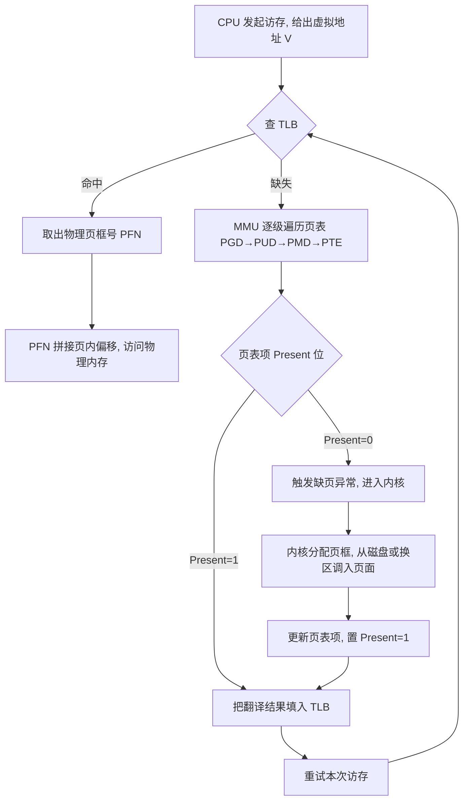
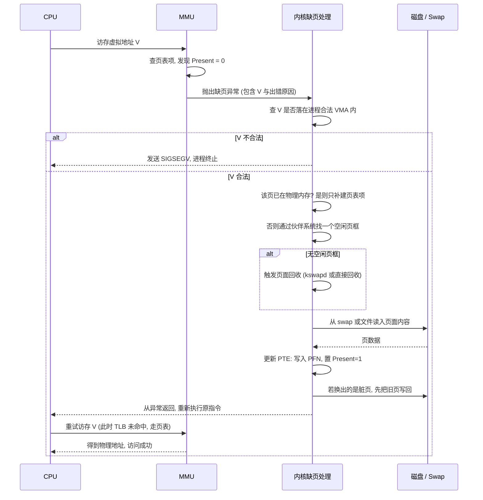

---
tags:
  - 基本功/系统
  - 基本功/虚拟内存
---

# 虚拟内存与页面置换

进程看到的地址空间是一整套从 0 开始的连续地址，机器里真正存在的物理内存只有一份。这两件事对不上，中间那层转换由内核和 `MMU`（Memory Management Unit，内存管理单元）共同完成，它同时解决了隔离、容量和保护三个问题。本笔记先讲清这层抽象为什么必须存在，再依次展开分段、分页、多级页表、`TLB`、缺页中断与页面置换算法，最后落到 Linux 的具体实现、可调参数与线上故障的排查路径。

阅读顺序对应一条依赖链：分页是多级页表的前提，多级页表带来的额外访存又逼出了 `TLB`，`TLB` 未命中才轮到缺页中断，缺页中断找不到空闲页才需要页面置换算法。理解了前一层，后一层的动机基本可以顺着推出来。

## 1. 为什么需要虚拟内存

没有操作系统的环境里，程序编译出来就是一组对物理地址的直接读写。这不是一个抽象的描述，它可以落到一个具体场景：一块板子上同时跑两个程序，A 在物理地址 `0x2000` 写入一个变量，B 的某个全局变量恰好也落在 `0x2000`，A 的这次写会当场覆盖 B 的数据，B 随后读到的就是被改过的值，两个程序都可能因此崩溃。两个程序共用一份物理地址空间时，这种覆盖是必然结果，跟写代码的人是否细心无关。

**物理地址直访的三个问题**

把上面这个场景一般化，直接操作物理地址会带来三类无法回避的麻烦。

第一类是**地址冲突**。每个程序在编译时都要决定自己的代码和数据放在哪一段物理地址上。两个程序各自独立编译，谁也不知道对方会占用哪些地址，只要地址区间有交叠，运行时就互相破坏。要避免冲突，只能要求所有程序统一协商地址分配，而这需要一个全局的调度者，它其实就是操作系统。

第二类是**容量受限**。程序加上它需要的数据，整体必须小于物理内存，否则装不下。即便物理内存够大，同一时刻也只能容纳有限几个程序，因为每个程序都要完整地占住自己那块地址区间，中间不能有空洞。一台 8 GB 内存的机器，跑三个各占 3 GB 的程序就满了，剩下的 1 GB 还要留给内核，第四个程序无法启动。

第三类是**安全性缺失**。物理地址是全局的，任何一个程序只要构造出正确的地址，就能读写另一个程序的数据，也能改内核的代码段。进程之间没有边界，一条越界的指针就能破坏整台机器。

**虚拟内存把两层地址解耦**

虚拟内存的切入点是把「程序使用的地址」和「数据实际所在的物理地址」分开，让它们各自独立编号。程序里出现的每个地址都叫**虚拟内存地址**（Virtual Memory Address），实际落在内存条上的地址叫**物理内存地址**（Physical Memory Address）。内核为每个进程单独维护一套虚拟地址到物理地址的映射，进程之间因此互不可见。

映射关系的载体是**页表**（page table），执行转换动作的硬件是 `MMU`。程序发起一次访存，`MMU` 拿虚拟地址去页表里查，得到对应的物理地址，再拿这个物理地址去访问内存。整个过程对进程透明，进程只知道自己在访问虚拟地址。

```text
   虚拟内存的抽象层

     进程 A 的视角                进程 B 的视角
   ┌────────────────┐          ┌────────────────┐
   │ 0x0000_0000    │          │ 0x0000_0000    │
   │     代码段      │          │     代码段      │
   │     数据段      │          │     数据段      │
   │     堆 / 栈     │          │     堆 / 栈     │
   └───────┬────────┘          └───────┬────────┘
           │  各自的页表映射            │
           └────────────┬──────────────┘
                        ▼
              ┌───────────────────────┐
              │      物理内存          │
              │  ┌────┐┌────┐┌────┐   │
              │  │页框││页框││页框│ …  │
              │  └────┘└────┘└────┘   │
              └───────────────────────┘
```

**这层抽象换来了什么**

把两个地址空间解耦之后，前面三个问题同时被化解。

隔离来自「每进程一套页表」。进程 A 的页表里根本没有指向进程 B 数据的项，A 就算构造出 B 的虚拟地址，`MMU` 查表也不会有合法结果，访问会失败。保护来自页表项里的权限位，只读的代码页即使地址算对了，写入也会触发异常。

容量问题靠**按需分页**（demand paging）缓解：进程启动时映射的是虚拟地址区间，页表项可以先标记为「尚未装入」，等程序真正访问到某一页时才分配物理页框。一个 4 GB 的程序，如果启动阶段只碰到 200 MB，实际占用的物理内存就是这 200 MB，其余部分一直停留在磁盘或文件里（来源：Documentation/admin-guide/mm/concepts.rst，`Virtual Memory Primer`）。这套抽象还顺手提供了共享的抓手：多个进程把同一个文件的同一段虚拟地址映射进来，物理内存里只有一份页缓存，改一处两边都能看到。

「容量变大」是这套机制的直观效果，代价是每次访存都要多一次地址转换。转换本身有多贵、怎么把它的开销压回去，是后面 §4 与 §5 的主题。

## 2. 内存分段

把虚拟地址映射到物理地址，最早成体系的办法是**内存分段**（Segmentation）。它的出发点很贴近程序的写法：一个程序由若干逻辑上独立的片段组成，代码、已初始化的全局数据、未初始化的全局数据、栈、堆，各自属性不同，代码段可执行只读，数据段可读写，栈和堆需要动态增长。分段就把这些片段作为映射单位，一个片段一块连续空间。

**段表与地址结构**

分段机制下，虚拟地址由两部分拼成：**段选择子**（segment selector）和**段内偏移量**（offset）。段选择子存放在段寄存器里，其中最重要的字段是**段号**，用作段表的索引。**段表**（segment table）是一张由段号查的表，每一项至少记录三样东西：该段在物理内存里的**基地址**（base）、该段的**界限**（limit，也就是长度）、以及访问权限与特权级。

地址转换的过程是「先查表，再加偏移」：用段号从段表里取出该段的基地址和界限，检查段内偏移量是否落在 `[0, limit)` 区间内。检查通过就把基地址加上偏移量，得到物理地址；越界则触发异常。这套规则常被概括成 `base + limit`。

```text
   分段机制的地址变换

    虚拟地址
   ┌──────────┬──────────────┐
   │  段号     │   段内偏移     │
   └────┬─────┴───────┬──────┘
        │             │
        ▼             │
   ┌────────────────┐ │
   │    段表         │ │
   │ 段号 → 基地址    │ │   越界检查:  偏移 < 界限 ?
   │        界限      │ ─┼──────────────────┐
   │        权限      │ │                  ▼
   └────────┬───────┘ │            ┌─────────────┐
            │         │            │ 不合法 → 异常 │
            ▼         ▼            └─────────────┘
        基地址 ────► + 偏移 ────► 物理地址
```

举个具体例子。假设段 3 的基地址是 `7000`、界限是 `1000`，那么「段 3 内偏移 500」这个虚拟地址算出来就是 `7000 + 500 = 7500`；如果偏移量是 `1200`，超出界限，访问被拒绝。

**分段的两个问题**

分段解决了一个问题，同时引入了两个新问题，这两个问题在后面的分页设计里都会被反复引用。

第一个问题是**外部碎片**。每个段是一块连续空间，各段长度不固定。假设一台机器有 1 GB 物理内存，依次装入一个占 512 MB 的程序、一个占 128 MB 的浏览器、一个占 256 MB 的音乐播放器，此时关闭浏览器会空出 128 MB 的连续区间。现在想启动一个需要 200 MB 的程序，虽然总空闲内存有 `1024 - 512 - 256 = 256` MB，但这 256 MB 被拆成了两块 128 MB 的不连续区间，没有一块能容纳 200 MB。空闲内存总量够，却因为没有足够大的**连续**区间而用不上，这就是外部碎片。分段场景下还有**内部碎片**：段是按整块分配的，段内不常用的部分占着物理内存却很少被访问，造成浪费。

第二个问题是**内存交换的粒度太大**。内存不够时要腾地方，做法是把某些数据换出到磁盘（Linux 里这块磁盘空间叫 `Swap`），需要时再换回来。分段的换出单位是整个段，而段可能很大。把一段几百 MB 的程序整体写到磁盘再读回来，期间磁盘 IO 的速度远低于内存，整台机器会出现明显卡顿。换出粒度大意味着每次交换的耗时长，交换频率稍微高一点就撑不住。

外部碎片靠内存交换可以缓解：把音乐播放器那 256 MB 先写到磁盘，再读回来时紧挨着已占用的 512 MB 放置，于是空出一整块连续的 256 MB。但这次「紧凑化」本身就要搬运一大段内存数据，代价同样是分段粒度带来的。解决这两个问题的方向很明确——把分配单位切小、切齐，于是有了分页。

## 3. 内存分页

**内存分页**（Paging）把虚拟地址空间和物理内存空间都切成固定尺寸的小块。虚拟地址空间里的一块叫**页**（page），物理内存里的一块叫**页框**（page frame），两者大小相同。x86_64 上 Linux 的基础页大小是 `4 KB`，物理页框与虚拟页一一对应（来源：Documentation/admin-guide/mm/transhuge.rst，`basic page size is 4K`）。

### 3.1 页表与页表项

分页的映射关系同样记在页表里，与分段不同的是，页表的索引是页号而不是段号，表项记录的是物理页框号而不是段基址。页表本身存放在内存里，`MMU` 负责按页表完成转换。

进入具体字段之前先固定一个术语层次：虚拟地址里的一个页叫**页**，物理内存里的一个页框叫**页框**，页表里的一个条目叫**页表项**（`PTE`，Page Table Entry）。三者是不同的东西，混用会让后面的多级页表和 TLB 讲不清。

页表项记录的不只是物理页框号，x86 的 `PTE` 还带若干控制位（来源：Intel 64 and IA-32 Architectures Software Developer's Manual, Volume 3A, 4.5 `Paging`）：

| 位 | 名称 | 作用 |
| --- | --- | --- |
| 0 | `P`（Present） | 该页当前是否在物理内存中；为 0 时访问触发缺页异常 |
| 1 | `R/W`（Read/Write） | 可写或只读 |
| 2 | `U/S`（User/Supervisor） | 用户态可否访问；为 0 时只有内核态能访问 |
| 5 | `A`（Accessed） | 该页是否被访问过，由硬件置位，页面置换算法依赖它 |
| 6 | `D`（Dirty） | 该页是否被写过；换出时据此决定要不要写回磁盘 |
| 7 | `PS`（Page Size） | 该表项是否直接映射一个大页（2 MB 或 1 GB） |
| 12–51 | 物理地址位 | 物理页框号（`PFN`），低位补 0 得到物理页框基址 |

在这套硬件位之上，内核还会用页表项里硬件不用的位存放自己的标记，例如 Linux 用一位表示该页是否在换出（swap）中、用一位表示是否被写保护以支持写时复制。`P` 位是缺页中断的触发点：`P = 0` 并不等于「这个地址不合法」，它只表示「这一页现在不在内存里」，合法性和在不在内存里是两件事，§6 的缺页处理正是围绕这个区别展开。

页表项还记录了访问位和脏位，这两个位是页面置换算法的输入。访问位由硬件在每次访存时置位，内核据此近似判断「最近有没有被用过」；脏位标记这页被改过，换出时必须写回磁盘，否则可以直接丢弃。后面 §8 讲的时钟算法，核心就是轮询访问位。

### 3.2 虚拟地址的划分与一次翻译

分页机制下，虚拟地址被拆成两段：高位是**页号**（page number），低位是**页内偏移**（offset）。拆分点由页大小决定，4 KB 的页对应 `2^12` 字节，所以低 12 位是页内偏移，其余高位是页号。

一次翻译分三步：

1. 把虚拟地址按 12 位边界切开，高位是页号，低位是页内偏移；
2. 用页号作索引查页表，取出对应的物理页框号；
3. 物理页框号左移 12 位，拼上原来的页内偏移，得到物理地址。

```text
   虚拟地址的分解与翻译（4 KB 页）

   虚拟地址（x86_64，4 级页表：9+9+9+9+12 = 48 位有效）

   ┌───────┬───────┬───────┬───────┬─────────────┐
   │ PML4  │ PDPT  │  PD   │  PT   │ 页内偏移     │
   │ 9 位   │ 9 位   │ 9 位   │ 9 位   │ 12 位        │
   └───┬───┴───┬───┴───┬───┴───┬───┴──────┬──────┘
       │       │       │       │          │
       ▼       ▼       ▼       ▼          │
    ┌─────┐ ┌─────┐ ┌─────┐ ┌─────┐        │
    │ PGD │→│ PUD │→│ PMD │→│ PTE │────────┘
    └─────┘ └─────┘ └─────┘ └──┬──┘
                                │ 物理页框号(PFN)
                                ▼
                         PFN 拼接页内偏移 → 物理地址
```

页内偏移在翻译前后保持不变，这带来一个重要结果：页的边界在虚拟地址和物理地址里是对齐的，因此一大块连续的虚拟内存，只要映射到连续的物理页框，物理上也就是连续的。反过来，虚拟连续、物理不连续才是常态。

页号与偏移的划分不是只有能力问题，它还决定了页表规模。页越大，页号位数越少，页表项越少，但每页内的碎片浪费也越大；页越小，页表项越多，转换和查表的开销越高。4 KB 是 x86 的折中选择，内核也支持 2 MB 和 1 GB 的大页（`huge page`）来减少页表项数量，这一点在 §10.2 展开。

### 3.3 分页解决了什么，代价是什么

分页首先消掉了外部碎片。分配单位统一是 4 KB，空闲的物理内存被切成等大的页框，任何一段被释放的空间都能被后续任意进程复用，不会再出现「总量够但凑不出连续区间」的情况。理想情况下，最后剩下的碎片不超过每个进程平均半页。

其次是把内存交换的粒度从「一整段」降到「一页或几页」。换出时只挑最近没被访问的页写到磁盘，换入时也只读回需要的那几页，单次交换的数据量小、耗时可控（来源：Documentation/admin-guide/mm/concepts.rst，`Reclaim`）。

代价是每次访存都要多一次页表查找。单级页表下，`MMU` 要先读一次内存拿到页表项，再读一次内存拿到数据，访存次数翻倍；如果是多级页表，翻倍还不止。这个开销在 §4 讲多级页表时会变得更明显，也是 §5 引入 `TLB` 的直接原因。

分页还顺带获得了一个更彻底的能力：程序不必一次性全部装入内存。页表项可以先标成「不在内存」，等程序真正访问到某一页时才把它读进来，这就是按需分页。它让「虚拟地址空间大小」和「物理内存占用」彻底脱钩，一个几 GB 的程序可以只占几百 MB 物理内存运行，也让多个进程共享同一份页缓存成为可能。

## 4. 多级页表

分页解决了碎片和交换粒度，代价是页表本身要占用内存。单级页表在 32 位上还算能用，到了 64 位就完全不可行，多级页表是绕过这个规模问题的标准做法。

### 4.1 单级页表的空间账

单级页表就是一个大数组，下标是页号，元素是页表项。账要按每个进程算一遍。32 位环境下虚拟地址空间 4 GB，页大小 4 KB，页号有 `4 GB / 4 KB = 2^20`，约 100 万个，每个页表项 4 字节，一个进程的页表就要 `2^20 × 4 B = 4 MB`。单看一个进程，4 MB 不算大；但页表是每进程一份，100 个进程就是 400 MB，全部常驻内存，且这份开销与进程实际用了多少内存无关。

根源在于**页表必须覆盖整个虚拟地址空间**。页表项缺失意味着某个地址不可翻译，程序没法正常运行，所以不管进程用不用得到某段地址，对应的页表项都得先在表里占位。多数程序实际访问的虚拟地址只是整个空间的一小块，绝大多数页表项永远为空，这份空白却要按全额付费。

### 4.2 多级页表：用稀疏换空间，用访存换时间

解法是把这张大表再分一次页。还是 32 位、4 KB 页的例子：把 100 万个一级页表项切成 1024 组，每组 1024 个，形成「一级页表 + 二级页表」两层。一级页表有 1024 项，每项指向一个二级页表；二级页表的每项指向一个物理页框。

关键在分配策略：**二级页表按需创建**。一级页表必须覆盖全部 4 GB 虚拟空间，始终存在，占 `1024 × 4 B = 4 KB`。二级页表只在对应的一级项非空时才分配。假设一个进程用到 20% 的一级页表项，只需要创建约 205 个二级页表，总占用约 `4 KB + 20% × 4 MB ≈ 0.804 MB`，比单级的 4 MB 低一个数量级。进程用到的地址越集中，节省越明显。这套结构对局部性的利用是显式的：程序在一段时间内只碰一小块地址，页表也就只在这一小块上展开。

代价落在访存次数上。单级页表一次访存就能拿到页表项，两级要先用一级索引定位二级页表，再从二级页表取页表项。地址翻译从「1 次访存 + 1 次取数据」变成「2 次访存 + 1 次取数据」。

64 位把结构推到四级。4 级页表把 48 位有效虚拟地址切成 4 个 9 位索引加 12 位页内偏移，层层往下是 `PGD`（全局页目录）→ `PUD`（上级页目录）→ `PMD`（中间页目录）→ `PTE`（页表项）（来源：Intel 64 and IA-32 Architectures Software Developer's Manual, Volume 3A, 4.5 `Paging`）。每层 512 项，一次翻译要逐层读 4 个页表页，加上最后取数据，一共 5 次访存。层级为什么停在 4 层也有账可算：层数越多，每层表项越少、按需分配越细，但每多一层就多一次访存，还多一次可能的缺页。4 层是把「32 位时代的两层」按地址位宽等比放大后的结果，页内偏移不变，索引位平均分给各层。

```text
   两级页表的查找路径（32 位例）

   虚拟地址 = [ 一级索引 10 位 | 二级索引 10 位 | 页内偏移 12 位 ]

        一级索引              二级索引         偏移
           │                     │              │
           ▼                     │              │
    ┌──────────────┐             │              │
    │  一级页表      │ 4 KB 常驻    │              │
    │  1024 项      │             │              │
    └──────┬───────┘             │              │
           │ 指向二级页表（按需分配） │              │
           ▼                     │              │
    ┌──────────────┐             │              │
    │  二级页表      │◀────────────┘              │
    │  1024 项      │                            │
    └──────┬───────┘                            │
           │ 物理页框号                            │
           ▼                                     │
       物理页框 ─────────── + 页内偏移 ────────────▶ 物理地址
```

x86 还支持 5 级页表（`CONFIG_X86_5LEVEL` 与 `LA57` 特性）。启用后有效地址从 48 位扩到 56 位，用户空间从 128 TB 扩大到 64 PB，扩大 512 倍，内核映射整体下移到 `-64 PB` 起始处（来源：Documentation/arch/x86/x86_64/mm.rst，`Complete virtual memory map with 5-level page tables`）。多一层查找的代价换来的是几乎不受限的虚拟地址空间，默认只在需要超过 128 TB 的机器上启用。

**大页把层级截短**。x86 允许 `PD` 或 `PUD` 层的表项把 `PS` 位置 1，直接映射一个 2 MB 或 1 GB 的大页，不再往下走 `PT` 那一层。一次翻译因此少一两次访存，页表也省下整个 `PT`：映射 2 MB 用 4 KB 页需要 512 个页表项，用 2 MB 大页只要一个高层表项，`TLB` 里也只占一个条目。Linux 的透明大页（Transparent Huge Pages，`THP`）正是用这个机制降低访存与 `TLB` 开销（来源：Documentation/admin-guide/mm/transhuge.rst）。

## 5. TLB：把多级查找的开销压回去

多级页表把空间问题解决了，却把时间开销放大到 5 次访存。程序有明显的时间局部性，一段时间内反复访问的地址集中在少数几页上，对应的页表项也就反复被用到。把这批最常用的翻译结果缓存起来，绝大部分访存就能跳过逐级查表。

### 5.1 TLB 的位置与两条路径

存放翻译缓存的硬件叫 `TLB`（Translation Lookaside Buffer，也译作页表缓存、快表）。它在 CPU 芯片内部，与 `MMU` 一起工作，容量很小但访问速度接近寄存器。`TLB` 的每一行记录一条「虚拟页号 → 物理页框号 + 权限」的映射，形象地说是页表的高频切片。

有了 `TLB`，一次访存有两条路径。



**命中路径**最省：`MMU` 一次查 `TLB` 就拿到物理页框号，拼接页内偏移直接访存，全程不碰页表。因为 `TLB` 命中率高，实际程序运行的绝大多数访存都走这条路，多级页表的额外开销被摊薄到几乎看不见。

**缺失路径**有两种结局。页表里有这一项（`Present = 1`）时，`MMU` 逐级遍历页表拿到翻译结果，把它写进 `TLB`，再重试这次访存，这种情况叫 `TLB` 缺失但未缺页，是纯硬件行为，代价是几次额外访存。页表项 `Present = 0` 时，硬件无法独立完成翻译，它抛出**缺页异常**（page fault），交内核处理，这就是 §6 的主题。

`TLB` 命中率高的前提是工作集小。程序在一段时间内访问的页数有限，`TLB` 的表项数就能覆盖，命中率通常很高；一旦工作集超过 `TLB` 容量（大数组、随机访问的大哈希表、多进程并发跑），缺失率上升，每次缺失都要走一遍多级页表，性能随之下滑。§9 讲工作集时会回到这个现象。

### 5.2 上下文切换、刷新与 PCID

`TLB` 里的映射只对当前进程有效。进程 A 的虚拟页号 `0x100` 映射到物理页框 `0x9A1`，进程 B 的同一个虚拟页号 `0x100` 可能映射到完全不同的页框。如果不清空，切换后 B 的访存会拿到 A 的翻译结果，读到别人的数据。

最直接的做法是**进程切换时刷新整个 TLB**，把里面所有条目作废。代价是切换后的一段时间里，新进程的每次访存都 `TLB` 缺失，要从空缓存重新填满，这段时间的叫 `TLB` 冷启动开销。进程切换本身就把大部分 `TLB` 清掉，一次切换越频繁，这份开销越显著。

改进办法是给每个条目打上进程标识，让不同进程的条目可以共存。x86 提供了 `PCID`（Process-Context Identifier），内核给每个进程分配一个 12 位的 ID，`TLB` 条目带上这个 ID，切换进程时只要换当前 `PCID` 寄存器，不再整体刷新（来源：Intel 64 and IA-32 Architectures Software Developer's Manual, Volume 3A, 4.10.1 `Process-Context Identifiers`）。地址翻译要同时匹配虚拟页号和 `PCID`，不同进程的同名虚拟页互不干扰。这样一来，切换回来时旧条目还在，`TLB` 预热成本被大幅摊薄。

`TLB` 刷新还发生在几种与进程切换无关的时刻：内核修改页表（`munmap`、`mprotect`、换页、页面迁移）之后必须让相关条目失效，否则 `TLB` 里可能残留旧映射，程序会读到已经被回收的物理页。这类失效由内核显式触发，粒度可以是一条、一页或整个 `TLB`，粒度越细越省，内核会尽量选小粒度。

`TLB` 的两条路径解释了 Linux 里一个常见的调优动作：把大页打开。2 MB 大页一个条目覆盖 512 个 4 KB 页的地址范围，同样的工作集在 `TLB` 里占用的条目数降到原来的 1/512，命中率随之上升。

## 6. 缺页中断

`TLB` 缺失且页表项 `Present = 0` 时，硬件无法自己完成翻译，只能把控制权交给内核，这个异常就是**缺页中断**（page fault）。它是虚拟内存在运行期真正「动起来」的地方：前面讲的按需分页、内存回收、写时复制，最终都落在这条处理路径上。

缺页中断与普通中断在两处行为上不同（来源：Intel 64 and IA-32 Architectures Software Developer's Manual, Volume 3A, 4.7 `Page-Fault Exceptions`）：

- **触发时机**：缺页发生在指令执行**期间**，普通中断在一条指令执行**完成后**才被检查；
- **返回位置**：缺页处理完成后，CPU 会**重新执行**触发缺页的那条指令，普通中断返回的是**下一条**指令。

这两点决定了缺页处理的正确性要求：指令的执行状态必须能完整恢复，处理完再从头执行一次得到正确结果。也正因为要重新执行，缺页处理里对虚拟地址的合法性检查必须严格——非法地址要么是程序 bug，要么是内核需要介入的特殊情况，不能放任重试。

触发一次缺页的条件是页表项 `Present = 0`，但这个条件的来源不止一种：页面从未被装入（首次访问）、页面被换出到 swap、页面属于写时复制的共享页而当前要写、或者这个虚拟地址压根不在进程合法的地址区间里（后者会被判为段错误而不是正常缺页）。§6.2 展开这些来源。

### 6.1 一次缺页的完整时序

下面把一次正常缺页（页面在 swap 中，需要换入）从触发到恢复走完一整遍（来源：Documentation/admin-guide/mm/concepts.rst，`Reclaim`；`man 2 mmap` 关于 `MAP_POPULATE` 的说明）。



逐步说明这条链路里的每个环节，它们对应后面各节的机制：

1. **硬件发现失败**。`MMU` 翻译虚拟地址 `V` 时读到 `Present = 0`，把 `V` 和出错原因（读还是写、用户态还是内核态、是否取指）一起写进控制寄存器，抛出 `#PF` 异常。
2. **内核判断合法性**。内核拿 `V` 去进程的地址区间表（`VMA`，虚拟内存区域）里查，确认这段地址是否属于该进程、访问权限是否匹配。都不匹配时要区分情况：用户态访问非法地址发 `SIGSEGV`，内核态访问非法地址则是内核 bug，走另一套处理。这一步是「缺页」与「段错误」的分叉点。
3. **分配物理页框**。地址合法则要给它一个物理页框。内核先用伙伴系统找空闲页框；找不到空闲页框说明内存紧张，要先回收一些页（§12）。回收的页可能来自别的进程，这解释了为什么一次缺页有时会连带触发一次全局的内存回收。
4. **把页面内容读进来**。如果这页数据在 swap 或文件里，内核发起一次磁盘读，把内容填进刚分配的页框。这是缺页最慢的一步，磁盘 IO 的延迟比内存访问高好几个数量级。
5. **更新页表**。把物理页框号写进页表项，同时把 `Present` 置 1，按访问类型设置 `R/W` 等位。这一步做完，映射就成立了。
6. **返回并重试指令**。内核从异常处理返回，CPU 重新执行触发缺页的那条指令。此时页表已就绪，翻译成功，指令正常完成。

整条链路的耗时取决于最慢的一步：如果第 4 步命中磁盘，一次缺页就是一次磁盘 IO 的延迟。这个数量级的差距，是「缺页率」比「缺页次数」更值得关注的原因，也是后面页面置换算法要尽量少换页的根本动机。

### 6.2 缺页的来源：匿名页、文件页与写时复制

同样触发缺页，背后的页面来源不同，处理代价差别很大。按来源分三类。

**匿名页首次访问**。程序的堆、栈、`mmap` 出来的匿名映射，属于**匿名内存**（anonymous memory），没有文件作为后备（来源：Documentation/admin-guide/mm/concepts.rst，`Anonymous Memory`）。进程启动时内核只建立虚拟地址区间，并不分配物理页。第一次读时，内核把全部映射到同一个「零页」，这是个只读的共享页，读到的都是 0；第一次写时才真正分配一个物理页框，把零页内容拷过去，再把页表项改成可写。所以匿名映射的读缺页很便宜（只填一个指向零页的页表项，不分配页框），写缺页才需要真分配。

**文件页缺页**。映射了文件（可执行文件、动态库、`mmap` 的文件）的页，数据在文件系统里。缺页时内核从页缓存里找这一页；页缓存里有就直接建映射，没有就从磁盘读进页缓存再建映射。同一份文件被多个进程映射时，页缓存里只有一份物理页，各进程的页表项指向它，这就是共享内存的底层机制。换成 `MAP_PRIVATE` 之后，写操作触发写时复制，改成私有副本。

**写时复制的缺页**。`fork` 创建子进程时，内核并不会把父进程的内存整块复制一份（来源：man 2 fork，`Under Linux, fork() is implemented using copy-on-write pages`）。父子进程的页表项先指向同一批物理页，这些页被同时标成只读。任何一方尝试写入，都会触发缺页，内核这时才分配新页框、复制内容、把写方的页表项改成可写并可写。一次 `fork` 的代价因此只有复制页表，与父进程占了多少内存无关；真正的复制被推迟到某一方真的写某一页时。

三类来源可以放进同一张对照：

| 来源 | 是否有文件后备 | 首次缺页要做什么 | 回收时怎么处理 |
| --- | --- | --- | --- |
| 匿名页（堆、栈、匿名 mmap） | 无，只能进 swap | 分配页框，读零页或读取时填零页 | 写回 swap 或直接丢弃（只读零页） |
| 文件页（可执行文件、库、文件 mmap） | 有 | 从页缓存取，或从磁盘读入页缓存 | 干净页直接丢弃，脏页先写回文件 |
| 写时复制页 | 视父页而定 | 分配新页框并复制原页内容 | 与父页类型相同 |

这三类里，写时复制是线上最容易被忽视的隐蔽开销来源。一个占 10 GB 内存的进程执行 `fork` 后，父子进程共享这批页，账面内存看起来没怎么涨；但只要父子都开始写，被写的页逐页复制，物理内存占用会朝两倍爬升。这是 §14 要单独排查的一类故障。

## 7. 段页式与 Linux 的选择

分段和分页并非互斥，两者可以叠加使用，叠加后的方案叫**段页式内存管理**。它先按程序的逻辑边界分段，再把每个段切成固定大小的页，把分段的「逻辑清晰」和分页的「无外部碎片」放在一起。

### 7.1 段页式的地址结构与三次访存

段页式下的地址结构由三部分组成：**段号**、**段内页号**、**页内偏移**。每个进程有一张段表，段表的每一项指向该段的页表起始地址；每张页表把段内页号映射到物理页框号。翻译一次地址要经过三次访存（来源：Intel 64 and IA-32 Architectures Software Developer's Manual, Volume 3A, 4.5 `Paging`）：

```text
   段页式的三次访存

   虚拟地址 = [ 段号 | 段内页号 | 页内偏移 ]
                  │        │          │
                  ▼        │          │
            ┌──────────┐   │          │
            │  段表     │   │          │
            └────┬─────┘   │          │
                 │ 页表起始地址         │
                 ▼         │          │
            ┌──────────┐   │          │
            │  页表     │◀──┘          │
            └────┬─────┘              │
                 │ 物理页框号           │
                 ▼                    │
              物理页框 ─── + 页内偏移 ──▶ 物理地址

   ① 访问段表  ② 访问页表  ③ 组合得到物理地址并访问
```

第一次访问段表得到页表位置，第二次访问页表得到物理页框号，第三次才用物理地址取数据。段表页表和页表页本身也可能不在内存里，每一次访问都可能再触发一次缺页，最坏情况下开销层层叠加。段页式的组合提高了内存利用率，代价是硬件复杂度和访存次数都上升。

### 7.2 Linux 为什么只用分页

Linux 的内存管理主体是分页，同时不可回避地带着一层段机制。这层段机制来自 x86 的历史包袱：80386 在实现分页时把它建立在既有的段式机制之上，于是 x86 的地址翻译被固定成两段——先由段机制把**逻辑地址**翻译成**线性地址**，再由页机制把线性地址翻译成物理地址（来源：Intel 64 and IA-32 Architectures Software Developer's Manual, Volume 3A, 4.5 `Paging`）。CPU 硬件就是这么连的，内核只能顺着它来。

Linux 的应对是把段机制「架空」。每个段都从地址 0 开始、覆盖整个虚拟地址空间，所有段的基址都是 0、界限都拉满，于是段这一层的翻译等于恒等变换，逻辑地址直接等于线性地址。代码看到的地址空间就是线性地址空间，段寄存器退化成访问控制和保护的载体，不再参与地址变换。这样一来，CPU 硬件层面的两次翻译相当于只做了一次，Linux 得到的是纯分页的语义，又不必绕开 x86 的硬件要求。

所以 Linux 的地址翻译在概念上就是「虚拟地址 → 页表 → 物理地址」，§3 到 §6 讲的分页、多级页表、`TLB`、缺页中断就是它的全部路径。理解段机制在 Linux 里为什么「不起作用」，比记住它存在更重要。

## 8. 页面置换算法

物理内存有限，进程的工作集可能超过分给它的页框数。缺页处理时如果找不到空闲页框，内核必须挑一个已在内存的页换出去，把页框腾给新页。挑哪一页就是**页面置换算法**要回答的问题。

算法的目标很直接：在给定页框数的前提下让缺页次数尽可能少。缺页少意味着磁盘 IO 少、程序跑得快，所以算法质量的度量单位是「在一条给定的页面访问序列上发生了多少次缺页」。本节的算例统一用 3 个可用页框，引用串取 `7,0,1,2,0,3,0,4,2,3,0,3,2,1,2,0,1,7,0,1`，各算法的缺页次数按算法定义逐次模拟得到。

```text
   四种置换算法在同一引用串上的缺页次数（3 个页框）

   引用串: 7 0 1 2 0 3 0 4 2 3 0 3 2 1 2 0 1 7 0 1

   OPT   (未来最远使用)  ├───────────────┤ 缺页 9 次
   LRU   (过去最久未用)  ├───────────────────────┤ 缺页 12 次
   Clock (访问位扫描)    ├─────────────────────────────┤ 缺页 14 次
   FIFO  (最早进入)      ├───────────────────────────────┤ 缺页 15 次
                                          ▼ 缺页越少越好
```

### 8.1 FIFO 与 Belady 异常

**先进先出置换算法**（`FIFO`）把内存中的页按进入时间排成一个队列，缺页时淘汰队首最早进入的那一页，新页放到队尾。它的实现只依赖进入顺序，不需要任何访问统计，代价最低。

代价低换来的效果也有限。上面那条引用串上 `FIFO` 缺页 15 次，是四种算法里最差的。更麻烦的是它有一个反直觉的性质。

**Belady 异常**（Belady's anomaly）指可用页框增多时缺页次数反而上升。看引用串 `1,2,3,4,1,2,5,1,2,3,4,5` 在 `FIFO` 下的两轮模拟：

- 3 个页框：缺页 9 次；
- 4 个页框：缺页 10 次。

页框从 3 个增加到 4 个，缺页反而多了 1 次。逐步看 4 帧那轮的关键几步：装入 `1,2,3,4` 后，序列里的 `1,2` 都命中；到 `5` 时淘汰最老的 `1`，此后 `1` 和 `2` 被迫反复被换出，而 3 帧那轮恰好把`3`留在了末尾附近。`FIFO` 只看进入时间，不看这页最近有没有被用，被淘汰的页可能正是接下来马上要访问的页，页框多了反而更容易踩中这个位置。这个异常是 `FIFO` 特有的，`LRU` 与 `OPT` 都不出现。

### 8.2 LRU 与它的硬件代价

**最近最久未使用**（`LRU`，Least Recently Used）淘汰最长时间没有被访问过的页。它假设「很久没用过的页，在不远的将来多半也不会被用」，用**过去**的访问历史去推测**未来**的访问趋势。`OPT` 用的是未来的真实访问序列，`LRU` 用过去的历史做近似，所以效果仅次于 `OPT`。上面那条串上 `LRU` 缺页 12 次，明显好于 `FIFO`。

精确实现 `LRU` 的代价很高。要在内存里维护一个所有页的链表，最近被访问的页移到表头，最久未访问的留在表尾；每次访问内存，无论命中还是缺页，都要调整链表——找到这个页、从链表中摘除、插到表头。一次访存本应是几个时钟周期的事，却在软件层面变成一个链表操作，且每次访存都要做，这个开销在硬件上不划算。硬件可以用时间戳或计数器记录每页的访问时刻，但要在页表项里给每页存一个足够宽的时间戳，还要在所有页里比较出最小的那个，代价同样高。

这个矛盾是页面置换算法设计的核心张力：`LRU` 的置换质量好，实现代价高；`FIFO` 实现便宜，置换质量差。实际系统走的是中间路线——用硬件能负担的方式近似 `LRU`，时钟算法就是这条路线上的经典答案。

### 8.3 时钟与二次机会

**时钟置换算法**（`Clock`）用环形链表加一个访问位来近似 `LRU`。所有页排成一个环，指针指向最老的页。发生缺页需要淘汰时，算法检查指针指向的页：

- 访问位是 0，淘汰该页，把新页放进来，指针前移一位；
- 访问位是 1，把它清成 0，指针前移一位，继续检查下一个。

这个过程一直走到遇到一个访问位为 0 的页为止。扫描时把访问位从 1 清成 0，相当于给了这个页一次「二次机会」——它被访问过，这次先不淘汰，但如果下一圈转回来时它还没被重新访问，就会被淘汰。所以 `Clock` 也叫**二次机会算法**（Second Chance）。它的名字来自环形结构和指针的转动方式。

```text
   时钟算法（3 个页框实例）

              访问位
        ┌─────────────────┐
        │   page A  A=1   │
        │      ▲          │
        │      │指针       │
        │  page C  A=0    │
        │                 │
        │   page B  A=1   │
        └────────┬────────┘
                 ▼
        扫描方向 (逆时针转)

   扫描: A(1→0, 跳过) → B(1→0, 跳过) → C(0, 淘汰)
```

`Clock` 在硬件上只需要一个访问位（页表项里的 `A` 位已经由硬件自动维护）加一个环形链表和指针，不必维护精确的时间戳。上面那条串上缺页 14 次，略差于 `LRU`、优于 `FIFO`，而在真实工作负载下，因为访问位由硬件免费维护、指针扫描成本低，它的总体表现常接近 `LRU`。这就是「为什么实际系统用近似 `LRU` 而不是精确 `LRU`」的直接答案：`LRU` 的质量优势不足以补偿它每访存一次的开销，`Clock` 用很小的代价买到了大部分质量。

**最不常用算法**（`LFU`，Least Frequently Used）走另一条路：给每页一个访问计数器，缺页时淘汰计数最小的页。它的问题有两个。一是硬件成本，页表项里没有现成的计数器，要在软件里维护，还要在缺页时搜索最小值。二是**频率陷阱**：只统计频率、不考虑时间，一个在程序启动初期被高频访问、此后不再使用的页，累计计数很高，会长期赖在内存里；而刚被频繁使用、计数还不高的新页反而可能被当作低频页淘汰。缓解办法是定期把计数器减半（例如每次时钟中断把计数除以 2），让久远的访问逐渐淡出。

五种算法放在一起对照：

| 算法 | 淘汰依据 | 3 帧缺页 | 依赖的信息 | 能否实现 |
| --- | --- | --- | --- | --- |
| `OPT` | 未来最久不访问 | 9 | 未来的完整访问序列 | 无法预知未来，只作理论下界 |
| `LRU` | 过去最久未访问 | 12 | 精确的访问时刻 | 需要每访存更新链表或时间戳，代价高 |
| `Clock` | 访问位为 0 的最老页 | 14 | 硬件访问位 + 环形链表 | 代价低，近似 `LRU` |
| `FIFO` | 最早进入 | 15 | 进入顺序 | 简单，但会出现 Belady 异常 |
| `LFU` | 累计访问次数最少 | — | 每页计数器 | 有频率陷阱，需衰减 |

`OPT` 无法实现，但它是衡量其他算法的标尺：一个算法的缺页次数越接近 `OPT`，置换质量越好。

## 9. 近似 LRU、工作集与抖动

现实中的 Linux 采用的是一套在 `LRU` 基础上加衰减与分级结构的近似实现；精确 `LRU` 与教科书里的时钟算法在这里都只是参照系。理解它要先把「工作集」这个概念立起来，因为抖动的判据直接建立在工作集大小与可用页框数的比较上。

**为什么做不到精确 LRU**

精确 `LRU` 要求每次访存都更新一条全局顺序。硬件层面能给的最便宜的信息是页表项里的一个访问位，它只回答「这一页自上次清零以来被访问过没有」，回答不了「有多久没访问」。内核只能周期性扫描并清零访问位，用「这一轮扫到之前是否被访问」来近似「最近是否被访问」。这个近似必然粗糙：两次扫描之间被访问过一次和被访问过一千次，访问位都只是 1。

Linux 的做法是把页分成两条链：**活动链**（active list）和**非活动链**（inactive list）。新装入的页先进入非活动链尾部；被访问到时提升到活动链头部；活动链头部最老的页被降回非活动链。回收时从非活动链尾部取页。两级结构把「最近被访问过」和「最近没被访问」分开，避免了单条链表在扫描时被频繁访问的页拖住。较新的内核还把每条链进一步按「代」（generation）分成多段，给不同年龄的页更细的衰减，决定它们被回收的先后（来源：Documentation/admin-guide/mm/multigen_lru.rst）。

**工作集模型**

程序的访存在每个时间段里都集中在一小撮页上，并未均匀铺满整个地址空间。把这批「当前时间段内被访问到的页」叫**工作集**（working set）。工作集大小随时间变化，但在一段时间内相对稳定。

这个模型给出一个清晰的运行状态判据：设进程的工作集大小是 `W`，系统分给它的物理页框数是 `F`。

- `F ≥ W`：进程需要的页都在内存里，缺页只发生在页第一次被装入时，缺页率低，CPU 大部分时间在做有用的事；
- `F < W`：进程需要的一批页装不下，每一轮访问都会把刚换出去的页再换回来，缺页率急剧上升，CPU 大量时间耗在处理缺页上。

第二种状态叫**抖动**（thrashing）。它的特征是整台机器同时变慢（单个进程变慢只是表象）：缺页需要回收页，回收又可能触发别的进程缺页，`kswapd` 线程持续跑满，磁盘 IO 居高不下，而 CPU 的利用率反而下降。

**抖动的判据与处置**

判断是不是抖动，看几个可观测的量：

1. **`vmstat` 的 swap 活动**。`si`（从磁盘换入的内存量）和 `so`（换出到磁盘的内存量）在抖动时持续处于高位（来源：man 8 vmstat）。瞬时的高 `so` 可能是正常回收，`si` 与 `so` 长期同高才是抖动。
2. **缺页率**。单位时间内的缺页次数远高于稳态值，尤其是「主缺页」（major fault，需要磁盘 IO 的缺页）占比上升。
3. **`MemAvailable` 与 swap 使用量同时紧绷**。`/proc/meminfo` 的 `MemAvailable` 已经很低，`SwapFree` 也在持续下降（来源：Documentation/filesystems/proc.rst，`/proc/meminfo`）。

处置方向有两个。一是**给更多物理内存**，让 `F` 追上 `W`，这是最直接的。二是**减少并发**，降并发进程数相当于减少所有工作集的并集大小，让每个进程拿到的 `F` 相对变宽。反过来，靠调大 `swappiness` 想把抖动压下去通常无效——抖动时换出的页马上又会被换回来，增大换出倾向只会让磁盘更忙。这条「内存不够时不要靠 swap 硬扛」的原则，是 §12 讲回收策略时的前提。

关于抖动还要留一个反例：`si/so` 高不一定是抖动。进程主动大量分配内存触发回收，或者 `madvise` 主动放弃页，都会产生 swap 活动。判据要连起来读——`si` 与 `so` 长期同高、缺页率上升、`MemAvailable` 低，三条同时出现才指向抖动。

## 10. Linux 内存管理

前面各节讲的是机制模型，这一节落到 Linux 的具体实现。分页、多级页表、缺页中断这几层在 Linux 里都有一套固定落地方式，把它们和硬件机制对应起来，后面读 `/proc/meminfo`、调内核参数才有依据。

**地址空间的两半**

每个进程的虚拟地址空间被切成用户空间和内核空间两部分。32 位下，用户空间占低 3 GB，内核空间占高 1 GB，分界点就是内核的 `TASK_SIZE`（来源：arch/x86/include/asm/page_32_types.h，`#define TASK_SIZE __PAGE_OFFSET`，其值为 `0xC0000000`）。

64 位 4 级页表下，用户空间是低端的 128 TB，内核空间在高端，两者之间是一大片非规范地址空洞（来源：Documentation/arch/x86/x86_64/mm.rst，`Complete virtual memory map with 4-level page tables`）。启用 5 级页表后用户空间扩到 64 PB。

内核空间那部分虚拟地址在每个进程里都存在，映射的是**同一份**物理内存。进程进入内核态后因此不必切换页表就能访问内核代码和数据，代价是内核空间的映射在所有进程间保持一致。用户态只能访问用户空间的地址，访问内核空间会触发保护异常；系统调用、中断、异常把控制权交给内核之后才允许访问内核空间。

**用户空间的布局**

从低地址到高地址，用户空间被分成几个段：

```text
   x86_64 进程用户空间布局

   高地址
   ┌──────────────────────────────┐ 0xffff800000000000 以上
   │ 内核空间（各进程映射同一份）     │
   ├──────────────────────────────┤
   │ 非规范地址空洞                 │ ← 64 GB PB 级空洞
   ├──────────────────────────────┤ 0x7fffffffffff 附近
   │ 栈 [stack] ↓ 向下增长          │ 局部变量、调用上下文
   ├──────────────────────────────┤
   │ 文件映射区 / mmap 区 ↑ 向上增长  │ 动态库、共享内存、大块匿名映射
   ├──────────────────────────────┤
   │ 堆 [heap] ↑ 向上增长           │ malloc 的小块
   ├──────────────────────────────┤
   │ BSS 段（未初始化全局变量）       │
   ├──────────────────────────────┤
   │ 数据段（已初始化全局变量）       │
   ├──────────────────────────────┤
   │ 代码段（可执行指令，只读）        │
   └──────────────────────────────┘ 0x0000000000000000
   低地址
```

程序文件段与数据段来自可执行文件；BSS 段存放未初始化的全局变量，在文件里不占空间；堆从低地址向上增长，`malloc` 的小块分配落在这里；文件映射段承载动态库、共享内存与大块匿名映射；栈从高地址向下增长，局部变量和函数调用上下文都在其中。`/proc/<pid>/maps` 与 `smaps` 会把这些区间分别标成 `[heap]`、`[stack]`、`[vdso]` 等（来源：Documentation/filesystems/proc.rst，`/proc/PID/maps`）。堆与文件映射段属于动态分配，对应 `malloc` 和 `mmap` 两个入口；代码段、数据段、BSS 段在程序加载时确定。

### 10.1 伙伴系统

物理内存分配的最小单位是页框，内核需要一个能分配「一页」和「连续多页」的分配器。**伙伴系统**（buddy allocator）是 Linux 的页框分配器，它把每个内存区（zone）的空闲页框按块大小组织成 11 条链。

块大小按 2 的幂划分：order 0 是 1 页，order 1 是 2 页，依此类推，order 10 是 1024 页。4 KB 页下，最大块是 `2^10 × 4 KB = 4 MB`（来源：include/linux/mmzone.h，`#define MAX_PAGE_ORDER 10`）。

分配时从请求 order 对应的链上取下第一块；那条链为空，就向更大的 order 找，把找到的大块一分为二，一半留下继续递归分裂、一半用来满足请求。每一对被分裂出来的两块互为**伙伴**。释放时反过来：检查刚释放的块，它的伙伴是否也空闲，空闲就合并成更大的块，再检查上一级的伙伴，如此递归上浮。

```text
   伙伴系统的分裂与合并

   分裂（申请 1 页，order0 空）            合并（释放后伙伴空闲）
   ┌───────────────────┐                ┌───────────────────┐
   │ order2  4 页块      │                │ 两级伙伴都空闲，     │
   └─────────┬─────────┘                │ 合回 order2        │
             │ 一分为二                  └─────────▲─────────┘
   ┌─────────▼─────────┐                          │
   │  2 页  │  2 页     │                          │
   └────┬────┴─────────┘                          │
        │ 一分为二                                │
   ┌────▼────┐┌────────┐                  ┌───────┴────────┐
   │1页│1页  ││  2 页   │ ── 释放触发合 ──▶ │ 合并 → 再合并   │
   └──┬──┴───┘└────────┘                  └────────────────┘
      └── 取一个 ──
```

伙伴系统有两个性质值得记住。一是**找伙伴快**：伙伴地址由块地址与块大小做一次异或即可算出，不必遍历链表，合并是常数时间。二是按 2 的幂分配带来**内部碎片**：请求 3 页只能给 4 页，块内多出的 1 页被浪费。内核因此另外设计了大页（`THP`）和 slab 来分别处理「大块连续内存」与「小对象」两类需求。

### 10.2 slab 与 slub

伙伴系统的最小粒度是一页（4 KB）。内核里有大量小对象，结构体、`inode`、`dentry`、`file`，大小从几十字节到几百字节。给每个小对象分配一整页，内存浪费极大，分配速度也慢。**slab 分配器**在伙伴系统给的页上再切一层：按对象类型建立**缓存**（`kmem_cache`），每个缓存预先取若干页，切成固定大小的槽位，分配时从空闲槽位里取一个。

slab 有三个实现：`SLAB`、`SLUB`、`SLOB`。`SLUB` 是当前的默认实现，简化了队列管理、去掉了 `SLAB` 中一些可选的调试结构，在大规模多核场景下扩展性更好（来源：Documentation/admin-guide/mm/slab.rst）。最常打交道的入口是 `kmalloc` 家族，它按大小分档从一组通用 slab 缓存里取内存（来源：Documentation/core-api/memory-allocation.rst，`You can allocate small chunks using kmalloc or kmem_cache_alloc families`）。

两者的分工一句话记住：**伙伴系统管页框，slab 管小对象**。页框是物理内存分配的下限，slab 在这层之上做对象级复用，让「分配一个 `task_struct`」这样的操作不必走整页分配。

## 11. 堆扩展与内存映射

用户空间里动态内存的增加有两条路径：`brk` 抬高堆顶，`mmap` 新开一段映射。两条路径落在不同的地址区间上，释放时归还内核的能力也不同。

**brk 与 sbrk**

`brk` 和 `sbrk` 改变**程序断点**（program break），也就是数据段的结束位置。`brk(void *addr)` 把断点设到指定地址；`sbrk(intptr_t increment)` 把数据空间增加 `increment` 字节并返回之前的断点位置，`increment` 为 0 时可以查询当前断点（来源：man 2 brk）。断点抬高，堆就向上长，新增地址空间紧挨着原来的堆。`glibc` 的 `malloc` 在小块分配上先用 `sbrk` 扩展堆，再在堆内的空闲链表里切分。

**mmap**

`mmap` 把文件或匿名内存映射到进程地址空间，返回一段新的虚拟地址区间，不必与堆连续（来源：man 2 mmap）。匿名映射用 `MAP_ANONYMOUS`，文件映射用 `MAP_SHARED`（共享）或 `MAP_PRIVATE`（写时复制）。`glibc` 的 `malloc` 在分配大于 `M_MMAP_THRESHOLD`（默认 128 KB）且空闲链表里没有合适块时，改用 `mmap` 向内核要一段匿名映射（来源：man 3 mallopt，`M_MMAP_THRESHOLD`）。

```text
   一次 malloc 的两条路径（glibc）

   请求 N 字节
        │
        ▼
   ┌───────────────────────────┐
   │ 空闲链表里有合适块吗?        │
   └───────┬───────────────────┘
       有  │  没有
     ┌─────▼──────────┐    N < 128 KB
     │ 从空闲块切分     │◀───────────────┐
     └────────────────┘                │
                                       │
                          N ≥ 128 KB ──┘
                              │
                              ▼
                    ┌──────────────────┐
                    │ mmap 一段匿名映射  │
                    └────────┬─────────┘
                             │
              ┌──────────────┴──────────────┐
              │ 堆顶空闲时 sbrk 收缩           │ mmap 段可独立 munmap
              │ （只有堆顶能还给内核）          │ （立即还给内核）
              └─────────────────────────────┘
```

### 11.1 两者的分工与回收差异

两条路径的核心差别在**归还能力**。堆是一整块连续区间，只能在**堆顶**空闲时收缩；堆中间的空洞释放后留在 `malloc` 的空闲链表里，等后续分配复用，内核拿不回去。`mmap` 出来的每一段是独立的虚拟地址区间，`free` 时 `munmap` 掉整段，内存立即归还内核（来源：man 3 mallopt，`the allocated memory blocks can always be independently released back to the system`）。

这条差别在长跑进程上积累得很明显：一个进程反复分配、释放大小不一的小块，堆会碎片化并缓慢增长，「`free` 了很多内存但 `RSS` 不降」多半来自这种堆内空洞；大块分配走 `mmap`，释放后立刻还给内核，`RSS` 会同步下降。

对页面回收来说，两条路径产生的都是**匿名内存**，没有文件后备，要腾出物理页框只能写进 swap 或直接丢弃只读零页。这一点在 §12 讲匿名页回收时会再遇到。

## 12. swap 与页面回收

物理内存不够用时，内核要把一部分已分配的页交还出来，这个过程叫**回收**（reclaim）。可回收的页有两类，处理它们的代价差别很大（来源：Documentation/admin-guide/mm/concepts.rst，`Reclaim`）。

**文件页与匿名页**

**文件页**（page cache）的原始数据在磁盘文件里，内存中的副本是可再生的。干净的文件页被回收时直接丢弃即可，下次访问再读一次文件；脏的文件页要先写回磁盘再丢弃。**匿名页**（栈、堆、匿名映射）没有文件后备，内容只存在于内存中，要腾出它的页框，只能把内容写到 swap 区再丢弃，需要时再读回来。

回收代价按这个顺序上升：丢弃干净文件页（不产生 IO）< 写回脏文件页（一次写）< 换出匿名页（一次写 + 将来一次读）。内核的回收策略就建立在「优先动便宜的那一类」上，`vm.swappiness` 是调节这个优先级的旋钮。

**两条回收路径与水位线**

回收分后台和同步两条路径。每个 zone 维护三条水位线：`min`、`low`、`high`。空闲页框数高于 `high` 时什么都不做；降到 `low` 以下唤醒后台的 `kswapd` 线程异步回收；继续降到 `min` 以下，分配请求本身被阻塞，直到同步回收出足够的页框，这条路径叫**直接回收**（direct reclaim）（来源：Documentation/admin-guide/mm/concepts.rst，`Reclaim`）。

```text
   zone 水位线与回收触发

   空闲页框数（越多越靠上）
        ▲
        │  ──────────── high 水位线
        │      │
        │      │  kswapd 唤醒区（异步回收）
        │      │
        │  ──────────── low 水位线  ← kswapd 在此以上停止
        │      │
        │      │  直接回收区（分配被阻塞）
        │      │
        │  ──────────── min 水位线  ← WMARK_MIN
        │      │  内核预留区（不可分配）
        └──────┴─────────────────────▶ 时间
                    ▼ 空闲越少，回收越硬
```

后台回收和同步回收的差别在于**谁被拖慢**。`kswapd` 回收时，申请内存的进程可能还能拿到刚刚释放的页框，只有回收跟不上时才落到直接回收。直接回收发生在分配路径上，调用者要等回收完成才能继续，表现为应用侧的一次长延迟尖刺。「内存压力大时延迟抖动」多半来自直接回收被频繁触发。

`min` 水位线的绝对页框数由 `vm.min_free_kbytes` 决定，`low` 与 `high` 由内核按 zone 大小按比例推算（来源：Documentation/admin-guide/sysctl/vm.rst，`min_free_kbytes`）。这个参数留出的内存供内核在压力下仍能完成关键分配，设得过小会让系统在高负载下容易死锁。

**swappiness 控制什么**

`vm.swappiness` 是内核在回收时对两类页的处理倾向，取值 0–200，默认 60（来源：Documentation/admin-guide/sysctl/vm.rst，`swappiness`）。文档给出的语义是「swap IO 相对文件系统 IO 的成本比」：取 100 表示两类 IO 成本相当，内核会对匿名页和文件页均等施压；低于 100 表示 swap IO 更贵，内核更倾向丢弃文件缓存；高于 100 表示 swap 反而更便宜。取值 0 时，内核要等到空闲页加文件页总量低于 zone 的 `high` 水位线，才会考虑换出匿名页——这个边界说明 0 只是「尽量不主动 swap」，不是「禁用 swap」。

文档还给出一个按 IO 速度换算的用法：如果 swap 设备的随机 IO 平均比文件系统快 2 倍，取 `133` 可以让两者的成本记账抵消（`x + 2x = 200`，`2x ≈ 133.33`）（来源：Documentation/admin-guide/sysctl/vm.rst，`swappiness`）。把 swap 放在内存里（`zram`、`zswap`）时，swap IO 的成本远低于磁盘，把 `swappiness` 提到 100 以上是有依据的做法。

**内存内 swap：zswap 与 zram**

磁盘 swap 的延迟比内存高几个数量级，抖动状态下靠它续命往往越换越慢。**zswap** 是一块内存中的压缩缓存，anonymous 页换出时先压缩存进去，只有缓存满了才真正写到 swap 设备；**zram** 则是一个驻留内存的块设备，`swap` 建在它上面。两者都把 swap IO 换成了内存里的压缩和解压，代价是占用一部分 CPU。`/proc/meminfo` 的 `Zswap` 与 `Zswapped` 两个字段分别记录压缩后的占用和原始大小（来源：Documentation/filesystems/proc.rst，`/proc/meminfo`）。

页的回收顺序与代价可以放进一张表：

| 页类型 | 回收动作 | 是否产生磁盘 IO | 代价 |
| --- | --- | --- | --- |
| 干净文件页 | 直接丢弃 | 否 | 最低 |
| 脏文件页 | 写回文件后丢弃 | 一次写 | 中 |
| 只读零页 | 直接丢弃 | 否 | 最低 |
| 匿名页（无 swap 空间） | 无法回收 | — | 只能留在内存，加剧 OOM |
| 匿名页（有 swap 空间） | 写 swap 后丢弃 | 一次写 + 将来一次读 | 最高 |

这张表解释了「为什么内存不够时不要靠 swap 硬扛」：压力大时匿名页被反复换出又换入，`si` 与 `so` 同时升高，磁盘忙起来，缺页率反而更高，也就是 §9 讲的抖动。可靠的做法是给足物理内存或降并发，把 swap 当作应急垫层而不是容量扩展。

## 13. 观测与参数

排查内存问题最终要落到几个文件上：`/proc/meminfo` 看总体，`/proc/<pid>/smaps` 看单进程，`vmstat` 看时序变化，`/proc/sys/vm/*` 调行为。

**`/proc/meminfo` 的关键字段**

字段很多，日常要看的是这几个（来源：Documentation/filesystems/proc.rst，`/proc/meminfo`）：

- `MemTotal`：可用物理内存总量（物理内存减去内核保留部分）。
- `MemFree`：完全空闲的页框总量。**它不包含可回收的页缓存**，所以在一台缓存饱满、实际不紧张的机器上，`MemFree` 会很低。
- `MemAvailable`：估算的、**不需要 swap** 就能启动新应用的内存。它由 `MemFree`、`SReclaimable`、文件 LRU 链表大小和各 zone 的低水位线推算得出（来源：Documentation/filesystems/proc.rst，`/proc/meminfo`）。判断机器还有多少余量，看这个字段，不要看 `MemFree`。
- `Buffers`：块设备裸 I/O 的临时缓存，一般不很大。
- `Cached`：文件页缓存，外加 tmpfs 与共享内存。注意它**不包含** `SwapCached`。
- `SwapCached`：曾经被换出、后来又被换回内存，但 swap 区里的副本仍然保留的页。这部分页如果再次被回收，不用重新写 swap，省一次写。
- `SwapTotal` / `SwapFree`：swap 总量与剩余量。
- `AnonPages`：映射进用户页表的匿名页。
- `Slab`：内核 slab 占用，其中 `SReclaimable` 可回收、`SUnreclaim` 不可回收。
- `PageTables`：页表本身占用的内存。进程越多、地址空间越碎，这一项越大。
- `CommitLimit` / `Committed_AS`：按 `vm.overcommit_memory` 记账的提交上限与已提交量。

**参数**

`vm.swappiness`

- 默认值 `60`（来源：Documentation/admin-guide/sysctl/vm.rst）。
- 语义：回收时对换出匿名页与丢弃文件页缓存的相对倾向，范围 0–200。详见 §12。
- 什么时候改：延迟敏感的服务（数据库、缓存）希望减少 swap 引发的缺页停顿，可以调低；使用 `zram`/`zswap` 时 swap 成本低，可以调高到 100 以上。
- 改大的后果：更多匿名页被换出，文件缓存保留更完整，但 swap 设备的 IO 量上升。
- 改小的后果：更倾向丢弃文件页缓存，之后读文件可能重复触发磁盘 IO。
- 联动：与 `vm.min_free_kbytes`（决定回收何时启动）、swap 设备类型（磁盘还是内存）一起看。
- 失败模式：误以为设 0 就禁用了 swap。设 0 后内核仍会在空闲页与文件页低于 `high` 水位线时换出匿名页。

`vm.overcommit_memory`

- 默认值 `0`（来源：Documentation/mm/overcommit-accounting.rst）。
- 语义：内存过度提交策略。取 0 是启发式，内核拿用户的分配请求与「物理内存 + swap」比较，明显超额的请求被拒绝；取 1 总是允许超额分配，直到真正用尽；取 2 是「从不超额提交」，可提交的地址空间不能超过「swap + 物理内存 × `overcommit_ratio`」。
- 什么时候改：依赖稀疏数组、先申请大块地址空间再慢慢填充的程序，适合取 1；需要保证「申请到的内存将来一定分配得到」的程序，适合取 2。
- 改大的后果（1）：`malloc` 几乎不会失败，风险转移到真正写入时触发 OOM killer。
- 改小的后果（2）：分配阶段就可能收到 `ENOMEM`，错误提前暴露，但需要合理设置 `overcommit_ratio`，否则正常程序也会被拒。
- 联动：`vm.overcommit_ratio`（默认 50）与 `vm.overcommit_kbytes` 只在取 2 时生效；`/proc/meminfo` 的 `CommitLimit`/`Committed_AS` 反映当前账目。取 2 时 `MAP_NORESERVE` 被忽略（来源：Documentation/mm/overcommit-accounting.rst，`In mode 2 the MAP_NORESERVE flag is ignored`）。
- 失败模式：取 2 且 `overcommit_ratio` 过低时，应用在分配阶段就失败；取 1 时，问题延后到运行期，表现为 OOM kill 而不是分配返回错误。

`vm.min_free_kbytes`

- 默认值：不固定，由内核对每个 zone 按大小按比例计算（来源：Documentation/admin-guide/sysctl/vm.rst，`min_free_kbytes`）。
- 语义：强制保留的最小空闲 KB 数，内核用它推出每个 zone 的 `WMARK_MIN`。
- 改大：更早触发回收，给内核留出更多余量，但可用于文件的缓存变少。
- 改小：文档明确，设到低于 1024 KB 时系统会「微妙地坏掉」，高负载下容易死锁。
- 联动：直接决定 §12 的三条水位线。
- 失败模式：设得太高会让机器立刻 OOM（来源：Documentation/admin-guide/sysctl/vm.rst，`Setting this too high will OOM your machine instantly`）。

透明大页 `/sys/kernel/mm/transparent_hugepage/enabled`

- 取值：`always`（系统级启用）、`madvise`（只在 `MADV_HUGEPAGE` 标记的区间启用）、`never`（关闭），具体默认由发行版与内核版本决定，需要读本机文件确认（来源：Documentation/admin-guide/mm/transhuge.rst，`sysfs`）。
- 语义：控制匿名内存是否自动使用 2 MB 大页。启用后有 `khugepaged` 线程后台把连续的基础页合并成大页。
- 什么时候改：内存敏感、访问模式稀疏的服务适合 `madvise` 或 `never`；大工作集、访存密集的程序适合 `always`。
- 改大的后果：`TLB` 条目覆盖率上升、缺页次数下降，但一个只碰到 1 字节的 2 MB 区间也会被分配一整页，内存占用可能明显变大（来源：Documentation/admin-guide/mm/transhuge.rst）。
- 联动：与 §4.2 的大页机制、`TLB` 命中率直接相关；`/proc/meminfo` 的 `AnonHugePages` 反映实际用量。
- 失败模式：在稀疏访问的大块映射上开 `always`，物理内存被大页撑大，容易误判为内存泄漏。

## 14. 常见故障与排查

内存问题的现象集中在「变慢」和「被杀」两类。下面按现象给出排查入口与判读顺序。

**现象一：进程被 OOM killer 杀掉**

内核在内存回收后仍无法满足分配请求时，会选择一个进程杀掉，这个动作叫 **OOM kill**。选择依据是**坏分数**（badness score），范围 0（不杀）到 1000（优先杀），大致按进程当前占用的内存与 swap 占「允许使用量」的比例计算；`/proc/<pid>/oom_score` 是当前分数，`/proc/<pid>/oom_score_adj`（范围 −1000 到 +1000）是用户可以加的偏置，−1000 等效于让该进程永远不做被杀目标（来源：Documentation/filesystems/proc.rst，`/proc/<pid>/oom_adj & /proc/<pid>/oom_score_adj`）。较老的 `oom_adj`（范围 −17 到 +15，−17 表示禁用）只为兼容保留。

排查入口：

1. `dmesg -T | grep -i oom`，找到被杀进程名与内存占用行，确认被杀的是哪个进程、当时系统内存状况；
2. 看被杀进程的 `oom_score_adj`，确认它是否被特别优待或被针对；
3. 判断是「全系统内存不足」还是「cgroup 限额不足」——后者的 `dmesg` 记录里会带 cgroup 信息，两者的处置方向不同。

**现象二：`MemAvailable` 很低但 `MemFree` 也不低**

按 §13，判断余量看 `MemAvailable`。如果 `MemAvailable` 低、`MemFree` 高，说明可回收的页缓存少、未回收的匿名页多，内存被真正占住了，此时新建连接或启动新进程容易触发直接回收，表现为延迟尖刺。反过来，`MemFree` 低而 `MemAvailable` 高是正常状态，页缓存饱满、随用随弃，不必处理。

**现象三：swap 抖动**

按 §9 的判据：`vmstat 1` 里 `si` 与 `so` 长期同高、缺页率上升、`MemAvailable` 低。处置方向是加内存或降并发，调大 `swappiness` 只会让磁盘更忙。如果 `si/so` 高但缺页率不高，先排除进程主动分配或 `madvise` 带来的正常回收。

**现象四：`fork` 之后内存成倍增长**

`fork` 本身只复制页表，父子进程共享物理页（来源：man 2 fork）。内存翻倍发生在写时复制被触发之后：父子任一方写某一页，该页被复制一份。父进程占用 10 GB、`fork` 后两边都持续写，物理内存会朝 20 GB 爬升。排查入口是分阶段观察：`fork` 刚完成时的 `RSS` 应该接近父进程原始值，随后增长的部分来自写时复制。要减少这份开销，可以在 `fork` 后尽早 `exec`（子进程换掉整个地址空间），或用 `posix_spawn`，或让父进程在 `fork` 前把大块内存标成 `madvise(MADV_DONTFORK)`。

**现象五：`free` 了内存但 `RSS` 不降**

按 §11.1，小块的 `free` 只是把内存还给 `malloc` 的空闲链表，堆内空洞不会归还内核，`RSS` 自然不降；大块走 `mmap`，`munmap` 后 `RSS` 立即下降。看一个进程的内存构成，用 `/proc/<pid>/smaps`（来源：Documentation/filesystems/proc.rst，`/proc/<pid>/smaps`）：

- `Rss`：该映射当前常驻内存的量；
- `Pss`：常驻量中该进程分摊的份额，一页被 n 个进程共享时每个进程只算 1/n，所以同一映射的 `Pss` 之和等于它实际占的物理内存；
- `Private_Dirty` / `Shared_Clean` 等：按私有/共享、干净/脏四象限拆开的量；
- `Anonymous`：映射里匿名页的量；
- `Swap`：该映射被换出到 swap 的量；
- `THPeligible`：该映射是否满足使用透明大页的条件。

排查顺序：

```text
   内存故障排查顺序

   第一步 判断性质
   ┌──────────────────────────────┐
   │ 是「变慢」还是「被杀」?        │
   └───────┬──────────────┬───────┘
           │ 变慢          │ 被杀
           ▼              ▼
   ┌──────────────┐  ┌──────────────────┐
   │ vmstat 1     │  │ dmesg | grep oom │
   │ 看 si/so,wa  │  │ 谁被杀、adj 是多少 │
   └──────┬───────┘  └────────┬─────────┘
          │                   │
          ▼                   ▼
   ┌──────────────┐  ┌──────────────────┐
   │ /proc/meminfo│  │ 全系统不足?        │
   │ MemAvailable │  │ 还是 cgroup 限额? │
   └──────┬───────┘  └────────┬─────────┘
          │                   │
          ▼                   ▼
   ┌─────────────────────────────────────┐
   │ smaps 定位到具体进程与映射            │
   │ Pss / Private_Dirty / Swap / COW     │
   └─────────────────────────────────────┘
```

判读三原则：

1. **先看量，再看率**。`MemAvailable` 是一次快照，`vmstat` 与 `si/so` 是变化趋势。一次性看到 `MemFree` 低不等于有问题，趋势持续恶化才是。
2. **先定位进程，再定位映射**。`top`/`ps` 找到可疑进程后，一定要用 `smaps` 看它的内存构成，区分是堆、文件映射、匿名页还是页表本身。
3. **区分「内存不够」和「分配被拒」**。`vm.overcommit_memory` 取 2 时，问题会提前到分配阶段返回 `ENOMEM`；取 1 时，问题延后到运行期变成 OOM kill。看到的现象不同，指向的根因也不同。

## 相关

- [[00-系统专栏导览]] —— 本专栏的入口、边界与阅读顺序
- [[04-进程、线程与调度]] —— 虚拟内存是进程地址空间的前提，页表又直接决定切换开销
- [[02-内核结构与设备管理]] —— 缺页要落盘时，走的就是那一套 I/O 分层

## 参考

- 小林coding. *图解系统 v1.0*. https://xiaolincoding.com/os/
- Intel. *Intel 64 and IA-32 Architectures Software Developer's Manual, Volume 3A*. https://www.intel.com/content/www/us/en/developer/articles/technical/intel-sdm.html
- Linux kernel. *Documentation/admin-guide/mm/concepts.rst*. https://www.kernel.org/doc/html/latest/admin-guide/mm/concepts.html
- Linux kernel. *Documentation/admin-guide/mm/transhuge.rst*. https://www.kernel.org/doc/html/latest/admin-guide/mm/transhuge.html
- Linux kernel. *Documentation/admin-guide/mm/multigen_lru.rst*. https://www.kernel.org/doc/html/latest/admin-guide/mm/multigen_lru.html
- Linux kernel. *Documentation/admin-guide/mm/slab.rst*. https://www.kernel.org/doc/html/latest/admin-guide/mm/slab.html
- Linux kernel. *Documentation/admin-guide/sysctl/vm.rst*. https://www.kernel.org/doc/html/latest/admin-guide/sysctl/vm.html
- Linux kernel. *Documentation/arch/x86/x86_64/mm.rst*. https://www.kernel.org/doc/html/latest/arch/x86/x86_64/mm.html
- Linux kernel. *Documentation/core-api/memory-allocation.rst*. https://www.kernel.org/doc/html/latest/core-api/memory-allocation.html
- Linux kernel. *Documentation/filesystems/proc.rst*. https://www.kernel.org/doc/html/latest/filesystems/proc.html
- Linux kernel. *Documentation/mm/overcommit-accounting.rst*. https://www.kernel.org/doc/html/latest/mm/overcommit-accounting.html
- Linux kernel. *arch/x86/include/asm/page_32_types.h*. https://github.com/torvalds/linux/blob/master/arch/x86/include/asm/page_32_types.h
- Linux kernel. *include/linux/mmzone.h*. https://github.com/torvalds/linux/blob/master/include/linux/mmzone.h
- man7.org. *man 2 brk*. https://man7.org/linux/man-pages/man2/brk.2.html
- man7.org. *man 2 fork*. https://man7.org/linux/man-pages/man2/fork.2.html
- man7.org. *man 2 mmap*. https://man7.org/linux/man-pages/man2/mmap.2.html
- man7.org. *man 3 mallopt*. https://man7.org/linux/man-pages/man3/mallopt.3.html
- man7.org. *man 8 vmstat*. https://man7.org/linux/man-pages/man8/vmstat.8.html
