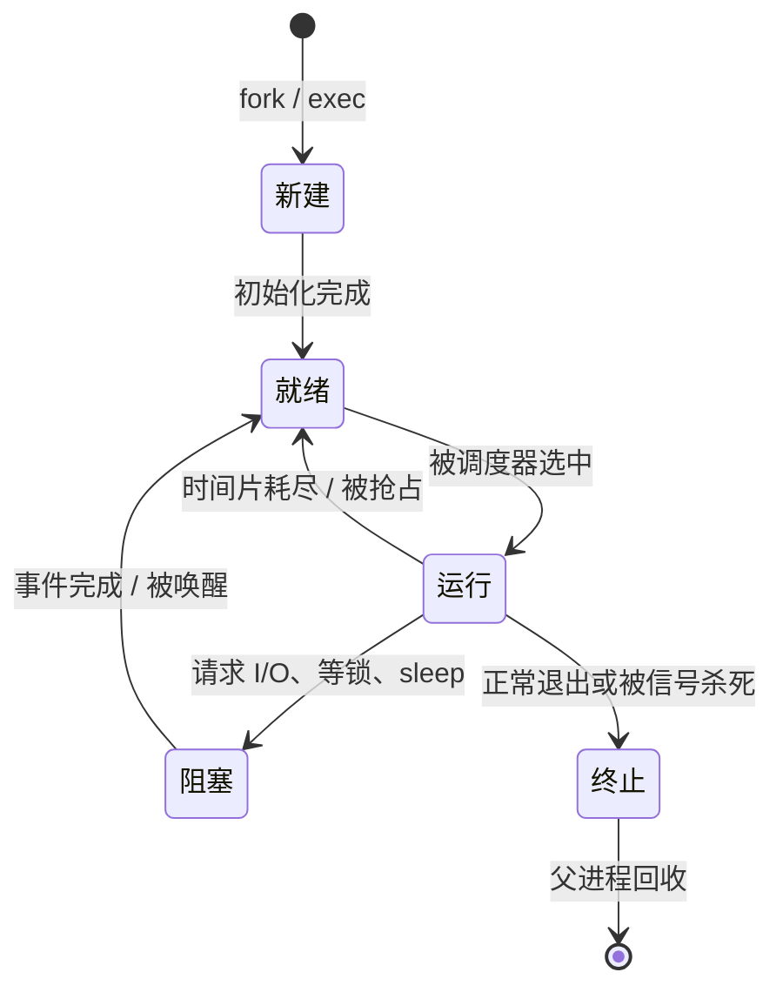
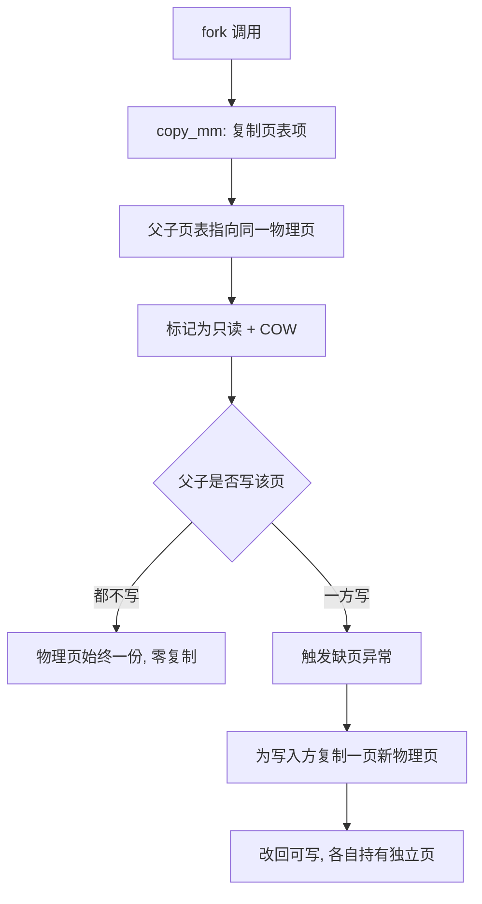
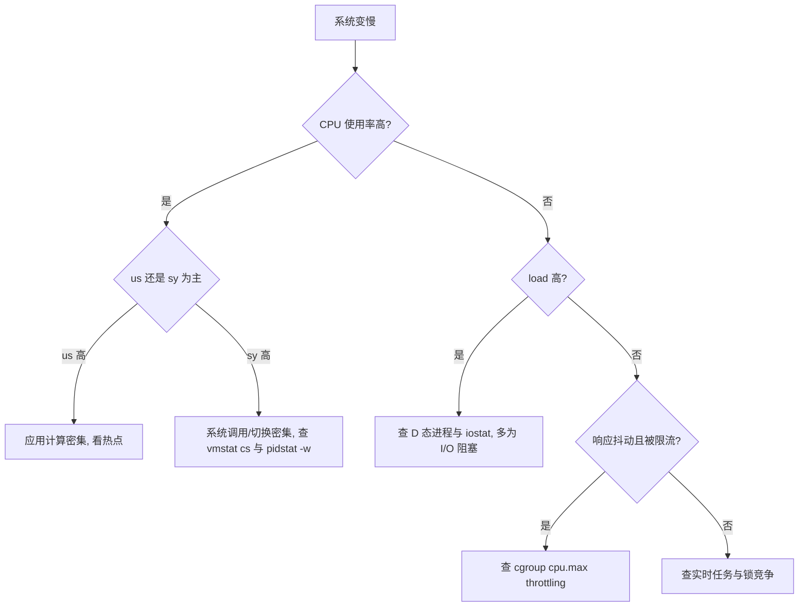

---
tags:
  - 基本功/系统
  - 基本功/操作系统
  - 基本功/进程与线程
---

# 进程、线程与调度

「进程」和「线程」这两个词在应用层几乎天天出现，但落到内核里它们究竟是什么、调度器凭什么挑中一个任务去跑 CPU，是另外一套问题。本篇只回答后者：进程与线程在内核里被表示成什么数据结构、它们之间共享和独占了哪些东西、一次上下文切换到底搬动了哪些状态、调度器在什么时刻被触发、又用什么规则从一堆就绪任务里选下一个。程序、进程、线程、协程的四层概念，线程的生命周期与状态机，同步原语，都已在各自 owner 里写透，本篇不重复：概念分层见 [[07-多线程与并发#程序、进程、线程、协程]]，虚拟地址与换页机制见 [[03-虚拟内存与页面置换]]。

本篇的默认值与行为以 Linux 6.x 主线为基准。内核参数取自 `Documentation/admin-guide/sysctl/` 与 `Documentation/scheduler/`，调度实现取自 `kernel/sched/`，进程与线程的数据结构与创建路径取自 `include/linux/sched.h` 与 `kernel/fork.c`，接口语义取自对应的 `man` 手册与 POSIX 标准。凡涉及具体数值的地方都给出出处；凭印象记的数字不作为依据。

## 1. 进程：程序与执行上下文

### 1.1 进程是什么

可执行文件是磁盘上一段静态字节，按照 ELF 格式组织，包含代码、已初始化和未初始化的数据、符号表、重定位信息。它本身不会做任何事。内核把这个文件里的代码和数据装载进一段受保护的虚拟地址空间，再配上 CPU 寄存器的初值、一张页表、一张打开文件描述符表，让 CPU 从入口地址开始取指执行——这个「静态程序加一份运行时状态」的组合就是**进程**（process）。内核里描述它的结构是 `task_struct`，定义在 `include/linux/sched.h`（来源：`include/linux/sched.h`）。

同一份可执行文件可以被执行多次，得到互不干扰的多个进程：它们有各自独立的地址空间和页表，一个进程写坏自己的内存不会波及另一个。这一点与「类是模板、实例是对象」的类比一致，但类比的边界要划清——两个进程之间没有隐式的共享内存，通信必须显式借助内核提供的机制（管道、消息队列、共享内存、套接字），这些机制见 [[07-多线程与并发#进程是什么|02-多线程与并发]]。

操作系统教材里的一句定式是「进程是资源分配的基本单位，线程是 CPU 调度的基本单位」。这句话在 Linux 上要加一层注释才能成立——Linux 内核对两者用同一个结构描述，真正的分界是「哪些资源被共享」而不是「谁是进程、谁是线程」，细节见 §5.3。

### 1.2 进程的地址空间布局

用户态进程看到的是一个从 0 到 `TASK_SIZE` 的连续虚拟地址空间，Linux x86-64 上用户空间占低半区（实际可用略小于 2⁴⁷ 字节），高半区留给内核，用户态代码无法访问。这段空间按用途被切成若干段，各段由 `mm_struct` 里的 VMA（`vm_area_struct`）链表或红黑树描述：

```text
   x86-64 用户态进程地址空间（示意，非等比例）

   高地址 ┌────────────────────────────┐
          │ 内核空间（用户不可访问）      │
   TASK_SIZE├──────────────────────────┤
          │ 栈 stack（向低地址增长）      │ ◀── 每个线程一个
          │        │                     │
          │        ▼                     │
          │        未映射空隙            │
          │        ▲                     │
          │        │                     │
          │ 内存映射段 mmap（向高地址增长）│ ◀── 共享库、文件映射、匿名映射
          ├────────────────────────────┤
          │ 堆 heap（向高地址增长）       │ ◀── brk / mmap
          ├────────────────────────────┤
          │ .bss（未初始化数据，全 0）    │
          │ .data（已初始化全局/静态）    │
          │ .text（代码，只读可执行）     │
   低地址 └────────────────────────────┘
```

逐段看：

- **正文段**（`.text`）：机器指令，映射为只读 + 可执行，多个运行同一程序的进程可以通过共享库或 `fork` 后的页共享来复用同一份物理页。
- **数据段**（`.data` 与 `.bss`）：已初始化的全局变量、静态变量放在 `.data`，未初始化的放在 `.bss`。`.bss` 在文件里不占空间，装载时整段清零，这也是「全局变量默认是 0」这条 C 语义的实现来源。
- **堆**（heap）：运行时动态分配区，`malloc` 小块内存时由 `brk`/`sbrk` 推动堆顶指针增长，大块或要求对齐时走 `mmap` 单独映射一段。
- **内存映射段**（mmap 区）：动态链接器把共享库映射到这里，文件映射、匿名大块分配、线程栈也落在这个区域。它和堆在同一段地址区间里相向生长，中间的空隙就是可用的虚拟地址。
- **栈**（stack）：函数调用帧、局部变量、返回地址。栈向低地址增长，主线程栈在进程启动时由内核设定，额外线程的栈由 `pthread_create` 通过 `mmap` 单独分配（默认 8 MB，可用 `attr` 调整）。
- **内核栈**：每个任务另有一块独立的内核栈（x86-64 上默认 16 KB，与 `THREAD_SIZE` 相关），任务进入内核态时用它，用户态代码看不到。

这里只铺布局，页表如何把这些虚拟地址翻译成物理地址、缺页时如何从磁盘换入一页，属于 [[03-虚拟内存与页面置换]] 的范围。要记住的接口是：**地址空间是「进程级」的，栈是「线程级」的**，这条差异在后面讲上下文切换开销时反复用到（§6.3）。

### 1.3 PCB 与进程的组织

内核描述进程的数据结构是**进程控制块**（Process Control Block，PCB），Linux 里就是 `task_struct`。它是一个相当庞大的结构体，按用途可以分成几组（来源：`include/linux/sched.h`）：

| 分组 | 典型字段 | 作用 |
| --- | --- | --- |
| 标识 | `pid`、`tgid`、`cred` | 进程号、线程组号、用户与权限凭据 |
| 状态与调度 | `__state`、`prio`、`static_prio`、`se`（`sched_entity`） | 当前状态、优先级、调度统计（含 `vruntime`） |
| 地址空间 | `mm`、`active_mm` | 用户态内存描述（线程共享同一个 `mm`） |
| 文件与命名空间 | `files`、`fs`、`nsproxy` | 打开文件表、工作目录与根目录、命名空间 |
| 信号 | `signal`、`sighand`、`blocked` | 信号处理器、信号掩码 |
| 关系 | `real_parent`、`children`、`sibling` | 父子兄弟链表，用于建立进程树 |
| 上下文 | `stack`、`thread`（`thread_struct`） | 内核栈指针、切换时保存的寄存器现场 |

「PCB 是进程存在的唯一标识」这句要落到实现上：内核在 `copy_process()` 里分配出 `task_struct` 之后，这个任务才算存在；进程退出后 `task_struct` 并不立即消失（僵尸态，§4.1），直到父进程回收才释放。

组织方式上，教材常写「把同状态的进程用链表串起来」——这是抽象模型。Linux 的实现更细（来源：`kernel/sched/core.c`、`kernel/sched/fair.c`）：

- **运行的候选**放在每个 CPU 各自的 `struct rq`（runqueue）里，CFS 就绪任务挂在其中的红黑树上，而不是一张全系统就绪链表；
- **按 PID 查找**走 `pid` 哈希表，不遍历链表；
- **等某个事件**的任务挂在 `wait_queue_head` 等待队列上，事件到达时由唤醒方从队列里取出。

这套组织方式的意义是：调度器的「挑下一个」操作复杂度是 O(log n) 而不是 O(n)，中断处理里按 PID 找任务也不退化——这是「宏内核把调度器做进内核」与「教科书抽象模型」之间最实际的一处差别。

## 2. 进程的状态与迁移

### 2.1 五态模型

一个进程从被创建到消亡，会在一组状态之间来回迁移。经典模型给出五个状态：

- **新建**（new）：正在创建，`task_struct` 已分配但尚未就绪；
- **就绪**（ready）：具备运行条件，只差一个 CPU；
- **运行**（running）：正占用 CPU 执行；
- **阻塞**（blocked，也叫等待 wait）：在等一个事件（I/O 完成、锁、信号），此时即便把 CPU 给它也无法推进；
- **终止**（exit）：已结束，等待被父进程回收。

五态之间的迁移条件：



就绪与运行可以合成一个「可运行」集合：它们都具备马上运行的条件，区别只在有没有拿到 CPU。Linux 正是这么做的——内核里只有一个 `TASK_RUNNING` 状态，就绪与运行由「是否正被某个 CPU 执行」隐含区分（来源：`include/linux/sched.h` 中 `TASK_RUNNING` 的注释）。

阻塞态还有一个容易被忽略的细节：如果内存紧张，内核会把阻塞进程的物理页换出到交换区，进程在逻辑上仍在等待事件，但物理内存已经不再占用它。为了把这种情形与普通阻塞区分开，模型里再加**挂起**（suspended）状态，并细分为「阻塞挂起」和「就绪挂起」，于是五态扩展成七态。挂起对应的是页的换入换出，属于 [[03-虚拟内存与页面置换]] 的机制；除了内存压力，`Ctrl+Z`（`SIGTSTP`）和 `sleep` 也会让进程进入非运行的暂停态。

### 2.2 状态迁移的触发条件

把每条边拆成可观测的触发点，才能把状态机和排查对上号：

- **新建 → 就绪**：`copy_process()` 完成 `task_struct` 初始化、地址空间和文件表就绪后，任务被 `wake_up_new_task()` 放进运行队列（来源：`kernel/fork.c`）。
- **就绪 → 运行**：调度器在 `pick_next_task()` 里选中它，`context_switch()` 完成现场切换（§6.1）。
- **运行 → 就绪**：两种来源。一是时钟中断发现当前任务的时间片用尽，置 `TIF_NEED_RESCHED`；二是出现了优先级更高的可运行任务，当前任务被抢占。
- **运行 → 阻塞**：任务主动调用会睡眠的接口（读一个暂无数据的套接字、`wait_event`、拿不到锁），把状态改成 `TASK_INTERRUPTIBLE` 或 `TASK_UNINTERRUPTIBLE`，挂到等待队列，然后调用 `schedule()` 让出 CPU（来源：`man 7 sched`）。
- **阻塞 → 就绪**：等待的事件到达，唤醒方调用 `wake_up_process()` 把它移回运行队列。此时状态回到 `TASK_RUNNING`，至于能不能立刻上 CPU，取决于优先级和调度类（§9.3）。
- **运行 → 终止**：调用 `exit()` 或被信号杀死，进入僵尸态等待回收。

Linux 把这套状态编码成 `ps`/`/proc` 里能看到的单字母，与教材五态并非一一对应：

| `ps` 状态 | 内核状态 | 含义 |
| --- | --- | --- |
| `R` | `TASK_RUNNING` | 可运行（就绪或正在跑） |
| `S` | `TASK_INTERRUPTIBLE` | 可中断睡眠，能被信号唤醒 |
| `D` | `TASK_UNINTERRUPTIBLE` | 不可中断睡眠，信号也叫不醒 |
| `T` | `TASK_STOPPED` | 被 `SIGSTOP`/`SIGTSTP` 暂停 |
| `Z` | `EXIT_ZOMBIE` | 僵尸，等待父进程回收 |
| `X` | `EXIT_DEAD` | 已彻底消亡（通常看不到） |

`S` 与 `D` 的差别是排查的关键：`D` 态进程连 `kill -9` 都不响应，因为它卡在一个不可被信号打断的内核路径里，多半是磁盘或网络 I/O（§11 的第一类故障）。`top` 里看到的 `%wa`（I/O 等待）和负载值里被算作「运行中」的 `D` 态进程，都源自这个状态。

## 3. 进程的创建与销毁

### 3.1 fork 与写时复制

创建进程的系统调用是 `fork()`（来源：`man 2 fork`）。它的接口语义有一个反直觉之处：调用一次、返回两次。父进程里的返回值是新子进程的 PID，子进程里的返回值是 0，出错时父进程得到 -1。程序区分自己处于哪个角色，靠的就是这个返回值。

如果 `fork` 老老实实把父进程的地址空间整份复制一遍，代价会随内存占用线性膨胀——一个几百 MB 的进程 fork 一次就要复制几百 MB，即便子进程紧接着 `exec` 换成另一个程序、原来那些页一页都用不上。Linux 用**写时复制**（Copy-On-Write，COW）避免这份浪费（来源：`kernel/fork.c`、`kernel/mm/memory.c`）：

1. `fork` 时 `copy_mm()` 复制父进程的页表项，但不复制物理页面。父子两份页表指向**同一批物理页**。
2. 内核把父子两边的这些页表项都改成**只读**，并在 VMA 上标 `VM_WRITE`，约定「谁先写谁触发缺页」。
3. 任一方执行写操作，MMU 因只读权限报缺页异常，内核的缺页处理识别出这是 COW 页，此时才真正复制一页，改回可写，让写方指向新页。
4. 只要双方都不写，这块物理内存自始至终只有一份。

整条路径可以画成：



除了页，`fork` 还要为子进程建立独立的 `task_struct`、`files`（复制文件描述符表，底层 `struct file` 用引用计数共享）、信号处理相关的结构，并把父进程的内核栈等现场复制一份。因此 fork 的开销主要是「复制页表 + 分配一批内核对象」，与进程实际占用的物理内存量无关，只与虚拟地址空间的映射数量（VMA 数与页表层级）相关。

有一个专门的变体 `vfork()`：子进程先运行并借用父进程的地址空间，父进程阻塞，直到子进程调用 `exec` 或退出。它省掉了复制页表这一步，代价是父子在这期间不能真正并发。现代 `fork` 在有了 COW 之后，绝大多数场景已经不必用 `vfork`（来源：`man 2 vfork` 的 NOTES）。

### 3.2 exec 与 wait 的语义

`fork` 只造出了一个父亲的副本，要让它运行别的程序还得靠 `exec`。`execve()` 系列用新的可执行文件替换当前进程的地址空间：读入 ELF、丢弃旧的 `mm` 并建立新的、重新设置栈与寄存器、把入口地址装入 PC。这套动作完成后 PID 不变，但代码、数据、堆栈、信号处理器全部换成新程序的（来源：`man 2 execve`）。

有两个容易踩的细节：

- `exec` 成功后再回到用户态的，是**新程序**，`execve` 之后的旧代码永远不会执行——所以它「不返回」是正常的，只有失败才返回 -1。
- 多线程进程调用 `exec` 后，除调用 `exec` 的那条线程外，其余线程在 `exec` 成功时全部消失（来源：`man 2 execve` 的 NOTES）。`exec` 换掉整个地址空间，其它线程没有容身之处。

创建的另一半是回收，由 `wait`/`waitpid` 完成。子进程退出后并不会立刻从内核里消失，父进程必须调用 `wait` 系列接口取走它的退出状态，内核才释放 `task_struct`（来源：`man 2 wait`）。接口要点：

- `waitpid(pid, &status, options)` 的 `pid` 可取具体 PID、-1（任意子进程）、0（同进程组）等；
- `status` 不是简单的退出码，需要 `WIFEXITED`/`WEXITSTATUS`、`WIFSIGNALED`/`WTERMSIG` 等宏解码；
- `options` 常用 `WNOHANG`（没有已退出的子进程就立即返回 0，不阻塞）、`WUNTRACED`（也报告被暂停的子进程）、`WCONTINUED`（也报告被 `SIGCONT` 恢复的子进程）。

阻塞式 `wait` 会让父进程停在那里，配合 `WNOHANG` 的轮询版本才是常写的形式，回收逻辑见 §4.2。

### 3.3 创建与销毁的开销

把创建拆开看，开销分布在几处，数量级不同：

| 动作 | 主要成本 | 量级 |
| --- | --- | --- |
| `fork` | 复制页表、分配 `task_struct`、共享/复制文件表 | 数十微秒起，随 VMA 数量增长 |
| `exec` | 解析 ELF、拆旧 `mm`、建新映射、可能触发磁盘 I/O | 通常数百微秒到毫秒级 |
| `pthread_create` | 分配线程栈（`mmap`）、`clone` 一个共享地址空间的任务 | 比 fork 低一个数量级 |
| 进程退出 | 释放 `mm`、关闭 fd、给父进程发 `SIGCHLD` | 微秒级，但父进程不回收则残留僵尸 |

要强调的边界是：`fork` 的开销不在「复制了多少内存」，而在「复制了多少页表项」。一个大内存进程 fork 很快，一个 VMA 碎片极多（大量 `mmap`/`munmap` 留下细碎区间）的进程 fork 反而慢。写服务用「预 fork 一批 worker」而不是「每个请求 fork 一次」的模式，正是为了把这份固定开销挪到启动阶段，运行时只做 `accept` + 处理。

在容器和高并发服务里还有更隐蔽的一层：`fork` 一个多线程进程时，子进程只保留调用 `fork` 的那条线程，其余线程在子进程中不存在，但它们持有的锁等状态不会跟着消失。若 `fork` 时正好有别的线程持有一把锁，子进程里没人会释放它——这是 `malloc` 之后 `fork` 的经典坑，也是 `posix_spawn`、`fork` 后立即 `exec` 这类模式被推崇的原因。Linux 为此提供了 `pthread_atfork` 注册 fork 前后的处理函数（来源：`man 3 pthread_atfork`）。

## 4. 僵尸进程与孤儿进程

### 4.1 僵尸进程与孤儿进程

子进程结束后，内核先释放它的大部分资源（地址空间、打开的文件、内存），但**保留 `task_struct`**，把状态置为 `EXIT_ZOMBIE`，里面留着退出码等信息，等父进程来 `wait` 取走。父进程一直没有调用 `wait`，内核就一直留着这块结构——这个「已死但尚未被回收」的进程就是**僵尸进程**（zombie）（来源：`man 2 wait`）。

它的危害有两个层面：

- **占用 PID**。僵尸仍占着一个 PID。系统可分配 PID 的上限是 `/proc/sys/kernel/pid_max`（默认 32768，x86-64 上可调到 4194304），僵尸堆积会先把这个名额耗尽，之后 `fork` 直接失败（`EAGAIN`）。
- **占用内核内存**。每个僵尸保留一个 `task_struct` 与内核栈，数量一大就是一笔可观的内核内存开销。

排查僵尸只需要一条命令：`ps -eo stat,ppid,pid,cmd | awk '$1 ~ /^Z/'`，或 `ps aux | grep ' Z'`。拿到 `PPID` 就能定位到「没回收孩子的那个父进程」。要强调的一点是：**僵尸无法被 `kill -9` 掉**——它已经死了，信号无处可投，唯一出路是让父进程回收，或者把父进程杀掉让僵尸被 `init` 接手回收。

另一个方向是父进程先死，这就是**孤儿进程**（orphan）的来历。父进程退出时，它的子进程会成为孤儿。内核不允许一个进程没有父进程，于是把孤儿子进程重新挂到一个「收养者」名下（来源：`kernel/exit.c`）：

- 传统上收养者是 PID 1，即 `init` 或 `systemd`。PID 1 会周期性地对各孤儿子进程调用 `wait`，所以孤儿不会变成僵尸。
- Linux 3.4 起，进程可以通过 `prctl(PR_SET_CHILD_SUBREAPER, 1)` 把自己声明为**次级收养者**（subreaper）。此后它后代的孤儿会先挂到它名下，而不是一步到 PID 1。systemd 的用户会话、容器运行时（如 `runc`）就靠这个机制做局部收编。

把僵尸与孤儿放在一起看：僵尸是「父在、子死而未被回收」，孤儿是「父死、子被转交」。孤儿本身通常无害（会被收养），僵尸才需要处理。

### 4.2 SIGCHLD 与 waitpid 的处理

普通做法是在父进程里注册 `SIGCHLD` 处理函数，子进程退出时内核给父进程发这个信号，父进程在回调里回收。这里有几个反复踩到的坑：

- **信号会被合并**。标准信号不排队，如果三个子进程几乎同时退出，父进程可能只收到一个 `SIGCHLD`。所以回调里不能只 `wait` 一次，要循环 `waitpid(-1, &status, WNOHANG)` 直到返回 0（表示暂无更多已退出的子进程）或 -1（表示没有子进程了）。
- **异步信号安全的函数有限**。处理函数运行在信号上下文里，`printf`、`malloc` 这类非 async-signal-safe 的函数不能调用（来源：`man 7 signal-safety`）。常见做法是只设一个标志位，在主循环里回收。
- **可以彻底不处理**。如果显式把 `SIGCHLD` 设为 `SIG_IGN`，或注册时带上 `SA_NOCLDWAIT`，内核会在子进程退出时自动回收，不产生僵尸。注意区分「默认动作」与「显式忽略」：`SIGCHLD` 的默认动作本来就是丢弃，但丢弃不等于自动回收，只有显式 `SIG_IGN` 或 `SA_NOCLDWAIT` 才触发自动回收语义（来源：`man 2 sigaction`、`man 7 signal`）。

一段可靠的回收循环形如：

```c
while (1) {
    pid_t pid = waitpid(-1, &status, WNOHANG);
    if (pid > 0)      { /* 回收了一个子进程，处理 status */ }
    else if (pid == 0) { break; }   /* 还有子进程在跑，但没有已退出的 */
    else               { break; }   /* 没有子进程了（ECHILD） */
}
```

## 5. 线程：共享地址空间的执行流

### 5.1 线程是什么：共享与独享

**线程**（thread）是进程内的一条执行流。一个进程可以有多条线程，它们共享同一个地址空间，因此彼此之间传递数据只要读写同一块内存，不需要经过内核的 IPC 路径。代价是它们也共享了「地址空间被写坏」这件事——一条线程空指针解引用，整个进程一起崩。

共享与独享的边界是理解线程的钥匙：

```text
   进程与线程：共享与独享

   ┌──────────────────────── 进程（共享部分）────────────────────────┐
   │  地址空间：.text / .data / .bss / 堆 / mmap 区                    │
   │  打开文件描述符表（fd table）     当前工作目录、根目录             │
   │  信号处理器（sighand）            用户与权限凭据（uid/gid）        │
   │  进程号 PID（线程组号 TGID）                                      │
   ├──────────┬──────────┬──────────┬──────────────────────────────┤
   │ 线程 A   │ 线程 B   │ 线程 C   │  每条线程「独享」：            │
   │ 栈       │ 栈       │ 栈       │  · 用户栈（及内核栈）          │
   │ 寄存器   │ 寄存器   │ 寄存器   │  · 寄存器现场（PC/SP 等）      │
   │ TLS      │ TLS      │ TLS      │  · 线程私有数据 TLS、errno     │
   │ 信号掩码 │ 信号掩码 │ 信号掩码 │  · 信号掩码、线程 ID（TID）     │
   └──────────┴──────────┴──────────┴──────────────────────────────┘
```

对照表更精确地列出差异：

| 资源 | 进程内共享 | 每条线程独享 |
| --- | --- | --- |
| 代码段、数据段、堆 | 是 | — |
| 打开文件描述符表 | 是 | — |
| 当前目录、用户凭据 | 是 | — |
| 信号处理函数 | 是 | — |
| 用户栈 | — | 是 |
| 内核栈 | — | 是 |
| 寄存器（PC、SP 等） | — | 是 |
| 线程私有数据（TLS）、`errno` | — | 是 |
| 信号掩码 | — | 是 |

共享地址空间与文件描述符、独享栈与寄存器，这两句话把线程的并发粒度、切换开销和失败模式都定了下来。线程私有数据、可重入、阻塞等概念见 [[07-多线程与并发#线程相关概念|02-多线程与并发]]。

### 5.2 为什么需要线程

多进程也能并发，为什么还要线程？把动机拆成三条更清楚：

- **并发粒度更细、共享更便宜**。多进程要共享数据得走共享内存或消息传递，跨进程通信涉及内核参与和数据拷贝；多线程读写同一进程的堆直接就是一次内存访问。一个进程内的多个任务（读数据、解压、播放）天然要共享同一批缓冲，用线程省掉了搬运。
- **创建与切换开销更低**。`pthread_create` 不必复制页表、不必复制文件表，只需分配一块线程栈并 `clone` 出一个共享地址空间的任务；同进程内线程切换不必换页表。进程创建与销毁的开销见 §3.3，切换开销见 §6.2。
- **充分利用多核**。多进程同样能利用多核，但线程在共享内存上的数据局部性更好，跨核协作的通信成本更低。

线程的代价同样明确：一条线程崩溃导致整个进程崩溃，共享数据需要同步原语保护，并发缺陷（数据竞争、死锁、伪共享）的调试成本远高于单线程——这些属于 [[07-多线程与并发]] 的主题。

### 5.3 实现模型与 Linux 的真实关系

实现模型上，线程库与内核的对应关系分「多对一」「一对一」「多对多」三种，各自的取舍（用户态切换快但阻塞会拖垮整个进程、内核级可并行但系统调用开销大）已在 [[07-多线程与并发]] 里写清，这里只给一句概览：用户级线程切换快、但一条阻塞全员阻塞；内核级线程可并行、但每个操作都要陷入内核；多对多折中两者。现代 Linux 上用的一对一模型（`NPTL`，每个用户线程对应一个内核调度实体）。

真正值得单独写的是 **Linux 不区分进程与线程**这件事。内核对两者用的是同一个 `task_struct`，「进程」与「线程」只是共享程度不同的一组任务。决定共享哪些资源的，是创建时传给 `clone()` 的一组标志位（来源：`man 2 clone`）：

| 标志位 | 共享什么 | 不设时 |
| --- | --- | --- |
| `CLONE_VM` | 地址空间（`mm`） | 复制一份页表 |
| `CLONE_FILES` | 打开文件描述符表 | 复制 fd 表 |
| `CLONE_FS` | 当前目录、根目录、`umask` | 各持一份 |
| `CLONE_SIGHAND` | 信号处理函数表 | 各持一份 |
| `CLONE_THREAD` | 放进同一个**线程组**，共享 TGID | 成为独立进程 |
| `CLONE_PARENT` | 新任务的父进程是调用者的父进程 | 父进程是调用者 |

`pthread_create` 在 Linux 上最终就是带上了 `CLONE_VM | CLONE_FS | CLONE_FILES | CLONE_SIGHAND | CLONE_THREAD` 等标志调用 `clone`。带 `CLONE_THREAD` 创建出来的任务互为**线程组**成员，它们有各自不同的 `pid`（即 TID），但共享同一个 `tgid`（来源：`man 2 gettid`）。`ps` 默认按 `tgid` 显示，要看到线程得加 `-L`；`/proc/<tgid>/task/<tid>/` 才是单个线程的目录。

这也解释了「进程是资源分配单位、线程是调度单位」这句话在 Linux 上的准确含义：内核的调度器只看 `task_struct`，它调度的永远是「一条执行流」；而资源是以 `mm`、`files` 这类结构为边界被共享或隔离的，边界由 `clone` 的标志位画出来。线程组只是一个给用户态看的聚合计费单位。这段关系在 [[07-多线程与并发#进程和线程的关系|02-多线程与并发]] 里从 Linus 的表述切入讲过，这里补的是它在实现上的落点。

## 6. 上下文切换

### 6.1 切换时保存与恢复什么

调度器选出下一个任务后，真正搬家的工作由 `context_switch()` 完成（来源：`kernel/sched/core.c`）。它做两件事：切地址空间和切执行现场。

**执行现场**指的是一组 CPU 寄存器：

- 通用寄存器：函数调用约定里的被调用者保存寄存器（x86-64 上是 `rbx`、`rbp`、`r12`–`r15`），任务在内核里用到的临时状态；
- 程序计数器（PC/`rip`）与栈指针（SP/`rsp`）：决定下一条指令从哪取、栈帧在哪；
- 标志寄存器（`rflags`）：条件码、中断允许位等；
- 浮点与 SIMD 寄存器：`xmm`/`ymm`/`zmm` 一组，视内核配置可能懒保存。

这里有个常见误解：**「上下文保存在 PCB 里」说得太笼统**。实际实现里，寄存器现场是被压到该任务的内核栈上的，`task_struct` 只有一个 `thread` 字段（`struct thread_struct`）记录内核栈指针等少数几项。切换时 `switch_to` 把当前任务的寄存器压栈、把栈指针存进 `task_struct->thread.sp`，再载入下一个任务的 `thread.sp` 并从它的内核栈恢复寄存器（来源：`arch/x86/include/asm/switch_to.h`）。所以「从 PCB 恢复上下文」的抽象在 Linux 上要落到「从内核栈恢复」。

**地址空间**指的是页表基址寄存器（x86-64 上是 `CR3`）。切换任务时若目标任务使用不同的 `mm`，内核要把新页表基址写进 `CR3`——这一步由 `switch_mm()` / `switch_mm_irqs_off()` 完成，是进程切换与线程切换开销差异的根源。

还有两类状态不在通用寄存器的账上，却同样随任务走：

- **浮点与 SIMD 状态**。`xmm`/`ymm` 一组寄存器在用到时按需保存（内核用 `TIF_NEED_FPU_LOAD` 一类标志做懒保存），任务没碰过浮点就不必为它付出保存/恢复成本。这条优化让大量纯整数任务免于为一条 `double` 运算长期付费。
- **当前的栈归属**。任务从用户态进入内核时，CPU 要切换到该任务的内核栈；x86-64 上这一步还涉及 `swapgs` 把 GS 基址在用户值与该 CPU 的内核 per-CPU 值之间切换（来源：`arch/x86/entry/entry_64.S`）。所以「切上下文」除了换寄存器，还包含「换当前栈」这一层，中断上下文里没做完的活不能随便切换到别的任务，原因就在这里。

页表切换这一侧还有两处工程优化值得记：

- **PCID**（Process Context Identifier）允许 TLB 项打上地址空间的标签，写 `CR3` 时保留其他进程的 TLB 项，只失效目标任务的。它把进程切换的 TLB 刷新从「全清」变成「按标签区分」。
- **KPTI**（Kernel Page Table Isolation，Meltdown 缓解）把内核页表与用户页表拆成两套，进出内核要在两套页表间切换，等于每次系统调用与中断都多写一次 `CR3`；这是 KPTI 引入额外开销的机制来源，也是「关掉 KPTI 能快一点」这类做法的代价所在。

```text
   一次上下文切换：保存与恢复的内容

   任务 A（当前）                              任务 B（下一个）
   ┌──────────────────────┐                 ┌──────────────────────┐
   │ 通用寄存器 rbx/rbp/… │ ── 压栈保存 ──▶ │  内核栈 B            │
   │ rip / rsp / rflags   │                 │  （载入后弹出恢复）  │
   │ xmm/ymm 浮点状态     │                 │                      │
   └──────────┬───────────┘                 └──────────┬───────────┘
              │ task_struct->thread.sp 记录栈顶         │
              ▼                                        ▼
   ┌──────────────────────┐  切换 CR3（换 mm 时）  ┌──────────────────┐
   │ task_struct A        │ ────────────────────▶ │ task_struct B    │
   │  thread.sp = …       │                       │  thread.sp = …   │
   │  mm = mm_A           │                       │  mm = mm_B       │
   └──────────────────────┘                       └──────────────────┘
```

### 6.2 进程切换、线程切换与中断切换

「任务」包含进程、线程和中断三类，它们的切换代价并不相同（来源：`kernel/sched/core.c`、`man 7 sched`）：

| 切换类型 | 换页表（CR3） | 保存/恢复 | 典型触发 | 相对开销 |
| --- | --- | --- | --- | --- |
| 同进程线程切换 | 否（共享 `mm`） | 寄存器、栈、可能含 FPU | 时间片、锁等待 | 低 |
| 进程切换 | 是 | 寄存器、栈，且地址空间整体更换 | 调度到另一进程 | 高 |
| 中断切换 | 否 | 进入/退出中断上下文，切内核栈 | 硬件中断到达 | 低（非抢占返回时不调度） |

- **进程切换**的额外成本来自两处：写 `CR3` 会打断地址翻译的局部性（TLB 里缓存的都是旧进程的映射，新进程的翻译要重新填 TLB）；内核还要分别处理用户的 `mm` 与内核的 `active_mm`（内核线程没有自己的 `mm`，会「借用」上一个任务的 `active_mm`）。
- **同进程线程切换**共享 `mm`，`CR3` 不动，TLB 里的映射仍然有效，只需换栈和寄存器。这就是「线程切换比进程切换快」的机制来源。
- **中断上下文**没有「进程」可言，它借当前任务的内核栈（或独立的 IRQ 栈）运行，不进用户态栈。中断返回时才检查 `TIF_NEED_RESCHED`，决定是否借机调度——这是抢占式内核里「抢占发生在中断返回路径上」的原因。

### 6.3 直接开销与间接开销

评估上下文切换的成本要分两层，而真正拖慢系统的是第二层。

**直接开销**是切换动作本身：保存恢复寄存器、执行调度器代码、更新统计、写 `CR3` 刷新 TLB。这部分通常在**几微秒**量级。数量级可以参考：一次系统调用在现代硬件上约几百纳秒到一微秒，一次上下文切换量级与之相当甚至更高；`vmstat` 里的 `cs` 计数乘上这个单价，就能估算切换本身吃掉了多少 CPU。

**间接开销**是切换后新任务的性能被拖慢：

- **Cache 被污染**。新任务的工作集与旧任务不同，L1/L2/L3 里缓存的都是旧任务的数据和指令，新任务初期大量 cache miss，需要一段时间才能重新「热」起来。
- **TLB 被污染**。进程切换换了页表后 TLB 里的旧映射失效（除非用 PCID 打标签保留），新任务的地址翻译要重新走多级页表，每次查表本身又是一次内存访问。
- **分支预测器、流水线状态被打乱**。深流水线处理器上的分支历史、预取器状态都按上一个任务训练，切换后短期预测准确率下降。

间接开销的大小取决于两个任务的工作集重合度：来回切换两个相邻的线程，cache 命中率下降有限；在几十个进程之间高频轮转，cache 与 TLB 基本一直处于冷态，这是「上下文切换风暴」真正的代价（§11）。降低这部分开销的手段包括：绑定 CPU（`taskset`/`sched_setaffinity`）提高局部性、用 PCID/ASID 减少 TLB 刷新、控制线程数让每个 CPU 上的可运行任务别太多。

### 6.4 观测切换

三个观测入口，用途不同：

- **`vmstat 1` 的 `cs` 列**：每秒上下文切换次数。它是全局计数，只告诉你系统整体切换频率，不能定位到具体进程。同一行里的 `r`（可运行任务数）与 `b`（阻塞任务数）要与它一起看。
- **`pidstat -w 1` 的两列**：`cswch/s` 与 `nvcswch/s`，分别对应「自愿切换」与「非自愿切换」，且是按进程统计的（来源：`man 1 pidstat`）。
- **`/proc/<pid>/status`**：`voluntary_ctxt_switches` 与 `nonvoluntary_ctxt_switches` 是这两个计数的累计值（来源：`man 5 proc`）。

判读规则：

| 现象 | 含义 | 下一步 |
| --- | --- | --- |
| `cswch/s` 高、`nvcswch/s` 低 | 任务频繁主动让出，多在等 I/O 或锁 | 查 I/O（`iostat`）或锁竞争 |
| `nvcswch/s` 高 | 时间片被耗尽、被抢占，CPU 竞争激烈 | 查可运行任务数 `r`、是否线程过多 |
| `vmstat` `cs` 异常高 | 系统级切换风暴 | 用 `pidstat -w` 找元凶 |

自愿切换多不是坏事——任务等 I/O 时让出 CPU 正是调度器希望的行为。非自愿切换多才是信号：说明有任务想跑但 CPU 不够分，时间片一到就被换下。

## 7. 调度：时机与目标

### 7.1 调度时机与抢占式调度

调度器在什么时候被触发？一份来自 Linux 的清单（来源：`Documentation/scheduler/`）：

- 当前任务**阻塞**：主动睡眠等待事件，必须换人；
- 当前任务**的时间片用尽**：时钟中断发现预算耗尽，置 `TIF_NEED_RESCHED`；
- 当前任务**结束**或调用 `sched_yield()` 主动让出；
- **更高优先级的任务被唤醒**：新任务进入运行队列，若优先级更高则可能抢占；
- **创建了新任务**：`wake_up_new_task()` 把新任务放进运行队列；
- **从中断或系统调用返回用户态**：这是内核检查 `TIF_NEED_RESCHED` 并真正执行切换的点。

关键机制是 `TIF_NEED_RESCHED` 标志。中断处理只负责**置位**，真正的调度发生在「安全点」（`preempt_schedule()` 或从系统调用/中断返回用户态时）。把「想换人」和「真的换人」分开，是为了避免在内核持有锁、栈状态不完整时切换，那会造成死锁或数据损坏。

**抢占式与非抢占式**的区别就在时钟中断是否能让运行中的任务下台：

- **非抢占式**：任务一旦跑起来，除非它主动阻塞或退出，否则不会被换下。时钟中断不导致调度，只更新统计与时间。
- **抢占式**：时间片用尽或出现更高优先级任务时，当前任务被强制换下。这需要在时间片末端产生时钟中断，把控制权交还调度器。

在 Linux 上，用户态永远是抢占的（时钟中断能打断用户态代码）；真正有配置差异的是**内核态是否可抢占**，由编译选项决定（来源：`Documentation/scheduler/`）：

| 配置 | 内核态抢占点 | 特点 |
| --- | --- | --- |
| `PREEMPT_NONE` | 仅在明确的显式检查点 | 吞吐优先，适合服务器批处理 |
| `PREEMPT_VOLUNTARY` | 内核代码里插入的显式让出点 | 折中 |
| `PREEMPT` | 内核中几乎任意非原子点 | 低延迟，交互与桌面 |
| `PREEMPT_RT` | 中断线程化、锁可睡眠 | 硬实时 |

这几个选项的本质是同一笔账：抢占点越密，响应延迟越低，但上下文切换次数与锁路径的复杂度上去了，吞吐会下滑。

### 7.2 调度器要平衡的目标

调度器要在三个互相拉扯的目标之间取舍：

- **吞吐**：单位时间完成的任务数。批处理、计算密集型场景优先它。
- **响应**：从任务就绪到第一次得到 CPU 的延迟。交互式场景优先它。
- **公平**：就绪任务之间不被长期饿死。

三者的冲突是结构性的：照顾交互任务就要勤切换、缩短时间片，代价是切换开销上升、吞吐下降；照顾批处理就要拉长时间片、减少切换，代价是交互任务要等更久。现实中不存在同时最优的调度器，只有面向某类负载的折中。

要判断一个调度器偏向谁，看它度量什么：

| 指标 | 定义 | 偏向 |
| --- | --- | --- |
| 周转时间 | 从提交到完成的总时间（等待 + 运行） | 批处理 |
| 等待时间 | 在就绪队列里干等的时间 | 公平 |
| 响应时间 | 从提交到第一次得到响应 | 交互 |

注意「等待时间」这里指的是**就绪队列里的等待**，与进程处于阻塞态等 I/O 的时间是两回事。调度算法能影响的只有前者，改变不了任务本身需要的 CPU 时间和 I/O 时间。

## 8. 经典调度算法

### 8.1 先来先服务与最短作业优先

**FCFS（先来先服务）**：最朴素的策略，谁先进就绪队列谁先跑，一直跑到它阻塞或结束才轮到下一个，属于非抢占式。实现上就是一个 FIFO 队列。

**优点**：公平、无饥饿、实现极简。

**缺点**是**护航效应**（convoy effect）：一个长任务排在前面，后面所有短任务都得等它跑完。设三个任务依次到达，运行时间分别是 100、1、1，FCFS 下短任务的平均等待时间是 (0 + 100 + 101)/3 ≈ 67；若让短任务先跑，平均等待时间降到 (0 + 1 + 2)/3 = 1。数量级差了两个档。

**FCFS 会饿死谁**：不饿死任何任务，但会严重拖慢排在长任务后的短任务与交互任务。它适合 CPU 繁忙、任务长度相近的批处理系统，不适合 I/O 繁忙或交互场景——这也是为什么交互式系统普遍采用抢占式策略。

**SJF（最短作业优先）**：每次挑运行时间最短的任务。可以做成非抢占式（等当前跑完再挑）或抢占式（新来的任务更短就抢占，这种叫最短剩余时间优先 SRTF）。

**优点**：在给定任务集合下，SJF 能**最小化平均等待时间**，这是可以被证明的最优性（前提是每个任务的服务时间已知）。

**缺点**是那个前提本身：现实中没人事先知道一个任务要跑多久，只能用历史行为预测（如指数平均），预测错了就退化成普通策略。

**SJF 会饿死谁**：长任务。只要短任务源源不断到来，长任务就会被无限期推迟。经典的例子是「一个长作业在队列里等，而队列里短作业不断，长作业永远排不上」。

### 8.2 时间片轮转（RR）

**思路**：给每个任务一个固定时间片（quantum），跑到时间片耗尽就放回队尾，让下一个上。它是抢占式的，抢占的触发点是每个时间片末端的**时钟中断** —— 计时器发出中断请求，调度程序据此停下当前进程、把它送往就绪队列末尾，再把 CPU 交给新的队首。

**时间片的长度是这套算法唯一的调参**，它同时决定两件事，而这两件事方向相反：

- **过短**：任务切换频繁。每次切换都要保存与装入寄存器值、切换内存映像（换页表则 TLB 失效）、更新各种表格与队列（§6.1），这些开销不产出任何计算，CPU 效率随之下降。
- **过长**：切换次数少了，但排在队尾的任务要等更久，响应变慢，交互体验受损 —— 时间片长到极端就退化成 FCFS。

时间片的量级通常在**几毫秒到几百毫秒**之间。用户之所以感觉不到「CPU 其实在一刻不停地切任务」，是因为 10 毫秒这个量级远低于人的感知阈值：把一秒切成 100 个 10 毫秒的时间片轮转，用户在宏观上看到的就是「多个程序在同时运行」。

**时间片取值由三个因素决定**：系统对响应时间的要求、就绪队列中的进程数目、系统的处理能力。早期 RR 按它们算固定值，现代内核改为按任务类型与系统负载动态调整 —— 交互式任务（浏览器、编辑器）给较短的时间片以保证响应，计算密集型任务（视频渲染）给较长的时间片以减少切换开销。

单独用 RR 有一个明确短板：它假设所有任务同等重要，对交互任务与后台批处理一视同仁，无法体现优先级。**RR 是公平性的基准线，也是多级反馈队列（§8.3）的构件。**

### 8.3 优先级调度与多级反馈队列（MLFQ）

**优先级调度**：给每个任务一个优先级，每次挑优先级最高的运行。优先级可以静态（创建时定死）或动态（随运行/等待时间调整）；实现可以非抢占或抢占。

**优点**：能把 CPU 明确倾斜给关键任务——实时控制、系统守护进程、需要优先响应的请求。

**缺点**与**会饿死谁**直接绑定：只要有更高优先级的任务不断到来，低优先级任务会**永久饥饿**。标准解法是**老化**（aging）：让等待中的任务优先级随时间上升，或让运行的降级，保证任何任务等待足够久后都能拿到 CPU。动态优先级就是老化的一种实现——运行越久优先级越低（惩罚 CPU 密集），等待越久优先级越高（补偿饥饿）。

Linux 的 `nice` 值（§9.2）是静态优先级的用户接口，CFS 则用 `vruntime` 代替了裸优先级比较，用「谁欠得久谁先上」的方式天然避开饥饿。

**多级反馈队列（MLFQ）**是 RR 与优先级调度的结合。它设多个就绪队列，队列之间优先级从高到低，**优先级越高的队列时间片越短**；新任务进最高优先级队列，用光时间片还没结束就降到下一级（时间片也随之变长）；只有高优先级队列空了才调度低优先级队列；运行时若更高优先级队列来了新任务，立即抢占。

```text
   多级反馈队列（MLFQ）结构

   优先级 高 ┌──────────────────────────┐  时间片 8ms
            │ Q0: 新任务 / 交互任务      │ ◀── 用光即降级
            ├──────────────────────────┤
            │ Q1: 时间片 16ms           │
            ├──────────────────────────┤
            │ Q2: 时间片 32ms           │
            ├──────────────────────────┤  时间片 更长
   优先级 低 │ Q3: 批处理长任务          │
            └──────────────────────────┘
                  ▲                    │
                  └── 定期提升（防饥饿）┘
```

它的两条设计意图：

- **用完即降级**：短任务（交互式、I/O 型）在最高队列里很快跑完，得到低延迟；长任务（CPU 型）被降到低队列，用较长的时间片一次跑完，减少切换。这等价于「用行为自动推断任务类型」，不需要事先知道运行时间——补上了 SJF 的前提缺口。
- **定期提升**：低队列任务等太久会被拉回高优先级队列，避免长任务被新来的短任务持续插队而饿死。

**会饿死谁**：裸的多级队列会让长任务饥饿，加上定期提升后饥饿被基本消除。MLFQ 的复杂度在参数上——队列数量、每级时间片、降级与提升周期都需要调，参数配错时行为会退化（时间片过长退化成 FCFS，提升周期过长则接近纯优先级）。

MLFQ 的思想在现代内核里留下痕迹，但 Linux 的 CFS 选择了另一条路：不划分固定队列，用一个连续变化的 `vruntime` 来完成「谁被亏待了谁先上」的判断。下面一节看它的实现。

### 8.4 高响应比优先（HRRN）

**HRRN（Highest Response Ratio Next）**用一个连续变化的「响应比」代替静态优先级，是动态优先级的经典实现：

$$响应比 = \frac{等待时间 + 服务时间}{服务时间} = 1 + \frac{等待时间}{服务时间}$$

每次调度时算一遍所有就绪任务的响应比，挑最高的那个。这个式子同时体现了两种倾向：

- **等待时间相同时**，服务时间越短响应比越高 —— 趋向短作业优先；
- **服务时间相同时**，等待时间越长响应比越高 —— 趋向先来先服务。

**算例**。三个任务：A 到达 0、服务 3；B 到达 1、服务 6；C 到达 2、服务 4。

| 时刻 | 事件 | 计算 | 选择 |
| --- | --- | --- | --- |
| 0 | 只有 A 到达 | —— | A 运行 |
| 3 | A 完成 | B 已等 2，响应比 1 + 2/6 ≈ 1.33；C 已等 1，响应比 1 + 1/4 = 1.25 | **B** |
| 9 | B 完成 | 只剩 C | C 运行 |
| 13 | C 完成 | —— | —— |

**它的价值在于不会饿死长任务**：长作业的响应比随等待时间线性上升，终将超过源源不断到来的短作业 —— 这正是它相对 SJF 的关键改进。代价是每次调度都要重算一遍比值，且服务时间仍需已知或可估，因此多用于批处理系统。

## 9. Linux 的 CFS 与实时调度

### 9.1 CFS：vruntime、红黑树与调度周期

Linux 从 2.6.23 起的默认调度类是**完全公平调度器**（Completely Fair Scheduler，CFS）。它的核心量是**虚拟运行时间**（`vruntime`）（来源：`kernel/sched/fair.c`、`Documentation/scheduler/sched-design-CFS.rst`）。

每个任务维护一个 `vruntime`，含义是「按权重折算后的累计运行时间」。任务实际跑了 `delta_exec` 时间，它的 `vruntime` 增加量是：

```text
                    NICE_0_LOAD
  vruntime += delta_exec × ─────────────      其中 NICE_0_LOAD = 1024
                      weight(task)
```

`weight` 是由 nice 值查表得到的权重（§9.2）。这条式子把「优先级」翻译成了「时间流逝速度」：

- 高优先级（nice 小）→ `weight` 大 → 同样的 `delta_exec` 让 `vruntime` 涨得慢 → 它会被更频繁地选中，累计得到更多 CPU。
- 低优先级（nice 大）→ `weight` 小 → `vruntime` 涨得快 → 它更快逼近其他任务，被选中的机会变少。

调度器每次挑**`vruntime` 最小**的任务。直觉上，`vruntime` 最小者就是「目前为止最被亏待」的那个，先补它。这套设计让「公平」变成了一个可以连续度量、随时比较的量，而不像 MLFQ 那样依赖固定的队列层级与时间片。nice 0 与 nice -5 的任务相比，前者 `vruntime` 涨速是后者的约 3 倍（`weight` 之比 3121/1024 ≈ 3.05），因此后者得到的 CPU 份额约是前者的 3 倍。

**红黑树与下一个任务的选择**。CFS 把每个 CPU 上所有可运行任务按 `vruntime` 组织成一棵**红黑树**（来源：`kernel/sched/fair.c`），树根挂在 `cfs_rq` 的 `tasks_timeline` 字段（类型 `rb_root_cached`）上：

```text
   CFS 运行队列：按 vruntime 排序的红黑树

                 ┌──────────────┐
                 │  v=1200      │  ◀── 根
                 └──┬────────┬──┘
            ┌───────┘        └───────┐
        ┌───┴────┐             ┌─────┴────┐
        │ v=900  │             │ v=1500   │
        └┬─────┬─┘             └──┬─────┬─┘
     ┌───┘     └───┐          ┌───┘     └───┐
  ┌──┴───┐   ┌────┴──┐    ┌───┴──┐    ┌─────┴─┐
  │v=700 │   │v=1000 │    │v=1400│    │ v=1800│
  └──────┘   └───────┘    └──────┘    └───────┘
      ▲
      └── rb_leftmost：vruntime 最小者，O(1) 取到
```

选择过程是取树的最左节点：任务运行完一轮重新入队时 `vruntime` 变大，会被 `enqueue_entity()` 插到树的右侧；需要调度时 `pick_next_task_fair()` 取最左节点。红黑树的操作是 O(log n)，同时内核用 `rb_leftmost` 缓存最左节点，**取最小值这一步是 O(1)**（来源：`kernel/sched/fair.c`）。

为什么用红黑树而不是堆或链表？因为 CFS 需要频繁的「按 `vruntime` 插入」和「取最小」，还要能在任务睡眠/唤醒时删除和重新插入。红黑树三种操作都是 O(log n) 且最坏情况有保证，链表插入 O(1) 但取最小 O(n)，堆取最小 O(1) 但按任意键删除昂贵。红黑树的平衡正好匹配「频繁增删 + 取最小」这个访问模式。

**调度周期与最小时间片**。CFS 的时间片没有写死的固定值，它由两个 sysctl 参数算出（来源：`kernel/sched/fair.c`、`Documentation/admin-guide/sysctl/kernel.rst`）：

- **`sched_latency_ns`**：目标**调度周期**，默认 6 ms（6000000 ns）。它规定「每个可运行任务至少要被调度到一次」的时间窗口——在一个周期内，所有就绪任务轮流各跑一段。
- **`sched_min_granularity_ns`**：单个任务在一次调度里的**最小时间片**，默认 0.75 ms（750000 ns）。它防止任务数太多时每个任务分到的时间片小到切换开销都不够本。

实际周期由任务数决定：

```text
  若 nr_running ≤ # (sched_latency / min_granularity ≈ 8，即 sched_nr_latency)
      period = sched_latency_ns              （默认 6 ms）
  否则
      period = nr_running × sched_min_granularity_ns

  每个任务的时间片 ≈ period / nr_running
```

两个极端情况要记住：

- 可运行任务**少**时，周期锁定在 6 ms，每个任务分到的片较大，切换次数少。
- 可运行任务**多**时（超过 `sched_nr_latency`，约 8 个），周期随任务数线性增长，每个任务仍能拿到至少 `min_granularity`（0.75 ms）。这也是为什么系统负载很高时，单个任务的响应延迟会明显变长——周期被拉长了。

参数怎么调看 §10。一个直觉是：把 `sched_latency_ns` 调小能得到更快的响应，代价是切换更频繁、cache 局部性变差；调大则反过来。

### 9.2 nice 与权重的换算

用户态能直接调的调度优先级是 **nice** 值，范围 -20 到 19，默认 0，数值越小优先级越高（来源：`man 1 nice`、`man 2 setpriority`）。CFS 内部把 nice 查表换算成 `weight`（来源：`kernel/sched/core.c` 的 `sched_prio_to_weight[]`）：

```text
  static const int sched_prio_to_weight[40] = {
   /* -20 */     88761,     71755,     56483,     46273,     36291,
   /* -15 */     29154,     23254,     18705,     14949,     11916,
   /* -10 */      9548,      7620,      6100,      4904,      3906,
   /*  -5 */      3121,      2501,      1991,      1591,      1277,
   /*   0 */      1024,       820,       655,       526,       423,
   /*   5 */       335,       272,       215,       172,       137,
   /*  10 */       110,        87,        70,        56,        45,
   /*  15 */        36,        29,        23,        18,        15,
  };
```

从表里能读出几条规律：

- **相邻 nice 之间权重比约 1.25**。`1024 / 820 ≈ 1.25`。因此两个任务 nice 差 1，CPU 份额之比约 1.25:1；差 5 约 4:1；差 10 约 10:1（`1024 / 110 ≈ 9.3`）。
- **nice 0 的权重是 1024**，这个值同时是 `NICE_0_LOAD`，用于 §9.1 的 `vruntime` 换算。
- 表的**两端不是严格的 1.25 倍**（-20 到 -19 是 88761→71755，比约 1.24；19 上是 15 而非 12），因为内核把权重做了整数取整，避免过窄的极值区间。

换算成 CPU 份额的算例：三个任务同时就绪，nice 分别为 -5、0、5，权重 3121、1024、335，总和 4480，则 CPU 份额约为 69.7%、22.9%、7.5%。这解释了为什么「给关键进程 `renice -5`」有时没用——相对份额还取决于同 CPU 上还有哪些任务。

### 9.3 实时调度类

Linux 的调度器由一组按优先级串联的**调度类**（scheduling class）组成，`pick_next_task()` 从高到低依次询问（来源：`kernel/sched/core.c`）：

```text
  调度类优先级（从高到低）

  stop_sched_class     最高 ── 停机调度（CPU 热插拔、migration 线程）
  dl_sched_class            ── SCHED_DEADLINE（EDF 实时，带宽按 deadline 分配）
  rt_sched_class            ── SCHED_FIFO / SCHED_RR（实时，优先级 1–99）
  fair_sched_class          ── SCHED_NORMAL / SCHED_BATCH（CFS，nice -20–19）
  idle_sched_class     最低 ── SCHED_IDLE（真没别的可跑才跑）
```

只要高优先级类里有可运行任务，低优先级类就完全拿不到 CPU。这条规则是理解实时任务行为的钥匙：一个 `SCHED_FIFO` 任务会使同一 CPU 上所有 `SCHED_NORMAL` 任务无法运行。

两个实时策略的差别在「同优先级之间怎么轮转」：

- **`SCHED_FIFO`**：无时间片。同优先级任务按 FIFO 顺序跑，一个任务除非**主动阻塞**、**主动让出**（`sched_yield()`），或**被更高优先级任务抢占**，否则会一直占着 CPU。这意味着一个写错的 `SCHED_FIFO` 死循环能彻底锁死系统。
- **`SCHED_RR`**：同优先级之间按时间片轮转，时间片由 `sched_rr_timeslice_ms` 控制，默认 100 ms（来源：`Documentation/admin-guide/sysctl/kernel.rst`）。

实时优先级范围是 1–99（数值越大越高），与 CFS 的 nice 是两套刻度：`SCHED_OTHER`（CFS）恒为 0 级，永远排在所有实时任务之后。给进程设实时策略用 `chrt`（§10）。

实时任务能锁死系统这件事，内核不是没防——它留了一个**看门狗**：`sched_rt_runtime_us` 与 `sched_rt_period_us` 限定实时任务在每个周期里最多能跑多久，默认 950000/1000000，即每个 1 秒周期里实时任务最多占 95%，剩下 5% 留给普通任务（来源：`Documentation/admin-guide/sysctl/kernel.rst`、`kernel/sched/rt.c`）。当实时任务试图跑满这 5% 之外的时间时，内核会把它「饿」一下，避免万无一失地把机器卡死。§11 里那条「实时进程把系统卡死」的排查就落在这个参数上。

## 10. 参数与观测

调度相关的可调参数分三处：内核 sysctl（`/proc/sys/kernel/`）、进程级的 nice/策略、cgroup 的 CPU 限额。下面逐条按「默认值 → 语义 → 什么时候改 → 改大改小的后果 → 联动 → 失败模式」写齐。

**`sched_latency_ns`**（默认 6000000，即 6 ms，来源：`Documentation/admin-guide/sysctl/kernel.rst`、`kernel/sched/fair.c`）

- **语义**：CFS 的目标调度周期。在任务数不超过 `sched_nr_latency`（约 8）时，所有就绪任务在这个窗口内各跑一轮；任务更多时周期改为 `nr_running × sched_min_granularity_ns` 而不再盯着这个值。
- **什么时候改**：默认 6 ms 是桌面与通用服务器的折中。需要更低延迟（如近实时网络处理）可以调小；面向高吞吐批处理可以调大。
- **改小的后果**：单任务分到的时间片变短，切换更频繁，切换的直接与间接开销（§6.3）上升，cache 局部性变差；响应变快。
- **改大的后果**：时间片变长，切换减少、吞吐上升；就绪任务的首次响应延迟变长，交互变迟钝。
- **联动**：与 `sched_min_granularity_ns` 联用。周期再小，每个任务也至少得到 `min_granularity`，所以周期上限受 `nr_running × min_granularity` 制约——把 latency 调到低于这个乘积会失效。
- **失败模式**：把 `sched_latency_ns` 调到极小（如几万 ns）而任务数又多时，切换开销会吃掉大量 CPU，`vmstat` 的 `cs` 飙升、`sy` 占比上升，系统反而变慢。

**`sched_min_granularity_ns`**（默认 750000，即 0.75 ms，来源：`Documentation/admin-guide/sysctl/kernel.rst`）

- **语义**：单个任务一次被调度的最短运行时间，是时间片的下限，也是「任务多时周期如何增长」的斜率。
- **什么时候改**：任务数经常远超 8、又不希望周期被拉得过长的场景可以下调；想进一步降低切换开销可以上调。
- **改小的后果**：任务多时周期增长更平缓，响应更好；但单任务片变短，切换更多。
- **改大的后果**：切换更少、吞吐更高；高负载下排队延迟更明显。
- **联动**：与 `sched_latency_ns` 共同决定 `sched_nr_latency = sched_latency_ns / sched_min_granularity_ns`；两者一起改时要保证这个比值仍在合理范围（默认约 8）。
- **失败模式**：设得比 `sched_latency_ns` 还大，会让周期计算失去意义，所有任务的片被压到同一个下限附近，公平性下降。

**`sched_child_runs_first`**（默认 0，来源：`Documentation/admin-guide/sysctl/kernel.rst`）

- **语义**：`fork` 之后是否让子进程优先于父进程运行。为 1 时，新子进程会被排在父进程前面获得 CPU。
- **什么时候改**：子进程 fork 后立刻 `exec` 的场景（如 Web 服务器处理请求）偶尔会打开它，减少父进程先跑一段再让位的抖动。多数工作负载不需要改。
- **改大的后果**（0 → 1）：子进程先跑，父进程可能被推迟；若父进程持有子进程需要的资源，反而放大竞争。
- **联动**：与 `sched_latency_ns` 无关，它只影响 fork 后的入队次序。CFS 本身还有一条独立规则：如果子进程运行时间明显少于父进程，会被优先调度一次，避免 `exec` 型负载被拖慢。
- **失败模式**：对「父进程要先把状态准备好、子进程才能继续」的程序，打开它会引入额外等待。

**`nice` / `renice`**（范围 -20–19，默认 0，数值越小优先级越高，来源：`man 1 nice`、`man 1 renice`、`man 2 setpriority`）

- **语义**：进程级静态优先级的用户接口。`nice` 用于启动时指定，`renice` 用于调整已在运行的进程；底层是 `setpriority(PRIO_PROCESS, pid, nice)`。普通用户只能调高 nice 值（降低优先级），调低（提高优先级，如 `-5`）需要 `CAP_SYS_NICE`。
- **代价机制**：nice 换算成 CFS 权重（§9.2），权重之比决定 CPU 份额之比，相邻一级约 1.25 倍。
- **什么时候改**：把后台批处理任务 `renice +10` 让出 CPU；把关键服务 `renice -5`（需权限）提优先级。容器里没有 `CAP_SYS_NICE` 时 `renice -5` 会直接失败。
- **联动**：CFS 的 `vruntime` 完全建立在权重（来自 nice）之上；`nice` 只在 `SCHED_OTHER`/`SCHED_BATCH` 下有意义，对 `SCHED_FIFO`/`SCHED_RR` 无效——那两类的优先级是 1–99。
- **失败模式**：提高优先级只能改变「相对份额」，如果同 CPU 上可运行任务很多，`renice -5` 的绝对收益有限；对实时任务做 `renice` 没有任何效果。

**`chrt`**（来源：`man 1 chrt`）

- **语义**：设置或查询进程的调度策略与优先级。`chrt -f <prio> <cmd>` 设为 `SCHED_FIFO`，`chrt -r <prio>` 设为 `SCHED_RR`，`chrt -o <prio>` 设为 `SCHED_OTHER`，`chrt -b` 为 `SCHED_BATCH`，`chrt -i` 为 `SCHED_IDLE`。`-p <pid>` 可改运行中的进程。
- **什么时候改**：需要确定性延迟的进程（工业控制、音频、某些高频交易路径）才设实时策略。优先级 1–99，数值越大越优先。
- **改大的后果**（提高实时优先级）：该任务能抢占所有 `SCHED_OTHER` 任务，延迟更确定；但一个忙等的实时任务会让同 CPU 上其他任务几乎拿不到 CPU。
- **联动**：与 `sched_rt_runtime_us` 看门狗联用（§9.3、§11）；与 cgroup 的 CPU 限额也相关——实时任务默认不受 CFS 带宽限制，需要 `cpu.rt_runtime_us` 单独管。
- **失败模式**：`SCHED_FIFO` 优先级高于所有其他任务且不主动让出时，可能锁死系统（看门狗只保证普通任务有 5% 的窗口，不保证不卡）。

**cgroup v2 `cpu.max`**（格式 `"$MAX $PERIOD"`，默认 `"max 100000"` 表示不限制，来源：`Documentation/admin-guide/cgroup-v2.rst`）

- **语义**：限定一个 cgroup 内所有任务在一段时间内能用的 CPU 时间。`"200000 100000"` 表示每 100 ms 周期最多用 200 ms CPU 时间，即等价于 2 个 CPU；`"50000 100000"` 表示限到半个 CPU。
- **什么时候改**：容器或服务需要 CPU 隔离、防止某个租户占满整机时。它是「限额」，`cpu.weight`（v1 的 `cpu.shares`）才是「按比例分配」——两者语义不同，容易混。
- **改小的后果**：该 cgroup 被硬性限流，超限时任务被「冻结」到下一个周期，表现为周期性抖动（throttling）。
- **联动**：`cpu.max` 限制总额，`cpu.weight`（默认 100，范围 1–10000）决定竞争时各 cgroup 的相对份额；两者可以同时用。要留意实时任务的额度由 `cpu.rt_max`/`cpu.rt_runtime_us` 单独控制。
- **失败模式**：`cpu.max` 设得过小会让进程频繁被 throttle，`/sys/fs/cgroup/<cg>/cpu.stat` 里的 `nr_throttled` 与 `throttled_usec` 会明显增长，应用表现为「周期性变慢」而不是「稳定变慢」。

**`sched_rt_runtime_us` / `sched_rt_period_us`**（默认 950000 / 1000000，来源：`Documentation/admin-guide/sysctl/kernel.rst`）

- **语义**：实时调度类的带宽上限。每个 `sched_rt_period_us` 周期里，实时任务合计最多运行 `sched_rt_runtime_us`，剩下的是留给非实时任务的保底窗口。
- **什么时候改**：需要实时任务 100% 占用时可以调大甚至设为 -1（关闭限制），但会失去对普通任务的保护。
- **改大的后果**：实时任务能吃满 CPU，抖动更小；普通任务可能长时间得不到调度。
- **失败模式**：设成 -1 后，一个失控的 `SCHED_FIFO` 任务会真正锁死系统，只能靠 NMI watchdog 或重启恢复。

观测入口汇总：

| 工具 / 文件 | 读什么 | 用途 |
| --- | --- | --- |
| `vmstat 1` | `r` `b` `cs` `us` `sy` `id` `wa` | 全局视角：负载、阻塞、切换频率、CPU 去向 |
| `pidstat -w 1` | `cswch/s`、`nvcswch/s` | 按进程区分自愿/非自愿切换（§6.4） |
| `pidstat -u 1` | `%usr`、`%system` | 区分用户态与内核态 CPU 消耗 |
| `ps -eo state,pid,cmd` | 进程状态与 `D`/`Z` | 找阻塞与僵尸（§11） |
| `/proc/<pid>/status` | `State`、`voluntary_ctxt_switches` | 单进程状态与切换计数 |
| `/proc/<pid>/sched` | `nr_switches`、`se.vruntime` | CFS 任务的 `vruntime` 与切换次数 |
| `chrt -p <pid>` | 调度策略与优先级 | 确认进程是否落在实时类 |

## 11. 常见故障与排查

每一项都按「现象 → 判据 → 排查顺序」三段写，最后给一条通用的排查链。

**负载高但 CPU 空闲：D 态阻塞在 I/O**

**现象**：`uptime` 显示 load average 很高，但 `top` 里 CPU 的 `%idle` 也不低，`%us` 与 `%sys` 都不高。系统「看起来很忙」，却没有在算。

**判据**：Linux 的负载值不只统计可运行任务，还把 `D` 态（不可中断睡眠）任务算进去（来源：`man 5 proc` 中 `/proc/loadavg` 的说明）。所以高负载 + 低 CPU 使用率，几乎一定是有一批任务卡在磁盘或网络 I/O 上。

**排查顺序**：

1. `ps -eo state,pid,cmd | awk '$1 == "D"'`（或 `ps aux | grep ' D'`）列出所有 `D` 态进程，看是哪类程序。
2. `vmstat 1` 的 `b` 列就是阻塞任务数，`wa` 是 I/O 等待占比，两者一起确认。
3. `iostat -x 1` 看设备层：`%util` 接近 100% 说明磁盘饱和，`await`（平均 I/O 等待）异常高说明单次 I/O 很慢。
4. 定位到具体文件或挂载点后，再决定是扩容 I/O、换存储，还是改应用减少同步 I/O。

要提醒的是：`D` 态进程连 `kill -9` 都不响应，因为它卡在不可被信号打断的内核路径里。能做的只有等 I/O 返回，或者处理底层存储故障。

**上下文切换风暴**

**现象**：系统响应变慢，`vmstat` 的 `cs` 极高（每秒几十万甚至上百万），`sy`（内核态 CPU）占比显著。

**判据**：`cs` 高本身不等于故障，要结合 `r` 与 `pidstat -w` 分型（§6.4）：

- 若是**非自愿切换**为主（`nvcswch/s` 高），说明 CPU 供给不足、任务在抢 CPU。可运行任务数 `r` 长期大于 CPU 核数，多是线程/进程数配置过大。
- 若是**自愿切换**为主（`cswch/s` 高），说明任务频繁主动睡眠，通常是等 I/O 或锁。要查的是 I/O 延迟或锁竞争，而不是加 CPU。

**排查顺序**：`vmstat 1` 看全局 `cs` 与 `r`/`b` → `pidstat -w 1` 找切换最多的进程 → 对该进程再看 `pidstat -u 1` 与 `strace -c`（系统调用统计）。线程数远超核数的服务优先从「减少线程、改用异步或线程池」入手。

**僵尸进程堆积**

**现象**：`ps` 里出现一批状态为 `Z` 的进程，PID 数量缓慢增长。

**判据**：僵尸不占 CPU、不占内存大户，只占一个 PID 与少量内核结构。真正的风险是 PID 被耗尽——`fork` 开始返回 `EAGAIN`，日志里出现「Cannot allocate memory」或「Resource temporarily unavailable」。

**排查顺序**：

1. `ps -eo stat,ppid,pid,cmd | awk '$1 ~ /^Z/'` 列出僵尸及其 `PPID`。
2. 按 `PPID` 聚合，找到「只生不回收」的父进程：`ps -eo stat,ppid | awk '$1 ~ /^Z/{print $2}' | sort | uniq -c | sort -rn`。
3. 修复父进程的回收逻辑（§4.2）。若父进程不可救，杀掉它让 `init`/`systemd` 接手回收；僵尸本身无法直接 `kill` 掉。
4. 确认真没有 PID 泄漏趋势，可看 `/proc/sys/kernel/pid_max` 与当前已分配 PID 数（`ls /proc | grep -c '^[0-9]'`）。

**实时进程把系统卡死**

**现象**：机器突然无响应，SSH 卡住，普通进程完全不推进；`dmesg` 里可能出现 `sched: RT throttling activated`。

**判据**：一个 `SCHED_FIFO` 任务在忙等且不主动让出，会一直占着 CPU；同 CPU 上的 `SCHED_OTHER` 任务拿不到时间片。内核的实时带宽看门狗（`sched_rt_runtime_us`，§9.3）在实时任务超用时会触发限流并打印 `RT throttling activated`——看到这条基本可以确认。

**排查顺序**：

1. 用 `chrt -p <pid>` 或 `ps -eo pid,cls,rtprio,cmd` 找出实时任务与它的优先级（`cls` 列显示 `FF`/`RR`）。
2. 用 `top -H` 找到占满 CPU 的线程，确认是不是误设了实时策略。
3. 能进系统的话，`chrt -o -p 0 <pid>` 把它降回 `SCHED_OTHER`；进不去就只能等看门狗限流或重启。
4. 长期对策：给实时任务配 cgroup 的 `cpu.rt_runtime_us`，或确认 `sched_rt_runtime_us` 没被改成 -1。

**fork 风暴**

**现象**：系统里进程数暴涨，PID 接近 `pid_max`，系统调用变慢，`fork` 开始失败。

**判据**：典型来源是失控的脚本或服务——每请求 fork、递归自复制、while 循环里 fork 不回收。`vmstat` 里 `cs` 与 `r` 同时升高，`/proc` 目录条目数暴增。

**排查顺序**：

1. `ps -eo ppid,pid,cmd | awk '{print $1}' | sort | uniq -c | sort -rn | head` 找出「生了最多孩子」的父进程。
2. 结合上面「僵尸进程堆积」那一条检查是否有大量僵尸（fork 不回收会同时表现为进程数高与僵尸多）。
3. 定位到失控程序后终止它，或修掉「每请求 fork」的模式（改用进程池/线程池）。
4. 临时缓解可以调大 `pid_max`，但那是治标——根源是进程创建速率。

**排查的通用顺序**可以先定成一条链，遇到「系统变慢」类问题沿着它走：



## 相关

- [[00-系统专栏导览]] —— 本专栏的入口、边界与阅读顺序
- [[03-虚拟内存与页面置换]] —— 进程地址空间与页表是调度的物理基础
- [[07-多线程与并发]] —— 同步原语的实现与内存序那一条线
- [[06-死锁与锁策略]] —— 多把锁凑在一起时的故障形态

## 参考

- 小林coding. *图解系统 v1.0*. https://xiaolincoding.com/os/
- Linux kernel. *Documentation/admin-guide/sysctl/kernel.rst*. https://www.kernel.org/doc/html/latest/admin-guide/sysctl/kernel.html
- Linux kernel. *Documentation/admin-guide/sysctl/vm.rst*. https://www.kernel.org/doc/html/latest/admin-guide/sysctl/vm.html
- Linux kernel. *Documentation/scheduler/sched-design-CFS.rst*. https://www.kernel.org/doc/html/latest/scheduler/sched-design-CFS.html
- Linux kernel. *Documentation/scheduler/sched-rt-group.rst*. https://www.kernel.org/doc/html/latest/scheduler/sched-rt-group.html
- Linux kernel. *Documentation/admin-guide/cgroup-v2.rst*. https://www.kernel.org/doc/html/latest/admin-guide/cgroup-v2.html
- Linux kernel. *kernel/sched/core.c*. https://github.com/torvalds/linux/blob/master/kernel/sched/core.c
- Linux kernel. *kernel/sched/fair.c*. https://github.com/torvalds/linux/blob/master/kernel/sched/fair.c
- Linux kernel. *kernel/sched/rt.c*. https://github.com/torvalds/linux/blob/master/kernel/sched/rt.c
- Linux kernel. *include/linux/sched.h*. https://github.com/torvalds/linux/blob/master/include/linux/sched.h
- Linux kernel. *kernel/fork.c*. https://github.com/torvalds/linux/blob/master/kernel/fork.c
- man7.org. *man 7 sched*. https://man7.org/linux/man-pages/man7/sched.7.html
- man7.org. *man 2 clone*. https://man7.org/linux/man-pages/man2/clone.2.html
- man7.org. *man 2 fork*. https://man7.org/linux/man-pages/man2/fork.2.html
- man7.org. *man 2 wait*. https://man7.org/linux/man-pages/man2/wait.2.html
- man7.org. *man 2 execve*. https://man7.org/linux/man-pages/man2/execve.2.html
- man7.org. *man 5 proc*. https://man7.org/linux/man-pages/man5/proc.5.html
- man7.org. *man 1 chrt*. https://man7.org/linux/man-pages/man1/chrt.1.html
- man7.org. *man 1 pidstat*. https://man7.org/linux/man-pages/man1/pidstat.1.html
- man7.org. *man 1 nice / man 1 renice*. https://man7.org/linux/man-pages/man1/nice.1.html
- The Open Group. *POSIX.1-2017*. https://pubs.opengroup.org/onlinepubs/9699919799/

