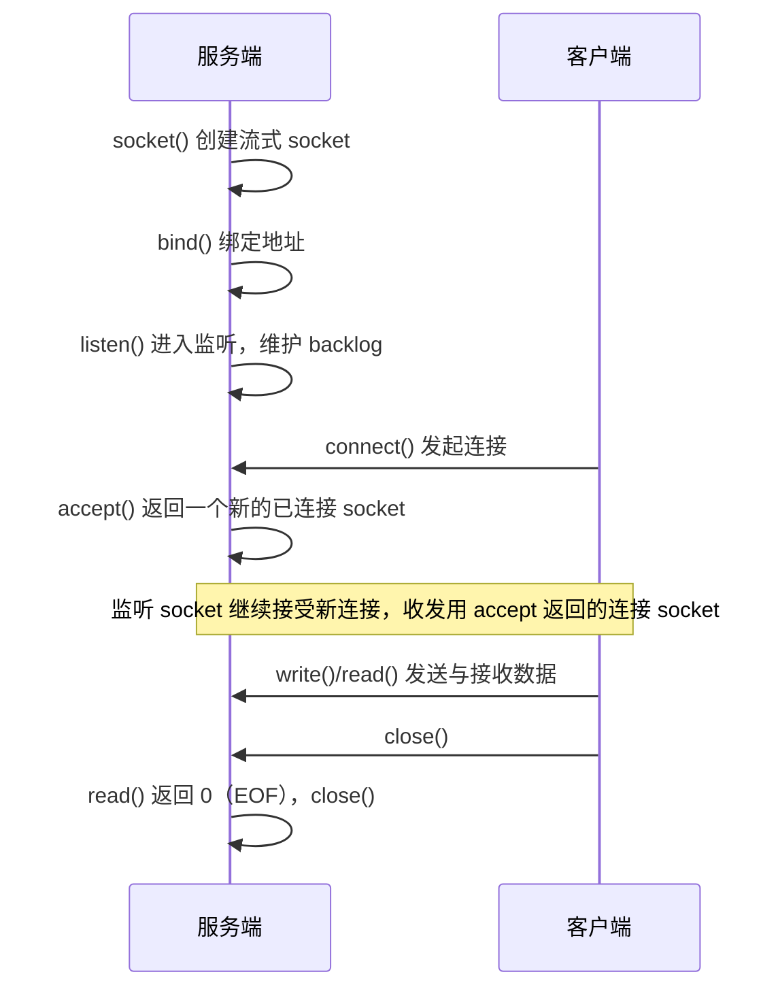

---
tags:
  - 基本功/系统
  - 基本功/进程
---

# 进程间通信

每个进程都有独立的虚拟地址空间，进程 A 写自己地址 `0x1000` 处的字节，进程 B 读同一个虚拟地址读到的是另一段物理内存。跨进程传数据必须借助一个两边都能访问的地方，在 Linux 上这个地方就是内核。

本篇按两条线展开：数据经过内核搬运（匿名管道、命名管道、消息队列、Socket，两次拷贝），与内核只建映射、数据留在用户态（共享内存，零拷贝）。信号量与信号不搬运成块数据，前者传控制、后者传异步通知，是前两者的补充。顺序为：定位与对照（§1）→ 管道（§2、§3）→ 消息队列（§4）→ 共享内存（§5）→ 信号量（§6）→ 信号（§7）→ Socket（§8）→ 选型（§9）→ 参数与观测（§10）→ 故障排查（§11）。默认值与实现细节以当前主线 Linux 的 man-pages 与内核文档为准，结构体与链表组织取自内核源码。

## 1. 六种方式的定位与对照

### 1.1 内核为什么必须居中

进程隔离建立在虚拟内存之上：每个进程一份页表，把各自的虚拟地址映射到不同的物理页。这挡住了直接互访，也带来一个结论——两个进程要交换数据，必须借助一段双方页表都映射到的内存。内核空间满足这个条件：所有进程的页表里，内核地址段映射到同一批物理页，进程切到内核态时用的就是这段共享内存。

围绕这段内存，Linux 提供了两条设计路线。

第一条是**让数据经过内核缓冲**：发送方把自己的数据拷进内核缓冲，接收方再拷回自己的用户缓冲。管道、命名管道、消息队列、Socket 都走这条路。内核顺带提供服务：管道的先进先出、消息队列的消息边界、Socket 的跨主机路由。代价是固定的两次拷贝，加上每次收发各一次系统调用。

第二条是**让内核只建立映射**：内核把同一段物理页映射进两个进程的地址空间，之后两边直接读写，数据不经过内核中转缓冲。共享内存走这条路，拷贝次数为零。代价是内核不再保管任何东西——同步、边界、生命周期都要用户态自己处理。

信号量与信号不在这条横轴上。信号量传递「资源是否可用」这一个整数，信号传递「发生了某个事件」这一个通知，两者都不搬运成块数据，通常与前几种配合：共享内存负责传数据，信号量负责保护它；Socket 负责传数据，信号负责在异常时打断它。

### 1.2 六种方式对照总表

| 机制 | 数据是否经内核缓冲 | 是否面向字节流 | 是否有名 | 生命周期 | 典型场景 |
| --- | --- | --- | --- | --- | --- |
| 匿名管道 `pipe` | 是（两次拷贝） | 字节流，无边界 | 无名，靠 fd 继承 | 随最后一个引用关闭 | shell 管道、父子进程单向流 |
| 命名管道 FIFO | 是（两次拷贝） | 字节流，无边界 | 文件系统路径名 | 随文件（inode）存在 | 无关进程、命令行粘合 |
| 消息队列 | 是（两次拷贝） | 有边界消息，可按类型取 | 有（key 或名字） | 随内核，需显式删除 | 低频结构化消息 |
| 共享内存 | 否（零拷贝） | 无格式内存块 | 有 | 随内核或文件对象 | 大数据块、高频传输 |
| 信号量 | 否（只传整数） | 计数器 | 有 | 随内核或随内存 | 互斥与同步 |
| 信号 | 否（只传通知） | 信号编号 + 可选附带值 | 无名 | 瞬时（递送即消） | 异步事件通知 |
| Socket | 是（两次拷贝） | 字节流或数据报 | 有（IP:port / 路径名） | 随连接 / 随文件 | 跨主机、本机通用 |

按「数据是否经过内核缓冲」折成两列：

```text
   六种方式的定位（数据路径 vs 控制路径）

              数据经内核搬运                        数据留在用户态
      ┌────────────────────────────┐      ┌────────────────────────────┐
      │  匿名管道  命名管道 FIFO      │      │  共享内存                    │
      │  消息队列                    │      │    └─ 配 信号量 保护临界区     │
      │  Socket（UDS / TCP / UDP）   │      └────────────────────────────┘
      └────────────────────────────┘
                  │                                    │
            两次用户↔内核拷贝                     零拷贝（只建一次映射）
      ────────────┴────────────────────────────────────┴────────────▶
        不搬数据的通道：信号（异步通知） · 信号量（资源计数）
```

这张表后面反复用到。管道与 FIFO 只差「有无名字」一处（§3.2），消息队列与管道的差别在「有边界、可按类型取」（§4.2），共享内存与管道的差别就是上图里的两条路径（§5.1）。

## 2. 匿名管道

匿名管道是历史最久的 IPC，Unix 第一版就有。接口只有一对文件描述符，用法简单到能在 shell 里用一个竖线表达，它却是理解后面几种方式的基础。

### 2.1 pipe() 的返回语义与两个 fd

```c
int pipe(int pipefd[2]);
```

`pipefd[0]` 是读端，`pipefd[1]` 是写端。写入写端的数据由内核缓冲，直到被从读端读走（来源：`man 2 pipe`）。管道是单向的——数据只能从写端流向读端，要双向通信就得建两个管道。管道不能 `lseek` 定位（来源：`man 7 pipe`）。

管道只存在于内存，文件系统里没有对应文件，所以它是「无名」对象：除了通过已打开的文件描述符，没有办法从外部找到它。这决定了它的通信范围——只能靠 `fork` 把父进程的文件描述符表复制给子进程，让两个进程各持一份指向同一管道对象的 fd。`fd[0]` 与 `fd[1]` 都是普通文件描述符，可以 `read`、`write`、`close`，也可以用 `dup2` 重定向；shell 的 `A | B` 就是新建管道，把 A 的标准输出接到写端、B 的标准输入接到读端，再关掉多余 fd。

### 2.2 内核环形缓冲与 PIPE_BUF 的原子性

管道在内核里是一段环形缓冲，由 `struct pipe_inode_info` 描述，它持有 `struct pipe_buffer` 数组，长度宏 `PIPE_DEF_BUFFERS` 为 16（来源：Linux 内核 `include/linux/pipe_fs_i.h`）；每个槽容纳一页，页大小 4096 时默认容量为 16 × 4096 = 65536 字节。`man 7 pipe` 把这条写成「自 Linux 2.6.11 起管道容量为 16 页，即 4096 页大小下 65536 字节」，与源码一致。

环形缓冲由两个指针驱动：写指针把新数据填进空槽，读指针把已读槽位归还。写只在有空槽时进行，读只在有数据时进行；指针绕到数组末尾再回到下标 0，槽位循环利用。

```text
   管道内核环形缓冲（默认 16 个槽，每槽 1 页，合计 64 KiB）

     写端 fd[1]                                     读端 fd[0]
         │                                              ▲
         ▼                                              │
   ┌───────┬───────┬───────┬───────┬─ ─ ─ ─┬──────────┐
   │ slot0 │ slot1 │ slot2 │ slot3 │  ...  │  slot15  │
   └───────┴───────┴───────┴───────┴─ ─ ─ ─┴──────────┘
      ▲                                               ▲
     tail（读指针）                                 head（写指针）
      └── 已读走 ──┘└──────── 待读数据 ────────┘└─ 空槽 ─┘

   写指针追到读指针 ⟹ 满，write 阻塞；两指针重合 ⟹ 空，read 阻塞
```

容量可用 `fcntl` 的 `F_GETPIPE_SZ` / `F_SETPIPE_SZ` 查询和修改（来源：`man 7 pipe`）。普通用户能设的上限由 `/proc/sys/fs/pipe-max-size` 决定，默认 1048576 字节；自 Linux 4.9 起它也是新管道默认容量的天花板（来源：`man 7 pipe`）。

容量之外还有一个常量决定并发写的正确性：`PIPE_BUF`。POSIX 规定写入不超过 `PIPE_BUF` 的 `write` 必须原子——输出作为一段连续序列写进管道；超过 `PIPE_BUF` 的写可能与其它进程的写交错（来源：`man 7 pipe`）。Linux 上 `PIPE_BUF` 为 4096（来源：`man 7 pipe`）。推论是：只要每条消息不超过 4096 字节，多个写者并发写同一管道时，每条消息不会被插断。调大管道容量不改变 `PIPE_BUF`，原子写边界仍是 4096。

### 2.3 fork 的引用计数、EOF 与阻塞语义

`fork` 复制文件描述符表，父子各持一份指向同一管道对象的 fd 副本，内核按引用计数管理。关掉一个副本不销毁管道，要等所有指向它的 fd 都关闭才回收。这直接决定两种边界行为：

- **读端 EOF**：所有指向写端的 fd 都关闭后，从管道读会读到文件结束，`read` 返回 0（来源：`man 7 pipe`）。
- **写端 SIGPIPE**：所有指向读端的 fd 都关闭后，再写入会触发 `SIGPIPE`；若进程忽略该信号，`write` 以 `EPIPE` 失败（来源：`man 7 pipe`）。

`man 7 pipe` 因此建议：用 `pipe` 与 `fork` 的程序应在父子两侧分别 `close` 掉不需要的重复 fd，只有这样 EOF 与 SIGPIPE/EPIPE 才会在正确时刻出现；标准做法是父关读端只留写端、子关写端只留读端（来源：`man 2 pipe` 示例）。由此能推出一类常见现象：子进程持有写端副本却没关闭，父进程从读端 `read` 会一直阻塞，永远等不到 EOF——数据其实读完了，挂住的原因是「还有别人能写」。

管道的缓冲有限，两端阻塞条件由状态决定（来源：`man 7 pipe`）：

- **写满阻塞**：管道满时 `write` 阻塞；设了 `O_NONBLOCK` 则立即失败并置 `EAGAIN`。
- **读空阻塞**：管道空且仍有写端打开时 `read` 阻塞；设 `O_NONBLOCK` 则立即失败并置 `EAGAIN`。写端全关时读空返回 0，不阻塞。

原子性在非阻塞模式下仍有约束：不超过 `PIPE_BUF` 的 `write` 即使 `O_NONBLOCK` 也保证原子，要么整段写入、要么不写；超过 `PIPE_BUF` 的 `O_NONBLOCK` 写若空间不足会先写一部分并返回已写字节数（来源：`man 7 pipe`）。所以一次写端 `write` 的字节，读端可能分多次读到——字节流本身没有消息边界。

管道的开销账要记清：每片数据经历「用户→内核」与「内核→用户」两次拷贝，加上写入方与读出方各一次系统调用。它适合流式、不需要随机访问的数据搬运；高频小消息的往返会把系统调用与拷贝开销放大，这是消息队列与共享内存被引入的动因。shell 里的 `A | B` 更特别——A 与 B 之间没有父子关系，两者都是 shell 的子进程，shell 把管道两端分别接给它们。

## 3. 命名管道（FIFO）

匿名管道的范围受限于「fd 只能靠继承传递」，两个毫无亲缘关系的进程用不上它。命名管道（FIFO）用文件系统里一个路径名补上了这一环，其余机制与匿名管道一致。

### 3.1 mkfifo 与文件系统里的特殊文件

```text
$ mkfifo myPipe
$ ls -l myPipe
prw-r--r-- 1 user user 0 Jul 17 02:45 myPipe
```

`ls -l` 第一个字符是 `p`，表示类型为管道（pipe）。FIFO 是文件系统里的特殊文件（inode），有路径名，可被任意进程按路径打开，打开后的读写语义与匿名管道相同。数据仍缓存在内核里，不写入磁盘，那个 0 字节的大小不表示数据落盘。

### 3.2 与匿名管道的区别及打开阻塞语义

FIFO 与匿名管道在传输机制上没有差别：同样的内核环形缓冲、同样的 `PIPE_BUF` 原子写、同样的引用计数与 EOF/SIGPIPE 语义。唯一区别在「名字」：匿名管道无名，只能通过已打开的 fd 使用，因此只能传给有亲缘关系（继承 fd）的进程；FIFO 有路径名，任何进程只要知道路径就能打开，不要求亲缘关系。

FIFO 比匿名管道多一层打开时的阻塞语义（来源：`man 7 pipe`、`man 3 fifo`）：

- 以只读方式 `open` FIFO 会阻塞，直到有进程以写方式打开它；
- 以只写方式 `open` FIFO 会阻塞，直到有进程以读方式打开它；
- 加 `O_NONBLOCK`：只读 `open` 立即成功；只写 `open` 若此时没有读者，失败并置 `ENXIO`。

这条打开握手与「管道两端必须同时存在才成立」是同一件事——没有读者的写端、没有写者的读端都没有意义，内核用阻塞把两个进程对齐。一旦两端都打开，后续读写阻塞、`SIGPIPE`/`EPIPE`、EOF 行为与匿名管道一致。FIFO 的固定开销与匿名管道相同（两次拷贝），优点是接入简单——一个路径名就能把不相干的进程连起来。

## 4. 消息队列

管道传的是无格式字节流，没有边界。消息队列把数据切成一条条有类型、有边界的消息，接收方可以按类型挑选，省去了应用层对字节流分帧的工作。

### 4.1 System V 与 POSIX 两套 API

Linux 上并存两套接口。System V 版（简称 SysV）以 key 标识队列（来源：`man 2 msgget`）：`msgget` 创建或获取队列并返回队列 ID，`msgsnd` 发送一条消息（`msgp` 指向以 `long mtype` 开头的结构），`msgrcv` 接收一条并用 `msgtyp` 选择取哪一类，`msgctl` 做控制（如 `IPC_RMID` 删除）。

POSIX 版以名字标识，名字形如 `/somename`，使用起来更接近文件（来源：`man 7 mq_overview`）：`mq_open` 创建或打开并返回一个消息队列描述符（Linux 上实际就是文件描述符），`mq_send` / `mq_receive` 收发，`mq_close` / `mq_unlink` 关闭与删除。

两套接口并存是历史与移植性共同作用的结果：SysV IPC 出现更早、几乎每个 Unix 都实现，很多既有系统依赖它；POSIX 版接口更统一，带优先级、带异步通知（`mq_notify`），挂到 `/dev/mqueue` 后可以用 `ls`、`cat` 查看。新代码倾向 POSIX 版，SysV 版更多出现在遗留系统与内核内部。

### 4.2 内核链表组织与消息边界

SysV 消息队列在内核里以链表组织。每个队列是一个 `struct msg_queue`，其中 `q_messages` 是一个 `struct list_head`，所有等待被接收的消息挂在上面（来源：Linux 内核 `ipc/msg.c`）。每条消息是一个 `struct msg_msg`，头部带一个类型字段 `m_type`。发送时内核把消息追加到链表尾部，接收时按 `msgtyp` 选择：

- `msgtyp == 0`：取队首（最早的一条）；
- `msgtyp > 0`：取第一条类型等于 `msgtyp` 的消息；
- `msgtyp < 0`：取类型小于等于 `|msgtyp|` 中类型最小的那条。

```text
   内核消息队列：队列对象 + 消息链表

   struct msg_queue（每个队列一个）
   ┌────────────────────────────────────────────────────────────┐
   │ q_perm   （权限、key、队列 ID）                              │
   │ q_messages ──▶ ┌──────────┐   ┌──────────┐   ┌──────────┐   │
   │                │ msg_msg  │──▶│ msg_msg  │──▶│ msg_msg  │   │
   │                │ m_type=3 │   │ m_type=1 │   │ m_type=1 │   │
   │                │ 数据载荷  │   │ 数据载荷  │   │ 数据载荷  │   │
   │                └──────────┘   └──────────┘   └──────────┘   │
   │ q_receivers（等待接收的进程链表）                            │
   │ q_senders  （等待发送的进程链表）                            │
   └────────────────────────────────────────────────────────────┘
   接收按 msgtyp 在链上选择：0 = 队首；>0 = 首个该类型；<0 = ≤|msgtyp| 中最小类型
```

消息边界由内核维护，接收方一次 `msgrcv` 拿到一条完整消息，不会像字节流那样中途截断。POSIX 版在此基础上加了优先级：消息按优先级从高到低投递，范围为 0（最低）到 `sysconf(_SC_MQ_PRIO_MAX) - 1`，Linux 上该值为 32768，即优先级 0..32767（来源：`man 7 mq_overview`）。

与管道相比，消息队列的三点差别是：有消息边界、可按类型取、队列对象常驻内核（生命周期不随进程结束而销毁）。这三条是它相对管道的全部增益。

### 4.3 限额与拷贝开销：为什么现在很少用

SysV 版的容量限额（来源：Linux 内核 `include/uapi/linux/msg.h`）：`MSGMAX` 单条消息最大 8192 字节，`MSGMNB` 单队列总量 16384 字节，`MSGMNI` 队列数量上限 32000；这些值可由 `/proc/sys/kernel/msgmax`、`msgmnb`、`msgmni` 查询与调整（来源：Documentation/admin-guide/sysctl/kernel.rst）。

POSIX 版另有一组（来源：`man 7 mq_overview`）：`/proc/sys/fs/mqueue/msg_max` 默认 10，限制队列里的消息条数（对应 `attr.mq_maxmsg`）；`/proc/sys/fs/mqueue/msgsize_max` 默认 8192 字节，限制单条消息大小（对应 `attr.mq_msgsize`）；`msg_default` 与 `msgsize_default` 各默认 10 与 8192，是不传 `attr` 时新队列的默认值。

这两组默认值暴露了消息队列的定位：`MSGMAX` 8192 字节、`MSGMNB` 16384 字节，量级停留在小消息。更麻烦的是数据路径——发送方把数据拷进内核的 `msg_msg`，接收方再拷回用户态，往返至少两次拷贝，与管道相同；队列对象还常驻内核，进程退出不回收，忘记 `msgctl(IPC_RMID)` 或 `mq_unlink` 就会一直占用（`ipcs -q` 可见、`ipcrm` 可清）。

现代实践里，跨进程消息传递大多已不落在内核消息队列上：Redis、Kafka、NATS 这类用户态消息中间件把消息放在进程可见的存储里，提供持久化、订阅、跨主机与水平扩展。内核消息队列剩下的角色主要是同机、低频、结构简单的一次性通信——它没有被删除，只是被更擅长这件事的系统绕开了。

## 5. 共享内存

管道、消息队列、Socket 都让数据经过内核缓冲，两次拷贝的开销在小消息、高频场景下会盖过业务本身。共享内存从根上省掉这两次拷贝，代价是把同步和生命周期管理交给用户态。

### 5.1 为什么它是最快的 IPC：零拷贝

共享内存的机制是：内核把同一段物理页映射进多个进程的虚拟地址空间，于是这些进程的页表里有不同的虚拟地址指向同一批物理页。进程 A 往这段内存写一个字节，进程 B 立刻能从自己的映射里读到——中间没有任何拷贝，也没有内核介入。

```text
   一条消息从进程 A 到进程 B 的两种路径

   ① 管道 / 消息队列 / Socket：数据经内核中转，两次拷贝
      A 用户态 ──write(2)──▶ ┌──────────┐ ──read(2)──▶ B 用户态
                             │ 内核缓冲  │
                             └──────────┘
        └──── 拷贝 #1 ────┘    └──── 拷贝 #2 ────┘
        进出内核各一次系统调用，共 4 次用户↔内核切换

   ② 共享内存：数据留在用户态，内核只建立映射，零拷贝
      A 用户态 ┐                                    ┌ B 用户态
               ├──▶ ┌──────────────────────┐ ◀──┤
      A 虚拟地址┘    │  同一段物理页（共享）  │    └ B 虚拟地址
                     └──────────────────────┘
        └─ 只有 shmget/shmat（或 shm_open/mmap）进内核一次 ─┘
           之后的读写直接命中内存，不再陷入内核
```

这条路径上的拷贝次数是 0，所以共享内存常常被称作最快的 IPC 方式。准确地说，它最快的是数据传输阶段：建立映射本身仍要一次系统调用，同步仍要额外机制。它适合传大块数据、高频交换数据，不适合传几十字节的小消息——后者省下的拷贝抵不过在映射建立与同步上的额外复杂度。

### 5.2 两套 API 与 mmap 的关系

System V 版（来源：`man 2 shmget`）：`shmget` 创建或获取共享内存段并返回段 ID；`shmat` 把段挂接到本进程地址空间并返回可用指针；`shmdt` 使用结束后脱离；`shmctl(shmid, IPC_RMID, buf)` 标记删除。

POSIX 版把共享内存做成「tmpfs 上的文件 + `mmap`」（来源：`man 7 shm_overview`）：`shm_open` 创建或打开共享内存对象并返回文件描述符，`ftruncate` 设定大小，`mmap(NULL, size, prot, MAP_SHARED, fd, 0)` 把它映射进地址空间，`munmap` 解除映射，`shm_unlink` 从名字空间删除。

两套机制在「映射到同一物理内存」这一点上等价，差别在命名与生命周期管理。POSIX 版之所以是「文件 + `mmap`」，是因为它复用了文件系统的命名与权限：`shm_open` 的对象出现在 `/dev/shm` 下，`shm_unlink` 的语义与 `unlink` 一致。`mmap` 是更通用的机制，共享内存是它的一个用法。`mmap` 带 `MAP_SHARED` 时，映射内容对映射同一对象的其他进程可见；不带名字的匿名 `MAP_SHARED` 映射在 `fork` 后也能被父子进程共享（子进程继承映射），但两个没有亲缘关系的进程要共享，必须落到一个双方都能打开的对象上。

限额方面，SysV 共享内存由两个参数约束：`shmmax` 限制单个段的最大字节数，`shmall` 限制一个 IPC 命名空间内所有共享内存页数之和（来源：Documentation/admin-guide/sysctl/kernel.rst）。内核文档要求 `shmall` 至少为 `ceil(shmmax / PAGE_SIZE)`，计数按 IPC 命名空间分别统计、不继承。源码里的默认值在 `include/uapi/linux/shm.h`：`SHMMIN` 为 1，`SHMMNI` 为 4096（段数上限），`SHMMAX` 与 `SHMALL` 都是 `ULONG_MAX - (1 << 24)`，64 位下即 18446744073692774399，等于把上限设到实际上不限制。现代内核默认不拦单个段的大小，真正的约束来自物理内存与 `/dev/shm` 的容量。

删除语义在两套接口上有区别：SysV 的 `IPC_RMID` 是标记删除，已 `shmat` 的进程仍可继续使用，直到最后一个进程 `shmdt`；POSIX 的 `shm_unlink` 把名字从名字空间抹掉，已建立的映射仍然有效，直到最后一个进程 `munmap`。两者都指向同一条实践：删除共享内存对象不会立刻回收内存，要等最后一个引用离开。

### 5.3 同步缺失与 /dev/shm 的实现

共享内存只提供「一块双方都能访问的内存」，不提供任何同步。两个进程同时对同一地址做「读-改-写」，谁后写谁的结果覆盖前面，非原子操作会丢失更新。这是它的定位使然 —— 它把「怎么保护这块内存」留给了调用者。

保护手段通常有两种：一种是把互斥量放进共享内存（`pthread_mutexattr_setpshared` 设为 `PTHREAD_PROCESS_SHARED` 后，互斥量本身也放在共享段里），另一种是外挂一个信号量（§6）。并发写的字节级可见性由硬件缓存一致性保证——同一物理页在多个核的缓存行之间保持一致，用户态不需要插内存屏障来保证「A 写完 B 能读到」；需要同步的是「读-改-写」这类复合操作的原子性。

POSIX 共享内存对象的存储落在 `tmpfs` 上，通常挂载在 `/dev/shm`（来源：`man 7 shm_overview`）。`tmpfs` 的内容在内存（必要时用交换）里，不落持久磁盘，所以对象在系统重启后消失；容量受挂载参数限制，`df -h /dev/shm` 可看当前上限。观测共享内存段用 `ipcs -m` 列 SysV 段，`ls -l /dev/shm` 列 POSIX 对象，`ipcrm` 清理 SysV 段。这些命令在排查「内存去哪了」时是第一批要看的地方。

## 6. 信号量

共享内存解决了「数据放在哪」，接下来是「怎么保证多个进程不打架」。信号量负责的就是这件控制层面的事。

### 6.1 分工与 P/V 操作的原子性

先固定分工：共享内存负责传数据，信号量负责传控制。信号量本身不缓存业务数据，它只是一个整型计数器，且值不允许降到 0 以下（来源：`man 7 sem_overview`）。计数器的值表示可用资源的数量。

对信号量只有两个操作（来源：`man 7 sem_overview`）：

- **P 操作**（`sem_wait`）：把信号量减 1；若减后为负，说明没有可用资源，调用者阻塞，直到值大于 0；
- **V 操作**（`sem_post`）：把信号量加 1；若此前有进程阻塞在 P 上，其中一个被唤醒。

这两个操作的「读值、判断、改值、必要时挂起/唤醒」由内核以原子方式完成，多个进程同时 P/V 不会丢失更新——这是信号量能做互斥的前提。P 与 V 成对出现：进入临界区前 P，离开后 V。若进程在持有资源时异常退出而没执行 V，信号量会永久减 1，后续等待者都挂住。

### 6.2 与互斥锁的区别、两套 API

信号量初值为 1 时，行为与互斥锁一样——任何时刻只允许一个进程进入临界区。差别在计数能力与所有权：

- 信号量的值可以是 N，一次允许 N 个进程同时进入（例如连接池的槽位数）；互斥锁只有「锁住」和「未锁」两种状态。
- 互斥锁有所有权：谁加锁谁解锁，别的线程解锁是错误；信号量没有所有权，一个进程 P、另一个进程 V 是合法用法，正是靠这一点实现「一个进程通知另一个进程」的同步。

同步用法与互斥用法的区别只在初值：初值 1 是互斥信号量，保证同一时刻只有一个持有者；初值 0 是同步信号量，先执行的进程 P 后阻塞，等另一个进程 V 把它唤醒，从而保证两者有先后顺序。

两套接口（来源：`man 7 sem_overview`、`man 2 semop`）：System V 用 `semget` 创建或获取信号量集、`semop` 执行 P/V、`semctl` 控制（`IPC_RMID`、`SETVAL`），一次 `semop` 可以原子地对一组信号量执行多个操作；POSIX 有名信号量用 `sem_open` / `sem_close` / `sem_unlink`，名字形如 `/somename`；POSIX 无名信号量用 `sem_init` / `sem_destroy`，放在一段共享内存里，适用于线程或进程共享。

SysV 信号量集的限额在 `include/uapi/linux/sem.h`：`SEMMNI`（信号量标识符数）32000、`SEMMSL`（每个集合内信号量数）32000、`SEMMNS` = `SEMMNI × SEMMSL`、`SEMOPM`（单次 `semop` 的操作数）500；`/proc/sys/kernel/sem` 按 `SEMMSL SEMMNS SEMOPM SEMMNI` 的顺序呈现。`semop` 还支持 `SEM_UNDO`：进程退出时内核自动撤销该进程做过的、带 `SEM_UNDO` 标记的 P 操作，避免「持有资源时崩溃」导致永久阻塞。

### 6.3 用信号量实现生产者-消费者

把互斥与同步叠在一起，就是经典的生产者-消费者。设缓冲区有 N 个槽，用三个信号量：`empty`（空槽数，初值 N）、`full`（已占用槽数，初值 0）、`mutex`（互斥访问缓冲区，初值 1）。

生产者循环执行 `P(empty)` → `P(mutex)` → 写入一个槽 → `V(mutex)` → `V(full)`；消费者循环执行 `P(full)` → `P(mutex)` → 读出一个槽 → `V(mutex)` → `V(empty)`。

两个 P 操作的顺序不能对调。若生产者先 `P(mutex)` 再 `P(empty)`，当缓冲区已满时，生产者持有 `mutex` 后阻塞在 `empty` 上；此时消费者要消费必须先拿到 `mutex`，而它在生产者手里，消费者也阻塞——两个进程互相等待，形成死锁。把 `P(empty)` 放在前面，生产者在拿到 `mutex` 之前就因满而等待，不会占着互斥量不放。

```text
   生产者-消费者的信号量推演（缓冲容量 N = 1）

   初始：empty = 1，full = 0，mutex = 1

   生产者                                   消费者
   ─────────────────────────                ─────────────────────────
   P(empty)   empty 1 → 0
   P(mutex)   mutex 1 → 0
   ┌──────────────┐
   │ 写入一个槽    │
   └──────────────┘
   V(mutex)   mutex 0 → 1
   V(full)    full  0 → 1  ───────────▶    P(full)   full  1 → 0
                                           P(mutex)  mutex 1 → 0
                                           ┌──────────────┐
                                           │ 读出一个槽    │
                                           └──────────────┘
                                           V(mutex)  mutex 0 → 1
                                           V(empty)  empty 0 → 1  ← 唤醒等待的生产者
   回到初始：empty = 1，full = 0，mutex = 1

   两个生产者并发、容量 1 时：
     第一个 P(empty)  1 → 0，进入
     第二个 P(empty)  0 → -1，阻塞
     消费者 V(empty)  唤醒第二个生产者
```

这段推演解释了两件事。其一，初值 1 的 `mutex` 保证临界区里只有一个进程。其二，初值 0 的 `full` 保证消费者在生产者之前不会读到空槽——若消费者先跑，`P(full)` 把 0 减到 -1 并阻塞，等生产者 `V(full)` 才被唤醒。`empty` 与 `full` 一进一出、总数恒为 N，缓冲区既不会溢出也不会空读。

## 7. 信号

前面几种机制都在「正常通信」场景里传递数据。信号处理另一类需求：在任意时刻把一个事件通知给进程或线程——用户按了 Ctrl+C、子进程退出、定时器到期、内存访问非法。它不承运数据（除了可选的附带值），是进程间通信里唯一的异步机制。

### 7.1 异步通知：产生、递送、处理三步

一个信号的完整生命周期分三步（来源：`man 7 signal`）：

1. **产生**（generated）。来源可以是内核（硬件异常、定时器到期、子进程状态变化）、另一个进程（`kill`、`sigqueue`），或用户按键。
2. **挂起**（pending）。信号已产生但尚未递送。若目标进程当前屏蔽（阻塞）了这个信号，它就一直 pending，直到解除屏蔽；进程可用 `sigpending` 查询自己挂起的信号集合。
3. **递送**（delivered）与处理。信号被交付给进程，进程按处置方式响应。递送发生在从内核态返回用户态的时刻——内核在返回前检查是否有「未被屏蔽、且已注册处理函数」的挂起信号。

处置方式有三种，是每个信号的属性：默认动作（多为终止进程）、忽略、捕获。进程用 `signal` 或 `sigaction` 设置处置。

```text
   信号的产生 → 挂起 → 递送

   ┌────────────┐        ┌──────────────────┐        ┌──────────────────┐
   │  产生       │        │  挂起 pending     │        │  递送 delivered   │
   │ 内核事件    │───────▶│ 在待处理集合里     │───────▶│ 从内核态返回用户态 │
   │ kill 系统调用│        │ 等待被取消屏蔽     │        │ 时执行处置         │
   │ 键盘输入    │        │                  │        │                  │
   └────────────┘        └──────────────────┘        └────────┬─────────┘
                               ▲                              │
                          信号被屏蔽时                        ▼
                          一直停在这里            ┌───────────────────────────┐
                                                  │ 默认动作 / 忽略 / 调用 handler │
                                                  └───────────────────────────┘
```

标准信号（Linux 上编号 1–31）在挂起期间不排队：同一种标准信号被多次产生而进程正屏蔽它时，只保留一个实例，解除屏蔽后只递送一次（来源：`man 7 signal`）。实时信号（编号 32–64）不同，多个实例可以排队，还能携带一个附带值。这条差别直接推出「用标准信号计数会丢」这一常见故障（§11）。

### 7.2 常用信号的语义与不可捕获的信号

常用信号的语义与默认动作（编号以 x86-64 为准，来源：`man 7 signal`）：

| 信号 | 编号 | 默认动作 | 触发事件与惯用语义 |
| --- | --- | --- | --- |
| `SIGHUP` | 1 | 终止 | 控制终端挂断；守护进程常约定用它触发重载配置 |
| `SIGINT` | 2 | 终止 | 键盘 Ctrl+C 中断 |
| `SIGQUIT` | 3 | 终止 + core | 键盘 Ctrl+\ |
| `SIGKILL` | 9 | 终止 | 强制终止，不可捕获、不可阻塞、不可忽略 |
| `SIGSEGV` | 11 | 终止 + core | 非法内存引用 |
| `SIGPIPE` | 13 | 终止 | 向没有读者的管道或套接字写入 |
| `SIGALRM` | 14 | 终止 | `alarm` / `setitimer` 定时器到期 |
| `SIGTERM` | 15 | 终止 | 请求终止，可被捕获用于优雅退出 |
| `SIGCHLD` | 17 | 忽略 | 子进程停止、终止或继续 |
| `SIGCONT` | 18 | 继续 | 让被停止的进程继续运行 |
| `SIGSTOP` | 19 | 停止 | 停止进程，不可捕获、不可阻塞、不可忽略 |
| `SIGTSTP` | 20 | 停止 | 键盘 Ctrl+Z |

只有 `SIGKILL` 与 `SIGSTOP` 不能被捕获、阻塞或忽略（来源：`man 7 signal`）。工程含义是：`SIGKILL` 是最后手段——它绕过进程的一切清理逻辑，进程得不到保存状态、关闭连接的机会；`SIGTERM` 才是请求正常终止的标准信号，程序应捕获它完成优雅退出，再由外部在超时后用 `SIGKILL` 兜底。

`SIGCHLD` 默认动作是忽略，父进程若完全不处理它，子进程退出后会留下僵尸条目占进程表，直到父进程回收（`wait`/`waitpid`）。`SIGHUP` 的「重载配置」是约定而非内核保证——内核只在终端挂断时发送它，把它解释成「重载」是守护进程自己注册 handler 的行为。

### 7.3 处理程序的异步安全、可靠性，与发送接口

信号处理函数在任意时刻打断主流程，它看到的世界处于不确定的中间状态。因此能在 handler 里安全调用的函数只有一小部分，称为 async-signal-safe（来源：`man 7 signal-safety`）。这个集合包括 `write`、`_exit`、`sigaction`、`kill` 等；不包括 `printf`、`malloc`、`syslog` 这类依赖全局状态的函数。`man 7 signal-safety` 给的典型反例是标准 I/O 库：stdio 的函数要维护静态缓冲和一组计数器，若主流程正在 `printf` 中途被打断、handler 又调用 `printf`，缓冲状态就被破坏。惯用做法是 **handler 只设置一个 `volatile sig_atomic_t` 标志位，真正的处理放到主循环里轮询**。

可靠性方面，`sigaction` 比老式 `signal` 语义更明确、可控（来源：`man 2 sigaction`）。两个与系统调用交互的标志最重要：`SA_RESTART` 让被该信号打断的「慢系统调用」自动重启，对调用者透明；不设（默认）时，被信号打断的慢系统调用失败并置 `EINTR`（来源：`man 2 sigaction`、`man 7 signal`），程序必须检查并重试。

```c
while ((n = read(fd, buf, sizeof(buf))) < 0 && errno == EINTR)
    ;   /* 被信号打断，重试 */
```

其它常用标志还有 `SA_SIGINFO`（handler 里能拿到 `siginfo_t`，用于实时信号的附带值）、`SA_NODEFER`（handler 执行期间不自动屏蔽当前信号）、`SA_ONSTACK`（在备选栈上执行 handler，用于处理栈溢出时的 `SIGSEGV`）。

发送信号与设置定时器的常用接口：`kill(pid, sig)` 向指定进程或进程组发信号，需要有权限（发送者与目标同属一个用户，或具备 `CAP_KILL`）；`raise(sig)` 向自己发送，等价于 `kill(getpid(), sig)`；`alarm(seconds)` 设置一次性的 `SIGALRM` 定时器；`setitimer` 支持 `ITIMER_REAL`（触发 `SIGALRM`）、`ITIMER_VIRTUAL`、`ITIMER_PROF`，可设周期性定时器；`timer_create` / `timer_settime` 是 POSIX 定时器，可配 `SIGEV_SIGNAL` 或 `SIGEV_THREAD`。这些接口共同的边界是：信号编号只有几十个、语义固定、能承载的信息量很小；需要传递更多上下文时，通常改用 `signalfd` 把信号读成一个文件描述符事件，纳入 `epoll` 事件循环统一处理。

## 8. Socket

前面几种机制都在同一台主机上工作。要跨主机通信就需要 Socket。它是唯一能跨主机的 IPC，同时也能用于本机进程间通信，是覆盖面最广的一种。

### 8.1 唯一跨主机的 IPC 与类型取舍

```c
int socket(int domain, int type, int protocol);
```

三个参数（来源：`man 2 socket`）：`domain` 指定协议族——`AF_INET`（IPv4）、`AF_INET6`（IPv6）、`AF_UNIX`（本机，`AF_LOCAL` 与之等价）；`type` 指定通信特性——`SOCK_STREAM`（字节流，对应 TCP）、`SOCK_DGRAM`（数据报，对应 UDP）、`SOCK_RAW`；`protocol` 通常填 0，协议已由前两个参数确定。

| 类型 | 寻址方式 | 消息边界 | 可靠性 | 跨主机 | 典型场景 |
| --- | --- | --- | --- | --- | --- |
| `AF_INET` + `SOCK_STREAM`（TCP） | 地址 + 端口 | 无 | 可靠、有序 | 是 | 跨主机通用通信 |
| `AF_INET` + `SOCK_DGRAM`（UDP） | 地址 + 端口 | 有 | 不保证送达与顺序 | 是 | 低延迟、广播、多播 |
| `AF_UNIX` + `SOCK_STREAM`（UDS 字节流） | 路径名或抽象名 | 无 | 可靠 | 否 | 本机高吞吐通信 |
| `AF_UNIX` + `SOCK_DGRAM`（UDS 数据报） | 路径名或抽象名 | 有 | 可靠、保边界 | 否 | 本机结构化消息 |

UNIX 域数据报 socket 与 UDP 的一个关键区别是：前者总是可靠的，不丢包、不乱序（来源：`man 7 unix`）。UDP 的不可靠来自 IP 层转发，本机通信没有这一步，就没有丢包来源。TCP 本身的分层、握手与可靠性细节属于网络专栏，链到 [[01-网络分层模型]]，不在这里重复。

### 8.2 服务端与客户端的编程序列

流式 socket 的服务端与客户端有一段固定的调用序列（来源：`man 2 socket`、`man 2 accept`）：服务端 `socket` → `bind`（绑定本地地址）→ `listen`（转为监听）→ `accept`（等待并接受连接）→ 用返回的新 socket 收发 → `close`；客户端 `socket` → `connect`（向服务端地址发起连接）→ 用同一个 socket 收发 → `close`。



两处容易混淆。第一，`accept` 返回的是一个新的 socket 文件描述符，它才是用于收发数据的连接 socket；原来的监听 socket 留在原地继续接受后续连接，服务端在有并发连接时要把两者分开管理。第二，`listen` 的第二个参数是 backlog，表示内核为该监听 socket 维护的未完成连接队列长度，受 `/proc/sys/net/core/somaxconn` 限制：该值默认 4096，在 Linux 5.4 之前是 128（来源：Documentation/networking/ip-sysctl.rst）。传入的 backlog 若大于 `somaxconn` 会被截断到 `somaxconn`——高并发服务调大 backlog 时必须同时调大这个内核参数，否则调的是无效值。

本机通信走 `AF_UNIX` 时，`bind` 绑定的是**路径名**（`struct sockaddr_un` 的 `sun_path`，长度上限 108 字节）而不是 IP 与端口，客户端 `connect` 到同一路径；也可以使用抽象名字空间（`sun_path[0]` 为 `'\0'`），不占用文件系统路径（来源：`man 7 unix`）。

### 8.3 send/recv 与 read/write、阻塞与本地通信的优势

在 Linux 上，对 socket 也可以直接使用 `read`、`write`、`readv`、`writev`（来源：`man 7 socket`）。`send` / `recv` 相对 `read` / `write` 多了一个 `flags` 参数，用来传入 `MSG_DONTWAIT`（本次调用非阻塞）、`MSG_PEEK`（窥看数据但不取走）、`MSG_NOSIGNAL`（本次调用不触发 `SIGPIPE`）等选项。socket 不能 `lseek`，也不支持带偏移的 `pread`（来源：`man 7 socket`）。

阻塞方面：默认下 `connect`、`accept`、`read`/`recv`、`write`/`send` 都可能阻塞等待对端或缓冲区；用 `fcntl` 设 `O_NONBLOCK`（或调用里传 `MSG_DONTWAIT`）后，无法立即完成时立即返回并置 `EAGAIN`/`EWOULDBLOCK`（来源：`man 7 socket`）。字节流没有消息边界，带来两个必须在应用层处理的问题：**短读**（一次 `recv` 返回的字节数可能少于请求）与**短写**（一次 `send` 可能只写出一部分）。可靠做法是在应用层定义长度前缀或分隔符分帧，不能假设「一次收一条」。此外，向已关闭对端的 socket 写入默认触发 `SIGPIPE`，忽略该信号后 `write` 以 `EPIPE` 失败——服务端若不处理，会因一个客户端断开而整个进程被终止，常见规避是忽略 `SIGPIPE` 或对发送调用加 `MSG_NOSIGNAL`。

同机两个进程既可以用 UDS，也可以用 TCP 连 `127.0.0.1`。UDS 的设计目标就是本机进程间的通信（来源：`man 7 unix`），它与 TCP loopback 的效率差别来自经过的路径不同：

```text
   UDS 与 TCP loopback 的数据路径

   ① TCP loopback（走完整网络栈）
      应用 A ─▶ TCP（分段/首部/校验和）─▶ IP（路由判断）─▶ 回环接口
              ─▶ IP ─▶ TCP（重组/校验/确认）─▶ 应用 B
      开销：分段重组、校验和、拥塞控制、端口查找

   ② UDS（不走网络栈）
      应用 A ─▶ socket 层（按路径名/抽象名找到对端）─▶ 对端接收队列 ─▶ 应用 B
      开销：只有 socket 层的查找与队列操作，无校验和、无分段、无回环

      共同点：两者都可靠、都面向字节流（或数据报），都支持同族的收发接口
```

UDS 还有一项 TCP 不方便提供的能力：传发送方凭证。给 socket 设 `SO_PASSCRED` 后，接收方能通过 `SCM_CREDENTIALS` 辅助消息拿到发送方的 PID、真实 UID 与 GID（来源：`man 7 unix`）。这在本机做权限校验时很有用——接收方不用信任应用层自报的身份，直接用内核给出的凭证。UDS 的路径名 socket 有一个必须处理的运维点：它会在文件系统留下一个 socket 文件，进程退出时不会自动删除，用同一路径重新 `bind` 会得到 `EADDRINUSE`；所以监听前通常先 `unlink` 旧路径，或改用抽象名字空间（不占文件、所有引用关闭后自动消失）（来源：`man 7 unix`）。

## 9. 横向对照与选型

把六种方式放到同一组判据下，选择哪一个就不再靠印象。

| 机制 | 数据拷贝次数 | 每次传输的系统调用 | 跨主机 | 可移植性 | 消息边界 |
| --- | --- | --- | --- | --- | --- |
| 匿名管道 | 2（用户↔内核各一次） | 写 1 次 + 读 1 次 | 否 | 高（POSIX） | 无 |
| 命名管道 FIFO | 2 | 写 1 次 + 读 1 次 | 否 | 高（POSIX） | 无 |
| SysV 消息队列 | 2 | 发 1 次 + 收 1 次 | 否 | 高（SysV） | 有 |
| POSIX 消息队列 | 2 | 发 1 次 + 收 1 次 | 否 | 高（POSIX） | 有，带优先级 |
| 共享内存 | 0 | 建立映射 1 次，之后为 0 | 否 | 高 | 无（自行约定） |
| 信号量 | 0（不传数据） | 每次 P/V 各 1 次 | 否 | 高 | 不适用 |
| 信号 | 0（不传数据） | 每次发送 1 次 | 否 | 高 | 不适用 |
| Socket（UDS） | 2 | 收 1 次 + 发 1 次 | 否 | 高 | 流式无、数据报有 |
| Socket（TCP/UDP） | 2 | 收 1 次 + 发 1 次 | 是 | 高 | 流式无、数据报有 |

判据按问题逐层分叉：

```text
   选型分叉

   需要跨主机吗？
     ├─ 需要 ──▶ Socket（TCP 要可靠有序 / UDP 要低延迟或广播）
     └─ 不需要
          要在进程间传大量数据、且能自己管理同步吗？
            ├─ 能 ──▶ 共享内存（+ 信号量保护临界区）
            └─ 不能 / 数据量小
                 需要消息边界或按类型取吗？
                   ├─ 需要 ──▶ 消息队列（POSIX 优先）
                   └─ 不需要
                        是父子进程或 shell 流水线吗？
                          ├─ 是 ──▶ 匿名管道
                          └─ 否，只是无关进程要连通 ──▶ 命名管道 或 UDS
          只是要发一个事件通知、不传数据吗？
            └─ 是 ──▶ 信号（或 eventfd / signalfd 纳入事件循环）
```

几条补充判据：

- **数据量决定要不要上共享内存。** 拷贝开销与消息体积成正比，小消息用共享内存省不下多少，还要额外加同步，得不偿失；大块、高频的数据搬运才值得付同步的复杂度。
- **有边界需求就排除管道。** 字节流没有边界，接收方必须自己分帧；消息本身有结构、还想按类型取时，消息队列直接提供了这两点。
- **本机通信优先 UDS 而不是 TCP loopback。** 同为字节流时，UDS 少走整条网络栈，还多出传凭证的能力（§8.3）。
- **信号只用来通知，不用来传数据。** 它的信息量只有一个编号（外加实时信号的附带值），当作数据通道是误用。

现代实践里，这几种机制各自的「主战场」发生了转移：**消息队列**转向用户态消息中间件（Kafka、Redis、NATS），它们提供持久化、订阅、跨主机与水平扩展，内核消息队列退到本机低频场景；**共享内存**转向 `mmap` 与用户态共享环，直接用 `mmap` 映射文件、或 Aeron 这类低延迟传输库在内核外自建共享环，适用的场景比 SysV `shmget` 更宽；**管道**在需要双向或在进程间传文件描述符时让位给 `socketpair`——它创建的一对已连接 socket 是双向的，还支持 `SCM_RIGHTS` 传 fd；**信号量**在无竞争路径上让位给 futex 与用户态互斥量，内核信号量仍用于跨进程共享互斥量的慢路径，`SEM_UNDO` 一类的崩溃恢复能力则是 SysV 独有的；**信号**转向 `signalfd` / `eventfd` / `epoll`，把异步信号读成文件描述符就绪事件，纳入统一的事件循环。

选型的另一组前提是边界。零拷贝的共享内存在双方互信、且能自己处理同步时才成立——把一段未做访问控制的内存映射进低权限进程，等于把数据交给它任意改写；跨主机通信一律走 Socket，其余五种越不过主机边界；信号与信号量承载不了成块数据，把它们当数据通道会在压力上升时先崩掉。这些前提被违反时，前面对照表里「更快」的那一列反而会变成故障来源。

## 10. 参数与观测

每个参数按「默认值 → 语义 → 何时改 → 改大改小的后果 → 联动 → 失败模式」写齐，默认值出处在括号内。

**`/proc/sys/fs/pipe-max-size`**（默认 1048576 字节，来源：`man 7 pipe`）。语义：普通用户（无 `CAP_SYS_RESOURCE`）用 `F_SETPIPE_SZ` 能把单根管道设到的最大值，自 Linux 4.9 起也是新管道与新建 FIFO 默认容量的上限。何时改：经管道搬大块数据、频繁写满阻塞时调大。改大：写端更少因满阻塞，代价是每根管道常驻更多内核内存；改小：管道更易写满，生产者被限速。联动：实际容量还受 `pipe-user-pages-soft`（默认 16384 页）与 `pipe-user-pages-hard` 约束，软限制被突破后该用户新建管道被限制到 2 页。失败模式：过大且进程多时吃掉大量不可换出的内核内存；过小则高吞吐流水线反复阻塞。

**`PIPE_BUF`**（4096 字节，来源：`man 7 pipe`）。语义：写入不超过该值的 `write` 保证原子，超过则可能与其它写者交错；它是编译期常量，不可 sysctl 修改。联动：与管道容量相互独立，调大容量不改变它。失败模式：误以为「调大容量等于调大原子写边界」，在并发场景把超过 4096 字节的消息交给管道，出现截断或粘连。

**`msgmax` / `msgmnb` / `msgmni`**（默认 8192 / 16384 / 32000，来源：Linux 内核 `include/uapi/linux/msg.h`、Documentation/admin-guide/sysctl/kernel.rst）。语义：`msgmax` 单条消息最大字节数，`msgmnb` 单队列总字节数，`msgmni` 系统内队列数上限。何时改：要传接近 8 KB 的消息、或需要更多队列时调大。改大：容量变大、占用内核内存变多；改小：发送因超限以 `EINVAL`/`EAGAIN` 失败或阻塞。联动：`msgmnb` 至少要能装下若干条 `msgmax`。失败模式：`msgsnd` 因队列满阻塞或失败，发送方未处理时表现为延迟或丢弃。

**`/proc/sys/fs/mqueue/msg_max` 与 `msgsize_max`**（默认 10 与 8192 字节，来源：`man 7 mq_overview`）。语义：`msg_max` 限制队列里的消息条数（对应 `attr.mq_maxmsg`），`msgsize_max` 限制单条消息字节数（对应 `attr.mq_msgsize`）；`msg_default` 与 `msgsize_default` 各默认 10 与 8192，是不传 `attr` 时新队列的默认值，分别会被对应的 max 截断。失败模式：按默认值建队列后发送大消息，`mq_send` 返回 `EMSGSIZE`；条数超过 10 时发送阻塞或失败。

**`shmmax` / `shmall` / `shmmni`**（来源：Linux 内核 `include/uapi/linux/shm.h`、Documentation/admin-guide/sysctl/kernel.rst）。语义：`shmmax` 单段最大字节数，`shmall` 一个 IPC 命名空间内所有共享内存页数之和的上限，`shmmni` 段数量上限。默认值：`SHMMAX` 与 `SHMALL` 都是 `ULONG_MAX - (1 << 24)`（64 位下 18446744073692774399，实际不设限），`SHMMIN` 1，`SHMMNI` 4096。何时改：需要限制单进程能申请的共享内存总量时调小。联动：`shmall` 至少为 `ceil(shmmax / PAGE_SIZE)`，页大小用 `getconf PAGE_SIZE` 查。失败模式：`shmall` 偏小时 `shmget` 在系统已有较多共享内存后报 `ENOMEM`；`shmmax` 过小时应用申请大段直接失败。

**`/proc/sys/kernel/sem`**（按 `SEMMSL SEMMNS SEMOPM SEMMNI` 顺序，来源：Linux 内核 `include/uapi/linux/sem.h`、`ipc/sem.c`）。默认值 32000、`SEMMNI × SEMMSL`、500、32000。语义：`SEMMSL` 每集合内信号量数，`SEMMNS` 系统内信号量总数，`SEMOPM` 单次 `semop` 操作数上限，`SEMMNI` 信号量标识符数。何时改：每集合要容纳更多信号量、或单次 `semop` 执行更多操作时调大。失败模式：`semget` 报 `ENOSPC`（超 `SEMMNI`）或 `EINVAL`（超 `SEMMSL`）；`semop` 操作数超过 `SEMOPM` 直接报错。

**`net.core.somaxconn`**（默认 4096，来源：Documentation/networking/ip-sysctl.rst）。语义：`listen()` backlog 的上限，用户态常量 `SOMAXCONN` 在 `include/linux/socket.h` 中定义为 4096。何时改：高并发服务需要更长连接队列时调大。改大：能容忍更多瞬时连接风暴，代价是更多内核内存；改小：连接到达快于 `accept` 处理时队列溢出，连接被丢弃或重置。联动：TCP 还有 `tcp_max_syn_backlog` 影响半连接队列；`somaxconn` 在 Linux 5.4 前默认 128，老系统按 128 核对。失败模式：应用把 backlog 调大但没改 `somaxconn`，实际队列被截断，突发连接被丢、客户端超时或重置。

**观测手段**：`ls -l /proc/<pid>/fd/` 看管道 fd，`ioctl(FIONREAD)` 读未读字节数；`ipcs -q` 列 SysV 消息队列、`ipcrm -q` 删除，`ls -l /dev/mqueue` 看 POSIX 队列的 `QSIZE` 等字段（来源：`man 7 mq_overview`）；`ipcs -m` 列 SysV 共享内存段、`ipcrm -m` 删除，`ls -l /dev/shm` 与 `df -h /dev/shm` 看 POSIX 对象与容量；`ipcs -s` 列 SysV 信号量集、`ipcrm -s` 删除；`sysctl -a | grep -E 'pipe|msg|shm|sem|somaxconn'` 一次看到本节大部分参数。

## 11. 常见故障与排查

排查 IPC 问题的通用前提是分清两个方向：数据方向（数据是否真的从一端到了另一端）与控制方向（阻塞、唤醒、引用计数是否正确）。

**管道读端永远挂住（写端没关）**。现象：父进程从读端 `read` 一直阻塞，数据早已读完却等不到 EOF，`strace` 看到 `read` 停在内核里不返回。判据：EOF 的条件是「所有指向写端的 fd 都关闭」（来源：`man 7 pipe`），数据读完但引用计数没归零，`read` 就不会返回 0。定位：先用 `ioctl(FIONREAD)` 确认数据确实已读完；再数写端引用——列出父子进程各自的 fd 列表，找仍指向该管道的写端 fd，常见漏关是子进程 `fork` 后没关自己那份写端、或 fd 又被 `dup` 过一次；按「父关读端、子关写端」的约定关闭多余写端后重试；若本来就不需要读到 EOF，改用显式长度前缀或结束标记。

**SIGPIPE 与 EPIPE**。现象：进程在向管道或 socket 写入时被终止（默认动作），日志里没有异常栈。判据：向没有读者的管道、或已关闭对端的 socket 写入，默认触发 `SIGPIPE`；忽略该信号后 `write` 返回 `EPIPE`（来源：`man 7 pipe`、`man 7 signal`）。定位：先看退出状态，等于 128 + 13（SIGPIPE 编号）即命中此故障；用 `strace` 找到触发前的 fd 与调用点；规避方式为全局忽略 `SIGPIPE` 改处理 `EPIPE`，或对发送调用加 `MSG_NOSIGNAL`；把 `EPIPE` 或返回 0 当作「对端已断开」，做清理而不是重试。

**EINTR 导致系统调用中断**。现象：`read`/`write`/`accept` 偶发失败，错误码为 `EINTR`，在有信号（如 `SIGCHLD`、`SIGALRM`）的进程里高发。判据：未设 `SA_RESTART` 的信号处理函数在执行期间打断慢系统调用，被中断的调用返回 `EINTR`（来源：`man 2 sigaction`、`man 7 signal`）。定位：确认注册信号时是否用了 `SA_RESTART`；在调用点检查 `errno == EINTR` 并循环重试；对 `connect`、`accept`、`read`、`write`、`nanosleep` 分别确认重试语义（`nanosleep` 返回剩余时间，要用返回值重试）。

**共享内存泄漏（未 shmdt / 未删除）**。现象：`ipcs -m` 里段数越来越多，`free` 显示内存只增不减，进程早已退出。判据：SysV 段常驻内核，进程退出不会自动回收，必须 `shmctl(IPC_RMID)`；已挂接的段在标记删除后仍占内存，直到最后一个进程 `shmdt`（§5.2）。定位：`ipcs -m` 看 `nattch`（挂接进程数）与段大小，`nattch = 0` 且仍存在的段是可清理的孤儿段，被标记删除但 `nattch > 0` 的段说明还有进程挂着；把各段大小相加与 `free` 的下降量对照，确认是否就是这些段；清理用 `ipcrm -m`，代码里保证 `shmdt` + `IPC_RMID` 成对，POSIX 侧用 `shm_unlink`。

**信号丢失**。现象：用信号做「计数」的进程少计了几次，高并发下计数明显偏小。判据：标准信号在挂起期间不排队，同一种标准信号被多次产生而进程正屏蔽它时只保留一个实例（来源：`man 7 signal`），用它计数会被合并。定位：确认用的是标准信号还是实时信号——需要不丢的排队语义就改用实时信号（可排队且带附带值），或改成 `signalfd` 从文件描述符读事件（事件不会被合并），更保守的做法是放弃「信号计数」，改为共享内存里的原子计数器，信号只做「有新数据」的提示。

**UDS 的 Address already in use**。现象：服务重启时 `bind` 失败，`errno` 为 `EADDRINUSE`，但 `ps` 看不到占用进程。判据：路径名 UDS 会在文件系统留下 socket 文件，进程退出不自动删除，同路径再次 `bind` 报 `EADDRINUSE`（来源：`man 7 unix`）。定位顺序：

```text
   ┌──────────────────────────────────────────────┐
   │ UDS bind 报 EADDRINUSE 的定位顺序               │
   └──────────────────────────────────────────────┘

   ① 确认路径上是不是遗留 socket 文件
       ls -l <path>  类型为 s（socket）
       用 ss -xl 或 lsof 确认是否真有进程在监听该路径
   ② 若无进程监听 ⟹ 是残留文件
       bind 前先 unlink(path)（注意权限与竞态，用原子方式）
   ③ 若确有进程监听 ⟹ 服务未真正退出
       查该进程是否卡在清理阶段；不要贸然删除正在使用的 socket 文件
   ④ 长期方案
       改用抽象名字空间（sun_path[0] = '\0'），不占文件、引用全关后自动消失
```

## 相关

- [[00-系统专栏导览]] —— 本专栏的入口、边界与阅读顺序
- [[04-进程、线程与调度]] —— 通信的另一面：多个执行流怎么并存
- [[06-死锁与锁策略]] —— 共享内存没有同步就不安全，那一侧在这里

## 参考

- Linux man-pages. *pipe(2), pipe(7)*. https://man7.org/linux/man-pages/man7/pipe.7.html
- Linux man-pages. *msgget(2), mq_overview(7)*. https://man7.org/linux/man-pages/man7/mq_overview.7.html
- Linux man-pages. *shmget(2), shm_overview(7)*. https://man7.org/linux/man-pages/man7/shm_overview.7.html
- Linux man-pages. *semop(2), sem_overview(7)*. https://man7.org/linux/man-pages/man7/sem_overview.7.html
- Linux man-pages. *signal(7), signal-safety(7), sigaction(2)*. https://man7.org/linux/man-pages/man7/signal.7.html
- Linux man-pages. *unix(7), socket(2), socket(7)*. https://man7.org/linux/man-pages/man7/unix.7.html
- Linux kernel. *Documentation/admin-guide/sysctl/kernel.rst*. https://git.kernel.org/pub/scm/linux/kernel/git/torvalds/linux.git/tree/Documentation/admin-guide/sysctl/kernel.rst
- Linux kernel. *Documentation/admin-guide/sysctl/fs.rst*. https://git.kernel.org/pub/scm/linux/kernel/git/torvalds/linux.git/tree/Documentation/admin-guide/sysctl/fs.rst
- Linux kernel. *Documentation/networking/ip-sysctl.rst*. https://git.kernel.org/pub/scm/linux/kernel/git/torvalds/linux.git/tree/Documentation/networking/ip-sysctl.rst
- Linux kernel. *include/uapi/linux/shm.h*, *include/uapi/linux/msg.h*, *include/uapi/linux/sem.h*. https://git.kernel.org/pub/scm/linux/kernel/git/torvalds/linux.git/tree/include/uapi/linux
- Linux kernel. *include/linux/pipe_fs_i.h*, *include/linux/socket.h*. https://git.kernel.org/pub/scm/linux/kernel/git/torvalds/linux.git/tree/include/linux
- Linux kernel. *fs/pipe.c*. https://git.kernel.org/pub/scm/linux/kernel/git/torvalds/linux.git/tree/fs/pipe.c
- Linux kernel. *ipc/msg.c*. https://git.kernel.org/pub/scm/linux/kernel/git/torvalds/linux.git/tree/ipc/msg.c
- 小林coding. *图解系统 v1.0*. https://xiaolincoding.com/os/
