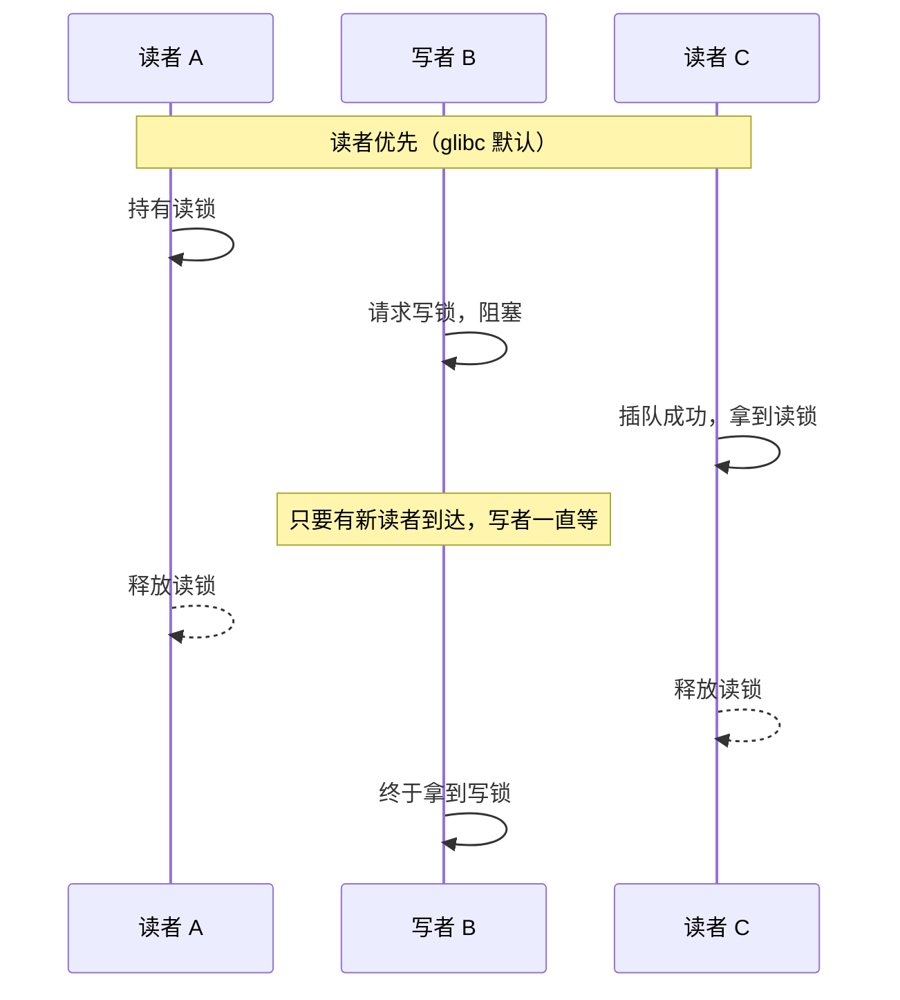

---
tags:
  - 基本功/系统
  - 基本功/并发
---

# 死锁与锁策略

互斥量怎么实现、条件变量怎么唤醒、原子操作与内存序怎么保证可见性，属于同步原语本身，已经写在 [[07-多线程与并发]] 里。本篇换一个角度：**锁有哪些种类、每一类在什么条件下合适**，以及**多把锁凑在一起时死锁怎么发生、怎么查出来、怎么从结构上避免**。前者回答选型，后者回答故障。两者共用同一套底层：用户态的互斥锁、读写锁、条件变量在 Linux 上都建立在 `futex` 之上；`pthread_spin_lock` 是例外，它靠 x86 的 `pause`、Arm 的 `ldaxr`/`stxr` 一类原子指令在用户态忙等，不睡眠也不进内核。死锁则是这套机制在「一个人同时要两把锁」时暴露出的结构性缺陷。

本篇的行为以 POSIX (`pthread`) 与 Linux 内核文档为准，参数默认值取自内核 Kconfig、内核 `Documentation/`、glibc 手册与 man-pages。源码与文档各条列在文末的参考一节。

## 1 锁的三种等待方式与选型维度

选锁要看的量有三个：**冲突概率**（同一时刻有多少线程想进同一段临界区）、**临界区长度**（持锁期间要执行多少条指令、有没有系统调用或 I/O）、**可用核数**（拿锁失败后有没有别的核能继续推进）。拿锁失败时做什么，据此分成三类：

```text
   三种等待方式：拿不到锁时做什么

   ┌───────────────┬────────────────┬────────────────────┐
   │ 阻塞（互斥量） │ 忙等（自旋锁）  │ 无锁（乐观重试）    │
   ├───────────────┼────────────────┼────────────────────┤
   │ 睡眠，让出 CPU │ 占着 CPU 反复试 │ 不等待，先做后校验  │
   │ 唤醒由内核负责  │ 锁一释放就拿到  │ 冲突就整段重做      │
   │ 两次上下文切换  │ 白烧一个核      │ 重做成本可能很高    │
   └───────────────┴────────────────┴────────────────────┘
        ▲                ▲                 ▲
        │                │                 │
   冲突多、临界区长   冲突多、临界区极短   冲突极少
```

三类的取舍是耦合的，不能单独看：临界区短时阻塞的唤醒开销可能超过临界区本身，临界区长时忙等会把一个核白白烧掉，冲突一旦变多乐观重试的代价会指数上升。后面的每一节都在回答「给定这三个量，该落哪一类」，以及对应该类里的哪一个具体实现。

按内核文档对锁的分类，可以先把位置摆正（来源：Linux Kernel Documentation/locking/locktypes.rst）：

- **睡眠锁**（sleeping locks）：`mutex`、`rt_mutex`、`semaphore`、`rw_semaphore`、`ww_mutex`、`percpu_rw_semaphore`。只能在可抢占的任务上下文获取，持有期间可以睡眠。
- **自旋锁**（spinning locks）：`raw_spinlock_t`、`bit spinlocks`；在非 `PREEMPT_RT` 内核上 `spinlock_t`、`rwlock_t` 也属此类。自旋锁隐式关闭抢占，持有期间不能睡眠。
- **CPU 本地锁**（CPU local locks）：`local_lock`，只是免抢占或关中断的包装，管的是本核内的并发，不是跨核互斥。

用户态的对应关系是：`pthread_mutex` 对应睡眠锁，`pthread_spinlock` 对应自旋锁，`pthread_rwlock` 是读写锁，而乐观锁在用户态没有独立的内核对象，靠一条原子指令完成。

## 2 互斥锁与自旋锁

### 2.1 阻塞式等待与忙等的成本结构对照

互斥锁在无竞争时加锁只是用户态的一次原子比较交换，快路径不进入内核。一旦发现锁被别的线程持有，glibc 的 `pthread_mutex_lock` 会先把当前线程挂到锁的等待队列，再调用 `futex_wait` 让内核把线程睡眠；解锁方在释放锁时调用 `futex_wake` 把它唤醒。这条路径上有两次线程状态切换（运行 → 睡眠、睡眠 → 就绪），还有两次系统调用，代价远高于一次用户态 CAS（来源：man 7 futex）。

```text
   加锁失败后的两条路径

   互斥锁（阻塞）                          自旋锁（忙等）
   ─────────────────                       ─────────────────
   用户态 CAS 失败                          用户态 CAS 失败
        │                                        │
        ▼                                        ▼
   入等待队列，调 futex_wait                不睡眠，循环重试 CAS
        │                                        │
        ▼                                        ▼
   线程睡眠、让出 CPU                      锁释放瞬间立即成功
        │                                   （无系统调用、无调度）
        ▼
   解锁方 futex_wake 唤醒
        │
        ▼
   两次状态切换 + 两次系统调用
```

阻塞式等待的成本与「等多久」无关：只要睡眠一次，那两次切换就付出去了。临界区很短时会出现一个反常结果——唤醒的开销比被保护的代码还贵。

自旋锁把这段开销换成忙等。`pthread_spin_lock` 用一个原子指令反复试同一个缓存行，锁释放后该缓存行因缓存一致性协议失效，试锁的核会立刻看到新值并成功，全程不进内核。代价是自旋期间该核什么也做不了，等于占用一个处理器。

把两者的成本对到同一把尺子上：

| 条件 | 选互斥锁 | 选自旋锁 |
| --- | --- | --- |
| 临界区长度 | 长，或含系统调用、内存分配、I/O | 极短，几条指令，绝不含可能睡眠的调用 |
| 冲突概率 | 高（至少有一个等待者会睡够一次） | 高但持锁时间极短，等待窗口小于调度开销 |
| 处理器核数 | 少核也成立 | 必须有其他核能在自旋期间释放锁 |
| 线程优先级 | 无特殊要求 | 不能有「低优先级持锁、高优先级自旋」的同核场景 |

判断标准是**临界区长度与「两次上下文切换 + 两次系统调用」的比较**：临界区短于这个开销时自旋更划算，长于它时睡眠更划算。核数决定的是自旋有没有意义——等待期间必须有别的核在跑持锁线程，锁才会被释放。

这个比较可以写成一条不等式：设临界区耗时为 `C`，一次睡眠—唤醒往返的总开销为 `W`（两次系统调用加两次状态切换），自旋更优的条件是 `C < W`。把 `C` 估错一个数量级，选型就会翻转——一段代码在开发机上只跑几条指令，数据量变大、分支变多后可能膨胀到几十微秒，原本合适的自旋锁就成了烧核。

### 2.2 单核抢占、内核态与用户态自旋锁的边界

单个处理器上自旋永远等不到结果：自旋线程不放弃 CPU，持锁线程就没机会被调度上去释放锁，两者会一直僵住。要让它在单核上不出错，只能让持锁线程无法被抢占——自旋锁因此隐式关闭抢占（来源：Linux Kernel Documentation/locking/locktypes.rst 中「Spinning locks implicitly disable preemption」），内核里 `spin_lock` 的临界区不允许主动睡眠。

内核对自旋锁和用户态自旋锁面对的「打断源」不同，这决定了各自能放进临界区的东西：

- **内核态自旋锁**要面对中断。中断随时可能在持锁期间插入并试图获取同一把锁，造成同核自锁；所以内核提供了 `_bh()`、`_irq()`、`_irqsave()` 等后缀来关软中断或硬中断，把这段窗口锁死（来源：Linux Kernel Documentation/locking/locktypes.rst）。持锁期间禁止睡眠是内核代码的硬约束。
- **用户态自旋锁**面对的是调度器。线程可以被抢占，持锁线程被换下后，自旋者只能空转，等待时间因此被调度时间片放大。用户态还有一种内核里没有的打断源：**信号处理函数**——它在同一个线程的上下文里异步执行，被中断的代码若正持有某把自旋锁，而处理函数又去拿同一把锁，就会在同线程上自锁。

这条差别决定了选型边界：内核里凡是可能睡眠的操作（分配内存、拷贝用户数据、等 I/O）都不能放进自旋锁临界区，只能用睡眠锁；用户态则默认优先用睡眠锁，只有在临界区确定极短时才考虑自旋。

### 2.3 自适应自旋与 PTHREAD_MUTEX_ADAPTIVE_NP

纯阻塞与纯自旋之间有一档折中：加锁失败先自旋有限次，还拿不到才进内核睡眠。glibc 把它做成一个显式的互斥锁类型 `PTHREAD_MUTEX_ADAPTIVE_NP`，自旋次数的上限由可调项 `glibc.pthread.mutex_spin_count` 控制，默认 100；该值同时作用于 `pthread_mutex_lock` 与 `pthread_mutex_timedlock`，线程一直自旋到拿到锁或达到次数上限（来源：GNU C Library Manual, POSIX Thread Tunables）。

```text
   自适应自旋：一次加锁的完整路径

   pthread_mutex_lock
        │
        ▼
   ┌─────────────────────────┐
   │ 用户态 CAS（快路径）      │──成功──▶ 返回，0 次系统调用
   └───────────┬─────────────┘
               │ 失败
               ▼
   ┌─────────────────────────┐
   │ 自旋 ≤ mutex_spin_count  │──成功──▶ 返回
   └───────────┬─────────────┘  (默认 100 次)
               │ 仍失败
               ▼
   futex_wait 睡眠，等解锁方 futex_wake
```

类型常量的对应关系上，NPTL 里 `PTHREAD_MUTEX_DEFAULT` 与 `PTHREAD_MUTEX_NORMAL`、`PTHREAD_MUTEX_TIMED_NP` 取同一值，即默认类型本身已带一次用户态快路径；`PTHREAD_MUTEX_RECURSIVE`、`PTHREAD_MUTEX_ERRORCHECK` 是在此之上增加可重入计数或死锁检测（来源：glibc 头文件 `pthread.h`）。自适应类型的价值在于把「自旋 100 次」的窗口覆盖掉最常见的短冲突，超过窗口的长时间竞争交给内核睡眠，避免把核烧穿。

自适应自旋的窗口是一条经验权衡：窗口太短，短冲突还没结束就睡了，白付一次上下文切换；窗口太长，等长时间的锁会白白占用 CPU。100 次对准的是「持锁方在另一次调度间隔内跑完」的场景——等待者自旋的时间落在对方时间片内，对方被换下前大概率已释放。临界区长度随负载变化时，固定的 100 次未必是当次负载下的最优窗口，所以它被做成可调项。

### 2.4 futex：用户态锁的底座

`futex`（fast userspace mutex）是 Linux 上 `pthread_mutex`、`pthread_cond`、`pthread_rwlock` 共用的一块 4 字节对齐整数 + 一组系统调用的组合。它的设计目标是把「无竞争」和「有竞争」分成两条完全不同的路径（来源：man 7 futex）：

- **无竞争**：操作完全在用户态用原子指令完成，内核不参与。加锁是一次 CAS，解锁把计数器置回，再检查有没有等待者。
- **有竞争**：用户态发现计数器为负（有等待者），才调用 `futex_wait` 让内核挂起自己；解锁方在置位后调用 `futex_wake` 唤醒等待者。

man 页的原话是「Futex operation occurs entirely in user space for the noncontended case. The kernel is involved only to arbitrate the contended case.」这正好回答了「为什么 `pthread_mutex` 在无竞争时几乎和裸原子操作一样快」——因为它确实没有走系统调用。

```text
   futex 的两条路径

   无竞争（应尽力覆盖）              有竞争（内核仲裁）
   ────────────────────             ─────────────────────
   lock:  CAS(0 → 1) 成功            lock:  CAS 失败 / 计数为负
              │                              │
              ▼                              ▼
         直接返回，0 系统调用           futex_wait(addr, val) 睡眠
   unlock: 置 0                             │
              │                              ▼
          无等待者，直接返回          unlock: 置位 + futex_wake
```

**futex 的系统调用集合。** 内核只提供少量原语，剩下的语义由用户态拼出来（来源：man 7 futex）：

| 操作 | 语义 |
| --- | --- |
| `FUTEX_WAIT` | **原子地**校验 `uaddr` 处的值仍等于 `val`，相等则睡眠；不等则立即返回 `EAGAIN` |
| `FUTEX_WAKE` | 唤醒至多 `val` 个等待者 |
| `FUTEX_REQUEUE` / `FUTEX_CMP_REQUEUE` | 把等待者从一把 futex 搬到另一把，条件变量广播时避免惊群 |
| `FUTEX_LOCK_PI` / `FUTEX_UNLOCK_PI` | 优先级继承（priority inheritance）版本，用于实时互斥量 |
| `FUTEX_PRIVATE_FLAG` | 前缀标志；进程私有锁用 `FUTEX_WAIT_PRIVATE` / `FUTEX_WAKE_PRIVATE`，跳过内核的共享内存检查 |

`FUTEX_WAIT` 的「原子校验」是这套机制的关键。解锁方先改 futex 字、再发 `FUTEX_WAKE`；加锁失败的线程先读 futex 字、再调 `FUTEX_WAIT`。这两步之间若没有原子性，就会出现「加锁方读到锁已占用、随后才睡下，而解锁方的 wake 已经发完」的丢唤醒（lost wakeup），线程永久睡死。内核把「校验 + 入睡」做成一个不可分割的动作，读到值已被改掉就返回 `EAGAIN` 让用户态重试（来源：man 7 futex，`FUTEX_WAIT` 条目）。

glibc 的互斥量把 futex 字用成三值状态：`0` 表示未加锁，`1` 表示已加锁、没有等待者，`2` 表示已加锁、有等待者。加锁路径发现值是 `2` 或 CAS 失败就进入 `__lll_lock_wait`；解锁路径只有看到值可能为 `2` 时才调 `FUTEX_WAKE`，值仍是 `1` 就直接置 `0` 返回，省掉一次系统调用。这也解释了 §8.2 里 `gdb` 打印锁对象时看到的 `__lock = 2`——它记录的是竞争状态（有人正在等这把锁），与锁的持有计数无关。

`futex` 语义在 Linux 2.5.40 起定型，早期 2.5.7 引入的版本语义不同（来源：man 7 futex）。理解它对排查也有用：一个卡在 `futex_wait` 的线程，`pstack` 里会显示为 `__lll_lock_wait` / `futex_wait`，这正是判断「它是在等锁而不是在算」的直接线索（见 §8.2）。

## 3 读写锁

### 3.1 读写规则、三种状态与读者/写者优先

读写锁把「读」和「写」分开对待：读操作之间不改变数据，可以并发；写操作会破坏一致性，必须独占。它的状态与规则因此比互斥锁多一层：

- **读锁共享**：写锁未被持有时，多个线程可以同时持有读锁。
- **写锁独占**：同一时刻只能有一个线程持有写锁。
- **读写互斥**：只要写锁被持有（或正在等待），读锁与写锁都不能与它同时成立。

把三条规则展开成状态机，任意时刻锁处于三态之一：无锁、已加读锁（可能多个读者）、已加写锁（唯一写者）。加锁的判定是：加读锁时若处于已加写锁态则阻塞；加写锁时只有无锁态能成功，其余都阻塞；解锁把状态还原。

读写锁的收益在**读多写少**时才成立：只有读操作足够多，多个读者并行带来的吞吐增量才能盖过它比互斥锁多出的状态维护与判定开销。读比例不高时，读写锁会比互斥锁更慢，因为每次加解锁都要多走一层判断。

读写锁还必须回答一个排队问题：一个写者在等锁，此时又有新的读者到达，要不要让新读者插队？两种策略对应两个极端：

- **读者优先**：新读者直接越过排队的写者，只要还有读者在读，写者就一直拿不到写锁——写者被饿死。
- **写者优先**：写者在等锁期间，新到达的读者被阻塞，等已有读者全部退出后写者立刻拿到写锁——读者可能被饿死。

glibc 的默认值是读者优先，`pthread_rwlockattr_setkind_np` 的文档写明默认类型 `PTHREAD_RWLOCK_PREFER_READER_NP`「implies that the reader will receive the requested lock, even if a writer is waiting. As long as there are readers, the writer will be starved」（来源：man 3 pthread_rwlockattr_setkind_np）。写者优先对应 `PTHREAD_RWLOCK_PREFER_WRITER_NP`，但 glibc **忽略**这个值，因为它与 POSIX 要求的递归读锁组合会产生平凡死锁；glibc 要求改用 `PTHREAD_RWLOCK_PREFER_WRITER_NONRECURSIVE_NP`，前提是应用不递归地加读锁（来源：同上）。



**公平读写锁**折中两端：用队列把请求者按到达顺序排队，读者仍可并发，但锁一空闲就交给队首的请求者。这样写者不会因为源源不断的读者而无限等待，读者也不会因为源源不断的写者而饿死。代价是队列本身要维护，且「按到达顺序」意味着短暂的读者并发会退化为串行——公平性是拿一点吞吐换来的。

### 3.2 Linux 的 pthread_rwlock、内核 rwlock 与 seqlock

用户态用 `pthread_rwlock_t` 及其 `rdlock`/`wrlock`/`tryrdlock`/`trywrlock` 接口，底层同样落在 `futex` 上。内核里有两种读多写少的原语，用途不同：

- `rwlock_t` / `rw_semaphore`：常规读写锁，读写互斥，读者并发。
- `seqlock_t`：读写锁的一种变体，**读者无锁、写者不饥饿**。写者在临界区开头和结尾各把序号加一，读者在读之前和读之后各取一次序号：两次序号相同且为偶数说明读取期间没有写者介入，读到的是自洽的一组数据；否则重试（来源：Linux Kernel Documentation/locking/seqlock.rst）。

```text
   seqlock 的读—校验—重试协议

   写者：seq++（变奇数）──▶ 写数据 ──▶ seq++（变偶数）
   读者：s1 = seq ──▶ 读数据 ──▶ s2 = seq
          ├─ s1 == s2 且为偶数 ──▶ 数据自洽，成功返回
          └─ 否则（期间有写者介入）──▶ 从头重读

   注意：读者不阻塞写者，写者也不阻塞读者
```

seqlock 的适用边界很窄，文档列了两条硬约束：

- **读者的读—校验—重试循环里不能有会阻塞或可能被重排成无限循环的东西**。写侧临界区一旦被抢占或被读侧打断，读者会因为序号一直是奇数而自旋，实时线程甚至可能永远自旋下去（livelock）。
- **被保护的数据里不能含指针**。写者可能在读者跟随指针的瞬间把指针置为无效，读者无法安全地重试（来源：同上）。

正因为这两条限制，seqlock 适合「读多写极少、写侧极短、数据是不含指针的定长结构」的场景，例如对系统时间、`jiffies` 一类的读取；不适合保护链表或任意长度缓冲区。

## 4 乐观锁与悲观锁

### 4.1 两种心态对应的实现

前面讲的互斥锁、自旋锁、读写锁都要在访问前先加锁，它们都属于**悲观锁**：默认冲突概率高，先把资源占住再操作。**乐观锁**反过来假设冲突概率低，先完成操作，提交时再校验期间有没有别人改过，冲突就放弃并重试。

两者的实现差别落在「校验点」的位置上：

- **悲观锁**：加锁 → 读/改 → 解锁。冲突在进入临界区时就暴露，持有者独占执行。
- **乐观锁**：读版本号 → 本地改 → 提交时比对版本号，一致才写入，不一致就整段重做。全程不持有任何锁，因此也叫「无锁编程」。

在线文档是经典例子：若用悲观锁，一个用户打开文档时其他人都被挡住，体验无法接受；实际做法是允许多人同时编辑，提交时用版本号判断有没有冲突——浏览器下载文档时记下服务端返回的版本号，提交时带上它，服务端比对一致才接受，否则拒绝并让用户处理冲突（来源：HTTP 条件请求语义，`If-Match` / `ETag`，RFC 9110 §13.1.1）。Git、SVN 的分支合并用的是同一套思想：先在本地改，合并时按共同祖先做三方比对。

### 4.2 CAS 是乐观锁的硬件基石

乐观锁的「提交时校验」之所以能原子完成，靠的是处理器提供的 `CAS`（compare-and-swap，比较并交换）指令。它把「读旧值」和「写新值」合并成一条不可分割的指令：给定地址、期望值、新值，只有当前值等于期望值时才写入新值，否则什么都不做并返回失败。x86 上对应 `lock cmpxchg`，`lock` 前缀保证这条读改写是原子的，并在多核间建立必要的内存序。

```text
   一次 CAS(addr, expected, new)

   ┌──────────────────────────────────────┐
   │  if (*addr == expected) {            │   ← 读、比、写三步
   │        *addr = new;  return success; │     由硬件合成一条
   │  } else                              │     不可分割的指令
   │        return fail;                  │
   └──────────────────────────────────────┘
```

CAS 让「无锁」有了落点：加锁可以写成 `while (!CAS(&lock, 0, 1)) 自旋;`，计数可以写成 `do { old = *p; } while (!CAS(p, old, old + 1));`，乐观提交可以写成 `if (CAS(&version, v, v + 1)) 写入;`。同一条指令支撑了自旋锁、无锁数据结构和版本号校验三类用法。

硬件还提供 `xchg`（交换）原语，它无条件把新值写入并返回旧值，自旋锁的某些实现只用它一条即可完成加锁。

### 4.3 ABA 问题与版本号

CAS 只比较**值**，不关心这个值是怎么变回来的。线程 A 读到 `x = 1`，准备 `CAS(1 → 3)`；在 A 执行 CAS 之前，线程 B 把 `x` 从 1 改成 2，又改回 1。A 的 CAS 看到当前值仍是 1，判定「没人动过」并成功——但中间其实发生过两次写入，A 基于的假设已经不成立。这就是 ABA 问题。

在链表、栈这类「按值复用节点」的结构里，ABA 会破坏正确性：节点被弹出又被重新压回，指针地址没变，CAS 误以为栈顶没动，却更新到了一个逻辑上已经作废的节点。通用解法是给引用配一个**版本号/标记**，把「值 + 版本」作为一个整体参与 CAS：

- Java 的 `AtomicStampedReference` 把引用和一个整数戳打包比较，`AtomicMarkableReference` 用一位布尔标记（来源：Oracle Java SE API 文档，`java.util.concurrent.atomic.AtomicStampedReference`）。
- 用 64 位原子量时，把高位当版本、低位当地址，或直接维护一个与之并行递增的计数器。

版本号方案把比较从「值没变」收紧到「值在第几次修改时是当前值」，让 ABA 里的两次写入在版本维度上留下痕迹，CAS 因此能识别出来。

版本号不是万能的，它有宽度上限。若版本字段只有 16 位，那么同一地址被改满 65,536 次后版本回绕，一段恰好跨越回绕点的 ABA 仍会被漏过。长跑系统里这会从「理论问题」变成「迟早问题」，选版本宽度时要按「每秒该变量的修改次数 × 期望无重启运行时间」估算。

### 4.4 冲突概率区间与重试风暴

两类锁各自适合的冲突概率区间有明确分界：

| 冲突概率 | 悲观锁 | 乐观锁 |
| --- | --- | --- |
| 极低（几乎不撞） | 可行，但每次都要加解锁，白付开销 | 首选，一次 CAS 完成，失败重试也少 |
| 中等 | 首选，等待由内核睡眠消化 | 重试次数随冲突上升，开始吃亏 |
| 高 | 首选，串行化代价明确 | 不适用，大量重试反而更慢 |

乐观锁的失败代价是**整段重做**：一旦 CAS 失败，读—改—写要全部重来，包括之前的计算。冲突概率上升时，成功一次平均要重试的次数快速增加，CPU 空转在反复重做上，这就是**重试风暴**。

把重试次数写成式子：若每一次尝试独立的冲突概率为 `p`，那么一次尝试就成功的概率是 `1 - p`，成功所需的期望尝试次数是 `1 / (1 - p)`。`p` 从 0.1 升到 0.5，期望次数从 1.1 涨到 2；升到 0.9，期望次数是 10；`p` 逼近 1 时次数发散。这个式子是重试风暴的定量表述：冲突概率一旦越过某个区间，重试成本的上升会快过省下的加锁开销，乐观锁反而更慢。

缓解手段是退避：失败后不立即重试，而是等一小段随机时间再试，并把等待时间按指数放大——随机化是为了避免多个线程同步退避、同步重试，形成新的规律冲突。指数退避在第 `k` 次重试时把等待窗口按 `base × 2^k` 放大，并设一个上限（否则等待会指数爆炸），随机化则把窗口乘上一个 `[0, 1]` 的随机因子，把同步的线程错开。这层机制与 [[07-多线程与并发]] 里快速重试的代价是同一个道理。

因此乐观锁的适用条件是两条同时成立：**冲突概率足够低**，且**加锁本身的成本高到值得冒险**（要跨网络、要持久化、粒度天然是整份文档时）。冲突概率一高，重试成本就会盖过省下的锁开销。

## 5 各种锁的对照与选型

把前四节摊开对照，冲突行为、等待方式、适用场景、失败模式各占一列：

| 锁类型 | 冲突行为 | 等待方式 | 适用场景 | 失败模式 |
| --- | --- | --- | --- | --- |
| 互斥锁 | 全互斥 | 睡眠 + 内核唤醒 | 临界区长、冲突中高 | 持锁线程崩溃则永久占用 |
| 自旋锁 | 全互斥 | 忙等，不睡 | 临界区极短、多核 | 单核自锁、烧 CPU、优先级反转 |
| 读写锁 | 读读并发、读写/写写互斥 | 睡眠（或自旋实现） | 读远多于写 | 读者优先饿死写者 |
| 悲观锁 | 先占后做 | 由底层锁决定 | 冲突概率高 | 加解锁开销、死锁 |
| 乐观锁 | 提交时校验 | 失败重试 | 冲突极低、加锁昂贵 | 重试风暴、ABA |

按顺序问四个问题即可定位该选哪一类：

```text
   选型判据

   ① 能不能区分读和写？
        ├─ 能，且读 >> 写 ──▶ 读写锁（注意优先级设置）
        └─ 不能 ────────────▶ 下一步
   ② 冲突概率高不高？
        ├─ 极低，且加锁昂贵 ─▶ 乐观锁（配版本号，防 ABA）
        └─ 中高 ────────────▶ 下一步
   ③ 临界区有多长？
        ├─ 极短（几条指令） ─▶ 自旋锁（确认多核、临界区不睡眠）
        └─ 长 / 含系统调用 ─▶ 互斥锁
   ④ 有没有可命名的加锁顺序？
        └─ 没有 ────────────▶ 先定顺序，再谈选哪种锁（§9.1）
```

最常见的三个错误：在含 I/O 或内存分配的临界区上用自旋锁（持锁线程一旦被抢占，自旋核烧空）；用读者优先的读写锁保护「几乎不写但偶尔要全量更新」的结构（写者被永久饿死）；用乐观锁但没配版本号，于是 ABA 把校验悄悄绕过。

## 6 死锁：四个必要条件与破坏对策

### 6.1 四个必要条件与逐条破坏

**死锁**（deadlock）：一组线程各自持有一些资源、又在等待其他线程持有的资源，在没有外力介入时永远无法推进。把两个线程、两把锁摆成一个环就能看到它：线程 A 持有锁 1 等锁 2，线程 B 持有锁 2 等锁 1。

死锁发生需要四个条件同时成立，去掉任意一个它就不成立——这是本篇后半段所有对策的骨架：

```text
   死锁的四个必要条件

              ┌───────────────────┐
              │  ① 互斥            │  资源一次只能给一个线程
              └─────────┬─────────┘
                        │
                        ▼
              ┌───────────────────┐
              │  ② 持有并等待      │  拿着一个，再等另一个
              └─────────┬─────────┘
                        │
                        ▼
              ┌───────────────────┐
              │  ③ 不可剥夺        │  已持有的锁不能被抢
              └─────────┬─────────┘
                        │
                        ▼
              ┌───────────────────┐
              │  ④ 循环等待        │  等待关系连成一个环
              └─────────┬─────────┘
                        │
                        ▼
                    死锁发生
```

四个条件里，①互斥是资源的固有属性，②③④都与「怎么申请、怎么释放」有关，所以对策集中在后三条。下面逐条给出「破坏它」的办法。

**① 互斥。** 互斥说的是资源在任意时刻只能被一个线程占用。要破坏它，就得让资源本身不再需要独占：

- **把资源变成可共享的**。只读的数据加只读访问，多个线程同时读不需要互斥——这正是读写锁、`seqlock`、无锁数据结构在做的事。
- **用不可变对象**。数据一旦创建就不修改，每次「更新」产生一份新副本，读端拿老副本读，不需要锁保护写。
- **把修改收敛到单点**。用消息传递代替共享内存：数据只归一个线程所有，其他线程通过队列请求它修改，消息队列内部的同步由通道完成。

这一条在实践中破坏得最少，因为很多资源天生互斥（写磁盘、改同一个计数器）。它更多用于**减少**互斥的范围，而不是取消它。

**② 持有并等待。** 持有并等待说的是线程已经持有资源 1，又去申请资源 2 并因此阻塞，期间不释放资源 1。破坏它的办法是让「申请」不发生在「持有」期间：

- **一次性申请所有资源**：任务开始前把它会用到的锁一次性全部拿到，拿不到就一个都不拿、直接失败重试。这样不存在「拿着一个等另一个」的中间状态，但实现上要知道全部需求，且容易降低并发。
- **申请失败就释放已持有的**：申请资源 2 失败时，先把资源 1 释放掉，退回到起点重来（配合退避）。这样等待期间不持有任何资源，环就断了。

内核里的 `ww_mutex`（wound/wait mutex）是这一条的工程实现：它在申请第二把锁失败时，按「wound」策略主动让出已持有的锁，或按「wait」策略整体回退，避免出现持有并等待（来源：Linux Kernel Documentation/locking/ww-mutex-design.rst）。

**③ 不可剥夺。** 不可剥夺说的是线程已持有的锁不能被别人强行拿走。破坏它有两种方向：

- **让申请可以失败并退出**：用 `trylock` 而不是阻塞式的 `lock`，拿不到就释放已持有的锁、按退避重试。这把「无限等待」换成了「有限等待 + 回退」，也就打破了不可剥夺。
- **给等待加超时**：`pthread_mutex_timedlock` 在一段时间后返回 `ETIMEDOUT`，调用方据此放弃并释放自己持有的锁。超时的作用是把「永久等待」变成「有限等待」，属于检测型对策——它不能阻止死锁窗口出现，但能让持有者从窗口里退出来。

剥夺的代价是**可能丢工作**：被剥夺的线程必须能安全地回滚到申请前的状态，否则会留下不一致的中间态。所以这条只在「操作可从申请点重做」时可用。

前三条对策都在**申请策略**上做文章，第四条（循环等待）动的是**申请顺序**，工程上最常用——它不需要改锁的类型、不需要预知资源需求，只要有一条能写进规范的顺序约定。下面单独展开。

### 6.2 循环等待与资源有序分配

循环等待说的是等待关系连成一个环：A 等 B 持有的资源，B 等 C 持有的资源，……，最后回到 A。破坏它的办法是**给所有资源定一个全局顺序，任何线程都按同一顺序申请**。

**为什么统一顺序就必然无环。** 假设所有线程都遵守「先拿序号小的、再拿序号大的」。取环上任意一段等待边 `X 等 Y`，它意味着 `X` 已持有某资源、在等 `Y` 持有的另一资源。按约定，`Y` 持有的那把锁序号必然大于 `X` 在拿它之后已经持有的锁序号——也就是环上的序号必须一路严格增大。可环是封闭的，绕一圈必须回到起点，序号不可能既严格增大又回到原值，矛盾。于是「统一顺序」和「存在环」不能同时成立。

经典例子正是这条规则的对照：线程 A 先锁 1 再锁 2，线程 B 先锁 2 再锁 1，两者在中间点相遇，各持一把等对方。把线程 B 改成和 A 一样先锁 1 再锁 2，环就断了——B 要么在锁 1 上排队（此时 A 能顺利走完），要么在拿到锁 1 后顺次拿到锁 2。

```text
   循环等待 → 统一顺序

   死锁版（顺序相反）              修正版（顺序一致）

   A: lock(1) ──┐                  A: lock(1) ──▶ lock(2) ──▶ unlock
                ├─▶ 互相等待        B: lock(1) ──▶ lock(2) ──▶ unlock
   B: lock(2) ──┘                      ▲
        ▲                              │
        │  A 持 1 等 2                 └── 都在 1 上排队，无环
        └── B 持 2 等 1
```

这条规则的代价是：锁的编号一旦定下就很少能改，新增锁要插进序列，跨模块的锁序号需要统一的登记表。「先拿大序号再拿小序号」这类反向嵌套还必须能被检查出来，否则约定会在人员更替和模块合并中失效——落到工程上的三层做法在 §9.1 与 §10.1 展开。

## 7 死锁、活锁与饥饿

这三个词常被混在一起，它们的差别落在三个可观测的维度上：**线程处于什么状态**、**有没有在消耗 CPU**、**能不能在没有外力时自行恢复**。

| 现象 | 线程状态 | 消耗 CPU | 能否自行恢复 |
| --- | --- | --- | --- |
| 死锁 | 睡眠（等锁） | 不消耗 | 不能，必须外力介入 |
| 活锁 | 运行（反复重试） | 持续消耗 | 理论上能，实际可能永不收敛 |
| 饥饿 | 就绪/睡眠反复切换 | 不持续消耗 | 不能，除非调度或锁策略改变 |

**死锁**的线程全部睡眠在等锁上，CPU 空着，系统整体卡住。**活锁**的线程一直在跑，只是每一步都在把对方逼回起点，CPU 满载而无人推进。**饥饿**是某个线程长期拿不到资源，别的线程在正常推进，系统没卡死，只是有人被不公平对待。

活锁的典型场景是「双方都检测到冲突后主动退让」。两个人迎面走过，各自侧身让路，结果让到同一边，再让又是同一边，如此往复；写进代码就是两个线程都用 `trylock` 申请两把锁，都失败，都释放已持有的、都退避一小段再重试，重试时刻又撞在一起。破解活锁的通用手段是**引入随机性**：退避时间取随机值，或按线程标识做固定 tie-break，让两个线程在下一次尝试时不再同步。以太网 `CSMA/CD` 的二进制指数退避就是这一思路的经典实现。

饥饿则更多来自锁的排队策略：glibc 默认的读者优先读写锁会让写者在读者不断到达时无限等待（§3.1 已述），不公平的互斥量也可能让某个线程屡次被后来的线程插队。破解办法是改成公平排队（按到达顺序发锁）或给等待时间设上限。饥饿和死锁的区别在于系统还在推进，所以它不会触发看门狗，只会表现为某个请求的延迟无限增长——这类问题更难从「有没有卡死」的监控里发现，要靠**按线程统计等待时长**的指标才能看到。

三者可以用一组信号快速区分：`ps` 看线程状态（`S`/`D` 是睡眠、`R` 是运行），`top` 看整机 CPU 是否满载（满载而无人推进倾向活锁），再看请求延迟是否只有部分线程在涨（倾向饥饿）。死锁是唯一一个「CPU 不高、延迟无限、线程状态全部睡眠」的组合。

## 8 死锁的检测

### 8.1 资源分配图与环路检测

把「谁持有谁、谁在等谁」画成一张有向图，死锁就变成一个图论问题。资源分配图（resource allocation graph）有两类顶点和两类边：

```text
   资源分配图：有环 / 无环

   顶点：● 进程 P        ■ 资源 R（点 · 表示一个实例）
   边：  P ──▶ R  申请边（进程在等这个资源）
         R ──▶ P  分配边（这个实例已分给该进程）

   ① 单实例资源，含环 → 死锁       ② 多实例资源，含环 → 未必死锁
        ●P1 ──▶ ■R1                    ●P1 ──▶ ■R1  (2 个实例)
         ▲       │                       ▲       │
         │       ▼                       │       ▼
        ■R2 ◀── ●P2                    ■R2 ◀── ●P2
     环上每步都在等对方             R1 还空一个实例，别的进程可推进
```

判定规则分两种情况：

- **单实例资源**：图里出现环，当且仅当发生死锁。环直接对应「你等我、我等你」的等待链。
- **多实例资源**：环是死锁的**必要但不充分**条件。环上可能还有空闲实例供某个进程推进，推进后它释放资源，环就解开了。

多实例要判定，走**可化简性检测**：反复找一个「需求能被当前空闲实例满足」的进程，假定它顺利完成并把持有的实例全部归还，把它的边从图里删掉；如果所有进程都能被这样化简掉，说明无死锁；若化简到最后仍剩下一批进程，它们就处在死锁中。这个过程的复杂度是 `O(n²·m)`（`n` 进程、`m` 资源类别），也是后面银行家算法的基础。

用同一个环走两种资源实例数，结果完全不同：

```text
   同一个环，两种实例数

   A. 单实例：环即死锁                   B. 多实例：环可化简，无死锁

   资源 R1(1 实例) / R2(1 实例)          资源 R1(2 实例) / R2(2 实例) / R3(1 实例)
   P1 持 R1，等 R2                       P1 持 R1 一个，等 R2
   P2 持 R2，等 R1                       P2 持 R2 两个，等 R3
                                         P3 持 R3 一个，等 R1
   空闲：R1=0, R2=0                      空闲：R1=1, R2=0, R3=0
   两个进程都等不到 → 死锁              化简：
                                          ① P3 等 R1，R1 余 1 → 满足
                                             → 空闲 R1=2, R2=0, R3=1
                                          ② P2 等 R3，R3 余 1 → 满足
                                             → 空闲 R1=2, R2=2, R3=1
                                          ③ P1 等 R2，R2 余 2 → 满足 → 全划掉
                                        三个进程都能完成 → 无死锁
```

B 这一例的关键是那一个空闲的 `R1` 实例：它让 P3 先跑，环上的空闲实例随后像接力一样传下去，整条链被拆开；改成单实例后 `R1` 没有余量，P3 也卡住，就退化成 A。

落到工程上，直接画资源分配图不现实，可操作的做法是**把「锁 → 谁持有 → 谁在等」从栈里还原出来**，也就是下一节的工具路径。

### 8.2 用户态死锁的定位：pstack、gdb 与 jstack

定位死锁的动作顺序是「先确认卡住，再确认卡在锁上，最后确认互相等待」。

**第一步：确认卡住**。对怀疑的进程多次采样，看线程栈是否一直不变。`pstack <pid>` 打印进程内每个线程的调用栈；如果一个进程被采样多次，栈完全相同，说明这些线程没有在推进。

**第二步：确认卡在锁上**。栈里出现 `pthread_mutex_lock` 一类的帧，说明线程在等锁。典型的两个线程互相等待时长这样——两个业务线程的栈顶都停在等锁上：

```text
   pstack 输出：两个线程互相等待（节选）

   Thread 3 (LWP 87747):                 Thread 2 (LWP 87748):
   #0 __lll_lock_wait                    #0 __lll_lock_wait
   #1 _L_lock_829                        #1 _L_lock_829
   #2 pthread_mutex_lock                 #2 pthread_mutex_lock
   #3 threadA_proc                       #3 threadB_proc     ◀── 两个线程都困在
   #4 start_thread                       #4 start_thread         pthread_mutex_lock
   #5 clone                              #5 clone

   多个采样周期里两张栈都不变 → 不是「忙」，是在等
```

`__lll_lock_wait` 是 `futex_wait` 之上的低层等待点，它的存在把「等锁」和「在算」区分开（§2.4）。

**第三步：确认互相等待**。`pstack` 看不到「等在哪个锁对象上」，要用 `gdb` 附上去补全。一条命令就能把全部线程的栈一次打出来，比逐个 `thread N` + `bt` 快：

```text
   gdb -p <pid>
   (gdb) thread apply all bt    # 一次打印所有线程的完整调用栈，便于对比
   (gdb) frame 3                # 跳到业务帧，看它卡在哪一行
   (gdb) p mutex_A              # 打印锁对象的 __owner 字段
   (gdb) p mutex_B
```

`thread apply all bt` 的输出里，每个线程前有 `Thread N (LWP xxxx)` 标头，逐个看 `pthread_mutex_lock` 帧上方的业务帧即可判断这个线程在等哪一行、持有什么。关键是读互斥量内部的 `__owner` 字段（glibc 的 `pthread_mutex_t` 里记录持锁线程的 LWP）。若 `mutex_A` 的 `__owner` 是线程 A、`mutex_B` 的 `__owner` 是线程 B，而线程 B 正卡在等 `mutex_A`、线程 A 正卡在等 `mutex_B`，环就闭合了，可以判定死锁。这与 §2.4 里 glibc 用 `__lock = 2` 表示「有等待者」是同一份结构：`__owner` 给出持有者身份，`__lock` 给出竞争状态。

Java 程序用 JDK 自带的 `jstack`，输出里会直接给出死锁判定段：

```text
   jstack <pid> 的死锁段（节选）

   Found one Java-level deadlock:
   =============================
   "Thread-1": waiting to lock monitor 0x... (object 0xaaa), held by "Thread-0"
   "Thread-0": waiting to lock monitor 0x... (object 0xbbb), held by "Thread-1"

   Java stack information for the threads listed above:
   "Thread-1":
        - waiting to lock <0xaaa> (a java.lang.Object)
        - locked <0xbbb> (a java.lang.Object)
   "Thread-0":
        - waiting to lock <0xbbb> (a java.lang.Object)
        - locked <0xaaa> (a java.lang.Object)

   Found 1 deadlock.
```

读这段要抓三样：段首的 `Found one Java-level deadlock`（工具已经替你判定成环）、每个线程的 `waiting to lock <监视器地址>`（它在等哪把锁）、以及同一线程的 `locked <监视器地址>`（它持有哪些锁）。把 `Thread-1` 的「持 `<0xbbb>`、等 `<0xaaa>`」与 `Thread-0` 的「持 `<0xaaa>`、等 `<0xbbb>`」拼起来，环就闭合了。`jstack -l <pid>` 会额外输出锁对象的附加信息，跨线程锁依赖更完整。

**第四步：把现场留下来。** 判定之后先用 `gcore <pid>` 取核心转储，把 `jstack` 与 `pstack` 的输出存成文件，再重启——死锁的成因往往要靠事后反复读栈才能定位。

### 8.3 内核态死锁的检测

内核里持锁不放的线程通常停在 `D`（不可中断睡眠）状态，用户在 `ps` 里看到的是杀不掉的进程。可用的入口有三类：

- **`echo w > /proc/sysrq-trigger`**：转储所有处在不可中断（blocked）状态的任务（来源：Linux Kernel Documentation/admin-guide/sysrq.rst，`w` 项）。它给出的是「卡在 D 的任务清单」，配合每个任务的栈就能看出卡在哪个锁。同一份文档里的 `l` 项打印所有在线 CPU 的栈回溯，用来判断某个 CPU 是否卡在一个长循环或持锁路径里。
- **`/proc/<pid>/stack`**：打印某个任务的完整内核栈，需要在编译期开启 `CONFIG_STACKTRACE`（来源：Linux Kernel Documentation/filesystems/proc.rst 中 `stack` 项）。这是不重启就拿到内核栈的直接方法。
- **`hung_task` 检测器**：内核周期性扫描长时间处于 `D` 状态的任务，超过阈值就打印告警与栈。若配置了 lockdep，告警里还会附上该任务持有的全部锁（来源：Linux Kernel Documentation/lib/Kconfig.debug 中 `DETECT_HUNG_TASK` 的说明）。阈值的行为在 §11 展开。

`ps -eo pid,state,wchan` 是这条路的起点：`wchan` 列显示任务阻塞在哪个内核函数上（不为阻塞态时显示 `0`）（来源：同上，proc.rst 的 `wchan` 项）。看到一批进程同时卡在同一个锁函数上，再顺着 `/proc/<pid>/stack` 取出内核栈，就能定位到是哪次内核路径持锁不放。

内核态死锁与用户态死锁的排查顺序相反：用户态靠手动采样栈，内核态更依赖**看门狗自动记录**（`hung_task` 的告警自带栈与持有的锁），因为用户无法在卡死瞬间附加调试器。所以关键前置动作是提前配好 `hung_task_timeout_secs`、`watchdog_thresh` 和 `CONFIG_PROVE_LOCKING`，故障发生时才有证据可查。

## 9 死锁的避免

### 9.1 资源有序分配法与 trylock 回退

破坏循环等待和破坏不可剥夺这两条在代码里落得最实，本节给出可照抄的改法。

**资源有序分配法**（破坏循环等待）分三步：

1. 给所有会被同时持有的锁定义全局序号，序号写进文档与代码常量注释。
2. 任何线程在持有锁之后，只能再申请**序号更大**的锁；申请序号更小的锁视为违规。
3. 需要「先锁后锁」的地方，先把涉及的锁排序，再按序申请。

回看 §6.2 的 ABBA 例子：A 先 1 后 2、B 先 2 后 1。统一成「先 1 后 2」之后，B 若先到会拿到锁 1 并走完全程，A 只能在锁 1 上排队；B 若后到则在锁 1 上排队等 A。两种时序都不会出现「各持一把等对方」，环不存在。这条规则的代价是：锁的编号一旦定下就很少能改，新增锁要插进序列，跨模块的锁序号需要统一的登记表。

```text
   同一组锁，两种约定下的时序

   无顺序约定（可能死锁）           全局有序（不可能出现环）
   ──────────────────────          ────────────────────────
   A: [1]──────────[2]             A: [1]──────────[2]
   B: [2]──────────[1]             B: [1]──────────[2]
        ▲      ▲                        ▲
        └──重叠──┘                       └── 在 [1] 上排队 ──┘
   重叠区间内各持一把 → 环          重叠时后到者等 [1]，无环
```

**`trylock` + 超时回退**（破坏不可剥夺）：把阻塞式的 `lock` 换成 `trylock`，拿不到就把已持有的锁全部释放，按退避重试。等待被换成有限次尝试，线程不会无限期地停在「持有一把、等另一把」的状态里。超时版用 `pthread_mutex_timedlock`，到期返回 `ETIMEDOUT` 后同样走释放—重试路径。两条约束必须遵守：退避要随机（否则两个线程会同步重试，退化成活锁）；被回退的操作要能从申请点安全重做。

### 9.2 银行家算法与安全序列

银行家算法（banker's algorithm）把死锁避免做成一次**可分配性判定**：系统在每个时刻维护自己还空着的资源，进程申请资源时，先假装分配出去，再检查系统是否仍处于**安全状态**，安全才真正分配，不安全就让它等。所谓安全状态，是存在一个确定的执行顺序，让所有进程都能依次拿到所需资源并完成。

判定要对每个时刻算清四张数据（`m` 类资源、`n` 个进程）：`Available` 是长度 `m` 的向量，给出系统当前空闲量；`Allocation`、`Max`、`Need` 三张 `n × m` 矩阵分别是已分配量、进程声明的最大需求，以及两者之差 `Need = Max − Allocation`。

安全序列的推演规则是：反复找一个 `Need ≤ Available` 的进程，假定它完成并把 `Allocation` 整行归还（`Available += Allocation`），把该进程划掉；若所有进程都能被划掉，就存在安全序列，否则不安全。

用一个 `3` 类资源、`5` 个进程的算例走一遍（`Available` 是向量，其余三张是矩阵）：

```text
   ① Available（系统当前空闲）       资源类别 A B C

      Available = (3, 3, 2)

   ② Allocation（已分配）     ③ Max（最大需求）        ④ Need = Max − Allocation
      ──────────────────       ──────────────────      ────────────────────────
      P0   0 1 0               P0   7 5 3              P0   7 4 3
      P1   2 0 0               P1   3 2 2              P1   1 2 2   ◀── Need ≤ Available
      P2   3 0 2               P2   9 0 2              P2   6 0 0       先跑它
      P3   2 1 1               P3   2 2 2              P3   0 1 1
      P4   0 0 2               P4   4 3 3              P4   4 3 1

   推演（每步挑一个 Need ≤ Available 的进程，跑完回收它的 Allocation）：

   ① 选 P1  Need(1,2,2) ≤ (3,3,2)   → Available = (3,3,2)+(2,0,0) = (5,3,2)
   ② 选 P3  Need(0,1,1) ≤ (5,3,2)   → Available = (5,3,2)+(2,1,1) = (7,4,3)
   ③ 选 P4  Need(4,3,1) ≤ (7,4,3)   → Available = (7,4,3)+(0,0,2) = (7,4,5)
   ④ 选 P0  Need(7,4,3) ≤ (7,4,5)   → Available = (7,4,5)+(0,1,0) = (7,5,5)
   ⑤ 选 P2  Need(6,0,0) ≤ (7,5,5)   → Available = (7,5,5)+(3,0,2) = (10,5,7)

   安全序列 = ⟨P1, P3, P4, P0, P2⟩  → 当前状态安全
```

每一步都能找到满足条件的进程，五个全都划掉，所以这个状态安全，可以分配。若某一步找不到任何 `Need ≤ Available` 的进程，且仍有进程未完成，则当前状态不安全，申请应当被拒绝或推迟。算法对每次申请都要重跑一次推演，复杂度是 `O(m·n²)`（`m` 资源类别、`n` 进程）。

银行家算法在理论上给出了「永不进入死锁」的保证，工程里却罕见，原因是它的前提与真实系统对不上：

- **需要预先知道最大需求**。每个进程必须事先声明它可能申请的最大资源量。通用程序很难给出这个上界，声明偏大又会让安全判定过于保守。
- **它假设资源数量固定、进程数与需求在运行中不变**，而真实系统的进程会动态创建、锁会按需分配。
- **它偏向悲观**。为了绝对安全，即使有可用的资源，只要分配后状态「可能不安全」就推迟。这会压低并发与资源利用率。
- **开销随规模上涨**。每次申请都要重算安全序列，进程数和资源类别多时负担明显。

安全状态的严格定义仍是这个算法的价值所在——它给出了「什么叫一个状态一定不会死锁」的判据，适合用来理解安全性，而不是当线上系统的调度策略用。

工程上更常见的组合是**结构性预防 + 运行期检测**：用加锁顺序约定、`trylock`、一次性申请把死锁从结构上关掉（§9.1、§6.1），再用 `lockdep` 或运行期栈分析兜住漏网的情况（§10.2、§8.2）。

## 10 锁策略的工程落地

### 10.1 加锁顺序与锁粒度怎么落地

顺序约定要能被机器检查才有约束力，光靠口头约定会在人员更替、模块合并时失效。可落地的做法是三层：

- **文档化**：在模块的头文件或设计文档里维护一张「锁序号表」，每把锁一行，写明序号、保护范围、允许嵌套的更大序号。新增锁必须先登记。
- **代码评审**：把「持锁期间申请了更小序号的锁」列为 review 必查项。跨模块调用前先确认对方会不会回调回本模块（回调用反向顺序拿锁，是最隐蔽的环）。
- **静态检查**：对能静态识别的场景（同一函数内嵌套加锁、已知 API 的锁标注），用编译器注解或静态分析工具检查加锁序；内核里有 `lockdep` 做运行期检测（§10.2），用户态可以借助带锁序标注的 CSP/注解工具。

**锁粒度**与持有时长与顺序约定同等重要。粒度小、持有时间短，等待窗口就短，环即使出现也停留得短；粒度大、持有时间长，环一旦形成，等待时间会被持有时长放大。两条常见做法：把「取数据」与「处理数据」分开，锁只保护取数据那一步（先用锁把共享数据拷出来，解锁后再处理）；把可能阻塞的调用（I/O、分配、跨服务请求）移出临界区，避免持锁期间等待。

```text
   粒度与持有时长的取舍

   粗粒度                              细粒度
   ┌──────────────────────────┐      ┌────────┐ ┌────────┐
   │ [锁] 读 + 处理 + I/O      │      │[锁]读  │ │[锁]读  │
   └──────────────────────────┘      └────────┘ └────────┘
   等待窗口 = 整段时长                 处理与 I/O 在锁外
   并发低、死锁窗口大                   并发高、要保证顺序一致
```

细粒度把一把大锁拆成多把小锁，收益是并发上升，代价是同一组数据出现多个加锁点，可能制造更多潜在环。判断该不该拆的标准是：拆出的每把小锁是否有单一、清晰的保护对象，拆完能否继续给出一个全局加锁顺序。做不到这两点，细粒度只会把死锁从「一处大环」拆成「多处小环」。

### 10.2 lockdep：内核的锁依赖检测器

`lockdep`（runtime locking correctness validator）在运行期跟踪锁的获取顺序，用「锁类」（lock-class）而不是单个锁实例来建模：同一段代码里同一类型的所有锁实例归为一个类，它们的依赖关系只统计一次（来源：Linux Kernel Documentation/locking/lockdep-design.rst）。它维护一张依赖图，`L1 → L2` 表示「曾在持有 L1 时申请 L2」。

一旦出现 `L1 → L2` 又有 `L2 → L1`，依赖图里就有了环，lockdep 判定存在「锁反转死锁」（lock inversion deadlock）并打印一小段依赖链，同时报告这是否只是「可能」发生（因为环可能还没真的形成等待）。它检测的规则包括（来源：同上）：

- 同一个锁类不能被同一上下文获取两次（否则是自锁死锁）；
- 两把锁不能被以相反顺序获取；
- `hardirq-safe` 锁不能在持有时申请 `hardirq-unsafe` 锁（中断随时可能打断，形成环）；
- `softirq` 维度同理。

lockdep 的价值在于**在死锁真正发生之前**就报出来：它记录的是「历史上发生过的顺序」，只要所有可能成环的顺序都被走过一次，它就能给出报告，不要求真实等待发生。代价是它需要额外的内存与时间维护依赖图，且会对「合法但反向」的顺序误报，所以它主要用于开发与测试内核，而不是常驻生产。

## 11 参数与观测

这一节把前面提到的可调项逐条列出，按「默认值 → 语义 → 什么时候该改 → 改大改小的后果 → 联动 → 失败模式」六要素写齐。

**`/proc/sys/kernel/hung_task_timeout_secs`（默认 120）**
语义：一个处于 `D` 状态的任务超过这个秒数没有被调度，内核就打印告警，附带该任务的栈；阈值 `0` 表示关闭检测（来源：Linux Kernel Documentation/admin-guide/sysctl/kernel.rst）。编译期默认值来自 `DEFAULT_HUNG_TASK_TIMEOUT`，其默认是 `120`，也就是两分钟（来源：Linux Kernel Documentation/lib/Kconfig.debug）。什么时候该改：I/O 路径本来就慢（大文件、慢盘）而告警刷屏时调大；想尽早发现卡死时调小。改大的后果是卡死发现变晚，改小会把正常的慢 I/O 误判成挂起。联动：与 `hung_task_check_interval_secs` 一起决定扫描频率，与 `hung_task_panic` 一起决定发现后是否 panic。失败模式：值太小会在负载高或磁盘慢时大量误报，日志把真正的故障淹没。

**`/proc/sys/kernel/hung_task_warnings`（默认 10）**
语义：最多打印多少条挂起告警，每检测到一批就减一，减到 `0` 不再打印；`-1` 表示不限条数（来源：同上，sysctl/kernel.rst）。什么时候该改：排查期改成 `-1` 保证不漏，稳定后改回有限值避免日志被刷。改大的后果是日志量上升；改成 `0` 会静默失效，等于关掉告警输出但保留检测。联动：与 `hung_task_timeout_secs` 配合，前者控阈值、后者控输出量。

**`/proc/sys/kernel/hung_task_check_interval_secs`（默认 0）**
语义：挂起任务的检查间隔；`0` 表示用 `hung_task_timeout_secs` 作为间隔（来源：同上）。什么时候该改：需要更细粒度发现时调小到阈值以下。改小的后果是扫描更频繁、开销略增。联动：与 `hung_task_timeout_secs` 联动，间隔大于阈值时发现会滞后。

**`/proc/sys/kernel/hung_task_panic`（默认 0）**
语义：非零时，单次扫描发现达到这个数量的挂起任务就触发 kernel panic（来源：同上）。什么时候该改：对可用性有硬要求、希望卡死后自动重启的机器可以设。失败模式：设得过低会把短暂抖动升级成重启，丢现场。

**`/proc/sys/kernel/watchdog_thresh`（默认 10）**
语义：控制软/硬锁死检测的阈值频度，默认阈值 10 秒；软锁死阈值是 `2 × watchdog_thresh`；设为 `0` 关闭锁死检测（来源：同上，sysctl/kernel.rst 中 `watchdog_thresh`）。什么时候该改：自旋锁或内核循环导致的 `soft lockup` / `hard lockup` 需要更灵敏地发现时调小。改小的后果是检测更灵敏、误报概率上升。失败模式：设太小会把正常的长时间不可抢占段误判为锁死。

**`glibc.pthread.mutex_spin_count`（默认 100）**
语义：`PTHREAD_MUTEX_ADAPTIVE_NP` 类型的互斥锁在进入内核睡眠前自旋的次数上限，同时作用于 `pthread_mutex_lock` 与 `pthread_mutex_timedlock`（来源：GNU C Library Manual, POSIX Thread Tunables）。什么时候该改：临界区确实极短、冲突集中时，适当加大能减少系统调用；冲突会持续很久时加大只会白烧 CPU。联动：只对显式声明为自适应类型的互斥锁生效，普通默认类型不受影响。失败模式：在高竞争下把自旋次数设大，会让多个线程同时空转，吞吐反而下降。

**`PTHREAD_MUTEX_*` 类型属性（编译期/初始化期设置，非 sysctl）**
语义：`PTHREAD_MUTEX_DEFAULT` 在 NPTL 里等同 `PTHREAD_MUTEX_NORMAL`/`PTHREAD_MUTEX_TIMED_NP`，`PTHREAD_MUTEX_RECURSIVE` 允许同线程重复加锁并计数，`PTHREAD_MUTEX_ERRORCHECK` 在重复加锁时返回 `EDEADLK`，`PTHREAD_MUTEX_ADAPTIVE_NP` 走自适应自旋（来源：glibc 头文件 `pthread.h`；man 3 pthread_mutex_lock）。什么时候该改：需要递归调用同一把锁时用 RECURSIVE，排查自锁时用 ERRORCHECK。失败模式：`PTHREAD_MUTEX_NORMAL` 不含死锁检测，同线程二次加锁会直接自锁；把 RECURSIVE 当默认用会掩盖重复加锁的设计问题。

**`/proc/lock_stat` 与 `CONFIG_PROVE_LOCKING` / `CONFIG_LOCK_STAT`（内核编译期开关 + debugfs/procfs）**
语义：`CONFIG_PROVE_LOCKING` 打开 lockdep，运行期在依赖成环时打印报告；`CONFIG_LOCK_STAT` 额外提供锁的争用统计（来源：Linux Kernel Documentation/locking/lockdep-design.rst）。什么时候该开：开发与压测内核、需要提前暴露锁序问题的服务。失败模式：常驻生产会带来内存与时间开销，且会对「合法但反向」的顺序误报。

**cgroup v2 `pids.max` / `pids.current` / `pids.peak`（默认 `max`）**
语义：`pids.max` 是该 cgroup 及其子树能容纳的进程数硬上限，默认 `max`（不限）；`pids.current` 是当前数量；`pids.peak` 是历史峰值（来源：Linux Kernel Documentation/admin-guide/cgroup-v2.rst）。什么时候该改：给容器设进程数上限，防止线程/连接泄漏把宿主机拖垮。改小的后果：新建进程在 `fork`/`clone` 时直接返回 `-EAGAIN`，而不是阻塞（来源：同上）。联动：`pids.events` 里的 `max` 计数记录有多少次触到上限，可用来判断是否设得过紧。失败模式：把上限设得低于当前数量不会报错（组织操作不受策略阻塞），但此后任何新建都会失败，表现为服务无法创建线程。

## 12 常见故障与排查

**进程卡死怎么定位。** 先看进程状态：`ps -eo pid,state,wchan:32,cmd` 里 `S` 是睡眠、`D` 是不可中断睡眠、`R` 是运行。拿到可疑 PID 后按 §8.2 的顺序采样：多次 `pstack <pid>` 看栈是否不变，再用 `gdb -p <pid>` 配合 `thread apply all bt` 看锁的持有者；Java 用 `jstack -l`。用户态死锁的特征是所有相关线程都停在等锁上且栈不变；若栈在变，问题多半在忙等或重试，而不是死锁。

**`kill -9` 杀不掉的进程。** 进程停在 `D` 状态时，`SIGKILL` 只是被记录为「待处理信号」，内核要等该任务从内核态返回到用户态、走到信号检查点才会真正终止它。卡在不可中断的 I/O 上（磁盘故障、NFS 挂载的服务器无响应、驱动 bug）时，返回用户态的时机由那次 I/O 决定，可能永远不来，于是 `kill -9` 看上去无效。这时能做的判断是：`cat /proc/<pid>/stack` 或 `cat /proc/<pid>/wchan` 看卡在哪条内核路径，检查是不是某个存储/网络子系统的问题；恢复该子系统往往能解开这个 `D` 状态。此类场景下 `hung_task` 会在阈值后报一次告警，是重要的时间线证据（§11）。

**无响应服务的现场保留。** 服务无响应时，重启会丢掉唯一的现场。默认动作是**先抓栈再重启**：用 `gcore <pid>` 生成核心转储，用 `jstack`/`jmap` 抓 Java 现场，用 `pstack`/`gdb` 抓原生现场，把「哪个线程持哪把锁、在等哪把锁」完整留下来。抓栈只带来短暂停顿，比丢掉现场后再靠猜划算。

```text
   卡死排查顺序

   ps 看状态 ──▶ S/R 在推进？ ──是──▶ 查忙等 / 重试 / 死循环
                      │
                      否（D 或长期 S）
                      ▼
              多次 pstack，栈不变？
                      │
                      ├─ 不变且停在 lock ──▶ gdb 看 __owner，还原环
                      ├─ 不变且停在 I/O ───▶ /proc/<pid>/stack、查存储
                      └─ 在变 ────────────▶ 退避/重试逻辑，查活锁
                      ▼
              先 gcore / jstack 留现场，再重启
```

**死锁防复发。** 为防止同类问题再出现，落点还是三层：把加锁顺序写进文档与代码常量，新增锁必须登记序号；把「持锁期间加锁顺序」列入代码评审清单；对长跑服务用静态扫描或带锁序标注的分析工具持续检查，内核侧用 `lockdep`。再配合运行期的看门狗（`hung_task`、`watchdog_thresh`）和线程级等待时长指标，才能在下一次死锁从「用户报障」提前到「监控告警」。

## 相关

- [[00-系统专栏导览]] —— 本专栏的入口、边界与阅读顺序
- [[04-进程、线程与调度]] —— 锁的持有者是谁：进程、线程与上下文切换
- [[05-进程间通信]] —— 共享内存为什么必须配锁
- [[07-多线程与并发]] —— 互斥量、条件变量、原子操作与内存序的实现

## 参考

- Linux Kernel Documentation. *Lock types and their rules*. https://docs.kernel.org/locking/locktypes.html
- Linux Kernel Documentation. *Runtime locking correctness validator*. https://docs.kernel.org/locking/lockdep-design.html
- Linux Kernel Documentation. *Sequence counters and sequential locks*. https://docs.kernel.org/locking/seqlock.html
- Linux Kernel Documentation. *Wound/Wait Deadlock-Proof Mutex Design*. https://docs.kernel.org/locking/ww-mutex-design.html
- Linux Kernel Documentation. *The kernel's command-line parameters / sysctl: kernel.rst*. https://docs.kernel.org/admin-guide/sysctl/kernel.html
- Linux Kernel Documentation. *Linux Magic System Request Key Hacks*. https://docs.kernel.org/admin-guide/sysrq.html
- Linux Kernel Documentation. *The /proc Filesystem*. https://docs.kernel.org/filesystems/proc.html
- Linux Kernel Documentation. *Control Group v2*. https://docs.kernel.org/admin-guide/cgroup-v2.html
- Linux Kernel source. *lib/Kconfig.debug*. https://git.kernel.org/pub/scm/linux/kernel/git/torvalds/linux.git/tree/lib/Kconfig.debug
- Michael Kerrisk. *futex(7) — Linux manual page*. https://man7.org/linux/man-pages/man7/futex.7.html
- Michael Kerrisk. *pthread_mutexattr_setkind_np(3) — Linux manual page*. https://man7.org/linux/man-pages/man3/pthread_rwlockattr_setkind_np.3.html
- Michael Kerrisk. *pthread_mutex_init(3) — Linux manual page*. https://man7.org/linux/man-pages/man3/pthread_mutex_lock.3.html
- Free Software Foundation. *POSIX Thread Tunables*. GNU C Library Manual, https://www.gnu.org/software/libc/manual/html_node/POSIX-Thread-Tunables.html
- Free Software Foundation. *pthread.h*. GNU C Library source, https://sourceware.org/git/?p=glibc.git;a=blob;f=sysdeps/nptl/pthread.h
- IEEE. *Standard for Information Technology—Portable Operating System Interface (POSIX), pthread_mutexattr_settype*. IEEE Std 1003.1.
- Oracle. *Java SE API Specification*. https://docs.oracle.com/en/java/javase/21/docs/api/java.base/java/util/concurrent/atomic/AtomicStampedReference.html
- Internet Engineering Task Force. *RFC 9110: HTTP Semantics*. https://www.rfc-editor.org/rfc/rfc9110.html
- 小林coding. *图解系统 v1.0*. https://xiaolincoding.com/os/
