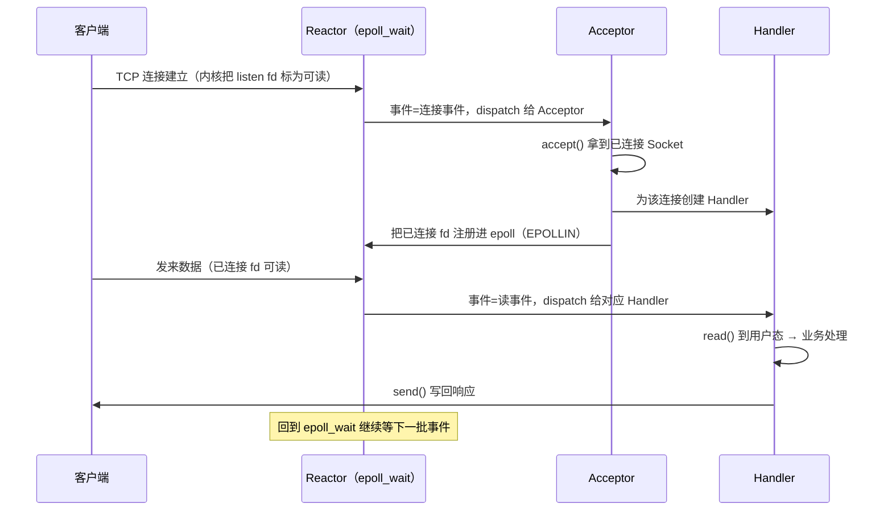

---
tags:
  - 基本功/系统
  - 基本功/操作系统
---

# IO 多路复用与 Reactor

一个 TCP 服务端要同时伺候很多客户端，这件事从「一次服务一个」走到「一套线程服务十万连接」，换掉的是三样东西：等待的连接怎么交给内核、内核把「哪些连接有事件」告诉谁、收到事件之后谁把数据搬进来。本篇按这三条线展开：

§1–§5 从阻塞式 Socket 一路讲到 `epoll` 的机制，§6–§7 讲 Reactor 与 Proactor 两种编程模型，§8 讲惊群与零拷贝配合，§9 逐条列参数，§10 给排查顺序。

机制的接口与常量以 `man` page、Linux 主线内核文档与源码为准。收发包路径（软中断、NAPI、协议栈）另有 owner，见 [[14-Linux 内核收发网络包]]；`epoll` 在 Redis 里怎么被事件库包起来，见 [[01-Redis 基础与线程模型]]。本篇只写「服务端怎么用一套线程处理海量连接」这件事本身。

## 1. 从一次服务一个客户端开始

### 1.1 最基本的 Socket 模型

两个进程要跨主机通信，各自的网络栈里得有一个可用文件描述符操作的端点，它就是 Socket。基于 TCP 的服务端调用顺序固定为 `socket` → `bind` → `listen` → `accept` → `read` / `write`，客户端是 `socket` → `connect` → `read` / `write`。

`socket(AF_INET, SOCK_STREAM, 0)` 创建端点，参数分别指定地址族（IPv4 / IPv6）、传输层协议（`SOCK_STREAM` 走 TCP，`SOCK_DGRAM` 走 UDP）和具体协议（0 表示按前两者选默认）。返回值是一个文件描述符。

`bind()` 把地址族、IP、端口绑到 Socket 上，两个字段各有分工（来源：`man 7 ip` 对 socket 地址结构的定义）：

- **绑定端口**：内核收到 TCP 报文后，按首部里的目的端口号找到对应的监听 Socket，再把连接交给它。
- **绑定 IP**：一台机器可以有多块网卡，每块网卡各有 IP。绑定某个 IP 后，内核只把到达该地址的包交给这个 Socket；绑 `0.0.0.0` 表示所有本机地址都收。

`listen()` 把 Socket 从主动连接方变成被动连接方，TCP 状态机进入 `LISTEN`。这一步在内核里为监听 Socket 建了两个队列（来源：`man 2 listen`）：

- **半连接队列**（`SYN_RECV` 队列，incomplete queue）：收到 `SYN`、回了 `SYN+ACK`、还没等到对端 `ACK` 的连接。
- **全连接队列**（accept 队列，completed queue）：三次握手完成、`ESTABLISHED`、等待应用 `accept()` 取走的连接。

`accept()` 从全连接队列头取出一个已完成握手的连接，返回一个新的文件描述符。**监听 Socket 和已连接 Socket 是两个对象**：前者只承担「发现新连接」，端口由它持有；后者承担「和这个客户端收发数据」，四元组由它持有。两者的职责在 `accept()` 前后分开。

```text
   服务端：socket() → bind() → listen() → accept() → read()/write()
                    │           │           │
                    ▼           ▼           ▼
              端点就绪    LISTEN 状态   两个队列
                        ┌──────────────┐
   SYN 到达 ──────────▶ │ 半连接队列    │  SYN_RECV，未完成握手
                        │ (SYN backlog) │
                        └──────┬───────┘
                    三次握手完成 │
                        ┌──────▼───────┐
   accept() ◀────────── │ 全连接队列    │  ESTABLISHED，等被取走
                        │ (accept 队列) │
                        └──────────────┘
                                 │
   listen fd ── accept 返回 ──▶ conn fd ── read()/write() 收发数据
```

连接建立后双方用 `read()` / `write()` 收发字节流。Linux 把 Socket 也当成文件：进程的 `task_struct` 指向文件描述符数组，下标是 fd、内容指向内核 `struct file`；Socket 文件的 `inode` 再指向内核里的 Socket 结构，其中挂着发送队列与接收队列，队列里是一个个 `struct sk_buff`。`sk_buff` 怎么在各协议层间移动数据指针、收包怎么进队列并唤醒进程，由 [[14-Linux 内核收发网络包]] 展开。

握手期间的队列长度、超时与重传由 TCP 协议规定，见 [[05-TCP 协议]]；队列溢出时的具体失败形态见 [[06-TCP 的边界与失败模式]]。

### 1.2 阻塞点在哪：`accept` 与 `read` 都阻塞

上面这套调用默认是**同步阻塞**的。Socket 创建后默认没有 `O_NONBLOCK`，于是有两个地方会让执行流挂起：

- **`accept()`**：全连接队列为空时，进程进入睡眠，直到有新连接完成握手被放进队列。
- **`read()`**：接收缓冲区为空时，进程进入睡眠，直到对端的数据到达。

这两个阻塞点决定了最基本的模型一次只能服务一个客户端：进程先 `accept()` 到连接 A，再阻塞在「读 A 的数据」上；在 A 发来数据之前，它既回不到 `accept()` 去接 B，也读不了 B。只要有一个客户端连上却不发数据，整个服务端就被它占住。

根因可以归结成一句：**执行流等待某个连接的数据时，无法同时等待别的连接**。「等待」把执行流钉在单个连接上，连接数一多就得靠加执行流来摊，这是后面所有模型都在绕的那堵墙。

### 1.3 单机连接数上限与 C10K

在改进模型之前，先算清「一台机器能挂多少连接」。一条 TCP 连接由四元组唯一确定：`{本机IP, 本机端口, 对端IP, 对端端口}`。服务端在固定端口上监听，本机 IP 与端口都是常量，能变的只有对端两个字段，于是理论上限是：

```text
   对端IP 数 × 对端端口数 = 2^32 × 2^16 = 2^48 ≈ 2.8×10^14
```

这个数是算术上的上限，实际天花板先落在两个资源上：

- **文件描述符**：每个连接占一个 fd。进程能打开的 fd 数由 `RLIMIT_NOFILE` 限制，常见软限是 1024（以 `ulimit -n` 实际读数为准），硬限通常远大于此。
- **内存**：每个连接在内核里有 Socket 结构、收发缓冲区与 `sk_buff`，用户态通常还有一份连接对象，连接数乘上单连接内存就是常驻开销。

「单机同时处理一万个请求」这个问题在 1999 年被提出来，称为 **C10K**（C 是 client 的首字母，10K 是一万）。对一个 2GB 内存、千兆网卡的服务器，若每个请求占用不到 200KB 内存和 100Kbit 带宽，硬件是够的。真正卡住 C10K 的往往是网络 I/O 模型：模型的开销随连接数增长得多快，决定了它能挂到一万还是十万。

**五种服务端模型的演进对照**

把后面几节要讲的模型按「它在哪一步被卡住」排成一条线：

```text
   模型                     一个执行流服务几个连接   下一代的动因
   ───────────────────────  ──────────────────────  ──────────────────────────
   阻塞 Socket（单连接）      1 个                    只能一对一
        │
        ▼  加执行流
   多进程（fork 每连接）      1 个（每连接一进程）     进程切换要换页表，TLB 失效
        │
        ▼  换更轻的执行流
   多线程（每连接一线程）     1 个（每连接一线程）     万级连接 = 万级线程，栈与切换
        │
        ▼  线程池复用
   线程池 + 阻塞 I/O         1 个（但线程是复用的）    等待仍占住执行流，池子大小封顶
        │
        ▼  把「等待」交出去
   I/O 多路复用              N 个（一个执行流管一批）   ← 本篇主线
```

每一代只解决上一代的那一个瓶颈，留下的问题交给下一代。

## 2. 多进程与多线程模型

### 2.1 多进程模型：每连接一个进程

最直接的加执行流方式是 `fork()`。主进程只负责 `listen()` 与 `accept()`；每 `accept()` 到一个新连接，就 `fork()` 一个子进程，把「已连接 Socket」交给子进程，由它完成这个连接的整个生命周期。

`fork()` 会复制父进程的文件描述符表，子进程因此天然持有那个已连接 Socket 的 fd，可以直接 `read()` / `write()`。两个进程按返回值区分角色：返回 0 的是子进程，返回正数（子进程 pid）的是父进程。父进程随后关掉自己那份已连接 fd 回去 `accept()`，子进程关掉监听 fd 专心服务一个客户端。**监听 Socket 归父进程，已连接 Socket 归子进程**。

子进程退出后，内核仍保留它的退出状态，直到父进程通过 `wait()` 或 `waitpid()` 收尸。若父进程一直不回收，这些子进程会变成僵尸进程并持续占用进程表项，数量累积会拖垮系统。这也让「一个连接一个进程」多了一份运维负担。进程的创建、退出与回收机制见 [[04-进程、线程与调度]]。

### 2.2 进程上下文切换的代价

进程之间切换比线程重，重在一处：**每个进程有独立的虚拟地址空间，切换时要换页表**。

CPU 执行指令时，虚拟地址要通过页表翻译成物理地址，翻译结果缓存在 **TLB**（Translation Lookaside Buffer，页表缓存）里。进程 A 的页表只映射 A 的地址空间，进程 B 的页表只映射 B 的。切换进程要把 CR3 寄存器指向新页表，旧进程的 TLB 项随之失效，新进程的翻译要从头再来。于是切换进程除了保存 / 恢复寄存器与内核栈，还要付一次地址空间切换与 TLB 失效的代价。

一万条连接就是一进程，系统里同时存在上万个进程，各有一份页表和内核栈。切换越频繁，CPU 花在「换页表、重建翻译缓存」上的时间越多，处理业务的占比越低。虚拟内存与 TLB 见 [[03-虚拟内存与页面置换]]。

### 2.3 多线程模型与线程池

线程比进程轻，轻在共享。同进程内的线程共享地址空间、文件描述符表、代码段、全局数据与堆，只有寄存器、栈、线程局部存储私有，因此线程切换不换页表、TLB 基本可保留，开销比进程切换小得多。把 §2.1 的 `fork()` 换成 `pthread_create()`，把已连接 fd 传给线程函数，就得到一连接一线程模型。

一连接一线程仍然有创建 / 销毁的开销。改进办法是**线程池**：预先建好固定数量的线程，`accept()` 到的新连接放进一个任务队列，线程池里的线程从队列取任务处理。线程不再随连接生灭，创建开销被摊掉了。

代价是队列成了共享资源：入队和出队必须加锁，否则会数据竞争。锁本身又有开销与竞争，队列长度、锁粒度、线程数都成了要调的参数。

**每连接一个执行流的共同天花板**

多进程、多线程、线程池，三代模型都保留了一个假设：**一个连接由一个执行流从头管到尾**。这个假设在万级连接下直接失效。

线程池看似把线程数压住了，但它压住的是「同时干活」的线程数，压不住「同时等待」的连接数。线程池里的线程在 `read()` 没数据时会阻塞，阻塞期间这个线程不能去处理别的连接。要同时挂住一万条连接，就得有一万个线程各自阻塞在自己的连接上——这正是线程池想避免的事。换句话说，线程池只适合「连接不多、每个连接的 `read()` 很快有数据」的场景；连接一多、活跃度一低，池子大小就成了并发连接数的事实上限。

要让「连接数」和「执行流数」解耦，就得让一个执行流不再绑定单个连接，而是同时盯着很多连接，只在内核告诉它「这些连接里有事件了」之后再动手。这就是 I/O 多路复用。

## 3. I/O 多路复用的本质

### 3.1 把「阻塞在 `read` 上」换成「阻塞在多路复用调用上」

多路复用的做法是：一个执行流不再 `read` 某一个连接，而是把「我关心哪些 fd」一次性告诉内核，再阻塞在一个系统调用上等内核返回「哪些 fd 有事件」。`select`、`poll`、`epoll_wait` 就是这个「等待多个 fd」的入口。

用一句话概括本质：**把「阻塞在单个连接的 `read` 上」换成「阻塞在一个能同时盯住全部连接的多路复用调用上」**。等待的位置从「某个连接」搬到了「一批连接」，于是等待的只有那一个执行流，连接数不再等于执行流数。

这套思路和操作系统的时分复用是同一个形状：单个 CPU 靠快速切换让多个进程看起来同时在跑，单个执行流靠快速轮转让多个连接看起来同时被服务。只要每个请求的处理时间足够短（毫秒量级以内），一秒内就能轮转上千个请求，本质是这些请求复用了同一个执行流。

一次事件循环的形状固定为四步：

```text
   ┌──────────────────────────────────────────────────────┐
   │  1. 阻塞在 epoll_wait / select，等内核返回就绪的 fd     │
   └──────────────────────────┬───────────────────────────┘
                              ▼
   ┌──────────────────────────────────────────────────────┐
   │  2. 按事件类型分发：连接事件给 accept 路径，读写给 Handler│
   └──────────────────────────┬───────────────────────────┘
                              ▼
   ┌──────────────────────────────────────────────────────┐
   │  3. read() 把数据从内核读进用户态 → 业务处理 → write()  │
   └──────────────────────────┬───────────────────────────┘
                              ▼
                    回到第 1 步，继续等
```

需要看清第 3 步：多路复用只管「知道哪个 fd 就绪」，数据在内核缓冲区与用户态之间的搬运仍由执行流自己调用 `read()` / `write()` 完成，这段搬运是同步等待的。这条边界把 Reactor 与 Proactor 分开，§7 专门讲。

**多路复用本身解决不了什么**

`epoll_wait` 返回的事件只是「可读 / 可写」的提示。Handler 里若有阻塞操作（读磁盘、调下游、算很久），执行流回不到事件循环，所有连接一起被拖住（§6.2）；`read()` / `write()` 的内核与用户态拷贝也要花 CPU，大块传输场景会用零拷贝省掉（§8.3）。

### 3.2 与「阻塞 I/O + 线程池」的取舍判据

多路复用并不是所有场景都优于线程池，判据落在「连接数与活跃度的比例」以及「单次处理里有多少阻塞」上：

| 判据 | 更适合多路复用 | 更适合阻塞 I/O + 线程池 |
| --- | --- | --- |
| 连接数 / 活跃连接数 | 比值高（大量空闲长连接） | 比值低（连接少、每连接都活跃） |
| 单次处理的阻塞占比 | 低（纯内存计算或轻量 I/O） | 高（要调数据库、读磁盘、等下游） |
| 连接生命周期 | 长（WebSocket、推送、IM） | 短（一次请求一次响应） |
| 代码复杂度 | 高（事件循环、状态机、回调） | 低（顺序代码，一读到底） |
| 典型形态 | 网关、消息推送、Redis | 传统 Web 应用、需要长事务的服务 |

两种做法也能拼起来：用多路复用统一接连接与管理连接生命周期，把「一次处理里有阻塞调用」的部分丢给线程池执行，处理完再把结果送回事件循环写回。Netty 的 `workerGroup` 与业务线程池分层就是这种组合（§6.4）。

## 4. select 与 poll

### 4.1 select：fd_set 与三笔开销

`select` 的接口是 `select(nfds, readfds, writefds, exceptfds, timeout)`。它关心的三类 fd 分别放在 `fd_set` 里，`fd_set` 是一个定长位图，第 n 位为 1 表示第 n 号 fd 被关注；`nfds` 要传「三个集合里最大 fd 号加一」，内核只检查 `0..nfds-1` 这些位（来源：`man 2 select`）。

`select` 每次调用都要付三笔开销（来源：`man 2 select`；Linux 源码 `fs/select.c` 的 `core_sys_select` 与 `do_select`）：

1. **两趟拷贝**：进入内核时把整份 `fd_set` 从用户态拷进内核（`copy_from_user`）；内核检查完后把结果就绪位置 1、其余清 0，再把整份 `fd_set` 拷回用户态（`copy_to_user`）。关注多少 fd 就拷多少位，与「有几个真的就绪」无关。
2. **内核侧线性扫描**：内核用 `do_select` 遍历 `0..nfds-1` 的每一位，逐个调用该 fd 对应文件的 `poll` 方法看是否有事件。扫描量是「最大 fd 号」，与就绪数无关。
3. **用户态再线性扫描**：`select` 返回的是「就绪个数」，调用方拿到被改写过的 `fd_set` 后，还得自己从 0 到 `nfds-1` 逐位检查一遍，才知道是哪几个 fd 就绪。

`fd_set` 的位数由 `FD_SETSIZE` 决定，Linux 上为 1024，可表示的 fd 号是 0–1023；对不小于 `FD_SETSIZE` 的 fd 执行 `FD_SET` / `FD_CLR` 属于未定义行为（来源：`man 2 select`）。该手册在 DESCRIPTION 开篇写「这是一个对现代应用来说不合理地低的上限，且这一点不会改变」，并建议改用 `poll` 或 `epoll`。

**select 的「拷贝 + 扫描」路径**

把这三笔开销画成一条路径，就能看清 `select` 的连接数上限从哪来：

```text
   用户态                                 内核态
   ┌────────────────────┐                ┌──────────────────────────┐
   │ fd_set（1024 位）   │  ① 整份拷贝 ▶  │ 复制一份 fd_set          │
   │ 关注 fd 置 1        │                │                          │
   └────────────────────┘                └────────────┬─────────────┘
                                                      ▼
                                         ┌──────────────────────────┐
                                         │ do_select 线性扫描        │
                                         │ 0..nfds-1 逐个调 poll     │
                                         │ ② 扫描量与 nfds 成正比    │
                                         └────────────┬─────────────┘
   ┌────────────────────┐  ③ 整份拷回 ◀              │
   │ 只留就绪位为 1      │                └──────────┘
   └─────────┬──────────┘
             ▼
   ┌──────────────────────────┐
   │ 用户态再逐位扫描，找就绪  │  ④ 又一次 O(nfds) 扫描
   └──────────────────────────┘
```

关键在于 ①③ 两趟拷贝和 ②④ 两次扫描的规模都由 **fd 集合大小**决定，而跟「实际有几个事件」无关。连接上万时，即使一轮只有几个连接有数据，也要把上万个 fd 位拷两遍、扫两遍，CPU 大部分时间花在「确认那些没数据的连接确实没数据」上，这就是 `select` 难以支撑 C10K 的直接原因。

### 4.2 poll：解决了上限，没解决拷贝与扫描

`poll` 把定长位图换成 `struct pollfd` 数组：

```c
struct pollfd {
    int   fd;       /* 关注的文件描述符 */
    short events;   /* 关注的事件（输入参数） */
    short revents;  /* 实际发生的事件（输出参数） */
};
```

数组长度由调用方决定，`fd` 号不再要求小于 `FD_SETSIZE`，`poll` 因此突破了 `select` 的数量上限（仍受系统级 fd 限制约束）。就绪结果写在每个元素的 `revents` 里，遍历一遍即可拿到就绪的 fd 与事件。

但 `poll` 与 `select` 在本质上是同一种做法：fd 集合是「线性结构」，每次调用都要整份拷进内核、遍历一遍、再整份拷回。**`poll` 只解决了上限，没解决拷贝与扫描**，单次调用复杂度仍是 O(n)，n 为关注的 fd 个数，连接数一上来开销同样线性增长（来源：`man 2 poll`）。

**select 的两个边界：假就绪与 `O_NONBLOCK`**

多路复用返回「可读」，并不担保紧接着的 `read()` 一定能读到数据。`man 2 select` 的 BUGS 一节写着：Linux 下 `select` 可能把一个 socket 报告为「可读」，而后继的 `read` 仍然阻塞（例如数据到达后校验和被丢弃），因此建议对不该阻塞的 socket 使用 `O_NONBLOCK`。这条边界对三种接口都成立：事件只说明「当时状态满足」，从「知道就绪」到「真正读」之间状态可能又变了；对策是把 socket 设为非阻塞，遇到假就绪时 `read()` 返回 `EAGAIN` 而不挂起执行流。

另一个边界在参数校验上：`nfds` 为负或超过 `RLIMIT_NOFILE` 时 `select` 返回 `EINVAL`（来源：`man 2 select`）。这与 `FD_SETSIZE` 是两回事——`FD_SETSIZE` 限制的是位图能表示的 fd 号范围，`RLIMIT_NOFILE` 限制的是进程 fd 上限，两个都要满足。

## 5. epoll

### 5.1 三个系统调用的分工

`epoll` 把「关注哪些 fd」和「等待就绪事件」拆成两步，靠三个系统调用协作（来源：`man 7 epoll`）：

- **`epoll_create(size)`**：创建一个 `epoll` 实例，返回一个 fd。`size` 参数在新内核里被忽略，但必须大于 0，传非法值报 `EINVAL`；`epoll_create1(flags)` 支持 `EPOLL_CLOEXEC` 等标志（来源：`man 2 epoll_create`）。
- **`epoll_ctl(epfd, op, fd, event)`**：往 `epfd` 这个实例的关注列表里增删改一个 fd。`op` 取 `EPOLL_CTL_ADD` / `EPOLL_CTL_MOD` / `EPOLL_CTL_DEL`；`event` 里带关注的事件掩码（`EPOLLIN`、`EPOLLOUT` 等）与用户数据（`data`，通常存 fd 或指针，`epoll_wait` 返回时原样带回）。
- **`epoll_wait(epfd, events, maxevents, timeout)`**：阻塞等待，返回时就绪事件被写进调用方传入的 `events` 数组，返回值为就绪个数。

关键差别：`epoll_ctl` 只在 fd 进入或离开关注列表时调用一次，之后每轮等待都不再传整个集合；`select` / `poll` 每次都把整个集合重新交代一遍。

### 5.2 内核里的红黑树与就绪链表

`epoll` 实例在内核里维护两份结构（来源：`man 7 epoll`；Linux 源码 `fs/eventpoll.c` 的 `struct eventpoll`）：

- **关注列表（interest list）**：一棵红黑树，键是「文件 + fd」这一对。`epoll_ctl` 的 `ADD` / `MOD` / `DEL` 就是在这棵树上插入、修改、删除节点，复杂度 O(log n)。
- **就绪列表（ready list，源码里叫 `rdllist`）**：一条双向链表，挂着「当前有事件」的那些 fd 对应的节点。链表的插入与摘除都是 O(1)。

```text
   epoll 实例（内核）
   ┌──────────────────────────────────────────────────────────┐
   │  关注列表 rbr（红黑树，存「正在被监控的 fd」）              │
   │            ┌──●──┐                                       │
   │         ┌──●     ●──┐                                    │
   │         ●           ●       epoll_ctl(ADD) 插入          │
   │        ┌┴┐         ┌┴┐      epoll_ctl(DEL) 删除          │
   │        ●  ●        ●  ●      复杂度 O(log n)              │
   └──────────────────────────────────────────────────────────┘
                              │  fd 就绪时，由回调把节点挂进来
                              ▼
   ┌──────────────────────────────────────────────────────────┐
   │  就绪链表 rdllist（双向链表，存「已就绪的 fd」）           │
   │   ┌────┐   ┌────┐   ┌────┐                               │
   │   │ fd │◀─▶│ fd │◀─▶│ fd │   插入 / 摘除都是 O(1)         │
   │   └────┘   └────┘   └────┘                               │
   └──────────────────────────────────────────────────────────┘
                              │
                              ▼   epoll_wait 直接摘这条链表
                    返回给用户态的事件数组
```

两份结构各管一件事：红黑树登记「监控了哪些 fd」，就绪链表记录「眼下哪些 fd 有事」。`epoll_wait` 的开销只与**就绪链表长度**相关，与注册总数无关。于是「总连接数 / 活跃连接数」越悬殊，`epoll` 相对 `select` / `poll` 的优势越大：一万条连接里只有十条活跃时，`select` 仍要扫一万个位，`epoll` 只摘十条链。

**回调机制：就绪怎么被挂进链表**

就绪链表是「被动填进去」的，靠的是内核回调。注册一个 fd 的过程分三步（来源：Linux 源码 `fs/eventpoll.c` 的 `ep_insert`）：

1. `epoll_ctl(ADD)` 进入 `ep_insert()`，为这个 fd 分配一个 `struct epitem`，插入红黑树。
2. `ep_insert` 通过 `ep_ptable_queue_proc` 在这个 fd（对应文件）的等待队列上挂一个回调 `ep_poll_callback`。这一步等价于告诉内核的文件层：「这个 fd 状态变化时，顺手回调我一下。」
3. 回调挂好后，若该 fd 当前已经就绪，立刻把它加进就绪链表并唤醒阻塞在 `epoll_wait` 上的执行流。

之后这个 fd 每次有数据到达，内核走协议栈常规的唤醒路径（例如收包完成后唤醒等待队列），顺带触发 `ep_poll_callback`，回调把对应的 `epitem` 挂进 `rdllist`，再唤醒 `epoll_wait`。**事件是推过来的，`epoll_wait` 不轮询任何东西**，这是 `epoll` 与 `select` / `poll` 在机制上的分野。

### 5.3 epoll_wait 的返回路径与「共享内存」的误传

网上有一种说法：`epoll_wait` 之所以省拷贝，是因为内核与用户态共享了就绪链表，所以零拷贝。这与源码不符。

`epoll_wait` 的实现路径是 `ep_poll()` → `ep_send_events()`：就绪链表始终在内核里，内核按 `maxevents` 把就绪事件逐个组装成 `struct epoll_event`，拷到用户态传入的 `events` 数组（走 `__put_user` 一类的写用户态操作），然后才从链表上摘除（来源：Linux 源码 `fs/eventpoll.c` 的 `ep_send_events`）。**这一次拷贝是存在的**。

被省掉的是另外两笔开销：`select` / `poll` 每次调用都要把**整个 fd 集合**拷进、扫一遍、再拷回；`epoll_wait` 只拷**就绪的那几个**事件，且注册信息早已常驻内核。差别不在「有没有拷贝」，而在「拷贝规模由谁决定」——一个由注册总数决定，一个由就绪数决定。

**LT 与 ET 的语义差别**

`epoll` 支持两种触发模式，默认是**水平触发**（level-triggered，LT）。两者对「什么时候通知」的定义不同（来源：`man 7 epoll`）：

- **LT**：只要 fd 状态仍满足条件（例如接收缓冲区还有数据没读完），每轮 `epoll_wait` 都继续返回它，直到条件不再成立。
- **ET**（edge-triggered，边缘触发）：只在状态发生「从无到有」变化时通知一次。若这一轮没读干净，后续 `epoll_wait` 不再报这个 fd，直到**新**数据到来。

用一个简单的时序看差别：对端先发 100 字节、再发 100 字节；应用第一次只读了 50 字节。

```text
   时间 ──────────────────────────────────────────────────────────▶

   对端发 100 字节      对端发 100 字节
        │                     │
        ▼                     ▼
   ─────────────── 缓冲区：100 字节 ───────────────
        │                            │
        │ 应用第一次 read 只取 50 字节 │
        ▼                            ▼
   ┌──────────────────────── 缓冲区剩 50 + 新到 100 = 150 ────────┐
   │                                                            │
   │  LT（默认）        ET                                        │
   │  下一轮 epoll_wait  │  下一轮 epoll_wait                    │
   │  仍返回该 fd  ◀─────┤  若这 100 字节是新数据到达触发 → 返回   │
   │  （因为还有 50 未读）│  （靠第二次写触发，与前 50 字节无关）   │
   │                    │                                        │
   │  剩 50 一直没读完   │  剩 50 一直没读完                       │
   │  就一直被返回       │  不再返回（没有新的边沿）→ 数据滞留      │
   └────────────────────────────────────────────────────────────┘
```

`select` / `poll` 只有 LT 一种语义：每次都重新看状态，条件还成立就继续报。`epoll` 的 LT 与 `poll` 一致，`man 7 epoll` 说「不指定 `EPOLLET` 时，`epoll` 就是一个更快的 `poll`，语义相同」。ET 是 `epoll` 独有的模式。

### 5.4 ET 的编程约束：读到 `EAGAIN`、必须非阻塞

ET 只通知一次，收到通知后必须把「当时能读的都读干净」，否则剩余数据一直躺在缓冲区里不再触发。`man 7 epoll` 给的用法是三条：

1. **fd 必须是非阻塞的**；
2. **`read` / `write` 循环到返回 `EAGAIN`（或 `EWOULDBLOCK`）为止**；
3. （对写端）同理，循环写到写不动为止。

第 1 条是第 2 条的前提。非阻塞 fd 在读空时返回 `EAGAIN`，循环据此退出；若 fd 阻塞又按 ET 循环读，读空时这个 `read` 会挂起执行流，整个事件循环被卡死。`man 7 epoll` 举过一个场景：管道写 2 KB、只读 1 KB，下一次 `epoll_wait` 就因为「没有新的边沿」而永久阻塞。

LT 下没有这个约束：没读完的 fd 下一轮还会被返回，读循环即便只读一部分也不会丢事件。代价是 LT 会为同一个 fd 多返回几次 `epoll_wait`。ET 用「更少的 `epoll_wait` 唤醒」换「更严格的读写循环」，换来更少的上下文切换开销，这也是它在高并发下更省 CPU 的原因。

ET 还有一处细节：同一个 fd 注册进多个带 `EPOLLET` 的 `epoll` 实例时，就绪只唤醒其中一个执行流（来源：`man 7 epoll`），顺带抑制了惊群（§8.1）。

**EPOLLONESHOT 的用途**

ET 下同一个 fd 也可能产生多次事件（比如数据分多块到达，每一次都可能触发），这在多线程环境里会出问题：两个线程可能同时被唤醒、同时 `read` 同一个连接，导致一个连接的数据被两个线程交错处理。

`EPOLLONESHOT` 解决这个问题。注册时带上它，`epoll` 在该 fd 上收到一次事件后，就**自动把这个 fd 从监听中禁用**，后续事件不再上报；要重新监听，必须由处理线程显式调用 `epoll_ctl(..., EPOLL_CTL_MOD, ...)` 重新武装（来源：`man 7 epoll`）。

这样就保证了「同一个 fd 在两次重新武装之间，只会被一个线程处理」。典型用法是：线程被唤醒 → 重新武装该 fd 之前先把数据读干净、业务处理完 → 处理完再 `MOD` 回去。期间即使有新数据到达，也不会再有第二个线程来抢。

### 5.5 三种接口的对照表

| 维度 | `select` | `poll` | `epoll` |
| --- | --- | --- | --- |
| fd 集合的表示 | 定长位图 `fd_set` | `struct pollfd` 数组 | 内核红黑树（登记一次） |
| fd 数量上限 | `FD_SETSIZE`，Linux 上 1024 | 无 1024 上限，受 `RLIMIT_NOFILE` | 受 `RLIMIT_NOFILE` 与 `max_user_watches` |
| 每次调用是否拷贝整个集合 | 是（进、出各一次） | 是（进、出各一次） | 否，只在 `epoll_ctl` 时动一次 |
| 找就绪 fd 的方式 | 内核扫 + 用户态再扫 | 内核扫 + 用户态再扫 | 直接摘就绪链表 |
| 单次调用复杂度 | O(nfds)，nfds 为最大 fd 号 + 1 | O(n)，n 为 fd 个数 | 取就绪 O(就绪数) |
| 触发模式 | 仅 LT | 仅 LT | LT（默认）与 ET |
| 适用连接数 | 少量连接、需全平台兜底 | 中等连接数、要可移植 | 大量连接、追求低 CPU |

一句话总结：`select` / `poll` 的开销随**注册总数**增长，`epoll` 随**就绪数**增长。选型时先量「连接总数 / 活跃连接数」，比值大时才轮到 `epoll`。

## 6. Reactor 模式

### 6.1 从多路复用到 Reactor：三个角色

§3 的事件循环是面向过程的：先调 `epoll_wait`，再按事件类型写 `if / else`，fd 状态由调用方维护。连接的增删、半包状态、写缓冲、超时这些簿记会越写越乱，Reactor 模式把它抽成对象，让使用方只面对「事件」与「处理器」。

Reactor 模式由三个角色组成（来源：Netty 官方文档 *Reactor* 一节）：

- **Reactor**：持有 `epoll` 实例，跑 `epoll_wait`，收到事件后按类型分发（dispatch）。它只负责「监听与分发」，不碰业务。
- **Acceptor**：处理「新连接到达」这一类事件，调用 `accept()` 拿到已连接 Socket，并为它创建一个 Handler，把 fd 注册回 Reactor。
- **Handler**：处理某个连接上的读 / 写事件，负责 `read` → 业务处理 → `send` 的完整流程，并维护这个连接自己的状态（读缓冲、写缓冲、半包）。

一次「客户端连接并发来数据」的完整往返：



三个角色里，Reactor 与 Acceptor 多数实现各只有一个（也有多 Reactor 的变体），Handler 一个连接一个。按「Reactor 有几个」「处理资源池有几个」两两组合有四种形态，其中三种被实际用到，下面逐一展开。

### 6.2 单 Reactor 单线程

一个执行流同时充当 Reactor 与 Handler：`epoll_wait` 返回后，连接事件自己 `accept()`，读写事件自己 `read` → 处理 → `send`。没有线程间通信，也没有共享数据要加锁，代码路径最短。

Redis 是这一模式的代表：命令执行本身是单线程的，读写与连接事件由同一个事件循环处理（见 [[01-Redis 基础与线程模型]] 的 §3），前提是每个命令都在内存里完成、耗时极短。Node.js 的 `libuv` 事件循环（Linux 下底层是 `epoll`）也是这个形状。

两个缺点直接来自「只有一个执行流」：

- **用不满多核**：整个进程只占一个核，机器再多的核也用不上；
- **Handler 会阻塞全局**：任一 Handler 里出现耗时的同步操作，事件循环在这段时间里停摆，所有连接一起被拖住。

所以它只适合业务处理极快的场景，计算密集或含阻塞调用时要换后面的形态。

### 6.3 单 Reactor 多线程

把「业务处理」挪到工作线程池，就是单 Reactor 多线程：Reactor 仍在单线程里跑 `epoll_wait` 与分发，Handler 只负责收与发——`read()` 到数据后把任务交给工作线程池，工作线程处理完把结果交回 Reactor 线程的 Handler，由它 `send()` 写回。

这样多核被业务处理利用，事件循环也不会被业务计算长时间占住。代价是多线程带来共享数据竞争：工作线程的响应要交回 Reactor 线程发送，这段传递涉及共享数据，必须加互斥锁（或改用无锁队列 + 事件通知）。

还有一个瓶颈：**Reactor 仍只有一个，且只在主线程里跑**。连接事件的 `accept()` 与所有读写事件的分发都挤在这一个执行流上，瞬时高并发时它会成为热点。多进程版（单 Reactor 多进程）看似对称，实际要额外处理父子进程双向通信、以及父进程如何知道结果该发给哪个客户端，复杂度明显更高，实践中很少见到。

### 6.4 主从 Reactor 多线程

把单 Reactor 拆成「一主多从」，就是主从 Reactor 多线程。主 Reactor（mainReactor）只监听**连接建立事件**，`accept()` 到新连接后按规则交给某个从 Reactor（subReactor）；从 Reactor 各自持有一个 `epoll` 实例，把连接注册进去，之后该连接的读写事件全由这个从 Reactor 的线程处理。

```text
   ┌────────────────────────────────────────────────────────────┐
   │  主 Reactor（mainReactor，1 个线程）                        │
   │  职责：只 accept                                             │
   │      socket() → bind() → listen() → epoll_wait             │
   │      accept() 到新连接 ──▶ 分配给某个从 Reactor             │
   └───────┬───────────────────┬───────────────────┬─────────────┘
           ▼                   ▼                   ▼
   ┌───────────────┐   ┌───────────────┐   ┌───────────────┐
   │ SubReactor 1  │   │ SubReactor 2  │   │ SubReactor N  │
   │ 自己的 epoll   │   │ 自己的 epoll   │   │ 自己的 epoll   │
   │ ├─ Handler A   │   │ ├─ Handler C   │   │ ├─ Handler E   │
   │ └─ Handler B   │   │ └─ Handler D   │   │ └─ Handler F   │
   └───────┬───────┘   └───────┬───────┘   └───────┬───────┘
           ▼                   ▼                   ▼
      客户端 A/B            客户端 C/D           客户端 E/F
```

主从分工带来两点好处：主线程只干 `accept`，连接风暴不会堵住读写事件；主线程与子线程只传「新连接」这一个方向的数据，子线程处理完直接写回客户端，交互比单 Reactor 多线程简单。Netty 的 `bossGroup` / `workerGroup` 就是这个结构（来源：Netty 官方文档 *Netty 的线程模型*）。

Nginx 的形态相近但有差异：主进程只做初始化，不 `accept`；多个 worker 进程各自监听同一端口、各自 `accept`，用一把 accept 互斥锁限制同一时刻只有一个 worker 在 `accept`，避免被同一个连接同时唤醒（§8.2）。worker `accept` 到新连接后自己处理，不再转交。进程与线程的选择取决于语言与平台：Java 生态多用线程（Netty），C 生态两者都有。

**三种 Reactor 方案的对照**

| 方案 | Reactor 数 | 业务在哪里跑 | 优点 | 缺点 | 典型实现 |
| --- | --- | --- | --- | --- | --- |
| 单 Reactor 单线程 | 1 | 同一线程 | 无锁、无跨线程通信 | 用不满多核、Handler 阻塞全局 | Redis、Node.js |
| 单 Reactor 多线程 | 1 | 工作线程池 | 业务用上多核 | Reactor 单点、共享数据要加锁 | 早期 Netty 变体、部分网关 |
| 主从 Reactor 多线程 | 多个 | 从 Reactor 线程 | 分工清晰、accept 不堵读写 | 实现较复杂、连接分配要策略 | Netty、Memcached |

演进的逻辑很清楚：每多一层 Reactor 或资源池，就多解决一个瓶颈，也多一层并发复杂度。选型时先判断瓶颈落在哪——用不满多核就往业务侧加线程，`accept` 或分发成热点就往 Reactor 侧加 Reactor；连接数不大、业务又轻时，单 Reactor 单线程最简单也最不容易出错。

## 7. Proactor 与异步 I/O

### 7.1 就绪通知与完成通知

Reactor 与 Proactor 的分界，在于**内核通知的是「可以读」还是「已经读完」，以及数据由谁从内核搬到用户态**。

Reactor 是**就绪通知**：内核告诉应用「这个 fd 现在可读」，应用自己发起 `read()`，内核把数据从内核缓冲区拷到应用提供的缓冲区，`read()` 返回时数据才算到手。搬运发生在应用发起的系统调用里，应用要等它完成，因此 Reactor 属于「非阻塞同步」——非阻塞指发起前不用等，同步指发起后要等搬运完成。

Proactor 是**完成通知**：应用把「把数据读到这块缓冲区」的请求连同缓冲区地址交给内核，随即返回；内核在后台搬好数据后通知应用「请求完成，数据已在你的缓冲区里」。搬运由内核完成，应用不参与、不等待，这才是「异步」。

```text
   Reactor（就绪通知）                    Proactor（完成通知）

   应用              内核                 应用              内核
    │                 │                    │                 │
    │ ① 提交关心的 fd  │                    │ ① 提交读请求 +   │
    │ ───────────────▶ │                    │   缓冲区地址     │
    │                 │                    │ ───────────────▶ │
    │ ② epoll_wait    │                    │                 │ 内核自己
    │    等待「可读」  │                    │ ② 立即返回去做   │ 搬数据
    │ ◀─────────────── │                    │    别的事        │
    │ ③ read() 自己搬  │                    │                 │
    │ ───────────────▶ │ 搬数据到用户态      │                 │
    │ ④ read 返回，    │                    │ ③ 完成通知       │
    │    数据到手       │                    │ ◀─────────────── │
    │                 │                    │ ④ 直接处理缓冲区 │
                                                 里的数据
```

判据可以简化成两步：先问「内核通知的是就绪还是完成」，再问「数据搬运由谁发起」。两步都指内核的是 Proactor，都指应用的是 Reactor。这也解释了两者在接口上的差别：Reactor 里应用要自己写读循环（ET 下要读到 `EAGAIN`），Proactor 里提交请求后等完成事件即可。

### 7.2 Linux 的原生异步 I/O：libaio 的局限

Linux 长期缺少能支撑 Proactor 的异步 I/O。POSIX 定义的 AIO 接口（`aio_read`、`aio_write`）在 glibc 里靠用户态线程模拟，不是内核级异步；内核自带的 AIO（`io_submit` / `io_getevents`，常称 `libaio`）有几处硬限制（来源：Oracle Linux 官方博客 *An Introduction to the io_uring Asynchronous I/O Framework*）：

- **只支持直接 I/O**（`O_DIRECT`），不支持带页缓存的缓冲读写，绕不过对齐与块大小的约束；
- **不支持网络 socket**，只能用在文件与块设备上；
- **行为不确定，某些情况下仍会阻塞**；
- **API 开销偏高**：每笔 I/O 至少要两次系统调用（一次提交、一次等完成），提交要拷贝 64 + 8 字节、完成要拷贝 32 字节。

对网络服务端来说，最关键的一条是「不支持 socket」——异步 I/O 最大的用武之地恰恰是它覆盖不到的。这也是 Linux 上的高性能网络程序长期走 Reactor 的直接原因。

### 7.3 io_uring：把提交与完成两队列共享给用户态

`io_uring` 改变了这一点。它不再让应用每次 I/O 都陷入内核，而是在用户态与内核之间共享两个环形队列（来源：`man 2 io_uring_setup`；`man 7 io_uring`）：

- **提交队列**（submission queue，SQ）：应用把描述一次 I/O 的**提交队列项**（submission queue entry，SQE）放到队尾，写明操作码（`IORING_OP_READ`、`IORING_OP_ACCEPT` 等）、目标 fd、缓冲区地址与长度。
- **完成队列**（completion queue，CQ）：内核完成一项后，把对应的**完成队列项**（completion queue entry，CQE）放到队尾，CQE 里带回结果（传输字节数或错误码）与 SQE 里带的用户数据。提交几个 SQE，就得到几个一一对应的 CQE。

```text
   用户态                                        内核
   ┌───────────────────────────────────────────────────────────────┐
   │  共享内存（io_uring_setup 后由 mmap 映射，两个方向都在其中）   │
   │                                                               │
   │  提交队列 SQ ◀──── 应用写 SQE（生产者）                        │
   │   ┌───┬───┬───┬───┬───┬───┐      内核读 SQE（消费者）          │
   │   │   │   │   │   │   │   │ ──────────────────────────┐        │
   │   └───┴───┴───┴───┴───┴───┘                           ▼        │
   │    head ↑                    tail ↑              执行 I/O 操作   │
   │                                                       │        │
   │  完成队列 CQ                                    完成 │        │
   │   ┌───┬───┬───┬───┬───┬───┐ ◀─────────────────────────┘        │
   │   │   │   │   │   │   │   │   内核写 CQE（生产者）             │
   │   └───┴───┴───┴───┴───┴───┘   应用读 CQE（消费者）             │
   └───────────────────────────────────────────────────────────────┘
        │
        └─ IORING_SETUP_SQPOLL：起一个内核线程轮询 SQ，
           应用提交与收割 I/O 可以一次系统调用都不发
```

两个队列通过 `mmap` 映射到用户态，是单生产者单消费者、大小取 2 的幂的无锁环，靠内存屏障而非锁协调。应用默认调用 `io_uring_enter()` 通知内核「SQ 里有新条目」，也能顺便等待完成的个数；开启 `IORING_SETUP_SQPOLL` 后，内核起线程轮询 SQ，应用完全靠读写共享内存完成提交与收割，一次系统调用都不发（来源：`man 2 io_uring_setup`）。

`io_uring` 补上了 `libaio` 缺的那块：它支持 `IORING_OP_ACCEPT`、`IORING_OP_SEND`、`IORING_OP_RECV` 等网络操作，Linux 上因此有了能撑起 Proactor 的异步 I/O 底座。

**Windows IOCP**

Windows 上的对等物是 **IOCP**（I/O Completion Port，I/O 完成端口）。应用把 socket 与完成端口关联，再提交异步的 `WSARecv` / `WSASend`；内核在后台搬好数据，把完成包投递到完成端口的队列里；一组工作线程循环调用 `GetQueuedCompletionStatus()` 取完成包并处理（来源：Microsoft Win32 文档 *I/O Completion Ports*）。它从设计上就是「完成通知」模型，与 `io_uring` 的 CQ 意图一致，Windows 上写高性能网络程序可以直接用 Proactor。

### 7.4 为什么 Linux 上长期用 Reactor

三条原因叠在一起，决定了 Linux 的这段历史（来源：`man 7 epoll`；`man 2 io_uring_setup`）：

1. **原生 AIO 不支持 socket**：`libaio` 只能用于 `O_DIRECT` 文件与块设备，网络场景用它没有意义（§7.2）。
2. **`epoll` 已经把「等」的成本压得足够低**：就绪通知 + 用户态非阻塞 `read` 的组合下，读循环里绝大多数 `read` 都能立刻拿到数据，真正陷入内核等待的次数很少。就绪通知与完成通知在 CPU 开销上的差距，远不如「有没有异步 socket 支持」关键。
3. **生态惯性**：Reactor 的库（Netty、libevent、Redis 的事件循环）成熟且经过验证，迁移到 `io_uring` 要重写 I/O 层并重新验证，收益未必覆盖成本；`io_uring` 自 Linux 5.1 引入（来源同 §7.2）后逐步补齐能力，采用在推进中，但既有代码不会一夜转向。

**Reactor 与 Proactor 对照**

| 维度 | Reactor | Proactor |
| --- | --- | --- |
| 事件语义 | 就绪通知（可读 / 可写） | 完成通知（已读完 / 已写完） |
| 谁发起数据搬运 | 应用，在 `read()` / `write()` 里 | 内核，应用只提交请求与缓冲区 |
| 应用是否等待搬运 | 等待（同步），因此归为非阻塞同步 | 不等待（异步） |
| 编程模型 | 事件循环 + 状态机 + 读循环 | 提交请求 + 处理完成事件 |
| Linux 支撑 | `epoll` / `select` / `poll` | `io_uring`（`libaio` 覆盖不到 socket） |
| Windows 支撑 | `select`（`WSAEventSelect` 一类） | `IOCP` |
| 典型实现 | Netty、Nginx、Redis、Node.js | Windows IOCP、基于 `io_uring` 的服务端 |

两种模型都属于「事件分发」范式，差别只在分发的是「待完成的事件」还是「已完成的事件」。

## 8. 惊群与配合

### 8.1 epoll 惊群

多个执行流阻塞在**同一个**监听 fd 上（多进程各自 `epoll_wait` 同一个 `listen fd`，或多线程共用一个 `epoll` 实例），新连接到达时内核可能把**所有**等待者都唤醒；只有一个能 `accept()` 成功，其余醒来发现没连接可取又睡回去。这批「白醒一次」的调度开销就是**惊群**（thundering herd）。

代价分两档：并发少时只浪费几次上下文切换；连接到达率高时，每次连接都引发一轮全员唤醒，多核被无效调度占满，表现为 `sy` 占比高、`accept` 吞吐上不去。Nginx 用 `accept_mutex` 应对：多个 worker 争一把锁，拿到锁的才去 `accept`，事后释放给下一个 worker（来源：Nginx 官方文档 `accept_mutex`）。代价是 `accept` 在 worker 间串行，锁本身也有开销。

### 8.2 EPOLLEXCLUSIVE 与 SO_REUSEPORT

内核提供了两种更细粒度的办法，解决思路不同：

- **`EPOLLEXCLUSIVE`**（自 Linux 4.5）：加在 `epoll_ctl` 的 `ADD` 事件里，语义是「fd 就绪且被多个 `epoll` 实例关注时，只唤醒其中一个或一部分关注者」（来源：`man 2 epoll_ctl`）。不设它时，**所有**关注该 fd 的 `epoll` 实例都收到事件。它只能用于 `EPOLL_CTL_ADD`，用 `MOD` 会报 `EINVAL`。
- **`SO_REUSEPORT`**（自 Linux 3.9）：允许同一个地址 / 端口被多个 socket 同时 `bind`，前提是它们属于同一个有效 UID。对 TCP 而言，每个线程 / 进程各自持有一个**独立的监听 socket**，内核按四元组哈希把新连接分给其中一个监听者（来源：`man 7 socket`）。这种方式下没有共享的监听 fd，也就没有惊群。

两者对照着记：`EPOLLEXCLUSIVE` 是「共享一个 listen fd，让内核只叫醒一个」，`SO_REUSEPORT` 是「每人一个 listen fd，内核按哈希分流」。前者改动小、能沿用既有架构，后者分流更均匀，适合多进程各自为政的形态。

### 8.3 多路复用与零拷贝的配合

多路复用决定「什么时候该读」，零拷贝决定「读进来之后要不要搬到用户态」。

一个发送文件的连接，普通做法要走 `read()`（内核 → 用户）+ `write()`（用户 → 内核）两趟拷贝。改用 `sendfile()` 后，数据在内核里从文件页缓存直接送进 socket 缓冲区，不经过用户态，两趟拷贝降到一趟（配合网卡的 scatter-gather 还能再省）。Reactor 的结构不变，Handler 的工作变了：它不需要把文件读进用户态再写出去，只在「可写」事件到来时发起 `sendfile()`。`mmap`、`sendfile`、`splice` 的差别见 [[08-文件系统与 IO 栈]]。

## 9. 参数

这一节的参数都是队列上限或每用户配额，调大它们是在「多等一会儿」与「多占一点内存」之间换。动参数前先确认瓶颈真在队列上：队列满了会有对应计数器或错误码，先看到信号再动手。

**`net.core.somaxconn`**

- **默认值**：4096（Linux 5.4 起；5.4 之前为 128）（来源：Linux 内核文档 `Documentation/networking/ip-sysctl.rst`）。
- **语义**：`listen()` 的 `backlog` 参数上限，也就是该监听 Socket 的**全连接队列**（已完成三次握手、等待 `accept()`）的最大长度。应用传入的 `backlog` 若大于本值，会被静默截断到本值（来源：`man 2 listen`）。半连接队列由另一个参数 `tcp_max_syn_backlog` 管。
- **什么时候该改**：服务端出现 `TcpExtListenOverflows` / `TcpExtListenDrops` 增长，且已确认应用 `accept()` 跟得上时，说明连接到达速率短时超过队列容量。
- **改大的后果**：能顶住连接突发，减少「被丢连接」；代价是积压的连接各占一份内存与 fd。
- **改小的后果**：突发时更早开始丢新连接，客户端表现为连接被拒或超时。
- **联动**：与应用层 `listen(fd, backlog)` 一起调，否则应用传的小值会继续截断；握手阶段还受 `tcp_max_syn_backlog` 约束，半连接队列先满时改本参数无效（细节见 [[05-TCP 协议]]）。
- **失败模式**：只调大本参数而应用 `backlog` 仍小，或半连接队列太浅，都会出现「参数够大却仍在丢连接」。

**`/proc/sys/fs/epoll/max_user_watches`**

- **默认值**：可用低端内存的 1/25（4%）除以每个注册 fd 的内存开销（32 位内核约 90 字节、64 位内核约 160 字节），按**真实用户 ID** 计（来源：`man 7 epoll`，自 Linux 2.6.28 起）。
- **语义**：一个真实用户在所有 `epoll` 实例上加起来的、能被监控的 fd 总数上限。关注列表常驻内核，每个注册的 fd 在内核里占一个节点，这个参数就是给这份内核内存设的闸。
- **什么时候该改**：要把数十万条连接注册进 `epoll` 时；或遇到 `epoll_ctl()` 报 `ENOSPC` 时先确认是否撞到了它。
- **改大的后果**：能注册更多 fd，代价是内核内存占用随注册数线性增长——连接数越大，这份开销越不能忽略。
- **改小的后果**：`epoll_ctl(ADD)` 在达到配额时直接失败并返回 `-ENOSPC`（来源：Linux 源码 `fs/eventpoll.c` 的 `ep_insert`），表现为「连接还能建，但注册不进事件循环」。
- **联动**：与进程的 `RLIMIT_NOFILE`（fd 上限）配合看，`epoll` 层本身不设 1024 上限，真正的天花板通常先落在 fd 上限与内存上。
- **失败模式**：把它当成「连接数上限」是错位的——它管的是「注册进 `epoll` 的 fd 总数」，与「内核允许多少条 TCP 连接」是两回事。

**`net.ipv4.tcp_max_syn_backlog`**

- **默认值**：随机器内存变化，低内存机器最小 128，之后按内存比例增大（来源：Linux 内核文档 `Documentation/networking/ip-sysctl.rst`）。
- **语义**：半连接队列（`SYN_RECV`）的长度上限，逐监听者计；每个 `SYN_RECV` 请求套接字约消耗 304 字节内存（来源：同一文档）。
- **什么时候该改**：出现 `TCPReqQFullDrop`（半连接队列溢出）且确认不是 SYN flood 时；服务器过载时官方文档即建议增大本值。
- **联动**：与 `somaxconn` 成对看——两个队列分别在握手的前后半程；开启 `tcp_syncookies`（默认 1）后，半连接队列溢出时内核改用 cookie 而不丢弃请求。
- **失败模式**：只调 `somaxconn` 不调它，握手仍会在半连接阶段被丢，表现为客户端 `connect()` 超时重试。

**`net.ipv4.tcp_abort_on_overflow`**

- **默认值**：0（关闭）（来源：Linux 内核文档 `Documentation/networking/ip-sysctl.rst`）。
- **语义**：关闭时，全连接队列溢出后内核丢弃对端握手最后那个 `ACK`，对端以为握手未完成而重传，突发过去后连接有概率恢复；置 1 时改为直接回 `RST`。
- **什么时候该改**：只有确认监听进程**无法**通过调优变快时才置 1（官方措辞是「仅在你非常确定」）。
- **后果与失败模式**：置 1 会让突发期间到达的客户端收到 `RST`、连接被立即重置，且伤害正常客户端；默认 0 让系统在突发后自愈，代价是客户端要等一次重传超时。

## 10. 常见故障与排查

多路复用相关的故障，症状与参数几乎是一一对应的。先把症状归到「哪一层队列 / 哪一段代码」，再去看对应的计数器。

**`Connection refused` 与 `Connection reset`**

两者的区别在握手在哪一步被打断：

- **`Connection refused`**（`ECONNREFUSED`）：目标端口没有监听（进程没起、绑错地址、已退出），对端回 `RST`。先 `ss -lntp` 看端口在不在、绑在哪个地址。
- **`Connection reset`**（`ECONNRESET`）：端口在监听，连接被重置。服务端侧常见来源是全连接队列溢出且 `tcp_abort_on_overflow=1`（§9），或应用 `close()` 了一个仍有未读数据的连接；客户端侧常见是对端进程崩溃或被动关闭。

排查顺序：先在服务端 `nstat -az | grep -iE 'ListenOverflows|ListenDrops|TCPReqQFullDrop'` 看队列是否溢出，再对照 `ss -lnt` 的 `Send-Q` 列（监听 socket 的 `Send-Q` 即当前全连接队列长度）判断溢出发生在哪个队列；若两个队列都没溢出，去查应用是否在异常路径里重置连接。

**`accept` 报 `EMFILE` / `ENFILE`**

`accept()` 返回 `EMFILE` 表示进程打开的 fd 数已达 `RLIMIT_NOFILE`；`ENFILE` 表示系统级 fd 总量已达上限（来源：`man 2 accept`）。表现是「连接能建、应用却接不出来」，`ss -lnt` 的全连接队列持续堆积。

排查顺序：`ls /proc/<pid>/fd | wc -l` 看 fd 数，`cat /proc/<pid>/limits | grep 'open files'` 看软硬限，确认是否 fd 泄漏（连接关闭后没 `close()`）。只调大 `ulimit -n` 而不修泄漏只是推迟问题，`epoll` 的关注列表也会随 fd 增长占内存（§9 的 `max_user_watches`）。

**ET 模式漏读导致连接「假死」**

症状是连接不断开、也不再收数据，`ss` 里 `Recv-Q` 长期非零但应用没动静。根因是 ET 只通知一次，而读循环没读到 `EAGAIN` 就退出（§5.4），剩余数据躺在内核缓冲区里等不到新的边沿。

判据与排查：看读循环的退出条件是不是 `EAGAIN`；确认 socket 设了 `O_NONBLOCK`（阻塞 fd 上的读循环会在读空时挂住执行流，那是另一种症状——整个事件循环停摆）。改用 LT 可以立刻消掉这类问题，代价是 `epoll_wait` 唤醒次数变多。

**惊群导致多核空转**

症状是连接到达速率不高，但多核 `sy` 占比高、`accept` 吞吐上不去，`perf` 或 `strace` 能看到大量执行流在同一时刻从 `epoll_wait` 醒来又睡回去（§8.1）。

排查顺序：确认是否多个进程 / 线程监听了同一个 listen fd；多进程形态先看 `accept_mutex` 是否开启；共享 `epoll` 实例就给注册事件加 `EPOLLEXCLUSIVE`；多进程各自监听则改用 `SO_REUSEPORT`。三种办法按改动量从小到大排。

**`epoll_wait` 返回 0 但 CPU 高**

`epoll_wait` 的 `timeout` 传 0 表示「只查一次，不阻塞」，传正数表示「最多等这么多毫秒」，传 -1 表示无限等。把 `timeout` 传 0 又在外面套死循环，就成了忙轮询（busy poll）：每次调用立刻返回，CPU 被空转吃满，症状是 `epoll_wait` 调用次数极高、返回值几乎全是 0、`us`/`sy` 都很高。

排查顺序：确认 `epoll_wait` 的 `timeout` 取值；正常事件循环里无事件时应阻塞在正数或 -1 上，只有明确要做低延迟轮询时才用 0。若确需轮询（如某些交易场景），应配合 `IOPOLL` 一类的机制，并接受它带来的 CPU 占用。

**观测入口**

- **`ss`**：`ss -lnt` 看监听 socket 与 `Send-Q`（全连接队列长度）；`ss -tan state syn-recv` 看半连接队列；`ss -tan` 的 `Recv-Q` / `Send-Q` 看单连接的收发积压；`ss -s` 给各状态连接数汇总。更完整的读法见 [[10-Linux 性能观测]]。
- **`/proc/<pid>/fdinfo/<epfd>`**：列出一个 `epoll` 实例当前关注的所有 fd，每行形如 `tfd: 5 events: 1d data: ffffffffffffffff pos:0 ino:61af sdev:7`（`tfd` 目标 fd 号、`events` 关注的事件掩码、`data` 注册时的用户数据）（来源：Linux 内核文档 `Documentation/filesystems/proc.rst` 的 *Epoll files* 一节）。用它核对「应用以为注册的 fd」与「内核里实际注册的 fd」。
- **`/proc/sys/fs/epoll/max_user_watches`** 与 **`/proc/<pid>/limits`**：分别看每用户的 epoll 注册配额与进程 fd 上限，两者一起决定「能挂多少连接」的上限。

## 相关

- [[00-系统专栏导览]] —— 本专栏的入口、边界与阅读顺序
- [[08-文件系统与 IO 栈]] —— 同一条 I/O 链路的存储方向
- [[10-Linux 性能观测]] —— 这些机制出问题时该看哪些指标
- [[14-Linux 内核收发网络包]] —— 数据包到本机之后的收发路径
- [[01-Redis 基础与线程模型]] —— 单 Reactor 单线程的一个实际例子

## 参考

- Linux man-pages. *epoll(7)*. https://man7.org/linux/man-pages/man7/epoll.7.html
- Linux man-pages. *epoll_ctl(2)*. https://man7.org/linux/man-pages/man2/epoll_ctl.2.html
- Linux man-pages. *epoll_create(2)*. https://man7.org/linux/man-pages/man2/epoll_create.2.html
- Linux man-pages. *select(2)*. https://man7.org/linux/man-pages/man2/select.2.html
- Linux man-pages. *poll(2)*. https://man7.org/linux/man-pages/man2/poll.2.html
- Linux man-pages. *listen(2)*. https://man7.org/linux/man-pages/man2/listen.2.html
- Linux man-pages. *accept(2)*. https://man7.org/linux/man-pages/man2/accept.2.html
- Linux man-pages. *socket(7)*. https://man7.org/linux/man-pages/man7/socket.7.html
- Linux man-pages. *io_uring(7)*. https://man7.org/linux/man-pages/man7/io_uring.7.html
- Linux man-pages. *io_uring_setup(2)*. https://man7.org/linux/man-pages/man2/io_uring_setup.2.html
- Linux Kernel Documentation. *IP Sysctl*（somaxconn / tcp_max_syn_backlog / tcp_abort_on_overflow）. https://www.kernel.org/doc/html/latest/networking/ip-sysctl.html
- Linux Kernel Documentation. *proc*（Epoll files 一节）. https://www.kernel.org/doc/html/latest/filesystems/proc.html
- Linux kernel source. *fs/eventpoll.c*. https://git.kernel.org/pub/scm/linux/kernel/git/torvalds/linux.git/tree/fs/eventpoll.c
- Linux kernel source. *fs/select.c*. https://git.kernel.org/pub/scm/linux/kernel/git/torvalds/linux.git/tree/fs/select.c
- Netty. *Netty Documentation — Architecture*. https://netty.io/4.1/architecture.html
- Nginx. *ngx_core_module — accept_mutex*. http://nginx.org/en/docs/ngx_core_module.html
- Microsoft. *I/O Completion Ports*. https://learn.microsoft.com/en-us/windows/win32/fileio/i-o-completion-ports
- Oracle. *An Introduction to the io_uring Asynchronous I/O Framework*. https://blogs.oracle.com/linux/an-introduction-to-the-io_uring-asynchronous-io-framework
- 小林coding. *图解系统 v1.0*. https://xiaolincoding.com/os/
