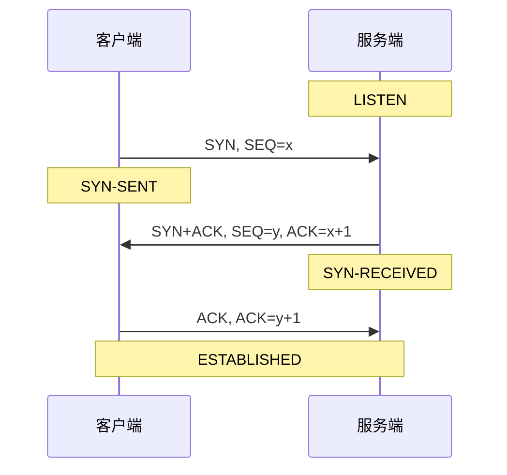
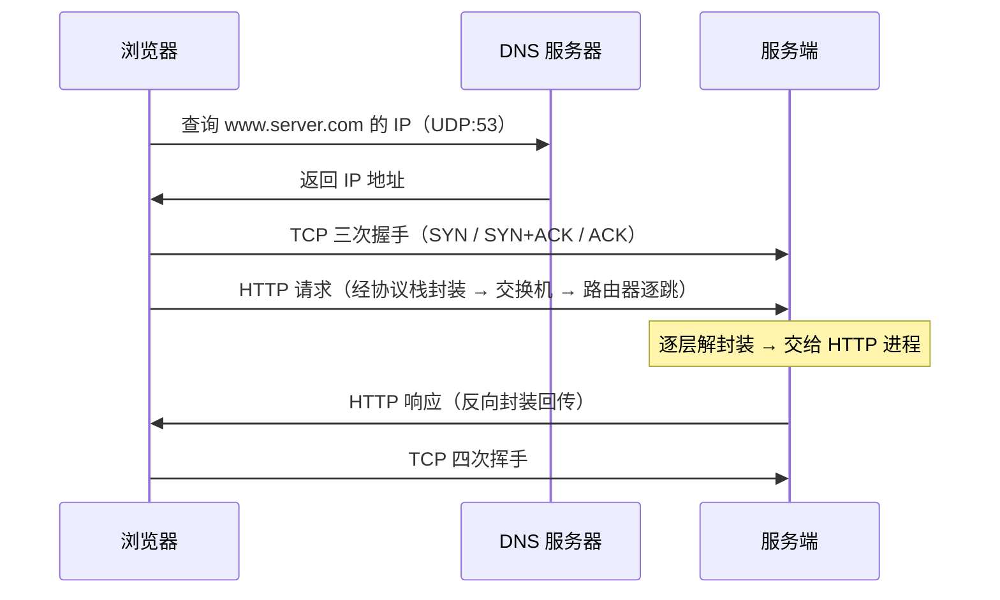

---
tags:
  - 基本功/网络
  - 基本功/网络分层
---

# 网络分层模型

网络协议栈把「一个进程把字节交给对端进程」拆成若干层，每一层只解决一类问题，只依赖下一层提供的服务。这套分层在 `TCP/IP` 里定成四层：应用层、传输层、网络层、网络接口层（来源：RFC 1122 §1.1.3）。

一个字节从浏览器发出到服务器收到，会依次经过这四层：每下一层在数据前面加上自己的首部，到对端再逐层剥掉。本专栏后面各篇讲的单个协议，其实各占这四层里的一层——本篇先把这个骨架立起来。

## 1. 为什么需要分层

### 1.1 分层换来了什么

不同设备上的进程要通信，设备形态、链路介质、应用语义各不相同。把「通信」这件事按关注点切开，得到三条收益。

**关注点分离。** 每一层只处理一类问题：应用层管「发什么」，传输层管「一个进程到另一个进程可靠不可靠」，网络层管「从哪台主机到哪台主机」，网络接口层管「相邻两个节点之间这一跳怎么传」。层内的实现不需要知道别的层在干什么。

**只依赖下一层的服务接口。** 上层调用的是下层给出的抽象服务，不关心下层的实现。`IP` 既可以跑在以太网上，也可以跑在 `WiFi`、`PPP`、`4G/5G` 上；`HTTP`、`DNS`、`SSH` 也都跑在 `TCP` 之上。接口不变，下面的实现可以整个换掉。

**某层的实现可以单独替换。** 把有线以太网换成 `WiFi`，只要网络接口层仍向上提供同样的「把包发给下一跳」服务，网络层以上的协议、代码和报文格式都不用改。这条性质也是各层能独立演进、独立排错的前提。

### 1.2 分层付出了什么

分层不是免费的，代价集中在两处。

**封装开销。** 每下一层都要在数据前加一段首部（网络接口层还要在末尾加尾部），这些字节不是用户数据。以太网 + `IPv4` + `TCP` 这条最常见的路径上，首部合计 **58 字节**（14 + 20 + 20 首部，另加 4 字节帧尾），能装的用户数据上限因此从链路层的 1500 字节降到 1460 字节。逐层的账见第 3 节。

**跨层优化被禁止。** 每层只能读自己首部里的字段，看不到上层的封装内容。路由器默认只按目的 `IP` 转发，不理会 `TCP` 端口；要根据端口做转发的设备（`NAT`、四层负载均衡）都是主动打破分层约定去读上层的字段。分层让各层解耦，也挡住了「一处同时看多层、做一个全局最优决定」的优化。

还有一处隐性重复：同一件事在多层各自实现了一遍。校验和就是例子——网络接口层用 `FCS` 做 `CRC-32` 校验、`IP` 与 `TCP` 各有一个 16 位反码和校验，三层都在查「这段数据在传输中是否损坏」。

## 2. TCP/IP 四层模型

### 2.1 逐层职责

| 层 | 职责 | 代表协议 | 运行位置 |
| --- | --- | --- | --- |
| 应用层（Application Layer） | 面向具体应用的通信语义，用户进程直接使用 | `HTTP`、`FTP`、`Telnet`、`DNS`、`SMTP`、`SSH` | 用户态 |
| 传输层（Transport Layer） | 进程到进程（端到端）的数据传输，用端口复用与分用 | `TCP`、`UDP` | 内核态 |
| 网络层（Internet Layer） | 主机到主机，负责寻址、路由与分片 | `IP`、`ICMP`、`IGMP` | 内核态 |
| 网络接口层（Link Layer） | 相邻节点之间的成帧、`MAC` 寻址、差错检测 | 以太网、`WiFi`、`PPP` | 内核态 + 网卡硬件 |

一条容易记混的界线：**应用层工作在用户态，传输层及以下工作在内核态**。进程调用 `socket` 接口，就是在这条界线上把数据交进内核的协议栈。`ARP` 在 `TCP/IP` 的划分里通常归到网络接口层，它做的 `IP` 地址到 `MAC` 地址的映射属于链路范围——具体见 [[10-以太网与 ARP]]。

### 2.2 每层的数据单元

每一层对「自己正在处理的那段数据」有一个名字，这就是 `PDU`（Protocol Data Unit，协议数据单元）：

| 层 | PDU 名称 | 中文 | 说明 |
| --- | --- | --- | --- |
| 应用层 | message | 消息 / 报文 | `HTTP` 的请求与响应报文即此 |
| 传输层 | segment | 段 | `TCP` 用 `segment`（`TCP` 段，RFC 793 起的规范用词） |
| 传输层 | datagram | 数据报 | `UDP` 的 PDU 叫 `datagram`（见 RFC 768） |
| 网络层 | packet / datagram | 包 / 数据报 | `IP` 的 PDU 常称为 `IP` 包或 IP 数据报 |
| 网络接口层 | frame | 帧 | 以太网帧的载荷上限即 `MTU` |

这些名字只是描述「加上某一层首部之后的那段数据」，彼此没有本质区别，工程上常统称「数据包」。它们有用的地方在于排查：抓包工具、日志、内核计数器报的量词不同，指的就是不同层的 PDU。

### 2.3 与 OSI 七层的对照

`OSI` 参考模型（Open System Interconnection Reference Model）由 ISO 制定为 ISO/IEC 7498-1，分七层。`TCP/IP` 四层是它的简化实现：`OSI` 的表示层、会话层在 `TCP/IP` 里并入了应用层。

```text
    OSI 七层                          TCP/IP 四层
 ┌──────────────────┐
 │ 7 应用层          │ ─┐
 ├──────────────────┤  │
 │ 6 表示层          │  ├──▶  应用层  ──  HTTP / DNS / SSH
 ├──────────────────┤  │
 │ 5 会话层          │ ─┘
 ├──────────────────┤
 │ 4 传输层          │ ─────▶  传输层  ──  TCP / UDP
 ├──────────────────┤
 │ 3 网络层          │ ─────▶  网络层  ──  IP / ICMP
 ├──────────────────┤
 │ 2 数据链路层      │ ─┐
 ├──────────────────┤  ├──▶  网络接口层 ── 以太网 / WiFi
 │ 1 物理层          │ ─┘
 └──────────────────┘
```

| OSI 层 | 编号 | 职责 | 归到 TCP/IP 的哪层 |
| --- | --- | --- | --- |
| 应用层（Application） | 7 | 给应用提供统一接口 | 应用层 |
| 表示层（Presentation） | 6 | 数据格式转换（编码、压缩、加密） | 应用层 |
| 会话层（Session） | 5 | 建立、管理、终止会话 | 应用层 |
| 传输层（Transport） | 4 | 端到端的数据传输 | 传输层 |
| 网络层（Network） | 3 | 路由、转发、分片 | 网络层 |
| 数据链路层（Data Link） | 2 | 成帧、差错检测、`MAC` 寻址 | 网络接口层 |
| 物理层（Physical） | 1 | 在物理介质上传输比特 | 网络接口层 |

两个模型都有人用，因为各自贴合的场景不同：`TCP/IP` 是实际实现（Linux 网络协议栈就按四层组织），`OSI` 是描述性的参照系。「四层负载均衡」「七层负载均衡」这套说法用的是 `OSI` 编号——**四层对应传输层，七层对应应用层**，前者只按 `IP` + 端口转发，后者会解析应用层内容。

> [!warning] 归层有歧义的两类协议
> `ARP` 提供 `IP` 地址到 `MAC` 地址的映射，按功能属于链路范围，被归在网络接口层；但它的报文本身封装在以太网帧里，以太类型是 `0x0806`。`ICMP` 报文封装在 `IP` 包里，按封装归网络层，按用途常被当作「辅助协议」单独讨论。讨论某协议「属于哪层」时，先确认是按封装、还是按功能划分。

## 3. 封装与解封装

### 3.1 下行封装：逐层加首部

发送方向，数据自上而下走一遍协议栈，每层在数据前加上自己的首部：

```text
应用数据               HTTP 请求报文
   │
   ▼  传输层加 TCP 首部
[TCP 首部][应用数据]                     ← TCP 段
   │
   ▼  网络层加 IP 首部
[IP 首部][TCP 首部][应用数据]            ← IP 包
   │
   ▼  网络接口层加帧头、帧尾
[以太网首部][IP 首部][TCP 首部][应用数据][FCS]   ← 以太网帧
```

首部一律加在前面（`prepend`），原因是接收方要从最外层第一个字节开始解析，先读到哪层的首部就知道接下来该按哪层解释。网络接口层额外在末尾加一段 `FCS`（Frame Check Sequence，帧校验序列），发送前由网卡硬件算出写进帧里。

### 3.2 一次封装的字节账

以太网 + `IPv4` + `TCP`（都不带选项）这条路径上，逐层的字节数是固定的：

| 层 | 加上去的东西 | 首部字节 | 尾部字节 |
| --- | --- | --- | --- |
| 应用层 | `HTTP` 请求报文 | 变长 | — |
| 传输层 | `TCP` 首部（无选项） | 20 | — |
| 网络层 | `IPv4` 首部（无选项） | 20 | — |
| 网络接口层 | 以太网 `II` 首部 | 14 | `FCS` 4 |

以太网首部 14 字节 = 目的 `MAC` 6 + 源 `MAC` 6 + 类型 2；帧尾 `FCS` 4 字节是 `CRC-32`。前导码 7 字节与帧起始定界符 1 字节由网卡发送时临时加上、接收时剥掉，不计入帧长。

```text
   链路载荷上限（MTU）                      1500 字节
     └─ 载荷 = IP 首部 + IP 载荷
        │
        ▼  减去 IP 首部 20、TCP 首部 20
   应用数据上限（MSS）= 1500 − 20 − 20 =   1460 字节
        │
        ▼  前面再套以太网首部 14
   帧载荷（不含 FCS）= 14 + 1500 =         1514 字节
        │
        ▼  末尾加 FCS 4
   线上完整帧 = 1514 + 4 =                 1518 字节
        │
   └─ 首部与尾部合计 14 + 20 + 20 + 4 = 58 字节
      这 58 字节里没有一字节是用户数据，
      却决定了「能不能正确送达」的全部信息：
        目的 MAC  → 这一跳交给谁
        目的 IP   → 最终送到哪台主机
        目的端口  → 交给哪个进程
```

所以一个「装满」的以太网帧长 1518 字节，减掉 58 字节的开销，真正装用户数据的只有 1460 字节。这条 1500 → 1460 的账与 `TCP` 分段上限直接相关，[[05-TCP 协议]] §3.6 里那个 1460 就是从这里来的。

### 3.3 上行解封装

接收方向反过来，每层剥掉自己那一层的首部，再用首部里的字段决定上一层该按什么解释：

```text
收帧
 │  校验 FCS ── 不通过则丢弃
 ▼  查目的 MAC ── 不是本机（且非广播/多播）则丢弃
剥掉以太网首部
 │  读以太类型 ── 0x0800 → 交给 IPv4；0x0806 → 交给 ARP；0x86DD → 交给 IPv6
 ▼
剥掉 IP 首部
 │  读协议号 ── 1 → ICMP；6 → TCP；17 → UDP
 ▼
剥掉 TCP 首部
 │  读目的端口 ── 80 → 交给监听 80 的 HTTP 进程
 ▼
应用数据交给进程
```

三个「告知上层"的解释开关在首部里都有固定位置：**以太网类型**在帧头偏移 12 的 2 字节处，**IP 协议号**在 `IPv4` 首部的一个 8 位字段里，**TCP 目的端口**在 `TCP` 首部的前 4 字节里。解封装每一步做的就是「读开关 → 剥首部 → 交给对应的处理者」。

## 4. 一次请求的完整路径：从键入网址到页面显示

下面把「浏览器地址栏回车 → 页面出现」走一遍，每一步落在哪一层标出来。

### 4.1 解析 URL 与生成请求

浏览器先把 `URL` 拆成四部分：协议（`http`/`https`）、主机名、端口、路径。端口缺省时 `HTTP` 用 80、`HTTPS` 用 443；路径缺省时请求根目录下的默认文件 `/index.html`（或 `/default.html`）。据此生成一条 `HTTP` 请求报文——到这一步都在**应用层**。

### 4.2 DNS 查询：把主机名换成 IP

协议栈发送数据时必须知道对端的 `IP` 地址，所以先要把主机名解析成 `IP`。域名用句点分隔，**越靠右层级越高**：`www.server.com` 里 `.`（根域，写成末尾那个点 `www.server.com.`）→ `.com` 顶级域 → `server.com` 二级域，层级像一棵树。

解析按序遍历各级缓存，命中就返回：

```text
浏览器缓存 → 操作系统缓存 → hosts 文件 → 本地 DNS 服务器
```

缓存都不命中时，客户端向**本地 DNS 服务器**发一条**递归**查询（我只要结果），本地 DNS 服务器再去遍历层级：先问根域名服务器，根服务器回 `.com` 顶级域名服务器的地址；再问 `.com`，它回 `server.com` 权威域名服务器的地址；最后问权威服务器，拿到 `A` 记录里的 `IP` 地址，逐级返回客户端。本地 DNS 这段是**迭代**查询——各级服务器「只指路不带路」，每次返回下一级的地址而不是最终结果。

域名解析默认走 `UDP` 的 53 端口（RFC 1035 §4.2.1）；`A` 记录存的是 32 位 `IPv4` 地址。到这里仍属**应用层**，解析出的 `IP` 交给下面的传输层。

### 4.3 协议栈与三次握手

浏览器通过 `socket` 库调用内核里的协议栈，`connect()` 是一次系统调用，进程从用户态陷入内核态。传输层按四元组（源 `IP`、源端口、目的 `IP`、目的端口）标识一条连接，目的端口就是 `HTTP` 的 80。`IP` 首部里的协议号填 **6**，表示上层是 `TCP`。

`TCP` 在传数据前用三次握手建连：



握手的目的在于双方都被确认有收发能力：客户端发 `SYN`、服务端回 `SYN+ACK`、客户端回 `ACK`，三次交换之后两端的初始序号各自得到了确认。握手报文的细节、状态机与初始序号的选择见 [[05-TCP 协议]] §4。

### 4.4 IP 层选路

传输层把带着 `TCP` 首部的段交给网络层，网络层封上 `IP` 首部（源 `IP` = 本机地址，目的 `IP` = `DNS` 解析结果）。发送方可能有多块网卡，用哪块的地址作源 `IP` 由**路由表**决定：把目的 `IP` 与每个路由条目的子网掩码做**按位与**，结果与条目的目的地址比对，命中就选该条目对应的出口网卡；多个命中时选**前缀最长**的那条。

```text
路由表（示意，Linux 里用 ip route / route -n 查看）
  目的地址          掩码             网关           接口
  192.168.3.0     255.255.255.0    0.0.0.0         eth0
  192.168.10.0    255.255.255.0    0.0.0.0         eth1
  0.0.0.0         0.0.0.0          192.168.10.1    eth1   ← 默认路由

目的 IP 192.168.10.200
  与条目 1 掩码与运算 → 192.168.10.0 ≠ 192.168.3.0   不匹配
  与条目 2 掩码与运算 → 192.168.10.0 = 192.168.10.0  命中，走 eth1
  与条目 3 掩码与运算 → 0.0.0.0（最后兜底）          未用到
  ⟹ 源 IP 选 eth1 的地址
```

子网掩码为 `0.0.0.0` 的那条是**默认路由**，其它条目都匹配不上时兜底，网关即下一跳路由器地址。这一步定下两件事：源 `IP` 填哪个，以及下一跳的 `IP` 是谁。

### 4.5 MAC 解析、网卡、交换机、路由器

网络层把包交给网络接口层，后者要在 `IP` 首部前加以太网首部。已知下一跳的 `IP`，但以太网只认 `MAC` 地址，于是用 `ARP` 解析：在本网段内以广播（目的 `MAC` = `FF:FF:FF:FF:FF:FF`）发一条「这个 `IP` 是谁的？」的请求，持有该 `IP` 的设备单播应答自己的 `MAC`。结果放进 `ARP` 缓存，几分钟内复用。以太类型 `0x0806` 表示 `ARP` 报文。

封好帧后交给网卡。网卡用 `DMA` 把帧写进内存的环形缓冲区，并在帧首加前导码、帧起始定界符，帧尾加 `FCS`，再把数字信号转成电信号送上网线。

上一跳的设备按所处层处理：

| 设备 | 所在层 | 处理依据 | 行为 |
| --- | --- | --- | --- |
| 交换机 | 二层 | `MAC` 地址表 | 学源 `MAC` 建表；按目的 `MAC` 查表转发到对应端口；查不到则泛洪到除源端口外的所有端口 |
| 路由器 | 三层 | 路由表 | 端口有 `MAC` 与 `IP`；核对目的 `MAC` 后剥掉以太网首部；按目的 `IP` 查表；`TTL` 减 1；重新封装新的以太网首部发往下一跳 |

**交换机与路由器的根本差异**：交换机原样转发帧、不改包内容，端口没有 `MAC` 地址，是二层设备；路由器端口有 `MAC` 与 `IP`，转发时要剥掉旧的链路层首部、换一新的，是三层设备。这套差异在 [[12-交换机与路由器：两种转发机制]] 里展开。

路由器逐跳转发的过程：

```text
   [以太网首部][IP 首部][TCP 首部][数据]
        │  目的 MAC = 路由器入端口
        ▼
   路由器：核对目的 MAC → 通过 → 剥掉以太网首部
        │
        ▼  按目的 IP 查路由表，得下一跳
   [IP 首部][TCP 首部][数据]
        │
        ▼  TTL − 1；若减到 0 → 丢弃并发 ICMP Time Exceeded（Type 11）
        ▼  对下一跳重做 ARP / 查 ARP 缓存，拿到新目的 MAC
   [新以太网首部][IP 首部][TCP 首部][数据]
        │  目的 MAC = 下一跳，源 MAC = 本路由器出端口
        ▼
   发往下一台路由器
```

一条关键性质：**转发过程中源 `IP` 与目的 `IP` 始终不变，变的是 `MAC` 地址**（这里不含 `NAT`）。`IP` 负责端到端定位，`MAC` 只负责「这一跳到下一跳」，所以每经过一个路由器，链路层首部都要换一遍。`TTL` 是 `IPv4` 首部里的 8 位字段，常见初值 64 或 128，每过一个路由器减 1，减到 0 就被丢弃并回一条 ICMP 超时报文——它防止包在网络里无限打转。

### 4.6 对端解封装与响应

数据包到达服务器，服务器从外往里逐层剥：

1. 查以太网首部，目的 `MAC` 与本机不符就丢弃；
2. 剥掉以太网首部，按以太类型 `0x0800` 交给 `IP` 层；
3. 剥掉 `IP` 首部，按协议号 6 交给 `TCP` 层；
4. 剥掉 `TCP` 首部，按目的端口 80 找到监听该端口的 `HTTP` 进程，把数据放进该 socket 的接收缓冲区。

`HTTP` 进程处理请求，把响应报文交给传输层，按同样的路径反向封装（此时源 `IP` 是服务器、目的 `IP` 是客户端），经交换机、路由器逐跳回到客户端。客户端再逐层剥到 `HTTP` 响应报文，交给浏览器渲染。全部数据传输完，双方用四次挥手断开连接。

整条路径上「客户端 → DNS → 客户端协议栈 → 沿途设备 → 服务端」的角色与顺序：



## 5. 常见故障与排查

分层最大的实用价值是**定位**：现象落在哪一层，就只查那一层及其以下，不用从头翻。

| 症状 | 落点层级 | 判据与先看什么 |
| --- | --- | --- |
| `ping` 目的地址不通 | 网络层及以下 | `ping` 走 `ICMP`，封装在 `IP` 里。先看本机地址、掩码、路由表、网关是否可达 |
| 能 `ping` 通但端口连不上 | 传输层 | `telnet host port` 或 `nc -vz`。收到 `RST` 说明端口无监听；超时说明 `SYN` 被丢 |
| 能建连但返回内容异常 | 应用层 | 看 `HTTP` 状态码与响应体——连接已建立，问题在应用语义 |
| 域名解析失败 | 应用层 | 直接 `ping` `IP` 通、`ping` 域名不通，问题在 `DNS`；查 `/etc/resolv.conf` 与 hosts |
| 首包延迟高、之后正常 | 多因素 | 先查 `DNS` 耗时，再查 `TCP` 握手 RTT，逐层排除 |

按「从下往上」的顺序排查，能最快切掉整片可能：

```text
   现象：服务连不上
        │
        ▼  ① 本机有 IP 吗？          ip addr
   网络层以下 ── 没有 → 地址 / DHCP 问题，止步
        │
        ▼  ② 网关 / 目的 IP 能 ping 通吗？   ping
   网络层 ── 不通 → 路由、防火墙、链路问题
        │
        ▼  ③ 端口能通吗？            nc -vz host port
   传输层 ── 不通 → 无监听（RST）或被丢（超时）
        │
        ▼  ④ 应用返回什么？           curl -v
   应用层 ── 返回异常 → 查应用日志与状态码
        │
   └─ 判读原则三条
       每个现象对应唯一一层，先定层再定因
       下层不通时上层症状全部是噪声，先修下面
       能 ping 通不等于端口通，能建连不等于应用对
```

三条判读原则：**先定层再定因**（每类现象只对应一层，别在错误的一层里找）；**下层不通时上层全是噪声**（网络层都不通时，应用层报的错没有意义）；**能连通不等于功能对**（`ping` 通只证明网络层以下可达，端口、协议、应用语义要逐层再验）。

## 相关

- [[05-TCP 协议]] —— 传输层的完整展开：首部字段、连接状态机、可靠传输、流量控制与拥塞控制
- [[08-IP 协议与路由]] —— 网络层的完整展开：地址与子网、最长前缀匹配、转发与分片
- [[10-以太网与 ARP]] —— 网络接口层的完整展开：帧格式、`MAC` 地址、`ARP` 解析
- [[00-网络专栏导览]] —— 本专栏的边界、目录与阅读顺序

## 参考

- 小林coding. *图解网络 v4.0*. https://xiaolincoding.com/network/
- R. Braden, ed. *Requirements for Internet Hosts — Communication Layers*. RFC 1122, October 1989. https://www.rfc-editor.org/rfc/rfc1122
- J. Postel, ed. *Internet Protocol*. RFC 791, September 1981. https://www.rfc-editor.org/rfc/rfc791
- J. Postel. *User Datagram Protocol*. RFC 768, August 1980. https://www.rfc-editor.org/rfc/rfc768
- D. Plummer. *An Ethernet Address Resolution Protocol*. RFC 826, November 1982. https://www.rfc-editor.org/rfc/rfc826
- C. Hornig. *A Standard for the Transmission of IP Datagrams over Ethernet Networks*. RFC 894, April 1984. https://www.rfc-editor.org/rfc/rfc894
- P. Mockapetris. *Domain Names — Implementation and Specification*. RFC 1035, November 1987. https://www.rfc-editor.org/rfc/rfc1035
- *Information technology — Open Systems Interconnection — Basic Reference Model: The Basic Model*. ISO/IEC 7498-1:1994. https://www.iso.org/standard/20269.html
