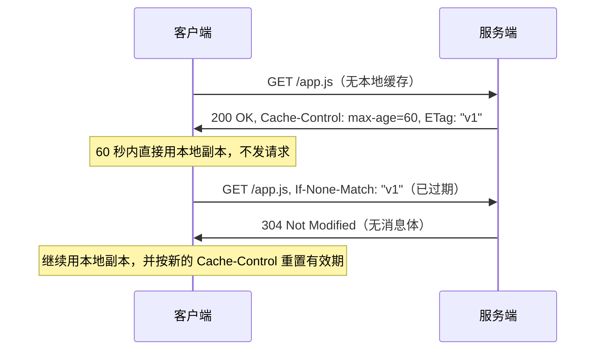
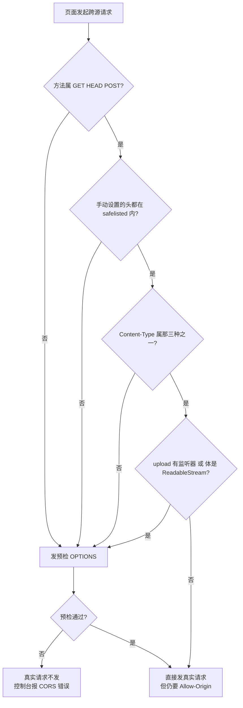
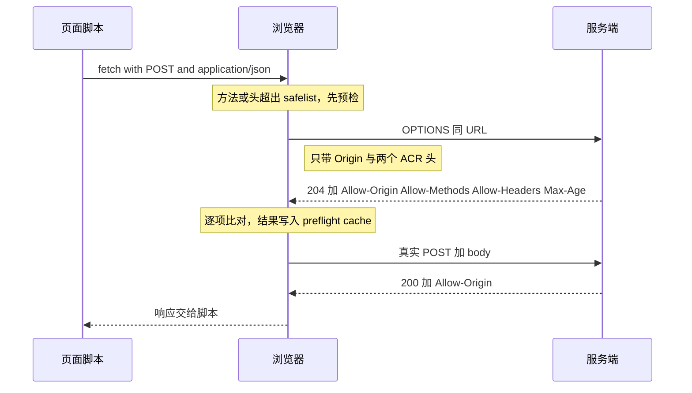

---
tags:
  - 基本功/网络
  - 基本功/HTTP
---

# HTTP 协议

`HTTP`（HyperText Transfer Protocol，超文本传输协议）给出的是一套**请求-响应语义**：客户端发一条请求，服务端回一条与之配对的响应。它不规定这些字节怎么在网络上跑，这一层留给具体的传输绑定。

理解 `HTTP` 的钥匙是**语义与传输分离**。方法、状态码、字段、URI 处理属于「语义」，与底层跑的是 TCP 还是 UDP 无关；`RFC 9110` 定义语义，`RFC 9111` 定义缓存，这两份与传输无关；`RFC 9112`、`RFC 9113`、`RFC 9114` 是同一套语义的三种传输绑定（来源：RFC 9110 §1）。同一条「获取这个资源、期望 `200` 或 `304`」的语义，在 1.1 里是文本行加定界、在 2 里是二进制分帧、在 3 里跑在 QUIC 之上。

本篇按机制组织：报文长什么样、消息到哪里结束、方法状态码代表什么、连接怎么复用、版本怎么演进、缓存怎么判、出了故障怎么定位。HTTPS 的握手与优化、RPC、WebSocket 不在本篇范围。

## 1 HTTP 的定位与版本谱系

HTTP 定义的是两点之间的请求-响应语义：一次请求配一次响应，报文可以经过中转（代理、网关）接力传递，中转方只需遵循同一套约定（来源：RFC 9110 §3）。本节先讲清「语义与传输怎么分开」，再给这一族 RFC 的编号与各自负责的内容，最后划清与相邻笔记的边界。

### 1.1 语义层与传输绑定

`HTTP` 的语义层描述「客户端想干什么、服务端答了什么」：请求方法、`request-target` 的形式、状态码、各种字段的含义、URI 的处理规则、缓存如何判定。这些定义不假设字节以什么形式传输，也不假设连接是一条 TCP 流还是一条 QUIC 流。

传输绑定层负责把这套语义搬到线上：怎么分帧、怎么把「字段名 + 值」编码成字节、连接怎么建立与复用、出错怎么表述。同一套语义换一种绑定，字段名和状态码的语义一字不变，变的只是线上编码。

```text
   ┌─────────────────────────────────────────────────────────────┐
   │                    语义层（与传输无关）                       │
   │   方法 / 状态码 / 字段 / URI 处理           RFC 9110         │
   │   缓存语义                                  RFC 9111         │
   └─────────────────────────────────────────────────────────────┘
                              │
        ┌─────────────────────┼─────────────────────┐
        ▼                     ▼                     ▼
   ┌─────────┐          ┌─────────┐          ┌─────────┐
   │ HTTP/1.1│          │ HTTP/2  │          │ HTTP/3  │
   │ RFC 9112│          │ RFC 9113│          │ RFC 9114│
   └─────────┘          └─────────┘          └─────────┘
   文本行 + 定界        二进制分帧 + HPACK    二进制分帧 + QPACK
        │                     │                     │
        ▼                     ▼                     ▼
   ┌─────────┐          ┌─────────┐          ┌─────────────────┐
   │ TCP/TLS │          │ TCP/TLS │          │ QUIC（基于 UDP） │
   └─────────┘          └─────────┘          └─────────────────┘
```

这条分离解释了两种常见现象。一是同一个 `Content-Type: application/json` 在三个版本里含义完全相同，抓包看到的却是三种截然不同的字节布局。二是版本升级不必改动应用代码：`HTTP/2` 特意保留 `http://` 与 `https://` 两个协议名，让浏览器和服务器在背后用 `ALPN` 协商升级，应用层不必感知（来源：RFC 9113 §3.1）。

### 1.2 RFC 拆分与版本谱系

2022 年这一族规范把原来缠在一起的定义拆开，每一份只负责一件事（来源：RFC 9110 / 9111 / 9112 / 9113 / 9114）：

| 规范 | 标题 | 负责的内容 | 传输相关 |
| --- | --- | --- | --- |
| `RFC 9110` | HTTP Semantics | 方法、状态码、字段、URI 处理、条件请求 | 无关 |
| `RFC 9111` | HTTP Caching | 缓存如何存储、如何判定新鲜、如何失效 | 无关 |
| `RFC 9112` | HTTP/1.1 | 消息语法、解析、连接管理 | 绑定 TCP |
| `RFC 9113` | HTTP/2 | 二进制分帧、多路复用、HPACK 压缩 | 绑定 TCP |
| `RFC 9114` | HTTP/3 | 在 QUIC 之上的分帧与请求映射 | 绑定 QUIC/UDP |

`HTTP/1.1` 这一种绑定由三份共同定义：`9110` 给语义、`9111` 给缓存、`9112` 给消息语法与连接管理。`9112` 废弃了 `RFC 7230` 中与消息传递、连接管理有关的部分，`7230` 剩下的部分则由 `9110` 废弃。也就是说，读 1.1 的字段语义要去 `9110`，读「请求行怎么解析、连接何时关闭」要去 `9112`。

版本本身的演进主线可以这样记：1.0 每个请求新建一条 TCP 连接，1.1 默认持久连接并允许复用，2 把报文改成二进制分帧、一条连接上并发多个请求，3 把传输层从 TCP 换成 QUIC。1.0 与 1.1 之间最大的行为差异就是持久连接：1.1 的默认连接是持久的，只要任一端没有明确提出断开就保持（来源：RFC 9112 §9.3）。

### 1.3 与相邻笔记的边界

`HTTP` 跑在传输层之上，看它依赖的下层去 [[05-TCP 协议]]（字节流的可靠性、`MSS` 与连接状态机）；看它在协议栈里占哪一层、封装与解封装怎么走，去 [[01-网络分层模型]]；看承载它的地址与转发，去 [[08-IP 协议与路由]]。`HTTP/3` 底下的 QUIC 属于传输层，本篇只讲 `HTTP` 这一侧怎么用它。

面向 AI 智能体的 `MCP` 协议用 `JSON-RPC` 报文跑在 `HTTP` 之上，是这套语义被复用的一例，见 [[13-MCP 协议]]。

## 2 报文语法（HTTP/1.1）

`HTTP/1.1` 的报文是文本，用回车换行（CRLF）分行。整条消息的骨架由一份 ABNF 定死（来源：RFC 9112 §2.1）：

```text
HTTP-message   = start-line CRLF *( field-line CRLF ) CRLF [ message-body ]
start-line     = request-line / status-line
```

`start-line` 是第一行，后面跟零行或多行字段行，再跟一个**空行**（单独一个 CRLF）表示首部结束，空行之后是可选的消息体。

```text
   一条 HTTP/1.1 请求报文的字节布局

   request-line   ┌──────────────────────────────────────┐
   （以 SP 分三段）│ method SP request-target SP version  │
                  └──────────────────────────────────────┘
                     │
                     ▼  CRLF
   field-line     ┌──────────────────────────────────────┐
   （可 0..N 行）  │ field-name ":" OWS field-value OWS    │
                  │ ...                                   │
                  └──────────────────────────────────────┘
                     │
                     ▼  CRLF（空行：首部结束的标志）
   message-body   ┌──────────────────────────────────────┐
   （可省略）      │ 长度由定界规则决定，见第 3 节          │
                  └──────────────────────────────────────┘

   三处容易被写错的边界
     ① field-name 与冒号之间不许有空白
          服务器收到此类请求 → 必须回 400
          代理转发响应前     → 必须移除这类空白
     ② status-line 的 reason-phrase 可省略，但分隔它的那个 SP 必须发
     ③ obs-fold（把字段值折到下一行）已废弃
          发送方不得生成；接收方须回 400 或用 SP 替换
```

### 2.1 请求行与状态行

请求行与状态行各自有一条产生式（来源：RFC 9112 §3、§4）：

```text
request-line = method SP request-target SP HTTP-version
status-line  = HTTP-version SP status-code SP [ reason-phrase ]
```

`method` 是一个 `token`（不含空白和控制字符的短标识），大小写敏感：`GET` 与 `get` 是两个不同的方法。`HTTP-version` 由 `HTTP-name "/" DIGIT "." DIGIT` 构成，即 `HTTP/1.1`。

状态行里最容易被忽略的一处是 `reason-phrase`：它是**可选**的，但分隔它的那个 `SP` **必须发**。也就是说 `HTTP/1.1 200`（后面直接 CRLF）不合规，`HTTP/1.1 200 `（末尾带一个空格）合规。而且客户端**应当**忽略 `reason-phrase` 的内容，只读 `status-code`——服务端把 `200 OK` 写成 `200 一切正常` 不影响客户端判断（来源：RFC 9112 §4）。

`request-target` 有四种形式，用哪种取决于请求要经过谁（来源：RFC 9112 §3.2）：

| 形式 | 语法 | 出现场景 | 例子 |
| --- | --- | --- | --- |
| `origin-form` | `absolute-path [ "?" query ]` | 直连源服务器，绝大多数请求 | `GET /a?b=1 HTTP/1.1` |
| `absolute-form` | `absolute-URI` | 发给代理的请求 | `GET http://h/a HTTP/1.1` |
| `authority-form` | `uri-host ":" port` | 仅 `CONNECT`，用于建隧道 | `CONNECT h:443 HTTP/1.1` |
| `asterisk-form` | `*` | 仅 `OPTIONS`，问整台服务器的能力 | `OPTIONS * HTTP/1.1` |

### 2.2 字段行与三处边界

字段行的产生式与它携带的一条硬要求（来源：RFC 9112 §5）：

```text
field-line = field-name ":" OWS field-value OWS
```

`OWS` 是「可选的空白」（空格或水平制表符）。这条产生式允许前后有空白，却**不允许 `field-name` 与冒号之间有空白**：`Content-Length : 100` 里的那个空格是错的。规则是硬性的——服务器收到请求字段名后带空白的此类报文**必须**回 `400`，代理在把响应向下游转发之前**必须**移除这类空白（来源：RFC 9112 §5.1）。这条约束的目的是消除解析歧义，不同实现在此处取值不同会直接导致走私（见 §3.3）。

历史上还有一种「行折叠」（`obs-fold`）：把一行字段值拆到下一行，下一行以空白开头。这条写法已废弃，发送方**不得**生成；接收方遇到它，要么以 `400` 拒绝，要么把每个 `obs-fold` 替换成一个空格再解析（来源：RFC 9112 §5.2）。

> [!warning] 同名字段的合并规则不止一种
> 大多数字段出现多行时，按顺序用逗号拼接成一个等价字段（`RFC 9110 §5.2`）。例外是 `Set-Cookie`：它不能拼接，必须逐条保留。`Cookie` 用分号分隔，也不能按逗号拼接。解析时若一律按逗号合并，会把 `Set-Cookie` 拆坏。

### 2.3 常见字段盘点

字段分请求方向、响应方向与双向几类，下面这些是排错时最先看的（字段语义来源：RFC 9110 §7–§14）：

| 字段 | 方向 | 作用 | 排错时的意义 |
| --- | --- | --- | --- |
| `Host` | 请求 | 指定目标主机与端口 | 1.1 请求**必须**带；`Host` 缺失或重复可能被拒；虚拟主机靠它区分 |
| `Content-Length` | 双向 | 消息体字节数 | 与实际字节数不符会导致读多/读少，见 §3 |
| `Transfer-Encoding` | 双向 | 消息体的传输编码，如 `chunked` | 与 `Content-Length` 并存时覆盖后者，是走私的入口 |
| `Connection` | 双向 | 逐跳控制，如 `close` | 决定连接是否在本次响应后关闭 |
| `Content-Type` | 双向 | 消息体的媒体类型 | 决定对端怎么解释 body |
| `Content-Encoding` | 双向 | 消息体的内容编码（压缩方式） | 与 `Accept-Encoding` 配对，协商压缩算法 |
| `Cache-Control` | 双向 | 缓存指令 | 决定能否复用本地缓存，见第 7 节 |
| `ETag` / `If-None-Match` | 响应 / 请求 | 资源版本标识 | 协商缓存判 `304` 的依据 |
| `Last-Modified` / `If-Modified-Since` | 响应 / 请求 | 资源最后修改时间 | 协商缓存的另一种依据 |

`Host` 与 `Content-Length` 是 1.1 里两条被写死的必备约束：`Host` 必须在每个请求里出现，缺失或出现多次的服务端应当以 `400` 拒绝（来源：RFC 9110 §7.2）；`Content-Length` 的值是一个十进制非负整数，不允许负数、不允许带 `+`、不允许有前导零之外的多余字符。

## 3 定界：消息到哪里结束

定界要回答的是「一条消息在哪里结束」。HTTP 只有两种定界手段：给消息体标一个长度，或者把消息体切成带长度前缀的块；首部自身不用长度，靠一个空行结束（来源：RFC 9112 §2.2）。本节把 `RFC 9112 §6.3` 的判定优先级写全，再展开由它引出的请求走私与 `chunked` 线格式。

### 3.1 为什么定界是传输层的难点

`TCP` 给上层的是**没有消息边界**的字节流：发送方 `send()` 两次各 100 字节，接收方可能一次 `recv()` 就收到 200 字节，也可能收到 80 + 120（来源：TCP 的特性，见 [[05-TCP 协议]] §1.3）。所以「一条 HTTP 消息在哪里结束、下一条从哪里开始」必须由 HTTP 自己定义。

HTTP 定义了两种定界方式：给消息体标一个**长度**（`Content-Length`），或者把消息体切成**带长度前缀的块**并以一个零长块收尾（`chunked`）。首部本身不用长度，靠那个空行（CRLF CRLF）结束。长度与块两种方式只能选一种，选错了读出来的就是另一条消息的字节——这正是请求走私（request smuggling）的根源。

### 3.2 消息体长度的判定优先级

`RFC 9112 §6.3` 给出了一套有序的判定规则，从上到下第一个命中的生效：

```text
   消息体长度怎么定（RFC 9112 §6.3，自上而下第一个命中即生效）

   ① 这是 HEAD 响应，或 1xx / 204 / 304 响应？ ── 是 ──▶ 不含消息体，长度 0
        │ 否
        ▼
   ② 这是对 CONNECT 的 2xx 响应？ ───────────── 是 ──▶ 此后连接变为隧道
        │ 否
        ▼
   ③ 同时有 Transfer-Encoding 与 Content-Length？ 是 ──▶ TE 覆盖 CL
        │                                                  按错误处理（可能是走私）
        │ 否
        ▼
   ④ 有 Transfer-Encoding 且 chunked 是最终编码？ 是 ──▶ 按 chunked 解码定界
        │ 否
        ▼
   ⑤ 有 Transfer-Encoding 但不是 chunked？ ─── 响应 ──▶ 由连接关闭定界
        │                                        请求 ──▶ 回 400
        │ 否
        ▼
   ⑥ 有合法的 Content-Length？ ──────────────── 是 ──▶ 长度就是该值
        │ 否
        ▼
   ⑦ 两者都没有 ── 请求 ──▶ 长度 0（请求从不用关闭连接定界）
                   响应 ──▶ 由连接关闭定界
```

这条链上有几条值得单独记：

- **`HEAD` 响应与 `1xx` / `204` / `304` 响应不含消息体**，即使首部里带了 `Content-Length` 也不读 body。`304` 的 `Content-Length` 描述的是「假如是 `200` 会有多大」，不代表本次响应的 body 长度。
- **`Transfer-Encoding` 与 `Content-Length` 同时出现时，`Transfer-Encoding` 覆盖 `Content-Length`**，且这类消息按错误处理——它可能是请求走私或响应拆分攻击（来源：RFC 9112 §6.3）。发送方**不得**在含 `Transfer-Encoding` 的消息里再发 `Content-Length`。
- **请求消息从不靠「关闭连接」定界**：请求体长度未知又不能分块时，会毁掉连接的复用，协议直接把它判为无 body；服务端对「有 body 但缺 `Content-Length`」的请求可以回 `411 Length Required`（来源：RFC 9110 §15.5.10）。
- **只有响应**在既无长度、又无分块时才由连接关闭定界。这条让响应的结束与 TCP 的 `FIN` 绑在一起，也意味着这类响应结束前连接不能被复用。

### 3.3 Transfer-Encoding 覆盖 Content-Length 与请求走私

「`TE` 覆盖 `CL`」这条规则本身是明确的，风险在于链路上**存在多个解析方**时彼此理解不一致。典型场景是客户端 → 反向代理 → 源服务器：代理与源服务器如果对同一条报文取到了不同的长度，代理看到的边界和源服务器看到的边界就错开了，夹在两段边界之间的字节会被源服务器当成**下一条请求**的开头——攻击者把一条完整请求嵌进去，就得到了一条绕过代理访问控制的「走私」请求。

`TE` 与 `CL` 分歧的常见构造有四类，记法是把两端各自看重的字段写在名字里：

| 构造 | 前端的判定 | 后端的判定 | 结果 |
| --- | --- | --- | --- |
| `CL.TE` | 按 `Content-Length` 读 | 按 `Transfer-Encoding: chunked` 读 | 后端把多出的字节当下一条请求 |
| `TE.CL` | 按 `chunked` 读 | 按 `Content-Length` 读 | 前端少读一段，残留在后端 |
| `TE.TE` | 两端都识别 `chunked`，但其中一端认不出被混淆的写法 | 另一端识别出 `chunked` | 两端对是否分块判断相反 |
| `CL.CL` | 两个 `Content-Length` 值不同，两端取了不同的那个 | 同左 | 同上 |

防御的落点是统一解析口径，而不是在某一端加特判：拒绝 `TE` 与 `CL` 并存的报文（按 `§6.3` 当错误处理）、规范化 `Transfer-Encoding` 与 `Content-Length` 的大小写与空白、在代理与源服务器之间只保留一条可信的定界依据。`HTTP/2` 与 `HTTP/3` 的帧结构把长度写在帧头里，同一连接内不存在「长度说法不一」的空间，但**从 2 或 3 降级到 1.1 的转换点**要重新应用上面这套规则（待验证）。

### 3.4 chunked 的线格式

`chunked` 是一种传输编码，把消息体切成若干块，每块带一个十六进制长度前缀，最后以一个零长块结束（来源：RFC 9112 §7.1）：

```text
chunked-body    = *chunk last-chunk trailer-section CRLF
chunk           = chunk-size [ chunk-ext ] CRLF chunk-data CRLF
chunk-size      = 1*HEXDIG
last-chunk      = 1*("0") [ chunk-ext ] CRLF
chunk-ext       = *( BWS ";" BWS chunk-ext-name [ BWS "=" BWS chunk-ext-val ] )
trailer-section = *( field-line CRLF )
```

```text
   chunked 的字节布局：把 9 字节的 "Wikipedia" 分成 4 + 5 两块

   块长用十六进制，不是十进制；块数据之后的 CRLF 不计入块长

   34 0D 0A              ← chunk-size "4" + CRLF
   57 69 6B 69           ← chunk-data "Wiki"（4 字节）
   0D 0A                 ← chunk-data 后的 CRLF
   35 0D 0A              ← chunk-size "5" + CRLF
   70 65 64 69 61        ← chunk-data "pedia"（5 字节）
   0D 0A                 ← CRLF
   30 0D 0A              ← last-chunk：块长为 0
   0D 0A                 ← trailer-section 为空，再一个空行收尾

   ┌───────────────┬──────────────────────┬────────────────────────┐
   │ chunk-size    │ chunk-ext（可选）     │ 收尾                    │
   ├───────────────┼──────────────────────┼────────────────────────┤
   │ 1*HEXDIG      │ ; name [ "=" value ] │ 必须忽略不认识的扩展     │
   └───────────────┴──────────────────────┴────────────────────────┘
```

读法：先读 `chunk-size`，按十六进制解成字节数，读该字节数的数据，再吃掉一个 CRLF；重复直到读到 `0`；随后是 `trailer-section`（可空），最后以一个空行结束整条消息。

两处实现细节影响安全。一是 `chunk-size` 是十六进制，`0A` 表示 10 而不是 10 进制里的两位；把十六进制当十进制解析会读错长度。二是协议提醒实现要防**过大的十六进制值**导致整数溢出——一个足够长的数字串能让窄类型的长度字段回卷，从而绕过后续的读取检查。

### 3.5 chunk 扩展与 trailer

`chunk-ext` 挂在每个块的长度后面，形如 `;name=value`。它是块级的元数据，协议规定收件方**必须忽略**不认识的扩展（来源：RFC 9112 §7.1.1）——这保证了扩展可以安全地演进：发送方加了新扩展，老接收方跳过它即可，不影响对消息体的解码。

`trailer-section` 是消息体之后、结束空行之前的一段字段行，用来承载「生成 body 时才算得出来的值」，比如摘要、签名、最终校验和（来源：RFC 9110 §6.5）。用 `Trailer` 字段可以预先声明接下来会有哪些 trailer 名。请求里带 `TE: trailers` 表示自己愿意接收 trailer，不带也照样可以收，接收方按需忽略。涉及消息定界、路由、认证的字段不允许放在 trailer 里，否则会被恶意构造。

trailer 的典型用法是流式生成内容时的完整性校验：发送方一边算摘要一边发 body，摘要值直到最后一个块才确定，写不进首部，只能放进 trailer。这也解释了为什么 `chunked` 值得单独设计一个 trailer 段落，而 `Content-Length` 那样的定界方式根本没有位置放它。

## 4 方法与状态码

方法与状态码是语义层里最常被查阅的两张表：方法回答「这次请求想干什么」，状态码回答「服务端答了什么」，两者的定义都在 `RFC 9110`，与跑在哪种传输绑定上无关。

### 4.1 安全与幂等

方法有两个正交的性质（来源：RFC 9110 §9.2）：

**安全（safe）**：语义上是只读的，不会改动服务端资源。安全方法可以被缓存、可以被预取、可以作为链接被点击。

**幂等（idempotent）**：一次执行与多次执行的效果相同。幂等不等于安全：`DELETE` 会删资源（不安全），但删一次和删多次结果一样（幂等）。幂等性是自动重试的前提——不幂等的方法重发一次可能多创建一个订单。

| 方法 | 安全 | 幂等 | 语义 |
| --- | --- | --- | --- |
| `GET` | 是 | 是 | 取回目标资源的一个表示 |
| `HEAD` | 是 | 是 | 与 `GET` 相同，但不返回消息体 |
| `OPTIONS` | 是 | 是 | 询问目标资源支持的通信选项 |
| `TRACE` | 是 | 是 | 回显收到的请求，用于诊断 |
| `PUT` | 否 | 是 | 用请求体替换目标资源 |
| `DELETE` | 否 | 是 | 删除目标资源 |
| `POST` | 否 | 否 | 按目标资源自己的语义处理请求体 |
| `PATCH` | 否 | 否 | 对目标资源做部分修改 |

这套性质直接落到实现：缓存可以存储对安全方法请求的响应；客户端与中间件可以对幂等请求自动重试，对 `POST` 与 `PATCH` 不能。

### 4.2 GET 与 POST 的语义差别

两者的差别在语义，不在「参数放哪里」这种表层特征：

- **`GET` 的语义是「取回」，`POST` 的语义是「提交处理」。** `GET` 请求的是目标资源的一个表示，服务端不因此改变资源状态；`POST` 把请求体交给目标资源，由该资源自身的语义决定怎么处理——一个接受 `POST` 的端点可以创建、可以提交表单、也可以执行动作，具体含义由该端点定义（来源：RFC 9110 §9.3.3）。
- **`GET` 可以带请求体，但与它的语义无关。** RFC 没有禁止 `GET` 携带消息体，却没有为它定义任何语义；服务端可以因此拒绝或忽略。同理，查询组件（`?a=1`）任何方法都能用，并不是 `GET` 的专属（来源：RFC 9110 §9.3.1）。
- **缓存与重试的待遇不同。** `GET` 可缓存、可重试；`POST` 默认不可缓存，且不幂等，重试可能产生副作用。需要让 `POST` 参与缓存时，要用 `RFC 9110` 的显式缓存字段或让响应带 `Cache-Control` 指令来开启。

把「参数在 URL 还是 body」当成两者的分界，会推出错误的结论：URL 里的参数和 body 里的参数都可能被日志、被中间缓存记录，安全性不取决于放在哪儿，而取决于是否用了 `HTTPS`。真正稳定的是语义：`GET` 只读、可缓存、可安全重试，`POST` 提交、不可缓存、不可盲目重试。

### 4.3 状态码五类分段

状态码是三位十进制，首位表示类别（来源：RFC 9110 §15）：

| 类别 | 含义 | 典型码 | 排错落点 |
| --- | --- | --- | --- |
| `1xx` | 提示信息，中间状态 | `100 Continue`、`101 Switching Protocols` | 客户端与协议升级；`100` 配合 `Expect` 用于先探再发大 body |
| `2xx` | 成功 | `200`、`201`、`204`、`206` | 正常路径 |
| `3xx` | 重定向，需要换目标 | `301`、`302`、`304`、`307`、`308` | 客户端下一步去哪个 URL，或是否复用缓存 |
| `4xx` | 客户端侧的错误 | `400`、`401`、`403`、`404`、`405`、`411`、`429` | 请求本身有问题，重发同样的请求没用 |
| `5xx` | 服务端侧的错误 | `500`、`501`、`502`、`503`、`504` | 请求本身对，是后端或网关处理失败 |

### 4.4 常用状态码的语义

| 状态码 | 语义 | 容易混淆之处 |
| --- | --- | --- |
| `200 OK` | 成功，响应带表示 | 非 `HEAD` 请求的 `200` 通常带消息体 |
| `201 Created` | 成功且新建了资源 | 通常配合 `Location` 指向新资源 |
| `204 No Content` | 成功，无消息体 | 与 `200` 的差别在于是否带 body |
| `206 Partial Content` | 成功返回部分内容 | 配合 `Range` 用于断点续传、分块下载 |
| `301 Moved Permanently` | 永久重定向 | 可被缓存；客户端后续直接访问新 URL |
| `302 Found` | 临时重定向 | 历史上常被实现成把 `POST` 改成 `GET`，`RFC 9110 §15.4` 允许用户代理这么做 |
| `304 Not Modified` | 资源未变，复用缓存 | 不是跳转，响应不含消息体 |
| `307 Temporary Redirect` | 临时重定向，保持原方法 | 与 `302` 的差别在于不允许改方法 |
| `308 Permanent Redirect` | 永久重定向，保持原方法 | 与 `301` 的差别同上 |
| `400 Bad Request` | 请求报文有误 | 字段名后带空白、`obs-fold` 都落在这个码上 |
| `401 Unauthorized` | 未提供有效凭据 | 与 `403` 不同：`401` 是「没认证」，`403` 是「认证了但没权限」 |
| `403 Forbidden` | 服务端拒绝 | 重发同样的请求不会改变结果 |
| `404 Not Found` | 目标资源不存在 | 也可能是服务端故意隐藏资源存在性 |
| `405 Method Not Allowed` | 方法不被该资源支持 | 响应应带 `Allow` 列出支持的方法 |
| `411 Length Required` | 缺 `Content-Length` | 服务端拒绝无定界的请求体 |
| `429 Too Many Requests` | 触发限流 | 响应可带 `Retry-After` 告诉客户端何时再试 |
| `500 Internal Server Error` | 服务端内部错误 | 笼统的错误码，细节要看日志 |
| `502 Bad Gateway` | 网关从上游收到无效响应 | 网关自身正常，问题在上游 |
| `503 Service Unavailable` | 服务暂不可用 | 常配合 `Retry-After`，多为过载或维护 |
| `504 Gateway Timeout` | 网关等待上游超时 | 与 `502` 的区别是「没等到」还是「等到了但不对」 |

`301` / `302` 与 `307` / `308` 这两组是重定向里最常被弄错的一对：前一组允许用户代理把方法从 `POST` 改成 `GET`，后一组要求保持原方法重发。把「提交表单后跳转」写成 `307`，可能把 `POST` 原样重发到新地址，产生重复提交。

## 5 连接与复用

连接管理属于传输绑定层：`HTTP/1.1` 规定了连接怎么建立、怎么复用、什么时候关闭（来源：RFC 9112 §9）。这套能力直接决定了上层能用出多少吞吐，也是 1.1 被 2 替换的直接原因。

### 5.1 持久连接与 Connection 字段

`HTTP/1.1` 默认使用持久连接：一次 TCP 连接建立后，可以承载多对请求-响应，直到任一端明确提出关闭（来源：RFC 9112 §9.3）。`Connection: close` 表示「本次响应之后关闭连接」，是逐跳（hop-by-hop）指令，代理转发时要把它消化掉，不能原样传到下游。

`HTTP/1.0` 的默认行为相反：每个请求建一条连接，用完即断。早期为了兼容，客户端要显式发 `Connection: keep-alive` 才能复用；到了 1.1，这条变成了默认，`Connection: keep-alive` 反而成了历史遗留写法。连接空闲太久、服务端要回收资源时，会主动关闭连接，客户端需要处理这种「服务端先关」的竞态。

两条边界值得单独记。第一，持久连接不改变串行性：一条连接上同时只能有一个未完成的事务（见 §5.2）。第二，空闲连接会被任一端回收——服务端通常给空闲连接设一个超时，超时后主动关闭；客户端在复用前若正好撞上对端关闭，写出的数据可能换回 `RST` 或写到一半失败，需要在应用层重试一次（待验证）。`Connection` 是逐跳字段，它只约束当前这一跳；代理到源服务器那一段是否复用，由那一跳自己决定。

### 5.2 串行、队头阻塞与并发连接

持久连接解决了建连开销，却没有解决**串行**：在一条连接上，HTTP/1.1 完成一对请求-响应之后才处理下一对。协议里的管道（pipelining）允许一次性发出多个请求，但要求服务端**按接收顺序**回响应，于是一个慢响应会顶住它后面所有响应——这就是响应侧的队头阻塞。管道机制在浏览器里基本没有被启用，讨论 1.1 的性能时通常按「不使用管道」来算。

绕开串行的办法是**并发多条连接**：浏览器对同一个 origin 同时开若干条 TCP 连接，让多个请求并行。并发数有上限，浏览器通常对同一 origin 开 6 条左右（具体值随浏览器与版本变化）（待验证）。并发连接带来两个代价：每条连接都要各走一遍 TCP 与 TLS 握手、各经历一次慢启动；连接数越多，服务端要维护的状态越多。

并发连接在实践中由连接池管理：客户端维护一批到各自 origin 的连接，请求来时挑一条空闲的复用。池子太小，请求排队等连接；池子太大，握手与慢启动的开销、服务端要扛的连接状态都跟着涨。1.1 时代的性能调优有一半在调连接池的大小与空闲超时（待验证）。

### 5.3 HTTP Keep-Alive 与 TCP keepalive

这两个名字长得像，却不是一回事：

| | HTTP `Keep-Alive` | TCP keepalive |
| --- | --- | --- |
| 所属层 | 应用层（HTTP） | 传输层（TCP） |
| 目的 | 一条 TCP 连接上复用多对请求-响应 | 探测一条空闲连接的对端是否还活着 |
| 触发方式 | 一次请求-响应结束后不关闭连接 | 连接空闲超过阈值后周期性发探测包 |
| 默认行为 | HTTP/1.1 默认开启 | 默认关闭，需应用用 `SO_KEEPALIVE` 打开 |
| 观测 | 抓包看到多条请求-响应复用同一四元组 | 抓包看到无载荷的 `ACK` 探测或 `RST` 响应 |

HTTP 的 Keep-Alive 决定「连接要不要复用」；TCP 的 keepalive 决定「这条空连接还值不值得留着」。两者都能让连接存活更久，机制和触发条件互不相干。

### 5.4 减少连接开销的常见手段

1.1 时代的优化大多围绕「少建连接、少发请求」展开，思路与代价可以对照看：

- **域名分片**：把资源拆到多个域名，拿到更多的并发连接额度。代价是每条连接都要重新握手，且域名解析本身要花时间。
- **合并请求**：把小图标合成雪碧图、把多个 JS/CSS 打包成一个大文件，减少请求次数、减少重复首部。代价是任一小资源变动，整个大文件都要重下。
- **内联资源**：把图片用 `base64` 编码嵌进 HTML 或 CSS，随 HTML 一起送达，省掉一次请求。代价是内联内容不能单独缓存，且体积涨约三分之一。
- **按需加载**：只取当前视口用得到的资源，滚动到哪里再请求哪里，减少首屏请求数。

这些手段都在 HTTP/1.1 的「外部」打补丁，改不动请求-响应模型与串行连接的底子。要改底子就得重新设计传输，这就引出了 2 与 3。

## 6 版本演进：HTTP/2 与 HTTP/3

版本演进的主线只有一条：把 1.1 在传输上遇到的串行与队头阻塞逐个解掉。1.1 用持久连接与并发连接绕开它，2 用多路复用把应用层的串行消掉，3 把传输层换成 QUIC 再消掉 TCP 层的阻塞。三者的语义完全一致，差别全在绑定层。

### 6.1 HTTP/2 的二进制分帧

`HTTP/2` 把报文从文本换成二进制，所有内容切成帧（frame）。每个帧前面是固定 **9 字节**的帧头（来源：RFC 9113 §4.1）：

```text
   HTTP/2 帧头固定 9 字节（RFC 9113 §4.1）

    0                   1                   2                   3
    0 1 2 3 4 5 6 7 8 9 0 1 2 3 4 5 6 7 8 9 0 1 2 3 4 5 6 7 8 9 0 1
   ┌───────────────────────────────┬───────────────┬───────────────┐
   │          Length (24)          │   Type (8)    │  Flags (8)    │
   ├───┬───────────────────────────────────────────────────────────┤
   │R(1)│               Stream Identifier (31)                       │
   └───┴───────────────────────────────────────────────────────────┘
     ↑
     保留位 R，必须为 0

   Length      帧数据的字节数，不含这 9 字节帧头
   Type        帧类型，共 10 种：DATA / HEADERS / PRIORITY / RST_STREAM /
               SETTINGS / PUSH_PROMISE / PING / GOAWAY / WINDOW_UPDATE /
               CONTINUATION
   Flags       8 个标志位，如 END_STREAM、END_HEADERS、PADDED
   Stream ID   31 位，标识帧属于哪个 stream
               接收方据此把乱序到达的帧按 stream 重新组装
```

帧头分成四段，正好 9 字节：3 字节长度、1 字节类型、1 字节标志、4 字节（其中最高 1 位保留）流标识。长度字段只有 24 位，所以单个帧的载荷上限是 2^24 − 1 字节；超过就得分帧。二进制编码让解析变成按固定偏移取位，不再依赖文本行的分隔符。

### 6.2 多路复用：Stream、Message 与 Frame

三个概念是层层包含的关系（来源：RFC 9113 §5.1）：

```text
   TCP 连接 / Stream / Message / Frame 的包含关系

   连接  ┌───────────────────────────────────────────────────────┐
         │  Stream 1        Stream 3        Stream 5             │
         │  ┌───────────┐   ┌───────────┐   ┌───────────┐        │
         │  │ Message   │   │ Message   │   │ Message   │        │
         │  │ ┌───────┐ │   │ ┌───────┐ │   │ ┌───────┐ │        │
         │  │ │HEADERS│ │   │ │HEADERS│ │   │ │HEADERS│ │        │
         │  │ │ DATA  │ │   │ │ DATA  │ │   │ │ DATA  │ │        │
         │  │ └───────┘ │   │ └───────┘ │   │ └───────┘ │        │
         │  └───────────┘   └───────────┘   └───────────┘        │
         └───────────────────────────────────────────────────────┘
              一条 TCP 连接上并存多个 Stream
              stream 之间可乱序交错；stream 内部必须严格有序
```

一条连接上可以并存多个 stream，每个 stream 承载一对请求-响应；一个消息由若干帧组成，一个帧可以跨多个 TCP 报文。**不同 stream 的帧可以乱序交错发送**，接收方靠帧头里的 `Stream ID` 把它们归位；**同一个 stream 内部的帧必须严格有序**。这样，一个慢请求不再顶住同一连接上的其他请求——应用层的队头阻塞被消掉了。

几个配套机制：

- **流控**：连接级与 stream 级两种窗口，用 `WINDOW_UPDATE` 帧调整。接收方通过它告诉发送方「我还能收多少」，避免接收缓冲被压垮。
- **优先级**：帧头标志与 `PRIORITY` 帧可以表达 stream 的优先级，让渲染关键资源先到（该机制后来被简化，实现支持不一）。
- **stream ID 分配**：客户端建立的 stream 用奇数号，服务端建立的用偶数号；ID 只能递增、不能复用，耗尽时发 `GOAWAY` 关闭连接（来源：RFC 9113 §5.1.1）。

### 6.3 HPACK 头部压缩

1.1 里每次请求都要重复携带整份首部，`Cookie`、`User-Agent` 这类字段动辄上百字节，一条连接上重复发送上百次。`HTTP/2` 用 `HPACK` 压缩首部（来源：RFC 7541），由三部分组成：

- **静态表**：61 项高频字段与值的固定映射，写死在规范里，两端都有，不必传输。例如 `:method: GET`、`:status: 200` 都占一个固定索引。
- **动态表**：连接建立后两端各自维护、随时更新的表。同一连接上第二次发同一个字段时，只发一个索引号，对方查自己的动态表还原。动态表生效的前提是**同一个连接上重复发送相同的首部**；字段每次都略有变化，动态表就攒不起来。
- **Huffman 编码**：对字符串按字符出现频率做编码，高频字符用短码。静态表里没有的值（如具体的 `server`、`user-agent`）先经 Huffman 编码再发出。

动态表不是免费午餐：它占内存，连接上请求越多、表越大。服务端通常限制一条连接上的请求数或生命周期，到上限就关闭连接释放内存。

HPACK 的编码只有两种基本单元：无符号整数与字符串（来源：RFC 7541 §5–§6）。整数用「前缀 + 可变长续字节」编码，索引号就走这条；字符串是「长度前缀 + 内容」，内容可选地先经 Huffman 编码。一个字段可以整体命中静态表或动态表（只发一个索引），也可以只命中字段名（发名字的索引，值另发字面量）。`HTTP/2` 首部里那个以 `1` 开头的字节，含义就是「首位置位表示命中表，后面跟索引」。

### 6.4 服务器推送与它的退场

`HTTP/2` 定义了服务器推送：服务端可以在客户端请求 HTML 时，顺带把 CSS、JS 推给客户端，省一次往返。机制用 `PUSH_PROMISE` 帧实现——服务端先在一个客户端发起的 stream 上发 `PUSH_PROMISE`，告知「接下来会在哪个 stream 里推资源」，再用那个 stream 发送实体（来源：RFC 9113 §8.4）。

推送在实践中没有达到预期：推什么由服务端猜，猜错就把客户端已有或根本不需要的资源重发一遍，浪费的带宽由服务端承担。要让客户端只取它确实缺的东西，得先由客户端说出它缺什么。服务端后来改用 `103 Early Hints` 之类的替代方案：先回一份提示（例如用 `Link` 首部列出关键资源），由客户端自己决定要不要取；主流浏览器也陆续移除了对 `PUSH_PROMISE` 的支持（待验证）。

### 6.5 HTTP/2 没解决的：TCP 层队头阻塞

`HTTP/2` 消掉了应用层的队头阻塞，却把问题下移到了 TCP。`TCP` 是字节流协议，内核必须把字节按序、连续地交给应用：如果序号较小的一个 TCP 段丢包了，即使序号更大的段已经到达，内核也只会把它们暂存在缓冲区里，直到缺失的段重传回来才交给应用层。

```text
   三种队头阻塞的落点

   HTTP/1.1    一条连接同一时刻只有一个未完成事务
   ┌──────┐  ┌──────┐  ┌──────┐
   │ 请求A │→ │ 响应A │→ │ 请求B │→ ...      B 必须等 A 的响应回来
   └──────┘  └──────┘  └──────┘
   应用层队头阻塞：前一个响应不回，后面的请求发不出去

   HTTP/2      多路复用解掉应用层阻塞
   连接 ┌────┬────┬────┬────┬────┐
        │S1帧│S3帧│S1帧│S5帧│S3帧│   stream 交错到达
        └────┴────┴────┴────┴────┘
   TCP 层队头阻塞：某一 TCP 段丢失，内核不把后续字节交给应用
        即便这些字节属于其他 stream → 所有 stream 一起等重传

   HTTP/3      换 UDP + QUIC
   连接 ┌────┬────┬────┬────┬────┐
        │S1包│S3包│S1包│S5包│S3包│   各 stream 独立重传
        └────┴────┴────┴────┴────┘
   只有丢包的那个 stream 停等，其他 stream 照常交付
```

`HTTP/2` 在 TCP 之上，承袭了这套字节流的顺序约束：一条连接上所有 stream 的字节被压进同一个 TCP 序列号空间，任何一个段丢失都会让整条连接的交付停摆。基于 TCP 的 2 还有两处固有代价：建连时 TCP 三次握手占 1 个 RTT，`TLS 1.2` 的握手再多 2 个 RTT，合起来发第一个请求前要等 3 个 RTT（来源：RFC 5246 §7.4 的握手消息序列）；连接由四元组（源 IP、源端口、目的 IP、目的端口）标识，移动设备从 4G 切到 WiFi 时 IP 变了，连接就得重建。

### 6.6 HTTP/3：QUIC、QPACK 与连接迁移

`HTTP/3` 把传输层换成 `QUIC`——一个跑在 UDP 之上的协议（来源：RFC 9000），`HTTP/3` 本身定义在 QUIC 之上的分帧与请求映射（来源：RFC 9114）：

- **无队头阻塞**：QUIC 在一条连接上并发多个 stream，每个 stream 独立排序与重传。某个 stream 的一个数据包丢了，只影响该 stream，其他 stream 的数据照常交付给应用（来源：RFC 9000 §2）。这条把 TCP 层的队头阻塞也消掉了。
- **更快的连接建立**：QUIC 把 TLS 1.3 收进自己的握手，连接建立与密钥协商一并完成，首次建连只要 1 个 RTT；恢复会话时应用数据可以与握手包一起发，达到 0-RTT（来源：RFC 9001）。
- **连接迁移**：QUIC 连接由一个**连接 ID** 标识，与四元组解耦。设备换网络、IP 变了，只要还持有连接 ID 与相应的密钥上下文，就能继续用原连接，不必重新握手。
- **QPACK 替代 HPACK**：HPACK 的动态表有**时序依赖**——它默认动态表的更新按顺序到达，若首次携带动态表更新的请求丢包，后续请求就解不出首部，得等重传。`QPACK` 用两条单向流（`QPACK Encoder Stream` 与 `QPACK Decoder Stream`）同步双方的动态表，把这条依赖解耦（来源：RFC 9204）。

`HTTP/3` 的帧头也随之简化：不再自己定义 stream，直接用 QUIC 的 stream；帧头只剩类型与长度两个字段（来源：RFC 9114 §7.2）。

### 6.7 三个版本的对照

| 维度 | HTTP/1.1 | HTTP/2 | HTTP/3 |
| --- | --- | --- | --- |
| 传输层 | TCP（或 TCP+TLS） | TCP（或 TCP+TLS） | QUIC（基于 UDP） |
| 报文编码 | 文本行 + 字段行 | 二进制帧，帧头 9 字节 | 二进制帧，帧头更短 |
| 并发单位 | 一条连接一对请求-响应 | stream（多路复用） | QUIC stream |
| 首部压缩 | 无（靠 gzip 压 body） | `HPACK` | `QPACK` |
| 应用层队头阻塞 | 有 | 无 | 无 |
| 传输层队头阻塞 | 有 | 有（TCP 层） | 无 |
| 建连往返 | TCP 1 + TLS 2 = 3 RTT | 同 1.1 | 1 RTT，恢复时 0 RTT |
| 连接标识 | 四元组 | 四元组 | 连接 ID |
| 多网络切换 | 需重连 | 需重连 | 连接迁移 |

## 7 缓存

缓存的判定分成两步：先看本地副本是否还在有效期（强制缓存），过期了再向源服务器校验是否仍可用（协商缓存）。`RFC 9111` 定义这两步的规则，与传输绑定无关——同一套字段在 1.1、2、3 里的语义完全相同。

### 7.1 强制缓存：Cache-Control 与 Expires

缓存的第一层问题是「能不能不请求」。服务端可以在响应里给出一个有效期，客户端在有效期内直接用本地副本，不发请求。两个字段表达有效期（来源：RFC 9111 §5.2）：

- `Cache-Control: max-age=<秒>`：**相对时间**，从响应生成时刻起算。优先级高。
- `Expires: <HTTP-date>`：**绝对时间**，用绝对时刻表示。历史上先有它，依赖两端时钟同步。

响应同时带两者时，`Cache-Control` 优先于 `Expires`。`Cache-Control` 的常用指令：

| 指令 | 含义 | 什么时候用 |
| --- | --- | --- |
| `max-age=<秒>` | 响应在这么多秒内是新鲜的 | 有明确不变期的静态资源 |
| `no-cache` | 可以存，但每次用之前必须向源服务器校验 | 需要每次确认的资源 |
| `no-store` | 不得存储，任何时刻都不能复用 | 含敏感信息的响应 |
| `public` | 共享缓存（代理、CDN）也可以存 | 不区分用户的公共资源 |
| `private` | 只允许单用户缓存存，共享缓存不得存 | 个性化响应 |
| `s-maxage=<秒>` | 覆盖 `max-age`，只对共享缓存生效 | CDN 的有效期与浏览器不同 |
| `must-revalidate` | 过期后必须向源服务器校验，不能用旧副本 | 过期数据不可再用的资源 |
| `immutable` | 有效期内不因用户刷新而重新校验 | 带内容指纹的静态资源 |

一个容易踩的坑：`no-cache` 与 `no-store` 不是一回事。`no-cache` 允许把响应存下来，只是每次用之前要校验；`no-store` 连存都不许。把敏感响应用 `no-cache`，数据仍可能落在磁盘上。

### 7.2 新鲜度怎么算：Age、Date 与启发式缓存

缓存判定「还能不能直接用」，比的是两个量：`freshness_lifetime`（新鲜期）与 `current_age`（当前年龄）。`current_age < freshness_lifetime` 就是新鲜（来源：RFC 9111 §4.2）。

**新鲜期取哪个值**，按下面的优先级：

1. `s-maxage`（只对共享缓存生效，且它**隐含** `proxy-revalidate` 的语义）；
2. `max-age`；
3. `Expires` 减去 `Date` 得到的间隔 —— 这就是 `Expires` 依赖两端时钟的原因；`Expires` 早于 `Date` 时视为已过期。

**当前年龄从哪来**：不能只看「收到响应的时刻」，否则一份在 CDN 上已放了 50 秒的响应，到了浏览器会被重新起算 50 秒。协议用 `Age` 字段解决这件事 —— 它由共享缓存在响应里写上「这条响应从源站生成到现在过了多久」（自己新生成的写 `0`），下游缓存再把本地驻留时间累加上去。`Date` 是源站生成响应的时刻。两个字段合起来才定位到「这份副本在整条链路上已经活了多久」。

**启发式缓存**：响应既没有 `Cache-Control: max-age` 也没有 `Expires` 时，缓存**可以**自己估一个新鲜期（来源：RFC 9111 §4.2.2 的 heuristic freshness）。早期规范（RFC 7234 §4.2.2）给的经验值是「`Date` 与 `Last-Modified` 之差取 10%」，并给这个估计值设上限（常见实现取 24 小时）。这条是「没配任何缓存头的接口有时也会被缓存」的原因；想让响应**一定不进启发式缓存**，最直接的做法是给一个明确的 `Cache-Control`（`no-cache` 或 `max-age=0`）。

`max-age=0` 与 `no-cache` 的效果接近，语义有别：`max-age=0` 让响应**立刻过期**但仍允许存，之后走协商；`no-cache` 直接要求**每次使用之前**先校验。`must-revalidate` 的边界更要记清 —— 它只在响应**已经过期**之后禁止复用旧副本，没过期时它不阻止直接使用。

### 7.3 协商缓存：ETag 与 Last-Modified

缓存过期后，客户端可以带着校验信息去问服务端「我这份还能用吗」。服务端若判定内容未变，回 `304 Not Modified`（无消息体），客户端继续用本地副本；若变了，回 `200` 加新的实体（来源：RFC 9110 §13）。

两种校验凭据：

- **基于时间**：响应带 `Last-Modified`，客户端下次请求带 `If-Modified-Since`，服务端比对资源的最后修改时间。粒度是秒。
- **基于标识**：响应带 `ETag`（一个不透明标识），客户端下次请求带 `If-None-Match`，服务端比对标识。值相同回 `304`，不同回 `200`。

两者同时存在时 `ETag` 优先：服务端先比 `ETag`，不等就直接回新内容，不再看时间（来源：RFC 9110 §13.2.2）。

`ETag` 比时间戳可靠，规范自己点了三种情形：**不便存储修改时间**、**HTTP 日期值的一秒分辨率不够用**、**修改时间没有被一致地维护**（来源：RFC 9110 §8.8.3）。三者在实现里各对应一类具体的坏法：

| `Last-Modified` 的弱点 | 机制 | 后果 | 内容派生的 `ETag` 能解决吗 |
| --- | --- | --- | --- |
| 时间与内容变化不相关 | 部署时 `touch`、构建脚本重写、从备份还原、时钟被校正 | 时间变了内容没变：这次校验白跑，换回一次全量传输；时间**回退**时若服务端按精确相等判定，此后一直拿不到 `304`（RFC 9110 §13.1.3 点名了「时钟被校正」与「从归档备份还原」这两种回退来源） | 能 |
| 秒级粒度 | HTTP-date 没有小数秒（RFC 9110 §5.6.7：`time-of-day = hour ":" minute ":" second`） | 同一秒内改了两次：判定规则是「修改时间**不晚于**客户端给的时间即视为未变」（RFC 9110 §13.1.3）→ 回 `304` → **客户端继续用旧副本** | 能 |
| 拿不到可靠的修改时间 | 动态内容没有 mtime；多副本各自 mtime 不同；源站没有时钟 | 发不出可用的 `Last-Modified`；拿「响应生成时刻」冒充它，则每次都不相等，永远 `304` 不了 | 能 |

第二格的后果与直觉相反：**该刷新时不刷新** —— 假的 `304` 把已经变了的实体当成没变，客户端安静地继续用旧副本。它的发生条件是「同一秒内被改了两次、且两次之间被取走」（来源：RFC 9110 §8.8.1）。后两格的解法都要求 `ETag` **由内容派生**，若拿 mtime 去生成 `ETag`，秒级问题会原样搬进新字段里。两个主流 Web 服务器对静态文件的默认实现就是如此：

```c
/* nginx: src/http/ngx_http_core_module.c, ngx_http_set_etag() */
etag->value.len = ngx_sprintf(etag->value.data, "\"%xT-%xO\"",
                              r->headers_out.last_modified_time,
                              r->headers_out.content_length_n)
```

`nginx` 的 `ETag` 就是「mtime 的十六进制 + 内容长度的十六进制」。两种失真正好互为镜像：多台机器上同一份内容的 mtime 不同，`ETag` 就不同，负载均衡轮询到不同节点时每个请求都回 `200`，缓存形同失效；反过来，可复现构建把 mtime 固定成一个值（Nix 的 store 路径统一用 1970-01-01 00:00:01）时，mtime 与内容长度都不变，内容改了 `ETag` 也不变 —— 这一侧更危险，缓存会**静默地**一直回 `304`。`Apache` 承认这个时间戳在同一秒内不可信，把「请求时刻距 mtime 不足一秒」的 `ETag` 主动降级为弱标识（来源：Apache `server/util_etag.c` 的 `ap_make_etag_ex()`），并另提供 `FileETag Digest` 用 SHA-1 对文件内容取摘要；`FileETag` 自 2.4 起默认取 `MTime` 与 `Size`，2.3.14 及更早还含 `INode`（来源：Apache 文档 `mod/core`）。

规范把这件事说得很直白：`Last-Modified` 用作验证器时**隐含是弱验证器**，除非满足两条之一 —— 源站可靠地知道该表示在被比较的那一秒内没有变过两次，或者缓存条目里的 `Date` **至少比 `Last-Modified` 晚一秒**且两者可视为出自同一个时钟（来源：RFC 9110 §8.8.2.2）。另一条硬要求是「有钟的源站 **MUST NOT** 发出晚于 `Date` 的 `Last-Modified`，落进未来的值必须替换成 `Date`」（来源：RFC 9110 §8.8.2.1）。

三条之外还有一条更硬的差别：**弱验证器不能用在全部条件请求上**。`If-Match`（写路径乐观锁）要求强比较（来源：RFC 9110 §13.1.1），`Last-Modified` 达不到；`If-Range` 做断点续传时，服务端若在「同一秒内改过」上判断失误，客户端会把**跨版本的两段字节**拼进同一个文件 —— 这是数据损坏，比多传一次严重。强 `ETag` 可用于上述全部场合。



**`ETag` 有强弱之分**，写法上带 `W/` 前缀的是弱标识（`W/"abc"`），不带的是强标识。强标识要求对应实体**逐字节相同**；弱标识只保证**语义等价**，允许有无关紧要的差异（例如同一份内容的不同压缩结果、日志中多出来的时间戳）。这个区别在比对规则里落地：`If-None-Match` 用**弱比较**（强弱不敏感，只比不透明值），所以带 `W/` 的标识能正常参与缓存校验；需要**强比较**的场合是 `If-Match`（写路径的前置条件，见下）。

**两个条件头同时出现时，`If-None-Match` 优先**：请求里既有 `If-None-Match` 又有 `If-Modified-Since` 时，服务端只看前者，后者被忽略（来源：RFC 9110 §13.2.2）。这解释了为什么给资源配上 `ETag` 后，客户端仍在发 `If-Modified-Since` 却不影响结果。

**`304` 带什么、不带什么**：它没有消息体，但**允许**带更新元数据用的字段 —— `Cache-Control`、`ETag`、`Expires`、`Vary`、`Date` 等，客户端据此刷新本地副本的新鲜期。所以「`304` 之后有效期被重置」是协议明文，靠的是 `304` 上重发的 `Cache-Control`。

**另外几个条件请求头属于写路径与续传**，与缓存校验不是一回事：`If-Match` / `If-Unmodified-Since` 用在写请求上做「乐观锁」（资源被别人改过就回 `412 Precondition Failed`），`If-Range` 用在断点续传上判断「本地这段还能不能接着用」。三者与缓存共用同一套 `ETag` / 时间戳，但触发的是完全不同的分支。

### 7.4 过期之后的两条后路：stale-while-revalidate 与 stale-if-error

`must-revalidate` 的取向是「过期后不得用旧副本」。协议另有两个扩展指令，取相反的取舍（来源：RFC 5861）：

- `stale-while-revalidate=<秒>`：过期后的这段时间里，可以**先用旧副本回应**，同时在后台发起校验，校验回来再换新。适合「旧一份也比多等一个往返强」的资源 —— 列表页、非关键的脚本、图片。
- `stale-if-error=<秒>`：源站报错（`5xx` 或连不上）时，允许用过期副本顶上，避免把故障直接摊到用户面前。

两者都是扩展指令，不是 RFC 9111 定义的字段。缓存遇到不认识的指令会**忽略**（来源：RFC 9111 §5.2.3），所以配了也不会让不支持的一方报错 —— 代价是效果只在支持它的缓存上生效。

### 7.5 Vary：缓存键不止 URL

缓存默认用「方法 + URI」做键，这在一份 URL 对应多种响应时会出错：同一个 `/index` 可能因 `Accept-Language` 不同返回中英文，因 `Accept-Encoding` 不同返回不同压缩格式，因 `User-Agent` 不同返回移动端或桌面端页面。若缓存只按 URL 存一份，会把英文响应喂给中文用户。

`Vary` 字段列出「选择响应时用到了哪些请求首部」，把缓存键从「方法 + URI」扩展成「方法 + URI + 这些首部的值」（来源：RFC 9111 §4.1）。`Vary: Accept-Encoding` 表示压缩格式不同的响应各存一份；`Vary: Accept-Language` 表示按语言分开存。

代价是缓存命中率。`Vary` 列得越多，键的组合越多，能复用的副本越少。`Vary: *` 表示「任何请求首部都可能影响响应」，实际上等于禁止共享缓存复用。

### 7.6 浏览器本地的几处缓存与三种刷新

浏览器侧存副本的地方不止一处，排查时先分清命中的是哪一层：

| 位置 | 生命周期 | 谁控制它 |
| --- | --- | --- |
| memory cache | 当前页面的进程内，最短 | 浏览器内部，请求头管不到 |
| disk cache | 跨导航、跨标签页 | 本节前面这些 HTTP 缓存头 |
| back/forward cache（bfcache） | 把整个页面连同 JS 堆挂起，点「后退」整页恢复而不重新加载 | 与 HTTP 缓存是两套东西；`Cache-Control: no-store` 长期被视为禁用 bfcache 的信号（各浏览器近年在放宽这条，以实测为准） |
| Service Worker 的 Cache Storage | 由脚本自己管 | HTTP 头管不到，`fetch` 事件里怎么回由脚本决定 |

**刷新键位对应的请求不一样**，这是「改了怎么没生效」的常见来源：

- **地址栏回车 / 点链接**：正常走缓存判定。
- **F5**：主文档通常被带上 `Cache-Control: max-age=0`，即让它重新校验一次；子资源仍按各自的头判定。
- **Ctrl+F5（或 Cmd+Shift+R）**：带 `Cache-Control: no-cache` 与历史遗留的 `Pragma: no-cache`，并**跳过本地副本**直接向源站取，部分实现连中间代理的缓存一并绕过。

`immutable` 正是为 F5 这一档设计的：带内容指纹的静态资源配上它以后，有效期内即使用户按 F5 也直接用本地副本，省掉一次校验往返。配套的 `Pragma: no-cache` 是 HTTP/1.0 的遗留请求头，HTTP/1.1 之后由 `Cache-Control: no-cache` 取代，留在规范里只为兼容老实现。

### 7.7 缓存的分层与失效

缓存不止一层：浏览器本地是一层，中间代理是一层，CDN 又是一层。`shared`（共享缓存，如代理、CDN）与 `private`（单用户缓存）用 `Cache-Control` 的指令区分；`s-maxage` 只改共享缓存的有效期。

失效分两种：**过期**由时间触发，到点就要校验；**主动失效**由内容变更触发，靠换 URL 或换 `ETag` 实现。静态资源最稳的做法是把内容指纹写进文件名（`app.a1b2c3.js`），一旦内容变，文件名就变，URL 就是新的，旧缓存自然不再被命中——这比依赖过期时间可靠，因为不依赖各层缓存是否守规矩。

主动失效还有一条由协议兜底的规则：对某个 URI 的一次**不安全请求**（如 `POST`、`PUT`、`DELETE`）成功后，缓存应当使该 URI 上已存的响应失效（来源：RFC 9111 §4.4）。这条让读改混合的接口不至于读到改动前的旧副本。它管不到由该响应派生的其他 URI——那部分失效要由服务端在写入时自己完成，例如同时清掉列表页与详情页的缓存。

## 8 跨源请求与 CORS 预检

### 8.1 同源与跨源：约束落在「读响应」这一步

**源（origin）是协议 + 主机 + 端口三者的组合**，任一项不同就是跨源：`http://a.example.com` 与 `https://a.example.com` 跨源（协议不同），`https://a.example.com` 与 `https://a.example.com:8443` 跨源（端口不同），子域之间也跨源。

同源策略是**浏览器**的行为，HTTP 层没有这条约束。它管的是「页面里的脚本能不能读到这次响应的内容」，管不住「请求能不能发出去」——`<form>` 提交、``、`<script>`、`fetch()` 都能把请求送到另一个源，区别只在响应能否被脚本读。

由此推出一条判据：**用 `curl` 或 Postman 请求同一个接口不会遇到 CORS**，它们不实现同源策略，既不发送 `Origin`，也不检查 `Access-Control-Allow-Origin`。所以「浏览器报 CORS 错」与「服务端没收到请求」是两件独立的事，这一条决定了排查方向。

CORS（Cross-Origin Resource Sharing）是一套**用响应头表达授权**的协议，定义在 WHATWG 的 Fetch Standard 里，HTTP 的 RFC 系列不含它。它被设计成 opt-in：服务端不表态，浏览器就不放行读取。

### 8.2 什么时候会发预检

预检（preflight）的条件是**跨源 + 不属于 safelisted 那一档**。同源请求永远不预检。Fetch Standard 把「可以直接发」的这一档定成三件事：

| 维度 | safelisted（不预检） | 超出即预检 |
| --- | --- | --- |
| 方法 | `GET`、`HEAD`、`POST` | `PUT`、`PATCH`、`DELETE`、自定义方法 |
| 手动设置的请求头 | `Accept`、`Accept-Language`、`Content-Language`、`Content-Type`（值受限，见下）、`Range`（仅单区间） | 其他任何头，含 `Authorization`、`X-Token`、`X-Request-Id` |
| `Content-Type` 的值 | `application/x-www-form-urlencoded`、`multipart/form-data`、`text/plain` | `application/json`、`text/xml` 等 |

`Range` 只在写成单个区间（如 `bytes=256-`）时算 safelisted；`Content-Type` 比的是媒体类型本体，`text/plain;charset=utf-8` 仍算 safelisted。

另有两个不写在头里的触发点，来源是 Fetch Standard 的 `use-CORS-preflight` 标志：

- **`XMLHttpRequest` 的 `upload` 对象上注册了事件监听器**（做上传进度条就会命中）；
- **请求体用了 `ReadableStream`**。

判据可以压成一句：**只有「`GET`/`HEAD`/`POST` + 只带那几个 safelisted 头 + `Content-Type` 属那三种」才直接发**。`POST` 一个 `application/json` 的 JSON 体不在此列，这是实际项目里最常见的预检来源。



### 8.3 预检请求长什么样

预检是浏览器自动发出的一个 `OPTIONS`，打到**真实请求将要打的那个 URL**（不另开端点），不带应用数据、不带 Cookie、不带 `Authorization`：

```
OPTIONS /v1/orders HTTP/1.1
Host: api.example.com
Origin: https://app.example.com
Access-Control-Request-Method: POST
Access-Control-Request-Headers: authorization,content-type
```

三个头各有分工：`Origin` 说明发起方；`Access-Control-Request-Method` 预告真实请求用哪个方法；`Access-Control-Request-Headers` 只在存在非 safelisted 头时出现，头名小写、按字典序、逗号分隔。

这两个 `Access-Control-Request-*` 头都在 Fetch Standard 的**禁止由脚本设置的请求头**清单里，只能由浏览器生成。推论是服务端不能拿它们当身份凭据——任何源都能让浏览器发出这两个值。

**预检本身绝不能携带凭据**：没有 Cookie、没有 `Authorization`。TLS 客户端证书这条规范要求不被所有实现遵守——Chromium 系目前始终在预检里发送 TLS 客户端证书，Firefox 87 起可用 `network.cors_preflight.allow_client_cert` 打开该非规范行为。直接推论是 **`OPTIONS` 的处理器不能要求鉴权**，否则中间件先回 `401`，预检就此失败。

### 8.4 预检响应的字段与检查项

服务端用一个 `2xx`（常用 `204 No Content`）加下列头作答：

```
HTTP/1.1 204 No Content
Access-Control-Allow-Origin: https://app.example.com
Access-Control-Allow-Methods: GET, POST, PATCH, DELETE
Access-Control-Allow-Headers: Authorization, Content-Type
Access-Control-Allow-Credentials: true
Access-Control-Max-Age: 7200
Vary: Origin
```

浏览器逐项比对（来源：Fetch Standard 的 CORS 协议）：

| 头 | 检查什么 | 不满足时 |
| --- | --- | --- |
| `Access-Control-Allow-Origin` | 等于 `Origin` 的值，或为 `*`（带凭据时不得为 `*`） | 预检失败 |
| `Access-Control-Allow-Methods` | 包含真实请求的方法，方法名按字节比较，写 `post` 授权不了 `POST` | 预检失败 |
| `Access-Control-Allow-Headers` | 覆盖 `Access-Control-Request-Headers` 列出的每个头名（头名不区分大小写） | 预检失败 |
| `Access-Control-Allow-Credentials` | 真实请求带凭据时必须为 `true` | 预检失败 |
| `Access-Control-Max-Age` | 结果可缓存多少秒 | 缺失时按 **5 秒** |

**缓存按条目分**：预检结果进浏览器的 preflight cache，条目按 源 + URL + 凭证模式 + 方法 + 头名 分条（来源：Fetch Standard 的 CORS-preflight cache）。多一个头名就多一条条目，所以「给接口再加一个自定义头」会让原本命中的缓存全部作废。

`Access-Control-Max-Age` 给再大也会被浏览器夹住：**Firefox 上限 86400 秒（24 小时）；Chromium 76 起 7200 秒（2 小时），76 之前是 600 秒**。

`Vary: Origin` 不是可省项：只要 `Access-Control-Allow-Origin` 是按请求的 `Origin` 动态回显的，就必须声明 `Vary: Origin`，否则 CDN 或反向代理会把给 A 源的那份响应复用给 B 源。

### 8.5 预检与正常请求的区别

| | 预检 | 真实请求 |
| --- | --- | --- |
| 谁来发 | 浏览器（fetch / XHR 内部），应用代码无从介入 | 应用代码调用 `fetch()` / `XMLHttpRequest` |
| 方法 | 固定 `OPTIONS` | 应用指定的方法 |
| 携带内容 | 只有 `Origin` 与两个 `Access-Control-Request-*`；无 body、无凭据 | 完整的头与 body |
| 响应归谁 | 浏览器自己消费，**脚本读不到** | 通过检查后交给脚本 |
| 失败后果 | **真实请求根本不会发出** | 请求已发出且服务端可能已处理，**只有响应被拦下** |
| 开销 | 每个未命中缓存的组合多一个 RTT | —— |

「失败后果」这一行是最容易踩的：走预检的请求失败是**安全**的（什么都没发生），无预检的简单请求失败是**已经发生过**的（服务端已执行，前端只看到错误）。排查「数据被写了两遍」「操作生效了但前端报错」时，这一条就是判据。



### 8.6 带凭据时四个 `*` 全部失效

`fetch` 的 `credentials: 'include'`（或 `XMLHttpRequest.withCredentials = true`）表示带上 Cookie 与 HTTP 认证信息。此时：`Access-Control-Allow-Origin` 不得为 `*`，必须回显具体源；`Access-Control-Allow-Methods`、`Access-Control-Allow-Headers`、`Access-Control-Expose-Headers` 里的 `*` 一并失效，都要逐项列名。

理由是安全：若允许 `*` 配凭据，任何站点都能带着用户的 Cookie 读走响应，同源策略等于不存在。**把请求里的 `Origin` 无脑回显同样危险**——它绕过了「不得用 `*`」这条规则的字面要求，实质效果一样。正确做法是拿 `Origin` 比对白名单，命中才回显。

另外，`Access-Control-Allow-Origin: *` 时响应里的 `Set-Cookie` 不会写入；跨源 Cookie 还受第三方 Cookie 策略约束，与是否配了 CORS 头无关。

### 8.7 预检相关的常见故障

| 症状 | 成因 | 判据与处置 |
| --- | --- | --- |
| `OPTIONS` 返回 `401` / `403`，预检失败 | CORS 处理被放在鉴权中间件之后 | 让 `OPTIONS` 在鉴权之前短路返回；预检不带凭据，本来也过不了鉴权 |
| `OPTIONS` 返回 `404` | 路由只注册了真实方法，没有 `OPTIONS` 处理器 | 在框架或反向代理层统一处理 `OPTIONS` |
| `OPTIONS` 返回 `301` / `302` / `308` | HTTP→HTTPS 跳转或补斜杠跳转发生在 CORS 之前 | 预检响应不能是重定向，浏览器直接判失败；把跳转规则排除 API 前缀，或让真实 URL 无跳转 |
| 只在本机开发时失败 | 前后端不同源，且开发服务器没配代理 | 用开发服务器的同源代理，或让后端回显本地源 |
| 带 Cookie 时报「`*` 不能用于凭据请求」 | `Access-Control-Allow-Origin: *` 与 `credentials: 'include'` 同时存在 | 回显具体源 + `Access-Control-Allow-Credentials: true` |
| 服务端日志有 `X-Total-Count`，前端读出 `null` | 响应头没列进 `Access-Control-Expose-Headers` | 默认只有 `Cache-Control`、`Content-Language`、`Content-Length`、`Content-Type`、`Expires`、`Last-Modified`、`Pragma` 七个可读 |
| 预检每次都发生 | `Access-Control-Max-Age` 没配（默认只有 5 秒），或缓存键里的方法 / 头名变了 | 配上 `Max-Age`，并注意多一个头名就换一条缓存条目 |
| 改 `fetch` 的写法不管用 | CORS 由响应头决定，请求侧的改动只有 `credentials` 会影响结果 | 去服务端、反向代理或 CDN 那一层改 |

## 9 常见故障与排查

前面各节的机制最终都落到定位上：连接、版本、定界、缓存各有自己的可观测字段与可执行命令。这一节按「从通不通到语义对不对」的顺序把它们串起来。

### 9.1 症状到落点

| 症状 | 落点 | 判据与先看什么 |
| --- | --- | --- |
| 连接被拒（`Connection refused`） | TCP 层 | 目的端口无监听，或被防火墙拒绝。`nc -vz host port` 试 |
| 建连慢（首包前停顿） | DNS / TCP / TLS | 逐段量时延：`curl -v` 里的 `Connected to`、`TLS handshake`、`Server hello` 各耗时多少 |
| 实际跑的不是 HTTP/2 | 协议协商 | `curl -v` 看响应首行是 `HTTP/1.1` 还是 `HTTP/2`；`curl --http2` 强制试 |
| 请求发出去了但迟迟不回 | 服务端处理 | 连接已建立，问题在应用侧；看首部里有没有 `Content-Length` 与实际 body 对不上 |
| 大 body 卡住或截断 | 定界 | 先看有没有 `Content-Length`，再看有没有 `Transfer-Encoding: chunked`；两者并存按错误处理 |
| 连接复用失效（每次都是新连接） | 连接管理 | 抓包看每次请求是否换四元组；服务端是否回了 `Connection: close` |
| `304` 不生效（每次都回 `200`） | 缓存 | 检查 `ETag` / `Last-Modified` 是否缺失、是否每次生成的值都不同、`Vary` 是否让键对不上 |
| 拿到别人的响应（串话） | 缓存键 / 走私 | `Vary` 是否漏了影响响应的首部；代理与源服务器对 `TE`/`CL` 是否口径一致 |

### 9.2 观测手段与定位顺序

```text
   定位顺序（从「通不通」到「语义对不对」）

   现象：请求拿不到预期结果
        │
        ▼  ① 连得上吗？            curl -v
   连接被拒 ──▶ 端口无监听或被防火墙拒绝
   建连慢   ──▶ 分别量 DNS、TCP 握手、TLS 握手的时延
        │
        ▼  ② 用的是哪个版本？      curl -v 看响应首行；curl --http2 强制
   实际是 1.1 而非 2 ──▶ 协商失败（明文升级或 ALPN 未谈成）
        │
        ▼  ③ 首部长什么样？        抓包看前若干字节的十六进制
   大 body 卡住 ──▶ 先看有没有 Content-Length 或 chunked，
                    再看两者是否并存（并存即异常）
        │
        ▼  ④ 响应头说了什么？      curl -v 看 Cache-Control / ETag / Vary
   304 不生效 ──▶ ETag 或 Last-Modified 缺失，或值每次都在变
```

三条判读原则。**先看首部再猜应用**：定界、缓存、压缩的判据都在首部里，首部没看清就不要去翻业务日志。**长度字段与 body 必须对得上**：`Content-Length` 与实际字节数不符、`TE` 与 `CL` 并存，都会读串边界。**版本与缓存都要实测**：`curl -v` 报的协议版本、缓存是否命中，以实测为准，不以配置文件的预期为准。

## 相关

- [[01-网络分层模型]] —— 全栏骨架：HTTP 所在的层、封装与解封装、一次请求从地址栏到页面的完整路径
- [[05-TCP 协议]] —— HTTP 依赖的传输层：无消息边界的字节流、连接状态机、`MSS` 与慢启动
- [[08-IP 协议与路由]] —— HTTP 报文的承载：地址、路由表与转发
- [[13-MCP 协议]] —— `JSON-RPC` 报文跑在 HTTP 上，是这套请求-响应语义的一例
- [[00-网络专栏导览]] —— 本专栏的边界、目录与阅读顺序

## 参考

- R. Fielding, M. Nottingham, J. Reschke. *HTTP Semantics*. RFC 9110, June 2022. https://www.rfc-editor.org/rfc/rfc9110
- R. Fielding, M. Nottingham, J. Reschke. *HTTP Caching*. RFC 9111, June 2022. https://www.rfc-editor.org/rfc/rfc9111
- R. Fielding, M. Nottingham, J. Reschke. *HTTP/1.1*. RFC 9112, June 2022. https://www.rfc-editor.org/rfc/rfc9112
- M. Thomson, C. Benfield. *HTTP/2*. RFC 9113, June 2022. https://www.rfc-editor.org/rfc/rfc9113
- M. Bishop. *HTTP/3*. RFC 9114, June 2022. https://www.rfc-editor.org/rfc/rfc9114
- R. Peon, H. Ruellan. *HPACK: Header Compression for HTTP/2*. RFC 7541, May 2015. https://www.rfc-editor.org/rfc/rfc7541
- C. Krasic, M. Bishop, A. Frindell. *QPACK: Field Compression for HTTP/3*. RFC 9204, June 2022. https://www.rfc-editor.org/rfc/rfc9204
- J. Iyengar, M. Thomson. *QUIC: A UDP-Based Multiplexed and Secure Transport*. RFC 9000, May 2021. https://www.rfc-editor.org/rfc/rfc9000
- M. Thomson, S. Turner. *Using TLS to Secure QUIC*. RFC 9001, May 2021. https://www.rfc-editor.org/rfc/rfc9001
- E. Rescorla. *The Transport Layer Security (TLS) Protocol Version 1.2*. RFC 5246, August 2008. https://www.rfc-editor.org/rfc/rfc5246
- 小林coding. *图解网络 v4.0*. https://xiaolincoding.com/network/
- WHATWG. *Fetch Standard*. Living Standard. https://fetch.spec.whatwg.org/
- MDN Web Docs. *Cross-Origin Resource Sharing (CORS)*. https://developer.mozilla.org/en-US/docs/Web/HTTP/Guides/CORS
- The Apache Software Foundation. *Apache HTTP Server 2.4 — core: FileETag Directive*. https://httpd.apache.org/docs/2.4/mod/core.html#fileetag
- nginx. *ngx_http_core_module.c — `ngx_http_set_etag()`*. https://github.com/nginx/nginx/blob/master/src/http/ngx_http_core_module.c
