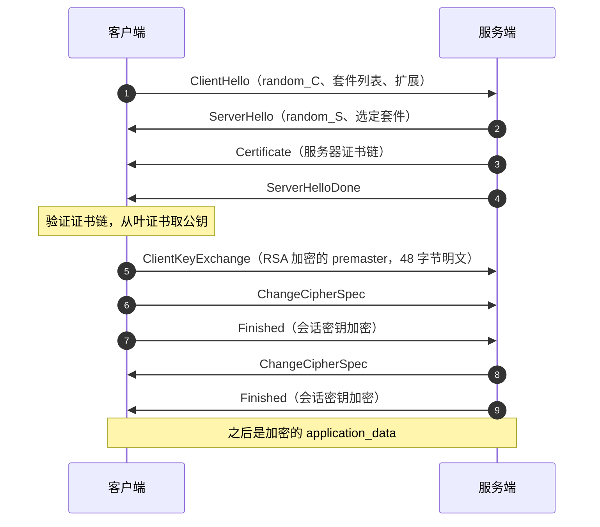
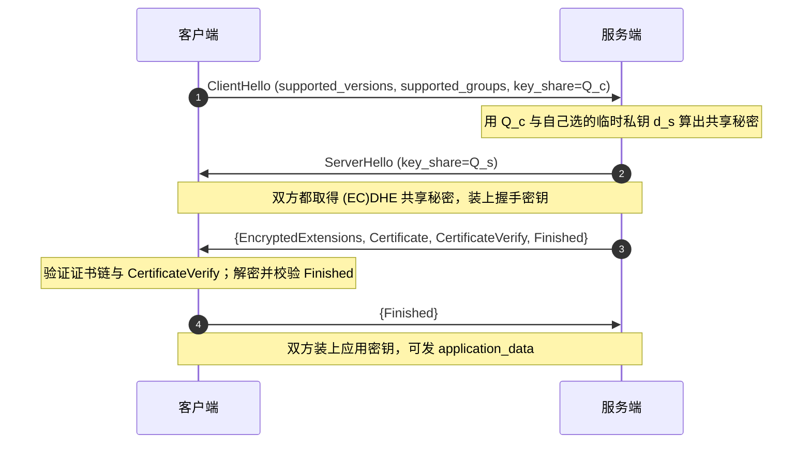
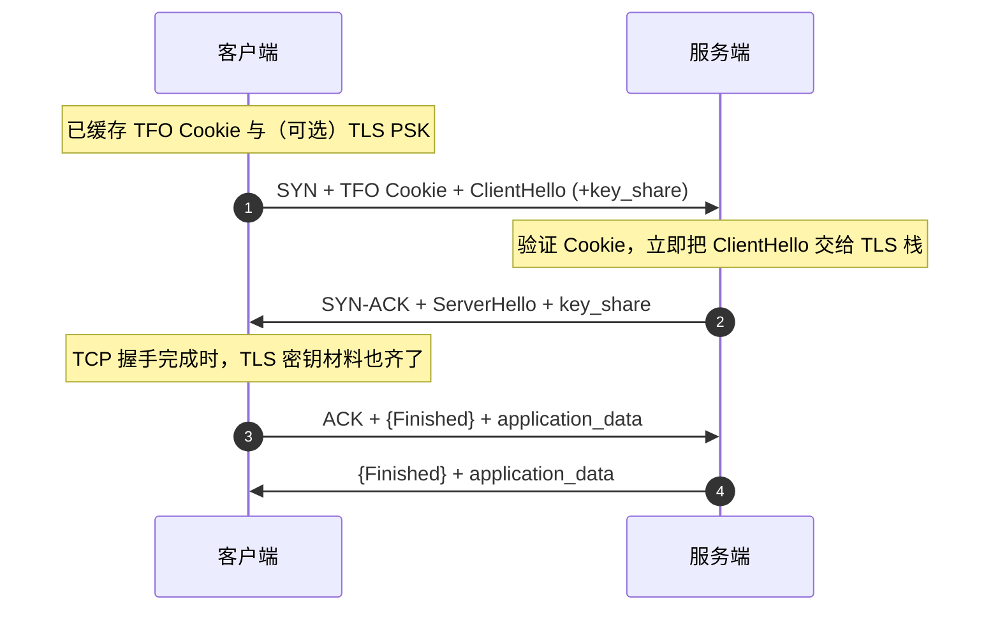

---
tags:
  - 基本功/网络
---

# TLS 与 HTTPS

`HTTPS` 的正式名字是 **HTTP over TLS**（来源：RFC 2818）：它由两段拼成，底下是完整的 `TLS`（Transport Layer Security）握手与记录层，上面跑的仍是 `HTTP` 的请求-响应语义。协议号、状态码、缓存字段一个字都没改，`TLS` 只负责在字节进出 TCP 之前把它们加密，并在通信前让两端就「用哪把钥匙」达成一致。

把 `HTTPS` 当成另一个应用层协议会推错三件事：`HTTP/2` 与 `HTTP/3` 都是 `HTTPS`，版本谱系属于应用层、与 `TLS` 版本正交；`TLS` 保护的是整条字节流，HTTP 的 `Host` 字段与 `SNI` 扩展是两套独立的主机名机制；握手失败发生在 `HTTP` 第一行之前，所以排查 `HTTPS` 问题先看 `TLS` 而不是业务日志。

本篇按机制组织：`TLS` 落在哪一层、密码套件怎么协商、两代密钥交换各自怎么防住中间人、`TLS 1.3` 砍掉了哪一次往返、证书链怎么验、会话怎么复用、性能损耗落在哪几段、以及握手失败怎么定位。HTTP 报文语法、方法状态码、缓存判定见 [[02-HTTP 协议]]；承载 `TLS` 记录的 TCP 状态机与 `TFO` 见 [[05-TCP 协议]]。

## 1. TLS 的位置与两层结构

这一节先固定 `TLS` 在协议栈里的坐标，再把它的两层拆开：哪一层谈密钥、哪一层管加密，以及记录层的封装格式给了上层什么约束。把这两层分清，后面所有握手分支（`RSA`、`ECDHE`、`TLS 1.3`）都落在同一个骨架上。

### 1.1 HTTPS 没有新增应用层协议

`HTTPS` 的线格式就是「在 `HTTP` 报文前面套一层加密」，协议本身定义为一句话：HTTP 在 TLS 之上运行（来源：RFC 2818 §2）。默认端口从 `80` 改成 `443`，这个端口只表示「先握手再谈 HTTP」，不引入新语义。

这条定位推出几个常被问到的结论。第一，`TLS` 与 `HTTP` 版本互不绑定：`HTTP/2` 与 `HTTP/3` 都要求走 `HTTPS`，但 `TLS 1.2` 与 `TLS 1.3` 都能承载 `HTTP/1.1`。第二，`TLS` 不知道自己在传 HTTP，它按字节流加密任意应用协议——`SMTP`、`IMAP`、`MQTT` 都能套同一层，这也是「TLS 在 HTTP 与 TCP 之间」这个说法的准确含义：它夹在应用层与传输层之间，属于**应用层与传输层之间的安全子层**。第三，同一台服务器上 `HTTP/1.1`、`HTTP/2`、`HTTP/3` 共用证书，证书与域名绑定，与 HTTP 版本无关。

`HTTPS` 需要保护的三类风险，对应到 `TLS` 的三种能力（来源：RFC 8446 §1）：

| 风险 | 攻击者能做什么 | TLS 用哪一层挡 |
| --- | --- | --- |
| 窃听 | 链路上读到明文 | 对称加密（记录层），协商出的会话密钥 |
| 篡改 | 改掉报文字节 | AEAD 的完整性校验 / `MAC`，`Finished` 覆盖握手转录 |
| 冒充 | 顶替服务端身份 | 非对称签名 + 证书链，绑定域名与公钥 |

### 1.2 记录层与握手层的分工

`TLS` 在实现上分成两层，职责完全不同（来源：RFC 5246 §6、§7；RFC 8446 §5、§4）：

- **握手层（handshake protocol）**：负责把「用哪套算法、用哪把钥匙」谈出来。所有握手报文（`ClientHello`、`ServerHello`、`Certificate`、`Finished` 等）都是握手层的消息类型，它们在记录层里以 `handshake` 类型的内容承载。
- **记录层（record protocol）**：负责把上层消息切成分片、加 `MAC`、加密、给一个 5 字节头，然后交给 `TCP`。应用数据与握手数据在记录层看来是同一种东西——一串要加密的字节，只是 `ContentType` 不同。

这条分工解释了一个最容易看错的观测现象：`tcpdump` 抓到的是 `TLS` 记录，那些「一条条 HTTP 报文」被包在记录里看不见；一条 `TCP` 报文里可以塞多个记录，一个记录也可以跨多条 `TCP` 报文。`ChangeCipherSpec` 更特殊，它是**独立的协议**（值为 20 的内容类型），不属于握手层，作用只是通知对端「从这个记录之后改用刚协商好的密钥」。

分层还预设了两次状态切换。握手层在协商过程中要经历「明文 → 握手密钥加密 → 应用密钥加密」三个阶段，每次切换由握手层的时序触发，记录层只是被动响应「用哪把密钥」。`TLS 1.2` 用 `ChangeCipherSpec` 显式通知切换点，`TLS 1.3` 把切换点绑死在消息顺序上（见 §5.3），两代的分工相同、通知方式不同。

### 1.3 记录层的封装格式

每条 TLS 记录由 5 字节头和一段不超过 2^14 字节（16384 字节）的载荷组成（来源：RFC 5246 §6.2.1；RFC 8446 §5.1 的 `TLSPlaintext.length` 上限同样是 2^14）。

```text
   TLS 记录层的封装（明文阶段）

   ┌────────────┬────────────┬────────────┬──────────────────────────────┐
   │ ContentType│ ProtocolVer│  length    │           fragment           │
   │    (1)     │    (2)     │    (2)     │        ≤ 2^14 字节           │
   └────────────┴────────────┴────────────┴──────────────────────────────┘
         │            │            │                      │
         ▼            ▼            ▼                      ▼
    22 handshake   0x0303     载荷字节数           上层消息的切片
    20 CCS         TLS 1.2    （不含 5 字节头）
    21 alert
    23 application_data

   长度上限 2^14 的来源：分片太大，密文出错时要重传的代价太高；
   分片太小，每片都要背 5 字节头与 MAC/标签，摊薄有效载荷。
```

`ProtocolVersion` 在握手期间是 `0x0303`（TLS 1.2），`TLS 1.3` 沿用这个值做兼容，真正的版本由 `supported_versions` 扩展协商（来源：RFC 8446 §4.2.1）。`TLS 1.3` 还在记录层动了三处：握手协商完成后的记录统一用 `application_data`（值 23）承载，真实内容类型挪到密文内部（来源：RFC 8446 §5.2）；引入了 `record_size_limit` 扩展让接收方声明能收的最大明文长度；`ChangeCipherSpec` 只作为中间盒兼容用的哑记录保留（来源：RFC 8446 附录 D.4）。

记录层是「加密」真正发生的地方，握手层只是把密钥准备好递下来。这也解释了为什么握手期间可以中途切换明文与密文：`ChangeCipherSpec` 一过，记录层用的密钥就换了一套。

### 1.4 记录层到底做了什么

记录层做三件事：把上层字节流切成 ≤2^14 的片、算完整性标签、加密。它**不做**的一件事常被误加在它头上 —— **来源认证**。

常听到的说法是「记录协议负责保护应用程序数据并验证其完整性和来源」，前半句成立、后半句不成立。记录层能保证的只有「这段字节没被改动、能被正确解开」，它不判断对面是谁 —— 身份由握手的证书链与 `CertificateVerify` 提供（见 §6.5）。换个说法：**如果攻击者本身是连接的一端，或合法拿到了会话密钥，记录层对他没有任何约束力**。

**每条记录带一个隐式序列号**，这是记录层最容易被忽略的机制（来源：RFC 8446 §5.3）：

- 收发双方各自维护一个 64 位序列号，每读写一条记录加一，**不写在报文里**，靠双方各自推算；
- 连接开始以及**每次换密钥**时重置为 0，换密钥后第一条记录 **MUST** 用序列号 0；
- 64 位不会回绕；实现若面临回绕，**MUST** 重新协商密钥或终止连接。

它有两个作用：给 AEAD 当 nonce 的原料，让相同明文产生不同密文；以及让重排与重放过不了校验 —— 序列号一旦对不上，解密或验证立即失败。

AEAD 的三个输入这样拼（来源：RFC 8446 §5.2、§5.3）：

```text
   TLS 1.3 记录层加密的输入

   ┌──────────────────────────────────────────────────────┐
   │ nonce  = write_iv XOR 序列号（64 位，左补零到 iv_len）  │ ← 每条记录都不同
   ├──────────────────────────────────────────────────────┤
   │ AAD    = opaque_type || legacy_record_version || length│ ← 5 字节记录头
   ├──────────────────────────────────────────────────────┤
   │ 明文   = content || ContentType || padding（全零）      │ ← TLSInnerPlaintext
   └──────────────────────────────────────────────────────┘
                        │
                        ▼   AEAD(key, nonce, 明文, AAD) → 密文 + 认证标签
```

三段的职责分得很干净：`write_iv` 是密钥派生出的固定值，**异或**序列号得到的 nonce 保证同一把密钥下不重复；AAD 把 5 字节记录头纳入认证范围，动 `length` 或动类型都会校验失败；真实的内容类型挪到了明文尾部，解开之后才知道这条是握手、告警还是应用数据（见 §1.3）。

`TLS 1.2` 的构造不同，规范自己标了这一点 —— `This is a different construction from that in TLS 1.2, which specified a partially explicit nonce`（来源：RFC 8446 §5.3 的注）：

| | `TLS 1.2`（`CBC` + `HMAC`） | `TLS 1.2`（AEAD） | `TLS 1.3` |
| --- | --- | --- | --- |
| 序列号用在哪 | 拼进 `MAC` 的输入 | 拼进 nonce 与 AAD | 异或进 nonce，另进 AAD |
| 完整性怎么算 | `HMAC(mac_key, seq \|\| type \|\| version \|\| length \|\| fragment)`，先算 `MAC` 再加密 | AEAD 标签 | AEAD 标签 |
| 代价 | MAC-then-Encrypt，padding oracle 与 Lucky Thirteen 由此而来 | —— | 只留 AEAD |

两处收尾：

**明文上限与密文上限不是同一个数。** `TLSPlaintext.length` 上限是 2^14，而 `TLSCiphertext.length` **MUST NOT** 超过 **2^14 + 256** —— 多出的 256 字节留给 AEAD 标签与填充；收到超限记录的实现 **MUST** 用 `record_overflow` 告警终止连接（来源：RFC 8446 §5.2）。

**填充是记录层自带的一个开关。** 所有加密记录都可以在内容之后追加一串零字节把密文撑大，用途是隐藏真实长度（来源：RFC 8446 §5.4）。填充字节 **MUST** 全为零；应用数据记录的明文长度可以为 0，用于在没有流量时生成掩护流量；反过来，握手与告警记录 **MUST NOT** 发送零长度明文，收到就用 `unexpected_message` 终止连接。

## 2. 密码套件与协商

两端在握手前必须就「用哪套算法」达成一致，这套算法打包叫密码套件。本节先拆开套件里的四个角色，再对比 `TLS 1.2` 与 `TLS 1.3` 的命名差异，最后逐字段看 `ClientHello` 与 `ServerHello` 把哪些选择带到线上去。

### 2.1 密码套件的四个角色

一次安全通信需要四个密码学角色各就各位，`TLS 1.2` 把它们打包成一个字符串叫「密码套件」（cipher suite）（来源：RFC 5246 附录 A.5）：

| 角色 | 解决什么 | TLS 1.2 里的取值举例 | TLS 1.3 里去哪了 |
| --- | --- | --- | --- |
| 密钥交换（密钥协商） | 双方如何在不安全信道上得到同一个共享密钥 | `RSA`、`DHE`、`ECDHE` | 移出套件，由 `supported_groups` + `key_share` 协商 |
| 认证（签名） | 服务端如何证明公钥是自己的 | `RSA`、`ECDSA` | 移出套件，由 `signature_algorithms` 协商 |
| 对称加密（AEAD） | 如何加密应用数据 | `AES_128_GCM`、`CHACHA20_POLY1305` | 保留在套件里 |
| 摘要 / PRF | 如何派生密钥；非 AEAD 套件里还兼做 `MAC` | `SHA256`、`SHA384` | 保留在套件里，作为 HKDF 的哈希 |

四个角色的分离不是形式主义。密钥交换决定「有没有前向保密」，认证决定「服务端身份能不能被冒充」，两者是独立的两道防线；把密钥交换从套件里拆出去（`TLS 1.3` 的做法）之后，一套套件不必再为每一种密钥交换各写一遍。同一份 AEAD 与哈希，配上任意一种密钥交换与任意一种签名算法，就能组合出可用套件，组合数从「逐套硬编码」降到「两两搭配」。

### 2.2 TLS 1.2 的命名与解读

`TLS 1.2` 套件的格式是 `TLS_<密钥交换>_<认证>_WITH_<对称加密>_<PRF哈希>`（来源：RFC 5246 附录 A.5）。当密钥交换与认证用同一套算法时，两个词合并成一个：

```text
   TLS_ECDHE_RSA_WITH_AES_128_GCM_SHA256
       │     │         │     │   │    │
       │     │         │     │   │    └─ PRF 哈希（密钥派生用），SHA-256
       │     │         │     │   └────── 分组模式 GCM（一种 AEAD）
       │     │         │     └────────── 对称密钥长度 128 位
       │     │         └──────────────── 对称算法 AES
       │     └────────────────────────── 认证算法 RSA（证书签名）
       └──────────────────────────────── 密钥交换 ECDHE（临时椭圆曲线 DH）

   TLS_RSA_WITH_AES_128_GCM_SHA256
       └──── RSA 同时充当密钥交换与认证，两词合一
```

这里有一处必须纠正的常见误读：`AES_128_GCM` 是 AEAD，它自带完整性校验（认证标签内置在加密里），`SHA256` 这一项在这个套件里**只承担 PRF（密钥派生）的哈希**，并不额外生成一个 `MAC`（来源：RFC 5246 §6.2.3.3）。只有非 AEAD 的套件（如 `AES_128_CBC_SHA`）才有独立的 `HMAC` 这一项。把这个后缀当成「消息认证算法」会在分析套件强度时把 AEAD 的标签与 HMAC 混为一谈。

### 2.3 TLS 1.3 把密钥交换移出套件

`TLS 1.3` 的套件只剩两个部分：`TLS_<AEAD>_<哈希>`，例如 `TLS_AES_128_GCM_SHA256`、`TLS_AES_256_GCM_SHA384`、`TLS_CHACHA20_POLY1305_SHA256`（来源：RFC 8446 §9.1）。密钥交换由 `supported_groups` 与 `key_share` 扩展协商，签名算法由 `signature_algorithms` 扩展协商，证书由 `Certificate` 消息携带。

规范强制的套件清单与实现默认清单要分开看。`RFC 8446 §9.1` 要求任何 `TLS 1.3` 实现必须支持 `TLS_AES_128_GCM_SHA256`，并对 `TLS_AES_256_GCM_SHA384` 与 `TLS_CHACHA20_POLY1305_SHA256` 作了「应当支持」的建议；`TLS_AES_128_CCM_SHA256` 与 `TLS_AES_128_CCM_8_SHA256` 面向受限设备，不是通用部署的默认项。`openssl s_client` 报出的那几种套件是某个具体版本的支持集合，不是规范的完整清单。

套件变少本身是一条安全机制。`TLS 1.2` 允许协商的古老套件给了**降级攻击**空间：中间人伪造或改写客户端的 `ClientHello`，把其中较强的套件删掉，逼服务端选一个弱套件，从而利用已知弱点破解密文。`TLS 1.3` 把可选集合压到只含 AEAD 与前向保密的密钥交换，可降级的选项消失，攻击面随之收窄。

为让降级试图可被察觉，`TLS 1.3` 在 `ServerHello` 的 `random` 末 8 字节里埋了一个标记：若服务端支持 1.3 但最终与只支持 1.2 的客户端谈成 1.2，这 8 字节被写成 `DOWNGRD\x01`；谈成 1.1 时写 `DOWNGRD\x00`（来源：RFC 8446 §4.1.3）。客户端若自己也支持 1.3 却收到这个标记，就判定链路上有降级行为并中止。这条检查把「悄悄降级」变成了可检测事件。

### 2.4 ClientHello 与 ServerHello 的字段

握手的第一步是两端把「我能用什么、我选了什么」摊开。两条报文的字段决定了后面所有分支（来源：RFC 8446 §4.1.2、§4.1.3；RFC 5246 §7.4.1）：

| 字段 | 所在报文 | 作用 | 缺失或写错的后果 |
| --- | --- | --- | --- |
| `legacy_version` / `supported_versions` | 二者都有 | 声明支持的 `TLS` 版本 | `TLS 1.3` 必须用扩展协商，只看 `legacy_version` 会误判成 1.2 |
| `random`（32 字节） | 二者都有 | 客户端/服务端各自的随机数，参与密钥派生 | 复用会破坏 `Finished` 唯一性 |
| `cipher_suites` | `ClientHello` | 客户端支持的套件列表，按偏好排序 | 服务端挑不出交集就回 `handshake_failure` |
| `compression_methods` | `ClientHello` | 压缩算法（历史上引入过 CRIME 攻击） | `TLS 1.3` 已彻底移除压缩 |
| `extensions` | 二者都有 | `SNI`、`ALPN`、`supported_groups`、`key_share`、`signature_algorithms` 等 | 见各小节 |
| `session_id` | 二者都有 | 会话复用标识；`TLS 1.3` 用它做兼容 | 非空但服务端不接受 → 退回完整握手 |
| `server_name`（SNI） | `ClientHello` | 客户端要访问的域名 | 缺失时服务端只能回默认证书，见 §9 |
| `alpn` | 二者都有 | 应用层协议协商，`h2` / `http/1.1` | 无交集时服务端回 `no_application_protocol` 告警 |

`ServerHello` 之外的握手消息各有分工：`EncryptedExtensions` 承载与密钥协商无关的扩展（如 `ALPN` 结果、`early_data` 确认），`Certificate` 携带证书链，`CertificateVerify` 用证书私钥对握手转录签名，`Finished` 校验整段握手有没有被改过。`TLS 1.3` 里从 `ServerHello` 之后的所有握手消息都在握手密钥下加密，抓包看不到明文——这也是「`TLS 1.3` 抓包只能看到 `ClientHello` 和 `ServerHello`」的原因。

`extensions` 的排列顺序在 `TLS 1.3` 里被规范限定：`ClientHello` 的扩展序列中，`pre_shared_key` 必须放在最后，`key_share` 紧在它之前（来源：RFC 8446 §4.2.11 与 §4.2.8 的排序要求）。这条约束看似琐碎，实际是给服务端一个「先看有没有 `key_share` 能用于 `HelloRetryRequest` 判断、最后再处理 `PSK`」的确定性解析顺序，实现若违反会被判为非法报文。

## 3. RSA 密钥交换的握手

`RSA` 密钥交换是理解握手的起点：它没有临时密钥、没有签名，全部安全建立在「服务端私钥只有服务端有」这一条上。本节把四个往返拆成字段、密钥派生与 `Finished` 校验，再从原理上说明它为什么给不了前向保密。

### 3.1 一次 RSA 握手的报文往返

`RSA` 密钥交换下的完整握手是四个消息往返（两次 RTT）：客户端先打招呼，服务端把证书给出来，客户端把密钥材料加密后送回去，服务端确认（来源：RFC 5246 §7.3 的完整握手消息流）。



四个往返对应四组消息：`ClientHello`；`ServerHello` + `Certificate` + `ServerHelloDone`；`ClientKeyExchange` + `ChangeCipherSpec` + `Finished`；服务端自己的 `ChangeCipherSpec` + `Finished`。`RSA` 套件里没有 `ServerKeyExchange`——服务端不需要额外交互式参数，因为密钥交换靠的就是证书里那把 RSA 公钥。

为什么是四个往返而不是两个？因为密钥材料的产生方向是单向的：客户端要先看到服务端的证书与公钥，才能加密 `premaster` 发回去；服务端要先收到 `premaster`，才能算出会话密钥、才能验 `Finished`。这条依赖链把「打招呼」与「送密钥」拆成了两次往返，中间隔着证书验证。`ECDHE`（见 §4.5）与 `TLS 1.3`（见 §5.1）省下往返的做法，正是想办法让客户端的密钥材料不必等服务端回应就能先算出来。

### 3.2 各条报文的字段与作用

逐条看这四个往返里各消息携带了什么（来源：RFC 5246 §7.4）：

- **`ClientHello`**：协议版本、`random_C`（32 字节）、套件列表、扩展。`random_C` 参与会话密钥派生，同时也是后面对端防重放的输入。
- **`ServerHello`**：协议版本、`random_S`、从客户端列表里选中的**单个**套件、可选的 `session_id`。
- **`Certificate`**：服务端证书链，叶证书在前、根证书通常不发（根由客户端预置）。
- **`ServerHelloDone`**：没有字段，纯信号，表示「我这一轮说完了」，等客户端回应。
- **`ClientKeyExchange`**：`RSA` 套件里携带的是用服务端公钥加密后的 `premaster secret`（见 §3.3）。
- **`ChangeCipherSpec`**：值恒为 `1`，通知对端「下一条记录起改用新密钥」。它不是握手消息，不进入握手转录。
- **`Finished`**：加密后的 `verify_data`，是对整段握手的校验（见 §3.5）。

两条容易被忽略的状态语义。第一，服务端发送的 `Certificate` + `ServerHelloDone` 是**同一个往返里的连续消息**，它们可以分别装进不同的 TLS 记录、也可以合进同一个 TCP 报文，接收方按握手头里的类型与长度重组，不依赖 TCP 的分段边界。第二，`ServerHelloDone` 之后服务端进入等待状态，它不知道客户端会走完整握手还是简写握手，这两种回应在报文字段上就能区分：完整握手带 `ClientKeyExchange`，简写握手不带。

### 3.3 premaster secret 的生成与 48 字节格式

`RSA` 密钥交换里，`premaster secret` 由客户端单方面生成，结构固定为 48 字节（来源：RFC 5246 §8.1.1）：

```text
   RSA premaster secret 的 48 字节布局（RFC 5246 §8.1.1）

   ┌────────────────────────┬──────────────────────────────────────────────┐
   │ client_version (2 字节)│            random (46 字节)                  │
   └────────────────────────┴──────────────────────────────────────────────┘
        │                                     │
        ▼                                     ▼
   客户端 offer 的版本号              密码学随机数
   （不是服务端选定的版本）           由客户端的伪随机数生成器产生

   服务端收到的前 2 字节若与协商版本不一致 → 判为握手失败
   且服务端在失败时用一个随机值冒充 premaster，避免变成解密预言机
   （来源：RFC 5246 §7.4.7.1）
```

前两个字节放版本号不是冗余。它是防版本回滚与防 Bleichenbacher 式解密预言机的一道检查：攻击者若篡改版本号，服务端解出的前两字节与协商版本对不上，会走「用随机值当 premaster」的分支而非直接报错，从而不向攻击者泄漏「这条密文是否解出了合法 padding」的信息。这条检查就是后来 ROBOT 攻击所针对的对象，也是 `RSA` 密钥交换在 `TLS 1.3` 被彻底移除的原因之一。

「用随机值冒充」这一步是整条防御的关键。解密 `premaster` 的失败情形有多种：密文长度不对、padding 格式不合法、首两字节版本不符。若实现把这些情形分别报错或分别消耗不同的时间，攻击者就能用「回一个不同的错」当 oracle，构造大量密文逐个还原明文。规范的处置办法是让所有失败路径都返回「一个随机生成的 48 字节值」，让外部观测不到差异。实现若漏掉其中一条路径，Bleichenbacher 攻击就重新可行——ROBOT 一类工具扫描的正是这个差异。

### 3.4 从 premaster 到会话密钥

双方拿到三个材料——`random_C`、`random_S`、`premaster secret`——之后，各自用同一套计算推出四把密钥（来源：RFC 5246 §8.1）：

```text
master_secret = PRF(premaster_secret, "master secret",
                    random_C + random_S)[0..47]        ← 48 字节

key_block     = PRF(master_secret, "key expansion",
                    random_S + random_C)               ← 注意顺序与上一步相反

key_block 再被切成：客户端写入 MAC + 密钥、服务端写入 MAC + 密钥、
                   客户端写入 IV、服务端写入 IV（AEAD 套件切成两个写密钥与两个 IV）
```

两处细节值得记。第一，`PRF` 的种子在推导 `master_secret` 时是 `random_C + random_S`，推导 `key_block` 时是 `random_S + random_C`，顺序被有意反转，避免同一段种子被两处复用。第二，客户端与服务端的密钥材料不同（一个客户端写密钥、一个服务端写密钥），所以两端各持一套互不相同的写密钥，防止把「自己发出的密文」当成「对方发来的」重新读入。

AEAD 套件把 `key_block` 切成两个写密钥与两个初始向量（`IV`）后，两端的读写方向就完全分开了。这条「双向各用一把写密钥」的设计还有一个安全收益：客户端与服务端使用不同密钥意味着密钥流不会重叠，同一明文在两端的密文不同，降低了密钥复用带来的已知明文风险。

### 3.5 Finished 为什么能挡住篡改

`Finished` 是握手阶段最后一条带密码学校验的消息，它的值由整段握手转录算出（来源：RFC 5246 §7.4.9）：

```text
verify_data = PRF(master_secret, finished_label,
                  Hash(handshake_messages))[0..11]

finished_label = "client finished"（客户端发）/ "server finished"（服务端发）
handshake_messages = 从 ClientHello 起到本条 Finished 之前收到的全部握手消息
                     （含消息类型与长度字段）
verify_data 长度 = 12 字节
```

推理链是这样的：`handshake_messages` 覆盖了之前每一条握手消息的原文，攻击者只要改动了其中任意一字节（比如把 `Certificate` 里某个中间证书换掉、或把 `ServerHello` 里选定的套件改掉），重算出的哈希就变了；`verify_data` 又用只该会话双方知道的 `master_secret` 作为 PRF 密钥，攻击者没有 `master_secret` 就算不出新的 `verify_data`。所以对端只要重算一次、比对失败，就能判定握手被改过并中止连接。再往后，`Finished` 本身是在刚协商出的密钥下加密发送的，攻击者既改不了内容也伪造不了。

`Finished` 覆盖的顺序还解释了它为什么能防重放：不同连接里 `random_C`、`random_S` 不同，转录不同，`verify_data` 就不同，捕获的 `Finished` 换到新连接里必然对不上。

转录的边界需要精确：`handshake_messages` 只含**握手层**的消息，`ChangeCipherSpec` 是独立协议、不算在内；`HelloRequest` 这类消息也不进入转录。这条边界决定了 `Finished` 管的是「协商内容」的完整性，而「切换时机」的完整性由消息顺序本身保证。`TLS 1.3` 的 `Finished` 覆盖范围扩到包含更早的握手消息的哈希链，机制等价。

### 3.6 RSA 密钥交换为什么没有前向保密

前向保密（forward secrecy）的定义是：**长期密钥（这里是服务端 RSA 私钥）将来泄漏时，不能用来解出过去已记录的会话密文**。`RSA` 密钥交换不满足这条，原因链条可以从报文一路推下来。

第一步，会话密钥的来源是 `premaster secret`。`master_secret` 由 `PRF(premaster, ...)` 算出，`key_block` 又由 `master_secret` 算出，所以拿到 `premaster` 就拿到了整条链的输出（见 §3.4）。

第二步，`premaster` 在链路上的形态是「用服务端 RSA 公钥加密的一段密文」，公钥公开、私钥只在服务端。`ClientKeyExchange` 里的这段密文对攻击者是可见的（握手在 `ChangeCipherSpec` 之前是明文传输）。

第三步，攻击者把历史流量录下来，等到某天服务端私钥泄漏。此时他用私钥对每条录下的 `ClientKeyExchange` 密文做一次 RSA 解密，就得到每条会话的 `premaster`；再配合该会话明文可见的 `random_C`、`random_S`，按 §3.4 的式子重算 `master_secret` 与 `key_block`，于是这条会话的全部密文都能解开。

第四步，结论：**只要长期私钥泄漏，所有历史 `RSA` 会话一起失守**。密钥交换里没有引入任何「本次会话独有、用完即弃」的秘密——`premaster` 虽然是一次性的，但它是被长期密钥保护着送上路的，长期密钥一旦失守，它的一次性就失去意义。对比之下，`ECDHE` 的 `premaster` 来自双方各自当场生成的临时私钥，长期私钥只用来**签名**而不是**加密**这段材料，签名不是可逆运算，所以私钥泄漏也反推不出临时私钥（见 §4.5）。

把这条推理落成可核对的判据：判断一个握手方案有没有前向保密，只看「会话密钥的输入里有没有一个只存在于本次、且不被长期密钥保护地传输的临时秘密」。`RSA` 密钥交换里三个输入是 `random_C`、`random_S`、`premaster`——前两个明文可见，`premaster` 由长期公钥加密。攻击者要复原它，有两条路：拿到长期私钥做一次解密，或绕过加密直接猜。前者正是前向保密要防的情形，而方案本身把 `premaster` 的保密性完全托付给了长期私钥。

再补一层量化直觉：`premaster` 是 48 字节里除去 2 字节版本号后的 46 字节随机数，约 368 位熵，暴力猜不可行；所以 `RSA` 密钥交换的会话密钥强度实际上等于「服务端 RSA 私钥的保密强度」，而不是「本次会话的熵」。`ECDHE` 的输入里多了一个 `d_c · Q_s`，这个值只由本次两个临时私钥决定，攻击者即便持有服务端证书私钥也推不出 `d_s`（签名不可逆），于是会话密钥的保密不再挂靠长期私钥。

这条差别在运维上有一个可观测的后果：用 `RSA` 密钥交换时，一旦怀疑私钥泄漏，处置方式是「吊销证书 + 换密钥 + 通知所有历史会话作废」，因为录下的历史密文都需要当作已泄漏；用 `ECDHE` 时，泄漏处置只需吊销与换密钥，历史录包仍然安全。证书轮换的成本因此从「全量重放风险」降到「一次证书更新」。

`RSA` 密钥交换还有第二层问题：解密 `ClientKeyExchange` 密文这个动作本身会暴露格式信息。若实现没有按 §3.3 的规则把所有失败情形都伪装成「用随机值当 premaster」，攻击者就能用大量构造密文做 oracle，逐字节还原出 `premaster`（Bleichenbacher 攻击；针对 TLS 实现的具体形式被称为 ROBOT）。前向保密的缺失是原理性的，这层是工程实现上的额外风险，两者叠加使得 `RSA` 密钥交换在 `TLS 1.3` 中被移除——`RFC 8446 §1.2` 明确列出了移除的算法集合，其中包含静态 `RSA` 与静态 `DH`。

`TLS 1.2` 遗留 `RSA` 密钥交换，是为了兼容老客户端；新部署的默认套件应当全部落在 `ECDHE` 之上。这也解释了为什么在 `openssl s_client -tls1_2` 的输出里，现代站点给出的套件几乎全是 `TLS_ECDHE_*`，`TLS_RSA_*` 只在降级到很老的栈上才会出现。

判断一个线上服务的握手是否还在用 `RSA` 密钥交换，看协商出的套件前缀即可：出现 `TLS_RSA_WITH_*` 说明用上了，出现 `TLS_ECDHE_*` 或 `TLS_AES_*`（1.3）则没有。这条判据同时也是「私钥泄漏应急演练该按哪种范围准备」的输入——套件前缀决定了历史录包要不要当作已泄漏。

## 4. 密钥交换的演进：DH、DHE 与 ECDHE

`RSA` 的缺陷推动了密钥交换的换代，主线是把「共享密钥怎么产生」从「长期密钥加密」换成「当场算一个用完即弃的」。本节从离散对数讲起，对比有限域与椭圆曲线两种群，最后把 `ECDHE` 防中间人的推理补全。

### 4.1 离散对数难题

`DH`（Diffie-Hellman）密钥交换的安全性建立在一个单向问题上：模幂容易算，反过来求指数极难（来源：RFC 2631 §2.2 对有限域 DH 的参数描述；椭圆曲线版本见 RFC 7748）。给定底数 `a` 与模数 `p`，算 `g^x mod p` 只需要多项式次乘法；反过来，已知 `a`、`p` 与结果 `b`，求满足 `a^x ≡ b (mod p)` 的 `x`，目前的算法复杂度让它在 `p` 足够大时不可行。

这里有两层「难」要分开：一是**模幂本身单向**（正向易、反向难），二是**离散对数在大素数模下没有已知的多项式时间算法**。第二条的强弱随群的选择而变化——这正是 `DH`（有限域）与 `ECDHE`（椭圆曲线）的区别所在（见 §4.4）。

举一个可手算的例子看清两个方向的差别。取小素数 `p = 23`、底数 `g = 5`，指数 `x = 6`：正向算 `5^6 mod 23`，先算 `5^2 = 25 ≡ 2`，再算 `5^4 ≡ 4`，最后 `5^6 = 5^4 · 5^2 ≡ 4 · 2 = 8`，三次乘法就出结果。反向给定 `g = 5`、结果 `8`、模 `23`，问指数是多少，只能一个个试：`5^1=5`、`5^2=2`、`5^3=10`、`5^4=4`、`5^5=20`、`5^6=8`，试到第 6 次才命中。`p` 小的时候两者都便宜；把 `p` 换成一个 3072 位的大素数，正向仍是多项式次的模幂，反向的最佳已知算法（数域筛法一类的亚指数算法）的代价随 `p` 的位数超多项式增长，这才撑起了「不可行」的判断。

这条「正向易、反向难」的单向性对参数选择有硬要求：`p` 必须是安全素数，或至少满足可抵抗已知离散对数算法的结构，`g` 的阶要足够大（通常取 `p` 的一个大素数因子作为子群的阶）。参数选错会让离散对数问题变容易，`DH` 的安全性随之崩塌，这也是 `TLS 1.3` 只允许 `ffdhe` 这类**预先定义好的有限域群**、不允许自定义参数的原因之一。

### 4.2 有限域上的 DH 与 DHE

有限域 `DH` 的流程是：双方公开约定模数 `p` 与底数 `g`，各自生成一个保密指数作为私钥（记为 `a`、`b`），计算公钥 `A = g^a mod p`、`B = g^b mod p` 并交换。双方各用自己的私钥乘对方的公钥，得到同一个值：

```text
   小红算：B^a mod p = (g^b)^a mod p = g^(ab) mod p
   小明算：A^b mod p = (g^a)^b mod p = g^(ab) mod p
                        ↑ 相等，即共享密钥 K
```

攻击者从公开的 `p`、`g`、`A`、`B` 出发，要么解离散对数得到 `a` 或 `b`，要么直接算 `g^(ab)`，两者难度相当，这是 `DH` 的安全假设。

「静态」`DH` 有致命弱点：若一方的私钥长期固定不在每次会话更新，攻击者就会截获海量共享同一私钥的会话记录，随着数据积累，破解该私钥的代价被摊薄，一旦破出，之前所有会话一起失守——同样不具备前向保密。`DHE` 中的 `E` 是 **ephemeral（临时的）**：双方的私钥在每次握手里当场随机生成，用完即弃。这样每次会话的 `(a, b)` 各不相同、彼此独立，破解一次不影响其他会话，前向保密由此成立（来源：RFC 8446 §1.2 对 `DHE` 与静态 `DH` 的区分）。

`DHE` 与 `DH` 的差别只落在私钥的生存期上，与群的选择无关。这一点在配置时容易混淆：`DHE` 套件描述的是「用有限域群 + 临时私钥」，`ECDHE` 描述的是「用椭圆曲线群 + 临时私钥」。把 `DHE` 换成 `ECDHE` 是换群，把静态 `DH` 换成 `DHE` 是换临时性——两件事各自独立，前向保密由后者提供，性能差异由前者决定。

### 4.3 椭圆曲线群与 ECDHE

`ECDHE` 把 `DHE` 的运算群从「大素数模的整数乘法群」换成「椭圆曲线上的点群」。曲线与基点 `G` 公开，双方各自生成临时私钥 `d`，算出公钥点 `Q = d · G`，交换公钥后各自计算同一个点：

```text
   小红算：d1 · Q2 = d1 · (d2 · G) = (d1 · d2) · G
   小明算：d2 · Q1 = d2 · (d1 · G) = (d1 · d2) · G
                        ↑ 同一个点，取它的 x 坐标作为共享密钥
```

这里用的是曲线点群上标量乘法的交换律与结合律，不是模乘。安全假设换成**椭圆曲线离散对数问题**：已知 `G` 与 `Q = d · G`，反求 `d` 极难。曲线与基点的选择由命名曲线给出，`RFC 8446 §4.2.7` 的 `supported_groups` 扩展列出可用的组，常见的有 `x25519`、`secp256r1`、`secp384r1`。

`ECDHE` 相对有限域 `DHE` 的实际优势在计算量。在同等安全强度（例如 128 位）下，椭圆曲线所需的密钥长度远小于有限域：`secp256r1` 用 256 位就能达到约 128 位安全强度，而有限域 `DH` 要达到同样强度需要约 3072 位的模数。标量乘法在更短的操作数上做，握手期间服务端与客户端各自要做的运算量随之下降，这是 `ECDHE` 成为现代默认选择的直接原因。

点群还有一个有限域没有的好处：曲线上的点集合是一个有限阿贝尔群，点的阶由曲线参数确定，不存在「选的 `g` 阶太小」那类参数错误。曲线的安全强度由其上最好的离散对数算法的复杂度决定，`x25519` 这类曲线被设计成抗已知攻击，且只输出 `x` 坐标，天然规避某些侧信道差异（来源：RFC 7748 §5）。

### 4.4 两种群与两种实现的对照

把四组概念摊平对比，能看清「换群」和「换临时性」是两件独立的事：

| 维度 | 静态 DH | DHE | ECDHE |
| --- | --- | --- | --- |
| 运算群 | 有限域（大素数模） | 有限域（大素数模） | 椭圆曲线点群 |
| 私钥是否每次更新 | 否（至少一方固定） | 是 | 是 |
| 前向保密 | 无 | 有 | 有 |
| 128 位安全强度所需密钥长度 | 约 3072 位 | 约 3072 位 | 约 256 位 |
| 握手计算量 | 低 | 高（大量大数模乘） | 低（短操作数标量乘） |
| TLS 1.3 是否允许 | 否 | 允许（`ffdhe` 组） | 允许，主流默认 |

`TLS 1.3` 允许 `ffdhe` 组（有限域 `DHE`）但主流实现默认走 `x25519`，因为曲线在网络侧的计算与带宽都更省。`x25519` 是 `Curve25519` 上的一种 Montgomery 曲线实现，只输出 `x` 坐标，天然抵抗某些侧信道攻击（来源：RFC 7748 §5）。

换群的收益是双向的：带宽上，公钥从数百字节降到 32 字节；计算上，标量乘法的操作数从数千位降到 256 位。这两项都直接落在 §8.4 的「非对称运算开销」与 §8.6 的「证书链大小」上，是协议层优化里性价比最高的一步。

### 4.5 防中间人的完整推导：签名加 Finished

`ECDHE` 握手新增了一条 `ServerKeyExchange`（`TLS 1.2`）消息，服务端在里面给出「曲线参数 + 自己的临时公钥」，并对这段内容签名（来源：RFC 4492 §5.4；RFC 8422 §5.4）。为什么这样做能挡住中间人，推理要一步一步来。

**第一步，先看没有签名会发生什么。** 如果服务端只把临时公钥 `Q_s` 明文发出，中间人 `M` 可以在链路上把它换成自己的临时公钥 `Q_m`。客户端以为 `Q_m` 是服务端的，于是按 `d_c · Q_m` 算出共享密钥；`M` 则分别与客户端算出 `d_m · Q_c`、与服务端算出 `d_m' · Q_s`，等于在两条腿上各持一把钥匙。此后 `M` 解密客户端数据、再用与服务端共享的密钥重新加密转发，全程对两端透明。这就是中间人。

**第二步，签名把这把临时公钥钉死到证书私钥上。** 服务端用自己的证书私钥对 `ServerKeyExchange` 的内容签名。`TLS 1.2` 里被签名的数据是 `client_random + server_random + ServerECDHParams`（来源：RFC 4492 §5.4）。客户端拿到后用叶证书里的公钥验证签名，签名通过就说明两点：这段参数确由持有该证书私钥的一方发出，且内容没被改动。

**第三步，把随机数也放进签名输入，堵住重放。** 被签名的数据里带了本会话的 `client_random` 和 `server_random`。攻击者即便录下上一次握手合法的 `ServerKeyExchange` 原样重放，本次的随机数不同，签名验证就失败。这一步让「旧参数换新会话」不成立。

**第四步，中间人为什么换不掉参数。** 中间人要替换 `Q_s` 就得重签，而他只有自己的证书私钥、没有服务端证书的私钥，无法对「服务端证书公钥能验证通过」的签名负责；他若改用自己证书的私钥签名，客户端验证时会发现签名者与目标域名不匹配（证书链落到不受信任的根或被域名检查拦下，见 §6）。签名验证这一关不过，握手就中止。

**第五步，`Finished` 兜住整段握手的完整性。** 签名的只覆盖 `ServerKeyExchange` 一段，握手其他消息（套件选择、证书本身、客户端回送的临时公钥）由 `Finished` 统一覆盖（来源：RFC 5246 §7.4.9）。任何一处被改，`verify_data` 就变，对端重算比对即失败。`Finished` 覆盖的是完整转录，因此补齐了单点签名管不到的范围。

**第六步，临时私钥泄漏的后果被限制在单次会话。** 双方用完临时私钥即弃，会话密钥由 `d_c · Q_s` 得到，不进证书、不落盘。攻击者日后拿到服务端证书私钥也没用——证书私钥只参与签名，签名不可逆（不同于 §3.6 里 `RSA` 用私钥解密），反推不出 `d_s`。这就是前向保密的来源：长期密钥与每次会话的共享密钥之间没有「可逆」的通路。

把六步合起来：证书链解决「这把公钥属于谁」，签名解决「这段临时参数是不是它发的」，随机数解决「是不是本次会话新发的」，`Finished` 解决「整段握手有没有被改」，临时性解决「事后泄漏能不能追溯」。四道机制各管一段，缺任何一条都可能被绕过。

两代握手里这套机制的位置不同，但缺一不可：`TLS 1.2` 的签名落在 `ServerKeyExchange` 的 `ServerECDHParams` 上，`TLS 1.3` 的签名落在 `CertificateVerify` 覆盖的转录哈希上。`TLS 1.3` 把签名对象从明文参数改成转录哈希，好处是被签名的内容囊括了此前全部握手消息，一次签名同时钉住了套件选择、证书与曲线参数（签名输入的逐段构成与两条实现约束见 §6.5）。

失败模式也由此可定位。若客户端在 `ServerKeyExchange` / `CertificateVerify` 这一步报签名验证失败，可能的原因有三种：服务端证书链与私钥不匹配（部署时把证书与私钥配错了）、中间盒改写了 `ClientHello` 但没同步改签名输入、或客户端与服务端对签名算法（如 `rsa_pss_rsae_sha256` 与 `rsa_pkcs1_sha256`）的支持集合没有交集。这三条都能通过 `openssl s_client` 的握手输出与服务端日志区分。

把这条检查放进日常巡检也简单：定期用客户端模拟一次完整握手，若 `ServerKeyExchange` / `CertificateVerify` 一类的签名环节开始报错，先查证书与私钥的配对与签名算法集合，再查链路上有没有中间盒在改写 `ClientHello`。签名环节是 `ECDHE` 与 `TLS 1.3` 里唯一依赖长期密钥的一步，它出问题往往指向证书部署而不是密钥交换本身。

## 5. TLS 1.3：砍掉的那一个往返

`TLS 1.3` 对 `TLS 1.2` 的改动集中在「更早拿到密钥」与「更少算法选择」两点上。本节说明 1-RTT 具体砍掉哪三处、`key_share` 预发怎么让密钥提前可用、`ChangeCipherSpec` 为什么退场，以及 `0-RTT` 的可重放边界。

### 5.1 1-RTT 具体砍掉了什么

`TLS 1.2` 完整握手要两次 RTT，`TLS 1.3` 压到一次（来源：RFC 8446 §1.2 与 §2 的握手概览）。省下的这一趟来自三处结构性改动，而非「合并报文」式的文字游戏：

```text
   两次 RTT 压成一次，砍在哪三处

   TLS 1.2：ClientHello ──────────▶ ① 密钥材料留到第三趟才发
            ◀──── ServerHello + Certificate + ServerHelloDone
            ClientKeyExchange ───▶ ② ChangeCipherSpec 是一个独立往返
            ◀──── CCS + Finished         ③ 套件里混着非 AEAD 选项
            ─────────────────────────────────────────────────────
   TLS 1.3：ClientHello+key_share ─▶ 公钥随问候一起预发
            ◀──── ServerHello+key_share
                  {EncryptedExtensions, Certificate, CertificateVerify, Finished}
            {Finished} ───────────▶ 服务端 Hello 后即可算出握手密钥
            应用数据可立即发（1-RTT）
```

三处改动分别是：客户端在 `ClientHello` 里就把椭圆曲线的公钥（`key_share`）带上，服务端在 `ServerHello` 里回自己的公钥，双方在服务端第一条消息后就能算出握手密钥（见 §5.2）；`ChangeCipherSpec` 作为协商步骤退场，不再占一个往返，只留哑记录做兼容（见 §5.3）；套件只保留 AEAD 与 `(EC)DHE`/`PSK`，去掉降级攻击面（见 §2.3）。

`TLS 1.3` 还移除了 `RFC 8446 §1.2` 列出的整批旧特性：静态 `RSA`、静态 `DH`、`CBC` 模式、`RC4`、`SHA-1`、`MD5`、压缩、自定义 `DHE` 组、重协商。压缩被移除与 CRIME 攻击直接相关——压缩率依赖明文内容，攻击者可以通过观察密文长度差反推明文里的秘密，禁用压缩从根本上关掉这个旁路。

去重协商还解决了一个状态管理问题。`TLS 1.2` 允许在一条连接上重协商，重协商期间新旧密钥并存，实现要小心处理「在哪个状态上应用哪把密钥」，历史上多次出现相关漏洞。`TLS 1.3` 干脆取消重协商，需要重新认证时用握手后的 `CertificateRequest`（`post_handshake_auth` 扩展，来源：RFC 8446 §4.2.6），状态机随之简化。

### 5.2 KeyShare 预发与 ServerHello 后即加密

`TLS 1.3` 握手的密钥可用点比 1.2 早得多，时序如下（来源：RFC 8446 §4.2.8、§4.2.7 与 §2）：



关键点是握手密钥的安装时机：服务端算出共享秘密后，`ServerHello` 之后的所有握手消息都用握手密钥加密（`{...}` 表示这一段是密文）。客户端在 `ServerHello` 到达时也算出共享秘密，于是能解密后续握手消息并验证 `Finished`。客户端发完自己的 `Finished`，双方装上应用密钥，一次 RTT 内既可开始传应用数据。

一条边界常被忽略：客户端 `key_share` 里给出的组如果服务端都不接受，服务端会回 `HelloRetryRequest`（来源：RFC 8446 §4.1.4），客户端按新组重发 `ClientHello`，这一次往返就白花了，总数回到 2-RTT。所以客户端应把最可能被接受的组（现代实现通常是 `x25519`）放在 `supported_groups` 前面，减少被要求重试的概率。

`TLS 1.3` 的密钥派生链也换了（来源：RFC 8446 §7.1）：用 `HKDF-Extract`/`Expand`（来源：RFC 5869）串起 `early secret → handshake secret → master secret` 三段，每段再派生出对应的流量密钥。`premaster secret` 这个概念被 `(EC)DHE` 共享秘密取代，`master secret` 的含义也从「固定 48 字节」变成「派生出的一张流量密钥表」。

派生链的第三段还有个细节：`early secret` 在没有 `PSK` 时用全零输入垫底，有 `PSK`（会话恢复或 `0-RTT`）时用票据里的 `PSK` 作为输入。这条分支把「完整握手」与「带 `PSK` 的握手」统一进同一套 `HKDF` 调用，区别只在输入材料，实现不必维护两套密钥派生逻辑。

### 5.3 ChangeCipherSpec 退场与只留 AEAD

`TLS 1.2` 的 `ChangeCipherSpec` 是一个独立的内容类型（值 20），它标记「切换点」，本身要占一个消息位置。`TLS 1.3` 取消了它的协商作用，因为「什么时候切到握手密钥」由消息顺序唯一确定——`ServerHello` 之后就是握手密钥，`Finished` 之后就是应用密钥，不需要专门通知（来源：RFC 8446 §5.3 与附录 D.4）。

为了穿过只认识 `TLS 1.2` 的中间盒（有些设备会检查 `ChangeCipherSpec` 是否存在），`TLS 1.3` 保留了不承载语义的哑 `ChangeCipherSpec`。所以抓 `TLS 1.3` 的包时仍可能看到 `ChangeCipherSpec` 记录，它不代表任何密钥切换。

配套的另两处简化：`TLS 1.3` 记录在握手完成后统一用 `application_data`（值 23）承载，真实内容类型（握手 / 告警 / 应用数据）加密在密文内部，中间盒无法按内容类型做分流（来源：RFC 8446 §5.2）；套件只允许 AEAD，`TLS 1.2` 里 `AES-CBC` 那类「先加密再单独 HMAC」的构造整个消失，从而关掉了 MAC-then-Encrypt 与 padding oracle 一类问题（Lucky Thirteen 等）的入口。

把内容类型藏进密文还有一层隐私收益：中间盒看不出哪条记录是握手、哪条是应用数据，也就无法据此做分流或插桩。这项设计同时让「按内容类型做过滤」这类网络中间设备的做法失效，属于有意为之的取舍——牺牲中间盒的可观测性，换取链路数据的不可区分性。

### 5.4 0-RTT 与 early_data 的边界

`TLS 1.3` 在 `1-RTT` 之外还留了一个 `0-RTT` 模式：客户端在 `ClientHello` 里带上 `early_data` 扩展与由上一次会话的 `PSK` 派生出的早期密钥，紧接着在同一趟里就发应用数据（来源：RFC 8446 §4.2.10 与 §8）。服务端在 `ServerHello` 里决定接受还是拒绝这批数据。

`0-RTT` 的代价是**可重放**。早期应用数据不受服务端「本会话新鲜随机数」的保护——客户端还没收到过服务端的任何消息就拿 `PSK` 派生了早期密钥，所以攻击者可以录制客户端发往某服务的这一趟 `0-RTT` 数据，之后原样重放给同一服务端。服务端无法从密码学上区分「这是客户端第一次发」与「这是攻击者第二次重放」。

`RFC 8446 §8` 给出的边界因此是三条：服务端对早期数据要有防重放机制（例如单次使用的票据、或维护一个只接受一次的记录窗口）；`early_data` 只应用于幂等的请求（`GET`、`HEAD`）或能被重放而无副作用的操作；服务端可以随时用 `HelloRetryRequest` 或直接忽略早期数据，让客户端退回 `1-RTT`。把带副作用的 `POST` 放进 `0-RTT`，等于把重放攻击的后门自己打开。

`0-RTT` 与 `1-RTT` 恢复在报文字段上可区分：`ClientHello` 带 `early_data` 扩展表示客户端在抢跑；服务端回 `EncryptedExtensions` 里的 `early_data` 扩展表示接受，不回则表示拒绝、客户端需重发这批数据。抓包时若只看到客户端抢跑而服务端没有对应确认，说明服务端把早期数据丢了，业务上要按「可能重复执行」处理。

## 6. 证书与信任链

证书把「域名」与「公钥」绑在一起，交给一个客户端预置的信任锚背书。本节讲证书结构、链式验证怎么自下而上走、`SAN` 与 `CN` 的分工，以及吊销状态通过哪三条渠道传回客户端。

### 6.1 证书结构与 CA 签名

证书是一个 X.509 结构（来源：RFC 5280 §4），把「域名、公钥、有效期、签发者」打包，再由签发者用自己的私钥对整包做签名。验证时用签发者的公钥验签，验证通过就说明这包内容由签发者出具且未被改动。

```text
   X.509 证书的关键字段（RFC 5280 §4.1）

   ┌──────────────────────────────────────────────────────────────┐
   │ tbsCertificate（被签名的部分）                                │
   │   version / serialNumber                                     │
   │   signature          签名算法标识                              │
   │   issuer             签发者 DN                                │
   │   validity           notBefore / notAfter                     │
   │   subject            持有者 DN                                │
   │   subjectPublicKeyInfo   公钥（RSA 或 ECDSA）                 │
   │   extensions         SAN / keyUsage / extendedKeyUsage / ...  │
   ├──────────────────────────────────────────────────────────────┤
   │ signatureAlgorithm   与 tbs 里的必须一致                       │
   │ signatureValue       CA 对 tbs 的签名（用 CA 私钥生成）        │
   └──────────────────────────────────────────────────────────────┘
```

签名的作用是绑死身份与公钥。攻击者能把证书里的域名改掉，却无法在没有 CA 私钥的情况下重新生成能通过验签的 `signatureValue`；客户端验签失败即拒绝。这正是 §4.5 第一步里「中间人换公钥」走不通的根。

`extensions` 里的两项与验证直接相关：`keyUsage` / `extendedKeyUsage` 声明这张证书允许做什么（如 `serverAuth` 表示可用于服务端认证），客户端会据此拒绝「用途不符」的证书；`basicConstraints` 声明这张证书能否再签发下级证书（`CA:TRUE` / `CA:FALSE`），链验证时用它判断某张中间证书是否有资格签它的下级。这两项写错会导致「证书本身有效但链验不过」。

### 6.2 信任锚与链式验证

现实里的证书极少由根 CA 直接签发，通常是一条链：叶证书 ← 中间 CA ← 根 CA（来源：RFC 5280 §6 的认证路径处理）。客户端只预置了一批**信任锚**（trust anchor），即根证书，验证时从叶往上走，逐级用下一级的公钥验上一级的签名。

```text
   证书链验证的走向（自下而上，每级用父证书公钥验签名）

   ┌────────────────────────┐
   │ 根证书 GlobalSign Root  │ ◀── 预置在系统/浏览器信任库 = 信任锚
   │  自签（issuer == subject）│     你信任它，不因为它有上级
   └───────────┬────────────┘
               │ 用根证书公钥验证下一级的签名
               ▼
   ┌────────────────────────┐
   │ 中间证书 GlobalSign OV  │ ◀── 由服务端在 Certificate 消息里一起发
   └───────────┬────────────┘
               │ 用中间证书公钥验证叶证书的签名
               ▼
   ┌────────────────────────┐
   │ 叶证书 www.example.com  │ ◀── 又要检查 SAN 匹配、有效期、用途
   └────────────────────────┘

   根证书通常不随握手发送：它已在客户端信任库里，发了也验证不了自己
```

信任锚的存在意味着「信任」是配置事实，而非数学结论：根证书被预置，是因为操作系统或浏览器的发行方决定信任它。中间层级存在的理由是把根隔离起来——让根私钥离线、少用，日常签发的活交给中间 CA；这样中间 CA 出问题可以靠吊销或换签处理，根不动。若根失守，整条信任链需整体更换，代价极大，所以根被保护得最严。

验证一条链要同时通过几道检查：每一级签名可验、`validity` 覆盖当前时间、链上每级的 `basicConstraints` / `keyUsage` 允许签发、叶证书的 `SAN` 匹配目标域名。任何一道失败都可能表现为浏览器报错或 `openssl s_client` 的 `Verify return code` 非零。

同一条链在不同客户端上结论可能不同，原因在信任库与策略差异：某些客户端信任库不含某个根（旧版系统常见）、某些客户端会主动去拉缺失的中间证书、某些客户端对吊销状态做硬检查。这解释了「同一张证书在某些机器上能连、另一些不能」的分叉现象（见 §9）。

链在协议里的形态由 `Certificate` 消息规定：发送方自己的证书 **MUST** 排在 `CertificateEntry` 列表的第一位，其后每张证书 **SHOULD** 直接签发紧邻的前一张；指定信任锚的那张证书（即根证书）**MAY** 从链里省略，前提是已知对端持有它（来源：RFC 8446 §4.4.2）。同一条里还有一层宽容要求：`TLS 1.3` 之前对顺序的要求没这么严，服务端有时会把新旧两张中间证书一起发出来，所以接收方 **SHOULD** 能处理多余证书和任意顺序 —— 唯一的硬约束是终端实体证书必须在第一位。这解释了为什么「链里多带一张用不着的中间证书」通常不报错，而「少带必需的中间证书」才会失败。

### 6.3 SAN 取代 CN

证书里有两个字段能放域名：`subject` 的 `CN`（Common Name）与扩展里的 `SAN`（Subject Alternative Name）。现代验证只看 `SAN`，`CN` 的域名匹配已被规范标为过时（来源：RFC 6125）。一个常见故障就来自这条：某张老证书只写了 `CN` 没写 `SAN`，在新客户端上会被判为「证书不匹配」，而在缓存了旧验证逻辑的环境里却照常工作。

`SAN` 允许列多个标识：域名、通配域名、以及 IP 地址（`iPAddress` 类型的 `SAN`）。通配只允许出现在最左侧标签，如 `*.example.com` 匹配 `a.example.com` 但不匹配 `a.b.example.com`——把通配开在中段或右侧多标签位置，现代客户端会拒绝匹配。IP 直连时（例如 `https://1.2.3.4/`）证书必须在 `SAN` 里有对应的 `iPAddress` 条目，写 `CN` 没用。

一条实现层面的判据：Chromium 自 58 版起对只含 `CN`、不含 `SAN` 的证书直接判定失败（来源：RFC 6125；Chromium 版本号未核对官方发布公告原文）。排障时若看到「旧设备能连、Chrome 不能连」这类分叉，先检查证书是否缺 `SAN`。

### 6.4 吊销：CRL、OCSP 与 OCSP Stapling

证书在到期前可能因私钥泄漏等原因被提前吊销。客户端需要一条渠道知道「这张证还在不在有效名单上」，历史上有三种做法（来源：RFC 5280 §5；RFC 6960；RFC 6066 §8）：

| 机制 | 谁查询 | 数据形态 | 主要问题 |
| --- | --- | --- | --- |
| `CRL` | 客户端下载整份列表 | CA 定期发布的吊销清单 | 列表越滚越大；有更新间隔，实时性差 |
| `OCSP` | 客户端逐证书查询 | CA 对单张证书的在线应答 | 每张证书一次网络往返；应答者繁忙或被墙时会拖慢握手 |
| `OCSP Stapling` | 服务端预先查询并缓存 | 服务端在握手时随证书带上带签名的 OCSP 响应 | 需要服务端维护缓存与刷新；响应有有效期 |

`CRL` 的两个弱点正是 `OCSP` 出现的动因：一张刚被吊销的证书，在客户端下次更新 `CRL` 之前仍会被信任；而清单随吊销数量增长，传输与遍历成本都上去了。`OCSP` 改成按需问单张，实时性提升，代价是每一次握手都可能多一次外部 HTTP 请求。

`OCSP Stapling` 把这次查询从客户端挪到服务端：服务端周期性地向 CA 的 OCSP 应答者查询，拿到带时间戳与签名的响应并缓存，握手时随证书一起发。因为响应带 CA 的签名，服务端篡改不了内容，客户端只做一次本地验签即可，不必自己发起网络请求（来源：RFC 6066 §8）。这就是它在性能上的价值——把「每客户端一次外部往返」变成「每服务端一次周期查询」。

浏览器在拿不到 OCSP 响应时通常采用 soft-fail（按未吊销处理），所以「OCSP 被墙」往往不直接表现为连接失败，而是握手多一段等待后仍然连通；真正会失败的是把 OCSP 设为硬失败的环境。后续协议演进（如浏览器改用自带的 `CRLSet`、减少在线 OCSP 检查）方向未定，具体以目标客户端版本为准（待验证）。

### 6.5 证书怎么在握手里被用起来：CertificateVerify 的签名输入

前面几节讲的是「链怎么验」。链验完得到一个结论：这把公钥确实属于这个域名。但**拿着公钥还不足以确认说话的人就是私钥持有者**，也不足以确认「本次握手的参数没被改过」。把这两件事一次做完的是 `CertificateVerify`（来源：RFC 8446 §4.4.3）。

规范给它的职责是两句话：`provide explicit proof that an endpoint possesses the private key corresponding to its certificate`，以及 `provides integrity for the handshake up to this point`。位置是硬约束——它 **MUST** 紧跟在 `Certificate` 之后、`Finished` 之前。少了它，`Certificate` 只是一段任何人都能转发的公开数据。

被签名的内容由四段拼成（来源：RFC 8446 §4.4.3）：

```text
   CertificateVerify 的签名输入（RFC 8446 §4.4.3）

   ┌────────────────────────────────────────────────┐
   │ 0x20 × 64 字节                定长前缀          │
   ├────────────────────────────────────────────────┤
   │ "TLS 1.3, server CertificateVerify"            │ ← 上下文串，按角色不同
   ├────────────────────────────────────────────────┤
   │ 0x00                          单个 0 字节分隔符  │
   ├────────────────────────────────────────────────┤
   │ Transcript-Hash(Handshake Context, Certificate)│ ← 到 Certificate 为止的转录哈希
   └────────────────────────────────────────────────┘
                        │
                        ▼  用叶证书私钥签名；签名算法必须在
                           ClientHello 的 signature_algorithms 里出现过
```

**转录哈希算到哪一步为止**是这一节最要记住的：覆盖从 `ClientHello` 起、到 `Certificate` 为止的全部握手消息，**不含 `CertificateVerify` 自己**。转录哈希的算法是「把每条握手消息连起来再哈希，带握手头、不带记录层头」（来源：RFC 8446 §4.4.1）。

这一次签名因此同时钉住三样东西：链验出来的那把公钥（签名者必须持有对应私钥）、本次协商的全部参数（套件、`key_share`、扩展都在转录里）、以及证书本身（`Certificate` 消息在转录里，改一笔签名就对不上）。**`CertificateVerify` 是「证书链」与「本次握手」之间唯一的钉子** —— 前面所有验证的结论，都要靠它落到这条连接上。

那 64 个空格有确切的来由。规范说明：`TLS 1.2` 的 `ServerKeyExchange` 签名格式允许攻击者拿到「带一个自选的 32 字节前缀」的消息签名，这个定长前缀的作用是把那段前缀连同服务端控制的 `ServerHello.random` 一起盖掉。上下文串则是把不同场景下的签名分开，用于防跨协议攻击（来源：RFC 8446 §4.4.3）。

几条实现层面的约束（同节）：

- 服务端的签名算法 **MUST** 是客户端 `signature_algorithms` 扩展里提供过的（只有「不换算法就产不出链」时才例外）；
- RSA 签名 **MUST** 用 RSASSA-PSS，即使 `signature_algorithms` 里出现了 PKCS#1 v1.5；
- **SHA-1 MUST NOT** 用于任何 `CertificateVerify` 签名，规范里的 SHA-1 算法只为遗留证书保留；
- 验签失败时接收方 **MUST** 用 `decrypt_error` 告警终止握手。

最后一条给了排查判据：服务端在 `Certificate` 之后抛 `decrypt_error`，多半是「证书与私钥不匹配」或「双方支持的签名算法没有交集」，与网络无关。`openssl s_client` 在这个阶段报的 `Certificate verify failed` 与证书链本身的 `Verify return code` 是两件事——前者说明私钥持有证明没通过，后者说明链没搭上。

两代握手的签名输入对照：

| | `TLS 1.2`（`ECDHE`） | `TLS 1.3` |
| --- | --- | --- |
| 承载签名的消息 | `ServerKeyExchange` | `CertificateVerify` |
| 被签名的内容 | `client_random + server_random + ServerECDHParams` | 64 字节 `0x20` + 上下文串 + `0x00` + 转录哈希 |
| 覆盖范围 | 只有密钥交换参数那一段 | 从 `ClientHello` 到 `Certificate` 的全部握手消息 |
| 验证方用什么 | 叶证书公钥 | 叶证书公钥，且受 `signature_algorithms` 交集约束 |

`TLS 1.2` 的签名只管「这段参数是谁发的」，套件选择与证书本身改由 `Finished` 兜底；`TLS 1.3` 把签名对象换成转录哈希之后，一次签名就把前面全部内容一起钉住，`Finished` 退成辅助。这正是 §4.5 那条「四道机制各管一段」在 `TLS 1.3` 上的简化。

## 7. 会话复用

完整握手的成本主要在证书与密钥交换。会话复用把首次握手的结果留下来，之后走简写握手跳过这两段。本节对比 `Session ID`、`Session Ticket` 与 `TLS 1.3` 的 `PSK` 三条路径，并区分 `resumption` 与 `0-RTT`。

### 7.1 Session ID

`Session ID` 是最早的复用方式：首次完整握手后，双方在内存里缓存本次的会话状态（含 `master_secret` 与协商结果），用一个 `session_id` 标识；客户端下次连接时在 `ClientHello` 里带上该 ID，服务端查到就直接恢复，跳过证书与密钥交换，只走一次「`ServerHello` + `ChangeCipherSpec` + `Finished`」的简写握手（来源：RFC 5246 §7.4.1.2 与 §7.3 的简写握手流）。

简写握手的消息数明显更少：`ServerHello` 里回一个非空的 `session_id` 表示接受恢复，随后双方直接交换 `ChangeCipherSpec` 与 `Finished`，证书、`ServerKeyExchange`、`ClientKeyExchange` 全部省略。省掉的是 §8.1 里的第一段（握手往返，从 2 RTT 降到 1 RTT）与第二、四段（非对称运算与证书链字节）。

它的两个结构性缺点来自「状态存在服务端」这一点。第一，服务端要为每个活跃会话占内存，会话越多、内存压力越大，所以缓存必须设过期与容量上限（`RFC 5246` 要求 `session_id` 长度上限 32 字节，具体淘汰策略由实现定）。第二，多台服务器经负载均衡时，客户端重连不保证命中上次那台，未命中的服务器查不到 ID，只能重走完整握手——这正是 `Session Ticket` 要解决的问题。

### 7.2 Session Ticket

`Session Ticket` 把仓储从服务端挪到客户端：首次完整握手后，服务端把会话状态用一张**只有自己知道的票据密钥**加密成 ticket 发回，客户端缓存下来；下次连接时客户端把 ticket 原样带回，服务端解密即取回会话状态（来源：RFC 5077 §3）。

这条设计对集群更友好：只要所有服务器共享同一张票据密钥，客户端携带的 ticket 落到哪台机器都能解开。代价随之而来——票据密钥成了新的单点。若不轮转，密钥泄漏等于所有 ticket 可解密（会话失守）或可伪造（冒充会话）；因此服务端要定期轮转票据密钥，并用「当前密钥 + 上一把密钥」双密钥并存的方式平滑过期（旧 ticket 在轮转后仍可解一小段时间，之后自然失效）。

ticket 里装的是什么由实现定，可以只是 `master_secret` 与套件标识，也可以包含更多协商状态。因为客户端不解析内容、只负责缓存与回送，服务端可以按需扩展 ticket 内容而不破坏兼容，这是它比 `Session ID` 留有扩展余地的地方。

会话复用整体削弱了前向保密：`Session ID` 与 `Session Ticket` 恢复的都是首次握手算出的 `master_secret`，攻击者一旦拿到服务端缓存的会话状态、或解开/伪造 ticket，就能还原历史密文。这一点与 §3.6 的 `RSA` 问题同源——复用的前提是把长期材料保留下来，保留就带来泄漏面。

### 7.3 TLS 1.3 的 PSK 模式

`TLS 1.3` 用统一的 `PSK`（pre-shared key）机制表达了原来的两种复用，并额外支持 `0-RTT`。首次握手末尾，服务端通过 `NewSessionTicket` 消息下发一张票据，票据里包含一个 `PSK` 与若干元数据；客户端下次连接时在 `ClientHello` 里带上 `pre_shared_key` 扩展（来源：RFC 8446 §4.6.1 与 §4.2.11）。

`TLS 1.3` 的 `PSK` 有两种密钥交换模式（来源：RFC 8446 §4.2.9 的 `psk_key_exchange_modes`）：

- **`psk_ke`**：只靠 `PSK` 派生密钥，不做 `(EC)DHE`。省计算，但没有前向保密——`PSK` 泄漏即历史会话可解。
- **`psk_dhe_ke`**：`PSK` 与 `(EC)DHE` 组合，密钥材料里既有预共享秘密又有本会话的新鲜 `(EC)DHE` 秘密。主流的恢复模式走这条，因为它保留了前向保密：即便 `PSK` 日后泄漏，没有当次临时私钥也解不开当次会话。

`NewSessionTicket` 里还带了决定可用范围的字段：票据的生命周期（客户端在多久内可以拿它恢复）、票据年龄（用于计算 `0-RTT` 的早期密钥）以及可承载的最大早期数据量（来源：RFC 8446 §4.6.1）。服务端据此限定 `0-RTT` 能被用多久、发多少字节，超出范围客户端就不能抢跑。这些字段一起决定了恢复会话与 `0-RTT` 的可用窗口。

### 7.4 三条路径对照与重放风险

三条复用路径的往返、状态存放与安全边界如下（来源：RFC 5246 §7.4.1.2；RFC 5077；RFC 8446 §4.2.11、§4.2.10）：

| 复用方式 | 状态存哪 | 恢复所需的往返 | 前向保密 | 能否再压到 0-RTT |
| --- | --- | --- | --- | --- |
| `Session ID` | 服务端内存 | 1-RTT | 削弱 | 否 |
| `Session Ticket` | 客户端（服务端加密态） | 1-RTT | 削弱 | 否（TLS 1.2 无 `early_data`） |
| TLS 1.3 `PSK` (`psk_dhe_ke`) | 客户端（`NewSessionTicket`） | 1-RTT | 保留 | 是（`early_data`） |

`resumption` 与 `0-RTT` 是两个不同的问题。要区分的是「恢复一次会话」与「在恢复的同时把应用数据塞进第一趟」：前者仍然是 1-RTT 简写握手，后者才是 `0-RTT`。`0-RTT` 只有在「`PSK` 已存在」且「服务端接受 `early_data`」时才成立（来源：RFC 8446 §4.2.10），它省掉的是「等一次来回再发数据」的那段等待。

重放风险集中在 `0-RTT`：早期数据可以被完整录制并重放，服务端必须靠单次票据或接受窗口来限定只处理一次（见 §5.4）。`1-RTT` 的简写握手虽然保留了双方随机数、`Finished` 覆盖转录，能挡住直接的报文重放，但因为恢复的会话密钥来自旧 `PSK`，仍不具备「长期材料泄漏后历史密文安全」的性质。工程上的组合做法是：对幂等请求开 `0-RTT`，其余走 `1-RTT` 恢复，给 `PSK` 设合理的过期时间，并轮转票据密钥。

## 8. HTTPS 性能优化

优化的第一步是把 `HTTPS` 相对 `HTTP` 多出来的损耗分段。本节按「损耗来源 → 消除它的手段」组织：五段损耗各自对应一组具体配置与算法选择，其中握手往返那一段再拆出 `TFO` 与 `TLS 1.3` 合成的路径。

### 8.1 损耗来源分解

优化要先把损耗分段，再让每个手段对准它消除的那一段。`HTTPS` 相对 `HTTP` 多出来的损耗落在五段上（来源：RFC 8446 §1.2 的握手往返分析；RFC 7413 的 TFO）：

```text
   五个损耗来源与各自的消除手段

   ① 握手往返          ┌─ TCP 1 RTT ─┐┌─ TLS 1~2 RTT ─┐
   ② 非对称运算        │  签验/密钥交换，CPU 密集       │
   ③ 对称加密/解密     │  每字节的加密与完整性标签       │
   ④ 证书链字节数      │  服务端要发的证书链大小          │
   ⑤ 额外外部查询      │  OCSP / CRL / AIA 拉中间证书    │
                       └──────────────────────────────┘
        │          │            │             │
        ▼          ▼            ▼             ▼
   TLS 1.3 /    ECDHE 选曲线    AES-NI /      Chain 精简 /
   会话复用 /    / 硬件加速      ChaCha20      ECDSA 证书 /
   TFO+TLS 1.3                  （无 AES-NI 时） OCSP Stapling
```

第二段到第五段是「握手期间的额外开销」，第一段是「握手本身的等待」。两类优化的目标不同：前者降 CPU 与带宽，后者降等待。分清来源能避免把「换 ECDSA 证书」当成「省一个 RTT」——它省的是带宽与验证 CPU，省不了握手次数。

五段里只有第三段与连接的生命周期等长，其余四段都只在握手期间发生一次。这决定了优化的收益分布：长连接、大流量的场景里第三段主导，短连接、高并发的场景里第一段与第五段主导。选优化手段前先判断自己属于哪一类。

### 8.2 握手往返：TLS 1.3 与会话复用

第一段损耗最直接：完整握手时，客户端在收到服务端第一条消息之前无法发应用数据，等待时间就是「TCP 1 RTT + TLS 1~2 RTT」。三种手段各消除其中一段：

- **升级 `TLS 1.3`**：把 TLS 部分从 2 RTT 压到 1 RTT（见 §5.1），消除的是密钥交换那次往返。
- **会话复用**：完整握手只在首次发生，之后走简写握手，`TLS 1.2` 下也只需 1 RTT（见 §7）。消除的是证书与前两趟协商。
- **`TLS False Start`**：`TLS 1.2` 下配合前向保密的套件，客户端在自己发出 `Finished` 之后、收到服务端 `Finished` 之前就发应用数据，把 TLS 部分的 2 RTT 压到 1 RTT。它的规范是一份 IETF 草案（`draft-bmoeller-tls-falsestart`），未被批准为 RFC（待验证草案号），实现支持有限。

`TLS False Start` 的安全前提是套件具备前向保密：抢跑发出去的数据用的是本会话密钥，即便被录下，日后也不因长期私钥泄漏而被解。若用的是 `RSA` 密钥交换，抢跑就失去了这层保护，因此该优化只配 `ECDHE` 系套件。

三条手段可以叠加，但要看清各自消除的是哪一段，避免重复计入。三者叠满后，`TLS` 部分的等待降到 1 RTT，与 TCP 的 1 RTT 并列。

### 8.3 TFO 与 TLS 1.3 合成一次往返

`TLS 1.3` 已经把手握压到 1 RTT，剩下的 1 RTT 来自 `TCP` 三次握手。要再省，就得让 `TLS` 握手与 `TCP` 握手重叠进行——`TCP Fast Open`（TFO）提供了这个可能（来源：RFC 7413）。

`TFO` 的机制分两步（来源：RFC 7413 §3、§4）：首次连接时，客户端在 `SYN` 里带一个空的 `TFO` 选项，服务端在 `SYN-ACK` 里回一个加密的 **cookie**（`TFO` Cookie），客户端缓存它；此后重连时，客户端在 `SYN` 里同时带上这个 cookie 与第一段应用数据，服务端验证 cookie 有效后，**在三次握手完成之前就把这段数据交给应用**。

把 `TFO` 与 `TLS 1.3` 拼起来，得到一次合成往返：



推理链是这样闭合的：`TFO` 让 `ClientHello` 搭在 `SYN` 上先走，省掉了「等三次握手完成再发 `ClientHello`」的等待；`TLS 1.3` 让服务端在一条消息（`ServerHello`）里就给出自己的 `key_share`，客户端收到 `SYN-ACK` 时 TCP 连接刚建立、TLS 共享秘密也已算出。两个协议各消除一半等待，合起来把「TCP 1 RTT + TLS 1 RTT」压成一次往返。

这条合成有前提条件，缺一不可：客户端必须已经缓存了 `TFO` Cookie（首次连接仍要 1 RTT 拿 Cookie）；服务端必须开启 `TFO` 并正确校验 Cookie（否则关闭该连接或不把数据交给应用）；`TLS` 必须是 `1.3`（`TLS 1.2` 要等到第三趟才有密钥，搭不上 `SYN`）；路径上的中间盒要能容忍 `SYN` 里带数据。`TFO` Cookie 是加密的，攻击者拿不到合法 Cookie 就没法把数据塞进 `SYN`，这也是它防滥用的机制。若再叠加 `0-RTT`（§5.4），客户端甚至能在 `SYN` 里就发出加密的应用数据，但同样继承 `0-RTT` 的可重放风险。

合成路径的失败模式值得单列，因为它跨了两个协议，症状容易互相掩盖。`TFO` Cookie 过期或被服务端拒绝时，服务端会忽略 `SYN` 里的数据，客户端必须重传这段 `ClientHello`，表现出来的是一次「首包慢」而不是握手失败——抓包能看到同一个 `SYN` 被重发。中间盒不支持 `TFO`、直接把带数据的 `SYN` 丢弃时，连接表现为建连超时，客户端回退到标准三次握手后仍能连通，这类「开了 TFO 反而更慢」的现象要靠在客户端侧用 `TCP_FASTOPEN` 相关统计（`TcpExtTCPFastOpenActiveFail` 一类计数器）确认。

还有一处前提是 `TLS` 与 `TCP` 分层带来的：`TLS` 栈拿到 `ClientHello` 的时刻取决于 `TCP` 栈把 `SYN` 里的数据交付给应用的时机，这一步在各内核实现上差异不小，某些实现要等连接完全建立才交付数据，合成就退化成「先握手再发 `ClientHello`」。所以 `TFO` 与 `TLS 1.3` 同时握手是「协议允许、实现与路径都配合才成立」的优化，不是配置一开就必然生效。

量这条优化是否生效，口径是把「TCP 建连完成」与「TLS 握手完成」两个时间戳放在同一次抓包里比对：标准路径下两者相差约一个 RTT，合成路径下两者几乎重合。`curl` 的 `-w` 输出里 `time_connect` 与 `time_appconnect` 的差值就是这个间距，`time_appconnect` 与 `time_starttransfer` 的差值则是后续 TLS 与应用层的开销。这三个时间戳把 §8.1 的五段损耗中的可视部分拆开，是判断优化落在哪一段的起点。

### 8.4 非对称运算开销

第二段损耗来自握手期间的公钥运算：`ECDHE` 双方各自要生成临时密钥对、各自算一次标量乘法；服务端还要对 `ServerKeyExchange` / `CertificateVerify` 签名；客户端要验证书链上的每一级签名。这些运算在每次完整握手都要重做，是 CPU 密集的。

减负的落点有三处。选曲线：`x25519` 在主流实现里比 `secp256r1` 更快，把优先使用的曲线放在配置最前面（见 §4.4）。证书算法：`ECDSA` 证书的签名与验证比同强度的 `RSA` 证书快很多（见 §8.6）。会话复用：简写握手跳过整个密钥交换，这类运算只剩 `Finished` 的对称计算（见 §7）。

一条实现的默认值值得记：`TLS 1.3` 强制密钥交换走 `(EC)DHE` 或 `PSK`，服务端无法被降级到静态 `RSA`，所以「非对称运算」这项在 `TLS 1.3` 下最少还有一次 `ECDHE`——会话复用时用 `psk_ke` 可以完全跳过，但代价是丢前向保密（见 §7.3），通常不划算。

服务端这侧的签名开销与证书算法绑定。同一份硬件上，`RSA-2048` 签名与 `ECDSA P-256` 签名的单次耗时差一个量级（具体倍数随 CPU 与实现变化，未核对权威基准），高并发握手场景下这个差距会被放大到需要额外 CPU 核数的程度。判断是否卡在这里，看握手的 CPU 占用与 QPS 的关系：QPS 上不去而 CPU 打满、且流量不大，多半落在这一段的签名运算上。

### 8.5 对称加密与 AES-NI

第三段损耗是应用数据每字节的加解密与认证标签计算。现代对称算法（`AES-GCM`、`ChaCha20-Poly1305`）本身已经足够快，真正决定这段开销的是有没有硬件加速（来源：RFC 8446 §9.1 的 AEAD 套件集合）。

`AES-NI` 是 CPU 上的一组指令，把 `AES` 的轮函数做成单条指令，避免用查表实现时的大量内存访问与侧信道风险。有 `AES-NI` 时选 `AES-GCM` 套件；没有时（部分小核、部分嵌入式平台）`ChaCha20-Poly1305` 往往更快，因为它的运算是加法、异或与循环移位，更适合用通用指令实现（来源：RFC 7905）。这条选择解释了为什么移动端与服务端默认套件列表里常把 `CHACHA20_POLY1305` 放在 `AES` 之后作为兜底：同一份配置要覆盖两类硬件。

排查对称加密是否是瓶颈，先看 CPU 是否支持 `AES-NI`（Linux 上看 `/proc/cpuinfo` 的 `aes` 标志），再看实际协商到的套件。若 CPU 支持 `AES-NI` 而流量仍然压满一个核，瓶颈多半不在这段。

第三段是唯一随连接时长线性增长的一段。长连接、大文件传输的场景里，这段的绝对耗时可能超过握手，因此「有 AES-NI 却仍打满核」的排查要顺带确认是不是小包过多——每个小包都要付一次记录头与认证标签的固定成本，包越小、这部分占比越高。

### 8.6 证书链大小与 ECDSA 证书

第四段损耗是证书链的字节数。完整握手时服务端要把叶证书与中间证书一起发（根证书通常不发，见 §6.2），链越大，占用的带宽越多、客户端解析与验证的运算也越多。

两个方向的减负。算法方向：`ECDSA` 证书在同等安全强度下公钥与签名都远短于 `RSA`——`P-256` 的 ECDSA 公钥约 64 字节，`RSA-2048` 的公钥约 256 字节，链上每一级的公私钥与签名都跟着缩短（来源：RFC 5480）。配置方向：只发客户端验证链所必需的中间证书，避免把根证书、无用的交叉签名证书一起塞进 `Certificate` 消息——多发的字节不会让验证更容易，只会增大每一条新连接的传输量。

代价与取舍：`ECDSA` 证书要求服务端在签名时做椭圆曲线运算，对老客户端的兼容性也要确认（个别很老的栈只认 `RSA`）。现代部署通常同时配 `ECDSA` 与 `RSA` 两张证书，按客户端能力选择。

这条损耗在小连接上尤其显眼：链每多一张中间证书就多出约 1–2 KB，一条新的短连接若总传输量只有几十 KB，链的占比就不小。用「发出字节数 ÷ 有效载荷字节数」衡量，能直观看出链精简值不值得做。

### 8.7 额外查询与协议协商

第五段损耗是握手期间「与密钥协商无关、又要花网络时间」的部分，主要是证书状态查询与 AIA 拉链（来源：RFC 6066 §8；RFC 7301）：

- **`OCSP Stapling`**：把客户端发起的 OCSP 查询挪到服务端预取，客户端不再为此发一次外部请求（见 §6.4）。这是这一段最直接的消除手段。
- **链完整性**：如果 `Certificate` 里少发了中间证书，客户端要靠 `AIA`（Authority Information Access 扩展）里的 URL 自己去拉，拉取是一次额外的网络往返，且在部分客户端上直接失败（见 §9）。把链发全就不触发这条路径。
- **`ALPN` 协商 `h2`**：`ALPN` 在 `TLS` 握手里一并协商应用层协议（来源：RFC 7301），若成功谈到 `h2`，应用层不必再走 `HTTP/1.1 → Upgrade → h2` 的额外往返；若谈不成，`HTTP/2` 的升级要多花一个往返。`ALPN` 谈的是应用协议名（`h2`、`http/1.1`），与所选 `TLS` 套件无关。
- **票据密钥轮转**：`Session Ticket` 的服务端票据密钥若不轮转，短期看不出性能问题，但泄漏面随时间累积；轮转本身不增加握手的网络往返，只要求双密钥并存（见 §7.2）。

这一段的共同特征是「与主流程无关、却会阻塞握手完成」。优化它的办法都是把外部依赖变成握手内的一次本地操作，或干脆消除触发它的条件（把链发全、把 OCSP 缓存好）。

## 9. 常见故障与排查

`TLS` 的失败大多发生在 `HTTP` 第一行之前，业务日志里看不到。本节按症状列表给出落点与判据，再给一条从证书到版本再到链路的定位顺序，配合 `openssl s_client`、`curl -v` 与抓包三类手段。

### 9.1 症状到落点

`TLS` 的失败模式大多有明确的对应关系，从现象能直接定位到环节（来源：RFC 8446 §6 的告警定义；RFC 5280 §6 的路径验证；RFC 6066 §3 的 SNI）：

| 症状 | 落点 | 判据与先看什么 |
| --- | --- | --- |
| 只在部分客户端失败，另一些正常 | 证书链不全 | `Certificate` 里缺中间证书；缺 `AIA` 或客户端不拉取时直接失败。`openssl s_client -showcerts` 看发了几张 |
| 报错指向默认证书或别的域名 | `SNI` 缺失或被剥掉 | 客户端没发 `server_name`，服务端回默认 `vhost` 的证书。用 `-servername` 明确指定再试 |
| `certificate has expired` / `not yet valid` | 对端或本机时钟偏差 | 比对客户端与本机时间；看证书 `notBefore` / `notAfter`。容器与虚拟机时钟漂移常见 |
| 首连停顿数秒后成功 | `OCSP` 查询超时（soft-fail） | 客户端查了 OCSP 没拿到响应，等待超时后仍放行。抓包看有没有到应答者的请求 |
| 报「不支持协议 / 版本」 | 协商失败 | 服务端已禁 `TLS 1.0/1.1`（来源：RFC 8996），客户端只支持旧版；或反之前者 |
| 握手成功但报域名不匹配 | `SAN` 缺失或通配位置不对 | 证书缺 `SAN`、或通配不在最左标签（见 §6.3） |
| 连接偶发失败、重连就好 | 会话缓存/票据密钥不一致 | 负载均衡后各后端票据密钥不同，跨节点恢复失败会退回完整握手或报错（见 §7.2） |

### 9.2 观测手段与定位顺序

```text
   TLS 握手失败的定位顺序（从证书到版本再到链路）

   现象：HTTPS 连不上 / 报错
        │
        ▼  ① 证书发全了吗？        openssl s_client -connect h:443 -servername h -showcerts
   报链不全 ──▶ Certificate 里缺中间证书；补全服务端链
        │
        ▼  ② 证书对得上吗？        openssl s_client ... | openssl x509 -noout -text
   域名不匹配 ──▶ 看 SAN 有没有目标域名；SNI 是否被中间盒剥掉
        │
        ▼  ③ 版本与套件谈成什么？   openssl s_client -tls1_2 / -tls1_3
   协议不被支持 ──▶ 服务端禁了旧版，或客户端不支持新版
        │
        ▼  ④ 时间与吊销呢？        看 notBefore/notAfter；抓包看有无 OCSP 请求
   首连停顿 ──▶ OCSP 查询超时后 soft-fail；或时钟偏差
        │
        ▼  ⑤ 链路本身通吗？        curl -v；tcpdump -i any tcp port 443
   卡在 ClientHello 无回应 ──▶ 中间盒拦截 / 端口未监听
```

三条判读原则。**先看证书再猜应用**：`TLS` 的失败几乎都在 `HTTP` 第一行之前发生，业务日志里不会有记录，先跑 `openssl s_client` 看握手输出。**分叉现象优先怀疑链与 `SNI`**：「有些客户端行、有些不行」通常是链不全或 `SAN` 缺失，「某些域名连不上、默认域名正常」通常是 `SNI`。**时间与吊销都是外部依赖**：时钟偏差、`OCSP` 应答者可达性、`AIA` 拉链可用性都会让「证书本身正确」的连接失败，排查时把它们当独立的一段量。

`openssl s_client` 的 `Verify return code` 一行是这套顺序里的关键输出：`0 (ok)` 表示链验通过；非零码（如 `unable to get local issuer certificate`、`certificate has expired`、`hostname mismatch`）直接指向 §9.1 表里的具体一行。`curl -v` 则从应用侧给出一致的判定，两者交叉印证可排除工具自身的信任库差异。

## 相关

- [[02-HTTP 协议]] —— `HTTPS` 保护的语义层：报文语法、方法状态码、连接复用与 HTTP/2、HTTP/3 的版本谱系
- [[01-网络分层模型]] —— `TLS` 落在应用层与传输层之间的哪一段、封装与解封装怎么走
- [[05-TCP 协议]] —— `TLS` 记录层的承载体：字节流、连接状态机，以及 `TFO` 依赖的握手细节
- [[13-MCP 协议]] —— 跑在 `HTTPS` 之上的 `JSON-RPC`，是这套安全通道被复用的一例
- [[00-网络专栏导览]] —— 本专栏的边界、目录与阅读顺序

## 参考

- E. Rescorla. *HTTP Over TLS*. RFC 2818, May 2000. https://www.rfc-editor.org/rfc/rfc2818
- T. Dierks, E. Rescorla. *The Transport Layer Security (TLS) Protocol Version 1.2*. RFC 5246, August 2008. https://www.rfc-editor.org/rfc/rfc5246
- E. Rescorla. *The Transport Layer Security (TLS) Protocol Version 1.3*. RFC 8446, August 2018. https://www.rfc-editor.org/rfc/rfc8446
- J. Salowey, H. Zhou, P. Eronen, H. Tschofenig. *Transport Layer Security (TLS) Session Resumption without Server-Side State*. RFC 5077, January 2008. https://www.rfc-editor.org/rfc/rfc5077
- S. Blake-Wilson, M. Nystrom, D. Hopwood, J. Mikkelsen, T. Wright. *Elliptic Curve Cryptography (ECC) Cipher Suites for Transport Layer Security (TLS)*. RFC 4492, May 2006. https://www.rfc-editor.org/rfc/rfc4492
- Y. Nir, S. Josefsson, P. Pegourie-Gonnard. *Elliptic Curve Cryptography (ECC) Cipher Suites for Transport Layer Security (TLS) Versions 1.2 and Earlier*. RFC 8422, August 2018. https://www.rfc-editor.org/rfc/rfc8422
- A. Langley, M. Hamburg, S. Turner. *Elliptic Curves for Security*. RFC 7748, January 2016. https://www.rfc-editor.org/rfc/rfc7748
- H. Krawczyk, P. Eronen. *HMAC-based Extract-and-Expand Key Derivation Function (HKDF)*. RFC 5869, May 2010. https://www.rfc-editor.org/rfc/rfc5869
- D. Cooper, S. Santesson, S. Farrell, S. Boeyen, R. Housley, W. Polk. *Internet X.509 Public Key Infrastructure Certificate and CRL Profile*. RFC 5280, May 2008. https://www.rfc-editor.org/rfc/rfc5280
- P. Saint-Andre, J. Hodges. *Representation and Verification of Domain-Based Application Service Identity within Internet Public Key Infrastructure*. RFC 6125, March 2011. https://www.rfc-editor.org/rfc/rfc6125
- S. Santesson, M. Myers, R. Ankney, A. Malpani, S. Galperin, C. Adams. *X.509 Internet Public Key Infrastructure Online Certificate Status Protocol - OCSP*. RFC 6960, June 2013. https://www.rfc-editor.org/rfc/rfc6960
- D. Eastlake 3rd. *Transport Layer Security (TLS) Extensions: Extension Definitions*. RFC 6066, January 2011. https://www.rfc-editor.org/rfc/rfc6066
- S. Friedl, A. Popov, A. Langley, E. Stephan. *Transport Layer Security (TLS) Application-Layer Protocol Negotiation Extension*. RFC 7301, July 2014. https://www.rfc-editor.org/rfc/rfc7301
- Y. Cheng, J. Chu, S. Radhakrishnan, A. Jain. *TCP Fast Open*. RFC 7413, December 2014. https://www.rfc-editor.org/rfc/rfc7413
- K. Moriarty, S. Farrell. *Deprecating TLS 1.0 and TLS 1.1*. RFC 8996, March 2021. https://www.rfc-editor.org/rfc/rfc8996
- A. Langley, W. Chang, N. Mavrogiannopoulos, J. Strombergson, S. Josefsson. *ChaCha20-Poly1305 Cipher Suites for Transport Layer Security (TLS)*. RFC 7905, June 2016. https://www.rfc-editor.org/rfc/rfc7905
- S. Turner, D. Brown, K. Yiu, R. Housley, T. Polk. *Elliptic Curve Cryptography Subject Public Key Information*. RFC 5480, March 2009. https://www.rfc-editor.org/rfc/rfc5480
- 小林coding. *图解网络 v4.0*. https://xiaolincoding.com/network/
