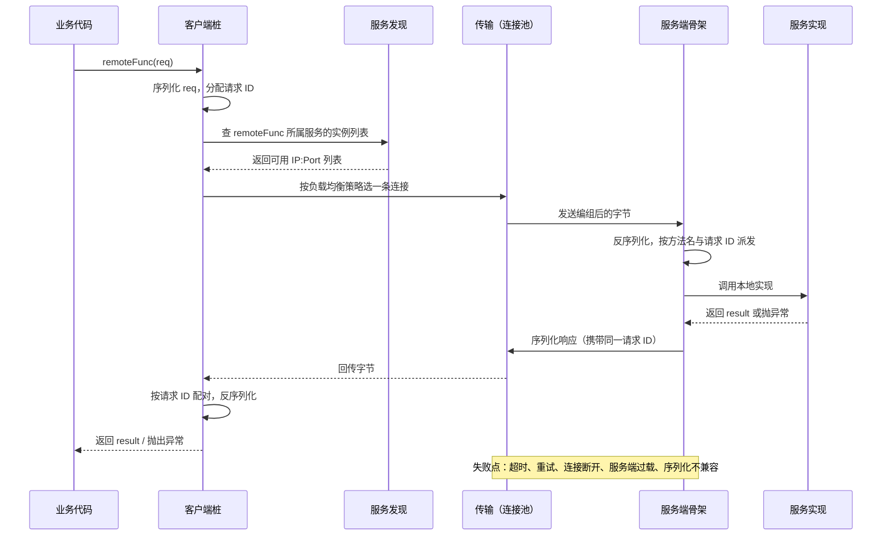
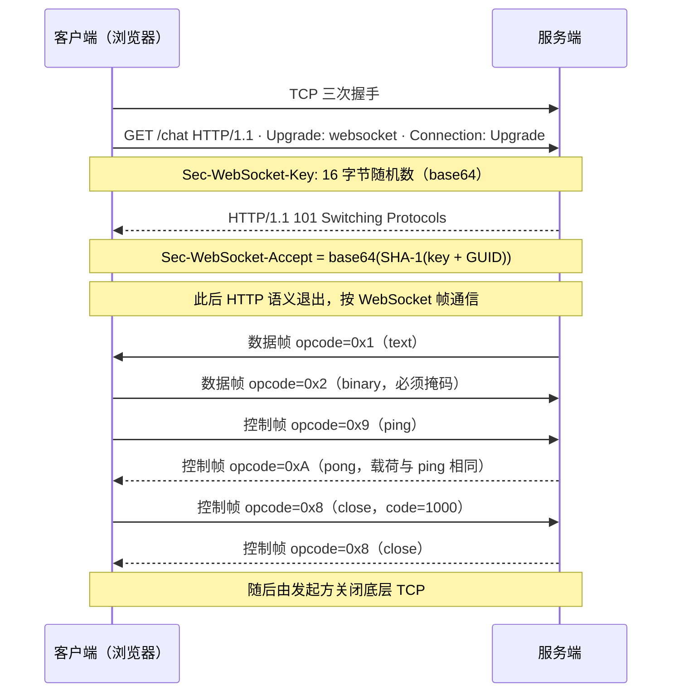
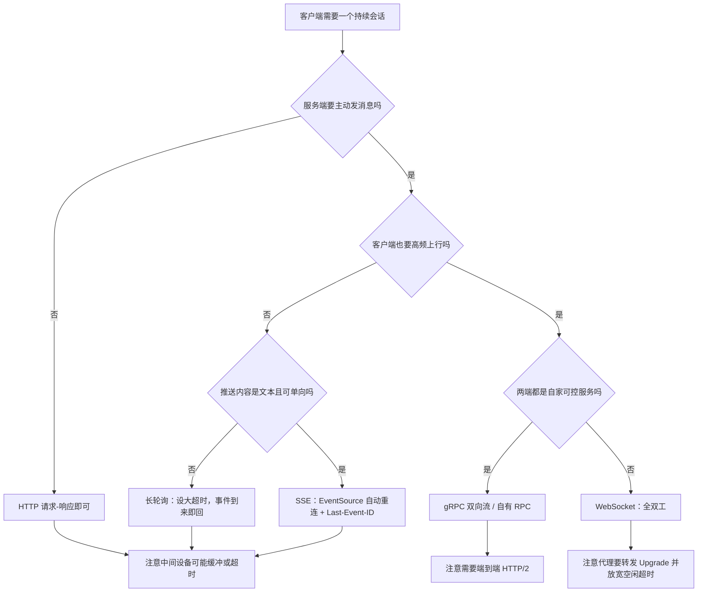

---
tags:
  - 基本功/网络
---

# RPC 与 WebSocket 的边界

`HTTP` 的请求-响应语义覆盖不了两类需求。一类是让调用方像调本地函数一样调用远端服务，并把寻址、编码、超时、重试这些网络细节收进框架；另一类是让服务端在一条长连接上持续、双向地收发消息。前者是 `RPC`（Remote Procedure Call，远程过程调用），后者是 `WebSocket`。两者常被并排放在「HTTP 的替代品」这一栏里比较，实际处理的问题落在不同层次：`RPC` 是调用模型，可以架在 `HTTP` 之上（`gRPC` 就是 `RPC` over `HTTP/2`），也可以架在自定义的二进制传输之上；`WebSocket` 借 `HTTP` 完成握手，之后按自己的一套帧格式独立通信。

本篇先讲清裸 `TCP` 缺什么、`RPC` 由哪些部件拼成、`HTTP` 与 `RPC` 为什么处在不同的层；再把 `WebSocket` 从握手、帧格式、掩码、控制帧到关闭码逐一写开；最后给出在裸 `TCP`、`HTTP`（含长轮询与 `SSE`）、`RPC`、`WebSocket` 之间选型的判据，以及几类高频故障的定位方式。`HTTP` 自身的语义与版本演进见 [[02-HTTP 协议]]，`TCP` 的字节流特性见 [[05-TCP 协议]]。

## 1. 裸 TCP 为什么不够用

`TCP` 向上层提供三项服务：面向连接、可靠、基于字节流。前两项可以直接拿来用，问题出在第三项：字节流不携带应用层的消息边界，也不携带「这一段是请求还是响应」的语义。

### 1.1 字节流没有消息边界

`TCP` 的读写接口面向字节。发送方连续两次 `send()`，接收方可能一次 `recv()` 就把两段数据一起读出来，也可能一段数据要分两三次 `recv()` 才收全；接收方读到的字节数与发送方调用 `send()` 的次数、与每次写入的长度都没有对应关系（来源：TCP 的字节流特性，见 [[05-TCP 协议]]）。

把这个现象落到具体数值：发送方先写 6 字节、再写 9 字节，两段紧挨着到达。接收方一次 `recv()` 拿到 15 字节，无法判断原始切分是 `[6][9]`、`[7][8]` 还是 `[15][0]`——这就是常说的「粘包」。反过来，一段 15 字节的写入被拆成两次到达，则是「拆包」。两类现象同源：边界由应用层定义，`TCP` 不提供。粘包与拆包是字节流的自然结果，`TCP` 对上层隐瞒了分段与合并：它按 `MSS` 分段、按 `Nagle` 算法合并小包、用 `PSH` 控制推送时机，接收侧 `recv()` 一次读到多少完全由内核缓冲与到达节奏决定（来源：见 [[05-TCP 协议]] §1.3 与 §4 的重传与缓冲机制）。

要在一条 `TCP` 连接上跑多对请求-响应，第一件事就是给字节流重新切分。设客户端要依次发出请求 A（100 字节）和请求 B（80 字节），两端必须约定同一个切分规则，否则服务端读到第 100 字节时不知道 A 是否结束，也不知道 B 从哪里开始。常见的切分规则有三类：

| 规则 | 做法 | 典型协议 | 代价 |
| --- | --- | --- | --- |
| 定长 | 每条消息长度固定 | 少量内部 RPC | 变长数据要填充，浪费带宽 |
| 分隔符 | 用特定字节序列标记结束，如 `\n`、`\0`、`\r\n\r\n` | HTTP/1.1 首部、Redis RESP | 载荷里出现分隔符要转义或改用其他编码 |
| 长度前缀 | 头部先写后续字节数，再跟载荷 | `gRPC`、`Thrift` 的 `TFramedTransport`、多数二进制 RPC、`WebSocket` 帧 | 必须先读头再读体；头部长度要固定或能自描述 |

长度前缀是最常用的一种，因为它对任意二进制载荷都不需要转义。以「4 字节大端长度 + 载荷」为例，接收侧的解析是一个循环：

```text
   长度前缀分帧：把一条双向字节流切成消息
   （例：4 字节大端长度 + 载荷）

   发送侧依次写入（两次 send 之间没有任何分隔）：
   ┌──────────────┬────────────────────────────────┐
   │ len=100 (4B) │ 请求 A 载荷（100 字节）          │
   ├──────────────┼────────────────────────────────┤
   │ len=80  (4B) │ 请求 B 载荷（80 字节）           │
   └──────────────┴────────────────────────────────┘
        │ 落在一条 TCP 流里，接收方看到的只是一串字节
        ▼
   接收侧循环：
   ┌────────────────┐
   │ 读满 4 字节     │ ──▶ 按大端解出 len
   └───────┬────────┘
           ▼
   ┌────────────────┐
   │ 读满 len 字节   │ ──▶ 得到一条完整消息 ──▶ 交给上层
   └───────┬────────┘
           │
           └──▶ 回到「读 4 字节」

   边界条件：长度字段本身可能被拆到两次 recv（只到 2 字节），
             必须先缓存、补齐 4 字节再解析，不能按「一次 recv 一条消息」写
```

这张图的落点是：一条 `TCP` 连接上两个请求之所以能被区分开，靠的是**两端约定同一套长度前缀规则**，而不是 `TCP` 本身给了标记。规则一旦不一致——比如一端认为长度含头部、另一端认为不含——切分就会错位，把第二条消息的前若干字节当成第一条的尾巴，后续全部串位。这与 `HTTP/1.1` 里 `Transfer-Encoding` 与 `Content-Length` 口径不一致导致的请求走私同源（见 [[02-HTTP 协议]] §3.3）。

还有两种不做显式长度切分的做法，各有明显代价。一种是用「连接关闭」表示消息结束：发送方写完就关，接收方读到 `EOF` 即认为消息完整。它放弃了连接复用，每传一条消息建一次连接，也无法在同一连接上双向交替发消息。另一种是靠「静默一段固定时间就认为消息结束」，把网络抖动与消息边界混在一起，链路上任何一次重传延迟都会让边界被误判。绝大多数二进制 RPC 协议因此都选长度前缀：边界由字段显式给出，不依赖时序，也不依赖连接的生命周期。

### 1.2 有了边界还缺什么

长度前缀只解决了「怎么切」。要让两个进程互相调用，至少还要再补四件事：

- **调用语义**。这次字节是请求还是响应、调哪个方法、参数什么类型；并发调用时响应要靠请求 ID 配回对应的请求；失败怎么表达（状态码、错误对象、异常）。
- **编码规则**。结构体怎么变成字节、双方用同一套映射（序列化与反序列化）。
- **版本演进**。字段增删后新旧两端怎么共存（schema 兼容策略）。
- **会话管理**。连接建立、鉴权、超时、连接复用与销毁。

这些约定每一件都可以各写一套，但同一条链路上前后端必须用同一套。裸 `TCP` 把这些全部留给业务自己定义，于是每家公司、每个中间件都长出一套私有协议；把其中被反复重写的部分（方法寻址、编码、错误语义、传输绑定）标准化，正是 `RPC` 要处理的事。反过来说，任何「TCP 之上有头有体」的协议，本质上都在补齐这四件事中的一部分。

以一个「查余额」接口为例：约定 `balance.check` 这个方法和它的参数类型，属于调用语义；用 `int64` 还是字符串表示金额、用大端还是小端，属于编码规则；给参数加一个 `currency` 字段后旧客户端怎么办，属于版本演进；短连接还是长连接、失败后是否重试，属于会话管理。这四件事任何一件两端理解不一致，都会表现为「收到了字节但解出来的值不对」或「偶发超时」，而不是一个显式的错误——这正是裸 `TCP` 上最难排查的一类问题。（待验证：同类问题在具体框架里的表现取决于框架的校验与日志，本节只给机制层面的定位方向。）

### 1.3 TCP 之上协议共用的骨架

把 `HTTP`、`WebSocket`、`gRPC`、`JSON-RPC` 摆在一起，它们都落在同一条骨架上：一段用于描述长度的头部，加一段载荷。差别只在头部放在哪、长度怎么编、载荷怎么解释。

```text
   TCP 之上四种协议各自的「消息头 + 消息体」骨架

   HTTP/1.1      ┌─────────────┬───────────────┬──────┬──────────┐
                 │ 请求/状态行  │ 首部字段       │ 空行 │ 消息体    │
                 └─────────────┴───────────────┴──────┴──────────┘
                 长度在 Content-Length / chunked，见 [[02-HTTP 协议]] §3

   WebSocket     ┌───────┬───────────┬───────────┬──────────────┐
                 │ 2 字节 │ 扩展长度   │ Masking-key│ Payload Data │
                 │ 帧头   │ (0/2/8 字节)│ (0/4 字节) │              │
                 └───────┴───────────┴───────────┴──────────────┘
                 长度字段就在帧头内，无需分隔符

   gRPC（HTTP/2）┌────────┬──────────────┬───────────────────────┐
                 │ 压缩标志 │ Message-Len  │ Protobuf 载荷          │
                 │ 1 字节  │ 4 字节大端    │                       │
                 └────────┴──────────────┴───────────────────────┘
                 外层还有 HTTP/2 的 DATA 帧，见 [[02-HTTP 协议]] §6.1

   JSON-RPC      ┌───────────────────────────────────────────────┐
                 │ 一整条 JSON 文本（含 jsonrpc / method / id）   │
                 └───────────────────────────────────────────────┘
                 落 TCP 上必须另加长度前缀或分隔符，否则无法定界
```

这张对照图回答一个常见困惑：为什么 `WebSocket` 明明是「基于 `TCP` 的新协议」，却不用像 `HTTP` 那样关心 `Content-Length`。原因是 `WebSocket` 把长度写进了自己的帧头（`Payload len` 字段），`HTTP/1.1` 则把它放在首部字段里随文本行传输。两者都在解同一道题——给字节流切出消息边界——只是答案的编码位置不同。

## 2. RPC 的构成

`RPC` 框架的复杂度不在「发一个包、收一个包」，而在它把调用语义、编码、寻址、容错各自封装成可替换的部件。理解这一点有个实用价值：排查 `RPC` 故障时先定位问题落在哪个部件——是序列化不兼容、服务发现没更新、连接池被打满，还是治理策略把请求摘掉了——比笼统地说「`RPC` 报错了」有效得多。

### 2.1 调用模型与具体协议

`RPC` 把「发起一次远端调用」包装成「调用一个本地函数」的样子：调用方写 `res = remoteFunc(req)`，网络细节被框架隐藏。`RPC` 描述的是这种调用模型，它本身不规定端口、不规定编码格式；`gRPC`、`Thrift`、`Dubbo`、`JSON-RPC` 才是实现这个模型的具体协议或框架（来源：Birrell 与 Nelson 把远端调用建模为过程调用，见参考）。

模型能成立，靠两侧各放一个代理。客户端桩（client stub）把本地调用的参数按约定编组成字节并发出，服务端骨架（server skeleton）把收到的字节解组成参数、定位到具体方法、执行，再把返回值反向编组回去。业务代码只看到函数签名，编组与传输都由桩完成（来源：Birrell & Nelson 1984）。把「调用方写一行函数调用」翻译成「一串有边界的字节、一次寻址、一次解码」，是 `RPC` 与直接写 socket 的根本差别，也是它被称为「模型」而不是「协议」的原因。

桩代码通常由 IDL 编译生成，因此接口定义的变化（改方法名、删字段、改参数类型）会先体现在生成的桩上，编译期就能发现两端不一致；手写 `HTTP` 路由没有这一层，契约对不上往往要到运行期才暴露。这是 `RPC` 在内网服务之间流行的一个工程原因，与传输性能无关。

### 2.2 一个 RPC 框架的五个部件

把 `gRPC`、`Thrift`、`Dubbo` 拆开，都能落到下面五件：

| 部件 | 职责 | 典型实现 |
| --- | --- | --- |
| 接口定义 | 用 IDL 描述服务方法、参数、返回类型，编译期生成两端桩代码 | `gRPC` 用 `.proto`；`Thrift` 用 `.thrift`；`Dubbo` 支持 Java 接口或 IDL |
| 序列化 | 结构体与字节之间的双向映射 | `Protobuf`、`Thrift Compact`、`Hessian2`、`JSON` |
| 传输 | 把编组后的字节送达对端并收回响应 | `gRPC` 用 `HTTP/2`；`Thrift` 可换 `TSocket`/`TFramedTransport`/`THttpTransport`；`Dubbo` 默认自有 TCP 协议 |
| 服务发现 | 把服务名解析成可用实例的 `IP:Port` | DNS、`Consul`、`Etcd`、`ZooKeeper`、`CoreDNS` |
| 治理 | 负载均衡、超时、重试、熔断、限流、链路追踪、鉴权 | 各框架自带，是框架之间差异最大的部分 |

前四件在「能跑通」的层面是必需品，第五件决定「线上好不好运维」。选 RPC 框架时被反复比较的往往是治理能力；序列化与传输里语义等价的部分可以互换，比如 `Dubbo 3` 的 `Triple` 协议改用 `HTTP/2` 承载，与 `gRPC` 互通，就把传输这一格换掉了。服务发现与 `HTTP` 的差别值得一提：`HTTP` 靠 DNS 把域名解析成 IP，`RPC` 常额外引入注册中心维护「服务名 → 实例列表」的动态映射，因为实例会随扩缩容频繁变动，DNS 的缓存与刷新粒度往往跟不上。

### 2.3 一次调用的完整链路

把五个部件串起来，一次同步 RPC 调用走过下面这些步骤。请求 ID 是并发调用的关键：一条复用连接上可能同时有多个未完成调用，响应回来时靠 ID 配回对应的请求（异步模型里用 `Future` 或回调按 ID 完成，同步模型里桩阻塞等待自己那个 ID）。



链路上每一跳都可能成为失败点，治理组件的作用就是在这些位置兜底：连接池负责复用与限流，负载均衡决定选哪个实例，超时与重试处理半开连接和慢实例，熔断在实例连续失败时把它摘掉。这也解释了为什么 `RPC` 框架远比「自定义一套消息格式」复杂——难点不在编组，而在这些失败路径上的取舍。

### 2.4 序列化格式对照

序列化决定结构体到字节的映射。几种常见格式的差别集中在「字段名是否上线」和「schema 是否强依赖」两点：

| 格式 | 编码形态 | 字段名是否上线 | schema 依赖 | 可读性 |
| --- | --- | --- | --- | --- |
| `Protobuf` | 字段号 + 类型标签 + 变长整数，二进制 | 只传字段号 | 需要 `.proto` | 不可读 |
| `Thrift Compact` | 变长整数 + 字段增量编号，二进制 | 只传字段号 | 需要 `.thrift` | 不可读 |
| `Hessian2` | 二进制，带类型描述 | 传字段名（部分场景可省） | 弱 | 基本不可读 |
| `JSON` | 文本键值对 | 每个字段都传字段名 | 无强 schema | 可读 |

`Protobuf` 的做法值得展开：每个字段被编成「标签 + 值」，标签由 `(字段号 << 3) | wire type` 得出，用 `varint` 编码；字符串与嵌套消息在标签之后跟一个长度再跟内容（来源：Protocol Buffers 编码规范）。字段名只存在于 `.proto` 里，线上只传字段号，所以同一份 schema 下改字段名不影响兼容，改字段号才会让两端错位。反过来，`JSON` 每次都要把字段名以文本重复传一遍，跨语言调试方便，体积与解析开销都更大——这正是 `RPC` 在内网比 `HTTP/1.1` 省流量的一个来源。

schema 演进也有对应的规则：`Protobuf` 新增字段用新号，删除字段用 `reserved` 保留号不重用，避免旧消息被新代码按新语义解读；`Thrift` 用 `optional`/`required` 区分字段是否必须。用 `JSON` 时字段名即契约，改名等于破坏兼容，需要额外的版本字段或兼容层。

## 3. HTTP 与 RPC 的层次关系

「用 `HTTP` 还是用 `RPC`」这个争论往往混着两个不同的问题：用不用请求-响应语义，以及用哪条传输。把这两问分开，才能解释为什么 `gRPC` 既算 `RPC` 又算 `HTTP`，也才能解释「`RPC` 比 `HTTP` 快」这类结论为什么时对时错。

### 3.1 协议与调用模型分属两层

把「用 `HTTP` 还是用 `RPC`」当成二选一，是把两个层次的问题揉在一起。`HTTP` 是一种应用层协议，规定了报文的语义与传输绑定；`RPC` 是一种调用模型，规定的是「调用方怎么发、服务端怎么派发、失败怎么表达」这一层。`RPC` 可以架在 `HTTP` 上：`gRPC` 的载荷走 `HTTP/2` 的 `DATA` 帧，方法名走 `:path` 伪首部，序列化默认用 `Protobuf`，错误状态放在 `HTTP/2` 的尾部首部（trailers）里（来源：gRPC over HTTP/2 文档）。

所以真正要选的是两件事：这次通信是「取一个资源」还是「调用一个远端方法」；以及把 `RPC` 架在哪条传输上。前者决定用 `HTTP` 语义还是 RPC 调用语义，后者决定性能特征与可穿透性。把这两问分开，「有了 HTTP/2 还要不要 RPC」就有了答案：要不要的从来是调用模型，`HTTP/2` 只是换了一条更好的传输。

一个直接的推论：`HTTP` 网关能做的鉴权、限流、可观测，对 `gRPC` 同样适用，前提是网关理解 `gRPC` 的帧与 trailers；反过来，`RPC` 的调用语义（请求 ID 配对、四种流式形态）也能由 `HTTP` 之上的框架实现。两者是叠加关系，处在不同维度，不存在「换掉对方」的问题。

### 3.2 「RPC 比 HTTP 快」要限定版本

`gRPC` 的传输层就是 `HTTP/2`，所以「`RPC` 快于 `HTTP`」只在拿它对比 `HTTP/1.1` 时成立。`HTTP/1.1` 是文本协议：请求行与首部用可见字符，字段名每次重复发送，一条连接上同一时刻只有一个未完成事务；`HTTP/2` 换成二进制分帧、用 `HPACK` 压缩首部、一条连接上并发多个 `stream`（来源：RFC 9113、RFC 7541，机制见 [[02-HTTP 协议]] §6）。同一条判断落到 `HTTP/2` 上就不成立了：`HTTP/2` 之上的 `gRPC` 与自研二进制 RPC 的差距，主要来自应用协议的开销而不是传输。

`gRPC` 相对裸 `HTTP/2` 也有额外开销：每条消息前面加 5 字节前缀（1 字节压缩标志 + 4 字节大端长度），状态码放在 `HTTP/2` 的 trailers（`grpc-status`、`grpc-message`）里。trailers 是 `HTTP/2` 才有的能力，`HTTP/1.1` 无法承载，这一点直接决定了 `gRPC` 在 `HTTP/1.1` 负载均衡器后面的行为（见 §7.2）。三处版本相关的结论因此需要各自限定：`HTTP/1.1` 有队头阻塞与首部冗余，`HTTP/2` 仍有 TCP 层队头阻塞，`HTTP/3` 才把它换到 QUIC 上（见 [[02-HTTP 协议]] §6.5、§6.6）。

### 3.3 协议与传输绑定的对照

同为 `RPC`，各实现的传输绑定差别很大，这决定了它们能提供哪些调用形态：

| 协议 | 序列化 | 传输绑定 | 备注 |
| --- | --- | --- | --- |
| `gRPC` | `Protobuf`（默认） | `HTTP/2` | 依赖 trailers 传状态；支持一元、服务端流、客户端流、双向流四种形态 |
| `Thrift` | Binary / Compact / JSON | 可插拔：`TSocket` / `TFramedTransport` / `THttpTransport` | 协议与传输解耦，两者各自替换 |
| `Dubbo` | `Hessian2`（默认） | 自有 TCP 协议，默认端口 20880 | `Dubbo 3` 的 `Triple` 基于 `HTTP/2`，与 `gRPC` 互通 |
| `JSON-RPC 2.0` | `JSON` | 传输无关（HTTP、`WebSocket`、TCP） | 靠 `id` 字段配对请求与响应；MCP 用它，见 [[13-MCP 协议]] |

这张表回答「同为 RPC，凭什么一个能服务流式调用、一个只能一问一答」：`gRPC` 的流式能力来自 `HTTP/2` 的多路复用与长连接；`JSON-RPC` 的形态由所选传输决定，落在 `WebSocket` 上就能借 `WebSocket` 的双向；`Thrift` 把「协议」与「传输」拆成两个正交维度，`TFramedTransport` 负责加长度前缀分帧，上面的 `TBinaryProtocol` 只管编组，换传输不影响编组逻辑。

## 4. WebSocket 的握手

握手是 `WebSocket` 与 `HTTP` 唯一重叠的部分。理解它要看三件事：用什么机制提出升级、双方交换哪些字段、以及那个看似做校验的 `Sec-WebSocket-Accept` 到底在防什么。

### 4.1 用 Upgrade 机制切换协议

`HTTP/1.1` 的请求-响应模型下，服务端只在收到请求后应答，无法主动发起一次消息。要在一个已有 `HTTP` 端口上切换到双向协议，`WebSocket` 复用 `HTTP` 自带的协议升级机制：客户端在请求里带 `Connection: Upgrade` 与 `Upgrade: websocket`，服务端同意时回 `101 Switching Protocols`，此后这条连接上的字节按 `WebSocket` 帧解释，`HTTP` 语义退出（来源：RFC 9110 §7.8 的 `Upgrade`、§15.2.2 的 `101`，握手流程见 RFC 6455 §4）。

一次升级要两端同时配合：`Upgrade` 与 `Connection` 属于逐跳（hop-by-hop）首部，路径上的代理默认不会把它透传到上游，必须显式配置转发，否则后端收到的是一次普通 `GET`，升级不会发生（见 §7.2）。这也意味着「`WebSocket` 能穿过现有 `HTTP` 基础设施」这个说法有前提——中间设备得知道如何转发升级请求。

升级请求本身仍是一条合法的 `HTTP/1.1` 请求：它有方法、路径、首部和可选的消息体，只是多声明了「希望换成 `websocket`」。不支持升级的服务端可以把它当普通 `GET` 处理并正常回应，客户端看到响应不是 `101` 就判定握手失败。这套设计让 `WebSocket` 与普通 `HTTP` 共用同一个端口——先按 `HTTP` 握手，再切换协议，不需要为 `WebSocket` 单独开放一个端口。

### 4.2 握手报文

客户端握手请求与理想的成功响应如下（来源：RFC 6455 §4.1、§4.2）：

```text
客户端 → 服务端（RFC 6455 §4.1 示例）
GET /chat HTTP/1.1
Host: server.example.com
Upgrade: websocket
Connection: Upgrade
Sec-WebSocket-Key: dGhlIHNhbXBsZSBub25jZQ==
Origin: http://example.com
Sec-WebSocket-Protocol: chat, superchat
Sec-WebSocket-Version: 13

服务端 → 客户端
HTTP/1.1 101 Switching Protocols
Upgrade: websocket
Connection: Upgrade
Sec-WebSocket-Accept: s3pPLMBiTxaQ9kYGzzhZRbK+xOo=
（可另带 Sec-WebSocket-Protocol、Sec-WebSocket-Extensions 回选结果）
```

各字段的作用：

| 字段 | 方向 | 作用 |
| --- | --- | --- |
| `Upgrade: websocket` | 请求/响应 | 声明要切换到的协议名 |
| `Connection: Upgrade` | 请求/响应 | 声明本次请求是升级请求 |
| `Sec-WebSocket-Key` | 请求 | 16 字节随机数的 base64，每次握手重新生成 |
| `Sec-WebSocket-Version: 13` | 请求 | 协议版本；服务端不支持时回 `426 Upgrade Required` 并列出支持的版本（来源：RFC 6455 §4.4） |
| `Origin` | 请求 | 供服务端做来源校验，防浏览器侧跨站滥用（来源：RFC 6455 §10.2） |
| `Sec-WebSocket-Protocol` | 请求/响应 | 应用层子协议协商，如 `graphql-ws` |
| `Sec-WebSocket-Extensions` | 请求/响应 | 扩展协商，如 `permessage-deflate` |
| `Sec-WebSocket-Accept` | 响应 | 对 `Sec-WebSocket-Key` 的固定变换结果 |

`Sec-WebSocket-Accept` 的算法是三步（来源：RFC 6455 §4.2.2）：把 `Sec-WebSocket-Key` 的值与常量 GUID `258EAFA5-E914-47DA-95CA-C5AB0DC85B11` 直接拼接（中间不加分隔符），取 `SHA-1` 摘要得到 20 字节，再做 base64 编码。用 RFC 给出的示例验证：

```text
   Sec-WebSocket-Accept 的计算

   Sec-WebSocket-Key = "dGhlIHNhbXBsZSBub25jZQ=="
                    │
                    ▼  与 GUID 直接拼接（不加分隔符）
   "dGhlIHNhbXBsZSBub25jZQ==258EAFA5-E914-47DA-95CA-C5AB0DC85B11"
                    │
                    ▼  SHA-1（输出 20 字节）
        b3 7a 4f 2c c0 62 4f 16 90 f6 46 06 cf 38 59 45 b2 be c4 ea
                    │
                    ▼  base64
   Sec-WebSocket-Accept = "s3pPLMBiTxaQ9kYGzzhZRbK+xOo="
```

`Sec-WebSocket-Key` 的原始值必须是 16 字节随机数，base64 编码后是 24 个字符（含末尾的 `=` 填充）。16 字节既够短以省带宽，又让缓存与代理很难用一条固定的旧响应蒙对；服务端不解析这段值的语义，只把它当作随机输入参与 `Accept` 计算（来源：RFC 6455 §4.1）。

客户端收到 `101` 后要自己按同一算法算一遍并比对；状态码不是 `101`、或 `Upgrade`/`Connection`/`Sec-WebSocket-Accept` 任一项不符，客户端都必须判定握手失败并中止连接（来源：RFC 6455 §4.1）。

### 4.3 Sec-WebSocket-Accept 不承担安全职责

这个校验常被误读成一种鉴权或防伪机制。它实际的作用只有一个：让客户端确认「对端确实按 `WebSocket` 握手回了话，而不是某个缓存或代理把一条旧的 `HTTP` 响应当成了握手成功」。GUID 是公开常量，任何实现都能算出同一个 `Accept`，因此它证明不了对端身份（来源：RFC 6455 §4.2.2）。RFC 6455 §10.8 进一步说明，握手使用 `SHA-1` 与安全性无关，选它只是因为当时实现广泛、够用。

真正的身份校验要另做。`Origin` 只能约束浏览器侧的行为，非浏览器客户端可以伪造，服务端鉴权要靠握手请求携带的 `Cookie`、令牌，或 `wss://` 下的 [[03-TLS 与 HTTPS|TLS 证书]]（来源：RFC 6455 §10.1、§10.2）。`Sec-WebSocket-Key` 同样不参与密钥派生——真正的加密由握手之前的 `TLS` 完成，握手本身在明文 `HTTP` 上也能跑，所以 `ws://` 与 `wss://` 的差别只在握手之下有没有 `TLS`，与 `WebSocket` 的键值交换无关。

把 `Sec-WebSocket-Accept` 当成鉴权会推出错误结论，比如认为「能握手成功就是可信客户端」。任何脚本都能算出正确的 `Accept`。要区分「谁在连」，仍需要三件事之一：`TLS` 客户端证书、握手携带并校验的令牌、或基于 `Origin` 加服务端会话的校验。`Origin` 的局限在于非浏览器客户端可以任意伪造它，它只能拦住浏览器里被第三方页面发起的连接（来源：RFC 6455 §10.1、§10.2）。另一个常见误解是把它当成会话密钥：握手里没有任何密钥派生，后续帧默认是明文，加密完全依赖握手之下的 `TLS`。

### 4.4 握手与会话时序



### 4.5 RFC 8441：在 HTTP/2 上引导 WebSocket

`WebSocket` 握手基于 `HTTP/1.1` 的升级机制，而 `HTTP/2` 出于多路复用的设计，不允许 `Upgrade`、`Connection` 这类连接级首部和 `101` 状态码，`RFC 6455` 的握手在 `HTTP/2` 上无法直接复用。`RFC 8441` 给出一条替代路径：扩展 `CONNECT` 方法，允许客户端在 `HEADERS` 里带一个 `:protocol` 伪首部，取值为 `websocket`，服务端同意后把这条 `HTTP/2` `stream` 当成隧道交给 `WebSocket` 使用（来源：RFC 8441 §4、§5）。

启用需要协商：服务端先在 `SETTINGS` 里发 `SETTINGS_ENABLE_CONNECT_PROTOCOL=1`，客户端收到后才可使用扩展 `CONNECT`，否则对端会把带 `:protocol` 的请求判为畸形请求（来源：RFC 8441 §3）。这条路的好处是不另开 `TCP` 连接，一条 `HTTP/2` 连接上可以并存多个 `WebSocket` 会话，并与其他 `HTTP` 请求共享多路复用、流控与首部压缩；`HTTP/3` 上还有对应的 `RFC 9220`。浏览器侧的支持并不一致，`Chrome` 与 `Edge` 较早支持，部分浏览器尚未实现（未核对原始规范）。

## 5. WebSocket 的帧格式

握手完成后，`HTTP` 的报文结构就退场了，两端按 `WebSocket` 自己的帧格式通信。帧格式定义了五件事：一条消息怎么被标记结束、帧承载的是数据还是控制信息、长度怎么编码、载荷要不要掩码、连接怎么按规程关闭。下面按帧头、长度、掩码、分片、帧类型、关闭、压缩的顺序展开。

### 5.1 帧头位布局

帧头最短 2 字节，按需追加扩展长度与掩码键（来源：RFC 6455 §5.2）：

```text
   WebSocket 帧头（RFC 6455 §5.2）

    0                   1                   2                   3
    0 1 2 3 4 5 6 7 8 9 0 1 2 3 4 5 6 7 8 9 0 1 2 3 4 5 6 7 8 9 0 1
   ┌─┬─┬─┬─┬───────┬─┬─────────────┬───────────────────────────────┐
   │F│R│R│R│opcode │M│ Payload len │ 扩展长度（16/64 位，按需出现）  │
   │I│S│S│S│ (4 位)│A│   (7 位)    │                               │
   │N│V│V│V│       │S│             │                               │
   │ │1│2│3│       │K│             │                               │
   └─┴─┴─┴─┴───────┴─┴─────────────┴───────────────────────────────┘
        │                    │
        │                    ├─ 值 126：后跟 16 位无符号长度
        │                    └─ 值 127：后跟 64 位无符号长度（最高位必须为 0）
        │
        └─ RSV1/2/3 仅在扩展协商后可置位（permessage-deflate 用 RSV1）

   紧随帧头：MASK=1 → 先 4 字节 Masking-key，再 payload
             MASK=0 → 直接是 payload
```

各字段的语义：

| 字段 | 位数 | 语义 |
| --- | --- | --- |
| `FIN` | 1 | 置 1 表示本帧是所在消息的最后一帧 |
| `RSV1`/`RSV2`/`RSV3` | 各 1 | 保留位，未协商扩展时必须为 0 |
| `opcode` | 4 | 帧类型，见 §5.5 |
| `MASK` | 1 | 载荷是否被掩码 |
| `Payload len` | 7 | 载荷长度的第一档，见 §5.2 |
| 扩展长度 | 0/16/64 | 由 `Payload len` 的取值决定是否出现 |
| `Masking-key` | 0/4 | `MASK=1` 时出现，4 字节掩码键 |

`RSV` 位是协议的扩展点：默认全 0，任何扩展要用它都必须先在握手里协商，否则接收方按协议错误关闭连接。`permessage-deflate` 就占用 `RSV1`（见 §5.7）。

帧头的设计目标是让接收方读到前 2 字节后就能决定还要读多少字节：`Payload len` 与随后的扩展长度合起来给出载荷长度，`MASK` 决定要不要再读 4 字节掩码键。所以最小帧的头部只有 2 字节，最大帧的头部是 14 字节（2 + 8 + 4）。这种「先读头、按头定长」的模式与 §1.1 的长度前缀同构，只是把长度编码进了位域而不是独立字段。

### 5.2 载荷长度的三档编码

7 位的 `Payload len` 先读，取值决定后面还要不要追加长度字段（来源：RFC 6455 §5.2）：

| `Payload len` 取值 | 含义 | 后续字节 |
| --- | --- | --- |
| 0–125 | 载荷长度就等于该值 | 无 |
| 126 | 真实长度由后 16 位无符号整数给出 | 2 字节大端 |
| 127 | 真实长度由后 64 位无符号整数给出 | 8 字节大端，最高位必须为 0 |

规则要求用最短编码：本可放进 7 位表示的长度，不得改用 `126` 或 `127` 的加长形式，否则按协议错误处理。这样设计的原因有两层：小消息不为长度多付 2 或 8 字节；大消息也能用一个自描述的头部表达完整长度。三条边界最容易写错——`126`/`127` 是标记值而不是长度值本身；`127` 的长度字段最高位保留为 0，实际上限是 2^63 − 1，而不是 2^64；扩展长度出现在 `Masking-key` 之前，解析顺序是「帧头 → 扩展长度 → 掩码键 → 载荷」。

两档扩展长度之间还有一处容易写错的边界：`126` 形式覆盖 126 到 65535，`127` 形式覆盖 65536 以上。长度恰好为 65535 的消息用 `126`，恰好为 65536 的必须用 `127`。实现里若把阈值写成 `> 65535` 与 `>= 65535` 之差，会在 65535 与 65536 这两个点上出错，且只在大消息上暴露，小消息测试发现不了。

### 5.3 掩码规则与掩码算法

掩码只在客户端到服务端的方向出现，规则是硬性的（来源：RFC 6455 §5.1、§5.3）：

- 客户端发送的每一帧必须置 `MASK=1` 并带 4 字节掩码键；服务端收到未掩码的帧必须关闭连接。
- 服务端发送的帧不得掩码（`MASK=0`）；客户端收到被掩码的帧必须关闭连接。
- 掩码键来自强熵源，且每一帧都重新生成，不能跨帧复用。

算法是对载荷逐字节异或，掩码键循环使用：

```text
j = i MOD 4
transformed-octet-i = original-octet-i XOR masking-key-octet-j
```

掩码与加密无关：掩码键就随帧明文传输，任何抓包方都能还原载荷。它的目的是让攻击者无法预测落到线缆上的字节序列。浏览器里的恶意脚本如果能控制 `WebSocket` 流量的确切字节，就可能构造出看起来像 `HTTP` 请求的文本，被链路上的代理当作正常请求解释，造成缓存投毒一类针对中间设施的破坏；逐帧随机掩码使这种字节构造不可控（来源：RFC 6455 §5.3、§10.3）。方向不对称的来源是威胁模型：需要防范的是不受信客户端利用中间设施，服务端被认为是可信的，所以不需要掩码。

这也是排错时的一条判据：如果抓包看到一个方向上的 `MASK` 位始终为 0，而它本该由客户端发出，问题多半出在某个把帧重新编码过的代理或网关上。掩码开销很小——一次异或，加 4 字节键——但它让「同一段应用数据出现在不同帧里就是不同字节」，这也意味着基于内容做去重或缓存的中间设备不能直接对 `WebSocket` 载荷下手。

### 5.4 分片与 continuation 帧

一条消息可以拆成多个帧（来源：RFC 6455 §5.4）：

- 首帧：`FIN=0`，`opcode` 为 `0x1` 或 `0x2`（text 或 binary）；
- 中间帧：`FIN=0`，`opcode` 为 `0x0`（continuation）；
- 末帧：`FIN=1`，`opcode` 为 `0x0`。

未分片的消息就是一个 `FIN=1`、`opcode` 非 0 的帧。分片的意义在于发送时消息长度未知，可以边产生边发，不必先整体缓冲成一条大帧。约束有三条：分片消息必须按序传递，不得与其他消息的分片交叉；接收方在收到 `FIN=1` 之前不能把已到的载荷当成完整消息；控制帧可以插入分片消息中间（见 §5.5），所以「`FIN=0` 是最后帧」这类判断不能只看帧序，还要看 `opcode`。

分片还有一个常被忽略的约束：消息的 `opcode` 只在首帧出现。text 消息分片后，中间与末帧的 `opcode` 都是 `0x0`（continuation），接收方无法从后续帧判断这条消息原本是 text 还是 binary——类型信息只记录在首帧。因此接收方要按「首帧开一条消息、`FIN=1` 收一条消息、中间帧按首帧的 `opcode` 拼接」的模型维护状态；若在 `FIN=1` 之前收到新的 `0x1`/`0x2` 首帧，属于协议错误。UTF-8 校验也针对拼接后的完整消息做，而不是逐帧做，所以一个多字节字符被拆在相邻两个分片里是合法的。（来源：RFC 6455 §5.4、§5.6）

### 5.5 控制帧与数据帧

`opcode` 把帧分成数据帧与控制帧两类（来源：RFC 6455 §5.2、§5.5、§5.6）：

| `opcode` | 类型 | 类别 | 约束 |
| --- | --- | --- | --- |
| `0x0` | continuation | 数据帧 | 续接上一条分片消息 |
| `0x1` | text | 数据帧 | 载荷必须是合法 UTF-8 |
| `0x2` | binary | 数据帧 | 任意字节 |
| `0x8` | close | 控制帧 | 可携带 2 字节关闭码与 UTF-8 原因 |
| `0x9` | ping | 控制帧 | 收到必须回 `pong` |
| `0xA` | pong | 控制帧 | 载荷须与对应 `ping` 相同 |
| `0x3`–`0x7` | 保留 | 数据帧 | 未定义 |
| `0xB`–`0xF` | 保留 | 控制帧 | 未定义 |

控制帧有三条共同约束：`opcode` 最高位为 1（即 `0x8`–`0xF` 段）；载荷长度不得超过 125 字节；不得被分片。`ping` 因此适合放一个序号或时戳，不适合放大块数据。收到 `ping` 必须尽快回一个 `pong`，且 `pong` 的应用数据要与 `ping` 一致；主动发 `pong` 也是允许的，可用作单向心跳。`text` 帧的载荷必须能通过 UTF-8 校验，校验失败按关闭码 `1007` 处理（来源：RFC 6455 §5.6、§7.4.1）。

`ping`/`pong` 是应用层心跳的载体，与 `TCP` 的 keepalive 属于不同层：`TCP` keepalive 探测的是连接本身是否还在，`WebSocket` 的 `ping`/`pong` 还能确认对端的应用进程仍在处理帧。心跳间隔要同时小于链路上所有空闲超时（见 §6.1、§7.2）。若长期收不到任何帧也收不到 `pong`，应用层可以据此判定连接已不可用并主动重建，比等 `TCP` 超时要快。

### 5.6 关闭码与关闭握手

关闭帧可以带 2 字节关闭码与一段 UTF-8 原因。已定义的关闭码（来源：RFC 6455 §7.4.1）：

| 码 | 名称 | 含义 |
| --- | --- | --- |
| `1000` | Normal Closure | 正常关闭 |
| `1001` | Going Away | 端点即将离开（服务下线、浏览器切页） |
| `1002` | Protocol Error | 协议错误 |
| `1003` | Unsupported Data | 收到不能接受的数据类型 |
| `1007` | Invalid frame payload data | 载荷不是合法 UTF-8 |
| `1008` | Policy Violation | 违反服务端策略 |
| `1009` | Message Too Big | 消息过大 |
| `1010` | Mandatory Ext. | 客户端要求的扩展服务端未协商 |
| `1011` | Internal Error | 服务端内部错误 |
| `1004`/`1005`/`1006`/`1015` | 保留 | 不得出现在关闭帧的报文中 |
| `3000`–`3999` | 注册使用 | 由 IANA 注册 |
| `4000`–`4999` | 私有使用 | 应用自定义 |

关闭握手分两步（来源：RFC 6455 §5.5.1、§7.1.1）：要关闭的一端发一个 `close` 帧，发出后不得再发数据帧；对端收到 `close` 后应回一个 `close` 帧；随后由发起方关闭底层 `TCP`。这样两端都知道这次是正常关闭。

```text
   正常关闭与异常关闭的区别

   正常关闭（双方交换 close 帧）
   发起方 ──close(1000)──▶ 对端
   发起方 ◀──close(1000)── 对端
   发起方 ──TCP FIN──────▶ 对端      两端记录到的关闭码 = 1000

   异常关闭（没有 close 帧）
   一端 ──TCP FIN/RST────▶ 另一端    另一端本地生成关闭码 = 1006
   （代理超时掐断、进程崩溃、链路中断都会落到这条路径）
```

关闭码里有两个只在本地 API 出现、不上线的码：`1005`（未收到关闭码）与 `1006`（异常关闭），表示「对端没给码」或「没经过关闭握手」；把它们放进 `close` 帧是协议错误（来源：RFC 6455 §7.1.5、§7.4.1）。`1006` 是排查的重点信号：它意味着连接是被 `TCP` 层直接断掉的，常见原因是对端进程崩溃、代理掐断空闲连接、网络中断，而不是应用主动关闭。看到客户端侧报 `1006` 而服务端日志没有对应的关闭记录，就要去查两端之间的中间设备。

`1002` 与 `1006` 的区别值得单独记住：`1002` 是「收到了不合规的帧，主动按协议错误关闭」，属于有 `close` 帧的正常关闭路径；`1006` 是「没收到任何 `close` 帧，连接就没了」，属于异常关闭。排查时看到 `1002` 要去查是哪条帧违了规——掩码方向错、`RSV` 未协商就置位、控制帧载荷超过 125 字节最常见；看到 `1006` 则要去查中间设备或对端进程（来源：RFC 6455 §7.1.7、§7.4.1）。

### 5.7 permessage-deflate 扩展

`WebSocket` 本身不压缩载荷，压缩由扩展承担。`permessage-deflate` 由 RFC 7692 定义，在握手时通过 `Sec-WebSocket-Extensions` 协商；启用后，每条消息的载荷先经 `DEFLATE` 压缩再放进帧，压缩状态用 `RSV1` 标记——只有一条消息的首帧置 `RSV1=1`，后续分片帧沿用同一次压缩上下文（来源：RFC 7692 §7）。

协商参数控制压缩上下文是否跨消息保留：`server_no_context_takeover` 与 `client_no_context_takeover` 让某一端在每条消息后丢弃 `LZ77` 滑动窗口；`server_max_window_bits` 与 `client_max_window_bits` 把窗口从默认的 15 位（32 KiB）调小（来源：RFC 7692 §7.1）。保留上下文（context takeover）压缩率更高，代价是每条连接长期占用一块滑动窗口当字典。

这也是一处内存放大点：保留的滑动窗口按连接数叠加，`N` 条连接就可能有 `N × 32 KiB` 的常驻缓冲；更隐蔽的是解压放大——一小段压缩载荷可以解出远超其体积的明文，若服务端先解压再检查「消息大小上限」，内存会在检查之前被撑爆。稳妥做法是把窗口调小或开启 `no_context_takeover`，并在解压过程中流式计数、超限即断（未核对原始规范）。

启用压缩的取舍要按数据特征判断：文本类消息（`JSON`、日志）压缩收益明显；已压缩的二进制（图片、视频帧）再压几乎不减体积，反而增加 CPU。对延迟敏感的小消息，压缩与解压的开销可能超过省下的带宽，这时按消息类型选择是否压缩（`RSV1` 支持逐消息决定）比全局开启更合适。

## 6. 边界判据

前面的机制落到选型上，要回答的是「这次通信该用哪一种」。判据沿几个维度展开：消息边界谁提供、请求-响应谁配对、服务端主动推送谁支持、能不能穿过中间设备、浏览器能不能直接用。

### 6.1 六个维度上的对照

| 维度 | 裸 TCP | HTTP 短轮询 | HTTP 长轮询 | SSE | RPC（gRPC） | WebSocket |
| --- | --- | --- | --- | --- | --- | --- |
| 消息边界 | 无，需自定 | 有（`Content-Length`/`chunked`） | 有 | 有（事件流） | 有（5 字节前缀 + `DATA` 帧） | 有（帧头） |
| 请求-响应配对 | 无 | 连接内天然一一对应 | 天然对应 | 无（单向） | 有（`stream` + 调用状态） | 无内建配对，应用自定 |
| 服务端主动推送 | 可（全双工） | 不支持 | 伪推送（延迟到有数据才回） | 支持（单向） | 服务端流式（单/双向） | 支持（全双工） |
| 传输层 | — | TCP | TCP（长占用） | TCP（长占用） | `HTTP/2`（`TCP`） | `TCP` |
| 穿透代理/CDN | 需自身协议被放行 | 好 | 一般（长占用易被超时掐断） | 一般（依赖不缓冲与保活） | 需端到端 `HTTP/2`，`HTTP/1.1` LB 后失效 | 需代理转发 `Upgrade` 并放宽空闲超时 |
| 浏览器直接可用 | 否 | 是 | 是 | 是（`EventSource`） | 否（需 `grpc-web`） | 是（原生 `WebSocket`） |

逐维度看这张表的含义：

- **消息边界**。裸 `TCP` 完全不给，其余五种都自带：`HTTP` 用 `Content-Length` 或 `chunked`，`gRPC` 用 5 字节前缀，`WebSocket` 用帧头。这一维决定了「用裸 `TCP` 就必须自己写编解码」。
- **请求-响应配对**。`HTTP` 的配对由连接模型天然提供——一条连接一次一问一答；`RPC` 由调用状态与请求 ID 配对，能在一条复用连接上同时跑多个调用；`WebSocket` 不带配对语义，要一问一答得自己在载荷里放 ID 或改用子协议；`SSE` 是单向的，没有配对概念。
- **服务端主动推送**。`HTTP` 短轮询让客户端反复问，`HTTP` 长轮询把请求挂住等到有数据才回，两者都是「客户端主动去取」的变体，服务端并不能在任何时刻发起。`SSE` 与 `WebSocket` 让服务端在同一连接上直接发。`gRPC` 的服务端流式也能单向推送，但它要求两端都懂 `HTTP/2`。
- **中间设备**。这是实践中最容易被低估的一维。`HTTP` 短轮询每次都是独立请求，任何代理、CDN、防火墙都放行；长轮询与 `SSE` 占着一条长连接，会被「空闲超时」机制回收，需要靠心跳或周期性数据维持；`WebSocket` 需要路径上的每一跳都转发 `Upgrade` 并放宽超时；`gRPC` 需要端到端 `HTTP/2`，任何一段退化成 `HTTP/1.1` 都会失败。
- **浏览器直接可用**。`HTTP`、`SSE`、`WebSocket` 在浏览器里都有原生 API；`gRPC` 在浏览器里要走 `grpc-web`（协议被改写成 `HTTP/1.1` 兼容形式）；裸 `TCP` 浏览器根本不给。

反过来看，裸 `TCP` 唯一比其余五种强的地方是它什么都不假设——没有头部、没有掩码、没有配对开销。代价是这些全得自己实现，且在需要穿越中间设备的场景里几乎不可行。这条也解释了为什么面向浏览器的推送最终都收敛到 `HTTP`、`SSE`、`WebSocket` 三者，而裸 `TCP` 多出现在可控的内网端点之间。

选型时容易只比吞吐，忽略三处与场景强相关的开销。第一是首部开销：`HTTP/1.1` 每条请求都带完整文本首部，`HTTP/2` 用 `HPACK` 把重复首部压成一个索引，`WebSocket` 建连后每条消息只有 2 到 14 字节帧头，`gRPC` 在此基础上多 5 字节前缀。第二是建连开销：`HTTP` 短轮询每次可能都走一遍连接建立（有连接池则复用），`WebSocket` 与 `gRPC` 一次握手长期复用，代价是一旦断线要重建整个会话状态。第三是保活开销：长连接要靠心跳或周期性数据维持 `NAT` 与代理的映射，心跳间隔越短，空闲连接的固定开销越高。

还要先看一条硬边界：谁能在浏览器里直接用。这条把候选集先砍掉一半——裸 `TCP` 与原生 `gRPC` 都被排除，剩下 `HTTP`、`SSE`、`WebSocket` 与 `grpc-web`。只有当两端都可控（内网服务之间、桌面客户端）时，裸 `TCP` 与原生 `gRPC` 才回到候选集。所以「用 `WebSocket` 还是 `gRPC`」这个问题，在浏览器场景里往往已经由「浏览器支持什么」预先决定了。

### 6.2 SSE 与长轮询的适用边界

`WebSocket` 是支持服务端推送的方案之一，却不是默认答案。很多场景里 `SSE` 或长轮询更合适，判据是通信方向与语义需求：

- **只有服务端到客户端的单向数据，且是文本**：`SSE` 直接走一条 `HTTP` 响应流（`Content-Type: text/event-stream`），浏览器 `EventSource` 自带断线重连，并用 `Last-Event-ID` 请求头续传，重连与补发逻辑不用自己写。通知、行情、日志尾随、构建进度都落在这一类。
- **客户端只是偶尔问一次「有结果了吗」**：像扫码登录，长轮询把请求超时设得比轮询间隔长，服务端在事件到来时立刻回，超时就回空并由客户端重发。请求数远少于定时轮询，又保持近实时。
- **需要客户端高频上行，同时服务端要推送**：游戏操作、协同编辑的增量同步、实时双向协作落在这一类，`WebSocket` 的双向与最小 2 字节帧头更划算。

`SSE` 有几条限制要一并记住：它只能传 UTF-8 文本，二进制要自己 base64 编码；`HTTP/1.1` 下每个 `SSE` 连接独占一条 `TCP`，浏览器对同一来源的并发连接有上限，多标签页会互相挤占；它还容易被缓冲型代理或网关攒住不转发，需要服务端关闭响应缓冲并周期性发送注释行保活（部分数值未核对原始规范）。长轮询的代价在服务端：每个挂起的请求占用一个连接或线程，客户端数一多，服务端要维护大量挂起上下文。

一个常被混淆的点：`SSE` 与长轮询都属于「服务端推送」的实现，但两者对连接的使用方式不同。长轮询每条消息走一轮请求-响应，两次轮询之间连接可以释放或复用；`SSE` 是一条持续打开的响应流，事件在同一个响应体里陆续吐出，直到连接断开才结束。前者对基础设施更友好，后者延迟更低、协议开销更小。选择时把「事件频率」与「对中间设备的依赖」一起称量，频率很低、连接又经常被代理回收的场景，长轮询反而更省心。

### 6.3 选型决策



这张图的三条尾注对应 §6.1 里最容易被忽略的一维：方案定下来之后，还要检查中间设备是否配合。

## 7. 常见故障与排查

握手、帧、超时、压缩这几处机制，最终都落到定位上。这一节按「从连不上到连上了但行为不对」的顺序把它们串起来。

### 7.1 症状到落点

表里的每一条都能对应到前面某一节的机制：`Upgrade` 对应 §4.1，空闲超时对应 §7.2 的第二类故障，`close` 帧对应 §5.6，压缩对应 §5.7，`gRPC` 的 trailers 对应 §3.2。先按症状找到落点，再进对应小节看机制。

| 症状 | 落点 | 判据与先看什么 |
| --- | --- | --- |
| 握手返回 `400`/`426`，或始终不升级 | 代理未转发 `Upgrade` | 后端收到的是否还是普通 `GET`；代理是否配了 `proxy_set_header Upgrade` |
| 连接建好后几十秒被断，客户端报 `1006` | 代理空闲超时 | 断开前是否有帧经过；对比 `proxy_read_timeout` 与心跳间隔 |
| 客户端收到 `1006` 但服务端无关闭记录 | 无关闭握手 | 抓包找 `close` 帧；断点是否落在代理/NAT 空闲回收时刻 |
| 连接数与内存只涨不降 | `permessage-deflate` 上下文 | 是否开了 context takeover；窗口位数；解压是否流式计数 |
| `gRPC` 报 `502`、超时或状态码对不上 | 负载均衡器不是端到端 `HTTP/2` | LB 到后端是否为 `h2`；trailers 是否保留 |
| 服务端连接数与客户端对不上 | `close` 帧被吞或半开 | `ss -tnp` 找无流量的 `ESTABLISHED`；抓包看 `close` 是否双向往返 |
| 发送数据后立刻收到 `1002` | 帧不合规 | 抓包看帧头的 `MASK`/`RSV` 位是否与协商一致；控制帧载荷是否超过 125 字节 |

### 7.2 五类故障的机制与判据

**Nginx 未转发 `Upgrade` 头。** `Upgrade` 与 `Connection` 属于逐跳首部，反向代理默认不会透传到上游；同时 `Nginx` 到上游默认用 `HTTP/1.0`，而升级要求 `HTTP/1.1`。缺少转发时，上游收到的是一次普通 `GET`，要么按普通请求回 `200`（连接随即按 `HTTP` 语义关闭），要么返回 `400`/`426`。配置端要三行同时到位（来源：Nginx WebSocket proxying 文档）：

```text
proxy_http_version 1.1;
proxy_set_header Upgrade $http_upgrade;
proxy_set_header Connection "upgrade";
```

判据：直连后端发一条带升级首部的请求应回 `101`；经代理后回 `200`/`400`/`426`，说明头在代理处被丢了。用 `curl` 手工构造升级请求是这一步最快的验证方式，不必先写客户端代码。

返回码还能细分病因：`200` 是「被当成普通请求处理了」，代理剥掉了 `Upgrade`；`400`/`404` 是「请求被判为不合法或找不到」，可能是升级首部不完整，也可能是网关把它路由到了只处理 `HTTP` 的处理器；`426` 是「服务端明确要求升级」，说明对端认出了升级意图但版本或条件不满足。看到哪一个码，就能判断缺的是转发、路由还是协商。

**代理空闲超时掐断连接。** `proxy_read_timeout` 衡量「两次从上游读到数据之间的最长间隔」，默认 60 秒，期间没有帧经过就把连接关掉，客户端随后收到 `1006`。应用层的心跳间隔必须小于这条超时，也要小于链路上最小的空闲超时（`NAT`、负载均衡、CDN 各有一条），常见取值在 20 到 30 秒之间。判据：抓包看断开前最后一个帧到断开的间隔是否接近某个整十秒，对上配置里的超时值即可定位（部分默认值未核对原始规范）。

**`permessage-deflate` 内存放大。** 机制见 §5.7。观测手段是两个比值：进程常驻内存与连接数之比是否随时间上升，以及入流量与解压后消息大小之比是否异常（一个很小的压缩载荷解出很大的消息即命中解压放大）。关掉扩展或改用 `no_context_takeover` 复测是否缓解，可以确认病因。

**`close` 帧被吞导致连接悬挂。** 若代理或某一端没有把 `close` 帧转发出去，对端会一直等一个不会到来的关闭，`TCP` 连接停在 `ESTABLISHED`，直到各自空闲超时才被回收。现象是服务端连接数与客户端连接数长时间对不上，`ss -tnp` 能看到大量没有流量的 `ESTABLISHED`。判据：抓包找 `close` 帧；若发起方发了 `close` 而对端从未回，问题在中间的转发路径。

**`gRPC` 在 `HTTP/1.1` 负载均衡器后失败。** `gRPC` 的错误码放在 `HTTP/2` 的 trailers（`grpc-status`、`grpc-message`）里，`HTTP/1.1` 无法承载 trailers；且 `gRPC` 需要端到端 `HTTP/2`，`HTTP/1.1` 的 LB 要么把长连接当成一次请求处理，要么在消息边界处切错。表现是调用超时、`502`，或状态码对不上。排查：确认 LB 到后端这一段是 `h2` 而非 `http/1.1`；确认 LB 支持并透传 trailers；把浏览器侧换成 `grpc-web` 只是权宜，它把 `gRPC` 改写成 `HTTP/1.1` 兼容的分帧形式。

`gRPC` 在 LB 处的配置错误可以分三类：LB 只做 `HTTP/1.1` 终止，后端收不到 trailers，状态码全部落空；LB 把长连接按「一次请求」超时回收，`gRPC` 的长流被从中间切断；LB 不理解 `HTTP/2` 的 `DATA` 帧边界，在帧中间切了连接。前两类表现为间歇性超时或状态码对不上，第三类表现为随机的解析错误。三类的区分办法是看错误是否与流量大小、连接存活时长相关。

**心跳与 `NAT` 映射的双重约束。** 长连接中间常隔着 `NAT`。`NAT` 设备会为映射表项设一个空闲超时，超时后外网到内网的入向包被丢弃，而内网到外网的出向包仍能建立新映射——连接因此变成「半开」：一端以为还连着，另一端已收不到包。应用层心跳的作用是在超时前产生一次往返，刷新 `NAT`、代理、LB 三处的映射与计时。心跳间隔要取链路上所有空闲超时中的最小值再留出余量，而不是照抄某个常见值（部分数值未核对原始规范）。

这五类故障有个共同点：断点大多不在两端的业务代码里，而在两端之间的中间设备。定位顺序因此是先确认路径上有哪些设备、各自设了什么超时与升级策略，再回到两端看日志。

### 7.3 观测手段

按从握手到收尾的顺序排，每一步都有对应的入口。握手阶段用 `curl -i` 带上升级首部，看状态码是否为 `101`、响应头是否含 `Sec-WebSocket-Accept`；建立后抓 `wireshark`，`WebSocket` 帧可用 `websocket` 过滤器，握手明文可用 `Follow > HTTP Stream` 看；看连接状态用 `ss -tnp`，比对上两端的连接数与状态；看代理侧超时用代理的错误日志里 `upstream timed out` 一类记录；浏览器开发者工具的 `WS` 面板能看到每一帧的 `opcode` 与方向，这是判断「有帧，但被谁吞掉」最快的入口。

三条判读原则。**先看握手再猜帧**：握手没成功，后面全是空谈，`101` 与 `Sec-WebSocket-Accept` 是第一个检查点。**`1006` 一定往中间设备查**：它表示没有经过关闭握手，落在应用层之外。**心跳间隔与超时值要一起看**：任何一条空闲超时都比心跳间隔短，连接就会被周期性掐断。

## 相关

- [[02-HTTP 协议]] —— `HTTP` 的语义与版本演进；`Upgrade`、`101`、`Content-Length` 与 `chunked` 的定界规则都在这里
- [[05-TCP 协议]] —— 字节流为什么不保留消息边界、`MSS` 与分段、连接是什么时候被谁关掉的
- [[01-网络分层模型]] —— `HTTP`、`RPC`、`WebSocket` 各自落在协议栈的哪一层
- [[13-MCP 协议]] —— `JSON-RPC` 报文跑在 `HTTP` 上，是调用模型被复用的一例
- [[00-网络专栏导览]] —— 本专栏的边界、目录与阅读顺序

## 参考

- A. D. Birrell, B. J. Nelson. *Implementing Remote Procedure Calls*. ACM Transactions on Computer Systems, 2(1):39–59, February 1984. https://doi.org/10.1145/2080.357392
- I. Fette, A. Melnikov. *The WebSocket Protocol*. RFC 6455, December 2011. https://www.rfc-editor.org/rfc/rfc6455
- T. Yoshino. *Compression Extensions for WebSocket*. RFC 7692, December 2015. https://www.rfc-editor.org/rfc/rfc7692
- P. McManus. *Bootstrapping WebSockets with HTTP/2*. RFC 8441, September 2018. https://www.rfc-editor.org/rfc/rfc8441
- R. Fielding, M. Nottingham, J. Reschke. *HTTP Semantics*. RFC 9110, June 2022. https://www.rfc-editor.org/rfc/rfc9110
- M. Thomson, C. Benfield. *HTTP/2*. RFC 9113, June 2022. https://www.rfc-editor.org/rfc/rfc9113
- *gRPC over HTTP/2*. gRPC. https://github.com/grpc/grpc/blob/master/doc/PROTOCOL-HTTP2.md
- *JSON-RPC 2.0 Specification*. https://www.jsonrpc.org/specification
- *Apache Thrift*. Apache Software Foundation. https://thrift.apache.org/
- *Apache Dubbo*. Apache Software Foundation. https://dubbo.apache.org/
- *WebSocket proxying*. Nginx. https://nginx.org/en/docs/http/websocket.html
- 小林coding. *图解网络 v4.0*. https://xiaolincoding.com/network/
