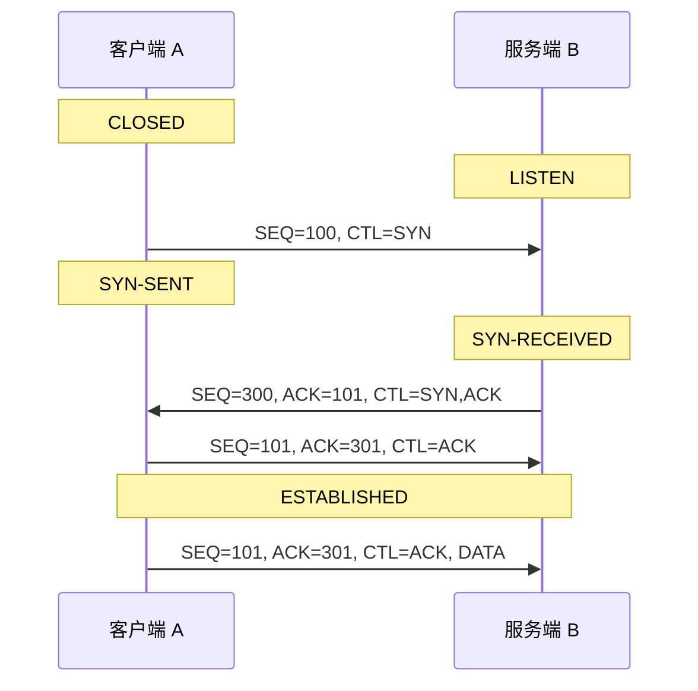
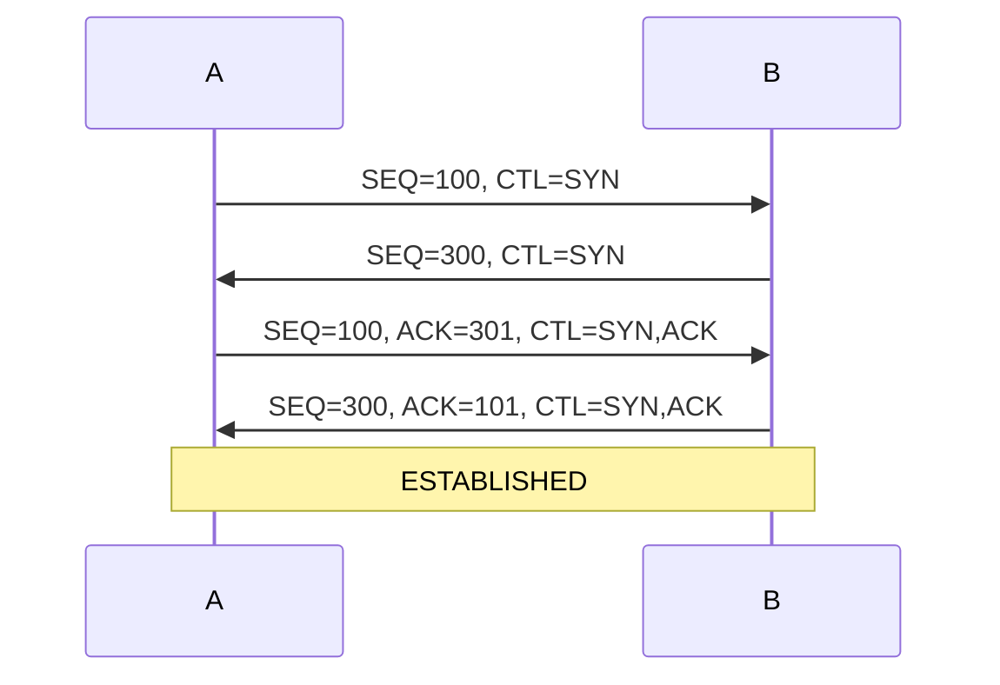
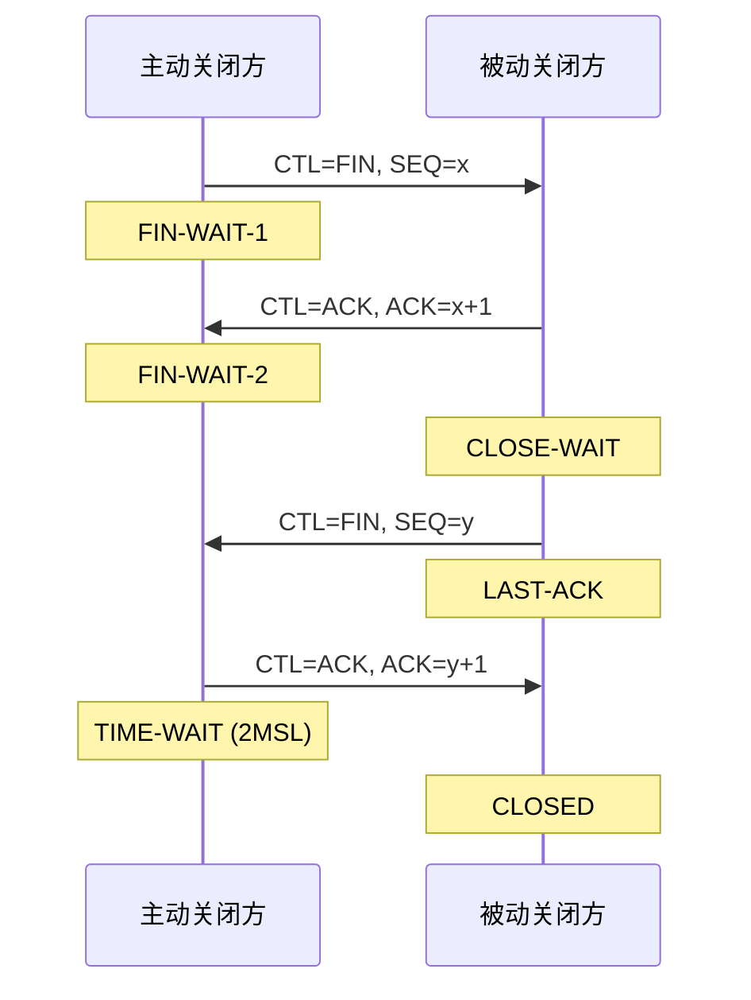
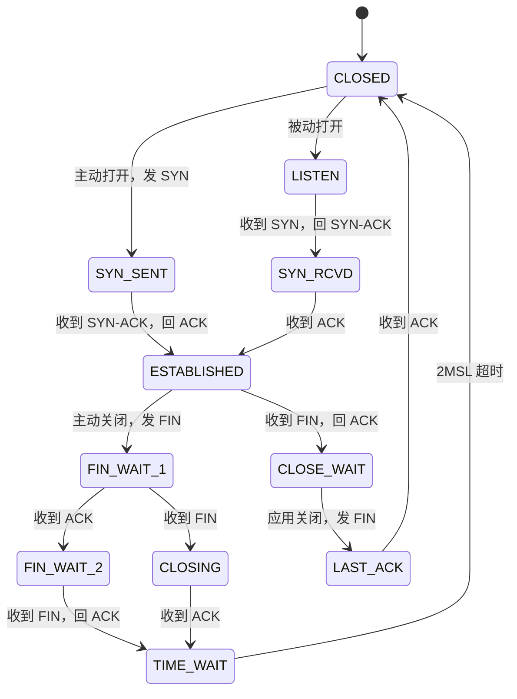

---
tags:
  - 基本功/TCP
  - 基本功/网络
---

# TCP 协议

`TCP`（Transmission Control Protocol）给上层提供的是一对进程之间的**可靠、有序、面向连接的字节流**。上层看到的是「一条能双向读写的管道」，至于中间怎么分段、丢了怎么补、堵了怎么退，全部由协议自己处理。

它解决的三个问题：**丢包**（网络会丢）、**乱序**（不同路径延迟不同）、**拥塞**（发送快过网络承载能力）。可靠传输负责前两个，拥塞控制负责第三个，流量控制负责「别把接收方撑爆」。

规范是 RFC 9293（2022 年，整合并取代 RFC 793）。

## 1. 协议定位

### 1.1 在协议栈里的位置

TCP 位于 IP 之上、应用协议之下。它只负责把字节可靠送到对端进程，不解释内容——`HTTP`、`MySQL` 协议、`Redis` 协议都跑在它上面。

```
应用层    HTTP / MySQL / Redis / ...
─────────────────────────────────────
传输层    TCP            ← 本篇
─────────────────────────────────────
网络层    IP
链路层    以太网 / WiFi
```

**端口**是传输层的复用标识：`IP` 把包送到主机，`TCP` 靠端口把字节流分给正确的进程。一条连接由四元组唯一确定：

```
(源 IP, 源端口, 目的 IP, 目的端口)
```

四元组不同的连接互不干扰——同一台机器可以同时开着几万个到同一目的端口的连接，靠的就是源端口不同。

### 1.2 TCP 承诺了什么

| 承诺 | 实现手段（后面各节的入口） |
| --- | --- |
| 数据不丢 | 序号 + 确认 + 超时重传 |
| 数据不重（对应用透明） | 累积确认 + 去重 |
| 数据有序 | 序号排序，乱序段暂存 |
| 不被发得太快压垮接收方 | 滑动窗口（流量控制） |
| 不把网络压垮 | 拥塞窗口（拥塞控制） |
| 连接可管理 | 三次握手 / 四次挥手 / 状态机 |

### 1.3 TCP 不承诺什么

- **不保证延迟**，只保证「最终送达，否则告知失败」。
- **不保留消息边界**。`send()` 两次各 100 字节，对端可能一次 `recv()` 收到 200 字节。这是应用层必须自己处理分帧的原因。
- **不保证实时**。`Nagle` 算法、延迟 ACK、拥塞控制都会主动延迟发送。

> 应用层看到「消息」是被粘在一起的字节流，`HTTP` 的 `Content-Length`、`Redis` 的 RESP 长度前缀、Kafka 的 4 字节长度头，都是各自协议在 TCP 之上重新划边界。

## 2. 消息边界：面向字节流意味着什么

`TCP` 只保证字节可靠、有序地到达，不保证「一次 `send` 对应一次 `recv`」。接收方拿到的是一条连续字节流，哪几个字节属于同一条应用消息，传输层不表态（来源：tcp(7)：`TCP does not preserve record boundaries`）。对照 `UDP`：一次 `sendto` 产生一个数据报，接收方一次 `recvfrom` 取走的就是完整的那一个，边界由协议保留。

粘包与拆包是同一件事的两个方向，成因落在三处：

| 成因 | 发生在哪 | 机制 |
| --- | --- | --- |
| 发送端合并 | 应用调用 `send` 之后 | `send` 把数据拷进内核发送缓冲区即返回，真正发出去由发送窗口、拥塞窗口、缓冲区水位共同决定；两条小消息可能被拼进同一个报文 |
| 接收端缓冲 | 一次 `recv` | 内核按序把到达的多个报文放进接收缓冲区，`recv` 按字节拷贝，一次调用可能只读到半条消息，也可能读到一条多 |
| `Nagle` 合并 | 发送端 | 已有未确认数据时，小于 `MSS` 的数据会被攒着塞进下一条报文（见 8.3、8.4） |

三者的共同后果是：接收方读到了字节，却不知道哪里算一条消息的结尾。

**三种边界编码**以及各自的失效条件：

| 方式 | 编码 | 失效条件 | 代价 |
| --- | --- | --- | --- |
| 定长 | 每条消息固定 N 字节 | 消息长度天然可变时无法表达 | 实现最简单，空间利用率差 |
| 分隔符 | 用特殊字节或字节串标记结尾 | 消息体里出现该分隔符 | 必须转义，转义规则自身要能消歧 |
| 长度前缀 | 先发固定宽度（常见 4 字节）的长度，再发数据 | 无（最通用） | 接收方要按长度重组，长度字段的字节序两端约定 |

三种编码在字节流上的排布：

```
   定长        ┌──────────┬──────────┬──────────┐
               │  Msg(64) │  Msg(64) │  Msg(64) │   读满 64 字节即一条
               └──────────┴──────────┴──────────┘

   分隔符      ┌────────────┬───┬────────────┬───┐
               │ payload    │\n │ payload    │\n │   遇分隔符切一条
               └────────────┴───┴────────────┴───┘
                             ▲                ▲
                     payload 内的分隔符必须转义

   长度前缀    ┌──────┬────────────┬──────┬────────────┐
               │ len=7│  payload   │len=12│  payload   │   先读头部，再读这么多
               └──────┴────────────┴──────┴────────────┘
                 └─ 头部定长，字节序两端约定
```

应用层协议按场景选边界：`HTTP/1.1` 用 `Content-Length` 或 `chunked` 定界，完整规则见 [[02-HTTP 协议]] 第 3 节；`Redis` 的 RESP 用「类型字节 + 长度」的长度前缀；`Kafka` 的每个请求与响应都带一个 4 字节长度头。

`recv` 层面还有两处细节。一是 `MSG_PEEK`：只把数据从内核缓冲区拷到用户缓冲区看一眼，不从缓冲区移除，用于「先探头部、再决定读多少」的两段式读取；代价是同一份数据被拷贝两次。二是 `recv` 返回的字节数小于请求长度属于正常情况——返回 0 表示对端已关闭（EOF），返回正数就是本次读到的字节数，应用要把不满一条消息的部分自己攒起来。

`TCP_NODELAY` 关掉 `Nagle`，让每次 `write` 尽快发出；`TCP_CORK` 做的是相反的事，把数据攒到解除 cork 或攒满一个 `MSS` 再发，适合「头部与正文分两次 `write`」的场景，避免头部被单独发成一个小包。

## 3. 首部格式

### 3.1 字段逐个

首部固定部分 20 字节，加上可变长选项最多 60 字节。

| 字段 | 位宽 | 作用 |
| --- | --- | --- |
| 源端口 | 16 | 发送方进程标识 |
| 目的端口 | 16 | 接收方进程标识 |
| 序号（`SEQ`） | 32 | 本报文第一个数据字节的序号；`SYN`/`FIN` 各占 1 个序号 |
| 确认号（`ACK`） | 32 | 期望收到的下一个序号（累积确认） |
| 数据偏移（`Data Offset`） | 4 | 首部长度，单位是 **32 位字** |
| 保留 | 4 | 必须为 0 |
| 控制位 | 8 × 1 | `CWR`、`ECE`、`URG`、`ACK`、`PSH`、`RST`、`SYN`、`FIN` |
| 窗口 | 16 | 接收窗口，可被窗口缩放扩展 |
| 校验和 | 16 | 覆盖首部 + 数据 + 伪首部 |
| 紧急指针 | 16 | 仅在 `URG` 置位时解释 |
| 选项 | 可变 | 见 3.3、3.4 |

RFC 9293 对窗口字段有一条硬要求：

> The window size MUST be treated as an unsigned number, or else large window sizes will appear like negative windows and TCP will not work (MUST-1).

即 65535 必须读成「大窗口」而不是 -1。实现建议用 32 位保存收发窗口（REC-1）。

首部固定 20 字节，正好排成 5 个 32 位字。

```
   偏移  0                    16                    31
   ─────────────────────────────────────────────────────────
    0    │        源端口 (16)     │      目的端口 (16)        │
    4    │                序号 SEQ (32)                    │
    8    │              确认号 ACK (32)                     │
   12    │ 数据偏移(4) │ 保留(4) │    控制位 8×1             │
         │             │        │ CWR ECE URG ACK PSH      │
         │             │        │ RST SYN FIN              │
   16    │      窗口 (16)         │      校验和 (16)          │
   20    │    紧急指针 (16)        │   选项（可变，最多 40 字节）│
   ─────────────────────────────────────────────────────────

   长度只由一个 4 位字段表达
     无选项      数据偏移 5    ──▶ 首部 20 字节
     有选项      数据偏移 6–15 ──▶ 首部 24–60 字节
     理论上限    数据偏移 15   ──▶ 首部 60 字节（选项占 40）
     └─ 单位是 32 位字（4 字节），不是字节 ——
        抓包里「Data Offset: 8」的意思是 32 字节，不是 8 字节
     └─ 首部必须是 4 字节倍数，选项凑不齐用 EOL / NOP 填充

   两个字段各有一条硬要求
     `SEQ` / `FIN` 各占 1 个序号 —— 这让「不带数据的控制报文」也能被确认
     窗口必须当无符号数读（RFC 9293 MUST-1）
       └─ 否则 65535 会被读成 −1，TCP 直接不能用
          实现建议用 32 位保存收发窗口
```

### 3.2 数据偏移与首部长度

**首部长度 = 数据偏移的值 × 4 字节。**

RFC 9293 对数据偏移的定义：

> The number of **32-bit words** in the TCP header. This indicates where the data begins. The TCP header (even one including options) is an integer multiple of 32 bits long.

单位是 32 位字（4 字节），不是字节。由此：

| 情况 | 数据偏移 | 首部长度 |
| --- | --- | --- |
| 无选项 | 5 | 20 字节 |
| 有选项 | 6 ~ 15 | 24 ~ 60 字节 |
| 理论上限 | 15 | 60 字节（选项最多 40 字节） |

RFC 只给出「整数倍 32 位」与 `size(Options) == (DOffset-5)*32` 这两条约束，20 与 60 是由 4 位字段宽推出来的。

**三个容易读错的点**：

1. 数据偏移是 **4 位**，最大 15，所以首部不超过 60 字节。
2. 抓包里 `Data Offset: 8` 表示 **32 字节**，不是 8 字节。
3. 首部长度必须是 4 字节倍数，选项凑不齐要用 `EOL`/`NOP` 填充。

### 3.3 选项的编码格式

选项只有两种形式：

```
情形 1：Kind(1)
情形 2：Kind(1) + Length(1) + Data(Length-2)
```

`Length` **把 Kind 与 Length 自身两个字节计入**。只有 `EOL`（Kind=0）与 `NOP`（Kind=1）走情形 1，其余全部（含未来新增的）必须带长度字段——RFC 9293 的 MUST-68。

RFC 9293 还规定：

> A TCP implementation MUST (MUST-6) ignore without error any TCP Option it does not implement, assuming that the option has a length field.

即遇到不认识的选项必须按长度跳过，不能报错。这是选项可以持续扩展的前提。

### 3.4 四个关键选项

| 选项 | Kind | 长度 | 作用 |
| --- | --- | --- | --- |
| `MSS` | 2 | 4 | 通告自己能接收的最大段，只在 `SYN`/`SYN-ACK` 里出现 |
| 窗口缩放 | 3 | 3 | 把 16 位窗口字段左移 N 位，最大放大 16384 倍 |
| `SACK` | 4 / 5 | 变长 | 选择性确认，解决累积确认「一处丢全窗口重传」的问题 |
| `Timestamps` | 8 | 10 | RTT 测量与 `PAWS` 防回绕 |

`MSS` 未协商时的默认值是 **536 字节**（RFC 1122）——这是 IPv4 最小重组缓冲区 576 减去 40 字节 IP+TCP 首部的结果。它不含 TCP/IP 首部与选项。

窗口缩放只在 `SYN`/`SYN-ACK` 里协商，连接建立后无法再改。这是长肥管道（长 RTT + 高带宽）必须开它的原因：不缩放时窗口上限 65535 字节，按 100 ms RTT 算最大吞吐只有约 5 Mbps。

### 3.5 首部的可观测对应

Wireshark 抓包时，首部字段与显示项的对应：

| 显示项 | 对应字段 |
| --- | --- |
| `Header Length: 40 bytes (10)` | 括号内是原始数据偏移值 |
| `Sequence Number (raw)` | 序号原值（未减去 ISN） |
| `Acknowledgment number (raw)` | 确认号原值 |
| `Window: 32128 (scale factor 1/128)` | 已乘以缩放因子后的值 |
| `Options: (20 bytes), Maximum segment size...` | 选项区，含填充 |

排查时注意 Wireshark 默认把序号显示成「相对序号」（减去 ISN），波形图上看到的是 0、1、2…；要看真实值需关掉 `Relative sequence numbers`。

### 3.6 MSS 与 MTU：为什么 1460 不会被 IP 分片

`MSS` 通告的是**能接收的 TCP 数据部分上限**，不含 TCP/IP 首部。发送方的分段上限由四个来源取最小：

| 来源 | 值 | 说明 |
| --- | --- | --- |
| 本机按出口 MTU 算出 | `MTU − IP 首部 − TCP 首部` | 以太网 IPv4 下 `1500 − 20 − 20 = 1460` |
| 对端在 `SYN` 里通告 | 对端算出的值 | **发送方按对端的值分段** |
| 路径 MTU 算出 | 见下文 PMTUD | 中间隧道会让它小于两端 |
| 对端未通告时的默认 | 536 字节 | RFC 1122，即最小重组缓冲区 576 − 40 |

第二条容易搞反：**分段要听对端的**。对端通告的是它的接收能力，本地 MTU 再大也不能超过它。抓包里 `SYN` 与 `SYN-ACK` 上的两个 `MSS` 经常不同——一端走以太网（1460）、一端走 PPPoE（1452）就是这种情况。

1460 这个数不是拍出来的，是三层各减一笔减出来的。

```
   以太网载荷上限（MTU）                            1500 字节
     └─ 来自帧格式：Length / EtherType 之后的载荷 46–1500
        │
        ▼  减去 IP 首部（无选项时 20 字节）
   IP 数据报的最大载荷 = 路径 MTU − 20 =            1480 字节
        │
        ▼  减去 TCP 首部（无选项时 20 字节）
   MSS（TCP 每段的载荷上限）= 1480 − 20 =           1460 字节
        │
        └─ 于是每段装 1460 字节时，交给 IP 层的报文恰好 1500 字节，
           不用分片

   首部带选项时这一笔要再减一次
     TCP 首部有选项（最多 40 字节）⟹ MSS 必须相应减小
       └─ 否则 IP 层收到的会超过路径 MTU，被分片或被中间设备静默丢弃

   路径 MTU 更小时整条链跟着缩
     路径 MTU 发现（PMTU）找到路径上最小的 MTU，据此减小 MSS
       └─ 若途中的 ICMP「需要分片」被防火墙拦掉，就成了 PMTU 黑洞：
          小包能通、大包不通 —— 表现为连接建立成功但传不了数据
```

#### 带选项时数据还要再减一次

`MSS = 1460` 是**数据部分**的上限，而整包是「数据 + TCP 首部 + IP 首部」。若 TCP 首部带了 12 字节的 `Timestamps`：

```
1460 + 32 + 20 = 1512 > 1500
```

实现不会让这发生——发送方在分段时**从 MSS 里再扣掉本次使用的选项长度**。Linux 的 `tcp_mtu_to_mss()` 是三步：

```c
mss_now = pmtu - net_header_len - sizeof(struct tcphdr);  /* 基础值 */
if (mss_now > tp->mss_clamp) mss_now = tp->mss_clamp;     /* 不超过对端通告 */
mss_now -= icsk->icsk_ext_hdr_len;                        /* 再减 TCP 选项长度 */
```

所以带 12 字节选项时每段数据降到 1448，整包仍是 1500。

**真正约束分片的是这个式子**：

```
每段数据 ≤ min(对端 MSS, 路径 MTU − IP 首部) − 本次 TCP 选项长度
```

`MSS` 只是其中一项。把它当成「固定 1460」会在隧道场景下出错。

#### 路径 MTU 发现

MSS 协商只覆盖两端的接口 MTU，中间链路的 MTU 可能更小：

| 链路 | MTU |
| --- | --- |
| 标准以太网 | 1500 |
| PPPoE | 1492 |
| GRE / IPIP 隧道 | 随封装递减 |
| IPsec / WireGuard | 再减 |

路径 MTU 发现（PMTUD，RFC 1191）靠三步收敛：

1. 发送方在 IP 首部设 `DF` 位（Don't Fragment），禁止中间路由器分片；
2. 某个路由器因包太大且无法分片而丢弃时，回 ICMP Type 3 Code 4（Fragmentation Needed），**携带下一跳 MTU**；
3. 发送方更新路径 MTU，重算 MSS 并重传。

IPv6 没有 `DF` 位——**IPv6 路由器一律不允许分片**，只有源端能分，所以 PMTUD 在 IPv6 下是强制的，对应 ICMPv6 的 `Packet Too Big`（Type 2）。IPv6 的最小 MTU 是 1280 字节，所以它的 MSS 下限是 `1280 − 40 − 20 = 1220`。

#### PMTU 黑洞

中间防火墙若把 ICMP 全部丢弃，发送方收不到 `Fragmentation Needed`，会一直用大包重传直到超时。这个状态叫 **PMTU 黑洞**，症状有很强的辨识度：

- 三次握手正常（都是小包）
- 小请求能通过
- 一旦传输超过约 1400 字节就卡住、重传，最后断开

三种处置：

| 手段 | 做法 | 代价 |
| --- | --- | --- |
| MSS 钳制 | 网关改写经过的 `SYN` 的 MSS：`iptables -t mangle -A FORWARD -p tcp --tcp-flags SYN,RST SYN -j TCPMSS --clamp-mss-to-pmtu` | 只对 TCP 生效，管不了 UDP |
| 探测式 PMTUD | `net.ipv4.tcp_mtu_probing=1`（黑洞时自动递减探测），`=2` 始终探测 | 需要几个 RTT 收敛 |
| 放弃 PMTUD | `net.ipv4.ip_no_pmtu_disc=1` | 全链路按最小 MTU 跑，降速 |

隧道与 VPN 场景下掐 MSS 是标准做法，网关一般默认开启。

#### 验证

| 想看什么 | 命令 | 看哪个字段 |
| --- | --- | --- |
| MSS 协商值 | `tcpdump -i eth0 -nn 'tcp[tcpflags] & tcp-syn != 0' -v` | 输出里的 `mss 1460`，两端各一个 |
| 连接实际生效的 MSS | `ss -ti dst 10.0.0.1` | `mss` 字段（已扣选项、已钳路径 MTU） |
| 接口与路径 MTU | `ip link show eth0`、`ip route get 10.0.0.1` | 各自的 `mtu` |

`ss -ti` 里的 `mss` 与抓包协商值不一致时，差值通常来自选项长度或路径 MTU 的钳制。

## 4. 连接建立

### 4.1 三次握手的报文交换

RFC 9293 的 Figure 6 给出的交换过程：



### 4.2 序列号的处理

三个容易记混的细节，RFC 9293 都写明了：

1. **`SYN` 占 1 个序号**。A 发 `SEQ=100` 的 `SYN` 后，B 回的 `ACK=101`——确认的是那个「占了 100 的 `SYN`」。
2. **`ACK` 不占序号**。第 4 行 A 发 `ACK` 时序号是 101，第 5 行携带数据时序号**仍是 101**。
3. 若 `ACK` 也占序号，就会出现「确认确认」的无限递归——RFC 原文的说法是 `if it did, we would wind up ACKing ACKs!`。

**抓包里的实际取值。** Wireshark 默认显示相对序号（各自 ISN 被减掉），所以握手三帧看着是 `0`、`0`、`1`。关掉 `Relative sequence numbers` 后看到绝对序号，设客户端 ISN = 1000、服务端 ISN = 2000：

```
   客户端 → 服务端   Seq=1000   Ack=0      Flags=SYN      Len=0
   服务端 → 客户端   Seq=2000   Ack=1001   Flags=SYN,ACK  Len=0    Ack = ISN_C + 1
   客户端 → 服务端   Seq=1001   Ack=2001   Flags=ACK      Len=0    可携带数据
   客户端 → 服务端   Seq=1001   Ack=2001   Flags=ACK,PSH  Len=200  数据阶段，下一条从 1201 起
```

四个可以直接从帧里读出来的规则（来源：Wireshark/tcpdump 的显示约定，非协议字段）：

- `SYN` 与 `FIN` 各让序号前进 1，所以确认它们时 `Ack` 要 +1；纯 `ACK` 帧不带 `SYN`/`FIN`，不额外占位。
- `Ack` 字段的含义是「下一个期望收到的字节序号」，等于「已连续收到的最后一个字节序号 + 1」。
- 数据阶段的序号前进量等于本帧 `Len`（净荷字节数），不含首部与选项。
- 相对序号只是抓包器减去 ISN 的显示技巧；若抓包器没看到 `SYN`，就不知道 ISN 在哪，相对值只是从它抓到的第一帧算起。

### 4.3 为什么必须是三次

RFC 9293 给了两条理由。

**理由一（§3.4.1）：序列号不绑定全局时钟。**

> A 3WHS is necessary because sequence numbers are not tied to a global clock in the network, and TCP implementations may have different mechanisms for picking the ISNs. The receiver of the first SYN has no way of knowing whether the segment was an old one or not, unless it remembers the last sequence number used on the connection (which is not always possible), and so it must ask the sender to verify this SYN.

**理由二（§3.5）：防旧的重复连接发起造成混淆。**

> The principal reason for the three-way handshake is to prevent old duplicate connection initiations from causing confusion.

**两次为什么不够**：服务端收到 `SYN` 后回 `SYN-ACK`，此刻它无法判断这个 `SYN` 是新的还是网络里绕了一圈的旧报文。只有等到客户端用 `ACK` 把服务端的 `ISN` 也确认一遍，双方才都确认「对面确实收到了我的初始序号、且这次是活的」。

**四次为什么不需要**：服务端的 `ACK` 与 `SYN` 可以合并在一个报文里（RFC 原文：`Because steps 2 and 3 can be combined in a single message this is called the three-way handshake`）。

**旧重复 `SYN` 的恢复**（RFC 9293 Figure 8）：对端收到旧 `SYN` 无法分辨，会正常回 `SYN-ACK`；发送方发现 `ACK` 字段对不上，回 `RST`；对端收到 `RST` 退回 `LISTEN`，随后真正的 `SYN` 正常完成同步。

#### 规范给的「待办清单」：连接建立要凑齐哪四件事

RFC 9293 §3.4.1 把同步的要求写成了一句话：

> The synchronization requires each side to send its own initial sequence number and to receive a confirmation of it in acknowledgment from the remote TCP peer. Each side must also receive the remote peer's initial sequence number and send a confirming acknowledgment.

拆成可核对的四件事：① A 发出 `ISN_A`；② A 收到「`ISN_A` 已被确认」；③ A 收到 `ISN_B`；④ A 发出「`ISN_B` 已收到」的确认；B 侧对称。**连接建立的判据是这四件事在两侧都成立**；「双方都发过 `SYN`」本身不足以判定。

同一节给的概念模型是四步，`SYN` 与 `ACK` 在这四步里各司其职：

```
   1)  A ▶ B   SYN   我的序号是 X
   2)  B ▶ A   ACK   你的序号是 X
   3)  B ▶ A   SYN   我的序号是 Y
   4)  A ▶ B   ACK   你的序号是 Y
```

#### 「三」是怎么来的

一条报文能同时携带自己的 `SEQ` 与针对对端的 `ACK`，所以第 2 步（确认 X）与第 3 步（声明 Y）可以并进同一条 `SYN+ACK`，四步因此压到三步。RFC 的措辞是 `Because steps 2 and 3 can be combined in a single message this is called the three-way (or three message) handshake (3WHS)`。

两个方向都看一眼，就知道三既是下界也是上界：

- **下界**：第 1 步没有可确认的对象，而四件事里「确认 X」与「声明 Y」可以共占一段、「确认 Y」必须另占一段 —— 最少三段。
- **上界**：能合并的已经合并完了，第四段没有新内容可承载。

#### 只走两步会缺哪一件

RFC 9293 没有「两路握手不够」这样的措辞，下面的推演是在它的理由一之上做的（属推导，规范无对应原文）。只走前两步时，四件事里做成的是 ①③，加上 ② —— **缺的是 B 侧的「我的 `ISN` 已被确认」**：B 发完 `SYN+ACK` 就认为连接可用，而它无从知道这条 `SYN+ACK` 有没有到达。缺了这一件，有三种坏法：

1. **单方面建连（半开连接）**。旧 `SYN` 在网络里绕了一圈后到达时，B 无法分辨，照常回 `SYN+ACK` 并进入 `SYN-RECEIVED`；没有第三步，B 就直接进 `ESTABLISHED`，为一个并不存在的连接占用序号空间、接收缓冲区与队列条目。A 侧没有这条连接，收到数据只会回 `RST`，B 这时才知道自己错了。
2. **旧数据被新一代连接收下**。B 没有确认过 A 的 `ISN` 是否属于本次发起，也就没有「这条连接的序号基准」可用来筛旧报文；上一代连接延迟到达的数据段只要序号落在窗口内，就会被当成本次连接的数据交给应用。
3. **B 的 `ISN` 无人担保**。B 无从知道 A 记住的 `ISN_B` 是哪一次的。中间若发生过一次连接重试，A 记下的 `ISN_B` 与 B 当前持有的可能并非同一个，双方对序号基准的认知出现分叉。

```
   只走两步时，旧 SYN 造成的单方面建连
   ─────────────────────────────────────────────────────────────
   A                                        B
   SYN(seq=100)  ───────────────────────▶   收到，回 SYN+ACK
   （客户端随后崩溃或放弃）  ◀────────────  SYN+ACK(seq=300, ack=101)
                                             ▼
                                     两步方案：B 就此进入 ESTABLISHED
                                     为并不存在的连接占用序号空间与缓冲
   ─────────────────────────────────────────────────────────────
   A 重启，同四元组重新建连  ───────────▶   B 把两条「连接」混在一起
   旧连接的数据段（序号仍在窗口内）─────▶   被当成本次连接的数据交给应用
```

#### 三次握手的逐帧时间线

把 Figure 8 的八行展开，序号取整数便于对照：

```
   1. A: CLOSED                                  B: LISTEN
   2. A ▶ B   SEQ=100  CTL=SYN                   B: SYN-RECEIVED
   3. 旧报文 ▶ B  SEQ=90   CTL=SYN               B 无法分辨，照常响应
   4. B ▶ A   SEQ=300  ACK=91   CTL=SYN,ACK      A: 仍在 SYN-SENT
   5. A ▶ B   SEQ=91   CTL=RST                   B: 回到 LISTEN
   6. A ▶ B   SEQ=100  CTL=SYN                   B: SYN-RECEIVED
   7. B ▶ A   SEQ=400  ACK=101  CTL=SYN,ACK      A: ESTABLISHED
   8. A ▶ B   SEQ=101  ACK=401  CTL=ACK          B: ESTABLISHED
```

关键是第 5 行：A 看到 `ACK=91` 与自己发过的 `100` 对不上，就能判定这个 `SYN+ACK` 应答的不是本次请求，于是回 `RST`。RFC 特意补了一处实现细节 —— 这个 `RST` 的序号要选得让对端觉得可信（原文：`with its SEQ field selected to make the segment believable`），否则对端可能直接忽略它。RFC 还记了一种更麻烦的情形：若第 6 行的 `SYN` 早于 `RST` 到达，会演变成双向都发 `RST` 的交换。

#### 三次握手之后，双方各自知道了什么

| 已知的事 | A 何时知道 | B 何时知道 |
| --- | --- | --- |
| 对端还活着 | 收到 `SYN+ACK` 时 | 收到第三个 `ACK` 时 |
| 自己的 `ISN` 被确认 | 收到 `SYN+ACK` 时（看 `ACK` 字段） | 收到第三个 `ACK` 时 |
| 对端的 `ISN` | `SYN+ACK` 的 `SEQ` 字段 | 第一个 `SYN` 的 `SEQ` 字段 |

B 对「连接存在」的认定**晚于** A 一个报文，这段差距就是 `SYN-RECEIVED` 状态的位置。

#### 三次握手没有买到的两件事

它不保证对端此后仍然活着 —— 「建连成功」与「对端消失」是两回事，断电、拔网线、进程崩溃各自留下不同的痕迹，见 [[06-TCP 的边界与失败模式]] §4。它也不防 `SYN` 泛洪 —— 正因为服务端要为每个 `SYN` 保留半连接状态，队列本身才成了攻击面（同一篇 §7）。另外，第三次握手的 `ACK` 丢不丢并不影响正确性：客户端随后的第一个数据报文在协议上与它等价，服务端收到它就完成建连（同一篇 §3.1）。

### 4.4 初始序号的选择

`ISN` 不能从 0 开始，也不能用固定值——否则旧连接的报文会被误认为是新连接的数据。RFC 9293 §3.4.1 的做法是让 `ISN` 与一个**每 4 微秒加一**的时钟绑定，再加一个连接相关的偏移。

这带来两条实践后果：

- `ISN` 随时间单调增长，所以抓包里连续两次连接的序号差可以粗略反映时间差。
- 32 位序号在高速链路上会回绕。`1 Gbps` 的链路上约 **17 秒**就绕一圈（$2^{32} \times 8 / 10^9$）。`Timestamps` 选项的 `PAWS` 机制就是为防回绕设计的。

### 4.5 同时打开

双方几乎同时发 `SYN` 时，各自经历 `CLOSED → SYN-SENT → SYN-RECEIVED → ESTABLISHED`：



RFC 9293 强制要求支持这种情况：

> A TCP implementation MUST support simultaneous open attempts (MUST-10).

并且要求实现记住 `SYN-RECEIVED` 是主动打开还是被动打开造成的（MUST-11）——这决定了对端 `RST` 时该回到 `CLOSED` 还是回到 `LISTEN`。

### 4.6 Socket 编程接口与握手阶段的对应

三次握手的每一步在内核里都由一个 socket 接口触发，对应关系如下（来源：socket(2)、connect(2)、listen(2)、accept(2)）：

```
   服务端                                        客户端
   ──────────────────────────────────────────────────────────────
   socket()  创建监听 fd，CLOSED
   bind()    绑定 IP:port
   listen()  进入 LISTEN，建立两个队列          socket()  创建 fd，CLOSED
             │                                              │
             │◀──────────── SYN (seq=C) ─────────────────── connect()
             创建半连接对象入 SYN 队列      进入 SYN-SENT，阻塞等待
             │──────── SYN+ACK (seq=S, ack=C+1) ──────────▶│
             进入 SYN-RECEIVED              收到后 connect() 返回
             │                              进入 ESTABLISHED，发 ACK
             │◀──────────── ACK (ack=S+1) ──────────────────│
             移出 SYN 队列，建连接对象入 accept 队列
             进入 ESTABLISHED
   accept()  从 accept 队列取出，返回「已连接 fd」
```

- **`connect()`**：主动打开。内核发出 `SYN` 并进入 `SYN-SENT`，默认阻塞到收到 `SYN-ACK` 才返回，也就是**在第二次握手后返回**——此时内核已替应用发出第三次握手的 `ACK`。非阻塞 fd 上返回 `EINPROGRESS`，之后用 `poll`/`epoll` 的 `POLLOUT` 等就绪。
- **`listen()`**：把 fd 置于 `LISTEN`，同时初始化半连接（`SYN`）队列与全连接（`accept`）队列，见 4.7 节。`backlog` 参数影响全连接队列上限。
- **`accept()`**：从全连接队列取走一个已建立的连接，返回一个新的 fd。**监听 fd 与已连接 fd 是两个不同的描述符**：监听 fd 只收 `SYN`，不承载数据；数据收发都走 `accept` 返回的那个 fd。`accept` 不参与握手，队列非空才能取到。
- **`close()`**：释放 fd，走正常四次挥手；接收缓冲区还有未读数据时，内核改发 `RST`。关闭后连接成为「孤儿连接」，`netstat -p` 里进程名为空。
- **`shutdown()`**：只关一个方向，可单工关闭。`SHUT_WR` 发出 `FIN` 后**本端仍可继续 `recv`**（半关闭），`SHUT_RD` 之后 `recv` 返回 0、后续到达的数据仍被 `ACK` 后丢弃，`SHUT_RDWR` 两个方向都关。这是 5.2 节半关闭在接口层的落点。
- **`SO_LINGER`**：控制 `close()` 的行为。`l_onoff=1, l_linger=0` 时 `close` 直接发 `RST`、跳过四次挥手与 `TIME-WAIT`；`l_linger>0` 时 `close` 阻塞到数据发完或超时；`l_onoff=0` 走默认的后台尽力发送。把 `l_linger=0` 用在服务端会让客户端频繁看到 `connection reset by peer`。

「没有 `accept` 能否建连」在状态与队列层面回答：`SYN`、全连接队列的填充都由内核完成，应用不 `accept` 只影响队列会被取空还是溢出，不影响握手本身。「没有 `listen` 会怎样」「`SYN` 被丢后双方各自重传与状态怎么演化」属于失败模式，见 [[06-TCP 的边界与失败模式]]。

### 4.7 半连接队列与全连接队列

`listen()` 之后内核为这个监听 fd 维护两个队列，三次握手的进度就体现在它们之间：

```
   ┌──────────────────────┐        ┌──────────────────────┐
   │  SYN 队列（半连接）    │        │ accept 队列（全连接）  │
   │  收到 SYN、已回        │  ACK   │  握手完成、等           │
   │  SYN-ACK、等 ACK       │ ─────▶ │  应用 accept()          │
   │  连接处于 SYN-RECEIVED │        │  连接处于 ESTABLISHED   │
   └──────────────────────┘        └───────────┬──────────┘
            ▲                                   │ accept()
            │ SYN                               ▼
        入站连接                          新的「已连接 fd」
                                     └─ 监听 fd 从不承载数据，数据走这个 fd

   两个队列各有上限，满了之后的处置不同
     SYN 队列满      默认丢弃新 SYN，或由 tcp_syncookies 兜底
     accept 队列满   默认丢弃第三次握手的 ACK，或由 tcp_abort_on_overflow 回 RST
```

两个队列由不同参数控制，只调一个是最常见的错误：

| 队列 | 状态 | 上限由谁决定 | 相关参数 |
| --- | --- | --- | --- |
| 半连接（`SYN`）队列 | `SYN-RECEIVED` | `tcp_max_syn_backlog` 与全连接队列大小共同约束 | `net.ipv4.tcp_max_syn_backlog` |
| 全连接（`accept`）队列 | `ESTABLISHED`（未被 `accept`） | `min(somaxconn, listen(fd, backlog))` | `net.core.somaxconn`、应用 `listen` 的 `backlog` |

**`min(somaxconn, backlog)` 是硬关系**：内核把 `listen` 的 `backlog` 与 `somaxconn` 取小后作为全连接队列上界（来源：listen(2)、内核文档）。只把 `somaxconn` 调大而应用仍传一个小 `backlog`，等于没调；反之亦然。`backlog` 的语义在 Linux 2.2 之后从半连接队列改成了全连接队列，读到老资料说它是 `SYN` 队列时要留意版本。

半连接队列的实际上界比名字复杂，它并不只由 `tcp_max_syn_backlog` 决定，还与 `somaxconn`、`backlog` 联动，换算方式在不同内核版本不同——不背公式，以本机内核版本为准。判断有没有溢出看计数器：`nstat -az TcpExtListenDrops`、`TcpExtListenOverflows`（全连接溢出）、`netstat -s | grep -i listen`。累计值大不代表此刻有问题，看两次采样之间的差值。

**`tcp_syncookies`：半连接队列满时的兜底。** 队列满后内核不再为每个 `SYN` 存一个半连接对象，而按连接相关信息算出一个 cookie，放进自己发的 `SYN-ACK` 的序号字段；客户端回 `ACK` 时把它带回，内核校验合法就直接建连（来源：RFC 4987）。它改变的是「队列满时 `SYN` 被无差别丢弃」这一行为，代价是它为每条连接保留的状态更少，`SYN` 上协商的部分选项（窗口缩放、`SACK`、时间戳）无法像正常路径那样保留。取值 0 / 1 / 2 分别是关闭、仅队列满时启用、无条件启用；抗 `SYN` 泛洪设 1。至于 cookie 具体怎么算出来、为什么不需要服务端存状态、被牺牲的那几个选项在现代 Linux 上怎么补救回来，见 §4.8。

**`tcp_abort_on_overflow`：全连接队列满时的两种行为。** 默认 0，内核丢弃第三次握手的 `ACK`，让客户端把它当作未确认报文重传；队列腾出位置后，重传的报文仍能完成建连。设为 1 则直接回 `RST`，客户端很快拿到 `connection reset by peer`。0 提高突发流量下的建连成功率，1 用于「确定长期溢出、要尽快通知客户端」的排查场景（来源：内核文档）。

**`ss -lnt` 里 `Recv-Q` / `Send-Q` 的含义随连接状态而变**，这是最容易读错的一处（来源：ss(8)、内核文档）：

| 连接状态 | `Recv-Q` | `Send-Q` |
| --- | --- | --- |
| `LISTEN` | 当前全连接队列长度（已建立、未被 `accept`） | `backlog` 上限，即 `min(somaxconn, backlog)` |
| 非 `LISTEN` | 应用读取前滞留在接收缓冲区的字节数 | 已发送、未确认的字节数 |

排查全连接溢出就是看某个 `LISTEN` 端口的 `Recv-Q` 是否持续贴住 `Send-Q`。

**队列溢出的两种可区分症状**（先分清哪一侧满了，再动参数）：

| 症状 | 溢出的是 | 判别线索 |
| --- | --- | --- |
| 客户端建连超时、重传 `SYN`；服务端看不到 `SYN`，或看到却不回 `SYN-ACK` | 半连接队列 | 服务端 `TcpExtListenDrops` 增长；`SYN` 被丢后客户端按 6.3 的退避重传 |
| 连接已建立、客户端已发数据却收不到确认，随后超时重传 | 全连接队列 | `ss -lnt` 的 `Recv-Q` 贴住 `Send-Q`；`TcpExtListenOverflows` 增长 |

两种都表现为「服务端请求上不去」，但一个卡在握手前、一个卡在握手后，靠上面的计数器能分开。

### 4.8 SYN cookie 的原理

`tcp_syncookies` 打开后，队列满时内核不再为每个 `SYN` 建半连接对象，而是**把本来要存进半连接对象的那些状态编码进 `SYN-ACK` 的序号字段**，等客户端的 `ACK` 把这个序号带回来时再解出来（来源：RFC 4987 §3.6：`they encode most of the state (and all of the strictly required) state that they would normally keep into the sequence number transmitted on the SYN-ACK`）。服务端在握手完成前**不占任何每连接内存**，`SYN` 泛洪也就失去了「用假 `SYN` 撑爆队列」这个着力点。

**cookie 藏在序号里，位宽就是硬约束。** Linux 把这 32 位切成两段（来源：Linux `net/ipv4/syncookies.c` 与 `include/net/tcp.h`）：

```text
   Linux SYN cookie 的 32 位分配（COOKIEBITS = 24）

   ┌────────────────────┬────────────────────────────────────────────┐
   │ 高 8 位：count      │ 低 24 位：哈希（内含编码出的 MSS 索引）       │
   ├────────────────────┴────────────────────────────────────────────┤
   │ 生成：cookie = HASH(sec1, 四元组) + sseq + (count << 24)          │
   │                + (HASH(sec2, 四元组, count) + data) % 2^24        │
   ├─────────────────────────────────────────────────────────────────┤
   │ 验证：① 减掉 HASH(sec1, 四元组) + sseq                            │
   │       ② 取 count = cookie >> 24，算年龄 diff                      │
   │       ③ diff >= 2 即作废（MAX_SYNCOOKIE_AGE = 2）                 │
   │       ④ 用 (count - diff) 重算哈希，剩下的低位就是 data           │
   └─────────────────────────────────────────────────────────────────┘
```

四个设计点：

**① 四元组进哈希，cookie 与这条连接绑定。** 拿别人的 cookie 来用，四元组对不上，解出的 `data` 会落到 `msstab[]` 表外，连接被拒。

**② 客户端的 `ISN`（源码里的 `sseq`）参与加法。** 同一个四元组的两次握手因此拿到不同的 cookie；验证的每一步就是先把它减掉。

**③ 高 8 位的 `count` 就是有效期。** `tcp_cookie_time()` 取 `jiffies / (60 * HZ)`，**每 60 秒加一**（源码注释：`count increases every minute by 1`）；`MAX_SYNCOOKIE_AGE` 取 **2**，所以源码注释写明 `a sent cookie is valid only at most for 2*60 seconds`。**时间本身就是这里唯一的状态** —— 这既解释了为什么服务端不必存任何东西，也解释了为什么 cookie 只有两分钟左右的可用窗口。

**④ 被牺牲的选项有了针对性的补救：编码进 `SYN-ACK` 的时间戳。** 传统说法是 cookie 路径用不了 TCP 选项，窗口缩放、`SACK`、`ECN` 都会丢。Linux 的处置是把这几个开关塞进 `SYN-ACK` 的 `tsval` 低位（来源：`syncookies.c` 的注释）：

```text
   Linux 把 TCP 选项编码进 SYN-ACK 的 tsval 低 6 位

   | 31 ...   6 |  5  |  4   | 3 2 1 0 |
   |  Timestamp | ECN | SACK | WScale  |
```

客户端会把 `tsval` 原样回显在 `ACK` 的 `tsecr` 里，服务端据此恢复这三个开关。这套思路最早记录在 RFC 4987 §3.6（`leverages the bits of the Timestamp option in addition to the sequence number bits for encoding state`，当时记为 FreeBSD 的实现）。**前提是客户端的 `SYN` 里带了时间戳选项** —— 不带就恢复不出来，那几个选项仍退回默认值。

代价与失败模式（`[[06-TCP 的边界与失败模式]]` §7 有展开）：

- **编解码要花 CPU。** 服务端不存状态，攻击者就可以灌大量带伪造 cookie 的 `ACK`，服务端逐个解码再丢弃（来源：RFC 4987 §4.1.2）。观测落在 `TcpExtSyncookiesSent` / `SyncookiesRecv` / `SyncookiesFailed`。
- **`SYN` 上搭不了数据。** 与 SYN cache 一样，cookie 路径不处理随 `SYN` 一起到达的应用数据（来源：RFC 4987 §3.6）。
- **被动方先发言的协议会退化。** 完成握手的那条 `ACK` 一旦丢失，被动方的应用层永远不知道这条连接存在、也就不会发数据，而发起方以为连上了 —— `SMTP` 是这一类里的典型（被动方要先发 `220 Service ready`）。内核文档那句 `visible not by you, but your clients` 说的就是这种退化。
- **`tcp_syncookies` 的取值里，`2` 是测试用途。** §4.7 给了三档语义；内核文档对 `2` 的说明是 `If you want to test which effects syncookies have to your network connections you can set this knob to 2 to enable unconditionally generation of syncookies`。生产上保持 `1` —— 文档同时提醒 `syncookies seriously violate TCP protocol, do not allow to use TCP extensions`，并强调它**不能用来让高负载服务器扛合法连接速率**：日志里出现 SYN flood 警告而实测是合法流量过载时，该调的是 `tcp_max_syn_backlog` / `tcp_synack_retries` / `tcp_abort_on_overflow`。

## 5. 连接终止

### 5.1 四次挥手

`CLOSE` 的语义是「我没有数据要发了」，RFC 9293 明确采用**单工**处理：

> The user who CLOSEs may continue to RECEIVE until the TCP receiver is told that the remote peer has CLOSED also.

主动关闭方进入 `FIN-WAIT-1`，`FIN` 及其之前的所有段在确认前都会重传。关键约束来自 RFC：

> Note that a TCP endpoint receiving a FIN will ACK but not send its own FIN until its user has CLOSED the connection also.

这就是挥手要四次而握手只要三次的原因——**被动方的 `ACK` 与 `FIN` 之间有应用层的处理时间**，可能还有数据要发，所以不能合并。



### 5.2 半关闭

主动 `CLOSE` 的一方仍可继续 `RECEIVE`。这意味着「关掉写方向」与「关掉整条连接」是两件事：

| 操作 | 语义 | 对端可见的行为 |
| --- | --- | --- |
| `shutdown(SHUT_WR)` | 只关写方向 | 收到 `FIN`，仍可继续发数据 |
| `close()` | 关掉整个描述符 | 收到 `FIN`，之后本端回 `RST` |

半关闭在「客户端发完请求后等服务端流式返回」这类场景里有意义。多数应用直接用 `close()`，因此放弃了半关闭能力。

### 5.3 TIME-WAIT 与 2MSL

RFC 9293 对 `TIME-WAIT` 的定义同时给出了两个目的：

> TIME-WAIT - represents waiting for enough time to pass to be sure the remote TCP peer received the acknowledgment of its connection termination request **and** to avoid new connections being impacted by delayed segments from previous connections.

拆开看：

1. **确保最后一个 `ACK` 到达对端**。若这个 `ACK` 丢了，对端会超时重传 `FIN`；此时主动方还在 `TIME-WAIT` 就能重发 `ACK`。若主动方已经 `CLOSED`，对端重传的 `FIN` 会收到 `RST`，对端得到一个「连接异常终止」的信号。
2. **让旧连接的残留报文在网络里死掉**。同一四元组被快速复用时，上一代的延迟报文可能被新连接误收。

持续时间是 **2 × MSL**（状态图中 `TIME-WAIT → CLOSED` 标注为 `Timeout=2MSL`）。RFC 9293 取：

> For this specification the MSL is taken to be 2 minutes.

即默认 4 分钟，而 Linux 的实现取 60 秒（`TCP_TIMEWAIT_LEN`）。

**运维上的三个后果**：

| 现象 | 原因 | 处置 |
| --- | --- | --- |
| 服务端出现大量 `TIME-WAIT` | 服务端主动关闭连接（`HTTP/1.0` 默认行为） | 让客户端先关，或调 `net.ipv4.tcp_tw_reuse` |
| 重启服务报 `Address already in use` | 上一进程的 `TIME-WAIT` 还占着端口 | `SO_REUSEADDR`（它只解决绑定，不缩短 `TIME-WAIT`） |
| 端口耗尽 | 主动关闭方在 `2MSL` 内不能复用四元组 | 扩大本地端口范围，或减少主动关闭 |

排查命令：

```bash
ss -tan state time-wait | wc -l        # TIME-WAIT 数量
ss -s                                  # 各状态汇总
cat /proc/sys/net/ipv4/ip_local_port_range   # 可用端口范围
```

### 5.4 同时关闭

双方同时 `CLOSE` 时，各自发出 `FIN` 后进入 `FIN-WAIT-1`；收到对方 `FIN` 时状态是 `FIN-WAIT-1` 而非 `FIN-WAIT-2`，于是转入 `CLOSING`，各自确认对方的 `FIN` 后进入 `TIME-WAIT`。`CLOSING` 这个状态只在同时关闭时出现。

## 6. 连接状态机

### 6.1 十一个状态

RFC 9293 §3.3.2 逐字列出的状态（含一个虚构状态）：

| 状态 | 含义 |
| --- | --- |
| `LISTEN` | 等待任意远端的连接请求 |
| `SYN-SENT` | 已发出连接请求，等待匹配的请求 |
| `SYN-RECEIVED` | 已收到并发出连接请求，等待确认 |
| `ESTABLISHED` | 连接已打开，数据可交付给用户 |
| `FIN-WAIT-1` | 等待远端终止请求，或等待自己发出的终止请求被确认 |
| `FIN-WAIT-2` | 等待远端的终止请求 |
| `CLOSE-WAIT` | 等待本地用户的终止请求 |
| `CLOSING` | 等待远端对自己终止请求的确认 |
| `LAST-ACK` | 等待自己发出的终止请求被确认 |
| `TIME-WAIT` | 等待足够时间，确保对端收到终止确认，且不让旧报文干扰新连接 |
| `CLOSED` | 不存在连接状态 |

状态之间的迁移路径（图中用下划线代替状态名里的连字符）：



图中左右两条主干就是主动关闭与被动关闭两条路径：左边经过 `FIN-WAIT-1`、`FIN-WAIT-2`，右边经过 `CLOSE-WAIT`、`LAST-ACK`。`CLOSING` 只在双方同时关闭时出现。

`CLOSED` 被称为 **fictional（虚构的）**，因为它代表「没有 TCB」，也就没有连接存在——RFC 原文：

> CLOSED is fictional because it represents the state when there is no TCB, and therefore, no connection.

### 6.2 驱动状态转换的事件

RFC 9293 列出的三类事件：

- **用户调用**：`OPEN`、`SEND`、`RECEIVE`、`CLOSE`、`ABORT`、`STATUS`
- **入站报文**：特别是带 `SYN`、`ACK`、`RST`、`FIN` 标志的那些
- **超时**：重传定时器、`TIME-WAIT` 的 2MSL 定时器、`FIN-WAIT-2` 定时器

**排查时的对应关系**（`ss` 输出的状态列）：

| `ss` 状态 | 常见成因 | 下一步查什么 |
| --- | --- | --- |
| 大量 `SYN-RECV` | `SYN` 泛洪，或应用 `accept` 队列溢出 | `netstat -s \| grep -i listen`，看 `SYNs to LISTEN sockets dropped` |
| 大量 `CLOSE-WAIT` | **应用没有 `close()` 连接** | 查应用代码，这是最典型的 fd 泄漏信号 |
| 大量 `FIN-WAIT-2` | 对端没有回 `FIN`（对端应用未关闭） | 查对端应用 |
| 大量 `LAST-ACK` | 对端没确认本方的 `FIN` | 少见，通常是网络问题 |
| `ESTABLISHED` 但无流量 | 连接空闲，或对端已消失但没发 `FIN` | 靠 `keepalive`（默认 2 小时才触发） |

`CLOSE-WAIT` 堆积是**应用层 bug**的确定信号，不是网络问题——收到 `FIN` 后内核回 `ACK` 并进入 `CLOSE-WAIT`，之后就等应用调 `close()`。

### 6.3 复位（RST）

`RST` 是 TCP 的异常终止手段。RFC 9293 分三种状态给出生成规则：

| 场景 | 行为 |
| --- | --- |
| 连接不存在（`CLOSED`） | 除另一个 `RST` 外，对任何入站段回 `RST` |
| 非同步状态（`LISTEN`/`SYN-SENT`/`SYN-RECEIVED`） | 若入站段确认了未发送的内容，回 `RST`，连接状态不变 |
| 同步状态（`ESTABLISHED` 等） | 不可接受的段（窗口外序号或不可接受确认号）以**空 `ACK`** 响应，不发 `RST` |

**`RST` 的有效性校验**（§3.5.3）：

> In all states except SYN-SENT, all reset (RST) segments are validated by checking their SEQ fields. A reset is valid if its sequence number is in the window. In the SYN-SENT state (a RST received in response to an initial SYN), the RST is acceptable if the ACK field acknowledges the SYN.

**收到 `RST` 后去哪**：

> If the receiver was in SYN-RECEIVED state and had previously been in the LISTEN state, then the receiver returns to the LISTEN state; otherwise, the receiver aborts the connection and goes to the CLOSED state.

这条规则解释了 4.5 节的 MUST-11——实现必须记住 `SYN-RECEIVED` 是主动还是被动进入的，否则不知道该退回 `LISTEN` 还是直接 `CLOSED`。

**「连接被对端重置」的常见成因**：

1. 向已关闭的 socket 写数据，对端回 `RST`。
2. 应用调 `close()` 时接收缓冲区还有未读数据——Linux 会发 `RST` 而不是 `FIN`。
3. 防火墙/负载均衡超时后丢弃连接状态，之后到达的报文触发 `RST`。
4. 想连的端口没有监听，内核直接回 `RST`（`Connection refused`）。

## 7. 可靠传输

### 7.1 序号与累积确认

`SEQ` 是本报文第一个数据字节在整个字节流里的偏移，`ACK` 是「我期望收到的下一个序号」。这个设计使确认可以**累积**：收到 `ACK=1001` 就表示 1000 及之前的全部字节都到了，不必逐段确认。

累积确认省了报文，代价是**只能表达「连续收到了多少」**。若 1~1000 收到、1001~2000 丢了、2001~3000 收到，接收方仍然只能回 `ACK=1001`；发送方无从得知后面两段已经到达，超时后会把 1001~3000 全部重传。

### 7.2 选择确认（SACK）

`SACK` 选项让接收方额外通告「我收到了哪些不连续的块」。上面那个例子里，接收方能回 `ACK=1001` + `SACK=[2001,3001]`，发送方只重传 1001~2000。

协商方式：双方在 `SYN`/`SYN-ACK` 里带 `SACK-Permitted`（`Kind=4`），之后的数据报用 `Kind=5` 携带块列表。Linux 默认开启（`net.ipv4.tcp_sack=1`）。

### 7.3 重传超时的计算

收到重复 `ACK` 可以触发快速重传，但没有后续报文时（比如丢的是最后一个包）只能靠**超时**。超时阈值由 RFC 6298 定义。

发送方维护两个状态变量：`SRTT`（平滑 RTT）与 `RTTVAR`（RTT 变化量）。

**尚无 RTT 测量时**（规则 2.1）：

```
RTO ← 1 秒
```

RFC 6298 把初始值从 RFC 2988 的 3 秒降到了 1 秒（SHOULD），但允许实现继续用 3 秒或其他大于 1 秒的值。

**首次测量 R 时**（规则 2.2，MUST）：

```
SRTT   ← R
RTTVAR ← R / 2
RTO    ← SRTT + max(G, K × RTTVAR)
```

**后续测量 R' 时**（规则 2.3，MUST）：

```
RTTVAR ← (1 - β) × RTTVAR + β × |SRTT - R'|     ← 用更新前的 SRTT
SRTT   ← (1 - α) × SRTT + α × R'
RTO    ← SRTT + max(G, K × RTTVAR)
```

常量：`α = 1/8`、`β = 1/4`、`K = 4`（RFC 建议值）；`G` 是时钟粒度，经验上 ≤ 100 ms 表现更好。

**两条赋值有顺序要求**——RFC 明确：`The value of SRTT used in the update to RTTVAR is its value before updating SRTT itself`。先算 `RTTVAR`，再算 `SRTT`。

**边界**：

| 规则 | 值 | 级别 |
| --- | --- | --- |
| 最小 `RTO` | 1 秒（不足则向上取整） | SHOULD |
| 最大 `RTO` | 可设上限，但至少 60 秒 | MAY |

取较大的最小值是为抑制伪重传（spurious retransmission）；在网络抖动时过早重传会让情况更糟。

**超时后退避**（规则 5.5，MUST）：

```
RTO ← RTO × 2
```

每次超时翻倍，直到收到新的 RTT 测量后重新按 2.3 计算——RFC 称之为 RTO「塌缩」回正常值。

**`SYN` 的特殊处理**（规则 5.7）：等 `SYN` 的 `ACK` 时超时且 `RTO < 3` 秒的，数据传输开始时必须把 `RTO` 重置为 3 秒。

**一个算例**：假设首次测量 `R = 100 ms`，`G = 1 ms`：

```
SRTT = 100 ms
RTTVAR = 50 ms
RTO = 100 + max(1, 4×50) = 300 ms
```

第二次测量 `R' = 120 ms`：

```
RTTVAR = 0.75×50 + 0.25×|100-120| = 37.5 + 5 = 42.5 ms
SRTT   = 0.875×100 + 0.125×120 = 102.5 ms
RTO    = 102.5 + max(1, 4×37.5) = 252.5 ms
```

### 7.4 Karn 算法

重传的报文段收到 `ACK` 时，无法判断这个 `ACK` 确认的是原始发送还是重传——`RTT` 样本会失真（重传场景下测出的是「重传时刻到确认」的间隔，偏小）。

RFC 6298 第 3 节：

> TCP **MUST** use Karn's algorithm for taking RTT samples. That is, RTT samples **MUST NOT** be made using segments that were retransmitted.

即**不能用重传过的段测量 RTT**。例外是启用 `Timestamps` 选项时——`TSval`/`TSecr` 能唯一配对请求与响应，`ACK` 模糊问题消失。

同时要求：每个 RTT 至少取一次测量（`MUST`），保证 `SRTT` 跟得上路径变化。

### 7.5 快速重传

等到 RTO 超时才重传太慢（最小也是几百毫秒）。RFC 5681 用**重复 `ACK`** 做更早的信号：

> The fast retransmit algorithm uses the arrival of **3 duplicate ACKs** ... as an indication that a segment has been lost. After receiving 3 duplicate ACKs, TCP performs a retransmission of what appears to be the missing segment, **without waiting for the retransmission timer to expire.**

**重复 `ACK` 的判定**（RFC 5681 §2）需同时满足五条：有未确认数据、`ACK` 不携带数据、`SYN` 与 `FIN` 均为 0、确认号等于已收到的最大确认号、通告窗口与上一个入站 `ACK` 相同。

**为什么是 3 个**：一个乱序段到达会让接收方发一个重复 `ACK`。等 3 个意味着至少 3 个后续段已到达，说明丢的是单个段而非网络整体拥塞，重传的代价是值得的。接收方对乱序段应立即发重复 `ACK`（SHOULD）。

对应地，**接收方的 `ACK` 生成策略**（RFC 5681）：

- 对每个入站段至多生成一个 `ACK`（MUST NOT）。
- 每收到两个 full-sized segment 至少发一个 `ACK`（SHOULD），这就是**延迟 `ACK`**。
- 收到乱序段立即发 `ACK`。
- 延迟 `ACK` 的等待上限 500 ms（MUST）。

## 8. 流量控制

### 8.1 滑动窗口

流量控制解决「发送方比接收方快」。接收方在每个 `ACK` 里通告自己的**接收窗口**（`rwnd`）——还有多少缓冲区可以接。发送方的发送上限是两个窗口的较小值：

```
可发送字节数 = min(cwnd, rwnd) - FlightSize
```

| 变量 | 由谁决定 | 保护谁 |
| --- | --- | --- |
| `rwnd` | 接收方通告 | 接收方的缓冲区 |
| `cwnd` | 发送方自己算 | 整个网络 |
| `FlightSize` | 已发出但未累积确认的字节数 | —— |

RFC 5681 把这条写成了硬要求：

> A TCP **MUST NOT** send data with a sequence number higher than the sum of the highest acknowledged sequence number and the minimum of `cwnd` and `rwnd`.

**两个窗口分治的意义**：`rwnd` 是接收方主动告知的，`cwnd` 是发送方根据丢包信号推测的。把「保护接收方」和「保护网络」分成两个独立变量，是 TCP 能同时处理两类拥塞的基础。

发送方能发多少，由两个窗口里更小的那个决定。

```
   序号轴（以「已确认的位置」为起点）

   ┌────────────┬─────────────────────┬──────────────────┐
   │  已确认     │  已发出但未确认       │   还能发          │
   │  ≤ SND.UNA │  FlightSize         │                  │
   └────────────┴─────────────────────┴──────────────────┘
                ▲                     ▲
             SND.UNA               SND.NXT

   可发送字节数 = min(cwnd, rwnd) − FlightSize

   两个窗口各保护一头，来源与性质都不同
     rwnd        接收方在每个 ACK 里通告    保护接收方的缓冲区
     cwnd        发送方自己按丢包信号算       保护整个网络
     FlightSize  已发出但未累积确认的字节数    ——
     └─ 把「保护接收方」和「保护网络」拆成两个独立变量，
        是 TCP 能同时处理两类拥塞的基础

   RFC 5681 把它写成了硬要求
     MUST NOT 发送序号高于「最高已确认序号 + min(cwnd, rwnd)」的数据
```

### 8.2 零窗口与持续计时器

接收方缓冲区满时通告 `rwnd = 0`，发送方停止发送。但**窗口更新报文本身可能丢**，丢了之后双方会互相等待：发送方等窗口打开，接收方等数据。

解法是**持续计时器**（`persist timer`）：发送方在零窗口期间定期发**窗口探测**（1 字节数据），强制接收方回一个带当前窗口值的 `ACK`。探测间隔按指数退避（从 5 秒起，上限约 60 秒）。

排查时看到的形态：连接活着、没有数据传输、每隔一段时间有一条 1 字节的报文——说明对端应用长时间不读数据，接收缓冲区被打满。

### 8.3 糊涂窗口综合症

**糊涂窗口综合症**（`SWS`，Silly Window Syndrome）指小窗口导致的小段传输：接收方每次只腾出几字节就通告，发送方就每次只发几字节。40 字节首部配 1 字节数据的效率是 2.4%。

两侧各自避免：

| 侧 | 规则 |
| --- | --- |
| 接收方 | 窗口小于「最小段」或小于缓冲区一半时，通告 0，等腾够再通告（`Clark` 算法） |
| 发送方 | 数据不足 `MSS` 且未收到 `ACK` 时先攒着（`Nagle` 算法） |

**`Nagle` 算法**：连接上最多只有一个未被确认的小段。更准确的说法是——若已有未确认数据，就把小数据攒到 `MSS` 或攒到收到 `ACK` 再发。

### 8.4 Nagle 与延迟 ACK 的交互

这两个机制单独看都合理，叠加会产生 **40 ms 级别的额外延迟**：

```
发送方：还有未确认数据 → Nagle 压住小包不发
接收方：只收到一个段 → 延迟 ACK，最多等 500 ms 或等第二个段
→ 双方互相等，直到延迟 ACK 定时器到期
```

Linux 上延迟 ACK 的实际超时通常是 40 ms（不是 500 ms 上限）。这个组合是「小请求-小响应」类协议（如 `Redis` 的同步调用、`RPC`）出现固定延迟毛刺的经典原因。

**处置选择**：

| 场景 | 做法 |
| --- | --- |
| 请求-响应模式的 RPC | 设 `TCP_NODELAY` 关掉 Nagle，应用层自己攒批 |
| 批量推送、吞吐优先 | 保留 Nagle |
| 无法改对端 | 发送方把两个小包合并成一次 `write`，绕开单个小段的场景 |

`TCP_NODELAY` 是**发送方**的选项，关掉它不影响对端的延迟 ACK 行为。

### 8.5 窗口缩放

16 位窗口字段上限 65535 字节。按 100 ms RTT 算，不缩放的吞吐上限是：

```
65535 字节 / 0.1 秒 ≈ 655 KB/s ≈ 5.2 Mbps
```

高带宽长延迟链路（长肥管道）必须放大窗口。RFC 7323 的窗口缩放选项在 `SYN` 时协商一个移位因子 `N`（0~14），之后通告的窗口值都要左移 `N` 位，最大放大 16384 倍。

**三条限制**：

1. 只在 `SYN`/`SYN-ACK` 里协商，连接建立后不可更改。
2. 移位因子最大 14，窗口上限因此是 $65535 \times 2^{14} \approx 1$ GB。
3. 抓包时若 Wireshark 显示 `Window: 32128 (scale factor 1/128)`，括号里是它已经按协商值算过的结果。

Linux 的接收缓冲上限由 `net.ipv4.tcp_rmem` 三个值（最小、默认、最大）控制，缩放因子由内核按缓冲区大小自动协商。

## 9. 拥塞控制

### 9.1 四个算法

RFC 5681 定义的四个算法协同工作，核心状态变量是 `cwnd` 与 `ssthresh`：

| 算法 | 触发条件 | 作用 |
| --- | --- | --- |
| 慢启动 | `cwnd < ssthresh` | 每 RTT 翻倍，快速探到可用带宽 |
| 拥塞避免 | `cwnd > ssthresh` | 每 RTT 加约 1 MSS，缓慢逼近 |
| 快速重传 | 收到 3 个重复 `ACK` | 不等超时，立即重传 |
| 快速恢复 | 快速重传之后 | 避免回到慢启动，直接从 `ssthresh` 继续 |

`cwnd = ssthresh` 时两者皆可。

**为什么用丢包当拥塞信号**：网络没有显式的「我堵了」通知（除 `ECN`），丢包是最直接的观测。这个假设在无线链路与缓冲区很大的链路上会失效——前者误判随机丢包为拥塞，后者出现 `bufferbloat`。

四个算法落在同一条 `cwnd` 曲线上，开关只有两个变量。

```
   cwnd
   (MSS)
    ↑
    │          ╱│                                        ← 快速恢复：
    │        ╱  │                                          不回落，从
    │      ╱    │                                          新的 ssthresh
    │ ────╱─────┼────────────────                      继续
    │ ssthresh │  拥塞避免
    │   ╱      │ （每 RTT +1 MSS）
    │ ╱        │
    │╱ 慢启动   │
    │（每 RTT 翻倍，指数）
    └────────────────────────────────────────────────────▶ 时间/轮次
      ↑          ↑                  ↑              ↑
    IW=3    cwnd ≥ ssthresh    收到 3 个重复 ACK   新 ACK 到达
            → 进拥塞避免        → 快速重传        → cwnd = ssthresh

   四个算法的触发与作用
     慢启动      cwnd < ssthresh     每 RTT 翻倍，快速探到可用带宽
     拥塞避免    cwnd > ssthresh     每 RTT 加约 1 MSS，缓慢逼近
     快速重传    收到 3 个重复 ACK    不等超时，立即重传
     快速恢复    快速重传之后         不回慢启动，直接从 ssthresh 继续
     └─ cwnd = ssthresh 时两者皆可

   两个可以自己算一遍的数
     初始窗口按 SMSS 分三档（MUST）：
       SMSS > 2190 → IW = 2×SMSS；1095 < SMSS ≤ 2190 → 3×SMSS；
       SMSS ≤ 1095 → 4×SMSS
       以太网 SMSS = 1460 落在第二档 ⟹ IW = 3 × 1460 = 4380 字节
     从 IW = 3 涨到 cwnd = 100 约需 5 个 RTT —— 这就是翻倍的力量

   一条边界：为什么用丢包当拥塞信号
     网络没有显式的「我堵了」通知（除 ECN），丢包是最直接的观测。
     └─ 这个假设在无线链路（把随机丢包误判成拥塞）
        与大缓冲区链路（bufferbloat）上都会失效
```

### 9.2 初始窗口

`cwnd` 的第一个值不能从 1 MSS 起步（那会让短连接几乎全花在慢启动上）。RFC 5681 按 `SMSS` 分三档（MUST）：

```
SMSS > 2190 字节:                        IW = 2 × SMSS
1095 < SMSS ≤ 2190 字节:                 IW = 3 × SMSS
SMSS ≤ 1095 字节:                        IW = 4 × SMSS
```

以太网的 `SMSS` 通常是 1460（1500 MTU 减 40），落在第二档，`IW = 3 × 1460 = 4380` 字节。

三条约束：

- `SYN`/`SYN-ACK` 及其确认**不得**增加 `cwnd`（MUST NOT）。
- `SYN` 或 `SYN-ACK` 丢失时，之后发送方的初始窗口必须是 **1 个段**（MUST）。
- 路径 MTU 发现导致 `SMSS` 变小时，`cwnd` 应按新旧段长比例缩小（SHOULD）。

### 9.3 慢启动

每收到一个确认新数据的 `ACK`，`cwnd` 至多增加 `SMSS`：

> During slow start, a TCP increments cwnd by at most SMSS bytes for each ACK received that cumulatively acknowledges new data.

按 RFC 5681 推荐的形式（抗 `ACK Division` 攻击）：

```
cwnd += min(N, SMSS)
```

`N` 是这个 `ACK` 新确认的字节数。直接写 `cwnd += SMSS` 会被「一个段回多个部分 `ACK`」的手法放大。

效果是**每 RTT 翻一倍**（指数增长）。从 `IW = 3` 到 `cwnd = 100` 大约需要 5 个 RTT。

`cwnd` 超过 `ssthresh` 或观测到拥塞时，慢启动结束。

### 9.4 拥塞避免

进入线性增长阶段，目标：

> cwnd is incremented by roughly **1 full-sized segment per round-trip time (RTT)**.

每次收到确认新数据的 `ACK`：

```
cwnd += SMSS × SMSS / cwnd
```

因为一个 RTT 内会收到约 `cwnd / SMSS` 个 `ACK`，累加恰好是 1 个 `SMSS`。

**硬约束**：`cwnd` 每 RTT 增长不得超过 `SMSS` 字节（MUST NOT）。

**整数运算的坑**：`SMSS × SMSS / cwnd` 在 `cwnd > SMSS²` 时会因整除得 0，`cwnd` 永远不涨。RFC 要求此时向上取整到 1 字节（SHOULD）。旧实现在公式右边加常数是错误做法，会导致性能下降（RFC 2525 有记录）。

### 9.5 快速重传与快速恢复

六个步骤（RFC 5681 §3.2）：

| 步 | 动作 | 级别 |
| --- | --- | --- |
| 1 | 收到第 1、2 个重复 `ACK` 时，若有新数据可发，发送一段（Limited Transmit）；**不得**为此改 `cwnd` | SHOULD / MUST NOT |
| 2 | 收到第 3 个重复 `ACK` 时，`ssthresh = max(FlightSize/2, 2×SMSS)` | MUST |
| 3 | 重传从 `SND.UNA` 开始的丢失段，`cwnd = ssthresh + 3 × SMSS` | MUST |
| 4 | 之后每收到一个额外重复 `ACK`，`cwnd += SMSS` | MUST |
| 5 | 若新 `cwnd` 允许，发送 1 × `SMSS` 新数据 | SHOULD |
| 6 | 下一个确认新数据的 `ACK` 到达时，`cwnd = ssthresh`（「deflate」） | MUST |

**第 3 步为什么 `+3×SMSS`**：3 个重复 `ACK` 意味着 3 个段已经离开网络、进了接收方缓冲区。人工膨胀 `cwnd` 是为了让发送方能继续发新数据，保住 `ACK` 时钟。

**为什么不回慢启动**：RFC 的解释是——收到重复 `ACK` 说明段并没有丢，它们已经到达接收方，不再占用网络资源。此时大幅缩小 `cwnd` 会浪费已探明的容量。

**已知局限**：

> This algorithm is known to generally not recover efficiently from multiple losses in a single flight of packets.

一个窗口内丢多个段时，`Reno` 需要多次快速恢复，效率明显下降。这直接催生了 `SACK`、`NewReno`、`CUBIC`。

**防伪造重复 `ACK`**：实现可以把丢失恢复期间的 `cwnd` 膨胀次数限制在 outstanding 段数以内（MAY）。

### 9.6 ssthresh 的设定

两种丢包检测路径下的取值（RFC 5681 等式 4）：

```
ssthresh = max(FlightSize / 2, 2 × SMSS)
```

| 场景 | `ssthresh` | `cwnd` | 后续算法 |
| --- | --- | --- | --- |
| 重传定时器超时（首次） | `max(FlightSize/2, 2×SMSS)` | `LW = 1` 个 full-sized segment | 慢启动 |
| 重传定时器超时（该段已重传过） | **保持不变** | `LW` | 慢启动 |
| 收到第 3 个重复 `ACK` | `max(FlightSize/2, 2×SMSS)` | `ssthresh + 3×SMSS` | 快速恢复 |

**用 `FlightSize` 而不是 `cwnd`** 是常见的实现陷阱：`cwnd` 可能远大于实际在途数据（比如受 `rwnd` 限制时），用它算 `ssthresh` 会得出过大的值，丢包后仍然激进。

超时后 `cwnd` 被压到 1 个段（不管 `IW` 是多少），这是**最严厉的惩罚**——慢启动需要 $\log_2$ 个 RTT 才能爬回原来的窗口。

### 9.7 从 Reno 到 CUBIC 与 BBR

RFC 5681 描述的是 `Reno` 家族的骨架。之后的主要演进：

| 算法 | 核心变化 | 解决的问题 |
| --- | --- | --- |
| `Reno` | RFC 5681 的四个算法 | 基线 |
| `NewReno` | 快速恢复期间不退出，靠部分 `ACK` 逐个修复 | 一个窗口多丢包 |
| `SACK` | 接收方通告不连续块 | 精确重传，不重发已到达的段 |
| `CUBIC` | 窗口按三次函数增长，与 RTT 解耦 | 高带宽长 RTT 下 `Reno` 涨得太慢 |
| `BBR` | 用带宽与时延的乘积建模，不把丢包当拥塞信号 | 大缓冲区链路上的 `bufferbloat` |

**Linux 上查看与切换**：

```bash
sysctl net.ipv4.tcp_congestion_control      # 当前算法，默认通常是 cubic
sysctl net.ipv4.tcp_available_congestion_control
sysctl -w net.ipv4.tcp_congestion_control=bbr
```

**判断该不该换**：链路丢包主要来自拥塞 → `CUBIC` 够用；丢包来自无线误码或链路本身有大量缓冲区 → `BBR` 通常更好。跨国链路、卫星链路这类高 RTT 场景下差异最明显。

## 10. 常见故障与排查

### 10.1 症状到方向的对照

| 症状 | 先看什么 | 再往下查 |
| --- | --- | --- |
| 连接建不上（`Connection refused`） | 服务端是否在监听（`ss -tlnp`） | 收到 `RST` 说明端口无监听，不是防火墙丢包 |
| 连接超时（无响应） | `SYN` 是否到达（`tcpdump`） | 有 `SYN` 无 `SYN-ACK` = 防火墙丢包或有 `SYN` 泛洪保护 |
| 传大数据慢、小数据快 | `ss -ti` 看 `cwnd` 与 `rtt` | `cwnd` 停在低位 = 丢包；`rtt` 大 = 路径问题或 `bufferbloat` |
| 每隔 40 ms 一个毛刺 | 是否开了 `TCP_NODELAY` | 未开则大概率是 `Nagle` 与延迟 `ACK` 互等 |
| 连接空闲一段时间后突然断 | `keepalive` 配置 | 中间设备（NAT/防火墙）超时清理了会话 |
| `CLOSE-WAIT` 堆积 | 应用是否漏了 `close()` | 这是应用 bug，查代码不查网络 |
| `TIME-WAIT` 堆积 | 谁在主动关闭 | 服务端主动关 = 连接复用不足；调 `tcp_tw_reuse` 或改由客户端关 |

### 10.2 三个直接可用的命令

**看单条连接的内部状态**（最有信息量的一个）：

```bash
ss -ti dst 10.0.0.1
```

输出里值得看的字段：

| 字段 | 含义 |
| --- | --- |
| `cwnd` | 拥塞窗口，长期停在 `10`（即初始化值）说明一直没涨上去 |
| `rtt` / `rttvar` | 平滑 RTT 与变化量，对应 7.3 节的 `SRTT`/`RTTVAR` |
| `retrans` | 重传次数，非 0 就要查丢包 |
| `lost` | 被判定丢失的段数 |
| `unacked` | 在途未确认字节数 |
| `ssthresh` | 当前慢启动阈值，可以反推最近一次丢包的严重程度 |

**看协议栈计数器的异常增长**：

```bash
nstat -az | grep -i -E 'retrans|drop|prune|overflow'
```

关注 `TcpRetransSegs`（重传数）、`TcpExtListenDrops`（半连接队列溢出）、`TcpExtTCPTimeouts`、`ListenOverflows`。**看的是增速而不是绝对值**——累计值大不代表现在有问题，两次采样之间的差值才说明问题。

**抓包看真实报文**：

```bash
tcpdump -i eth0 -nn 'tcp port 8080 and (tcp[tcpflags] & (tcp-syn|tcp-fin|tcp-rst) != 0)'
```

只抓带标志位的报文，能快速看清连接建立与关闭的完整序列，避免被数据包淹没。

### 10.3 内核参数与它们的取舍

| 参数 | 默认值 | 改它的后果 |
| --- | --- | --- |
| `net.ipv4.tcp_tw_reuse` | 0 | 置 1 允许复用 `TIME-WAIT` 的连接（只对主动发起方生效）。省端口，代价是旧报文可能被误收 |
| `net.ipv4.tcp_fin_timeout` | 60 | 缩短 `FIN-WAIT-2` 的超时。只影响**被动关闭方**，不缩短 `TIME-WAIT` |
| `net.ipv4.tcp_max_syn_backlog` | 视内存 | 半连接队列长度。受 `SYN` 泛洪时才需要调 |
| `net.core.somaxconn` | 4096 | `accept` 队列上限，需与应用的 `listen()` backlog 一起调 |
| `net.ipv4.tcp_sack` | 1 | 关掉会显著增加多丢包场景的重传量 |
| `net.ipv4.tcp_window_scaling` | 1 | 关掉会让高 RTT 链路吞吐被 65535 字节窗口卡死 |
| `net.ipv4.tcp_rmem` / `tcp_wmem` | 自动调优 | 设置的是最小/默认/最大三档，窗口缩放因子由内核按缓冲区自动协商 |
| `net.ipv4.tcp_keepalive_time` | 7200 | 默认两小时才发第一个探测。要快速探活应走应用层心跳 |

`tcp_tw_reuse` 与 `SO_REUSEADDR` 的区别值得单独记：前者影响**新的主动连接**能否复用 `TIME-WAIT` 四元组，后者影响**绑定**一个还在 `TIME-WAIT` 的本地端口能否成功。两者解决的阶段不同。

上表是速查，下面按「默认值 → 语义 → 什么时候该改 → 改大或改小的后果 → 与哪些参数联动 → 失败模式」逐个展开。

#### `net.ipv4.tcp_tw_reuse`

- **默认值**：`2`（仅回环地址允许复用）。**不是 0** —— Linux 4.18 起上游默认值为 `2`，4.17 及以前才是 `0`（来源：Linux `net/ipv4/tcp_ipv4.c` 各版本 `sysctl_tcp_tw_reuse` 的初始化）
- **语义**：允许**主动发起连接**的一方复用处于 `TIME-WAIT` 的同一四元组，省下临时端口
- **什么时候该改**：短连接密集、且客户端侧临时端口被 `TIME-WAIT` 耗尽的场景（发压机、高 QPS 的出口网关）。默认的 `2` 只对回环生效，跨机复用要显式设 `1`；内核文档对它的说明是「未经技术专家建议不要改动」
- **改大或改小的后果**：三档取值 —— `0` 关闭、`1` 全局启用、`2` 仅回环地址（来源：内核文档 `ip-sysctl`），没有三档以外的取值
- **与哪些参数联动**：依赖 `net.ipv4.tcp_timestamps=1`（默认开）—— 靠时间戳判断复用后收到的是新报文还是旧连接的延迟报文；与 `SO_REUSEADDR` 分工不同，后者管 `bind`（能否绑定一个还在 `TIME-WAIT` 的本地端口），它管 `connect`
- **失败模式**：延迟的旧 `RST` 不受 `PAWS` 校验，能打断复用出来的新连接；旧连接的延迟数据也可能被误认为新报文。复用的前提是这条 `TIME-WAIT` 已存在一秒以上（`tw_ts_recent_stamp` 早于当前时间），并且只对主动发起方生效，被动关闭的一方仍会进 `TIME-WAIT`。两条风险的完整机制与处置见 [[06-TCP 的边界与失败模式]] §5.3

#### `net.ipv4.tcp_fin_timeout`

- **默认值**：`60`（秒）
- **语义**：`FIN-WAIT-2` 状态的超时。**它不是 `TIME-WAIT` 的时长** —— 后者固定为 2×MSL，在 Linux 里是编译期常量 `TCP_TIMEWAIT_LEN`（60 秒），sysctl 调不到
- **什么时候该改**：大量连接停在 `FIN-WAIT-2`（发完 FIN、对端一直不回 FIN）时可以考虑缩短
- **改大或改小的后果**：改小能更快回收 `FIN-WAIT-2` 的连接，代价是网络抖动时可能过早放弃
- **与哪些参数联动**：常与 `tcp_tw_reuse`、`tcp_max_tw_buckets` 一起被提起，但它作用在**另一个状态**上，调它不影响 `TIME-WAIT`
- **失败模式**：把它当成「缩短 `TIME-WAIT` 的旋钮」去调，结果毫无效果 —— 排查 `TIME-WAIT` 堆积要先确认自己看的是哪个状态的连接

#### `net.ipv4.tcp_max_syn_backlog`

- **默认值**：随内存推导（常见 1024 / 2048）
- **语义**：**半连接队列**的长度上限 —— 收到 `SYN`、回了 `SYN-ACK`、还没等到 `ACK` 的连接排在这里
- **什么时候该改**：抗 `SYN` 泛洪，或入口并发建连速率高
- **改大或改小的后果**：改大能容纳更多未完成握手的连接，代价是内存；改小则队列更容易打满
- **与哪些参数联动**：与 `net.core.somaxconn`（**全连接队列**）是两个不同的队列，两侧都要够；与 `tcp_syncookies` 配合决定队列满时的行为（开 syncookies 时验证性放行、不开则直接丢）
- **失败模式**：队列打满时新 `SYN` 被丢弃，客户端表现为建连超时并重试。计数器看 `nstat -az TcpExtListenDrops` 与 `netstat -s | grep -i listen`

#### `net.core.somaxconn`

- **默认值**：`4096`（5.4 之前是 128）
- **语义**：**全连接队列**长度上限 —— 已完成三次握手、等应用 `accept()` 的连接数
- **什么时候该改**：应用的 `accept` 速率慢于建连速率时（突发流量、或应用被别的活占住）
- **改大或改小的后果**：改大允许更多已完成连接排队，代价是内存；改小则队列更早溢出
- **与哪些参数联动**：**必须与应用的 `listen(fd, backlog)` 一起调** —— 实际生效的是两者中的较小值，只调内核参数而应用传了个小 backlog 等于没调；还与 `tcp_max_syn_backlog` 分工，一个管全连接、一个管半连接
- **失败模式**：队列溢出，`ListenOverflows` / `ListenDrops` 增长，客户端看到连接被拒或超时；队列满时是丢弃还是回 `RST` 由 `tcp_abort_on_overflow` 决定

#### `net.ipv4.tcp_sack`

- **默认值**：`1`（开启）
- **语义**：选择确认（SACK）—— 让接收方告诉发送方「我收到了哪些**不连续**的段」，发送方据此只重传真正丢失的那几段
- **什么时候该改**：正常情况不动。唯一值得临时关掉的场景，是怀疑与老设备或特殊中间设备的互通故障由 SACK 选项触发时
- **改大或改小的后果**：关掉之后，一个窗口内丢多个段时只能靠累积确认重传一整段，重传量显著上升
- **与哪些参数联动**：与 `tcp_dsack`（重复 SACK）、`tcp_fack`（forward acknowledgment）配套，后两者依赖它
- **失败模式**：与不理解 SACK 选项的实现互通时出现异常。排查路径上是不是做了 SACK 改写，是临时关闭它的唯一理由

#### `net.ipv4.tcp_window_scaling`

- **默认值**：`1`（开启）
- **语义**：窗口缩放选项 —— 把 16 位的窗口字段按 $2^{scale}$ 放大，突破 65535 字节的上限（RFC 7323）
- **什么时候该改**：高带宽时延积（BDP 大于 65535 字节）的链路上必须开
- **改大或改小的后果**：关掉之后吞吐会被 `65535 / RTT` 卡死 —— RTT 100 ms 时上限约 5.2 Mbps，与链路带宽无关
- **与哪些参数联动**：接收窗口的实际上限还取决于 `tcp_rmem` / `tcp_wmem` 的最大值；缩放因子在三次握手时协商，**建立之后不可更改**
- **失败模式**：中间设备剥离或改写窗口缩放选项，两端对窗口大小的理解不一致，表现为吞吐异常低但没有丢包

#### `net.ipv4.tcp_rmem` / `net.ipv4.tcp_wmem`

- **默认值**：三档最小值 / 默认值 / 最大值，典型是 `4096 131072 6291456`
- **语义**：接收与发送缓冲区的取值范围。最大值决定了窗口缩放能放到多大，也决定单连接能承载多少在途数据
- **什么时候该改**：高 BDP 链路（要调大最大值），或内存受限、连接数极多（要压低默认值）
- **改大或改小的后果**：改大提高单连接吞吐上限，代价是「每个连接的内存 × 并发连接数」；改小则单连接吞吐被压住
- **与哪些参数联动**：受全局限额 `net.core.rmem_max` / `net.core.wmem_max` 约束 —— `setsockopt` 设的值不能超过它，**两层上限取小**；也与 `tcp_window_scaling`、拥塞控制算法的在途窗口上限有关
- **失败模式**：只调了 `tcp_rmem` 而 `net.core.rmem_max` 更小，socket 层被压住，看起来参数生效了但吞吐没变

#### `net.ipv4.tcp_keepalive_time`

- **默认值**：`7200`（秒，两小时）
- **语义**：连接空闲多久之后开始发第一个 keepalive 探测。总时长由三个参数决定：本参数 + `tcp_keepalive_intvl`（默认 75 秒）× `tcp_keepalive_probes`（默认 9 次）
- **什么时候该改**：需要快速发现对端已消失的长连接。但更常见的正确做法是**在应用层做心跳** —— 它可控、可观测、不受中间设备影响
- **改大或改小的后果**：改小能更快察觉对端死亡，代价是空闲连接上多出探测流量
- **与哪些参数联动**：还与 socket 层的 `SO_KEEPALIVE` 联动 —— **应用没开这个选项时，内核参数完全不生效**；另外要确认中间设备（NAT、负载均衡）的空闲超时比它更长，否则探测会发到一条已被回收的映射上
- **失败模式**：只改了内核参数以为生效，实际应用没设 `SO_KEEPALIVE`；或者 NAT 超时更短，连接早已被中间设备拆掉而两端都不知道

#### `net.ipv4.tcp_syn_retries`

- **默认值**：`6`（较老内核为 `5`）
- **语义**：客户端在 `SYN-SENT` 状态等 `SYN-ACK` 时，`SYN` 的最大重传次数；配合 RTO 指数退避（1、2、4… 秒），6 次的等待上限约 127 秒
- **什么时候该改**：内网或对端可控时调小，让「连不上」尽快暴露给应用；跨公网、链路抖动大时保持默认或调大
- **改大或改小的后果**：改小让建连失败更快返回，代价是瞬时抖动时可能误判；改大则延长客户端进程被占住的握手窗口
- **与哪些参数联动**：与 `tcp_synack_retries`（服务端侧重传 `SYN-ACK`）、`tcp_syncookies`（决定队列满时是否还回 `SYN-ACK`）同属握手阶段；重传间隔由 RTO 退避决定，见 7.3
- **失败模式**：调得过小会让偶发丢 `SYN` 的连接直接失败；调得过大则服务端不可达时客户端长时间不返回错误。`SYN` 被丢后双方各自重传与状态的完整演化见 [[06-TCP 的边界与失败模式]]

#### `net.ipv4.tcp_synack_retries`

- **默认值**：`5`
- **语义**：服务端在 `SYN-RECEIVED` 状态等第三次握手 `ACK` 时，`SYN-ACK` 的最大重传次数
- **什么时候该改**：遭受 `SYN` 泛洪时调小，加快 `SYN-RECEIVED` 连接过期、缓解半连接队列压力；链路稳定时保持默认
- **改大或改小的后果**：改小让伪造源地址的半连接更快释放，代价是正常但慢的客户端可能被过早放弃；改大则延长半连接占位时间
- **与哪些参数联动**：与 `tcp_syn_retries`（客户端侧）、`tcp_max_syn_backlog`、`tcp_syncookies` 联动；它是 `SYN` 泛洪防御的第三档手段，前两档是调大队列、开 syncookies
- **失败模式**：把它当成 `SYN` 泛洪的万能解会误伤慢路径上的真实客户端。`SYN-ACK` 丢失后双方的重传竞争见 [[06-TCP 的边界与失败模式]]

#### `net.ipv4.tcp_retries1`

- **默认值**：`3`（RFC 1122 规定的最小值）
- **语义**：已建立连接上数据重传达到该次数后，内核通知 IP 层做路径 MTU 探测、刷新路由缓存等「疑似链路变化」的动作，但**不断开**连接
- **什么时候该改**：正常情况不动；链路频繁切换（多出口、移动网络）时可结合 `tcp_mtu_probing` 一起看
- **改大或改小的后果**：改小让内核更早触发 MTU 探测与路由刷新，代价是多出探测开销；改大延缓这一动作
- **与哪些参数联动**：与 `tcp_retries2`（真正断开的上限）、`tcp_mtu_probing` 联动；两者都受一个由它们算出的 timeout 限制，超过 timeout 即使次数未到也停止重传
- **失败模式**：把它误当成「断开连接的阈值」去调——断开连接由 `tcp_retries2` 决定，它只负责在 `tcp_retries2` 之前做链路恢复动作

#### `net.ipv4.tcp_retries2`

- **默认值**：`15`（对应 13–30 分钟量级，取决于 RTO）
- **语义**：已建立连接上允许的最大重传次数，超过后内核放弃并向上层报错（`ETIMEDOUT`）
- **什么时候该改**：服务端希望更快回收对端已消失的僵死连接时调小；高丢包长链路保持或调大
- **改大或改小的后果**：改小加快僵死连接释放、回收内存与 fd，代价是严重丢包的连接被过早掐断；改大则相反
- **与哪些参数联动**：与 `tcp_retries1`、握手阶段的 `tcp_syn_retries`/`tcp_synack_retries` 分工；也受重传 timeout 上限约束
- **失败模式**：把「对端宕机不发 `FIN`」场景的快速断连寄托在它上面——默认值意味着本端要等十几分钟，需要快速探活应改用 `keepalive` 或应用层心跳

#### `net.ipv4.tcp_orphan_retries`

- **默认值**：`0`，读到的 0 在语义上等同 `8` 次（来源：内核文档 ip-sysctl）
- **语义**：`FIN-WAIT-1`（以及 `LAST-ACK`）状态下未收到 `ACK` 时 `FIN` 的重传次数；名字叫 orphan，但它对所有 `FIN-WAIT-1` 连接生效
- **什么时候该改**：重负载服务端出现大量 `FIN-WAIT-1` 时调小，加快这类连接释放
- **改大或改小的后果**：改小更快释放 `FIN-WAIT-1`，代价是丢包链路上正常关闭可能被过早放弃；改大延长占位时间
- **与哪些参数联动**：与 `tcp_max_orphans`（孤儿连接数量上限，超过直接 `RST`）配套；与 `tcp_fin_timeout`（作用于 `FIN-WAIT-2`）分属不同状态
- **失败模式**：把「发不出 `FIN`」的场景归因到这个参数上——若发送缓冲区有未发数据或对端通告零窗口，`FIN` 根本发不出去，重传次数再多也无用

#### `net.ipv4.tcp_syncookies`

- **默认值**：`1`（仅在半连接队列满时启用）
- **语义**：用 `SYN` 连接信息算出的 cookie 取代半连接状态——服务端把 cookie 放进 `SYN-ACK` 的序号字段，客户端回 `ACK` 时校验合法即建连（来源：RFC 4987）
- **什么时候该改**：默认值已是抗 `SYN` 泛洪的折中；明确要无条件启用可设 2，确定不需要可设 0
- **改大或改小的后果**：0 / 1 / 2 三档。设 0 时队列满即丢 `SYN`，最易被泛洪打垮；设 2 时所有连接都走 cookie 路径，牺牲选项保留换确定性
- **与哪些参数联动**：与 `tcp_max_syn_backlog`、`somaxconn`、`listen` 的 `backlog` 联动决定「队列满之前」的行为；与 `tcp_timestamps` 一起影响 `SYN` 选项的保留
- **失败模式**：依赖 cookie 路径时，`SYN` 上协商的部分选项（窗口缩放、`SACK`、时间戳）无法像正常路径那样保留，长肥管道上可能退化为小窗口

#### `net.ipv4.tcp_abort_on_overflow`

- **默认值**：`0`（丢弃第三次握手的 `ACK`）
- **语义**：全连接队列满时的处置策略。0 丢 `ACK` 让客户端重传；1 回 `RST` 让客户端立刻失败
- **什么时候该改**：排查「客户端建连失败是否由全连接队列溢出引起」时临时设 1，观察到 `connection reset by peer` 即可确认，确认后改回 0
- **改大或改小的后果**：布尔开关。设 1 会伤害客户端（尤其突发流量），设 0 时队列腾空后重传的报文仍能建连
- **与哪些参数联动**：与 `somaxconn`、`listen` 的 `backlog`（决定队列大小）配套；与 `tcp_syncookies` 分工，一个管全连接一侧、一个管半连接一侧
- **失败模式**：长期设为 1 会让突发流量下的客户端成片收到 `RST`，把可自愈的排队现象变成可见的连接失败

#### `net.ipv4.tcp_fastopen`

- **默认值**：`1`（仅客户端启用）
- **语义**：TCP Fast Open 开关。服务端在首次握手的 `SYN-ACK` 里下发 cookie，客户端下次把 cookie 连同数据放进 `SYN`，省掉握手带来的 1 个 RTT
- **什么时候该改**：短连接多、想省建连 RTT 时可设 3（两端都启），并让应用在发送时使用 `MSG_FASTOPEN`
- **改大或改小的后果**：位掩码，0 关闭、1 客户端、2 服务端、3 两端，可叠加
- **与哪些参数联动**：需两端同时支持才有效果；受服务端 cookie 密钥与中间设备是否放行带未知 TCP 选项的 `SYN` 影响
- **失败模式**：只在一端开启则无效果；TFO 与 TLS 恢复握手的 0-RTT 叠加属于握手边界，见 [[06-TCP 的边界与失败模式]]

#### `net.ipv4.tcp_notsent_lowat`

- **默认值**：`-1`（即 `4294967295`，不限制）
- **语义**：发送缓冲区中「未发送数据」的最低水位。设为一个较小值（如 16 KiB）时，内核把积压的未发送数据限制在该值附近，避免一条连接在发送队列里堆积大量数据而抬高其他流的排队延迟
- **什么时候该改**：单机承载大量并发连接、且对尾延迟敏感（RPC、代理）时调小；纯大文件吞吐场景保持默认
- **改大或改小的后果**：改小降低单连接的发送队列深度与队头阻塞，代价是极端高 BDP 链路上单连接吞吐可能下降；改大则相反
- **与哪些参数联动**：与 `tcp_wmem` 的最大值、拥塞控制算法的在途上限配合；与 socket 层的 `SO_SNDBUF` 共同决定可积压的数据量
- **失败模式**：把它当成「带宽上限」会误判——它限制的是本地未发送队列的深度，不直接限制已发出在途数据的量

#### `net.ipv4.tcp_slow_start_after_idle`

- **默认值**：`1`（开启）
- **语义**：连接空闲超过一个 RTO 后，把拥塞窗口拉回初始窗口重新慢启动，理由是空闲期间路径状况可能已变
- **什么时候该改**：长连接、请求稀疏但要求低延迟的服务建议设 0，避免每次空闲后都从很小窗口重新爬升
- **改大或改小的后果**：布尔开关。设 0 让空闲后的连接保持原窗口，代价是路径确实变差时反应变慢；设 1 更保守
- **与哪些参数联动**：与 `tcp_congestion_control`（`CUBIC`/`BBR` 都受它影响）以及初始窗口（见 9.2）联动
- **失败模式**：HTTP 长连接池上每轮空闲后吞吐短时骤降，常被误判为丢包——实际是它在重新慢启动

#### `net.ipv4.tcp_mtu_probing`

- **默认值**：`0`（关闭），部分发行版为 `1`
- **语义**：路径 MTU 探测。设为 1 时，仅在检测到 PMTU 黑洞（大包无确认却收不到 `Fragmentation Needed`）后启用探测；设为 2 时始终探测
- **什么时候该改**：隧道、VPN、中间设备拦 ICMP 的场景（PMTU 黑洞，见 3.6）建议设 1
- **改大或改小的后果**：0 关闭，退化为按最小 MTU 或依赖 ICMP；1 按需探测，收敛需几个 RTT；2 始终探测，开销略高
- **与哪些参数联动**：与 `tcp_retries1`（触发对链路变化的怀疑）、`tcp_base_mss`（探测起点）联动；是 3.6 节「探测式 PMTUD」的内核实现
- **失败模式**：开启后仍依赖 PMTUD 机制配合；若中间设备既不回 ICMP 又丢弃探测包，探测无法收敛，连接最终按更小的 MSS 传输

### 10.4 抓包实战（tcpdump 与 Wireshark）

抓包把前面各节的机制落到「一帧一帧」上。工具分工：`tcpdump` 在服务器上按过滤表达式抓包并落盘，`Wireshark` 打开 `pcap` 做逐帧与图形化分析（Windows 上单用 `Wireshark` 即可）。

**`tcpdump` 的常用过滤表达式**（来源：pcap-filter(7)）：

| 目的 | 表达式 |
| --- | --- |
| 只抓某端口 | `tcp port 8080` |
| 只抓带标志位的报文（建连/断连序列） | `tcp port 8080 and (tcp[tcpflags] & (tcp-syn\|tcp-fin\|tcp-rst) != 0)` |
| 只抓 `SYN`（看握手与重传） | `tcp[tcpflags] & tcp-syn != 0` |
| 只抓 `RST` | `tcp[tcpflags] & tcp-rst != 0` |
| 按主机过滤 | `host 10.0.0.1 and tcp` |
| 落盘供 Wireshark 分析 | `-w http.pcap`，配合 `-s 0`（抓全帧）、`-i eth0`、`-nn`（不解析主机名与端口名） |

`tcp[tcpflags]` 取 TCP 首部第 13 字节，`& tcp-syn` 做位与后判非零，所以能精确到「只含某个标志」。

**一次三次握手的逐帧解读。** 抓 `SYN` 选项能看到协商结果（`MSS`、窗口缩放、`SACK-Permitted`、`Timestamps`）：

```
   帧 方向     Seq(绝对)  Ack    Flags        Len  选项 / 备注
   ─────────────────────────────────────────────────────────────────
   1  C → S    1000       0      SYN          0    MSS=1460 WS=7 SACK-Perm Timestamps
   2  S → C    2000       1001   SYN,ACK      0    MSS=1460 WS=7 SACK-Perm Timestamps
   3  C → S    1001       2001   ACK          0    可携带数据；下一条从 1001+Len 起
   4  C → S    1001       2001   ACK,PSH      517  HTTP 请求（Len=517）
   5  S → C    2001       1518   ACK          0    累积确认到 1518
```

- 帧 1 的 `MSS=1460` 是「本端能接收」的上限，分段要听对端（见 3.6）。
- 帧 2 的 `Ack=1001` 确认了占 1 个序号的 `SYN`（见 4.2）。
- 帧 3 与帧 4 的 `Seq` 都是 1001：纯 `ACK` 不占序号，数据从 1001 开始，下一帧序号才前进 `Len`。

**Wireshark 的标记与它们对应的状态**（这些标记由 Wireshark 推断，不是报文自带的字段）：

| 显示标记 | 对应机制 | 该去看什么 |
| --- | --- | --- |
| `[TCP Retransmission]` | RTO 超时重传 | 前后两帧 `Seq` 相同、`Len` 相同；配合 6.3 的 `RTO` 退避 |
| `[TCP Fast Retransmission]` | 快速重传 | 前面有 3 个重复 `ACK`；`ss -ti` 的 `retrans` 会增加 |
| `[TCP Dup ACK n]` | 重复 `ACK` | `n` 是第几个；连续 3 个触发快速重传，接收方用 `SACK` 告知缺哪段 |
| `[TCP Out-Of-Order]` | 乱序到达 | 接收方按序号暂存，仍回缺口的重复 `ACK` |
| `[TCP ZeroWindow]` | 接收窗口为 0 | 对端应用不读数据；随后是持续计时器的窗口探测（见 8.2） |

**RTT 与重传的观察点。** 抓包只能看到相邻帧的时刻差；内核维护的 RTT/RTO 要用 `ss -ti`（见 10.2）读 `rtt` 与 `rto`。两者口径不同：抓包看到的是报文进出网卡的时间差，`ss -ti` 是协议栈按 6.3 的 `SRTT`/`RTO` 算法平滑后的值。要验证重传是否发生，抓包看同一 `Seq` 是否重复出现，`ss -ti` 看 `retrans` 与 `ssthresh` 的变化。

## 11. 优化手段与它们的代价

优化手段都是「消掉某一段损耗」，各有对应代价。按损耗发生的阶段分组：

| 手段 | 消掉哪一段损耗 | 代价 |
| --- | --- | --- |
| `SO_REUSEPORT` | 多个进程轮流 `accept` 同一监听 fd 的排队与锁竞争，让内核把新连接按四元组哈希分给各进程各自的队列 | 连接分布可能不均；同一四元组必须落在同一进程，重启时有丢包窗口 |
| 多队列网卡 + `RPS`/`RFS` | 单 CPU 处理全部软中断的瓶颈（多队列靠网卡硬件分流，`RPS` 在软件层分流，`RFS` 按应用所在 CPU 亲和） | 跨 CPU 缓存与队列开销；配置不当会打乱局部性。机制细节见 [[14-Linux 内核收发网络包]] |
| `BBR` | `CUBIC` 把丢包当拥塞信号带来的误判（无线误码、大缓冲区） | 与其他算法争抢时会挤占对方；对路径的建模依赖持续测量，见 9.7 |
| `tcp_notsent_lowat` | 单连接发送队列过深带来的尾延迟 | 极端高 BDP 链路上单连接吞吐下降；只限本地未发送队列，不改在途窗口 |
| `TCP_QUICKACK` | 接收方延迟确认带来的等待（见 8.4） | 只是把确认模式临时切到快速，之后内核可能又回到延迟确认 |
| `TCP_DEFER_ACCEPT` | 连接建立后、应用还来不及处理时的唤醒 | 内核在收到首个数据前不唤醒 `accept`，改变了「连接建立」与「数据到达」的时序语义 |
| 长连接池 | 反复建连/断连的握手与 `TIME-WAIT` 开销 | 连接被中间设备或对端悄悄回收时本端不自知，需要与 `keepalive`/应用心跳分工 |

几处需要展开的取舍：

- **`SO_REUSEPORT` 与 `SO_REUSEADDR` 分工**：后者解决「绑定一个仍在 `TIME-WAIT` 的端口能否成功」，前者解决「多个进程能否绑定同一端口并各自收连接」。高并发服务用 `SO_REUSEPORT` 让每个 worker 各有一个 `accept` 队列，避免单队列的应用层锁。
- **`BBR` 与 `CUBIC` 的取舍**：链路丢包主要来自拥塞时 `CUBIC` 够用；丢包来自无线误码，或链路上有大缓冲区造成 `bufferbloat` 时 `BBR` 通常更好。跨国、卫星这类高 RTT 链路差异最明显，切换方式见 9.7。
- **长连接池与 `keepalive` 的分工**：连接池管「复用哪条连接、复用到什么程度」，`keepalive` 管「探测一条空闲连接是否还活着」。池里的连接可能被对端或 NAT 提前回收，只有探测能发现。
- **`RPS`/`RFS` 的位置**：它们作用在内核收包路径上，改的是「哪个 CPU 处理哪个包」，不改 TCP 本身。单机 PPS 上不去时先看这个，再看 TCP 参数，见 [[14-Linux 内核收发网络包]]。

## 相关

- [[08-文件系统与 IO 栈]] —— `sendfile` 省掉的拷贝发生在 TCP 发送路径上（`Nagle` 关掉时效果最明显）
- [[04-进程、线程与调度]] —— 网络中断与软中断的 CPU 分配决定了单机吞吐上限
- [[07-多线程与并发]] —— `epoll` 与阻塞式 I/O 的差异决定了单机连接数上限
- [[01-容器的本质]] —— `netns` 与 `veth` 是容器里 TCP 连接的承载环境
- [[06-vLLM 部署、参数与服务特性]] —— 推理服务的 `TCP_NODELAY` 与连接复用策略

## 参考

- R. Braden, ed. *Requirements for Internet Hosts — Communication Layers*. RFC 1122, October 1989. https://www.rfc-editor.org/rfc/rfc1122
- K. Ramakrishnan, S. Floyd, D. Black. *The Addition of Explicit Congestion Notification (ECN) to IP*. RFC 3168, September 2001. https://www.rfc-editor.org/rfc/rfc3168
- M. Allman, V. Paxson, E. Blanton. *TCP Congestion Control*. RFC 5681, September 2009. https://www.rfc-editor.org/rfc/rfc5681
- V. Paxson, M. Allman, J. Chu, M. Sargent. *Computing TCP's Retransmission Timer*. RFC 6298, June 2011. https://www.rfc-editor.org/rfc/rfc6298
- W. Eddy. *Transmission Control Protocol (TCP) Extensions for Window Scaling*. RFC 7323, September 2014. https://www.rfc-editor.org/rfc/rfc7323
- M. Duke, R. Braden, W. Eddy, E. Blanton, A. Zimmermann. *Transmission Control Protocol (TCP)*. RFC 9293, August 2022. https://www.rfc-editor.org/rfc/rfc9293

Linux 内核参数、`ss`/`nstat`/`tcpdump` 的观测口径来自 `iproute2`、`iputils` 与内核文档，未逐条对应到单一规范。
