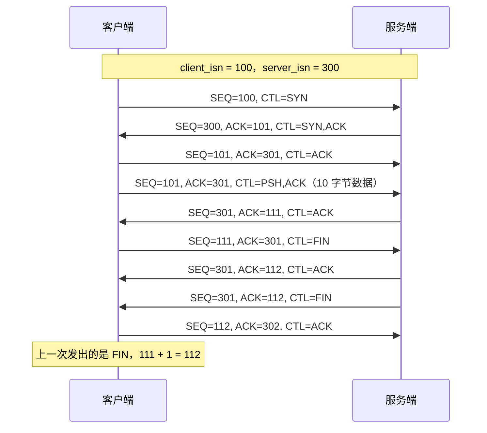
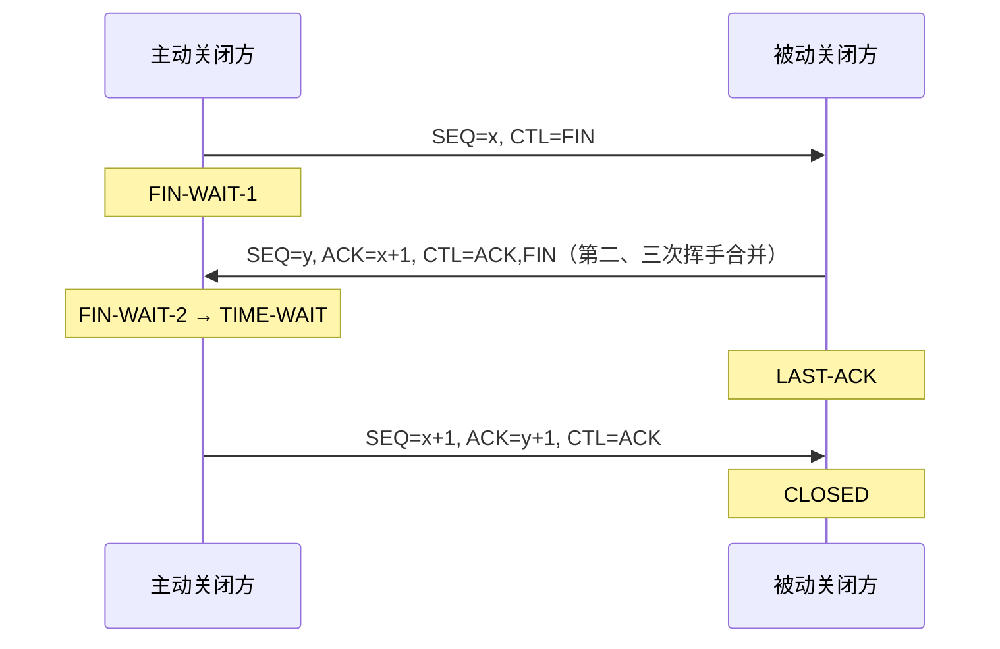
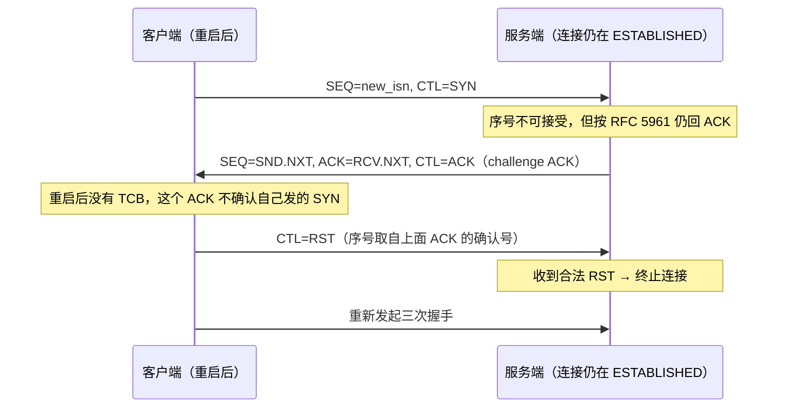

---
tags:
  - 基本功/网络
---

# TCP 的边界与失败模式

[[05-TCP 协议]] 写的是「一切正常时协议怎么走」：首部、握手与挥手、累积确认与重传、滑动窗口、拥塞控制、`MSS` 与 PMTU。本篇写另一面：什么条件下会出问题、症状长什么样、从哪个计数器能看出来、参数往哪个方向调。常规机制不重复，需要背景的位置链回母篇。

## 1. 本篇的边界与读法

母篇按协议机制顺序展开，本篇按「会坏在哪里」组织，三条规则决定取舍。

只写边界：状态机的十一个状态、`RTO` 的计算公式、慢启动如何翻倍，在 [[05-TCP 协议]] 里已写到 wire level，这里只留「什么时候会坏、怎么发现」。规范层与实现层分开说：规范给要求并带条款编号（`RFC 9293` 用 `MUST-8`、`MAY-2` 这类标记），实现给 Linux 内核实际怎么判，落到函数名与参数名；两者已知有三处不一致——Linux 的最小 `RTO` 是 `TCP_RTO_MIN`（`HZ/5`，200 ms），低于 `RFC 6298` 建议的 1 秒；`TIME-WAIT` 在 Linux 里是编译期常量 `TCP_TIMEWAIT_LEN`（60 秒），`RFC 9293` 按 2×MSL 取 4 分钟（母篇 §5.3）；`TIME-WAIT` 收到 `SYN` 的判据两边写法不同（§5.1）。

第三条是按连接的生命周期分类：

```text
   ┌────────┬──────────────────────────────┬──────────────┐
   │ 阶段    │ 典型失败                      │ 本篇落点      │
   ├────────┼──────────────────────────────┼──────────────┤
   │ 建立    │ SYN 被丢、队列满、对端没 listen│ §7           │
   │ 传输    │ 对端消失、乱序 FIN、意外报文   │ §4、§8       │
   │ 拆除    │ TIME-WAIT 被绕过、RST 偷关连接 │ §5、§6、§8   │
   │ 复用    │ ISN 撞车、旧报文混入新连接     │ §2、§5       │
   └────────┴──────────────────────────────┴──────────────┘
                            ▼
   四条判据：① 对端内核还能否发报文  ② 序号是否在窗口内（RST 需精确等于 RCV.NXT）
             ③ 计数器看增速，绝对值大不代表有问题  ④ 参数作用于哪一方、在哪个状态
```

## 2. 初始序列号与序列号空间

`ISN` 常被当成「随便一个随机数」。它同时承担三件事：把新旧连接的同名序号空间错开、让延迟报文失效、作为抗注入的随机源。

为什么每次连接的 `ISN` 都要变。连接由四元组标识（母篇 §1.1），同一个四元组会被反复使用，前一代连接的报文可能在后一代建立之后才到达。对端不会拒收——它只看序号，判据是**延迟报文的序号是否落在当前接收窗口内**，落在窗口内就当正常数据收下。极端情形把这层判据暴露得最清楚：假设每次连接的 `ISN` 都从 0 开始，一个客户端数据包被网络阻塞，同时服务端断电重启丢了旧连接并回了 `RST`，客户端之后用同一四元组建了新连接，那个被阻塞的旧包恰好抵达、序号正落在新连接的窗口里，于是被正常接收。随机化压低了新旧两代 `ISN` 相近的概率，压低不等于消除。常规防线是 `TIME-WAIT` 的 2×MSL（`RFC 9293` §3.6.1，`MUST-13`，母篇 §5.3），但它以连接正常关闭为前提，所以 `ISN` 随机化是独立的一层。接收第一个 `SYN` 的一方无法判断它是新的还是绕了一圈的旧报文，这就是三次握手必须在 `ISN` 之上再加一层的原因（`RFC 9293` §3.5，母篇 §4.3）。

规范的生成算法（来源：RFC 9293 §3.4.1）：

- `MUST-8`：必须用 32 位「时钟」驱动 `ISN` 选择，该时钟通常至少每 4 微秒递增一次，既不被假定为实时，也不要求跨重启保持。
- `SHLD-1`：应当按 `ISN = M + F(localip, localport, remoteip, remoteport, secretkey)` 生成，`M` 是那个 4 微秒计时器，`F()` 是以四元组与每主机密钥为输入的伪随机函数。
- `MUST-9`：`F()` 不得能从外部推算，否则攻击者可以用某一条连接的 `ISN` 去猜其他连接的序列号。

这个式子由 `RFC 1948` §3 提出，`RFC 6528` §3 把它提到标准轨并废弃前者，`RFC 9293` 再把结论收进正文（来源：RFC 6528 摘要）。把它记成 `RFC 793` 的算法不准确：`RFC 793` 只描述了「一个约每 4 微秒递增一次的 32 位时钟」，没有这个哈希式。`RFC 9293` §3.4.1 给出的回绕周期是「约 4.55 小时」，按 `2³² × 4 μs` 换算约 4.77 小时，差约 5%，来自取整口径，不影响「回绕周期远大于 `MSL`」这个结论。

Linux 侧的落点很直白：`tcp_v4_init_seq()` 调用 `secure_tcp_seq(daddr, saddr, dest, source)`，以四元组为输入做哈希；时间戳的偏移量由 `secure_tcp_ts_off()` 单独生成（来源：Linux `net/ipv4/tcp_ipv4.c`）。函数名里没有 `random`，因为 `ISN` 是「单调前进的时钟」加「本机密钥的哈希」的组合，随连接建立时间单调增长，抓包里两次连续连接的 `ISN` 差值可以粗略反推时间差。

回绕与 `PAWS`。32 位序号在高速链路上会绕回，母篇 §4.4 算过：1 Gbps 链路上约 17 秒绕一圈。回绕本身不是问题，问题是回绕之后「延迟报文看起来合法」重新出现。针对它的机制是 `PAWS`（Protection Against Wrapped Sequences），随 `Timestamps` 选项工作，维护一个 `TS.Recent`，新报文的时间戳不比它新就按过期丢弃（来源：RFC 7323 §5.2、§5.3）。两条实现细节决定它在边界上的行为：

- **`RST` 不受 `PAWS` 检查。** `RFC 7323` §5.2 的措辞是收到 `RST` 时不得用 `TSval` 做 `PAWS` 校验，时间戳信息也不得用来更新连接状态，理由是旧 `RST` 极不可能出现，而它拆除连接的职能优先于时间戳（来源：RFC 7323 §5.2）。这条例外与 `tcp_tw_reuse` 组合会形成一个失败模式，见 §5.3。
- **Linux 给长时间空闲的连接留了一个豁口。** `tcp_paws_check()` 在「距上次收到报文超过 `TCP_PAWS_24DAYS`（`60×60×24×24` 秒，即 24 天）」时直接放行第一个到达的包（来源：Linux `include/net/tcp.h`、`net/ipv4/tcp_timer.c`）。

时间戳自身也是 32 位、同样会回绕，速度只由时间戳时钟的步长决定：步长 1 μs 时 `2³² μs` 约 71.6 分钟绕一圈，步长 1 ms 时约 49.7 天。只有回绕周期短于连接的空闲时间，才可能出现越过 `PAWS` 的包，周期越短越常见。这也是时间戳时钟不能用纳秒级步长的原因——步长压到纳秒，回绕周期掉进分钟量级，空闲连接上会频繁出现越过 `PAWS` 的包。

## 3. 序列号与确认号在三个阶段的变化

序列号的推进可以压成两条式子，握手、传输、挥手共用（来源：RFC 9293 §3.4，母篇 §4.2）：

```text
   公式一  序列号 = 上一次发出报文的序列号 + len
           特例：上一次发出的是 SYN 或 FIN，则 +1（两者各占 1 个序号）
   公式二  确认号 = 上一次收到报文的序列号 + len
           特例：上一次收到的是 SYN 或 FIN，则 +1
   ────────────────────────────────────────────────────────────
   不对称只有一处：序列号看「自己发出去的」，确认号看「自己收到的」
   确认号的语义是「我期望收到的下一个序号」，属于接收侧（母篇 §7.1）
```

`SYN` 与 `FIN` 各占 1 个序号、`ACK` 不占，这让不带数据的控制报文也能被确认。代进三个阶段：



### 3.1 易错点与抓包读法

两处容易记错。握手阶段第二、三次握手的确认号都是「对方 `ISN` + 1」（走公式二的特例），客户端第三次握手的序号是 `client_isn + 1`，`ACK` 不占序号，所以后续第一个数据报文的序号仍是它。由此有一个边界：若第三次握手的 `ACK` 丢失，服务端停在 `SYN-RECEIVED`，客户端随后的第一个数据报文（`PSH,ACK`）序号、确认号与那个 `ACK` 完全相同且带 `ACK` 位，服务端收到它就完成建连——握手与数据传输之间没有一道必须跨过的门。挥手阶段被动方的 `FIN` 序号沿用它的发送序号，与它对第一个 `FIN` 的确认号无关。抓包时 Wireshark 默认显示相对序号（母篇 §3.5），要看真实值必须关掉 `Relative sequence numbers`。相对序号还能用来对比两个方向的推进量：两侧都在涨说明双向都有数据，只有一侧在涨说明是单向流。

## 4. 对端消失与半开连接

「对端不见了」有好几种成因，差别全落在同一个判据上：**对端的内核还能不能替这条连接发出一条报文**。

| 对端发生了什么 | 内核能否发报文 | 对端会发什么 |
| --- | --- | --- |
| 进程正常关闭 / 异常退出 / 被 `kill -9` | 能 | `FIN`，随后完成四次挥手 |
| 进程崩溃但连接上还有未读数据 | 能 | 可能是 `RST` 而不是 `FIN`（§9） |
| 内核在，但收到的报文没有匹配的 socket | 能 | `RST`（例如主机重启后收到旧连接的报文） |
| 主机断电、宕机、网线被拔 | 不能 | 什么都不发 |

连接由内核维护，进程退出（正常退出、异常退出、`kill -9` 都一样）时内核回收它的连接资源、代它发出 `FIN`，后续三次挥手也在内核完成，不需要进程参与——「进程崩了」与「连接没关」是两件事。客户端杀进程只影响该进程建立的连接，服务端杀进程会影响它 `accept` 出来的全部连接。

主机断电时内核自己也没了，没有任何报文发出，本端只剩两条路：有数据要发靠重传定时器（§4.1），没数据要发靠 `keepalive`（§4.2）；两者都没有，连接会一直停在 `ESTABLISHED` 直到本端重启进程，`ESTABLISHED` 只是本端的状态。主机断电后迅速重启是第三种情况：本端重传的报文送达重启后的对端，对端内核查不到对应 socket，回 `RST`，「只要一方重启完成，收到旧连接的报文就回 `RST`」是一条通用规律。两种成因的接口差别只有一处：进程崩溃后内核还能代它发 `FIN`，主机断电后什么都发不出；本端何时知道因此分岔——前者立刻，后者要么等重传超时，要么等 `keepalive` 探测。

### 4.1 放弃前要等多久：tcp_retries2 与 924.6 秒

对端断电、本端又有数据要发时，本端按 `RTO` 退避重传，直到一个时限后放弃并向上层报 `ETIMEDOUT`。这个时限常被误读成「重传固定 15 次」。

规范只给下限：`RFC 1122` §4.2.3.5 要求 `R1` 至少对应 3 次重传、`R2` 至少对应 100 秒，没有规定具体秒数（来源：RFC 1122 §4.2.3.5）。实现的判据是**按次数算出一个总时限，累计重传时间超过它才放弃**，与「次数到就停」不同（来源：Linux `net/ipv4/tcp_timer.c` 的 `retransmits_timed_out()` 与 `tcp_model_timeout()`）。

```text
   tcp_retries2 = 15、HZ = 1000 时的放弃时限

   boundary = tcp_retries2 = 15          重传次数上限
   rto_base = TCP_RTO_MIN = HZ/5         指数段每轮 RTO 的起点（200 ms）
   rto_max  = TCP_RTO_MAX = 120*HZ       每轮 RTO 的上限（120 s）

   第一步  linear_backoff_thresh = ilog2(rto_max / rto_base)
                                 = ilog2(120000 / 200) = 9  指数段轮数
   第二步  指数段 = (2^(9+1) − 1) × 200 ms = 1023 × 0.2 s = 204.6 s
   第三步  封顶段 = (15 − 9) × 120 s                      = 720 s
   第四步  204.6 + 720 = 924.6 s ≈ 15.4 分钟
```

这个数由 `rto_base`、`rto_max`、`boundary` 三个输入共同决定：换 HZ 或换 `tcp_retries2` 结论都变，路径 RTT 大则初始 `RTO` 大、达到同一时限需要的轮次更少。两个定位边界：默认值意味着十几分钟，把「快速回收僵死连接」寄托在 `tcp_retries2` 上会失望，要分钟级发现对端消失得走 `keepalive` 或应用层心跳；Linux 的 `RTO` 下限（200 ms）低于 `RFC 6298` 建议的 1 秒（母篇 §7.3 按规范写的正是 1 秒），`ss -ti` 里看到 `rto` 是 200 ms 量级属于实现选择，观测入口是 `ss -ti` 的 `retrans` 与 `unacked`，或 `nstat -az TcpRetransSegs` 两次采样的差值（母篇 §10.2）。

### 4.2 拔网线、keepalive 与心跳

拔网线只改变链路层：连接在内核里是一个 `struct socket`，拔线不改动它的任何字段，本机 `ss` 仍显示 `ESTABLISHED`（链路层能看到的是网卡的 `carrier`，`ip link` 打出 `NO-CARRIER`，但套接字不会因此被关闭）。分水岭是有没有数据要发——有就按 `RTO` 退避重传（§4.1），时限内插回网线双方照常，超时则本端放弃、对端之后发数据会收到 `RST`；没有就什么都不做，只能靠 `keepalive`。

`keepalive` 的三个参数见母篇 §10.3：`tcp_keepalive_time`（默认 7200 秒）、`tcp_keepalive_intvl`（默认 75 秒）、`tcp_keepalive_probes`（默认 9 次），并且必须在 socket 上设了 `SO_KEEPALIVE` 才生效。三个默认值相加，最短也要 2 小时 11 分 15 秒才能判定一条连接已死。

| 问题 | `keepalive` 的回答 |
| --- | --- |
| 对端主机断电了吗 | 能发现——探测无响应，连续几次后报连接死亡 |
| 对端进程还在吗（内核在、应用卡死） | 发现不了——探测报文由对端内核应答，与应用无关 |
| 中间设备（NAT、负载均衡）的会话还在吗 | 取决于两侧空闲超时谁更短；中间设备更短时它静默丢弃会话，两端都不知道 |

`keepalive` 探测的是「对端内核在不在」，把它当业务健康检查会漏掉「进程活着但不干活」这类故障，这就是常选应用层心跳的原因——心跳由应用自己回，可观测、可带负载信息、不受中间设备影响。另一条常见成因是中间设备空闲超时远短于 7200 秒，「连接空闲一段时间后第一次请求突然失败」常来自 `NAT`/`LB` 回收会话，处置是把应用层空闲超时压在中间设备超时之内。分辨 `keepalive` 与 HTTP 的 `Keep-Alive` 只看一处（对照表在母篇 §6.3 与 [[02-HTTP 协议]] §5.3）：抓包里**无载荷的 `ACK`** 是 TCP `keepalive`，**复用同一四元组的多组请求-响应**是 HTTP 长连接。

## 5. TIME-WAIT 与四元组复用

`TIME-WAIT` 是最容易被「优化」掉的状态，也是复用四元组时所有边界条件的交汇处。它为什么必须存在、时长怎么定在母篇 §5.3；这里只处理异常输入下的行为——主动关闭方进入 `TIME-WAIT` 后，同一四元组上还可能收到三类报文：想重建连接的新 `SYN`、旧 `SYN`、`RST`。三类走同一段判定代码，返回值决定动作。

```text
   TIME-WAIT 桶里收到报文时的四个出口
   （Linux tcp_timewait_state_process() 的返回值，net/ipv4/tcp_minisocks.c）

                         收到报文
                            │
        ┌───────────────────┼───────────────────┐
        ▼                   ▼                   ▼
     裸 SYN              RST              其他（带 ACK 等）
        ▼                   ▼                   ▼
   ┌──────────┐      ┌──────────┐      ┌──────────────┐
   │TCP_TW_SYN│      │TCP_TW_RST│      │  TCP_TW_ACK  │
   │跳过 2MSL │      │回 RST    │      │ 重发记忆中的  │
   │直接重建  │      │（仅特定  │      │ ACK（带限速） │
   │连接      │      │ 分支）    │      │              │
   └──────────┘      └──────────┘      └──────────────┘
        └──────────────┬───────────────────────┘
                       ▼
              都不成立时返回 TCP_TW_SUCCESS：丢弃，不响应
```

`TCP_TW_SYN` 的判定条件在规范与实现之间不一致（§5.1），`TCP_TW_ACK` 的形态是排查时最直接的观测点，`TCP_TW_RST` 只在一种窄条件下出现（§5.2）。

### 5.1 TIME-WAIT 收到 SYN：规范与 Linux 判定链

**规范侧有两条并行路径。** 基础路径是 `RFC 9293` §3.6.1 的 `MAY-2`：`TIME-WAIT` 中的连接可以接受对端的新 `SYN`、直接从 `TIME-WAIT` 重开，条件是两条——新连接的 `ISN` 必须大于上一代用过的最大序号，且若这个 `SYN` 其实是旧重复，连接要退回 `TIME-WAIT`（来源：RFC 9293 §3.6.1）。

第二条路径处理「开了时间戳」的情形，因为它能带来更高的建连速率：`RFC 9293` §3.10.7.4 在「同步状态收到 `SYN` 一律回 challenge ACK」这条通用规则上开了例外——若启用了时间戳并满足 `RFC 6191`，那条按序号检查的逻辑不再适用（来源：RFC 9293 §3.10.7.4）。`RFC 6191` 是一份最佳当前实践（BCP），给出下面这组分支配对（来源：RFC 6191 §2）：

1. 上一代用了时间戳，新连接也启用时间戳，且 `SYN` 的 `TSval` **大于**上一代的最近值 → 接受，建立 `SYN-RECEIVED`。
2. 时间戳**相等**，但 `SYN` 的序号大于上一代的最大序号 → 接受。
3. 新连接不启用时间戳，但 `SYN` 的序号大于上一代的最大序号 → 接受。
4. 其余情况 → **静默丢弃**，连接留在 `TIME-WAIT`。

这与「序号更大**且**时间戳更大才算合法」这种简化说法不同：时间戳更新时序号是否更大并不重要（第 1 条），只有时间戳相等或不可用时序号才成为判据（第 2、3 条）。`TIME-WAIT` 能在这一点上放宽，是因为时间戳把两代连接的序号空间在时间维度上也错开了——光靠序号检查会限制建连速率，时间戳给了第二把尺子。

**Linux 走的是第二条路径（时间戳）。** 入口是 `tcp_v4_rcv()`：查到 `sock` 后发现状态是 `TCP_TIME_WAIT`，跳 `do_time_wait`，把报文交给 `tcp_timewait_state_process()`（来源：Linux `net/ipv4/tcp_minisocks.c`）。

```text
   内核 tcp_timewait_state_process() 的判定顺序

   ① 先做 PAWS
        paws_reject = tcp_paws_reject()   报文时间戳比 tw_ts_recent 旧则为真
   ② 是否是「裸 SYN」且没被 PAWS 拒
        条件：th->syn && !th->rst && !th->ack && !paws_reject
        并且下面两条【任一】成立：
          (a) after(seq, tw_rcv_nxt)                序号比期望值更新
          (b) saw_tstamp && ts_recent < rcv_tsval   时间戳比最近值更新
        ────────────────────────────────────────────────────
        成立 → 返回 TCP_TW_SYN
               新 ISN = tw_snd_nxt + 65535 + 2（为 0 则取 1）
               跳过 2MSL，直接进入 SYN-RECEIVED
        ────────────────────────────────────────────────────
        注意 (a)(b) 是【或】。内核注释写明了理由：
          纯序号判定在 40 Mbit/s 以下才可靠；PAWS 工作时可放宽序号判据
   ③ 若不是 RST
        若 paws_reject 或报文带 ACK → 把 TIME-WAIT 定时器重排
        返回 TCP_TW_ACK：重发「记忆中的那个 ACK」
        该回复经过 tcp_timewait_check_oow_rate_limit() 限速
   ④ 若是 RST → 返回 TCP_TW_SUCCESS（RST 的处置见 §5.2）
```

源码里那条注释把「为什么是或」讲明白了：用序号判定新旧的方案只在 40 Mbit/s 以下可靠，而 `PAWS` 一旦工作起来是可靠的，可以放宽序号空间的判据。所以两个判据是「或」的关系，任一个能证明这是新连接就放行。

与规范有一处实质差异：`RFC 6191` 在判定不通过时要求**静默丢弃**，Linux 走 `TCP_TW_ACK`，即重发上一次挥手时的那个 `ACK`，并对这个回复限速（来源：Linux `net/ipv4/tcp_minisocks.c`）。回一个 `ACK` 是给对端一个明确信号：这条四元组的旧连接还在 `TIME-WAIT`，对端发现确认号不是自己期望的，回 `RST` 结束尝试；不回则对端要等自己的 `SYN` 超时。这个分支在抓包里有很确定的形态：`TIME-WAIT` 侧回出**不带数据的 `ACK`**，确认号与上一次挥手的 `ACK` 完全相同，序号是 `TIME-WAIT` 桶里记下的发送序号。

### 5.2 TIME-WAIT 收到 RST：assassination 与 tcp_rfc1337

`TIME-WAIT` 期间收到序列号**精确等于** `rcv_nxt` 的 `RST`，会让连接提前释放、跳过剩下的 2MSL。内核源码把这直接称作 `TIME_WAIT assassination`，并注明这个问题至今没有公认的彻底解法（来源：Linux `net/ipv4/tcp_minisocks.c`）。行为由 `net.ipv4.tcp_rfc1337` 控制，默认 0：

| 取值 | 收到这个 `RST` 时的行为 | 代价 |
| --- | --- | --- |
| `0`（默认） | 删除 `TIME-WAIT` 桶，提前释放连接 | 跳过 2MSL，让旧报文消亡这层保护消失 |
| `1` | 丢弃该 `RST`，连接留在 `TIME-WAIT` | 这类 `RST` 被忽略，对端若确实想拆连接要多等一轮 |

`RFC 1337` 描述的就是这个危险：`TIME-WAIT` 被提前终止后，旧数据仍有窗口进入下一代连接（来源：RFC 1337）。`tcp_rfc1337` 是 Linux 为该问题提供的开关，规范本身不含这个参数名，设成 1 更贴近 `TIME-WAIT` 的设计意图。条件边界：只有序列号精确等于 `rcv_nxt` 的 `RST` 进入这条分支，落在窗口内但不精确的走 §8.2 的 challenge ACK 规则，窗口外的被静默丢弃。

### 5.3 tcp_tw_reuse 与 tcp_tw_recycle

先纠正一个广泛流传的默认值。`net.ipv4.tcp_tw_reuse` **不是默认关闭**：Linux 4.18 起上游默认值是 `2`（仅回环地址允许复用），4.17 及以前默认才是 `0`（来源：Linux `net/ipv4/tcp_ipv4.c` 各版本 `sysctl_tcp_tw_reuse` 的初始化）。三档取值：`0` 关闭、`1` 全局启用、`2` 仅回环地址（来源：内核文档 `ip-sysctl`），文档对它的说明是「未经技术专家建议不要改动」。

生效前提与作用范围（来源：Linux `net/ipv4/tcp_ipv4.c` 的 `tcp_twsk_unique()`）：依赖 `net.ipv4.tcp_timestamps = 1`（默认 1），判定条件是 `TIME-WAIT` 桶里记录的 `tw_ts_recent_stamp` 早于当前时间，也就是这条 `TIME-WAIT` 已存在一秒以上；**只对主动发起连接的一方生效**，被动关闭的一方仍会进 `TIME-WAIT`，开启它不减少这一侧的数量，这也是它被误用的地方。

**风险一：延迟的旧 `RST` 能拆掉复用出来的新连接。** §2 记了 `RFC 7323` §5.2 的那条例外——`RST` 不受 `PAWS` 校验。这类 `RST` 本来不成问题，因为 `TIME-WAIT` 的 2MSL 保证它在下一代连接建立前消亡；跳过 `TIME-WAIT` 之后这个保证消失，只要旧 `RST` 的序列号落在新连接的接收窗口内，新连接就会被它打断。`RFC 7323` §5.8 与附录 B.2 说清了根本原因：`PAWS` 的作用范围严格限于单条连接，`TS.Recent` 存在连接控制块里、连接关闭即丢弃，替代不了 `TIME-WAIT` 让旧报文消亡这项功能（来源：RFC 7323 §5.8、附录 B.2）。

**风险二：第四次挥手的 `ACK` 丢失时，被动方可能收不了尾。** 这条 `ACK` 丢了，被动方在 `LAST-ACK` 重传 `FIN`；若主动方已复用四元组进入 `SYN-SENT`，收到这个 `FIN` 会回 `RST`。反过来，主动方复用后发出的 `SYN` 到达 `LAST-ACK` 的被动方，被动方回一个 challenge ACK（确认号沿用上一次），主动方发现不是期望值，回 `RST`。两条路径都让被动方无法正常关闭。处置方向：只有「本机是主动发起方、临时端口确实被 `TIME-WAIT` 耗尽」时才考虑调它，并优先试不改协议行为的办法——扩大本地端口范围（`net.ipv4.ip_local_port_range`，默认 `32768 60999`）、把短连接改成连接池、让服务端做被动关闭。判断是否踩到风险一，看的时间线特征是「新连接建成后极短时间内被 `RST` 掉，而两端应用都正常」，且抓包里那个 `RST` 的序号落在窗口内、时间戳反而更旧。

`net.ipv4.tcp_tw_recycle` 已经不存在：它在 Linux 4.12 被直接移除（来源：Linux 4.11 的 `net/ipv4/sysctl_net_ipv4.c` 含该项、4.12 起不再含）。凡是参数清单里还能看到它并建议开启的资料，都是 4.12 之前的。移除原因是 `NAT` 下的失败模式：开启后会启用一种 per-host `PAWS`，检查对象从「IP + 端口」的四元组变成「对端 IP」，而 `NAT` 网关后面的多台客户端共用同一个公网 IP，服务端在 per-host `PAWS` 眼里「只是在跟一个客户端打交道」；客户端 A 建立过连接、服务端回收 `TIME-WAIT` 之后，客户端 B 从同一 `NAT` 出口发起连接，如果 B 的时间戳小于 A 用过的最近值，B 的 `SYN` 就会被丢弃（来源：RFC 7323 §5.2 对 per-host 时间戳缓存的讨论）。表现是「同一 `NAT` 后面的部分客户端间歇性连不上」而服务端计数器毫无异常。这项功能的位置后来由 `tcp_tw_reuse` 接手，但两者安全性来源不同：`tcp_tw_reuse` 按四元组判定、不依赖对端 IP，不受 `NAT` 影响。配套参数 `net.ipv4.tcp_max_tw_buckets` 限制 `TIME-WAIT` 桶的总数，超过上限时内核直接销毁该桶并打警告；它是防简单 DoS 的兜底，不是省端口的旋钮，调小只会让 `TIME-WAIT` 提前消失（来源：内核文档 `ip-sysctl`）。

## 6. 四次挥手变成三次

规范模型是四次：被动方收到 `FIN` 后先回 `ACK`，何时发自己的 `FIN` 由应用决定，因为应用可能还有数据要发（来源：RFC 9293 §3.6.1，母篇 §5.1）。实现里出现三次挥手，条件是被动方没有数据要发、并且延迟确认开着（默认开），此时 `ACK` 与 `FIN` 合并成一个报文发出。



延迟确认的规则来自 `RFC 1122` §4.2.3.2 与 `RFC 5681`：不能给每个数据段都单独回 `ACK`，要把确认攒一攒（母篇 §7.5）。等待上限是 500 ms（`RFC 5681` 的 `MUST`），Linux 的实现区间由 `TCP_DELACK_MIN`（`HZ/25`，40 ms）与 `TCP_DELACK_MAX`（`HZ/5`，200 ms）界定（来源：Linux `include/net/tcp.h`），所以 Linux 上合并挥手的 `ACK` 延迟是几十毫秒量级。关闭延迟确认用 socket 选项 `TCP_QUICKACK`，有一个容易踩的边界：每次读数据之后要重新设置，若在 `read()` 返回 0（读到 `FIN`）之后才设，接下来那个 `ACK` 是立刻发出的，因而在这一位置能看到四次挥手。还有一条让挥手「变成两次」的路径：主动方用 `close()` 关闭而接收缓冲区里还有未读数据时，内核改发 `RST` 而不是 `FIN`（母篇 §6.3），挥手就此中断，也不产生 `TIME-WAIT`；`SO_LINGER` 的 `l_onoff=1, l_linger=0` 是它的显式版本（母篇 §4.6），对端看到的就是 `Connection reset by peer`。

## 7. 建连期的丢弃与拒绝

建连失败的几种成因症状几乎一样——客户端卡在 `connect()`。两个队列、各自上限、`syncookies` 与 `tcp_abort_on_overflow` 的基础机制在 [[05-TCP 协议]] §4.7，这里写队列满之后的失败形态。

`SYN` 被丢弃后，双方各走各的。服务端丢弃 `SYN` 不会通知任何人。客户端侧：`SYN` 未被确认，按 `RTO` 退避重传，次数上限是 `net.ipv4.tcp_syn_retries`（默认 6）；初始 `RTO` 1 秒，退避 1、2、4、8、16、32、64 秒，累计约 127 秒后 `connect()` 失败（来源：RFC 6298 §2.1；母篇 §10.3）。抓包形态是**间隔递增的 `SYN`、始终没有 `SYN-ACK`**。服务端侧：半连接队列满时新 `SYN` 被直接丢弃，不为它建半连接对象；若 `tcp_syncookies = 1` 则改走 cookie 路径，仍然回 `SYN-ACK`。所以「收到了 `SYN` 却不回 `SYN-ACK`」与「根本没收到 `SYN`」要分开看，前者能在服务端抓到 `SYN` 到达。

### 7.1 两类队列满的处置与代价

半连接队列满默认丢 `SYN`，`syncookies` 兜底。cookie 路径除了「不保留连接状态、`SYN` 上的部分选项可能丢失」，还有一条失败模式：**cookie 的编解码消耗 CPU**。既然服务端不为 `SYN` 存状态，攻击者就可以构造大量带伪造 cookie 的 `ACK`，服务端为每个都跑一次解码、发现不合法再丢弃，CPU 被这样耗掉（来源：RFC 4987 §4.1.2）。观测落在 `TcpExtSyncookiesSent`、`SyncookiesRecv`、`SyncookiesFailed` 上。全连接队列满默认丢弃第三次握手的 `ACK`、让客户端重传，`tcp_abort_on_overflow = 1` 则直接回 `RST`。这里有一条**消不掉的歧义**：`tcp_abort_on_overflow = 1` 时客户端收到的 `RST`，与「端口根本没有 `listen`」时收到的 `RST` 完全一样，客户端无法区分；排查只能从服务端侧看 `ss -lnt` 的 `Recv-Q` 是否贴住 `Send-Q`、`TcpExtListenOverflows` 是否在涨。队列的数据结构解释了一处性能设计：**半连接队列是哈希表，全连接队列是链表**，第三次握手的 `ACK` 到达时要按 `IP + 端口` 在半连接队列里定位，链表 O(n)、哈希表 O(1)，而 `accept()` 只从队头取、不关心是哪一条，链表就够（来源：Linux `net/ipv4/inet_hashtables.c` 与 `inet_csk_accept()`）。

### 7.2 服务端没有 listen：RST 还是 ICMP

服务端只 `bind()` 了地址与端口、没有 `listen()` 时，客户端发起连接会收到 `RST`。内核路径是 `tcp_v4_rcv()` → `__inet_lookup_skb()`：先找已建立连接的慢哈希，没命中再找监听哈希，两处都没有就跳 `no_tcp_socket`，校验和正确时调 `tcp_v4_send_reset()` 回 `RST`（来源：Linux `net/ipv4/tcp_ipv4.c`）。与这条并排的是防火墙路径，`iptables` 的 `REJECT` 与「有没有 `listen`」组合出四种客户端可见结果（来源：`iptables-extensions(8)` 的 `REJECT` 目标）：

| 服务端/中间设备的行为 | 客户端 `connect()` 的结果 | 客户端看到什么 |
| --- | --- | --- |
| 端口无 `listen`，本机回 `RST` | `ECONNREFUSED` | `Connection refused` |
| `REJECT --reject-with tcp-reset` | `ECONNREFUSED` | `Connection refused`（与上一行不可区分） |
| `REJECT --reject-with icmp-port-unreachable` | `ECONNREFUSED` | 同上，但客户端收到的是 ICMP |
| `DROP`（不响应任何报文） | `ETIMEDOUT` | `Connection timed out` |

最快的一步分流就在这里：**`Connection refused` 说明收到了回绝报文，`Connection timed out` 说明什么都没收到**。前者往「端口没监听 / 队列满 / `REJECT`」查，后者往「`SYN` 被丢 / 防火墙 `DROP` / 路由不可达」查。顺带摆正一条常被混淆的边界：`ping` 走 ICMP、属于网络层，与传输层端口有没有监听无关，`ping` 通而 `connect` 被拒是常态（见 [[09-ICMP 与 ping]]）。另外，「没有 `listen` 也能建立连接」是独立的另一件事：TCP 自连接与同时打开都不需要 `listen`，因为这两个场景没有被动方队列参与，靠的是内核里那张全局哈希表——`connect()` 把连接信息放进去，报文回到传输层后按 `IP + 端口` 再取出来（来源：Linux `net/ipv4/inet_hashtables.c`），同时打开是协议强制要求支持的场景（`RFC 9293` §3.5 的 `MUST-10`，母篇 §4.5）。这也解释了 §7 的前提：两个队列都是 `listen()` 时才创建的。

## 8. 传输期收到的意外报文

连接已同步（`ESTABLISHED`）时，收到的报文序号本该在窗口内、内容本该是数据。三类异常输入各有确定的处理，且都与「伪造报文能不能拆连接」直接相关。

| 收到的报文 | 判据 | 处理 |
| --- | --- | --- |
| 同步状态下的 `SYN` | 序号是否可接受都不影响入口 | 一律回 challenge ACK，丢弃该 `SYN`（§8.1） |
| 序号不精确的 `RST` | 是否精确等于 `RCV.NXT` | 不精确则回 challenge ACK、连接不变；窗口外静默丢弃（§8.2） |
| 乱序的 `FIN` | 序号是否等于 `RCV.NXT` | 先入乱序队列，等前序数据补齐再处理（§8.3） |

三者的共同点是序号：报文序号必须落在接收窗口内（`RCV.NXT` 到 `RCV.NXT + RCV.WND`），`RST` 还额外要求精确等于 `RCV.NXT`。落不进窗口的被静默丢弃，落进窗口但语义非法的按 `RFC 5961` 回一个 challenge ACK 再丢弃——challenge ACK 是本节的中心机制。

### 8.1 收到 SYN：challenge ACK

场景是客户端宕机后重启，用同一个源端口再发 `SYN`，而服务端这条连接还停在 `ESTABLISHED`。旧规则（`RFC 793`）是「`SYN` 落在窗口内就回 `RST`」，`RFC 5961` §4.2 把它改成了新规则（来源：RFC 5961 §4.2；`RFC 9293` §3.10.7.4 收编）：

> 同步状态下收到 `SYN`，**无论其序号如何**，都必须回一个 `ACK`（即 challenge ACK），格式为 `<SEQ=SND.NXT><ACK=RCV.NXT><CTL=ACK>`；发完之后丢弃这个不可接受的报文，并停止后续处理。



对照旧规则能看出这条修改防住了什么。旧规则下 `SYN` 只要落在窗口内就触发 `RST`，一个被伪造的 `SYN`（序号猜中窗口）就能拆掉一条已建立的连接；新规则下伪造的 `SYN` 只能换来一个 `ACK`，对端如果真是活的会把它当重复确认忽略掉，连接不受影响，只有真正重启过、已经没有 TCB 的对端才会回 `RST`（来源：RFC 5961 §4.2）。

### 8.2 RST 的接受规则与精确匹配

`RST` 的接受条件在 `RFC 5961` §3.2 同样被收紧（来源：RFC 5961 §3.2）：

| `RST` 的序号位置 | 处理 |
| --- | --- |
| 精确等于 `RCV.NXT` | 重置连接（`MUST`） |
| 落在接收窗口内但不精确匹配 | 回 challenge ACK，丢弃该 `RST`，连接不变（`MUST`） |
| 窗口外 | 静默丢弃 |
| 状态是 `SYN-SENT` 时 | 看 `ACK` 字段是否确认了本端的 `SYN`，是则接受 |

比 `RFC 793` 的「落在窗口内即可重置」严格一档，目的同样是抗盲注。由此可以推出「关掉一条别人的连接」需要同时满足两个条件：四元组相同，且 `RST` 的序号精确等于对方期望的下一个序号——后者正是 §8.1 里 challenge ACK 会泄露的值，两条机制在这里闭环。正常的关闭方式不需要这些，`close()`、`shutdown()`、杀进程（§4）都能让内核自己发 `FIN` 或 `RST`。把它当排查判据的用法是：**抓包里出现「先一个 `SYN`、再一个 `RST`」的异常组合，说明有人用 challenge ACK 取到了序号**；而 `Connection reset by peer` 本身只说明收到了 `RST`，不说明是谁发的。

同一段规范里还有一处安全边界：challenge ACK 的 `ACK` 字段正好是本端「下一次期望收到的序号」，也正是伪造一个能重置连接的 `RST` 所需要的那个序号。`RFC 5961` §7 因此建议实现做 `ACK` 限速，并给了「任意 5 秒窗口内不超过 10 个」这样的示例值（来源：RFC 5961 §7）。Linux 的实现是 `tcp_send_challenge_ack()`：先按 socket 上的 `last_oow_ack_time` 与 `net.ipv4.tcp_invalid_ratelimit`（默认 `HZ/2`，即 500 ms）限流，再走主机级上限 `net.ipv4.tcp_challenge_ack_limit`（当前默认 `INT_MAX`，即主机级上限默认不生效）（来源：Linux `net/ipv4/tcp_input.c`、`net/ipv4/tcp_ipv4.c`）。所以抓包里看到「一个 `SYN` 紧跟着一个 `ACK`」，未必是攻击，也可能是对端用同一四元组重建连接的正常第一步。

### 8.3 乱序到达的 FIN

另一条异常输入是乱序的 `FIN`——`FIN` 先到、它前面的数据后到。此时主动关闭方停在 `FIN-WAIT-2`，处理分两步（来源：Linux `net/ipv4/tcp_input.c` 的 `tcp_rcv_state_process()`、`tcp_data_queue()`、`tcp_ofo_queue()`；母篇 §6.1）。

```text
   FIN-WAIT-2 收到乱序 FIN：状态先不动，等前序数据补齐

   收到 FIN，seq 不是期望的 rcv_nxt
        │   tcp_rcv_state_process() 进 case TCP_FIN_WAIT2 → tcp_data_queue()
        ▼
   ┌──────────────────────────────────────────────────┐
   │ 序号不是期望值 → tcp_data_queue_ofo()              │
   │ 报文进乱序队列（红黑树），状态保持不变              │
   └──────────────────────────────────────────────────┘
        │   之后延迟的数据到达，序号正好是 rcv_nxt
        ▼
   ┌──────────────────────────────────────────────────┐
   │ tcp_ofo_queue() 在乱序队列里找与当前序号连续的段    │
   │ 若找到的那段带 FIN → 调 tcp_fin()                  │
   └──────────────────────────────────────────────────┘
        │
        ▼
   发第四次挥手的 ACK → 转 TIME-WAIT → 启动 2MSL 定时器
```

两个可用于定位的结论：`FIN-WAIT-2` 停留久不一定是坏事，它可能只是在等一段迟到的数据补齐序号（母篇 §6.2 只列了「对端应用未关闭」这一种成因，乱序队列是第二种）；观测点是抓包顺序，看最后一个数据段与 `FIN` 的到达先后，`FIN` 在前且序号大于 `rcv_nxt` 就走的是这条路径，`ss` 只有状态，看不出乱序队列里有没有待补齐的段。

## 9. TCP 保证了什么、没有保证什么

「可靠传输」这个词在工程讨论里被用得太松，这里把它确切边界钉住。

协议层面的固有缺陷有四类（展开见 [[07-QUIC 与 UDP 上的可靠传输]]）：升级困难，`TCP` 实现在内核，升级协议等于升级内核，需要两端同时支持的新特性（如 `TCP Fast Open`）因此推广很慢（来源：RFC 7413 §1）；建连延迟，任何基于 `TCP` 的应用协议都要先走三次握手，`HTTPS` 还要在其上再走 TLS 握手（§10）；队头阻塞，`TCP` 按序把字节交给应用，序号较小的段丢失会让序号更大的段即使已到达也交不上去（母篇 §1.3），`HTTP/2` 的多路复用在一条 `TCP` 连接上，一个段丢失会阻塞该连接上所有 stream（[[02-HTTP 协议]] §6.5）；连接迁移要重建，连接由四元组标识，移动设备从 4G 切到 WiFi、IP 变化之后必须重建连接，代价包含握手时延与慢启动。

四类之外有一条更根本的边界，它不属于「缺陷」，属于「承诺范围」。

### 9.1 「可靠」的准确边界

`TCP` 保证的是传输层到传输层：它保证「字节流要么按序完整地交给对端传输层，要么连接以错误告终」。它不保证送达，失败可能以 `RST` 或超时告终；它不保证实时，`Nagle`、延迟确认与拥塞控制都会主动延迟发送（母篇 §1.3）。承诺在应用层边界上结束。

`ACK` 只到内核接收缓冲区：发送方收到 `ACK` 后把自己发送缓冲区里的数据丢掉，而对端应用可能还没 `read()`。如果这一刻对端进程崩溃或被 `kill -9`，接收缓冲区里那些数据随进程消失，发送方以为已经送达，接收方的应用却从没看到。`TCP` 在这个链条上没有违规：它的职责在把字节放进对端内核的那一刻就完成了。要在应用层拿到送达保证，得自己加一层——把服务端放回链路，让它维护一份消息序列（例如按消息 `id` 对账），收发两侧各自与服务端比对缺了哪条。进程崩溃时本端数据留在内核缓冲区，内核仍会替它把已缓冲的数据发出去并完成挥手（§4），丢的是对端接收缓冲区里未被应用取走的那部分，两侧的缓冲区是两回事。

`RST` 会连缓冲区一起丢：收到 `RST` 时，内核把发送缓冲区里未发出的数据与接收缓冲区里未读的数据一并丢弃，应用后续的 `read()`/`write()` 得到 `ECONNRESET`。主动发 `RST` 的情形同样会丢——`close()` 时接收缓冲区还有未读数据、`SO_LINGER` 的 `l_linger=0`、向已被对端关闭的连接写数据，都走这条路径（母篇 §6.3、§3.6）。「收到 `RST` 时缓冲区里还有多少数据」直接决定丢多少，这也是 `RST` 比 `FIN` 危险的地方：`FIN` 之后本端还能继续收完剩余数据（母篇 §5.2），`RST` 是立即清空。

## 10. 边界与选型：TFO 与 TLS 同时握手

「`HTTPS` 的 TLS 握手能不能和 TCP 三次握手同时进行」只有在明确前提之后才有答案。前提是 `TCP Fast Open` 与 `TLS 1.3` 的组合，缺一不可。

TFO 的 cookie 机制。常规情况下 `SYN` 与 `SYN-ACK` 不能携带数据，只有第三次握手可以（此时客户端已进入 `ESTABLISHED`，母篇 §4.1）。`TCP Fast Open` 要绕过这个限制，让客户端在 `SYN` 里就带上应用数据（来源：RFC 7413 §3、§4）。它需要先拿到 cookie，所以第一次通信仍是正常三次握手：客户端发 `SYN`、带 `Fast Open` 选项且 `Cookie` 为空，表示请求一个 cookie；服务端生成 cookie，放进 `SYN-ACK` 的同一个选项回给客户端，客户端缓存起来。此后（第二次及以后）的通信，客户端可以在 `SYN` 里同时带上 cookie 与应用数据；服务端校验 cookie，有效则对 `SYN` 与数据一并确认并把数据交给应用，还能在握手完成之前发出响应数据，无效则丢弃 `SYN` 里的数据、只确认 `SYN`，客户端需要重传数据（来源：RFC 7413 §4.1）。cookie 与客户端地址绑定，地址变了 cookie 就失效。Linux 的开关是 `net.ipv4.tcp_fastopen`，位掩码：`1` 客户端、`2` 服务端、`3` 两端，默认 `1`（来源：内核文档 `ip-sysctl`；母篇 §10.3 已列其六要素）。它要求两端都支持，中间设备放行带未知 `TCP` 选项的 `SYN` 也是前提。

### 10.1 TLS 1.3 的 1-RTT、0-RTT 与叠加

`TLS` 跑在 `TCP` 之上，「先三次握手、再 TLS 握手」这句话本身没错（握手细节见 [[03-TLS 与 HTTPS]]）。差别在 RTT 数：`TLS 1.2` 的完整握手要 2 个 RTT，`TLS 1.3` 压到 1 个 RTT（来源：RFC 8446 §2）。恢复会话时 `TLS 1.3` 用预共享密钥（`pre_shared_key`），并可用 `early_data` 扩展在收到服务端任何响应之前就发出应用数据，达到 0-RTT（来源：RFC 8446 §2.3、附录 D.1）。把两者叠起来，「同时握手」才成立：

```text
   只有 TLS 1.3、没有 TFO
     TCP: SYN ─────▶ SYN-ACK ─────▶ ACK（第二次握手后客户端才 ESTABLISHED）
     TLS:                          ClientHello ─────▶ ...
     第三次握手虽可带数据，但服务端要等收到它才能继续 TLS —— 两个握手是串行的
                                    │
   同时开 TFO 与 TLS 1.3，且不是第一次通信
     TCP: SYN + cookie + TLS ClientHello（一并带出）
     TLS: 服务端可在握手完成前就发出响应数据
     ⇒ 两个握手在时间上重叠；再叠加 TLS 1.3 的 0-RTT，HTTP 请求也能一起发出
                                    ▼
   两个必要条件：① 两端都启用 TFO，且 TLS 版本是 1.3
                 ② 已经完成过一次通信（否则没有 cookie）
```

所以「TLS 握手可以和三次握手同时进行」在缺上述任一前提时都不成立，把适用范围限定在「`TFO` + `TLS 1.3` + 非首次通信」之后才准确。实际部署里这条组合的影响范围有限：`TFO` 是可选扩展，部分操作系统长期不支持，服务端与中间设备的支持程度也不一（来源：RFC 7413 §1）。

## 11. 排查线索

把前面各节的判据收成一张表，顺序按「从通不通到状态对不对」排（来源：本文各节；命令口径见母篇 §10.2）。

| 症状 | 判据 | 先看什么 |
| --- | --- | --- |
| `Connection refused` | 收到了回绝报文（`RST` 或 ICMP port unreachable） | 服务端 `ss -tlnp` 有没有监听；`tcp_abort_on_overflow`；防火墙是否 `REJECT` |
| `Connection timed out` | 什么都没收到 | 抓 `SYN` 是否到达；`TcpExtListenDrops`；路径是否 `DROP` |
| 建连偶发失败、重试 `SYN` 间隔递增 | `SYN` 或 `SYN-ACK` 被丢 | `TcpExtListenDrops` 与 `TcpExtListenOverflows` 的增速 |
| 连接已建立但请求收不到确认 | 全连接队列溢出 | `ss -lnt` 的 `Recv-Q` 是否贴住 `Send-Q` |
| 连接空闲后被突然断开 | 中间设备回收会话，或 `keepalive` 触发 | 空闲时长与 `NAT`/`LB` 超时；`tcp_keepalive_*` |
| 对端消失但本端仍是 `ESTABLISHED` | 对端发不出报文 | `ss -ti` 的 `retrans`、`unacked`；是否开了 `SO_KEEPALIVE` |
| `TIME-WAIT` 堆积 | 本机是主动关闭方 | `ss -tan state time-wait` 计数；改用连接池或让对端先关 |
| `FIN-WAIT-2` 堆积 | 对端未关，或乱序 `FIN` 卡在乱序队列 | 抓包里 `FIN` 与最后一个数据段的到达顺序 |
| `CLOSE-WAIT` 堆积 | 应用漏了 `close()` | 查应用代码，这属应用 bug（母篇 §6.2） |
| 空闲连接上周期性一对无载荷报文 | `keepalive` 探测 | 抓包确认是否只有 `ACK` 与 1 字节探测 |

### 11.1 三条判读原则

先分有没有收到报文：这一步把「`RST` 类」与「超时类」分开，两类排查路径完全不同。计数器看增速不看绝对值：累计值大不代表此刻有问题，两次采样之间的差值才说明问题（母篇 §10.2）。规范给的是要求，以本机实测为准：`ISN` 的算法、`TIME-WAIT` 收到 `SYN` 的判定、`RTO` 的下限，规范与 Linux 实现都有差异。丢包发生在链路的哪个位置、各自的观测入口，见 [[14-Linux 内核收发网络包]]；两端之间的路径丢包用 `mtr`，判读原则是只信最后一跳。还有一条操作习惯：改参数前先记下当前值，改完对比计数器的差值；`tcp_tw_reuse`、`tcp_syncookies` 这类开关只在连接建立路径上生效，已经在跑的连接不受影响，回滚要等旧连接自然结束。

## 相关

- [[05-TCP 协议]] —— 母篇：首部、状态机、确认与重传、流量与拥塞控制、内核参数速查
- [[14-Linux 内核收发网络包]] —— 丢包位置在收发路径上的具体落点
- [[02-HTTP 协议]] —— HTTP 侧的连接复用、队头阻塞与 `Keep-Alive` 对照
- [[03-TLS 与 HTTPS]] —— `TLS 1.2` 与 `1.3` 的握手、`0-RTT` 的应用层前提
- [[07-QUIC 与 UDP 上的可靠传输]] —— 本篇列出的四类固有缺陷在 QUIC 里的对应解法

## 参考

- W. Eddy. *Transmission Control Protocol (TCP)*. RFC 9293, August 2022. https://www.rfc-editor.org/rfc/rfc9293
- R. Braden, ed. *Requirements for Internet Hosts — Communication Layers*. RFC 1122, October 1989. https://www.rfc-editor.org/rfc/rfc1122
- S. Bellovin. *Defending Against Sequence Number Attacks*. RFC 1948, May 1996. https://www.rfc-editor.org/rfc/rfc1948
- F. Gont, S. Bellovin. *Defending Against Sequence Number Attacks*. RFC 6528, February 2012. https://www.rfc-editor.org/rfc/rfc6528
- D. Borman, B. Braden, V. Jacobson, R. Scheffenegger. *TCP Extensions for High Performance*. RFC 7323, September 2014. https://www.rfc-editor.org/rfc/rfc7323
- F. Gont. *Reducing the TIME-WAIT State Using TCP Timestamps*. RFC 6191, April 2011. https://www.rfc-editor.org/rfc/rfc6191
- A. Ramaiah, R. Stewart, M. Dalal. *Improving TCP's Robustness to Blind In-Window Attacks*. RFC 5961, August 2010. https://www.rfc-editor.org/rfc/rfc5961
- R. Braden. *TIME-WAIT Assassination Hazards in TCP*. RFC 1337, May 1992. https://www.rfc-editor.org/rfc/rfc1337
- W. Eddy, M. Welzl. *TCP SYN Flooding Attacks and Common Mitigations*. RFC 4987, August 2007. https://www.rfc-editor.org/rfc/rfc4987
- Y. Cheng, J. Chu, S. Radhakrishnan, A. Jain. *TCP Fast Open*. RFC 7413, December 2014. https://www.rfc-editor.org/rfc/rfc7413
- E. Rescorla. *The Transport Layer Security (TLS) Protocol Version 1.3*. RFC 8446, August 2018. https://www.rfc-editor.org/rfc/rfc8446
- V. Paxson, M. Allman, J. Chu, M. Sargent. *Computing TCP's Retransmission Timer*. RFC 6298, June 2011. https://www.rfc-editor.org/rfc/rfc6298
- M. Allman, V. Paxson, E. Blanton. *TCP Congestion Control*. RFC 5681, September 2009. https://www.rfc-editor.org/rfc/rfc5681

内核实现行号、函数名与参数默认值对照 Linux 上游源码 `v6.6`（`net/ipv4/tcp_timer.c`、`net/ipv4/tcp_minisocks.c`、`net/ipv4/tcp_input.c`、`net/ipv4/tcp_ipv4.c`、`net/ipv4/inet_hashtables.c`、`include/net/tcp.h`）与内核文档 `ip-sysctl`，未逐条对应到单一规范。
