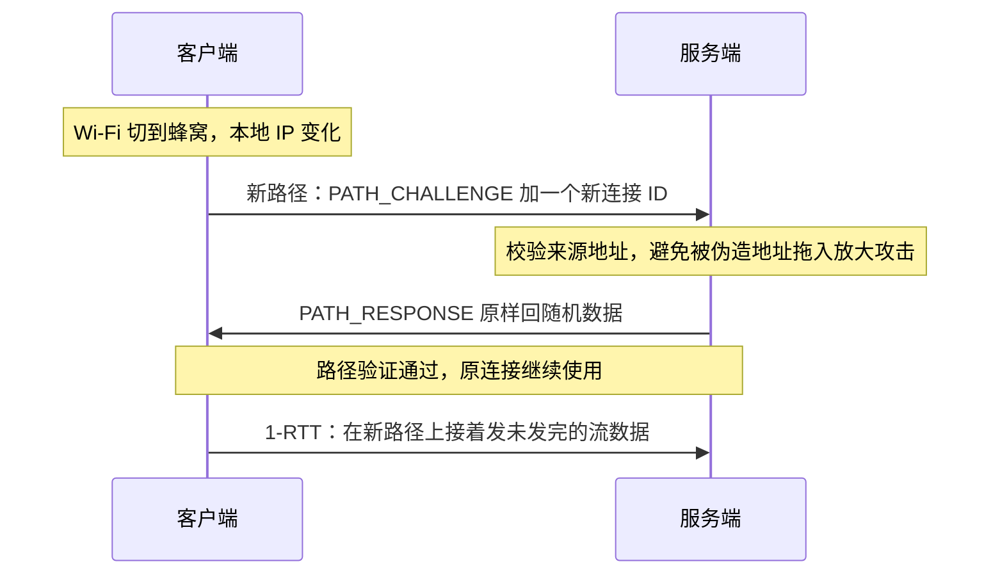
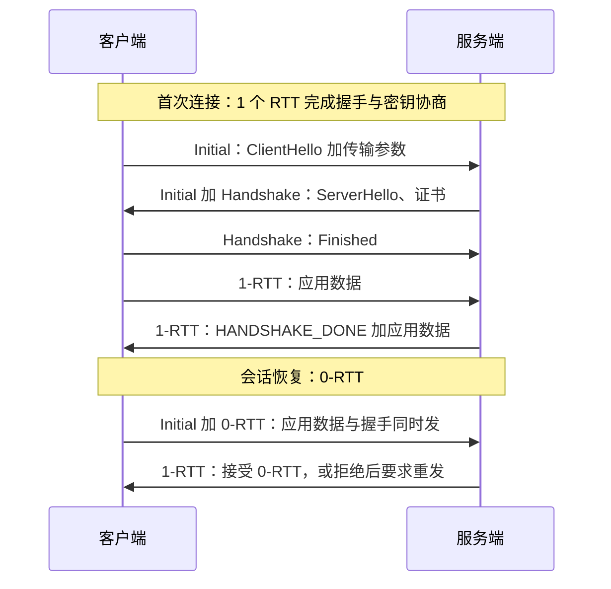

---
tags:
  - 基本功/网络
---

# QUIC 与 UDP 上的可靠传输

`QUIC` 是跑在 UDP 之上的通用传输协议。`RFC 9000` 定义基本传输（包格式、流、连接管理、连接迁移），`RFC 9001` 定义它如何用 TLS 1.3 做握手与密钥协商，`RFC 9002` 定义丢包检测与拥塞控制；`HTTP/3` 是它之上的一个应用绑定（来源：RFC 9000 / 9001 / 9002 / 9114）。QUIC 把 TCP 已经做过的事——序号、确认、重传、流控、拥塞控制、连接建立——在用户态重新实现了一遍，换来的是这些机制的控制权落到应用进程手里。

本篇讲 QUIC 这一侧：为什么值得把传输层搬出内核、搬出来以后每个机制长什么样、代价落在哪几个点上。`HTTP/3` 的应用层分帧与 `QPACK` 在 [[02-HTTP 协议]] §6.6 已写过，不再重复；`HTTP/3` 底下的 QUIC 属于传输层，是这一篇的正文。

## 1. 为什么在 UDP 之上实现可靠传输

QUIC 的第一个设计选择是把整条传输协议放进用户态进程，借 UDP 当作进入内核网络栈的入口。`UDP` 不提供可靠传输，可靠性、有序性与连接管理全部由 QUIC 自己补上。这个选择要放在「如果继续改 TCP 会怎样」的对照里才看得清。

改动传输层语义的传统路径是打内核补丁、随内核版本发布，再等发行版装到终端机器上。一个新的 TCP 选项或拥塞控制算法从定稿到公网两端同时可用，跨度以年计：任意一端的内核没升级，协商就退化回旧行为。QUIC 把实现放进随应用分发的库，应用升级一次版本，新机制立刻在两端生效。

第二条理由是可控性。TCP 的发送与接收路径由内核统一管理：拥塞控制算法对一台主机上所有连接生效，缓冲区大小、重传行为、ACK 策略都由内核参数决定。QUIC 在用户态自己持有拥塞窗口、RTT 估计、丢包检测与发送调度，可以逐连接选用策略，代价是这些状态全部由应用进程维护。

第三条是交付路径。QUIC 报文按 UDP 数据报发送，链路按 UDP 处理即可，不需要中间设备认识 QUIC 才能转发（来源：RFC 9000 §1）。这也是把传输层建在 UDP 而不是新 IP 协议号上的直接原因：已有网络与中间设备原样放行。

```text
   TCP 与 QUIC 把协议实现放在不同侧

   ┌──────────────────────── 用户态 ────────────────────────┐
   │  应用 / HTTP/3 分帧（应用层）                            │
   │  QUIC 实现   握手 · 丢包检测 · 重传 · 流控 · 拥塞控制    │
   │  UDP socket  sendmsg / recvmsg · GSO 分段 · GRO 合并     │
   └──────────────────────────┬─────────────────────────────┘
                              │ 系统调用边界（每包一次）
   ┌──────────────────────────▼─────────────────────────────┐
   │  内核 UDP 层   端口查找 · 校验和 · 收发队列              │
   │  内核 IP / 网卡 路由 · qdisc · NAPI · RSS                │
   └────────────────────────────────────────────────────────┘

   对照：TCP 的握手、重传、流控、拥塞控制全部在内核侧完成
```

代价集中在用户态与内核的这条边界上：

- **每个包都要过一次系统调用边界。** 收包一次 `recvmsg`、发包一次 `sendmsg`；实现用 `sendmmsg` / `recvmmsg` 批量收发、用 GSO / GRO 让内核批量切分与合并（来源：Cloudflare, *Accelerating UDP packet transmission for QUIC*）。
- **分段卸载由用户态驱动。** `UDP` 的通用分段卸载在 Linux 4.18 引入：应用把一段「超级缓冲区」交给内核，内核按 `UDP_SEGMENT` 指定的长度切成多个数据报，一次最多 64 段；接收侧的 `UDP GRO` 把同四元组的数据报合并后一次交给应用（来源：同上）。
- **多核分发要自己维护。** 内核 TCP 靠网卡 RSS 把一条连接固定到某个 CPU；QUIC 在用户态，要靠 `SO_REUSEPORT` 开多个收发线程，或自己做连接 ID 到线程的映射，否则单线程收包会成为上限。
- **发送节奏不再由内核兜底。** 内核 qdisc 会给同一主机上的所有流做排队与整形；QUIC 的 pacing 必须在用户态实现，而批量发送与逐包 pacing 是一对矛盾：批量为了少走系统调用，pacing 要把包在时间上摊开（来源：同上）。

## 2. 包、帧与加密分层

QUIC 有两种包格式：1-RTT 密钥可用之前用**长首部**（Long Header），之后切到**短首部**（Short Header）（来源：RFC 9000 §17.2、§17.3）。长首部带版本号、源/目的连接 ID 与长度字段，因此一个 UDP 数据报可以把多个长首部包首尾粘连（coalescing）；短首部只带格式位、一个连接 ID 与包号，长度由数据报长度推出（来源：RFC 9000 §12.2）。长首部的包类型只有四种（来源：RFC 9000 §17.2 Table 5）：

| 类型值 | 名称 | 用途 |
| --- | --- | --- |
| `0x00` | `Initial` | 承载握手的第一批 `CRYPTO` 帧 |
| `0x01` | `0-RTT` | 会话恢复时随首个包发出的早期数据 |
| `0x02` | `Handshake` | 承载握手后续的 `CRYPTO` 帧 |
| `0x03` | `Retry` | 服务端要求客户端带令牌重新发起 |

`Version Negotiation` 不走这张表：它沿用长首部的固定布局，但版本字段填 `0`、首个字节的 `Fixed Bit` 置 `0`（来源：RFC 9000 §6、§17.2.1）。包的保护分四级加密：`Initial`、`0-RTT`、`Handshake`、`1-RTT`，对应三个包号空间——`Initial` 与 `Handshake` 各自独立，`0-RTT` 与 `1-RTT` 合在应用数据空间（来源：RFC 9001 §4.1.3）。`Initial` 的密钥由客户端首个 `Initial` 包的目的连接 ID 与一个**固定 salt** 派生，任何人都能算出，规范因此明确它不提供针对可观测攻击者的机密性与完整性，只用来防住「看不见包、企图伪造 `Initial`」的攻击者（来源：RFC 9001 §5、§5.2；RFC 9000 §17.2.2）。握手之后的三级密钥都由 TLS 1.3 协商。

```text
   一个 UDP 数据报里的 QUIC 包与帧

   ┌───────────────────────────────────────────────────────────────┐
   │ UDP 首部（8 字节）                                             │
   ├───────────────────────────────────────────────────────────────┤
   │ Short Header │ Destination Connection ID │ Packet Number …     │
   ├───────────────────────────────────────────────────────────────┤
   │ Packet Payload（首部受保护字段之外全部加密）                    │
   │   ┌──────────┬──────────┬──────────┬──────────┐               │
   │   │  Frame 1 │  Frame 2 │  Frame 3 │  …       │               │
   │   └──────────┴──────────┴──────────┴──────────┘               │
   │   帧不能跨越包边界：一个帧必须完整落在同一个包内               │
   └───────────────────────────────────────────────────────────────┘
```

包里面装的是**帧**（frame）。一个包至少含一个帧，可以含多种帧；一个帧必须完整落在同一个包内，**不能跨包**，所有帧都有内置长度字段保证这一点（来源：RFC 9000 §12.4）。主要帧类型（来源：RFC 9000 §19）：

| 帧 | 作用 |
| --- | --- |
| `ACK` | 确认已收到的包号，可带 ECN 计数 |
| `CRYPTO` | 承载 TLS 握手字节 |
| `STREAM` | 承载某条流上的应用数据 |
| `MAX_DATA` / `MAX_STREAM_DATA` | 抬高连接级 / 流级的流控额度 |
| `NEW_CONNECTION_ID` / `PATH_CHALLENGE` / `CONNECTION_CLOSE` | 连接 ID 轮换、路径验证与关闭连接 |

帧与包号空间不能任意搭配：`PADDING`、`PING`、`CRYPTO` 可以出现在任何空间，`ACK` 只能在它所属的空间里确认该空间的包，其余绝大多数帧只能出现在应用数据空间；`0-RTT` 包不允许携带 `ACK`、`CRYPTO`、`NEW_TOKEN`、`PATH_RESPONSE`、`RETIRE_CONNECTION_ID`（来源：RFC 9000 §12.5）。

## 3. 序号、确认与重传

QUIC 里有两套序号，分属不同层，这是它与 TCP 最本质的差别。

**包号**（Packet Number）标识一个包，在同一个包号空间内**严格递增**，发送方在每个空间里从 `0` 开始，后发的包号必须比前一个至少大 1；同一个包号在一个连接内**不得重用**，包号到 `2^62-1` 后发送方必须关闭连接（来源：RFC 9000 §12.3）。包号只编码差分（`Packet Number Length` 为 1–4 字节），接收方按「与下一个期望包号最接近」的值解码（来源：RFC 9000 §17.1）。

**流偏移**（Stream Offset）标识一条流上某个字节的位置。`STREAM` 帧带 `Stream ID`、可选的 `Offset` 与 `Length`：`Offset` 是该帧数据在流里的字节偏移，缺省为 `0`；`Length` 是数据长度，缺省时该帧占用包内剩余全部字节；流上最大偏移不能超过 `2^62-1`（来源：RFC 9000 §19.8）。流由 62 位标识，最低两位区分「客户端还是服务端发起」与「单向还是双向」，同类新流的编号递增（来源：RFC 9000 §2.1）。

两套序号解耦的直接后果是：包号只用于确认与丢包检测，可靠性由流偏移决定。一个包丢了要重传其中的 `STREAM` 帧时，新包用一个更大的新包号，而帧里的 `Stream ID` 与 `Offset` 保持不变——接收方按 `Stream ID + Offset` 把数据还原到流里的正确位置。丢了哪个包、重传了哪个包、哪个包被确认，三者彼此独立。

```text
   重传的是帧，包号不重用

   Packet N    ┌─────────┬─────────┐
               │ STREAM  │  ACK    │     丢失
               └─────────┴─────────┘
   Packet N+1  ┌─────────┐
               │ STREAM  │                  到达并被确认
               └─────────┘
   Packet N+2  ┌─────────┬─────────┐
               │ STREAM  │  ACK    │     重发 Packet N 里的帧
               └─────────┴─────────┘
               ↑ 包号是新的，Stream ID 与 Offset 不变
                 收端按 Stream ID + Offset 重组到流里
```

`ACK` 帧的字段是 `Largest Acknowledged`、`ACK Delay`、`ACK Range Count`、`First ACK Range` 与若干 `ACK Range`，可选的 `ECN Counts`（来源：RFC 9000 §19.3）。`Largest Acknowledged` 是已确认的最大包号，是完整值；`ACK Delay` 是接收方延迟确认了多久，单位微秒，解码时乘以 `2^ack_delay_exponent`，该参数默认 `3`（来源：RFC 9000 §18.2）；`First ACK Range` 是紧挨最大包号之前连续被确认的包数，后面的 `ACK Range` 描述更多不连续区间。这套表达相当于把 TCP 的累积确认与 `SACK` 合并进一个帧：TCP 要不连续的接收块只能靠容量有限的 `SACK` 选项，QUIC 的 `ACK` 帧天然支持任意多段区间（对照见 [[05-TCP 协议]] §7.2）。接收方可以在 `max_ack_delay` 内延迟确认，默认 `25` 毫秒（来源：RFC 9000 §13.2、§18.2）。`ACK` 帧类型为 `0x03` 时额外带 `ECN Counts`，接收方把路上被标记为拥塞经历的包数回传，发送方据此把显式拥塞信号与丢包区分开（来源：RFC 9000 §13.4）。

重传的对象是**帧**而不是包（来源：RFC 9000 §13.3）。一个包被判定丢失时，其中的每个帧各自决定是否重传：`STREAM`、`CRYPTO`、可能过时的 `ACK`、`MAX_*`、`PATH_CHALLENGE` 需要重发，`PADDING`、`PING`、`CONNECTION_CLOSE` 不需要。包号单调递增还让丢包不把发送窗口卡在原地：TCP 必须按序确认，队头一个包没被确认窗口就不往前滑；QUIC 允许乱序确认，`ACK` 里的区间可以只覆盖后面的包，发送方据此推断前面的包丢失并重传，同时继续向前发送（来源：RFC 9000 §13.2）。

## 4. 流量控制

QUIC 的流控是**基于额度**（limit-based）的：接收方通告「在某条流或整条连接上最多愿意收到多少字节的绝对偏移」，发送方不得超过（来源：RFC 9000 §4.1）。它分两级：`MAX_STREAM_DATA` 帧给出某条流的最大绝对字节偏移，防止单条流吃光整条连接的接收缓冲；`MAX_DATA` 帧给出所有流偏移之和的上限，防止所有流加起来压垮接收方。

初始额度在握手时由传输参数给出（`initial_max_data`、`initial_max_stream_data_*` 等），缺省值为 `0`，没显式给的额度就不允许发数据（来源：RFC 9000 §18.2）。发送方发不动时可以发 `DATA_BLOCKED` / `STREAM_DATA_BLOCKED` 通知对端，但接收方不得等收到这些帧才抬额度，否则发送方可能被卡住整整一个往返（来源：RFC 9000 §4.1、§4.2）。额度超发是连接级错误 `FLOW_CONTROL_ERROR`（来源：RFC 9000 §4.1）。

与 TCP 滑动窗口有两处差别。TCP 的接收窗口只在**连续**收齐后向左滑，QUIC 的额度按**已收到的最大偏移**计账，乱序到达的数据也消耗额度（来源：RFC 9000 §4.1）。TCP 的窗口在 `ACK` 里捎带一个相对值，QUIC 的额度是独立控制帧里的绝对值，`MAX_DATA` 帧丢失后由后续更高的额度值自然覆盖，不需要专门重传旧值（来源：RFC 9000 §4.2）。

## 5. 拥塞控制与丢包检测

`RFC 9002` 是 QUIC 的丢包检测与拥塞控制规范。它规定的发送端控制器**类似 TCP NewReno**，同时明确发送方可以单方面换成别的算法（例如 CUBIC，当前定义在 `RFC 9438`），只要满足规范对拥塞窗口增长与缩减的约束（来源：RFC 9002 §7、RFC 9438 §1）。规范没有强制 CUBIC。

丢包有两条判据（来源：RFC 9002 §6）：**包阈值**是包在它之后有 `kPacketThreshold = 3` 个包被确认时判为丢失；**时间阈值**是包在途时间超过 `max(kTimeThreshold × max(smoothed_rtt, latest_rtt), kGranularity)` 时判为丢失，其中 `kTimeThreshold = 9/8`、`kGranularity = 1` 毫秒。

当发送方没有别的包可发、丢失计时器又没触发时，它启用**探测超时**（Probe Timeout，PTO）发一个探测包催对方确认（来源：RFC 9002 §6.2.1）：

```text
PTO = smoothed_rtt + max(4 × rttvar, kGranularity) + max_ack_delay
```

其中 `max_ack_delay` 在 `Initial` 与 `Handshake` 空间里取 `0`。PTO 不直接缩小拥塞窗口，它先探测、由探测结果决定后续动作，避免像 TCP 超时那样每触发一次就重罚。连续超过 `kPersistentCongestionThreshold = 3` 个 PTO 周期没有任何确认，才判定为持续拥塞，窗口压到最小值 `2 × max_datagram_size`（来源：RFC 9002 §6.2.2、§7.6）。初始拥塞窗口按 `10 × max_datagram_size` 起算，取较大的 `14,720` 字节或 `2 × max_datagram_size` 作上限，即默认 `12,000` 字节（来源：RFC 9002 §7.2）。

## 6. 无队头阻塞及其代价

TCP 是字节流协议，内核必须把字节按序、连续地交给应用。一条 TCP 连接上所有 HTTP/2 流的字节压进同一个序列号空间，任何一个段丢失，后续字节即使已到达也只能暂存在接收缓冲里，直到缺的段重传回来——这是 TCP 层的队头阻塞（详见 [[02-HTTP 协议]] §6.5）。

QUIC 把这条约束按流切开。一个包丢失时，只有**在这个包里发过数据的那些流**需要等重传，其他流的数据照常按偏移交付给应用；跨流不产生队头阻塞是 QUIC 的设计目标之一（来源：RFC 9000 §2、§13）。这条收益有三处代价：数据被切得更碎、每个包都要带首部与确认信息，控制开销上升；一个包里可能装着多条流的 `STREAM` 帧，丢包时这几条流各自等自己的帧重传；在丢包率极低的路径上 TCP 的队头阻塞很少发生，QUIC 的跨流独立交付也就少有机会体现，实际收益更多出现在高丢包、多流并发的长肥管道上。

流**内部**的顺序约束依然存在：同一流上偏移靠前的 `STREAM` 帧丢了，这条流靠后的数据照样要等它补齐。QUIC 消掉的是流**之间**的阻塞，流内的字节流语义与 TCP 一样。

## 7. 连接迁移

TCP 用四元组（源 IP、源端口、目的 IP、目的端口）标识一条连接。设备从 Wi-Fi 切到蜂窝、或经过 NAT 重新分配端口时，四元组变化，原连接无法继续，只能重连，连同 TLS 握手与慢启动一起重来。QUIC 把连接标识从这个四元组里拿出来，交给**连接 ID**（Connection ID），让身份与地址解耦。



### 7.1 连接 ID 与路径验证

连接 ID 由两端各自选择并写在包首部里：地址变了，只要对端还能按连接 ID 找到连接状态与密钥上下文，连接就能继续用（来源：RFC 9000 §5.1、§9）。两端各自维护一组连接 ID，用 `NEW_CONNECTION_ID` 增补、用 `RETIRE_CONNECTION_ID` 或帧里的 `Retire Prior To` 字段退役旧值；对端能同时保存的连接 ID 数量由 `active_connection_id_limit` 限定，默认值是 `2`（来源：RFC 9000 §5.1.1、§18.2）。连接 ID 可以轮换，让攻击者难以用「连接 ID 不变」把同一客户端的流量在时间上关联起来（来源：RFC 9000 §5.1）。

地址变了要验证新地址确实属于对端，这一步叫**路径验证**。任一端都可以在任意时刻发起：发一个带随机数据的 `PATH_CHALLENGE`，对端必须在 `PATH_RESPONSE` 里原样回同样的数据（来源：RFC 9000 §8.2）。载荷无法预测，所以响应落在新地址上就说明对端确实在该地址。新路径在验证通过前受放大限制约束，发送量不得超过在该地址上收到的三倍（来源：RFC 9000 §8.1、§9.3）。服务端可以用 `disable_active_migration` 传输参数禁止客户端主动迁移，但 NAT 重绑定导致的地址变化不受它限制（来源：RFC 9000 §9、§18.2）。

## 8. 握手

QUIC 不单独做一次传输层握手再叠一次 TLS，它把 TLS 1.3 的握手消息装进 `CRYPTO` 帧，走 QUIC 自己的包保护：客户端的 `ClientHello` 在第一个 `Initial` 包里，服务端的 `ServerHello` 与证书在 `Handshake` 包里回来，TLS 记录层的保护不用了（来源：RFC 9001 §4.1.3）。



首次建连只需 1 个 `RTT` 就能发出应用数据。若客户端此前存下了会话票据，它可以在第一个包里同时发 `0-RTT` 包，把应用数据提前到握手完成之前（来源：RFC 9001 §4.6）。

### 8.1 0-RTT 与重放窗口

`0-RTT` 复用之前会话派生的密钥，密钥不参与本次的 `(EC)DHE` 交换，因此 `0-RTT` 数据没有前向保密：攻击者事后拿到当初的预共享密钥，就能解开被录下的 `0-RTT` 数据（来源：RFC 9001 §4.6.1、§9.2）。`0-RTT` 还可被重放，服务端无法仅从传输层分辨这是新请求还是重放。规范把防重放的责任交给应用层，`HTTP/3` 要求遵循 `RFC 8470`；`RFC 8470` 要求客户端在没有其他信息时只对**安全方法**使用早期数据，对不安全或安全性未知的方法**不得**使用，避免重放产生副作用（来源：RFC 9114 §10.9；RFC 8470 §4）。因此 `GET` 之类的幂等请求可以走 `0-RTT`，`POST` 默认退回 `1-RTT`。

### 8.2 Retry 与放大攻击防护

服务端在地址未验证之前，必须把向该地址发送的数据限制在收到的数据的**三倍**以内，这条叫反放大限制（anti-amplification limit）（来源：RFC 9000 §8.1）。攻击者可以伪造受害者地址发起握手，让服务端把证书等大块数据发向受害者，三倍上限把放大的倍数钉死。地址验证有两种做法：一是收到 `Initial` 后回一个 `Retry` 包，里面带服务端生成的令牌，客户端必须拿这个令牌在新的 `Initial` 里重发（来源：RFC 9000 §8.1.2）；二是之前发过 `NEW_TOKEN` 帧，客户端下次建连时把令牌放进 `Initial`，服务端校验令牌即可跳过 `Retry`（来源：RFC 9000 §8.1.3）。`Retry` 会多花一个往返，所以服务端通常在负载较高或怀疑地址伪造时才用。

## 9. 与 TCP 的逐项对照

| 维度 | TCP | TCP + TLS 1.3 | QUIC |
| --- | --- | --- | --- |
| 序号语义 | 序号即字节偏移，重传序号不变 | 同 TCP | 包号与流偏移解耦，包号不重用 |
| 连接标识 | 四元组 | 四元组 | 连接 ID |
| 加密范围 | 仅载荷可选加密 | 载荷加密，首部明文 | 除少数可观测字段外全部加密 |
| 队头阻塞 | 有（字节流） | 有（字节流） | 跨流无，流内仍有 |
| 握手往返 | 1 RTT（TCP） | TCP 1 + TLS 2 = 3 RTT | 1 RTT；会话恢复 0 RTT |
| 拥塞控制位置 | 内核，主机全局 | 内核，主机全局 | 用户态，可逐连接选择 |
| 中间设备可见性 | 首部字段可读，可被改写 | 首部可读，可被中间盒干预 | 基本不可见，中间设备按 UDP 转发 |
| 迁移能力 | 换地址即重连 | 换地址即重连 | 连接迁移，地址变化后连接继续 |

「加密范围」这一行不只关系安全性，也关系可运维性：TCP 的明文首部让中间设备能做 `NAT`、端口映射与基于字段的限速，QUIC 把这些能力收回到端点。「握手往返」的 `3 RTT` 是 TCP 与 TLS 分层的产物，`TLS 1.3` 本身已经把 TLS 握手压到 1 RTT（来源：RFC 8446 §2；RFC 9001 §4）。

## 10. 抓包、日志与限速

用 `tcpdump` 或 `Wireshark` 看 QUIC 流量，除 `Initial` 之外的包都看不到有效载荷：`Initial` 的密钥由固定 salt 派生、可被解开，`Handshake` 与 `1-RTT` 用的是 TLS 协商出的密钥。`tcpdump` 能看到的只有 UDP 首部、连接 ID、包号与长度这类未受保护的字段。**应用层的错误不能靠抓包从线上读出来**，要靠端点自己导出的日志。

### 10.1 观测工具与限速症状

- `curl --http3`：客户端侧最快的手段，能确认版本协商结果与请求是否走了 HTTP/3。
- **`qlog`**：QUIC 的结构化事件日志，实现通过环境变量（如 `QLOGDIR`）指定输出目录，把每个连接的包收发、帧、丢包、拥塞窗口变化写成 `JSON`/`JSON-SEQ`；规范 `draft-ietf-quic-qlog-main-schema` 仍是草案，字段可能随版本变化。
- **Chrome `netlog`**：浏览器侧记录连接建立、QUIC 版本协商、`0-RTT` 是否被接受等事件，从 `chrome://net-export/` 导出后查看。

UDP 与 TCP 在中间设备上的待遇不同：很多防火墙、限速设备与负载均衡只对 TCP 做精细处理，对 UDP 的策略更粗。症状有三种。**连得上但吞吐骤降**：小流量握手能过，进入大流量段后限速设备开始丢 UDP 包，拥塞窗口被反复压低，表现为「延迟正常、带宽上不去」。**回退到 HTTP/2**：客户端多次尝试后判定 HTTP/3 不可用，改用 TCP 上的 HTTP/2，连接仍然工作，只是丢掉了 QUIC 的收益。**空闲后断连**：UDP 流在 NAT 上的映射超时早于连接自己的空闲超时，在 30 秒左右发一个包是防止中间设备丢弃 UDP 流状态的经验做法（来源：RFC 9000 §10.1）。

## 相关

- [[02-HTTP 协议]] —— `HTTP/3` 这一侧：应用层分帧、`QPACK` 与 QUIC 的动机，本篇的上层
- [[05-TCP 协议]] —— 本篇的对照基线：序号与累积确认、`SACK`、`RTO` 计算与拥塞控制
- [[14-Linux 内核收发网络包]] —— 用户态 QUIC 借道的内核路径：UDP 收发队列、NAPI、RSS 与 qdisc
- [[01-网络分层模型]] —— QUIC 在协议栈里的位置：传输层、PDU 与封装解封装
- [[00-网络专栏导览]] —— 本专栏的边界、目录与阅读顺序

## 参考

- J. Iyengar, M. Thomson. *QUIC: A UDP-Based Multiplexed and Secure Transport*. RFC 9000, May 2021. https://www.rfc-editor.org/rfc/rfc9000
- M. Thomson, S. Turner. *Using TLS to Secure QUIC*. RFC 9001, May 2021. https://www.rfc-editor.org/rfc/rfc9001
- J. Iyengar, I. Swett. *QUIC Loss Detection and Congestion Control*. RFC 9002, May 2021. https://www.rfc-editor.org/rfc/rfc9002
- M. Bishop. *HTTP/3*. RFC 9114, June 2022. https://www.rfc-editor.org/rfc/rfc9114
- E. Rescorla, K. Oku. *CUBIC for Fast and Long-Distance Networks*. RFC 9438, August 2023. https://www.rfc-editor.org/rfc/rfc9438
- E. Rescorla, B. Korver, H. Tschofenig. *Using Early Data in HTTP*. RFC 8470, September 2018. https://www.rfc-editor.org/rfc/rfc8470
- E. Rescorla. *The Transport Layer Security (TLS) Protocol Version 1.3*. RFC 8446, August 2018. https://www.rfc-editor.org/rfc/rfc8446
- Cloudflare. *Accelerating UDP packet transmission for QUIC*. https://blog.cloudflare.com/accelerating-udp-packet-transmission-for-quic
- 小林coding. *图解网络 v4.0*. https://xiaolincoding.com/network/
