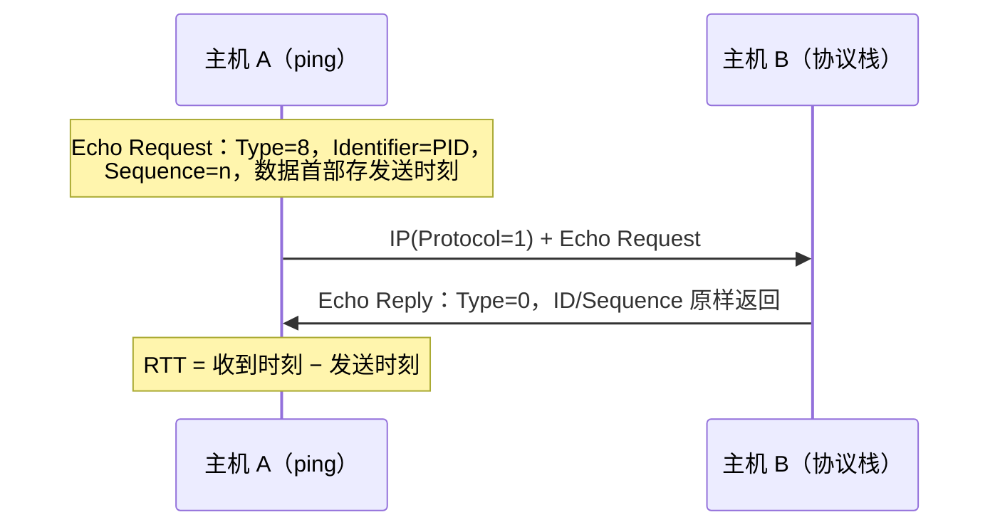
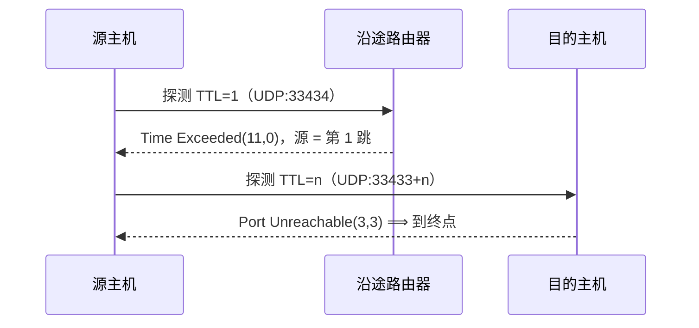

---
tags:
  - 基本功/网络
---

# ICMP 与 ping

`ICMP`（Internet Control Message Protocol，互联网控制报文协议）是 IP 层的辅助协议，报文封装在 IP 数据报里，靠 IP 首部的 `Protocol = 1` 标识（来源：RFC 792）。它把「对端是否可达」和「哪里出了问题」在网络层内部报回源端，既不替上层补可靠性，也不改 IP 尽力而为的语义。`TTL`、分片与 `DF` 位在 [[08-IP 协议与路由]] 已展开，本篇只引用。

## 1. 定位与封装

差错反馈由 IP 同层承担：IP 不保证送达、不维护流状态，而「无路由」「`TTL` 减到 0」「包超过出接口 MTU 且 `DF` 置位」这类事件只发生在网络层内部，上层看不见，只能由 ICMP 报回原因（来源：RFC 1122 §3.2.2）。按 `Type` 的用途分两类：**查询报文**用于主动探测，如 `Echo Request`(8) / `Echo Reply`(0)；**差错报文**用于报告处理失败，如 `Destination Unreachable`(3)、`Time Exceeded`(11)、`Redirect`(5)、`Parameter Problem`(12)（来源：RFC 792）。

`ping` 与 `traceroute` 是用户态程序，报文走完整封装：加 IP 首部（`Protocol = 1`）与 MAC 首部后发到链路；差错报文按普通路由返回，源地址是发出差错的那台设备，所以它自己也会被丢、被绕远（见 [[14-Linux 内核收发网络包]]）。IPv6 用 `ICMPv6`（下一首部值 `58`）（来源：RFC 4443 §1）。

## 2. 报文格式

ICMP 报文前 4 字节固定为 `Type`、`Code`、`Checksum`，后 4 字节统一叫 `Rest of Header`，含义完全由 `Type` 决定（来源：RFC 792）。

```text
   ICMP 首部（RFC 792）

   ┌────────┬────────┬──────────────────┐
   │Type(8) │Code(8) │  Checksum (16)   │
   ├────────┴────────┴──────────────────┤
   │   Rest of Header (32)，随 Type 变   │
   ├────────────────────────────────────┤
   │ 数据：差错报文放原数据报的 IP 首部  │
   │       与前 8 字节；查询放回显数据   │
   └────────────────────────────────────┘

   Rest of Header 的四种读法
     Echo(8/0)        ├─ Identifier(16) + Sequence Number(16)
     差错(3/11/4/12)  ├─ unused(32)；4 号低 16 位是 Next-Hop MTU
     Redirect(5)      ├─ Gateway Internet Address(32)
     Parameter(12)    └─ Pointer(8) + unused(24)
```

`Checksum` 覆盖整条 ICMP 报文（不含外层 IP 首部），计算时该字段置 0（来源：RFC 792）。差错报文的数据区放「触发错误的那条数据报」的 IP 首部与至少前 8 个数据字节（来源：RFC 792；RFC 1122 §3.2.2），这 8 字节对 TCP/UDP 正好覆盖源端口、目的端口与部分序号，接收方据此把差错交给正确的套接字。

## 3. 查询报文与 ping

`ping` 只用一对查询报文，`Echo Request`(8) 发出、对端回 `Echo Reply`(0)（来源：RFC 792）。收到请求后内核协议栈自动组装应答：源、目的地址对调，`Type` 改 `0`，校验和重算，数据区原样回显。



`Identifier` 相当于 TCP/UDP 的端口：一台主机上可能同时跑多个 `ping`，回包靠这个 16 位字段区分交给谁，iputils 取进程 `PID`（来源：iputils `ping(8)`）。`Sequence Number` 从 `0` 起每条请求加 1（来源：RFC 792）。**一处判据要记清：`ping` 报的「丢包」指的是「超时前没收到对应应答的比例」，衡量探测往返是否完整，与链路层真实丢包率不是一回事**——ICMP 被中途丢弃、被目标限速、回程被丢，都计入这个比例。

RTT 由发送方自己算，不依赖时钟同步：把发送时刻写进数据区，收到应答时取差（来源：iputils `ping(8)`）。统计行 `rtt min/avg/max/mdev` 里，`min` / `avg` / `max` 是最小、平均、最大值，`mdev` 是总体标准差，衡量抖动幅度；数据区默认 56 字节。

| 参数 | 改什么 | 默认与边界 |
| --- | --- | --- |
| `-c` | 发够 count 个后停止 | 默认无限 |
| `-i` | 请求间隔（秒） | 默认 1 秒；小于 `0.2` 需 root |
| `-s` | 数据区字节数（不含 8 字节 ICMP 首部） | 默认 56 |
| `-W` | 等单个应答的超时（秒） | 无应答时才生效，否则等两个 RTT；`0` 无上限 |
| `-M do` | 置 `DF` 位，超 MTU 的包被内核拒绝 | 另有 `want` / `probe` / `dont` |
| `-f` | flood，收到回包立刻发下一个 | 零间隔需 root |

`-f` 与小于 `0.2` 秒的 `-i` 需要 root：二者改的是发包速率，`-f` 以「回包速度或每秒 100 次中较快者」发包，限制普通用户是为了避免单个进程打满链路的 ICMP 份额（来源：iputils `ping(8)`）。

## 4. 差错报文的类型与 code

某一跳无法继续处理数据报时，构造差错报文按普通路由发回源地址，发送方读 `Type` 与 `Code` 就知道失败的位置与原因。

`Destination Unreachable`(3) 表示数据报无法送达（来源：RFC 792；`6–12` 由 RFC 1122 §3.2.2.1 追加，`13` 由 RFC 1812 §4.3.3.1 定义）：

```text
   Destination Unreachable（Type = 3）主要 code

   ┌──────┬────────────────────────────────┬──────────┐
   │ Code │ 含义                           │ 发出方   │
   ├──────┼────────────────────────────────┼──────────┤
   │  0   │ net unreachable    网络不可达   │ 路由器   │
   │  1   │ host unreachable   主机不可达   │ 路由器   │
   │  2   │ protocol unreachable 协议不可达 │ 目的主机 │
   │  3   │ port unreachable   端口不可达   │ 目的主机 │
   │  4   │ fragmentation needed, DF set   │ 路由器   │
   │  13  │ administratively prohibited    │ 路由器   │
   └──────┴────────────────────────────────┴──────────┘
```

**谁发的、多可信**：`0`、`1`、`4`、`5` 由沿途路由器发出，`2`、`3` 由目的主机发出（来源：RFC 792）。`code 1` 的典型触发是路由器在直连网段上 ARP 不到目的主机，现象是同网段内 `ping` 报 `Destination Host Unreachable`；`code 3` 是目的主机上目标 UDP 端口没有进程监听，`nc -u` 报 `Connection refused` 往往就是收到了它（UDP 套接字把 `code 3` 映射成 `ECONNREFUSED`）。RFC 1122 §3.2.2.1 要求把 `code 0`、`1` 当作提示而非证明，偶发 `Destination Host Unreachable` 之后又能 `ping` 通，多半是路由或 ARP 的瞬时抖动；管理性禁止码（`6–12`、`13`）来自设备策略，`code 13` 在 `traceroute` 里显示为 `!X`。**`code 3` 是 `traceroute` 的终点信号**：默认 UDP 探测打在没人监听的高端口上，目的主机必然回 `code 3`。

`Time Exceeded`(11) 有两个 `Code`（来源：RFC 792）：`code 0` 由路由器发出，`TTL` 减到 0 时丢弃并回报，是 `traceroute` 的机制基础；`code 1` 由目的主机发出，表示分片在重组时限内没收齐，指向**重组超时**而非转发超时（见 [[08-IP 协议与路由]]）。

`code 4` 的触发是出接口 MTU 小于数据报长度、`DF` 位又为 1。为了支持路径 MTU 发现，路由器**必须**把下一跳网络的 MTU 放进 `Rest of Header` 的低 16 位，高 16 位保持为 0（来源：RFC 1191 §4）：

```text
   Type = 3, Code = 4 的 Rest of Header（RFC 1191 §4）

   ┌───────────────────┬─────────────────────────┐
   │   unused = 0 (16) │    Next-Hop MTU (16)    │
   └───────────────────┴─────────────────────────┘
   低 16 位＝下一跳最大可转发数据报（八位组，含 IP 首部，≥ 68）
```

主机收到后**必须**按 `Next-Hop MTU` 下调对应路径的 PMTU 估计（来源：RFC 1191 §3）。

其余几条：**`Redirect`(5)** 在路由器发现主机首跳次优时回报建议路由（来源：RFC 792）；它极易被伪造，Linux 由 `net.ipv4.conf.*.accept_redirects` 控制，非受信网络通常关闭。**`Parameter Problem`(12)** 用 `Pointer` 指出出错字节偏移，出现它通常意味着两端对某段头部的解析不一致（来源：RFC 792）。**`Source Quench`(4)** 想让源端降速，实践中造成不公平，已经作废（来源：RFC 1812 §4.3.3.5），拥塞控制交给 TCP 自己做（见 [[05-TCP 协议]]）。

## 5. ICMP 的收发规则

差错报文由差错触发，不加约束会自我放大：一个出错报文触发一条差错报文，这条再出错又触发一条；广播场景更危险，一台设备回报后，全网收到又各自回报。RFC 1122 §3.2.2 因此列出五类**不得回应差错报文**的情况：

| 收到的数据报 | 不得回报的原因 |
| --- | --- |
| 一条 ICMP 差错报文 | 防止「报差错的消息再报差错」无限循环 |
| 目的地址为 IP 广播或多播 | 防止回报的消息被全网各自再回报，形成广播风暴 |
| 作为链路层广播发出的数据报 | 链路层广播可能不等于 IP 层广播，要单独判 |
| 非首个分片（fragment offset ≠ 0） | 只有首片带完整传输层首部，对后续分片报错无法定位到上层 |
| 源地址不能唯一标识单台主机 | 回报无处可去，或会打到不该打的地方 |

这些限制**优先于**文档中其他任何要求发送差错报文的条款；规范的理由是不加约束会在广播场景引发风暴，让整段网络瘫痪一秒以上（来源：RFC 1122 §3.2.2 的 DISCUSSION）。RFC 792 用另一种说法表达同一件事：不对 ICMP 报文再发 ICMP，且只对分片的首片报错。「不发」之外还有「少发」：节点要用令牌桶给差错报文限速（来源：RFC 4443 §2.4(f)），这也是 `traceroute` 出现 `* * *` 的一个直接原因。

## 6. traceroute

`traceroute` 把 `TTL` 当成可编程的探针：从 `TTL = 1` 起逐次加 1 发探测包，第 `n` 跳路由器把 `TTL` 减到 0 后丢弃并回 `Time Exceeded`(11, code 0)，发送方据此拿到第 `n` 跳的地址，重复到探测包抵达目的主机（来源：RFC 792；Linux `traceroute(8)`）。



终点靠「端口不可达」判定：默认 UDP 探测的端口从 `33434` 起逐个加 1，目的主机没人监听，回 `code 3` 即说明到达。三种探测方式改的正是「用哪种包去撞」：`-U` 用 UDP（默认）；`-I` 用 `Echo Request`（能 ping 通就能用，中间设备拦 ICMP 时一路 `* * *`）；`-T` 用 `TCP SYN`，默认 `80` 端口，走目标服务本来就允许的端口，最不易被拦。

某跳打印 `* * *` 表示该 `TTL` 的三个探测都没收到回应，成因三类：**限速**（路由器限制 `Time Exceeded` 速率，放慢后恢复即属此类）、**过滤**（该设备不回 ICMP，或防火墙丢弃了 `Time Exceeded`）、**真的没有回应**。还有一种**假象**：自适应超时算法可能过早判定超时，给固定超时（`-w 5`）即可排除。

## 7. MTU 与 PMTU 黑洞

路径 MTU（PMTU）是这条路径上所有链路 MTU 的最小值。发送方靠 `DF` 位与 `code 4` 联合探出它：`DF` 置 1 后包不会被中途分片，某跳 MTU 更小时路由器丢弃并回 `code 4`，其中带着 `Next-Hop MTU`（来源：RFC 1191 §3、§4）。**黑洞怎么发生**：`code 4` 一旦被防火墙或云安全组丢弃，发送方永远收不到「包太大」的反馈，于是反复发同样大小的包、反复被静默丢弃。典型症状是**小包通、大包不通**：TCP 三次握手能建连，传数据后装不下的大段被丢，表现为 `telnet` 连得上端口但登录后卡死。

```text
   用 ping 二分定位路径 MTU（DF 置位，从 1472 起）
   整长 = -s 数据 + 8(ICMP) + 20(IP)，1500 对应 -s 1472

   -M do -s 1472 ──▶ 通 ──▶ 路径 MTU ≥ 1500
        │ 不通（回 code 4，带 Next-Hop MTU）
        ▼
   -M do -s 1400 ──▶ 通 ──▶ 区间收缩到 (1400, 1472)，反复取中点
        │ 一路缩到 -s 1200 仍不通 ──▶ 路径 MTU < 1228，或 ICMP 黑洞
```

判据在报错文本上：`ping -M do -s 1472 <host>` 失败时报 `Frag needed and DF set`，说明收到了 `code 4`（路径没有黑洞，只是 MTU 更小，继续二分）；报 `Request timeout` 说明 `code 4` 也被丢了，这是黑洞。常见平台值：以太网 `1500`、PPPoE `1492`、IPv6 最小 MTU `1280`（来源：RFC 1191 Table 7-1）。内核兜底是 `net.ipv4.tcp_mtu_probing`（见 [[08-IP 协议与路由]] §9.3）。

## 8. ICMP 被丢弃的后果

很多云厂商、安全组和加固镜像默认丢弃 ICMP，最直接的可观测后果是 `ping` 不通不代表服务不可达：`ping` 测的是「ICMP Echo 能否往返」，与「TCP 端口能否连上」是两件事，目标完全可以静默 ICMP 同时正常提供 HTTP。判断服务可用性要用 TCP 层工具（`curl`、`nc -vz`、`ss`）。`traceroute` 在云内网里常常一路 `* * *`，因为中转设备不产生 `Time Exceeded`、公网出口也常拦 ICMP。正确顺序是先用 `ping` 判断「是不是 ICMP 被拦」，再用 TCP 探测判断「服务是否正常」。

**「禁 ping」不等于安全。** ICMP 能用于探测存活主机与拓扑，但整个丢掉会打断路径 MTU 发现，制造出第 7 节那些黑洞，而扫描器本来就用 TCP SYN 探开放端口。标准折中是**限速**而非封禁。观测落点是 `/proc/net/snmp` 与 `nstat -az | grep -i icmp` 里的 `Icmp*` 计数：看增量而非累计值，才能区分「本来就有零星收发」与「策略刚改、量突然归零」。

## 9. 环回地址与 lo

`127.0.0.0/8` 整个网段都是回环地址，`127.0.0.1` 只是其中约定的一个。规范要求这类地址不得出现在主机之外（来源：RFC 1122 §3.2.1.3(e)）；IANA 特殊用途地址注册表把它登记为 `Loopback`，标注为不可转发（来源：RFC 6890 表 4）。

Linux 上每台主机都有一个 `lo` 接口，配着 `127.0.0.1/8`。路由匹配先看 `ip rule`，最高优先级那条是 `lookup local`（见 [[08-IP 协议与路由]] §4.5），回环地址与所有本机地址都记在 `local` 表里，条目由内核在配地址时自动生成、指向 `lo`：`ip route get 127.0.0.1` 输出 `local 127.0.0.1 dev lo src 127.0.0.1`。命中 `local` 表后包交给 `lo`，由回环驱动在软件里交回本机协议栈的接收路径，全程不碰物理网卡，也不依赖 DHCP（见 [[11-主机接入网络：DHCP 与地址配置]]、[[14-Linux 内核收发网络包]]）——**拔掉网线仍能 `ping` 通 `127.0.0.1`**。

**回环流量也过 `netfilter`**：默认策略设成 `DROP` 后若没显式放行 `lo`，本机进程之间的连接也会被丢，很多后端进程靠 `127.0.0.1` 通信，会成片不可用。标准写法是 `iptables -A INPUT -i lo -j ACCEPT` 与 `iptables -A OUTPUT -o lo -j ACCEPT`。

## 10. localhost 与 0.0.0.0

`localhost` 是主机名而非地址，由名字解析机制还原：glibc 按 `/etc/nsswitch.conf` 里 `hosts:` 一行的顺序查表，常见配置 `files dns` 表示先查 `/etc/hosts` 再查 DNS（来源：`hosts(5)`）。多数发行版的 `/etc/hosts` 同时写着 `127.0.0.1 localhost` 与 `::1 localhost`，于是 `localhost` 解析出两个地址，`getaddrinfo` 返回的顺序由 RFC 6724 的目的地址选择规则决定，`::1` 可能排在前面。**一个真实的失败模式：** 服务只监听 `127.0.0.1`，客户端用 `localhost` 却先连 `::1`，在 IPv6 回环上吃到 `Connection refused`；把 `localhost` 换成 `127.0.0.1` 就能定位。

同一个 `0.0.0.0` 在两个位置含义相反：作**目的地址**表示 `This host on this network`，不能作为目的地址转发，`ping 0.0.0.0` 直接失败；作**源地址或监听地址**表示本机任意地址（`INADDR_ANY`），监听时绑本机全部 IPv4 地址。前者来自 RFC 1122 §3.2.1.3(a)，后者是 `bind()` 层的行为。`ss -lntp` 里 IPv4 通配绑定显示 `0.0.0.0:80`、IPv6 通配显示 `[::]:80`。

## 11. ping 回环与 ping 本机 IP

`ping 127.0.0.1` 与 `ping <本机网卡 IP>` 在 Linux 上都走 `lo`、都不出网卡。原因是第 9 节那条机制：内核为每个本机地址在 `local` 表里生成一条 `dev lo` 的路由，`ip route get <本机 IP>` 直接返回 `local <本机 IP> dev lo src <本机 IP>`。两者唯一的差别是目的地址不同，这正是「本机地址属于本机」在路由层的体现：目的地是自己，就不该往外绕。

这一点纠正了一个流传很广的说法：ping 本机 IP 会「经过网卡发出去、撞到第一个路由器、再绕回来」。真实行为是内核查路由时就知道目的地是本机，直接把包交给 `lo`，报文根本没进网卡；在物理网卡上抓包看不到这段流量，这不是丢包——它从没经过那里。接口 down 或地址被删时，`local` 表里对应条目随之消失，因为地址的配置动作同时建立了这条本地路由。

## 12. 常见故障与排查

| 输出 | 谁给出的信号 | 判据 | 先查什么 |
| --- | --- | --- | --- |
| `Destination Host Unreachable` | 收到了 ICMP 差错报文（多为 `code 1`，少数 `code 0`） | 路径上至少有一跳到得、且愿意回报不可达，说明网络本身通 | `ip route get <目标>` 看路由；`arp -n` 看下一跳 MAC |
| `Request timeout` | 什么都没收到 | 探测包或回包被丢/被拦，或目标根本不回 | 先确认目标在线、ICMP 是否被安全组拦，再用 TCP 探测区分 |
| `DUP!` | 同一个 `Sequence` 收到多份应答 | 有重复来源，链路或地址层异常 | 抓包看源 MAC；`arping -D` 查地址冲突 |
| `ping: socket: Operation not permitted` | 本地权限不足 | 连套接字都建不起来，与网络无关 | `sysctl net.ipv4.ping_group_range`；确认二进制有无 `CAP_NET_RAW` |

关键区别是**有没有 ICMP 反馈**：`Destination Host Unreachable` 说明路由/ARP 这一层明确失败并能回报，`Request timeout` 说明反馈链路本身是断的。若前者原文是 `Destination Net Unreachable`（`code 0`），问题更靠前——本机没有到该网段的路由，先看默认路由。按 RFC 1122 §3.2.2.1 的提醒，偶发的 `code 0/1` 只是提示，不能据此判定网关永久失效。

端到端能 `ping` 通、`traceroute` 却从第 N 跳起变成 `* * *`，通常是第 N 跳或更后面的某台设备不回 `Time Exceeded`（限速、过滤或策略）。判据是「端到端连通」与「中间跳可见性」互不影响：中间跳不产生差错报文，不代表包不能穿过它。换成 `-T` 或 `-I` 再试，若其中一种能出数据就说明是该协议族被拦。

`DUP!` 的三种成因：**IP 地址冲突**（两台主机配了同一个 IP，用 `arping -D -I eth0 <IP>` 确认）、**交换机环路**（广播/未知单播在环路里被复制，见 [[12-交换机与路由器：两种转发机制]] 与 [[13-STP、RSTP 与 MSTP]]）、**多路径与链路层重传**（多条等价路径同时送达，或误码后重传，通常间歇出现）。抓包看同一个 `Identifier` / `Sequence` 是否来自不同源 MAC，是把「地址冲突」与「链路重复」分开的关键。

「小包通、大包卡死」的现场排查走第 7 节那条链：先 `ping -M do -s <逐渐变小>` 找出确切的分界长度，再 `traceroute` 看是哪一跳之后开始丢，最后判断该跳是回了 `code 4` 被中间设备丢掉（黑洞），还是压根没回。把分界长度换算成整长（数据 + 8 + 20），对照 `1500` / `1492` / `1280` 这几个已知 MTU：能对上说明只是 MTU 更小，对不上则更像 MTU 之外的路径问题。应用层还有两条独立线索——`curl` 小响应正常、大响应在传输中卡住，`ssh` 登录成功但一执行 `ls` 就挂住，都是同一现象的不同表现。

`ping: socket: Operation not permitted` 来自权限：`ping` 需要构造 ICMP 报文，要么有 `CAP_NET_RAW`，要么用内核提供的 ICMP datagram socket（`SOCK_DGRAM` + `IPPROTO_ICMP`）。是否允许普通用户创建后者由 `net.ipv4.ping_group_range` 决定，默认值是 `1 0`——起始组号大于结束组号，等于空区间，任何普通组都不允许（来源：内核文档 `Documentation/networking/ip-sysctl.rst`）；容器与加固镜像常保留这个默认值。修法两种：给 `ping` 二进制 `CAP_NET_RAW`（或 `setuid root`），或放宽组号范围（`sudo sysctl -w net.ipv4.ping_group_range="0 2147483647"`，持久化写进 `/etc/sysctl.d/`）。判据是「`sudo ping` 能通、普通用户不能」——出现这个组合，问题在权限而不是网络。

## 相关

- [[08-IP 协议与路由]] —— 母篇：`TTL` 与 `Protocol = 1`、`DF` 位、转发路径与 `local` 表
- [[05-TCP 协议]] —— PMTU 黑洞在 TCP 侧的处置、`MSS` 与路径 MTU 的关系
- [[14-Linux 内核收发网络包]] —— 回环包在内核里的收发路径、软中断与 ICMP 计数的落点
- [[11-主机接入网络：DHCP 与地址配置]] —— 回环不依赖 DHCP 的原因、地址配置与 `local` 表的生成
- [[00-网络专栏导览]] —— 本专栏的边界、目录与阅读顺序

## 参考

- J. Postel, ed. *Internet Control Message Protocol*. RFC 792, September 1981. https://www.rfc-editor.org/rfc/rfc792
- R. Braden, ed. *Requirements for Internet Hosts — Communication Layers*. RFC 1122, October 1989. https://www.rfc-editor.org/rfc/rfc1122
- F. Baker, ed. *Requirements for IP Version 4 Routers*. RFC 1812, June 1995. https://www.rfc-editor.org/rfc/rfc1812
- J. Mogul, S. Deering. *Path MTU Discovery*. RFC 1191, November 1990. https://www.rfc-editor.org/rfc/rfc1191
- A. Conta, S. Deering, M. Gupta, ed. *Internet Control Message Protocol (ICMPv6) for the Internet Protocol Version 6 (IPv6) Specification*. RFC 4443, March 2006. https://www.rfc-editor.org/rfc/rfc4443
- R. Hinden, S. Deering. *IPv4 and IPv6 Special-Purpose Address Registries*. RFC 6890, April 2013. https://www.rfc-editor.org/rfc/rfc6890
- iputils. *ping(8)*. https://man7.org/linux/man-pages/man8/ping.8.html
- Linux man-pages. *traceroute(8)*. https://man7.org/linux/man-pages/man8/traceroute.8.html
- Linux man-pages. *hosts(5)*. https://man7.org/linux/man-pages/man5/hosts.5.html
- 小林coding. *图解网络 v4.0*. https://xiaolincoding.com/network/
- 小白debug. *断网了，还能 ping 通 127.0.0.1 吗？*. 微信公众号「小白debug」.
